# 第三章 PLC、通信与运动控制（Q41–Q55）

> 所属模块：模块三：PLC、通信与运动控制（Q41–Q55）

## 第41问：PLC 在机器视觉系统中最核心的作用是什么？请说明“触发—采集—处理—输出”的完整协同流程。

### PLC 在机器视觉系统中最核心的作用是什么？请说明“触发—采集—处理—输出”的完整协同流程。

#### 41.1 什么是 PLC？它在工业自动化中承担什么角色？

**PLC（Programmable Logic Controller，可编程逻辑控制器）**是面向工业现场长期、连续运行设计的控制器。它通过程序存储器执行逻辑运算、顺序控制、定时、计数和算术运算，并通过数字量或模拟量 I/O（输入/输出）连接传感器、执行器、电机、阀岛、变频器以及上下游设备。

在机器视觉系统中，PLC 的核心作用不是替代视觉算法，而是把视觉单元纳入整条产线的**时序与执行闭环**：相机何时采图、何时收到结果、何时执行剔除、发生故障时何时停线，都需要由 PLC 或同等级的运动控制器统一协调。视觉系统负责“看见目标并作出判断”，PLC 负责把判断转换成**可执行、可追溯、可联锁**的工业动作。

#### 41.2 视觉系统在工业自动化中主要完成哪些任务？

视觉系统承担的是**非接触式感知与判定**，常见任务包括有无检测、缺陷识别、尺寸测量、字符识别、条码读取、定位引导和分拣判定。工业相机先采集图像，再由视觉处理器或智能相机内部算法完成分析，最后输出 OK/NG 结果、位置坐标、尺寸数据或缺陷类别。

视觉系统必须嵌入自动化节拍。只有当它与 PLC、触发传感器、编码器和剔除机构之间的时序关系建立起来，检测结果才具有生产意义；一个无法对应到正确工件和正确时刻的分类结果，不能直接用于现场动作。

#### 41.3 工业相机选型需要关注哪些核心参数？

在传感器类型和接口协议大致确定后，通常需要同时检查**快门类型、分辨率、帧率、像元尺寸、传感器靶面和接口能力**。其中，快门方式对运动场景的适用性影响很大，选错后往往难以通过参数调整补救。

**全局快门**在同一个曝光窗口内同步曝光整幅图像，适合传送带飞拍、机器人运动拍摄以及要求几何形状稳定的场景。**卷帘快门**按行依次曝光，成本较低，在同等传感器尺寸下有时能提供更高分辨率，适合静止、低速或对几何变形不敏感的检测。

卷帘快门并非绝对不能用于工业场景，但必须结合目标速度、逐行曝光时序、允许变形量和最终判定指标评估。涉及尺寸、角度、轮廓位置或缺陷边界的测量，通常优先选择真正的全局快门。部分高端 CMOS 传感器采用全局复位卷帘结构，可以减轻部分运动伪影，但在严格高速检测中仍不能等同于全局快门。

#### 41.4 飞拍时如何控制运动模糊？

飞拍是指目标仍在运动时完成曝光。除了使用全局快门，还需要让曝光与高亮度频闪光源同步，并把曝光时间压缩到运动位移不超过允许模糊量。把运动模糊简化为曝光期间的线性位移，可写成

$$
\Delta x=v t_{exp}
\tag{41-1}
$$

其中，\(\Delta x\) 是曝光期间的位移，\(v\) 是目标相对速度，\(t_{exp}\) 是曝光时间。该式不是完整的成像模型，但能给出一阶设计约束：速度越高，允许的曝光时间越短；如果曝光变短后光量不足，应从频闪功率、镜头通光能力和安装几何共同解决，不能简单延长曝光。

#### 41.5 镜头选型中最容易忽略哪些匹配关系？

除了焦距、工作距离和光圈，还要重点检查两件事：**镜头靶面是否覆盖传感器有效区域**，以及镜头在目标空间频率附近的解析能力是否与相机像元匹配。

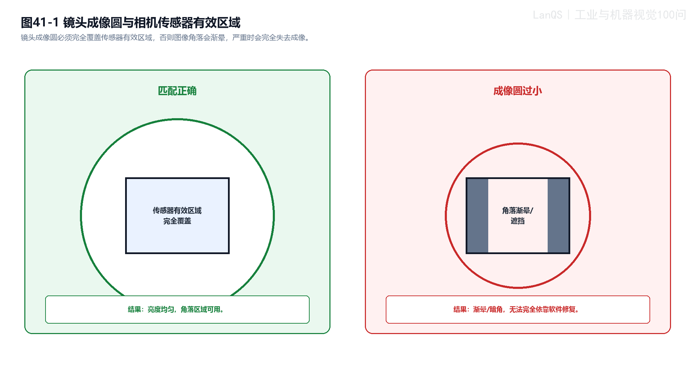

<strong>图41-1 镜头靶面与相机传感器有效区域的关系</strong>

图中要判断的是镜头形成的有效成像圆是否覆盖传感器。如果靶面小于传感器对角线，图像边缘会先变暗，随后出现渐晕，严重时边缘完全没有可用图像。对于测量、缺陷检测和 OCR，这属于前端光学匹配错误，后端算法无法可靠补回从未采集到的图像区域。

镜头数据手册标注的最大支持靶面应大于或等于相机传感器实际靶面。诸如“1 英寸”“2/3 英寸”等名称是历史行业标记，不等于真实几何尺寸，工程选型应核对传感器的宽度、高度和对角线。

镜头还必须在相机采样上限附近保留足够对比度。奈奎斯特频率可近似写成

$$
f_N=\frac{1000}{2p}
\tag{41-2}
$$

其中，\(f_N\) 的单位为 lp/mm，\(p\) 是以 μm 为单位的像元尺寸。这个频率表示传感器的理论采样边界，不代表镜头天然能够达到的光学分辨率。工程上常先检查约 \(0.7f_N\) 处的镜头 MTF（调制传递函数）是否还有足够余量。一般检测可把 MTF 约 0.2 作为基础可用性参考，高精度测量和边缘定位则通常需要更高数值。

例如，像元尺寸为 2.4 μm 时，奈奎斯特频率约为 208 lp/mm。如果镜头在该频率附近的 MTF 已明显衰减，即使相机像素数量很高，系统的有效细节恢复能力仍会受镜头限制。

#### 41.6 “触发—采集—处理—输出”如何形成完整闭环？

触发采图与结果返回是两条不同的链路：前者负责在正确的物理时刻曝光，后者负责把判断结果传回控制器并驱动后续动作。

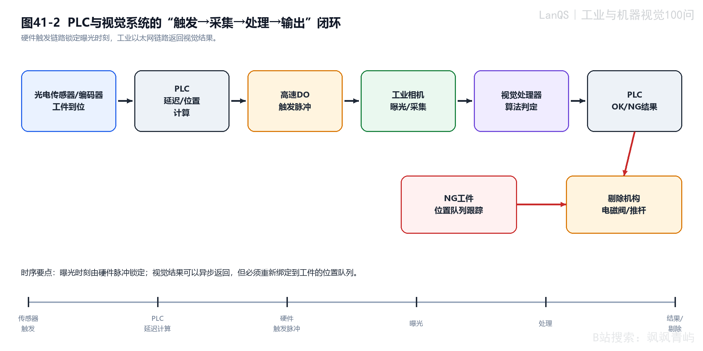

<strong>图41-2 PLC 与视觉系统的“触发—采集—处理—输出”闭环</strong>

图41-2上方是一次检测任务从位置感知到结果判定的主链路，下方补充了容易被忽略的**位置队列**。曝光时刻由硬件触发脉冲锁定，视觉结果可以异步返回，但返回值必须重新绑定到工件的位置队列，PLC 才能在正确工位对正确工件执行动作。图中最重要的工程判断是：曝光关注**时间确定性**，结果通信关注**可靠送达**，剔除动作则同时依赖结果与工件位置匹配。

#### 41.7 PLC 如何控制准确的采图时刻？

触发阶段要把“工件到位”转换成“相机在正确时刻曝光”。常见做法是由光电传感器检测工件前沿，PLC 再结合编码器脉冲、传送带速度或运动轴位置计算延迟或位置偏移，最后由高速输出或比较输出发出触发脉冲。

普通 PLC 数字输出不一定能够稳定承担高速采图触发任务。扫描周期、输出模块响应时间和程序结构都会影响确定性，许多场景只能达到毫秒级。若产线速度高、视场小或目标移动快，通常需要高速计数模块、运动控制器比较输出、编码器分频触发或分布式时钟同步。微秒级触发抖动需要整条链路共同设计，单纯更换高等级 PLC 并不能自动解决问题。

#### 41.8 相机如何响应 PLC 触发？

相机收到外部触发后，按照预设模式完成一次曝光。曝光结束后，许多工业相机会通过 **Strobe 输出**或曝光完成信号标记实际曝光窗口，图像数据则进入传输链路。触发输入决定“何时开始曝光”，数据接口决定“如何传输图像”，两者属于不同链路。

调试时，Strobe 信号可以帮助确认 PLC 认为的触发时刻是否真的对应相机曝光时刻；在频闪场景中，它还可以用于同步光源驱动，避免光脉冲与曝光窗口错位。

#### 41.9 视觉系统如何处理图像并把结果返回 PLC？

视觉处理器获得图像后，可执行边缘检测、模板匹配、OCR、缺陷检测或深度学习推理，并将结果整理成 PLC 可直接使用的字段，例如 OK/NG、尺寸值、缺陷类别、位置坐标和故障码。结果通常通过工业以太网、现场总线或设备 I/O 返回。

PROFINET、EtherNet/IP、EtherCAT 和 Modbus TCP 的名称本身不能保证固定延迟。实际周期和抖动取决于控制器性能、协议模式、网络拓扑、从站能力和现场负载。传统算法的处理时间常处于几十毫秒量级；较重的 AI 推理可能从几十毫秒延伸到数秒，必须与产线节拍共同设计。

#### 41.10 PLC 如何根据视觉结果驱动后续动作？

PLC 收到结果后，应先验证结果有效性，再确定它对应哪个工件，而不是无条件立即动作。合格品可以继续放行，同时进行计数、统计或追溯记录；不合格品则结合编码器位置或移位寄存器状态，在工件到达剔除工位时驱动气缸、推杆、分拣门或机械臂。

这一步的本质是把图像空间中的判断重新映射到产线中的具体工件。若系统没有稳定的工件跟踪，现场看似“视觉误判”的问题，实际可能是结果与位置绑定失败。

#### 41.11 工业现场最常见的系统性挑战是什么？

主要挑战包括触发精度、通信确定性和多设备同步。目标速度升高后，允许的曝光误差迅速缩小，触发延迟、输出抖动、频闪响应和相机内部时序都会影响结果。多相机、多光源、机器人和编码器共同运行时，还需要统一时间基准。

电磁干扰、温升、振动、粉尘、油污，以及超时、断线和误触发等异常，也会让理论上清晰的流程在现场变得脆弱。成熟的视觉闭环系统不仅要部署算法，还要把触发、通信、抗干扰、异常恢复和数据追溯一起纳入设计。

#### 41.12 相关技术的发展方向是什么？

智能相机适合小型单工位检测；工业 PC 和边缘设备可以在本地运行 AI 模型，减少原始图像上传带来的带宽压力；OPC UA（OPC Unified Architecture，统一架构）更适合控制层之上的语义数据交换；数字孪生和离线仿真则可以把部分现场试错提前到虚拟调试阶段。

无论系统形态如何变化，只要采图时刻仍然影响位置精度、几何稳定性或产线节拍，触发链路就仍应作为独立的硬实时问题处理。

#### 41.13 算例：曝光窗口、触发抖动与节拍预算

下面用一组**仅用于说明方法的示例数值**说明触发链路与处理链路为什么需要分别设计。假设传送带速度为 (v=0.5\,\mathrm{m/s})，允许运动模糊为 Δx=20 μm。由式（41-1）得到最大曝光时间：

$$
t_{exp}=\frac{\Delta x}{v}=40\,\mu\mathrm{s}
$$

若把普通 PLC 数字输出的一个毫秒级抖动点取为 1.0 ms，那么它相当于 1000 μs，是 40 μs 曝光窗口的 25 倍。这说明当目标速度较高且模糊预算很紧时，普通数字输出未必适合直接承担触发任务。

再把触发、曝光和处理时间相加：传统算法若取 20～50 ms 处理时间，总周期约为 21～51 ms；AI 推理若取 15～2000 ms，总周期约为 16～2001 ms。这里的数值只用于说明节拍预算，不能替代具体设备的实测结果。

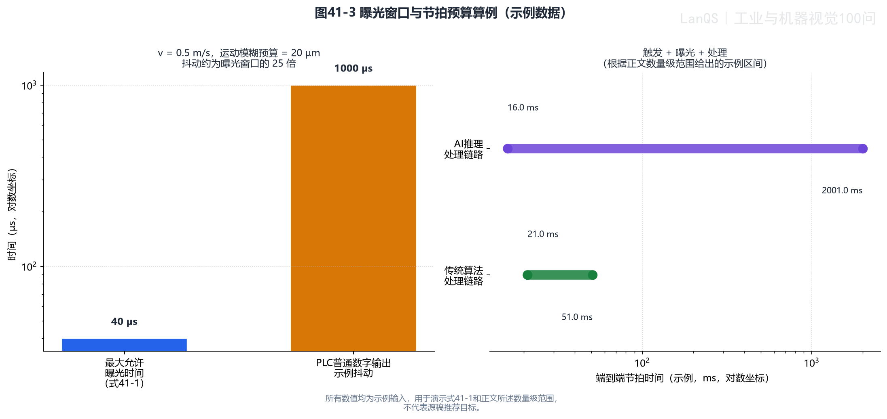

<strong>图41-3 曝光窗口、触发抖动与节拍预算算例（示例数据）</strong>

#### 41.14 工程上如何验收“触发—采集—处理—输出”链路？

验收时应把链路拆成可以单独测量的事件，而不是只观察最终的 OK/NG 结果。至少要记录传感器到位、PLC 输出触发、相机曝光或 Strobe、图像到达处理器、算法完成、结果写入 PLC 和执行器动作这几个时间点。对于高速产线，最好使用同一时间基准的示波器通道、相机时间戳或控制器日志；单次运行只能说明链路曾经成功，不能说明抖动边界。

验收数据应分别报告平均延迟、最大延迟和高分位延迟。若视觉结果需要绑定工件位置，还要同时记录编码器计数或移位寄存器状态，确认“结果编号”和“工件编号”在异常、漏拍、重复触发之后仍能保持对应。发现结果晚到时，先判断是曝光、传输、算法还是队列绑定环节变慢，再决定增加缓存、缩短曝光、优化算法或调整剔除位置；不能把所有问题都归因于 PLC 扫描周期。

这条链路的设计边界也需要提前写进验收条件：触发精度决定采样位置，曝光时间决定运动模糊，处理时间决定结果返回节拍，执行器响应决定最终动作位置。四者分别对应不同的误差来源，只有把它们放入同一张预算表，才能判断系统是否真正满足产线节拍。

### 常见误区

**把触发链路和结果返回链路当成同一条链路。** 采图时序与结果通信使用的机制和时间尺度不同。

**认为普通 PLC 数字输出一定能完成高速触发。** 是否满足要求要看扫描周期、输出响应、目标速度和允许模糊量。

**没有把视觉结果重新绑定到工件位置就直接剔除。** 异步返回的结果只有与位置队列重新对应后才具有动作意义。

**把镜头标称靶面当成真实几何尺寸保证。** 应核对数据手册中的传感器宽度、高度和对角线，靶面不足无法靠软件修复。

### 术语与符号表

**PLC**：可编程逻辑控制器，负责顺序控制、时序协调、设备联锁和动作执行。

**全局快门/卷帘快门**：前者整幅图像同步曝光，后者按行依次曝光；运动检测通常优先考虑全局快门。

**镜头靶面**：镜头能够形成可用图像的圆形区域，必须覆盖传感器有效成像区域。

**奈奎斯特频率 (f_N)**：传感器的理论采样上限，式（41-2）中由像元尺寸 (p) 决定，常用来检查镜头 MTF 余量。

**Strobe 输出**：相机标记实际曝光窗口的硬件信号，可用于核对触发与曝光的对应关系，也可同步频闪光源。

**位置队列绑定**：通过编码器位置、移位寄存器或其他追踪机制，把异步返回的视觉结果重新对应到正确工件。

**硬实时**：对响应时间和抖动都有明确上限的控制任务。高速触发是否满足硬实时，需要测量整条信号链，而不能只看某个设备的标称参数。

### 延伸阅读

可继续查阅 GenICam/GigE Vision 标准、工业相机触发与 Strobe I/O 手册，以及 IEC 62541 OPC UA 标准系列，重点关注触发时序、曝光确认和控制层以上的数据交换。

## 第42问：什么是硬触发？什么是软触发？为什么工业现场主要使用硬触发？

### 什么是硬触发？什么是软触发？为什么工业现场主要使用硬触发？

#### 42.1 什么是硬触发？

**硬触发**是通过外部硬件信号直接启动相机曝光的方式。触发源可以是光电传感器、接近开关、编码器分频输出、PLC 高速输出或运动控制器比较输出。信号以电脉冲形式直接进入相机硬件 I/O，相机再按照设定的触发模式完成曝光。

硬触发的价值不只是响应快，更在于触发时刻与物理事件之间的关系稳定、可测量、可重复。只要信号链设计正确，每次曝光都可以对应到工件到达、运动轴位置、编码器计数或共享时钟中的明确位置。因此，硬触发的核心是**时序确定性**，而不仅是低延迟。

#### 42.2 什么是软触发？

**软触发**通过软件命令启动采图，命令通常由 SDK（Software Development Kit，软件开发工具包）调用或通信协议发送。控制软件发出“采集一帧”的请求，相机收到并解析命令后才开始曝光。

软触发便于构建和修改，适合研发、实验室调试、低速检测和人工复拍。它的限制也来自同一条软件路径：命令需要经过操作系统调度、驱动层、协议栈以及总线或网络传输，容易受到软件负载、网络拥塞和系统状态变化影响。

#### 42.3 硬触发和软触发的根本区别是什么？

根本区别在于触发时刻是否由硬件时序直接锁定。硬触发由到达相机 I/O 的物理信号确定曝光开始时刻；软触发则由系统调度并最终发送软件命令来确定。前者容易获得确定性，后者更容易实现灵活的系统逻辑。

工程评价硬触发时，重点是延迟和抖动是否足够小且可重复；评价软触发时，重点是系统集成是否方便、逻辑是否容易修改，以及研发和调试是否高效。两者服务于不同的时序约束，不能简单按“先进”或“落后”排序。

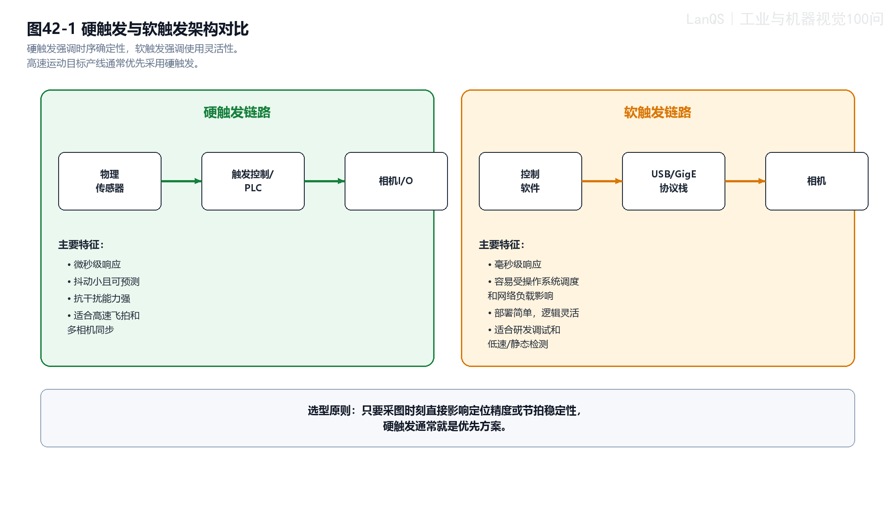

<strong>图42-1 硬触发与软触发的架构对比</strong>

左侧硬触发链路较短，传感器、PLC 或运动控制器直接与相机 I/O 闭环，因此曝光时刻更容易测量和标定。右侧软触发多经过控制软件和协议栈，获得了灵活性，也引入了操作系统、驱动和通信负载造成的额外变化。图中真正需要比较的不是“左边快、右边慢”，而是两条路径的误差来源不同：硬触发误差主要由硬件链和同步设计决定，软触发还要叠加软件调度和通信负载。只要曝光时刻直接影响定位精度或高速节拍，硬触发通常是主流方案。

#### 42.4 为什么工业现场主要使用硬触发？

产线需要在长时间连续运行中保持正确的采图位置，而不是偶尔采对一次。当工件处于运动状态、相机视场较小、缺陷尺寸较细，或多台设备需要同步时，曝光时刻会直接影响检测可靠性。硬触发更容易把曝光时刻控制在一个明确且有限的误差范围内。

硬触发还可以绕开操作系统调度和网络负载的不确定性，适合多相机同步、运动目标飞拍和节拍锁定。工业现场关心的是行为确定性：软触发的平均延迟即使可以接受，只要抖动没有得到控制，边界工况下仍可能产生明显误差。

#### 42.5 硬触发常见于哪些工业视觉场景？

典型场景包括高速传送带检测、机器人运动采图、多相机同步拍摄、编码器锁相飞拍，以及恶劣环境下的稳定到位检测。只要系统需要把一个明确的物理事件精确对应到一次曝光，硬触发通常更合适。

例如在高速包装线上，工件前沿通过传感器只代表“到达起点”。PLC 或运动控制器还要根据传送带速度和目标位置计算延迟，把工件送入最佳成像区域，再以硬件脉冲触发相机。如果换成软触发，命令链路的随机波动会直接转化为成像位置误差。

#### 42.6 什么情况下软触发更合适？

软触发适合研发调试、低速静态检测、人工采图、离线实验，以及时序精度要求不高的场景。当目标基本静止、视场较大、采图时刻只需大致正确时，软触发可以明显简化系统构建。

硬触发和软触发也可以在混合系统中共存：高速自动检测使用硬触发保证节拍和定位精度，人工复检、抽样和维护模式保留软触发，方便工程人员逐帧采集和排查。此时必须明确两种模式的适用边界。

#### 42.7 硬触发和软触发的融合趋势是什么？

现在的相机和视觉控制器越来越多地同时支持硬触发与软触发，便于在自动运行和维护调试之间切换。事件驱动架构也更加常见：硬件触发锁定曝光时刻，软件流水线负责处理、记录和结果上报。TSN（Time-Sensitive Networking，时间敏感网络）、分布式时钟和边缘计算改善了控制网络的时间一致性，但它们不能自动替代相机硬件 I/O 在曝光层面的时序控制。

因此，融合趋势并不意味着硬触发会退出工业现场。更常见的分工是：硬触发负责关键物理时刻，软触发负责管理、调试和非关键时序任务。时间要求越严格，这种分工越重要。

#### 42.8 算例：触发抖动如何转换为运动位置误差？

下面用两组**仅用于说明数量级的示例值**计算触发抖动造成的位置误差：硬触发抖动取 5 μs，软触发抖动取 5 ms。位置误差的一阶估算式为

$$
e_x=v\,\Delta t
$$

其中 (v) 是产线速度，Δt 是触发抖动。

当传送带速度为 1.0 m/s 时，硬触发造成的误差约为 0.005 mm，软触发约为 5.0 mm；速度为 2.0 m/s 时，两者分别约为 0.01 mm 和 10.0 mm。误差比为 1000 倍，只是因为示例中采用的抖动比为 1000 倍，并不是所有设备都固定具有这一比例。

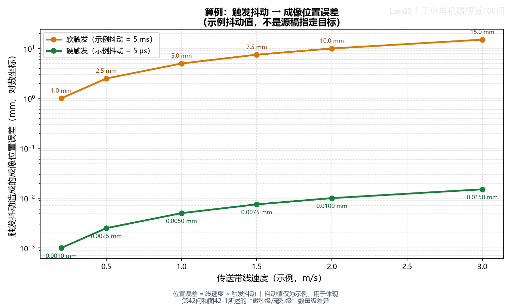

<strong>图42-2 触发抖动转换为运动位置误差的算例（示例数据）</strong>

#### 42.9 如何在现场验证硬触发和软触发的差异？

验证时应先固定同一台相机、同一曝光时间、同一目标速度和同一处理流程，只替换触发方式。连续采集足够多的周期，分别记录“触发命令到实际曝光”的延迟，并计算平均值、最大值、标准差或 P99。随后用 \(e_x=v\,\Delta t\) 把时间抖动换算为物方位置不确定度，再与允许的定位误差或缺陷尺寸比较。

这个换算只描述触发时刻造成的误差。传感器本身的响应延迟、PLC 输入滤波、编码器量化、相机内部排队和机械振动还会叠加到总误差中，因此不能用一次软触发测量结果直接代表整套系统的定位能力。静止目标或人工点检可以接受较大的时间波动；连续运动、拼接、飞拍和位置剔除则应优先验证位置确定性。

如果软触发已经满足误差预算，仍应检查通信断线、主机负载变化和多任务并发时的最坏延迟。硬触发也不能免除这一步，因为硬件只锁定了曝光起点，图像传输、算法处理和结果回传仍然可能产生不确定性。

### 常见误区

**只看软触发平均延迟。** 工业可靠性更关注抖动，平均值合格不代表边界工况下稳定。

**把硬触发和软触发的选择理解为单纯比速度。** 真正的判断轴是确定性与灵活性；低速、静止、大视场任务完全可能使用软触发。

**认为 TSN 或边缘计算可以替代硬件 I/O 时序。** 网络时间同步改善的是网络层一致性，不能自动提供曝光层硬件确定性。

**跳过从物理事件到采图时刻的延迟计算。** 传感器发出的到位脉冲通常只是起点，PLC 或运动控制器还要根据位置和速度计算延迟。

### 术语与符号表

**硬触发**：由传感器、PLC、编码器或运动控制器发出硬件脉冲，直接启动相机曝光。

**软触发**：通过 SDK 或通信协议发送软件命令启动采图，系统灵活但更容易受到调度和通信变化影响。

**抖动（jitter）**：触发到实际曝光之间延迟的重复波动，是工业时序可靠性的重要指标。

**飞拍**：目标运动过程中完成采图，通常需要编码器或其他位置基准锁定曝光时刻。

**TSN**：时间敏感网络标准族，用于改善控制网络中的时间一致性，但不等同于相机曝光硬件同步。

**事件驱动架构**：由硬件事件锁定关键时刻，再由软件完成后续处理、记录和结果上报的系统结构。

### 延伸阅读

可查阅 GigE Vision、USB3 Vision 设备控制规范，以及相机或采集卡厂商关于触发和 Strobe 时序的手册。TSN 的网络时间同步背景可参考 IEEE 802.1 相关标准资料。

## 第43问：硬触发通常使用什么电平信号？NPN/PNP 和 24 V 应如何理解？

### 硬触发通常使用什么电平信号？NPN/PNP 和 24 V 应如何理解？

> **术语提醒：** NPN/PNP 描述的是传感器输出晶体管的导通方式；source/sink、共阳/共阴更多用于描述 PLC 或相机输入模块的接线方式。不同厂商的中文手册并不总是完全统一，现场接线不能只靠名称匹配，必须核对端子图、允许输入电压和公共端定义。通常，配合 PNP 输出的输入公共端接 0 V，配合 NPN 输出的输入公共端接 +24 V，但最终以设备手册为准。

#### 43.1 硬触发信号在工业现场起什么作用？

硬触发本质上是一个用于命令相机完成一次曝光的电平变化或边沿变化。信号可以来自光电传感器、接近开关、编码器分频输出或 PLC 高速输出，把“工件到位”“轴到位”或“计数达到位置”转换成相机能够识别的电触发条件。

它在电气上只是一个脉冲，在系统中却承担时间基准的作用。若电平类型、输入极性或电压等级判断错误，轻则无法触发，重则损坏输入电路。

#### 43.2 硬触发有哪些常见电平和边沿类型？

常见条件包括有效高电平、有效低电平、上升沿触发和下降沿触发。高/低电平定义一个持续有效区间，边沿触发则定义电压转换开始动作的瞬间。选择哪一种，应结合传感器输出形式、PLC 程序逻辑和抗干扰策略确定。

现场首先要确认两件事：相机输入实际能承受的最高电压是多少，以及输入公共端应怎样接线。不能因为工业现场普遍使用 24 V，就认为相机 GPIO（通用输入/输出）一定能直接承受 24 V；很多相机输入只有 5 V 或 12 V 范围，或需要外部限流和隔离。

#### 43.3 PNP 和 NPN 如何对应不同的触发电平？

PNP 输出有效时，通常把 OUT 端推向正电压，常见表现接近 +24 V；NPN 输出有效时，通常把 OUT 端拉向 0 V。可以把 PNP 理解为“向外提供高电平”，把 NPN 理解为“把信号线拉低”。

这只是传感器一侧的行为，不能单独决定接线方式。还必须核对 PLC 或相机输入模块的公共端定义；只有把传感器输出行为和输入模块要求放在一起，才能确定正确配线。

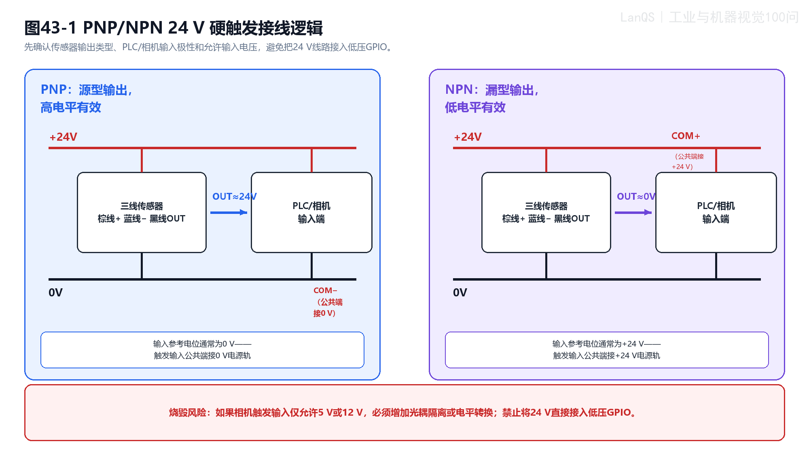

<strong>图43-1 PNP 与 NPN 的硬触发接线逻辑</strong>

读图时首先确认公共端接在哪里。左侧 PNP 路径在触发时把 OUT 推到高电平，输入侧通常以 0 V 为参考；右侧 NPN 路径在触发时把 OUT 拉到低电平，输入侧通常需要把公共端接到 +24 V。图下方特别标出 GPIO 电压耐受问题：现场许多故障并非逻辑判断错误，而是把 24 V 直接加到了额定 5 V 或 12 V 的输入端。接线前应确认输入电压、电流、端子极性，并判断是否需要光电隔离或电平转换。

#### 43.4 工业现场常见的硬触发电压是多少？

工业自动化现场最常见的控制电压是 **24 V DC**。它兼顾了布线距离、抗干扰能力和现场供电一致性，因此传感器、PLC I/O、电磁阀和许多控制附件都围绕 24 V 设计。

但“现场普遍使用 24 V”不代表相机输入可以直接接 24 V。相机触发输入可能是光电隔离输入，也可能是 TTL 电平输入，只允许 5 V 或 12 V，或者需要串联限流电阻。是否支持 5～24 V 宽范围输入，必须查具体型号手册。

#### 43.5 如何选择触发边沿？

常见模式有上升沿、下降沿、有效高电平保持和有效低电平保持。图像采集通常采用边沿触发，把一个明确的到位事件对应到一次曝光；电平保持模式更适合触发窗口或门控曝光。

不能习惯性地默认使用上升沿。长线缆、高噪声、继电器和机械触点都会影响毛刺方向、去抖时间和输入滤波时间；参数不匹配时，可能出现多次触发或误触发。

#### 43.6 相机上的 Trigger In 和 Strobe Out 分别做什么？

外部触发通常通过多针 I/O 接口或 Hirose 接口进入相机。传感器或 PLC 发出满足电平和边沿要求的脉冲，相机据此完成一次曝光。如果系统使用频闪光源，相机还可以通过 Strobe 输出驱动光源控制器，使光脉冲与曝光窗口同步。

因此相机至少有两种不同的硬件信号角色：**Trigger In** 命令相机“何时拍摄”，**Strobe Out** 告知外部设备“相机何时正在曝光”。调试时把两者混为一个信号，是常见错误。

#### 43.7 接线时需要关注哪些电气参数和烧毁风险？

最严重的风险是输入电压耐受范围与输入电流不匹配。若相机输入只支持 5 V 或 12 V，却把 24 V 传感器或 PLC 输出直接接入，可能损坏输入光耦甚至烧毁 GPIO 通道。接线前应逐项确认允许输入电压、输入电流、公共端定义、是否已经内置限流以及是否需要隔离。

另一个风险是极性和公共端接错。NPN/PNP 只描述传感器输出行为，能否被输入模块正确识别还取决于共阳或共阴接法。机械触点还会产生抖动，电磁阀断电时会产生反向感应电压，必要时应使用续流二极管、TVS 或 RC 吸收网络抑制浪涌。

#### 43.8 算例：24 V 信号驱动光耦输入时如何选择限流电阻？

下面的器件参数仅用于演示计算，唯一采用的源稿条件是 PNP 有效输出约为 24 V。假设光耦输入二极管正向压降为 1.2 V，目标电流为 10 mA，则串联电阻为

$$
R=\frac{V_{supply}-V_{LED}}{I}=
\frac{24.0-1.2}{0.010}=2280\,\Omega
$$

电阻功耗约为 228 mW。取接近的 E24 标准值 2.2 kΩ 后，实际电流约为 10.36 mA，功耗约为 236 mW，工程上可选择额定功率 0.5 W 的电阻并保留余量。

若不安装串联电阻，并把未保护通路的等效电阻仅按示例值 10 Ω 计算，电流将达到约 2280 mA，远高于常见光耦输入的额定范围。这只是说明限流必要性的示例，实际设计仍必须以相机输入电路和接口手册为准。

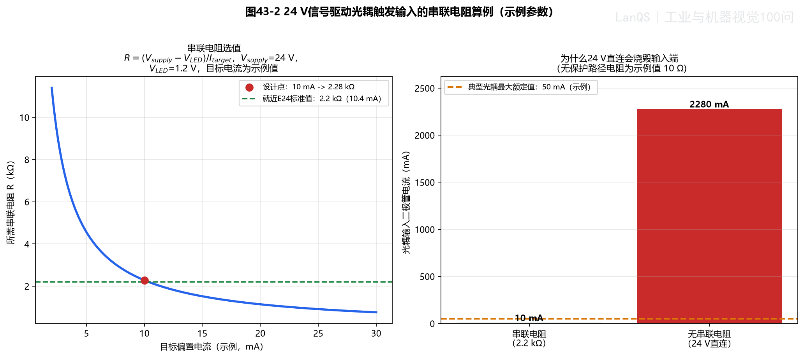

<strong>图43-2 24 V 光耦触发输入的串联限流电阻算例（示例参数）</strong>

#### 43.9 硬触发相比软触发有哪些优缺点？

硬触发更容易保持触发时刻稳定，也更适合与编码器、运动轴或共享硬件时钟协同；代价是对布线、隔离、电平匹配和现场调试提出更高要求，触发逻辑的修改也不如软触发灵活。

判断标准是：采图的准确时刻是否本身就是任务精度的一部分。若答案是肯定的，应优先保证信号链的确定性；若采图偶发、人工操作或只用于研发验证，软触发的便利性仍然有价值。

#### 43.10 接线完成后怎样做电气验收？

第一步是断电核对端子定义：确认传感器的电源正负、OUT、COM，以及相机 Trigger In 的参考端没有接反。第二步是在不接相机输入的条件下测量传感器输出的有效高电平、有效低电平和关断漏电流，确认它们与输入模块的门限和允许电流匹配。第三步才接入相机，并用示波器同时观察 Trigger In 和 Strobe Out，确认每一个有效边沿都对应一次实际曝光。

若使用 24 V 信号驱动光耦或数字输入，限流电阻的计算只是第一步，还要核对输入电流范围、输入滤波时间和电阻功耗。以 \(R=(V_{supply}-V_{LED})/I\) 得到的阻值应再选择标准阻值，并检查最小供电电压、最大供电电压和器件温升。电气上“能亮”不等于逻辑上“可靠识别”，边沿、脉宽和抗干扰余量同样需要验收。

现场还应保留一张接线和信号表，明确每根线的功能、有效电平、公共端、触发边沿、脉冲宽度和异常状态。设备更换或 PLC 程序交接时，这张表比单独记住“PNP”或“NPN”更能避免误接。

### 常见误区

**认为工业现场使用 24 V，就可以把 24 V 直接接入任何相机输入。** 相机 GPIO 的耐压和电流能力必须查手册。

**只按 NPN/PNP 名称配线，不核对公共端。** 必须同时确认传感器输出行为和输入模块的共阳/共阴定义。

**习惯性选择上升沿。** 长线缆、噪声和机械触点可能要求重新评估边沿、去抖和输入滤波。

**把 Trigger In 和 Strobe Out 当成同一个信号。** 前者命令曝光，后者报告实际曝光状态，方向相反。

### 术语与符号表

**PNP/NPN**：传感器输出晶体管的两种常见导通方式。PNP 有效时通常向 OUT 提供高电平，NPN 有效时通常把 OUT 拉向 0 V。

**公共端 COM**：输入电路的参考电位端。它必须与传感器输出形式和输入模块的公共端接法匹配。

**Trigger In/Strobe Out**：相机的两种硬件信号角色，分别用于命令曝光和报告实际曝光窗口。

**限流电阻**：通过欧姆定律限制输入电流，使高电压信号驱动光耦或 TTL 输入时不超过安全范围的串联电阻。

**续流二极管、TVS、RC 吸收网络**：用于吸收电磁阀线圈断电时产生的反向感应电压，保护 PLC 输出模块。

### 延伸阅读

具体相机型号的输入耐压、输入电流和隔离方式，以厂商的 GenICam 或硬件 I/O 手册为准。光耦器件数据手册可用于核对正向压降、额定电流和功耗等参数。

## 第44问：PLC、光电传感器、视觉系统和剔除机构之间如何接线并协同控制？

### PLC、光电传感器、视觉系统和剔除机构之间如何接线并协同控制？

#### 44.1 四类设备分别承担什么作用？

典型检测与剔除系统中，**光电传感器**检测工件是否进入检测区，**PLC**负责时序、位置和动作逻辑，**视觉系统**输出检测结果，**剔除机构**把结果转换成实际机械动作。四者共同构成质量控制闭环。

光电传感器回答“什么时候有工件”，视觉系统回答“工件是什么状态”，PLC 把时间与工件身份绑定，剔除机构负责最后执行。任一环节失去与工件物理位置的对应关系，都可能造成误剔、漏剔或剔除错误工件。

#### 44.2 光电传感器如何接入 PLC？

三线传感器常见颜色约定是棕线接 +24 V、蓝线接 0 V、黑线为 OUT 信号。PNP 输出触发时把 OUT 推向 +24 V，PLC 输入公共端通常接 0 V；NPN 输出触发时把 OUT 拉向 0 V，输入公共端通常接 +24 V。不同厂商对 source/sink、共阳/共阴等术语的使用并不完全一致，实际接线必须核对 PLC 输入模块端子图。

#### 44.3 视觉系统如何与 PLC 通信？

结果交换常通过工业以太网或现场总线完成。PROFINET 常用于西门子体系的周期 I/O，EtherNet/IP 常见于 Rockwell 体系，EtherCAT 更适合高速同步控制，Modbus TCP 实现简单但实时性和诊断能力通常较弱。若结果还要上传 MES（制造执行系统）、SCADA（监控与数据采集系统）或数据库，常在控制层链路之上增加 OPC UA 等信息层接口。

协议名称本身不能保证实时性能。是否足够快、足够稳定，要结合 PLC 扫描周期、视觉控制器支持的通信模式、网络拓扑、交换机配置和生产节拍判断。

#### 44.4 剔除机构如何连接 PLC？

最常见的机构是由电磁阀驱动的气缸：PLC 输出点使电磁阀线圈通电或断电，阀体控制压缩空气进入气缸，完成推料、拨料或抬升剔除。若使用伺服电机或电动直线执行器，PLC 也可能通过脉冲串、总线命令或模拟量控制驱动器。

剔除机构不能简单看成一个输出点。输出模块类型、线圈浪涌抑制、执行响应、气路传输延迟、机构返回时间和机械寿命，都会影响可用的剔除窗口。

#### 44.5 四类设备的完整控制流程是什么？

完整流程通常是：**硬件到位检测 → 硬件触发采图 → 视觉异步判定 → PLC 绑定位置队列 → 执行剔除**。光电传感器先通知 PLC 工件进入检测区；PLC 结合编码器或内部定时器计算采图时刻，并通过高速输出触发相机；视觉系统处理后把 OK/NG 或坐标数据返回 PLC；PLC 将结果写入按工件位置索引的队列，工件到达剔除工位时再输出动作命令。

这里不能省略“位置队列”。没有工件跟踪，即使视觉结果本身正确，也可能被应用到错误工件上。

#### 44.6 如何保证剔除动作的准确性？

剔除准确性取决于三项是否同时稳定：位置反馈、机构响应和结果绑定。编码器提供连续位置基准，高速计数模块负责可靠读取脉冲；同时还要标定剔除机构的动作延迟、气缸行程、推杆速度和返回时间。

高速产线中的剔除窗口本质上是时间窗口和空间窗口的叠加。若视觉处理变慢、编码器漏脉冲，或气缸动作速度低于预期，问题可能不是相机采图错误，而是命令到达时工件已经越过剔除位置。

#### 44.7 整体接线图应如何阅读？

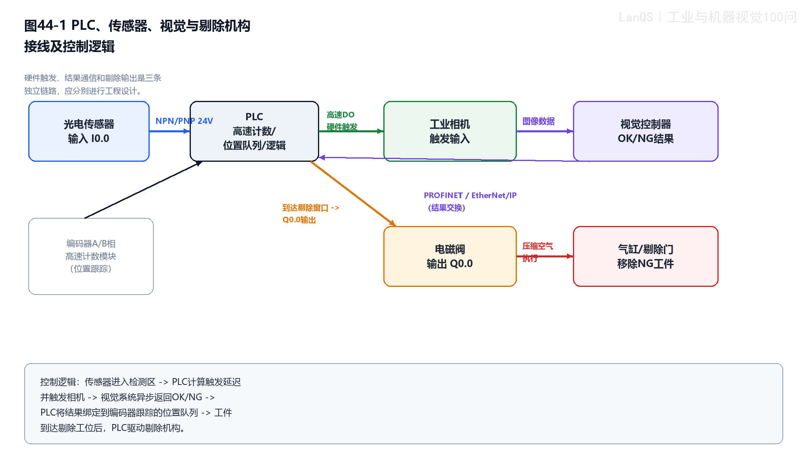

<strong>图44-1 PLC、光电传感器、视觉系统和剔除机构的接线与控制逻辑</strong>

图44-1把系统拆成三条链路：传感器到 PLC 的输入链路、PLC 到相机的硬触发链路，以及视觉结果返回 PLC 并驱动剔除机构的结果链路。编码器模块是高速跟踪中的关键输入，用于把检测结果重新绑定到物理位置。读图时应分别检查 24 V I/O、工业以太网结果交换和执行器输出回路。

24 V 电源通常为 PLC I/O、现场传感器和电磁阀线圈供电；光电传感器黑线进入 PLC 输入点；视觉控制器通过工业以太网与 PLC 交换结果；相机 Trigger IN 由 PLC 或运动控制器的硬件输出驱动；电磁阀线圈由 PLC 输出模块驱动。输出模块直接驱动感性负载时，必须配置浪涌抑制。

#### 44.8 PLC 控制程序通常如何组织？

成熟程序可采用状态机、顺序功能图或分段任务结构。初始化段完成 I/O 映射、通信建立和参数加载；输入处理段完成传感器边沿检测、编码器计数和触发窗口判断；结果处理段接收视觉数据并写入工件队列；执行段依据位置和判定结果驱动剔除机构；异常处理段覆盖超时、断线、缺图、重复触发和剔除失败。

PLC 程序不能简化成“等待 OK/NG，然后输出”。可用的控制逻辑必须把触发、位置、结果、执行和异常恢复分开组织，否则连续高速运行时，问题会集中在边界条件中而难以追溯。

#### 44.9 算例：剔除窗口的时间与空间预算

剔除链路中，PLC 触发计算、相机曝光、视觉处理、结果通信、队列写入、阀线圈响应、气路传输和气缸行程都会增加延迟。设产线速度为 0.60 m/s，八个阶段的示例延迟合计为 75.0 ms，则工件在命令真正到达执行机构前移动的距离为

$$
d=v\,t=0.60\times0.075=0.045\,\mathrm{m}=45.0\,\mathrm{mm}
$$

若检测点到剔除点的可用间距为 220 mm，则剩余空间余量为 175 mm，剔除窗口仍然打开。若可用间距小于 45 mm，同样的计算会显示机构来不及动作。上述参数仅用于演示预算方法，不是通用设备指标。

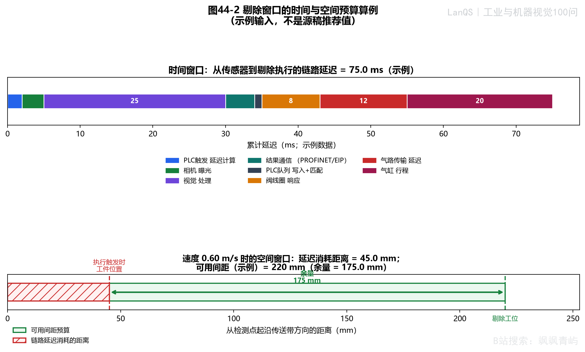

<strong>图44-2 剔除窗口的时间与空间预算算例（示例数据）</strong>

#### 44.10 如何把剔除逻辑做成可诊断的控制状态机？

建议至少区分“等待工件”“已触发采图”“等待结果”“结果已绑定”“等待剔除窗口”“已执行”和“异常”几个状态。视觉结果到达后，PLC 先检查结果有效位、任务编号和工件位置，再把结果写入位置队列；只有工件进入剔除窗口且执行器处于可用状态时，才允许发出剔除命令。这样可以把“视觉判定错误”“通信超时”“工件跟踪丢失”和“执行器未准备好”区分开来。

异常策略也应在设计阶段确定。结果超时不能默认为 OK，通常应进入待复核、停机或安全剔除策略；连续两次触发而只收到一帧结果时，应记录漏拍或重复绑定；剔除输出已经发出但传感器没有确认动作时，应进入执行器故障状态。报警信息至少要包含工件编号、触发序号、结果时间戳和故障状态，便于现场回溯。

验收时应覆盖正常速度、最高速度、连续工件、工件间距接近下限、视觉超时、网络断开和执行器响应变慢等场景。每个场景都要检查是否出现错剔、漏剔、重复剔除或错误停机。只有通过这些边界测试，剔除窗口计算才具有工程意义。

### 常见误区

**把 OK/NG 和一个输出位当成完整控制程序。** 触发、位置、结果和异常处理必须分开组织。

**凭记忆接 NPN/PNP。** 应以 PLC 输入模块端子图为准，不要只依赖术语。

**认为协议名称就代表实时性能。** 真正性能取决于扫描周期、网络拓扑和生产节拍。

**忽略剔除机构自身的动态。** 阀响应、气路延迟和气缸行程可能占用大量剔除窗口。

### 术语与符号表

**位置队列**：PLC 保存的工件位置与视觉结果数据结构，用于在结果异步返回时仍能对正确工件执行动作。

**剔除窗口**：从检测到剔除之间可供完整感知—通信—执行链路消耗的时间和空间余量。

**硬触发**：由 PLC 或运动控制器精确计算时刻并输出给相机 Trigger IN 的低延迟脉冲。

**高速计数模块**：可靠读取编码器 A/B 相脉冲、支持产线连续位置跟踪的 PLC 输入模块。

**感性负载浪涌**：电磁阀线圈断电时产生的反向感应电压，可能损坏输出模块，需要二极管、TVS 或 RC 网络抑制。

### 延伸阅读

可查阅 PROFINET、EtherNet/IP、EtherCAT 和 OPC UA 的官方规范，以及 PLC 高速计数、工业相机触发和电磁阀浪涌抑制相关的设备手册。

## 第45问：光电传感器、接近开关和光纤传感器的触发特性有什么区别？

### 光电传感器、接近开关和光纤传感器的触发特性有什么区别？

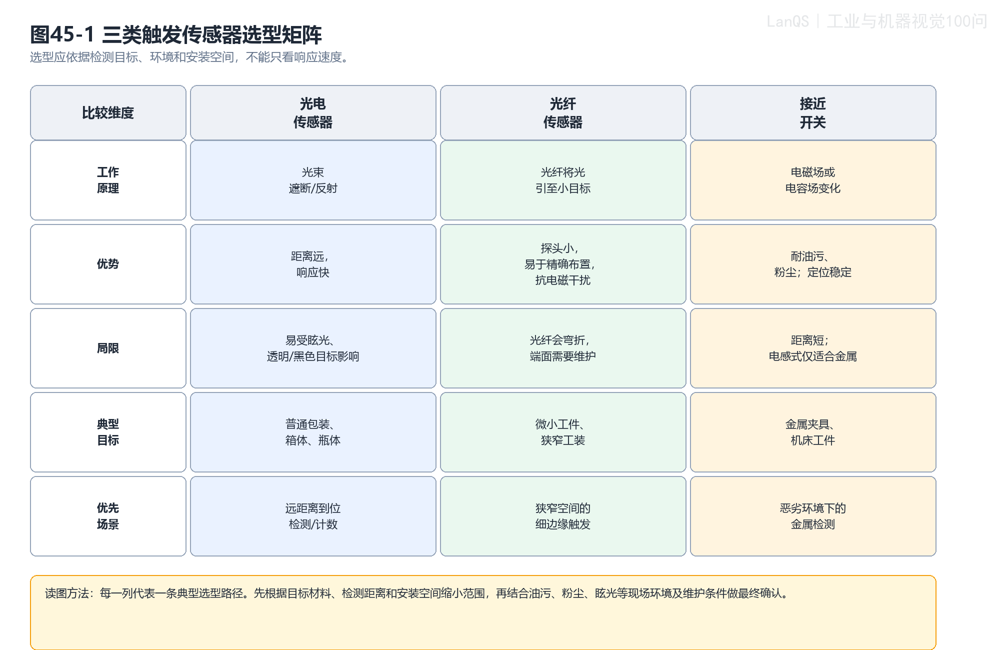

<strong>图45-1 三类触发传感器的选型矩阵</strong>

#### 45.1 光电传感器如何触发

**光电传感器**通过发射光并检测接收光强的变化，判断目标是否到达。常见形式有对射式、回归反射式和漫反射式。它的优点是**检测距离较大、响应较快**，适合输送线上的到位检测、计数和周期触发。

透明件、镜面件、吸光的黑色件以及强环境光，都会降低检测稳定性。对射式通常受目标颜色影响较小，但透明件仍可能造成误判；漫反射式则更容易受到目标反射率和颜色变化的影响。

#### 45.2 接近开关如何触发

最常见的是**电感式接近开关**。它通过金属目标引起的电磁场变化动作，不依赖环境光，对油膜、粉尘和颜色变化通常更耐受，适合机床、夹具和金属工件到位确认。检测距离一般为几毫米到几十毫米，但重复定位性能较好。

电感式主要检测金属，不能把它当作通用非金属传感器。**电容式接近开关**可以检测更多材料，但会更容易受到湿度、背景介电常数和安装环境变化的影响。

#### 45.3 光纤传感器如何触发

工厂中所说的**光纤传感器**，本质上仍属于光电传感器。它把光源、接收器和处理电路放在放大器内，用光纤把光引到狭小的检测位置。这样便于检测小目标、细小边缘和安装空间受限的位置。

光纤探头细、安装灵活，并且探头部分不容易受到电磁干扰；但光纤会弯折、折断，端面需要保持清洁，安装刚度、目标反射率和阈值设置也会影响重复性。**光纤结构便于精确布置，不等于天然具有最高精度。**

#### 45.4 三类传感器的物理原理

光电传感器和光纤传感器都依据**光强变化**工作，差别主要在结构：前者把光学元件集成在壳体内，后者把探头与放大器分开。接近开关则通过电磁场或电容场变化检测目标。

因此，光纤传感器不是一种完全不同的检测物理；它是**光电检测原理的分体式实现**。

#### 45.5 检测距离与响应速度

光电传感器的检测距离通常最宽，可从几厘米到数米；接近开关最短，常见为几毫米到几十毫米；光纤传感器多用于毫米到小厘米范围的精细检测。

光电和光纤传感器的响应时间常见为微秒到百微秒量级，接近开关常见为 **0.1–1 ms**。实际系统速度还要把滤波、去抖、输出形式、PLC 输入滤波和现场干扰一起考虑。

如果传感器响应时间为 \(\Delta t\)，工件速度为 \(v\)，触发位置的不确定量可作一阶估算：

$$
\Delta x=v\Delta t
$$

例如在 1.0 m/s 下，1–100 μs 对应约 0.001–0.100 mm；0.1–1 ms 对应约 0.100–1.000 mm。这只是响应延迟造成的运动距离，不是整套系统的最终定位精度。

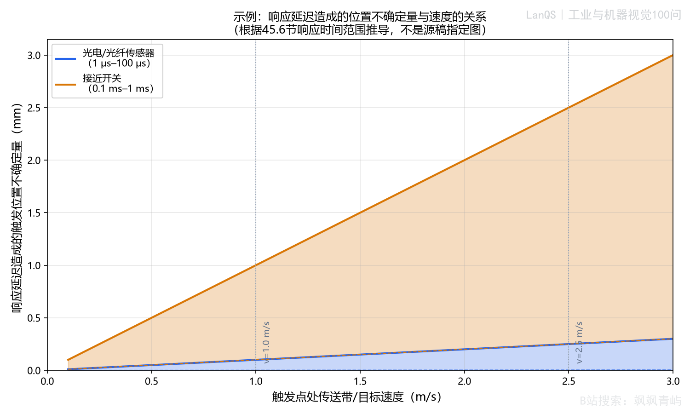

<strong>图45-2 响应延迟造成的触发位置不确定量（示例）</strong>

#### 45.6 选型原则

目标较大、距离较远、速度较高且环境普通时，通常优先考虑**光电传感器**；目标是金属、检测距离短且有油污粉尘时，通常考虑**电感式接近开关**；目标很小、安装空间狭窄或需要把电子元件移出高温干扰区时，考虑**光纤传感器**。

选型不能只看“谁更精确”，还要核对目标材料、检测距离、响应时间、安装刚度、污染、环境光、最小弯曲半径和防爆认证。传感器本身的输出也必须与 PLC 输入类型、电平和滤波参数匹配。

|---|
| 光电传感器 | 利用发射光与接收光强变化检测目标的传感器。 |
| 接近开关 | 目标靠近时无需接触即可输出开关信号的传感器。 |
| 电感式 | 利用金属改变电磁场来检测目标。 |
| 光纤传感器 | 用光纤把光引到检测点、把放大器与探头分开的光电传感器。 |
| 响应时间 | 从物理事件发生到传感器输出达到规定状态所需的时间。 |
| 去抖/滤波 | 抑制短时抖动或干扰脉冲的处理。 |

---

#### 45.7 三类传感器对环境的适应性如何？

光电传感器容易受到环境光、透明件、镜面反射和镜头污染影响；接近开关对油污、粉尘和可见光通常更耐受，但电感式接近开关只适合金属目标；光纤探头可以放入狭窄或高温位置，放大器则需要安装在更合适的控制柜位置，但光纤端面清洁、弯曲半径和固定刚度会直接影响稳定性。

#### 45.8 三类传感器的精度和灵敏度有何差别？

传感器目录中的检测距离、响应时间和重复精度分别描述不同性能。检测距离表示能否感知目标，响应时间决定事件发生后多久输出，重复精度表示相同条件下触发位置的一致性。它们都不能直接等同于视觉系统最终的定位精度；PLC滤波、机械振动、安装误差和目标表面状态也会进入误差链。

#### 45.9 实际项目如何按触发需求选择传感器？

先确定目标材料和最小尺寸，再核对安装距离、允许的触发位置误差、线速度、污染、环境光、温度和维护条件。金属小件的短距离到位检测可优先考虑电感式接近开关；远距离或目标材料变化较大的输送线检测通常考虑光电传感器；狭窄空间、小目标或探头需要远离热源时，光纤传感器更容易布置。最终还要确认输出电平、NPN/PNP类型、PLC输入滤波和安装基准。

#### 45.10 安装和维护时应检查什么？

光电传感器要检查光轴、反射背景和镜面眩光；接近开关要检查检测距离、安装齐平要求和金属屑积聚；光纤传感器要检查端面清洁、最小弯曲半径、放大器阈值和探头固定。验收时应在实际最高速度下测量触发位置重复性，并分别测试正常、污染、透明件或反射率变化等边界条件。

#### 45.11 如何把传感器选型转化为可验收的指标？

可以把选型要求写成四类指标。第一类是检测能力：目标材料、目标尺寸、最小对比度和允许的检测距离；第二类是时序能力：响应时间、重复触发位置误差、输出脉宽和 PLC 输入滤波；第三类是安装能力：支架刚度、光轴或探头位置、可维护空间和电缆弯曲半径；第四类是环境能力：油污、粉尘、透明件、反光、温度、振动和环境光。只有把这四类指标同时写入验收表，传感器目录中的“响应快”才有可比较的含义。

触发传感器的重复精度还应与相机曝光和后续位置误差联系起来。若传感器输出位置的波动为 \(\sigma_s\)，PLC 与触发链路贡献的波动为 \(\sigma_t\)，在误差相互独立的近似下，可用 \(\sigma\approx\sqrt{\sigma_s^2+\sigma_t^2}\) 估算合成波动。该式只能用于初步预算，遇到明显相关的机械振动、周期性偏差或饱和误差时，应回到实测分布分析。

最终选型不应只留下“选了哪一种传感器”，还应记录有效电平、安装基准、检测距离、触发边沿、滤波设置和替代型号。这样设备更换或产线改造时，工程人员能够复现原来的触发条件。

### 常见误区

- 把光纤传感器误认为独立于光电原理的另一类传感器。
- 认为接近开关能检测所有材料；电感式主要面向金属。
- 只看传感器目录中的响应时间，不检查PLC输入滤波和机械延迟。
- 认为光纤越细，系统精度就一定越高；安装刚度和阈值同样重要。

### 术语与符号表

| 术语 | 说明 |
|---|---|
| 光电传感器 | 利用发射光与接收光强变化检测目标的传感器。 |
| 接近开关 | 目标靠近时无需接触即可输出开关信号的传感器。 |
| 电感式 | 利用金属改变电磁场来检测目标。 |
| 光纤传感器 | 用光纤把光引到检测点、把放大器与探头分开的光电传感器。 |
| 响应时间 | 从物理事件发生到传感器输出达到规定状态所需的时间。 |
| 去抖/滤波 | 抑制短时抖动或干扰脉冲的处理。 |

### 延伸阅读

查阅传感器数据手册时，应同时核对检测原理、额定检测距离、响应时间、重复精度、输出电平、环境等级和安装限制。

## 第46问：视觉系统通过什么方式将检测结果（OK/NG）告诉PLC？通常使用什么类型的输出模块？

### 46. 视觉系统通过什么方式将检测结果（OK/NG）告诉PLC？通常使用什么类型的输出模块？

#### 46.1 视觉结果为什么必须返回PLC？
在自动化产线中，视觉系统的职责是把图像判断转化为后续设备能够执行的控制依据，而不是停留在一份独立的检测报告上。相机、智能相机或视觉控制器完成拍照与分析后，结论只有进入PLC的控制逻辑，才会进一步对应到放行、剔除、停机、报警、计数或追溯等动作。因此，视觉结果回传PLC，本质上是把“看到什么”转换成“设备接下来做什么”。

对初学者来说，最容易混淆的地方有两点。其一，视觉回PLC的往往不是原始图像，而是已经整理好的结果字段，例如 OK/NG、坐标、角度、尺寸值、缺陷代码和任务完成状态。其二，PLC接收视觉结果使用的多半是输入资源或通信资源，并不是PLC自己去输出这些结果。题目里提到“输出模块”，若从视觉一侧看，指的是视觉设备对外输出信号的能力；若从PLC一侧看，更准确的说法应是 PLC通过数字量输入模块或通信模块接收视觉结果。

#### 46.2 最常见的结果回传方式有哪些？
工程现场最常见的路径有两类。第一类是数字量I/O回传，视觉系统用一个或多个离散信号表示“合格”“不合格”“忙”“故障”“检测完成”等状态，PLC通过数字量输入模块（DI，Digital Input）读取这些电平变化。第二类是工业网络回传，视觉系统通过 Modbus TCP、PROFINET、EtherNet/IP、Socket TCP/UDP 等方式把结果写入寄存器、I/O区或协议数据块，PLC再按照约定格式解析。

数字量I/O的优点在于直接、延迟小，接线和程序也相对简单，特别适合只需要一位或几位状态量的场合；网络通信则更适合承载结构化结果，因为它不必为每个字段都单独占用一根线，也更方便把检测值、缺陷类别、时间戳或任务编号一起带回控制系统。真正做选型时，需要一起评估这条结果链路传递的信息量、节拍要求、维护能力和后续扩展性，而不是抽象地比较哪一种“更先进”。

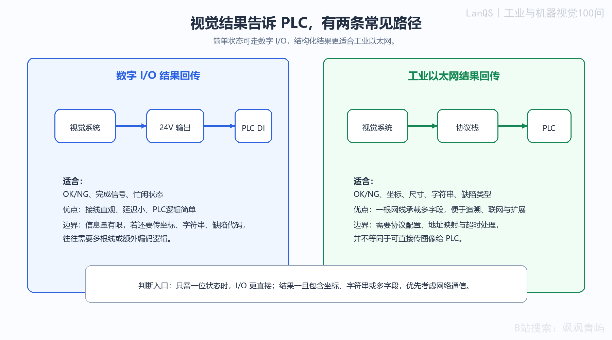

<strong>图46-1 视觉结果回传PLC的两种常见路径</strong>

图 46-1把现场最常见的两条结果回传链路并列展开。左侧是数字量I/O方式，视觉系统输出24 V等级的离散信号，PLC通过DI点读取“OK/NG”“完成”之类的状态；右侧是工业网络方式，视觉结果先被组织成协议数据，再由PLC按寄存器、I/O区或报文结构解析。读这张图时，读者应把注意力放在“信息量”和“工程代价”的对应关系上：离散I/O适合少量状态，优势是简单可靠；一旦结果包含坐标、尺寸、缺陷类别、工件编号等多字段信息，网络通信通常更合理。它的使用边界也很明确，PLC侧网络通信并不意味着要接收原始图像，绝大多数PLC并不承担图像流处理任务。

#### 46.3 数字量I/O方式通常怎样定义OK/NG？
I/O方式下，视觉系统常把某一路输出定义为OK，另一路定义为NG，也有些系统只输出“检测完成”和“NG”，默认没有NG即为OK。为了减少接线数量，还会把多个状态编码到若干位输出上，例如两位表示四种状态，三位表示八种状态。这样的编码方式并非不能用，但必须保证PLC程序、现场接线图和视觉端配置保持一致，否则维护阶段很容易出现状态误读。

从PLC角度看，这类信号进入的是数字量输入模块。PLC在扫描周期内读取输入状态，再根据程序逻辑决定是否触发剔除、是否允许下一工位动作、是否记录异常。若产线节拍高、脉冲较窄，PLC输入滤波时间和模块响应时间也要一起核对；否则视觉端虽然正确输出了结果，PLC侧却可能因为脉冲太短而漏读。

#### 46.3.1 算例：状态字编码与DO脉冲宽度裕量
这组示例用于说明两个检查动作。若用 (n) 位数字量输出编码状态，可表示的状态数为 (2^n)：1、2、3、4 位分别对应 2、4、8、16 种状态。实际项目中的 `00`、`01`、`10`、`11` 分别代表什么，必须由视觉端配置、接线图和PLC程序共同约定；下列映射只用于演示：`00 = Idle`、`01 = OK`、`10 = NG`、`11 = Fault`。

脉冲宽度也需要按PLC的输入滤波时间和扫描周期核算。设输入滤波时间为 3 ms，PLC扫描周期为 8 ms，示例中要求信号在滤波完成后至少保持两个扫描周期，则最小保持时间为

$$
t_{min}=t_{filter}+2T_{scan}=3+2\times8=19\ \mathrm{ms}
$$

若视觉端将OK/NG脉冲设为20 ms，名义裕量为 (20-19=1\ \mathrm{ms})。这些时间均为示例值，用于说明计算方法，不是原稿规定的现场参数。实际设计还要考虑输入模块响应时间、扫描相位、通信任务周期和信号抖动，不能只依据一个理想公式设定脉冲。

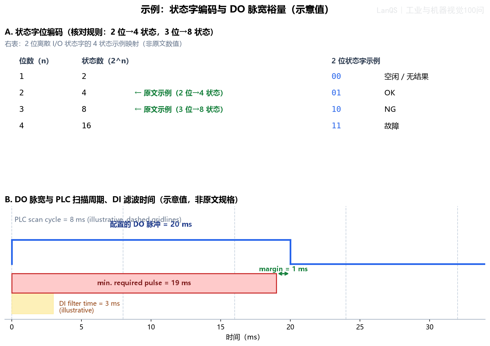

<strong>图46-2 状态字编码与DO脉冲宽度裕量示例</strong>

图中上半部分展示位数与可编码状态数的关系，下半部分展示输入滤波时间、扫描周期和输出脉冲之间的核对方法。图中的时间和状态映射均为示例，读图时应关注验收逻辑，而不是把20 ms或1 ms当成通用标准。

#### 46.4 网络通信方式通常返回哪些内容？
网络通信的价值，在于结果不再局限于一位判定。实际项目中，视觉系统常返回一位总判定、一个或多个测量值、定位坐标、旋转角、工件序号、任务完成标志、报警码、工具运行状态，以及便于追溯的时间信息。对于定位、测量、字符识别和多缺陷分类任务，这些内容往往比单纯的OK/NG更有价值，因为PLC后续动作可能依赖具体数值，而不是只有通过与否。

不过，采用网络通信并不等于系统自然就更实时。协议名称只是实现路径，最终的响应速度与抖动还取决于PLC扫描周期、通信任务周期、交换机与网络负载、设备协议栈实现方式，以及视觉算法本身的处理时间。更稳妥的表述是：网络通信更擅长传递结构化结果，但实时性仍要靠系统实测和整体架构保证，不能只由协议名推断。

#### 46.5 题目里说的“输出模块”，在工程上应怎样理解？
如果从视觉系统一侧描述，确实可以说视觉设备通过数字量输出接口或网络通信接口把结果输出给PLC。很多智能相机自带若干路数字量输出（DO，Digital Output），也可能扩展I/O模块、串口模块或网口功能。从这一侧看，“输出模块”这个说法是成立的。

若从PLC一侧表述，术语就应当更严谨一些。PLC用于接收I/O结果的是数字量输入模块，用于接收网络结果的是通信模块、总线接口模块或CPU自带的工业以太网接口；PLC真正的输出模块，则多用于驱动电磁阀、继电器、蜂鸣器、指示灯或剔除执行器。教材里把这两个方向分清楚，读者在后面学习接线、时序和故障诊断时就不会混淆“谁在发、谁在收”。

#### 46.6 实际选型时应怎样判断用I/O还是网络？
如果任务只是把“通过”“不通过”“完成”“故障”这些少量状态交给PLC，而且节拍高、逻辑简单、维护团队更熟悉硬接线，那么I/O仍然是很有竞争力的方案。若系统需要把多个测量值、字符识别结果、位置坐标或多类别缺陷信息同时回传，或者还要考虑数据追溯、远程诊断和后续扩展，网络通信通常更适合。

很多项目最终会采用混合结构：用I/O传递触发、完成、故障等时序状态，用网络传递详细结果。这样的分工在工程上很常见，因为它同时兼顾了硬件时序的直接性和数据表达的丰富性。

#### 46.7 如何写一份可以真正交接的结果接口说明？

接口说明至少要固定五类内容：字段名称、数据类型、单位或编码、有效条件和刷新时机。例如，`ResultValid` 表示结果是否可用，`OKNG` 表示总判定，`JobID` 表示任务号，`PartID` 或序号用于绑定工件，测量值则必须同时写明单位、缩放系数和无效值。若只写“寄存器 40001 是结果”，接收方仍然不知道它是状态字、枚举值还是可以直接显示的测量结果。

对于 I/O，接口表应写清每一位的有效电平、脉冲宽度、保持方式和互锁关系；对于网络，接口表还要写清字节序、超时、重连、心跳、计数器和异常码。结果最好带有序号或时间戳，PLC 通过序号变化判断“新结果”，不要仅依赖一个可能长期保持为真的 OK/NG 电平。

验收时应使用已知输入和已知结果做回放：正常结果、NG结果、无效结果、通信超时、重复报文、乱序报文和断线重连都要测试。接收端必须能把“没有新结果”和“新结果为 NG”区分开，否则通信正常时看似没有问题，异常工况下却可能把旧结果重复用于新工件。

### 常见误区

- 把视觉设备的输出模块和PLC的输出模块混为一谈。视觉设备发送结果，PLC通常通过数字量输入模块或通信模块接收。
- 用多位I/O编码状态，却没有同时冻结位序、有效电平和状态表，维护时容易产生OK/NG错读。
- 只看视觉端脉冲已经输出，却不核对PLC输入滤波时间、扫描周期和模块响应时间。
- 认为使用PROFINET或Modbus TCP就自动获得确定的实时性；实际延迟还受扫描周期、通信任务、网络负载和算法处理时间影响。

### 术语与符号表

| 术语 | 说明 |
|---|---|
| DI | Digital Input，数字量输入模块，用于读取视觉设备送来的离散电平。 |
| DO | Digital Output，数字量输出，用于由视觉设备向PLC发送OK、NG或完成等状态。 |
| 输入滤波时间 | 输入通道确认电平变化前要求信号保持稳定的时间。 |
| 结构化结果 | 包含尺寸、坐标、缺陷类别、工件编号等多个字段的结果数据。 |
| 混合I/O与网络结构 | 用I/O传递时序和联锁状态，用网络传递详细检测数据的架构。 |

### 延伸阅读

可结合具体PLC厂商的数字量输入滤波、扫描周期和通信任务周期说明，核对结果回传链路的时序裕量；协议层面可进一步查阅Modbus TCP、PROFINET和EtherNet/IP的设备通信文档。

---

## 第47问：什么是光耦隔离？I/O模块为什么需要它？

### 47. 什么是光耦隔离？I/O模块为什么需要它？

#### 47.1 光耦隔离的基本原理是什么？
光耦隔离的核心，是让信号跨越两侧电路时通过“光”而不是通过直接导电路径。典型光耦内部包含发光器件和受光器件，输入侧电流驱动发光，输出侧再把光信号恢复成电信号。输入和输出封装在同一器件中，但电气上彼此隔离，因此能够在传递逻辑信息的同时切断地电位差、浪涌和共模干扰的直接传播路径。

从系统角度看，光耦隔离同时承担两项任务：一是把有用信号传给后级，二是把危险的电气扰动尽量挡在前级与后级之间。这也是工业I/O模块广泛使用隔离器件的根本原因。控制系统处理的是逻辑与数据，但它所连接的外部世界充满了继电器线圈、电磁阀、长线缆、变频器、电机和复杂接地环境，这些都可能把不希望进入控制电路的能量带进来。

#### 47.2 为什么I/O模块比很多板载电路更需要隔离？
I/O模块处在控制柜内部逻辑世界与现场设备世界之间，是最容易同时接触“弱信号”和“强干扰”的位置。它的外部线路往往很长，布线环境复杂，既可能经过动力线附近，也可能与电机、变频器、焊机等设备处在同一电磁环境中。长线缆本身就容易感应噪声，而现场设备在启停瞬间又会产生浪涌、电压尖峰和地电位波动，这些扰动若直接进入PLC、工控机或视觉控制器内部，很容易造成误触发、通信异常，甚至损坏输入输出级。

对于模拟量I/O，这个问题更敏感。因为测量信号本身可能只有几伏、几毫安，噪声比例一旦上升，误差就会被直接带入控制或检测结果；对于数字量I/O，虽然逻辑电平判定相对粗一些，但当现场存在接地环路、毛刺或浪涌时，误动作照样会发生。隔离的作用不是把所有问题都神奇消除，而是先在系统结构上建立一道边界，减少故障和干扰直接穿透到控制侧。

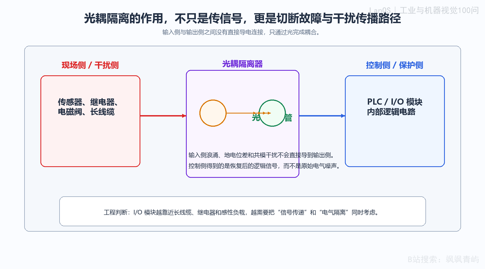

<strong>图47-1 光耦隔离在I/O模块中的作用</strong>

图 47-1把现场侧与控制侧明确分开，中间的光耦器件不是简单的“信号中转站”，而是一道电气屏障。左侧代表传感器、继电器、长线缆和感性负载所在的现场环境，这一侧更容易出现浪涌、共模干扰和地电位波动；右侧代表PLC或I/O模块内部逻辑电路，对过压、毛刺和杂散电流更敏感。读者从这张图中应建立一个基本判断：I/O模块之所以强调隔离，并不是因为逻辑功能复杂，而是因为它恰好站在最容易受外界冲击的位置。该图适用于理解数字量输入输出的隔离思路，但在高速总线接口或高精度模拟量模块中，实际实现可能采用数字隔离器、隔离放大器等器件，而不局限于传统光耦。

#### 47.3 没有隔离时，系统容易出现哪些问题？
最直接的问题是误动作。输入侧若把毛刺、电磁干扰或地电位波动误判成有效边沿，PLC就可能错误置位、错误启动、错误停机；输出侧若受反灌或浪涌影响，则可能出现继电器误吸合、驱动级损坏或模块寿命下降。更麻烦的是，这类问题经常表现为“偶发故障”，在静态台架上看似正常，一到现场连续运行就暴露出来，排查成本很高。

另一个常见问题是接地环路。不同设备即便都接地，也不意味着地电位完全相同；一旦形成环路，附加电流就可能沿信号参考路径流动，把原本干净的输入信号拖偏。对于视觉系统而言，触发输入、频闪同步和串口、网口外围I/O同样会受到这类问题影响，所以“隔离”并不是PLC专有话题，而是整个工业控制接口设计的共性要求。

#### 47.4 光耦隔离能解决到什么程度？它有没有边界？
隔离非常重要，但它不是万能屏障。它能有效阻断直接导电耦合路径，降低共模干扰与地电位差影响，也能让高低压侧建立更安全的电气边界；但对于强电磁辐射、屏蔽接地不当、供电质量差、线缆布局错误等问题，仅靠增加光耦并不能彻底补救。若长线与动力线平行敷设、浪涌抑制不到位，或者现场接地结构本身混乱，系统仍然可能出现不稳定。

从工程角度看，隔离应与合理接地、屏蔽线与屏蔽层正确处理、感性负载吸收回路、输入滤波、浪涌保护以及恰当的公共端规划配合使用。读者需要明白，隔离是系统抗干扰设计的一部分，并不能替代布线和接地上的基本功。

#### 47.5 数字量I/O和模拟量I/O的隔离方式有什么差别？
数字量I/O更关注开关状态是否可靠传递，因此隔离实现通常围绕逻辑电平、边沿响应、浪涌承受与通道独立性展开。模拟量I/O则要额外考虑线性度、温漂、带宽和噪声引入，因为它传递的不是单纯的0和1，而是连续量。正因为如此，模拟量隔离往往不会简单使用普通光耦直通，而更常见隔离放大器、调制解调式隔离器，或者ADC、DAC配合数字隔离的结构。

这一差异提醒读者，不能因为都叫隔离就认为工程要求相同。一个数字量输入模块只要可靠识别边沿就可能足够，而高精度模拟采集通道还必须关心隔离之后的精度漂移、非线性和噪声底。把这两类问题放在同一技术框架里看，有助于理解为什么有些模块价格差别很大，差别并不在功能写法，而在隔离和测量品质要求。

#### 47.5.1 算例：光耦LED串联限流电阻
若用24 V信号驱动光耦输入，取示例值 (V_{LED}=1.2\ \mathrm{V})，目标电流取 (I_{target}=10\ \mathrm{mA})，串联电阻可作一阶估算：

$$R=\frac{V_{supply}-V_{LED}}{I_{target}}=\frac{24-1.2}{0.010}=2.28\ \mathrm{k\Omega}$$

实际选型还要核对标准阻值、功耗、输入电流范围、温升和模块的最小可靠识别电流。24 V、1.2 V和10 mA均为示例值，不是通用推荐参数。

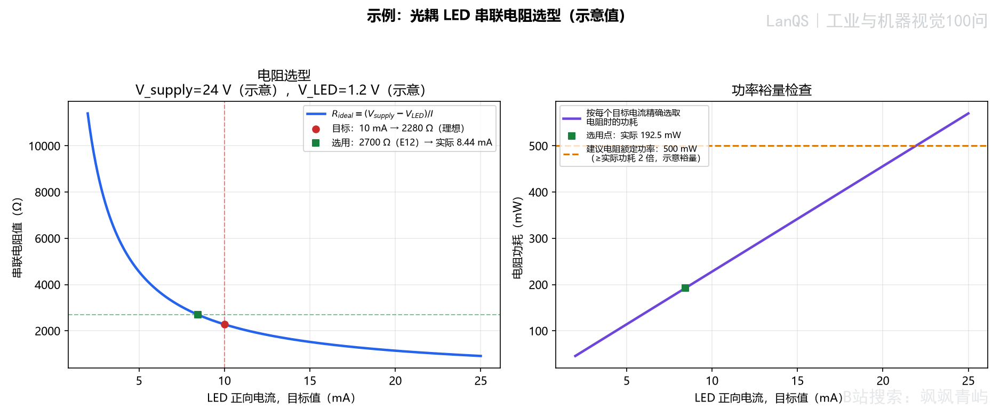

<strong>图47-2 光耦LED串联限流电阻计算示例</strong>

#### 47.6 现在的I/O模块还都是传统光耦吗？
并不完全如此。传统光耦仍然大量存在，尤其是在通用数字量接口中，因为它成熟、成本可控、隔离含义明确；但在更高速、更低功耗、更高集成度的场合，很多产品已经采用电容隔离、磁隔离或专用数字隔离器。对读者而言，这里的工程结论更适合写成一句直接的话：隔离的目标没有变，器件实现手段在演进。只要面对的是控制侧与现场侧之间的边界问题，隔离依然是绕不过去的设计主题。

#### 47.7 如何判断隔离设计是否真的解决了现场问题？

首先要确认干扰从哪里进入。若干扰来自传感器长线、阀线圈、变频器或不同电源之间的地电位差，光耦只能切断某一条直流电气连接，不能自动消除空间耦合、共模电流或电源侧的浪涌。工程上还要结合屏蔽、接地、端口滤波、线缆分层和感性负载抑制一起处理。

其次要核对隔离两侧的额定参数：隔离耐压、工作电压、爬电距离、传播延迟、最大数据速率和温度范围。数字量输入还要检查输入电流在最低供电电压下是否足够，在最高供电电压下是否造成过大功耗。光耦的 CTR 会随电流、温度和老化变化，不能只用常温下的一次测量值作为长期保证。

最后要做现场边界测试。分别在电机启停、阀动作、长线接入、屏蔽层改变和电源切换时观察误触发计数，并同时记录输入端和控制器端的波形。如果只有输入端出现尖峰而隔离后的逻辑端保持稳定，说明隔离发挥了作用；如果两侧都出现异常，还要继续检查电源、接地、布线和软件去抖。

### 常见误区

- 把光耦隔离当成完整的EMI治理。隔离不能替代屏蔽、接地、滤波和合理布线。
- 认为隔离两侧可以任意共地；公共端、屏蔽层和电源的处理必须依据具体模块结构确认。
- 只按额定电压计算限流电阻，却忽略LED电流、温升、CTR变化和输入滤波。

### 术语与符号表

| 术语 | 说明 |
|---|---|
| 光耦隔离 | 通过光信号跨越输入侧和输出侧，在传递逻辑状态的同时保持电气隔离。 |
| 共模干扰 | 同时叠加在多根信号线相对于参考地上的干扰电压。 |
| 浪涌 | 开关、电机或其他瞬态事件产生的短时高能量电压或电流。 |
| (R) | 串联限流电阻，单位为Ω。 |

### 延伸阅读

查阅具体光耦和I/O模块的数据手册时，应重点关注隔离耐压、传播延迟、爬电距离、CTR变化和输入电流范围。

---

## 第48问：除了简单的I/O信号，视觉系统与PLC还有哪些通信方式？（如RS232/485、以太网TCP/IP、Modbus TCP/RTU、PROFINET）

### 48. 除了简单的I/O信号，视觉系统与PLC还有哪些通信方式？（如RS232/485、以太网TCP/IP、Modbus TCP/RTU、PROFINET）

#### 48.1 为什么简单I/O并不能覆盖所有视觉通信需求？
离散I/O非常适合状态量，但它表达信息的能力有限。只要视觉系统不仅要给出OK/NG，还要返回测量值、坐标、角度、字符识别结果、缺陷代码、配方号或工具状态，单纯依靠几路开关量就会迅速变得笨重，而且维护时不容易追踪字段含义。视觉系统与PLC之间之所以出现多种通信方式，本质上是因为工业现场既需要“能到位的硬件信号”，也需要“能携带内容的结构化数据”。

通信方式的差别，不只体现在传输介质上，也体现在系统分工上。有些方式更像设备间的简单数据通道，有些方式则把周期I/O、参数访问、设备诊断、上位集成一起考虑进去。因此，学习这些协议时，与其把它们背成一串名称，不如先建立一个判断框架：传输距离、数据量、实时性、网络结构和生态兼容性，决定了视觉系统与PLC更适合通过哪一类接口协同。

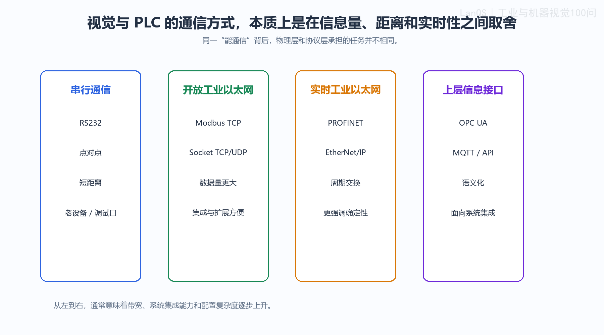

<strong>图48-1 视觉系统与PLC通信方式的层次划分</strong>

图 48-1没有把各种协议简单排成“高低等级”，而是按工程用途分成几类：串行通信负责低复杂度、较长历史包袱的设备连接，开放型工业以太网更适合通用数据交换，实时工业以太网强调周期控制与确定性，上层信息接口则更多面向系统集成与信息互通。读者从这张图中应看出的，不是哪一种“最好”，而是每一类协议解决的问题不同。它对选型的帮助在于提醒我们先判断数据和时序需求，再看现场设备生态；它的边界在于图中只给出分类视角，具体项目仍需回到设备型号、协议栈支持情况和实测周期能力。

#### 48.2 RS232和RS485各适合什么场景？
RS232是较早普及的串行通信标准，典型特点是点对点、连接简单、历史兼容设备多，但传输距离和抗干扰能力都比较有限，更多出现在老设备对接、参数配置口、调试口或小规模单设备通信场景。若视觉设备只需和单台控制器交换少量命令或结果，且现场距离不长，RS232仍然可能是可行方案。

RS485则采用差分传输，抗干扰能力更强，布线距离更长，也支持多节点挂接，因此在工业现场更常见。Modbus RTU大量运行在RS485之上，就是因为这条链路在低到中等带宽、较长距离和较复杂电磁环境下具备较好的实用性。需要提醒读者的是，RS485描述的是物理层，不等于通信协议本身；真正决定寄存器含义、主从角色和报文格式的，还是上层协议。

从规格上看，RS232 采用单端信号传输，最长约 15m，典型速率 9.6~115.2kbps，点对点通信。RS485 采用差分信号传输，最长 1200m，速率最高约 10Mbps，最多挂接 32 个节点，是 Modbus RTU 的物理层基础。两者均只定义物理层，帧格式和主从角色由上层协议决定。

#### 48.3 TCP/IP和原始Socket通信的工程位置是什么？
当视觉系统和PLC都具备以太网接口时，可以通过TCP/IP建立更灵活的数据通道。有些系统直接使用厂商封装好的工业协议，有些则采用Socket TCP、UDP实现自定义报文交互。这类方式的优点是开放性好、携带数据方便、便于融入已有网络基础设施，也更容易把视觉结果继续送往数据库、制造执行系统（MES，Manufacturing Execution System）或上位监控系统。

不过，自定义Socket虽然灵活，却把协议定义、字段解释、异常处理、重连策略和版本兼容责任更多留给了集成方。若项目后续维护人员不足，或者跨厂商协同频繁，这种自由度很高的方式未必最省心。教材里写这部分时，既要让读者看到它的扩展性，也要让他们意识到，能够发出数据并不等于后期就容易维护。

#### 48.4 Modbus RTU和Modbus TCP的差别在哪里？
Modbus RTU运行在串行链路上，最典型的是RS485；Modbus TCP则把相近的数据模型封装到以太网之上。两者在工程上的共通点，是都采用寄存器、线圈映射这种比较直观的数据组织方式，学习门槛不高，跨厂商支持也比较广。对于视觉系统而言，它可以把OK/NG、坐标、测量值和状态字映射到固定地址，PLC再按地址读取。

两者的主要差异在于承载介质与网络组织形式。RTU更适合总线式串行环境，硬件简单、历史设备多；TCP更适合现代以太网环境，布网、扩展和上位集成都更方便。教材里应避免把Modbus TCP直接说成实时网络协议。它能很好地完成结果交换，但如果项目对控制周期抖动和确定性要求很高，仍需结合控制器能力和网络实测来判断是否足够。

帧结构上，Modbus RTU 由地址域（1 字节）+ 功能码（1 字节）+ 数据域（N 字节）+ CRC 校验（2 字节）组成，采用主从轮询。Modbus TCP 将相同应用层数据封装到以太网帧中，端口 502，帧中以 6 字节 MBAP 头（含事务标识符支持并发）替代 RTU 地址域，CRC 由 TCP 层保证完整性而移除。两者功能码与数据格式完全相同。

#### 48.4.1 算例：固定结果报文在不同链路上的传输时间
设示例结果包含OK/NG 1 B、4个单精度浮点数共16 B、缺陷代码1 B和配方号1 B，总有效载荷为19 B。串行链路的传输时间可作一阶估算：

$$t_{tx}\approx\frac{N_{bits}}{R_{baud}}$$

其中 (N_{bits}) 是包含起始位、数据位、校验位和停止位的总位数，(R_{baud}) 是波特率。19 B和图中的各链路速率均为示例值，用于比较数量级，不是现场配置建议；设备处理、排队、PLC扫描、超时和重试会增加总延迟。

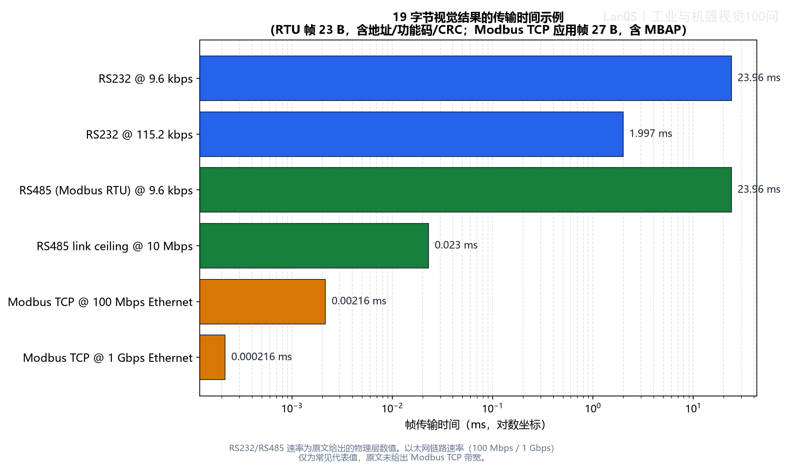

<strong>图48-2 固定视觉结果报文在不同链路上的传输时间示例</strong>

#### 48.5 PROFINET、EtherNet/IP这类工业以太网的价值在哪里？
这类协议不只是把普通以太网直接搬到工厂里使用。它们更强调设备建模、周期I/O交换、诊断信息和与主流PLC生态的深度集成。以PROFINET为例，视觉设备可以作为IO Device接入PLC控制系统，通过通用站点描述标记语言（GSDML，General Station Description Markup Language）描述设备数据区，PLC周期性读写结果；EtherNet/IP则在罗克韦尔体系中应用广泛，便于把视觉结果纳入统一的控制与诊断框架。

对于视觉项目来说，这类协议最大的价值通常不在理论带宽，而在于与控制系统协同更顺。配方切换、状态诊断、标准化组态、设备更换后的恢复和后期维护，往往都能从成熟工业网络生态中受益。它的边界同样需要说清：工业以太网更适合承载结果和状态，不代表PLC会直接吞吐大规模图像数据；图像采集链路和控制链路在很多系统中依然是分开的。

#### 48.6 还应当怎样建立对通信方式的整体认识？
比较稳妥的理解方式，是把它们分成四个层面。其一是物理接口，例如RS232、RS485、以太网口；其二是数据交换协议，例如Modbus RTU、Modbus TCP、Socket报文；其三是工业控制生态协议，例如PROFINET、EtherNet/IP；其四是信息化接口，例如 OPC统一架构（OPC UA，Open Platform Communications Unified Architecture）、消息队列遥测传输（MQTT，Message Queuing Telemetry Transport）或面向上层系统的应用程序接口（API，Application Programming Interface）。不同项目关心的重点并不相同，有的只要把结果可靠送到PLC，有的还要继续上送到MES、数据库或云端平台。

因此，真正的选型过程，往往是先界定本项目的数据路径、控制路径和信息路径，再判断每一段链路适合使用什么技术，而不是在一串协议名里直接寻找“最强”的那个。

#### 48.7 通信方式选定后还需要核对哪些运行参数？

报文传输时间只是通信预算的一部分。完整预算还应包括设备组帧、发送排队、交换机转发、接收解析、PLC 通信任务和应用程序处理时间。对串行链路，还要考虑字符格式、起始位、停止位和协议间隔；对 TCP 或工业以太网，还要考虑连接建立、重传、周期任务和网络负载。固定报文的理论传输时间可以作为下限，不能直接当作端到端响应时间。

接口设计还应明确超时和恢复策略：请求多久没有响应算失败，失败后是否重试，重试会不会造成重复执行，断线恢复后是否需要重新发送配方或清空旧结果。对于涉及剔除和运动控制的结果，建议同时设计序号、心跳和结果有效位，让控制器能够识别“旧数据仍在”“设备已断线”和“本次结果为 NG”这三种不同状态。

验收时应在空载、正常负载、网络高负载、设备重启和短时断线条件下分别测量响应时间与丢包恢复。最终记录的应是平均值、最大值和异常次数，而不是只记录一条理想条件下的通信时间。

### 常见误区

- 把RS232、RS485、Modbus和TCP/IP当成同一层级的概念；前两者主要描述电气接口，Modbus描述应用协议，TCP/IP描述网络协议栈。
- 只比较标称波特率或网速，不核对报文长度、设备处理时间和PLC通信任务周期。
- 认为工业以太网一定要传输原始图像；多数项目只传结构化结果、状态和控制数据。

### 术语与符号表

| 术语 | 说明 |
|---|---|
| RS232 | 点对点串行接口，节点数量和布线距离通常有限。 |
| RS485 | 差分串行接口，可在总线上连接多个节点，通常比RS232更适合长距离和复杂现场。 |
| Modbus RTU | 运行在串行链路上的Modbus帧格式。 |
| Modbus TCP | 运行在TCP/IP上的Modbus实现，使用MBAP头。 |
| Socket | 应用程序直接收发TCP或UDP数据的接口，报文内容需要双方自行约定。 |

### 延伸阅读

应结合设备手册、协议实现说明和网络规划，确认电气接口、帧格式、超时、重连和字节序规则。

> **引用出处**：RS232/RS485 物理层规范与 Modbus RTU/TCP 帧结构参见 Modbus 协议标准（Modbus Organization）及相关工业通信技术资料。

---

## 第49问：什么是Modbus通信中的寄存器、线圈、保持寄存器和输入寄存器？视觉系统如何映射检测结果？

### 49. 什么是Modbus通信中的寄存器、线圈、保持寄存器和输入寄存器？视觉系统如何映射检测结果？

#### 49.1 Modbus里最容易混淆的几个名词分别指什么？
Modbus把数据对象分成几类，其中最常见的就是线圈、离散输入、保持寄存器和输入寄存器。线圈（Coils）通常表示可读可写的单比特量，适合表达启动、使能、复位等命令状态；离散输入（Discrete Inputs）通常表示只读的单比特量，适合表达完成、报警、传感器状态等反馈。保持寄存器（Holding Registers）是可读可写的16位数据单元，常用于配方参数、阈值设定、控制命令或需要PLC写入的结果缓冲区；输入寄存器（Input Registers）则是只读的16位数据单元，常用于采样值、测量结果和状态数据。

这四类对象之所以重要，不在于名称本身，而在于它们实际上规定了“谁可以写、谁可以读、数据有多宽”。如果视觉系统与PLC在这一步理解不一致，后续再谈地址号、数据格式和解析方式都没有意义。

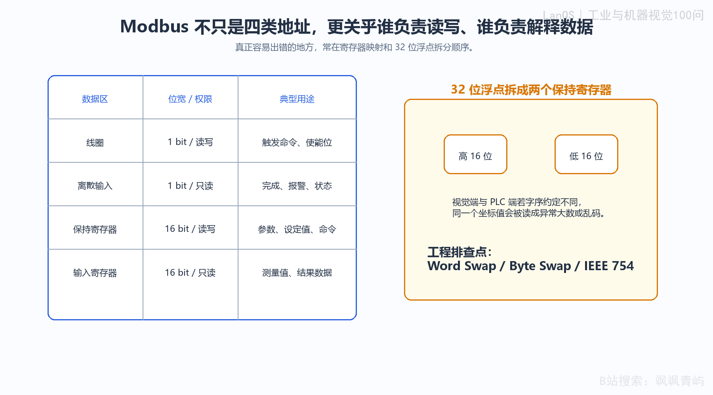

<strong>图49-1 Modbus数据对象与视觉结果映射关系</strong>

图 49-1左侧把Modbus中四类常用数据对象按“位数据”和“字数据”分开，右侧则补出视觉项目中最常见的映射场景。线圈更适合承载启动、复位、使能等控制命令，离散输入常用于完成、故障或OK/NG这类单比特反馈；保持寄存器与输入寄存器则更适合承载坐标、尺寸、角度、分数值和状态字。读者看这张图时，最需要建立的是“对象类型决定使用习惯”的意识，而不是死记编号。它对工程诊断也很有帮助，因为一旦发现某个量既要被PLC写入又要被视觉读取，就应优先考虑保持寄存器而不是输入寄存器。

#### 49.2 视觉系统通常怎样把结果映射到Modbus对象？
若检测任务只需要回传少量状态，视觉系统可以把“检测完成”“OK/NG”“故障”“忙”映射到线圈或离散输入；若任务包含坐标、尺寸、灰度统计值、缺陷面积、字符识别结果编号等数值字段，则更常映射到保持寄存器或输入寄存器。实际使用哪一种，取决于视觉设备是把自己设计成“由PLC读取的被动从站”，还是允许PLC向其写入命令和参数。

在多数PLC主导的系统里，视觉设备常扮演从站角色，PLC发起读写请求。这样做的好处是控制权集中，节拍与异常处理更容易统一；但也存在例外，例如某些上位机主导系统或多设备协同系统中，视觉侧也可能主动作为主站去访问其他模块。更准确的说法是，在常见产线架构中，PLC更常作为主站，但角色仍取决于系统设计。

#### 49.3 地址号为什么经常让初学者出错？
一个常见误区，是把资料中的“40001、30001、00001”这类表示法，当成设备内部真实地址。很多手册里的前缀编号只是为了帮助区分对象类型，真正通信帧里使用的往往是从零开始或按厂商定义偏移的地址。也就是说，手册写“40001”并不必然意味着程序里就要直接写40001。

因此，做Modbus对接时必须同时确认三件事：设备文档给出的地址表示方式、PLC或组态软件要求填写的地址格式，以及对象类型本身。很多所谓“通信不通”，最后并不是线路或波特率问题，而是地址偏移理解错了，或者把保持寄存器地址当成输入寄存器去读。

#### 49.4 32位整数和浮点数为什么经常读错？
Modbus的基本寄存器宽度是16位，而视觉系统中的坐标、距离、面积、分数值常常是32位整数或IEEE 754浮点数。这样一来，一个数值就需要拆成两个连续寄存器保存。问题在于，不同设备对高字、低字、字节顺序的安排并不完全一致，于是就出现了常说的 Word Swap、Byte Swap 等兼容问题。

工程上最可靠的做法，是用一个已知数值做联调验证，而不是凭经验猜顺序。例如把一个容易识别的浮点数写入视觉侧，再在PLC端查看两寄存器原始值；确认字序后，再批量解释其他字段。若教材只告诉读者“浮点数要占两个寄存器”却不补这一层，他们到现场时往往会在这里卡住很久。

#### 49.5 下面这个映射表应当怎样理解？

<strong>表39-1 视觉结果的典型Modbus映射示例</strong>

| 数据对象 | 访问属性 | 典型字段 | 工程含义 |
| --- | --- | --- | --- |
| 线圈 | 读/写 | 启动检测、结果复位、配方切换允许 | PLC下发控制命令 |
| 离散输入 | 只读 | 检测完成、OK/NG、故障、忙状态 | 视觉侧反馈单比特状态 |
| 保持寄存器 | 读/写 | 阈值、配方号、任务编号、结果缓存 | 既可写参数，也可读结果 |
| 输入寄存器 | 只读 | X/Y坐标、角度、尺寸值、评分值 | 视觉侧输出测量数据 |

这张表的阅读重点，不是把每一列当成固定标准答案，而是理解它体现出的分工习惯。某个项目究竟把测量值放在保持寄存器还是输入寄存器，仍取决于设备设计；但若一个字段明确不应被PLC改写，那么把它放入只读对象通常更清晰，也更安全。

#### 49.6 写Modbus映射时有哪些实用原则？
第一，结果字段应尽量连续编排，便于PLC批量读取，减少离散访存带来的程序复杂度。第二，状态位和数值位最好分区，避免维护时混在一起难以定位。第三，文档必须同时写清地址、数据类型、单位、缩放关系和字节顺序，否则项目一旦交接，很快就会变成“能通信但没人敢改”。第四，对浮点数、带符号整数和枚举型缺陷代码，最好给出样例值，便于现场快速验证。

从教学角度看，Modbus最值得让读者建立的能力，不在于背诵功能码，而在于把结果映射写成一份可对接、可验证、可维护的接口说明。只有做到这一点，视觉系统输出的检测结果才能真正顺畅地进入PLC逻辑与后续设备动作。

#### 49.6.1 算例：建立并验证视觉结果寄存器映射
一组示例映射可以这样安排：`Coil 00001`表示启动或允许，`Discrete Input 10001`表示传感器状态，`Holding Register 40001`表示结果状态字，`40002–40003`存放一个32位浮点测量值，`40004`存放缺陷代码。保持寄存器通常可读写，输入寄存器通常只读；具体权限取决于设备角色和协议实现。

32位浮点数要同时核对两个顺序：每个16位寄存器内部的字节顺序，以及两个寄存器之间的字序。IEEE 754规定浮点数的二进制表示，但不规定某个Modbus设备是否交换两个16位字。双方应使用已知测试值验证，不能凭地址编号猜测。

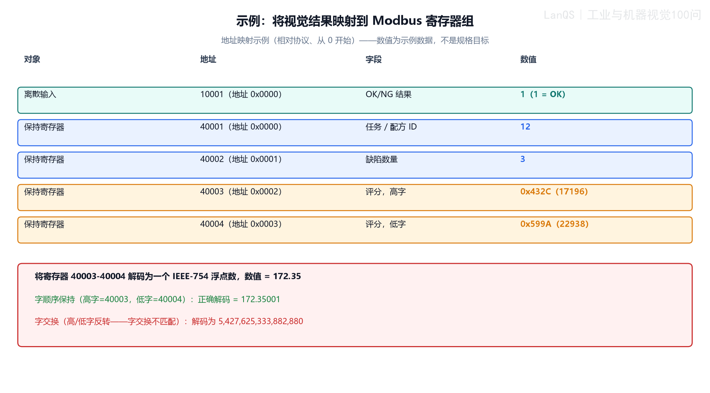

<strong>图49-2 视觉结果映射到Modbus寄存器组的示例</strong>

#### 49.7 如何用最小测试集验证一张寄存器映射表？

测试集不应只放一个正常的正整数。至少应包含状态位切换、负数、带小数的测量值、零值、最大允许值、越限值、无效值和通信超时。浮点数建议使用容易识别的测试值，例如 1.0、12.34 和 -5.5；若接收端显示出数量级异常或正负号相反，优先检查字节序和字序。

每个字段还要验证刷新条件。结果寄存器是在曝光完成后更新，还是在算法完成后更新？状态位先变化还是测量值先变化？如果 PLC 先读到新状态、后读到旧测量值，就可能把两次检测的数据拼在一起。常见做法是使用“数据有效位—数据字段—确认位”或递增序号，接收端只在字段和序号满足一致性条件时采纳结果。

映射表交付时应同时保存一组实际报文、对应的寄存器快照和 PLC 解析结果。这样后续更换视觉软件、PLC 程序或网关时，可以用同一组测试数据做回归验证，而不必重新依赖现场工件。

### 常见误区

- 看到40001就认为报文中的地址字段也应填写40001；不同手册可能使用人类可读地址或从0开始的偏移量。
- 混淆线圈、离散输入、保持寄存器和输入寄存器，忽略它们的数据类型与读写方向不同。
- 只用正整数测试，不验证浮点数、负数和边界值，导致字节序问题在生产中才暴露。

### 术语与符号表

| 术语 | 说明 |
|---|---|
| Coil | 线圈，通常表示可读写的单个位输出或命令状态。 |
| Discrete Input | 离散输入，通常表示只读的单个位现场状态。 |
| Holding Register | 保持寄存器，16位寄存器，常用于可读写参数和结果数据。 |
| Input Register | 输入寄存器，16位只读寄存器，常用于测量值或设备状态。 |
| 字序 | 多个16位寄存器组成32位数时，各寄存器之间的排列顺序。 |

### 延伸阅读

映射表应同时记录逻辑字段、对象类型、协议地址、数据类型、单位、缩放系数、读写权限、字节序、刷新条件和无效标志。

---

## 第50问：在什么情况下会选择通过工业以太网而不是简单I/O与PLC交互？

### 50. 在什么情况下会选择通过工业以太网而不是简单I/O与PLC交互？

#### 50.1 为什么简单I/O并不总是够用？
简单I/O最大的优势是直接，但它能表达的内容终究有限。只要视觉系统输出的不只是OK/NG，而是包含多个测量值、定位坐标、缺陷类型、OCR结果、配方状态、任务编号或设备诊断信息，I/O数量就会迅速膨胀，接线和程序映射都会变得笨重。对于需要追溯和维护的系统来说，这种方式很快会暴露出信息组织能力不足的问题。

另一个限制来自系统扩展。今天项目也许只传一个合格信号，明天可能要加多工位、多配方、多类别结果，后天又要把数据送给上位系统。若一开始就把交互建立在大量离散线之上，后续改造成本往往偏高。工业以太网的吸引力就在于，它允许控制系统在不显著增加布线复杂度的情况下承载更多结果字段，也更容易纳入标准化组态与集中维护。

#### 50.2 哪些场景更适合优先选择工业以太网？
当视觉系统需要向PLC持续返回结构化结果时，工业以太网通常比I/O更合适。例如尺寸测量需要返回多组数值，定位引导需要返回坐标和角度，字符识别要返回文本或编号，多缺陷分类还要返回类别代码与状态字。在这些情况下，若仍坚持只用I/O，最终往往要么线数过多，要么编码规则过于绕，既不利于调试，也不利于交接。

对于多设备网络，工业以太网同样更有优势。多台相机、多个智能传感器、若干远程I/O站和一台PLC若需要统一纳管，网络化接口更容易组织成可扩展架构。它还方便做远程诊断、设备替换和状态监控，这些在成熟产线中通常不是附加功能，而是降低停机时间的重要手段。

#### 50.2.1 算例：结果字段增加时I/O点数如何增长
设每个检测字段平均需要一个状态位或一个16位数值字段，另加触发、完成、故障和握手信号。随着字段数量增加，硬接线点数近似线性增长；若字段包含32位数值或多类别状态，实际点数还会增加。这个算例只用于说明扩展性，不代表某个设备的固定I/O分配。

工业以太网通常只需建立一条通信连接，再在数据区中增加字段。代价转移到了协议配置、数据映射、诊断和网络维护，因此不能只以“线少”作为选择依据。若结果只有OK/NG且系统要求简单，I/O仍可能更合适；若需要尺寸、坐标、缺陷类别、任务号和追溯信息，网络通信的整体成本通常更可控。

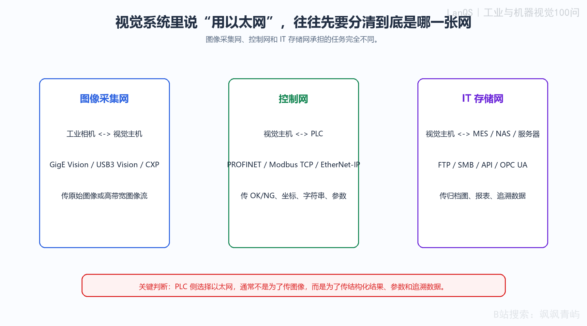

<strong>图50-1 机器视觉项目中的三类网络分工</strong>

图 50-1把机器视觉系统里经常被混谈的三类网络拆开了：图像采集网络负责把大带宽图像送到视觉处理单元，控制网络负责把结果与状态交给PLC，IT或存储网络负责追溯、报表与长期保存。读者应从这张图中形成一个清晰判断：工业以太网用于PLC交互时，关注重点通常是结果字段、周期交换和设备诊断，而不是原始图像本身。它对系统选型的价值在于避免把所有流量都塞进同一条网络；它的使用边界也很明确，若项目规模小、字段极少、节拍简单，强行三网分离反而会增加复杂度，仍需按项目规模和维护能力取舍。

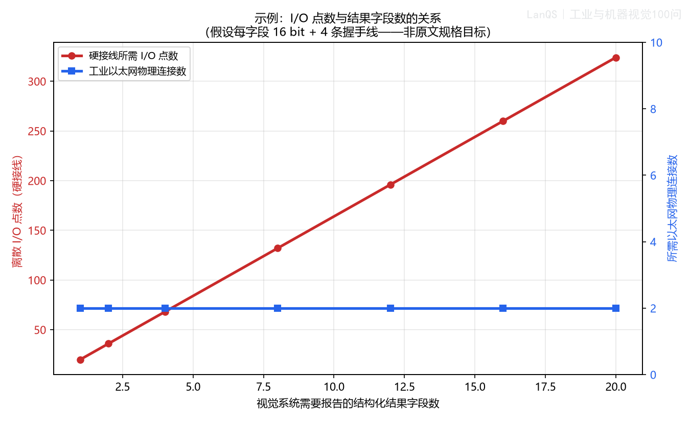

<strong>图50-2 检测结果字段增加时硬接线点数与工业以太网连接的示例比较</strong>

#### 50.3 选择工业以太网，是不是意味着要把图像直接交给PLC？
通常不是。这里必须把图像采集链路和控制结果链路分开。工业相机产生的图像数据往往进入视觉控制器、工控机或智能相机内部处理单元，由这些设备完成算法计算后，再把结果通过工业网络交给PLC。PLC更擅长处理状态、参数和控制逻辑，而不是承载原始图像流、图像缓存和视觉算法运算。

如果把这层分工讲清楚，读者后面在做系统架构时就不容易误把“以太网通信”理解成“PLC接图像”。在绝大多数机器视觉项目中，PLC侧网络接口承载的是控制相关的数据结果，图像与大文件更常留在视觉侧或上传到上位IT系统。

#### 50.4 除了信息量，工业以太网还带来哪些工程收益？
工业以太网带来的不只是多传几个字段。在成熟设备生态中，它通常伴随标准化诊断、设备识别、参数下载、远程维护、配方切换和故障定位能力。对维护团队而言，这些能力往往比单纯的通信速度更有价值，因为它们决定了系统出问题时能否快速恢复。

此外，网络接口更适合与上层系统衔接。视觉结果若需要进入监控与数据采集系统（SCADA，Supervisory Control and Data Acquisition）、制造执行系统、数据库或质量追溯平台，工业以太网和上层信息接口之间的衔接通常比离散I/O自然得多。也正因为如此，在中大型项目里，控制系统往往不再把视觉单元视为一台只会亮灯输出OK/NG的外设，而是把它视为网络中的一个数据节点。

#### 50.5 那么，什么时候仍然应该优先选择简单I/O？
当检测逻辑简单、只需合格、不合格两类状态、节拍极快且维护人员对硬接线最熟悉时，I/O仍然是非常合理的选择。尤其是在单工位、小系统、低成本设备或环境较单纯的场合，简单I/O往往具有更直接的可调试性。系统越简单，越没有必要为了“看起来更先进”而引入额外协议栈和组态复杂度。

工程上最怕的不是接口简单，而是接口与任务不匹配。若信息需求本来就很少，却为了追求形式上的网络化引入复杂通信，后期维护未必更轻松；反过来，若结果字段早已明显超出I/O适用边界，却仍强行用硬接线编码，最终也会把系统拖入难维护状态。判断标准始终应当回到任务本身，而不是停留在接口名称上。

#### 50.6 如何建立更稳妥的选择原则？
比较实用的原则是从三方面同时判断。第一，看结果字段是否已经超出离散状态层面；第二，看系统是否需要诊断、追溯、远程维护和后期扩展；第三，看现场团队是否具备相应的网络调试与维护能力。只满足第一条而维护能力不足时，可以考虑“关键状态走I/O、详细结果走网络”的混合架构；三条都满足时，工业以太网通常更值得优先规划。

换一种更贴近现场的话来说，I/O更像一条短而直接的结果线，工业以太网则更像一套可扩展的数据通道。项目越复杂、字段越多、生命周期越长，网络化交互的价值就越明显；项目越单纯、节拍越直接、任务越窄，I/O的朴素优势就越难被替代。把这个边界看清楚，读者在后续做视觉系统集成时，就不容易陷入“凡是上网络就一定更好”的误判。

#### 50.7 如何把 I/O 与工业以太网的选择写成工程决策？

可以先列出结果字段，再按四个问题筛选：结果是否只有少量离散状态；是否需要传递坐标、尺寸、类别和追溯编号；是否需要诊断、配方和远程维护；现场团队是否能够维护网络和协议。前两个问题决定信息量，后两个问题决定生命周期成本。只有把这四项放在同一张决策表中，接口选型才不会被网速或接线成本单独带偏。

还要把控制链路和图像链路分开计算。工业以太网通常承载结构化结果、状态和配置，原始图像仍由 GigE Vision、USB3 Vision、Camera Link 或 CoaXPress 等图像接口传输。若把两者混为一谈，容易误以为 PLC 需要处理原始图像，也容易漏算视觉主机、交换机和控制器之间的带宽与实时性要求。

最终方案应形成“字段表、时序图、故障策略和验收用例”四份文档。小型设备可以只保留少量状态和简单握手；中大型设备则宜采用 I/O 传递关键联锁和完成信号，网络传递详细结果、诊断信息和配方数据。这样的混合结构通常比单纯追求一种接口更容易维护。

### 常见误区

- 认为工业以太网的价值只有传输更多数据；确定性、诊断能力、配方切换和多设备协同同样重要。
- 认为用了工业以太网就必须把图像送入PLC；常见架构仍是图像在视觉侧处理，PLC接收结果和状态。
- 只比较初始接线成本，不评估网络诊断、协议维护和现场人员能力。

### 术语与符号表

| 术语 | 说明 |
|---|---|
| 简单I/O | 通过离散电平直接传递少量状态的接口方式。 |
| 工业以太网 | 面向工业控制的以太网通信体系，通常强调周期通信、诊断或确定性。 |
| 信息量 | 结果链路需要传递的状态位、数值、坐标、类别和追溯字段总量。 |
| 确定性 | 在规定负载和配置下，通信延迟与抖动能够被约束和验证的程度。 |

### 延伸阅读

实际选型应把结果字段表、节拍预算、故障策略、维护流程和网络拓扑一起评估，并用现场负载测试确认通信延迟与丢包恢复行为。

## 第51问：什么是PROFINET或EtherCAT？视觉系统能接入这种总线吗？

### 51. 什么是PROFINET或EtherCAT？视觉系统能接入这种总线吗？

#### 51.1 PROFINET和EtherCAT分别是什么，它们的基本特性是什么？

PROFINET和EtherCAT都属于工业以太网通信体系，常用于PLC（可编程逻辑控制器）、伺服驱动器、远程I/O、机器人控制器和视觉控制器之间的数据交换。它们都建立在以太网物理层基础上，但实时机制、设备组织方式和典型应用场景并不相同。

PROFINET更强调与标准工业以太网架构的兼容。它既可以承载普通TCP/IP通信，也可以承载实时控制通信；当系统对同步精度要求较高时，还可以使用IRT（Isochronous Real Time，等时实时）机制，把通信抖动控制在较低水平。因此，PROFINET在大型产线、分层控制和多厂家设备集成中比较常见。

EtherCAT则更强调控制周期和同步效率。它把控制数据直接嵌入以太网帧中，数据帧沿链路依次经过各从站时，每个从站只处理与自己相关的那一部分数据，因此协议开销小、周期短，适合多轴同步和高速分布式控制。EtherCAT常与DC（Distributed Clocks，分布式时钟）机制配合使用，以建立全网统一的时间基准。

对初学者来说，最需要先分清的是两类接口的职责：PROFINET和EtherCAT负责控制结果、状态量、同步信息与设备协同；GigE Vision、USB3 Vision、Camera Link和CoaXPress负责图像传输。这两类接口可以同时存在于同一套视觉系统中。

从性能数据上看，PROFINET RT（基于软件调度）典型循环时间约 1~10ms，适合 PLC 类应用；IRT 依赖专用硬件将循环时间压到 1ms 以下，同步抖动 <1μs，适合运动控制。EtherCAT 将控制数据嵌入标准以太网帧（EtherType 0x88A4），帧在沿链路经过各从站时在硬件层即时读写（on-the-fly），无需完整接收再转发，循环时间可低至 100μs 以下。EtherCAT 内建的分布式时钟（DC）通过每个节点收发时间戳自动补偿路径延迟，同步精度可达约 1ns，等效于 IEEE 1588 PTP 且无需额外硬件。

#### 51.2 这两种工业总线在技术架构上有何不同？

两者最核心的差别，在于它们组织实时通信的方式不同。

PROFINET更容易融入常规工业以太网网络结构。系统中可以同时存在标准交换机、工程站、上位机和实时控制设备，因此它的系统边界较宽，兼容性和工程生态往往更强。

EtherCAT则更像一条围绕控制效率设计的高速现场总线。数据帧在网络中连续流过多个从站，各从站在帧经过时即时读写自身数据，不需要像传统分组转发那样完整收发再处理。这种机制特别适合伺服轴数量多、同步要求高、控制周期短的设备。

教材里还应把“网络拓扑”和“协议机理”分开理解。星形、树形、线形、环形描述的是布线和网络连接方式；IRT、DC、周期调度和帧内处理描述的是实时通信机理。不能把某一种拓扑直接等同于某一种协议性能。

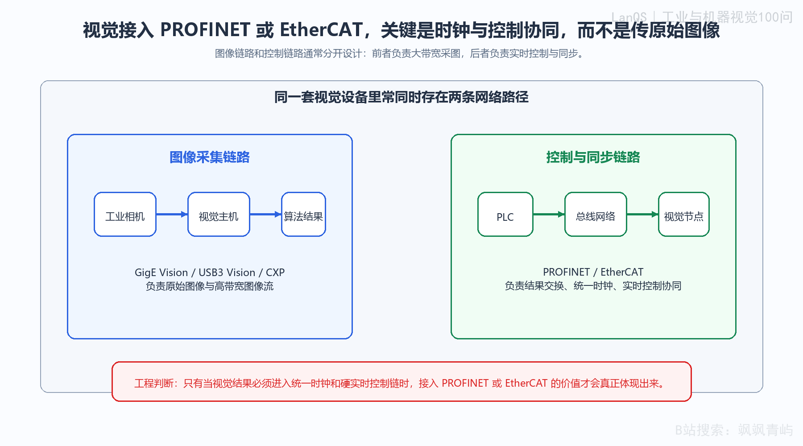

<strong>图51-1 视觉系统中的图像链路与控制链路分工</strong>

图 51-1把视觉系统中经常被混谈的两条链路拆开了。左侧的图像采集链路负责把原始图像送到视觉主机或智能相机内部处理单元，右侧的控制与同步链路则把结构化结果、设备状态和统一时钟送入PLC与运动控制系统。读这张图时，读者应把注意力放在“图像流”和“控制流”承担的任务差别上。它帮助回答的是，为什么很多项目中既要有图像接口，又要有工业实时总线；它的适用边界也很明确，若视觉系统只需独立完成检测并返回少量结果，并不一定需要把自己纳入硬实时控制网络。

#### 51.3 高端视觉系统为什么必须接入PROFINET或EtherCAT这样的硬实时总线？

如果视觉系统只需把OK/NG结果、少量尺寸值或目标坐标回传给PLC，普通TCP/IP、Modbus TCP甚至离散I/O往往已经足够。高端视觉系统之所以会接入PROFINET或EtherCAT，关键不在“把图像传得更快”，而在于让视觉测量结果进入统一时基下的控制链条。

这在多相机3D视觉、高速飞拍分拣、连续卷材检测、半导体对位和锂电设备中非常常见。视觉系统不再只是独立的检测单元，而是与伺服轴、机器人、光源控制器和触发模块共同参与一套严格受控的时序系统。此时，系统需要保证“什么时候拍”“在哪个位置拍”“拍完以后控制器按什么时刻解释结果”这几件事具有统一的时间基准。

以EtherCAT为例，若视觉节点、伺服驱动器和控制器共享DC时钟，PLC就可以按绝对时间或绝对机械位置下发动作命令。例如，在主轴运行到指定位置时，让多台相机同时曝光。这样做减少了传统硬触发布线的复杂度，也降低了电平传播、线路长度和外部接口链路带来的附加误差。

因此，接入硬实时总线的真正价值，是把视觉系统从"结果上报设备"提升为"统一运动控制节拍中的测量节点"。

从工程需求看，高端视觉接入硬实时总线集中在两类场景：第一，伺服轴同步——相机触发时刻须与机器人/电机位置纳秒级对齐，普通 TCP/IP 毫秒级不确定性无法保证重复精度；第二，确定性响应——检测结果须在固定时间窗口内到达 PLC，不能因网络抖动导致节拍偏差，硬实时总线将通信锁定在硬件调度层。

#### 51.4 视觉系统如何接入PROFINET或EtherCAT总线？

常见方式大体有三种。

第一种是原生接入。部分高端视觉控制器、智能相机或一体化机器人视觉单元本身就带有PROFINET或EtherCAT从站接口，可以直接挂到PLC或运动控制网络中。这种方式结构清晰，同步能力强，适合新建产线或节拍要求很高的设备。

第二种是通过协议网关接入。视觉系统按原来的图像链路工作，再由协议网关把结果转换成PROFINET或EtherCAT可识别的数据区或对象。它的优点是改造成本较低，不必更换现有视觉软件和相机链路；缺点是总时延、诊断链路和同步能力通常不如原生接入明确。

第三种是基于PC的软件协议栈方案。此时PC既负责图像处理，也负责与工业总线交换结果数据。它的灵活性较高，但实时性受操作系统调度、驱动实现和硬件平台影响较大，必须做实际时延和抖动测试，不能只根据“支持某协议”就推断系统一定能稳定闭环。

工程上做方案选择时，至少要先回答两个问题：视觉节点是只交换结果数据，还是还要参与同步触发与统一时钟；它是普通数据从站，还是整条控制链上的时间关键节点。这两个问题决定了系统复杂度，也决定了设备成本和调试深度。

#### 51.5 视觉系统接入工业总线面临哪些技术挑战？

第一类挑战是实时性。视觉系统内部包含曝光、图像传输、图像处理和结果下发几个阶段。即使总线本身周期很短，只要图像处理时间波动较大，整条链路仍然可能无法形成稳定的时间闭环。

第二类挑战是同步精度。多相机系统常要求“同一时刻曝光”或“在同一机械位置采样”。这时不仅要同步PLC和伺服轴，还要确认相机、触发板卡、光源控制器和视觉控制器是否真的共享统一时间基准。

第三类挑战是数据路径分离。控制网络通常并不适合直接承载高带宽原始图像流，因此很多项目会把图像采集网络和控制结果网络分开设计。初学者容易把“都叫以太网”误解为“所有数据都走同一张网”，这是系统架构里很常见的误区。

第四类挑战是诊断和维护。视觉问题往往横跨相机、镜头、光源、算法、网络和控制器，一旦接入工业总线，虽然集成能力增强了，但问题定位不一定更简单，反而要求更完整的时间戳、状态字、日志和诊断信息。

#### 51.6 如何验证系统确实实现了确定性时序？
验证不能停留在“协议支持”或一次成功通信上。EtherCAT现场排查可按以下顺序进行：先查看主站事件日志，确认掉线的站地址和时间；再读取该从站的AL Status Code，区分状态机、看门狗和通信类故障；随后检查其DL状态以及各端口的CRC、链路丢失等计数器，定位上游或下游物理连接；最后与设备RUN、ERR、L/A指示灯交叉确认。

网关延迟应对触发输入和结果输出同时打时间戳，连续采集约1000–10000个周期，并报告平均值、最大值和P99或P99.9，而不是只记录一次读数。可使用支持精确时间戳的网络分析设备，也可用双通道示波器分别捕获物理触发脉冲和网关输出的GPIO脉冲。PROFINET IRT的实时窗口由支持IRT的交换设备按计划保留，普通TCP/IP和大块视觉数据应放在开放窗口、独立网络或独立网卡中；非IRT设备、配置错误或过大的在途帧仍可能造成时序问题。

#### 51.7 在实际应用中，视觉系统接入工业总线有哪些典型场景？

汽车装配线中，视觉系统常与机器人和夹具伺服轴联动，用于定位补偿、装配确认和在线质量检测。此时视觉结果进入控制系统后，会直接影响机器人动作与工艺节拍。

锂电、半导体和精密装配设备中，视觉系统更常参与高精度对位、边缘检测和闭环修正。与这类任务相比，普通结果上报已经不是重点，真正关键的是多轴运动、曝光时刻和视觉测量结果的统一解释。

包装和物流分拣系统中，视觉系统识别条码、外形和姿态后，把结果交给PLC或机器人控制器，由后者执行实时分拣。这类场景对控制节拍和结果通信的稳定性要求较高，但图像本身通常仍留在视觉侧处理。

卷材检测、线扫描成像和高速印刷系统中，视觉系统常与编码器、运动轴和触发模块共享统一时基，用于飞拍、位置锁定采样和多帧拼接。

#### 51.8 未来视觉系统与工业总线集成的发展趋势是什么？

一个明显方向，是标准工业网络、统一时间同步和软件化控制继续融合。TSN（Time-Sensitive Networking，时间敏感网络）之所以受到关注，正是因为它试图把标准以太网基础设施与确定性控制需求更好地统一起来。

另一个方向，是边缘计算增强。越来越多视觉节点不只输出OK/NG，还输出位姿、置信度、缺陷类别、质量指标和模型状态。这意味着视觉系统在控制系统中的角色越来越接近“可诊断、可建模的测量节点”，而不再只是一个黑盒结果源。

从工程判断看，是否接入PROFINET或EtherCAT，不应只看设备清单里"支不支持"，而应看项目是否真的需要把视觉结果纳入统一时钟和硬实时控制链中。只有在这个条件成立时，工业实时总线的价值才会充分体现。

> **引用出处**：PROFINET RT/IRT 性能数据与 EtherCAT on-the-fly 机制，参见 EPC Industrial Ethernet White Paper WP-2019（www.encoder.com/wp2019）及 Dewesoft *What Is EtherCAT Protocol*（dewesoft.com/blog/what-is-ethercat-protocol）。

##### 51.8.1 算例：抖动等级与位置不确定度
运动中的位置不确定度可作一阶估算：

$$\Delta x=v\Delta t$$

例如 (v=1\ \mathrm{m/s}) 时，5 μs抖动对应约0.005 mm位置不确定度，2 ms抖动对应约2 mm。2 ms是用于比较的示例值，不是TCP/IP固定指标；实际项目应使用实测的P99或最大值，并把曝光、传输、处理和执行延迟全部纳入预算。

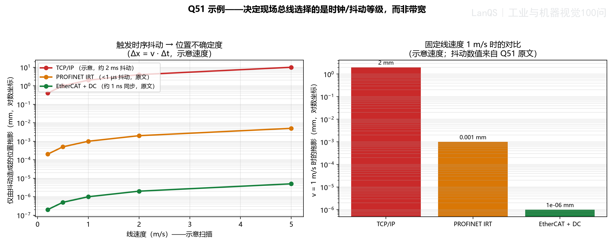

<strong>图51-2 抖动等级与运动位置不确定度示例</strong>

---

### 常见误区

- 把PROFINET或EtherCAT当成图像传输接口；它们主要承担控制、状态和同步，图像通常走GigE Vision、USB3 Vision、Camera Link或CoaXPress。
- 只看总线标称周期，不测视觉曝光、传输、算法和结果下发组成的端到端延迟。
- 认为IRT或DC自动消除了所有延迟；它们改善时基和通信确定性，不能替代图像处理能力与现场验证。

### 术语与符号表

| 术语 | 说明 |
|---|---|
| PROFINET | 工业以太网通信体系，可承载标准通信、实时通信和IRT等不同等级的控制流量。 |
| EtherCAT | 采用帧内即时读写机制的实时以太网现场总线，常用于高速分布式控制。 |
| IRT | Isochronous Real Time，等时实时机制，为确定性控制预留调度窗口。 |
| DC | Distributed Clocks，分布式时钟，用于建立网络设备的共同时间基准。 |
| 抖动 | 同一事件实际发生时间相对期望时间的变化量。 |
| P99 | 延迟样本的99%分位值，表示99%的样本不超过该延迟。 |

### 延伸阅读

可结合PROFINET、EtherCAT Technology Group和具体主站/从站厂商的诊断手册，进一步核对设备状态机、时间同步、拓扑扫描和周期数据配置。

## 第52问：产线的运动控制（如伺服电机）是由PLC做还是由视觉系统做？视觉引导定位（如机器人抓取）时，数据流是怎样的？

### 52. 产线的运动控制（如伺服电机）是由PLC做还是由视觉系统做？视觉引导定位（如机器人抓取）时，数据流是怎样的？

#### 52.1 产线运动控制中PLC和视觉系统的分工是怎样的？

在工业自动化产线中，PLC和视觉系统通常承担不同层级的任务。PLC更接近执行层控制，视觉系统更接近测量与感知层。

PLC负责的内容通常包括逻辑顺序控制、伺服轴启停、回零、定位、联动、安全互锁和故障处理。它的强项在于周期可预测、环境适应性强、与伺服驱动器和工业总线的结合成熟。

视觉系统则主要负责图像采集、识别、测量、定位、缺陷判断和坐标解算。它给控制系统提供的是“目标在哪里”“姿态如何”“结果是否可信”，而不是直接去承担伺服底层闭环。

因此，视觉系统一般不直接替代PLC控制伺服电机。更准确的理解是：视觉系统给出测量结果和修正量，PLC或机器人控制器根据这些结果决定执行动作。

#### 52.2 为什么PLC更适合做伺服电机的直接控制？

伺服控制的核心问题不是“算得快不快”，而是“能不能在确定周期内稳定执行”。位置环、速度环和电流环都要求控制周期固定、时序稳定、异常处理明确，这正是工业控制器擅长的部分。

PLC或专用运动控制器更适合直接控制伺服轴，主要有三个原因。第一，它们与伺服驱动器之间有成熟的实时总线和运动控制功能，便于实现多轴同步、电子齿轮、电子凸轮和轨迹协调。第二，它们的扫描周期、任务优先级和故障响应更加可预测。第三，它们天然与安全链、限位、抱闸、回零和互锁逻辑耦合紧密，适合长期稳定运行。

相较之下，视觉PC即使算力很强，也未必适合承担底层闭环。PC更适合做图像处理、路径生成、上层决策或离线优化；驱动器和PLC仍然更适合承担周期控制任务。

这里还需要区分两个概念：运动规划与伺服闭环。视觉系统可以参与运动规划，例如给出抓取位姿；而伺服闭环通常仍由驱动器和控制器完成。

#### 52.3 视觉系统在运动控制中扮演什么角色？

视觉系统在运动控制中最典型的角色，是“测量并提供修正量”。

以机器人抓取随机摆放工件为例，视觉系统先检测工件中心位置与姿态，再把位姿结果发送给机器人控制器。控制器据此完成坐标变换、轨迹规划和末端执行。此时视觉系统提供的不是某个电机轴的扭矩指令，而是抓取目标的空间信息。

常见输出形式包括平面偏移量 $(\Delta x,\Delta y,\Delta \theta)$、三维位姿 $(x,y,z,R_x,R_y,R_z)$、工件类别、抓取点、置信度、尺寸值和缺陷类别。对质量检测系统而言，视觉系统还可能输出报警码、测量统计值或工艺补偿量。

在一些闭环应用中，视觉系统还会承担二次确认。例如抓取后复拍、贴合后对位复核、装配后尺寸验证等。这样形成的就是“视觉测量 - 控制执行 - 视觉验证”的协同结构。

#### 52.4 视觉引导定位的完整数据流是怎样的？

一套可落地的视觉引导定位系统，通常至少包括触发、采图、识别、坐标转换、控制执行和反馈校验几个阶段。

第一阶段是触发与采图。工件到达预定位置后，光电开关、编码器或PLC发出触发信号，相机完成曝光。若节拍较高，还会同步控制光源脉冲。

第二阶段是视觉处理。视觉软件完成目标检测、边缘提取、模板匹配、三维重建或深度学习推理，并输出像素坐标、目标姿态或测量结果。

第三阶段是坐标转换。视觉结果最初属于相机坐标系或图像坐标系，必须通过标定关系转换到机器人坐标系、工装坐标系或世界坐标系。这一步决定了视觉结果能否真正落到执行机构上，是系统集成中的关键桥接环节。

第四阶段是控制执行。PLC或机器人控制器接收视觉结果后，结合当前轴状态、工艺约束和安全条件，生成可执行的运动轨迹，并通过实时总线下发到伺服驱动器。

第五阶段是反馈与校验。伺服轴通过编码器反馈实际位置；必要时视觉系统再次确认执行结果是否达到预期。

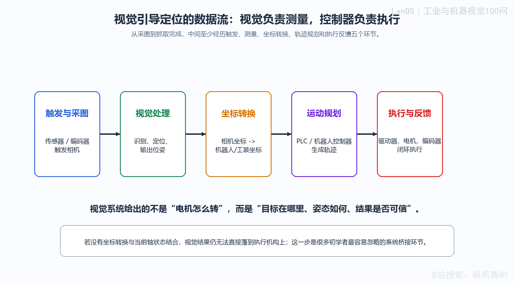

<strong>图52-1 视觉引导定位中的测量与执行数据流</strong>

图 52-1把视觉引导定位常见的五个关键环节顺序展开。读者应特别注意中间的“坐标转换”步骤，因为很多系统在实验台上能识别目标，却在上机联调时无法稳定抓取，问题往往就出在这里。视觉系统输出的是相机测得的位置与姿态，控制器需要的是执行机构可以理解的坐标与约束条件；只有这两者之间的映射明确，视觉结果才真正具有控制意义。该图适用于大多数抓取、对位和装配场景；若系统采用视觉控制器与机器人控制器一体化平台，部分模块会在软件架构上合并，但其逻辑分工并不会改变。

##### 52.4.1 算例：为什么视觉负责测量，而伺服闭环负责执行
设伺服位置环周期为1 ms，视觉曝光、图像传输、处理和结果发送分别需要5、8、20和3 ms，示例总延迟为36 ms。伺服环在这段时间内仍按自身周期运行，视觉结果作为带时间戳的目标修正量进入较慢的上层轨迹或位置指令，不应替代1 ms位置环。所有数值均为示例值，用于说明时间尺度差异。

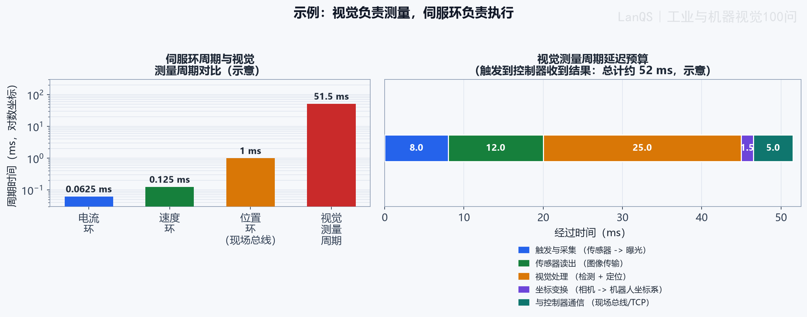

<strong>图52-2 伺服控制周期与视觉测量延迟预算示例</strong>

#### 52.5 结果没有按时到达时会发生什么？移动目标如何交接？
若视觉结果晚于工位允许的执行窗口，PLC不能把它当成当前产品的有效结果直接使用，否则会把上一件或下一件产品误剔除、误抓取。常见做法是给每次触发分配序号或产品ID，将图像、结果和机械位置绑定；结果到达时先检查ID、有效时间和位置窗口，再决定是否执行。

对于仍在运动的目标，系统可以把测得的坐标换算到控制器坐标系，并根据编码器位置或机器人当前状态预测交接时刻。预测模型必须经过实际延迟和速度变化验证；超出允许窗口时应进入等待、跳过或报警状态，而不是继续使用过期结果。

#### 52.6 现代工业自动化中PLC和视觉系统的集成趋势是什么？

当前的一个明显趋势，是平台更紧密，但职责边界仍然存在。现在常见的一体化控制平台，可以把PLC、运动控制和视觉部署在同一工程环境，甚至同一硬件平台上，但这并不意味着视觉与伺服闭环不再区分。

另一个趋势，是数据交换更丰富。过去视觉系统往往只回传OK/NG或坐标；现在还会传递置信度、检测区域编号、缺陷类别、时间戳和模型状态，这让控制系统可以做更细致的工艺判断。

第三个趋势，是仿真和数字化调试增强。视觉标定、机器人坐标转换和轨迹验证越来越多地在离线环境中先完成，再上机联调，从而降低现场反复调试的成本。

对学生而言，这一题最重要的结论是：PLC与视觉系统不是“谁替代谁”的关系，而是“执行”和“测量”的协同关系。理解了这一点，后续学习触发、标定、定位补偿和运动控制时，系统角色就不会混淆。

---

### 常见误区

- 让视觉系统直接替代PLC或伺服驱动器的位置闭环；视觉测量通常是较慢的修正量，伺服环仍由运动控制器按固定周期执行。
- 省略相机坐标到机器人坐标的标定与转换，导致实验室能识别、现场不能准确抓取。
- 结果到达过晚仍按当前产品使用，造成产品ID错位或移动目标交接错误。

### 术语与符号表

| 术语 | 说明 |
|---|---|
| 伺服闭环 | 根据位置、速度或力反馈持续修正电机控制量的实时控制回路。 |
| 坐标标定 | 建立相机坐标系与机器人、工装或世界坐标系之间映射关系的过程。 |
| 视觉引导定位 | 视觉测量目标位置和姿态，并将结果转换为执行机构可用的运动目标。 |
| 结果有效窗口 | 结果仍对应当前产品、当前位置和当前工艺阶段的时间或空间范围。 |

### 延伸阅读

进一步学习时应同时阅读伺服控制器、机器人坐标标定和PLC通信任务周期的设备文档，并在实际运动速度下验证结果交接窗口。

## 第53问：如何处理因传输延迟或处理时间导致的“定位偏差”？什么是“飞拍”或“跟踪触发”？

### 53. 如何处理因传输延迟或处理时间导致的“定位偏差”？什么是“飞拍”或“跟踪触发”？

#### 53.1 什么是“定位偏差”，它在计算机视觉系统中如何产生？

定位偏差是指系统输出的位置，与目标在执行时刻的真实位置之间的误差。只要目标在运动，而系统又存在采集、传输、处理和执行准备时间，这个偏差就会出现。

设目标沿单一方向运动，速度为 $v$，系统总延迟为 $\Delta t$，则最基本的一阶近似关系为

$$
\Delta x \approx v\Delta t
$$

这里的 $\Delta x$ 是位置偏差，$\Delta t$ 是从拍摄到控制系统真正使用该结果之间的总时间。这个式子成立的前提是：在这段时间内目标速度变化不大。如果目标存在明显加速度，还需要进一步考虑加速度项或采用更高阶的运动模型。

初学者最容易混淆的是两类不同误差：一类是图像中的测量误差，另一类是时间滞后引起的位置误差。前者对应“看错了多少”，后者对应“看对了，但看到的是过去的位置”。它们的来源不同，处理方法也不同。

#### 53.2 传输延迟和处理时间如何具体影响定位精度？

设相机曝光结束到图像到达处理器的延迟为 $\Delta t_1$，算法处理时间为 $\Delta t_2$，结果发送与执行准备时间为 $\Delta t_3$，则系统总延迟可写为

$$
\Delta t=\Delta t_1+\Delta t_2+\Delta t_3
$$

若此时目标速度近似恒定，则执行时刻相对拍摄时刻的额外位移近似为

$$
\Delta x \approx v(\Delta t_1+\Delta t_2+\Delta t_3)
$$

这也是为什么高速应用里，几十毫秒延迟就可能带来很明显的机械位置偏差。以传送带速度 $1\,\mathrm{m/s}$、总延迟 $40\,\mathrm{ms}$ 为例，目标在系统完成处理并下发结果之前，已经额外前进了

$$
\Delta x \approx 1\times 0.04 = 0.04\,\mathrm{m}=40\,\mathrm{mm}
$$

对抓取、贴合和精密定位来说，这样的偏差通常已经不可接受。

#### 53.3 有哪些主要技术可以补偿或减少因延迟导致的定位偏差？

处理这类偏差，通常有四条思路。

第一，减少延迟本身。例如提高帧率、缩短曝光时间、采用更快的图像接口、减少无效算法路径，或把部分处理前移到FPGA、智能相机或边缘处理器上。

第二，统一时间基准。只要相机、编码器、PLC和执行器共享明确的时间戳，就能知道“这组视觉结果对应的是哪一个时刻的目标位置”，从而为补偿奠定基础。

第三，做短时运动预测。若目标在短时间内近似匀加速，可用

$$
\hat{x}(t+\Delta t)=x(t)+v(t)\Delta t+\frac{1}{2}a(t)\Delta t^2
$$

其中 $\hat{x}(t+\Delta t)$ 为预测位置，$x(t)$ 为拍摄时刻测得的位置，$v(t)$ 和 $a(t)$ 分别为当时估计的速度和加速度。这个式子的适用前提，是预测区间内运动变化不能过于剧烈；若目标轨迹复杂，还需使用滤波器或更完整的运动模型。

第四，改变采样策略。与其“每隔固定时间拍一次”，不如“在该拍的时候拍”。飞拍和跟踪触发，就是围绕这一思路建立起来的。

#### 53.4 什么是“飞拍”技术，它如何解决高速运动物体的定位问题？

飞拍是指目标连续运动时不停车，系统在运动过程中完成曝光和采图。它的关键在于让曝光时刻与目标位置的关系可控，而不只是提高拍摄频率。

典型飞拍系统通常包含以下条件：使用全局快门相机，避免卷帘快门造成几何形变；触发信号与编码器位置或精确时钟绑定；曝光时间足够短，以减小运动模糊；光源能够在短曝光内提供足够照度。

因此，飞拍解决的是“运动中如何在正确位置获得可用图像”的问题。若只提高帧率，却没有同步触发、短曝光和足够光照，图像仍可能模糊，位置仍可能不准。

#### 53.5 “跟踪触发”技术的工作原理是什么，它与传统触发有何不同？

传统触发往往是固定条件触发，例如“光电开关到位就拍”或“每隔固定时间拍一次”。这种方式简单，但默认目标速度变化不大，或者默认拍摄窗口足够宽。

跟踪触发则先持续估计目标运动状态，再预测它何时进入最佳拍摄区域，并在该预测时刻触发相机。它更像“先追踪，再决定何时拍”。

典型流程包括：先用低分辨率视觉或辅助传感器持续跟踪目标；实时估计位置、速度，必要时估计加速度；预测目标进入最佳成像窗口的时刻；在该时刻触发高分辨率采图。这样的策略更适合目标速度波动较大、目标间距不均匀或拍摄窗口较窄的场景。

#### 53.6 硬件同步在减少定位偏差中扮演什么角色？

硬件同步的核心作用，是把“时间不确定”变成“时间可知且可重复”。

例如，相机曝光时刻、光源闪光时刻和编码器位置采样时刻若由同一硬件时基控制，系统就能明确知道某一帧图像对应的是哪一个机械位置。此时即使图像处理稍后才完成，也仍可以基于拍摄时刻的位置进行补偿。

还要指出，硬件同步并不等于没有延迟。它解决的是时序抖动和时间对应关系的问题，图像处理时间本身仍然存在。对工程人员来说，知道“延迟是多少”与“延迟是否稳定”，同样重要。

#### 53.7 如何测量真实延迟链？预测模型在什么时候会失效？
应在触发输入、相机曝光或曝光确认、图像到达、算法完成、结果发送和执行器动作等关键节点布置时间戳或示波器通道，连续采集足够多的周期，分别统计平均值、最大值和高分位数。单次测量只能说明一次运行，不能说明系统的实时边界。

一阶模型 Δx≈vΔt 适合速度近似恒定、延迟相对较短的场景。加速、减速、传送带打滑、目标姿态变化或延迟分布明显长尾时，应使用分段速度、编码器位置或带时间戳的运动状态重新计算；预测模型若没有覆盖这些条件，补偿结果可能比不补偿更不稳定。

#### 53.8 如何设计一个完整的延迟补偿系统？

一个可落地的延迟补偿系统，通常至少要做五件事。第一，实测端到端总延迟，不要凭经验估计。第二，为图像、编码器、PLC数据和执行动作建立统一时间戳。第三，根据产线最大速度，先计算不补偿时的位置偏差上限。第四，判断系统是只需减小延迟，还是必须引入运动预测。第五，在联调阶段验证补偿后的残余误差，不能只验证静态标定误差。

工程上有两个常见误区。一个是只优化算法时间，却不测通信与执行延迟；另一个是只给平均延迟，不给抖动范围。对于实时控制来说，平均值重要，抖动同样重要，因为补偿模型往往更怕“有时慢20毫秒，有时慢35毫秒”，而不是“稳定慢20毫秒”。

##### 53.8.1 算例：从延迟链估算定位偏差
对速度近似恒定的对象，若图像传输、算法处理和结果准备分别为12、20和8 ms，总延迟为40 ms。在 (v=1\ \mathrm{m/s}) 时，

$$\Delta x\approx v\Delta t=1\times0.040=0.040\ \mathrm{m}=40\ \mathrm{mm}$$

这里的12、20、8 ms是示例分解值，40 ms是示例总延迟；它们用于展示预算方法，不是现场保证值。补偿设计还要把触发抖动、执行器响应和加减速项单独计入。

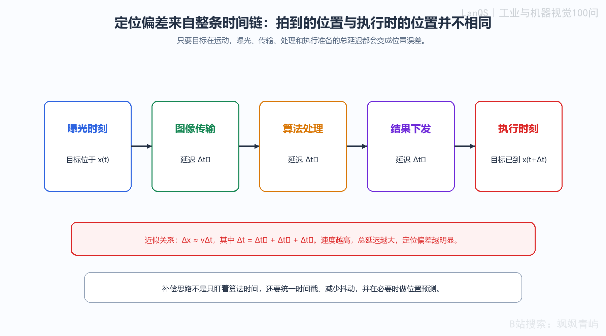

<strong>图53-1 定位偏差形成的时间链条</strong>

图 53-1把定位偏差拆成一条完整的时间链：曝光、图像传输、算法处理、结果下发和执行准备，每一个环节都会把目标继续“往前带走”一段距离。读者从这张图中最应该建立的判断是，位置偏差并不是单一环节造成的，而是整条链路的合成结果。它对工程排查的价值在于提醒我们不要只盯着算法快慢，而要把触发、通信、控制器接收和执行准备都纳入测时延与建模范围。该图使用的是一阶速度近似，若目标存在明显加速度或停启切换，还需要在模型中加入更完整的运动项。

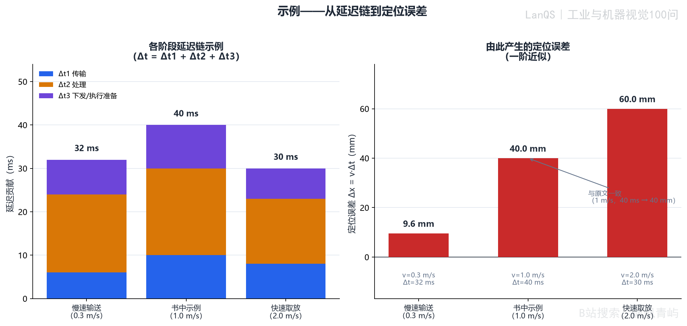

<strong>图53-2 延迟链到定位偏差的计算示例</strong>

---

### 常见误区

- 只测算法耗时，不测触发、曝光、传输、PLC接收和执行器准备组成的完整链路。
- 以平均延迟代替最大值或高分位延迟，导致偶发长延迟未被补偿。
- 把飞拍理解为单纯提高帧率；飞拍还需要正确触发、短曝光、足够光照和位置基准。
- 用恒速模型处理明显加减速过程，却没有加入编码器位置或运动预测。

### 术语与符号表

| 术语 | 说明 |
|---|---|
| 定位偏差 | 目标真实位置与系统据此执行的位置之间的差异。 |
| 飞拍 | 目标运动过程中完成曝光采集的成像方式。 |
| 跟踪触发 | 根据目标实时位置和速度预测拍摄窗口并触发采集的策略。 |
| 端到端延迟 | 从触发或物理事件发生到结果可被执行机构使用的总时间。 |
| 一阶延迟模型 | 在速度近似恒定时用 Δx≈vΔt 估算位移误差的模型。 |

### 延伸阅读

调试时可使用示波器、逻辑分析仪、网络抓包和统一时间戳日志，将每个延迟阶段单独测量，再决定降低延迟、提高同步性还是引入运动预测。

## 第54问：什么是编码器？如何利用编码器信号实现更精准的触发或图像拼接？

### 54. 什么是编码器？如何利用编码器信号实现更精准的触发或图像拼接？

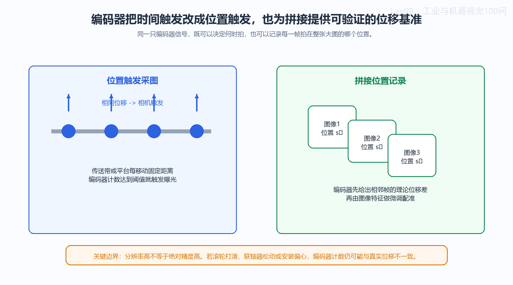

<strong>图54-1 编码器在位置触发与图像拼接中的双重作用</strong>

图 54-1把编码器在视觉系统中的两种典型用途并列展示。左侧说明编码器如何把“按时间触发”改成“按位移触发”；右侧说明它如何为多帧拼接提供先验位置基准。读这张图时，读者应看到同一类位置反馈信号在两个问题中的共同作用：它都在把模糊的运动过程转成可计量、可同步的位移过程。该图同样提醒一个重要边界，编码器计数再细，也不能自动消除滚轮打滑、传动间隙或安装误差，因此系统精度不能只看PPR（每转脉冲数）指标。

#### 54.1 编码器在机器视觉中的基本定义是什么？

编码器是一类把机械位置或位移转换为电信号的传感器。它既可以测转角，也可以测直线位移。

在机器视觉系统中，编码器最重要的作用，不只是告诉系统“电机转了多少圈”，而是提供一个可累计、可同步、可与触发绑定的位置基准。只要视觉任务与运动有关，编码器往往就是时间和位置之间的桥梁。

按测量对象区分，常见有旋转编码器和直线编码器；按输出方式区分，常见有增量式和绝对式。教材里应把这两个分类维度分开理解，不要把“旋转式”和“增量式”当成同义词。

#### 54.2 编码器的工作原理是什么？有哪些主要类型？

编码器的实现原理可以是光电式、磁式或容栅式等。不同原理对应不同的环境适应性、分辨率和成本。

按输出意义分，增量式编码器输出脉冲，系统通过计数得到相对位移；若掉电后不保存计数，通常不能直接知道当前位置。绝对式编码器则直接给出当前位置编码，重新上电后仍可读出位置。

按测量对象分，旋转编码器测角位移，直线编码器测线位移。对视觉系统而言，增量式编码器常用于传送带触发、线扫同步和平台位移计数；绝对式编码器更常见于高端定位平台、多轴设备和不希望重复回零的系统。

#### 54.3 编码器信号在机器视觉触发控制中如何发挥作用？

当视觉任务要求“每隔固定距离拍一次”，最自然的基准就不是时间，而是位移。编码器恰好提供了这个位移基准。

例如，传送带速度可能会波动，但只要编码器与传送带实际位移保持良好对应，系统就能做到“每移动固定距离采一帧”，或者“工件走到固定空间位置时触发曝光”。这比固定时间间隔触发更稳定，因为时间触发默认速度恒定，而编码器触发直接绑定机械位移。

这里还应区分两层作用：编码器信号既可以用于“到位触发”，也可以用于“速度估计和延迟补偿”。前者决定何时拍，后者帮助系统计算拍完之后目标又走了多远。

#### 54.4 编码器信号如何用于实现高精度的图像拼接？

图像拼接常见于大视野检测、平台扫描和线扫描成像。它的本质是：多张局部图像之间必须知道彼此的相对位移。

编码器在这里提供的是先验位移信息。在做图像特征配准之前，系统已经知道相机或工件大约移动了多少。

典型流程是：平台或工件移动，编码器连续输出位移信息；每移动固定距离触发一次采图，或持续线扫并按位移同步采样；为每张图像记录对应的编码器位置值；根据相邻图像的位置差计算理论重叠范围；再用图像特征做微调，以补偿机械误差、打滑和镜头畸变。

因此，编码器的作用是为图像配准提供可靠初值。对纹理少、重复纹理多或特征不稳定的表面，这个初值尤其重要。

#### 54.5 在机器视觉系统中，编码器与其他传感器如何协同工作？

编码器通常不会单独工作，而是与其他传感器共同构成完整的运动测量链。

与光电开关配合时，光电开关负责判断“工件到了没有”，编码器负责判断“工件走到哪了”。这两者不是重复关系，而是存在检测与位置测量的分工。

与伺服系统配合时，编码器既可作为电机反馈元件，也可作为外部位置参考，用于比较“平台实际位移”和“控制器指令位移”是否一致。

在线扫描系统中，编码器更是关键同步量。若线扫相机行频与物体实际运动速度不同步，图像就会被拉伸或压缩。此时编码器不是辅助元件，而是决定纵向几何比例是否正确的核心元件。

#### 54.6 编码器信号的精度和分辨率对视觉系统性能有何影响？

编码器性能至少涉及三个不同概念：分辨率、精度和重复性。分辨率是最小可分辨的位移或角度增量；精度是测得位置与真实位置的接近程度；重复性是多次到同一位置时结果的一致程度。

这三者不能混为一谈。分辨率高，不等于系统绝对精度一定高。若机械传动间隙明显、滚轮打滑、联轴器松动或安装偏心存在，再高的编码器分辨率也无法直接保证视觉系统最终定位精度。

工程上常把编码器脉冲数换算成线位移分辨率。若旋转编码器每转输出 $N$ 个计数，滚轮周长为 $L$，则每个计数对应的理论线位移为

$$
\Delta s=\frac{L}{N}
$$

这个式子给出的是理想分辨率。若机械耦合方式有误差，实际位移与理论位移就不再完全一致，因此还要结合安装结构一起判断。

##### 54.6.1 算例：从编码器分辨率建立拼接触发方案
设滚轮周长 (L=300\ \mathrm{mm})，编码器每转输出 (P=1000) 个脉冲，采用四倍频计数 (M=4)，则有效脉冲当量为

$$\Delta s=\frac{L}{P\times M}=\frac{300}{1000\times4}=0.075\ \mathrm{mm/count}$$

若目标触发间距为5 mm，可取计数阈值 (D=\mathrm{round}(5/0.075)=67) count，实际间距为 (67\	imes0.075=5.025\ \mathrm{mm})。这些数值是示例值；它说明整数计数会带来量化误差，不代表所有拼接任务都应采用5 mm间距。

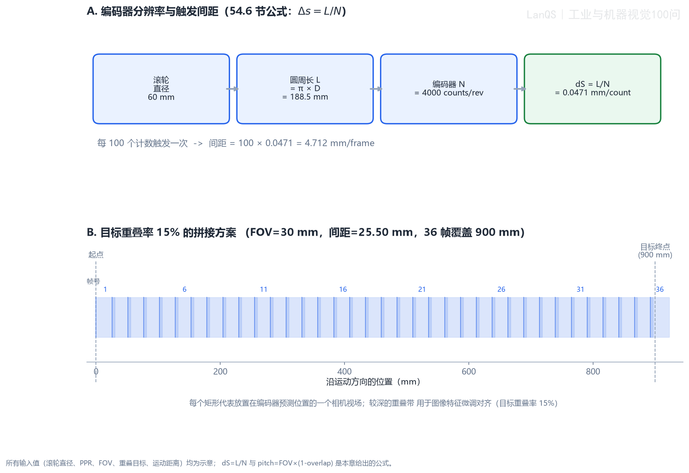

<strong>图54-2 从编码器分辨率建立拼接触发方案示例</strong>

#### 54.7 现场如何检查编码器信号完整性并发现漂移？
应同时检查A/B相位关系、脉冲幅值、边沿质量、屏蔽接地、输入接口最高计数频率以及计数溢出。高速度下若PLC或采集卡漏计脉冲，位置估计会逐渐偏离真实位移；滚轮打滑、机械间隙和联轴器松动也会造成系统性漂移。

工程上可用已知长度的标定件或绝对位置标记做周期性复核，比较编码器累计位移与实际位移；对长距离扫描，还应记录计数、触发和图像时间戳，观察误差是否随距离单调增长。发现漂移后先排查机械耦合和信号完整性，再讨论提高PPR或算法补偿。

#### 54.8 现代编码器技术有哪些发展趋势？

一个趋势，是更高分辨率与更强环境适应性并行发展。高端定位平台要求亚微米甚至更高等级的位移控制，而普通工业现场又要求抗油污、抗粉尘和抗振动。

另一个趋势，是总线化和诊断能力增强。越来越多编码器不只输出位置，还输出状态、告警、温度和诊断信息，便于纳入整机健康管理。

第三个趋势，是与高速控制网络更紧密耦合。编码器越来越像实时控制链中的标准节点，而不只是一个孤立的测量器件。

#### 54.9 编码器在特定视觉应用中的实际案例有哪些？

高速印刷检测中，编码器常装在印刷滚筒或传送辊上，用于保证每个版面都在相同机械位置被采图，便于比较套印偏差和重复缺陷。

晶圆、玻璃面板或大幅面PCB检测中，编码器与高精度平台配合，用于记录扫描位置并触发拼接采图。此时编码器决定的是“每一帧在整张大图中的几何位置”。

在线扫成像中，编码器脉冲可以直接决定每一行图像对应的物理位移，因此它同时影响纵向比例尺和图像是否发生拉伸变形。

---

### 常见误区

- 认为PPR越高，整机绝对定位精度就一定越高；滚轮打滑、间隙、偏心和漏计数都会破坏这一推断。
- 混淆编码器分辨率、精度和重复性，把理论脉冲当量直接当成现场测量精度。
- 只在稳速段验证编码器触发，不检查加减速、信号边沿和长距离漂移。
- 用编码器位置替代所有传感器；到位检测、位置测量和绝对基准可能需要不同器件协同。

### 术语与符号表

| 术语 | 说明 |
|---|---|
| 编码器 | 把旋转或直线位移转换为脉冲或位置编码的传感器。 |
| PPR | Pulses Per Revolution，每转脉冲数。 |
| 脉冲当量 | 一个有效计数对应的理论机械位移，单位常为mm/count。 |
| 正交倍频 | 利用A/B两相信号的相位关系提高有效计数频率的解码方式。 |
| 漂移 | 编码器累计位置与实际机械位置之间随运行距离变化的偏离。 |

### 延伸阅读

应结合编码器、计数模块和机械传动的手册，确认最高输入频率、A/B相位、屏蔽接地、机械耦合和绝对位置复核方法。

## 第55问：当产线速度变化时，如何保证视觉系统的触发频率同步变化？

### 55. 当产线速度变化时，如何保证视觉系统的触发频率同步变化？

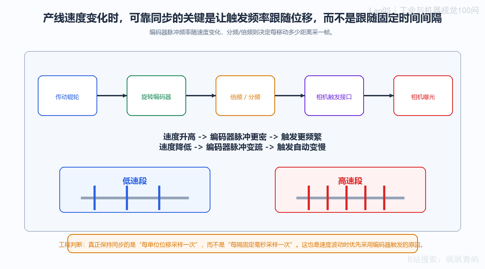

<strong>图55-1 速度变化下的编码器同步触发链路</strong>

图 55-1把速度同步问题压缩成一条清晰的因果链：机械位移带动编码器产生脉冲，脉冲再经过倍频或分频处理，最终成为相机的触发源。图中下半部分把低速段与高速段并列展示，目的是让读者直观看到同一段位移在不同速度下对应着不同的脉冲密度。由此应得出的工程判断是：系统应尽量保持“每单位位移采一帧”的采样方式。该图适用于大多数传送带与平台扫描场景；若系统存在明显打滑、弹性传动或中间机构间隙，仅靠编码器触发仍不足以完全保证采样位置正确，还需要结合机械误差补偿与实际校准。

#### 55.1 为什么产线速度变化会影响视觉系统的检测质量？

产线速度变化会直接改变工件通过检测区域的时间间隔。若视觉系统仍按固定时间频率触发，采图位置就会漂移，进而带来三类典型问题：一是工件间距变化后可能漏检或重复检测；二是图像中工件位置发生偏移，影响定位与测量精度；三是高速运行时更容易出现运动模糊，低速运行时又可能产生过度采样和无效数据。

这说明速度变化真正影响的是采图位置是否准确。一旦采图位置与运动位置脱节，后续的尺寸判断、缺陷定位和执行控制都会受到影响。

#### 55.2 什么是编码器触发机制，它如何实现速度同步？

编码器触发是工业视觉中最常用的速度同步方案。编码器安装在驱动轴、从动辊或高精度运动平台上，把机械位移转换成脉冲信号。由于脉冲频率随速度变化，视觉系统只要把这些脉冲作为外部触发源，就能实现“运动多少距离拍一张”，从而避免固定时间触发带来的位置漂移。

这套机制的价值在于：速度升高时，脉冲自动变密，触发频率自动升高；速度降低时，脉冲自动变疏，触发频率也随之下降。只要编码器与实际位移耦合关系可靠，采样间距就能保持稳定。

#### 55.3 脉冲当量在同步系统中起什么关键作用？

脉冲当量描述的是“一个编码器计数对应多少物理位移”。它是把数字脉冲转换为真实机械位置的关键参数。

若滚轮周长为 $L$，编码器有效计数为 $N$，则每个计数对应的理论位移可写为

$$
\Delta s=\frac{L}{N}
$$

若编码器每转原始脉冲数为 $P$，经过倍频后有效计数为 $N=P\times M$，其中 $M$ 为倍频系数，则同样可以写成

$$
\Delta s=\frac{L}{P\times M}
$$

例如，辊轮周长为 $300\,\mathrm{mm}$，编码器原始分辨率为 $1000$ 脉冲/转，4倍频后有效计数为 $4000$，则脉冲当量为

$$
\Delta s=\frac{300}{4000}=0.075\,\mathrm{mm/count}
$$

这意味着产线每移动 $0.075\,\mathrm{mm}$，系统就会累计一个计数。后续无论是位置触发、速度估计还是图像拼接，这个量都决定了机械位移与数字采样之间的换算关系。

#### 55.4 如何通过分频或倍频技术调整触发频率？

在实际项目中，编码器原始脉冲频率并不一定正好等于理想触发频率，因此往往还需要做倍频或分频。

倍频的作用，是把原始脉冲进一步细分，提高位置分辨率；分频的作用，是在高速度场景下适当降低触发频率，避免相机或处理链路过载。若编码器原始脉冲频率为 $f_\mathrm{enc}$，倍频系数为 $M$，分频系数为 $D$，则触发频率可写为

$$
f_\mathrm{trig}=\frac{f_\mathrm{enc}\times M}{D}
$$

但要注意，这个式子给出的只是电子触发频率，不代表系统一定具备足够的曝光能力、传输带宽和处理能力。分频与倍频的作用，是把触发信号调到合适区间；整机节拍仍然需要单独校核。

#### 55.5 线阵相机和面阵相机在速度同步上有何不同？

线阵相机通常按“行”触发。它真正关心的，是相邻两行图像对应的物理位移是否恒定。若线频与物体运动速度不同步，图像就会在运动方向上被拉伸或压缩。因此，线阵系统对编码器同步的依赖通常更强。

面阵相机则按“帧”触发，常用于在指定位置拍下一幅完整图像。它更关注的是：在目标进入最佳视野位置时准确曝光，以及曝光时间是否足够短以控制运动模糊。对高速移动物体而言，面阵相机即使帧率足够高，若触发时机不准，仍然会拍到位置偏移的图像。

从工程角度看，线阵系统更像“持续按位移采样”，面阵系统更像“在关键位置采样整帧”。二者都需要速度同步，但同步目标并不完全相同。

#### 55.6 除了硬件触发，还有哪些软件同步策略？

硬件触发是基础，但在速度持续变化、目标间距不均匀或系统链路较长时，往往还需要软件层补充。

常见策略包括：根据编码器脉冲时间间隔实时估计瞬时速度；根据速度变化趋势调整触发阈值或曝光参数；为每一帧图像附加精确时间戳，在后续处理阶段做时间对齐；在必要时做短时位置预测，用于补偿采图到执行之间的滞后。

对这类策略，应强调它们只是硬件同步的补充。没有可靠的位移基准和时间基准，单靠软件很难长期稳定地修正高速运动带来的位置漂移。

#### 55.7 如何应对产线加减速过程中的同步挑战？

加减速阶段最麻烦的地方，在于速度不是常数，很多简单模型会失效。此时系统不能再假定“上一时刻的触发节奏等于下一时刻的节奏”，而需要根据实时位移信息持续更新判断。

工程上常见的做法包括：使用足够快的编码器输入接口，保证在高转速下不丢脉冲；按相邻脉冲时间间隔实时估算瞬时速度；对明显的速度跳变建立触发保护或缓冲机制；把执行器的响应时间一并纳入系统模型，不要只校核相机一侧。

若速度变化幅度较大，还需要实测系统在加速段、稳速段和减速段的残余偏差，而不是只在稳速条件下标定一个“看起来没问题”的参数。

##### 55.7.1 算例：编码器锁定触发与定频触发在速度斜坡上的差异
设滚轮周长 (L=300\ \mathrm{mm})，每转脉冲数 (P=1000)，四倍频计数 (M=4)，则脉冲当量为 (0.075\ \mathrm{mm/count})。若目标采样间距为5 mm，取整数分频阈值 (D=67)，实际间距约为 (5.025\ \mathrm{mm})。

在示例速度范围 (0.2\rightarrow1.0\ \mathrm{m/s}) 内，编码器锁定触发的频率随速度同步变化，采样间距保持在约5.025 mm；若定频触发器按0.6 m/s设计为120 Hz，则低速端间距约为1.667 mm，高速端约为8.333 mm。速度斜坡、5 mm目标间距和120 Hz均为示例值，用于说明定频触发会产生过采样或欠采样，不是现场推荐值。

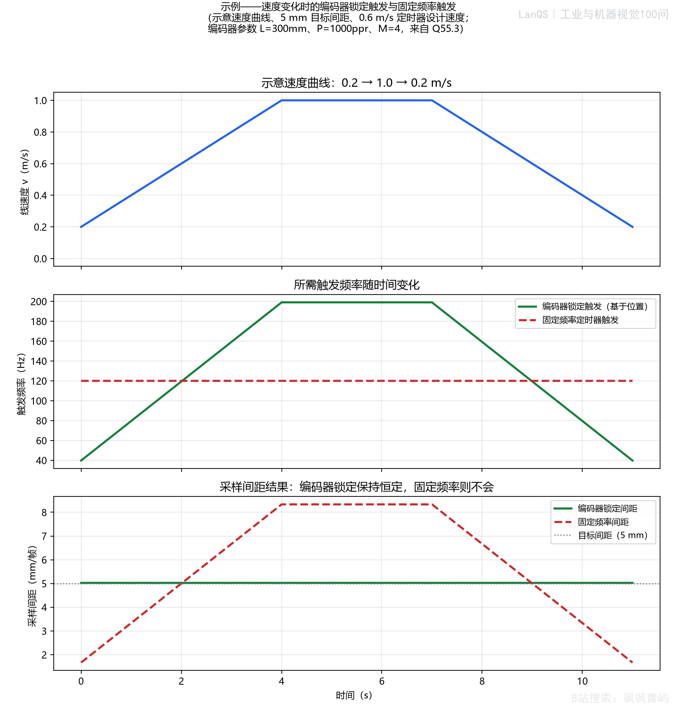

<strong>图55-2 速度斜坡下触发频率与采样间距比较示例</strong>

#### 55.8 当所需触发频率超过硬件上限时，如何保护系统？
编码器推导出的触发频率可能在加速时超过相机最大帧率或视觉处理链路的可持续吞吐量。相机可能丢弃过快到达的触发，处理缓冲区也可能因堆积而溢出；这类问题常只在高速段间歇出现，容易被误认为算法偶发漏检。

工程上应按产线最大速度（包括合理的加速超调）计算最坏情况下的 (f_\mathrm{trig})，并与相机、采集卡、网络和处理流水线的额定能力比较。超过上限时，可提高分频因子 (D)、限制触发频率并产生明确报警，或者设置视觉安全速度上限；不能让系统静默丢触发。

位置锁定中的整数计数误差也可能在长距离运行中累积。相邻帧间距的局部误差很小，并不代表绝对位置误差永远为零；长距离拼接或缺陷追溯需要定期用原点、标记点、索引脉冲或绝对编码器重新校准。瞬时速度估计的平滑窗口同样需要权衡：窗口越长，噪声越小但加减速跟踪越滞后；窗口越短，跟踪更快但抖动更大，应分别在加速、稳速和减速段验证。

#### 55.9 现代工业视觉系统采用哪些先进同步架构？

当前更先进的同步架构，往往不再把编码器、相机和控制器视为彼此独立的零散部件，而是纳入统一时基下的整体系统。

例如，EtherCAT可用于把编码器、伺服轴、视觉节点和控制器放入同一实时网络；IEEE 1588精密时间协议可用于多相机系统之间的时间同步；FPGA触发板卡可把外部脉冲、曝光控制和时间戳记录做到更小抖动。对大型系统来说，这些技术的目标是一致的：让“位移变化”“触发发生”“结果被解释”“动作被执行”都具有可追踪的时间对应关系。

### 常见误区

- 速度变化后仍使用按单一设计速度设定的固定频率触发，导致采样间距随速度伸缩。
- 认为提高编码器分辨率就自动解决打滑、间隙和机械偏心；脉冲分辨率与机械准确度是不同问题。
- 忽略高速段的触发频率上限，任由相机丢触发或处理缓冲区溢出。
- 只在稳速段标定参数，不分别验证加速、巡航和减速阶段。
- 将线阵相机和面阵相机的同步目标混为一谈；线阵主要关心行间位移，面阵还要关心整帧位置和曝光模糊。

### 术语与符号表

| 术语 | 说明 |
|---|---|
| 脉冲当量 Δs | 一个有效编码器计数对应的机械位移，常写为 Δs=L/(P×M)。 |
| 位置锁定触发 | 按累计机械位移而非固定时间间隔触发，使采样间距尽量恒定。 |
| 采样间距 | 相邻图像帧或线阵行在运动方向上的物理距离。 |
| 触发频率饱和 | 编码器要求的触发频率超过相机或处理流水线能力的状态。 |
| 重新定标 | 用原点、标记点、索引脉冲或绝对编码器周期性校正累计位置。 |
| 速度估计平滑窗口 | 用于平均多个编码器脉冲间隔的时间窗口；窗口越大噪声越小、跟踪滞后越明显。 |

### 延伸阅读

可结合编码器输入模块、相机触发接口、线阵行频、伺服总线和运动控制器的额定参数，按产线最大速度完成触发频率和数据吞吐量预算。

---

---

[返回总目录](../index.md) · [上一章](chapter-02-q31-q40.md) · [下一章](chapter-04-q56-q60.md)

---

[返回总目录](../index.md) · [上一章](chapter-02-q31-q40.md) · [下一章](chapter-04-q56-q60.md)
