# 第四章 PLC 通信、实时控制与系统集成（Q56–Q60）

> 所属模块：模块三：PLC、通信与运动控制（Q56–Q60）

<a id="q56"></a>
## 第56问：在多工位视觉检测系统中，如何协调多台相机与 PLC 的触发时序？
---

### 在多工位视觉检测系统中，如何协调多台相机与 PLC 的触发时序？

#### 56.1 多工位视觉检测系统的基本架构是什么？

典型的多工位视觉系统由输送机构（皮带或转盘）、到料传感器、编码器、PLC，以及沿产线布置的多台相机和光源组成。产品依次经过不同检测区域，每个工位完成不同任务，例如读取正面字符、测量侧面轮廓、检查端面缺陷或确认装配状态。PLC 不只是驱动执行器，还要组织整条检测链的时序：产品何时进入跟踪队列、哪台相机何时拍摄、何时等待采集完成，以及何时把结果交给剔除机构、分拣机构或下一工位。

多工位系统真正困难的地方不在于相机数量，而在于能否始终正确跟踪运动中的同一个产品。如果某工位采集到的图像实际属于前一个产品，而下游逻辑却把它当成当前产品，便会产生结果错位、错误剔除和追溯链断裂。因此，时序设计必须让产品位置、触发信号、图像序号和检测结果在任何时刻保持严格的一一对应。

#### 56.2 为什么多工位系统通常优先采用硬触发？

软触发要经过操作系统调度、网卡缓存、协议栈和应用程序响应，延迟不仅较大，而且会发生抖动。低速运行且不强调位置一致性的单机系统可以接受这种不确定性；但在高速连续生产中，每台相机都应在产品到达指定物理位置时曝光，此时触发时刻的重复性通常比平均延迟更重要。硬触发由 PLC 数字输出或专用触发模块直接向相机输入电平脉冲，链路短、确定性更强，还可以用示波器直接测量，因此是工程现场的默认方案。

硬触发只是把不确定性压缩到更容易测量和补偿的范围，并不代表系统天然精准。PLC 扫描周期过长、输出模块响应慢、接线质量差或相机输入逻辑配置错误，都会造成触发偏差。因此，硬触发提供的是可标定的基础，而不是无需验证的交付结果。

#### 56.3 PLC 如何生成精确的触发序列？

不要只根据经过的时间估计产品位置，更稳妥的做法是用编码器脉冲跟踪产品沿输送方向的实际位移。通常在产线前端设置光电或接近传感器：产品经过参考点的瞬间，高速计数器锁存当前绝对编码器计数 (P_0)，并把它送入队列。参考点到各下游工位的实际距离预先换算为脉冲偏移 (N_i)。运行时，PLC 对队列中的每个产品持续比较当前编码器计数与 (P_0+N_i)，达到阈值便触发对应相机：

$$
\text{编码器计数} \geq P_0+N_i \tag{式56-1}
$$

该方法把“时间问题”变成了“位置问题”。皮带轻微加减速或短暂停机再启动会破坏纯时间估计，但不会改变产品相对于参考点实际前进的脉冲数。只要编码器与输送机构之间没有严重打滑、机械安装足够稳定，所有工位就能共享同一空间坐标。


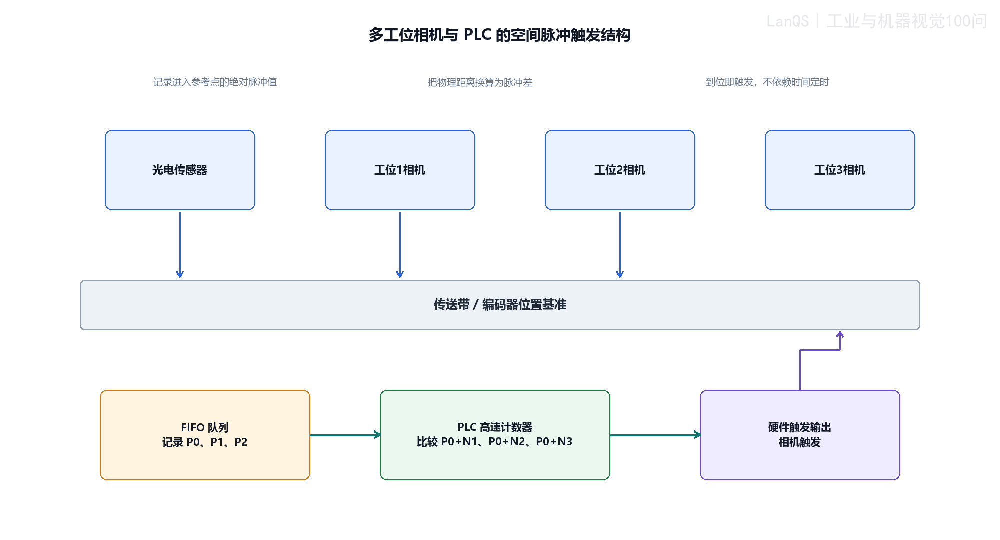


<p align="center"><strong>图56-1 多工位相机与 PLC 的空间脉冲触发结构。</strong></p>
<div class="figure-note" style="background: transparent; border: 0; padding: 0; margin: 0.35em 0 1.2em;">
图56-1从左到右展示参考传感器和三个相机工位，它们共用同一条输送位置基准线。下方 FIFO 队列记录每个产品经过参考点时锁存的绝对脉冲值；PLC 高速计数器将这些起始值分别与各工位的脉冲偏移量比较；右侧硬触发输出把“已到达”这一空间事件转换为相机曝光脉冲。要点是：多工位触发不是给每台相机各自分配一个计时器，而是让所有产品持续相对于同一位置基准线被跟踪。该结构适合输送线连续进料且队列中可能同时存在多个产品的场景；如果系统没有编码器，或输送机构存在明显打滑、弹性滑移，还必须增加位置交叉校验。
</div>

#### 56.4 如何计算并补偿各工位的触发延迟？

56.3 的脉冲阈值方法直接在位置域触发；下面的时间公式适用于速度基本稳定，或硬件尚未到位时用于估算时序预算的场景。两种方法并不矛盾：已有编码器时，应以脉冲阈值为主，时间公式用于估算延迟量级和检查预算。

若产品速度可近似视为常量，参考传感器检测到产品后，工位 (i) 的理论触发时刻可写为

$$
t_{\mathrm{trig},i}=t_0+\frac{d_i}{v}-t_{\mathrm{cam},i}-t_{\mathrm{out},i} \tag{式56-2}
$$

其中，(t_0) 为参考传感器动作时刻，(d_i) 为参考点到相机 (i) 视场中心的距离，(v) 为该段产线速度，(t_{\mathrm{cam},i}) 为相机接收触发到开始曝光的响应延迟，(t_{\mathrm{out},i}) 为 PLC 输出链路延迟。两个减号表示 PLC 必须提前发出触发脉冲，以抵消相机和输出链路的延迟；若等产品已经到达视场中心才发脉冲，相机开始曝光时产品已经越过目标位置。

如果系统用编码器跟踪位置，通常不必在时间域保留这个提前量，而是把距离直接换算为脉冲阈值，并用式56-1在脉冲域完成补偿。式56-2只有在速度变化较小或补偿窗口较短时才可靠。相机响应时间应使用示波器测量触发输入到曝光输出的时间差，PLC 输出延迟也应在实际程序负载下测量，不要直接采用数据手册的标称值。

#### 56.5 如何在现场确定各工位的脉冲偏移 (N_i)，并验证触发与图像内容一致？

式56-1中的 (N_i) 不能简单地由图纸距离换算得到。参考传感器的真实动作点、相机实际光轴和视场中心、编码器轮径及压紧状态都会使安装后的距离与名义尺寸不同。直接从 CAD 尺寸计算，往往会形成稳定而重复的系统偏差。

建议按以下步骤现场标定：

1. 让产线低速点动，使代表性产品或标定治具到达参考传感器的真实动作点；以 PLC 输入状态确认传感器确实翻转，并记录此刻编码器绝对计数 (P_{\mathrm{ref}})。
2. 继续点动，使同一产品到达相机实际视场中心。应以实时图像中的十字线或中心线为准，而不是以相机外壳或支架位置估计；记录此刻编码器计数 (P_{\mathrm{cam},i})。
3. 计算工位偏移：
$$
N_i=P_{\mathrm{cam},i}-P_{\mathrm{ref}} \tag{式56-4}
$$
   脉冲每毫米的比例也应通过已知物理位移和计数差现场标定，而不是只根据编码器铭牌分辨率和理论轮径推算。

每个工位应重复测量数次，并从同一方向接近目标位置，以减少回差影响。重复结果相差多个计数时，应先检查支架松动、传感器动作点不稳定和机械回差，再接受该标定值。

标定 (N_i) 只能证明偏移量测得正确，还不能证明高速运行时图像内容一定对齐。应使用带有网格、圆点或明确标记的标定板，按生产速度连续运行多次，检查标记在图像中的位置。若均值稳定但整体偏移，属于静态 (N_i) 或提前量错误；若均值正确但位置散布较大，属于抖动，应检查 PLC 扫描、输出模块响应和机械振动，而不是继续修改 (N_i)。低速正常、高速偏移时，应在实际生产速度下重新测量相机响应和 PLC 输出延迟，并重新做多周期验证。

#### 56.6 什么是主从触发和并行触发？

主从触发适合多角度同时采集：一台主相机或同步模块发出参考脉冲，其余相机在同一时刻或固定偏移后触发。立体测量、同步多视角外观检查和高速飞拍都属于此类场景。

并行触发更常见于输送线多工位结构。每台相机有独立触发线，但所有触发都由 PLC 按同一位置坐标分别调度，产品经过各工位时依次曝光。两者同步的对象不同：主从触发同步的是相机曝光时刻；并行触发同步的是产品位置与工位任务。

#### 56.7 高速运行时如何处理运动模糊？

产品在曝光期间移动，就会产生运动模糊。若线速度为 (v)，曝光时间为 (t_{\mathrm{exp}})，曝光期间的位移为

$$
\Delta x=v\cdot t_{\mathrm{exp}} \tag{式56-3}
$$

工程目标不是简单地把曝光时间降得越短越好，而是让 (\Delta x) 小于当前测量任务允许的范围。尺寸测量、边缘定位和缺陷轮廓提取通常要求模糊长度不超过半个像素对应的物理尺寸；粗略的有无检测则可以放宽。缩短曝光通常需要提高光照强度，并配合频闪光源和全局快门相机，否则图像会变暗，或者受到卷帘快门畸变影响。

#### 56.8 多台相机之间如何同步时间戳？

触发同步回答“何时曝光”，时间戳同步回答“这些图像是否属于同一时刻或同一产品”。当系统需要融合多相机结果、重建轨迹或进行跨设备追溯时，应建立共享时间基准。常见方法包括：在同一网络中使用支持 IEEE 1588 的 PTP；使用外部同步脉冲校正各相机内部时钟；在软件层使用 PLC 触发事件号或产品序列号作为关联键。

时间戳一致并不能保证图像内容处于同一几何状态。不同相机的曝光时间、视场和通信缓存行为可能不同，因此必须把时间戳与产品 ID、编码器位置或 PLC 事件序号结合使用，不能单独把时间戳作为关联条件。

#### 56.9 调试和验收时应检查哪些指标？

至少检查三类指标：触发延迟是否稳定，产品身份是否在工位之间错位，以及满速运行时图像质量是否满足算法要求。应使用示波器测量 PLC 输出与相机曝光反馈之间的延迟和抖动；通过产品 ID、编码器位置或事件序号核对图像—结果对应关系；再在目标节拍、目标速度和连续负载下检查曝光、照明、缓存和算法处理时间。

验收记录不应只写“所有相机都能出图”，而应给出延迟均值与最大值、触发抖动、漏触发/重触发次数、图像与产品序号错位次数、FIFO 最大深度、超时恢复时间以及满速下的误检和漏检表现。

#### 56.10 如何保证参考传感器和编码器信号完整？

参考传感器漏检会使产品无法进入跟踪队列，重复触发会使队列多出一个虚拟产品；编码器丢脉冲、计数溢出、方向配置错误或输送机构打滑，则会让所有工位逐渐偏离。应在 PLC 中记录每次传感器动作的事件号、绝对计数和时间，并监控相邻产品间距、编码器增量和相机触发数量。

可用已知间距的标定件交叉核对编码器脉冲与实际位移；关键设备可配置双传感器或第二位置源。若编码器安装在摩擦轮上，还要检查压紧力、轮面磨损和滑移。分辨率选择应从允许的位置误差反推：若允许触发位置误差为 (pmdelta)，一个计数对应的物理距离最好只占误差预算的约 (1/5)～(1/10)，即每个 (\Delta) 至少有约 5～10 个计数。示例中的 4 脉冲/mm 只是为了便于计算，实际分辨率应结合容差、输出格式、机械安装和成本共同确定。

#### 56.11 看门狗机制和故障恢复策略是什么？

看门狗在触发后等待采集完成、处理完成或结果返回信号；若在规定窗口内没有响应，就把该工位标记为异常。偶发故障可以允许有限次数重试；持续超时或通信中断时，应报告故障并按预先定义的策略旁路工位，而不是无限等待导致整线停顿。

恢复策略还必须保持队列一致性：丢帧后，当前产品是整体标记为未知、仅抑制某一项检测，还是停机等待人工确认，都应在设计阶段明确。只考虑“相机能否重连”而不处理产品序号和结果队列，重连后的数据仍可能不可信。

#### 56.12 现代系统中有哪些高级时序协调技术？

在极高节拍或极严同步要求下，可在 PLC 之外增加专用同步控制器、FPGA 触发卡，或采用基于实时工业以太网的分布式时钟架构。EtherCAT、PROFINET IRT（等时实时）以及支持 PTP 的相机网络，均可用于多设备同步。

是否采用这些技术，应由误差预算、节拍目标、维护能力和系统可维护性共同决定。如果系统只是中低速检测，而维护人员主要使用标准 PLC，直接堆叠高端同步硬件可能只会提高维护门槛。应先明确触发抖动、编码器精度和机械间隙各自允许占用的误差，再判断普通 PLC 是否已经足够。

##### 56.3.1 算例：速度变化时的位置域触发

下面的算例按照式56-1，对三工位产线计算脉冲偏移，并模拟产品经过中途速度变化点的情况。位置域触发直接依据编码器计数，固定时间延迟则只根据初始速度估算一次。

```python
from pathlib import Path
import numpy as np
import matplotlib
matplotlib.use("Agg")
import matplotlib.pyplot as plt

PULSES_PER_MM = 4.0
P0 = 10_000
station_names = ["Station 1", "Station 2", "Station 3"]
d = np.array([300.0, 750.0, 1300.0])
N = np.round(d * PULSES_PER_MM).astype(int)
v1, v2, x_change = 200.0, 320.0, 500.0
dt, t_max = 0.0005, 8.0
n_steps = int(t_max / dt)

t = np.zeros(n_steps); x = np.zeros(n_steps); enc = np.zeros(n_steps)
for k in range(1, n_steps):
    t[k] = t[k - 1] + dt
    v = v1 if x[k - 1] < x_change else v2
    x[k] = x[k - 1] + v * dt
    enc[k] = P0 + x[k] * PULSES_PER_MM

pulse_trigger_x = np.array([
    x[min(np.searchsorted(enc, P0 + ni), len(t) - 1)] for ni in N
])
pulse_err = pulse_trigger_x - d
t_naive = d / v1
x_true_at_naive = np.interp(t_naive, t, x)
time_err = x_true_at_naive - d
assert np.all(np.abs(pulse_err) <= 1.0 / PULSES_PER_MM + 1e-6)
```

算例输出的代表性结果如下：

| 工位 | 距离 (d_i) / mm | 脉冲偏移 (N_i) | 位置域误差 / mm | 固定时间延迟误差 / mm |
|---|---:|---:|---:|---:|
| 1 | 300 | 1200 | 0.100 | 0 |
| 2 | 750 | 3000 | 0.080 | 150 |
| 3 | 1300 | 5200 | 0.000 | 480 |

脉冲域触发的误差始终不超过一个编码器计数（0.250 mm），即使速度从 200 mm/s 在 (x=500) mm 处升至 320 mm/s；固定时间估计却在速度变化点之后迅速失效。


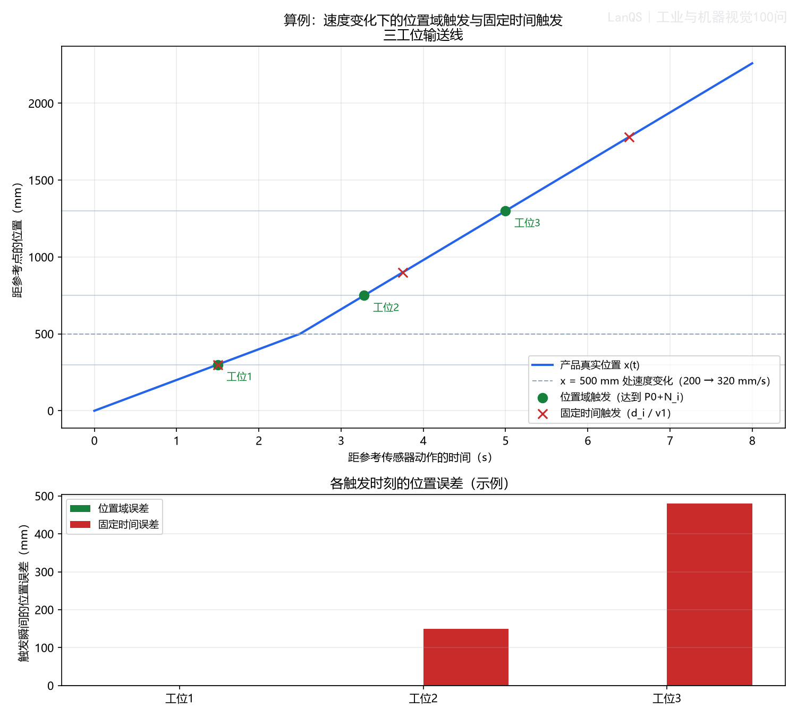


<p align="center"><strong>图56-2 速度中途变化时的位置域触发与固定时间延迟对比。</strong></p>
<div class="figure-note" style="background: transparent; border: 0; padding: 0; margin: 0.35em 0 1.2em;">
上图绘制产品真实位置随时间的变化：产线先以 200 mm/s 运行，在 (x=500) mm 处升至 320 mm/s。绿色点表示按式56-1触发的位置域结果，基本落在各工位真实位置上；红色叉号表示按初始速度套用式56-2的固定时间估计结果。工位2和工位3分别产生约150 mm和480 mm的位置误差。下方柱状图汇总各工位触发瞬间的位置误差。图中参数为便于观察机制而选取的示例值，不代表特定设备的实测值。
</div>

### 常见误区

- 认为使用硬触发就自动精准。仍需用示波器验证延迟和抖动。
- 在频繁加减速的皮带上使用平均速度计算触发时间。此时应优先采用式56-1的位置域触发。
- 把时间戳一致误认为图像内容一定对应。必须同时核对产品 ID、编码器位置或 PLC 事件序号。
- 让看门狗在工位无响应时无限等待。应预先定义超时、重试、旁路和停线策略。
- 只验证低速单工位出图，不验证目标节拍下的连续运行。缓存积压、触发漂移和光照不足往往只在满负载时暴露。
- 在没有完成误差预算前直接采用 FPGA 或实时以太网。技术等级应服从实际同步容差和维护能力。

### 术语与符号表

- **硬触发**：由 PLC 数字输出或专用模块直接向相机输入的电气脉冲。
- **软触发**：通过驱动程序或网络协议发出的软件命令，受系统调度和通信抖动影响。
- **触发抖动**：多次运行中触发事件到相机实际曝光之间延迟的变化量。
- **FIFO 队列**：先进先出队列，保存各产品经过参考点时锁存的编码器值。
- **位置域触发**：当前编码器计数达到 (P_0+N_i) 时触发，而不是等待固定时间。
- **视场中心标定**：依据实时图像确定目标位置在画面中心的实际安装位置。
- **对齐验证运行**：用带有已知特征的标定件在生产速度下连续运行多次，区分静态偏移和抖动。
- **PTP**：IEEE 1588 精密时间协议，用于同步网络设备时钟。
- **看门狗**：在限定窗口内等待确认信号，超时即报告故障的监控逻辑。
- **主从触发**：主设备发出参考脉冲，其余相机按同一时刻或固定偏移触发。
- **并行触发**：各相机独立接线，但由 PLC 在同一位置坐标系中依次调度。
- **EtherCAT / PROFINET IRT**：具有确定性和低抖动特性的实时工业以太网技术。

### 延伸阅读

- IEEE 1588-2019，《网络化测量与控制系统精密时钟同步协议》。
- EMVA GenICam 标准文档，工业相机触发与 I/O 配置。
- PROFIBUS & PROFINET International 的 PROFINET IRT 技术资料。
- Steger、Ulrich、Wiedemann，《Machine Vision Algorithms and Applications》，第2版。

---

<a id="q57"></a>
## 第57问：视觉系统判断 NG 后，剔除装置（如气缸、推杆、摆臂）的动作通常由谁控制？延迟如何计算？
---

### 视觉系统判断 NG 后，剔除装置（如气缸、推杆、摆臂）的动作通常由谁控制？延迟如何计算？

#### 57.1 视觉系统判断 NG 后，剔除装置的控制权属于哪个组件？

视觉算法负责给出检测结果，但通常不直接驱动气缸或摆臂。视觉控制器把结果、产品序号和必要的置信信息发送给 PLC；PLC 维护产品在输送线上的位置队列，根据编码器计数决定何时输出剔除脉冲。这样做可以把安全互锁、气压监控、剔除确认和异常停机统一纳入设备控制逻辑。

应明确区分三件事：视觉系统负责“判定”，PLC 负责“调度与执行”，气动或电动机构负责“产生动作”。不要让视觉软件直接以网络延迟驱动执行器，也不要只凭一个 NG 位而不携带产品序号，否则多个产品同时在途时极易发生错剔。

#### 57.2 PLC 如何具体控制气缸、推杆和摆臂？

PLC 接收视觉结果后，先把产品序号、NG 类型和参考点编码器计数写入 FIFO 队列。产品到达剔除工位的目标脉冲时，PLC 输出一个具有明确宽度的电磁阀或驱动器控制脉冲。气缸系统还应检查电磁阀响应、气压、伸出到位和缩回到位信号；电动推杆或摆臂则应检查驱动器就绪、位置到达和故障码。

剔除逻辑至少包含：结果接收超时、队列溢出、产品已离开可剔除窗口、执行器未复位、剔除确认失败以及安全回路断开。剔除动作完成后，应把“已执行/未执行/执行异常”写回产品记录，不能只在 HMI 上显示一个瞬时输出状态。

#### 57.3 从视觉判定到实际剔除，延迟由哪些部分组成？

从视觉判定完成到产品真正接触剔除机构，通常包含：

$$
T_{\mathrm{total}}=T_{\mathrm{vision}}+T_{\mathrm{comm}}+T_{\mathrm{plc}}+
T_{\mathrm{valve}}+T_{\mathrm{mech}} \tag{式57-1}
$$

其中，(T_{\mathrm{vision}}) 是采集、传输和算法处理时间，(T_{\mathrm{comm}}) 是结果通信时间，(T_{\mathrm{plc}}) 是扫描、队列处理和输出调度时间，(T_{\mathrm{valve}}) 是阀或驱动器响应时间，(T_{\mathrm{mech}}) 是气缸、推杆或摆臂从开始动作到形成有效剔除所需的机械时间。对气缸而言，气压、管径、节流阀、负载和行程都会使最后一项发生变化。

总延迟不能只用平均值。应至少记录最大值或 P99 值，并为速度波动、温度变化、气压下降和机构磨损留出余量。

#### 57.4 如何精确计算并补偿剔除延迟？

若输送速度为 (v)，从检测点到剔除口的距离为 (D_{\mathrm{layout}})，在总延迟期间产品继续前进的距离为

$$
D_{\mathrm{lead}}=v\cdot T_{\mathrm{total}} \tag{式57-2}
$$

若 (D_{\mathrm{layout}}) 大于所需缓冲距离，PLC 应在产品到达几何剔除位置之前发出动作命令。剔除触发的实际空间位置为

$$
D_{\mathrm{fire}}=D_{\mathrm{layout}}-v\cdot T_{\mathrm{total}} \tag{式57-3}
$$

若采用编码器，设编码器分辨率为 (k) 脉冲/mm，则可以直接计算提前脉冲数

$$
N_{\mathrm{lead}}=\operatorname{round}(vT_{\mathrm{total}}k)
$$

并在产品的参考计数达到 (N_{\mathrm{reject}}-N_{\mathrm{lead}}) 时输出剔除信号。不能把输送速度写成固定常数后长期不校验；更可靠的做法是读取实时编码器增量，并在不同速度、负载和气压条件下重新测量 (T_{\mathrm{mech}})。


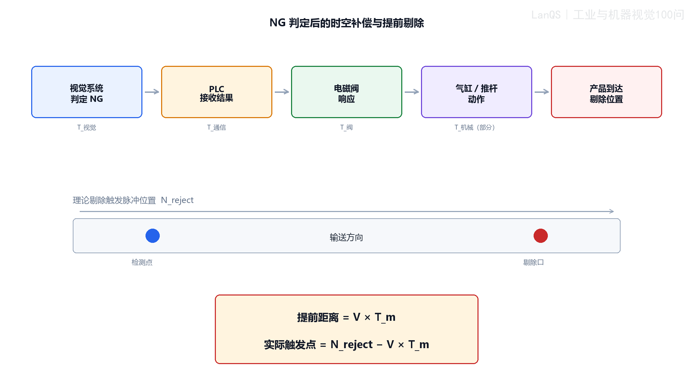


<p align="center"><strong>图57-1 NG 判定后的时空补偿与提前剔除。</strong></p>
<div class="figure-note" style="background: transparent; border: 0; padding: 0; margin: 0.35em 0 1.2em;">
图57-1按顺序展示视觉系统给出 NG、PLC 接收结果、电磁阀响应、气缸或推杆动作，以及产品到达剔除位置的完整链路。下方输送方向和理论剔除触发位置说明：机构仍在响应时产品已经继续前进，因此命令必须提前发出。图中同时给出空间域的提前距离 (vT_m) 和编码器脉冲域的实际触发位置 (N_{\mathrm{reject}}-vT_m)。该图适用于连续输送线；若产品在剔除前会停止、分度或夹紧，应按新的运动曲线重新计算。
</div>

##### 57.4.1 算例：剔除延迟预算与提前距离验证

以下参数用于说明计算方法，并非特定设备实测值：

| 延迟分量 | 数值 / ms |
|---|---:|
| (T_{\mathrm{vision}}) | 18 |
| (T_{\mathrm{comm}}) | 4 |
| (T_{\mathrm{plc}}) | 6 |
| (T_{\mathrm{valve}}) | 12 |
| (T_{\mathrm{mech}}) | 35 |
| (T_{\mathrm{total}}) | 75 |

若线速度为 (v=1.2 \mathrm{m/s})，则

$$
D_{\mathrm{lead}}=1.2\times0.075=0.09 \mathrm{m}=90 \mathrm{mm}
$$

若检测点到剔除口的布局距离为 150 mm，理论上还剩 60 mm 的空间余量。以 500 脉冲/转、编码器轮周长 200 mm 为例，编码器分辨率为 2.5 脉冲/mm，提前量约为 225 脉冲。工程验收不能只核对算术，还应在目标速度下直接测量产品实际脱离位置。


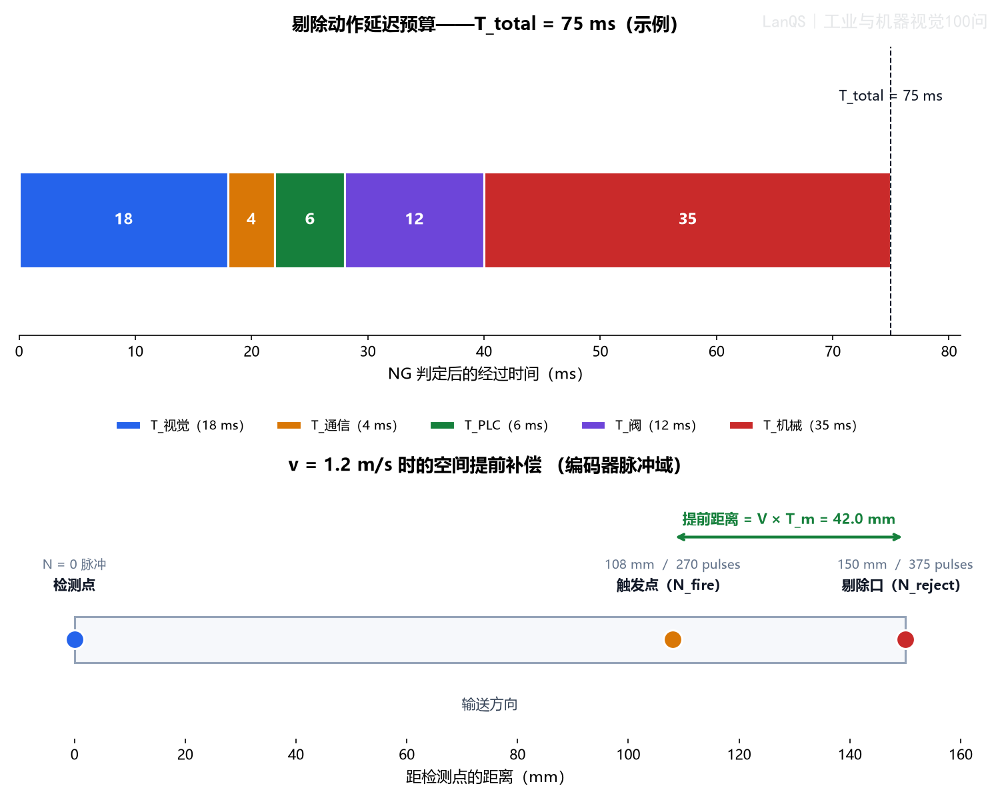


<p align="center"><strong>图57-2 剔除延迟预算与空间提前补偿算例。</strong></p>

#### 57.5 当距离余量不足时怎么办？

当 (D_{\mathrm{layout}}<vT_{\mathrm{total}}) 时，余量为负，继续修改 PLC 脉冲计算并不能解决物理距离不足。应按以下顺序排查：

1. 先降低视觉处理、通信和 PLC 调度延迟，确认是否存在不必要的等待或轮询。
2. 缩短气管、增大有效通径、调整节流阀和工作压力，重新测量阀响应与机构动作时间。
3. 更换响应更快的执行器，或把剔除口向下游移动。
4. 在剔除口前增加确认传感器，使用更短的本地位置窗口重新触发。
5. 必要时降低线速、增加缓存或改变输送布局。

连续两个 NG 产品还要满足执行器的完整循环时间。若执行器伸出和缩回分别需要 (T_{\mathrm{extend}}) 与 (T_{\mathrm{return}})，相邻可剔除产品的最小间距应至少覆盖这两个时间以及安全余量；只计算第一个产品的触发提前量是不够的。

#### 57.6 如何在调试和验收时验证剔除准确性？

使用已知 NG 的标定件，在目标速度下连续运行，而不是只做一次慢速测试。记录每个产品在检测点的编码器计数、PLC 发令时刻、阀输出、到位反馈和实际离线位置。用固定标记、剔除口传感器或高速摄像测量产品相对目标位置的偏差。

多次测量后分别计算平均偏差和离散程度：平均偏差稳定但不为零，说明 (T_{\mathrm{total}}) 或 (N_{\mathrm{lead}}) 存在静态误差；平均值正确但散布大，说明抖动、气压波动或机构重复性不足。应把实测结果反馈到延迟模型，而不是永久保留一次性估算值。

#### 57.7 高速生产线上如何保持剔除精度和可靠性？

使用编码器位置跟踪而不是固定时间延迟；为视觉结果、产品序号和剔除队列设置超时与上限；监控气压、执行器复位、剔除确认和队列深度；对速度变化、背靠背 NG、漏检和重检分别建立测试用例。若剔除失败，应明确产品是隔离、停线还是降级放行，并保留可追溯记录。

#### 57.8 工业4.0环境下剔除控制有哪些趋势？

趋势包括：把产品 ID、图像、判定、剔除动作和确认结果绑定为可追溯事件；由 MES 下发工单和剔除策略；利用历史延迟和气压数据进行预测性维护；通过边缘控制器和实时工业以太网减少不确定通信；在安全边界内根据统计数据优化阈值和剔除策略。自动优化不能绕过 PLC 的互锁和人工审核。

### 常见误区

- 让视觉软件直接驱动气缸，忽略 PLC 的安全互锁和产品队列。
- 只计算视觉处理时间，遗漏通信、PLC、阀和机械延迟。
- 用平均速度和平均机械延迟直接上线，不验证 P99 或最坏工况。
- 只检查一次产品是否被剔除，不检查连续 NG、错序、漏剔和重剔。
- 认为增加提前脉冲可以解决物理布局距离不足。

### 术语与符号表

- **剔除提前距离**：产品在总延迟期间继续前进的距离 (vT_{\mathrm{total}})。
- **剔除确认传感器**：安装在剔除口附近，用于确认产品位置或动作结果的传感器。
- **P99 延迟**：多次测量中 99% 的延迟不超过的值，可用于比平均值更稳健的预算。
- **产品队列**：保存产品 ID、参考编码器计数、检测结果和剔除状态的 FIFO 数据结构。
- **背靠背 NG**：两个 NG 产品间距小于执行器完整循环能力的情况。

### 延伸阅读

- IEC 61131-3，PLC 编程语言与任务调度。
- ISO 13849-1，机械安全相关控制系统设计。
- 工业相机、编码器与气动执行器厂商的触发、响应和验收技术手册。

---

<a id="q58"></a>
## 第58问：什么是 HMI？视觉系统需要与 HMI 交互哪些信息？
---

### 什么是 HMI？视觉系统需要与 HMI 交互哪些信息？

#### 58.1 HMI 的基本定义和核心概念是什么？

HMI（Human–Machine Interface，人机界面）是操作人员观察设备状态、执行操作和确认结果的入口。它不只是把 PLC 寄存器堆在屏幕上，而应把设备状态、检测结果、报警、追溯和受控参数组织成操作员能快速理解的界面。

#### 58.2 不同领域的 HMI 有哪些差异？

工业自动化 HMI 更重视节拍、状态、联锁、报警和维护；汽车等产品更强调驾驶或用户体验；实验设备则更强调参数透明和数据分析。视觉 HMI 的关键是让“当前产品是否合格、为什么判定、设备能否继续运行、参数是否被修改”在几秒内可见。

#### 58.3 视觉系统在 HMI 交互中扮演什么角色？

视觉系统向 HMI 提供检测状态、结果、图像、报警和可审计的参数版本；HMI 向视觉系统传递配方选择、参数修改、复检、标定和维护意图。HMI 不应绕过视觉控制器直接修改内部算法状态，所有写入都应经过校验、权限控制和版本记录。

#### 58.4 视觉系统需要向 HMI 提供哪些核心信息？

建议按四层组织：

1. **状态与节拍**：运行/停止/待机、当前节拍、缓存深度、通信状态、相机和光源状态。
2. **结果与图像**：OK/NG、缺陷类型、分数、测量值、原图、结果图和产品序号。
3. **报警与追溯**：报警代码、发生时间、确认人、图像索引、配方版本和处理记录。
4. **参数与配方**：当前配方、版本、ROI、阈值、曝光、光源、修改者和生效条件。


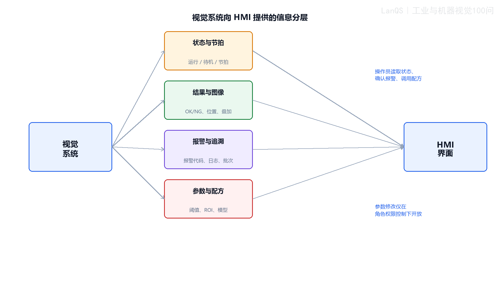


<p align="center"><strong>图58-1 视觉系统向 HMI 提供的信息分层。</strong></p>
<div class="figure-note" style="background: transparent; border: 0; padding: 0; margin: 0.35em 0 1.2em;">
图58-1将视觉系统与 HMI 之间的信息分成状态与节拍、结果与图像、报警与追溯、参数与配方四条通道。分层不是排版装饰：状态层回答设备能否继续运行，结果层服务当前判定，报警层支持故障处置，参数层约束受控修改。
</div>

##### 58.4.1 算例：视觉系统到 HMI 的带宽预算

设状态层有 20 个字段、每字段 4 字节、10 Hz；结果层有 12 个字段、每字段 8 字节、10 Hz；报警与追溯层有 8 个字段、每字段 16 字节、2 Hz；参数层有 40 个字段、每字段 8 字节、0.2 Hz。四层结构化数据约为

$$
B_{\mathrm{data}}=20\times4\times10+
12\times8\times10+8\times16\times2+40\times8\times0.2
=2.944 \mathrm{kB/s}
$$

若把 640×480、8 bit 的预览图按 2 Hz 发送，原始图像约为 (614.4 \mathrm{kB/s})，远大于结构化数据。因此图像应单独设置压缩、刷新率和降级策略，不能与状态字段使用同一刷新逻辑。


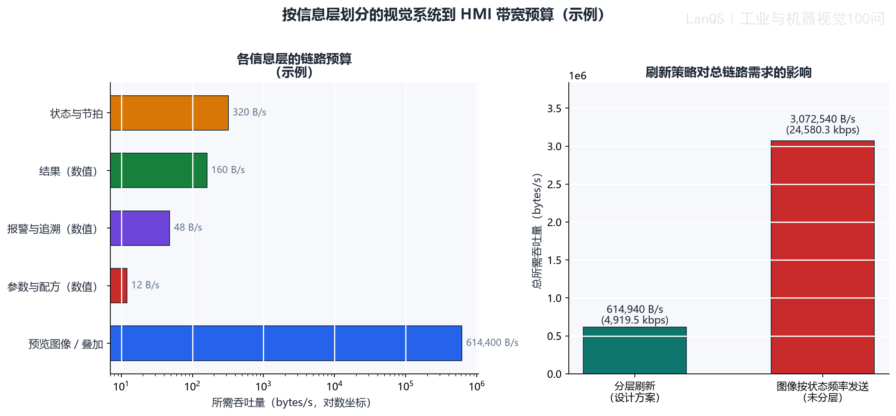


<p align="center"><strong>图58-2 按信息层划分的视觉系统到 HMI 带宽预算。</strong></p>

#### 58.5 链路变差时如何保证数据新鲜度？

应优先保证设备状态、当前结果和报警，降低图像刷新率或只发送缩略图，最后才考虑暂停非关键统计数据。HMI 必须显示数据时间戳、帧年龄和通信质量；上一帧图像不能伪装成当前结果。视觉控制器还应独立验证参数和结果，不能把 HMI 上的“已显示”当成“已生效”。

OPC UA 适合结构化、可扩展和可审计数据；Modbus TCP 简单、兼容性好，但语义和版本管理需要在项目中自行约定；专有协议可获得更高性能，却增加维护和互操作成本。选择协议时应先列出变量、更新率、超时、权限和版本要求。

#### 58.6 视觉系统如何从 HMI 接收用户意图？

所有写入都应经过“请求—校验—预览—提交—确认”流程。配方切换应带有配方 ID 和版本号；阈值、ROI 等参数应检查范围、单位、几何关系和样本集效果；修改后由视觉系统返回实际生效值与状态，而不是只返回通信成功。

#### 58.7 如何提升视觉交互效率？

把最常用的运行状态和当前结果放在首页；用颜色、文字和图标同时表达 OK、NG、报警和禁用状态；提供原图/结果图切换、缺陷定位和最近样本；把高级参数隐藏在权限控制下；每次修改都显示旧值、新值、操作者、时间和配方版本。

#### 58.8 未来 HMI 与视觉系统交互的趋势是什么？

趋势包括边缘设备与 MES/SCADA 的分层协作、事件驱动而非全量轮询、可追溯的参数版本、远程维护、基于历史数据的异常提示和更清晰的降级状态。自动建议可以帮助操作员，但不能代替安全互锁、权限校验和人工确认。

### 常见误区

- 把 HMI 当作寄存器显示器，不定义信息层级和操作场景。
- 只显示 OK/NG，不显示图像、缺陷原因、产品 ID 和配方版本。
- 在网络拥塞时继续高频发送大图，导致状态和报警延迟。
- 不显示时间戳和帧年龄，让操作员误以为画面是实时的。
- 让 HMI 直接写算法内部变量，绕过权限、范围和生效确认。

### 术语与符号表

- **HMI**：人机界面。
- **数据新鲜度**：数据从产生到 HMI 显示的时间差。
- **帧年龄**：当前显示图像距离采集时刻的时间。
- **配方**：一组与产品型号、相机、光源和算法参数绑定的配置。
- **降级策略**：链路或设备异常时，优先保留关键状态和结果的策略。

### 延伸阅读

- OPC Foundation，OPC UA 规范。
- Modbus Organization，Modbus TCP 应用协议。
- ISA-95，企业系统与制造控制系统集成模型。

---

<a id="q59"></a>
## 第59问：如何在 HMI 上设计便于操作工使用的视觉参数调整界面？（如 ROI 框、阈值滑块）
---

### 如何在 HMI 上设计便于操作工使用的视觉参数调整界面？（如 ROI 框、阈值滑块）

#### 59.1 “操作工友好”具体意味着什么？

操作工友好不是按钮越大越多，而是能在有限培训下完成确认、调参、复检和恢复。界面必须让当前样本、当前配方、当前参数、结果变化和保存状态同时可见，并把“临时试调”和“正式生效”分开。

#### 59.2 参数调整界面应采用什么布局？

建议采用“左侧图像、中央结果、右侧参数、底部状态”的结构。左侧显示原图和可拖拽 ROI；中央显示处理结果、遮罩和缺陷位置；右侧按阈值、ROI 工具、结果摘要、日志分组；底部固定显示产品 ID、配方版本、通信状态、未保存提示和权限。


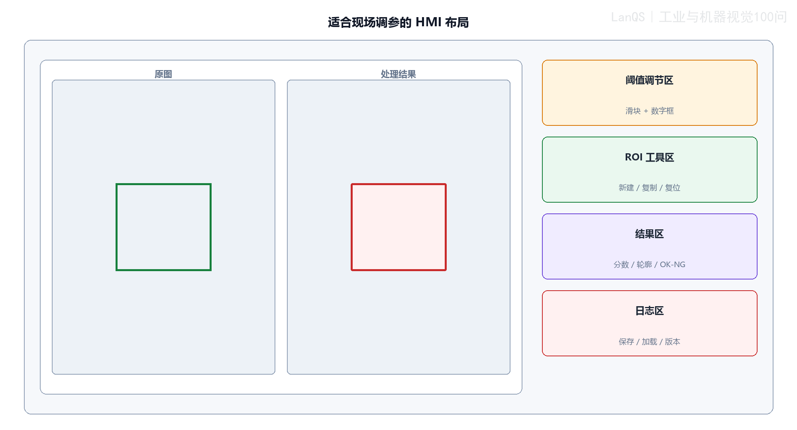


<p align="center"><strong>图59-1 适合现场调参的 HMI 布局。</strong></p>

#### 59.3 如何让 ROI 和视觉参数调整更直观？

ROI 应支持拖拽、复制、复位和数值输入，并同时显示像素坐标与实际单位。移动 ROI 时应实时刷新结果，显示目标遮罩、边缘和测量值；超出图像、宽高为零、与禁区重叠或超出标定范围时立即提示。操作员不应通过盲改数字来猜测结果。

#### 59.4 阈值滑块设计有哪些关键考虑？

滑块适合粗调，数字框适合精调，两者必须双向同步。当前值、允许范围、推荐范围和单位应明确显示。阈值变化后，结果遮罩、OK/NG 状态、缺陷数量和近期样本统计应在可接受延迟内刷新。


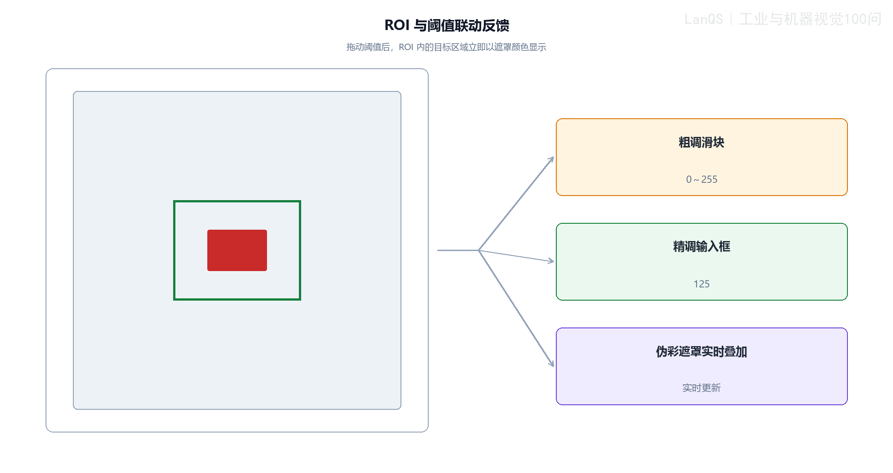


<p align="center"><strong>图59-2 ROI 与阈值联动反馈。</strong></p>

##### 59.4.1 算例：工作点附近的阈值敏感性

假设 ROI 内合格背景灰度服从 (N(90,12^2))，缺陷像素服从 (N(150,14^2))，阈值为 8 bit 的 0～255。两类分布交界处的等代价阈值约为 (T^*=118.1)。若把阈值从 118 改为 121，少量像素就可能跨过判定边界，因此界面必须显示遮罩和近期样本效果，不能只显示一个数字。

这些分布参数仅用于说明机制；实际工作点应由标注样本、误检和漏检代价共同确定。若漏检成本远高于误剔，最优阈值不会等于简单的等代价阈值。


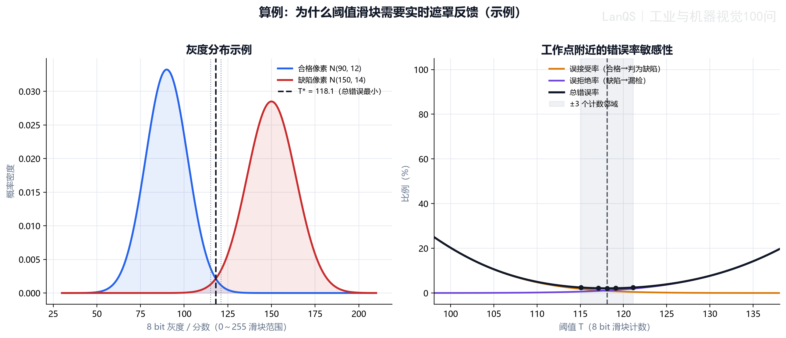


<p align="center"><strong>图59-3 阈值敏感性算例。</strong></p>

#### 59.5 如何把理想模型落到生产实践？

阈值应在带标签的近期样本集上验证，并关注 ROC、误检、漏检和生产成本，而不是只追求总错误数最小。实时遮罩还要显示帧时间和新鲜度：远程 HMI 或拥塞网络下，画面可能降采样、降帧或停留在旧帧，必须明确提示“当前画面不是最新结果”。

#### 59.6 如何防止误关检测或输入不合理几何？

设置硬范围只能挡住极端值，还需在提交时用近期样本重新评估候选参数。若某阈值会让几乎所有样本都通过或都失败，应在提交前报警。ROI 的面积、长宽比、旋转角、边界和工具依赖关系也应校验；不满足条件时禁止直接生效。

#### 59.7 如何通过反馈降低学习成本？

用原图、结果图、轮廓、遮罩和文字解释同时反馈；对参数变化标注“变化前/变化后”；提供撤销、恢复上次有效版本和少量带标签样本；把故障提示写成可执行动作，例如“曝光不足，请检查光源电流”，而不是只显示错误代码。

#### 59.8 工业环境下有哪些特殊因素？

要考虑手套操作、油污、反光、强环境光、屏幕距离、噪声、网络断开和权限分级。关键按钮应有确认和防误触；报警应区分提示、需确认和停机；维护页面应支持导出日志和参数快照。

#### 59.9 参数保存和恢复如何设计？

保存必须产生新版本，记录操作者、时间、变更项、样本验证结果和生效设备。恢复应先校验相机、镜头、光源、标定和产品型号是否匹配；换型时采用事务式切换，所有设备确认成功后才允许生产。

#### 59.10 如何评价和优化界面？

用真实操作员完成一组任务，测量完成时间、误操作次数、找错时间、恢复成功率和培训后保持率。观察操作员是否能区分旧帧、未保存参数和当前配方，再据此改布局和提示，而不是只凭开发者主观评价。

### 常见误区

- 只给滑块，不给精确输入和当前结果反馈。
- ROI 越界、空 ROI 或单位混乱时仍允许提交。
- 只用一张样本验证阈值，不看近期样本分布。
- 把旧图像当成实时图像，不显示帧年龄。
- 保存参数不留版本、操作者和回滚入口。

### 术语与符号表

- **ROI**：感兴趣区域。
- **遮罩**：按阈值或算法结果标出的目标区域。
- **工作点**：在当前光学和样本分布下实际采用的参数位置。
- **帧年龄**：显示帧相对于采集时间的滞后。
- **配方版本**：一组参数和适用产品型号的可追溯版本标识。

### 延伸阅读

- ISO 9241，人机交互的人因与可用性原则。
- OPC UA 信息模型与权限设计资料。
- 机器视觉系统的标定、验证和变更管理规范。

---

<a id="q60"></a>
## 第60问：生产换型时，视觉系统如何快速切换程序和参数？PLC 如何配合？
---

### 生产换型时，视觉系统如何快速切换程序和参数？PLC 如何配合？

#### 60.1 为什么生产换型对视觉系统提出特殊要求？

换型不仅是把一个阈值改成另一个阈值，还涉及相机、镜头、光源、ROI、算法、判定规则、PLC 节拍和产品追溯。若部分设备已经切换而其他设备仍使用旧配方，就会出现“看似运行、实际错检”的危险状态。因此换型必须是有版本、有确认、有回滚的受控事务。

#### 60.2 快速切换的核心架构是什么？

把每种产品的程序和参数封装为配方，由中央配方管理器或 PLC 保存产品 ID、配方版本和生效状态。视觉控制器先加载到暂存区，完成相机、光源、算法和标定校验，再由 PLC 发出统一生效命令。所有设备返回版本号和 Ready 状态后，系统才允许放行新产品。

#### 60.3 哪些技术手段可以支持快速换型？

采用参数化模板、预加载、双缓冲、配方校验和设备能力检查；把固定程序与易变参数分离；用 CRC 或哈希校验防止文件损坏；把产品 ID 写入每一张图像和每个结果；对旧产品在途队列保留旧配方，避免切换瞬间把前后两种产品混用。

#### 60.4 PLC 在快速换型中扮演什么角色？

PLC 负责停止进料或建立安全换型窗口，广播目标产品 ID，协调视觉、光源、运动和剔除机构，等待所有设备确认，清空或隔离旧队列，并在版本一致后恢复生产。PLC 不应只发送一个“换型完成”位，而应检查每台设备的目标版本、实际版本、参数校验结果和故障状态。

#### 60.5 PLC 与视觉系统如何通信？

可采用握手状态机：

1. PLC 发送 ChangeoverRequest、产品 ID 和目标配方版本。
2. 视觉系统返回 Loading，加载并校验暂存配方。
3. 视觉系统返回 Ready/Reject 以及实际版本和错误码。
4. PLC 检查所有设备一致后发送 Commit。
5. 视觉系统返回 Active，PLC 才重新放行产品。

通信协议应定义超时、重试、重复请求、断电恢复、版本不一致和人工取消的行为。关键字段至少包括事务号、产品 ID、目标版本、实际版本、CRC、状态、错误码和时间戳。

#### 60.6 什么是“一键换型”？

“一键”只表示操作入口简单，不表示系统内部没有校验。操作员选择产品后，系统应自动加载配方、检查设备能力、清理旧任务、完成联动确认，并把结果以清晰状态反馈出来。任何一步失败都应停在“未生效”状态，不能让部分新参数进入生产。


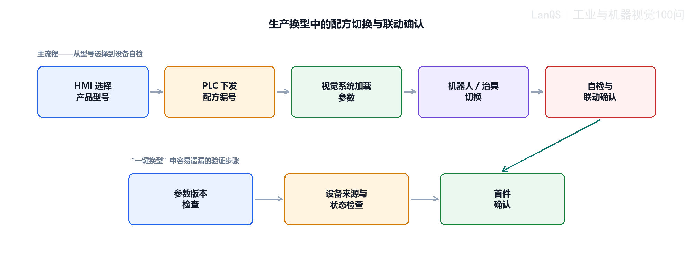


<p align="center"><strong>图60-1 生产换型中的配方切换与联动确认。</strong></p>

##### 60.6.1 算例：人工重配与配方换型的时间预算

以下为规划示例值：

| 环节 | 人工重配 / s | 配方换型 / s |
|---|---:|---:|
| 选择与确认 | 20 | 5 |
| 相机与光源参数 | 90 | 10 |
| ROI 与算法参数 | 120 | 15 |
| 联机验证 | 60 | 20 |
| **总计** | **290** | **50** |

配方换型把大量重复输入转化为可验证的加载过程，但不能省略联机验证。时间节省必须以版本一致、首件合格和旧产品队列已隔离为前提。


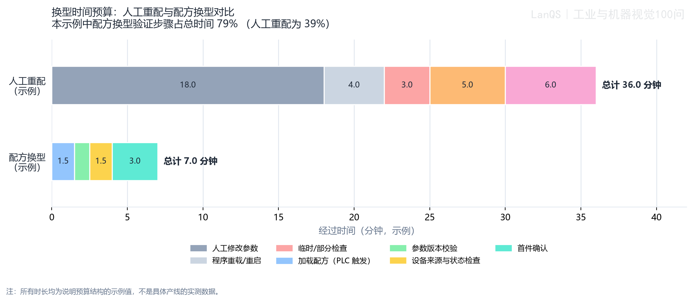


<p align="center"><strong>图60-2 人工重配与配方换型的时间预算对比。</strong></p>

#### 60.7 换型中途失败时如何防止错配生产？

采用事务式状态机：Idle → Preparing → Validating → Ready → Committing → Active。任何校验失败都进入 Aborted，保持旧配方或停线隔离，不得直接使用部分加载的新参数。恢复时检查 PLC、视觉、光源和运动控制器的版本；对换型窗口内已经经过的产品做隔离或重检。

#### 60.8 MES 如何支持更高层次的智能换型？

MES 可以根据工单下发产品 ID、配方版本、批次和质量要求，接收换型耗时、首件结果和版本审计记录。它不应取代 PLC 的实时互锁，而应负责生产计划、追溯、权限和统计。MES 下发的配方仍须由设备侧校验能力、标定和安全边界。

#### 60.9 实际部署面临哪些挑战？

常见问题包括设备能力不同、旧控制器不支持版本字段、通信超时、配方文件漂移、标定随换型变化、产品在途、权限不足和现场人员绕过流程。应建立配方基线、模拟换型测试、断电恢复测试、异常回滚测试和首件验收表。

### 常见误区

- 把“一键换型”理解为只发送一个产品编号。
- 只加载视觉参数，不同步 PLC 节拍、光源和剔除规则。
- 换型时不清理在途产品，导致前后配方混用。
- 不记录配方版本、CRC、操作者和实际生效时间。
- 部分设备确认失败仍允许恢复生产。

### 术语与符号表

- **配方**：与产品型号绑定的一组程序、参数、标定和控制配置。
- **事务式换型**：全部设备验证成功后一次性提交，失败则回滚或隔离。
- **双缓冲**：当前生产配方继续运行，同时在后台准备下一配方。
- **首件验证**：换型后用已知样件确认图像、参数和判定结果。
- **配方漂移**：设备实际参数与受控配方版本逐渐不一致。

### 延伸阅读

- ISA-95，制造执行系统与控制层的集成。
- IEC 61131-3，PLC 程序组织与状态机实现。
- 工业控制系统的配置管理、变更管理和审计追踪规范。

---

---

[返回总目录](../../README.md) · [上一章](../chapters/chapter-03-q41-q55.md)

---

[返回总目录](../../README.md) · [上一章](../chapters/chapter-03-q41-q55.md)
