# 工业视觉100问：第71–80问

---

<a id="q71"></a>
# 第71问　如何设计训练集采集流程，覆盖正常变化和缺陷条件？

新工位开始采集图像时，最容易出现的误判是把照片数量当成训练集质量。拍摄一万张整齐的合格品，可能仍然没有覆盖夜班、材料换批、工装磨损或光源预热后的状态；一个低频缺陷即使真实出现过，也可能只留下几张无法复核的图片。训练集要承担的工作，是在模型训练之前，把生产线上会遇到的正常波动、缺陷形态和合格边界整理成可标注、可验证、可追溯的数据资产，并在系统上线后继续吸收新的失效样本。

本题涵盖整件分类、目标检测、分割、尺寸测量和异常检测。不同任务的标签形式不同，但采集始终受同一组约束：产品判定规则、缺陷发生率、相机与照明条件、工位节拍、批次和工装变化，以及上线后是否有能力进行人工复判。采集流程只有把这些条件写入记录，并且让下一位工程师能够按同一规则复现，才具有工程意义。

#### 71.1 采集流程如何建立并写成执行计划？

一个可以长期执行的采集流程需要系统性、可重复性和闭环性。系统性要求团队能说明为什么采集、采集哪些对象、每类样本达到什么程度才足够，采集依据来自事先定义的任务和风险。可重复性要求下个月换一批材料、换一名工程师，仍能按同一规则得到可比较的数据。闭环性要求验证集或现场运行暴露缺口后，采集计划可以直接回到缺口本身补样，不必每次从头建立数据集。

这三个条件描述的是数据工程过程，不等同于拍摄设备保持稳定。工业数据的质量至少包括真值、过程状态和上下文。真值表示产品是否真的存在目标缺陷，以及缺陷是否达到质量规则规定的严重度；过程状态包括批次、机器、型腔、工装、配方和班次；上下文包括曝光、照明、工件姿态、采集时间和异常事件。缺少这些信息的图像即使清晰，日后也很难判断模型出错究竟是材料变化、成像变化、标签错误，还是训练覆盖不足。

这些字段还决定了模型训练时究竟把什么当成判别线索。如果同一批次的所有缺陷图都在夜班拍摄，模型可能把背景亮度或时间段当成缺陷特征；如果正常品来自固定机器而缺陷品来自另一台机器，机器纹理就会泄漏进标签。采集记录把图像放回生产过程，工程师才能识别这种与任务无关的关联，并在切分数据时按批次、工件或事件分组。

实验室中最清晰、最标准的图像适合检查成像链，却不一定代表生产分布。训练数据应保留真实生产中允许的轻微位置偏差、亮度波动、纹理变化和操作差异，同时把不可接受的缺陷与可以放行的边界样本分开。采集流程的第一项产物应是一份带版本的采样要求，图片只是这份要求执行后的结果。

正式拍摄前，应把任务、缺陷和现场条件写成三张相互关联的清单。任务类型先决定标注形式，再决定什么叫覆盖充分；缺陷清单规定要识别的类别、尺寸范围、常见位置、严重度和合格边界；现场条件清单则说明相机、镜头、照明方式、曝光、工位姿态、节拍、产品变体，以及哪些工艺信息能够与图像一起保存。

| 清单 | 至少要回答的问题 | 对采集计划的影响 |
|---|---|---|
| 任务清单 | 做分类、检测、分割、测量还是异常检测？ | 决定标签形式、样本粒度和验证指标。 |
| 缺陷清单 | 哪些缺陷要识别？尺寸、位置和严重度范围是什么？ | 决定缺陷样本来源、边界样本和最小覆盖要求。 |
| 现场条件清单 | 相机、镜头、照明、曝光、姿态、节拍和产品变体怎样变化？ | 决定分层采样、元数据字段和采集时段。 |

质量或工艺负责人还要把“正常变化”写成可以执行的判定规则。例如，颜色偏移到什么程度仍可放行，标签偏离多少仍属于允许误差，轻微油膜算工艺波动还是表面缺陷。边界没有统一口径时，不同标注人员会在不同位置划线，最后得到相互矛盾的标签；网络结构和损失函数无法代替质量规则。

“覆盖正常变化”必须进一步变成一线人员能够执行的采样和记录协议。采样应按班次和日历时间分层，从早班、晚班、夜班各取固定配额，并把采集分散到至少两到三周，避免集中在一个下午。班次变化可能伴随操作习惯、环境温度和原料批次变化，单日下午采集会把偶然状态误当成生产常态。批次或料号、机器、型腔和工装站位也要分层记录，因为材料差异和工装磨损会产生合法的外观漂移。

照明采样应包含光源刚开机和热稳定后的状态；若工位受窗光影响，还要安排不同时间段的采样；已知的湿度变化、背景反射和维护状态也应成为条件字段。多 SKU、颜色、材料或工装变体共用一个工位时，每种变体要有最低配额。用单一变体的大量图片填满总数，会让总量达标而使其他变体没有证据。

采样人员还应记录采集事件本身。相机重新对焦、镜头清洁、光源更换、参数下载和设备重启前后的图像不能混在同一批次里却不留标记，否则后续发现亮度或清晰度变化时没有时间边界可查。若采集程序能够自动写入设备状态和触发计数，应优先使用机器字段；人工备注用于补充自动系统无法识别的异常，而不应承担全部记录责任。

每张图至少绑定时间戳、班次、批次或料号、机器或工位、配方或参数集、操作者或自动运行标记，并保留异常备注。换线、停机恢复、夹具调整、光源闪烁和维护事件都可能解释后续分布变化。配额应写成“每班每周至少采集 N 件，持续八周”“换模后的前十个批次各采集 M 件”这类按分层约束的条款，不能只给“总共采集一万张”的总量目标。总量很容易被方便条件下的重复拍摄填满，整类状态却仍然为空缺。

#### 71.2 正常样本、缺陷样本和稀有缺陷怎样采集？

正常样本要表现生产线上允许的真实波动。若工件放置存在小范围偏移、相机安装有轻微位置变化、材料纹理随批次改变，质量规则仍判定合格，就应按原样保留。采集员不应为了让图像更整齐而删掉这些样本，否则模型会形成过窄的正常分布，面对合法波动时更容易产生误报。

采集计划应覆盖不同时间窗口、班次、批次、设备状态和操作者。多颜色、多尺寸、多 SKU 或多种工装的产品要分别确认最低覆盖量。这里的“足够”指主要变化源都有观察证据，类别行数相等并非判定条件。正常样本还应包含容易被误认为缺陷的难负样本，例如反光纹理、接缝、油膜、规则加工痕迹和轻微背景干扰。每个难负样本必须经质量规则确认属于合格品；若把应隔离的边界品混入正常类，标签边界就会被推向错误方向。

连续采集的相邻帧通常共享同一工件、背景和成像状态，数量增加并不等于分布覆盖按同样比例增加。采集记录应识别近重复图像；同一工件的连续帧、裁剪图和重复拍摄在训练、验证、测试切分时应放在同一分区。否则模型可能记住背景或工件纹理，验证分数却看起来很高。

正常分布的覆盖还要看变化幅度，而不仅是变化类别。例如“有光照变化”至少要知道亮度变化是否已经接近相机饱和、是否改变了缺陷与背景的对比度；“有位置变化”要知道偏移是否影响 ROI 边界或造成目标截断。记录这些幅度后，工程师能判断样本是在覆盖生产范围，还是只覆盖了变化名称却没有覆盖变化边缘。

缺陷采集同时受到低发生率、类别数量失衡和判定边界不稳定的影响。轻微划痕可能每天出现，边缘崩缺却可能几周才出现一次；同一名称的缺陷还可能因为工艺、客户标准或最终用途不同而有不同的放行界线。只按总缺陷数验收，会掩盖少数高风险类别仍然没有证据的事实。

历史 NG（No Good，不合格）库、返工记录和客户投诉通常能提供真实缺陷，但 NG 标记只说明样本曾被隔离，不自动说明图像中存在当前任务关注的缺陷。历史样本需要由质量人员复核图像、缺陷类别、严重度和最终判定；返工记录如果只有处理结果而没有原图，只能作为事件线索，不能直接当作训练标签。

在工艺允许且安全的范围内，可以受控制造边界缺陷，以补足自然生产难以得到的严重度和尺寸范围。此类样本要记录制造方法、尺寸或严重度、工艺批次和质量确认人，并在数据中标明它与自然缺陷的来源差异。质量部门和视觉团队还应共同维护缺陷字典，统一类别名称、最小可接受尺寸、典型位置、相邻类别的区分方式，以及无法判定时的归档规则。

受控制造不能简单等同于真实缺陷。人为刻出的划痕可能比刀具磨损产生的划痕边缘更规则，实验室制造的污染也可能缺少产线上的流动、反光和背景关系。它适合填补尺寸和严重度的空白，也适合验证系统对明确边界的响应；训练集仍应保留自然缺陷、历史返工样本和真实成像条件，并在验证时分别报告不同来源的结果。

当某个严重缺陷极少出现时，可以评估异常检测或单类方法。它们把学习重点放在正常分布上，适用于真实缺陷很难获得的情形，但仍需要少量真实缺陷、边界样本和人工复判来验证风险。数据增强可以改变已有图像的外观，不能凭空提供真实工艺机制、真实背景和真实成像条件。缺陷样本不足时，问题有时需要回到任务定义、质量边界或现场复判流程解决。

如果某类缺陷在每件产品上的发生概率为 \(p\)，工程师需要估计检查多少件产品，才有较大把握取得足够的已确认样本。把每件产品是否包含目标缺陷看作一次相互独立的伯努利试验，检查 \(n\) 件产品后捕获的缺陷数记为 \(X\)，有

$$
X\sim\operatorname{Binomial}(n,p)
\tag{71-1}
$$

其中 \(p\) 是单件产品出现目标缺陷的概率，\(n\) 是实际检查或记录的产品件数，\(X\) 是捕获并确认的目标缺陷件数。若训练阶段至少希望获得 \(k=30\) 个样本，并要求达到该数量的概率至少为 95%，就要找出满足

$$
P(X\geq30)\geq0.95
\tag{71-2}
$$

的最小整数 \(n\)。二项分布生存函数可以直接计算 \(P(X\geq30)=\operatorname{sf}(29;n,p)\)。代码先建立一个上界；若上界仍不足以达到 0.95，就继续扩大。得到可行上界后，再用二分搜索寻找最小值。固定 \(p\) 时，增加采集件数不会降低获得至少 30 个缺陷的概率，所以这个单调关系支持二分搜索。

下面的代码把发生率、目标样本数、置信度和日产量作为输入，计算所需采集件数及按理想产能折算的天数。示例发生率和日产量均用于说明数量级，实际项目应使用质量记录估计的发生率，并把停机、换型、确认和标注时间另行加入计划。

```python
from scipy.stats import binom
import numpy as np

TARGET_CONF = 0.95
TARGET_N = 30
RATES = [0.02, 0.01, 0.005, 0.002, 0.001]
THROUGHPUT_PER_DAY = 8000

def min_units_for_target(p, target_n=TARGET_N,
                         conf=TARGET_CONF):
    lo = target_n
    hi = max(target_n * 4, int(target_n / p) * 4)
    while binom.sf(target_n - 1, hi, p) < conf:
        hi *= 2
    while lo < hi:
        mid = (lo + hi) // 2
        if binom.sf(target_n - 1, mid, p) >= conf:
            hi = mid
        else:
            lo = mid + 1
    return lo

for p in RATES:
    n_req = min_units_for_target(p)
    days = n_req / THROUGHPUT_PER_DAY
    print(p, n_req, round(days, 1))
```

目标为以 95% 的概率捕获 30 个缺陷样本时，计算结果如下。

<p align="center">表71-1　以 95% 概率获得 30 个稀有缺陷样本所需的采样规模。</p>

| 缺陷发生率 \(p\) | 所需采集件数 \(n\) | 按 8000 件/日折算 |
|---:|---:|---:|
| 1/50（2%） | 1972 | 0.2 日 |
| 1/100（1%） | 3949 | 0.5 日 |
| 1/200（0.5%） | 7903 | 1.0 日 |
| 1/500（0.2%） | 19766 | 2.5 日 |
| 1/1000（0.1%） | 39536 | 4.9 日 |

以 \(p=0.005\)、\(n=7903\) 为例，精确二项分布计算得到 \(P(X\geq30)=0.9500\)。在同一条件下进行 200000 次蒙特卡洛模拟，得到约 0.9503，与解析结果接近。这个交叉结果说明给定二项模型下的程序计算相互一致；它不能证明真实产线的缺陷事件一定相互独立，也不能证明 30 张图已经覆盖该缺陷的所有尺寸、位置和成像形态。

图71-1把采样规模和理想采集时间放在同一张图中。阅读时先看缺陷发生率变小时柱形的数量级，再看折线给出的理想时间；停机、换线、人工确认和标注都不在这张图的时间假设内。

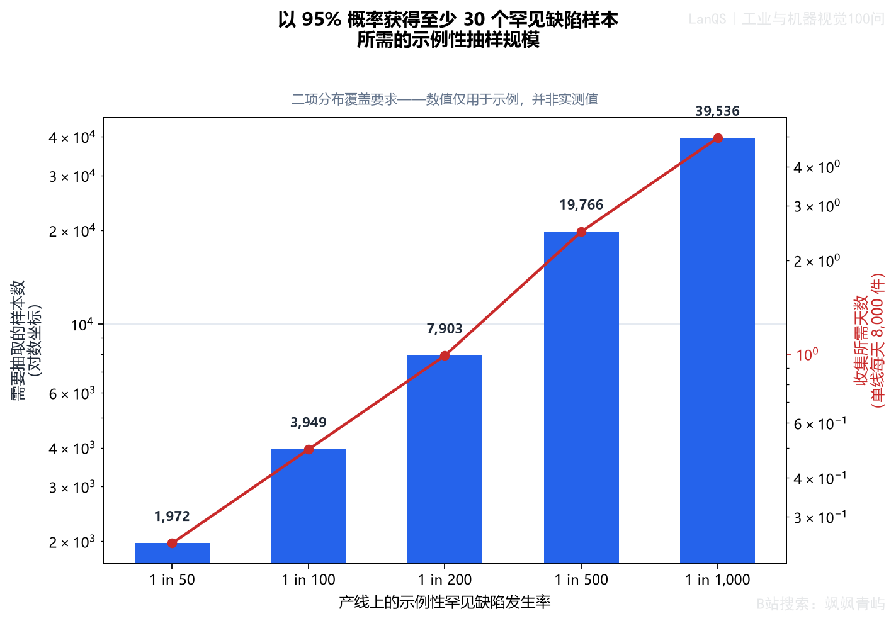
<p align="center">图71-1　稀有缺陷比例降低时，获得足够缺陷样本所需的样本量和时间会快速增加。</p>
<div class="figure-note">
横轴表示示例性的缺陷发生率，柱形表示在 95% 置信要求下获得 30 个样本所需的产品件数，折线表示按 8000 件/日换算的理想采集时间。缺陷率从 1/200 降到 1/1000 时，采样规模和时间迅速增加。图中没有计入停机、换线、人工确认和标注，所以它适合估计数量级，不能直接作为项目工期或存储预算。
</div>

发生率约为 1/1000 的缺陷需要检查约 4 万件产品，连续单线产出也接近五天；发生率再低时，单靠自然生产可能消耗数周。高风险且能在预算内获得真实样本的类别，应继续增加真实采集。极罕见类别则需要把历史样本、受控制造、异常检测和上线人工复判组合起来，并在放行条件中写明尚未由数据覆盖的部分。

#### 71.3 如何覆盖变化源并做好标注质量控制？

采集前应建立变化矩阵，把变化源和覆盖证据放在一起管理。产品自身的变化包括颜色、纹理、尺寸、位置、反射率和表面状态；工艺变化包括批次、机器、温湿度、工装磨损、上料姿态和班次；成像链变化包括曝光、照明方向、镜头状态、背景干扰和触发状态。

矩阵的每个重要单元可以记录样本数、缺陷数、采集日期、标签状态和风险等级。验证失败回填到对应单元后，团队可以区分三类问题：某条件尚未采到，某条件已采到但标签不稳定，或样本数量已经足够而模型仍然难以区分。生产中几乎不会出现的组合，不必为了形式完整而全部穷举，但排除依据要记录，安全关键条件不能因低频而直接排除。

变化维度也不需要一律做成完整笛卡尔积。优先级应由失效风险和生产频率决定。夜班与某一材料批次可能共同改变反射特征，低角度姿态与工件边缘可能共同造成遮挡，这些交叉条件比两个几乎不相关的维度更值得优先采样。数据切分也属于覆盖设计：来自同一工件的相邻帧、裁剪图或重复拍摄应放在同一分区，批次和时间最好按组划分。完全随机打散会让训练集和验证集共享近乎相同的背景和纹理，使模型记住批次特征。

变化矩阵的单元可以增加“计划样本数、已采样数、缺陷确认数、标签争议数、模型错误数和最近复核时间”等字段。采样完成后，空单元代表没有数据，错误集中却样本充足的单元代表模型或成像仍有问题，争议集中则提示质量规则需要澄清。矩阵因此既是采集计划，也是验证结果回溯和下一轮资源分配的索引。

图71-2展示了训练集怎样在采集、标注、验证和现场反馈之间循环。沿主流程阅读，可以看到需求定义先约束正常与缺陷采集，之后进入标注复核和验证；沿回流箭头反向阅读，可以检查验证失败和现场失败是否能改变下一轮采样重点。

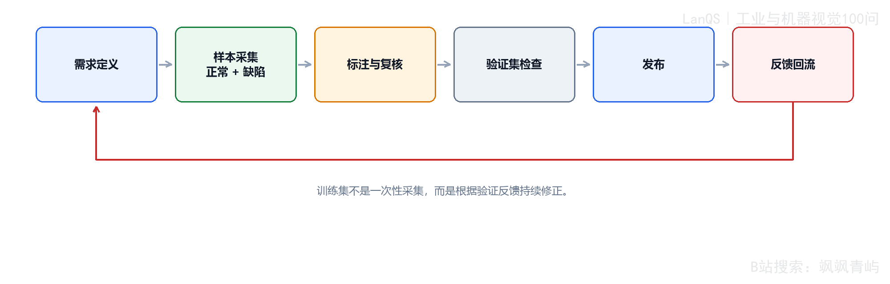
<p align="center">图71-2　训练集采集、标注、验证、发布与反馈闭环。</p>
<div class="figure-note">
图中的“正常+缺陷”位于同一个采集环节，表示两类分布都需要主动设计。验证集检查和现场运行产生的反馈沿回流箭头改变下一轮需求与采样重点。工程判断的依据是覆盖缺口，不是文件数量；图示表达流程关系，具体配额、标注工具和数据版本管理仍要结合产品生命周期确定。
</div>

标注规范要写清类别定义、边界画法、遮挡处理、最小缺陷单元、模糊样本处理和不可判定样本的归档方式。目标检测要说明框住可见缺陷，还是根据规则推断完整缺陷；分割要规定反光、毛刺和模糊边缘怎样处理；测量任务要固定基准线、单位和误差口径。规范的目标是让两名标注人员面对同一图像时能够给出可解释、可比较的结果。

质量控制同时检查标注内容和元数据。框、掩膜或类别需要抽检，批次、工位、时间戳、配方、样本来源和真值依据也需要抽检。小缺陷、边界样本和客户标准复杂的类别可以采用双人独立标注；普通分歧交给复核员，无法判定的样本提交质量或工艺负责人，减少标注人员反复猜测。

边界样本的分歧本身也应保留。记录原始标注、复核意见、引用的质量条款和最终决定，有助于发现某一规则是否反复产生争议。抽检应按批次、工位、缺陷类别和标注人员分层，不能只抽最清晰的图片；抽检结果还应回写到标注指南版本中，避免人员更替后同一条边界规则逐渐漂移。

如果项目规模允许，可以统计双人标注的一致率，单独检查小缺陷、遮挡和边界类别，避免用一个总体一致率掩盖局部问题。对检测框，除了类别一致，还要看位置偏差是否会改变后续判定；对分割掩膜，要观察边缘差异是否会改变面积或尺寸结论。标注质量控制关注差异是否会改变产品判定或训练目标，不要求所有人画出完全相同的像素轮廓。

#### 71.4 类别不平衡、停止条件和持续更新怎样处理？

工业数据通常是正常品远多于缺陷品，少数缺陷类别之间也可能相差几个数量级。处理顺序应从采样开始：先补充高风险、边界和易混淆类别，再根据需要使用增强、重采样或类别加权。某类只有几十张、正常品却已有数万张时，模型很容易选择把大多数输入都判为正常。

训练集可以提高少数类比例，为模型提供足够学习信号；验证集和测试集则应尽量保留真实生产先验。假设生产中某缺陷约占 0.1%，训练时却通过过采样提高到 5%，模型看到的分数分布已经对应人工改变后的类别比例。上线前应在接近真实先验的验证集上重新设定阈值，或显式修正模型输出概率，否则离线看似平衡的结果可能在产线上产生大量误报。

采样资源的目标是风险覆盖。高后果缺陷、合格边界和最容易混淆的正常样本应优先获得证据，低风险类别可以按实际风险设定下限。每次改变采样比例、增强策略或损失权重，都要同步记录，并在真实先验的独立数据上重新评估。类别数量相等并不等于系统已经可靠。

过采样影响的主要是训练阶段看到的类别频率，不会改变产线真实缺陷率。模型分数如果被当作概率使用，训练数据中的人工先验还会影响分数解释；即使分数只是排序，也可能需要重新选择阈值来适应现场报警容量。验证集应保留真实类别比例，同时报告每个关键缺陷类别的召回率和合格品误报率，这样才能看出采样策略是否把问题从漏检转成了误报。

验证至少有三层。统计验证检查类别、批次、工位、设备、班次和时间分布是否严重偏斜；视觉验证抽查标签、难负样本和边界样本；模型验证则快速训练基线模型，按场景和类别观察失败位置。很多数据问题不会从图片堆的外观中暴露，只有基线模型在某个条件下集中失败时，数据缺口才变得清楚。

验证结果应回写变化矩阵。例如模型在背光条件下的误报突然增加，第一步应检查该条件下的正常样本和缺陷样本是否充分、标签是否一致，再决定是否需要修改网络结构。这样可以把模型失败转化为具体的采集任务。

停止采集需要通过几个闸门。任务、缺陷和现场条件三张清单都应完成，并由负责人确认；重要分层不能为空，也不能被某一个方便条件异常占据；当前数据训练出的基线模型，其主要失败要能映射到已知的欠采样条件或标签问题，并有明确修复计划；下一轮采集的成本要与预计增加的覆盖收益比较。若剩余缺口来自生产频率极低且业务风险较小的条件，可以进入小规模试运行，同时启用现场监控，而不必无限延长采集。

基线模型在这里的作用是发现盲区，不能把它当作最终放行模型。评估时应按班次、批次、产品变体、缺陷类别和置信度区间切片；总体指标良好但某一切片明显失败，说明相应变化源尚未覆盖或标签规则尚未稳定。对可定位的已知缺口，可以带着补样计划进入试运行；对失败条件分散且无法解释的模型，继续扩大训练量往往只会扩大不确定性，应先回到任务定义和采集矩阵。

“足够”因此表示一个经过验证、缺口已映射、发布后有监控的数据集，不能用一个整数图片数量代替。稀有缺陷的时间代价还要纳入停止决策：若坚持对所有低频条件都达到统计覆盖，每个类别可能占用数天到数周的专用产线时间。高风险且在预算内可获得的类别可以追求更完整覆盖；最罕见的高严重度类别则可采用较少真实样本、受控制造、异常检测和上线人工复判的组合，并把残余风险交给监控和质量审批。

#### 71.5 训练集流程如何进入现场闭环？

系统上线后，误检、漏检、低置信度预测，以及人工复核与模型意见冲突的样本，都应进入候选回收池。每个候选至少绑定工位、光照、批次、配方、设备状态、模型版本和时间；新工艺条件、维护事件和换型也可以触发采集。回收池把现场失败转化为下一轮有针对性的任务，所有线上图像则不宜无差别加入训练。

回流样本进入训练前要去重、确认真值、补齐元数据，并按缺陷类别、场景和失败原因分层。数据集版本应与模型权重、预处理、阈值、标注指南和部署配置绑定。这样，更新后性能变化时才能判断原因来自样本分布、标签规则还是阈值策略。每次更新都应在固定的独立测试集上比较关键指标，并保留旧版本以便回滚。

回收池不应只保存“模型判错的图片”，还要保存当时的预测分数、候选框或掩膜、人工处理结果和最终质量结论。这样可以区分成像失败、标签争议、阈值边界和后处理误删。样本进入下一版训练前，应先完成原因归类；若同一事件产生多张连续帧，还应选择具有代表性的帧，并以事件为单位切分，避免一次故障被重复计算成许多独立证据。

线上分布漂移可能来自光学、机械、工艺或标签变化。记录新增和删除样本、标签变更、验证结果和发布结论，才能把训练集当作可追溯的质量资产管理。模型版本和数据版本脱钩时，现场出现问题后很难恢复当时的输入条件。

实际项目可以先用小样本按变化矩阵做预验证，确认任务边界、标签口径和采集方向；再按分层扩大正常与缺陷样本；完成标注复核和独立验证后发布小版本；上线期间回收失败样本，推动下一轮更新。小规模预验证能尽早暴露错误的标签规则或采样方向，避免把大部分时间投入到无效采集。

每一轮发布前，工程师至少要能回答四个问题：哪些生产条件已经有样本证据，哪些高风险缺陷仍然依赖受控制造或人工复判，验证集是否与训练样本保持了合理隔离，现场出现新样本后由谁确认真值并决定是否回流。问题的答案应写入版本记录，不能只留在采集人员的口头交接中。

现场记录应让没有参与首轮项目的工程师也能继续执行，包括样本来源、采集条件、标注规则、数据版本、验证结果和停止条件。产品、工装、照明或软件版本改变后，原有覆盖结论需要重新检查。训练集会随产品和生产条件变化而变化，维护过程应像代码管理一样保留版本、差异和回退路径。

### 常见误区

1. 用总图片数代替覆盖指标，忽略班次、批次、设备、产品变体和照明条件的空缺。
2. 只采集实验室中最标准的正常品，把现场允许的轻微偏移和纹理波动删掉。
3. 用增强图数量代替真实稀有缺陷、真实背景和真实成像条件。
4. 把历史 NG 记录直接当作目标缺陷真值，不复核缺陷类别和质量判定。
5. 过采样少数类后仍使用旧阈值，忽略训练先验和生产先验的差异。
6. 随机切分同一工件的相邻帧或裁剪图，造成验证结果虚高。
7. 只检查框、掩膜和类别，不检查批次、工位、时间戳和真值来源。
8. 因为总有新的边界情况就无限期采集，没有风险和成本约束下的停止门槛。

### 术语与符号表

| 术语或符号 | 含义 | 单位 |
|---|---|---|
| 训练集 | 用于学习模型参数的数据集合。 | 无 |
| 验证集 | 用于调参、比较版本和发现覆盖缺口的数据集合。 | 无 |
| 测试集 | 在开发过程中隔离、用于最终评估的数据集合。 | 无 |
| NG | No Good，不合格或缺陷样本，仍需与质量真值核对。 | 无 |
| 变化矩阵 | 按产品、工艺和成像链列出采样变化源及覆盖证据的表。 | 无 |
| 类别不平衡 | 少数类别样本远少于多数类别的分布状态。 | 无 |
| 概率校准 | 模型输出概率与部署环境真实类别频率的一致程度。 | 无 |
| \(p\) | 单件产品出现目标缺陷的概率。 | 无量纲 |
| \(n\) | 检查或采集的产品件数。 | 件 |
| \(X\) | \(n\) 件产品中捕获到的目标缺陷数。 | 件 |
| \(k\) | 要获得的目标缺陷样本数，本例为 30。 | 件 |
| FOV | Field of View，视场，一次成像覆盖的物方区域。 | mm 或像素 |

### 延伸阅读

1. 学习二项分布、生存函数和置信区间，理解稀有缺陷采样规模的统计边界。
2. 结合分层抽样、数据集版本管理和数据泄漏检查，建立可复现的训练流程。
3. 了解目标检测、分割、测量和异常检测在标签要求与少样本条件下的差异。
4. Bishop，Pattern Recognition and Machine Learning，学习类别先验与分类决策的基础。
5. Saerens、Latinne、Decaestecker，Adjusting the Outputs of a Classifier to New a Priori Probabilities，了解训练先验与部署先验不一致时的概率修正。
6. He、Garcia，Learning from Imbalanced Data，了解重采样、代价敏感学习和不平衡评估。
7. Amershi 等，Software Engineering for Machine Learning: A Case Study，了解生产机器学习系统中的数据收集、版本管理和迭代实践。

---

<a id="q72"></a>
# 第72问　现场调试发现特定角度或光照下的误检，却无法稳定复现，应该怎么办？

产线上的偶发误检常被描述成“某个角度偶尔会错”。这句话把一次具体的图像事件压缩成了模糊记忆：工件姿态、局部高光、光源温升、背景反射、送料节奏和算法阈值，可能在同一时刻共同落入一个很窄的条件区间。调试的第一目标是完整保存发生瞬间的图像、参数、环境和结果，再把这组证据带回离线回放、受控实验和回归测试。

本题讨论偶发误检的证据采集、根因隔离和长期改进。若工位涉及连续运动，还要把触发信号、编码器位置、前后帧和执行动作纳入时间关联。后文的存储算例采用中速单工位的示例参数，目的是解释记录策略的数量级差异，不能替代具体产线的容量评估。

#### 72.1 误检为什么难复现，第一步应该做什么？

这类问题的触发条件通常是一个高维空间中的窄窗口，而不是一个独立的角度或亮度值。工件旋转几度，镜面高光就可能移入算法关注区域；光源刚开机时的温升、曝光变化、背景反射、送料振动和工件表面差异，又会改变同一位置的灰度和纹理。只改一个变量时，系统可能恢复正常；只有几个变量同时接近边界，误检才会出现。

送料节奏也可能参与触发。上游机构的速度、工件到位时间和触发延迟会改变采图时的姿态；同一个机械角度，如果曝光窗口落在不同的运动阶段，图像中的拖影和边缘位置就不一样。算法阈值、ROI 裁剪范围和后处理规则又会把这些细小差异放大成一次判定变化，所以现场所说的“角度问题”经常同时包含成像和时序条件。

操作员看到的是“结果错了”，工程师随后听到的是“大约某个角度会错”。算法实际接收到的是一幅具体图像和一组具体配置，包含当时的局部饱和、阴影、姿态、裁剪位置和模型分数。口头描述已经丢掉了这些信息，按记忆把工件摆回“差不多”的位置，只是在重建相似场景，无法保证回到同一个触发窗口。

偶发故障还具有时间性。光源可能逐渐热稳定，材料批次可能整体更亮，夹具可能在振动后改变位置，软件配方也可能在换型时切换。工程师到达工位时，工件已经离开，照明和送料节奏也发生了变化；若没有原始证据，后续每次试验都可能是在寻找另一个条件组合。

第一项动作是封存证据，再改变参数。误检触发时，系统至少要保存原始图像、检测叠加图、模型结果和分数、当前配方号、曝光参数、光源状态、触发时间戳、工件编号、工位号和算法版本。原始图像用于回答算法实际接收到什么，叠加图用于查看框、掩膜、ROI 和分数位置，元数据用于解释当时为什么处于这个成像和配置状态。

事件记录还应有统一事件编号和时间基准。连续运动工位可以根据故障假设增加编码器位置、触发延迟、工控机负载、温度、通信状态和执行机构反馈。字段不必无条件无限增加，但字段名称、单位、采样时刻和版本必须固定；没有统一时间戳，图像和触发信号即使都被保存，也可能无法对应。

先改阈值会造成一种危险的假象：误检暂时消失，却没有留下原始状态，后续无法区分根因修复与偶然避开触发区间。保存证据后，工程师可以在不干扰生产的环境中重放同一输入，逐项改变配置，并比较原始事件、相似条件和独立回归样本。

保存原始帧时要避免只保留压缩后的叠加图。叠加图适合快速定位报警框、掩膜和分数，原始帧才保留后续重新裁剪、重新配准和重新运行预处理的可能性。记录还要说明图像是否经过缩放、压缩或颜色转换；否则离线回放得到的差异可能来自文件处理，而非现场故障。

#### 72.2 如何建立系统化的证据采集机制？

触发条件应围绕值得诊断的事件定义。常见事件包括输出 NG、模型置信度低于项目阈值、同一工件或相同状态的连续检查出现异常 OK/NG 翻转，以及操作员人工判定与算法结果不一致。这里的结果翻转不是指相邻两件产品结果不同，因为正常生产本来可能一件合格、一件不合格；比较对象应尽可能是同一工件的重复帧、前后视图或相同工艺状态。

一个事件触发器可以写成如下伪代码：

~~~text
对每个检测事件读取当前帧、结果、置信度和元数据
判断同一工件或相同状态是否出现异常 OK/NG 翻转
trigger = 当前结果为 NG
          或 confidence < τ_low
          或出现异常翻转
          或发生人工覆盖
若 trigger 为真：
    保存当前帧、叠加结果和事件元数据
    在环形缓冲区中补取触发前后的窗口
~~~

\(\tau_{\mathrm{low}}\) 是低置信度触发阈值，应在带可靠标签的验证集上确定，并随模型版本和阈值版本保存。某个模型使用 0.75，不表示所有模型和所有产品都应使用 0.75。触发集合过宽会增加写盘和检索压力，过窄又会错过低置信度、人工争议和结果翻转等早期信号。

事件判断应尽量在推理结果已经生成、但还没有被后处理覆盖之前完成。触发器只读取结果、置信度和元数据，不应等待人工确认才决定是否保存，否则人工到达前的原始状态可能已经丢失。对每个触发条件记录命中原因，例如 `ng`、`low_confidence`、`flip_flop` 或 `manual_override`，后续才能按原因统计事件量，调整规则时也能知道是哪一类事件占用了存储。

只保存触发帧通常无法解释故障是怎样形成的。系统可以在内存中持续保留最近若干帧，触发后继续采集到后置窗口结束，再把前置、触发和后置帧写入持久存储。前置帧可能显示工件正在稳定、夹具刚发生振动或光源开始闪烁；这些变化在单张误检图中可能完全不明显。

环形缓冲区是一个先进先出的循环区域，旧帧会被新帧覆盖，因此持续运行的内存成本可控。窗口可以覆盖几百毫秒到几秒；全分辨率缓存过大时，可以同时保留降分辨率副本和触发帧的全分辨率版本。部署时要明确窗口长度、并发事件的处理、写盘失败、磁盘容量告警和触发期间是否允许再次触发。

环形缓冲区的关键在于持续写内存，触发后写磁盘。若每一帧都同步写持久存储，缓冲区就失去了降低写盘压力的意义，并可能把磁盘延迟带入检测节拍。触发后需要给后置窗口留出时间，等工件离开或光源状态恢复后再封存事件；若多个事件在同一窗口内发生，应规定事件合并、窗口扩展或分别保存的规则，避免文件覆盖和事件编号混乱。

原图、叠加图、回放结果和根因结论应通过同一个事件编号关联，并与时间、工位、批次、配方、参数、软件版本和操作者信息放在一条可查询记录中。一个孤立的 PNG 只能说明保存了某幅图，无法回答为什么保存、当时用了哪一版参数以及它属于哪个批次。

结构化日志可以用 JSON 文件或数据库行保存，字段名称和数据类型应固定。例如一条记录可包含 `event_id`、`image_path`、`overlay_path`、`timestamp`、`station_id`、`part_id`、`recipe_id`、`angle`、`light_state`、`confidence`、`trigger_reason` 和 `model_version`。角度和光照状态的单位、时间基准以及缺失值表示方式也要统一，这样才能查询“某工位近一个月所有低置信度事件”，而不必人工翻阅目录。

图72-1把现场事件、图像证据和条件证据放在同一条回放链路中。阅读时先看两条并行支路是否都被保存，再看它们是否在离线分析环节汇合；缺少任意一支，复现和根因判断都会受限。

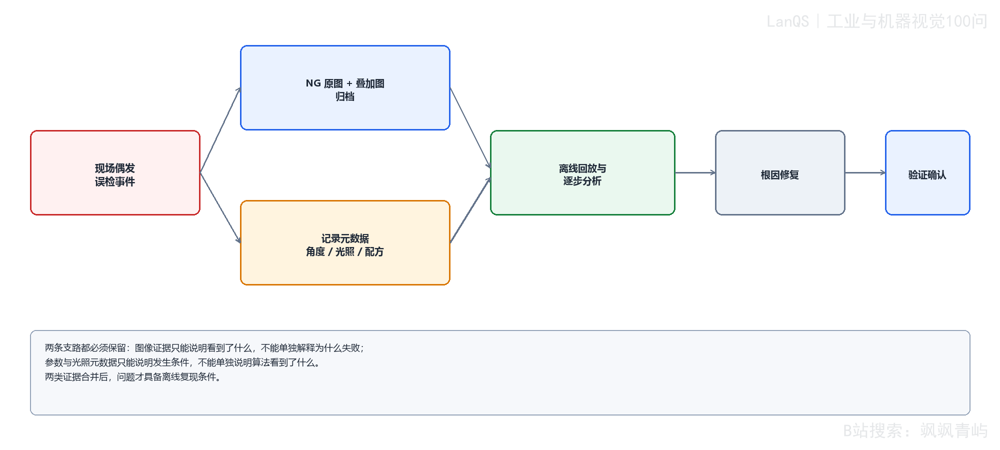
<p align="center">图72-1　偶发误检的现场采集、离线回放和根因验证闭环。</p>
<div class="figure-note">
上方支路保存 NG 原图和叠加结果，下方支路保存角度、光照、配方和版本等元数据；两类证据汇合后才具备离线回放条件。图中的两条支路表示证据类型之间的互补关系，而非两个可任选其一的方案。该图用于设计调试基础设施，具体数据库、日志服务器和缓存架构仍需按工位数量与 IT 约束确定。
</div>

“保存全部图像”听起来最安全，但在连续生产中可能迅速超过现场存储和带宽能力；“只存一个通过/失败标志”成本很低，却无法回看算法实际看到的内容。先用数量级算例比较三种策略，再决定事件触发规则。

设一个检测工位每件产品的周期为 \(2.2\ \mathrm{s}\)，每天运行 3 班、每班 \(8\ \mathrm{h}\)，每年生产 300 天。一条完整诊断记录包含原始图像、检测叠加图和结构化元数据，按 \(9.5\ \mathrm{MB}\) 估算，其中原图约 7 MB、叠加图约 2 MB、元数据为几十 KB；只保存通过/失败标志和时间戳时，按 \(0.5\ \mathrm{KB}\) 估算。

一年内处理的产品件数为

$$
N=\frac{8\times3600}{2.2}\times3\times300
\approx1.178\times10^7\ \mathrm{件/年}.
\tag{72-1}
$$

计算中 \(3600\) 的单位是秒/小时，\(N\) 的单位是件/年。若每件都保存完整记录，按 \(1\ \mathrm{TB}=1024\ \mathrm{GB}\)、\(1\ \mathrm{GB}=1024\ \mathrm{MB}\) 换算：

$$
D_{\mathrm{full}}=\frac{N\times9.5}{1024^2}
\approx106.7\ \mathrm{TB/年}.
\tag{72-2}
$$

若智能触发的完整记录比例约为 \(0.4\%\)，则

$$
D_{\mathrm{smart}}=D_{\mathrm{full}}\times0.004
\approx0.43\ \mathrm{TB/年}.
\tag{72-3}
$$

若只对 NG 事件保存完整记录，触发比例约为 \(0.05\%\)，则

$$
D_{\mathrm{NG}}=D_{\mathrm{full}}\times0.0005
\approx0.05\ \mathrm{TB/年}.
\tag{72-4}
$$

只保存 \(0.5\ \mathrm{KB}\) 的标志和时间戳时，使用 \(1\ \mathrm{GB}=1024\ \mathrm{MB}\)、\(1\ \mathrm{MB}=1024\ \mathrm{KB}\)：

$$
D_{\mathrm{flag}}=\frac{N\times0.5}{1024^2}
\approx5.62\ \mathrm{GB/年}.
\tag{72-5}
$$

三种完整记录策略的结果如下。

<p align="center">表72-1　不同日志触发策略的年度记录量和存储量。</p>

| 策略 | 触发比例 | 年记录量（约） | 年存储量（约） |
|---|---:|---:|---:|
| 全部记录 | 100% | 1178 万条 | 106.7 TB |
| 智能触发（NG/低置信度/异常翻转） | 0.4% | 4.7 万条 | 0.43 TB |
| 仅 NG 触发 | 0.05% | 5890 条 | 0.05 TB |

以智能触发为例，它保留了 NG、低置信度、异常翻转和人工争议等高信息量事件，同时把写盘量从约 106.7 TB 降到约 0.43 TB。仅 NG 触发更省空间，却会丢掉低置信度和翻转样本；这些样本常常在明确 NG 之前暴露系统正在接近边界。标志记录虽然只需约 5.62 GB/年，却没有原图、叠加结果和光照状态，无法支持图像级根因分析。

存储量还会受到压缩格式、备份副本、保留周期、多工位并发和网络上传策略影响。算例只计算单工位一年内的原始记录量，实际容量规划还要为写盘突发、索引、临时文件和故障期间的本地缓存留出余量。事件触发率也不应凭经验永久写死，应从试运行日志中统计各触发原因的数量，再与人工复判能力和检索价值一起调整。

图72-2使用对数纵轴，是因为三种策略跨越多个数量级。先比较柱形的数量级，再决定本地缓存、服务器、保留周期和检索方式；图中参数是示例条件，不能直接当成某条生产线的存储预算。

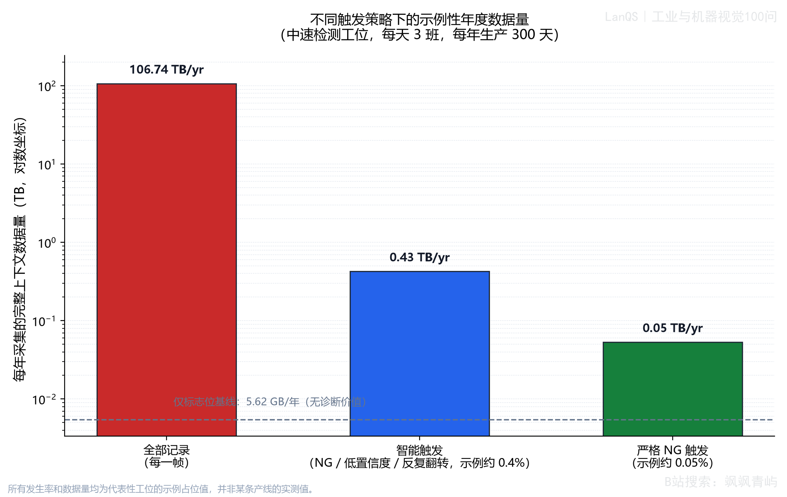
<p align="center">图72-2　不同日志触发策略的年度数据量对比（示例，纵轴为对数尺度）。</p>
<div class="figure-note">
柱形表示按完整诊断记录计算的年度数据量，虚线表示只保存标志和时间戳的参考量。图中最重要的关系是全量记录、智能触发和 NG 触发之间的数量级差异；示例中的 2.2 秒周期、9.5 MB 记录大小、事件比例和 300 天生产周期都必须换成现场测量值。保留周期、压缩、备份、多工位并发和事件检索也会改变实际容量。
</div>

#### 72.3 误检样本怎样分析，实验如何暴露问题？

离线分析应先确认真值和输入，再判断问题属于哪一层。检查工件是否完整位于视场中，位置、旋转和尺度是否超出训练覆盖；再查看反光、阴影、局部饱和、背景变化和运动模糊是否改变了算法依赖的灰度或纹理；随后核对配方、曝光、光源状态、预处理和软件版本是否与已验证基线一致。最后把事件归入成像、定位、特征区分、数据覆盖或配置链路。

误检帧应与触发前后帧、同批次正常样本以及相同光照条件的历史样本一起分析。某一批材料的反射率可能在一小时内逐渐变化，光源也可能随着温度升高发生漂移；单帧不显著的趋势，在时间序列或按条件聚类后才会显现。每次回放要固定输入、预处理和配置，并把新结果回写到原始事件编号。

怀疑角度和光照共同触发误检时，等待它自然出现的效率很低。可以使用固定参考件、手动转台或可调工装、可调光源和固定背景，围绕入射角、工件旋转角、曝光、光强、色温和背景亮度建立实验矩阵。

实验先固定已验证基线，只扫描一个可疑变量，记录误检开始和结束的范围；再在几个固定值下加入第二个变量，观察是否存在交互边界。受控实验的叠加图、关注区域、模型分数和前后帧要与原始误检事件逐项比较。两次都输出 NG 只能说明结果相同，失败形态和条件响应相近才支持同一根因。

一轮变量隔离可以按这样的顺序进行：先在固定良品上改变一个变量；再扫描该变量的明确范围；随后加入第二个疑似因素并绘制二维边界；然后更换一件工件或略微改变夹具位置，排除参考件和台架自身造成的假象；最后将可复现事件与原始帧的关注区域、分数模式和时间上下文对照。手动实验不要求一开始就复杂，但必须写下保持不变的条件和变量范围。

实验记录应同时保存“没有误检”的边界，因为它能说明故障从哪里开始消失。若在角度 \(a_1\) 到 \(a_2\) 之间才出现误检，还要记录每个角度下的重复次数和触发比例；一次 NG 只能证明该组合曾触发，不能估计触发概率。对光强、曝光和背景亮度同样如此，只有重复测量后得到的条件区域，才有资格成为回归测试或现场报警阈值的依据。

#### 72.4 算法修复、长期监控和工具怎样配合？

修复措施要跟随已确认的失效机制。角度变化造成模板不匹配时，可考虑更稳健的定位或跟踪、多视角模板和形状特征；光照瞬变造成灰度漂移时，应先检查光源、曝光和饱和，再评估局部归一化或对照明更稳定的特征表示；训练覆盖不足时，才适合定向补采、加入难例、增强或重新校准阈值。

深度学习模型可以吸收确认过的误检样本，但样本真值和场景解释要先由质量或工艺人员确认。直接把所有误检图重新训练，模型可能只记住一张图片的纹理，原有条件边界并没有扩大；邻近条件还会继续失败，其他区域的决策边界也可能发生非预期移动。修复后应同时运行原始失败帧、受控实验中相邻条件和未参与调参的独立回归集。

若修复属于成像层，应先验证亮度、饱和区域、对比度和清晰度是否回到基线，再观察模型指标；若修复属于模型层，应保持成像参数不变，比较训练前后在同一事件集上的输出；若修复属于后处理层，则要特别检查边界缺陷是否被一并过滤。一次改动只解决一个明确的失效假设，便于把收益和副作用归因到对应层。

应维护误检台账，至少记录时间、工位、产品、缺陷类别、环境条件、软件版本和最终根因。定期按光照、配方、批次、设备和运行时长聚合，能把许多表面上互不相干的事件归并为少数薄弱环节，例如某台设备的光源衰减、某种材料批次的反射变化或某个版本的预处理差异。

低置信度样本、人工争议样本和高风险条件样本应进入固定回归集。每次模型或参数更新后，重新运行这组样本，检查旧误检是否消失、是否出现新的漏检或误检，并保存模型、配置和输入版本。若事件率随时间升高，还要同步查看光源寿命、镜头污染、机械偏移、材料批次和通信状态，不能把所有变化都归咎于模型。

误检台账可以按根因、条件组合和严重度统计趋势。高频但低后果的事件可能适合通过触发规则和后处理降低数量，高后果事件则需要保留完整证据并优先进入质量评审。台账中的“已关闭”应指修复在原始事件、相邻条件和独立回归集上都通过，而不是某次现场重启后暂时没有再出现。

固定格式的 NG 归档、原图与叠加图同步保存、参数快照、图像回放工具、ROI（Region of Interest，感兴趣区域）中间结果可视化和批量离线重跑，构成一套实用的基础工具链。ROI 可帮助工程师检查裁剪和配准后的实际输入，避免整幅图的外观掩盖局部定位问题。

深度学习系统可以使用 Grad-CAM（Gradient-weighted Class Activation Mapping，基于梯度的类别激活映射）或特征热力图观察模型关注区域。它们提供的是解释线索，不是因果证明；最终判断仍需结合原始图像、参数、真实标签和受控变量实验。批量重跑时应固定预处理和结果导出格式，必要时记录裁剪坐标、缩放比例和插值方式。

批量离线重跑还要注意运行环境一致性。模型权重、推理框架、算子版本、预处理库和后处理配置中的任一项变化，都可能使结果与现场不同。回放工具应显示输入文件、事件编号、配置版本和输出时间，并能把单帧结果与原始叠加图并排保存。Grad-CAM 等可视化适合帮助工程师提出假设，不能替代对角度、光照、曝光和触发时序的受控复验。

调试顺序应保持稳定：先保存证据，再判断原因；先建立可复现环境，再调整参数；修复后回到原始事件、相邻条件和独立回归集验证。这样，偶发误检才会从一次无法复述的现场传闻，变成能够复盘和关闭的工程问题。

### 常见误区

1. 证据还没有保存就现场修改阈值，导致所谓修复无法与原始状态比较。
2. 只保存触发帧，不保存触发前后的环形缓冲区，遗漏振动、姿态和光源变化。
3. 默认保存全部图像，忽略存储、带宽、检索和备份成本。
4. 未确认根因就把误检图加入训练，模型可能记住单帧而没有学习到条件边界。
5. 把误检帧孤立分析，忽略相邻帧、同批次趋势和光源温度变化。
6. 只复测一次角度与光照组合，就把偶然成功当作根因。
7. 把图像、参数和软件版本分开保存，事后无法还原完整事件。

### 术语与符号表

| 术语或符号 | 含义 | 单位 |
|---|---|---|
| NG | No Good，不合格或被判为缺陷的样本；是否为误检要与质量真值核对 | 无 |
| \(\tau_{\mathrm{low}}\) | 低置信度事件的触发阈值，应按验证集和项目风险确定 | 无量纲 |
| 环形缓冲区 | 在内存中持续保留最近若干帧，触发后补取前后窗口 | 帧或秒 |
| 结构化日志 | 将图像、时间、工位、批次、参数和版本绑定为可查询记录 | 无 |
| 结果翻转 | 同一工件或相同状态的连续检测在 OK 与 NG 之间异常变化 | 无 |
| 难例 | 模型判断错误或不稳定、经真值确认后用于训练或回归的样本 | 无 |
| ROI | Region of Interest，感兴趣区域，算法处理或输出的局部区域 | 像素 |
| Grad-CAM | Gradient-weighted Class Activation Mapping，基于梯度显示类别激活区域的方法 | 无 |
| \(N\) | 一个年度内检测的产品件数 | 件/年 |
| \(D\) | 按记录策略计算的年度数据量 | GB/年或 TB/年 |

### 延伸阅读

1. 学习事件触发、环形缓冲和结构化日志在实时系统中的实现方式。
2. 结合实验设计方法，分析角度、光照、姿态和背景亮度之间的交互影响。
3. 了解 Grad-CAM、特征热力图和离线回放的适用条件及解释边界。
4. Selvaraju 等，Grad-CAM，学习深度网络关注区域可视化的基本方法。
5. Steger、Ulrich、Wiedemann，《机器视觉算法与应用》，用于理解镜面反射、照明变化和姿态相关匹配失效。

---

<a id="q73"></a>
# 第73问　如何评价视觉系统的稳定性？除准确率外，还应监控哪些指标？

视觉系统验收时，团队通常先给出一张准确率表。表格可能很漂亮，但它只描述某一批测试数据、某一组光照和某一个时间点的平均结果。产线真正需要回答的是：同一工件重复通过时结果是否一致，换班或换批后漏检和误检是否漂移，连续运行数小时后延迟和队列是否仍满足节拍。稳定性评价要把这些时间、条件和运行因素放回检测结果中。

本题把指标分成检测结果、测量重复性和运行行为三个层面。分类或缺陷检测要关注漏检、误检和报警可信度；测量或定位要关注重复性、再现性和偏置；运行系统要关注延迟尾部、吞吐、资源、丢图和长周期漂移。具体限值由产品公差、缺陷后果、复判能力、节拍和样本量决定。

#### 73.1 稳定性和重复性如何定义与量化？

稳定性是指在规定的输入条件和运行范围内，系统持续给出可接受结果的能力。对检测任务，它表现为同一真实状态不会因时间、批次或轻微扰动而随机翻转；对测量任务，它表现为同一对象的重复测量集中，并且改变操作者、设备或时间后仍保持在允许范围；对运行链路，它表现为采集、推理、写回和通信能够持续工作。

准确率只对平均正确比例负责，稳定性还要描述结果随条件怎样变化。模型在实验室样本上的准确率很高，并不代表光源衰减后每个班次仍有相同的漏检率；同一边界样本反复通过时若在 OK 与 NG 之间切换，平均准确率也可能掩盖这个问题。稳定性验收应把结果、条件、时间、版本和运行日志关联起来。

可以把稳定性限值写成与任务相对应的边界。例如安全缺陷设定漏检率上限，高速分选设定 P99 延迟和报警量上限，尺寸测量设定重复性、偏置和再现性上限。没有明确的扰动范围、观测窗口和响应动作，单独写“系统稳定”无法指导选型和放行。

因此，稳定性报告应同时带上条件标签和统计分母。一个班次的 FNR 是在什么产品、什么缺陷类别、多少件真实缺陷上计算的，标准件的标准差是在何种温度、焦距、姿态和标定状态下得到的，延迟分位数又是否包含采图、写回和通信时间，这些信息决定数字能否用于比较。脱离条件的单个百分比只适合做提示，不能直接作为放行结论。

重复性（repeatability）描述同一测量系统、同一对象、同一工位和近似相同条件下连续重复测量的散布。再现性（reproducibility）描述改变操作者、班次、批次、设备或规定环境后，结果是否仍在可接受范围内。两者都属于测量系统分析的一部分，但回答的是不同问题。

量具重复性与再现性（Gauge Repeatability & Reproducibility，GR&R）常用于把总变差拆分为测量系统重复性、条件变化引起的再现性以及零件或过程自身的变差。若把多个不同零件之间的差异直接算成重复性，测量系统就会被错误地认为很不稳定；反过来，只测一个标准件又无法说明不同批次和不同工位的再现性。

实际试验可以从标准件开始：固定工位和参数，连续采集同一对象，观察均值、标准差和极差；随后改变操作者、班次、批次、设备和工装，查找整体偏移或离散度增加的位置。重复性差时，应先检查触发、曝光、振动、焦点、标定和配准；再现性差时，要核对参数版本、标定文件、照明状态和操作步骤。

GR&R 的价值在于把“测量结果变了”拆成可追踪的来源。若同一标准件在相同条件下反复测量已经散布很大，问题偏向重复性，可能来自噪声、焦点、振动或算法随机性；若单次重复很集中，换操作者、设备或班次后整体偏移，问题偏向再现性，可能来自标定、装夹、照明或操作流程。若不同零件之间的真实尺寸变化没有从研究设计中分离出来，测量系统的误差就会被错误估计。

分类任务没有连续尺寸，也可以做重复性试验。同一图像重复推理、同一工件连续通过、相近姿态重复采集，都应在真实状态保持不变时给出一致判定。少量标准件的结果只适用于已覆盖的工位和条件，不能代表整个产品族。

#### 73.2 漏检、误检和混淆矩阵怎样共同描述性能？

漏检率也称假阴性率（False Negative Rate，FNR），回答的是“真实缺陷中有多少被系统放行”。设 TP（True Positive，真正例）为正确检出的缺陷数，FN（False Negative，假负例）为漏掉的缺陷数，则

$$
\mathrm{FNR}=\frac{FN}{TP+FN}.
\tag{73-1}
$$

分母 \(TP+FN\) 是全部真实缺陷。它不包含合格品，因为合格品数量只会改变分母大小，却不会改变“真实缺陷被漏掉的比例”。例如某班次确认了 20 个真实缺陷，其中 19 个检出、1 个漏检，则

$$
\mathrm{FNR}=\frac{1}{19+1}=0.05=5\%。
$$

生产报告要同时保存 TP、FN、缺陷类别、产品型号、班次和样本量。把 FN 除以全部产品数，会把低缺陷率工位的风险严重稀释；把容易检出的缺陷和高后果缺陷混成一个总数，也可能掩盖关键类别正在恶化。

漏检率的变化还要结合置信区间或至少结合原始计数解释。一个窗口里只有少数真实缺陷时，漏掉 1 件就可能使百分比大幅变化；多个班次合并后百分比更平滑，却可能把近期恶化掩盖掉。实际监控应保留每一类的 TP 和 FN，并记录标签确认方式、窗口起止时间以及当时的模型与配置版本。

误检率通常用假阳性率（False Positive Rate，FPR）表示，回答的是“真实合格品中有多少被错误拦截”。设 FP（False Positive，假阳例）为合格品被判为缺陷的数量，TN（True Negative，真负例）为正确放行的合格品数量，则

$$
\mathrm{FPR}=\frac{FP}{TN+FP}.
\tag{73-2}
$$

精确率（precision）回答另一个问题：系统报出的缺陷中，有多少确实是缺陷：

$$
\mathrm{Precision}=\frac{TP}{TP+FP}.
\tag{73-3}
$$

FPR 以全部真实合格品为分母，精确率以全部报警为分母。缺陷发生率很低时，即使 FPR 只有很小的百分比，庞大的合格品数量仍可能产生很多误报警，精确率也会因为生产先验改变而明显变化。FPR更接近误剔、返工和停线风险，精确率更接近“一个报警有多可信”，报告时需要并列给出。

例如同一个模型在缺陷率较高的实验集上可能有较好的精确率，换到真实缺陷率更低的产线后，少量 FP 也可能占据大部分报警。FPR 用合格品作为分母，适合估计每批合格品被拦截的风险；Precision 用报警作为分母，适合估计人工复判工作中有多少报警值得信任。两者都受阈值、样本构成和标签质量影响，不能从其中一个数字推断另一个数字。

混淆矩阵把真实状态和预测状态交叉排列，保留了指标背后的四个计数：

| 真实状态 | 判为合格 | 判为缺陷 |
|---|---:|---:|
| 合格品 | TN：正确放行 | FP：误检 |
| 缺陷品 | FN：漏检 | TP：正确检出 |

从这四个计数可以重新计算 FNR、FPR、精确率和召回率，也可以按批次、班次、产品型号和缺陷类别分组。多类别任务中，矩阵还能显示哪种裂纹经常被判成正常、哪种污染经常与划痕混淆。错误方向不同，质量后果也不同；一个总体准确率不会保留这种方向信息。

混淆矩阵还帮助检查样本分母。若某一高风险类别只有很少的真实缺陷，报告应同时给出计数和不确定性，不能只把百分比写到小数点后两位。稳定性趋势需要连续窗口中的真实样本量支撑。

把矩阵按班次、批次、产品型号和缺陷类别切片，可以判断错误是集中在某一条件，还是所有条件都发生了变化。多类别任务中，对角线表示各类别被正确识别，非对角线单元表示具体混淆方向；一个裂纹被判为正常，和一个轻微划痕被判为裂纹，对质量和生产成本的后果不同，处置动作也不同。

#### 73.3 ROC、AUC 和运行指标怎样进入监控？

当模型输出连续分数时，改变判定阈值 \(t\)，就能得到一系列 FNR 和 FPR。真正例率（True Positive Rate，TPR）为

$$
\mathrm{TPR}=1-\mathrm{FNR}=\frac{TP}{TP+FN}.
$$

ROC（Receiver Operating Characteristic，受试者工作特征）曲线以 FPR 为横轴、TPR 为纵轴，AUC（Area Under the Curve，曲线下面积）概括模型在多个阈值下的排序和区分能力。它适合比较模型或版本的总体可分性，尤其适合工作阈值尚未冻结的阶段。

ROC/AUC不直接给出现场最优阈值、误报成本、人工复判能力和端到端延迟。模型可能在静态测试集上有很高 AUC，却在特定光照、换批或长时间运行后发生漂移。缺陷比例很低时，还应查看精确率和召回率曲线，因为它对正类稀少的情形更敏感。所有曲线都要记录样本数量、标签质量、阈值范围、产品类别和测试条件。

ROC 曲线适合回答模型能否把缺陷分数整体排在合格品之上，AUC 适合在尚未决定阈值时比较版本；它们不回答报警量是否超过复检能力，也不回答模型在夜班运行八小时后是否仍然稳定。若上线只使用曲线上的一个工作点，验收还要在该点报告 FNR、FPR、样本量和延迟尾部。正类稀少时，PR 曲线中的精确率和召回率更接近报警资源所面对的实际问题，但同样需要真实生产先验。

图73-1把稳定性评价放在一个共同框架中。读图时先问三类指标是否都被记录，再看它们是否回到统一的基准和监控环节；若只看到检测分数而没有测量和运行数据，评价链条仍然不完整。

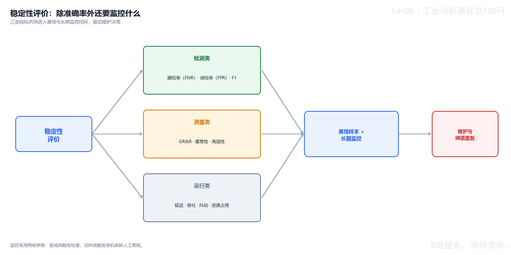
<p align="center">图73-1　由检测类、测量类和运行类指标共同构成的稳定性评价框架。</p>
<div class="figure-note">
检测类指标描述判定后果，测量类指标描述重复结果是否集中，运行类指标描述系统能否持续满足节拍和资源约束。三类数据应与同一批次、班次、版本和环境条件关联，才能把一次漏检追溯到成像、测量或运行环节。图示是监控框架，不提供所有任务通用的放行阈值。
</div>

平均处理时间很容易掩盖少量长尾事件。应记录从触发、采图、预处理、推理、后处理到结果写出的端到端延迟，并查看 P95、P99 和 P99.9 分位数。P99 表示 99% 的样本延迟不超过该值，其余长尾可能造成队列积压、错过执行窗口或触发信号丢失。

吞吐率、延迟抖动、CPU/GPU/内存占用、缓存和队列深度也应纳入运行指标。平均 GPU 利用率较低，不代表高峰时没有队列堆积；平均处理时间满足节拍，也不代表每次报警都能在执行机构需要的时间内写出。若系统支持追溯，还要监控掉图率、写回失败、时间同步、日志完整率和异常重启次数。

延迟统计要先规定起止点。只测模型函数耗时会漏掉采图等待、图像传输、预处理、推理、后处理、结果写回和 PLC 通信；只看平均值又会漏掉少量超时。P95、P99 和 P99.9 是延迟排序后的分位点，例如 P99 表示 99% 的记录不超过该值，剩余 1% 的长尾仍可能决定执行机构是否错过窗口。队列深度和丢触发数可帮助判断长尾是否已经转化为产线后果。

长期趋势要按班次、批次和版本保存。测量任务可以使用标准参考件跟踪均值和标准差；检测任务可以按缺陷类别跟踪 FNR、FPR、置信度和人工复判不一致率。镜头污染、光源衰减、焦距漂移、材料批次和软件更新，都可能先在这些指标中留下变化。

下面的数值是合成示例，用于说明短时重复性和长周期监控怎样放在同一套评价中。对同一标准件在固定条件下测量 \(N=30\) 次，测量值记为 \(x_i\)。样本均值和样本标准差分别为

$$
\bar{x}=\frac{1}{N}\sum_{i=1}^{N}x_i,
\qquad
s=\sqrt{\frac{\sum_{i=1}^{N}(x_i-\bar{x})^2}{N-1}}。
\tag{73-4}
$$

算例得到 \(\bar{x}=1.9978\ \mathrm{mm}\)、\(s=0.0188\ \mathrm{mm}\)。测量极差为

$$
R=\max(x_i)-\min(x_i)=0.0676\ \mathrm{mm},
\tag{73-5}
$$

若把这 30 次测量作为一个子组，可用 \(d_2=3.472\) 将极差换算为波动尺度：

$$
\hat{\sigma}_R=\frac{R}{d_2}
=\frac{0.0676}{3.472}
\approx0.0195\ \mathrm{mm}.
\tag{73-6}
$$

相应的六倍波动宽度约为

$$
6\hat{\sigma}_R\approx0.1127\ \mathrm{mm}.
\tag{73-7}
$$

标准差和极差估计接近，说明在这组标准件、工位和条件下，短时测量波动约为 \(0.0195\ \mathrm{mm}\)。这个结果只能说明当前条件下的重复性，不能单独证明测量任务满足产品公差；还需要知道目标值、公差带、测量偏置、标定不确定度、零件间变差和长期漂移，六倍波动也不应直接当作产品公差。

例如，若产品允许的测量公差只有 \(0.05\ \mathrm{mm}\)，示例的 \(6\hat{\sigma}_R\approx0.1127\ \mathrm{mm}\) 已经提示重复性可能过宽；若产品公差远大于这个范围，仍需检查偏置和再现性后才能决定是否放行。算例没有提供产品公差、偏置或不同操作者数据，所以它只能演示重复性计算，不足以完成 GR&R 或测量系统验收。

再构造 20 个班次的滚动窗口。设基线漏检率为 1.8%、基线误检率为 2.5%，第 12 个班次开始出现逐步增强的漏检漂移。预警线取基线的 1.8 倍，即 3.2%；停线线取基线的 3 倍，即 5.4%。每个窗口都应分别统计真实缺陷和真实合格品，再按式（73-1）和式（73-2）计算：

~~~text
对 shift = 1..20 建立班次窗口
基线漏检率 = 0.018，基线误检率 = 0.025
若 shift >= 12：
    漏检率 = 0.018 + 0.006 × (shift - 12 + 1) + 小幅噪声
否则：
    漏检率 = 0.018 + 小幅噪声
误检率 = 0.025 + 小幅噪声
保存每班次的 TP、FN、FP、TN、FNR 和 FPR
查找漏检率首次超过 3.2% 和 5.4% 的班次
~~~

示例序列中，第 14 个班次首次越过预警线，第 17 个班次首次越过停线线；第 5 个班次漏检率约为 1.87%，第 20 个班次约为 7.45%。第 5 个班次的单点快照仍可能让人认为系统正常，滚动序列才显示出后续退化。每个点代表一个班次窗口，不是单件产品的结论；窗口样本量较小时，应同时报告计数和区间估计。

图73-2的左侧展示同一标准件的重复测量，右侧展示班次窗口中的 FNR 与 FPR。看图时先核对标准差与极差估计是否在同一数量级，再看漏检率何时越过预警和停线线；示例中的漂移用于说明报警逻辑，不替代现场控制图和根因确认。

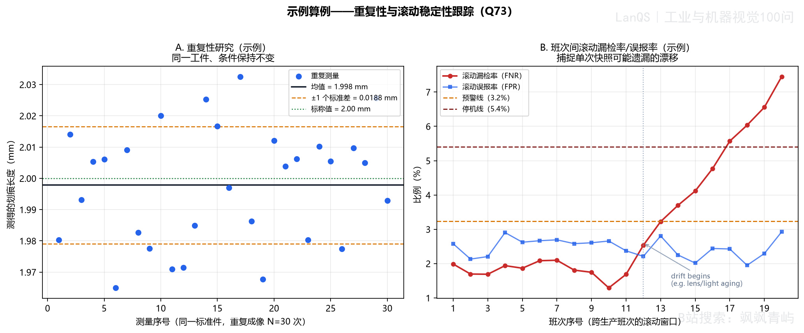
<p align="center">图73-2　重复性研究与滚动漏检率、误检率跟踪算例（示例）。</p>
<div class="figure-note">
左侧在固定条件下重复测量同一标准件，右侧在 20 个合成班次窗口中跟踪漏检率和误检率。第 12 班次后漏检率逐步升高，第 14 班次和第 17 班次分别越过示例预警线和停线线；误检率保持在基线附近。图中数值用于展示滚动监控如何发现漂移，不能替代按真实样本量、产品类别和维护事件建立的控制规则。
</div>

#### 73.4 稳定性测试和现场监控怎样落地？

测试计划应覆盖重复性、再现性、环境扰动、长时间运行和边界样本。重复性试验固定同一对象、工位和参数，观察测量散布或判定翻转；再现性试验改变操作者、班次、批次、设备或工装，观察偏置和离散度；环境扰动试验在允许范围内改变照明、温度、位置、背景、速度和材料；长时间试验观察漂移、资源增长、队列、异常重启和写回失败；边界样本试验专门检查分数接近阈值的样本。

测试记录应绑定原始条件、参数版本和维护时间点。只保留最终通过率，后续无法判断异常究竟来自光源、批次、算法还是运行时。缺陷样本不足时，要明确结论的置信程度和未覆盖的类别，不能用大量简单合格品掩盖分母不足。

每个工件的记录至少包括时间戳、产品型号、判定、置信度、采图时间、推理起止时间、模型和配置版本；测量任务还要保存原始测量值。按班次或最近固定数量建立滚动窗口，例如最近一个班次或最近 500 件产品，同时保存分子与分母：FN 及 \(TP+FN\)、FP 及 \(TN+FP\)，以及窗口样本数。

预警线表示系统偏离基线，需要在当班或下一次例行检查中核对图像、光源、镜头、批次和维护记录；停线线表示当前输出可信度不足，应隔离产品并切换人工复核或已验证的保守配置。报警应有负责人和动作，否则指标越积越多，操作员最终会关闭提示。

预警线可以进入同日工单，由工艺或质量工程师核对班次、批次、维护和光学状态；停线线则应通知值班负责人，并在规定时间内切换到人工复核、保守阈值或已验证的备用配置。报警动作要写入放行规则，不能只在看板上改变颜色。对不同后果的缺陷，可以设置不同的类别阈值和响应级别。

窗口不宜只使用从上线开始累积的平均值，因为最近的退化会被长期历史稀释。也要按高后果缺陷类别单独统计：总体漏检率看似正常时，某一个稀有但关键的裂纹类别仍可能快速恶化。单个无条件关联的噪声窗口可以观察，连续多个窗口越线或与批次、光源和版本变化同时出现时，才启动正式根因分析。

单个小窗口越线不一定意味着系统已经失效。判断是否升级时，要看越线是否在连续窗口中持续，窗口内的真实缺陷和合格品数量是否足够，以及是否同时发生了批次、配方、光源年龄、环境温度或维护事件变化。没有关联原因且只出现一次的点可以继续观察；重复出现或与已知变化同步的点，应保留完整事件证据并进入根因分析。

#### 73.5 不同应用怎样安排指标权重？

安全或功能关键检测通常把关键类别的 FNR 和边界样本重复性放在前面；复判资源有限的工位要限制 FPR、每小时报警量和连续报警次数；高速分选要把 P99/P99.9 延迟、队列长度、吞吐和丢触发写进放行条件；精密测量要关注偏置、重复性、再现性、GR&R 和热漂移；追溯系统还要约束日志完整率和时间同步。

指标权重应从最不能接受的失效模式反推。准确率、AUC 和平均延迟适合做概览，不能替代按类别、批次、班次和现场条件建立的验收指标。只有把每项指标与后果、窗口、样本量和响应动作绑定，稳定性评价才会成为可执行的生产控制。

指标之间还存在资源约束。提高召回率可能增加复检量，扩大窗口可能增加统计稳定性却延迟报警，增加日志字段会提高存储和写回负载。确定权重时，应先估计最严重的失效后果，再给出可接受的报警量、节拍和数据保留条件，最后为每个指标指定负责人和升级动作。

### 常见误区

1. 用一次高准确率代替长期稳定性评价。
2. 把 FN 除以总产品数，或混用 FNR、FPR 和精确率的分母。
3. 把不同零件之间的总体差异当成测量重复性。
4. 只看平均延迟，不看 P99/P99.9、队列积压和写回失败。
5. 用小样本窗口的百分比直接决定阈值或停线。
6. 用总体指标掩盖高后果缺陷类别的恶化。
7. 把合成漂移序列当成现场预测，而没有真实样本和根因确认。
8. 设置很多指标却没有负责人和越线后的响应动作。

### 术语与符号表

| 术语或符号 | 含义 | 单位 |
|---|---|---|
| TP、TN | 真正例、真负例，分别表示正确检出的缺陷和正确放行的合格品 | 件 |
| FP、FN | 假阳例、假负例，分别表示误检和漏检 | 件 |
| FNR | 漏检率，\(FN/(TP+FN)\) | 无量纲或 % |
| FPR | 假阳性率或误检率，\(FP/(TN+FP)\) | 无量纲或 % |
| TPR | 真正例率，\(TP/(TP+FN)\) | 无量纲或 % |
| Precision | 精确率，\(TP/(TP+FP)\)，报警结果中真实缺陷的比例 | 无量纲或 % |
| ROC/AUC | 受试者工作特征曲线及曲线下面积，用于比较多阈值下的区分能力 | 无 |
| GR&R | Gauge Repeatability & Reproducibility，量具重复性与再现性分析 | 无 |
| P95、P99、P99.9 | 延迟分布中相应的百分位数 | ms 或 s |
| \(N\) | 重复测量次数，本例为 30 | 次 |
| \(s\) | 测量值的样本标准差 | 与测量量相同 |
| \(R\) | 极差，最大测量值减最小测量值 | 与测量量相同 |
| \(d_2\) | 根据子组大小把极差换算为标准差的系数，本例为 3.472 | 无 |

### 延伸阅读

1. 学习混淆矩阵、ROC/PR 曲线和置信区间，理解指标对类别比例的依赖。
2. 结合测量系统分析（MSA）和 GR&R 区分重复性、再现性与零件变差。
3. 了解统计过程控制（SPC）中的控制图、滚动窗口和报警升级。
4. AIAG，《Measurement Systems Analysis（MSA）Reference Manual》。
5. Montgomery，《Introduction to Statistical Quality Control》。
6. Fawcett，《An Introduction to ROC Analysis》。

---

# 第74问　工业检测中漏检和误检哪个更严重？算法如何平衡两者？

工业视觉系统把工件判为合格或缺陷时，错误有两个方向：缺陷被放行，或合格品被拦下。它们都可能降低产线表现，却沿着不同的路径产生后果。本题讨论如何定义两类错误，怎样把下游风险和厂内处理成本折算成可比较的代价，以及如何通过阈值、训练目标和多阶段架构选择可执行的工作点。文中的算例使用合成分数分布，数字用于说明计算方法，不代表任何具体产线。

#### 74.1 漏检和误检如何定义，风险怎样比较？

设检测结果与真实标签组成一个二分类混淆矩阵。真实为缺陷且被系统拦截，记为真阳性（True Positive，TP）；真实为缺陷却被放行为合格品，记为假阴性（False Negative，FN），这就是漏检。真实为合格品且被放行，记为真阴性（True Negative，TN）；真实为合格品却被拦截，记为假阳性（False Positive，FP），这就是误检。这里的“阳性”只表示系统判定为缺陷，不表示产品本身一定有缺陷。

漏检率通常写为假阴性率（False Negative Rate，FNR），它回答“真实缺陷中有多少逃过了检测”：

$$
\mathrm{FNR}=\mathrm{漏检率}=\frac{FN}{TP+FN} \tag{74-1}
$$

误检率常写为假阳性率（False Positive Rate，FPR），它回答“真实合格品中有多少被错误拦截”：

$$
\mathrm{FPR}=\mathrm{误检率}=\frac{FP}{TN+FP} \tag{74-2}
$$

两个分母分别是真实缺陷总数和真实合格品总数。生产现场还会记录精确率（Precision），即所有被判为缺陷的工件中有多少确实是缺陷；精确率的分母是 (TP+FP)，不能拿它替代 FPR。总体准确率把四种结果合在一起，在类别极不平衡时可能看起来很高，却无法告诉质量工程师错误主要向哪一个方向发生。

这四个格子还规定了统计量的观察方向。FNR 只在真实缺陷一侧计算，FPR 只在真实合格品一侧计算；两者的分母都不随阈值改变，便于比较同一批验证数据上的不同工作点。精确率的分母则是系统实际报警的数量，它同时受到阈值和生产缺陷率影响。例如同一个分类器在缺陷率为 1% 的量产线上可能有较低精确率，在缺陷率为 20% 的返修批次上却会明显升高。报告指标时应同时写出 TP、FN、TN、FP 的计数、样本来源和时间窗口，读者才知道百分比是否有足够的样本支撑。

类别极不平衡时，准确率尤其容易产生错觉。假设一批样本中 99.5% 是合格品，系统把所有工件都判为合格，准确率仍有 99.5%，但所有缺陷都被放行。这个结果没有提供可接受的质量保证。对于放行型检测，FNR、关键缺陷召回率和每个班次的漏检计数通常应优先进入验收表；对于误报会拖垮复检站的筛选工位，FPR、每小时报警量和精确率也必须同时观察。

漏检的代价常沿工艺链向外扩散。缺陷没有在当前工位被拦截，可能继续进入装配，在下游增加拆解和返工；也可能随成品发货，产生物流、客户投诉、批次隔离、保修和召回成本。若缺陷与功能或安全相关，还要把现场失效、责任认定和监管处置的风险纳入评估。随着缺陷走得更远，已经附加在工件上的工时、材料和物流费用也一起暴露出来，单件售价通常不能代表全部风险。

误检的成本也是真实存在的：合格品可能被报废，或进入人工复检和返修流程；报警过多会占用操作员时间、拉长队列并降低节拍。它的一个常见特点是错误仍处在工厂边界内，工件有机会通过二次复核重新放行。正因如此，多数制造项目把漏检作为更高优先级，但这个判断来自风险是否向供应链和客户侧传播，不能被当成脱离场景的固定定律。

现场可以把这条风险路径画成一张缺陷去向图：在本工位被拦截，缺陷进入返修；在本工位漏过，缺陷继续经历装配、测试、包装和交付。每跨过一个环节，发现它的概率、定位难度和处置成本都可能改变。这个路径图对阈值选择的帮助在于，它能把“漏检很严重”拆成可核对的事实：缺陷会在哪里被发现，谁负责处理，是否会与其他零件永久结合，以及客户能否通过下游测试把它挡住。若下游测试已经以更高可信度覆盖同一缺陷，当前工位的漏检成本可以按剩余风险计算；若下游完全不覆盖，则应按逃逸到客户端的后果计价。

误检也有从局部变成系统问题的路径。少量误检通常由复检员消化，连续误检会形成队列，队列增加后又会延迟高风险工件的处置。现场记录每小时报警数、平均复检时间、未处理队列和复检后释放比例，才能判断误检代价是否已经超过单件人工费用。成本比较应覆盖这个传播过程，同时纳入报废品和漏检品的材料价格。

#### 74.2 如何用成本模型和阈值分配风险？

阈值选择需要两个输入：一件漏检缺陷的期望代价 \(C_{miss}\)，以及一件误检合格品的期望代价 \(C_{false}\)。这两个量应从具体产品和具体产线的实际路径追踪出来。对于漏检，挑选一种有代表性的缺陷，记录它会在下一工位、装配后、客户现场还是功能失效时被发现，并把后续拆解、返工、物流、索赔和风险分摊计入。若某类逃逸缺陷导致现场失效的概率为 \(q\)，失效造成的综合代价为 \(C_{failure}\)，则至少应把 \(qC_{failure}\) 作为期望项加入其他下游费用。

一份可执行的成本记录至少要有四个字段：错误发生的位置，错误被发现的位置，发现前已经消耗的资源，以及发现后还会发生的资源。成本可以按单件、按批次或按单位时间记录，但在进入模型前要统一到每件工件的期望代价。对于低概率高后果缺陷，不能因为历史样本中尚未发生客户失效就把该项成本记为零；应把经过批准的失效概率或风险分级写入假设，并在敏感性分析中改变它，观察阈值是否随之变化。

误检则沿相反方向追踪：被拦截的合格品是由人工复检后释放，还是按规则直接报废？前者的主要成本可能是人工分钟数、复检工位占用和节拍损失，后者还要加上完整产品成本。两类成本的计算口径必须一致，例如都按单件期望成本计，不能把一侧按销售价格、另一侧只按几分钟人工计算。

在得到两类单件代价后，可用成本比描述产线的风险方向：

$$
R_C=\frac{C_{miss}}{C_{false}} \tag{74-3}
$$

这个比值并非行业常数。高价值半导体产线和普通紧固件产线的 \(R_C\) 会不同；同一条产线上的外观瑕疵与安全相关裂纹，也可能有不同的漏检代价。它的用途是把“更怕漏检”转成可以进入阈值搜索的数值，解释时需要结合缺陷类别、复检能力和下游拦截位置。

为了把成本追踪连接到阈值选择，构造一个可复核的分类器分数算例。每件工件得到 \(0\) 到 \(1\) 的缺陷分数，分数达到阈值 \(t\) 就判为缺陷。缺陷分数整体偏高，合格品分数整体偏低，但两者在中间区域重叠。示例取 \(N_{good}=200{,}000\) 件合格品、\(N_{defect}=2{,}000\) 件缺陷品，因此合成样本中的缺陷率为

$$
p_d=\frac{N_{defect}}{N_{good}+N_{defect}}=\frac{2000}{202000}\approx0.00990099\approx0.99\% .
$$

合格品分数从 \(\mathrm{Beta}(2,6)\) 分布抽样，缺陷品分数从 \(\mathrm{Beta}(6,2)\) 分布抽样；随机数发生器种子为 74。这里的 Beta 分布只是用来生成“低分合格品、高分缺陷品、中央有重叠”的示例，并非某个实际模型的测量结论。阈值从 \(0.01\) 扫描到 \(0.99\)，步长为 \(0.005\)，共 197 个候选工作点。

对每个阈值，缺陷分数低于 \(t\) 的样本计为漏检，合格品分数大于等于 \(t\) 的样本计为误检。单位产品的期望成本由两类错误按真实先验加权：

$$
C(t)=p_d\,\mathrm{FNR}(t)\,C_{miss}+(1-p_d)\,\mathrm{FPR}(t)\,C_{false}. \tag{74-4}
$$

式中，\(C(t)\) 是每件生产工件的期望错误成本，\(p_d\) 是真实缺陷率，FNR 和 FPR 是当前阈值下的两类错误率，\(C_{miss}\) 与 \(C_{false}\) 使用同一种货币单位。第一项表示缺陷品中漏检部分的平均代价，第二项表示合格品中误检部分的平均代价。这个公式假设每个工件独立地从目标生产分布抽取，且同一错误类别内可以用平均成本代表；批次聚集、连续误报造成的停线和高后果缺陷的非线性损失，都需要另加项或另建约束。

公式先回答“平均每件工件承担多少错误成本”，并不直接回答“这一阈值能否放行”。工程上还要配合硬约束，例如关键缺陷 FNR 不得超过某个上限、每小时报警数不得超过复检站容量、连续报警时必须触发停线。若把所有损失都压成一个平均数，极少数安全缺陷可能被大量普通缺陷的低成本平均掉，所以高后果缺陷要单独分层计算。

下面的伪代码保留了算例的关键计算逻辑。它先从两组分数得到每个阈值的 FNR、FPR，再对三个成本比逐一求出 \(C(t)\) 的最小值。为使计算边界清楚，代码显式使用 NumPy 的随机数、求和和最小值索引函数；每次扫描都在同一组分数上比较阈值，避免随机波动混入阈值差异。

```python
import numpy as np

rng = np.random.default_rng(74)
N_GOOD, N_DEFECT = 200_000, 2_000
good_scores = rng.beta(2, 6, N_GOOD)
defect_scores = rng.beta(6, 2, N_DEFECT)
thresholds = np.linspace(0.01, 0.99, 197)
p_defect = N_DEFECT / (N_GOOD + N_DEFECT)
C_false = 8.0

def rates_at(t):
    fnr = np.sum(defect_scores < t) / N_DEFECT
    fpr = np.sum(good_scores >= t) / N_GOOD
    return fnr, fpr

for ratio in [5, 25, 100]:
    C_miss = ratio * C_false
    costs = []
    for t in thresholds:
        fnr, fpr = rates_at(t)
        costs.append(p_defect * fnr * C_miss
                     + (1 - p_defect) * fpr * C_false)
    i_opt = np.argmin(costs)
    print(ratio, thresholds[i_opt], rates_at(thresholds[i_opt]))
```

示例将误检成本固定为 \(C_{false}=8\) 个货币单位，分别测试 \(R_C=5、25、100\)。扫描结果为：

| \(C_{miss}/C_{false}\) | 最优阈值 \(t^*\) | 最优点漏检率 | 最优点误检率 |
|---:|---:|---:|---:|
| 5 | 0.670 | 27.15% | 0.65% |
| 25 | 0.575 | 13.15% | 2.59% |
| 100 | 0.500 | 6.10% | 6.18% |

成本比从 5 提高到 100，漏检相对更昂贵，期望成本的最小点向更低阈值移动。低阈值会把更多边界样本送去复检，因而误检率上升；换来的收益是漏检率下降。这些数值只能证明在给定合成分布、缺陷先验和成本假设下，成本最小点呈现这一移动方向，不能证明真实产线也会在同样阈值获得相同错误率。将方法移植到现场时，必须用真实标注、当前缺陷率和可追溯的成本数据重新扫描。

以第一行作为复核示例，\(R_C=5\) 时 \(C_{false}=8\)，所以 \(C_{miss}=40\)。程序在 197 个阈值中寻找使式（74-4）最小的索引；在 \(t=0.670\) 处，缺陷样本中有 27.15% 落在阈值以下，合格样本中有 0.65% 达到阈值。这里的两个百分比来自分数计数，不能把 27.15% 当成全生产线的漏检概率，也不能把 0.65% 直接当成每小时报警数。要得到报警量，还需乘以目标产量和真实合格品比例，并纳入一个工件可能触发多次复检的处理规则。

三行结果共同展示了成本权重改变时的移动方向。它们没有证明比例一定单调、曲线一定平滑，也没有验证模型对新的光照、批次和缺陷形态仍然有效。现场复核时应保留每个阈值的原始 TP、FN、TN、FP 计数，计算置信区间，并在独立时间段或独立批次上重复扫描。若最优点在相邻阈值之间差异很小，应优先选择容量余量更大的点，而不是把小数点后的阈值当成精确物理常数。

图74-1把两类错误随阈值变化的方向放在同一框架中。读图时先沿横轴确认阈值是从低向高移动，再看两条趋势线分别代表哪一种错误，最后把曲线与业务代价和复检容量连接起来。

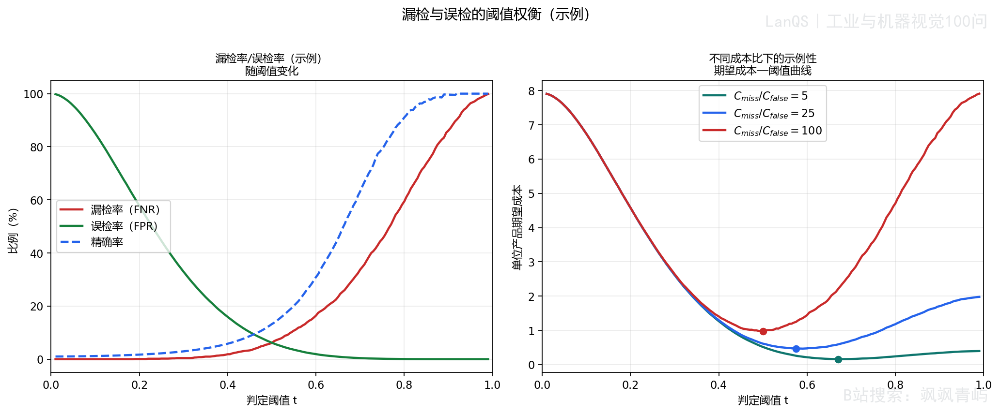
<p align="center">图74-1　阈值变化引起的漏检率与误检率权衡。</p>
<div class="figure-note">
低阈值区域通常会拦截更多可疑工件，漏检率较低但误检率较高；阈值升高后，误检率通常下降，漏检率通常上升。图中的交点只表示两条示意趋势相交，不代表业务成本最低。该图假设分数排序在验证集与生产现场之间基本保持，若光照、批次、产品比例或模型校准发生变化，应重新测量两条曲线。
</div>

图74-2将同一组示例分数转换成期望成本曲线。左侧用于核对阈值与两类错误率的关系，右侧用于比较三个成本比下的最低成本位置；标记点给出表中的三个 \(t^*\)。

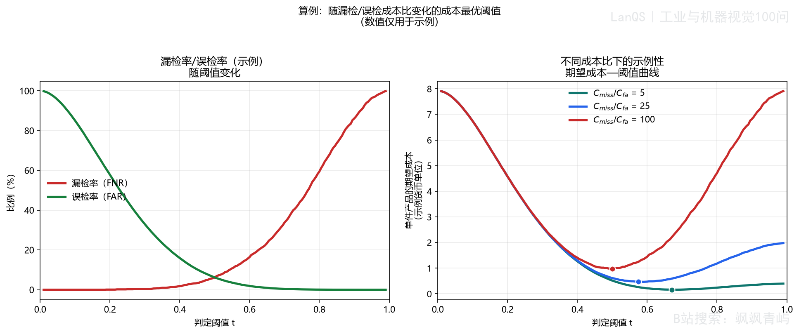
<p align="center">图74-2　成本比变化时，期望成本最低点和工作阈值的移动（示例）。</p>
<div class="figure-note">
左图的红线是漏检率，绿色线是误检率；右图的三条曲线分别对应成本比 5、25 和 100，圆点是各自的成本最低位置。阅读时应先确认图中使用的缺陷先验、分数分布和单件代价，再解释曲线形状。图中数字均来自合成算例，不能直接作为现场放行阈值；现场还要加入复检容量、停线损失和高风险缺陷的单独成本。
</div>

#### 74.3 什么时候误检更严重，多阶段检测怎样平衡？

“漏检通常更严重”是多数制造场景的风险起点，却不是普遍规律。高价值晶圆、昂贵半导体器件或低良率特殊材料可能承受不起一次合格品误报报废；如果边界缺陷会在后续工位被可靠拦截，漏检的增量损失也可能低于当前工位直接报废合格品的损失。

工作点还受复检能力约束。上游筛选工位即使单件误检成本不高，若每天把大量合格品送入人工复检，复检队列会反过来压低整线节拍，甚至使高风险工件得不到及时处理。因而工作点要同时检查单位价值、后续拦截能力、复检人数和设备容量、客户容忍度以及缺陷的安全等级。只有在这些条件明确后，才有理由决定哪一类错误应被优先压低。

例如，外观轻微色差可能由复检员在几秒内确认，而尺寸超差需要拆下工件并使用离线量具确认。两个类别即使在统计表中都叫“误检”，实际处理时间和占用资源也不同。部署前应按缺陷类别或产品等级分别统计报警量，把复检动作本身的吞吐率测出来，并观察队列在高峰班次是否增长。误检在这里的严重程度由系统后果决定，不能只由 FPR 这个比例判断。

分类器通常输出一个缺陷分数，阈值 \(t\) 决定分数落在阈值哪一侧的工件如何处理。降低 \(t\) 会让更多样本进入缺陷或复检分支，通常降低 FNR，同时抬高 FPR；提高 \(t\) 则减少被拦截的合格品，却增加缺陷逃逸的可能性。阈值因此连接了模型输出和产线动作：它的变化会改变报警量、复检队列、节拍和质量风险。

这里的分数是模型对当前图像的排序或置信度输出，未必具有跨产品、跨批次可比的概率含义。阈值的单位通常就是该模型分数的无量纲数值，迁移模型版本、相机参数或预处理流程后，原阈值不能自动继承。上线前要固定图像输入、模型版本、预处理、后处理和触发时刻，保存分数直方图与混淆矩阵，再观察阈值附近样本的原图和复检结论。若阈值附近样本集中在某一种反光、污渍或姿态，优先查找成像和数据覆盖问题，不能用单个阈值数字替代原因分析。

阈值不能仅凭两条曲线的交点确定，也不能只追求一个总体准确率。交点只表示两个比例在图上相等，除非两类错误的单件代价、真实比例和处理容量恰好相当，否则它没有自动的业务含义。实际选点时，要用验证集估计曲线，再把 \(R_C\)、每小时可处理的复检量、允许的停线次数和关键缺陷的放行条件一起作为约束。

一个实际的选点过程可以同时画出三条边界：成本曲线、关键缺陷的 FNR 上限线、复检站可承受的报警量上限线。满足硬约束的阈值区间可能有多个，再从其中选择成本较低且留有分数漂移余量的点。这样做的好处是，模型在轻微漂移后仍有时间触发报警和处置；若只有一个恰好贴着上限的点，生产波动很容易把系统推到不可接受区域。

#### 74.4 代价敏感学习和多阶段检测怎样配合？

代价敏感学习（Cost-Sensitive Learning）把错误代价的不对称写进训练目标，而不是把全部调整留到上线后改阈值。若漏检明显比误检昂贵，可以提高缺陷类的权重，使用加权损失，或在成本矩阵中给 FN 更高的惩罚，使模型在训练时更重视缺陷样本附近的分离能力。

以二分类交叉熵为例，给缺陷类设置更高权重，相当于让一个缺陷样本被错误放行时对梯度的贡献更大。模型会改变特征边界，之后同一阈值下的分数分布和 FNR、FPR 都可能变化。类别权重、过采样和损失中的成本矩阵不是等价操作：过采样改变看到的样本频率，权重直接改变优化目标，成本矩阵还可以区分不同缺陷的后果。每次改变都要在未参与训练的验证集上重新画曲线，避免把训练集上的低漏检误认为量产收益。

它改变的是模型学习过程，不等于已经确定了最终工作点。训练集的类别比例、验证集的生产分布和线上复检容量仍可能不同；即使训练阶段偏向高召回，部署时也要在接近生产条件的验证集上重新测量 FNR、FPR 和成本曲线。较稳妥的流程是先把风险方向反映到训练目标，再用真实业务约束选择上线阈值，并对阈值变化进行版本记录。

单一阈值往往难以同时得到极低漏检率和极低误检率。多阶段检测把任务拆成两个不同的决策：第一阶段是高召回筛选，尽量把风险样本拦住，允许它产生更多候选；第二阶段对候选工件重新采图、提高分辨率、增加观察角度、使用更精细的算法，或交给人工复检，以便释放其中的合格品。

这种结构把第一阶段的主要职责放在控制漏检风险，把第二阶段的主要职责放在消化边界样本和降低误检成本。设计时要把第二阶段的最大处理率、平均复检时间、队列上限和异常时的保守动作写进节拍预算。若第一阶段把太多工件送入第二阶段，误检率虽然可能下降，整线仍会因排队而失去可用产能；若第二阶段容量没有经过实测，架构上的折中就没有真正落地。

两阶段系统还要明确故障时的责任归属。第一阶段漏掉的缺陷通常无法由第二阶段补回，所以第一阶段的验收应以高风险缺陷的召回为主；第二阶段超时、相机无响应或复检结果缺失时，应有明确的阻断、重采或人工接管状态。统计时要分别报告第一阶段筛选率、第二阶段进入率、第二阶段确认后的 FNR 和总节拍，否则把两阶段合并成一个准确率会掩盖某一层的失效。

#### 74.5 线上如何动态调整并验证现场可执行性？

生产中可能变化的有三类条件：产品风险等级、工艺和环境状态、复检或返修容量。安全关键批次可以暂时采用更低的放行阈值；复检工位增加后，系统可以承受更多边界样本；夜班或环境漂移使分数不确定性升高时，则需要重新核对错误率和放行策略。每次调整都应留下生效时间、产品和批次范围、理由、批准人、依据数据以及回退条件，避免操作员在现场凭记忆改变参数。

动态阈值必须有边界。产品型号、缺陷定义和安全等级变化时，应由受控配置选择相应阈值；工艺温度、光照或相机状态发生变化时，优先触发复核或降级策略，不能把环境信号直接映射成更宽松的阈值。配置系统还应防止不同站点同时写入参数，并在每个结果中记录实际使用的阈值版本。这样出现异常批次时，质量人员可以把报警记录、图像、模型版本和阈值恢复到同一条证据链上。

期望成本模型得到的最优点可能让操作员和产线无法承受。算例中 \(R_C=100\) 时，成本最低点的误检率为 6.18%，也就是约每 16 件合格品就有 1 件被拦截。若这样的报警持续出现，操作员可能手动放行、绕过复检，或请求未经评审的放宽。模型设计的工作点一旦被频繁绕过，实际运行分布就已经偏离了成本模型，原先计算出的风险收益也不再成立。

所以成本最小点应作为候选点，还要通过现场可执行性检查。若误检量超出操作员、复检站和节拍目标的承受范围，可以改善分数重叠区域的数据和成像条件，增加第二阶段检查，或把 FPR 上限设为硬约束，再由质量责任人批准由此带来的漏检代价。较低的数学成本没有意义，前提是系统能在现场按设计方式运行。

阈值和成本比是随产线变化的参数。固定周期复评时，应使用最新报废成本、返修人工、保修和客户投诉数据重新追踪 \(C_{miss}\) 与 \(C_{false}\)，再检查原阈值是否仍处在可接受的成本和容量范围内。除日历周期外，以下事件也应触发复评：出现原分析中没有的新缺陷模式，产品用途改变并导致安全或责任等级变化，复检能力明显增减，或线上误检率明显偏离验证曲线。

复评周期要与风险和变化速度相匹配。稳定产品可以按批准的周期运行，发生重大工艺变更、镜头或光源更换、模型重训、供应商材料变化或连续报警异常时，则应立即建立新的验证窗口。定期复评和事件触发复评使用同一套记录字段，便于比较阈值调整前后的 FNR、FPR、报警量、复检队列和放行结果。

复评不能只把旧阈值改成一个新数字。应使用反映当前生产条件的验证集重新测量两类错误率和成本曲线，并记录变更日期、原因、批准人和支持数据；上线后还要观察真实 FNR、FPR、报警量和队列是否达到预期。若分数分布已经漂移，问题可能在模型、成像或工艺状态，单纯微调阈值未必能恢复可靠性。

验证集更新时要保留一部分独立数据作为上线后的检查集，避免反复调阈值后又用同一批图像宣称性能没有变化。上线观察至少要覆盖不同班次、产品批次和环境状态；若缺陷样本极少，可先报告原始计数和人工复核结果，并在达到足够样本后更新率估计。对于关键缺陷，任何阈值放宽都应先通过批准的复核流程，不能因为一段时间没有发现漏检就自动放宽。

漏检和误检是由下游风险、厂内成本、复检能力和操作行为共同约束的决策变量。好的工作点不只是纸面上的成本最低点，还应能被当前产线持续执行，并且在产品、工艺或成本结构变化后重新验证。

### 常见误区

- 用总体准确率掩盖错误方向，导致无法判断质量风险还是生产成本占主导。
- 把“漏检通常更严重”当成所有产品、缺陷类别和工位都适用的固定规律。
- 直接选择漏检率与误检率曲线的交点，忽略两类错误的成本、缺陷先验和复检容量。
- 把合成分布的算例阈值直接移植到真实产线。
- 只追求期望成本最小点，不检查操作员、复检站和节拍能否承受相应报警量。
- 在验收时设定一次阈值后永久冻结，忽略成本、缺陷模式、产品用途和工艺状态会变化。
- 不诊断漏检原因就把样本机械加入训练集，可能让模型记住单张图像而没有修复失效机制。

### 术语与符号表

| 术语或符号 | 含义 |
|---|---|
| TP、TN | 真阳性、真阴性；分别表示正确拦截缺陷和正确放行合格品。 |
| FN、FP | 假阴性、假阳性；分别对应漏检和误检。 |
| FNR | 假阴性率，(FN/(TP+FN))，真实缺陷中被放行的比例。 |
| FPR、FAR | 假阳性率或误检率，(FP/(TN+FP))，真实合格品中被错误拦截的比例。 |
| Precision | 精确率，(TP/(TP+FP))，被判为缺陷的工件中确实为缺陷的比例。 |
| \(t\) | 缺陷判定阈值；分数达到阈值时进入缺陷或复检分支。 |
| \(C_{miss}\) | 一件漏检缺陷的期望综合代价。 |
| \(C_{false}\) | 一件误检合格品的期望综合代价。 |
| \(R_C\) | 成本比，\(C_{miss}/C_{false}\)。 |
| \(p_d\) | 目标生产分布中的真实缺陷率。 |
| 代价敏感学习 | 在训练损失、类别权重或成本矩阵中体现不同错误代价的学习方法。 |
| 多阶段检测 | 先用高召回筛选，再用精细算法或人工复检处理候选工件的架构。 |

### 延伸阅读

- Kuhn、Johnson：《Applied Predictive Modeling》，关于代价敏感分类和阈值选择。
- Provost、Fawcett：《Data Science for Business》，关于期望价值和业务成本决策。
- Elkan：《The Foundations of Cost-Sensitive Learning》，关于成本矩阵和最优阈值理论。
- AIAG：《Measurement Systems Analysis Reference Manual》，用于理解质量风险与检验系统性能要求的工业背景。

---

# 第75问　什么是算法鲁棒性？如何提高检测算法的鲁棒性？

在实验室中，工件位置、光照、背景和表面状态都很稳定，检测算法往往能得到漂亮的分数。工位投入生产后，换班、换批次、视角轻微变化、镜面高光或运动模糊就可能让同一缺陷的分数发生变化。鲁棒性讨论的正是这种偏离理想条件后的表现：系统是否仍能在业务允许的范围内正确检出、定位和分类。本文从现场扰动出发，说明应在哪一层排查原因，怎样用数据、模型、后处理和压力测试形成闭环，并用金属表面微划痕检测算例展示一次完整的改进与验收过程。

#### 75.1 鲁棒性是什么，哪些因素会影响它？

鲁棒性（Robustness）是输入条件从理想状态发生合理偏离时，算法仍保持可接受输出的能力。这里的偏离可能是噪声增加、运动模糊、姿态变化、光照波动、局部遮挡、背景干扰、批次差异、表面老化，也可能是训练集没有覆盖、但实际业务仍允许出现的样本变化。所谓“可接受”，要结合任务的放行条件来定义：分类任务可能关心类别是否稳定，检测任务还要关心目标有没有被找到、位置是否准确、边界是否可信，以及输出能否在规定节拍内驱动后续动作。

鲁棒性与单次精度关注的对象不同。精度或准确率描述特定数据集上的判定结果；鲁棒性关心条件改变后结果是否仍然可靠。一个模型在标准样本上精确率很高，却在换班或换视角后明显漂移，说明它可能抓住了狭窄条件下的表面线索，而没有形成对真实缺陷更稳定的判别依据。评价鲁棒性时，应先规定扰动范围、业务允许的性能下限和观测窗口，再比较不同条件下的漏检率、误检率、定位误差或重复性。

“可接受”不能脱离检测输出的用途来规定。若结果只用于提示人工查看，允许的误报水平可能与自动剔除工位不同；若结果直接控制机械手抓取，定位误差和延迟也要进入鲁棒性指标。评价还要写清扰动的量纲和范围，例如光照强度变化、相机曝光时间、工件角度、运动速度、遮挡面积或批次编号。没有这些条件标签，两个版本的平均分数即使不同，也很难判断差异来自算法还是测试样本组成。

现场验收最好保留“基准条件”和“压力条件”两组结果。基准集回答算法在常规生产状态下是否达标，压力集回答在已知但允许发生的扰动边界上还剩多少风险；若只测基准集，鲁棒性缺口往往会被平均值遮住。压力集也不应把超出设备设计能力的极端破坏图像混入，否则得到的是耐破坏性指标，不能代表正常生产的鲁棒性。

检测结果通常直接连接分选、抓取、装配或放行动作。图像略有变化，可能造成缺陷漏检、定位偏移、机械手误抓、装配错位或队列堵塞。错误一旦进入控制链，就不再只是一个离线统计数字；它可能立即改变工件流向和设备动作。

检测任务还要同时满足“找到目标”和“找到得准确”。整幅图像分类只需给出一个类别，目标检测还要给出位置、边界或实例范围，尺寸测量则要求输出在允许误差内。光照、模糊、遮挡和分辨率不足会先改变边界附近的像素，再影响定位和分类，因而检测任务对非理想条件更敏感。鲁棒性的验收也应覆盖这些输出，并同时检查总体分类分数。

例如，同一条微划痕在图像中仍被判为“有缺陷”，但框的位置随着高光移动了几个像素，后续面积过滤可能把它删掉，或机械手定位落在划痕旁边。对检测系统来说，最终输出是模型分数、几何位置、后处理状态和控制接口共同决定的结果。测试时应把这些环节串起来，记录原始检测、过滤前结果、过滤后结果和最终动作，才能判断鲁棒性究竟在哪一步丢失。

排查现场问题时，可以把因素分成成像、目标和系统三组。成像因素包括光照变化、噪声、运动模糊、镜面反射、曝光漂移和分辨率不足；目标因素包括尺度变化、旋转、局部遮挡、形变、表面老化和批次差异；系统因素包括训练集覆盖不足、判定阈值过于激进、后处理规则脆弱，以及训练阶段和推理阶段预处理不一致。

这种分类关系到修复的层级。若高光条纹来自照明和偏振关系，单纯更换网络结构只能缓解一部分症状；若模型在新批次失败是因为训练集没有覆盖该纹理，增加几何后处理规则也不会补上分布缺口。应把失效样本按扰动条件、目标状态、模型分数和后处理结果关联起来，先判断故障在哪里形成，再选择对应的实验。

排查时可以对同一工件保留四份证据：原始图像、预处理后的图像、模型原始输出以及后处理后的结果。原始图像已经缺少划痕对比度时，应先检查曝光、光源角度、偏振和运动同步；模型输出正常而后处理删除目标时，应检查面积、长宽比、位置范围和连通域规则；只有成像证据足够、后处理也合理而模型分数仍随批次变化时，才适合把重点转向训练数据或网络结构。这个顺序能避免把一个层级的问题转嫁给另一个层级。

#### 75.2 数据增强、模型和后处理如何提升鲁棒性？

数据增强（Data Augmentation）是在训练阶段对已有样本施加受控变换，以模拟现场可能出现的变化。空间增强适合表示位置、角度和尺度变化，例如平移、旋转、缩放、透视变换和轻微裁剪；像素级增强适合表示亮度、对比度、噪声、模糊和色偏；遮挡增强则可模拟局部缺失、贴纸遮挡或污渍覆盖。增强的价值在于把一部分现场变化提前放入学习过程，使模型有机会学习对这些变化更稳定的特征。

增强操作必须与真实扰动方向和范围相匹配。若工位只会发生小角度姿态变化，却在训练中加入极端透视扭曲，模型可能学到现场并不存在的“不变性”；若缺陷细节只有几个像素，过强模糊会把目标从训练信号中抹掉。设计增强时，应从现场日志和失败图像中估计变化范围，再在验证集和压力集上检查增强是否同时改善漏检、误检和定位稳定性。增强数量增加并不自动等于鲁棒性增加。

检测任务的增强还必须同步修改标注。旋转、缩放和透视变换会改变边界框或分割掩膜；裁剪可能把目标截断，遮挡增强可能改变目标的可见区域。若图像已经改变而标注仍停留在原坐标，模型学到的会是错误的几何对应关系。像素级变化通常不改变标注位置，但过强模糊、噪声或高光会把本来要检出的细节抹掉，因而需要在增强后抽样可视化，并统计目标仍可辨认的比例。

增强范围应依据现场分布估计，不应由库中可用的操作数量决定。可以把实际失败样本按亮度、清晰度、角度或遮挡比例分箱，在每个箱内选择少量真实图像，再观察候选增强是否覆盖这些箱。若增强只改善普通验证集，却让压力集的漏检或定位误差上升，说明它改变了训练分布，却没有对准实际失效方向。

模型层面的一个常见方向是多尺度特征融合。大目标需要较大感受范围，小划痕或微小缺口则依赖细粒度特征；多尺度结构让模型同时利用不同分辨率的信息，减少目标尺度变化造成的漏检。损失函数决定哪些误差会更强地影响参数更新。若大量容易样本主导训练，边界样本和少数难例的信号可能被淹没；更适合任务的损失设计可以提高模型对这些高风险错误的关注。

难例挖掘（Hard-Example Mining）则把当前模型最容易判断错误的样本持续带回训练，例如低置信度样本、人工与算法不一致的样本、边界附近的正常品和高风险缺陷。采样策略也应体现业务风险：容易混淆的正常样本、阈值附近样本和关键缺陷类别可以提高出现频率。目标是把有限的学习能力投入最可能失效的区域，而不只是把总图片数做大。采用这些方法后，仍要用未参与调参的样本检查是否改善了泛化，而不能只观察训练损失下降。

不同训练策略也可能互相抵消。提高难例采样频率会让模型更关注边界，但如果这些难例集中来自某一台相机或某一个批次，模型可能记住设备特征；提高缺陷类权重可以降低漏检，却可能增加相似正常纹理的误报。每次只改变一个主要因素，保留固定的普通验证集、开发压力集和独立留出集，并同时观察漏检、误检、定位误差、推理时间和显存占用，才容易判断改动带来的收益是否值得。

#### 75.3 如何完成一次鲁棒性改进并验证结果？

后处理是在模型原始输出之后增加工程约束。目标的几何关系、尺寸范围、位置关系和工艺拓扑可以过滤掉分数较高、但明显不符合现场常识的结果；在视频或重复通过场景中，时间一致性检查可以判断一个报警是否能在连续帧中保持合理轨迹，抑制只在单帧出现的噪声结果。后处理不应成为任意堆叠的规则集合，每条规则都要有对应的失效样本、参数范围和回归测试。

算力允许时，还可以让多个模型、多个视角或多个尺度分别推理，再通过投票或融合降低单一路径错误的影响。测试时增强（Test-Time Augmentation，TTA）则对同一输入做多种变换、分别推理并聚合结果。两种方法都增加计算量和延迟，也会带来显存占用、版本管理和故障定位成本；后处理规则还可能在产品变化后误删合法的边界样本。因此是否引入集成，应由现场失效的后果、所需改善幅度和节拍预算共同决定。

图75-1把鲁棒性改进表示为从现场扰动到压力测试的链路。读图时先看左侧扰动如何同时进入数据、模型和后处理层，再看三条路径如何汇合到同一个验证环节，最后检查验证结果是否支持现场稳定检出。

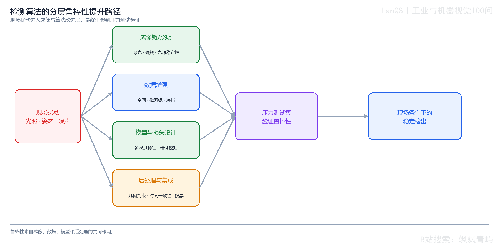
<p align="center">图75-1　从现场扰动到压力测试的检测算法鲁棒性改进路径。</p>
<div class="figure-note">
现场光照、姿态和噪声等扰动可能同时影响数据覆盖、模型与损失设计、后处理与集成。三条改进路径最终汇合到压力测试集验证，验证漏检率、误检率和重复性是否达到要求，再形成现场条件下的稳定检出能力。图示用于安排排查和修复方向，不表示每个问题都必须同时增加三层机制；具体改动仍需由失效样本和节拍约束验证。
</div>

后处理的每个参数都应有可解释的输入和验证范围。例如面积下限需要对应像素尺寸、最小可检缺陷和噪声斑点的统计；时间一致性窗口需要对应输送速度、帧率和工件在视野中的停留时间。规则若只在一批图像上调到有效，换产品尺寸或换速度后可能把合法目标过滤掉。回归测试应同时保留规则过滤前后的目标数、漏检样本和处理时间。

集成也应检查模型之间的分歧。多个模型输出相互冲突时，要规定投票、取最大分数或几何融合的优先级，并记录是哪一路触发了报警。TTA 会增加每件工件的推理次数，集成会增加模型加载和显存需求；若原有节拍没有余量，增加鲁棒性可能变成新的漏检来源，因为超时工件会被跳过或进入错误的默认状态。部署验收应测平均延迟、尾部延迟和异常时的降级动作。

以金属表面微划痕检测为例，现场误检主要来自镜面高光条纹，漏检主要发生在观察角度略变、划痕与背景对比度降低的样本。一个可执行的改进过程从失效模式分析开始：先把误检和漏检分开，记录光照、姿态、批次、分数和人工复核结果，确认每类错误是否具有稳定的触发条件。

成像层先处理高光和对比度问题，可改用更稳定的低角度光，或使用偏振方案，使划痕与背景的对比在不同姿态下更一致。随后扩充训练数据，纳入不同高光程度、姿态和批次纹理下的正常品与缺陷品。训练时加入与现场相符的亮度扰动、局部高光、轻微旋转和模糊模拟，最后在模型输出后使用几何和面积规则滤除明显不符合划痕形态的小伪目标。每一步都应保留版本和评价结果，才能知道收益来自哪一层，也才能在某一步造成副作用时回退。

压力测试集不是“随便挑一些难图”。样本进入压力集至少有三类明确理由。第一类是条件极端：样本位于已知扰动维度的边缘，例如高光强度最大的一组、姿态分布中最斜的视角或对比度最低的批次。第二类是决策边界邻近：当前模型的置信度分数接近工作阈值，轻微扰动就可能翻转判定。第三类是历史记录：样本来自过去的误检、漏检、低置信度判定或人工与算法意见不一致的事件。

建立压力集时，可以让当前模型扫描大规模无标注池，按距阈值的置信度间隔和条件极端程度排序，再从三类候选中由人工确认真实标签。这样构成的数据集会集中在已知风险边界，而不是受某个操作员的记忆影响。压力集用于验证时还要保留它的来源和标签依据，避免后续调参反复使用同一批样本，导致评价结果被训练过程污染。

三类候选应分别设定配额或覆盖要求，防止压力集最后只剩下容易找到的高光样本。条件极端样本需要保存测量值和获取条件，边界样本需要保存模型版本及阈值，历史失败样本需要保存原始报警、人工结论和处置结果。人工复核时还要明确目标级标签，例如划痕的存在、位置和可接受长度，避免只标记整图“有问题”而无法检验定位鲁棒性。压力集一旦用于多轮开发，就应冻结一份独立留出副本，供最后签核使用。

鲁棒性有工程代价。过重的数据增强会延长训练时间，并可能教会模型现场不会出现的变化；集成和 TTA 可能把推理时间提高数倍，与紧张节拍不兼容；更多后处理规则会增加参数维护和边界回归的负担。低频且后果较轻的失效未必值得引入集成，高风险失效则可能值得承担额外算力和维护成本。取舍应基于该失效模式的发生概率、后果、改善幅度和运行预算。

改进措施还要放回维护周期中评估。光源改造可能增加一次性硬件成本，却减少模型和规则的长期复杂度；集成方法可以迅速降低某一类误检，却会增加模型版本同步和故障定位负担；后处理规则易于上线，但产品边界变化时需要重新确认。把每项措施的预期收益、额外延迟、硬件变化、维护责任和回退方案写入变更记录，才能在量产后继续判断这项鲁棒性投资是否有效。

五步之间存在因果顺序。若先改后处理再改光源，短期内可能看到误检下降，却无法判断模型是否已经学会区分划痕和高光；若把成像修复、数据扩充和网络重训一次性合并，最终分数改善也难以归因。更稳妥的实验记录应固定同一批基准图像，单独记录每个阶段的模型、光源配置、增强参数、后处理版本和推理节拍，并在阶段之间检查漏检、误检和定位结果。这样既可以保留有效改动，也能定位某一步引入的副作用。

验证时要同时比较普通验证集、开发压力集和独立留出的压力测试批次。普通验证集通常较接近理想条件，适合观察整体性能；压力集则专门放大高光、边界和历史失败条件，适合观察现场残余风险。独立留出批次在修复开发完成后采集，开发过程中不参与训练、阈值调整或规则设计，用来检查改进能否泛化。

三组数据的用途不同，不能在反复调参后随意互换。普通验证集用于观察常规回归，开发压力集用于定位和修复已知失效，独立留出批次只在候选版本冻结后使用。每组都应记录工件数量、缺陷类别、采集设备、光照和姿态范围，并给出漏检和误检的原始计数。压力集覆盖的是已知风险边界，不能代表所有生产比例；独立留出集也只有在来源真正独立时，才有资格作为泛化证据。

如果任务输出包含位置或尺寸，表格还应加上定位误差、目标漏标和后处理删除数量。若只统计整图的漏检率，可能看不出模型已经找到了划痕却把边界框偏到了错误位置。对于线上控制，验收还要在实际触发、传输和推理链路中记录延迟和超时处置，保证压力测试的结论对应真实动作。

下面的伪代码保留了算例的完整数据流。五个阶段依次对应成像修复、数据扩充、定向增强和后处理过滤；数组中的百分数属于合成示例，非实测产线数据。

```python
import numpy as np

stages = ["改进前（基线）", "+成像修复", "+数据扩充",
          "+定向增强", "+后处理过滤"]

# 普通验证集：条件较干净，改善幅度看起来较小
val_miss = [4.8, 4.1, 3.4, 2.6, 2.1]  # %
val_fa   = [5.5, 4.2, 3.6, 3.0, 1.8]  # %

# 开发压力集：高光、阈值边界和历史易错样本
stress_miss = [19.5, 16.8, 12.4, 8.7, 5.3]  # %
stress_fa   = [22.0, 13.5, 11.0, 8.9, 4.6]  # %

val_gain = val_miss[0] - val_miss[-1]
stress_gain = stress_miss[0] - stress_miss[-1]
before_gap = stress_miss[0] - val_miss[0]
after_gap = stress_miss[-1] - val_miss[-1]

dev_final = {"miss": 5.3, "fa": 4.6}
rng = np.random.default_rng(75)
holdout_final = {
    "miss": dev_final["miss"] + rng.normal(0.9, 0.4),
    "fa": dev_final["fa"] + rng.normal(0.7, 0.3),
}
```

代码中的 `val_gain`、`stress_gain`、`before_gap` 和 `after_gap` 先计算阶段首尾的差值，单位都是百分点。`dev_final` 代表用于开发的压力集最终结果，随机数只用来生成一个独立留出批次的示例值；在真实验收中，留出批次应由新的工件和新的采集条件组成，不能用随机扰动替代实测样本。数组中的每个阶段还应对应一份可追溯的模型和配置，单独保存成指标表后，才可以复核成像修复或后处理过滤是否真的带来了变化。

程序输出的五阶段结果如下：

| 阶段 | 普通验证集漏检率 | 普通验证集误检率 | 压力集漏检率 | 压力集误检率 |
|---|---:|---:|---:|---:|
| 改进前（基线） | 4.8% | 5.5% | 19.5% | 22.0% |
| + 成像修复 | 4.1% | 4.2% | 16.8% | 13.5% |
| + 数据扩充 | 3.4% | 3.6% | 12.4% | 11.0% |
| + 定向增强 | 2.6% | 3.0% | 8.7% | 8.9% |
| + 后处理过滤 | 2.1% | 1.8% | 5.3% | 4.6% |

普通验证集漏检率下降 \(4.8-2.1=2.7\) 个百分点，相对下降约 \(2.7/4.8\approx56\%\)；压力集漏检率下降 \(19.5-5.3=14.2\) 个百分点，相对下降约 \(14.2/19.5\approx73\%\)。这里的“百分点”（percentage points，pp）是两个百分比直接相减，不能和相对百分比混用。普通集与压力集的漏检率差距由 \(19.5-4.8=14.7\) 个百分点缩小到 \(5.3-2.1=3.2\) 个百分点，说明修复明显收窄了理想条件与现场压力条件之间的差距，但压力集仍有 5.3% 的残余漏检。

表中的误检率也沿同一阶段下降：普通验证集从 5.5% 降到 1.8%，压力集从 22.0% 降到 4.6%。这说明本示例中的成像、数据和后处理改动同时缓解了两类错误，但这种结果不能预先假定为所有任务都会出现。若某一改动降低了漏检却显著抬高误检，应把新增复检量和节拍损失写入验收，而不是只挑选下降最大的那一列指标。

开发压力集最终为漏检率 5.3%、误检率 4.6%；独立留出的压力测试批次为漏检率 5.8%、误检率 5.4%。两组结果接近，只能支持“在这两个示例批次上改进具有较好的泛化迹象”，不能单独证明所有产品、批次和环境都已满足放行要求。正式验收仍要补充真实样本量、缺陷类别、班次和环境条件，并为关键失效设定单独的下限。

这里的“接近”也应结合样本量和置信区间解释。若独立批次很小，5.8% 与 5.3% 的差异可能还不足以区分随机波动与系统漂移；若新批次的误检率升高，可能说明后处理或正常表面纹理发生变化。正式放行应提前规定通过条件，例如关键缺陷的漏检上限、总误检上限、定位误差上限、每小时报警量和最大处理延迟，再检查三组数据是否同时满足，而不是在看到结果后临时改变标准。

图75-2的左侧比较普通验证集与开发压力集在五个阶段的变化，右侧比较开发压力集与独立留出压力批次。读图时先看压力集是否比普通集暴露出更高的初始风险，再看改进后两者的差距是否缩小，最后核对独立批次的两个指标是否接近开发批次。

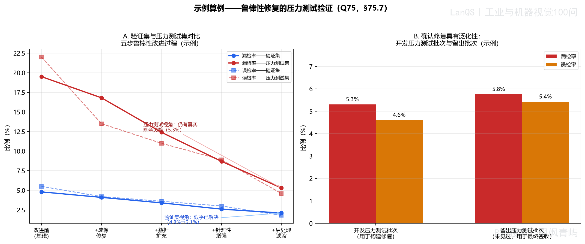
<p align="center">图75-2　普通验证集、开发压力集与独立压力集的鲁棒性修复验证算例。</p>
<div class="figure-note">
左侧中，普通验证集的漏检率从 4.8% 降到 2.1%，压力集从 19.5% 降到 5.3%；压力集的变化更能揭示现场扰动下的残余风险。右侧中，开发压力集的 5.3%/4.6% 与独立留出批次的 5.8%/5.4% 接近，这为改进能够泛化提供了支持。图中数据均为合成示例，独立批次的接近不能替代更大规模的真实验收。
</div>

### 常见误区

- 用训练集或普通验证集分数证明鲁棒性，忽略现场极端条件和阈值边界。
- 凭记忆随意挑压力样本，没有按极端条件、阈值邻近度和历史失败记录系统构建。
- 把所有数据增强操作都打开，加入现场不会出现的极端变形。
- 把集成、测试时增强和复杂后处理当成没有延迟与维护代价的免费收益。
- 只在用于开发的压力集上验收，没有独立留出的压力测试批次。
- 成像链问题却只改后处理，或数据覆盖问题却只换网络，修复层级与根因不匹配。

### 术语与符号表

| 术语 | 含义 |
|---|---|
| 鲁棒性（Robustness） | 输入条件偏离理想状态时，算法仍保持可接受输出的能力。 |
| 数据增强（Data Augmentation） | 在训练阶段对样本施加受控变换，以模拟现场变化。 |
| 难例挖掘（Hard-Example Mining） | 持续找出模型当前容易判断错误的样本，提高其训练关注度。 |
| 测试时增强（TTA） | 对同一输入做多种变换后多次推理，再聚合结果。 |
| 压力测试集 | 按极端条件、决策边界邻近度和历史失败记录构建，用于验证鲁棒性的样本集。 |
| 独立留出验证 | 修复开发过程中从未参与训练、调参或规则设计的数据，用于检验泛化。 |
| pp | 百分点，两个百分比直接相减得到的差值。 |

### 延伸阅读

- Hendrycks、Dietterich：《Benchmarking Neural Network Robustness to Common Corruptions and Perturbations》，ICLR 2019。
- Shorten、Khoshgoftaar：《A Survey on Image Data Augmentation for Deep Learning》，Journal of Big Data，2019。
- Ren 等：《Faster R-CNN》，NeurIPS 2015。
- Lin 等：《Focal Loss for Dense Object Detection》，ICCV 2017。

---

# 第76问　深度学习模型部署到工业计算机后达不到节拍要求，应该从哪些方面优化？

> 模块：部署、优化与工业计算基础设施

在输送带视觉工位上，模型平均推理时间只有 40 ms，并不意味着一个工件能在 40 ms 内完成检测。图像传输、预处理、推理、后处理和 PLC 通信都占用周期预算，少量后台任务、内存换页或热降频还可能把某些周期拖得更长。节拍要求把“运行得有点慢”变成了产线问题：工位可能堵塞，下游缓存可能溢出，甚至可能在没有完成检测时放行工件。

本题从四个层面展开：模型本身做了多少计算，硬件能够以多快的速度完成这些计算，推理引擎是否把硬件能力用起来，以及模型周围的系统是否制造了额外等待。最后用一个平均延迟已经达标、P99 仍未达标的算例说明验收口径。这里的优化目标是完整处理链在真实输入、真实软件栈和热稳态条件下满足延迟分布要求，同时保留精度、可维护性和硬件迁移能力。

> 记忆重点：产线验收面对的是“从采集到结果输出”的周期分布；模型推理时间只是其中一个阶段。

#### 76.1 先建立端到端预算，再判断瓶颈在哪里？

服务器上的模型通常可以通过增加 CPU、GPU 和内存，或者横向扩展实例来换取吞吐量。工业计算机（Industrial PC，IPC）却已经安装在设备或控制柜中，处理器型号、内存容量、GPU 或 NPU、散热能力、驱动版本和供电条件大多固定，现场也不适合为了一个模型频繁更换整套平台。它还要连续运行数周或数月，温度、灰尘、振动和后台服务会把短时测试中不明显的问题放大出来。

节拍时间是可用生产时间除以计划产量后得到的生产节奏。对于一个工位，它代表一个工件从触发、采集到完成输出所能占用的完整周期预算，推理阶段只能使用其中的一部分。假设工位的节拍上限为 50 ms，模型平均推理延迟为 42 ms，P99（第 99 百分位）却达到 58 ms，那么平均值虽然低于 50 ms，最慢的 1% 周期仍可能超过工位可接受的窗口。若这些超时周期无法被缓冲或并行消化，现场就会表现为排队、漏拍或结果延迟。

这里还要区分吞吐量和单件延迟。批处理或流水线可能让每秒处理的工件数增加，却让某个工件等待凑批或等待队列的时间变长。验收前应固定统计窗口，明确平均值、P99 或 P99.9、最大值、允许超时次数，并确定计时起点和终点。只有从相机触发或帧到达开始，一直量到结果发送和必要的落盘结束，才能判断工位是否真的满足节拍。

一个实用的预算方法是先把周期拆成采集、传输、预处理、推理、后处理、通信和必要存储几个区间，再为每个区间记录平均值与尾部值。假设工位的节拍上限为 50 ms，采集和传输已经占用 8 ms，预处理 6 ms，后处理和通信 5 ms，那么模型推理真正可用的预算约为 31 ms；即使模型单独 benchmark 得到 42 ms，也无法通过端到端验收。这个拆分还能提示工程师优先测哪里：若模型只有 20 ms，剩余时间花在图像复制、格式转换和等待 PLC，就应先处理系统流水线，继续压缩模型的收益反而有限。

IPC 的资源上限还会随时间变化。柜内温度升高后 CPU 或 GPU 可能降频，后台杀毒、日志轮转和操作系统调度会制造偶发等待，内存不足时页面换出会把一次推理拖成远大于平均值的长尾。因此，实验室中的冷机、空载、单一正常件结果，只能建立基线，不能直接成为生产承诺。

#### 76.2 模型、硬件和推理引擎怎样配合？

模型层面优化的出发点是减少必须完成的计算和必须搬运的数据。结构化剪枝删除完整通道、滤波器或其他网络结构，特征图形状和浮点运算次数（FLOPs）会随之减少；非结构化剪枝只把单个权重置零，若推理引擎没有稀疏内核，模型文件可以变小，墙钟时间却未必改变。对通用 CPU 和 GPU 来说，能够形成规则张量形状的结构化剪枝通常更容易转化为实际加速。

量化把 FP32 等高精度表示转换为 FP16、INT8、INT4 或混合精度表示。位宽降低后，权重和激活占用的字节数减少，内存带宽压力下降；目标芯片若有低精度计算单元，还能在一次指令中处理更多元素。典型卷积工作负载中，INT8 等低精度内核的单项加速可能达到约 2–4 倍；这个范围不能由位宽比例直接推出，模型层面的综合优化常被概括为约 2–10 倍，仍取决于模型和设备。量化是否带来墙钟加速，取决于硬件、算子实现和运行时是否发生 FP32 回退。低对比度缺陷、细裂纹和小目标可能对舍入误差更敏感，所以量化后应检查逐类召回率和总准确率。

知识蒸馏使用较大的教师模型产生软输出或中间特征，重新训练更小的学生模型。教师模型提供的类别概率关系比单一硬标签包含更多信息，学生模型有机会在较低计算量下保留更多判别能力；代价是要重新准备训练、蒸馏损失和验证流程。教师模型自身的漏检和偏差也可能被学生继承。

轻量化架构是更大幅度的结构改造，例如采用深度可分离卷积，或改用 MobileNet、ShuffleNet 一类为受限设备设计的骨干网络。它通常需要重新选择网络、训练和验证，适合模型仍处于设计阶段或现有架构始终无法满足算力预算的项目。算子融合则靠近执行图：Conv、BN、ReLU 等连续操作可以折叠为更少的内核，减少中间张量的写回和重复读取。现代推理引擎经常在图编译阶段自动完成，部署前应检查导出的图和 profiler，确认它真的发生了。

这些方法的收益不能按照宣传页上的倍率直接相加。剪枝会改变权重和激活分布，可能减少后续量化的精度余量；剪枝后的不规则访问还可能让 INT8 内核利用率下降。保留未压缩模型作为基线，在同一验证集、同一硬件、同一驱动和同一输入预处理下逐步测量，才能判断组合后的真实收益。

剪枝的粒度决定了“参数减少”能否转化为“计算减少”。把单个权重置零属于非结构化剪枝，只有稀疏矩阵内核识别这些零值时才会减少墙钟时间；删除完整通道或滤波器属于结构化剪枝，后续张量形状随之缩小，更容易使用现成的稠密内核。结构化剪枝通常需要在剪枝后微调，且应逐层检查小缺陷类别的召回率，因为被删除的通道可能正好承载弱纹理特征。

量化的风险集中在数值范围和校准样本。FP32 到 INT8 的位宽变化可以减少数据量，但包含强反光、暗部和少数高亮缺陷的校准集，可能使某些激活范围估计失真。PTQ（Post-Training Quantization，训练后量化）适合快速验证；若敏感层误差无法接受，可以使用 QAT（Quantization-Aware Training，量化感知训练）让模型在微调过程中适应舍入。验收时要把逐类召回、误报和输入分布一起记录；模型文件变小本身不足以证明量化成功。

知识蒸馏适合模型结构需要缩小，但直接减少层数或通道会造成明显精度损失的情况。教师模型的软输出能描述类别相似性，学生模型据此学习更平滑的决策边界；训练阶段仍需要真实标签，以免把教师的错误也传给学生。轻量化架构则是重新选择骨干网络，例如用深度可分离卷积、MobileNet 或 ShuffleNet 降低计算量，通常意味着重新训练、重新校准和重新验证。算子融合的代价较低，但必须确认推理引擎确实将 Conv、BN、ReLU 等操作折叠成了更少的内核，不能仅从配置文件推断已经生效。

硬件加速改变的是芯片每个周期能够完成多少计算和数据搬运。带 NVIDIA GPU 的 IPC 可以使用 CUDA（Compute Unified Device Architecture）和 TensorRT，执行算子融合、INT8 校准、内核选择和图优化。没有独立 GPU 时，应先确认 CPU 是否具备并实际使用 AVX2 或 AVX-512 等 SIMD（Single Instruction Multiple Data，单指令多数据）指令集。SIMD 的含义是一条指令同时处理多个数据元素；它能提高向量运算效率，却不会让一个本来受内存或 I/O 限制的流水线自动变快。

边缘 AI 加速器和 NPU 面向推理工作负载提供较高的吞吐量和能效，NVIDIA Jetson、Intel Movidius 等设备属于常见实现。代价是算子覆盖、工具链和迁移能力受到限制。一个模型在专用加速器上运行得快，前提可能是卷积、激活、后处理和数据布局都能落在设备支持的路径上；只要某个算子回退到 CPU，设备之间的数据复制就可能吞掉局部加速收益。

推理引擎位于模型和硬件之间。TensorFlow Lite 适合移动和嵌入式部署；ONNX Runtime（Open Neural Network Exchange Runtime）通过多个执行后端提供跨厂商可移植性；OpenVINO 面向 Intel CPU、集成 GPU 和 VPU（Vision Processing Unit，视觉处理单元）做了优化；TVM（Tensor Virtual Machine）则通过编译和自动调优生成目标硬件代码。框架名称本身不能说明实际延迟，工程师应查看算子图、融合情况、CPU 回退、内存复制、预处理和后处理的执行位置。

TensorRT 或 OpenVINO 的性能优势往往来自对特定芯片、驱动和运行时的深度优化。这样做可以缩短当前设备的延迟，却把一部分性能绑定到供应商。未来若 IPC 从 NVIDIA 换到 Intel、AMD 或 ARM 平台，可能需要重新编译、重新校准和重新验证精度。推理引擎的选择要与产品硬件路线和驱动生命周期一起评估，部署阶段不宜临时决定。

评估引擎时应看完整执行图，模型导出成功只能说明转换完成。要确认每个算子实际落在哪个设备、是否插入了 CPU 回退、张量是否在主机和设备之间往返、预处理和后处理是否仍由普通 CPU 代码执行。小 batch 的视觉工位尤其容易被传输固定开销限制：GPU 内核本身只运行几毫秒，PCIe 复制、同步和格式转换却占去大部分墙钟时间。只有把这些区间分开计时，才知道应该换引擎、改内存路径，还是重新安排流水线。

供应商专用引擎还会影响升级策略。TensorRT 引擎通常与 GPU 架构、驱动和构建环境有关，OpenVINO 的最佳路径也依赖 Intel 设备和版本；设备换代、驱动更新或模型算子变化后，旧引擎可能无法直接复用。项目应保存原始模型、转换参数、校准集、引擎构建日志和回滚版本，把“可重新生成”作为交付条件。

#### 76.3 系统流水线和应用场景如何确定优化重点？

系统级优化不改变模型的数学结构，主要减少模型周围的固定开销。对固定尺寸的输入预先分配内存池并复用缓冲区，可以避免每次推理动态申请和释放；持续记录峰值内存，则能发现泄漏、碎片和偶发峰值。NHWC（批次—高度—宽度—通道）与 NCHW（批次—通道—高度—宽度）都是常见数据布局，没有脱离硬件的绝对优劣，关键是让布局与目标内核一致，减少反复转置。

流水线把相邻工件的不同阶段重叠起来。例如，第 $n+1$ 个工件可以做预处理时，第 $n$ 个工件正在推理，第 $n-1$ 个工件正在后处理。这样可以提高硬件利用率，但队列过深会增加单件等待时间，还可能让故障恢复时积累大量过期数据。单件检测若为了提高吞吐而等待凑满 batch，平均吞吐量可能改善，端到端延迟却恶化，所以 batch size 应同时按吞吐量、单件延迟和 P99 测量。

电源和温度决定短时间 benchmark 能否在现场持续。确认 CPU、GPU 或 NPU 没有受到省电策略限制，并在高负载热稳态下记录温度、频率和降频事件。GPU 流程还要把主机到设备、设备到主机的 PCIe 时间与内核计算时间分开统计；只有确认传输占据主要比例后，固定页内存和设备侧预处理才有明确的优化依据。

内存池的作用不只是节省几次申请调用。每次推理动态分配缓冲区会带来锁竞争、碎片和不可预测的暂停，预先按输入尺寸和中间张量需求建立池，可以让循环中的内存行为更稳定。池大小要根据峰值并发、流水线队列和后处理缓存计算；过小会阻塞线程，过大又会挤压操作系统和其他服务的可用内存。

NHWC 与 NCHW 的选择应以目标内核的访问模式为准。若输入在预处理阶段反复从一种布局转成另一种布局，转换时间和额外内存写入可能超过模型本身的收益。流水线也存在同样的取舍：重叠阶段能够提高设备利用率，但队列过深会增加单件等待和恢复时的积压，生产线上还必须设置丢弃过期帧、清空队列和恢复后重新对齐工件的规则。

批大小的最优值取决于任务。服务器可用较大 batch 摊薄内核启动成本，单件触发的视觉工位却可能无法等待足够工件凑批；batch 增大还会提高峰值内存和尾部延迟。应同时测单件响应、每秒吞吐、峰值内存和 P99，再根据工位约束选择 batch。电源策略也要纳入长期测试，省电 governor 可能在低负载时降低频率，而持续满载又可能让柜内温度超过散热设计，最后以热降频抵消短测中获得的加速。

优化重点取决于约束出现在流水线的哪一段。视觉检测中，最有价值的改动经常发生在模型之前：缩小输入图像、裁剪感兴趣区域（Region of Interest，ROI），或删除不必要的颜色空间转换，都可能比更换推理框架更快见效。缩小图像会降低缺陷在图像中的像素覆盖，因此必须先用最小缺陷尺寸、镜头解析力和实际检出率验证采样余量。

时序预测和连续帧任务常有高度重叠的滑动窗口。如果每个窗口都从头计算特征，重复部分就会成为固定浪费；缓存前一窗口的中间特征，或只更新新进入窗口的数据，才可能获得有效收益。缓存的前提是输入分布确实重复，工件外观和姿态都高度变化的工位很难从简单缓存中受益。

模型分割适用于单个设备在内存或算力上确实无法容纳完整模型，或者多个设备之间有足够低延迟、可监控、可容错的通信链路。分割后不仅增加了通信和同步，还增加了局部设备故障时的恢复路径，因此必须把这些开销放回周期预算。下图把这些选择放回模型、硬件、推理引擎和系统四个层级，并以同一个测量闭环连接起来。

<p align="center">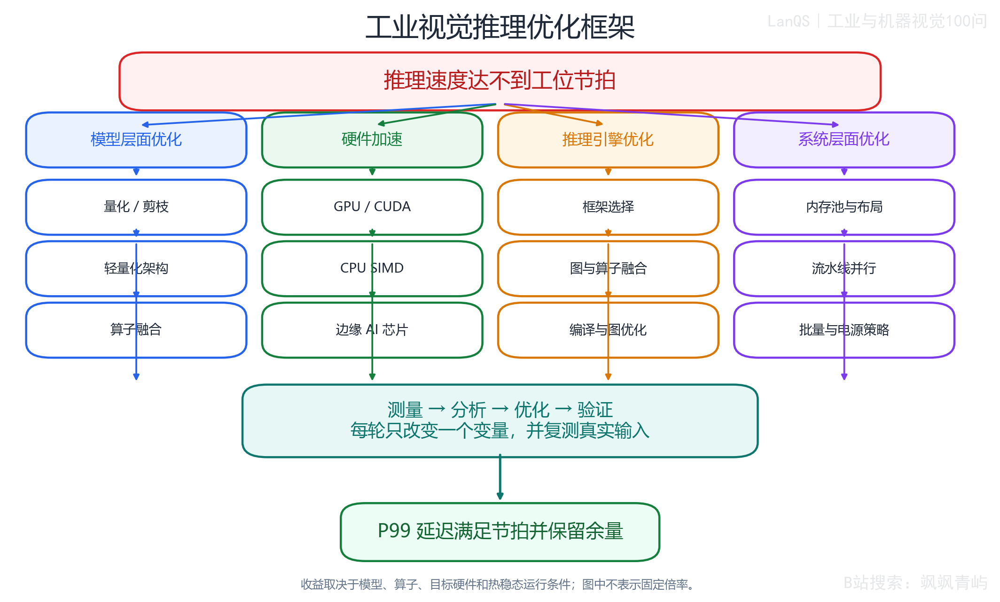</p>
<p align="center">图76-1　工业视觉推理优化框架。</p>
<div class="figure-note">图中顶部的故障现象分到四个优化层级，每个层级下面列出可以落地的措施，底部的“测量—分析—优化—验证”才是把措施变成结果的共同路径。读图时先判断瓶颈属于计算、访存、传输还是调度，再沿相应分支选择方法；图中的 2–10 倍和 5–20 倍只是典型范围，不是对某一 IPC 的性能承诺。</div>

ROI 裁剪必须与机械定位和缺陷尺寸一起验证。若工件位置有漂移，固定 ROI 可能切掉缺陷；若先缩小整图再裁剪，小裂纹可能在下采样中消失。可以用最小可检缺陷在 ROI 中的像素宽度、相机标定误差和工件定位误差计算余量，再用边界样本复核检出率。颜色空间转换也要检查是否真的被模型使用，删除无用转换能节省时间，改变模型训练时依赖的颜色信息则会造成精度回退。

滑动窗口复用特征时，缓存必须带有时间、帧号和窗口边界。新数据到来后只计算增量部分，适合相邻窗口高度重叠的传感器或连续图像；工件切换、配方变化或相机重新连接时要清空缓存，否则旧工件特征会污染新结果。缓存对每个工件外观都不同的离散检测任务帮助有限，不应把它作为通用加速手段。

模型分割还会改变故障模型。一个设备完成前半段、另一个设备完成后半段时，通信延迟、同步超时和局部重启都要写入恢复方案；若分割链路经过网络，必须测量拥塞和重传后的尾部延迟。只有当模型无法在单设备上满足内存或算力预算，且这些协调成本仍小于节拍余量时，分割才有工程意义。

调优需要先回答“时间花在哪里”。NVIDIA Nsight Systems/Compute、Intel VTune 和推理引擎自带 profiler 都可以把一次推理拆成内核、内存访问、线程等待和设备同步。计算受限时，计算单元利用率接近峰值，减少 FLOPs、使用轻量化结构或低精度算术更可能有效；带宽受限时，计算利用率并不高但内存控制器繁忙，应减少中间张量读写、统一数据布局或缩小搬运的数据量。GPU 设备侧内核很快而总延迟仍很高时，还要单独测量 CPU–GPU 传输和主机侧预处理。若确认主机传输是瓶颈，可使用固定页内存，并把预处理留在设备侧，避免每个阶段来回复制。

基准集必须接近生产分布。正常件、缺陷件、不同产品型号和配方都应覆盖，尤其要加入会产生较多候选框的样本，因为后处理和 NMS（Non-Maximum Suppression，非极大值抑制）会改变执行路径。每轮尽量只改变一个变量，并在改变前后保存模型、驱动、配置和输入集，这样精度回退或延迟变化才有机会被归因。

延迟报告至少应同时包含平均值、最大值和 P99 或 P99.9。P99 表示 99% 的观测值不超过该时间，剩下 1% 的尾部仍可能影响节拍。若工位存在缓存或多个并发流水线，还要测量从触发到结果输出的端到端周期，因为单独的模型 profiler 无法反映排队和通信。

Profiler 的读法应落到每层资源占用。GPU 上可以用 Nsight Systems/Compute，CPU 上可以用 Intel VTune，也可以使用 TensorRT profiler、ONNX Runtime profiling 或 OpenVINO benchmark_app。卷积层若计算单元接近峰值、内存等待比例较低，属于计算受限，减少 FLOPs 或降低精度更有希望；计算利用率低而内存控制器繁忙，属于带宽受限，应减少中间张量和布局转换。两类瓶颈的处理方向不同，单看某层总耗时无法完成区分。

测试集还要包含会改变执行路径的坏件。缺陷图可能产生更多候选框、更复杂的后处理和更多 NMS 候选，干净正常件的 benchmark 会系统性低估尾部。每次迭代应固定输入顺序、重复次数、预热次数、计时边界和软件版本，记录平均、最大、P99、峰值内存、温度和功耗。一次同时打开三种优化得到 4 倍加速，不能说明每种优化都有效，也无法知道哪一项造成了精度回退。

验证不仅要做冷机短测，还要在代表性环境中连续运行。热稳态、后台任务、垃圾回收、页面换出和日志写入都可能只在长时间运行中出现，并且主要反映在 P99。对 GPU 系统，固定页内存和设备侧预处理只有在确认 CPU–GPU 复制占主要时间后才值得加入；否则它们会增加代码复杂度，却不一定缩短完整周期。

设未优化的 FP32 模型平均推理延迟为 180 ms，P99 与平均值的比例为 1.61，工位的示例节拍上限为 50 ms。依次加入 INT8 量化、算子融合、TensorRT 图优化和系统级调优。每一阶段的加速倍率与 P99/平均值比例均为示例假设，用来展示统计关系，不代表某一型号 IPC 的实测结果。

第 $i$ 个阶段的平均延迟和 P99 可以写成：

$$
\bar t_i=\frac{\bar t_0}{\prod_{j=1}^{i} k_j},\qquad
t_{99,i}=\bar t_i r_i
\tag{76-1}
$$

其中，$\bar t_0=180\ \mathrm{ms}$ 是基线平均延迟，$k_j$ 是第 $j$ 个阶段相对于前一阶段的平均延迟加速倍率，$r_i$ 是第 $i$ 个阶段的 P99/平均值比例，$\bar t_i$ 和 $t_{99,i}$ 的单位都是毫秒。这个表达式假定各阶段按顺序累积，并用一个比例近似尾部形状；真实延迟分布可能在优化后改变形状，不能只用单一比例替代完整测量。

| 阶段 | 平均延迟（ms） | P99（ms） | 平均值相对 50 ms | P99 相对 50 ms |
|---|---:|---:|---|---|
| 基线（FP32） | 180.0 | 289.8 | 不通过 | 不通过 |
| + INT8 量化 | 60.0 | 87.0 | 不通过 | 不通过 |
| + 算子融合 | 42.9 | 57.9 | 通过 | 不通过 |
| + TensorRT 图优化 | 28.6 | 37.1 | 通过 | 通过 |
| + 系统级调优 | 22.9 | 26.3 | 通过 | 通过 |

例如，INT8 阶段的平均延迟为 $180/3=60\ \mathrm{ms}$，P99 为 $60\times1.45=87\ \mathrm{ms}$；算子融合后平均延迟为 $60/1.4=42.9\ \mathrm{ms}$，P99 为 $42.9\times1.35=57.9\ \mathrm{ms}$。此时平均值已经低于 50 ms，P99 仍然超限。到 TensorRT 图优化阶段，平均值为 $42.9/1.5=28.6\ \mathrm{ms}$，P99 为 $28.6\times1.30=37.1\ \mathrm{ms}$，两项才同时通过。

这组计算说明，平均延迟与尾部延迟必须分开验收，也说明减小尾部的措施和减少平均计算量的措施可能不同。它不能证明所有 IPC 都能达到 22.9 ms，因为输入分布、热状态、驱动、后处理和计时范围都没有由这个算例确定。工程验收仍需使用目标设备和真实生产样本重新采样。

<p align="center">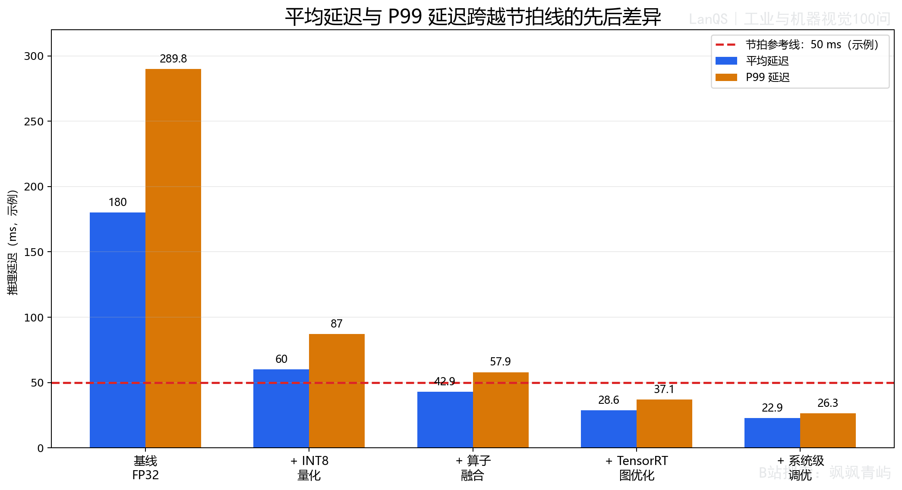</p>
<p align="center">图76-2　平均延迟与 P99 延迟跨越节拍线的先后差异（示例）。</p>
<div class="figure-note">蓝柱表示平均延迟，橙柱表示 P99 延迟，红色虚线是 50 ms 示例节拍线。读图时看两组柱子分别在哪个阶段越过虚线：平均值在算子融合后先通过，P99 要到 TensorRT 图优化后才通过。图内数值来自上表的示例假设，只用于说明尾部风险，不能替代现场的端到端、热稳态和长时间测试。</div>

#### 76.4 调优流程、P99 验收和常见陷阱怎样处理？

最容易被忽略的是精度损失并不均匀。量化或剪枝可能集中损伤一个低频缺陷类别的召回率，而总体准确率几乎不变。压缩后应逐类比较精确率、召回率、定位误差和关键缺陷漏检率，并保留混淆矩阵；如果关键类别下降超过项目规定的阈值，就应暂停性能优化，回到校准或训练环节。

硬件和驱动绑定是另一类风险。某个 TensorRT 引擎可能依赖特定 GPU 架构、驱动和构建环境，硬件换代后需要重新编译或校准。过度定制的内核、固定 batch 和复杂图变换也会增加后续维护难度。办公室里的短测无法代表控制柜的热稳态，垃圾回收、页面换出、后台任务和电源策略都可能在 P99 中形成尖峰。

在工期有限时，先用 profiler 分清计算、访存和传输瓶颈，再评估量化和结构化剪枝；随后检查已经存在但未启用的算子融合、内存池、电源策略和流水线；还存在明确性能缺口时，再投入厂商专用引擎、架构重设计或知识蒸馏。每一步都复测 P99 和关键类别精度，达到足够余量后停止继续压缩。

还要注意“局部加速、全局退化”的情况。模型推理变快后，后处理、结果写入或线程同步可能成为新的瓶颈；CPU 和 GPU 之间频繁复制，也可能让设备侧加速无法反映在端到端延迟上。长时间高利用率会提高 IPC 温度，触发热降频后，刚获得的短测加速可能逐渐消失。托管运行时的垃圾回收暂停、内存压力造成的页面换出和后台操作系统任务，通常不改变平均值，却会把尾部拉长。

精度验证必须按任务风险分层。总体准确率在类别不均衡时会掩盖低频缺陷的漏检；量化、剪枝和蒸馏后应至少比较每类召回率、精确率、混淆矩阵和关键缺陷的误报/漏报。对于与安全或高成本返工相关的类别，应设定独立放行阈值，必要时回看原始图像和模型热区，避免用一个平均指标覆盖所有类别。

自适应推理会根据输入难度动态分配计算量：容易判定的图像走较短路径，困难样本才启用更大模型。神经架构搜索（Neural Architecture Search，NAS）把目标硬件的真实延迟和内存特征纳入网络搜索，避免只用 FLOPs 作为硬件性能代理。边缘 AI 芯片继续提高单位功耗吞吐，TVM 和 MLIR（Multi-Level Intermediate Representation，多级中间表示）等编译技术则尝试自动生成更贴合目标硬件的代码。

这些技术可以减少手工调优，但仍要回到目标设备、真实输入、尾部延迟、精度和热稳态上验证。自动搜索得到的模型如果没有可维护的运行时和回滚方案，也不适合直接进入长期运行的产线。

自适应推理还会改变节拍统计：简单件与复杂件可能走不同计算路径，系统应记录每种路径的触发条件、比例和尾部延迟。神经架构搜索若只优化 FLOPs，可能选出访存模式不适合目标芯片的网络；硬件感知搜索必须用目标编译器和代表性输入复测。TVM、MLIR 等编译抽象有助于减少后端重复工作，但算子覆盖、调试能力和版本回滚仍需纳入产品生命周期。

### 常见误区

- 把节拍时间、完整工位周期和模型推理延迟当成同一个指标。
- 只看平均延迟，不报告 P99、P99.9 和最大值。
- 把参数量减少或 INT8 存储量减少直接等同于同倍率墙钟加速。
- 没有定位计算、访存和传输瓶颈就更换推理引擎。
- 只看总体准确率，不检查关键缺陷类别的召回率。
- 在冷环境短测后直接承诺长期产线节拍。

### 术语与符号表

| 术语或符号 | 含义 | 单位 |
|---|---|---|
| 节拍时间 | 生产线允许一个工位完成一个周期的时间预算 | ms 或 s |
| IPC | Industrial PC，面向工业现场连续运行和环境适应性设计的计算机 | — |
| P99、P99.9 | 延迟分布的第 99、99.9 百分位 | ms |
| FLOPs | 浮点运算次数，用于描述模型计算量 | 次 |
| ROI | Region of Interest，感兴趣区域，图像中实际送入算法的局部区域 | — |
| SIMD | Single Instruction Multiple Data，单指令多数据 | — |
| NHWC、NCHW | 两种批次、空间和通道的张量维度排列方式 | — |
| $\bar t_i$ | 第 $i$ 个阶段的平均延迟 | ms |
| $t_{99,i}$ | 第 $i$ 个阶段的 P99 延迟 | ms |
| $k_i$ | 第 $i$ 个阶段的平均延迟加速倍率 | 无量纲 |
| $r_i$ | 第 $i$ 个阶段的 P99/平均值比例 | 无量纲 |

### 延伸阅读

- Q77：量化、剪枝和知识蒸馏的具体机制、算例及精度边界。
- Q78：IPC 与普通 PC 的硬件、环境、可靠性和 TCO 背景。
- NVIDIA TensorRT、Intel OpenVINO 和 ONNX Runtime 官方文档：核对目标硬件上的图优化、精度校准和性能测试方法。

---

# 第77问　什么是模型量化、剪枝和知识蒸馏？它们分别解决什么问题？

一套表面缺陷分类模型在工作站上运行良好，换到产线边缘盒子后却出现了三类问题：模型文件太大，无法稳定装入内存；单张图推理时间超过节拍；压缩后总体准确率变化不大，但某一类细小划伤的召回率明显下降。量化、剪枝和知识蒸馏都可以让模型更适合部署，但它们改变模型的方式不同。量化改变数值表示，剪枝减少需要计算的结构或参数，知识蒸馏则用较大的教师模型指导较小的学生模型学习。选择方法前，要先分清当前瓶颈是存储、带宽、算力、能耗，还是模型本身的泛化能力。

可以先记住三个判断：量化回答“每个数用多少位表示”；剪枝回答“哪些连接或通道可以删除”；知识蒸馏回答“小模型怎样从大模型的输出和中间行为中学习”。三者可以组合，但加速倍数、精度损失和部署收益都必须在目标硬件上重新测量。

#### 77.1 量化是什么，如何评估它的收益？

卷积网络的权重、偏置和中间激活通常以 32 位浮点数（FP32，32-bit floating point）保存。浮点数能够覆盖较大的数值范围，训练时也便于反向传播，但一个参数需要 4 个字节，卷积计算还要搬运大量浮点数据。边缘设备上常见的整数运算单元更擅长处理 8 位或 4 位整数，因此可以把连续的浮点数映射到有限的整数刻度上。这个过程称为量化（quantization）。

量化并不等于简单地把小数点后的数字截掉。系统需要为一组浮点值确定比例因子和零点，再把每个值映射到整数网格。以常见的仿射均匀量化为例，给定浮点值 \(x\)，量化后的整数 \(x_q\) 可以写成：

$$
x_q=\operatorname{clip}\left(\operatorname{round}\left(\frac{x}{s}\right)+z,\ q_{\min},\ q_{\max}\right)
\tag{77-1}
$$

这里，\(s\) 是比例因子，单位与 \(x\) 相同，用来决定相邻整数刻度代表多大的浮点间隔；\(z\) 是零点，负责让浮点数 0 在整数域中有对应位置；\(q_{\min}\) 与 \(q_{\max}\) 是目标整数格式允许的范围，例如有符号 INT8 通常使用 \(-128\) 到 \(127\)。\(\operatorname{round}\) 表示取最近整数，\(\operatorname{clip}\) 表示把超出范围的结果截到边界。部署时常用下面的式子把整数近似还原到浮点域：

$$
\hat{x}=s(x_q-z)
\tag{77-2}
$$

\(\hat{x}\) 是还原后的近似值。量化误差来自舍入误差和截断误差。若校准范围取得过窄，少数大幅值会被截断；若范围取得过宽，大多数数值只占整数刻度的一小部分，分辨率下降。校准（calibration）就是用具有代表性的样本估计权重和激活的范围，决定 \(s\) 和 \(z\)。所以量化效果不只取决于 INT8 或 INT4 这个标签，也取决于样本分布、每层的量化策略以及算子是否有对应的整数内核。

最容易理解的是均匀量化：整数刻度之间的间距相同，适合硬件实现和高速矩阵运算。非均匀量化会让刻度分布得不均匀，以便在数值密集区域保留更多精度，但查表和硬件支持通常更复杂。APoT（Additive Powers-of-Two，累加二次幂量化）等方法试图用适合移位或加法的数值集合近似浮点值，适合特定算力结构，不能因为理论表示误差小就直接推断整网延迟一定更低。

量化误差可以从动态范围直观看出来。若某层绝大多数激活集中在接近 0 的窄区间，只有少数离群值很大，使用一个覆盖全部范围的逐张量 scale 会让大部分整数刻度浪费在空白区域；若把范围截窄，离群值又会被 clip。逐通道量化可以为不同通道使用不同尺度，通常更能保护分布差异，但要求推理内核、转换工具和模型格式都支持。实际应在校准集上记录饱和比例和误差，并检查容易受影响的层，而不是只比较权重文件大小。

量化还分为训练后量化（PTQ，post-training quantization）和量化感知训练（QAT，quantization-aware training）。PTQ 在模型训练完成后，用校准集估计范围并转换权重、激活，流程快，适合先做可行性验证；QAT 在训练或微调时插入模拟量化操作，让模型在训练过程中适应舍入误差，通常能更好地保持精度，但需要额外训练数据、时间和稳定的训练流程。对于对比度变化大、异常样本少或某些层对误差非常敏感的缺陷检测任务，PTQ 可能已经足够，也可能需要用 QAT 修复少数类别的性能下降。

图 77-1 把三条压缩路径放在同一张图中。阅读时先沿着“量化、剪枝、蒸馏”三个分支分别看它改变了模型的哪一部分，再看它们如何共同指向边缘部署。

<p align="center">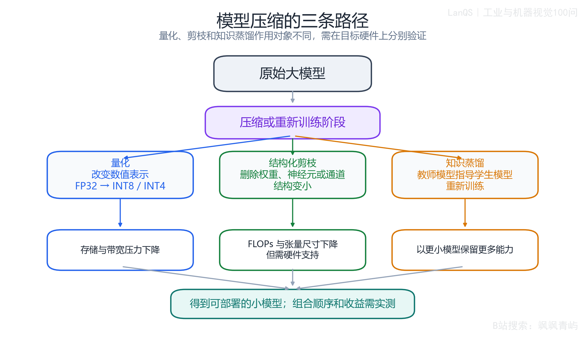</p>
<p align="center">图77-1　量化、剪枝与知识蒸馏改变模型的三个入口。</p>

<div class="figure-note">读图时，量化分支对应数值精度，剪枝分支对应连接或结构规模，蒸馏分支对应训练目标和模型容量。三条分支可以单独使用，也可以组合使用；图中只表示方法之间的关系，不表示任何组合都能按各自加速倍数直接相乘。</div>

量化最直接地降低模型的存储和数据搬运成本。位宽从 FP32 降到 INT8 时，每个参数由 32 位变为 8 位，理论存储量减少 \(1-8/32=75\%\)；降到 INT4 时，减少 \(1-4/32=87.5\%\)。当模型权重需要从内存反复送入缓存或计算单元时，数据量降低还可能减少内存带宽压力。整数乘加单元的吞吐量也可能高于浮点单元，因而延迟和能耗有机会下降。

这些比例是位宽带来的精确存储变化，整网加速还取决于未量化算子、张量重排、量化和反量化节点，以及硬件不支持时的回退路径。若某层仍以 FP32 执行，整数张量还要在边界处转换，理论收益会被抵消。部署时应同时检查模型大小、峰值内存、端到端延迟和功耗。

设一个用于工业表面缺陷分类的中等规模卷积网络包含 \(N=24{,}700{,}000\) 个参数。若只计算参数存储量，位宽为 \(b\) 位时，容量 \(S\) 的单位为 MiB，公式为：

$$
S(N,b)=\frac{N b}{8\times1024^2}\ \mathrm{MiB}
\tag{77-3}
$$

分母中的 8 把位换成字节，\(1024^2\) 把字节换成 MiB。代入 FP32、INT8 和 INT4：

$$
S(24{,}700{,}000,32)
=\frac{24{,}700{,}000\times32}{8\times1024^2}
\approx94.22\ \mathrm{MiB}
$$

$$
S(24{,}700{,}000,8)
=\frac{24{,}700{,}000\times8}{8\times1024^2}
\approx23.56\ \mathrm{MiB}
$$

$$
S(24{,}700{,}000,4)
=\frac{24{,}700{,}000\times4}{8\times1024^2}
\approx11.78\ \mathrm{MiB}
$$

这个计算只涉及位宽，因此三个容量值可以直接复核。若再假设结构化剪枝保留 55% 的参数，剪枝后的 FP32 参数量约为 \(24{,}700{,}000\times0.55\)，容量约为 \(94.22\times0.55=51.82\ \mathrm{MiB}\)；再量化到 INT8，容量约为 \(51.82\times0.25=12.96\ \mathrm{MiB}\)。若蒸馏得到的学生模型只保留原参数量的 28%，其 FP32 参数容量约为 \(94.22\times0.28=26.38\ \mathrm{MiB}\)。

表 77-1 将精确的存储计算与用于说明工程取舍的延迟假设分开。后四列属于可比较的说明性示例，不由参数量公式推导，也不是实测结果：假设基线延迟为 42.0 ms，INT8、剪枝、剪枝加 INT8 和蒸馏模型分别具有 2.6、1.6、3.4 和 3.1 倍的延迟改善。

| 方案 | 参数保留比例 | 权重精度 | 参数存储量 | 示例延迟 | 相对基线 |
| --- | ---: | --- | ---: | ---: | ---: |
| 基线模型 | 100% | FP32 | 94.22 MiB | 42.0 ms | 1.0× |
| 仅 INT8 | 100% | INT8 | 23.56 MiB | 16.2 ms | 2.6× |
| 仅结构化剪枝 | 55% | FP32 | 51.82 MiB | 26.2 ms | 1.6× |
| 剪枝 + INT8 | 55% | INT8 | 12.96 MiB | 12.4 ms | 3.4× |
| 蒸馏学生模型 | 28% | FP32 | 26.38 MiB | 13.5 ms | 3.1× |

由表中的假设，剪枝加 INT8 的延迟改善是 \(42.0/12.4\approx3.4\) 倍，并非把 \(1.6\times2.6=4.16\) 倍当作必然结果。两个优化可能共享内存带宽、算子调度和数据转换成本，收益存在重叠；也可能因为结构变得更适合硬件而出现额外收益。这个算例能说明位宽、参数量和延迟之间的数量级关系，不能证明某个具体设备会得到 12.4 ms，也不能证明剪枝后一定保留 55% 参数仍有相同精度。实际验收必须使用目标硬件、代表性图像和固定软件版本测量。

位宽带来的收益通常同时体现在四个资源上：模型权重占用的内存、内存与缓存之间搬运的字节数、低精度乘加的吞吐，以及计算单元的能耗。它们之间并非一一等价。若设备没有高效 INT4 内核，INT4 权重可能在算子边界反量化；若模型主要受 I/O 或后处理限制，权重缩小也未必降低端到端延迟。工程报告应分别写出参数存储、峰值内存、算子执行时间和整站周期。

图 77-2 用柱状图呈现上述示例。先沿横轴比较方案，再分别观察存储量和延迟两个纵轴；若某方案只在存储量上改善，说明它可能解决了装载或带宽问题，却未必解决算子执行瓶颈。

<p align="center">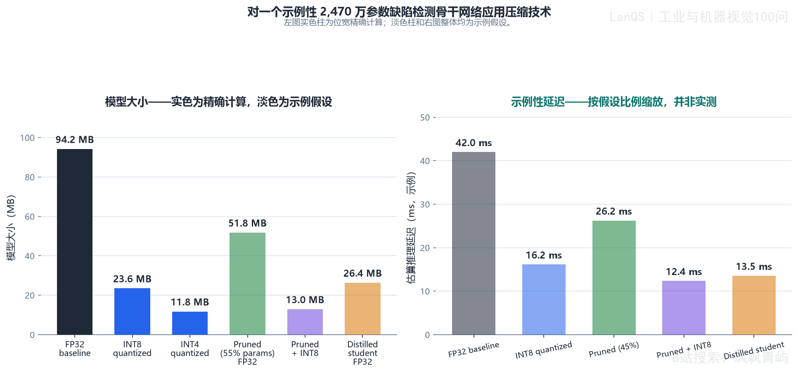</p>
<p align="center">图77-2　不同压缩方案的存储量与示例延迟。</p>

<div class="figure-note">图中基线、INT8、剪枝、剪枝加 INT8 和蒸馏学生模型对应表 77-1 的五行。存储量来自参数位宽和保留比例的计算；延迟柱是说明性假设，不能当作目标设备实测值。读者应关注“压缩路径改变了哪一项资源”以及组合收益为何不必等于单项倍数相乘。</div>

#### 77.2 剪枝和知识蒸馏分别解决什么问题？

剪枝（pruning）是在模型中识别贡献较小的参数、神经元或通道，并把它们删除或置零。与量化只改变数值表示不同，剪枝改变的是模型结构或有效连接数量。若卷积层有许多输出通道，而其中一部分对验证集的损失和类别判别贡献很小，就可以尝试删除这些通道，让后续层的输入维度一起缩小。

最细粒度的是权重剪枝。它可以把单个权重置零，保留原有层形状，再由稀疏矩阵内核利用零值减少计算。这种方法能够保留较细的表达能力，但只有在运行时、编译器和硬件都支持相应稀疏模式时才会产生实际加速。非结构化稀疏如果仍按稠密矩阵计算，模型文件可能变小，端到端延迟却几乎不变。

结构化剪枝以神经元、卷积通道、卷积核或层为单位删除。删除一个输出通道后，下一层相应的输入通道也要调整，模型形状更规整，通常更容易映射到通用 GPU、CPU 或 NPU。代价是一次删除的表示能力更多，精度损失可能高于同等零值比例的非结构化剪枝。

工程流程通常从重要性估计开始。可以根据权重绝对值、通道范数、梯度敏感度、验证集损失变化或更专门的敏感度分析给出候选排序。然后按目标比例删除候选结构，使用训练集或微调集恢复参数，最后在固定的验证集上重新测量。剪枝比例应逐步增加；一次删除过多通道后，模型可能丢失某些小缺陷所依赖的弱纹理特征，后续微调也未必能够恢复。

这个过程可以分成三个相互衔接的阶段。重要性估计回答“删掉谁”，需要把权重、梯度或激活统计转换为可比较的分数；剪枝决策回答“删多少”，要决定按层设比例还是全局设比例，并保留硬件友好的通道数；微调恢复回答“删掉后怎样重新适应”，通常需要若干轮训练来恢复精度。只做第一、二步而跳过微调，往往会把结构变化直接暴露给分类头或检测头，造成明显回退。

剪枝解决的主要问题是模型规模和计算量。它适合某些层宽度过大、重复特征较多或设备对规整通道计算友好的场景。它无法单独保证低延迟：如果瓶颈在图像预处理、内存搬运、后处理或线程调度，删掉卷积通道只会改善局部算子时间。对检测模型，还要检查候选框回归、非极大值抑制以及小目标分支，因为主干网络的压缩比例不能代表整个流水线的压缩比例。

剪枝还可能改变泛化能力。工业数据集往往样本量有限，冗余结构有时在帮助模型吸收材质、光照和工件姿态变化；删除它们可能降低过拟合，也可能把本来就少的异常特征一起删掉。因而剪枝比例不能只由参数数量决定，应在未参与剪枝调参的留出集上比较总体指标和关键类别指标，并检查剪枝后每层通道数是否适合目标硬件的块大小。

剪枝的直接收益是减少有效参数、乘加操作和中间特征图规模。结构化剪枝还可能降低缓存占用和带宽需求，使模型更容易装入边缘设备。对同一网络进行剪枝时，通道数若能对齐硬件喜欢的块大小，例如 8、16 或 32，通常比任意通道数更容易获得稳定吞吐，但对齐并不能替代实测，因为不同编译器和算子实现的最佳块大小并不相同。

剪枝带来的精度变化取决于删除的位置和任务。分类总体准确率可能保持不变，而少数类召回率、交并比（IoU，intersection over union）或小缺陷定位精度已经下降。工业检测中的缺陷类别通常不均衡，宏平均指标也可能掩盖某个关键类别的回归。因此剪枝后的验收应按类别检查精确率、召回率、F1 或 IoU，并保留代表不同材质、光照、位置和缺陷尺寸的图像。

剪枝还有一个现实边界：模型结构改变后，原有部署引擎的图优化和缓存计划可能需要重新生成；剪枝后的层如果形状不规整，运行时可能插入额外的数据重排。对安全或质量判定流程，应把模型压缩视为一次新的版本发布，重新固定模型文件、引擎版本、输入预处理和阈值，并同步更新部署记录。

#### 77.3 三种方法怎样配合，又怎样区分？

知识蒸馏（knowledge distillation，KD）让一个容量较大的教师模型指导较小的学生模型。教师模型可以使用更深的网络、更高的输入分辨率或更充分的训练资源，部署时则只保留学生模型。蒸馏的作用是把教师对类别相似性、边界样本和中间表征的判断传给学生，教师模型本身仍保持原有规模。

只用硬标签训练时，标签通常是 one-hot 向量：正确类别为 1，其他类别为 0。这种标签告诉学生“答案是哪一类”，却不告诉它错误类别之间的相似程度。教师模型的 soft label 是经过温度 \(T\) 平滑后的概率分布。设教师对第 \(i\) 类的 logit 为 \(a_i\)，则：

$$
p_i(T)=\frac{\exp(a_i/T)}{\sum_j\exp(a_j/T)}
\tag{77-4}
$$

温度 \(T\) 越大，分布越平滑，学生可以看到类别之间更细的相对关系；\(T=1\) 时接近普通 softmax。若温度过高，分布趋于过平，类别差异变弱；若温度过低，分布接近 one-hot，蒸馏提供的额外信息有限。教师和学生的类别顺序、logit 定义以及输入预处理必须一致，否则比较的是不同语义。

训练时通常把硬标签损失和教师—学生分布之间的 KL 散度结合起来：

$$
L=(1-\alpha)L_{\mathrm{hard}}+\alpha T^2 L_{\mathrm{KL}}\left(p_{\mathrm{teacher}}(T),p_{\mathrm{student}}(T)\right)
\tag{77-5}
$$

\(L_{\mathrm{hard}}\) 是学生预测与真实标签之间的损失，常用交叉熵；\(L_{\mathrm{KL}}\) 衡量学生分布与教师分布的差异；\(\alpha\) 控制蒸馏项的权重；\(T^2\) 是常见的梯度尺度补偿项。它们的具体实现可以因框架而异，不能只抄公式中的系数。若训练集中存在教师也判断错误的样本，学生会继承错误倾向，因此仍需用真实标签、困难样本和人工复核来约束蒸馏。

蒸馏尤其适合需要小模型、但又不希望单纯缩窄网络后损失太多精度的场景。教师可以向学生传递“轻微划痕更接近哪一类”“背景纹理怎样与缺陷区分”等软信息。不过学生的输入分辨率、骨干结构和计算预算决定了它能否表达这些信息；教师拥有更高分辨率并不意味着学生在低分辨率下可以恢复已经丢失的细节。

一个完整的蒸馏流程包含教师训练、软目标生成和学生训练。教师必须先在真实任务上达到可接受性能，蒸馏不会凭空修复教师的漏检；冻结教师后，使用相同输入生成 logits 或中间特征；学生再同时接收真实标签和教师信号。若教师与学生的类别顺序、归一化、裁剪方式不一致，KL 损失下降也可能对应错误的语义关系。

中间特征蒸馏还要解决层之间的形状差异。教师和学生通道数不同，通常需要投影层或对齐层，投影层本身会增加训练复杂度；只蒸馏最终分类分布则较轻量，但传递的空间结构更少。训练阶段要保存教师版本、温度、蒸馏权重、输入配置和学生检查点，部署阶段只运行学生模型时才能兑现推理资源收益。

蒸馏主要解决模型容量与部署资源之间的矛盾。直接把教师网络的层数、通道数或输入尺寸缩小，常常会造成表征能力下降；蒸馏通过教师输出提供额外监督，让学生在较小容量下逼近教师的决策边界。它可以与量化或剪枝结合：先训练一个结构较小的学生模型，再做 INT8 量化，或者对学生模型进行结构化剪枝。

蒸馏的成本发生在训练阶段。需要运行教师模型生成 logits 或中间特征，训练速度下降，训练管线也要保存教师版本、温度、蒸馏权重和数据处理配置。部署阶段若只保留学生模型，推理成本可以降低；如果在线推理仍同时运行教师，蒸馏就没有解决产线延迟问题。

学生模型能否保留教师能力，必须按部署任务验证。除了总体准确率，还应比较每类召回率、误报率、漏报率、IoU 或定位偏差；还要检查不同材质、相机曝光、运动模糊和缺陷尺寸。蒸馏的损失下降只能说明训练目标被优化，验收仍需检查学生模型的部署指标。教师模型也可能把数据集偏差放大，因而蒸馏不能替代数据清洗、采样平衡或成像改进。

蒸馏主要把成本从推理阶段转移到训练阶段。教师模型需要额外的显存和计算生成软标签，中间特征蒸馏还要保存更大的训练张量；学生训练过程也比普通微调多一个损失项。项目计划应明确教师是否离线生成输出、训练集和验证集如何隔离、软标签如何缓存，以及最终学生模型是否仍能在目标设备上使用量化或剪枝后的算子。

三种方法作用在模型的不同位置。量化压低单个数值的位宽，适合处理存储、带宽、整数吞吐和能耗；剪枝减少参数或结构规模，适合处理过宽网络、计算量和规整化部署；蒸馏改变训练监督，让小模型在容量受限时尽量保留教师的判别能力。组合顺序应由测量结果决定，不能套用固定配方。

一个可靠的组合流程会先保留未压缩模型作为基线，记录固定硬件和软件环境下的端到端延迟、峰值内存、功耗以及每类质量指标。随后可以先做 PTQ 量化试验，判断数值误差是否可接受；若模型仍过大或计算量过高，再评估结构化剪枝或重新设计学生模型；若缩小结构后关键类别明显退化，再用教师模型做蒸馏。每一步都用同一批留出验证图像和同一套阈值重新测量。

压缩交互经常导致“单项有效、组合失效”。量化会放大剪枝后某些通道的分布异常，剪枝会使蒸馏学生失去承载教师信息的容量，部署引擎也可能因某个 INT4 算子不支持而回退到 FP32。发现精度或速度异常时，应保留一个固定的未参与调参的留出集，逐项比较混淆矩阵、每类精确率和召回率、IoU 及延迟分位数。若任一关键类别的召回率下降超过 5 个百分点，应进入人工复核，而不能用总体准确率掩盖回归。

代码验证的逻辑可以简化为下面的伪代码。它强调固定数据、逐步加压缩、同时记录质量和资源指标；其中“生成部署引擎”必须使用实际目标硬件对应的编译配置。

~~~text
baseline = evaluate(original_model, held_out_set, target_device)
for candidate in [ptq_int8, structured_pruning, distillation, combined]:
    model = build_candidate(candidate)
    engine = build_deployment_engine(model, target_device)
    result = evaluate(engine, held_out_set, target_device)
    report(result.per_class_recall,
           result.precision,
           result.iou,
           result.mean_latency,
           result.p99_latency,
           result.peak_memory,
           result.power)
    if key_class_recall_drop(result, baseline) > 0.05:
        manual_review(candidate)
~~~

逐类验证应使用固定的留出集，且这批图像不能被用来选择剪枝比例、校准范围或蒸馏超参数。分类任务至少报告每类精确率、召回率和混淆矩阵；检测任务还要按 IoU 匹配后的召回率、定位误差和小目标表现进行比较。若任一关键类别召回率下降超过 5 个百分点，可以把它作为进入人工复核的起点，不应等总体准确率也下降才处理。

组合方案要在每个阶段记录结果：原模型、剪枝后模型、量化后模型、蒸馏学生模型以及最终组合模型分别测量。这样可以知道问题是剪枝删除了某类特征，还是量化校准放大了剩余通道的误差；只测最终模型会丢失定位线索。除离线验证外，还要把生产图像、真实输入预处理、目标编译器和长时间运行后的温度纳入部署验证。

选择起点可以按约束来定。若主要限制是固定 Flash 或 RAM，而算力尚有余量，先做 PTQ INT8；若主要限制是计算量且硬件缺少高效低精度或稀疏内核，优先评估结构化通道剪枝；若内存和延迟都紧张、又有足够训练周期，先用蒸馏得到可靠的学生结构，再对学生做量化或剪枝。项目工期很紧、没有新训练管线时，PTQ 通常是最先验证的方案，但必须预留逐通道量化或局部 QAT 的回退路径。

工程选择最终由约束决定。若问题是模型加载失败，先检查位宽和存储；若问题是卷积计算占满设备，结构化剪枝、轻量化学生模型或硬件友好的算子更值得测试；若问题主要是关键类别退化，应优先分析数据、成像和蒸馏训练，继续降低位宽可能进一步放大误差。任何压缩方案在通过固定测试集后，还要经过真实产线图像、长时间运行、异常输入和版本回滚验证。

### 常见误区

- 把参数文件缩小当作端到端延迟一定降低。预处理、数据复制、未支持算子和后处理都可能占主要时间。
- 只看总体准确率判断压缩是否安全。缺陷类别不均衡时，关键类别的召回率可能先下降。
- 认为 INT8 或 INT4 在所有层都同样安全。激活范围、校准集和算子实现会改变量化误差。
- 认为非结构化零值天然带来加速。没有稀疏内核或编译器支持时，零值可能仍按稠密矩阵计算。
- 把示例中的 55% 保留率、28% 学生模型比例和延迟倍数当作实测承诺。它们用于说明取舍，实际结果必须在目标设备上复测。
- 只保存压缩后的模型文件，遗漏量化校准范围、教师版本、蒸馏温度、输入预处理和部署引擎版本。

### 术语与符号表

| 术语或符号 | 含义 |
| --- | --- |
| FP32 | 32 位浮点表示，每个数通常占 4 字节。 |
| INT8、INT4 | 8 位、4 位整数表示；具体有符号范围取决于实现。 |
| 量化 | 把浮点值映射到有限整数或离散数值集合的过程。 |
| PTQ | 训练后量化，在训练完成后用校准数据转换模型。 |
| QAT | 量化感知训练，在训练或微调时模拟量化误差。 |
| \(s\) | 量化比例因子，决定整数刻度对应的浮点间隔。 |
| \(z\) | 量化零点，使浮点零映射到整数域中的位置。 |
| 剪枝 | 删除或置零低贡献参数、神经元、通道或层。 |
| 结构化剪枝 | 以通道、卷积核或层等规整结构为单位剪枝。 |
| 非结构化剪枝 | 以单个权重为单位产生稀疏连接。 |
| KD | 知识蒸馏，用教师模型指导学生模型训练。 |
| logit | softmax 前的类别得分，尚未归一化为概率。 |
| \(T\) | 蒸馏温度，控制教师和学生输出分布的平滑程度。 |
| \(\alpha\) | 硬标签损失与蒸馏损失之间的权重参数。 |
| KL 散度 | 衡量两个概率分布差异的统计量。 |
| IoU | 交并比，预测区域与真实区域交集面积除以并集面积。 |
| P99 | 延迟样本的 99% 分位数，表示尾部响应时间，而非平均值。 |

### 延伸阅读

1. 阅读目标推理框架的量化文档，确认所用设备支持的 INT8、INT4 算子、校准方式和回退规则。
2. 用同一批留出图像比较原模型、单项压缩模型和组合模型，按类别记录精确率、召回率、IoU、平均延迟和 P99。
3. 对结构化剪枝后的网络检查每层通道数、张量形状和编译器生成的实际算子，确认删除的结构没有被数据重排成本抵消。
4. 对知识蒸馏实验固定教师模型、温度 \(T\)、\(\alpha\)、标签版本和输入预处理，保留学生模型的训练与部署配置，便于回归。

---

# 第78问　工业 PC 与普通 PC 有什么区别？为什么工厂更常选 IPC？

在办公室里，一台普通 PC 只要能运行软件、接入网络并保持安静，就能完成大多数任务。放到冲压机旁、焊接工位、冷库入口或无人值守的视觉工站上，判断标准就变了：设备能否承受温度、粉尘、振动和电源波动，能否在数月不重启的情况下维持服务，故障时能否快速定位和更换，往往比初始采购价更直接地影响产线。工业 PC（IPC，Industrial PC）是围绕这些条件设计的计算机。它与普通办公 PC 的差别来自元器件、主板、供电、接口、软件、机箱和生命周期的整体组合，不能只凭外观或“工业”二字判断。

下面的比较围绕两条线展开：一条是设备在现场能否稳定工作，另一条是设备出故障或需要升级时，系统能否用可接受的时间和成本恢复。IPC 具备更宽的环境和供电余量，并不表示所有项目都必须选 IPC；最终选择仍要回到实际安装点、故障后果和全生命周期成本。

#### 78.1 IPC 与普通 PC 的硬件、软件和环境差异是什么？

现场最先暴露出来的通常是温度。硬件层面的第一道差异也在这里：IPC 常用工业级器件，典型工作温度范围可覆盖约 \(-20\sim70\,^\circ\mathrm{C}\)；普通商用器件常见额定范围约为 \(0\sim40\,^\circ\mathrm{C}\)。炉窑旁、冷库月台和冬季未供暖的仓库，可能在设备没有明显故障征兆之前就超出普通器件的额定边界。额定范围描述的是设计和验证条件，不等同于设备在边界温度下可以无限期满负荷运行，实际还要看机箱内部温升和安装方式。

主板结构是第二个差异。IPC 主板通常采用更厚的印制电路板（PCB，Printed Circuit Board）、更多铜层以及更严格的焊接和固定设计。工厂里的振动和冲击可能持续存在，输送机、冲床和机床会把机械能传到机箱、连接器和焊点。板卡刚度、连接器固定方式和安装支撑共同决定这种机械应力会不会演变成接触不良或焊点疲劳。

供电方式也不同。IPC 常见宽范围直流输入，例如 \(9\sim36\ \mathrm{V\,DC}\)，适合接入控制柜中的工业电源，并为电压波动和噪声预留余量。普通 PC 通常使用较干净、稳定的 \(220\ \mathrm{V\,AC}\) 交流输入，并不以吸收工厂电网中的跌落、浪涌和瞬态干扰为设计重点。实际系统仍需要独立的电源保护、接地和配电验证；宽压输入不能替代隔离、UPS 或浪涌防护。

扩展接口体现了 IPC 要直接连接工业现场的目标。外围接口可能包括 PCI/PCIe（Peripheral Component Interconnect / Peripheral Component Interconnect Express）总线、部分老平台仍保留的 ISA（Industry Standard Architecture）总线、COM 串口和 GPIO（General Purpose Input/Output，通用输入输出）。这些接口可以连接传感器、执行器、采集卡、PLC 或专用通信板卡。普通 PC 也能通过扩展卡获得部分能力，但扩展卡、转接线和消费级机箱的固定方式会增加空间、振动、驱动和维护方面的耦合。

因此，硬件差异不能归结为“IPC 更快”。某个 IPC 可能使用较旧的处理器，而普通 PC 可能拥有更高的峰值算力；前者的优势更可能体现在环境余量、接口可维护性和长期供货上。涉及视觉推理时，仍需单独核对 GPU、NPU、内存带宽和目标模型的实际吞吐。

接口数量多并不等于系统一定可靠。每个接口都要核对电气电平、隔离方式、终端电阻、连接器锁紧和驱动支持；RS-485 的多点拓扑、EtherCAT 的主从关系和相机触发的时序要求也不同。选型时应把“有接口”进一步落实为“在目标线缆长度、噪声、通信速率和断线重连条件下可验证”。

IPC 可以运行实时操作系统（RTOS，Real-Time Operating System），也可以运行经过加固和长期验证的 Windows 或 Linux。RTOS 的重点是让关键任务在有界、可预测的时间内响应；通用操作系统则优先考虑平均吞吐、应用兼容性和桌面交互。普通 PC 的平均延迟很低，并不代表每一次响应都有工业控制所需的上界保证。

长期运行还涉及启动、日志、异常恢复、磁盘写入和远程维护。IPC 软件通常按 7×24 小时运行规划，服务自启动、掉电恢复、日志轮换和远程健康监测应在部署前确定。看门狗定时器（watchdog timer）是其中一个硬件机制：软件需要按规定周期“报到”，若长时间没有报到，看门狗就触发复位，帮助无人值守设备从死锁或失去响应的状态恢复。它能处理一类软件挂死问题，却不能修复电源、散热、存储介质或应用逻辑本身的故障。

实时操作系统也不能自动让整个视觉系统具有确定性。相机触发、采集卡、驱动、中断、网络交换机、算法线程和 PLC 通信都可能引入延迟。若项目有硬实时约束，应分别测量各环节的最坏响应时间，并确认普通后台任务、日志和远程维护不会抢占关键线程。

工厂环境往往把办公室中彼此分开的风险叠加到同一台设备上。高温区域可能靠近炉窑、烘箱和焊接站，低温区域可能出现在冷库、月台或未供暖厂房；粉尘、金属颗粒和油雾会进入风扇、散热器和连接器；大型电机、变频器和焊机会产生电磁干扰；机床、冲压和输送设备会持续振动；电网还可能出现电压跌落、浪涌和短时断电。

这些因素分别作用于不同薄弱环节。温度会改变器件参数和散热余量，粉尘会堵塞风道并形成导电或吸湿污染，振动会使插接件产生间歇性接触，电磁干扰会通过电源、信号线或空间辐射进入系统，电压扰动可能造成重启或数据损坏。它们同时出现时，设备即使在办公室测试数周没有问题，也可能在现场产生难以复现的偶发故障。

IPC 的价值在于把这些因素纳入设计边界，例如宽温器件、无风扇或经过规划的风道、金属机箱、锁紧连接器、工业电源和更容易更换的模块。选型时仍应按实际安装位置测温、测振、检查电源质量和污染物，而不能用“室内”替代环境数据。

#### 78.2 可靠性、维护性和总拥有成本怎样比较？

可靠性常用平均无故障时间（MTBF，Mean Time Between Failures）描述。一个常见的对比范围是：IPC 的厂商声明可能高于 50,000 小时，普通 PC 常见约为 10,000～20,000 小时。MTBF 是统计意义上的可靠性指标，表示一组设备在特定假设下的平均故障间隔；它不能直接换算成某一台机器在某个温度和振动环境中的寿命。图 78-1 中的数字应当与厂商测试方法一起阅读。

散热结构是现场可靠性的具体落点。无风扇 IPC 或设计过的风道可以减少粉尘积聚在风扇和散热片上导致的散热衰退；全金属机箱同时有助于散热和电磁屏蔽；锁紧连接器能降低振动造成的间歇性接触；模块化设计使硬盘、电源和其他现场可替换部件能够更快更换。部分平台支持热插拔，配合远程监控后，维护人员可以在系统出现温度、电压或存储异常时提前介入。

图 78-1 先把四个容易混在一起的比较维度分开。读图时，应从“硬件可靠性、环境适应性、实时性能、维护便利性”四个标题向下看，分别比较 IPC 和普通 PC 的设计目标，再回到具体项目检查是否真的需要每一项余量。

<p align="center">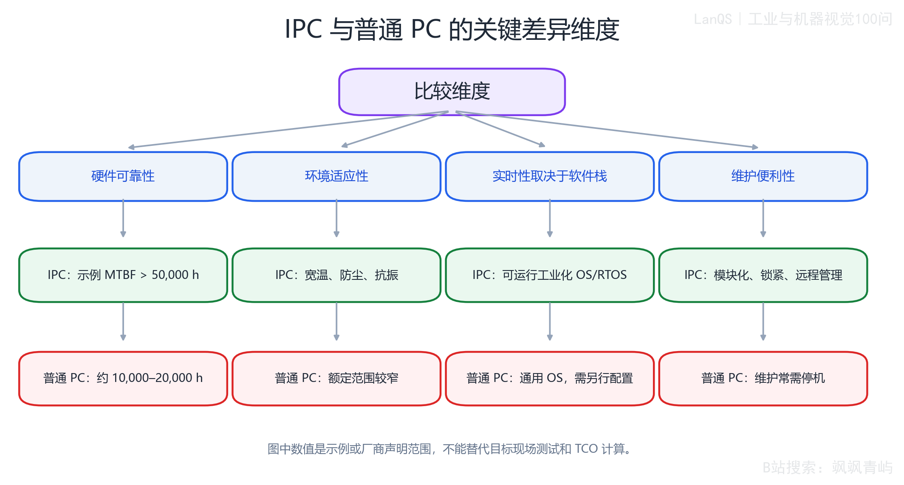</p>
<p align="center">图78-1　IPC 与普通 PC 的四个关键差异维度。</p>

<div class="figure-note">图中绿色框表示 IPC 在对应维度上的典型设计取向，红色框表示普通 PC 的典型取向。MTBF 和温度范围是章节中的示例或常见声明，实时性取决于软件栈，维护性取决于模块化、热插拔和远程管理配置。温和、恒温且无明显振动的质量实验室，未必需要四个维度都采用 IPC 等级；图示用于建立比较框架，不能代替目标现场的环境试验和故障统计。</div>

#### 78.3 项目如何选择 IPC，并核验环境等级？

IPC 的初始采购价通常是普通 PC 的 2～3 倍，单看报价单很容易得出普通 PC 更便宜的结论。工厂项目还要承担设备更换、维修人工、停机损失和长期供货风险。IPC 在同一恶劣环境中的规划使用寿命通常为 5～10 年，普通 PC 可能每 1～2 年就需要更换；如果故障直接停掉瓶颈工位，一次维修的损失可能远高于两台设备的价差。安全风险也应纳入化工、电力等关键应用的评估。

这类比较使用总拥有成本（TCO，Total Cost of Ownership），统计范围覆盖初始设备、安装调试、运行和散热、备件与维修人工、停机损失，以及与设备失效相关的安全风险。下面的算例只把硬件更换和期望停机成本量化，其他项目可在实际模型中继续加入。

设普通 PC 单价为 8,000 个货币单位，IPC 单价为 20,000 个货币单位；普通 PC 在恶劣环境中的规划寿命为 1.5 年，IPC 为 7 年。再设普通 PC 年故障率为 12%，平均修复时间 MTTR（Mean Time To Repair，平均修复时间）为 6 小时；IPC 年故障率为 0.8%，MTTR 为 0.8 小时；产线每停机 1 小时损失 30,000 个货币单位。所有输入都是落在本章所述范围内的说明性假设，并非某个工厂的实测数据。

年期望停机成本可以用故障率、平均修复时间和单位时间停机价值相乘估算：

$$
C_{\mathrm{down}}=r_{\mathrm{fail}}\times MTTR\times C_{\mathrm{hour}}
\tag{78-1}
$$

\(r_{\mathrm{fail}}\) 是每年的故障率，单位为次/年；\(MTTR\) 的单位为小时/次；\(C_{\mathrm{hour}}\) 的单位为货币单位/小时。因此结果 \(C_{\mathrm{down}}\) 的单位为货币单位/年。这个模型假设故障事件的平均影响可以用故障率和平均修复时间表示，未计入备件等待、并发故障、计划维护和安全事故。

普通 PC 的计算为：

$$
C_{\mathrm{down,PC}}
=0.12\times6.0\times30{,}000
=21{,}600\ \text{货币单位/年}
$$

IPC 的计算为：

$$
C_{\mathrm{down,IPC}}
=0.008\times0.8\times30{,}000
=192\ \text{货币单位/年}
$$

在同一组假设下，普通 PC 的年期望停机成本约为 IPC 的 \(21{,}600/192=112.5\) 倍。这个结果说明故障率和维修时间的差异足以影响 TCO，但它不能证明所有工厂都存在 112.5 倍的差距；只要停机价值、故障率或恢复流程变化，结果就会变化。

为了把设备更换也纳入模型，设设备运行 \(t\) 年、单价为 \(p\)、寿命为 \(L\)。按阶梯式更换假设，累计硬件成本为：

$$
H(t)=p\left(\left\lfloor\frac{t}{L}\right\rfloor+1\right)
\tag{78-2}
$$

\(\lfloor\cdot\rfloor\) 表示向下取整，初始时 \(t=0\) 已采购一台设备，每当运行时间达到一个寿命周期就再购置一台。于是，忽略折现、通胀和残值时，累计 TCO 为：

$$
TCO(t)=H(t)+C_{\mathrm{down}}\times t
\tag{78-3}
$$

代入 10 年周期，普通 PC 的累计硬件采购曲线会在约 1.5、3、4.5、6、7.5 和 9 年处阶梯上升；IPC 在初始采购后约 7 年才发生一次更换。计算得到：

| 设备 | 年期望停机成本 | 10 年累计 TCO |
| --- | ---: | ---: |
| 普通 PC | 21,600 | 272,000 |
| IPC | 192 | 41,920 |

脚本以 400 个时间采样点扫描 \(0\sim10\) 年，找到 IPC 累计 TCO 首次不高于普通 PC 的位置，得到约第 0.58 年。普通 PC 故障率从 5%、8%、10%、12% 到 15% 变化时，示例盈亏平衡点仍分别约为 1.4、0.9、0.7、0.6 和 0.5 年，均低于 1.5 年。这里的“敏感性”只说明本组输入下的趋势，不能替代项目自己的故障记录。

这段计算的逻辑可以用下面的伪代码复核。它先按寿命周期计算硬件采购阶梯，再把年度停机成本乘以运行时间，最后逐点寻找两条曲线第一次交叉的位置；改变普通 PC 的故障率后重复同一过程，就得到敏感性结果。

~~~text
time = linspace(0, 10 years, 400 samples)
pc_units  = floor(time / 1.5 years) + 1
ipc_units = floor(time / 7.0 years) + 1
pc_tco  = pc_units * 8000  + (0.12  * 6.0 * 30000) * time
ipc_tco = ipc_units * 20000 + (0.008 * 0.8 * 30000) * time
breakeven = first time where ipc_tco <= pc_tco

for pc_failure_rate in [0.05, 0.08, 0.10, 0.12, 0.15]:
    recompute pc_tco with this rate
    record first crossing time
~~~

伪代码中的时间单位统一为年，故障率以次/年计，MTTR 以小时/次计，停机价值以货币单位/小时计。若项目把维修等待、备件库存或计划停机也纳入模型，就要在相同的时间轴上增加相应成本项，不能把它们混进一个没有来源的“经验系数”。

图 78-2 的左图显示两条累计 TCO 曲线，普通 PC 因硬件更换和停机成本持续上升，IPC 曲线则主要在更换点出现台阶；右图显示普通 PC 故障率假设改变后，盈亏平衡点怎样移动。读图时要同时看曲线斜率和阶梯位置：斜率反映停机成本累积速度，台阶反映设备更换。图中的价格、故障率、MTTR 和停机价值都是说明性输入，曲线和盈亏平衡点是由这些输入精确计算出的结果。

<p align="center">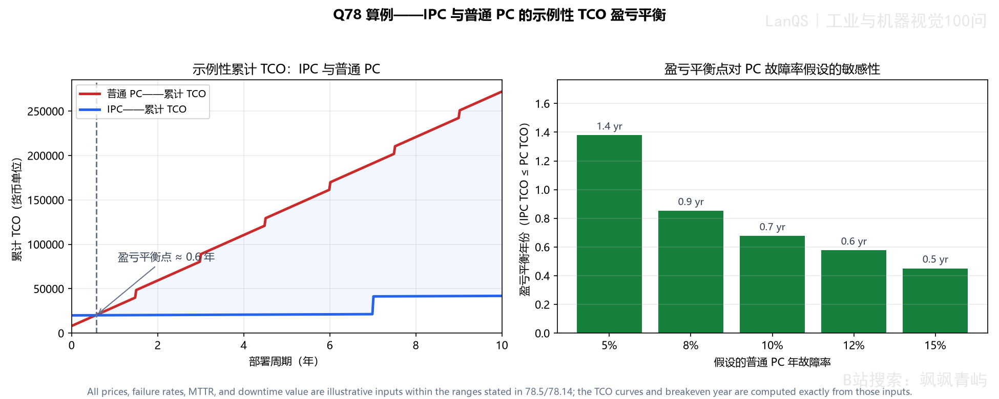</p>
<p align="center">图78-2　IPC 与普通 PC 的说明性 TCO 盈亏平衡算例。</p>

<div class="figure-note">左图中的红线和蓝线分别代表普通 PC 与 IPC 的累计 TCO，虚线标出示例中的盈亏平衡点；右图把普通 PC 年故障率作为变量，比较不同假设下的回收时间。图示仅覆盖硬件更换和期望停机成本，未包含折现、能耗、安装、人工、安全事故和残值，因此实际项目应在相同模型中补充这些项。</div>

选型应从实际安装点开始，现场调查至少要回答六个问题。

1. 设备全年会经历什么温度范围？应测量机柜或设备安装位置的最低、最高温度，并考虑热源附近、空调停机和季节变化；厂区平均温度不能代表机箱内部温度。
2. 粉尘、油雾和清洗方式是什么？打磨、焊接、冷却液和食品车间的冲洗会产生不同污染，需把实际工艺与机箱的 IP 防护等级、过滤和维护周期对应起来。
3. 安装点的振动和冲击有多大？最好在拟安装位置或附近用加速度计测量；控制室墙面与直接固定在冲压机上的机箱，机械条件可能完全不同。
4. 故障和停机的代价是多少？应记录小时产值、可接受故障率、平均修复时间和是否有旁路或缓存工位。
5. 设备准备运行多久？如果计划使用 5 年以上，要确认供应商是否承诺相应的整机、主板、驱动和固件供货周期。
6. 故障后的替换策略是什么？是库存整机直接替换，还是现场更换硬盘、电源等模块，并确认所选平台能够支持远程重刷、热插拔或同型号备件。

若安装点温度稳定在 \(0\sim40\,^\circ\mathrm{C}\) 内，有密闭过滤机柜、可靠 UPS（Uninterruptible Power Supply，不间断电源）和可接受的停机代价，普通 PC 级板卡可能足够。若存在高温、清洗、强振动、高污染或高停机价值，IPC 的额外环境和维护余量更容易转化为实际收益。最后应把上述数据代入 TCO 模型，并对故障率、MTTR、停机价值和寿命做敏感性分析。

IPC 并不自动提供当前代最高算力。为了保证多年供货和备件一致性，IPC 平台的 CPU、GPU 和芯片组可能比消费级市场落后一到两代。重型深度学习推理同时需要工业环境适应性和高吞吐时，项目可能需要在处理器代际、扩展能力、散热和机箱等级之间权衡，必须把模型延迟预算放进选型表。

另一种问题是过度规格化。恒温洁净室、办公室旁的质量实验室或有主动冷却且无明显振动的控制柜，可能一直处在普通 PC 的额定边界内。此时，PC 级板卡配合密闭过滤机柜、UPS 和备件策略也许已经满足需求，把 2～3 倍预算用于 IPC 的全部环境余量未必划算。IPC 的价值应由现场应力和故障后果来判断，项目名称本身没有决定作用。

数据表上的温度范围和 MTBF 只是厂商声明，不能直接当作目标现场的保证。核验时应索取温度、湿度、振动和冲击试验所依据的标准、持续时间、升降温速率和原始报告。例如 IEC 60068《环境试验》系列中的完整资格试验，与短时间实验室浸泡测试表达的证据强度不同。

MTBF 也要问清计算方法。MIL-HDBK-217 或 Telcordia SR-332 这类元器件数量可靠性预测，和实际整机加速寿命试验属于不同证据；前者对器件数量、应力和假设敏感，单独使用时无法说明焊点和连接器在现场振动下的寿命。供应商若只给出一个小时数而不说明方法，选型报告应把这一项标为待核实风险。

投入大批量部署前，可以用少量设备做现场试点和烧机。设备应放进实际机柜、安装在真实位置，记录内部温度、电源轨、看门狗复位、磁盘错误和通信异常；条件允许时覆盖一个完整季节周期。铁路、医疗和工业自动化项目还要核对 EN 50155、IEC 60601、IEC 60068 等与具体行业相关的认证是第三方认证、认可实验室报告，还是厂商自测。

相似客户的长期运行记录可以补充实验室证据，但不能取代现场试点。真正需要确认的是同一 SKU、相近安装方式和相近环境下的故障模式是否可控。

#### 78.4 IPC 在自动化系统中的角色和形态如何选择？

IPC 常位于自动化系统的功能中心，承担数据采集、过程控制、人机界面、视觉处理和通信协调。作为 PLC（Programmable Logic Controller，可编程逻辑控制器）的上位机，它可以汇总设备状态、下发配方或显示报警；作为 SCADA（Supervisory Control and Data Acquisition，监控与数据采集）平台，它负责实时画面、历史数据和生产报表；在机器视觉中，它运行相机采集、图像预处理、模型推理、结果判定、日志和追溯；在工业物联网（IIoT，Industrial Internet of Things）架构中，它还可以作为边缘计算节点，在数据上传云端前完成预处理和本地决策。

这种中心位置解释了为什么可靠性和恢复能力会成为系统要求。IPC 失效可能同时影响产线可视化、质量判定、操作界面和通信协调。若安全停机由独立的硬件安全回路或安全 PLC 负责，IPC 的故障不应被当作安全保护本身；两者的责任边界应在系统设计和验收中明确。

在视觉工位中还要明确数据流和控制流的方向。相机采集到的图像进入预处理和推理，判定结果再通过 PLC 或现场总线驱动剔除机构，同时原始图像、结果和配方版本可能写入追溯系统。IPC 负责协调这些环节，却不应在没有握手、超时和状态确认的情况下直接把算法线程仍在运行解释为执行器已经完成动作。通信异常时，系统应进入预先定义的降级或安全状态。

盒式或机柜式 IPC 适合放入控制柜，尺寸紧凑并便于连接采集卡、网卡和现场总线。面板式 PC 把显示器和触摸屏集成在一起，适合操作员经常查看状态和输入指令的人机界面。嵌入式 IPC 体积更小，可以直接集成到设备内部；加固型 IPC 则面向户外、强振、宽温或高防护需求。

形态要服从环境和操作方式。食品加工的清洗场景可能需要不锈钢外壳以及 IP69K 防护，车载部署重视宽温、抗振和供电瞬态，变电站则更关心隔离、EMC 和雷击浪涌条件。IP65 或 IP69K 是外壳防护等级，不代表内部所有连接器、线缆接头和整机安装方式都已经满足现场要求。

安装空间也会反过来影响散热和维护。盒式设备塞入控制柜后，要检查进出风路径、柜内热源和拆卸空间；面板式设备要确认屏幕可视角度、触摸操作和清洗方式；嵌入式设备要预留存储、天线、线缆弯曲和更换路径。若必须在设备运行时更换部件，应逐项确认哪些部件支持热插拔，哪些更换动作仍需要停机和重新初始化。

工业电源部分通常针对更大的冲击和浪涌设计，使用适合高应力环境的电阻、电容和电感，并具有较大的负载余量。宽范围直流输入可帮助系统承受工厂常见的电压波动，例如约 \(\pm10\%\) 或更宽的变化，但电源设计仍要检查启动电流、瞬态持续时间、接地方式、线缆压降和短时断电后的恢复策略。

EMC（Electromagnetic Compatibility，电磁兼容性）包含两个方向：设备要能在预期电磁环境中正常工作，也不能产生会干扰其他设备的不可接受辐射或传导干扰。IPC 常通过全金属机箱、滤波电路、屏蔽和有规划的接地实现抗扰度与发射控制。EN 55032 主要涉及多媒体设备的发射要求，EN 55035 涉及相应抗扰度要求；具体工业项目还要按设备类别和适用标准确认。即使 IPC 机箱满足某项 EMC 测试，错误的柜内布线、屏蔽层终接或电源接地仍可能使整套系统失效。

电源和 EMC 验证应放到整柜层面。需要记录输入端电压跌落、浪涌、短时中断和启动电流，检查 IPC 重启后是否能自动恢复相机、PLC 和应用状态；对高速相机线、编码器线和电机动力线，应检查走线距离、屏蔽层终接和接地回路。EMC 合规表示设备在指定测试条件下通过了相应验证，现场布线仍需单独检查。

制造业中，IPC 可用于 CNC（Computer Numerical Control，计算机数控）机床控制、机器人协调、装配线监控和机器视觉。电力行业中，它可承担变电站监控、配电自动化和发电机组控制。交通领域包括铁路信号、智能交通系统和车载信息娱乐；医疗领域包括医学影像、实验室自动化和手术机器人。

行业应用会在通用 IPC 要求之外叠加专门约束。医疗电气设备通常要考虑 IEC 60601 的安全和基本性能要求；铁路车载电子设备要考虑 EN 50155 所涉及的宽温、振动和冲击。工业计算机的通用环境等级不能代替这些行业标准，也不能代替项目级安全分析。

同一行业内的安装位置也会改变要求。例如制造车间的视觉工位更关注相机采集、PLC 握手和粉尘散热，变电站更关注电气隔离和浪涌，车载系统还要处理供电变化、车辆振动和启动关机顺序。行业名称只能确定需要查哪些约束，最终配置仍由安装点、数据流和故障后果决定。

生命周期文件还应记录 BIOS 设置、相机参数、PLC 地址、模型文件和网络规则。备件策略要验证“同型号可直接替换”是否真实成立，包括 MAC 地址、存储内容、扩展卡和授权绑定；若必须使用替代型号，应在设备停产前完成兼容性和产线回归测试。

#### 78.5 生命周期、成本模型和发展方向如何评估？

工业设备常按 5～10 年甚至更长周期运行，而普通 PC 的技术更新周期可能只有 1～2 年。生命周期管理要在采购阶段确认供应商的长期供货承诺，常见目标是 5～7 年的产品可获得性，同时确认备件、驱动、固件和操作系统版本是否会持续维护。承诺年限应写入合同或项目文件，并明确停产后的替代型号验证责任。

维护策略还应包括系统镜像、应用安装包、驱动、参数、许可证、网络配置和恢复步骤。模块化设计能降低更换硬盘、电源或扩展卡的停机时间，远程管理能提前发现温度、电压和存储异常，但这些功能都需要在现场网络隔离、权限和安全策略下验证。热插拔能力也要区分“硬件支持”与“整个应用无需重启”，后者必须通过实际故障演练确认。

成本模型还应区分一次性成本与随时间发生的成本。采购和安装通常在项目初期发生，能耗、维护、备件和停机损失随运行时间累计，升级或停产替换则可能在某个年份形成阶跃。把这些项按月或按年展开，可以看出 IPC 的高初始价格究竟由较低故障成本在何时抵消；如果不确定性很大，应给出不同故障率、MTTR 和停机价值下的区间，而非只报一个盈亏平衡年份。

一份可审计的成本模型应把采购、安装调试、能耗和散热、备件、维修人员工时、软件和许可证、停机损失、升级替换以及安全风险分开列出。每个输入都要标记来源：设备价格可以来自报价，故障率和 MTTR 可以来自维护记录，停机价值可以来自产能核算；没有历史数据时才使用明确标注的工程假设。

算例中的 \(C_{\mathrm{down}}\) 只描述故障率和平均修复时间造成的期望停机损失，\(H(t)\) 描述按寿命周期重复购买硬件的成本。真实项目还可能需要加入折现率、通货膨胀、预防性维护、备件库存占用、残值、能耗差异和安全事故概率。算出的盈亏平衡点是决策输入，不能当作保证书；当产线有旁路、缓存或冗余设备时，停机价值应按实际影响重新估计。

趋势还会改变传统 IPC 的边界。边缘 AI 增加了 GPU、NPU、内存和散热需求，虚拟化增加了资源隔离和调度验证，TSN 与 5G 增加了网络配置和安全管理。平台越复杂，生命周期文件、版本回滚和故障分区越重要；未来的性能提升只有在这些运维条件可控时，才会转化为产线收益。

边缘 AI 会提高 IPC 在本地运行复杂模型和实时分析的能力，5G 与 TSN（Time-Sensitive Networking，时间敏感网络）会扩展确定性工业通信，硬件安全芯片和可信执行环境会增强密钥保护与软件隔离。模块化和可配置平台有利于按任务组合处理器、存储、采集和通信模块，能效提升则有助于降低功耗和机柜散热压力。

虚拟化可能让一台物理 IPC 同时运行控制系统和数据分析系统，但两个系统之间必须明确实时性、安全边界、资源隔离和故障恢复策略。更高算力和更复杂的软件也会带来更高的热设计、版本管理和网络安全要求。技术趋势改变的是可用方案范围，不能取消对现场测量、长期运行和故障演练的要求。

### 常见误区

- 只看数据表上的温度和 MTBF 数字，不核对测试方法、持续时间和认证主体。
- 为所有“工业项目”默认配置全规格 IPC，忽略恒温、洁净和低振动场景中的过度规格化成本。
- 认为 IPC 一定拥有当前代最高算力，未把模型推理延迟、GPU/NPU 支持和散热余量纳入比较。
- 没有在实际机柜和安装点做烧机、测温与通信验证，就直接大批量部署。
- 把看门狗当成万能故障恢复机制，忽略电源、散热、存储和应用逻辑故障。
- 用行业平均故障率和停机价值计算 TCO，不使用项目自己的维护记录和产能影响。
- 把硬件热插拔、实时操作系统或 EMC 认证标签，直接当成整套系统无需停机、必然实时或现场一定抗干扰的证明。

### 术语与符号表

| 术语或符号 | 含义 |
| --- | --- |
| IPC | 工业 PC（Industrial PC），面向工厂环境、长期运行和工业接口设计的计算机。 |
| PCB | 印制电路板（Printed Circuit Board），承载器件和电气连接的板卡。 |
| DC / AC | 直流 / 交流；IPC 常见宽范围直流输入，普通 PC 常见交流输入。 |
| PCI / PCIe | 外围设备互连总线及其高速串行版本，用于扩展采集卡、网卡等设备。 |
| ISA | Industry Standard Architecture，部分旧工业平台仍保留的总线。 |
| COM | 常指串行通信端口，用于连接控制器、仪表或传感器。 |
| GPIO | 通用输入输出（General Purpose Input/Output），可读取或驱动离散信号。 |
| RTOS | 实时操作系统，强调在有界时间内提供可预测响应。 |
| 看门狗定时器 | 软件失去响应时由硬件触发复位的计时机制。 |
| MTBF | 平均无故障时间（Mean Time Between Failures），统计意义上的可靠性指标。 |
| MTTR | 平均修复时间（Mean Time To Repair），从故障发生到恢复运行所需的平均时间。 |
| TCO | 总拥有成本（Total Cost of Ownership），覆盖采购、运行、维护、停机和风险的全生命周期成本。 |
| \(C_{\mathrm{down}}\) | 年期望停机成本，单位为货币单位/年。 |
| \(r_{\mathrm{fail}}\) | 年故障率，单位为次/年。 |
| \(C_{\mathrm{hour}}\) | 每小时停机价值，单位为货币单位/小时。 |
| EMC | 电磁兼容性（Electromagnetic Compatibility），包括抗干扰能力和发射控制。 |
| IP 等级 | 外壳防护等级，描述对固体颗粒和液体侵入的防护能力，如 IP65、IP69K。 |
| PLC | 可编程逻辑控制器（Programmable Logic Controller）。 |
| SCADA | 监控与数据采集（Supervisory Control and Data Acquisition）系统。 |
| IIoT | 工业物联网（Industrial Internet of Things）。 |
| TSN | 时间敏感网络，为工业通信提供时间同步和确定性传输能力。 |
| UPS | 不间断电源（Uninterruptible Power Supply），用于缓冲短时断电和电源波动。 |

### 延伸阅读

- IEC 60068《环境试验》系列，用于了解温度、湿度、振动和冲击试验的条件与报告要求。
- EN 50155《铁路应用——机车车辆电子设备》，用于铁路场景的宽温、振动和冲击要求。
- IEC 60601《医用电气设备》系列，用于医疗影像和手术机器人等场景的安全与基本性能要求。
- MIL-HDBK-217 与 Telcordia SR-332，用于理解厂商 MTBF 预测中常见的元器件数量可靠性方法。

---

# 第79问　工业 PC 上运行哪些操作系统？为什么许多工业软件仍然运行在 Windows 上？

一台工业视觉设备通常同时连接相机、采集卡、PLC、现场总线、显示器和数据库。操作系统要负责驱动这些设备、运行图像算法、显示人机界面，还要在长时间无人值守和网络受限的条件下保持可恢复。选择操作系统时，实时性只是一个维度，驱动生态、开发工具、团队能力、认证历史、补丁策略和迁移成本同样会决定项目能否落地。

工业 PC（IPC，Industrial PC）是面向工业环境设计的计算机。它常采用无风扇或过滤风道机箱，抵抗粉尘、湿度、振动和电磁干扰；典型工作温度可覆盖约 \(-10\sim60\,^\circ\mathrm{C}\)，室外或靠近烘箱的型号可能更宽；主板、电源和散热系统按连续无人值守运行规划。操作系统的选择必须和这套硬件、连接设备以及控制任务的时间约束一起考虑。

#### 79.1 工业 PC、操作系统和实时性如何对应？

普通桌面计算机主要针对温度受控的室内环境、较低成本和间歇性使用。IPC 则把连续运行、环境应力和现场维护放在设计前面。无风扇或过滤机箱可以减少粉尘进入，工业级主板和供电系统适应更大的温度、振动和电磁干扰范围，接口也更贴近现场设备。

工业接口是两类设备很容易被忽略的差异。RS-232/485 适合点对点或多点串行通信；CAN（Controller Area Network，控制器局域网）用于分布式控制；Profibus（Process Field Bus，过程现场总线）仍存在于许多 PLC 和驱动网络；EtherCAT（Ethernet for Control Automation Technology）用于高速、确定性的运动和 I/O 总线。IPC 可以通过这些接口接入相机触发、运动控制器、传感器和执行器，减少消费级转接设备带来的驱动、固定和维护问题。

工业设备还需要长期供货和长尾支持。产线一旦验收，往往要连续运行多年，甚至超过十年；中途更换主板或操作系统不仅是买一台新电脑，还可能牵涉驱动、应用、参数、认证和现场培训重新验证。因此，长期可获得性和可维护性常常比单次峰值性能更影响采购决定。

工业 PC 上的操作系统大致分为几类，每一类对应确定性、生态、成本和可维护性的不同取舍。

Windows 系统包括 Windows Embedded Standard、Windows IoT Enterprise，以及 Windows 10/11 IoT Enterprise LTSC（Long-Term Servicing Channel，长期服务频道）。IoT 和 LTSC 版本面向嵌入式或工业部署，功能变动较少，支持周期比普通消费版更适合长期设备。

Linux 系统既包括 Ubuntu Core、Debian、CentOS 这类通用发行版，也包括用 Yocto Project 构建系统生成的定制镜像。Linux 的开放源代码和可裁剪性允许厂商只保留设备真正需要的组件，降低存储占用和潜在攻击面；相应地，镜像、内核、驱动和安全补丁也要由项目团队长期维护。

实时操作系统（RTOS，Real-Time Operating System）包括 VxWorks、QNX、FreeRTOS 和 μC/OS。它们围绕有界、可预测的响应时间设计，适用于运动控制、机器人控制、航空航天和部分安全关键设备。RTOS 的资源占用较小，但可用库、开发工具和现场维护人员可能不如 Windows 或 Linux 丰富。

还有与厂商运行环境紧密结合的工业平台。例如 Siemens 的 SIMATIC WinCC、Rockwell Automation 的 FactoryTalk 通常运行在 Windows 之上，但厂商控制了应用、驱动和工程工具的整体组合，因此选型时应把它们作为完整平台评估。遗留设备中还可能存在 DOS 或 Windows XP，它们继续运行多半是因为旧软件或采集卡没有受支持的替代品；这种兼容性是运维风险，不是当前项目的推荐方案。

操作系统分类还要与任务的时间语义对应。所谓实时，不是指画面刷新快，而是关键任务能否在规定上界内得到调度；软实时允许少量迟到并通过缓存或重试消化，硬实时则把超时视为控制失败。工业视觉中的图像分析可能是软实时，安全联锁和运动控制可能是硬实时，同一台 IPC 也可能需要把二者隔离到不同服务、核心或操作系统环境中。

#### 79.2 Windows、Linux 和 RTOS 怎样选择与迁移？

Windows 在工业控制领域的优势来自多年积累。大量自动化软件和视觉软件已经围绕 Windows 开发，设备厂商也通常优先提供 Windows 驱动。Siemens WinCC、Rockwell FactoryTalk、Schneider EcoStruxure 等工业软件的成熟功能、现场案例和既有配置，降低了新项目的集成不确定性。

开发工具进一步放大了这种优势。Visual Studio、.NET Framework 和 ActiveX（基于 Microsoft 组件对象模型的一类组件技术）让工程师能够复用现有库、界面和通信组件。SCADA（Supervisory Control and Data Acquisition，监控与数据采集）和 HMI（Human-Machine Interface，人机界面）往往需要大量画面、报警、趋势和权限配置，Windows 图形界面和工具链能减少培训与开发成本。

硬件兼容性也很关键。工业采集卡、数据采集板、相机接口和通信模块种类繁多，供应商通常先发布 Windows 驱动。Windows IoT Enterprise LTSC 的支持窗口可达到约十年，这与工业设备的生命周期更接近。操作员熟悉 Windows 风格的交互界面，既有系统也可能已经通过客户或行业认证，继续使用可以减少停线和重新验证。

这些优势不包含硬实时保证，也不自动包含安全加固。Windows 项目仍需选择适合的版本，关闭无关服务，限制账户权限，使用应用白名单或类似控制机制，制定补丁与回滚流程，并配置看门狗、日志和故障恢复。平均响应很快的通用系统，仍可能在后台更新、磁盘 I/O 或驱动中断时出现不可预期的尾部延迟。

Windows 的兼容性也有代价。旧版 ActiveX、COM 组件或专用驱动可能依赖特定系统版本和用户权限；把应用从普通桌面版搬到 LTSC 或另一台 IPC 后，接口仍可能因注册表、服务启动顺序、显卡驱动或许可证绑定而失效。上线前应把全新安装、断电重启、网络未就绪和权限受限都纳入验收，而不是只在开发人员已配置好的工作站上运行一次。

Linux 适合需要定制、批量部署、边缘计算和开放工具链的系统。厂商可以从最小镜像开始，只加入相机 SDK、推理运行时、通信服务和必要的诊断工具，减少不需要的服务和存储占用。Linux 没有按设备收取的通用操作系统授权费，在大量边缘节点上可能形成明显的成本差异；开放源代码也让团队能够审计和修改系统，但只有持续维护和及时打补丁时，安全优势才成立。

PREEMPT_RT 是一组提高 Linux 内核可抢占性、降低调度延迟的实时补丁。它可以帮助 Linux 满足软实时或部分中等确定性任务，但不能把所有 Linux 应用自动变成硬实时系统。具体延迟仍取决于内核配置、驱动、CPU 电源状态、DMA、网络和负载。

RTOS 的边界更明确。运动控制、机器人控制或其他硬实时任务需要在规定的时间上界内响应，通用操作系统的调度器通常无法提供这种保证；RTOS 以较小的资源占用和更简单的运行时换取确定性。代价是软件生态较窄，团队需要掌握专用工具和调试方式，现场维护也要有对应能力。

Linux 与 RTOS 之间也不是简单的高低关系。Linux 适合连接网络、文件系统、容器和视觉算法等复杂软件，PREEMPT_RT 可以改善调度；RTOS 更适合少量任务和明确的响应边界。若一个系统同时包含相机采集、机器学习推理、操作员界面和运动控制，应明确哪些任务必须满足硬实时，哪些任务可以由 Linux 或 Windows 承担，再设计进程间通信和故障隔离。

图 79-1 把操作系统选择中最先要问的问题画成决策树：先判断硬实时还是软实时，再在软实时分支比较驱动、商业支持、开发资源和开放定制需求。阅读时不要把终点当成无条件推荐，终点之后还要核对具体硬件驱动、人员能力、认证路径和现场负载。

<p align="center">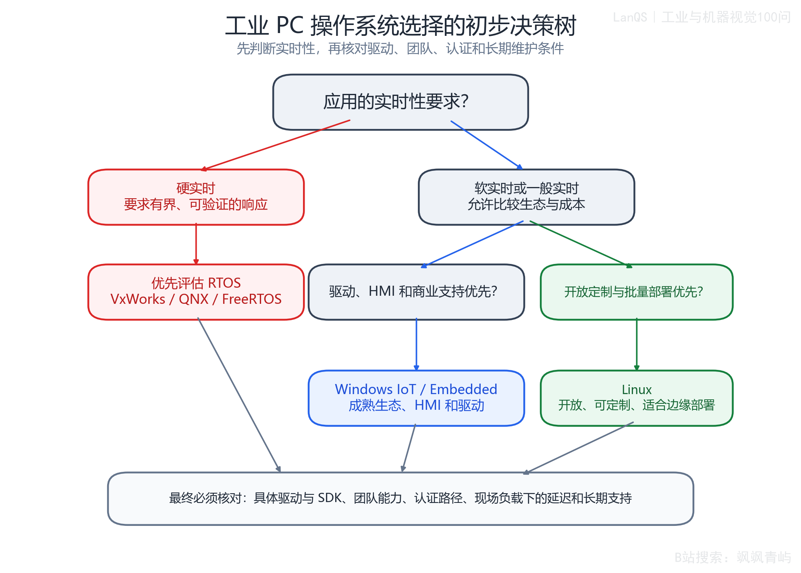</p>
<p align="center">图79-1　按实时性、驱动、团队和维护条件选择操作系统。</p>

<div class="figure-note">决策树左支表示硬实时要求，应优先评估 RTOS；右支表示毫秒级软实时或一般实时任务，再比较 Windows IoT/Embedded 与 Linux。图中的“优先评估”不是验收结论，实际系统仍须使用目标相机、总线、驱动和负载测量最坏延迟，并核对长期支持与认证条件。</div>

“切换成本”指把已有软件栈从一个平台迁移到另一个平台所需的工程、培训、验证和重新认证工作量。它不只是团队习惯造成的阻力。设一套单工位视觉系统使用一台 GigE 相机、PLC/OPC UA 链路和操作员 HMI，需要比较两种方案：把现有 Windows 软件栈迁移到 Linux，或继续使用 Windows 并完成加固。

OPC UA（OPC Unified Architecture）是跨平台的工业数据交换架构；EtherCAT 是现场总线。这里的工作量用人日表示，均为单工位规划级假设，不是供应商报价。迁移侧包括驱动和 SDK 验证、现场总线与 PLC 链路、HMI/SCADA 画面重建、视觉算法库重新链接、验证与重新认证、安全流程；Windows 侧则包括较少的接口验证、重新基线测试和安全加固。

| 工作类别 | 迁移到 Linux（人日） | 继续使用 Windows 并加固（人日） |
| --- | ---: | ---: |
| 相机 SDK / 驱动验证 | 18 | 2 |
| 现场总线与 PLC 链路 | 14 | 1 |
| HMI / SCADA 画面重建 | 30 | 1 |
| 视觉算法库重新链接 | 10 | 0 |
| 验证与重新认证 | 22 | 8 |
| 安全加固与补丁流程 | 6 | 12 |
| 合计 | 100 | 24 |

把各类别人日相加即可得到：

$$
E_{\mathrm{port}}=18+14+30+10+22+6=100\ \text{人日}
\tag{79-1}
$$

$$
E_{\mathrm{harden}}=2+1+1+0+8+12=24\ \text{人日}
\tag{79-2}
$$

$$
\Delta E=E_{\mathrm{port}}-E_{\mathrm{harden}}=76\ \text{人日}
\tag{79-3}
$$

在这个示例中，迁移工作量约为加固工作量的 \(100/24\approx4.2\) 倍，差异主要集中在 HMI 重建和重新验证。代码还检查了两个关系：迁移侧最大的单项是 HMI 重建，Windows 侧最大的单项是安全加固与补丁流程。这些检查只保证示例没有违背本章的定性判断，不会把规划假设变成实测数据。

伪代码可以复现汇总逻辑：

~~~text
port_to_linux = [18, 14, 30, 10, 22, 6]
harden_windows = [2, 1, 1, 0, 8, 12]
port_total = sum(port_to_linux)       # 100 person-days
harden_total = sum(harden_windows)    # 24 person-days
delta = port_total - harden_total     # 76 person-days
assert max_index(port_to_linux) == "HMI rebuild"
assert max(harden_windows) == harden_windows["security hardening"]
~~~

这个算例能把“迁移很贵”拆成可审核的预算项，不能证明所有项目都存在 4.2 倍差距。相机数量、画面规模、算法库、认证等级、团队经验和已有 Linux 支持都会改变每个数字。项目决定迁移前，应按实际设备清单和验证范围重做表格。

图 79-2 的左侧按类别展示两种方案的人日构成，右侧比较总量。读图时先找最大柱，判断成本集中在哪个环节，再看总量差异；不能仅凭总人日判断技术优劣，因为 Windows 侧的安全加固工作仍然是持续责任。

<p align="center">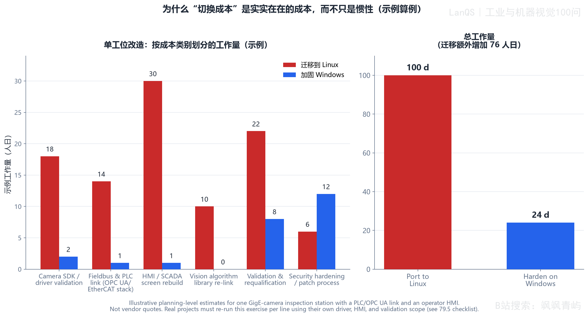</p>
<p align="center">图79-2　Windows 视觉软件栈迁移与加固的示例工作量。</p>

<div class="figure-note">图中的六个类别和 100 对 24 的总量对应表 79-1。人日是单工位的规划级示例，不能直接当作报价；真实项目应重新盘点驱动、HMI 画面、现场总线、算法库、认证和安全流程。右侧较小的 Windows 柱不表示安全工作可以一次完成，补丁和重新基线测试仍需进入生命周期计划。</div>

#### 79.3 如何验证实时性、长期支持和失效边界？

Windows 的持续存在，一个重要原因是历史路径依赖。20 世纪八九十年代，工业控制逐渐从专用硬件迁移到通用 PC，Windows 恰好是当时最普遍的 PC 操作系统。几十年积累下来的代码、驱动、工程工具、配置文件和培训体系，形成了巨大的既有资产。新设备需要与旧产线互操作，保留 Windows 便能减少一次性重写。

互操作协议也强化了这种关系。COM（Component Object Model，组件对象模型）、DCOM（Distributed Component Object Model，分布式组件对象模型）、OPC（早期称为 OLE for Process Control）和 ActiveX 长期作为不同厂商软件之间的连接方式。OPC UA 已经提供了更具平台独立性的路径，但大量旧设备仍依赖原有 COM 生态，所以历史上的 OPC 兼容性和 Windows 兼容性长期紧密相连。

开发人员和维护人员的技能结构同样重要。Visual Basic、C++、.NET 和 Windows 管理工具在工业软件团队中使用广泛，迁移到 Linux 需要重新培训工程和现场维护人员。工业硬件高度异构，每个相机、采集卡、现场总线板卡和 I/O 模块都可能有独立驱动；Windows 的驱动覆盖面通常更深，Linux 支持需要逐项确认。

安全关键行业还要承担认证和连续性成本。核电、化工等场景中，已经通过安全或客户验收的 Windows 软件包含一部分已经支付的工程价值；迁移到另一平台可能触发重新认证、重新验证和客户复审。操作员熟悉 Windows 风格界面，厂商也围绕 Windows 建立了授权、支持和培训业务，这些技术、人员和商业因素相互加强。

团队考虑从 Windows 迁移到 Linux 时，至少应完成以下核查：

1. 为每一台相机、采集卡、现场总线和 I/O 模块确认具体发行版、内核版本和仍在维护的 Linux 驱动或 SDK。
2. 核实 HMI/SCADA 是否有 Linux 原生运行时、Web 替代路径，还是必须完全重写。
3. 评估工程师和夜班维护人员能否在生产压力下定位 Linux、驱动和内核问题。
4. 要求相机、PLC、机器人控制器和安全系统供应商书面确认目标系统、版本和支持周期。
5. 画出监管认证、客户验收和现场培训的时间路径。
6. 在迁移前定义实时性测量方法和通过标准，而不是部署后才发现调度延迟不满足要求。

这份清单的作用是找到风险集中在哪里，而不是替团队预先决定 Windows 或 Linux。

迁移还要考虑回退路径。新 Linux 站点应保留原 Windows 镜像、参数、驱动安装包和验收数据，先在旁路设备或非瓶颈工位运行，再逐步切换。若发现相机驱动、HMI 或认证工作量超出计划，能够恢复到原平台本身就是产线连续性的要求。容器可以封装应用依赖，却无法自动封装内核驱动、采集卡时序和认证责任。

虚拟化让 Windows 和 Linux 可以在一台 IPC 上分隔运行，容器化则允许多个服务并列部署而不必为每个服务复制完整操作系统。对于需要同时保留既有 HMI 和新边缘服务的系统，混合架构可以降低一次性迁移压力，但资源隔离、网络边界和故障恢复必须验证。

边缘计算推动轻量 Linux 和 RTOS 进入更多低功耗节点。机器人和高速运动控制提高了对确定性调度的要求，Windows 侧也出现了 RTX 等实时扩展，把更强的实时子系统与通用 Windows 共存。扩展并不等于自动满足要求，仍需在具体硬件和驱动组合上测量。

工业网络安全正在推动最小化镜像、补丁管理、访问控制和硬件信任根。Docker 容器引擎、Kubernetes 容器编排平台以及 EdgeX Foundry 等开放边缘项目逐步进入工业部署。应用与底层操作系统的耦合因此降低，跨平台迁移可能更容易，但相机驱动、现场总线、实时性和认证仍然是最难抽象的部分。

“使用 RTOS”或“使用 PREEMPT_RT Linux”只是方案名称，不是测量结果。验证应在实际控制循环、目标硬件和代表性负载下进行。对 PREEMPT_RT Linux，cyclictest 可以作为起点，但应运行数小时，最好覆盖完整生产班次，并同时加载网络通信、磁盘 I/O、GPU 或视觉推理、USB 和现场总线中断。

实时性要报告尾部延迟，而非只给平均值。假设某系统平均调度延迟为 \(40\ \mu\mathrm{s}\)，但在负载下每小时出现一次 \(8\ \mathrm{ms}\) 的尖峰；若任务要求严格的有界响应，这个尖峰可能已经使系统不合格。测量结果至少应包括 P99.9、P99.99 等高分位数和绝对最大离群值，并记录测试时的负载、相机采集卡、DMA 设备、驱动、内核和固件版本。

软件和固件变化后要重新测量。内核、驱动、视觉模型、GPU 驱动或现场总线配置的改变，都可能改变中断和调度行为。若采用 Windows 加实时扩展，也要在同样的代表性负载下验证实时子系统与通用系统之间的隔离是否保持。

一个完整的实时性声明应同时写清指标、负载条件和硬件/驱动版本，例如“在某型号相机、某现场总线驱动和规定网络负载下，P99.99 调度延迟小于某阈值”。只有这样，测试结果才可在版本升级和现场复现。

测量还要避免把工具本身当成控制链路的一部分。cyclictest 可以观察调度延迟，但它不等于相机触发到 PLC 输出的完整延迟；视觉应用应在实际控制循环中记录时间戳，再将系统级结果与内核级结果对照。若硬实时任务与普通应用共享 CPU、内存或中断，测试还应检查隔离策略是否在负载变化后仍然有效。

加固后的 Windows 可以关闭无关服务、限制账户、使用 AppLocker 等机制减少攻击面，但它仍然是一个通用操作系统，通常保留比最小化 Linux 镜像更多的组件。锁定后的系统也不能停止补丁管理；一个长期不更新的系统，即使日常操作很稳定，仍可能暴露未修复组件的漏洞。工业现场担心补丁破坏已验证环境，这种延迟本身就是运维风险。

RT Linux 或 RTOS 的技术确定性更强，却需要更稀缺的支持能力。深夜出现调度回归时，团队是否能定位内核配置、驱动中断和负载变化，直接影响平均修复时间。技术上更强的方案，如果现场没有能维护它的人，实际运营风险可能更高。

认证也不会随操作系统自动转移。已经通过安全或法规认证的 Windows 系统，迁移后可能需要重新验证；一套性能更好的新平台若没有相同认证路径，不能仅凭技术指标替代合规证据。Linux 的开放源代码同样不是安全保证，没人维护的定制 Yocto 镜像可能和未打补丁的 Windows 一样暴露风险。

因此，平台决策同时包含技术债务和组织能力。Windows 的既有生态降低了迁移和培训成本，但需要长期补丁与攻击面管理；Linux 的可裁剪性降低了运行时负担，却要求团队维护镜像、内核和驱动；RTOS 提供确定性，却要求更专门的工具与现场支持。任何一项优势都必须配套责任人、版本策略和可执行的恢复流程。

### 常见误区

- 把“实时”当成操作系统名称或勾选项，不在目标负载下测量最坏延迟。
- 在空载系统上跑 benchmark，忽略实际网络、磁盘、GPU、USB 和现场总线中断。
- 认为加固 Windows 已经等同于最小化 Linux，因而不再制定补丁和回滚流程。
- 低估 HMI/SCADA 重建、驱动替换和重新认证在迁移中的工作量。
- 只确认“支持 Linux”，却没有确认具体发行版、内核版本、设备 SDK 和支持周期。
- 迁移前没有评估夜班维护团队的 Linux 和实时系统排障能力。
- 用“Linux 更安全”或“Windows 更稳定”替代项目级的漏洞、延迟、故障率和恢复时间证据。

### 术语与符号表

| 术语或符号 | 含义 |
| --- | --- |
| IPC | 工业 PC（Industrial PC），面向连续运行、现场环境和工业接口设计的计算机。 |
| RTOS | 实时操作系统（Real-Time Operating System），为时间关键任务提供有界、可预测响应的系统。 |
| PREEMPT_RT | 提高 Linux 内核可抢占性、降低最坏调度延迟的实时补丁集。 |
| Windows IoT Enterprise LTSC | 面向嵌入式和工业部署、具有长期服务周期的 Windows 版本。 |
| HMI | 人机界面（Human-Machine Interface），操作员监控和控制过程的软件层。 |
| SCADA | 监控与数据采集（Supervisory Control and Data Acquisition）系统。 |
| SDK | 软件开发工具包（Software Development Kit），通常包含接口库、驱动、示例和开发文档。 |
| OPC / OPC UA | 工业数据交换标准族；OPC UA 是更具平台独立性的架构。 |
| COM / DCOM | Microsoft 的组件对象模型及其分布式版本，历史上广泛用于工业软件互操作。 |
| Yocto Project | 构建面向特定嵌入式硬件的定制 Linux 镜像的开放框架。 |
| GigE | 基于千兆以太网的相机接口类别。 |
| cyclictest | 常用于在 Linux 上测量调度延迟的工具。 |
| P99.9 / P99.99 | 延迟样本的高分位数，用于观察尾部响应；不等于绝对最大值。 |
| \(E_{\mathrm{port}}\) | 迁移到 Linux 的规划工作量，单位为人日。 |
| \(E_{\mathrm{harden}}\) | 继续使用 Windows 并加固的规划工作量，单位为人日。 |
| 切换成本 | 将既有软件栈迁移到另一操作系统所需的工程、培训、验证和认证成本。 |

### 延伸阅读

- Wind River VxWorks 文档，了解硬实时 RTOS 的调度和可靠性设计。
- Linux Foundation PREEMPT_RT 项目文档，了解实时 Linux 的内核支持和配置。
- OPC Foundation OPC UA 规范概览，了解跨平台工业通信架构。
- Microsoft Windows IoT Enterprise LTSC 文档，核对具体版本的支持周期和部署限制。

---

# 第80问　视觉系统必须 7×24 运行，如何设计自动启动和看门狗机制？

一套无人值守的工业视觉系统可能连续运行数周或数月。风扇积尘、连接器松动、存储介质磨损、软件内存泄漏、电磁干扰、温度变化和网络短时中断，都可能在几天后才表现出来。若系统只能依靠值班人员发现黑屏或停线，所谓 7×24 运行就仍然是人工看守系统。

自动启动解决的是“设备重新上电或重启后能否回到运行状态”；看门狗解决的是“设备还通电，但进程、服务或整机已经停止有效工作时，能否被发现并恢复”。完整方案还要包括功能状态监控、分层恢复、数据保护、故障诊断和故障注入验证。目标是让不可避免的中断尽快被发现、影响范围受控，并在有明确边界的时间内恢复到安全状态。

#### 80.1 自动启动和看门狗分别解决什么问题？

间歇运行的程序每天重启一次，可能掩盖内存泄漏、句柄累积、日志写满和缓存未释放等问题；连续运行数周后，这些缓慢积累的状态会让采图线程卡住、算法延迟上升或磁盘写入失败。工厂中的温度、振动、电磁干扰和网络波动也可能让相机、PLC 或存储设备短时失联。

这些故障不一定表现为进程退出。程序可能仍然占用 CPU，窗口也仍然显示“在线”，但采不到新图、队列不再消费，或者算法一直输出同一个结果。可靠性设计要把“检测到异常、限制影响、恢复服务、保存证据”做成系统行为，不能只把重新打开程序当成恢复。

硬件老化和软件积累还会互相放大。风扇堵塞会使温度缓慢上升，温度又会增加降频和通信超时；存储介质磨损可能先表现为日志写入变慢，随后影响结果落盘；连接器在振动下间歇断开，应用若没有重连状态机就可能一直等待。7×24 设计要为这些渐变和瞬时故障同时准备观测量，不能只测试一次“程序能否启动”。

看门狗（watchdog）是监视系统是否持续发送有效心跳，并在超时后触发恢复的硬件或软件机制。系统正常运行时，会以小于超时时间的间隔发送心跳信号；如果超过配置的时间仍没有心跳，看门狗就认为系统可能死锁、崩溃、陷入无限循环，或因 CPU 饥饿而失去响应，随后触发重启或升级恢复动作。

它的机制可以理解为两个时间量的竞争。设心跳相邻两次到达的时间间隔为 \(\Delta t_{\mathrm{hb}}\)，看门狗超时时间为 \(T\)。正常条件要求：

$$
\Delta t_{\mathrm{hb}}<T
\tag{80-1}
$$

心跳每次到达都会刷新计时器；只要刷新速度快于 \(T\)，看门狗保持静默。进程崩溃、线程死锁、无限循环、长时间阻塞或 CPU 被其他任务占满时，心跳停止，计时器到达 \(T\) 后执行复位。看门狗不需要理解故障原因，只判断在规定时间内是否收到信号，这使它能覆盖多种无响应故障。

心跳的来源必须与实际工作有关。若主循环只要执行到某一行就递增计数器，即使采图、推理或通信已经停止，心跳仍可能正常。可靠的应用心跳应包含关键线程进度、队列消费、相机帧号、结果写入和通信确认；功能正确性还要由独立的合理性检查补充。

图 80-1 把心跳与超时复位画成时间线。读图时观察绿色心跳之间的间隔与 \(T\) 的关系，再看最后一次心跳停止后，红色超时区间如何触发复位。图中表达的是“仍在发送心跳”与“实际工作正确”之间的时间机制，不是算法质量证明。

<p align="center">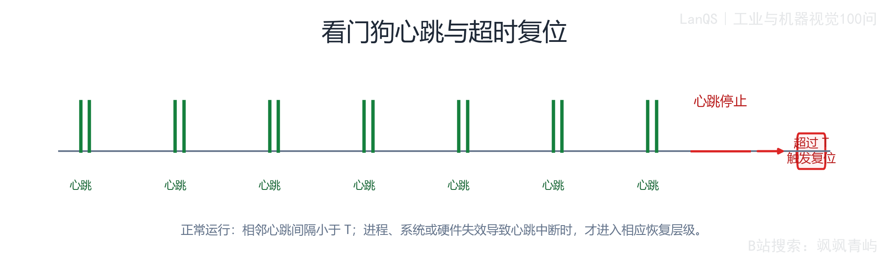</p>
<p align="center">图80-1　看门狗心跳与超时复位机制。</p>

<div class="figure-note">正常运行时，心跳间隔应小于超时时间 \(T\)；心跳停止并持续超过 \(T\) 后，看门狗触发复位。图中只说明“系统还在报到”，不能说明报到期间输出一定正确，因此需要结合采图、推理、通信和结果合理性监控。</div>

#### 80.2 硬件、软件和分层看门狗如何组合？

硬件看门狗通常是独立于 CPU 和操作系统的定时器芯片，例如 MAX813 或 TLC7705，通过专用引脚连接到主控制器的复位回路。只要供电和复位路径仍然有效，即使操作系统内核崩溃、驱动把 CPU 卡死，硬件计时器仍可能在超时后拉起复位信号。这是它处理整机冻结的能力来源。

软件看门狗运行在操作系统、服务或应用内部，可以检查某个进程、线程、队列、相机连接或业务状态。它知道“采集线程没有更新帧号”与“通信线程没有收到 PLC 应答”之间的区别，因而能先重启受影响的线程或服务，恢复范围小、诊断信息多。但软件看门狗依赖操作系统和调度器；若内核已经死锁，或者看门狗进程与被监控程序一起卡住，它可能无法执行。

两者的优点分别是独立性与可观测性。硬件看门狗适合作为最终兜底，软件看门狗适合更快、更细粒度的恢复。工业视觉系统通常把二者分层使用：软件层先做应用级恢复，硬件层只在上层无法继续报到时复位整机。选择超时时间时还要考虑初始化、相机重连、配方切换和日志写入等合法慢路径；过短会误复位，过长会延迟故障发现。

硬件看门狗也要设计复位后的行为。整机复位可能让相机重新枚举、PLC 重新建立连接，应用若在设备尚未稳定时立即发送剔除信号，可能造成错误动作。因此复位后应经过硬件自检、设备连接确认、配方和模型校验、参考件检查，再将工位状态切换为允许生产。看门狗解决的是恢复触发，不替代恢复后的安全判定。

一个可维护的架构通常包含硬件层、操作系统层和应用层。硬件层可将超时设在约 1～10 秒范围内，作为操作系统完全无响应时的最后恢复；具体值必须由系统启动、驱动初始化和合法最长周期测量决定。Linux 可用 systemd 的服务监控和看门狗支持，Windows 可用服务控制管理器（Service Control Manager）监控和重启关键服务。

应用层负责检查视觉系统内部模块，例如图像采集线程、算法处理线程和通信线程。每个模块定期上报状态，应用内的看门狗管理器根据帧号、队列长度、处理时间和通信确认判断是否仍在工作。一个采集线程失效时，可以只重新初始化相机或重启采集线程，避免丢弃其他已经完成的结果。

分层恢复可以按影响范围升级：

1. 线程或设备级故障：重启失效线程，或重新初始化相机、采集卡和 PLC 链路。
2. 应用级故障：保存最近状态，重启整个视觉应用并重新加载检查点。
3. 系统级故障：硬件看门狗复位 IPC，系统服务管理器自动启动应用。
4. 硬件级故障：在有冗余设计时切换到热备设备；没有冗余时进入安全停机并请求人工处理。

图 80-2 展示从异常判断到三层恢复的路径。读图时沿着“线程级、应用级、系统级”三个分支比较恢复范围和状态重载深度：越靠后影响越大、恢复越慢，但能覆盖更严重的故障。每层都应配置最大重试次数、升级条件、当前工件隔离规则和恢复日志。

<p align="center">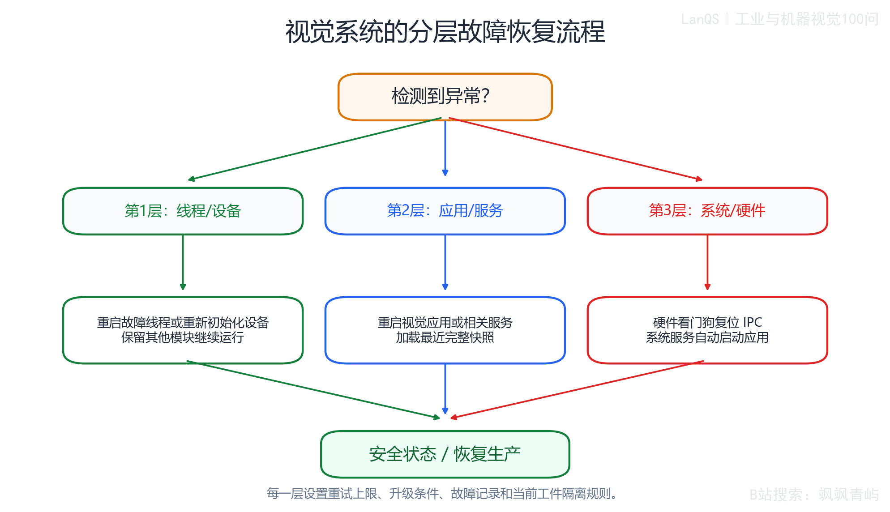</p>
<p align="center">图80-2　视觉系统的分层故障恢复流程。</p>

<div class="figure-note">第 1 层只处理故障线程或设备，第 2 层重启应用并加载最近检查点，第 3 层由硬件看门狗触发系统级复位，系统服务再自动启动应用。三条路径最终都要回到安全状态或恢复生产；连续失败时必须升级或停机，不能用无限重启掩盖正在恶化的硬件问题。</div>

#### 80.3 Windows、Linux 和自动启动怎样落地？

Windows 上常见的自动启动方式有三种。Windows 服务的可靠性最高：可设置自动启动、延迟启动和失败后自动重启，不需要用户登录，系统本身负责监督服务生命周期。视觉后台服务应与桌面 HMI 分离，让采集和判定不依赖某个用户会话。

任务计划程序适合需要更复杂触发条件的场景。它可以在系统启动时运行，设置启动延迟，等待网络或设备条件满足，并配置失败重试。启动延迟可以避免磁盘、网络和驱动在开机瞬间同时初始化造成资源争用。实际工程中可以让 Windows 服务负责日常运行，任务计划程序作为服务注册被破坏或启动失败时的补充路径。

启动文件夹中的快捷方式最简单，但最脆弱。它依赖用户登录和桌面会话，容易受安全软件、用户配置、更新弹窗和权限变化影响，也不能表达复杂的依赖和失败恢复逻辑。它适合临时工具，不应作为无人值守视觉服务的唯一启动机制。

注册服务可以使用 sc create，或在 C# 中实现 ServiceBase。无论采用哪种方式，都要在未登录、断电重启、网络尚未就绪、相机仍在复位以及服务异常退出的情况下测试。自动登录并不等同于可靠自动启动，因为登录过程本身会引入密码、策略和桌面状态依赖。

后台服务和 HMI 应分开处理。服务负责采集、判定、通信和日志，HMI 负责操作员交互；如果 HMI 崩溃，服务仍应能够把工位置于安全状态并记录异常。服务启动后还要等待相机、PLC 和数据库达到可用状态，不能把“进程已经启动”当作“系统已经准备好”。

现代 Linux 通常使用 systemd 管理服务。可以在 /etc/systemd/system/vision-system.service 创建如下单元文件：

~~~ini
[Unit]
Description=Industrial Vision System
After=network.target
Wants=network.target

[Service]
Type=simple
User=visionuser
ExecStart=/opt/vision-system/bin/vision-app
Restart=always
RestartSec=10
WatchdogSec=30
NotifyAccess=all

[Install]
WantedBy=multi-user.target
~~~

其中，After=network.target 和 Wants=network.target 表示网络初始化关系；User=visionuser 让应用以专用低权限账户运行；ExecStart 指定应用入口；Restart=always 让服务退出后自动重启；RestartSec=10 让 systemd 等待 10 秒，给设备重置和端口释放留出时间；WatchdogSec=30 要求应用定期通过 sd_notify(WATCHDOG=1) 报告心跳；NotifyAccess=all 允许服务进程发送通知。启动和启用服务：

~~~bash
sudo systemctl daemon-reload
sudo systemctl enable vision-system.service
sudo systemctl start vision-system.service
~~~

enable 负责把服务接入开机目标，start 负责立即启动；二者含义不同。服务文件还应根据实际设备补充工作目录、环境变量、设备依赖、日志输出、失败限流和权限规则。Restart=always 只能处理进程退出或 systemd 判定的服务故障，不能替代应用内部的功能健康检查。

WatchdogSec=30 是配置示例，具体超时应从现场数据取得。应在实际产品、光照、配方切换和产线负载下记录一个或多个完整班次，观察心跳周期的 p99、p99.9 和合法最大值，覆盖大量目标、磁盘日志突发、热降频及其他进程争用。超时时间要高于合法最慢路径并保留裕量；可以先取观测到的合法最坏周期的 1.5～3 倍，再用故障注入检验发现速度。这个范围只是调参起点，不构成通用标准。

平均周期不足以代表合法慢路径，过大的经验值又会延迟真实挂死的发现。产品配方、硬件、模型、驱动或系统负载发生变化后，应重新测量并复核 (T)，不能继续沿用旧值。

配置中还要防止故障重启风暴。若应用因为端口占用、相机未释放或配置错误反复退出，Restart=always 会连续拉起它，造成日志快速增长、设备不断重新初始化和 CPU 资源浪费。应设置失败计数、退避或启动限流，在超过阈值后发出告警并进入待人工处理状态。重启延迟用于等待瞬态条件消失，不能代替对根因的诊断。

#### 80.4 状态监控、数据保护和超时参数怎样设计？

资源监控关注 CPU、内存、磁盘空间、温度、网络带宽和队列深度。阈值告警应在硬故障前发出，例如内存长期上升、磁盘接近写满或温度持续接近降频边界。只监控资源还不够，因为资源看起来正常时，业务线程也可能已经停止。

功能监控应记录采图帧率、触发响应、算法处理延迟、结果写入速度、PLC 心跳、通信往返时间和相机连接状态。一个系统可能“在线”且 CPU 利用率正常，却一直返回同一帧或漏写结果，因此功能指标必须独立于进程存活状态。

日志建议分为 DEBUG、INFO、WARN 和 ERROR 等级，记录启动、停止、重连、配置变更、看门狗触发、恢复层级和异常码。每条关键记录至少应能关联工位号、设备版本、配方、工件号和时间戳。日志要有轮转和保留周期，磁盘将满本身也必须成为监控事件。

远程监控可通过 SNMP（Simple Network Management Protocol，简单网络管理协议）、HTTP API 或厂商管理接口暴露状态。远程接口应遵循最小权限和网络隔离原则，并把“进程在线、功能正常、结果可信、允许继续生产”区分为不同状态，而不是只提供一个绿色在线图标。

健康状态应具有可追溯的状态转换。例如相机帧号停止增长但 CPU 正常时，可先标记为降级并尝试重新初始化；结果写入失败时，应暂停放行并保留待写队列；连续重启超过阈值时，应转为停止。每次转换都要记录触发指标、当前工件、恢复动作和恢复结果，方便区分偶发通信抖动与持续硬件退化。

恢复动作应按故障范围逐级扩大。轻微故障只重启受影响的线程或重新初始化设备；中等故障重启整个应用；严重故障重启操作系统；硬件失效时切换热备设备。每级都要有重试上限和升级条件。短时间内反复重启同一模块，说明自动恢复已经无法解决根因，系统应进入待复核或安全停机状态。

数据保护必须与重启机制分开设计。检测结果和系统状态应周期性持久化，不能只在正常关机时保存；事务性写入或可恢复队列可以避免进程在写入中途崩溃后留下半条记录；重要配置、阈值、相机参数和模型版本应定期备份到非易失存储。恢复时要知道最后一个完整快照和最后一个已确认工件边界。

对故障发生时正在检测的工件，若无法确认状态，应将图像和结果标为待复核或隔离，不能直接放行。恢复后的第一批图像还可以与已知参考件比较，确认相机、光源、标定和算法状态恢复正常，再回到自动判定。

检查点的粒度要与业务边界匹配。保存一个正在写入的半条结果，可能比丢弃该工件更危险；可以在工件开始、采图完成、判定完成和结果确认等阶段写入状态机，并用事务或临时文件加原子替换保证快照完整。恢复时根据最后一个完整状态决定重放、隔离或人工复核，而不是无条件从内存中猜测当前位置。

超时时间有两种相反的代价。设置过短时，合法的慢周期会被误判为挂死并触发重启；设置过长时，真实挂死要等待更久才会被发现。下面用一个右偏的合法周期分布作说明：典型心跳周期为 0.8 秒，0.4% 的周期进入重负载长尾，使用 200,000 个模拟样本，随机种子为 7。该分布和故障次数都是说明性输入；WatchdogSec=30 与 RestartSec=10 取自本题的 systemd 配置示例。

在模拟分布中，合法周期的 p50 为 0.80 秒，p99 为 1.00 秒，p99.9 为 10.71 秒。p99.9 远大于中位数，说明平均周期无法代表设置超时所需的合法最慢路径。候选超时集合为 2、5、10、15、20、30、45、60、90 和 120 秒。对每个候选值，误触发概率定义为：

$$
P_{\mathrm{false}}(T)=P\left(C_{\mathrm{legit}}>T\right)
\tag{80-2}
$$

其中 \(C_{\mathrm{legit}}\) 是合法周期，\(T\) 是看门狗超时。若平均周期为 \(t_0=0.8\ \mathrm{s}\)，一天的周期数近似为 \(N_{\mathrm{day}}=86400/t_0\)，则每日误重启次数可估算为：

$$
N_{\mathrm{false/day}}=P_{\mathrm{false}}(T)\frac{86400}{t_0}
\tag{80-3}
$$

在 \(T=30\ \mathrm{s}\) 时，模拟得到每周期误触发概率约为 0.0005%，每日误重启约 0.5 次。真实挂死的最坏发现与恢复时间为：

$$
t_{\mathrm{recover}}=T+\mathrm{RestartSec}=30+10=40\ \mathrm{s}
\tag{80-4}
$$

为说明年度影响，假设每年发生 2 次需要看门狗处理的真实挂死，误重启每次占用 RestartSec=10 秒；无看门狗时，人工发现并重启一次平均需要 25 分钟。这些故障次数和人工恢复时间都是说明性假设。看门狗方案的年度可用率可写成：

$$
U_{\mathrm{wd}}
=1-\frac{365N_{\mathrm{false/day}}\times10+2\times40}{365\times24\times3600}
\tag{80-5}
$$

代入模拟结果后，得到说明性的年度可用率约为 99.9935%；无看门狗、依靠人工每次 25 分钟恢复的基线约为 99.9905%。两者只相差几千分之一个百分点，但在全年无人值守运行中会累积成数小时级的停机差异。这个结果证明超时设置具有可计算的权衡，不能把它解读为任何真实产线的保证。

下面的伪代码表达本题示例的主要计算逻辑：

~~~text
sample legitimate cycle times with seed=7, N=200000
for T in [2, 5, 10, 15, 20, 30, 45, 60, 90, 120]:
    false_prob[T] = fraction(legitimate_cycle > T)
    false_restart_per_day[T] = false_prob[T] * 86400 / 0.8
    detect_recover[T] = T + 10
    downtime[T] = false_restart_per_day[T] * 365 * 10
                    + 2 * detect_recover[T]
    uptime[T] = 1 - downtime[T] / (365 * 24 * 3600)
~~~

图 80-3 左侧同时展示误重启次数和真实挂死发现时间随 \(T\) 的变化，右侧比较无看门狗与 \(T=30\) 秒配置的年度可用率。左图使用对数纵轴观察误触发长尾，右图的可用率差异很小，需要结合标注数值读取。所有分布参数、真实挂死次数和人工恢复时间均为示例输入。

<p align="center">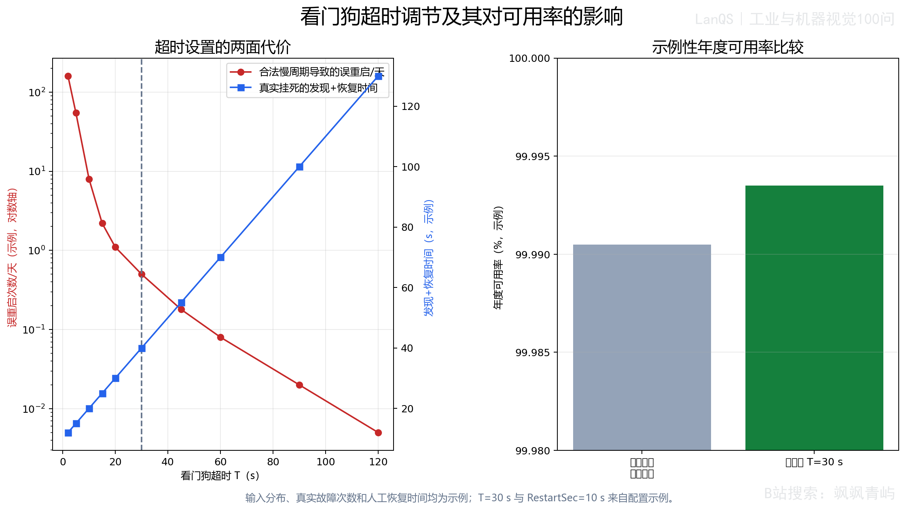</p>
<p align="center">图80-3　看门狗超时设置的两面代价与年度可用率示例。</p>

<div class="figure-note">超时时间变短，真实挂死的发现与恢复更快，但合法慢周期造成的误重启增加；超时时间变长，误重启减少，却会延迟真实故障处理。图中的 \(T=30\ \mathrm{s}\) 和 RestartSec=10 秒来自服务配置示例，其余输入为模拟假设，不能直接套用到现场。</div>

#### 80.5 如何验证恢复机制并形成现场做法？

设计完成后必须主动制造故障。可以强制结束采集、推理和通信进程，制造内存泄漏、队列阻塞、网络中断、相机断连、PLC 失联、存储异常和高 CPU/I/O 负载，检查每种故障是否在预期层级恢复。测试不只要确认“重启了”，还要确认恢复后当前工件被正确隔离、状态从检查点恢复、结果没有重复写入或丢失。

长稳测试至少应连续运行 7 天，观察内存、磁盘、温度、处理延迟、队列深度、重连次数和结果完整率。压力测试要在真实负载下进行，因为 CPU 和 I/O 争用正是故障发生时最可能存在的条件。恢复时间测试要记录从故障注入到重新达到允许生产状态的实际时间，并与 RTO（Recovery Time Objective，恢复时间目标）比较。

看门狗只能检测心跳是否按时到达，不能判断心跳期间的工作是否正确。相机可能卡在同一帧，算法可能因为逻辑错误一直返回“OK”，标定表也可能已经损坏；这些状态都能在心跳正常时持续存在。应增加帧间差异检查、输出统计合理性检查、已知参考件校验和关键参数完整性检查。

自动恢复还可能掩盖正在恶化的硬件。网线、风扇、电源或连接器逐渐失效时，系统可能每天都成功重启几次，表面看似恢复正常，实际上重启频率正在上升。必须记录每次恢复的时间、触发层级和原因，并对恢复事件的频率设置告警。

当日志不能直接解释重启原因时，可按时间关联诊断：先拉取完整的看门狗和 systemd 日志，再比较班次交接、配方切换、产品型号、网络和 PLC 事件、厂务设备动作、温度峰值、内存峰值以及多台工位之间的故障分布。找到候选原因后，在隔离条件下复现，例如单独运行可疑产品配方，或同步记录一台设备的温度和重启事件。重启次数相同，集中在某一产品、某一时段或某一物理单元时，诊断含义并不相同。

恢复事件本身应成为长期维护指标。可以按小时、班次、产品和物理单元统计线程重启、应用重启、系统复位和人工介入次数，观察是否存在趋势。若只有一台工位在高温时段频繁进入系统级恢复，应优先检查该机的电源、风道、风扇和连接器；若所有工位都在同一配方切换时进入应用级恢复，则更像软件状态或超时设置问题。

关键部件可以采用冗余设计，例如双电源、冗余网络路径和冗余存储，避免单点故障直接停止整站。对要求无缝切换的工位，可以让主机和热备机同时运行，故障时自动切换；热备不只是多放一台电脑，还要同步模型、配方、检查点、时间和通信状态。

7×24 运行仍需要计划维护窗口，用于系统更新、数据清理、风道和连接器检查、备份恢复演练及预防性更换。“持续运行”不等于“永不维护”。硬件应根据实际温度、振动和电磁环境配置，操作手册和现场培训则让维护人员能处理基础告警、隔离工件和执行回滚。

可靠性验收应把自动启动、软件看门狗、硬件看门狗、功能监控、数据保护、恢复时间、长稳测试和故障注入放在同一份测试矩阵中。模型、驱动、操作系统、相机、配方或 PLC 程序发生变化后，要重新执行受影响的故障测试。

冗余设计还要验证切换期间的业务状态。双电源、网络和存储只能降低单点故障，不能自动解决模型版本不一致或重复发送 PLC 指令；热备机必须同步必要配置，并明确主备仲裁、切换条件和切回条件。计划维护时则应安排数据清理、系统更新、风道检查、备份恢复和预防性更换，持续运行的目标不能取消维护窗口。

### 常见误区

- 把开机自动运行当成 7×24 可靠性，忽略进程卡死、功能错误和数据保护。
- 只监控进程心跳，不监控采图、推理、通信、帧变化和结果合理性。
- 复制 WatchdogSec=30 等示例值，不测量现场合法周期的 p99、p99.9 和最长慢路径。
- 所有故障都直接重启操作系统，没有先尝试线程或应用级恢复，也没有重试上限。
- 认为看门狗安静就证明输出正确，漏掉冻结相机、损坏标定表和逻辑错误。
- 自动恢复后不统计重启频率，让逐渐恶化的电源、风扇、网线或连接器问题被掩盖。
- 没有对正在检测的工件做隔离和复核，就在恢复后直接继续放行。
- 只在空载时测试一次看门狗，不在高负载、断网、长稳和版本升级后重新验证。

### 术语与符号表

| 术语或符号 | 含义 |
| --- | --- |
| 7×24 | 每周 7 天、每天 24 小时连续运行的目标工作方式。 |
| 看门狗 | 在规定时间内未收到心跳或健康信号时触发恢复的机制。 |
| 心跳 | 系统按周期发送的存活和进度信号。 |
| \(T\) | 看门狗超时时间，单位为秒。 |
| \(\Delta t_{\mathrm{hb}}\) | 相邻两次心跳的时间间隔。 |
| 硬件看门狗 | 独立于应用和操作系统的计时器，可在严重无响应时触发硬件复位。 |
| 软件看门狗 | 位于操作系统、服务或应用层，用于检查线程、设备和业务状态的监控机制。 |
| WatchdogSec | systemd 允许服务两次心跳通知之间经过的最大时间。 |
| RestartSec | systemd 在服务退出或被判定挂死后，等待重新启动的时间。 |
| systemd | Linux 中负责服务启动、依赖、重启、日志和通知的系统组件。 |
| 检查点 | 周期性保存的应用或线程状态快照，用于故障后恢复处理位置。 |
| RTO | 恢复时间目标（Recovery Time Objective），从故障发生到允许生产的最大可接受时间。 |
| SNMP | 简单网络管理协议（Simple Network Management Protocol），用于远程查询设备状态。 |
| \(P_{\mathrm{false}}(T)\) | 合法周期超过超时时间 \(T\) 的概率，即示例中的误触发概率。 |
| P99 / P99.9 | 周期或延迟分布的高分位数，用于观察合法长尾。 |
| \(U_{\mathrm{wd}}\) | 看门狗配置下的示例年度可用率。 |
| 热备 | 与主设备同步运行或保持可接管状态的冗余备用设备。 |

### 延伸阅读

- systemd.service 文档，重点了解 Restart=、RestartSec=、WatchdogSec= 和 sd_notify()。
- Windows Service Control Manager 与任务计划程序文档，用于设计无人登录启动、依赖和失败恢复。
- MAX813L 或 TLC7705 等微处理器监控芯片资料，用于理解独立硬件看门狗的复位路径。
- IEC 61508《电气/电子/可编程电子安全相关系统的功能安全》，用于理解分层故障检测、恢复与安全状态的边界。
