# 《工业与机器视觉100问》Q51–Q100

> 发布范围：Q51–Q100。

---

## 第51问：什么是PROFINET或EtherCAT？视觉系统能接入这种总线吗？

### 51. 什么是PROFINET或EtherCAT？视觉系统能接入这种总线吗？

#### 51.1 PROFINET和EtherCAT分别是什么，它们的基本特性是什么？

PROFINET和EtherCAT都属于工业以太网通信体系，常用于PLC（可编程逻辑控制器）、伺服驱动器、远程I/O、机器人控制器和视觉控制器之间的数据交换。它们都建立在以太网物理层基础上，但实时机制、设备组织方式和典型应用场景并不相同。

PROFINET更强调与标准工业以太网架构的兼容。它既可以承载普通TCP/IP通信，也可以承载实时控制通信；当系统对同步精度要求较高时，还可以使用IRT（Isochronous Real Time，等时实时）机制，把通信抖动控制在较低水平。因此，PROFINET在大型产线、分层控制和多厂家设备集成中比较常见。

EtherCAT则更强调控制周期和同步效率。它把控制数据直接嵌入以太网帧中，数据帧沿链路依次经过各从站时，每个从站只处理与自己相关的那一部分数据，因此协议开销小、周期短，适合多轴同步和高速分布式控制。EtherCAT常与DC（Distributed Clocks，分布式时钟）机制配合使用，以建立全网统一的时间基准。

对初学者来说，最需要先分清的是两类接口的职责：PROFINET和EtherCAT负责控制结果、状态量、同步信息与设备协同；GigE Vision、USB3 Vision、Camera Link和CoaXPress负责图像传输。这两类接口可以同时存在于同一套视觉系统中。

从性能数据上看，PROFINET RT（基于软件调度）典型循环时间约 1~10ms，适合 PLC 类应用；IRT 依赖专用硬件将循环时间压到 1ms 以下，同步抖动 <1μs，适合运动控制。EtherCAT 将控制数据嵌入标准以太网帧（EtherType 0x88A4），帧在沿链路经过各从站时在硬件层即时读写（on-the-fly），无需完整接收再转发，循环时间可低至 100μs 以下。EtherCAT 内建的分布式时钟（DC）通过每个节点收发时间戳自动补偿路径延迟，同步精度可达约 1ns，等效于 IEEE 1588 PTP 且无需额外硬件。

#### 51.2 这两种工业总线在技术架构上有何不同？

两者最核心的差别，在于它们组织实时通信的方式不同。

PROFINET更容易融入常规工业以太网网络结构。系统中可以同时存在标准交换机、工程站、上位机和实时控制设备，因此它的系统边界较宽，兼容性和工程生态往往更强。

EtherCAT则更像一条围绕控制效率设计的高速现场总线。数据帧在网络中连续流过多个从站，各从站在帧经过时即时读写自身数据，不需要像传统分组转发那样完整收发再处理。这种机制特别适合伺服轴数量多、同步要求高、控制周期短的设备。

教材里还应把“网络拓扑”和“协议机理”分开理解。星形、树形、线形、环形描述的是布线和网络连接方式；IRT、DC、周期调度和帧内处理描述的是实时通信机理。不能把某一种拓扑直接等同于某一种协议性能。


<p align="center"><strong>图51-1 视觉系统中的图像链路与控制链路分工</strong></p>
<div class="figure-note" style="background: transparent; border: 0; padding: 0; margin: 0.35em 0 1.2em;">
图 51-1把视觉系统中经常被混谈的两条链路拆开了。左侧的图像采集链路负责把原始图像送到视觉主机或智能相机内部处理单元，右侧的控制与同步链路则把结构化结果、设备状态和统一时钟送入PLC与运动控制系统。读这张图时，读者应把注意力放在“图像流”和“控制流”承担的任务差别上。它帮助回答的是，为什么很多项目中既要有图像接口，又要有工业实时总线；它的适用边界也很明确，若视觉系统只需独立完成检测并返回少量结果，并不一定需要把自己纳入硬实时控制网络。
</div>

#### 51.3 高端视觉系统为什么必须接入PROFINET或EtherCAT这样的硬实时总线？

如果视觉系统只需把OK/NG结果、少量尺寸值或目标坐标回传给PLC，普通TCP/IP、Modbus TCP甚至离散I/O往往已经足够。高端视觉系统之所以会接入PROFINET或EtherCAT，关键不在“把图像传得更快”，而在于让视觉测量结果进入统一时基下的控制链条。

这在多相机3D视觉、高速飞拍分拣、连续卷材检测、半导体对位和锂电设备中非常常见。视觉系统不再只是独立的检测单元，而是与伺服轴、机器人、光源控制器和触发模块共同参与一套严格受控的时序系统。此时，系统需要保证“什么时候拍”“在哪个位置拍”“拍完以后控制器按什么时刻解释结果”这几件事具有统一的时间基准。

以EtherCAT为例，若视觉节点、伺服驱动器和控制器共享DC时钟，PLC就可以按绝对时间或绝对机械位置下发动作命令。例如，在主轴运行到指定位置时，让多台相机同时曝光。这样做减少了传统硬触发布线的复杂度，也降低了电平传播、线路长度和外部接口链路带来的附加误差。

因此，接入硬实时总线的真正价值，是把视觉系统从"结果上报设备"提升为"统一运动控制节拍中的测量节点"。

从工程需求看，高端视觉接入硬实时总线集中在两类场景：第一，伺服轴同步——相机触发时刻须与机器人/电机位置纳秒级对齐，普通 TCP/IP 毫秒级不确定性无法保证重复精度；第二，确定性响应——检测结果须在固定时间窗口内到达 PLC，不能因网络抖动导致节拍偏差，硬实时总线将通信锁定在硬件调度层。

#### 51.4 视觉系统如何接入PROFINET或EtherCAT总线？

常见方式大体有三种。

第一种是原生接入。部分高端视觉控制器、智能相机或一体化机器人视觉单元本身就带有PROFINET或EtherCAT从站接口，可以直接挂到PLC或运动控制网络中。这种方式结构清晰，同步能力强，适合新建产线或节拍要求很高的设备。

第二种是通过协议网关接入。视觉系统按原来的图像链路工作，再由协议网关把结果转换成PROFINET或EtherCAT可识别的数据区或对象。它的优点是改造成本较低，不必更换现有视觉软件和相机链路；缺点是总时延、诊断链路和同步能力通常不如原生接入明确。

第三种是基于PC的软件协议栈方案。此时PC既负责图像处理，也负责与工业总线交换结果数据。它的灵活性较高，但实时性受操作系统调度、驱动实现和硬件平台影响较大，必须做实际时延和抖动测试，不能只根据“支持某协议”就推断系统一定能稳定闭环。

工程上做方案选择时，至少要先回答两个问题：视觉节点是只交换结果数据，还是还要参与同步触发与统一时钟；它是普通数据从站，还是整条控制链上的时间关键节点。这两个问题决定了系统复杂度，也决定了设备成本和调试深度。

#### 51.5 视觉系统接入工业总线面临哪些技术挑战？

第一类挑战是实时性。视觉系统内部包含曝光、图像传输、图像处理和结果下发几个阶段。即使总线本身周期很短，只要图像处理时间波动较大，整条链路仍然可能无法形成稳定的时间闭环。

第二类挑战是同步精度。多相机系统常要求“同一时刻曝光”或“在同一机械位置采样”。这时不仅要同步PLC和伺服轴，还要确认相机、触发板卡、光源控制器和视觉控制器是否真的共享统一时间基准。

第三类挑战是数据路径分离。控制网络通常并不适合直接承载高带宽原始图像流，因此很多项目会把图像采集网络和控制结果网络分开设计。初学者容易把“都叫以太网”误解为“所有数据都走同一张网”，这是系统架构里很常见的误区。

第四类挑战是诊断和维护。视觉问题往往横跨相机、镜头、光源、算法、网络和控制器，一旦接入工业总线，虽然集成能力增强了，但问题定位不一定更简单，反而要求更完整的时间戳、状态字、日志和诊断信息。

#### 51.6 如何验证系统确实实现了确定性时序？
验证不能停留在“协议支持”或一次成功通信上。EtherCAT现场排查可按以下顺序进行：先查看主站事件日志，确认掉线的站地址和时间；再读取该从站的AL Status Code，区分状态机、看门狗和通信类故障；随后检查其DL状态以及各端口的CRC、链路丢失等计数器，定位上游或下游物理连接；最后与设备RUN、ERR、L/A指示灯交叉确认。

网关延迟应对触发输入和结果输出同时打时间戳，连续采集约1000–10000个周期，并报告平均值、最大值和P99或P99.9，而不是只记录一次读数。可使用支持精确时间戳的网络分析设备，也可用双通道示波器分别捕获物理触发脉冲和网关输出的GPIO脉冲。PROFINET IRT的实时窗口由支持IRT的交换设备按计划保留，普通TCP/IP和大块视觉数据应放在开放窗口、独立网络或独立网卡中；非IRT设备、配置错误或过大的在途帧仍可能造成时序问题。

#### 51.7 在实际应用中，视觉系统接入工业总线有哪些典型场景？

汽车装配线中，视觉系统常与机器人和夹具伺服轴联动，用于定位补偿、装配确认和在线质量检测。此时视觉结果进入控制系统后，会直接影响机器人动作与工艺节拍。

锂电、半导体和精密装配设备中，视觉系统更常参与高精度对位、边缘检测和闭环修正。与这类任务相比，普通结果上报已经不是重点，真正关键的是多轴运动、曝光时刻和视觉测量结果的统一解释。

包装和物流分拣系统中，视觉系统识别条码、外形和姿态后，把结果交给PLC或机器人控制器，由后者执行实时分拣。这类场景对控制节拍和结果通信的稳定性要求较高，但图像本身通常仍留在视觉侧处理。

卷材检测、线扫描成像和高速印刷系统中，视觉系统常与编码器、运动轴和触发模块共享统一时基，用于飞拍、位置锁定采样和多帧拼接。

#### 51.8 未来视觉系统与工业总线集成的发展趋势是什么？

一个明显方向，是标准工业网络、统一时间同步和软件化控制继续融合。TSN（Time-Sensitive Networking，时间敏感网络）之所以受到关注，正是因为它试图把标准以太网基础设施与确定性控制需求更好地统一起来。

另一个方向，是边缘计算增强。越来越多视觉节点不只输出OK/NG，还输出位姿、置信度、缺陷类别、质量指标和模型状态。这意味着视觉系统在控制系统中的角色越来越接近“可诊断、可建模的测量节点”，而不再只是一个黑盒结果源。

从工程判断看，是否接入PROFINET或EtherCAT，不应只看设备清单里"支不支持"，而应看项目是否真的需要把视觉结果纳入统一时钟和硬实时控制链中。只有在这个条件成立时，工业实时总线的价值才会充分体现。

> **引用出处**：PROFINET RT/IRT 性能数据与 EtherCAT on-the-fly 机制，参见 EPC Industrial Ethernet White Paper WP-2019（www.encoder.com/wp2019）及 Dewesoft *What Is EtherCAT Protocol*（dewesoft.com/blog/what-is-ethercat-protocol）。

##### 51.8.1 算例：抖动等级与位置不确定度
运动中的位置不确定度可作一阶估算：

$$\Delta x=v\Delta t$$

例如 (v=1\ \mathrm{m/s}) 时，5 μs抖动对应约0.005 mm位置不确定度，2 ms抖动对应约2 mm。2 ms是用于比较的示例值，不是TCP/IP固定指标；实际项目应使用实测的P99或最大值，并把曝光、传输、处理和执行延迟全部纳入预算。


<p align="center"><strong>图51-2 抖动等级与运动位置不确定度示例</strong></p>

---

### 常见误区

- 把PROFINET或EtherCAT当成图像传输接口；它们主要承担控制、状态和同步，图像通常走GigE Vision、USB3 Vision、Camera Link或CoaXPress。
- 只看总线标称周期，不测视觉曝光、传输、算法和结果下发组成的端到端延迟。
- 认为IRT或DC自动消除了所有延迟；它们改善时基和通信确定性，不能替代图像处理能力与现场验证。

### 术语与符号表

| 术语 | 说明 |
|---|---|
| PROFINET | 工业以太网通信体系，可承载标准通信、实时通信和IRT等不同等级的控制流量。 |
| EtherCAT | 采用帧内即时读写机制的实时以太网现场总线，常用于高速分布式控制。 |
| IRT | Isochronous Real Time，等时实时机制，为确定性控制预留调度窗口。 |
| DC | Distributed Clocks，分布式时钟，用于建立网络设备的共同时间基准。 |
| 抖动 | 同一事件实际发生时间相对期望时间的变化量。 |
| P99 | 延迟样本的99%分位值，表示99%的样本不超过该延迟。 |

### 延伸阅读

可结合PROFINET、EtherCAT Technology Group和具体主站/从站厂商的诊断手册，进一步核对设备状态机、时间同步、拓扑扫描和周期数据配置。

<a id="q52"></a>

---

## 第52问：产线的运动控制（如伺服电机）是由PLC做还是由视觉系统做？视觉引导定位（如机器人抓取）时，数据流是怎样的？

### 52. 产线的运动控制（如伺服电机）是由PLC做还是由视觉系统做？视觉引导定位（如机器人抓取）时，数据流是怎样的？

#### 52.1 产线运动控制中PLC和视觉系统的分工是怎样的？

在工业自动化产线中，PLC和视觉系统通常承担不同层级的任务。PLC更接近执行层控制，视觉系统更接近测量与感知层。

PLC负责的内容通常包括逻辑顺序控制、伺服轴启停、回零、定位、联动、安全互锁和故障处理。它的强项在于周期可预测、环境适应性强、与伺服驱动器和工业总线的结合成熟。

视觉系统则主要负责图像采集、识别、测量、定位、缺陷判断和坐标解算。它给控制系统提供的是“目标在哪里”“姿态如何”“结果是否可信”，而不是直接去承担伺服底层闭环。

因此，视觉系统一般不直接替代PLC控制伺服电机。更准确的理解是：视觉系统给出测量结果和修正量，PLC或机器人控制器根据这些结果决定执行动作。

#### 52.2 为什么PLC更适合做伺服电机的直接控制？

伺服控制的核心问题不是“算得快不快”，而是“能不能在确定周期内稳定执行”。位置环、速度环和电流环都要求控制周期固定、时序稳定、异常处理明确，这正是工业控制器擅长的部分。

PLC或专用运动控制器更适合直接控制伺服轴，主要有三个原因。第一，它们与伺服驱动器之间有成熟的实时总线和运动控制功能，便于实现多轴同步、电子齿轮、电子凸轮和轨迹协调。第二，它们的扫描周期、任务优先级和故障响应更加可预测。第三，它们天然与安全链、限位、抱闸、回零和互锁逻辑耦合紧密，适合长期稳定运行。

相较之下，视觉PC即使算力很强，也未必适合承担底层闭环。PC更适合做图像处理、路径生成、上层决策或离线优化；驱动器和PLC仍然更适合承担周期控制任务。

这里还需要区分两个概念：运动规划与伺服闭环。视觉系统可以参与运动规划，例如给出抓取位姿；而伺服闭环通常仍由驱动器和控制器完成。

#### 52.3 视觉系统在运动控制中扮演什么角色？

视觉系统在运动控制中最典型的角色，是“测量并提供修正量”。

以机器人抓取随机摆放工件为例，视觉系统先检测工件中心位置与姿态，再把位姿结果发送给机器人控制器。控制器据此完成坐标变换、轨迹规划和末端执行。此时视觉系统提供的不是某个电机轴的扭矩指令，而是抓取目标的空间信息。

常见输出形式包括平面偏移量 $(\Delta x,\Delta y,\Delta \theta)$、三维位姿 $(x,y,z,R_x,R_y,R_z)$、工件类别、抓取点、置信度、尺寸值和缺陷类别。对质量检测系统而言，视觉系统还可能输出报警码、测量统计值或工艺补偿量。

在一些闭环应用中，视觉系统还会承担二次确认。例如抓取后复拍、贴合后对位复核、装配后尺寸验证等。这样形成的就是“视觉测量 - 控制执行 - 视觉验证”的协同结构。

#### 52.4 视觉引导定位的完整数据流是怎样的？

一套可落地的视觉引导定位系统，通常至少包括触发、采图、识别、坐标转换、控制执行和反馈校验几个阶段。

第一阶段是触发与采图。工件到达预定位置后，光电开关、编码器或PLC发出触发信号，相机完成曝光。若节拍较高，还会同步控制光源脉冲。

第二阶段是视觉处理。视觉软件完成目标检测、边缘提取、模板匹配、三维重建或深度学习推理，并输出像素坐标、目标姿态或测量结果。

第三阶段是坐标转换。视觉结果最初属于相机坐标系或图像坐标系，必须通过标定关系转换到机器人坐标系、工装坐标系或世界坐标系。这一步决定了视觉结果能否真正落到执行机构上，是系统集成中的关键桥接环节。

第四阶段是控制执行。PLC或机器人控制器接收视觉结果后，结合当前轴状态、工艺约束和安全条件，生成可执行的运动轨迹，并通过实时总线下发到伺服驱动器。

第五阶段是反馈与校验。伺服轴通过编码器反馈实际位置；必要时视觉系统再次确认执行结果是否达到预期。


<p align="center"><strong>图52-1 视觉引导定位中的测量与执行数据流</strong></p>
<div class="figure-note" style="background: transparent; border: 0; padding: 0; margin: 0.35em 0 1.2em;">
图 52-1把视觉引导定位常见的五个关键环节顺序展开。读者应特别注意中间的“坐标转换”步骤，因为很多系统在实验台上能识别目标，却在上机联调时无法稳定抓取，问题往往就出在这里。视觉系统输出的是相机测得的位置与姿态，控制器需要的是执行机构可以理解的坐标与约束条件；只有这两者之间的映射明确，视觉结果才真正具有控制意义。该图适用于大多数抓取、对位和装配场景；若系统采用视觉控制器与机器人控制器一体化平台，部分模块会在软件架构上合并，但其逻辑分工并不会改变。
</div>

##### 52.4.1 算例：为什么视觉负责测量，而伺服闭环负责执行
设伺服位置环周期为1 ms，视觉曝光、图像传输、处理和结果发送分别需要5、8、20和3 ms，示例总延迟为36 ms。伺服环在这段时间内仍按自身周期运行，视觉结果作为带时间戳的目标修正量进入较慢的上层轨迹或位置指令，不应替代1 ms位置环。所有数值均为示例值，用于说明时间尺度差异。


<p align="center"><strong>图52-2 伺服控制周期与视觉测量延迟预算示例</strong></p>

#### 52.5 结果没有按时到达时会发生什么？移动目标如何交接？
若视觉结果晚于工位允许的执行窗口，PLC不能把它当成当前产品的有效结果直接使用，否则会把上一件或下一件产品误剔除、误抓取。常见做法是给每次触发分配序号或产品ID，将图像、结果和机械位置绑定；结果到达时先检查ID、有效时间和位置窗口，再决定是否执行。

对于仍在运动的目标，系统可以把测得的坐标换算到控制器坐标系，并根据编码器位置或机器人当前状态预测交接时刻。预测模型必须经过实际延迟和速度变化验证；超出允许窗口时应进入等待、跳过或报警状态，而不是继续使用过期结果。

#### 52.6 现代工业自动化中PLC和视觉系统的集成趋势是什么？

当前的一个明显趋势，是平台更紧密，但职责边界仍然存在。现在常见的一体化控制平台，可以把PLC、运动控制和视觉部署在同一工程环境，甚至同一硬件平台上，但这并不意味着视觉与伺服闭环不再区分。

另一个趋势，是数据交换更丰富。过去视觉系统往往只回传OK/NG或坐标；现在还会传递置信度、检测区域编号、缺陷类别、时间戳和模型状态，这让控制系统可以做更细致的工艺判断。

第三个趋势，是仿真和数字化调试增强。视觉标定、机器人坐标转换和轨迹验证越来越多地在离线环境中先完成，再上机联调，从而降低现场反复调试的成本。

对学生而言，这一题最重要的结论是：PLC与视觉系统不是“谁替代谁”的关系，而是“执行”和“测量”的协同关系。理解了这一点，后续学习触发、标定、定位补偿和运动控制时，系统角色就不会混淆。

---

### 常见误区

- 让视觉系统直接替代PLC或伺服驱动器的位置闭环；视觉测量通常是较慢的修正量，伺服环仍由运动控制器按固定周期执行。
- 省略相机坐标到机器人坐标的标定与转换，导致实验室能识别、现场不能准确抓取。
- 结果到达过晚仍按当前产品使用，造成产品ID错位或移动目标交接错误。

### 术语与符号表

| 术语 | 说明 |
|---|---|
| 伺服闭环 | 根据位置、速度或力反馈持续修正电机控制量的实时控制回路。 |
| 坐标标定 | 建立相机坐标系与机器人、工装或世界坐标系之间映射关系的过程。 |
| 视觉引导定位 | 视觉测量目标位置和姿态，并将结果转换为执行机构可用的运动目标。 |
| 结果有效窗口 | 结果仍对应当前产品、当前位置和当前工艺阶段的时间或空间范围。 |

### 延伸阅读

进一步学习时应同时阅读伺服控制器、机器人坐标标定和PLC通信任务周期的设备文档，并在实际运动速度下验证结果交接窗口。

<a id="q53"></a>

---

## 第53问：如何处理因传输延迟或处理时间导致的“定位偏差”？什么是“飞拍”或“跟踪触发”？

### 53. 如何处理因传输延迟或处理时间导致的“定位偏差”？什么是“飞拍”或“跟踪触发”？

#### 53.1 什么是“定位偏差”，它在计算机视觉系统中如何产生？

定位偏差是指系统输出的位置，与目标在执行时刻的真实位置之间的误差。只要目标在运动，而系统又存在采集、传输、处理和执行准备时间，这个偏差就会出现。

设目标沿单一方向运动，速度为 $v$，系统总延迟为 $\Delta t$，则最基本的一阶近似关系为

$$
\Delta x \approx v\Delta t
$$

这里的 $\Delta x$ 是位置偏差，$\Delta t$ 是从拍摄到控制系统真正使用该结果之间的总时间。这个式子成立的前提是：在这段时间内目标速度变化不大。如果目标存在明显加速度，还需要进一步考虑加速度项或采用更高阶的运动模型。

初学者最容易混淆的是两类不同误差：一类是图像中的测量误差，另一类是时间滞后引起的位置误差。前者对应“看错了多少”，后者对应“看对了，但看到的是过去的位置”。它们的来源不同，处理方法也不同。

#### 53.2 传输延迟和处理时间如何具体影响定位精度？

设相机曝光结束到图像到达处理器的延迟为 $\Delta t_1$，算法处理时间为 $\Delta t_2$，结果发送与执行准备时间为 $\Delta t_3$，则系统总延迟可写为

$$
\Delta t=\Delta t_1+\Delta t_2+\Delta t_3
$$

若此时目标速度近似恒定，则执行时刻相对拍摄时刻的额外位移近似为

$$
\Delta x \approx v(\Delta t_1+\Delta t_2+\Delta t_3)
$$

这也是为什么高速应用里，几十毫秒延迟就可能带来很明显的机械位置偏差。以传送带速度 $1\,\mathrm{m/s}$、总延迟 $40\,\mathrm{ms}$ 为例，目标在系统完成处理并下发结果之前，已经额外前进了

$$
\Delta x \approx 1\times 0.04 = 0.04\,\mathrm{m}=40\,\mathrm{mm}
$$

对抓取、贴合和精密定位来说，这样的偏差通常已经不可接受。

#### 53.3 有哪些主要技术可以补偿或减少因延迟导致的定位偏差？

处理这类偏差，通常有四条思路。

第一，减少延迟本身。例如提高帧率、缩短曝光时间、采用更快的图像接口、减少无效算法路径，或把部分处理前移到FPGA、智能相机或边缘处理器上。

第二，统一时间基准。只要相机、编码器、PLC和执行器共享明确的时间戳，就能知道“这组视觉结果对应的是哪一个时刻的目标位置”，从而为补偿奠定基础。

第三，做短时运动预测。若目标在短时间内近似匀加速，可用

$$
\hat{x}(t+\Delta t)=x(t)+v(t)\Delta t+\frac{1}{2}a(t)\Delta t^2
$$

其中 $\hat{x}(t+\Delta t)$ 为预测位置，$x(t)$ 为拍摄时刻测得的位置，$v(t)$ 和 $a(t)$ 分别为当时估计的速度和加速度。这个式子的适用前提，是预测区间内运动变化不能过于剧烈；若目标轨迹复杂，还需使用滤波器或更完整的运动模型。

第四，改变采样策略。与其“每隔固定时间拍一次”，不如“在该拍的时候拍”。飞拍和跟踪触发，就是围绕这一思路建立起来的。

#### 53.4 什么是“飞拍”技术，它如何解决高速运动物体的定位问题？

飞拍是指目标连续运动时不停车，系统在运动过程中完成曝光和采图。它的关键在于让曝光时刻与目标位置的关系可控，而不只是提高拍摄频率。

典型飞拍系统通常包含以下条件：使用全局快门相机，避免卷帘快门造成几何形变；触发信号与编码器位置或精确时钟绑定；曝光时间足够短，以减小运动模糊；光源能够在短曝光内提供足够照度。

因此，飞拍解决的是“运动中如何在正确位置获得可用图像”的问题。若只提高帧率，却没有同步触发、短曝光和足够光照，图像仍可能模糊，位置仍可能不准。

#### 53.5 “跟踪触发”技术的工作原理是什么，它与传统触发有何不同？

传统触发往往是固定条件触发，例如“光电开关到位就拍”或“每隔固定时间拍一次”。这种方式简单，但默认目标速度变化不大，或者默认拍摄窗口足够宽。

跟踪触发则先持续估计目标运动状态，再预测它何时进入最佳拍摄区域，并在该预测时刻触发相机。它更像“先追踪，再决定何时拍”。

典型流程包括：先用低分辨率视觉或辅助传感器持续跟踪目标；实时估计位置、速度，必要时估计加速度；预测目标进入最佳成像窗口的时刻；在该时刻触发高分辨率采图。这样的策略更适合目标速度波动较大、目标间距不均匀或拍摄窗口较窄的场景。

#### 53.6 硬件同步在减少定位偏差中扮演什么角色？

硬件同步的核心作用，是把“时间不确定”变成“时间可知且可重复”。

例如，相机曝光时刻、光源闪光时刻和编码器位置采样时刻若由同一硬件时基控制，系统就能明确知道某一帧图像对应的是哪一个机械位置。此时即使图像处理稍后才完成，也仍可以基于拍摄时刻的位置进行补偿。

还要指出，硬件同步并不等于没有延迟。它解决的是时序抖动和时间对应关系的问题，图像处理时间本身仍然存在。对工程人员来说，知道“延迟是多少”与“延迟是否稳定”，同样重要。

#### 53.7 如何测量真实延迟链？预测模型在什么时候会失效？
应在触发输入、相机曝光或曝光确认、图像到达、算法完成、结果发送和执行器动作等关键节点布置时间戳或示波器通道，连续采集足够多的周期，分别统计平均值、最大值和高分位数。单次测量只能说明一次运行，不能说明系统的实时边界。

一阶模型 Δx≈vΔt 适合速度近似恒定、延迟相对较短的场景。加速、减速、传送带打滑、目标姿态变化或延迟分布明显长尾时，应使用分段速度、编码器位置或带时间戳的运动状态重新计算；预测模型若没有覆盖这些条件，补偿结果可能比不补偿更不稳定。

#### 53.8 如何设计一个完整的延迟补偿系统？

一个可落地的延迟补偿系统，通常至少要做五件事。第一，实测端到端总延迟，不要凭经验估计。第二，为图像、编码器、PLC数据和执行动作建立统一时间戳。第三，根据产线最大速度，先计算不补偿时的位置偏差上限。第四，判断系统是只需减小延迟，还是必须引入运动预测。第五，在联调阶段验证补偿后的残余误差，不能只验证静态标定误差。

工程上有两个常见误区。一个是只优化算法时间，却不测通信与执行延迟；另一个是只给平均延迟，不给抖动范围。对于实时控制来说，平均值重要，抖动同样重要，因为补偿模型往往更怕“有时慢20毫秒，有时慢35毫秒”，而不是“稳定慢20毫秒”。

##### 53.8.1 算例：从延迟链估算定位偏差
对速度近似恒定的对象，若图像传输、算法处理和结果准备分别为12、20和8 ms，总延迟为40 ms。在 (v=1\ \mathrm{m/s}) 时，

$$\Delta x\approx v\Delta t=1\times0.040=0.040\ \mathrm{m}=40\ \mathrm{mm}$$

这里的12、20、8 ms是示例分解值，40 ms是示例总延迟；它们用于展示预算方法，不是现场保证值。补偿设计还要把触发抖动、执行器响应和加减速项单独计入。


<p align="center"><strong>图53-1 定位偏差形成的时间链条</strong></p>
<div class="figure-note" style="background: transparent; border: 0; padding: 0; margin: 0.35em 0 1.2em;">
图 53-1把定位偏差拆成一条完整的时间链：曝光、图像传输、算法处理、结果下发和执行准备，每一个环节都会把目标继续“往前带走”一段距离。读者从这张图中最应该建立的判断是，位置偏差并不是单一环节造成的，而是整条链路的合成结果。它对工程排查的价值在于提醒我们不要只盯着算法快慢，而要把触发、通信、控制器接收和执行准备都纳入测时延与建模范围。该图使用的是一阶速度近似，若目标存在明显加速度或停启切换，还需要在模型中加入更完整的运动项。
</div>


<p align="center"><strong>图53-2 延迟链到定位偏差的计算示例</strong></p>

---

### 常见误区

- 只测算法耗时，不测触发、曝光、传输、PLC接收和执行器准备组成的完整链路。
- 以平均延迟代替最大值或高分位延迟，导致偶发长延迟未被补偿。
- 把飞拍理解为单纯提高帧率；飞拍还需要正确触发、短曝光、足够光照和位置基准。
- 用恒速模型处理明显加减速过程，却没有加入编码器位置或运动预测。

### 术语与符号表

| 术语 | 说明 |
|---|---|
| 定位偏差 | 目标真实位置与系统据此执行的位置之间的差异。 |
| 飞拍 | 目标运动过程中完成曝光采集的成像方式。 |
| 跟踪触发 | 根据目标实时位置和速度预测拍摄窗口并触发采集的策略。 |
| 端到端延迟 | 从触发或物理事件发生到结果可被执行机构使用的总时间。 |
| 一阶延迟模型 | 在速度近似恒定时用 Δx≈vΔt 估算位移误差的模型。 |

### 延伸阅读

调试时可使用示波器、逻辑分析仪、网络抓包和统一时间戳日志，将每个延迟阶段单独测量，再决定降低延迟、提高同步性还是引入运动预测。

<a id="q54"></a>

---

## 第54问：什么是编码器？如何利用编码器信号实现更精准的触发或图像拼接？

### 54. 什么是编码器？如何利用编码器信号实现更精准的触发或图像拼接？


<p align="center"><strong>图54-1 编码器在位置触发与图像拼接中的双重作用</strong></p>
<div class="figure-note" style="background: transparent; border: 0; padding: 0; margin: 0.35em 0 1.2em;">
图 54-1把编码器在视觉系统中的两种典型用途并列展示。左侧说明编码器如何把“按时间触发”改成“按位移触发”；右侧说明它如何为多帧拼接提供先验位置基准。读这张图时，读者应看到同一类位置反馈信号在两个问题中的共同作用：它都在把模糊的运动过程转成可计量、可同步的位移过程。该图同样提醒一个重要边界，编码器计数再细，也不能自动消除滚轮打滑、传动间隙或安装误差，因此系统精度不能只看PPR（每转脉冲数）指标。
</div>


#### 54.1 编码器在机器视觉中的基本定义是什么？

编码器是一类把机械位置或位移转换为电信号的传感器。它既可以测转角，也可以测直线位移。

在机器视觉系统中，编码器最重要的作用，不只是告诉系统“电机转了多少圈”，而是提供一个可累计、可同步、可与触发绑定的位置基准。只要视觉任务与运动有关，编码器往往就是时间和位置之间的桥梁。

按测量对象区分，常见有旋转编码器和直线编码器；按输出方式区分，常见有增量式和绝对式。教材里应把这两个分类维度分开理解，不要把“旋转式”和“增量式”当成同义词。

#### 54.2 编码器的工作原理是什么？有哪些主要类型？

编码器的实现原理可以是光电式、磁式或容栅式等。不同原理对应不同的环境适应性、分辨率和成本。

按输出意义分，增量式编码器输出脉冲，系统通过计数得到相对位移；若掉电后不保存计数，通常不能直接知道当前位置。绝对式编码器则直接给出当前位置编码，重新上电后仍可读出位置。

按测量对象分，旋转编码器测角位移，直线编码器测线位移。对视觉系统而言，增量式编码器常用于传送带触发、线扫同步和平台位移计数；绝对式编码器更常见于高端定位平台、多轴设备和不希望重复回零的系统。

#### 54.3 编码器信号在机器视觉触发控制中如何发挥作用？

当视觉任务要求“每隔固定距离拍一次”，最自然的基准就不是时间，而是位移。编码器恰好提供了这个位移基准。

例如，传送带速度可能会波动，但只要编码器与传送带实际位移保持良好对应，系统就能做到“每移动固定距离采一帧”，或者“工件走到固定空间位置时触发曝光”。这比固定时间间隔触发更稳定，因为时间触发默认速度恒定，而编码器触发直接绑定机械位移。

这里还应区分两层作用：编码器信号既可以用于“到位触发”，也可以用于“速度估计和延迟补偿”。前者决定何时拍，后者帮助系统计算拍完之后目标又走了多远。

#### 54.4 编码器信号如何用于实现高精度的图像拼接？

图像拼接常见于大视野检测、平台扫描和线扫描成像。它的本质是：多张局部图像之间必须知道彼此的相对位移。

编码器在这里提供的是先验位移信息。在做图像特征配准之前，系统已经知道相机或工件大约移动了多少。

典型流程是：平台或工件移动，编码器连续输出位移信息；每移动固定距离触发一次采图，或持续线扫并按位移同步采样；为每张图像记录对应的编码器位置值；根据相邻图像的位置差计算理论重叠范围；再用图像特征做微调，以补偿机械误差、打滑和镜头畸变。

因此，编码器的作用是为图像配准提供可靠初值。对纹理少、重复纹理多或特征不稳定的表面，这个初值尤其重要。

#### 54.5 在机器视觉系统中，编码器与其他传感器如何协同工作？

编码器通常不会单独工作，而是与其他传感器共同构成完整的运动测量链。

与光电开关配合时，光电开关负责判断“工件到了没有”，编码器负责判断“工件走到哪了”。这两者不是重复关系，而是存在检测与位置测量的分工。

与伺服系统配合时，编码器既可作为电机反馈元件，也可作为外部位置参考，用于比较“平台实际位移”和“控制器指令位移”是否一致。

在线扫描系统中，编码器更是关键同步量。若线扫相机行频与物体实际运动速度不同步，图像就会被拉伸或压缩。此时编码器不是辅助元件，而是决定纵向几何比例是否正确的核心元件。

#### 54.6 编码器信号的精度和分辨率对视觉系统性能有何影响？

编码器性能至少涉及三个不同概念：分辨率、精度和重复性。分辨率是最小可分辨的位移或角度增量；精度是测得位置与真实位置的接近程度；重复性是多次到同一位置时结果的一致程度。

这三者不能混为一谈。分辨率高，不等于系统绝对精度一定高。若机械传动间隙明显、滚轮打滑、联轴器松动或安装偏心存在，再高的编码器分辨率也无法直接保证视觉系统最终定位精度。

工程上常把编码器脉冲数换算成线位移分辨率。若旋转编码器每转输出 $N$ 个计数，滚轮周长为 $L$，则每个计数对应的理论线位移为

$$
\Delta s=\frac{L}{N}
$$

这个式子给出的是理想分辨率。若机械耦合方式有误差，实际位移与理论位移就不再完全一致，因此还要结合安装结构一起判断。

##### 54.6.1 算例：从编码器分辨率建立拼接触发方案
设滚轮周长 (L=300\ \mathrm{mm})，编码器每转输出 (P=1000) 个脉冲，采用四倍频计数 (M=4)，则有效脉冲当量为

$$\Delta s=\frac{L}{P\times M}=\frac{300}{1000\times4}=0.075\ \mathrm{mm/count}$$

若目标触发间距为5 mm，可取计数阈值 (D=\mathrm{round}(5/0.075)=67) count，实际间距为 (67\	imes0.075=5.025\ \mathrm{mm})。这些数值是示例值；它说明整数计数会带来量化误差，不代表所有拼接任务都应采用5 mm间距。


<p align="center"><strong>图54-2 从编码器分辨率建立拼接触发方案示例</strong></p>

#### 54.7 现场如何检查编码器信号完整性并发现漂移？
应同时检查A/B相位关系、脉冲幅值、边沿质量、屏蔽接地、输入接口最高计数频率以及计数溢出。高速度下若PLC或采集卡漏计脉冲，位置估计会逐渐偏离真实位移；滚轮打滑、机械间隙和联轴器松动也会造成系统性漂移。

工程上可用已知长度的标定件或绝对位置标记做周期性复核，比较编码器累计位移与实际位移；对长距离扫描，还应记录计数、触发和图像时间戳，观察误差是否随距离单调增长。发现漂移后先排查机械耦合和信号完整性，再讨论提高PPR或算法补偿。

#### 54.8 现代编码器技术有哪些发展趋势？

一个趋势，是更高分辨率与更强环境适应性并行发展。高端定位平台要求亚微米甚至更高等级的位移控制，而普通工业现场又要求抗油污、抗粉尘和抗振动。

另一个趋势，是总线化和诊断能力增强。越来越多编码器不只输出位置，还输出状态、告警、温度和诊断信息，便于纳入整机健康管理。

第三个趋势，是与高速控制网络更紧密耦合。编码器越来越像实时控制链中的标准节点，而不只是一个孤立的测量器件。

#### 54.9 编码器在特定视觉应用中的实际案例有哪些？

高速印刷检测中，编码器常装在印刷滚筒或传送辊上，用于保证每个版面都在相同机械位置被采图，便于比较套印偏差和重复缺陷。

晶圆、玻璃面板或大幅面PCB检测中，编码器与高精度平台配合，用于记录扫描位置并触发拼接采图。此时编码器决定的是“每一帧在整张大图中的几何位置”。

在线扫成像中，编码器脉冲可以直接决定每一行图像对应的物理位移，因此它同时影响纵向比例尺和图像是否发生拉伸变形。


---

### 常见误区

- 认为PPR越高，整机绝对定位精度就一定越高；滚轮打滑、间隙、偏心和漏计数都会破坏这一推断。
- 混淆编码器分辨率、精度和重复性，把理论脉冲当量直接当成现场测量精度。
- 只在稳速段验证编码器触发，不检查加减速、信号边沿和长距离漂移。
- 用编码器位置替代所有传感器；到位检测、位置测量和绝对基准可能需要不同器件协同。

### 术语与符号表

| 术语 | 说明 |
|---|---|
| 编码器 | 把旋转或直线位移转换为脉冲或位置编码的传感器。 |
| PPR | Pulses Per Revolution，每转脉冲数。 |
| 脉冲当量 | 一个有效计数对应的理论机械位移，单位常为mm/count。 |
| 正交倍频 | 利用A/B两相信号的相位关系提高有效计数频率的解码方式。 |
| 漂移 | 编码器累计位置与实际机械位置之间随运行距离变化的偏离。 |

### 延伸阅读

应结合编码器、计数模块和机械传动的手册，确认最高输入频率、A/B相位、屏蔽接地、机械耦合和绝对位置复核方法。

<a id="q55"></a>

---

## 第55问：当产线速度变化时，如何保证视觉系统的触发频率同步变化？

### 55. 当产线速度变化时，如何保证视觉系统的触发频率同步变化？


<p align="center"><strong>图55-1 速度变化下的编码器同步触发链路</strong></p>
<div class="figure-note" style="background: transparent; border: 0; padding: 0; margin: 0.35em 0 1.2em;">
图 55-1把速度同步问题压缩成一条清晰的因果链：机械位移带动编码器产生脉冲，脉冲再经过倍频或分频处理，最终成为相机的触发源。图中下半部分把低速段与高速段并列展示，目的是让读者直观看到同一段位移在不同速度下对应着不同的脉冲密度。由此应得出的工程判断是：系统应尽量保持“每单位位移采一帧”的采样方式。该图适用于大多数传送带与平台扫描场景；若系统存在明显打滑、弹性传动或中间机构间隙，仅靠编码器触发仍不足以完全保证采样位置正确，还需要结合机械误差补偿与实际校准。
</div>


#### 55.1 为什么产线速度变化会影响视觉系统的检测质量？

产线速度变化会直接改变工件通过检测区域的时间间隔。若视觉系统仍按固定时间频率触发，采图位置就会漂移，进而带来三类典型问题：一是工件间距变化后可能漏检或重复检测；二是图像中工件位置发生偏移，影响定位与测量精度；三是高速运行时更容易出现运动模糊，低速运行时又可能产生过度采样和无效数据。

这说明速度变化真正影响的是采图位置是否准确。一旦采图位置与运动位置脱节，后续的尺寸判断、缺陷定位和执行控制都会受到影响。

#### 55.2 什么是编码器触发机制，它如何实现速度同步？

编码器触发是工业视觉中最常用的速度同步方案。编码器安装在驱动轴、从动辊或高精度运动平台上，把机械位移转换成脉冲信号。由于脉冲频率随速度变化，视觉系统只要把这些脉冲作为外部触发源，就能实现“运动多少距离拍一张”，从而避免固定时间触发带来的位置漂移。

这套机制的价值在于：速度升高时，脉冲自动变密，触发频率自动升高；速度降低时，脉冲自动变疏，触发频率也随之下降。只要编码器与实际位移耦合关系可靠，采样间距就能保持稳定。

#### 55.3 脉冲当量在同步系统中起什么关键作用？

脉冲当量描述的是“一个编码器计数对应多少物理位移”。它是把数字脉冲转换为真实机械位置的关键参数。

若滚轮周长为 $L$，编码器有效计数为 $N$，则每个计数对应的理论位移可写为

$$
\Delta s=\frac{L}{N}
$$

若编码器每转原始脉冲数为 $P$，经过倍频后有效计数为 $N=P\times M$，其中 $M$ 为倍频系数，则同样可以写成

$$
\Delta s=\frac{L}{P\times M}
$$

例如，辊轮周长为 $300\,\mathrm{mm}$，编码器原始分辨率为 $1000$ 脉冲/转，4倍频后有效计数为 $4000$，则脉冲当量为

$$
\Delta s=\frac{300}{4000}=0.075\,\mathrm{mm/count}
$$

这意味着产线每移动 $0.075\,\mathrm{mm}$，系统就会累计一个计数。后续无论是位置触发、速度估计还是图像拼接，这个量都决定了机械位移与数字采样之间的换算关系。

#### 55.4 如何通过分频或倍频技术调整触发频率？

在实际项目中，编码器原始脉冲频率并不一定正好等于理想触发频率，因此往往还需要做倍频或分频。

倍频的作用，是把原始脉冲进一步细分，提高位置分辨率；分频的作用，是在高速度场景下适当降低触发频率，避免相机或处理链路过载。若编码器原始脉冲频率为 $f_\mathrm{enc}$，倍频系数为 $M$，分频系数为 $D$，则触发频率可写为

$$
f_\mathrm{trig}=\frac{f_\mathrm{enc}\times M}{D}
$$

但要注意，这个式子给出的只是电子触发频率，不代表系统一定具备足够的曝光能力、传输带宽和处理能力。分频与倍频的作用，是把触发信号调到合适区间；整机节拍仍然需要单独校核。

#### 55.5 线阵相机和面阵相机在速度同步上有何不同？

线阵相机通常按“行”触发。它真正关心的，是相邻两行图像对应的物理位移是否恒定。若线频与物体运动速度不同步，图像就会在运动方向上被拉伸或压缩。因此，线阵系统对编码器同步的依赖通常更强。

面阵相机则按“帧”触发，常用于在指定位置拍下一幅完整图像。它更关注的是：在目标进入最佳视野位置时准确曝光，以及曝光时间是否足够短以控制运动模糊。对高速移动物体而言，面阵相机即使帧率足够高，若触发时机不准，仍然会拍到位置偏移的图像。

从工程角度看，线阵系统更像“持续按位移采样”，面阵系统更像“在关键位置采样整帧”。二者都需要速度同步，但同步目标并不完全相同。

#### 55.6 除了硬件触发，还有哪些软件同步策略？

硬件触发是基础，但在速度持续变化、目标间距不均匀或系统链路较长时，往往还需要软件层补充。

常见策略包括：根据编码器脉冲时间间隔实时估计瞬时速度；根据速度变化趋势调整触发阈值或曝光参数；为每一帧图像附加精确时间戳，在后续处理阶段做时间对齐；在必要时做短时位置预测，用于补偿采图到执行之间的滞后。

对这类策略，应强调它们只是硬件同步的补充。没有可靠的位移基准和时间基准，单靠软件很难长期稳定地修正高速运动带来的位置漂移。

#### 55.7 如何应对产线加减速过程中的同步挑战？

加减速阶段最麻烦的地方，在于速度不是常数，很多简单模型会失效。此时系统不能再假定“上一时刻的触发节奏等于下一时刻的节奏”，而需要根据实时位移信息持续更新判断。

工程上常见的做法包括：使用足够快的编码器输入接口，保证在高转速下不丢脉冲；按相邻脉冲时间间隔实时估算瞬时速度；对明显的速度跳变建立触发保护或缓冲机制；把执行器的响应时间一并纳入系统模型，不要只校核相机一侧。

若速度变化幅度较大，还需要实测系统在加速段、稳速段和减速段的残余偏差，而不是只在稳速条件下标定一个“看起来没问题”的参数。

##### 55.7.1 算例：编码器锁定触发与定频触发在速度斜坡上的差异
设滚轮周长 (L=300\ \mathrm{mm})，每转脉冲数 (P=1000)，四倍频计数 (M=4)，则脉冲当量为 (0.075\ \mathrm{mm/count})。若目标采样间距为5 mm，取整数分频阈值 (D=67)，实际间距约为 (5.025\ \mathrm{mm})。

在示例速度范围 (0.2\rightarrow1.0\ \mathrm{m/s}) 内，编码器锁定触发的频率随速度同步变化，采样间距保持在约5.025 mm；若定频触发器按0.6 m/s设计为120 Hz，则低速端间距约为1.667 mm，高速端约为8.333 mm。速度斜坡、5 mm目标间距和120 Hz均为示例值，用于说明定频触发会产生过采样或欠采样，不是现场推荐值。


<p align="center"><strong>图55-2 速度斜坡下触发频率与采样间距比较示例</strong></p>

#### 55.8 当所需触发频率超过硬件上限时，如何保护系统？
编码器推导出的触发频率可能在加速时超过相机最大帧率或视觉处理链路的可持续吞吐量。相机可能丢弃过快到达的触发，处理缓冲区也可能因堆积而溢出；这类问题常只在高速段间歇出现，容易被误认为算法偶发漏检。

工程上应按产线最大速度（包括合理的加速超调）计算最坏情况下的 (f_\mathrm{trig})，并与相机、采集卡、网络和处理流水线的额定能力比较。超过上限时，可提高分频因子 (D)、限制触发频率并产生明确报警，或者设置视觉安全速度上限；不能让系统静默丢触发。

位置锁定中的整数计数误差也可能在长距离运行中累积。相邻帧间距的局部误差很小，并不代表绝对位置误差永远为零；长距离拼接或缺陷追溯需要定期用原点、标记点、索引脉冲或绝对编码器重新校准。瞬时速度估计的平滑窗口同样需要权衡：窗口越长，噪声越小但加减速跟踪越滞后；窗口越短，跟踪更快但抖动更大，应分别在加速、稳速和减速段验证。

#### 55.9 现代工业视觉系统采用哪些先进同步架构？

当前更先进的同步架构，往往不再把编码器、相机和控制器视为彼此独立的零散部件，而是纳入统一时基下的整体系统。

例如，EtherCAT可用于把编码器、伺服轴、视觉节点和控制器放入同一实时网络；IEEE 1588精密时间协议可用于多相机系统之间的时间同步；FPGA触发板卡可把外部脉冲、曝光控制和时间戳记录做到更小抖动。对大型系统来说，这些技术的目标是一致的：让“位移变化”“触发发生”“结果被解释”“动作被执行”都具有可追踪的时间对应关系。


### 常见误区

- 速度变化后仍使用按单一设计速度设定的固定频率触发，导致采样间距随速度伸缩。
- 认为提高编码器分辨率就自动解决打滑、间隙和机械偏心；脉冲分辨率与机械准确度是不同问题。
- 忽略高速段的触发频率上限，任由相机丢触发或处理缓冲区溢出。
- 只在稳速段标定参数，不分别验证加速、巡航和减速阶段。
- 将线阵相机和面阵相机的同步目标混为一谈；线阵主要关心行间位移，面阵还要关心整帧位置和曝光模糊。

### 术语与符号表

| 术语 | 说明 |
|---|---|
| 脉冲当量 Δs | 一个有效编码器计数对应的机械位移，常写为 Δs=L/(P×M)。 |
| 位置锁定触发 | 按累计机械位移而非固定时间间隔触发，使采样间距尽量恒定。 |
| 采样间距 | 相邻图像帧或线阵行在运动方向上的物理距离。 |
| 触发频率饱和 | 编码器要求的触发频率超过相机或处理流水线能力的状态。 |
| 重新定标 | 用原点、标记点、索引脉冲或绝对编码器周期性校正累计位置。 |
| 速度估计平滑窗口 | 用于平均多个编码器脉冲间隔的时间窗口；窗口越大噪声越小、跟踪滞后越明显。 |

### 延伸阅读

可结合编码器输入模块、相机触发接口、线阵行频、伺服总线和运动控制器的额定参数，按产线最大速度完成触发频率和数据吞吐量预算。

---

---

[返回总目录](../index.md) · [上一章](chapter-02-q31-q40.md) · [下一章](chapter-04-q56-q60.md)

---

[返回总目录](../index.md) · [上一章](chapter-02-q31-q40.md) · [下一章](chapter-04-q56-q60.md)

---

## 第56问：在多工位视觉检测系统中，如何协调多台相机与 PLC 的触发时序？
---

### 在多工位视觉检测系统中，如何协调多台相机与 PLC 的触发时序？

#### 56.1 多工位视觉检测系统的基本架构是什么？

典型的多工位视觉系统由输送机构（皮带或转盘）、到料传感器、编码器、PLC，以及沿产线布置的多台相机和光源组成。产品依次经过不同检测区域，每个工位完成不同任务，例如读取正面字符、测量侧面轮廓、检查端面缺陷或确认装配状态。PLC 不只是驱动执行器，还要组织整条检测链的时序：产品何时进入跟踪队列、哪台相机何时拍摄、何时等待采集完成，以及何时把结果交给剔除机构、分拣机构或下一工位。

多工位系统真正困难的地方不在于相机数量，而在于能否始终正确跟踪运动中的同一个产品。如果某工位采集到的图像实际属于前一个产品，而下游逻辑却把它当成当前产品，便会产生结果错位、错误剔除和追溯链断裂。因此，时序设计必须让产品位置、触发信号、图像序号和检测结果在任何时刻保持严格的一一对应。

#### 56.2 为什么多工位系统通常优先采用硬触发？

软触发要经过操作系统调度、网卡缓存、协议栈和应用程序响应，延迟不仅较大，而且会发生抖动。低速运行且不强调位置一致性的单机系统可以接受这种不确定性；但在高速连续生产中，每台相机都应在产品到达指定物理位置时曝光，此时触发时刻的重复性通常比平均延迟更重要。硬触发由 PLC 数字输出或专用触发模块直接向相机输入电平脉冲，链路短、确定性更强，还可以用示波器直接测量，因此是工程现场的默认方案。

硬触发只是把不确定性压缩到更容易测量和补偿的范围，并不代表系统天然精准。PLC 扫描周期过长、输出模块响应慢、接线质量差或相机输入逻辑配置错误，都会造成触发偏差。因此，硬触发提供的是可标定的基础，而不是无需验证的交付结果。

#### 56.3 PLC 如何生成精确的触发序列？

不要只根据经过的时间估计产品位置，更稳妥的做法是用编码器脉冲跟踪产品沿输送方向的实际位移。通常在产线前端设置光电或接近传感器：产品经过参考点的瞬间，高速计数器锁存当前绝对编码器计数 (P_0)，并把它送入队列。参考点到各下游工位的实际距离预先换算为脉冲偏移 (N_i)。运行时，PLC 对队列中的每个产品持续比较当前编码器计数与 (P_0+N_i)，达到阈值便触发对应相机：

$$
\text{编码器计数} \geq P_0+N_i \tag{式56-1}
$$

该方法把“时间问题”变成了“位置问题”。皮带轻微加减速或短暂停机再启动会破坏纯时间估计，但不会改变产品相对于参考点实际前进的脉冲数。只要编码器与输送机构之间没有严重打滑、机械安装足够稳定，所有工位就能共享同一空间坐标。


<p align="center"><strong>图56-1 多工位相机与 PLC 的空间脉冲触发结构。</strong></p>
<div class="figure-note" style="background: transparent; border: 0; padding: 0; margin: 0.35em 0 1.2em;">
图56-1从左到右展示参考传感器和三个相机工位，它们共用同一条输送位置基准线。下方 FIFO 队列记录每个产品经过参考点时锁存的绝对脉冲值；PLC 高速计数器将这些起始值分别与各工位的脉冲偏移量比较；右侧硬触发输出把“已到达”这一空间事件转换为相机曝光脉冲。要点是：多工位触发不是给每台相机各自分配一个计时器，而是让所有产品持续相对于同一位置基准线被跟踪。该结构适合输送线连续进料且队列中可能同时存在多个产品的场景；如果系统没有编码器，或输送机构存在明显打滑、弹性滑移，还必须增加位置交叉校验。
</div>

#### 56.4 如何计算并补偿各工位的触发延迟？

56.3 的脉冲阈值方法直接在位置域触发；下面的时间公式适用于速度基本稳定，或硬件尚未到位时用于估算时序预算的场景。两种方法并不矛盾：已有编码器时，应以脉冲阈值为主，时间公式用于估算延迟量级和检查预算。

若产品速度可近似视为常量，参考传感器检测到产品后，工位 (i) 的理论触发时刻可写为

$$
t_{\mathrm{trig},i}=t_0+\frac{d_i}{v}-t_{\mathrm{cam},i}-t_{\mathrm{out},i} \tag{式56-2}
$$

其中，(t_0) 为参考传感器动作时刻，(d_i) 为参考点到相机 (i) 视场中心的距离，(v) 为该段产线速度，(t_{\mathrm{cam},i}) 为相机接收触发到开始曝光的响应延迟，(t_{\mathrm{out},i}) 为 PLC 输出链路延迟。两个减号表示 PLC 必须提前发出触发脉冲，以抵消相机和输出链路的延迟；若等产品已经到达视场中心才发脉冲，相机开始曝光时产品已经越过目标位置。

如果系统用编码器跟踪位置，通常不必在时间域保留这个提前量，而是把距离直接换算为脉冲阈值，并用式56-1在脉冲域完成补偿。式56-2只有在速度变化较小或补偿窗口较短时才可靠。相机响应时间应使用示波器测量触发输入到曝光输出的时间差，PLC 输出延迟也应在实际程序负载下测量，不要直接采用数据手册的标称值。

#### 56.5 如何在现场确定各工位的脉冲偏移 (N_i)，并验证触发与图像内容一致？

式56-1中的 (N_i) 不能简单地由图纸距离换算得到。参考传感器的真实动作点、相机实际光轴和视场中心、编码器轮径及压紧状态都会使安装后的距离与名义尺寸不同。直接从 CAD 尺寸计算，往往会形成稳定而重复的系统偏差。

建议按以下步骤现场标定：

1. 让产线低速点动，使代表性产品或标定治具到达参考传感器的真实动作点；以 PLC 输入状态确认传感器确实翻转，并记录此刻编码器绝对计数 (P_{\mathrm{ref}})。
2. 继续点动，使同一产品到达相机实际视场中心。应以实时图像中的十字线或中心线为准，而不是以相机外壳或支架位置估计；记录此刻编码器计数 (P_{\mathrm{cam},i})。
3. 计算工位偏移：
$$
N_i=P_{\mathrm{cam},i}-P_{\mathrm{ref}} \tag{式56-4}
$$
   脉冲每毫米的比例也应通过已知物理位移和计数差现场标定，而不是只根据编码器铭牌分辨率和理论轮径推算。

每个工位应重复测量数次，并从同一方向接近目标位置，以减少回差影响。重复结果相差多个计数时，应先检查支架松动、传感器动作点不稳定和机械回差，再接受该标定值。

标定 (N_i) 只能证明偏移量测得正确，还不能证明高速运行时图像内容一定对齐。应使用带有网格、圆点或明确标记的标定板，按生产速度连续运行多次，检查标记在图像中的位置。若均值稳定但整体偏移，属于静态 (N_i) 或提前量错误；若均值正确但位置散布较大，属于抖动，应检查 PLC 扫描、输出模块响应和机械振动，而不是继续修改 (N_i)。低速正常、高速偏移时，应在实际生产速度下重新测量相机响应和 PLC 输出延迟，并重新做多周期验证。

#### 56.6 什么是主从触发和并行触发？

主从触发适合多角度同时采集：一台主相机或同步模块发出参考脉冲，其余相机在同一时刻或固定偏移后触发。立体测量、同步多视角外观检查和高速飞拍都属于此类场景。

并行触发更常见于输送线多工位结构。每台相机有独立触发线，但所有触发都由 PLC 按同一位置坐标分别调度，产品经过各工位时依次曝光。两者同步的对象不同：主从触发同步的是相机曝光时刻；并行触发同步的是产品位置与工位任务。

#### 56.7 高速运行时如何处理运动模糊？

产品在曝光期间移动，就会产生运动模糊。若线速度为 (v)，曝光时间为 (t_{\mathrm{exp}})，曝光期间的位移为

$$
\Delta x=v\cdot t_{\mathrm{exp}} \tag{式56-3}
$$

工程目标不是简单地把曝光时间降得越短越好，而是让 (\Delta x) 小于当前测量任务允许的范围。尺寸测量、边缘定位和缺陷轮廓提取通常要求模糊长度不超过半个像素对应的物理尺寸；粗略的有无检测则可以放宽。缩短曝光通常需要提高光照强度，并配合频闪光源和全局快门相机，否则图像会变暗，或者受到卷帘快门畸变影响。

#### 56.8 多台相机之间如何同步时间戳？

触发同步回答“何时曝光”，时间戳同步回答“这些图像是否属于同一时刻或同一产品”。当系统需要融合多相机结果、重建轨迹或进行跨设备追溯时，应建立共享时间基准。常见方法包括：在同一网络中使用支持 IEEE 1588 的 PTP；使用外部同步脉冲校正各相机内部时钟；在软件层使用 PLC 触发事件号或产品序列号作为关联键。

时间戳一致并不能保证图像内容处于同一几何状态。不同相机的曝光时间、视场和通信缓存行为可能不同，因此必须把时间戳与产品 ID、编码器位置或 PLC 事件序号结合使用，不能单独把时间戳作为关联条件。

#### 56.9 调试和验收时应检查哪些指标？

至少检查三类指标：触发延迟是否稳定，产品身份是否在工位之间错位，以及满速运行时图像质量是否满足算法要求。应使用示波器测量 PLC 输出与相机曝光反馈之间的延迟和抖动；通过产品 ID、编码器位置或事件序号核对图像—结果对应关系；再在目标节拍、目标速度和连续负载下检查曝光、照明、缓存和算法处理时间。

验收记录不应只写“所有相机都能出图”，而应给出延迟均值与最大值、触发抖动、漏触发/重触发次数、图像与产品序号错位次数、FIFO 最大深度、超时恢复时间以及满速下的误检和漏检表现。

#### 56.10 如何保证参考传感器和编码器信号完整？

参考传感器漏检会使产品无法进入跟踪队列，重复触发会使队列多出一个虚拟产品；编码器丢脉冲、计数溢出、方向配置错误或输送机构打滑，则会让所有工位逐渐偏离。应在 PLC 中记录每次传感器动作的事件号、绝对计数和时间，并监控相邻产品间距、编码器增量和相机触发数量。

可用已知间距的标定件交叉核对编码器脉冲与实际位移；关键设备可配置双传感器或第二位置源。若编码器安装在摩擦轮上，还要检查压紧力、轮面磨损和滑移。分辨率选择应从允许的位置误差反推：若允许触发位置误差为 (pmdelta)，一个计数对应的物理距离最好只占误差预算的约 (1/5)～(1/10)，即每个 (\Delta) 至少有约 5～10 个计数。示例中的 4 脉冲/mm 只是为了便于计算，实际分辨率应结合容差、输出格式、机械安装和成本共同确定。

#### 56.11 看门狗机制和故障恢复策略是什么？

看门狗在触发后等待采集完成、处理完成或结果返回信号；若在规定窗口内没有响应，就把该工位标记为异常。偶发故障可以允许有限次数重试；持续超时或通信中断时，应报告故障并按预先定义的策略旁路工位，而不是无限等待导致整线停顿。

恢复策略还必须保持队列一致性：丢帧后，当前产品是整体标记为未知、仅抑制某一项检测，还是停机等待人工确认，都应在设计阶段明确。只考虑“相机能否重连”而不处理产品序号和结果队列，重连后的数据仍可能不可信。

#### 56.12 现代系统中有哪些高级时序协调技术？

在极高节拍或极严同步要求下，可在 PLC 之外增加专用同步控制器、FPGA 触发卡，或采用基于实时工业以太网的分布式时钟架构。EtherCAT、PROFINET IRT（等时实时）以及支持 PTP 的相机网络，均可用于多设备同步。

是否采用这些技术，应由误差预算、节拍目标、维护能力和系统可维护性共同决定。如果系统只是中低速检测，而维护人员主要使用标准 PLC，直接堆叠高端同步硬件可能只会提高维护门槛。应先明确触发抖动、编码器精度和机械间隙各自允许占用的误差，再判断普通 PLC 是否已经足够。

##### 56.3.1 算例：速度变化时的位置域触发

下面的算例按照式56-1，对三工位产线计算脉冲偏移，并模拟产品经过中途速度变化点的情况。位置域触发直接依据编码器计数，固定时间延迟则只根据初始速度估算一次。

```python
from pathlib import Path
import numpy as np
import matplotlib
matplotlib.use("Agg")
import matplotlib.pyplot as plt

PULSES_PER_MM = 4.0
P0 = 10_000
station_names = ["Station 1", "Station 2", "Station 3"]
d = np.array([300.0, 750.0, 1300.0])
N = np.round(d * PULSES_PER_MM).astype(int)
v1, v2, x_change = 200.0, 320.0, 500.0
dt, t_max = 0.0005, 8.0
n_steps = int(t_max / dt)

t = np.zeros(n_steps); x = np.zeros(n_steps); enc = np.zeros(n_steps)
for k in range(1, n_steps):
    t[k] = t[k - 1] + dt
    v = v1 if x[k - 1] < x_change else v2
    x[k] = x[k - 1] + v * dt
    enc[k] = P0 + x[k] * PULSES_PER_MM

pulse_trigger_x = np.array([
    x[min(np.searchsorted(enc, P0 + ni), len(t) - 1)] for ni in N
])
pulse_err = pulse_trigger_x - d
t_naive = d / v1
x_true_at_naive = np.interp(t_naive, t, x)
time_err = x_true_at_naive - d
assert np.all(np.abs(pulse_err) <= 1.0 / PULSES_PER_MM + 1e-6)
```

算例输出的代表性结果如下：

| 工位 | 距离 (d_i) / mm | 脉冲偏移 (N_i) | 位置域误差 / mm | 固定时间延迟误差 / mm |
|---|---:|---:|---:|---:|
| 1 | 300 | 1200 | 0.100 | 0 |
| 2 | 750 | 3000 | 0.080 | 150 |
| 3 | 1300 | 5200 | 0.000 | 480 |

脉冲域触发的误差始终不超过一个编码器计数（0.250 mm），即使速度从 200 mm/s 在 (x=500) mm 处升至 320 mm/s；固定时间估计却在速度变化点之后迅速失效。


<p align="center"><strong>图56-2 速度中途变化时的位置域触发与固定时间延迟对比。</strong></p>
<div class="figure-note" style="background: transparent; border: 0; padding: 0; margin: 0.35em 0 1.2em;">
上图绘制产品真实位置随时间的变化：产线先以 200 mm/s 运行，在 (x=500) mm 处升至 320 mm/s。绿色点表示按式56-1触发的位置域结果，基本落在各工位真实位置上；红色叉号表示按初始速度套用式56-2的固定时间估计结果。工位2和工位3分别产生约150 mm和480 mm的位置误差。下方柱状图汇总各工位触发瞬间的位置误差。图中参数为便于观察机制而选取的示例值，不代表特定设备的实测值。
</div>

### 常见误区

- 认为使用硬触发就自动精准。仍需用示波器验证延迟和抖动。
- 在频繁加减速的皮带上使用平均速度计算触发时间。此时应优先采用式56-1的位置域触发。
- 把时间戳一致误认为图像内容一定对应。必须同时核对产品 ID、编码器位置或 PLC 事件序号。
- 让看门狗在工位无响应时无限等待。应预先定义超时、重试、旁路和停线策略。
- 只验证低速单工位出图，不验证目标节拍下的连续运行。缓存积压、触发漂移和光照不足往往只在满负载时暴露。
- 在没有完成误差预算前直接采用 FPGA 或实时以太网。技术等级应服从实际同步容差和维护能力。

### 术语与符号表

- **硬触发**：由 PLC 数字输出或专用模块直接向相机输入的电气脉冲。
- **软触发**：通过驱动程序或网络协议发出的软件命令，受系统调度和通信抖动影响。
- **触发抖动**：多次运行中触发事件到相机实际曝光之间延迟的变化量。
- **FIFO 队列**：先进先出队列，保存各产品经过参考点时锁存的编码器值。
- **位置域触发**：当前编码器计数达到 (P_0+N_i) 时触发，而不是等待固定时间。
- **视场中心标定**：依据实时图像确定目标位置在画面中心的实际安装位置。
- **对齐验证运行**：用带有已知特征的标定件在生产速度下连续运行多次，区分静态偏移和抖动。
- **PTP**：IEEE 1588 精密时间协议，用于同步网络设备时钟。
- **看门狗**：在限定窗口内等待确认信号，超时即报告故障的监控逻辑。
- **主从触发**：主设备发出参考脉冲，其余相机按同一时刻或固定偏移触发。
- **并行触发**：各相机独立接线，但由 PLC 在同一位置坐标系中依次调度。
- **EtherCAT / PROFINET IRT**：具有确定性和低抖动特性的实时工业以太网技术。

### 延伸阅读

- IEEE 1588-2019，《网络化测量与控制系统精密时钟同步协议》。
- EMVA GenICam 标准文档，工业相机触发与 I/O 配置。
- PROFIBUS & PROFINET International 的 PROFINET IRT 技术资料。
- Steger、Ulrich、Wiedemann，《Machine Vision Algorithms and Applications》，第2版。

---

<a id="q57"></a>

---

## 第57问：视觉系统判断 NG 后，剔除装置（如气缸、推杆、摆臂）的动作通常由谁控制？延迟如何计算？
---

### 视觉系统判断 NG 后，剔除装置（如气缸、推杆、摆臂）的动作通常由谁控制？延迟如何计算？

#### 57.1 视觉系统判断 NG 后，剔除装置的控制权属于哪个组件？

视觉算法负责给出检测结果，但通常不直接驱动气缸或摆臂。视觉控制器把结果、产品序号和必要的置信信息发送给 PLC；PLC 维护产品在输送线上的位置队列，根据编码器计数决定何时输出剔除脉冲。这样做可以把安全互锁、气压监控、剔除确认和异常停机统一纳入设备控制逻辑。

应明确区分三件事：视觉系统负责“判定”，PLC 负责“调度与执行”，气动或电动机构负责“产生动作”。不要让视觉软件直接以网络延迟驱动执行器，也不要只凭一个 NG 位而不携带产品序号，否则多个产品同时在途时极易发生错剔。

#### 57.2 PLC 如何具体控制气缸、推杆和摆臂？

PLC 接收视觉结果后，先把产品序号、NG 类型和参考点编码器计数写入 FIFO 队列。产品到达剔除工位的目标脉冲时，PLC 输出一个具有明确宽度的电磁阀或驱动器控制脉冲。气缸系统还应检查电磁阀响应、气压、伸出到位和缩回到位信号；电动推杆或摆臂则应检查驱动器就绪、位置到达和故障码。

剔除逻辑至少包含：结果接收超时、队列溢出、产品已离开可剔除窗口、执行器未复位、剔除确认失败以及安全回路断开。剔除动作完成后，应把“已执行/未执行/执行异常”写回产品记录，不能只在 HMI 上显示一个瞬时输出状态。

#### 57.3 从视觉判定到实际剔除，延迟由哪些部分组成？

从视觉判定完成到产品真正接触剔除机构，通常包含：

$$
T_{\mathrm{total}}=T_{\mathrm{vision}}+T_{\mathrm{comm}}+T_{\mathrm{plc}}+
T_{\mathrm{valve}}+T_{\mathrm{mech}} \tag{式57-1}
$$

其中，(T_{\mathrm{vision}}) 是采集、传输和算法处理时间，(T_{\mathrm{comm}}) 是结果通信时间，(T_{\mathrm{plc}}) 是扫描、队列处理和输出调度时间，(T_{\mathrm{valve}}) 是阀或驱动器响应时间，(T_{\mathrm{mech}}) 是气缸、推杆或摆臂从开始动作到形成有效剔除所需的机械时间。对气缸而言，气压、管径、节流阀、负载和行程都会使最后一项发生变化。

总延迟不能只用平均值。应至少记录最大值或 P99 值，并为速度波动、温度变化、气压下降和机构磨损留出余量。

#### 57.4 如何精确计算并补偿剔除延迟？

若输送速度为 (v)，从检测点到剔除口的距离为 (D_{\mathrm{layout}})，在总延迟期间产品继续前进的距离为

$$
D_{\mathrm{lead}}=v\cdot T_{\mathrm{total}} \tag{式57-2}
$$

若 (D_{\mathrm{layout}}) 大于所需缓冲距离，PLC 应在产品到达几何剔除位置之前发出动作命令。剔除触发的实际空间位置为

$$
D_{\mathrm{fire}}=D_{\mathrm{layout}}-v\cdot T_{\mathrm{total}} \tag{式57-3}
$$

若采用编码器，设编码器分辨率为 (k) 脉冲/mm，则可以直接计算提前脉冲数

$$
N_{\mathrm{lead}}=\operatorname{round}(vT_{\mathrm{total}}k)
$$

并在产品的参考计数达到 (N_{\mathrm{reject}}-N_{\mathrm{lead}}) 时输出剔除信号。不能把输送速度写成固定常数后长期不校验；更可靠的做法是读取实时编码器增量，并在不同速度、负载和气压条件下重新测量 (T_{\mathrm{mech}})。


<p align="center"><strong>图57-1 NG 判定后的时空补偿与提前剔除。</strong></p>
<div class="figure-note" style="background: transparent; border: 0; padding: 0; margin: 0.35em 0 1.2em;">
图57-1按顺序展示视觉系统给出 NG、PLC 接收结果、电磁阀响应、气缸或推杆动作，以及产品到达剔除位置的完整链路。下方输送方向和理论剔除触发位置说明：机构仍在响应时产品已经继续前进，因此命令必须提前发出。图中同时给出空间域的提前距离 (vT_m) 和编码器脉冲域的实际触发位置 (N_{\mathrm{reject}}-vT_m)。该图适用于连续输送线；若产品在剔除前会停止、分度或夹紧，应按新的运动曲线重新计算。
</div>

##### 57.4.1 算例：剔除延迟预算与提前距离验证

以下参数用于说明计算方法，并非特定设备实测值：

| 延迟分量 | 数值 / ms |
|---|---:|
| (T_{\mathrm{vision}}) | 18 |
| (T_{\mathrm{comm}}) | 4 |
| (T_{\mathrm{plc}}) | 6 |
| (T_{\mathrm{valve}}) | 12 |
| (T_{\mathrm{mech}}) | 35 |
| (T_{\mathrm{total}}) | 75 |

若线速度为 (v=1.2 \mathrm{m/s})，则

$$
D_{\mathrm{lead}}=1.2\times0.075=0.09 \mathrm{m}=90 \mathrm{mm}
$$

若检测点到剔除口的布局距离为 150 mm，理论上还剩 60 mm 的空间余量。以 500 脉冲/转、编码器轮周长 200 mm 为例，编码器分辨率为 2.5 脉冲/mm，提前量约为 225 脉冲。工程验收不能只核对算术，还应在目标速度下直接测量产品实际脱离位置。


<p align="center"><strong>图57-2 剔除延迟预算与空间提前补偿算例。</strong></p>

#### 57.5 当距离余量不足时怎么办？

当 (D_{\mathrm{layout}}<vT_{\mathrm{total}}) 时，余量为负，继续修改 PLC 脉冲计算并不能解决物理距离不足。应按以下顺序排查：

1. 先降低视觉处理、通信和 PLC 调度延迟，确认是否存在不必要的等待或轮询。
2. 缩短气管、增大有效通径、调整节流阀和工作压力，重新测量阀响应与机构动作时间。
3. 更换响应更快的执行器，或把剔除口向下游移动。
4. 在剔除口前增加确认传感器，使用更短的本地位置窗口重新触发。
5. 必要时降低线速、增加缓存或改变输送布局。

连续两个 NG 产品还要满足执行器的完整循环时间。若执行器伸出和缩回分别需要 (T_{\mathrm{extend}}) 与 (T_{\mathrm{return}})，相邻可剔除产品的最小间距应至少覆盖这两个时间以及安全余量；只计算第一个产品的触发提前量是不够的。

#### 57.6 如何在调试和验收时验证剔除准确性？

使用已知 NG 的标定件，在目标速度下连续运行，而不是只做一次慢速测试。记录每个产品在检测点的编码器计数、PLC 发令时刻、阀输出、到位反馈和实际离线位置。用固定标记、剔除口传感器或高速摄像测量产品相对目标位置的偏差。

多次测量后分别计算平均偏差和离散程度：平均偏差稳定但不为零，说明 (T_{\mathrm{total}}) 或 (N_{\mathrm{lead}}) 存在静态误差；平均值正确但散布大，说明抖动、气压波动或机构重复性不足。应把实测结果反馈到延迟模型，而不是永久保留一次性估算值。

#### 57.7 高速生产线上如何保持剔除精度和可靠性？

使用编码器位置跟踪而不是固定时间延迟；为视觉结果、产品序号和剔除队列设置超时与上限；监控气压、执行器复位、剔除确认和队列深度；对速度变化、背靠背 NG、漏检和重检分别建立测试用例。若剔除失败，应明确产品是隔离、停线还是降级放行，并保留可追溯记录。

#### 57.8 工业4.0环境下剔除控制有哪些趋势？

趋势包括：把产品 ID、图像、判定、剔除动作和确认结果绑定为可追溯事件；由 MES 下发工单和剔除策略；利用历史延迟和气压数据进行预测性维护；通过边缘控制器和实时工业以太网减少不确定通信；在安全边界内根据统计数据优化阈值和剔除策略。自动优化不能绕过 PLC 的互锁和人工审核。

### 常见误区

- 让视觉软件直接驱动气缸，忽略 PLC 的安全互锁和产品队列。
- 只计算视觉处理时间，遗漏通信、PLC、阀和机械延迟。
- 用平均速度和平均机械延迟直接上线，不验证 P99 或最坏工况。
- 只检查一次产品是否被剔除，不检查连续 NG、错序、漏剔和重剔。
- 认为增加提前脉冲可以解决物理布局距离不足。

### 术语与符号表

- **剔除提前距离**：产品在总延迟期间继续前进的距离 (vT_{\mathrm{total}})。
- **剔除确认传感器**：安装在剔除口附近，用于确认产品位置或动作结果的传感器。
- **P99 延迟**：多次测量中 99% 的延迟不超过的值，可用于比平均值更稳健的预算。
- **产品队列**：保存产品 ID、参考编码器计数、检测结果和剔除状态的 FIFO 数据结构。
- **背靠背 NG**：两个 NG 产品间距小于执行器完整循环能力的情况。

### 延伸阅读

- IEC 61131-3，PLC 编程语言与任务调度。
- ISO 13849-1，机械安全相关控制系统设计。
- 工业相机、编码器与气动执行器厂商的触发、响应和验收技术手册。

---

<a id="q58"></a>

---

## 第58问：什么是 HMI？视觉系统需要与 HMI 交互哪些信息？
---

### 什么是 HMI？视觉系统需要与 HMI 交互哪些信息？

#### 58.1 HMI 的基本定义和核心概念是什么？

HMI（Human–Machine Interface，人机界面）是操作人员观察设备状态、执行操作和确认结果的入口。它不只是把 PLC 寄存器堆在屏幕上，而应把设备状态、检测结果、报警、追溯和受控参数组织成操作员能快速理解的界面。

#### 58.2 不同领域的 HMI 有哪些差异？

工业自动化 HMI 更重视节拍、状态、联锁、报警和维护；汽车等产品更强调驾驶或用户体验；实验设备则更强调参数透明和数据分析。视觉 HMI 的关键是让“当前产品是否合格、为什么判定、设备能否继续运行、参数是否被修改”在几秒内可见。

#### 58.3 视觉系统在 HMI 交互中扮演什么角色？

视觉系统向 HMI 提供检测状态、结果、图像、报警和可审计的参数版本；HMI 向视觉系统传递配方选择、参数修改、复检、标定和维护意图。HMI 不应绕过视觉控制器直接修改内部算法状态，所有写入都应经过校验、权限控制和版本记录。

#### 58.4 视觉系统需要向 HMI 提供哪些核心信息？

建议按四层组织：

1. **状态与节拍**：运行/停止/待机、当前节拍、缓存深度、通信状态、相机和光源状态。
2. **结果与图像**：OK/NG、缺陷类型、分数、测量值、原图、结果图和产品序号。
3. **报警与追溯**：报警代码、发生时间、确认人、图像索引、配方版本和处理记录。
4. **参数与配方**：当前配方、版本、ROI、阈值、曝光、光源、修改者和生效条件。


<p align="center"><strong>图58-1 视觉系统向 HMI 提供的信息分层。</strong></p>
<div class="figure-note" style="background: transparent; border: 0; padding: 0; margin: 0.35em 0 1.2em;">
图58-1将视觉系统与 HMI 之间的信息分成状态与节拍、结果与图像、报警与追溯、参数与配方四条通道。分层不是排版装饰：状态层回答设备能否继续运行，结果层服务当前判定，报警层支持故障处置，参数层约束受控修改。
</div>

##### 58.4.1 算例：视觉系统到 HMI 的带宽预算

设状态层有 20 个字段、每字段 4 字节、10 Hz；结果层有 12 个字段、每字段 8 字节、10 Hz；报警与追溯层有 8 个字段、每字段 16 字节、2 Hz；参数层有 40 个字段、每字段 8 字节、0.2 Hz。四层结构化数据约为

$$
B_{\mathrm{data}}=20\times4\times10+
12\times8\times10+8\times16\times2+40\times8\times0.2
=2.944 \mathrm{kB/s}
$$

若把 640×480、8 bit 的预览图按 2 Hz 发送，原始图像约为 (614.4 \mathrm{kB/s})，远大于结构化数据。因此图像应单独设置压缩、刷新率和降级策略，不能与状态字段使用同一刷新逻辑。


<p align="center"><strong>图58-2 按信息层划分的视觉系统到 HMI 带宽预算。</strong></p>

#### 58.5 链路变差时如何保证数据新鲜度？

应优先保证设备状态、当前结果和报警，降低图像刷新率或只发送缩略图，最后才考虑暂停非关键统计数据。HMI 必须显示数据时间戳、帧年龄和通信质量；上一帧图像不能伪装成当前结果。视觉控制器还应独立验证参数和结果，不能把 HMI 上的“已显示”当成“已生效”。

OPC UA 适合结构化、可扩展和可审计数据；Modbus TCP 简单、兼容性好，但语义和版本管理需要在项目中自行约定；专有协议可获得更高性能，却增加维护和互操作成本。选择协议时应先列出变量、更新率、超时、权限和版本要求。

#### 58.6 视觉系统如何从 HMI 接收用户意图？

所有写入都应经过“请求—校验—预览—提交—确认”流程。配方切换应带有配方 ID 和版本号；阈值、ROI 等参数应检查范围、单位、几何关系和样本集效果；修改后由视觉系统返回实际生效值与状态，而不是只返回通信成功。

#### 58.7 如何提升视觉交互效率？

把最常用的运行状态和当前结果放在首页；用颜色、文字和图标同时表达 OK、NG、报警和禁用状态；提供原图/结果图切换、缺陷定位和最近样本；把高级参数隐藏在权限控制下；每次修改都显示旧值、新值、操作者、时间和配方版本。

#### 58.8 未来 HMI 与视觉系统交互的趋势是什么？

趋势包括边缘设备与 MES/SCADA 的分层协作、事件驱动而非全量轮询、可追溯的参数版本、远程维护、基于历史数据的异常提示和更清晰的降级状态。自动建议可以帮助操作员，但不能代替安全互锁、权限校验和人工确认。

### 常见误区

- 把 HMI 当作寄存器显示器，不定义信息层级和操作场景。
- 只显示 OK/NG，不显示图像、缺陷原因、产品 ID 和配方版本。
- 在网络拥塞时继续高频发送大图，导致状态和报警延迟。
- 不显示时间戳和帧年龄，让操作员误以为画面是实时的。
- 让 HMI 直接写算法内部变量，绕过权限、范围和生效确认。

### 术语与符号表

- **HMI**：人机界面。
- **数据新鲜度**：数据从产生到 HMI 显示的时间差。
- **帧年龄**：当前显示图像距离采集时刻的时间。
- **配方**：一组与产品型号、相机、光源和算法参数绑定的配置。
- **降级策略**：链路或设备异常时，优先保留关键状态和结果的策略。

### 延伸阅读

- OPC Foundation，OPC UA 规范。
- Modbus Organization，Modbus TCP 应用协议。
- ISA-95，企业系统与制造控制系统集成模型。

---

<a id="q59"></a>

---

## 第59问：如何在 HMI 上设计便于操作工使用的视觉参数调整界面？（如 ROI 框、阈值滑块）
---

### 如何在 HMI 上设计便于操作工使用的视觉参数调整界面？（如 ROI 框、阈值滑块）

#### 59.1 “操作工友好”具体意味着什么？

操作工友好不是按钮越大越多，而是能在有限培训下完成确认、调参、复检和恢复。界面必须让当前样本、当前配方、当前参数、结果变化和保存状态同时可见，并把“临时试调”和“正式生效”分开。

#### 59.2 参数调整界面应采用什么布局？

建议采用“左侧图像、中央结果、右侧参数、底部状态”的结构。左侧显示原图和可拖拽 ROI；中央显示处理结果、遮罩和缺陷位置；右侧按阈值、ROI 工具、结果摘要、日志分组；底部固定显示产品 ID、配方版本、通信状态、未保存提示和权限。


<p align="center"><strong>图59-1 适合现场调参的 HMI 布局。</strong></p>

#### 59.3 如何让 ROI 和视觉参数调整更直观？

ROI 应支持拖拽、复制、复位和数值输入，并同时显示像素坐标与实际单位。移动 ROI 时应实时刷新结果，显示目标遮罩、边缘和测量值；超出图像、宽高为零、与禁区重叠或超出标定范围时立即提示。操作员不应通过盲改数字来猜测结果。

#### 59.4 阈值滑块设计有哪些关键考虑？

滑块适合粗调，数字框适合精调，两者必须双向同步。当前值、允许范围、推荐范围和单位应明确显示。阈值变化后，结果遮罩、OK/NG 状态、缺陷数量和近期样本统计应在可接受延迟内刷新。


<p align="center"><strong>图59-2 ROI 与阈值联动反馈。</strong></p>

##### 59.4.1 算例：工作点附近的阈值敏感性

假设 ROI 内合格背景灰度服从 (N(90,12^2))，缺陷像素服从 (N(150,14^2))，阈值为 8 bit 的 0～255。两类分布交界处的等代价阈值约为 (T^*=118.1)。若把阈值从 118 改为 121，少量像素就可能跨过判定边界，因此界面必须显示遮罩和近期样本效果，不能只显示一个数字。

这些分布参数仅用于说明机制；实际工作点应由标注样本、误检和漏检代价共同确定。若漏检成本远高于误剔，最优阈值不会等于简单的等代价阈值。


<p align="center"><strong>图59-3 阈值敏感性算例。</strong></p>

#### 59.5 如何把理想模型落到生产实践？

阈值应在带标签的近期样本集上验证，并关注 ROC、误检、漏检和生产成本，而不是只追求总错误数最小。实时遮罩还要显示帧时间和新鲜度：远程 HMI 或拥塞网络下，画面可能降采样、降帧或停留在旧帧，必须明确提示“当前画面不是最新结果”。

#### 59.6 如何防止误关检测或输入不合理几何？

设置硬范围只能挡住极端值，还需在提交时用近期样本重新评估候选参数。若某阈值会让几乎所有样本都通过或都失败，应在提交前报警。ROI 的面积、长宽比、旋转角、边界和工具依赖关系也应校验；不满足条件时禁止直接生效。

#### 59.7 如何通过反馈降低学习成本？

用原图、结果图、轮廓、遮罩和文字解释同时反馈；对参数变化标注“变化前/变化后”；提供撤销、恢复上次有效版本和少量带标签样本；把故障提示写成可执行动作，例如“曝光不足，请检查光源电流”，而不是只显示错误代码。

#### 59.8 工业环境下有哪些特殊因素？

要考虑手套操作、油污、反光、强环境光、屏幕距离、噪声、网络断开和权限分级。关键按钮应有确认和防误触；报警应区分提示、需确认和停机；维护页面应支持导出日志和参数快照。

#### 59.9 参数保存和恢复如何设计？

保存必须产生新版本，记录操作者、时间、变更项、样本验证结果和生效设备。恢复应先校验相机、镜头、光源、标定和产品型号是否匹配；换型时采用事务式切换，所有设备确认成功后才允许生产。

#### 59.10 如何评价和优化界面？

用真实操作员完成一组任务，测量完成时间、误操作次数、找错时间、恢复成功率和培训后保持率。观察操作员是否能区分旧帧、未保存参数和当前配方，再据此改布局和提示，而不是只凭开发者主观评价。

### 常见误区

- 只给滑块，不给精确输入和当前结果反馈。
- ROI 越界、空 ROI 或单位混乱时仍允许提交。
- 只用一张样本验证阈值，不看近期样本分布。
- 把旧图像当成实时图像，不显示帧年龄。
- 保存参数不留版本、操作者和回滚入口。

### 术语与符号表

- **ROI**：感兴趣区域。
- **遮罩**：按阈值或算法结果标出的目标区域。
- **工作点**：在当前光学和样本分布下实际采用的参数位置。
- **帧年龄**：显示帧相对于采集时间的滞后。
- **配方版本**：一组参数和适用产品型号的可追溯版本标识。

### 延伸阅读

- ISO 9241，人机交互的人因与可用性原则。
- OPC UA 信息模型与权限设计资料。
- 机器视觉系统的标定、验证和变更管理规范。

---

<a id="q60"></a>

---

## 第60问：生产换型时，视觉系统如何快速切换程序和参数？PLC 如何配合？
---

### 生产换型时，视觉系统如何快速切换程序和参数？PLC 如何配合？

#### 60.1 为什么生产换型对视觉系统提出特殊要求？

换型不仅是把一个阈值改成另一个阈值，还涉及相机、镜头、光源、ROI、算法、判定规则、PLC 节拍和产品追溯。若部分设备已经切换而其他设备仍使用旧配方，就会出现“看似运行、实际错检”的危险状态。因此换型必须是有版本、有确认、有回滚的受控事务。

#### 60.2 快速切换的核心架构是什么？

把每种产品的程序和参数封装为配方，由中央配方管理器或 PLC 保存产品 ID、配方版本和生效状态。视觉控制器先加载到暂存区，完成相机、光源、算法和标定校验，再由 PLC 发出统一生效命令。所有设备返回版本号和 Ready 状态后，系统才允许放行新产品。

#### 60.3 哪些技术手段可以支持快速换型？

采用参数化模板、预加载、双缓冲、配方校验和设备能力检查；把固定程序与易变参数分离；用 CRC 或哈希校验防止文件损坏；把产品 ID 写入每一张图像和每个结果；对旧产品在途队列保留旧配方，避免切换瞬间把前后两种产品混用。

#### 60.4 PLC 在快速换型中扮演什么角色？

PLC 负责停止进料或建立安全换型窗口，广播目标产品 ID，协调视觉、光源、运动和剔除机构，等待所有设备确认，清空或隔离旧队列，并在版本一致后恢复生产。PLC 不应只发送一个“换型完成”位，而应检查每台设备的目标版本、实际版本、参数校验结果和故障状态。

#### 60.5 PLC 与视觉系统如何通信？

可采用握手状态机：

1. PLC 发送 ChangeoverRequest、产品 ID 和目标配方版本。
2. 视觉系统返回 Loading，加载并校验暂存配方。
3. 视觉系统返回 Ready/Reject 以及实际版本和错误码。
4. PLC 检查所有设备一致后发送 Commit。
5. 视觉系统返回 Active，PLC 才重新放行产品。

通信协议应定义超时、重试、重复请求、断电恢复、版本不一致和人工取消的行为。关键字段至少包括事务号、产品 ID、目标版本、实际版本、CRC、状态、错误码和时间戳。

#### 60.6 什么是“一键换型”？

“一键”只表示操作入口简单，不表示系统内部没有校验。操作员选择产品后，系统应自动加载配方、检查设备能力、清理旧任务、完成联动确认，并把结果以清晰状态反馈出来。任何一步失败都应停在“未生效”状态，不能让部分新参数进入生产。


<p align="center"><strong>图60-1 生产换型中的配方切换与联动确认。</strong></p>

##### 60.6.1 算例：人工重配与配方换型的时间预算

以下为规划示例值：

| 环节 | 人工重配 / s | 配方换型 / s |
|---|---:|---:|
| 选择与确认 | 20 | 5 |
| 相机与光源参数 | 90 | 10 |
| ROI 与算法参数 | 120 | 15 |
| 联机验证 | 60 | 20 |
| **总计** | **290** | **50** |

配方换型把大量重复输入转化为可验证的加载过程，但不能省略联机验证。时间节省必须以版本一致、首件合格和旧产品队列已隔离为前提。


<p align="center"><strong>图60-2 人工重配与配方换型的时间预算对比。</strong></p>

#### 60.7 换型中途失败时如何防止错配生产？

采用事务式状态机：Idle → Preparing → Validating → Ready → Committing → Active。任何校验失败都进入 Aborted，保持旧配方或停线隔离，不得直接使用部分加载的新参数。恢复时检查 PLC、视觉、光源和运动控制器的版本；对换型窗口内已经经过的产品做隔离或重检。

#### 60.8 MES 如何支持更高层次的智能换型？

MES 可以根据工单下发产品 ID、配方版本、批次和质量要求，接收换型耗时、首件结果和版本审计记录。它不应取代 PLC 的实时互锁，而应负责生产计划、追溯、权限和统计。MES 下发的配方仍须由设备侧校验能力、标定和安全边界。

#### 60.9 实际部署面临哪些挑战？

常见问题包括设备能力不同、旧控制器不支持版本字段、通信超时、配方文件漂移、标定随换型变化、产品在途、权限不足和现场人员绕过流程。应建立配方基线、模拟换型测试、断电恢复测试、异常回滚测试和首件验收表。

### 常见误区

- 把“一键换型”理解为只发送一个产品编号。
- 只加载视觉参数，不同步 PLC 节拍、光源和剔除规则。
- 换型时不清理在途产品，导致前后配方混用。
- 不记录配方版本、CRC、操作者和实际生效时间。
- 部分设备确认失败仍允许恢复生产。

### 术语与符号表

- **配方**：与产品型号绑定的一组程序、参数、标定和控制配置。
- **事务式换型**：全部设备验证成功后一次性提交，失败则回滚或隔离。
- **双缓冲**：当前生产配方继续运行，同时在后台准备下一配方。
- **首件验证**：换型后用已知样件确认图像、参数和判定结果。
- **配方漂移**：设备实际参数与受控配方版本逐渐不一致。

### 延伸阅读

- ISA-95，制造执行系统与控制层的集成。
- IEC 61131-3，PLC 程序组织与状态机实现。
- 工业控制系统的配置管理、变更管理和审计追踪规范。

---

---

[返回总目录](../index.md) · [上一章](chapter-03-q41-q55.md)

---

[返回总目录](../index.md) · [上一章](chapter-03-q41-q55.md)

---

# 第61问　视觉系统发生故障（如相机断开）时，如何通知 PLC 使产线安全停机？

视觉系统在自动化设备中常参与放行、剔除、取放引导、位置修正和尺寸判定。相机掉线、采集链路中断、视觉程序卡死，或算法失去有效输入时，设备便失去了对相应工位的可靠感知。产线继续运行，可能出现漏检、错剔、空抓、碰撞、在途工件错位等问题；存在人员或设备风险的场合，还可能演变为安全事故。

应当把视觉故障与产品 NG 分开处理。NG 是检测功能正常时得出的业务结果，表示当前工件不合格；视觉故障表示检测功能本身不再可信。若将“相机离线”仅作为一个 NG 信号处理，产线仍会在失明状态下按节拍运行，这不具备失效保护的意义。

#### 61.1 接口、心跳与故障判据如何协同？

视觉系统向 PLC 报告状态时，通常分成两层。时间敏感的互锁层使用数字 I/O、继电器触点或安全回路，传递完成、故障、许可、联锁等少量离散状态；结果与诊断层使用 PROFINET、EtherNet/IP、Modbus TCP、TCP/UDP 或 RS-485，传递故障码、测量值、任务号、心跳计数和状态字。

只需判断视觉是否在线、当前检测是否完成、是否存在致命故障时，离散 I/O 直观且便于现场排查。坐标、角度、尺寸、缺陷类别和多级报警等信息较多时，网络通信更适合承载结构化数据。工程上常将两者并用：I/O 承担关键状态与互锁，工业网络承担结果和诊断信息。安全功能的实现仍应由风险评估确定，普通通信网络不能替代安全回路或安全 PLC。

心跳是视觉系统周期性输出的活动标识。它可以是周期翻转的位、递增计数器，或按固定周期更新的时间戳和序列号。PLC 无须了解视觉算法的内部过程，只需确认：在约定时间窗口内，是否收到一个新的、有效的状态变化。

翻转位实现简单，但 PLC 必须检查其是否按期翻转，不能只读取当前电平。计数器每次递增，更容易发现“旧值被重复写入”的情况。无论采用哪一种，监控逻辑都应以超时为判据：若规定窗口内没有出现新的变化，则置位视觉故障。静态位长期保持为高或低，都不能证明通信和程序仍在推进。

<p align="center">
  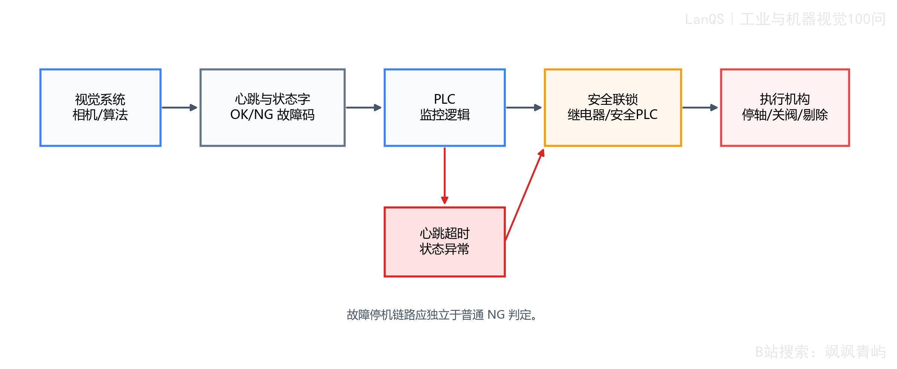
</p>

<p align="center">图61-1 视觉系统故障到安全停机的联锁路径。</p>

<div class="figure-note">
图中上方为健康运行时的结果路径：视觉系统输出状态字和检测结果，PLC 据此驱动后续互锁与执行器。下方故障路径处理心跳超时、状态字异常和通信丢失，并进入安全联锁。产品判定与设备功能失效需要走不同逻辑；停机类别、响应时间、执行器惯性和诊断覆盖率仍须依据设备风险评估及现场实测确定。
</div>

#### 61.2 心跳与检测结果怎样共同决定停机动作？

不代表。心跳只能证明某个进程或线程仍在运行，不能证明图像采集、定位、测量、分类和结果发布这一整条链路正在正确推进。心跳线程与图像处理线程往往独立运行：处理线程可能因互斥锁死锁、驱动调用未返回或重复处理旧缓冲区而停滞，心跳线程却仍能按周期递增。此时 PLC 看到“程序运行中”，实际结果却已陈旧。

相机也可能返回冻结帧、撕裂帧、全黑帧或饱和帧。若软件没有识别输入异常，算法仍会在无效图像上运行并输出表面正常的 OK、NG 或坐标。仅依靠通信超时和心跳位，无法发现这类静默故障。

可增加三类互补检查：

1. 图像新鲜度检查：计算当前帧与上一帧的差异，或比较轻量校验值。对于正常有运动、照明波动和传感器噪声的现场，连续多帧完全相同或差异极小，应被视为可疑输入。连续次数阈值须按工件运动方式设定；静止工位不能直接照搬该判据。
2. 分阶段进度检查：采集、预处理、定位、测量、分类、结果发布等关键阶段各自更新完成计数或时间戳。若采集计数持续前进而测量计数停滞，可以定位到局部处理链路异常。
3. 输出合理性检查：对近期 OK/NG 结果或测量值建立滑动窗口。长时间重复同一结果、测量值完全不变，或连续 100% OK、100% NG 超出该工艺的合理范围时，应报出软故障并触发进一步确认。

PLC 面向视觉系统的健康状态宜至少区分“进程存活”和“流水线推进”。前者由心跳或通信看门狗确认，后者由帧新鲜度、阶段计数和结果合理性共同确认。只有两类状态均有效时，检测结果才可用于放行、剔除或取放决策。

PLC 侧至少应设置四层检查。

1. 通信活性检查：心跳位、计数器或时间戳是否按约定更新。
2. 状态合法性检查：相机在线、程序运行、当前配方有效等状态是否满足要求。
3. 结果时序检查：一次触发后，检测完成和结果有效信号是否在规定时间内返回，并且与当前工件或触发序号对应。
4. 故障锁存与人工复位：故障发生后保持故障状态，避免通信短暂恢复即自动反复启停。

停机动作也应分级。存在人员伤害、碰撞或危险运动风险时，应将故障送入安全 PLC 或独立安全回路，按经验证的安全功能执行停机。没有直接人身危险、但可能造成批量错分的工位，可在完成当前闭环动作后受控停止输送或禁止下一循环。设计文件需要明确停哪一段设备、当前工位能否完成本周期、在途产品如何隔离，以及哪些状态必须由操作员确认；“检测到故障则停止”不足以形成可执行的逻辑。

#### 61.3 硬件、恢复和诊断怎样形成闭环？

如果 PLC 仅通过软件报文得知视觉故障，视觉工控机、其电源或软件栈本身失效时，故障信息可能无法送达。可增加独立故障输出触点，并接入 PLC 数字输入或安全继电器；风险较高的设备还可将视觉在线状态、光源电源故障等关键状态纳入安全 PLC 的诊断逻辑。

还应检查供电和布线的单点故障。相机、交换机、工控机和 PLC 共用脆弱电源时，电压跌落可能使多个节点同时失联，既影响控制，也增加故障定位难度。将视觉侧供电、网络设备和控制侧供电分区，有利于诊断和维护。高速或高惯量设备必须计算断电后的实际残余运动，控制信号进入停机状态不等于机构已经停止。

视觉故障消失后不宜立即自动恢复生产。操作员应确认相机连接、光源、网络、软件、工件位置和治具状态已经恢复；随后在 HMI 上执行复位。PLC 再检查安全门、气压、伺服使能、急停回路、视觉在线状态和工位缓存，条件全部满足后才允许进入待机或重新启动。

停机前的在途产品尤其需要处理。故障发生时，设备中可能已积累多个半周期或完整周期的工件；未经隔离、清空或复检，旧工件可能被当作新工件再次检测。对于间歇性网线接触不良、交换机不稳定等问题，人工确认也可以避免设备在短时间内反复启停。恢复的判据应是系统重新具备可信检测能力，而不只是通信暂时恢复。

故障日志至少应包含时间戳、设备 ID、工位 ID、故障类型、故障前后心跳值、最后一个有效检测结果、当前配方或任务号，以及 PLC 实际采取的停机动作。若视觉侧能够区分相机枚举失败、曝光超时、算法超时、图像保存失败和磁盘空间不足，也应将这些字段映射到 HMI 或上位系统，而非只留下一个笼统的“视觉故障”。

日志的作用不仅是事后维修。相机断线、软件崩溃、相机掉电和检测超时对应的排查路径不同。只有一个通用报警位时，维护人员每次都要从头判断故障层级。已有 MES、SCADA 或设备健康平台的场景，可将诊断记录同步到上层，用于关联批次停机、网络抖动和班次差异。

#### 61.4 现场部署时如何确定超时窗口？

故障检测窗口应高于最坏正常周期，而不能以平均周期作为阈值。平均值附近本来就会有大量正常波动，容易产生误停机。故障、完成和结果有效应使用不同信号，避免一个位同时表达多个含义。投产前应进行失效演练：拔掉相机网线、关闭视觉软件、断开光源、模拟交换机掉电、制造结果延迟和冻结帧，逐项确认 PLC 是否进入设计规定的停机路径。

涉及正式安全功能声明的设备，仍需依据相应功能安全标准和风险评估过程确认停机类别、响应时间和诊断覆盖率。视觉系统属于控制系统的一部分，但不能替代功能安全设计。

设心跳的平均周期约为 120 ms，已测得的最坏正常周期为 150 ms，周期抖动的标准差为 8 ms。作为说明性计算，可取：

$$
T_{\mathrm{timeout}}=T_{\mathrm{worst}}+3\sigma
=150+3\times8=174\ \mathrm{ms}
$$

其中，$T_{\mathrm{timeout}}$ 为 PLC 的超时阈值，$T_{\mathrm{worst}}$ 为现场观测到的最坏正常周期，$\sigma$ 为周期抖动标准差。这个算例中的数值仅用于说明阈值选择方法，不可直接用于其他设备。

若阈值设在 120 ms 附近，正常的网络抖动、图像保存延迟和 PLC 扫描波动就可能频繁触发误停机。将阈值放在最坏正常周期之上并留出抖动余量，可降低误触发；代价是实际故障被识别的时间更长。最终阈值必须同时满足现场周期分布、允许停机延迟和风险评估要求。

<p align="center">
  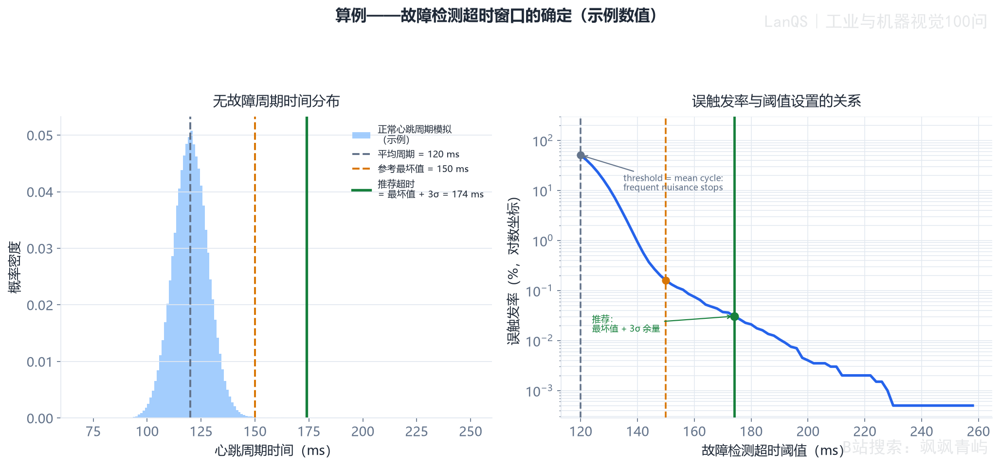
</p>

<p align="center">图61-2 故障检测超时窗口的说明性算例。</p>

<div class="figure-note">
图中将正常心跳周期的分布与候选超时阈值放在一起比较。阈值越接近平均周期，正常波动越容易被误判为故障；阈值提高后，误触发会减少，但故障响应时间随之增加。图中的周期和误触发率用于说明权衡关系，实际参数应以现场采样数据为准。
</div>

### 常见误区

- 将视觉故障按普通 NG 处理，使产线在检测功能失效时继续运行。
- 读取静态心跳电平，却没有检查其是否翻转或递增。
- 心跳正常便认定图像与算法结果可信，忽略冻结帧和局部线程卡死。
- 通信一恢复就自动重启，未处理在途产品和间歇性故障。
- 只记录“视觉故障”一个通用报警，缺少相机、曝光、算法和缓存状态等诊断字段。

### 术语与符号表

- 心跳：周期翻转、递增或更新时间戳的活动标识。
- 看门狗：在预定时间内未观察到期望状态变化时置故障的监控逻辑。
- 安全联锁：由安全继电器或安全 PLC 等实现的、可验证的停机条件。
- 状态字：用多个位或字段承载相机在线、程序运行、配方有效等状态的数据单元。
- 结果新鲜度：当前结果是否确实来自本次有效触发和新获取图像的属性。
- 故障锁存：故障发生后保持故障状态，直至人工确认并完成复位。

### 延伸阅读

- IEC 61508，《电气/电子/可编程电子安全相关系统的功能安全》。
- ISO 13849-1，《机械安全 控制系统安全相关部件》。
- ISO 12100，《机械安全 设计通则 风险评估与风险减小》。
- PROFIBUS & PROFINET International，PROFIsafe 技术资料。

---

---

# 第62问　如何为视觉系统设计心跳信号，以监控其在线状态？

心跳用于监视视觉节点是否仍在线、主业务循环是否持续推进，以及通信是否仍在接收新状态。它是服务可用性监控的一部分，不能单独证明图像、算法结果或安全功能已经满足要求；这些内容还需要状态合法性、结果时序和设备风险控制共同保证。

#### 62.1 心跳应表达什么状态？

心跳是视觉系统周期性发送的活动标识。PLC、上位主机或监控层不必了解算法此刻执行到哪一步，只需确认视觉节点在线、主循环仍在推进、通信链路仍有新数据。常用编码包括翻转位、递增计数器、时间戳或序列号；接收侧以规定时间窗口内是否出现新的有效变化作为判据。

视觉节点的失效可分为两类。相机掉电、交换机故障或连接器松动会使节点物理离线；软件死锁、采集线程阻塞或算法线程挂起时，进程可能仍存在，却已无法提供可靠检测服务。没有心跳时，PLC 只能从检测结果未按时到达推测异常，既难以区分正常节拍波动与故障，也会延迟处置。

#### 62.2 心跳字段、协议和接收侧判定怎样设计？
最小设计只需一个会变化的活动字段。实际设备宜同时提供状态摘要：视觉系统处于运行、待机、故障、配方切换、相机离线，还是结果暂不可用。活动字段回答“是否有新更新”，状态摘要回答“该更新代表什么状态”；两者不能相互替代。

带宽允许时，可附加时间戳、软件版本、当前任务 ID、在线相机数量、队列积压和最近错误码。这些字段供工程人员在节拍异常或现场排故时快速定位问题，而非要求 PLC 在每个扫描周期执行复杂诊断。字段名称、数据类型、字节序、计数回绕和版本兼容规则都应固定；同一字段在不同版本中改变含义，会破坏长期维护性。

接收方为 PLC 时，优先采用既有设备稳定支持的工业协议或 I/O 映射。接收方为上位监控平台或边缘网关时，可采用 MQTT、TCP Socket 或 OPC UA，但必须定义断线、重连、重复消息和旧消息的处理方式。

心跳周期应由允许故障响应时间、PLC 扫描预算和实测抖动共同确定。高速分拣、飞拍定位可能采用 100 ms～500 ms 的周期；节拍较慢、只需分钟级在线监控的应用可放宽到 1 s 或数秒。这些数值只用于说明量级，不能直接作为项目推荐值。周期过短会增加通信负载并提高正常抖动下的误报警概率，周期过长又会推迟故障发现。

<p align="center">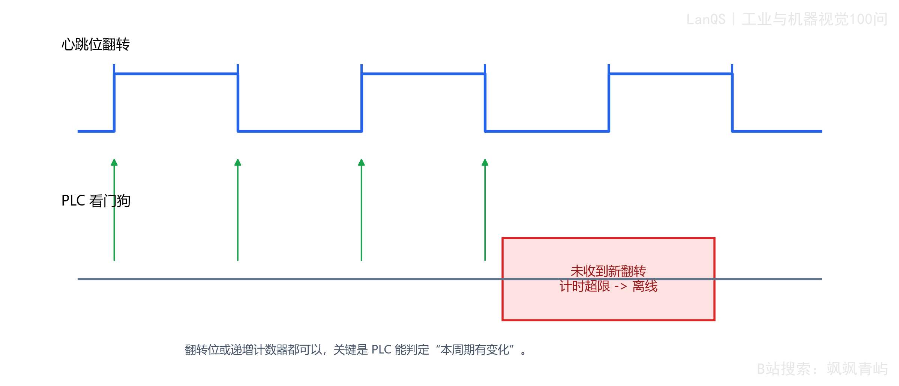</p>

<p align="center">图62-1 心跳翻转与 PLC 看门狗超时的关系。</p>

<div class="figure-note">
视觉系统每次输出新的翻转后，PLC 将看门狗计时复位；在规定窗口内未观察到新变化时，计时继续累加，超过阈值便进入离线或故障状态。静态电平不能证明节点在线。图用于解释心跳周期、看门狗复位和超时余量之间的关系；多节点仲裁、报文重传和冗余网络需要在具体系统中另行设计和验证。
</div>

视觉侧发布心跳时，应关联真实业务循环。可由主调度循环在关键检查完成后更新，也可要求采集、处理和发布等关键线程各自按期上报，只有全部满足条件才发布健康状态。让完全独立的定时线程持续翻转心跳，会掩盖采集或算法线程已经卡住的情况。

接收侧需同时检查：是否收到新报文；活动字段是否真正变化；状态字段是否处于允许范围。仅收到报文，不能排除设备重复发送旧包；计数器递增，也不能证明相机和处理链路仍有效。心跳应与图像新鲜度、结果时序和故障状态配合，形成服务可信度判断。

#### 62.3 超时阈值如何计算和验证？

超时阈值可按下式估算：

$$
T_{\mathrm{timeout}}
=N\,T_{\mathrm{heartbeat}}
+T_{\mathrm{scan}}
+T_{\mathrm{jitter}}
+T_{\mathrm{margin}}
$$

$T_{\mathrm{heartbeat}}$ 为心跳周期，$N$ 为允许连续遗漏的周期数，$T_{\mathrm{scan}}$ 为 PLC 扫描和通信任务延迟，$T_{\mathrm{jitter}}$ 为网络或软件调度抖动，$T_{\mathrm{margin}}$ 为额外工程余量。阈值既要覆盖正常扫描和网络波动，也要满足设备需要的故障响应时间。

若心跳周期为 100 ms，允许遗漏 3 个周期，基础项为 300 ms。扫描与抖动合计预留 80 ms 时，阈值为 380 ms；预留 150 ms 时，阈值为 450 ms；若项目还需 50 ms 的附加工程余量，阈值可取 500 ms。这里所有数值均为说明性算例，必须以现场实测周期分布和风险要求复核。

取 $T_{\mathrm{heartbeat}}=100\ \mathrm{ms}$、$N=3$、$T_{\mathrm{scan}}=30\ \mathrm{ms}$、$T_{\mathrm{jitter}}=50\ \mathrm{ms}$，且暂不增加额外余量：

$$
T_{\mathrm{timeout}}=3\times100+30+50=380\ \mathrm{ms}
$$

若在 $t=700\ \mathrm{ms}$ 后不再收到新翻转，看门狗从最后一次有效翻转起累计经过时间，并在约 $t=982\ \mathrm{ms}$ 越过阈值。掉线开始时已经存在约 100 ms 的累计时间，因此越限相对最后一次翻转约为 282 ms，而非重新等待完整的 380 ms。快速、中速、慢速场景仅用于展示同一公式的尺度变化。

<p align="center">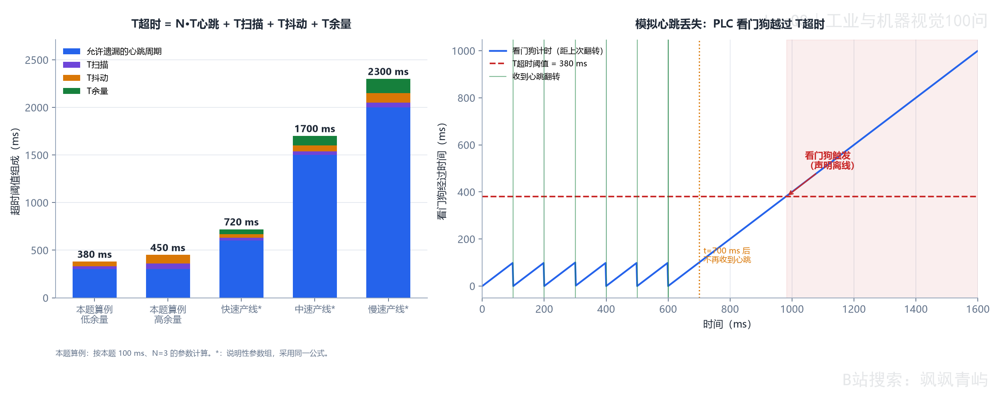</p>

<p align="center">图62-2 超时阈值组成与心跳丢失仿真。</p>

<div class="figure-note">
左图比较心跳周期、遗漏次数、扫描开销、抖动和余量对阈值的贡献；右图展示每次收到翻转后看门狗复位、掉线后累计越限的过程。图中的快速、中速、慢速参数均为说明性输入，工程设定应以实际网络、PLC 扫描和故障响应要求为准。
</div>

#### 62.4 状态约定、误判控制和可靠性验证如何完成？

协议应明确活动字段、整体健康状态、致命错误码和暂时忙但仍可使用的状态。多相机系统还需说明心跳按整机、相机、算法任务还是工位发布。忙与故障不同，配方切换也不一定需要停机；所有相机离线、检测结果无效和连续采集失败则不应被列为正常在线状态。

假在线来自心跳与实际业务循环脱钩；假离线多由阈值过紧、状态边界不清或正常抖动造成。前者通过关键线程共同参与健康判定减小，后者通过合理阈值、分层状态和短时间去抖减小。心跳报文应短小、稳定且易于解析；详细诊断信息可放入状态字或独立报文。

测试应覆盖相机网络物理断开、视觉主循环暂停、网络抖动、PLC 扫描拥塞、配方切换和软件热更新。每项测试都要确认视觉状态变化、PLC 超时报警、站内处置和恢复过程符合设计。交付文档应记录字段定义、周期、阈值、故障码和测试程序，供后续维护人员对照执行。

### 常见误区

- 读取心跳位当前电平，未判断是否按期发生新变化。
- 只用标称周期设置超时，未计入扫描、抖动和工程余量。
- 心跳线程与采集、处理和结果发布完全脱钩。
- 用一个标志混合表达故障、检测完成和结果有效。
- 超时窗口贴近平均周期，正常波动便产生频繁报警。
- 从未实际断网、暂停主循环或模拟交换机故障。

### 术语与符号表

- 心跳：周期发送的活动标识，可为翻转位、递增计数器或时间戳。
- 看门狗：收到有效心跳时复位、未收到新变化时累计时间的监控逻辑。
- 假在线：心跳持续更新而实际检测功能已经失效的状态。
- 假离线：系统正常工作却因阈值过紧或正常抖动被误判为故障的状态。
- MQTT：轻量发布/订阅消息协议，常用于上位监控和边缘平台。
- OPC UA：用于工业系统间结构化数据互操作的标准。

### 延伸阅读

- IEC 61508 系列，功能安全相关概念。
- OPC Foundation，《OPC Unified Architecture Specification》。
- OASIS，《MQTT Version 5.0 Specification》。

---

---

# 第63问　什么是 MES？视觉系统应该向 MES 上传哪些数据？

#### 63.1 MES 的职责边界与视觉数据的最小闭环是什么？

MES 是制造执行系统，处在企业资源计划系统（ERP）等计划管理系统与 PLC 等现场控制设备之间。它把工单、物料批次、工序执行、质量记录、人员和设备状态关联起来，使一件产品在生产过程中的经历能够被查询和追溯。

几类系统的职责要分开理解。PLC 处理触发、互锁、节拍和执行器动作；监视控制与数据采集系统（SCADA）侧重设备监控与操作显示；ERP 管理订单、计划和经营资源；MES 面向生产执行与质量追溯。视觉工位接入 MES 后，向上提供检测结论、缺陷证据、过程统计和设备状态；曝光、触发、定位和剔除仍留在视觉系统与现场控制回路内。

只要产品需要返工追踪、批次比较、良率统计或投诉调查，视觉结果就不能停留在工位电脑里。MES 的价值在于把这次检测与具体产品、工单和生产条件连成一条可复查的记录。

#### 63.2 上传哪些数据，图像应怎样保存？
OK/NG 只能反映一次判定的结果，无法回答这次判定是对谁、在何种条件下作出的。一条可用于追溯的视觉记录至少应能对应到产品标识、检测时间、工位、配方或程序版本，以及判定依据。缺少这些信息，后续即使发现某一批次的 NG 率升高，也很难把问题关联到物料、设备、工艺参数或软件版本。

图像也不必全部写入 MES。许多项目在 MES 中保存记录主键、结果字段和图像索引，原图存放在工位服务器、网络附属存储（NAS）或对象存储。复核时由记录中的路径或唯一键定位图像实体。这样既保留证据链，也避免把 MES 数据库当作长期的大文件仓库。

<p align="center">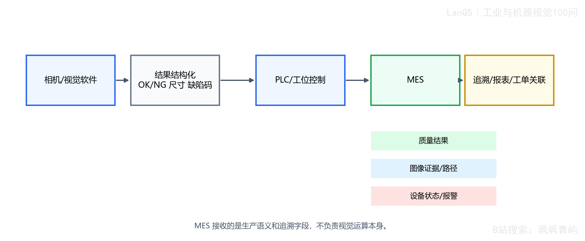</p>
<p align="center">图63-1 视觉系统向 MES 上传数据的典型流程。</p>
<div class="figure-note">
图中“结果结构化”是视觉工位进入 MES 的关键一步：相机和算法先产生检测信息，再把它整理成可关联、可检索的记录。MES 接收质量结果、图像证据或路径、设备状态和报警，用于工单关联与追溯；它不参与视觉算法的逐帧计算，也不承担毫秒级控制。
</div>

字段应围绕“能否复原一次检测事件”来组织。以下四类信息通常构成基础记录。

| 字段类别 | 典型字段 | 用途 |
| --- | --- | --- |
| 产品与工单关联 | 序列号、条码或二维码、工单号、批次号、设备 ID、工位 ID、班次 | 将结果绑定到实际产品和生产上下文 |
| 检测结果 | 检测时间、总判定、缺陷类别和数量、缺陷坐标、测量值、阈值或配方版本、分数 | 说明本次检测发现了什么、按什么条件判定 |
| 证据索引 | 原图路径、缩略图路径、感兴趣区域（ROI）裁剪图路径、标注层引用 | 支持复核、返工和投诉调查 |
| 设备与运行状态 | 相机在线状态、光源设定、程序版本、单件周期、故障码、班次产量 | 支持设备诊断与过程分析 |

项目初期可以先实现产品关联、结果和配方版本，再逐步补充证据与设备状态。字段是否上传取决于后续用途：若 MES 只做产量统计，需求较少；若还要做质量改进、故障分析和批次关联，记录必须保留足够的上下文。

全量原图实时写入 MES 通常会带来不必要的负担。原图体积大、读取频率低、保存周期长，适合存放在专门的文件服务器、NAS 或对象存储中；MES 保存检测记录和图像索引即可。每件产品都保留结构化记录，而缺陷图、低分图、返工图等证据按规则选择性保存，是更容易扩展的做法。

图片是否保留、保留哪一种以及保存多久，应由风险和用途决定。尺寸测量的争议件可能需要保留原图和测量叠加层；普通 OK 件可能只保留记录；强制追溯场景还应将图像路径、文件校验值和保留期限写入受控要求，避免记录存在而证据文件已失效。

以下参数只用于说明计算口径：单工位节拍为 3 s/件，每天运行 3 个 8 h 班次，有效运行率为 85%。每日检测数量为

$$
N_{\mathrm{day}}=
\frac{3\times8\times3600\times0.85}{3}
=24\,480\ \mathrm{件/日}。
$$

假定每条结构化记录有 26 个字段，每字段平均占用 24 B，则单条记录为 624 B，每日结构化记录量为

$$
D_{\mathrm{record}}=
\frac{24\,480\times624}{1024^2}
=14.57\ \mathrm{MiB/日}。
$$

再假定原图为 3 MiB/张，缺陷件占 2%，低分或返工件额外保存 1%，则全量上传原图约为 71.73 GiB/日；只为约 3% 的产品保存证据图像时，总量约为 2.15 GiB/日，约为全量方案的三十三分之一。这里的 MiB 和 GiB 按 1024 进位，所有输入都必须用现场节拍、图像压缩方式、保存比例和保留期限替换后重新核算。

<p align="center">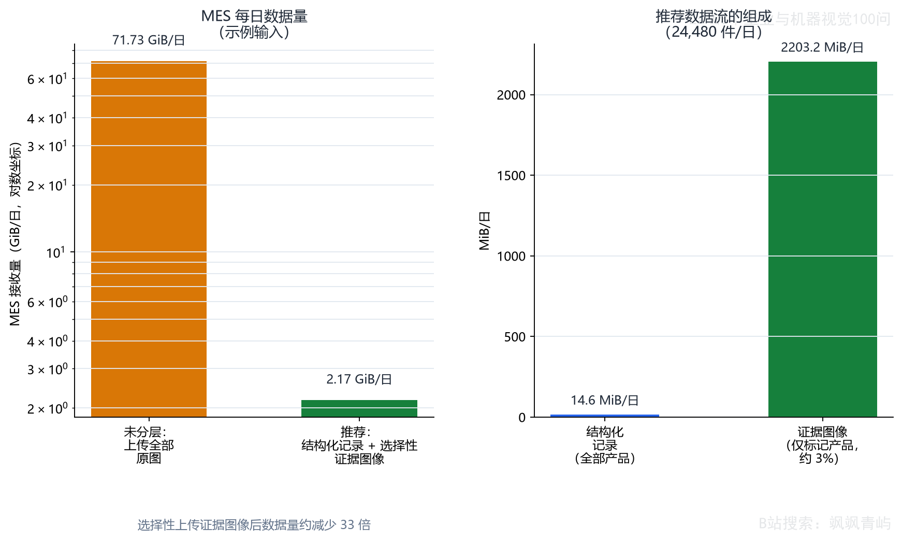</p>
<p align="center">图63-2 MES 日数据量的说明性估算。</p>
<div class="figure-note">
左图比较全量原图上传与选择性证据上传的日数据量，量级差异主要来自原图；右图说明推荐方案中，结构化记录覆盖全部产品，证据图像只覆盖有保存价值的少数产品。图中的 24,480 件/日、3 MiB/张和 3% 保存比例均为说明性输入，不能据此直接确定网络带宽或存储采购容量。
</div>

#### 63.3 接口时序、数据一致性和断线处理怎样设计？

视觉结果可经 PLC 汇总后由上层读取，也可由视觉工控机直接连接 MES、数据库或中间件。字段很少且工厂接口集中管理时，经 PLC 汇总便于维护；字段复杂、包含图像索引，或需要缓存、重发和状态查询时，视觉工控机直连上层系统更合适。无论采用哪种接口，PLC 都应保留在实时控制路径内。

现场动作与业务上传要使用不同的时限。OK/NG、测量值和剔除许可必须在当前工位周期内到达 PLC；追溯记录可以在动作完成后异步上送。若让 MES 的数据库响应决定相机采集、PLC 握手或剔除时序，上层系统的抖动会直接变成产线节拍风险。

每次检测应在工位侧生成唯一记录 ID，并让产品 ID、图像证据、测量值、配方版本和最终判定围绕该 ID 关联。条码属于本件产品而测量值写入上一件记录、图像路径未写入却已提交 OK/NG，都会造成表面上有数据、实际无法追溯的情况。

接口设计至少要明确三件事：记录何时创建；哪些字段在本地落盘后才允许进入上传队列；MES 如何处理重复提交。上传端应允许安全重试，MES 则按唯一记录 ID 做幂等处理，即重复收到同一 ID 时只保留一条有效记录。工位序号或记录 ID 的对账还能暴露未送达或缺失的记录。

对一般检测工位，MES 离线不应直接中断相机采集、算法计算、PLC 握手和剔除动作。视觉结果先写入本地持久化队列，例如嵌入式数据库、追加文件或磁盘持久化消息队列；独立上传任务在连接恢复后补发。队列必须能跨进程重启保存，内存中的临时缓存不足以承担追溯数据。

长时间中断时，队列容量和放行策略必须预先写入项目要求。建议在容量接近上限前报警，并明确优先保存 NG、返工和关键证据；普通 OK 记录能否汇总、何时隔离产品或停止放行，需要由产线的质量风险决定。药品、医疗器械、航空航天等强制追溯场景，无法确认记录写入时的处置规则应在验证文件和操作规程中确定。

连接恢复后，最危险的情况是半次写入后重试造成重复计数，或队列溢出造成记录缺口。唯一记录 ID 加幂等写入解决重复问题；按工位序号或 ID 序列对账用于发现缺失问题。没有这两项约束，“缓存后重发”仍不足以形成可靠追溯链。

#### 63.4 数据进入 MES 后能支持什么应用？项目边界如何写？

基础应用包括良率统计、缺陷 Top-N、批次比较和返工追踪。将视觉记录与物料批次、设备维护、环境温湿度和班次信息关联后，可以判断某类缺陷是否集中在特定时间段、设备状态或物料批次。客户投诉处理同样依赖时间戳、产品标识和图像证据，用于区分问题更可能发生在制造、包装还是运输环节。

结构化的测量值和版本字段还可进入统计过程控制（SPC）、过程预警和模型再训练。前提是量测口径、配方版本和数据质量受控；仅有 OK/NG 的历史记录，无法补出当时的缺陷位置、测量值和成像证据。

视觉系统负责产生可信的检测数据和必要证据，PLC 负责实时工位动作，MES 负责生产执行、追溯和统计分析。职责边界明确后，接口设计也会清晰：控制信息先满足周期时间，业务信息再满足完整性与可追溯性；图像主体进入专用存储，MES 保存能够关联和检索它的记录。

### 常见误区

- 只上传 OK/NG，缺少产品标识、工位、配方版本和判定依据。
- 将所有原图直接写入 MES 数据库，没有区分记录、索引和图像实体。
- 让 MES 的上传延迟阻塞相机采集、PLC 握手或剔除动作。
- 未建立唯一记录 ID，网络重试后出现重复记录或错件关联。
- 本地队列只放在内存中，或队列接近上限时没有报警与处置规则。
- 在强制追溯产线中，未预先规定 MES 不可用时的隔离和放行策略。

### 术语与符号表

| 术语 | 含义 |
| --- | --- |
| MES | 制造执行系统，负责生产执行与质量追溯。 |
| ERP | 企业资源计划系统，面向订单、计划和经营资源。 |
| SCADA | 监视控制与数据采集系统，侧重监控和操作显示。 |
| ROI | 感兴趣区域；可作为缺陷或测量证据的局部图像。 |
| NAS | 网络附属存储，用于保存原图等大文件。 |
| 幂等上传 | 同一记录重复提交，系统仍只产生一条有效记录的接口特性。 |
| 背压 | 上层系统可连接但接收速度低于工位产生数据速度的状态。 |
| 持久化队列 | 数据写入磁盘等非易失介质后，进程重启仍可继续处理的本地队列。 |

### 延伸阅读

- ISA-95（IEC/ISO 62264），企业系统与制造控制系统集成。
- MESA International，MES 功能框架。
- GAMP/ISPE 制造 IT 系统验证资料，适用于受监管追溯场景。

---

---

# 第64问　如何让视觉系统的时钟与工厂网络时钟保持同步？

#### 64.1 同步需求、PTP 与 NTP 如何选择？

视觉系统与 PLC、机器人、编码器、其他相机或追溯系统协同工作后，时间成为多个设备对齐事件、判断先后、复盘事故和融合传感器数据的共同坐标。各设备没有共同时间基准时，问题有时不会立即报错，却会在数据关联时悄悄出错。

例如，工件依次经过条码读取、视觉检测、剔除和称重工位，如果每个工位都使用自己的时钟，事后很难证明哪条缺陷记录对应哪一个实物。两台相机从不同角度拍摄同一事件时，几毫秒的时间差就可能破坏多视角对应和轨迹重建。算法本身即使正确，底层时钟不一致也会使系统结果无法使用。

PTP（精确时间协议，IEEE 1588）常用于工厂网络中的高精度同步。它在主时钟与从时钟之间交换带时间戳的报文，估计网络路径延迟，再调整从时钟，使各设备接近同一参考时间。NTP（网络时间协议）解决的是服务器和工作站的通用系统时间对齐问题，常用于毫秒级日志对齐；协同曝光、运动关联等更紧的时间预算则通常需要 PTP 及与之匹配的设备和网络条件。

两者服务于不同精度层级。只要求各台设备的报表时间大致一致时，NTP 通常已经够用；如果要把曝光时刻、编码器位置和机器人动作对齐到严格时间预算，应采用 PTP。选协议前应先写清楚时间同步要服务的功能。

#### 64.2 设备、网络和时间戳应满足哪些条件？

当任务需要严格的跨设备时基时，相关设备应支持 PTP，并优先采用硬件时间戳。硬件时间戳在网卡的 MAC（介质访问控制）层或 PHY（物理层）记录同步报文时间，能避开操作系统调度、中断延迟和软件队列带来的主要不确定性。PTP 支持、硬件时间戳启用状态与当前网络下的实际偏差，应分别确认；只做一般日志对齐的设备不必强行采用 PTP。

设备的本地振荡器也要足够稳定。两次同步报文之间，时钟仍会依靠本地振荡器运行；振荡器越不稳定，间隔内的漂移越大。视觉软件还需把同步时间绑定到曝光事件，或写入图像元数据。若图像仍使用处理完成时间，网络同步的价值无法传递到实际分析的数据上。

软件时间戳受主机负载和驱动路径影响较大；硬件时间戳能显著降低这种抖动，并为亚微秒级同步提供基础。最终精度仍取决于相机、网卡、交换机、PTP 配置和现场网络，必须以设备手册和实测偏差为准。许多 GigE Vision 相机通过 GenICam 特征 `GevIEEE1588Enable` 提供 IEEE 1588 的启用入口。

<p align="center">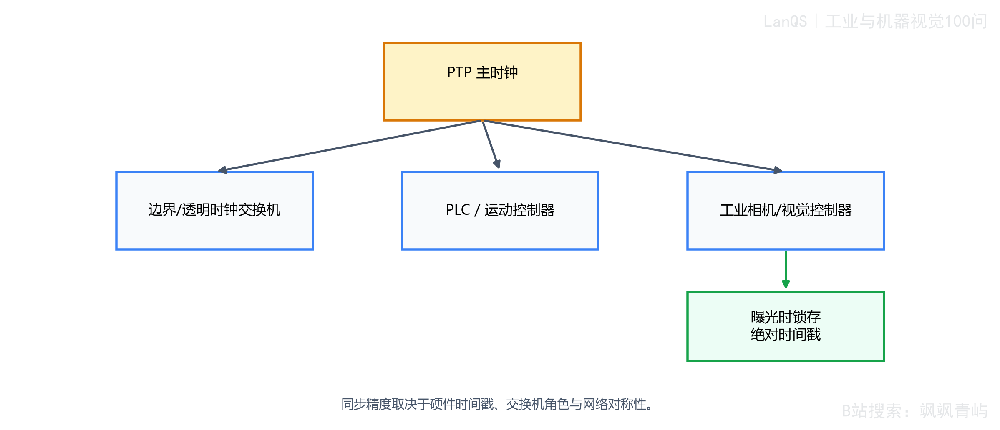</p>
<p align="center">图64-1 视觉网络中的 PTP 主从同步层级。</p>
<div class="figure-note">
图 64-1 从上到下表示 PTP 大师时钟、网络设备与控制器、相机和曝光时刻锁存之间的时间参考关系。箭头表示同步关系和时间参考的传播方向，不表示普通业务数据流。阅读这张图时，应同时检查设备是否支持硬件时间戳、交换机承担哪一种 PTP 角色、链路延迟是否近似对称，以及应用程序是否把同步时间真正写入曝光或图像元数据。
</div>

PTP 报文在交换机中的驻留时间、不同方向链路的延迟差以及网络拥塞产生的排队抖动，都会影响协议对路径延迟的估计。支持透明时钟或边界时钟的工业交换机，就是为了测量或补偿这类影响而设计的。

如果中间网络设备不能正确处理 PTP，或者同步报文长期排在大量普通业务流量之后，即使相机和控制器都支持硬件时间戳，同步质量也会下降。因此选型时还要确认交换机角色、网络路径稳定性和报文优先级配置。

#### 64.3 如何验证同步有效，并发现运行中的退化？

多数检测和追溯任务关注曝光事件发生的时间，而非图像文件写入磁盘的时间。绑定到曝光开始、曝光结束或传感器锁存时刻的时间戳，才适合与编码器位置、机器人姿态或另一工位事件进行工程关联。

不同设备绑定的事件点可能不同：有的记录帧开始，有的记录曝光结束，有的区分传感器锁存和数据输出。必须查阅设备手册确认定义，不能把“图像带时间戳”理解为任意时间点都等价。

验证不能停留在软件界面显示“PTP Locked”或“已同步”。应读取设备报告的偏差、路径延迟和时钟状态；用示波器比较 1PPS（每秒一个脉冲）输出与主参考脉冲；让多台相机同时触发并比较图像时间戳分布；还要对同一物理事件在不同设备上的记录时间进行交叉核对。

对于追溯系统，还应检查数据库中的时间戳是否与设备日志一致。网络层同步正常时，应用层仍可能使用本地时间或错误时区，导致导出的记录无法对齐。验证范围应一直延伸到最终数据消费者。

调试程序显示“已锁定”并不能证明实际结果仍然正确。从时钟失去主时钟联系，或依据错误的偏差估计进行校正时，状态字段可能在实际同步已退化后仍显示正常。更可靠的方法是设置一个同步机制没有参与产生的共同物理事件，让两个节点独立记录它的时间，再比较两者的差值。例如使用可见频闪、共享硬件触发沿，或让相机和 PLC 时间戳 I/O 事件同时观察同一瞬间。

如果系统要求两个节点的偏差小于规定预算，那么同一事件的两个时间戳就应落在该预算内。这个方法可以重复运行，成为产线健康检查，而非只在调试阶段做一次。

以下现象应引起怀疑：多相机拼接结果的空间错位随班次逐渐增大；MES 事件日志中同一物理事件的视觉时间和 PLC 时间偶尔出现不合逻辑的先后关系；本应同时发生的事件在追溯记录中出现超过同步预算的时间差。单个现象也可能来自机械位移、日志链路或标定问题，但若现象逐渐加重，应先进行独立的同步检查。

怀疑漂移后，先检查大师时钟是否从全球定位系统（GPS）等高质量参考源切换到内部振荡器或备用 NTP 源；再检查主从方向的路径延迟是否对称，尤其是交换机、光纤、VLAN 或布线发生变化后；最后用共同事件检查多个节点，判断是单台设备异常，还是大师时钟和共享网络基础设施的系统性问题。

#### 64.4 故障排查和项目验收要求怎样写？

可以按层排查。物理层包括网线松动、光模块问题和铜链路协商不稳定；网络层包括 VLAN（虚拟局域网）、QoS（服务质量）、ACL（访问控制列表）或防火墙规则错误；协议层包括主从角色、域号和 PTP 配置文件不匹配；设备层包括网卡不支持硬件时间戳、相机只是名义上支持 PTP，或软件没有把同步时间写入图像元数据。

同步故障应按网络、设备配置和应用时间戳分层定位。先确定故障所在层，能避免无关的算法参数调整。

要求至少应明确三件事：哪些设备彼此同步、需要达到什么精度、该精度服务于什么功能。例如，多相机同步采集可要求设备间偏差小于 1 μs；MES 追溯日志可要求各工位达到毫秒级一致；编码器位置与曝光事件关联时，应明确时间戳绑定曝光结束时刻。

功能目标明确后，设备选择、交换机配置和验收方法才能对应起来。验收指标应落到设备间偏差、事件绑定点和可复现的测试方法，不能只写协议名称。

本题使用两个精度预算：多相机同步采集的设备间偏差小于 1 μs，MES/追溯日志达到毫秒级一致。假设未校正振荡器的漂移率为 50 ppm（百万分之一），这个数值只用于说明计算方法。

时钟误差可近似写成

$$
e(t)=r t,
$$

其中，$r=50\times10^{-6}\ \mathrm{s/s}$ 为漂移率，$t$ 为经过的时间。超过 1 μs 预算只需要

$$
t_{1\,\mu\mathrm{s}}=\frac{1\times10^{-6}}{50\times10^{-6}}=0.020\ \mathrm{s}=20\ \mathrm{ms}；
$$

超过 1 ms 的 MES 预算需要 20 s。若一个 8 h 班次内没有校正，累计误差为

$$
e(8\,\mathrm{h})=50\times10^{-6}\times8\times3600=1.440\ \mathrm{s}。
$$

若把 PTP 简化为每隔 1 s 进行一次相位复位，两次同步报文之间的峰值漂移约为 50 μs，仍会超过 1 μs 的多相机预算。实际 PTP 通过伺服机制持续校正本地振荡器频率，说明性模型以约 0.31 μs 的残余峰值表示这种持续校正的效果；该残余值是模型输入，不能视为所有设备的保证值。

<p align="center">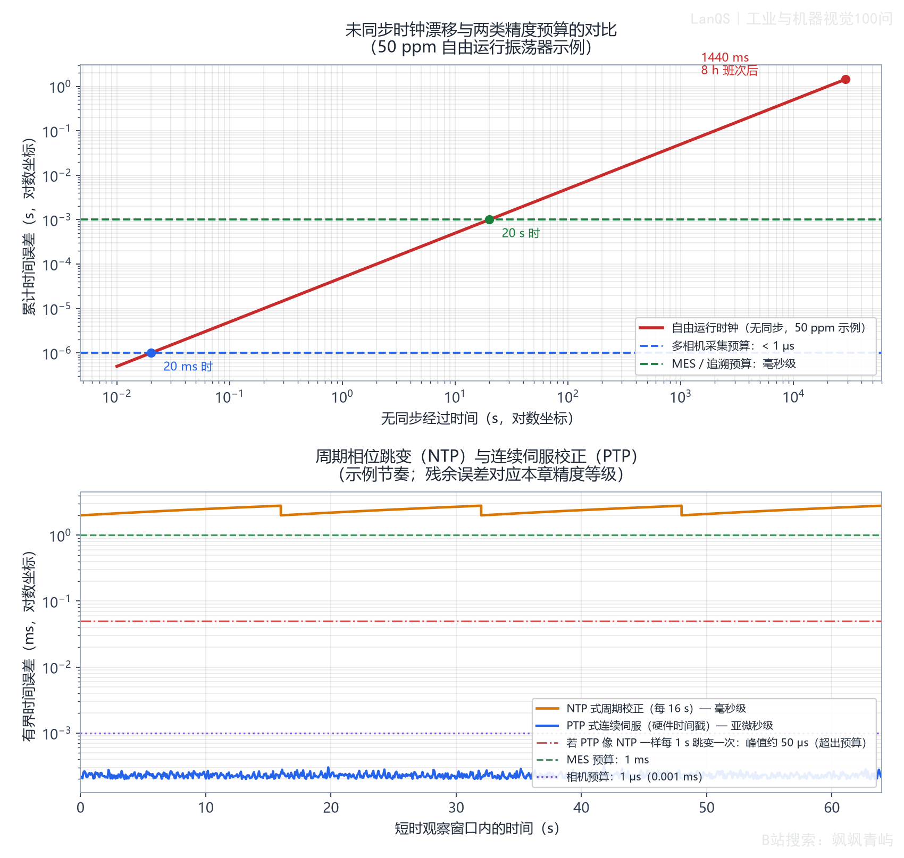</p>
<p align="center">图64-2 未同步时钟漂移与同步精度预算的说明性算例。</p>
<div class="figure-note">
图 64-2 的上方面板表示 50 ppm 漂移率在 8 h 内累积的时间误差；下方面板比较周期轮询和持续伺服对误差的限制。20 ms、20 s 和 1.440 s 来自上述公式，50 μs 是把 PTP 简化成 1 s 周期相位复位时的反例，约 0.31 μs 是示例模型给出的持续伺服残余值。图中的 50 ppm、轮询周期和残余值都是说明性输入，不能当作具体相机、网卡或交换机的性能承诺。
</div>

一条可验收的同步要求应写清四项：同步对象、允许偏差、时间戳绑定的事件点、验证方法。设备选型、交换机配置和应用程序实现都应围绕这四项展开。协议状态只能说明同步机制的内部状态；最终验收仍应检查共同事件和写入追溯系统的时间记录。

### 常见误区

- 把“启用 PTP”等同于支持硬件时间戳和亚微秒同步。
- 网络完成同步，却让软件在图像写盘或处理完成时才打时间戳。
- 只检查相机和控制器，忽略中间交换机和拥塞。
- 假定所有相机记录的是同一个事件点。
- 把“Locked”状态当成整条数据链路正确的证明。
- 只写“保持时钟同步”，不按多相机、编码器关联和 MES 追溯分别规定预算。

### 术语与符号表

- PTP：精确时间协议，IEEE 1588。
- NTP：网络时间协议，通常用于毫秒级系统时间同步。
- 大师时钟：PTP 层级中的顶层参考时钟。
- 边界时钟：先与上级时钟同步，再为下级端口提供主时钟的 PTP 网络设备。
- 透明时钟：测量同步报文在自身内部驻留时间并进行补偿的 PTP 网络设备。
- 硬件时间戳：在网卡 MAC 或 PHY 层记录时间，减少操作系统调度和软件排队造成的延迟不确定性。
- 1PPS：每秒一个脉冲，可作为独立的电气参考来交叉检查同步结果。
- PTP 域/配置文件：决定哪些设备参与同一逻辑同步域及其运行参数。
- `GevIEEE1588Enable`：GigE Vision 相机中用于启用 IEEE 1588 支持的 GenICam 寄存器。
- 共同事件交叉检查：让多个节点独立记录同一明确物理事件，再直接比较时间戳的现场诊断方法。
- 大师时钟故障切换：参考源丢失后自动转向质量较低备用源的过程。
- 路径不对称：主从两个方向的网络延迟不同，会给 PTP 的延迟估计引入偏差。

### 延伸阅读

- IEEE 1588，网络测量与控制系统精确时钟同步协议。
- GigE Vision 标准及 AIA 文档，包含 GenICam IEEE 1588 时间戳功能。
- 工业以太网时间同步相关技术资料。
- EtherCAT 分布式时钟资料，可作为 PTP/NTP 之外的对照参考。

---

---

# 第65问　为什么信号线和电源线要分开敷设？如果无法避免交叉，应怎样处理？

#### 65.1 干扰从哪里来，哪些信号最敏感？

两类电缆传输的物理量不同，对电气干扰的容忍度也不同。电源线为电机、伺服驱动器、变频器（VFD）和加热器提供大电流以及快速开关能量，开关过程具有较高的 dv/dt 和 di/dt，会在周围空间产生明显电磁场。信号线传输传感器读数、编码器脉冲、触发沿、总线数据和视觉通信，对电压毛刺、共模噪声和参考地波动更敏感。

两类电缆长距离平行敷设时，电源线的电场和磁场会通过分布电容、互感以及共模回路耦合到信号线上。表现可能是模拟量漂移、脉冲计数丢失、串口数据乱码、网络链路抖动、相机误触发或偶发的人机界面报警。许多现场故障表现为随机、难复现的噪声问题，线缆布局常常为干扰进入信号链提供了路径。

视觉系统中，围绕采集过程的同步和控制信号最容易受影响：相机触发线、频闪光源控制线、编码器脉冲线、串口配置线和未隔离 I/O。触发沿受污染可能造成提前曝光、延迟曝光或一次触发两次采集；频闪控制信号受干扰会造成帧亮度不稳定；编码器脉冲受到干扰则会直接破坏线扫同步和像素—位置映射。

千兆以太网和 USB 3.0（通用串行总线 3.0）采用差分高速传输，比普通单端导线更耐噪声，但不应因此与变频器输出线捆扎。共模干扰足够大，或屏蔽层接地不当时，链路仍会出现丢包、重传和间歇性断开。

<p align="center">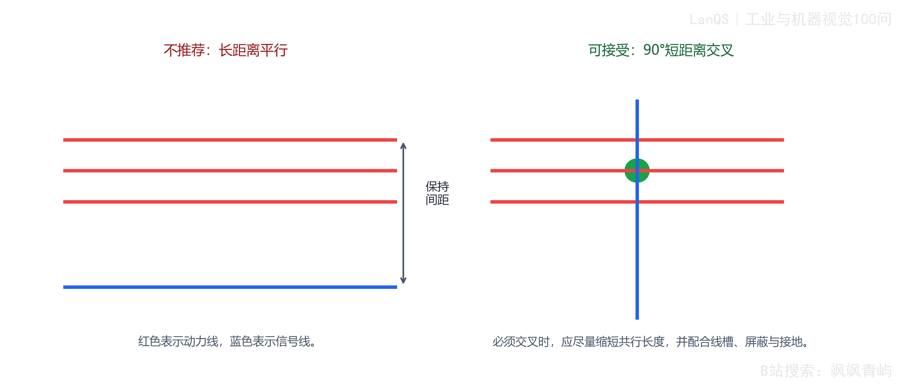</p>
<p align="center">图65-1 电源线与信号线的长距离平行敷设和 90°短距离交叉。</p>
<div class="figure-note">
图 65-1 左侧表示电源线与信号线长距离平行，右侧表示尽量短的 90°交叉。共同平行长度决定主要工程风险：平行段越长，电容耦合和电感耦合的作用距离越大。图中不提供适用于所有系统的固定安全距离，实际间距仍要结合电源电缆类型、信号敏感度、驱动器开关频率和柜内空间确定。
</div>

下面的模型用于把长距离平行的耦合风险量化。μ₀ 是真实物理常数；电流变化率、导体间距、敷设长度和分离距离均为说明性输入，并非某条产线的实测值。两根电源导体分别代表去线和回线，旁边有一根信号导体。

互感近似为

$$
M=\frac{\mu_0}{2\pi}L\ln\left(\frac{r_2}{r_1}\right),
$$

其中 `L` 是共同作用长度，`r₁=s-a/2`、`r₂=s+a/2`，`s` 是信号导体到电源回路中心的距离，`a` 是电源去线与回线的间距，并要求 `s>a/2`。感应电压为

$$
V_{\mathrm{ind}}=M\frac{\mathrm{d}i}{\mathrm{d}t}。
$$

以 `a=6 mm`、`di/dt=2×10⁷ A/s` 为说明性输入，5 m 平行段、间距 5 cm 的感应电压约为 2402.9 mV；5 cm 有效长度、间距 10 cm 的 90°短交叉约为 12.0 mV，前者约为后者的 200 倍。这是理想化模型，未计入屏蔽、绞合、回流路径衰减等因素，不能替代现场测量。

<p align="center">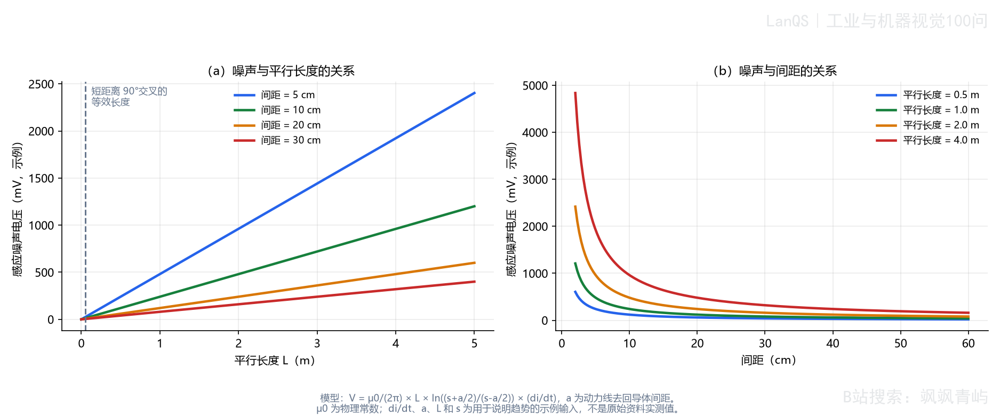</p>
<p align="center">图65-2 说明性电感耦合模型：感应噪声电压与平行长度、分离距离的关系。</p>
<div class="figure-note">
图 65-2 的左侧趋势表示在间距固定时，平行长度增加会使感应噪声近似增加；右侧趋势表示分离距离增加后，感应电压连续下降，不存在脱离系统条件的固定“安全距离”阈值。图中 200 倍的比较来自上述单一模型，只用于建立量级直觉，不能当作实际电缆组合的验收值。
</div>

#### 65.2 分开敷设、交叉、屏蔽和接地怎样配合？

分开敷设应落实到线槽、桥架、金属隔板和机柜分区。电源线与控制、通信线宜使用不同线槽或桥架，并对柜内区域分区；必须共柜时，应在空间允许范围内尽量拉开距离，避免长距离平行。

不存在适合所有系统的统一间距。低压 I/O、4–20 mA 模拟线、千兆以太网、编码器线和伺服动力线的抗扰度不同。间距要求应由干扰源强度、信号敏感度和共同平行长度共同决定，不能只记一个“30 cm”之类的经验数字。

90°交叉可以缩短两类电缆实际靠近的有效长度。电容耦合和电感耦合都与相对方向及共同敷设长度有关；垂直交叉时，两条线只在很小区域内接近，耦合面积和等效互感随之降低。小角度交叉虽只出现一次交点，仍可能形成较长的近似平行段。

因此，应尽量接近 90°，并让交叉段尽可能短。空间允许时，可以在交叉处加金属隔板、独立金属管或额外屏蔽层，进一步降低残余耦合。

屏蔽和接地是必要的辅助措施，但不能弥补根本错误的敷设布局。高干扰电源线与敏感信号线长距离捆扎后再补屏蔽，效果通常有限；屏蔽层接地不当还可能形成新的共模回路。

低频模拟信号和普通 I/O 常采用控制柜单点接地，避免地环流叠加到信号参考上。高速数字和视觉通信电缆的屏蔽层通常需要在连接器处建立完整的高频接地，以保持屏蔽连续性。接地的目的，是为干扰电流提供受控回路，避免它穿过敏感信号参考路径。

#### 65.3 布线完成或故障出现后怎样验证？

验证应覆盖最坏的真实干扰条件。让变频器、大功率伺服和电磁阀按正常高负荷节奏工作，同时记录触发计数、相机丢帧率、网络错误率、编码器脉冲丢失和图像亮度稳定性；关键模拟通道还应同步记录静态与动态噪声。

有条件时，用示波器观察触发线的毛刺、过冲和边沿塌陷，通常比只看 PLC 数据点更直接。许多“偶尔坏帧”只在驱动器高干扰动作时出现，动态测试才能暴露这类问题。

应先确认电磁干扰（EMI）耦合，再决定是否停机、拆柜和重新布线。最有诊断价值的现象有三类：故障时间与变频器加减速、电磁阀动作、焊机起弧或接触器吸合相对应；临时把可疑信号线移离动力线后故障率下降；故障只集中在靠近动力线的某几段，而同机其他相同信号线正常。

成本最低的验证是分离试验：在相同负载条件下临时移开或屏蔽可疑线缆，比较前后故障率。需要更直接的证据时，用示波器观察触发、频闪或通信线上的噪声脉冲，并与附近设备的开关时刻对齐。通信链路的循环冗余校验（CRC）错误、重传和丢帧计数也可以与设备动作时间一起记录。

接地和等电位连接故障可能呈现相似症状，应同时排除：检查信号参考是否多点接地形成地环路，检查屏蔽层是否在低频模拟或普通 I/O 场景下两端接地，以及检查维护改造后是否新增了第二个参考地。故障若随特定线缆的物理距离变化并在临时分离后改善，更接近布线耦合；若随全厂地电位或负载电流变化，且分离无效，则应优先查接地。

规范应明确：哪条线槽承载动力线、哪条承载信号线；相机网线、触发线、频闪线和编码器线分别采用什么电缆；是否需要屏蔽以及屏蔽层在哪里接地；相对于变频器输出线的最小平行长度或隔离方式；无法避免交叉时的角度和物理隔离结构。只有把这些内容写成可检查的设计条件，布线规则才可用于施工、验收和故障追责。

### 常见误区

- 以“没有直接接触”为满足条件，忽略数米平行段仍可能强耦合。
- 以小角度交叉代替接近 90°的短交叉。
- 先长距离捆扎，出问题后只补屏蔽而不调整布局。
- 只在空载或轻载状态验证，不测试变频器、伺服和电磁阀高负荷动作。
- 认为差分高速链路完全不受干扰。
- 为所有电缆类型套用一个固定间距数字。

### 术语与符号表

- EMI：电磁干扰。
- 串扰：相邻电缆或通道通过电容或互感耦合产生的干扰。
- 共模噪声：信号对相对于地同时出现的噪声。
- 屏蔽双绞线（STP）：结合导体绞合与外部屏蔽层的电缆结构。
- 地环路：多个接地点之间存在电位差并形成非预期电流路径。
- 互感 `M`：一个回路的电流变化在另一回路产生感应电压的耦合量。
- `dv/dt`、`di/dt`：电压、电流随时间的变化率。
- 单点接地：各参考连接回到同一公共点的接地方式。
- 分离试验：临时移开或屏蔽可疑信号线，并比较故障率的现场诊断方法。
- 错误计数器：通信驱动器或交换机提供的 CRC 错误、重传和丢帧等统计量。

### 延伸阅读

- Henry W. Ott，《电磁兼容工程》，Wiley，2009。
- IEC 61000-5-2，《电磁兼容：安装与抑制指南——布线与接地》。
- Mark Montrose，《EMC 与印制电路板：设计、理论与布局》。
- NEMA/ODVA 及 PLC 厂商的现场布线指南。

---

---

# 第66问　车间环境光变化（早晚阳光、附近设备闪光）会怎样影响视觉系统？有哪些缓解策略？

#### 66.1 环境光通过什么机制影响成像？

工业视觉通常隐含一个前提：同一种产品反复出现时，成像条件大致相同。车间环境光会直接破坏这个前提。早晚阳光角度变化、天窗漏光、附近设备闪光以及人员经过产生的瞬时阴影，都会改变同一产品在不同帧中的亮度、对比度、反射形状和颜色分布。依赖灰度阈值、边缘清晰度、颜色分离或纹理稳定性的检测任务，就可能出现误检、漏检或位置漂移。

环境光很少均匀地使整幅图变亮或变暗，它更常表现为方向性高光、局部阴影、背景渐变和局部饱和。实验台上稳定的算法不代表在产线仍然稳定；很多现场问题来自成像条件已经偏离调试和验证时的基线。

最直接的机制是曝光和对比度变化。环境光突然增强时，金属反光、覆膜标签和玻璃边缘容易局部过曝，算法需要的细节被压平；环境光降低时，暗部噪声增加，依赖微弱灰度差的边缘变得不稳定。阴影形状和镜面反射也会变化：阴影可能制造假轮廓，高光可能掩盖真实缺陷。

第三种机制是颜色和白平衡漂移。日光、冷白 LED 和暖色灯的光谱分布不同，同一表面会产生不同颜色响应，颜色分拣、胶水识别和印刷检查尤其容易受影响。第四种机制是纹理可见性变化。划痕、凹坑、折痕和压印往往只在特定入射角和反射方向下可见，环境光方向一变，原本明显的缺陷可能从图像中消失。

#### 66.2 硬件控制和主动光占比如何评估？

应先在图像进入相机前抑制环境光。最常见的做法是在工位建立稳定且占主导地位的主动光，使目标区域受到方向、强度和光谱都可控的照明。环形光、同轴光、低角度光和背光的设计，常常比后端增加算法复杂度更能决定检测是否稳定。

在此基础上，可用遮光罩、封闭工位或局部光学腔体把外部光隔离出去。主动光具有明确波长时，可配合窄带滤光片，只让目标波段进入镜头；面对高反光材料时，偏振片可以削弱随机反射和眩光，使材料本身的纹理更稳定地进入图像。

<p align="center">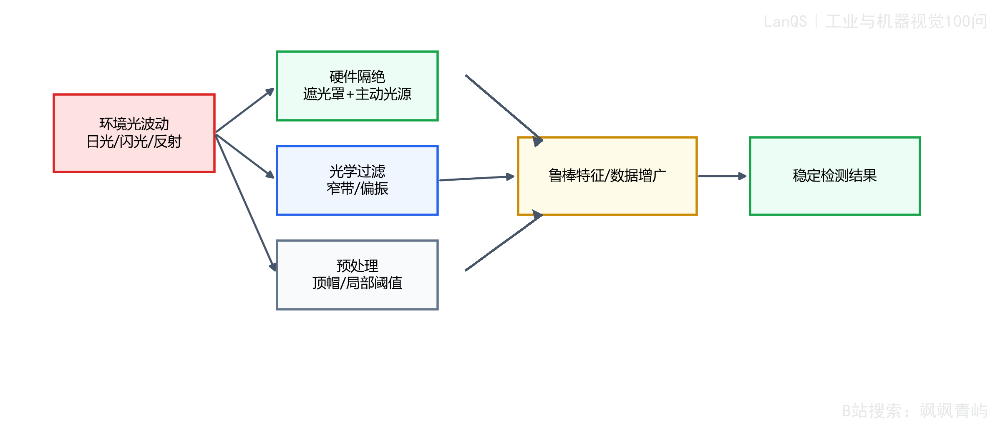</p>
<p align="center">图66-1 环境光干扰的分层处理路径。</p>
<div class="figure-note">
图 66-1 将环境光问题分为外部干扰、硬件隔离、光学滤波和算法补偿等层级，右侧的鲁棒特征与数据增强用于在成像稳定后继续提高容错。阅读时应注意处理顺序：先让主动光和结构遮光控制主要光路，再用滤波削弱频谱或偏振方向不匹配的光，最后处理剩余变化。滤光片带宽、光源照度和遮光结构仍需按具体工位验证。
</div>

下面用一个透明的说明性光度模型，把主动光占主导时的效果量化。设传感器接收信号为主动光分量与环境光分量之和：

$$
S_{\mathrm{total}}=S_{\mathrm{active}}+S_{\mathrm{ambient}}。
$$

定义主动光占主导比为

$$
D=\frac{S_{\mathrm{active}}}{S_{\mathrm{ambient,nominal}}}。
$$

若环境亮度相对变化为 `δ_ambient`，加入稳定的主动光后，总信号的相对变化近似为 `δ_ambient/(1+D)`。再假设预处理独立消除剩余变化的一部分，用于比较光学控制和算法补偿的层级差异。以下参数都是说明性输入：环境光变化 40%，预处理额外消除剩余变化的 50%，主动光占主导比 `D=8`。

模型输出为：无主动光时变化 40.0%；仅预处理时 20.0%；主动光 `D=8` 且不预处理时 4.44%；主动光加预处理时 2.22%。因此主动光占主导本身使示例变化量下降约 89%，而无主动光时单独预处理只下降 50%。预处理叠加后还能继续降低残差，但主要收益已由硬件和光学控制获得。该模型不代表实际工位的测量值。

<p align="center">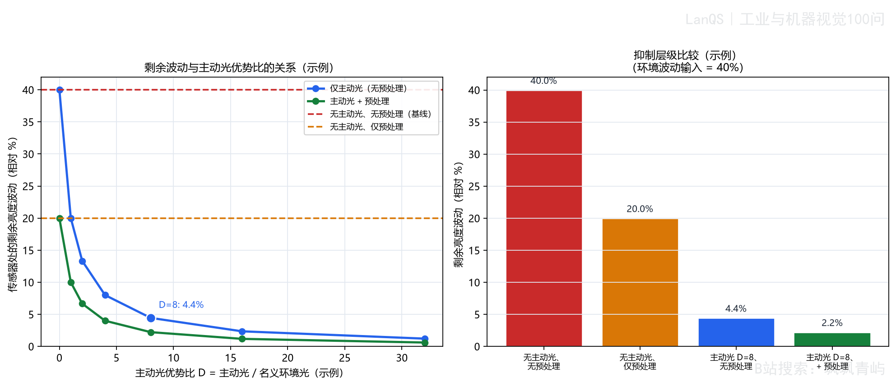</p>
<p align="center">图66-2 不同缓解层级下的说明性剩余亮度变化。</p>
<div class="figure-note">
图 66-2 用同一组说明性输入比较无主动光、仅预处理、主动光占主导和两者叠加四种情况。曲线表达的是相对变化量随主动光占主导比增加而下降的关系，不能被解读成某个相机或光源的实测响应。它适合用来理解硬件控制对环境变化的稀释作用，以及算法补偿在此基础上的增量作用。
</div>

可用照度计或具有已知光谱响应的校准光电二极管测量。先关闭主动光，在目标表面或实际检测平面记录环境光照度 `E_ambient`；再保持环境条件不变，打开主动光，在同一点、同一方向记录总照度 `E_total`。由于两部分照度相加，主动光照度为 `E_active=E_total-E_ambient`，占主导比为 `D=E_active/E_ambient`。

应在视野内多个位置测量，因为环形光、同轴光和低角度光很少完全均匀。中心处 D 较高、边缘处较低时，系统的环境光鲁棒性由视野内最差位置决定，平均值不能代表边缘风险。

D 存在上限。提高主动光功率会增加光源成本和热负荷，并提高金属或高反光表面出现镜面高光过曝的风险。漫反射表面可能因光源变亮而得到更强信号，镜面区域却可能先饱和并污染周围像素。相同工位上的哑光黑件和抛光不锈钢件能承受的光功率不同，D 应按预计最反光的产品变体验证。

窄带滤光片和偏振片也会损失光通量。滤光片会舍弃通带之外的光，偏振片会降低透射强度；交叉偏振为了抑制眩光，损失可能更大。损失的光需要用更长曝光时间、更高增益或更强主动光补回来，而这三种补偿分别带来运动模糊、噪声放大和高光过曝风险。因此光学抑制措施必须与曝光、增益和光源占空比一起设计，不能只按原理选件。

#### 66.3 预处理、算法和现场措施怎样组合？

硬件仍无法完全消除环境光时，可使用对渐变照明更耐受的预处理。顶帽变换、局部阈值、自适应背景扣除和归一化灰度校正，对许多传统视觉任务仍然有效；它们计算量小、结果可解释，便于验证。

颜色任务可优先使用 CIELAB（CIE 1976 L*a*b*）、HSV（色相、饱和度、明度）或归一化色度坐标，避免直接对原始 RGB（红、绿、蓝）通道设置固定阈值。边缘和轮廓任务可更多依靠梯度、结构特征和局部纹理统计。深度学习系统的光照鲁棒性应通过亮度、对比度、阴影和颜色漂移增强获得验证。

这一层的目标，是让最终判定更多依赖不容易随光照变化的特征。传统方法可优先使用边缘形状、相对几何关系、局部纹理统计和归一化对比度；深度学习方法则应让训练数据覆盖真实产线的光照范围，避免模型只记住某一固定照明下的外观细节。

算法鲁棒性不能替代主动光和遮光设计。当环境变化把目标信号压到接近噪声底时，算法无法可靠恢复传感器从未捕获的物理信息。硬件稳定成像，算法处理残余变化，通常更容易获得可验证的系统。

触发时序也是一个可调参数。可以把曝光安排在环境干扰最小的时间窗，或者采用短曝光配合高功率频闪，使主动光在很短时间内占据主导。统一墙面和背景颜色、避免视野中出现裸露的镜面不锈钢、让无关指示灯离开镜头直视方向，也能减少场景中的寄生反射。

变化源有时不在工件，而在镜头前的保护玻璃、光源罩或防尘窗。若系统随运行时间逐步退化，应先检查成像链前端是否污染，再决定是否调整算法阈值。

#### 66.4 怎样验证策略有效，并形成工程结论？

评估不能停在几张观感更好的图像上。应跨不同班次、天气和设备运行状态持续采样，比较误拒率、误受率、位置抖动和关键 ROI（感兴趣区域）的灰度分布稳定性。若方案只在白班稳定、夜班退化，说明它仍受另一类环境变量制约。

对长期运行工位，应保留标准样品和标准拍摄条件，定期检查光源照度、相机曝光、灰度直方图和关键 ROI 对比度，以便尽早发现成像链或产品本身的慢性漂移。

可靠的方案应让主动光在物理上占主导，再由算法吸收剩余变化。若把处理顺序倒置，项目容易陷入反复调阈值、昼夜班表现不一致以及批次变化后重新调试的循环。环境光变化应从成像链开始处理，再评估算法的补偿范围。

### 常见误区

- 只在一种光照下调阈值并立即定版。
- 用算法补偿替代主动光和遮光设计。
- 忽略保护玻璃或光源罩污染，把慢性退化误判为算法问题。
- 对颜色任务直接使用固定 RGB 阈值。
- 不测量真实透过率和照度就加入窄带滤光片或偏振片。
- 认为深度学习模型会自动获得光照不变性。

### 术语与符号表

- CIELAB：将明度与两个色度轴分开的感知型颜色空间。
- HSV：把色相、饱和度和明度分开的颜色空间。
- 顶帽变换：提取相对于局部背景的亮结构或暗结构的形态学操作。
- 自适应阈值：按空间位置计算局部阈值的分割方法。
- 主动光占主导：让受控主动光对传感器信号的贡献相对环境光足够大的设计原则。
- 窄带滤光片：只透过有限波长范围、通常与主动光谱匹配的光学滤光片。
- 偏振片：只透过特定偏振状态光线、常用于抑制镜面眩光的光学元件。
- 照度计：测量单位面积入射光照度的仪器，可用于测量环境光和总光并计算 D。
- 镜面过曝/眩光：由光滑表面强镜面反射导致的局部传感器饱和。

### 延伸阅读

- Forsyth、Ponce，《计算机视觉：一种现代方法》第二版。
- Steger、Ulrich、Wiedemann，《机器视觉算法与应用》第二版。
- Hunt、Pointer，《颜色测量》第四版。

---

---

# 第67问　普通生产中的颜色、纹理和位置出现小幅正常波动时，视觉系统应该怎样处理？

#### 67.1 正常波动的来源和判定边界是什么？

小幅正常波动是任何真实制造过程都会产生的统计噪声。原料批次、温湿度、模具或刀具磨损、夹具和输送机构的机械间隙、人工上料习惯以及表面处理细节，都会让产品的颜色、纹理和位置偏离理想参考，即使产品仍完全符合规格。批量生产中这类波动始终存在，视觉系统应为合格件保留合理的变化范围。

困难在于划定正常波动与真实缺陷之间的边界。阈值过紧会把正常范围较宽的合格件判为不良；阈值过松又会让真实缺陷伪装成正常变化。这个边界定义得是否合理，是判断视觉方案成熟度的重要依据。

颜色受材料成分、染料或颜料比例、加工温度曲线和照明影响，即使合格件也可能在不同批次出现可测差异。纹理与工艺的机械和材料状态密切相关，注塑流痕、压纹、喷涂液滴大小和金属拉丝方向都会在正常范围内轻微变化。位置则会受到上料姿态、夹具重复定位、输送带摆动和热膨胀影响，产生小幅平移和旋转。

这三类量都可能代表正常工艺，也可能是缺陷的早期征兆。只看单个像素或单个坐标而没有更广的上下文，系统无法可靠判断偏差仍在可接受包络内，还是已经越过工艺窗口。

#### 67.2 算法和统计过程控制怎样管理波动？

位置变化通常先做姿态跟踪：在缺陷判定前，利用模板匹配、特征点、边缘基准或 Mark 点定位产品当前的平移和旋转，再让后续 ROI、测量坐标系和缺陷搜索区域随产品坐标更新。定位基准的数量与校正自由度要对应：一个可靠基准只能约束平移；两个不重合基准可同时解出平移和旋转；仿射变换还会引入缩放和剪切，只有产品姿态或成像关系确有这类变化时才应使用。这样能把装夹位置造成的图像差异从后续缺陷判断中剥离出来。

纹理变化需要使用能够容纳正常波动的特征空间。重复纹理可用统计纹理描述子或异常检测方法学习正常纹理边界；几何明确的产品可更多观察边缘、表面起伏方向和结构一致性。单张黄金样本不能承担全部参考作用，逐像素强制匹配会显著增加误拒。

<p align="center">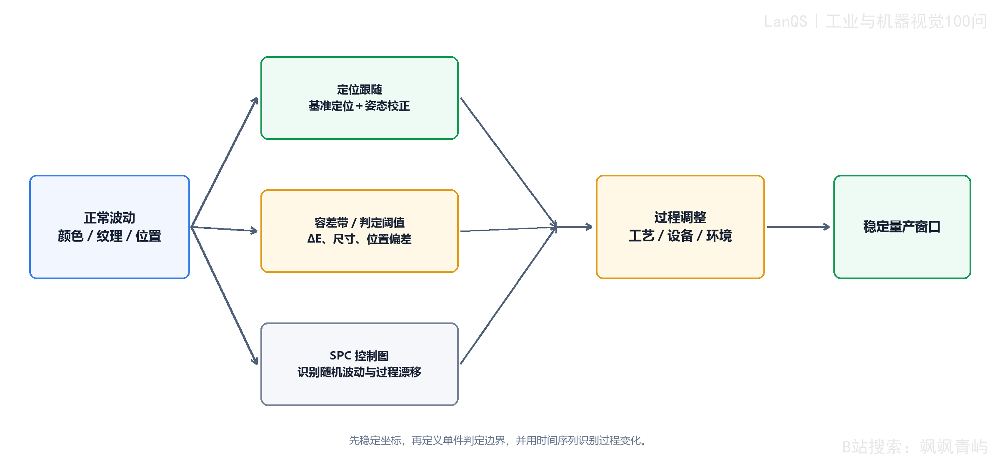</p>
<p align="center">图67-1 正常生产波动的定位、容差带和 SPC 管理。</p>
<div class="figure-note">
图 67-1 中的三条支路分别处理几何位置、单件判定和时间趋势，并共同进入过程调整。定位校正解决的是测量坐标不稳定，容差带给出单件放行边界，SPC 则观察边界内外的时间序列是否出现非随机变化。过程调整应以趋势、批次和设备关联等证据为依据；图中反馈并不表示每一次单件超限都直接反向调设备。
</div>

SPC 将“今天看起来有点不同”转化为可量化的统计判断。视觉系统只要能持续输出颜色值、位置偏差、面积、宽度或纹理分数等稳定指标，就可以把这些指标送入控制图，判断过程是否仍处于正常随机波动范围。持续监测可以在明显缺陷大量出现前，发现过程向某一方向漂移。

控制限与产品规格限承担不同职责。控制限由受控过程的历史数据估计，用来识别过程是否发生特殊原因变化；USL、LSL 则来自产品功能或图纸要求，用来决定产品是否合格。控制限外的点提示排查过程原因，越过规格限的点直接涉及产品符合性。两套界限应分别使用。

连续变量常用 X̄-R 图和单值—移动极差（X-MR）图；缺陷比例可用 p 图，单位缺陷数可用 u 图。此时视觉系统同时是检测工具和过程传感器，前提是输出量在时间上定义一致。

算例模拟一个类似 ΔE 的颜色差异指标：前 30 个样本来自受控过程，后 20 个样本加入一个小的均值偏移，模拟上游染料批次漂移。控制限只用前 30 个基线样本按单值—移动极差方法计算，再用于识别后续漂移区域。示例使用标准常数 `d₂=1.128`、`D₄=3.267` 和 3σ 控制限；随机数据和偏移量都是说明性输入。

运行结果为：基线均值 0.8495，平均移动极差 0.1112，估计标准差 `MR̄/d₂=0.0986`；X 图上限、中心线、下限分别为 1.1452、0.8495、0.5539，MR 图上限和中心线分别为 0.3632、0.1112。第 31 个样本开始注入均值偏移，第 31 个样本首先越过 X 图控制限，共有 12 个点被判为失控。样本数量、偏移量和首次报警位置均为模拟结果，其数值不代表实际产线的检测速度承诺。

<p align="center">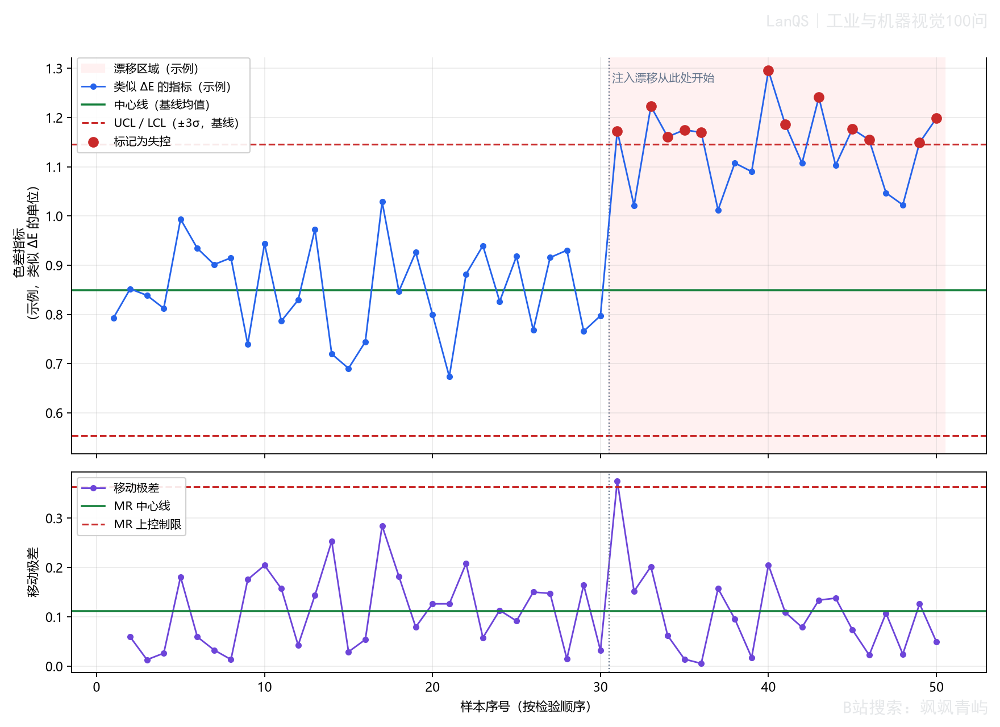</p>
<p align="center">图67-2 单值（X）/移动极差控制图发现说明性工艺漂移。</p>
<div class="figure-note">
图 67-2 用受控基线建立控制限，再把控制限向后应用到新样本。第 31 个样本起的均值偏移首先越过 X 图控制限，说明控制图判断的是过程分布是否改变，随机起伏本身不构成缺陷。图中数据由固定随机种子生成，只用于说明方法。
</div>

#### 67.3 容差、保护带和 Gauge R&R 怎样配合？

容差范围不能只凭经验，也不能直接抄产品图纸上的公差。图纸公差说明产品功能能够接受的范围，视觉系统的判定窗口还要考虑成像重复性、测量不确定度和产线实际波动。更稳妥的做法是先用抽样数据刻画真实过程分布和测量系统，再决定判定窗口与过程能力的关系。

过程能力常用两个指标：

$$
C_p=\frac{USL-LSL}{6\sigma}
$$

$$
C_{pk}=\min\left(\frac{USL-\mu}{3\sigma},\frac{\mu-LSL}{3\sigma}\right)。
$$

其中 USL、LSL 是规格上限和下限，μ 是过程均值，σ 是过程标准差。`Cp` 反映过程分布宽度能否放进规格窗口，`Cpk` 还考虑均值是否居中。这里的 σ 必须代表已确认的过程波动；若视觉测量自身的重复性已占用较大规格余量，应先评估测量链，再把能力指数用于工艺判断。

假设尺寸规格为 USL=5.20 mm、LSL=4.80 mm，公差带宽 0.40 mm、中心为 5.00 mm。历史抽样得到说明性真实零件标准差 `σ_part=0.030 mm`，对同一零件重复测量得到视觉测量系统标准差 `σ_meas=0.020 mm`。若两种波动独立，则

$$
\sigma_{observed}^2=\sigma_{part}^2+\sigma_{meas}^2，
$$

所以 `σ_observed=√(0.030²+0.020²)≈0.036 mm`。测量系统把观测分布变宽了，不能把 0.036 mm 不加区分地当成纯产品波动代入 `Cpk`。

保护带可按测量不确定度的若干倍从真实规格边界向内收缩。这里取说明性系数 `k=2`：

$$
\text{保护带}=k\sigma_{meas}=2\times0.020=0.040\ \text{mm}。
$$

实际判定范围为

$$
[LSL+0.040,\ USL-0.040]=[4.84,5.16]\ \text{mm}。
$$

这样会把真实规格边缘附近的一小段作为不确定区牺牲掉，以减少测量噪声造成的误放行或误拒收。`k=2` 仅作透明的说明性选择，项目需按误判风险、测量不确定度和产品后果确定系数。测量重复性越好，`σ_meas` 越小，可用的有效余量越大。

Gauge R&R（量具重复性与再现性）用于获得可信的测量系统波动。重复性是在同一夹具、同一光照和同一设置下反复测量同一零件，观察测量系统自身的噪声；再现性主要考察操作员、设备、夹具重装或时间条件变化引入的测量差异。产品批次差异属于产品过程波动，不应直接并入再现性；自动化视觉站应把重新上料、夹具切换和跨时段照明变化作为经过定义的测量条件纳入研究。两者可写成

$$
\sigma_{meas}^2=\sigma_{repeatability}^2+\sigma_{reproducibility}^2。
$$

在用视觉测量结果计算 `Cpk` 前，应先把产品间波动与测量系统波动分开。照明漂移、夹具重复定位差或标定不稳定，都会使 `Cpk` 偏低；某些与抽样方式相关的系统偏差也可能造成相反方向的误判。

#### 67.4 颜色、纹理和工艺措施怎样降低误检？

单通道 RGB 阈值很难同时做到稳定和可解释。更合适的做法是使用 CIELAB 空间中的 `L*`、`a*`、`b*` 以及综合色差 `ΔE`，把颜色变化表示为更接近感知意义的距离，避免依赖三个相互耦合的原始通道阈值。项目文件还应明确采用哪一种色差公式，例如 CIE76 或 ΔE00；不同公式得到的数值尺度不同，阈值不能直接照搬。

色差方法也有前提：若照明和相机白平衡不稳定，ΔE 会把成像变化和产品真实变化混在一起。因此在生产中使用色差指标前，光照和颜色标定必须先具备重复性。

第一步是跨多个批次和时间段采集合格样本，建立真实正常纹理的分布边界。规则重复纹理可以使用局部对比度、频域特征、灰度共生矩阵或局部二值模式；复杂表面可采用异常检测，只学习正常区域分布，再标记明显偏离者。

异常检测仍然需要工程判断。训练样本只覆盖很窄的正常条件时，模型会把未充分采样但完全合格的变化当成异常，因此样本覆盖和定期复核不能省略。

视觉算法不应承担全部稳定性责任。位置波动超过夹具的重复定位能力、颜色波动来自上游配料漂移、纹理变化来自模具磨损时，单纯调阈值只能暂时遮住问题。应把视觉结果反馈给工艺人员，追查波动更容易发生在哪台设备、哪个班次和哪个原料批次。

成熟的视觉系统除了筛出缺陷，还能为工艺改进提供定量证据。视觉团队和制造团队需要共同定义指标、样本、报警升级规则和反馈闭环；未经确认的单次异常只应触发复核或留样，连续趋势、批次集中或设备相关性才构成调整工艺参数的依据。

### 常见误区

- 把一张黄金图作为唯一模板，要求所有合格件逐像素匹配。
- 把产品图纸公差直接写成视觉阈值。
- 在光照和白平衡不稳定时直接计算 ΔE。
- 未先做姿态对齐就进行纹理或颜色判定。
- 用很窄的“正常”样本训练异常检测器。
- 只调阈值，不追查夹具、配料或模具等上游波动。
- 没有 Gauge R&R 就直接相信由视觉测量得到的 `Cpk`。
- 把 USL/LSL 原值直接作为通过和不通过阈值，忽略测量保护带。

### 术语与符号表

- SPC：统计过程控制。
- X̄-R 图：对分组连续数据监测均值和极差的控制图组合。
- X-MR 图：对单个连续测量值及相邻移动极差进行监测的控制图组合。
- p 图：监测样本不合格比例的控制图。
- u 图：监测单位缺陷数的控制图。
- 容差带：施加于颜色、位置或测量量的工程接受窗口。
- Mark 点对齐：用基准特征计算产品平移和旋转，使 ROI 和测量区域跟随产品。
- ΔE：由 CIELAB 坐标计算的综合感知色差指标。
- `Cp`/`Cpk`：过程能力指数；`Cp`关注分布宽度，`Cpk`还考虑均值居中程度。
- 保护带：从真实规格上下限向内收缩、用于吸收测量不确定度的边界余量。
- Gauge R&R：把测量波动拆分为重复性和再现性的研究方法。
- 重复性：相同条件反复测量同一零件产生的测量波动。
- 再现性：夹具、时间、光照或操作员等条件变化引入的测量波动。

### 延伸阅读

- Montgomery，《统计质量控制导论》。
- Sharma、Wang，《数字应用中的色差公式》。
- Haralick 等，《用于图像分类的纹理特征》。
- Ojala 等，《具有局部二值模式的多分辨率灰度和旋转不变纹理分类》。

---

---

# 第68问　产品表面的油污和水渍应该怎样处理？算法能做什么，硬件能预防什么？

#### 68.1 污染为什么难成像，为什么应先从硬件入手？

油膜和水渍很少具有边界固定的污点形态。它们通常是覆盖在真实表面上的薄层、透明层或半透明层，首先改变的是表面反射方式，几何轮廓却未必稳定。普通白光下，油膜可能在一次拍摄中表现为高光，下一次又几乎不可见，具体取决于基材、观察角度、光源方向和污染层厚度。

这类污染还容易与表面纹理、保护膜反光、清洗残留或前工序冷凝水混淆。成像方案若未针对这些因素设计，算法得到的多半只是当天污染层偶然形成的反射图案，难以形成稳定的油污特征。

油污和水渍的视觉特征来自光学差异。原始图像没有把污染和背景分开到足够程度时，后端再复杂的代码也不能把弱信号变成低风险判定，只会增加维护和验证负担。透明油膜尤其如此：成像链没有先让它与背景产生可重复差异，算法在不同批次和光照下就很难保持一致。

更稳妥的顺序是先用光源、滤光和遮光把“是否存在污染”变成图像中可重复的信号，再选择阈值、形态学方法或学习模型。把难题在前端解决，后续系统更容易维护。

#### 68.2 硬件成像、算例和现场代价如何权衡？

对金属表面的油膜和水渍，低角度照明与偏振成像通常比较有效。掠射入射会放大薄膜造成的局部反射差异，偏振片可抑制镜面眩光，使被反光遮住的细节显现。对透明油污、助焊剂残留和部分胶黏剂残留，可优先考虑紫外荧光成像；许多材料在 365 nm 紫外激发下会产生可见荧光，把白光下近乎透明的污染转换成高对比亮斑。

这些方法改变了污染信号的物理表现形式：先把薄膜转换成明显的荧光或偏振差异，再交给算法处理，通常比直接从白光反射中猜测透明污染更稳定。

<p align="center">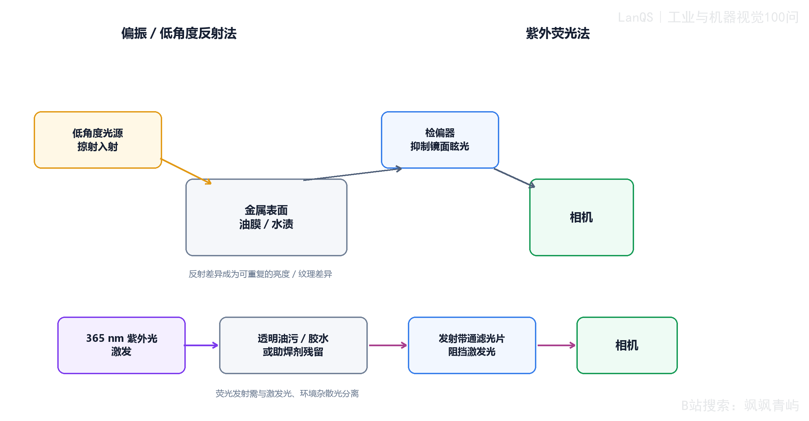</p>
<p align="center">图68-1 油污和水渍的偏振/低角度反射法与紫外荧光法。</p>
<div class="figure-note">
图 68-1 的两条光路不能混读。偏振／低角度方案中，掠射光先照到金属表面，反射光经检偏器进入相机；紫外荧光方案中，365 nm 紫外光负责激发，发射荧光经带通滤光片进入相机。两种方案都必须用真实油品、基材和表面状态验证；荧光效率会随材料而变，实验室中的一次高对比结果不足以确定设备规格。
</div>

下面用一个透明的信号模型比较三种成像策略。模型假定缺陷和油污伪影的对比度分数均服从说明性高斯分布，并为每种策略独立选择阈值，使真实缺陷检测率固定为 95%，再读取油污伪影被误判为缺陷的比例。输入参数为说明性设定，并非产线实测值。

运行结果为：普通白光阈值 43.20，误报率 68.65%；低角度/偏振成像阈值 48.84，误报率 6.89%；365 nm 紫外荧光阈值 46.84，误报率约 0.00%。在这个说明性模型中，保持 95% 缺陷检出率时，误报率从白光下约 69% 降至低角度/偏振下不足 7%，紫外荧光下接近 0%。这些数值只说明成像策略改变了两类信号的重叠程度，不能作为任一产线的性能承诺。

<p align="center">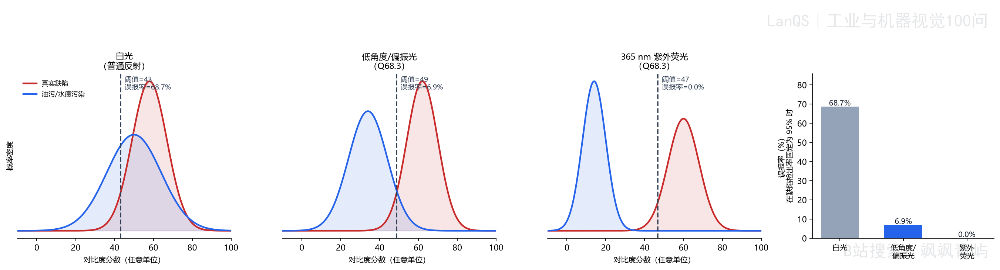</p>
<p align="center">图68-2 固定 95% 缺陷检测率时不同成像策略的说明性误报率。</p>
<div class="figure-note">
图 68-2 的比较点是保持真实缺陷检出率相同，再观察油污伪影分布与判定阈值的重叠程度。数值来自说明性分布模型，作用是展示“把分离问题移到光学端”会怎样改变算法所面对的风险，不能代替真实样本的 ROC、误报率和漏报率验证。
</div>

365 nm 紫外荧光工位需要把人员安全从方案开始就纳入设计。激发区应使用遮光外壳，外壳或门打开时由联锁立即切断紫外光源；操作员需要进入清洁、上下料区域时，还要有物理屏障或书面暴露控制流程。允许暴露水平属于现场安全合规问题，应按实际波段、光源和适用标准确认，不能凭经验猜测。

遮光结构同样影响测量可靠性。进入相机的杂散紫外光、附近保护窗反射的紫外光，以及标签、包装膜或相机保护玻璃自身的荧光，都可能形成与目标污染相似的亮斑。因此荧光检测区需要独立的遮光和污染控制，高对比目标也不能替代这一环节。

低角度光还受零件几何形状限制。平面上的掠射角在曲面、圆柱面或法兰上不会保持不变，同一污染在视野的一处可能清晰可见，在另一处几乎不可见。复杂零件应按局部表面法向把视野分区，为每个几何区域设置合适光源或多轴低角度阵列；如果成本不允许，应明确方案只覆盖已经验证过的区域，再用偏振、荧光或第二视角处理其他区域。

现场还需要一个快速排除“其实是光学件脏了”的方法：先只清洁保护窗或镜头，不移动零件，重新拍摄同一位置；对照该工位的清洁维护记录；再与最近一次清洁标定后的合格参考图比较。若异常在清洁后消失，或固定在像素位置而不随零件移动，更可能来自成像链而非产品。

#### 68.3 图像已有对比度时，算法怎样选择？

污染已经在图像中形成稳定的亮度、颜色或纹理差异后，传统算法通常就够用。常用模块包括灰度或自适应阈值、背景扣除、形态学开闭运算、连通域分析，以及按面积、圆度和长宽比过滤。边界柔和且不规则的水渍，可以先增强局部对比度，再结合连通域和纹理约束，去除由噪声或高光造成的伪影。

传统方法在前端成像稳定时更容易验证，也更适合长期维护。应避免在不稳定原始信号上不断叠加复杂后处理，勉强得到可用的判定结果。

污染形状变化很大、基材复杂、单一阈值无法覆盖正常波动时，可以考虑异常检测或分割模型。常见做法是收集合格表面样本，让模型学习正常外观分布，再把明显偏离分布的区域标为候选异常，这样不必预先枚举所有污染形状和尺寸。

这类方法仍依赖成像链先把污染变成可观察差异。原图中确实没有信号时，模型无法凭空创造区分；训练样本也要覆盖不同批次和光照下的正常表面，否则模型会把普通变化当成污染。

#### 68.4 如何从设备维护和调试流程上减少复发？

预防通常比事后修正便宜。镜头、保护窗和容易进液的区域应与污染源保持物理距离，避免飞溅和喷雾直接落到成像前端；关键工位可加入气刀、排雾、局部负压或滴液防护结构，减少油雾和冷凝水在视野中的积累。清洗后检测时，应确认工件已经充分干燥，否则残留液体会与真实污染混淆。

如果上游稳定地产生某种残留，应回到点胶、润滑、清洗和干燥工序查原因。视觉系统可以发现问题，但不一定是最合适的治理位置。

常见错误包括只用少量样品、在单一光照下调阈值就认为系统稳定；只拍静态样品而不观察生产节拍中干燥不充分、液滴扩散和二次冷凝；没有按污染程度、表面状态和生产批次记录检出率与误报率。

更可靠的调试应准备多种污染等级、表面状态和批次的样品，在每种候选成像方案下记录检出率和误报率。这样才能区分系统是在识别污染，还是只识别了调试时偶然出现的一种反射图案。

### 常见误区

- 只在少量样品和一种光照下调阈值。
- 用软件堆叠修复没有成像对比度的原始信号。
- 把清洗残留或冷凝水误判为真实污染。
- 假定紫外荧光方案可以跨材料直接复用。
- 只检查静态样品，不检查产线速度下的液滴扩散和冷凝。
- 把上游稳定产生的残留全部交给视觉系统兜底。
- 紫外工位没有独立遮光、联锁和杂散荧光检查。
- 在曲面或法兰上使用一个全局低角度光源。
- 发现固定亮斑后不先擦拭保护窗或镜头就判定工件污染。

### 术语与符号表

- 镜面反射/眩光：光滑、湿润或油性表面的方向性反射，可能造成局部饱和。
- 偏振片：只透过特定偏振状态光线、用于抑制镜面眩光的光学元件。
- 低角度照明：相对于表面以较小入射角照明，用于放大薄膜和细小表面差异。
- 紫外荧光成像：用紫外光激发材料发出可见荧光的成像方法。
- 带通滤光片：只通过特定波长范围、在荧光成像中阻挡激发光的滤光片。
- 异常检测：学习正常表面分布并标记偏离区域的建模方法。
- FPR：误报率，在给定阈值下把清洁区域或非缺陷污染区域误判为缺陷的比例。
- 遮光外壳：排除环境光并在紫外工位限制激发光外泄的结构，通常配合联锁。
- 联锁：防护门或外壳打开时自动关闭危险部件的安全机制。
- 视野分区照明：按局部表面法向将零件分区并分别调节入射方向的方法。
- 擦拭复测：只清洁镜头或保护窗、保持零件位置不变后重新成像的现场诊断方法。

### 延伸阅读

- Cognex，《机器视觉应用中的偏振与照明技术》。
- Edmund Optics，《荧光成像与紫外光源简介》。
- Steger、Ulrich、Wiedemann，《机器视觉算法与应用》第二版。
- Ruff 等，《深度与浅层异常检测的统一综述》。

---

---

# 第69问　振动会使图像模糊，除了延长曝光和全局快门，还有哪些措施有效？

#### 69.1 模糊机制与机械安装怎样处理？

曝光期间目标与传感器发生相对位移，就会形成模糊。振动可能来自地面、机器机构、输送线、风扇或镜头支架；只要曝光窗口内的相对位移没有压缩到足够小的像素比例，点状特征就会拖成短线，边缘变宽，小缺陷甚至会被抹掉。测量、OCR 和细小缺陷检测受到的影响，通常比肉眼观察到的更严重。

延长曝光会扩大运动累积的时间窗口，方向与解决问题相反。全局快门解决的是滚动快门逐行读出造成的时序倾斜，不能单独缩短普通运动模糊的曝光窗口。更有价值的措施是减少机械、时序和结构原因，尽量让模糊不要形成。

相机装在薄板、长悬臂或低固有频率支架上，会通过结构共振放大轻微环境振动。应缩短力臂、提高支架刚度、减少不必要的多级转接板、锁紧调焦环和光圈环，并把相机固定在可获得的最刚性承力结构上。高精度工位还可使用隔振底座、高质量平台或阻尼结构，在振动到达相机和工件前削弱它。

曝光时已经形成的模糊只能被后端近似修补，无法恢复没有被传感器采集的细节。因此机械安装通常是最有价值的第一杠杆。

#### 69.2 时序、曝光和频闪怎样建立预算？

若振动具有周期性，例如冲压机、往复机构、气缸换向或某个组件的共振，可以避开振动峰值，在结构最安静或最稳定的时间窗触发。线扫系统应与编码器硬同步，使每行图像对应固定的运动位移，减少速度波动造成的行间变形。

高功率频闪可以在很短脉冲内释放足够光能，从而压缩有效曝光窗口而不牺牲亮度。它不改变产品和机器的运动，只是更精确地划出可用成像时间。

<p align="center">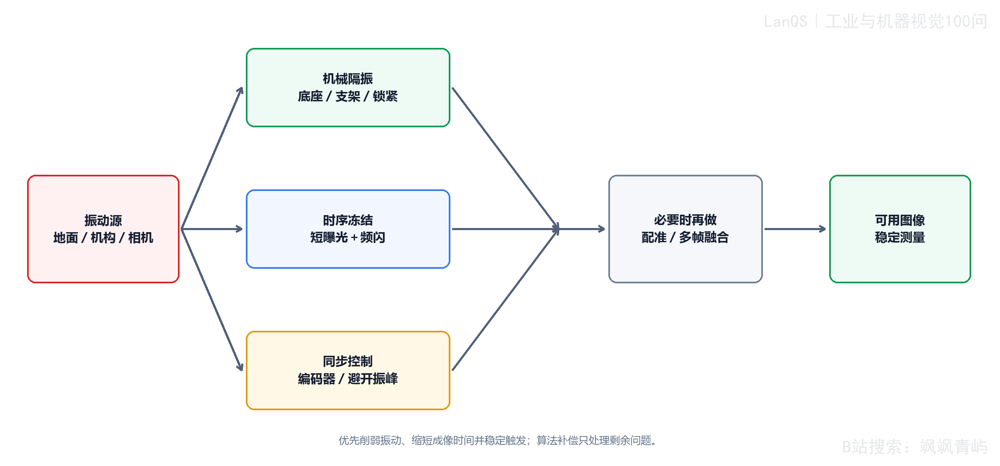</p>
<p align="center">图69-1 振动模糊的分层抑制路径。</p>
<div class="figure-note">
图 69-1 将机械隔振与结构锁定、短曝光与频闪冻结、同步控制三层措施放在算法补偿之前。编码器硬同步或避开振动峰值用于控制采集时刻，右侧的配准与多帧融合仅在前端仍有必要时作为补充。设计和故障分析应优先防止模糊形成；对尺寸测量和缺陷证据归档，任何改变原始像素结构的补偿都需要单独验证。
</div>

用正弦振动说明计算。位移模型和峰值速度分别为

$$
x(t)=Asin(2pi f t),
$$

$$
v_{mathrm{peak}}=2pi fA。
$$

曝光时间 `t_exp` 内的一阶近似模糊长度为

$$
\Delta x=v_{\mathrm{peak}}t_{\mathrm{exp}}。
$$

说明性输入为振幅 `A=15 μm`、频率 `f=120 Hz`、传感器像元尺寸 3.45 μm、放大倍率 0.5×，因此物方像元尺寸为 6.90 μm/像素，峰值速度约为 11,310 μm/s。结果如下：5 ms 曝光产生约 8.20 像素模糊；控制在 1 像素需要约 610.1 μs；控制在 0.25 像素需要约 152.5 μs。频闪脉冲若同样控制在 152.5 μs，模糊预算也是 0.25 像素。所有输入均为说明性数据。

<p align="center">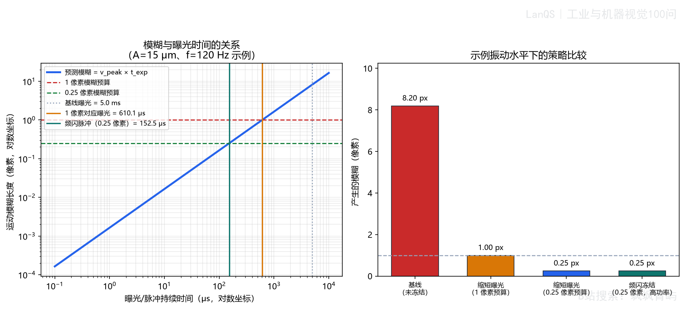</p>
<p align="center">图69-2 振动模糊长度与曝光时间及频闪策略的说明性关系。</p>
<div class="figure-note">
图 69-2 左侧表示固定振动条件下，曝光时间越长，模糊预算越大；右侧比较 5 ms、约 610 μs 和约 153 μs 三种曝光，以及同样采用约 153 μs 有效脉冲的频闪方案。数值取决于振幅、频率、像元尺寸和放大倍率，关系的普遍工程含义是：给定像素模糊预算时，所需曝光时间与振动峰值速度成反比。
</div>

实际产线振动通常是宽带的，电机转速、齿轮啮合、结构共振、滚筒和地面噪声可能同时存在。振幅和频率应从相机或镜头支架处的实测信号获得。常用方法是在支架附近安装压电或 MEMS 加速度计；不便接触时使用激光测振仪。记录设备正常负载运行时的时域信号，再用 FFT（快速傅里叶变换）得到频谱。频谱有明显主峰时，主频及其振幅可用于单频模型；频谱宽带时，应直接计算 RMS（均方根）速度，并用实测峰值或 RMS 的保守倍数作为 `v_peak`。这时公式是尺寸估算工具，不能视作完整的宽带运动模型。

频闪缩短脉冲并非没有代价。相同光能在更短时间内释放，需要更高瞬时 LED 电流，会增加结温和驱动器的开关负担；脉冲频率、占空比和散热路径不合适时，会缩短 LED 寿命。驱动器还要在短脉宽下控制过冲，光源需要在脉冲之间散热。实际最短脉冲由驱动和热设计决定，应按厂商脉冲电流与热额定值验证。

#### 69.3 算法、多帧融合和事件相机适合什么场景？

在显示、阅读或一般识别场景，反卷积、多帧融合和学习型去模糊可以改善视觉效果。尺寸测量、细小缺陷检测和证据归档则要谨慎，因为锐化可能移动边缘、填补纹理或放大噪声，进而影响测量和判定。算法补偿可用于可视化、定位辅助或已经验证过的鲁棒任务，但不能替代物理隔振，也不能在像素真实性关键的任务中未经边界验证直接采用。

场景变化不快、相邻帧仍可配准且周期预算允许额外处理时，多帧配准和融合可以改善清晰度与信噪比。高速单次事件通常没有这个条件。事件相机适合极高速动态场景，但信号形式、成本和系统集成路径与传统工业相机差异很大，适合作为特定场景的扩展方案，不宜视作多数项目的默认路径。

#### 69.4 如何确认振动来源并安排处理顺序？

失焦、热漂移、光照不足、镜头分辨率不足、曝光饱和、快门时序错误和输送速度变化，也会造成“图像不够清晰”。振动模糊通常沿特定方向拉伸，并随机器运动状态变化；失焦更像全局均匀变软；曝光过长会拖长运动边缘；光照不足通常伴随噪声升高。把机器状态、触发时间戳和图像质量指标同步记录，诊断会比只看最终图像更可靠。

先检查结构刚度和安装，再检查曝光与频闪，再检查同步时序，最后才评估算法补偿。越靠前的层级越能减少模糊的产生，末端算法只能处理已经发生的损伤。

### 常见误区

- 为了增加入射光量而在振动产线上延长曝光。
- 把相机装在方便但柔性的薄板或长悬臂上。
- 把滚动快门倾斜与普通振动模糊混为一谈。
- 未验证边缘和纹理真实性就默认使用去模糊。
- 不排查失焦、热漂移、光照和快门时序就把软图像归因于振动。
- 认为多帧融合在所有产线都可用。

### 术语与符号表

- 全局快门：所有像素同时曝光和读出，避免运动中的逐行时序倾斜。
- 滚动快门：各行依次曝光，运动时产生几何倾斜或变形。
- 运动模糊长度 `Δx`：点在一次曝光期间拖曳的长度，近似为速度乘曝光时间。
- 频闪冻结：用短时高强度光脉冲定义有效曝光窗口。
- 编码器硬同步：由位置编码器直接触发采集，使空间采样不随速度变化。
- 隔振：用阻尼支架、刚性结构或高质量平台削弱外部振动。
- 多帧配准与融合：对多张相邻图像对齐并合成，代价是处理时间和帧间可配准性要求。
- 事件相机：异步报告像素亮度变化、具有高时间分辨率的传感器。
- 加速度计/激光测振仪：在相机或镜头支架处测量机械振动的传感器。
- FFT 频谱分析：把时域振动分解为频率分量。
- RMS 速度：宽带振动时由时域信号计算的均方根速度。
- LED 结温与热负荷：脉冲电流造成的 LED 芯片升温，过大的瞬时电流会缩短寿命。

### 延伸阅读

- Holst、Lomheim，《CMOS/CCD 传感器与相机系统》。
- Cognex 关于高速检测频闪与短曝光的应用资料。
- EMVA 关于相机时序、触发和同步的标准资料。
- Gallego 等，《基于事件的视觉：综述》。

---

---

# 第70问　什么是“黄金样本”？它在调试和维护中起什么作用？

#### 70.1 黄金样本如何建立，为什么不能随手选取？

黄金样本是一组经过确认并长期保存的标准件或标准数据，用于检查视觉系统当前的表现。样本不必很多，但应覆盖典型正常情况、边界正常情况和关键缺陷情况。它与普通测试集的区别在于身份和基线被固定，后续调参、升级、回归测试和班前点检都围绕同一组基准进行。

现场通常同时使用实体标准件和数字图像库。实体件用于检查相机、镜头、光源、触发和机械链路；数字库便于软件回归、参数比较和版本验证，两者不能互相替代。

随手保存的图片只反映开发者当时碰到的情况，往往覆盖不到真正危险的边界场景。黄金样本应经过明确选择、确认和冻结，并记录每个样本为何保留、代表什么场景、判定标准是什么以及何时允许更新。

没有版本和变更纪律，样本文件夹会逐渐变成不断变化的测试集，回归测试也就失去可比性，无法判断是系统变好了，还是测试样本自己变了。

#### 70.2 调试、回归和班前点检怎样使用黄金样本？

调试时，无论调整照明、重新对焦、修改阈值还是更换算法版本，都需要一组固定样本判断变化的结果。每次使用不同的临时样品，调试就会退化成主观印象比较。

边界缺陷样本还可以暴露系统的敏感点。如果某个临界缺陷只有在特定光照角度下才能稳定检出，它不仅是测试件，也说明了成像链有效工作窗口的边界。好的样本集能在系统上线前发现脆弱环节。

<p align="center">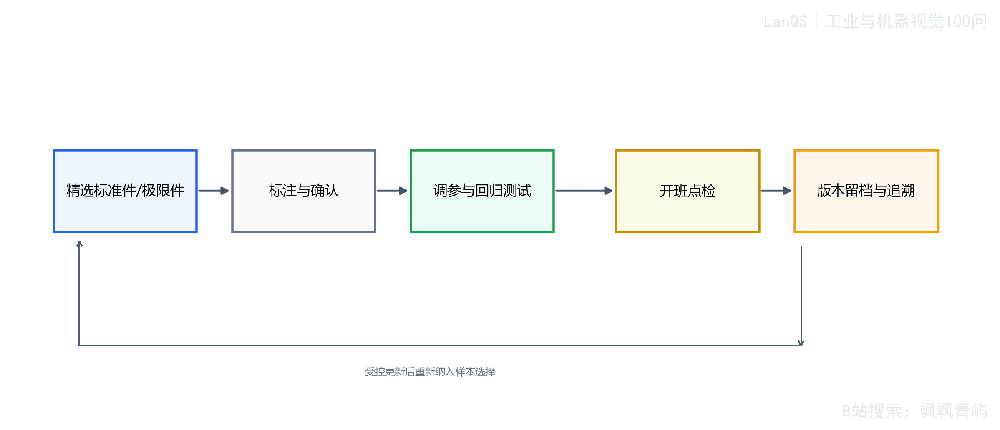</p>
<p align="center">图70-1 黄金样本从选择到回归测试和班前点检的闭环。</p>
<div class="figure-note">
图 70-1 从样本选择、确认、回归和点检走到版本留档，并以受控更新路径回到样本选择。黄金样本贯穿开发、上线和维护周期；当工艺、材料或缺陷谱发生变化时，应保留变更依据、旧版本与重新确认记录，再将新版本纳入该闭环。
</div>

量产后，风险往往来自原本正常的东西逐渐漂移：镜头被碰动、光源衰减、现场人员调整参数、软件版本升级等。没有固定样本，维护人员无法可靠判断今天的性能是否比上个月退化。

每次变更后重新运行同一组样本，可以快速判断哪些能力仍稳定、哪些边界样本开始失败。对生产系统而言，这种长期可比性通常比项目初期的演示图更有价值。

班前点检要确认的是当前工位在当前条件下是否仍可用。依次运行标准件和边界样本，可以检查相机、镜头、光源、触发、程序版本和判定阈值是否仍处于受控范围。原本稳定通过的样本突然波动，或应检出的边界缺陷漏检，都说明系统状态发生了变化。

这种点检把复杂的系统健康检查压缩为少量高价值样本，覆盖的功能链路也比仅凭肉眼查看实时画面更完整。

设每个班次对黄金样本重复成像，并记录 ROI（感兴趣区域）平均灰度。以下数据仅用于说明：前 25 个班次建立基线，后 35 个班次进行监测；基线均值设为 180.0，班次间噪声标准差设为 1.8；监测阶段叠加每班次下降 0.12 灰度单位的线性漂移，用于模拟镜头/保护窗污染或 LED 输出衰减。

由前 25 个基线样本计算中心线和标准差，控制限为中心线 ±3σ，警戒线为中心线 ±2σ。计算结果为：

| 项目 | 结果 |
|---|---:|
| 中心线 | 180.346 |
| 基线标准差 | 1.655 |
| UCL / LCL | 185.312 / 175.380 |
| 首次标记班次 | 总第 45 班，监测阶段第 20 班 |
| 发现时累计真实漂移 | −2.400 灰度单位，约为基线均值的 −1.33% |
| 仅由漂移趋势越过 LCL 所需班次 | 约 41.4 班 |

示例使用“连续三个点中有两个落在同一侧的 ±2σ 警戒线之外”的运行规则，所以比等待单点越过 ±3σ 控制限更敏感。第 45 班被标记时，漂移仍只是基线均值的一小部分，说明固定样本配合统计监测可以在实际产品判定受到影响前暴露成像链的慢性退化。图中横轴按监测序号从 0 起算，正文中的班次编号按第 1 班起算，出版排版时应保持这一换算关系一致。

<p align="center">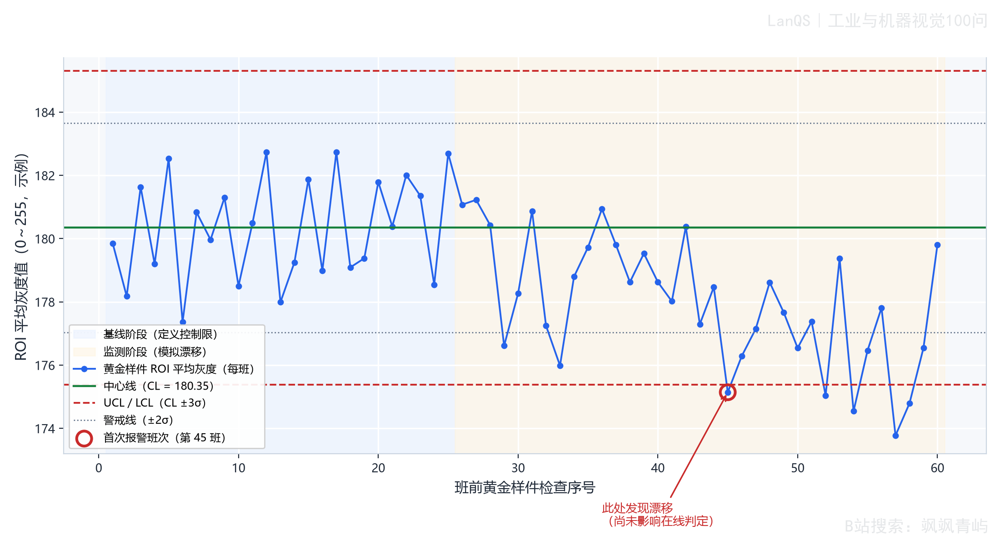</p>
<p align="center">图70-2 黄金样本控制图发现说明性的成像链漂移。</p>
<div class="figure-note">
图 70-2 先用黄金样本基线建立中心线、控制限和警戒线，再监测后续班次。运行规则在第 45 班发出标记，早于仅由无噪声漂移趋势越过控制限的时间。基线均值、噪声、漂移速度和班次数量都是模拟输入，不能直接作为真实工位的报警阈值。
</div>

#### 70.3 报警后如何确认成像链漂移，如何维护样本可信度？
控制图报警后先检查参考件本身：老化、氧化、积尘、搬运划伤和长期光照变色都会造成基准漂移。应保存一份与工作样本名义上相同、密封并在稳定环境中保存的备份样本，定期在相同条件下与工作样本成像比较，必要时用校准的颜色或反射率测量独立复核。工作样本偏离备份样本时，应按受控流程退役和替换，再重新确认判定基线。

样本数量也不应凭“适中”拍脑袋。应先列出所有需要覆盖的风险类别、缺陷模式和工艺/工装变体，例如多腔模具的不同型腔、同线不同夹具或不同供应商批次，再为每类风险安排代表样本；最后结合回归运行时间删减冗余。

若备份交叉检查确认样本没有退化，再按可逆程度逐项定位成像链原因：先清洁保护窗或镜头并立即复拍；仍异常时临时替换已确认正常的光源；最后检查相机温度、增益、曝光和健康状态。只有这些替换都不能消除漂移时，才考虑黄金样本变化或有依据地调整判定阈值。

#### 70.4 样本集、局限和项目标准怎样确定？

样本集应覆盖主要正常条件和关键边界条件；每个样本的标签和通过/不通过标准都要正式确认；数量要足够覆盖核心风险，又不能使每次回归运行不可接受；样本来源、用途、版本和更新原因要有记录。

典型组合包括稳定正常件、边界正常件、典型缺陷件、边界缺陷件和数字图像库。这样既覆盖实体成像链，也覆盖软件逻辑回归路径。

任何样本集都不可能覆盖未来所有情况，只能覆盖当前已知风险和关键边界。样本应长期稳定，但工艺、材料或缺陷谱变化时也要受控更新，并保留历史可比性。

过度依赖固定样本也会让团队忽略生产现场出现的新变化。黄金样本应与现场异常收集、样本补充和生产数据分析一起使用，不能代替真实生产环境。

项目标准至少应写明样本类别、确认和保管责任人、执行时机（班前、换型、维护和升级后）、通过判据，以及何时需要重建或生成新版本。这样黄金样本才是可以交付和长期维护的工程机制。

### 常见误区

- 把随手收集的几张典型图片当成黄金样本。
- 让样本文件夹无记录地持续变化。
- 用单张标准图做唯一模板并要求逐像素匹配。
- 只做数字回归，不做实体件班前点检。
- 把黄金样本当成唯一真实来源，忽略现场异常。
- 更新样本集却不记录版本和原因，破坏历史可比性。

### 术语与符号表

- 黄金样本：经过确认、长期保存并用于验证视觉性能的标准件或标准图像集合。
- 调试：系统上线前对光照、焦点、阈值和算法参数进行调整与验证的阶段。
- 回归测试：变更后重新运行固定样本，确认原有能力没有被破坏。
- 班前点检：生产班次开始时用标准件和边界件检查当前工位状态。
- 漂移检测：在系统变化导致错误判定前识别其缓慢变化的过程。
- 控制图：把统计量随时间绘制并与中心线、控制限比较的 SPC 工具。
- 版本留档/追溯：记录当时使用的样本、参数和软件版本，以便复现。
- 备份黄金样本：受控保存、很少接触的同类样本，用于确认工作样本是否自身退化。
- 根因隔离：先清洁光学件、替换光源、检查相机，再决定是否改阈值的顺序化排查。

### 延伸阅读

- Montgomery，《统计质量控制导论》。
- AIA/A3 机器视觉系统指南中的黄金样本和参考标准资料。
- ISO 9001、IATF 16949 关于过程控制、测量系统管理和变更追溯的条款。

---

# 第71问　如何设计训练集采集流程，覆盖正常变化和缺陷条件？

新工位开始采集图像时，最容易出现的误判是把照片数量当成训练集质量。拍摄一万张整齐的合格品，可能仍然没有覆盖夜班、材料换批、工装磨损或光源预热后的状态；一个低频缺陷即使真实出现过，也可能只留下几张无法复核的图片。训练集要承担的工作，是在模型训练之前，把生产线上会遇到的正常波动、缺陷形态和合格边界整理成可标注、可验证、可追溯的数据资产，并在系统上线后继续吸收新的失效样本。

本题涵盖整件分类、目标检测、分割、尺寸测量和异常检测。不同任务的标签形式不同，但采集始终受同一组约束：产品判定规则、缺陷发生率、相机与照明条件、工位节拍、批次和工装变化，以及上线后是否有能力进行人工复判。采集流程只有把这些条件写入记录，并且让下一位工程师能够按同一规则复现，才具有工程意义。

#### 71.1 采集流程如何建立并写成执行计划？

一个可以长期执行的采集流程需要系统性、可重复性和闭环性。系统性要求团队能说明为什么采集、采集哪些对象、每类样本达到什么程度才足够，采集依据来自事先定义的任务和风险。可重复性要求下个月换一批材料、换一名工程师，仍能按同一规则得到可比较的数据。闭环性要求验证集或现场运行暴露缺口后，采集计划可以直接回到缺口本身补样，不必每次从头建立数据集。

这三个条件描述的是数据工程过程，不等同于拍摄设备保持稳定。工业数据的质量至少包括真值、过程状态和上下文。真值表示产品是否真的存在目标缺陷，以及缺陷是否达到质量规则规定的严重度；过程状态包括批次、机器、型腔、工装、配方和班次；上下文包括曝光、照明、工件姿态、采集时间和异常事件。缺少这些信息的图像即使清晰，日后也很难判断模型出错究竟是材料变化、成像变化、标签错误，还是训练覆盖不足。

这些字段还决定了模型训练时究竟把什么当成判别线索。如果同一批次的所有缺陷图都在夜班拍摄，模型可能把背景亮度或时间段当成缺陷特征；如果正常品来自固定机器而缺陷品来自另一台机器，机器纹理就会泄漏进标签。采集记录把图像放回生产过程，工程师才能识别这种与任务无关的关联，并在切分数据时按批次、工件或事件分组。

实验室中最清晰、最标准的图像适合检查成像链，却不一定代表生产分布。训练数据应保留真实生产中允许的轻微位置偏差、亮度波动、纹理变化和操作差异，同时把不可接受的缺陷与可以放行的边界样本分开。采集流程的第一项产物应是一份带版本的采样要求，图片只是这份要求执行后的结果。

正式拍摄前，应把任务、缺陷和现场条件写成三张相互关联的清单。任务类型先决定标注形式，再决定什么叫覆盖充分；缺陷清单规定要识别的类别、尺寸范围、常见位置、严重度和合格边界；现场条件清单则说明相机、镜头、照明方式、曝光、工位姿态、节拍、产品变体，以及哪些工艺信息能够与图像一起保存。

| 清单 | 至少要回答的问题 | 对采集计划的影响 |
|---|---|---|
| 任务清单 | 做分类、检测、分割、测量还是异常检测？ | 决定标签形式、样本粒度和验证指标。 |
| 缺陷清单 | 哪些缺陷要识别？尺寸、位置和严重度范围是什么？ | 决定缺陷样本来源、边界样本和最小覆盖要求。 |
| 现场条件清单 | 相机、镜头、照明、曝光、姿态、节拍和产品变体怎样变化？ | 决定分层采样、元数据字段和采集时段。 |

质量或工艺负责人还要把“正常变化”写成可以执行的判定规则。例如，颜色偏移到什么程度仍可放行，标签偏离多少仍属于允许误差，轻微油膜算工艺波动还是表面缺陷。边界没有统一口径时，不同标注人员会在不同位置划线，最后得到相互矛盾的标签；网络结构和损失函数无法代替质量规则。

“覆盖正常变化”必须进一步变成一线人员能够执行的采样和记录协议。采样应按班次和日历时间分层，从早班、晚班、夜班各取固定配额，并把采集分散到至少两到三周，避免集中在一个下午。班次变化可能伴随操作习惯、环境温度和原料批次变化，单日下午采集会把偶然状态误当成生产常态。批次或料号、机器、型腔和工装站位也要分层记录，因为材料差异和工装磨损会产生合法的外观漂移。

照明采样应包含光源刚开机和热稳定后的状态；若工位受窗光影响，还要安排不同时间段的采样；已知的湿度变化、背景反射和维护状态也应成为条件字段。多 SKU、颜色、材料或工装变体共用一个工位时，每种变体要有最低配额。用单一变体的大量图片填满总数，会让总量达标而使其他变体没有证据。

采样人员还应记录采集事件本身。相机重新对焦、镜头清洁、光源更换、参数下载和设备重启前后的图像不能混在同一批次里却不留标记，否则后续发现亮度或清晰度变化时没有时间边界可查。若采集程序能够自动写入设备状态和触发计数，应优先使用机器字段；人工备注用于补充自动系统无法识别的异常，而不应承担全部记录责任。

每张图至少绑定时间戳、班次、批次或料号、机器或工位、配方或参数集、操作者或自动运行标记，并保留异常备注。换线、停机恢复、夹具调整、光源闪烁和维护事件都可能解释后续分布变化。配额应写成“每班每周至少采集 N 件，持续八周”“换模后的前十个批次各采集 M 件”这类按分层约束的条款，不能只给“总共采集一万张”的总量目标。总量很容易被方便条件下的重复拍摄填满，整类状态却仍然为空缺。

#### 71.2 正常样本、缺陷样本和稀有缺陷怎样采集？

正常样本要表现生产线上允许的真实波动。若工件放置存在小范围偏移、相机安装有轻微位置变化、材料纹理随批次改变，质量规则仍判定合格，就应按原样保留。采集员不应为了让图像更整齐而删掉这些样本，否则模型会形成过窄的正常分布，面对合法波动时更容易产生误报。

采集计划应覆盖不同时间窗口、班次、批次、设备状态和操作者。多颜色、多尺寸、多 SKU 或多种工装的产品要分别确认最低覆盖量。这里的“足够”指主要变化源都有观察证据，类别行数相等并非判定条件。正常样本还应包含容易被误认为缺陷的难负样本，例如反光纹理、接缝、油膜、规则加工痕迹和轻微背景干扰。每个难负样本必须经质量规则确认属于合格品；若把应隔离的边界品混入正常类，标签边界就会被推向错误方向。

连续采集的相邻帧通常共享同一工件、背景和成像状态，数量增加并不等于分布覆盖按同样比例增加。采集记录应识别近重复图像；同一工件的连续帧、裁剪图和重复拍摄在训练、验证、测试切分时应放在同一分区。否则模型可能记住背景或工件纹理，验证分数却看起来很高。

正常分布的覆盖还要看变化幅度，而不仅是变化类别。例如“有光照变化”至少要知道亮度变化是否已经接近相机饱和、是否改变了缺陷与背景的对比度；“有位置变化”要知道偏移是否影响 ROI 边界或造成目标截断。记录这些幅度后，工程师能判断样本是在覆盖生产范围，还是只覆盖了变化名称却没有覆盖变化边缘。

缺陷采集同时受到低发生率、类别数量失衡和判定边界不稳定的影响。轻微划痕可能每天出现，边缘崩缺却可能几周才出现一次；同一名称的缺陷还可能因为工艺、客户标准或最终用途不同而有不同的放行界线。只按总缺陷数验收，会掩盖少数高风险类别仍然没有证据的事实。

历史 NG（No Good，不合格）库、返工记录和客户投诉通常能提供真实缺陷，但 NG 标记只说明样本曾被隔离，不自动说明图像中存在当前任务关注的缺陷。历史样本需要由质量人员复核图像、缺陷类别、严重度和最终判定；返工记录如果只有处理结果而没有原图，只能作为事件线索，不能直接当作训练标签。

在工艺允许且安全的范围内，可以受控制造边界缺陷，以补足自然生产难以得到的严重度和尺寸范围。此类样本要记录制造方法、尺寸或严重度、工艺批次和质量确认人，并在数据中标明它与自然缺陷的来源差异。质量部门和视觉团队还应共同维护缺陷字典，统一类别名称、最小可接受尺寸、典型位置、相邻类别的区分方式，以及无法判定时的归档规则。

受控制造不能简单等同于真实缺陷。人为刻出的划痕可能比刀具磨损产生的划痕边缘更规则，实验室制造的污染也可能缺少产线上的流动、反光和背景关系。它适合填补尺寸和严重度的空白，也适合验证系统对明确边界的响应；训练集仍应保留自然缺陷、历史返工样本和真实成像条件，并在验证时分别报告不同来源的结果。

当某个严重缺陷极少出现时，可以评估异常检测或单类方法。它们把学习重点放在正常分布上，适用于真实缺陷很难获得的情形，但仍需要少量真实缺陷、边界样本和人工复判来验证风险。数据增强可以改变已有图像的外观，不能凭空提供真实工艺机制、真实背景和真实成像条件。缺陷样本不足时，问题有时需要回到任务定义、质量边界或现场复判流程解决。

如果某类缺陷在每件产品上的发生概率为 \(p\)，工程师需要估计检查多少件产品，才有较大把握取得足够的已确认样本。把每件产品是否包含目标缺陷看作一次相互独立的伯努利试验，检查 \(n\) 件产品后捕获的缺陷数记为 \(X\)，有

$$
X\sim\operatorname{Binomial}(n,p)
\tag{71-1}
$$

其中 \(p\) 是单件产品出现目标缺陷的概率，\(n\) 是实际检查或记录的产品件数，\(X\) 是捕获并确认的目标缺陷件数。若训练阶段至少希望获得 \(k=30\) 个样本，并要求达到该数量的概率至少为 95%，就要找出满足

$$
P(X\geq30)\geq0.95
\tag{71-2}
$$

的最小整数 \(n\)。二项分布生存函数可以直接计算 \(P(X\geq30)=\operatorname{sf}(29;n,p)\)。代码先建立一个上界；若上界仍不足以达到 0.95，就继续扩大。得到可行上界后，再用二分搜索寻找最小值。固定 \(p\) 时，增加采集件数不会降低获得至少 30 个缺陷的概率，所以这个单调关系支持二分搜索。

下面的代码把发生率、目标样本数、置信度和日产量作为输入，计算所需采集件数及按理想产能折算的天数。示例发生率和日产量均用于说明数量级，实际项目应使用质量记录估计的发生率，并把停机、换型、确认和标注时间另行加入计划。

```python
from scipy.stats import binom
import numpy as np

TARGET_CONF = 0.95
TARGET_N = 30
RATES = [0.02, 0.01, 0.005, 0.002, 0.001]
THROUGHPUT_PER_DAY = 8000

def min_units_for_target(p, target_n=TARGET_N,
                         conf=TARGET_CONF):
    lo = target_n
    hi = max(target_n * 4, int(target_n / p) * 4)
    while binom.sf(target_n - 1, hi, p) < conf:
        hi *= 2
    while lo < hi:
        mid = (lo + hi) // 2
        if binom.sf(target_n - 1, mid, p) >= conf:
            hi = mid
        else:
            lo = mid + 1
    return lo

for p in RATES:
    n_req = min_units_for_target(p)
    days = n_req / THROUGHPUT_PER_DAY
    print(p, n_req, round(days, 1))
```

目标为以 95% 的概率捕获 30 个缺陷样本时，计算结果如下。

<p align="center">表71-1　以 95% 概率获得 30 个稀有缺陷样本所需的采样规模。</p>

| 缺陷发生率 \(p\) | 所需采集件数 \(n\) | 按 8000 件/日折算 |
|---:|---:|---:|
| 1/50（2%） | 1972 | 0.2 日 |
| 1/100（1%） | 3949 | 0.5 日 |
| 1/200（0.5%） | 7903 | 1.0 日 |
| 1/500（0.2%） | 19766 | 2.5 日 |
| 1/1000（0.1%） | 39536 | 4.9 日 |

以 \(p=0.005\)、\(n=7903\) 为例，精确二项分布计算得到 \(P(X\geq30)=0.9500\)。在同一条件下进行 200000 次蒙特卡洛模拟，得到约 0.9503，与解析结果接近。这个交叉结果说明给定二项模型下的程序计算相互一致；它不能证明真实产线的缺陷事件一定相互独立，也不能证明 30 张图已经覆盖该缺陷的所有尺寸、位置和成像形态。

图71-1把采样规模和理想采集时间放在同一张图中。阅读时先看缺陷发生率变小时柱形的数量级，再看折线给出的理想时间；停机、换线、人工确认和标注都不在这张图的时间假设内。


<p align="center">图71-1　稀有缺陷比例降低时，获得足够缺陷样本所需的样本量和时间会快速增加。</p>
<div class="figure-note">
横轴表示示例性的缺陷发生率，柱形表示在 95% 置信要求下获得 30 个样本所需的产品件数，折线表示按 8000 件/日换算的理想采集时间。缺陷率从 1/200 降到 1/1000 时，采样规模和时间迅速增加。图中没有计入停机、换线、人工确认和标注，所以它适合估计数量级，不能直接作为项目工期或存储预算。
</div>

发生率约为 1/1000 的缺陷需要检查约 4 万件产品，连续单线产出也接近五天；发生率再低时，单靠自然生产可能消耗数周。高风险且能在预算内获得真实样本的类别，应继续增加真实采集。极罕见类别则需要把历史样本、受控制造、异常检测和上线人工复判组合起来，并在放行条件中写明尚未由数据覆盖的部分。

#### 71.3 如何覆盖变化源并做好标注质量控制？

采集前应建立变化矩阵，把变化源和覆盖证据放在一起管理。产品自身的变化包括颜色、纹理、尺寸、位置、反射率和表面状态；工艺变化包括批次、机器、温湿度、工装磨损、上料姿态和班次；成像链变化包括曝光、照明方向、镜头状态、背景干扰和触发状态。

矩阵的每个重要单元可以记录样本数、缺陷数、采集日期、标签状态和风险等级。验证失败回填到对应单元后，团队可以区分三类问题：某条件尚未采到，某条件已采到但标签不稳定，或样本数量已经足够而模型仍然难以区分。生产中几乎不会出现的组合，不必为了形式完整而全部穷举，但排除依据要记录，安全关键条件不能因低频而直接排除。

变化维度也不需要一律做成完整笛卡尔积。优先级应由失效风险和生产频率决定。夜班与某一材料批次可能共同改变反射特征，低角度姿态与工件边缘可能共同造成遮挡，这些交叉条件比两个几乎不相关的维度更值得优先采样。数据切分也属于覆盖设计：来自同一工件的相邻帧、裁剪图或重复拍摄应放在同一分区，批次和时间最好按组划分。完全随机打散会让训练集和验证集共享近乎相同的背景和纹理，使模型记住批次特征。

变化矩阵的单元可以增加“计划样本数、已采样数、缺陷确认数、标签争议数、模型错误数和最近复核时间”等字段。采样完成后，空单元代表没有数据，错误集中却样本充足的单元代表模型或成像仍有问题，争议集中则提示质量规则需要澄清。矩阵因此既是采集计划，也是验证结果回溯和下一轮资源分配的索引。

图71-2展示了训练集怎样在采集、标注、验证和现场反馈之间循环。沿主流程阅读，可以看到需求定义先约束正常与缺陷采集，之后进入标注复核和验证；沿回流箭头反向阅读，可以检查验证失败和现场失败是否能改变下一轮采样重点。


<p align="center">图71-2　训练集采集、标注、验证、发布与反馈闭环。</p>
<div class="figure-note">
图中的“正常+缺陷”位于同一个采集环节，表示两类分布都需要主动设计。验证集检查和现场运行产生的反馈沿回流箭头改变下一轮需求与采样重点。工程判断的依据是覆盖缺口，不是文件数量；图示表达流程关系，具体配额、标注工具和数据版本管理仍要结合产品生命周期确定。
</div>

标注规范要写清类别定义、边界画法、遮挡处理、最小缺陷单元、模糊样本处理和不可判定样本的归档方式。目标检测要说明框住可见缺陷，还是根据规则推断完整缺陷；分割要规定反光、毛刺和模糊边缘怎样处理；测量任务要固定基准线、单位和误差口径。规范的目标是让两名标注人员面对同一图像时能够给出可解释、可比较的结果。

质量控制同时检查标注内容和元数据。框、掩膜或类别需要抽检，批次、工位、时间戳、配方、样本来源和真值依据也需要抽检。小缺陷、边界样本和客户标准复杂的类别可以采用双人独立标注；普通分歧交给复核员，无法判定的样本提交质量或工艺负责人，减少标注人员反复猜测。

边界样本的分歧本身也应保留。记录原始标注、复核意见、引用的质量条款和最终决定，有助于发现某一规则是否反复产生争议。抽检应按批次、工位、缺陷类别和标注人员分层，不能只抽最清晰的图片；抽检结果还应回写到标注指南版本中，避免人员更替后同一条边界规则逐渐漂移。

如果项目规模允许，可以统计双人标注的一致率，单独检查小缺陷、遮挡和边界类别，避免用一个总体一致率掩盖局部问题。对检测框，除了类别一致，还要看位置偏差是否会改变后续判定；对分割掩膜，要观察边缘差异是否会改变面积或尺寸结论。标注质量控制关注差异是否会改变产品判定或训练目标，不要求所有人画出完全相同的像素轮廓。

#### 71.4 类别不平衡、停止条件和持续更新怎样处理？

工业数据通常是正常品远多于缺陷品，少数缺陷类别之间也可能相差几个数量级。处理顺序应从采样开始：先补充高风险、边界和易混淆类别，再根据需要使用增强、重采样或类别加权。某类只有几十张、正常品却已有数万张时，模型很容易选择把大多数输入都判为正常。

训练集可以提高少数类比例，为模型提供足够学习信号；验证集和测试集则应尽量保留真实生产先验。假设生产中某缺陷约占 0.1%，训练时却通过过采样提高到 5%，模型看到的分数分布已经对应人工改变后的类别比例。上线前应在接近真实先验的验证集上重新设定阈值，或显式修正模型输出概率，否则离线看似平衡的结果可能在产线上产生大量误报。

采样资源的目标是风险覆盖。高后果缺陷、合格边界和最容易混淆的正常样本应优先获得证据，低风险类别可以按实际风险设定下限。每次改变采样比例、增强策略或损失权重，都要同步记录，并在真实先验的独立数据上重新评估。类别数量相等并不等于系统已经可靠。

过采样影响的主要是训练阶段看到的类别频率，不会改变产线真实缺陷率。模型分数如果被当作概率使用，训练数据中的人工先验还会影响分数解释；即使分数只是排序，也可能需要重新选择阈值来适应现场报警容量。验证集应保留真实类别比例，同时报告每个关键缺陷类别的召回率和合格品误报率，这样才能看出采样策略是否把问题从漏检转成了误报。

验证至少有三层。统计验证检查类别、批次、工位、设备、班次和时间分布是否严重偏斜；视觉验证抽查标签、难负样本和边界样本；模型验证则快速训练基线模型，按场景和类别观察失败位置。很多数据问题不会从图片堆的外观中暴露，只有基线模型在某个条件下集中失败时，数据缺口才变得清楚。

验证结果应回写变化矩阵。例如模型在背光条件下的误报突然增加，第一步应检查该条件下的正常样本和缺陷样本是否充分、标签是否一致，再决定是否需要修改网络结构。这样可以把模型失败转化为具体的采集任务。

停止采集需要通过几个闸门。任务、缺陷和现场条件三张清单都应完成，并由负责人确认；重要分层不能为空，也不能被某一个方便条件异常占据；当前数据训练出的基线模型，其主要失败要能映射到已知的欠采样条件或标签问题，并有明确修复计划；下一轮采集的成本要与预计增加的覆盖收益比较。若剩余缺口来自生产频率极低且业务风险较小的条件，可以进入小规模试运行，同时启用现场监控，而不必无限延长采集。

基线模型在这里的作用是发现盲区，不能把它当作最终放行模型。评估时应按班次、批次、产品变体、缺陷类别和置信度区间切片；总体指标良好但某一切片明显失败，说明相应变化源尚未覆盖或标签规则尚未稳定。对可定位的已知缺口，可以带着补样计划进入试运行；对失败条件分散且无法解释的模型，继续扩大训练量往往只会扩大不确定性，应先回到任务定义和采集矩阵。

“足够”因此表示一个经过验证、缺口已映射、发布后有监控的数据集，不能用一个整数图片数量代替。稀有缺陷的时间代价还要纳入停止决策：若坚持对所有低频条件都达到统计覆盖，每个类别可能占用数天到数周的专用产线时间。高风险且在预算内可获得的类别可以追求更完整覆盖；最罕见的高严重度类别则可采用较少真实样本、受控制造、异常检测和上线人工复判的组合，并把残余风险交给监控和质量审批。

#### 71.5 训练集流程如何进入现场闭环？

系统上线后，误检、漏检、低置信度预测，以及人工复核与模型意见冲突的样本，都应进入候选回收池。每个候选至少绑定工位、光照、批次、配方、设备状态、模型版本和时间；新工艺条件、维护事件和换型也可以触发采集。回收池把现场失败转化为下一轮有针对性的任务，所有线上图像则不宜无差别加入训练。

回流样本进入训练前要去重、确认真值、补齐元数据，并按缺陷类别、场景和失败原因分层。数据集版本应与模型权重、预处理、阈值、标注指南和部署配置绑定。这样，更新后性能变化时才能判断原因来自样本分布、标签规则还是阈值策略。每次更新都应在固定的独立测试集上比较关键指标，并保留旧版本以便回滚。

回收池不应只保存“模型判错的图片”，还要保存当时的预测分数、候选框或掩膜、人工处理结果和最终质量结论。这样可以区分成像失败、标签争议、阈值边界和后处理误删。样本进入下一版训练前，应先完成原因归类；若同一事件产生多张连续帧，还应选择具有代表性的帧，并以事件为单位切分，避免一次故障被重复计算成许多独立证据。

线上分布漂移可能来自光学、机械、工艺或标签变化。记录新增和删除样本、标签变更、验证结果和发布结论，才能把训练集当作可追溯的质量资产管理。模型版本和数据版本脱钩时，现场出现问题后很难恢复当时的输入条件。

实际项目可以先用小样本按变化矩阵做预验证，确认任务边界、标签口径和采集方向；再按分层扩大正常与缺陷样本；完成标注复核和独立验证后发布小版本；上线期间回收失败样本，推动下一轮更新。小规模预验证能尽早暴露错误的标签规则或采样方向，避免把大部分时间投入到无效采集。

每一轮发布前，工程师至少要能回答四个问题：哪些生产条件已经有样本证据，哪些高风险缺陷仍然依赖受控制造或人工复判，验证集是否与训练样本保持了合理隔离，现场出现新样本后由谁确认真值并决定是否回流。问题的答案应写入版本记录，不能只留在采集人员的口头交接中。

现场记录应让没有参与首轮项目的工程师也能继续执行，包括样本来源、采集条件、标注规则、数据版本、验证结果和停止条件。产品、工装、照明或软件版本改变后，原有覆盖结论需要重新检查。训练集会随产品和生产条件变化而变化，维护过程应像代码管理一样保留版本、差异和回退路径。

### 常见误区

1. 用总图片数代替覆盖指标，忽略班次、批次、设备、产品变体和照明条件的空缺。
2. 只采集实验室中最标准的正常品，把现场允许的轻微偏移和纹理波动删掉。
3. 用增强图数量代替真实稀有缺陷、真实背景和真实成像条件。
4. 把历史 NG 记录直接当作目标缺陷真值，不复核缺陷类别和质量判定。
5. 过采样少数类后仍使用旧阈值，忽略训练先验和生产先验的差异。
6. 随机切分同一工件的相邻帧或裁剪图，造成验证结果虚高。
7. 只检查框、掩膜和类别，不检查批次、工位、时间戳和真值来源。
8. 因为总有新的边界情况就无限期采集，没有风险和成本约束下的停止门槛。

### 术语与符号表

| 术语或符号 | 含义 | 单位 |
|---|---|---|
| 训练集 | 用于学习模型参数的数据集合。 | 无 |
| 验证集 | 用于调参、比较版本和发现覆盖缺口的数据集合。 | 无 |
| 测试集 | 在开发过程中隔离、用于最终评估的数据集合。 | 无 |
| NG | No Good，不合格或缺陷样本，仍需与质量真值核对。 | 无 |
| 变化矩阵 | 按产品、工艺和成像链列出采样变化源及覆盖证据的表。 | 无 |
| 类别不平衡 | 少数类别样本远少于多数类别的分布状态。 | 无 |
| 概率校准 | 模型输出概率与部署环境真实类别频率的一致程度。 | 无 |
| \(p\) | 单件产品出现目标缺陷的概率。 | 无量纲 |
| \(n\) | 检查或采集的产品件数。 | 件 |
| \(X\) | \(n\) 件产品中捕获到的目标缺陷数。 | 件 |
| \(k\) | 要获得的目标缺陷样本数，本例为 30。 | 件 |
| FOV | Field of View，视场，一次成像覆盖的物方区域。 | mm 或像素 |

### 延伸阅读

1. 学习二项分布、生存函数和置信区间，理解稀有缺陷采样规模的统计边界。
2. 结合分层抽样、数据集版本管理和数据泄漏检查，建立可复现的训练流程。
3. 了解目标检测、分割、测量和异常检测在标签要求与少样本条件下的差异。
4. Bishop，Pattern Recognition and Machine Learning，学习类别先验与分类决策的基础。
5. Saerens、Latinne、Decaestecker，Adjusting the Outputs of a Classifier to New a Priori Probabilities，了解训练先验与部署先验不一致时的概率修正。
6. He、Garcia，Learning from Imbalanced Data，了解重采样、代价敏感学习和不平衡评估。
7. Amershi 等，Software Engineering for Machine Learning: A Case Study，了解生产机器学习系统中的数据收集、版本管理和迭代实践。

---

<a id="q72"></a>

---

# 第72问　现场调试发现特定角度或光照下的误检，却无法稳定复现，应该怎么办？

产线上的偶发误检常被描述成“某个角度偶尔会错”。这句话把一次具体的图像事件压缩成了模糊记忆：工件姿态、局部高光、光源温升、背景反射、送料节奏和算法阈值，可能在同一时刻共同落入一个很窄的条件区间。调试的第一目标是完整保存发生瞬间的图像、参数、环境和结果，再把这组证据带回离线回放、受控实验和回归测试。

本题讨论偶发误检的证据采集、根因隔离和长期改进。若工位涉及连续运动，还要把触发信号、编码器位置、前后帧和执行动作纳入时间关联。后文的存储算例采用中速单工位的示例参数，目的是解释记录策略的数量级差异，不能替代具体产线的容量评估。

#### 72.1 误检为什么难复现，第一步应该做什么？

这类问题的触发条件通常是一个高维空间中的窄窗口，而不是一个独立的角度或亮度值。工件旋转几度，镜面高光就可能移入算法关注区域；光源刚开机时的温升、曝光变化、背景反射、送料振动和工件表面差异，又会改变同一位置的灰度和纹理。只改一个变量时，系统可能恢复正常；只有几个变量同时接近边界，误检才会出现。

送料节奏也可能参与触发。上游机构的速度、工件到位时间和触发延迟会改变采图时的姿态；同一个机械角度，如果曝光窗口落在不同的运动阶段，图像中的拖影和边缘位置就不一样。算法阈值、ROI 裁剪范围和后处理规则又会把这些细小差异放大成一次判定变化，所以现场所说的“角度问题”经常同时包含成像和时序条件。

操作员看到的是“结果错了”，工程师随后听到的是“大约某个角度会错”。算法实际接收到的是一幅具体图像和一组具体配置，包含当时的局部饱和、阴影、姿态、裁剪位置和模型分数。口头描述已经丢掉了这些信息，按记忆把工件摆回“差不多”的位置，只是在重建相似场景，无法保证回到同一个触发窗口。

偶发故障还具有时间性。光源可能逐渐热稳定，材料批次可能整体更亮，夹具可能在振动后改变位置，软件配方也可能在换型时切换。工程师到达工位时，工件已经离开，照明和送料节奏也发生了变化；若没有原始证据，后续每次试验都可能是在寻找另一个条件组合。

第一项动作是封存证据，再改变参数。误检触发时，系统至少要保存原始图像、检测叠加图、模型结果和分数、当前配方号、曝光参数、光源状态、触发时间戳、工件编号、工位号和算法版本。原始图像用于回答算法实际接收到什么，叠加图用于查看框、掩膜、ROI 和分数位置，元数据用于解释当时为什么处于这个成像和配置状态。

事件记录还应有统一事件编号和时间基准。连续运动工位可以根据故障假设增加编码器位置、触发延迟、工控机负载、温度、通信状态和执行机构反馈。字段不必无条件无限增加，但字段名称、单位、采样时刻和版本必须固定；没有统一时间戳，图像和触发信号即使都被保存，也可能无法对应。

先改阈值会造成一种危险的假象：误检暂时消失，却没有留下原始状态，后续无法区分根因修复与偶然避开触发区间。保存证据后，工程师可以在不干扰生产的环境中重放同一输入，逐项改变配置，并比较原始事件、相似条件和独立回归样本。

保存原始帧时要避免只保留压缩后的叠加图。叠加图适合快速定位报警框、掩膜和分数，原始帧才保留后续重新裁剪、重新配准和重新运行预处理的可能性。记录还要说明图像是否经过缩放、压缩或颜色转换；否则离线回放得到的差异可能来自文件处理，而非现场故障。

#### 72.2 如何建立系统化的证据采集机制？

触发条件应围绕值得诊断的事件定义。常见事件包括输出 NG、模型置信度低于项目阈值、同一工件或相同状态的连续检查出现异常 OK/NG 翻转，以及操作员人工判定与算法结果不一致。这里的结果翻转不是指相邻两件产品结果不同，因为正常生产本来可能一件合格、一件不合格；比较对象应尽可能是同一工件的重复帧、前后视图或相同工艺状态。

一个事件触发器可以写成如下伪代码：

~~~text
对每个检测事件读取当前帧、结果、置信度和元数据
判断同一工件或相同状态是否出现异常 OK/NG 翻转
trigger = 当前结果为 NG
          或 confidence < τ_low
          或出现异常翻转
          或发生人工覆盖
若 trigger 为真：
    保存当前帧、叠加结果和事件元数据
    在环形缓冲区中补取触发前后的窗口
~~~

\(\tau_{\mathrm{low}}\) 是低置信度触发阈值，应在带可靠标签的验证集上确定，并随模型版本和阈值版本保存。某个模型使用 0.75，不表示所有模型和所有产品都应使用 0.75。触发集合过宽会增加写盘和检索压力，过窄又会错过低置信度、人工争议和结果翻转等早期信号。

事件判断应尽量在推理结果已经生成、但还没有被后处理覆盖之前完成。触发器只读取结果、置信度和元数据，不应等待人工确认才决定是否保存，否则人工到达前的原始状态可能已经丢失。对每个触发条件记录命中原因，例如 `ng`、`low_confidence`、`flip_flop` 或 `manual_override`，后续才能按原因统计事件量，调整规则时也能知道是哪一类事件占用了存储。

只保存触发帧通常无法解释故障是怎样形成的。系统可以在内存中持续保留最近若干帧，触发后继续采集到后置窗口结束，再把前置、触发和后置帧写入持久存储。前置帧可能显示工件正在稳定、夹具刚发生振动或光源开始闪烁；这些变化在单张误检图中可能完全不明显。

环形缓冲区是一个先进先出的循环区域，旧帧会被新帧覆盖，因此持续运行的内存成本可控。窗口可以覆盖几百毫秒到几秒；全分辨率缓存过大时，可以同时保留降分辨率副本和触发帧的全分辨率版本。部署时要明确窗口长度、并发事件的处理、写盘失败、磁盘容量告警和触发期间是否允许再次触发。

环形缓冲区的关键在于持续写内存，触发后写磁盘。若每一帧都同步写持久存储，缓冲区就失去了降低写盘压力的意义，并可能把磁盘延迟带入检测节拍。触发后需要给后置窗口留出时间，等工件离开或光源状态恢复后再封存事件；若多个事件在同一窗口内发生，应规定事件合并、窗口扩展或分别保存的规则，避免文件覆盖和事件编号混乱。

原图、叠加图、回放结果和根因结论应通过同一个事件编号关联，并与时间、工位、批次、配方、参数、软件版本和操作者信息放在一条可查询记录中。一个孤立的 PNG 只能说明保存了某幅图，无法回答为什么保存、当时用了哪一版参数以及它属于哪个批次。

结构化日志可以用 JSON 文件或数据库行保存，字段名称和数据类型应固定。例如一条记录可包含 `event_id`、`image_path`、`overlay_path`、`timestamp`、`station_id`、`part_id`、`recipe_id`、`angle`、`light_state`、`confidence`、`trigger_reason` 和 `model_version`。角度和光照状态的单位、时间基准以及缺失值表示方式也要统一，这样才能查询“某工位近一个月所有低置信度事件”，而不必人工翻阅目录。

图72-1把现场事件、图像证据和条件证据放在同一条回放链路中。阅读时先看两条并行支路是否都被保存，再看它们是否在离线分析环节汇合；缺少任意一支，复现和根因判断都会受限。


<p align="center">图72-1　偶发误检的现场采集、离线回放和根因验证闭环。</p>
<div class="figure-note">
上方支路保存 NG 原图和叠加结果，下方支路保存角度、光照、配方和版本等元数据；两类证据汇合后才具备离线回放条件。图中的两条支路表示证据类型之间的互补关系，而非两个可任选其一的方案。该图用于设计调试基础设施，具体数据库、日志服务器和缓存架构仍需按工位数量与 IT 约束确定。
</div>

“保存全部图像”听起来最安全，但在连续生产中可能迅速超过现场存储和带宽能力；“只存一个通过/失败标志”成本很低，却无法回看算法实际看到的内容。先用数量级算例比较三种策略，再决定事件触发规则。

设一个检测工位每件产品的周期为 \(2.2\ \mathrm{s}\)，每天运行 3 班、每班 \(8\ \mathrm{h}\)，每年生产 300 天。一条完整诊断记录包含原始图像、检测叠加图和结构化元数据，按 \(9.5\ \mathrm{MB}\) 估算，其中原图约 7 MB、叠加图约 2 MB、元数据为几十 KB；只保存通过/失败标志和时间戳时，按 \(0.5\ \mathrm{KB}\) 估算。

一年内处理的产品件数为

$$
N=\frac{8\times3600}{2.2}\times3\times300
\approx1.178\times10^7\ \mathrm{件/年}.
\tag{72-1}
$$

计算中 \(3600\) 的单位是秒/小时，\(N\) 的单位是件/年。若每件都保存完整记录，按 \(1\ \mathrm{TB}=1024\ \mathrm{GB}\)、\(1\ \mathrm{GB}=1024\ \mathrm{MB}\) 换算：

$$
D_{\mathrm{full}}=\frac{N\times9.5}{1024^2}
\approx106.7\ \mathrm{TB/年}.
\tag{72-2}
$$

若智能触发的完整记录比例约为 \(0.4\%\)，则

$$
D_{\mathrm{smart}}=D_{\mathrm{full}}\times0.004
\approx0.43\ \mathrm{TB/年}.
\tag{72-3}
$$

若只对 NG 事件保存完整记录，触发比例约为 \(0.05\%\)，则

$$
D_{\mathrm{NG}}=D_{\mathrm{full}}\times0.0005
\approx0.05\ \mathrm{TB/年}.
\tag{72-4}
$$

只保存 \(0.5\ \mathrm{KB}\) 的标志和时间戳时，使用 \(1\ \mathrm{GB}=1024\ \mathrm{MB}\)、\(1\ \mathrm{MB}=1024\ \mathrm{KB}\)：

$$
D_{\mathrm{flag}}=\frac{N\times0.5}{1024^2}
\approx5.62\ \mathrm{GB/年}.
\tag{72-5}
$$

三种完整记录策略的结果如下。

<p align="center">表72-1　不同日志触发策略的年度记录量和存储量。</p>

| 策略 | 触发比例 | 年记录量（约） | 年存储量（约） |
|---|---:|---:|---:|
| 全部记录 | 100% | 1178 万条 | 106.7 TB |
| 智能触发（NG/低置信度/异常翻转） | 0.4% | 4.7 万条 | 0.43 TB |
| 仅 NG 触发 | 0.05% | 5890 条 | 0.05 TB |

以智能触发为例，它保留了 NG、低置信度、异常翻转和人工争议等高信息量事件，同时把写盘量从约 106.7 TB 降到约 0.43 TB。仅 NG 触发更省空间，却会丢掉低置信度和翻转样本；这些样本常常在明确 NG 之前暴露系统正在接近边界。标志记录虽然只需约 5.62 GB/年，却没有原图、叠加结果和光照状态，无法支持图像级根因分析。

存储量还会受到压缩格式、备份副本、保留周期、多工位并发和网络上传策略影响。算例只计算单工位一年内的原始记录量，实际容量规划还要为写盘突发、索引、临时文件和故障期间的本地缓存留出余量。事件触发率也不应凭经验永久写死，应从试运行日志中统计各触发原因的数量，再与人工复判能力和检索价值一起调整。

图72-2使用对数纵轴，是因为三种策略跨越多个数量级。先比较柱形的数量级，再决定本地缓存、服务器、保留周期和检索方式；图中参数是示例条件，不能直接当成某条生产线的存储预算。


<p align="center">图72-2　不同日志触发策略的年度数据量对比（示例，纵轴为对数尺度）。</p>
<div class="figure-note">
柱形表示按完整诊断记录计算的年度数据量，虚线表示只保存标志和时间戳的参考量。图中最重要的关系是全量记录、智能触发和 NG 触发之间的数量级差异；示例中的 2.2 秒周期、9.5 MB 记录大小、事件比例和 300 天生产周期都必须换成现场测量值。保留周期、压缩、备份、多工位并发和事件检索也会改变实际容量。
</div>

#### 72.3 误检样本怎样分析，实验如何暴露问题？

离线分析应先确认真值和输入，再判断问题属于哪一层。检查工件是否完整位于视场中，位置、旋转和尺度是否超出训练覆盖；再查看反光、阴影、局部饱和、背景变化和运动模糊是否改变了算法依赖的灰度或纹理；随后核对配方、曝光、光源状态、预处理和软件版本是否与已验证基线一致。最后把事件归入成像、定位、特征区分、数据覆盖或配置链路。

误检帧应与触发前后帧、同批次正常样本以及相同光照条件的历史样本一起分析。某一批材料的反射率可能在一小时内逐渐变化，光源也可能随着温度升高发生漂移；单帧不显著的趋势，在时间序列或按条件聚类后才会显现。每次回放要固定输入、预处理和配置，并把新结果回写到原始事件编号。

怀疑角度和光照共同触发误检时，等待它自然出现的效率很低。可以使用固定参考件、手动转台或可调工装、可调光源和固定背景，围绕入射角、工件旋转角、曝光、光强、色温和背景亮度建立实验矩阵。

实验先固定已验证基线，只扫描一个可疑变量，记录误检开始和结束的范围；再在几个固定值下加入第二个变量，观察是否存在交互边界。受控实验的叠加图、关注区域、模型分数和前后帧要与原始误检事件逐项比较。两次都输出 NG 只能说明结果相同，失败形态和条件响应相近才支持同一根因。

一轮变量隔离可以按这样的顺序进行：先在固定良品上改变一个变量；再扫描该变量的明确范围；随后加入第二个疑似因素并绘制二维边界；然后更换一件工件或略微改变夹具位置，排除参考件和台架自身造成的假象；最后将可复现事件与原始帧的关注区域、分数模式和时间上下文对照。手动实验不要求一开始就复杂，但必须写下保持不变的条件和变量范围。

实验记录应同时保存“没有误检”的边界，因为它能说明故障从哪里开始消失。若在角度 \(a_1\) 到 \(a_2\) 之间才出现误检，还要记录每个角度下的重复次数和触发比例；一次 NG 只能证明该组合曾触发，不能估计触发概率。对光强、曝光和背景亮度同样如此，只有重复测量后得到的条件区域，才有资格成为回归测试或现场报警阈值的依据。

#### 72.4 算法修复、长期监控和工具怎样配合？

修复措施要跟随已确认的失效机制。角度变化造成模板不匹配时，可考虑更稳健的定位或跟踪、多视角模板和形状特征；光照瞬变造成灰度漂移时，应先检查光源、曝光和饱和，再评估局部归一化或对照明更稳定的特征表示；训练覆盖不足时，才适合定向补采、加入难例、增强或重新校准阈值。

深度学习模型可以吸收确认过的误检样本，但样本真值和场景解释要先由质量或工艺人员确认。直接把所有误检图重新训练，模型可能只记住一张图片的纹理，原有条件边界并没有扩大；邻近条件还会继续失败，其他区域的决策边界也可能发生非预期移动。修复后应同时运行原始失败帧、受控实验中相邻条件和未参与调参的独立回归集。

若修复属于成像层，应先验证亮度、饱和区域、对比度和清晰度是否回到基线，再观察模型指标；若修复属于模型层，应保持成像参数不变，比较训练前后在同一事件集上的输出；若修复属于后处理层，则要特别检查边界缺陷是否被一并过滤。一次改动只解决一个明确的失效假设，便于把收益和副作用归因到对应层。

应维护误检台账，至少记录时间、工位、产品、缺陷类别、环境条件、软件版本和最终根因。定期按光照、配方、批次、设备和运行时长聚合，能把许多表面上互不相干的事件归并为少数薄弱环节，例如某台设备的光源衰减、某种材料批次的反射变化或某个版本的预处理差异。

低置信度样本、人工争议样本和高风险条件样本应进入固定回归集。每次模型或参数更新后，重新运行这组样本，检查旧误检是否消失、是否出现新的漏检或误检，并保存模型、配置和输入版本。若事件率随时间升高，还要同步查看光源寿命、镜头污染、机械偏移、材料批次和通信状态，不能把所有变化都归咎于模型。

误检台账可以按根因、条件组合和严重度统计趋势。高频但低后果的事件可能适合通过触发规则和后处理降低数量，高后果事件则需要保留完整证据并优先进入质量评审。台账中的“已关闭”应指修复在原始事件、相邻条件和独立回归集上都通过，而不是某次现场重启后暂时没有再出现。

固定格式的 NG 归档、原图与叠加图同步保存、参数快照、图像回放工具、ROI（Region of Interest，感兴趣区域）中间结果可视化和批量离线重跑，构成一套实用的基础工具链。ROI 可帮助工程师检查裁剪和配准后的实际输入，避免整幅图的外观掩盖局部定位问题。

深度学习系统可以使用 Grad-CAM（Gradient-weighted Class Activation Mapping，基于梯度的类别激活映射）或特征热力图观察模型关注区域。它们提供的是解释线索，不是因果证明；最终判断仍需结合原始图像、参数、真实标签和受控变量实验。批量重跑时应固定预处理和结果导出格式，必要时记录裁剪坐标、缩放比例和插值方式。

批量离线重跑还要注意运行环境一致性。模型权重、推理框架、算子版本、预处理库和后处理配置中的任一项变化，都可能使结果与现场不同。回放工具应显示输入文件、事件编号、配置版本和输出时间，并能把单帧结果与原始叠加图并排保存。Grad-CAM 等可视化适合帮助工程师提出假设，不能替代对角度、光照、曝光和触发时序的受控复验。

调试顺序应保持稳定：先保存证据，再判断原因；先建立可复现环境，再调整参数；修复后回到原始事件、相邻条件和独立回归集验证。这样，偶发误检才会从一次无法复述的现场传闻，变成能够复盘和关闭的工程问题。

### 常见误区

1. 证据还没有保存就现场修改阈值，导致所谓修复无法与原始状态比较。
2. 只保存触发帧，不保存触发前后的环形缓冲区，遗漏振动、姿态和光源变化。
3. 默认保存全部图像，忽略存储、带宽、检索和备份成本。
4. 未确认根因就把误检图加入训练，模型可能记住单帧而没有学习到条件边界。
5. 把误检帧孤立分析，忽略相邻帧、同批次趋势和光源温度变化。
6. 只复测一次角度与光照组合，就把偶然成功当作根因。
7. 把图像、参数和软件版本分开保存，事后无法还原完整事件。

### 术语与符号表

| 术语或符号 | 含义 | 单位 |
|---|---|---|
| NG | No Good，不合格或被判为缺陷的样本；是否为误检要与质量真值核对 | 无 |
| \(\tau_{\mathrm{low}}\) | 低置信度事件的触发阈值，应按验证集和项目风险确定 | 无量纲 |
| 环形缓冲区 | 在内存中持续保留最近若干帧，触发后补取前后窗口 | 帧或秒 |
| 结构化日志 | 将图像、时间、工位、批次、参数和版本绑定为可查询记录 | 无 |
| 结果翻转 | 同一工件或相同状态的连续检测在 OK 与 NG 之间异常变化 | 无 |
| 难例 | 模型判断错误或不稳定、经真值确认后用于训练或回归的样本 | 无 |
| ROI | Region of Interest，感兴趣区域，算法处理或输出的局部区域 | 像素 |
| Grad-CAM | Gradient-weighted Class Activation Mapping，基于梯度显示类别激活区域的方法 | 无 |
| \(N\) | 一个年度内检测的产品件数 | 件/年 |
| \(D\) | 按记录策略计算的年度数据量 | GB/年或 TB/年 |

### 延伸阅读

1. 学习事件触发、环形缓冲和结构化日志在实时系统中的实现方式。
2. 结合实验设计方法，分析角度、光照、姿态和背景亮度之间的交互影响。
3. 了解 Grad-CAM、特征热力图和离线回放的适用条件及解释边界。
4. Selvaraju 等，Grad-CAM，学习深度网络关注区域可视化的基本方法。
5. Steger、Ulrich、Wiedemann，《机器视觉算法与应用》，用于理解镜面反射、照明变化和姿态相关匹配失效。

---

<a id="q73"></a>

---

# 第73问　如何评价视觉系统的稳定性？除准确率外，还应监控哪些指标？

视觉系统验收时，团队通常先给出一张准确率表。表格可能很漂亮，但它只描述某一批测试数据、某一组光照和某一个时间点的平均结果。产线真正需要回答的是：同一工件重复通过时结果是否一致，换班或换批后漏检和误检是否漂移，连续运行数小时后延迟和队列是否仍满足节拍。稳定性评价要把这些时间、条件和运行因素放回检测结果中。

本题把指标分成检测结果、测量重复性和运行行为三个层面。分类或缺陷检测要关注漏检、误检和报警可信度；测量或定位要关注重复性、再现性和偏置；运行系统要关注延迟尾部、吞吐、资源、丢图和长周期漂移。具体限值由产品公差、缺陷后果、复判能力、节拍和样本量决定。

#### 73.1 稳定性和重复性如何定义与量化？

稳定性是指在规定的输入条件和运行范围内，系统持续给出可接受结果的能力。对检测任务，它表现为同一真实状态不会因时间、批次或轻微扰动而随机翻转；对测量任务，它表现为同一对象的重复测量集中，并且改变操作者、设备或时间后仍保持在允许范围；对运行链路，它表现为采集、推理、写回和通信能够持续工作。

准确率只对平均正确比例负责，稳定性还要描述结果随条件怎样变化。模型在实验室样本上的准确率很高，并不代表光源衰减后每个班次仍有相同的漏检率；同一边界样本反复通过时若在 OK 与 NG 之间切换，平均准确率也可能掩盖这个问题。稳定性验收应把结果、条件、时间、版本和运行日志关联起来。

可以把稳定性限值写成与任务相对应的边界。例如安全缺陷设定漏检率上限，高速分选设定 P99 延迟和报警量上限，尺寸测量设定重复性、偏置和再现性上限。没有明确的扰动范围、观测窗口和响应动作，单独写“系统稳定”无法指导选型和放行。

因此，稳定性报告应同时带上条件标签和统计分母。一个班次的 FNR 是在什么产品、什么缺陷类别、多少件真实缺陷上计算的，标准件的标准差是在何种温度、焦距、姿态和标定状态下得到的，延迟分位数又是否包含采图、写回和通信时间，这些信息决定数字能否用于比较。脱离条件的单个百分比只适合做提示，不能直接作为放行结论。

重复性（repeatability）描述同一测量系统、同一对象、同一工位和近似相同条件下连续重复测量的散布。再现性（reproducibility）描述改变操作者、班次、批次、设备或规定环境后，结果是否仍在可接受范围内。两者都属于测量系统分析的一部分，但回答的是不同问题。

量具重复性与再现性（Gauge Repeatability & Reproducibility，GR&R）常用于把总变差拆分为测量系统重复性、条件变化引起的再现性以及零件或过程自身的变差。若把多个不同零件之间的差异直接算成重复性，测量系统就会被错误地认为很不稳定；反过来，只测一个标准件又无法说明不同批次和不同工位的再现性。

实际试验可以从标准件开始：固定工位和参数，连续采集同一对象，观察均值、标准差和极差；随后改变操作者、班次、批次、设备和工装，查找整体偏移或离散度增加的位置。重复性差时，应先检查触发、曝光、振动、焦点、标定和配准；再现性差时，要核对参数版本、标定文件、照明状态和操作步骤。

GR&R 的价值在于把“测量结果变了”拆成可追踪的来源。若同一标准件在相同条件下反复测量已经散布很大，问题偏向重复性，可能来自噪声、焦点、振动或算法随机性；若单次重复很集中，换操作者、设备或班次后整体偏移，问题偏向再现性，可能来自标定、装夹、照明或操作流程。若不同零件之间的真实尺寸变化没有从研究设计中分离出来，测量系统的误差就会被错误估计。

分类任务没有连续尺寸，也可以做重复性试验。同一图像重复推理、同一工件连续通过、相近姿态重复采集，都应在真实状态保持不变时给出一致判定。少量标准件的结果只适用于已覆盖的工位和条件，不能代表整个产品族。

#### 73.2 漏检、误检和混淆矩阵怎样共同描述性能？

漏检率也称假阴性率（False Negative Rate，FNR），回答的是“真实缺陷中有多少被系统放行”。设 TP（True Positive，真正例）为正确检出的缺陷数，FN（False Negative，假负例）为漏掉的缺陷数，则

$$
\mathrm{FNR}=\frac{FN}{TP+FN}.
\tag{73-1}
$$

分母 \(TP+FN\) 是全部真实缺陷。它不包含合格品，因为合格品数量只会改变分母大小，却不会改变“真实缺陷被漏掉的比例”。例如某班次确认了 20 个真实缺陷，其中 19 个检出、1 个漏检，则

$$
\mathrm{FNR}=\frac{1}{19+1}=0.05=5\%。
$$

生产报告要同时保存 TP、FN、缺陷类别、产品型号、班次和样本量。把 FN 除以全部产品数，会把低缺陷率工位的风险严重稀释；把容易检出的缺陷和高后果缺陷混成一个总数，也可能掩盖关键类别正在恶化。

漏检率的变化还要结合置信区间或至少结合原始计数解释。一个窗口里只有少数真实缺陷时，漏掉 1 件就可能使百分比大幅变化；多个班次合并后百分比更平滑，却可能把近期恶化掩盖掉。实际监控应保留每一类的 TP 和 FN，并记录标签确认方式、窗口起止时间以及当时的模型与配置版本。

误检率通常用假阳性率（False Positive Rate，FPR）表示，回答的是“真实合格品中有多少被错误拦截”。设 FP（False Positive，假阳例）为合格品被判为缺陷的数量，TN（True Negative，真负例）为正确放行的合格品数量，则

$$
\mathrm{FPR}=\frac{FP}{TN+FP}.
\tag{73-2}
$$

精确率（precision）回答另一个问题：系统报出的缺陷中，有多少确实是缺陷：

$$
\mathrm{Precision}=\frac{TP}{TP+FP}.
\tag{73-3}
$$

FPR 以全部真实合格品为分母，精确率以全部报警为分母。缺陷发生率很低时，即使 FPR 只有很小的百分比，庞大的合格品数量仍可能产生很多误报警，精确率也会因为生产先验改变而明显变化。FPR更接近误剔、返工和停线风险，精确率更接近“一个报警有多可信”，报告时需要并列给出。

例如同一个模型在缺陷率较高的实验集上可能有较好的精确率，换到真实缺陷率更低的产线后，少量 FP 也可能占据大部分报警。FPR 用合格品作为分母，适合估计每批合格品被拦截的风险；Precision 用报警作为分母，适合估计人工复判工作中有多少报警值得信任。两者都受阈值、样本构成和标签质量影响，不能从其中一个数字推断另一个数字。

混淆矩阵把真实状态和预测状态交叉排列，保留了指标背后的四个计数：

| 真实状态 | 判为合格 | 判为缺陷 |
|---|---:|---:|
| 合格品 | TN：正确放行 | FP：误检 |
| 缺陷品 | FN：漏检 | TP：正确检出 |

从这四个计数可以重新计算 FNR、FPR、精确率和召回率，也可以按批次、班次、产品型号和缺陷类别分组。多类别任务中，矩阵还能显示哪种裂纹经常被判成正常、哪种污染经常与划痕混淆。错误方向不同，质量后果也不同；一个总体准确率不会保留这种方向信息。

混淆矩阵还帮助检查样本分母。若某一高风险类别只有很少的真实缺陷，报告应同时给出计数和不确定性，不能只把百分比写到小数点后两位。稳定性趋势需要连续窗口中的真实样本量支撑。

把矩阵按班次、批次、产品型号和缺陷类别切片，可以判断错误是集中在某一条件，还是所有条件都发生了变化。多类别任务中，对角线表示各类别被正确识别，非对角线单元表示具体混淆方向；一个裂纹被判为正常，和一个轻微划痕被判为裂纹，对质量和生产成本的后果不同，处置动作也不同。

#### 73.3 ROC、AUC 和运行指标怎样进入监控？

当模型输出连续分数时，改变判定阈值 \(t\)，就能得到一系列 FNR 和 FPR。真正例率（True Positive Rate，TPR）为

$$
\mathrm{TPR}=1-\mathrm{FNR}=\frac{TP}{TP+FN}.
$$

ROC（Receiver Operating Characteristic，受试者工作特征）曲线以 FPR 为横轴、TPR 为纵轴，AUC（Area Under the Curve，曲线下面积）概括模型在多个阈值下的排序和区分能力。它适合比较模型或版本的总体可分性，尤其适合工作阈值尚未冻结的阶段。

ROC/AUC不直接给出现场最优阈值、误报成本、人工复判能力和端到端延迟。模型可能在静态测试集上有很高 AUC，却在特定光照、换批或长时间运行后发生漂移。缺陷比例很低时，还应查看精确率和召回率曲线，因为它对正类稀少的情形更敏感。所有曲线都要记录样本数量、标签质量、阈值范围、产品类别和测试条件。

ROC 曲线适合回答模型能否把缺陷分数整体排在合格品之上，AUC 适合在尚未决定阈值时比较版本；它们不回答报警量是否超过复检能力，也不回答模型在夜班运行八小时后是否仍然稳定。若上线只使用曲线上的一个工作点，验收还要在该点报告 FNR、FPR、样本量和延迟尾部。正类稀少时，PR 曲线中的精确率和召回率更接近报警资源所面对的实际问题，但同样需要真实生产先验。

图73-1把稳定性评价放在一个共同框架中。读图时先问三类指标是否都被记录，再看它们是否回到统一的基准和监控环节；若只看到检测分数而没有测量和运行数据，评价链条仍然不完整。


<p align="center">图73-1　由检测类、测量类和运行类指标共同构成的稳定性评价框架。</p>
<div class="figure-note">
检测类指标描述判定后果，测量类指标描述重复结果是否集中，运行类指标描述系统能否持续满足节拍和资源约束。三类数据应与同一批次、班次、版本和环境条件关联，才能把一次漏检追溯到成像、测量或运行环节。图示是监控框架，不提供所有任务通用的放行阈值。
</div>

平均处理时间很容易掩盖少量长尾事件。应记录从触发、采图、预处理、推理、后处理到结果写出的端到端延迟，并查看 P95、P99 和 P99.9 分位数。P99 表示 99% 的样本延迟不超过该值，其余长尾可能造成队列积压、错过执行窗口或触发信号丢失。

吞吐率、延迟抖动、CPU/GPU/内存占用、缓存和队列深度也应纳入运行指标。平均 GPU 利用率较低，不代表高峰时没有队列堆积；平均处理时间满足节拍，也不代表每次报警都能在执行机构需要的时间内写出。若系统支持追溯，还要监控掉图率、写回失败、时间同步、日志完整率和异常重启次数。

延迟统计要先规定起止点。只测模型函数耗时会漏掉采图等待、图像传输、预处理、推理、后处理、结果写回和 PLC 通信；只看平均值又会漏掉少量超时。P95、P99 和 P99.9 是延迟排序后的分位点，例如 P99 表示 99% 的记录不超过该值，剩余 1% 的长尾仍可能决定执行机构是否错过窗口。队列深度和丢触发数可帮助判断长尾是否已经转化为产线后果。

长期趋势要按班次、批次和版本保存。测量任务可以使用标准参考件跟踪均值和标准差；检测任务可以按缺陷类别跟踪 FNR、FPR、置信度和人工复判不一致率。镜头污染、光源衰减、焦距漂移、材料批次和软件更新，都可能先在这些指标中留下变化。

下面的数值是合成示例，用于说明短时重复性和长周期监控怎样放在同一套评价中。对同一标准件在固定条件下测量 \(N=30\) 次，测量值记为 \(x_i\)。样本均值和样本标准差分别为

$$
\bar{x}=\frac{1}{N}\sum_{i=1}^{N}x_i,
\qquad
s=\sqrt{\frac{\sum_{i=1}^{N}(x_i-\bar{x})^2}{N-1}}。
\tag{73-4}
$$

算例得到 \(\bar{x}=1.9978\ \mathrm{mm}\)、\(s=0.0188\ \mathrm{mm}\)。测量极差为

$$
R=\max(x_i)-\min(x_i)=0.0676\ \mathrm{mm},
\tag{73-5}
$$

若把这 30 次测量作为一个子组，可用 \(d_2=3.472\) 将极差换算为波动尺度：

$$
\hat{\sigma}_R=\frac{R}{d_2}
=\frac{0.0676}{3.472}
\approx0.0195\ \mathrm{mm}.
\tag{73-6}
$$

相应的六倍波动宽度约为

$$
6\hat{\sigma}_R\approx0.1127\ \mathrm{mm}.
\tag{73-7}
$$

标准差和极差估计接近，说明在这组标准件、工位和条件下，短时测量波动约为 \(0.0195\ \mathrm{mm}\)。这个结果只能说明当前条件下的重复性，不能单独证明测量任务满足产品公差；还需要知道目标值、公差带、测量偏置、标定不确定度、零件间变差和长期漂移，六倍波动也不应直接当作产品公差。

例如，若产品允许的测量公差只有 \(0.05\ \mathrm{mm}\)，示例的 \(6\hat{\sigma}_R\approx0.1127\ \mathrm{mm}\) 已经提示重复性可能过宽；若产品公差远大于这个范围，仍需检查偏置和再现性后才能决定是否放行。算例没有提供产品公差、偏置或不同操作者数据，所以它只能演示重复性计算，不足以完成 GR&R 或测量系统验收。

再构造 20 个班次的滚动窗口。设基线漏检率为 1.8%、基线误检率为 2.5%，第 12 个班次开始出现逐步增强的漏检漂移。预警线取基线的 1.8 倍，即 3.2%；停线线取基线的 3 倍，即 5.4%。每个窗口都应分别统计真实缺陷和真实合格品，再按式（73-1）和式（73-2）计算：

~~~text
对 shift = 1..20 建立班次窗口
基线漏检率 = 0.018，基线误检率 = 0.025
若 shift >= 12：
    漏检率 = 0.018 + 0.006 × (shift - 12 + 1) + 小幅噪声
否则：
    漏检率 = 0.018 + 小幅噪声
误检率 = 0.025 + 小幅噪声
保存每班次的 TP、FN、FP、TN、FNR 和 FPR
查找漏检率首次超过 3.2% 和 5.4% 的班次
~~~

示例序列中，第 14 个班次首次越过预警线，第 17 个班次首次越过停线线；第 5 个班次漏检率约为 1.87%，第 20 个班次约为 7.45%。第 5 个班次的单点快照仍可能让人认为系统正常，滚动序列才显示出后续退化。每个点代表一个班次窗口，不是单件产品的结论；窗口样本量较小时，应同时报告计数和区间估计。

图73-2的左侧展示同一标准件的重复测量，右侧展示班次窗口中的 FNR 与 FPR。看图时先核对标准差与极差估计是否在同一数量级，再看漏检率何时越过预警和停线线；示例中的漂移用于说明报警逻辑，不替代现场控制图和根因确认。


<p align="center">图73-2　重复性研究与滚动漏检率、误检率跟踪算例（示例）。</p>
<div class="figure-note">
左侧在固定条件下重复测量同一标准件，右侧在 20 个合成班次窗口中跟踪漏检率和误检率。第 12 班次后漏检率逐步升高，第 14 班次和第 17 班次分别越过示例预警线和停线线；误检率保持在基线附近。图中数值用于展示滚动监控如何发现漂移，不能替代按真实样本量、产品类别和维护事件建立的控制规则。
</div>

#### 73.4 稳定性测试和现场监控怎样落地？

测试计划应覆盖重复性、再现性、环境扰动、长时间运行和边界样本。重复性试验固定同一对象、工位和参数，观察测量散布或判定翻转；再现性试验改变操作者、班次、批次、设备或工装，观察偏置和离散度；环境扰动试验在允许范围内改变照明、温度、位置、背景、速度和材料；长时间试验观察漂移、资源增长、队列、异常重启和写回失败；边界样本试验专门检查分数接近阈值的样本。

测试记录应绑定原始条件、参数版本和维护时间点。只保留最终通过率，后续无法判断异常究竟来自光源、批次、算法还是运行时。缺陷样本不足时，要明确结论的置信程度和未覆盖的类别，不能用大量简单合格品掩盖分母不足。

每个工件的记录至少包括时间戳、产品型号、判定、置信度、采图时间、推理起止时间、模型和配置版本；测量任务还要保存原始测量值。按班次或最近固定数量建立滚动窗口，例如最近一个班次或最近 500 件产品，同时保存分子与分母：FN 及 \(TP+FN\)、FP 及 \(TN+FP\)，以及窗口样本数。

预警线表示系统偏离基线，需要在当班或下一次例行检查中核对图像、光源、镜头、批次和维护记录；停线线表示当前输出可信度不足，应隔离产品并切换人工复核或已验证的保守配置。报警应有负责人和动作，否则指标越积越多，操作员最终会关闭提示。

预警线可以进入同日工单，由工艺或质量工程师核对班次、批次、维护和光学状态；停线线则应通知值班负责人，并在规定时间内切换到人工复核、保守阈值或已验证的备用配置。报警动作要写入放行规则，不能只在看板上改变颜色。对不同后果的缺陷，可以设置不同的类别阈值和响应级别。

窗口不宜只使用从上线开始累积的平均值，因为最近的退化会被长期历史稀释。也要按高后果缺陷类别单独统计：总体漏检率看似正常时，某一个稀有但关键的裂纹类别仍可能快速恶化。单个无条件关联的噪声窗口可以观察，连续多个窗口越线或与批次、光源和版本变化同时出现时，才启动正式根因分析。

单个小窗口越线不一定意味着系统已经失效。判断是否升级时，要看越线是否在连续窗口中持续，窗口内的真实缺陷和合格品数量是否足够，以及是否同时发生了批次、配方、光源年龄、环境温度或维护事件变化。没有关联原因且只出现一次的点可以继续观察；重复出现或与已知变化同步的点，应保留完整事件证据并进入根因分析。

#### 73.5 不同应用怎样安排指标权重？

安全或功能关键检测通常把关键类别的 FNR 和边界样本重复性放在前面；复判资源有限的工位要限制 FPR、每小时报警量和连续报警次数；高速分选要把 P99/P99.9 延迟、队列长度、吞吐和丢触发写进放行条件；精密测量要关注偏置、重复性、再现性、GR&R 和热漂移；追溯系统还要约束日志完整率和时间同步。

指标权重应从最不能接受的失效模式反推。准确率、AUC 和平均延迟适合做概览，不能替代按类别、批次、班次和现场条件建立的验收指标。只有把每项指标与后果、窗口、样本量和响应动作绑定，稳定性评价才会成为可执行的生产控制。

指标之间还存在资源约束。提高召回率可能增加复检量，扩大窗口可能增加统计稳定性却延迟报警，增加日志字段会提高存储和写回负载。确定权重时，应先估计最严重的失效后果，再给出可接受的报警量、节拍和数据保留条件，最后为每个指标指定负责人和升级动作。

### 常见误区

1. 用一次高准确率代替长期稳定性评价。
2. 把 FN 除以总产品数，或混用 FNR、FPR 和精确率的分母。
3. 把不同零件之间的总体差异当成测量重复性。
4. 只看平均延迟，不看 P99/P99.9、队列积压和写回失败。
5. 用小样本窗口的百分比直接决定阈值或停线。
6. 用总体指标掩盖高后果缺陷类别的恶化。
7. 把合成漂移序列当成现场预测，而没有真实样本和根因确认。
8. 设置很多指标却没有负责人和越线后的响应动作。

### 术语与符号表

| 术语或符号 | 含义 | 单位 |
|---|---|---|
| TP、TN | 真正例、真负例，分别表示正确检出的缺陷和正确放行的合格品 | 件 |
| FP、FN | 假阳例、假负例，分别表示误检和漏检 | 件 |
| FNR | 漏检率，\(FN/(TP+FN)\) | 无量纲或 % |
| FPR | 假阳性率或误检率，\(FP/(TN+FP)\) | 无量纲或 % |
| TPR | 真正例率，\(TP/(TP+FN)\) | 无量纲或 % |
| Precision | 精确率，\(TP/(TP+FP)\)，报警结果中真实缺陷的比例 | 无量纲或 % |
| ROC/AUC | 受试者工作特征曲线及曲线下面积，用于比较多阈值下的区分能力 | 无 |
| GR&R | Gauge Repeatability & Reproducibility，量具重复性与再现性分析 | 无 |
| P95、P99、P99.9 | 延迟分布中相应的百分位数 | ms 或 s |
| \(N\) | 重复测量次数，本例为 30 | 次 |
| \(s\) | 测量值的样本标准差 | 与测量量相同 |
| \(R\) | 极差，最大测量值减最小测量值 | 与测量量相同 |
| \(d_2\) | 根据子组大小把极差换算为标准差的系数，本例为 3.472 | 无 |

### 延伸阅读

1. 学习混淆矩阵、ROC/PR 曲线和置信区间，理解指标对类别比例的依赖。
2. 结合测量系统分析（MSA）和 GR&R 区分重复性、再现性与零件变差。
3. 了解统计过程控制（SPC）中的控制图、滚动窗口和报警升级。
4. AIAG，《Measurement Systems Analysis（MSA）Reference Manual》。
5. Montgomery，《Introduction to Statistical Quality Control》。
6. Fawcett，《An Introduction to ROC Analysis》。

---

---

# 第74问　工业检测中漏检和误检哪个更严重？算法如何平衡两者？

工业视觉系统把工件判为合格或缺陷时，错误有两个方向：缺陷被放行，或合格品被拦下。它们都可能降低产线表现，却沿着不同的路径产生后果。本题讨论如何定义两类错误，怎样把下游风险和厂内处理成本折算成可比较的代价，以及如何通过阈值、训练目标和多阶段架构选择可执行的工作点。文中的算例使用合成分数分布，数字用于说明计算方法，不代表任何具体产线。

#### 74.1 漏检和误检如何定义，风险怎样比较？

设检测结果与真实标签组成一个二分类混淆矩阵。真实为缺陷且被系统拦截，记为真阳性（True Positive，TP）；真实为缺陷却被放行为合格品，记为假阴性（False Negative，FN），这就是漏检。真实为合格品且被放行，记为真阴性（True Negative，TN）；真实为合格品却被拦截，记为假阳性（False Positive，FP），这就是误检。这里的“阳性”只表示系统判定为缺陷，不表示产品本身一定有缺陷。

漏检率通常写为假阴性率（False Negative Rate，FNR），它回答“真实缺陷中有多少逃过了检测”：

$$
\mathrm{FNR}=\mathrm{漏检率}=\frac{FN}{TP+FN} \tag{74-1}
$$

误检率常写为假阳性率（False Positive Rate，FPR），它回答“真实合格品中有多少被错误拦截”：

$$
\mathrm{FPR}=\mathrm{误检率}=\frac{FP}{TN+FP} \tag{74-2}
$$

两个分母分别是真实缺陷总数和真实合格品总数。生产现场还会记录精确率（Precision），即所有被判为缺陷的工件中有多少确实是缺陷；精确率的分母是 (TP+FP)，不能拿它替代 FPR。总体准确率把四种结果合在一起，在类别极不平衡时可能看起来很高，却无法告诉质量工程师错误主要向哪一个方向发生。

这四个格子还规定了统计量的观察方向。FNR 只在真实缺陷一侧计算，FPR 只在真实合格品一侧计算；两者的分母都不随阈值改变，便于比较同一批验证数据上的不同工作点。精确率的分母则是系统实际报警的数量，它同时受到阈值和生产缺陷率影响。例如同一个分类器在缺陷率为 1% 的量产线上可能有较低精确率，在缺陷率为 20% 的返修批次上却会明显升高。报告指标时应同时写出 TP、FN、TN、FP 的计数、样本来源和时间窗口，读者才知道百分比是否有足够的样本支撑。

类别极不平衡时，准确率尤其容易产生错觉。假设一批样本中 99.5% 是合格品，系统把所有工件都判为合格，准确率仍有 99.5%，但所有缺陷都被放行。这个结果没有提供可接受的质量保证。对于放行型检测，FNR、关键缺陷召回率和每个班次的漏检计数通常应优先进入验收表；对于误报会拖垮复检站的筛选工位，FPR、每小时报警量和精确率也必须同时观察。

漏检的代价常沿工艺链向外扩散。缺陷没有在当前工位被拦截，可能继续进入装配，在下游增加拆解和返工；也可能随成品发货，产生物流、客户投诉、批次隔离、保修和召回成本。若缺陷与功能或安全相关，还要把现场失效、责任认定和监管处置的风险纳入评估。随着缺陷走得更远，已经附加在工件上的工时、材料和物流费用也一起暴露出来，单件售价通常不能代表全部风险。

误检的成本也是真实存在的：合格品可能被报废，或进入人工复检和返修流程；报警过多会占用操作员时间、拉长队列并降低节拍。它的一个常见特点是错误仍处在工厂边界内，工件有机会通过二次复核重新放行。正因如此，多数制造项目把漏检作为更高优先级，但这个判断来自风险是否向供应链和客户侧传播，不能被当成脱离场景的固定定律。

现场可以把这条风险路径画成一张缺陷去向图：在本工位被拦截，缺陷进入返修；在本工位漏过，缺陷继续经历装配、测试、包装和交付。每跨过一个环节，发现它的概率、定位难度和处置成本都可能改变。这个路径图对阈值选择的帮助在于，它能把“漏检很严重”拆成可核对的事实：缺陷会在哪里被发现，谁负责处理，是否会与其他零件永久结合，以及客户能否通过下游测试把它挡住。若下游测试已经以更高可信度覆盖同一缺陷，当前工位的漏检成本可以按剩余风险计算；若下游完全不覆盖，则应按逃逸到客户端的后果计价。

误检也有从局部变成系统问题的路径。少量误检通常由复检员消化，连续误检会形成队列，队列增加后又会延迟高风险工件的处置。现场记录每小时报警数、平均复检时间、未处理队列和复检后释放比例，才能判断误检代价是否已经超过单件人工费用。成本比较应覆盖这个传播过程，同时纳入报废品和漏检品的材料价格。

#### 74.2 如何用成本模型和阈值分配风险？

阈值选择需要两个输入：一件漏检缺陷的期望代价 \(C_{miss}\)，以及一件误检合格品的期望代价 \(C_{false}\)。这两个量应从具体产品和具体产线的实际路径追踪出来。对于漏检，挑选一种有代表性的缺陷，记录它会在下一工位、装配后、客户现场还是功能失效时被发现，并把后续拆解、返工、物流、索赔和风险分摊计入。若某类逃逸缺陷导致现场失效的概率为 \(q\)，失效造成的综合代价为 \(C_{failure}\)，则至少应把 \(qC_{failure}\) 作为期望项加入其他下游费用。

一份可执行的成本记录至少要有四个字段：错误发生的位置，错误被发现的位置，发现前已经消耗的资源，以及发现后还会发生的资源。成本可以按单件、按批次或按单位时间记录，但在进入模型前要统一到每件工件的期望代价。对于低概率高后果缺陷，不能因为历史样本中尚未发生客户失效就把该项成本记为零；应把经过批准的失效概率或风险分级写入假设，并在敏感性分析中改变它，观察阈值是否随之变化。

误检则沿相反方向追踪：被拦截的合格品是由人工复检后释放，还是按规则直接报废？前者的主要成本可能是人工分钟数、复检工位占用和节拍损失，后者还要加上完整产品成本。两类成本的计算口径必须一致，例如都按单件期望成本计，不能把一侧按销售价格、另一侧只按几分钟人工计算。

在得到两类单件代价后，可用成本比描述产线的风险方向：

$$
R_C=\frac{C_{miss}}{C_{false}} \tag{74-3}
$$

这个比值并非行业常数。高价值半导体产线和普通紧固件产线的 \(R_C\) 会不同；同一条产线上的外观瑕疵与安全相关裂纹，也可能有不同的漏检代价。它的用途是把“更怕漏检”转成可以进入阈值搜索的数值，解释时需要结合缺陷类别、复检能力和下游拦截位置。

为了把成本追踪连接到阈值选择，构造一个可复核的分类器分数算例。每件工件得到 \(0\) 到 \(1\) 的缺陷分数，分数达到阈值 \(t\) 就判为缺陷。缺陷分数整体偏高，合格品分数整体偏低，但两者在中间区域重叠。示例取 \(N_{good}=200{,}000\) 件合格品、\(N_{defect}=2{,}000\) 件缺陷品，因此合成样本中的缺陷率为

$$
p_d=\frac{N_{defect}}{N_{good}+N_{defect}}=\frac{2000}{202000}\approx0.00990099\approx0.99\% .
$$

合格品分数从 \(\mathrm{Beta}(2,6)\) 分布抽样，缺陷品分数从 \(\mathrm{Beta}(6,2)\) 分布抽样；随机数发生器种子为 74。这里的 Beta 分布只是用来生成“低分合格品、高分缺陷品、中央有重叠”的示例，并非某个实际模型的测量结论。阈值从 \(0.01\) 扫描到 \(0.99\)，步长为 \(0.005\)，共 197 个候选工作点。

对每个阈值，缺陷分数低于 \(t\) 的样本计为漏检，合格品分数大于等于 \(t\) 的样本计为误检。单位产品的期望成本由两类错误按真实先验加权：

$$
C(t)=p_d\,\mathrm{FNR}(t)\,C_{miss}+(1-p_d)\,\mathrm{FPR}(t)\,C_{false}. \tag{74-4}
$$

式中，\(C(t)\) 是每件生产工件的期望错误成本，\(p_d\) 是真实缺陷率，FNR 和 FPR 是当前阈值下的两类错误率，\(C_{miss}\) 与 \(C_{false}\) 使用同一种货币单位。第一项表示缺陷品中漏检部分的平均代价，第二项表示合格品中误检部分的平均代价。这个公式假设每个工件独立地从目标生产分布抽取，且同一错误类别内可以用平均成本代表；批次聚集、连续误报造成的停线和高后果缺陷的非线性损失，都需要另加项或另建约束。

公式先回答“平均每件工件承担多少错误成本”，并不直接回答“这一阈值能否放行”。工程上还要配合硬约束，例如关键缺陷 FNR 不得超过某个上限、每小时报警数不得超过复检站容量、连续报警时必须触发停线。若把所有损失都压成一个平均数，极少数安全缺陷可能被大量普通缺陷的低成本平均掉，所以高后果缺陷要单独分层计算。

下面的伪代码保留了算例的关键计算逻辑。它先从两组分数得到每个阈值的 FNR、FPR，再对三个成本比逐一求出 \(C(t)\) 的最小值。为使计算边界清楚，代码显式使用 NumPy 的随机数、求和和最小值索引函数；每次扫描都在同一组分数上比较阈值，避免随机波动混入阈值差异。

```python
import numpy as np

rng = np.random.default_rng(74)
N_GOOD, N_DEFECT = 200_000, 2_000
good_scores = rng.beta(2, 6, N_GOOD)
defect_scores = rng.beta(6, 2, N_DEFECT)
thresholds = np.linspace(0.01, 0.99, 197)
p_defect = N_DEFECT / (N_GOOD + N_DEFECT)
C_false = 8.0

def rates_at(t):
    fnr = np.sum(defect_scores < t) / N_DEFECT
    fpr = np.sum(good_scores >= t) / N_GOOD
    return fnr, fpr

for ratio in [5, 25, 100]:
    C_miss = ratio * C_false
    costs = []
    for t in thresholds:
        fnr, fpr = rates_at(t)
        costs.append(p_defect * fnr * C_miss
                     + (1 - p_defect) * fpr * C_false)
    i_opt = np.argmin(costs)
    print(ratio, thresholds[i_opt], rates_at(thresholds[i_opt]))
```

示例将误检成本固定为 \(C_{false}=8\) 个货币单位，分别测试 \(R_C=5、25、100\)。扫描结果为：

| \(C_{miss}/C_{false}\) | 最优阈值 \(t^*\) | 最优点漏检率 | 最优点误检率 |
|---:|---:|---:|---:|
| 5 | 0.670 | 27.15% | 0.65% |
| 25 | 0.575 | 13.15% | 2.59% |
| 100 | 0.500 | 6.10% | 6.18% |

成本比从 5 提高到 100，漏检相对更昂贵，期望成本的最小点向更低阈值移动。低阈值会把更多边界样本送去复检，因而误检率上升；换来的收益是漏检率下降。这些数值只能证明在给定合成分布、缺陷先验和成本假设下，成本最小点呈现这一移动方向，不能证明真实产线也会在同样阈值获得相同错误率。将方法移植到现场时，必须用真实标注、当前缺陷率和可追溯的成本数据重新扫描。

以第一行作为复核示例，\(R_C=5\) 时 \(C_{false}=8\)，所以 \(C_{miss}=40\)。程序在 197 个阈值中寻找使式（74-4）最小的索引；在 \(t=0.670\) 处，缺陷样本中有 27.15% 落在阈值以下，合格样本中有 0.65% 达到阈值。这里的两个百分比来自分数计数，不能把 27.15% 当成全生产线的漏检概率，也不能把 0.65% 直接当成每小时报警数。要得到报警量，还需乘以目标产量和真实合格品比例，并纳入一个工件可能触发多次复检的处理规则。

三行结果共同展示了成本权重改变时的移动方向。它们没有证明比例一定单调、曲线一定平滑，也没有验证模型对新的光照、批次和缺陷形态仍然有效。现场复核时应保留每个阈值的原始 TP、FN、TN、FP 计数，计算置信区间，并在独立时间段或独立批次上重复扫描。若最优点在相邻阈值之间差异很小，应优先选择容量余量更大的点，而不是把小数点后的阈值当成精确物理常数。

图74-1把两类错误随阈值变化的方向放在同一框架中。读图时先沿横轴确认阈值是从低向高移动，再看两条趋势线分别代表哪一种错误，最后把曲线与业务代价和复检容量连接起来。


<p align="center">图74-1　阈值变化引起的漏检率与误检率权衡。</p>
<div class="figure-note">
低阈值区域通常会拦截更多可疑工件，漏检率较低但误检率较高；阈值升高后，误检率通常下降，漏检率通常上升。图中的交点只表示两条示意趋势相交，不代表业务成本最低。该图假设分数排序在验证集与生产现场之间基本保持，若光照、批次、产品比例或模型校准发生变化，应重新测量两条曲线。
</div>

图74-2将同一组示例分数转换成期望成本曲线。左侧用于核对阈值与两类错误率的关系，右侧用于比较三个成本比下的最低成本位置；标记点给出表中的三个 \(t^*\)。


<p align="center">图74-2　成本比变化时，期望成本最低点和工作阈值的移动（示例）。</p>
<div class="figure-note">
左图的红线是漏检率，绿色线是误检率；右图的三条曲线分别对应成本比 5、25 和 100，圆点是各自的成本最低位置。阅读时应先确认图中使用的缺陷先验、分数分布和单件代价，再解释曲线形状。图中数字均来自合成算例，不能直接作为现场放行阈值；现场还要加入复检容量、停线损失和高风险缺陷的单独成本。
</div>

#### 74.3 什么时候误检更严重，多阶段检测怎样平衡？

“漏检通常更严重”是多数制造场景的风险起点，却不是普遍规律。高价值晶圆、昂贵半导体器件或低良率特殊材料可能承受不起一次合格品误报报废；如果边界缺陷会在后续工位被可靠拦截，漏检的增量损失也可能低于当前工位直接报废合格品的损失。

还要看复检能力。上游筛选工位即使单件误检成本不高，若每天把大量合格品送入人工复检，复检队列会反过来压低整线节拍，甚至使真正的高风险工件得不到及时处理。因而工作点要同时检查单位价值、后续拦截能力、复检人数和设备容量、客户容忍度以及缺陷的安全等级。只有在这些条件明确后，才有理由决定哪一类错误应被优先压低。

例如，外观轻微色差可能由复检员在几秒内确认，而尺寸超差需要拆下工件并使用离线量具确认。两个类别即使在统计表中都叫“误检”，实际处理时间和占用资源也不同。部署前应按缺陷类别或产品等级分别统计报警量，把复检动作本身的吞吐率测出来，并观察队列在高峰班次是否增长。误检在这里的严重程度由系统后果决定，不能只由 FPR 这个比例判断。

分类器通常输出一个缺陷分数，阈值 \(t\) 决定分数落在阈值哪一侧的工件如何处理。降低 \(t\) 会让更多样本进入缺陷或复检分支，通常降低 FNR，同时抬高 FPR；提高 \(t\) 则减少被拦截的合格品，却增加缺陷逃逸的可能性。阈值因此连接了模型输出和产线动作：它的变化会改变报警量、复检队列、节拍和质量风险。

这里的分数是模型对当前图像的排序或置信度输出，未必具有跨产品、跨批次可比的概率含义。阈值的单位通常就是该模型分数的无量纲数值，迁移模型版本、相机参数或预处理流程后，原阈值不能自动继承。上线前要固定图像输入、模型版本、预处理、后处理和触发时刻，保存分数直方图与混淆矩阵，再观察阈值附近样本的原图和复检结论。若阈值附近样本集中在某一种反光、污渍或姿态，优先查找成像和数据覆盖问题，不能用单个阈值数字替代原因分析。

阈值不能仅凭两条曲线的交点确定，也不能只追求一个总体准确率。交点只表示两个比例在图上相等，除非两类错误的单件代价、真实比例和处理容量恰好相当，否则它没有自动的业务含义。实际选点时，要用验证集估计曲线，再把 \(R_C\)、每小时可处理的复检量、允许的停线次数和关键缺陷的放行条件一起作为约束。

一个实际的选点过程可以同时画出三条边界：成本曲线、关键缺陷的 FNR 上限线、复检站可承受的报警量上限线。满足硬约束的阈值区间可能有多个，再从其中选择成本较低且留有分数漂移余量的点。这样做的好处是，模型在轻微漂移后仍有时间触发报警和处置；若只有一个恰好贴着上限的点，生产波动很容易把系统推到不可接受区域。

#### 74.4 代价敏感学习和多阶段检测怎样配合？

代价敏感学习（Cost-Sensitive Learning）把错误代价的不对称写进训练目标，而不是把全部调整留到上线后改阈值。若漏检明显比误检昂贵，可以提高缺陷类的权重，使用加权损失，或在成本矩阵中给 FN 更高的惩罚，使模型在训练时更重视缺陷样本附近的分离能力。

以二分类交叉熵为例，给缺陷类设置更高权重，相当于让一个缺陷样本被错误放行时对梯度的贡献更大。模型会改变特征边界，之后同一阈值下的分数分布和 FNR、FPR 都可能变化。类别权重、过采样和损失中的成本矩阵不是等价操作：过采样改变看到的样本频率，权重直接改变优化目标，成本矩阵还可以区分不同缺陷的后果。每次改变都要在未参与训练的验证集上重新画曲线，避免把训练集上的低漏检误认为量产收益。

它改变的是模型学习过程，不等于已经确定了最终工作点。训练集的类别比例、验证集的生产分布和线上复检容量仍可能不同；即使训练阶段偏向高召回，部署时也要在接近生产条件的验证集上重新测量 FNR、FPR 和成本曲线。较稳妥的流程是先把风险方向反映到训练目标，再用真实业务约束选择上线阈值，并对阈值变化进行版本记录。

单一阈值往往难以同时得到极低漏检率和极低误检率。多阶段检测把任务拆成两个不同的决策：第一阶段是高召回筛选，尽量把风险样本拦住，允许它产生更多候选；第二阶段对候选工件重新采图、提高分辨率、增加观察角度、使用更精细的算法，或交给人工复检，以便释放其中的合格品。

这种结构把第一阶段的主要职责放在控制漏检风险，把第二阶段的主要职责放在消化边界样本和降低误检成本。设计时要把第二阶段的最大处理率、平均复检时间、队列上限和异常时的保守动作写进节拍预算。若第一阶段把太多工件送入第二阶段，误检率虽然可能下降，整线仍会因排队而失去可用产能；若第二阶段容量没有经过实测，架构上的折中就没有真正落地。

两阶段系统还要明确故障时的责任归属。第一阶段漏掉的缺陷通常无法由第二阶段补回，所以第一阶段的验收应以高风险缺陷的召回为主；第二阶段超时、相机无响应或复检结果缺失时，应有明确的阻断、重采或人工接管状态。统计时要分别报告第一阶段筛选率、第二阶段进入率、第二阶段确认后的 FNR 和总节拍，否则把两阶段合并成一个准确率会掩盖某一层的失效。

#### 74.5 线上如何动态调整并验证现场可执行性？

生产中可能变化的有三类条件：产品风险等级、工艺和环境状态、复检或返修容量。安全关键批次可以暂时采用更低的放行阈值；复检工位增加后，系统可以承受更多边界样本；夜班或环境漂移使分数不确定性升高时，则需要重新核对错误率和放行策略。每次调整都应留下生效时间、产品和批次范围、理由、批准人、依据数据以及回退条件，避免操作员在现场凭记忆改变参数。

动态阈值必须有边界。产品型号、缺陷定义和安全等级变化时，应由受控配置选择相应阈值；工艺温度、光照或相机状态发生变化时，优先触发复核或降级策略，不能把环境信号直接映射成更宽松的阈值。配置系统还应防止不同站点同时写入参数，并在每个结果中记录实际使用的阈值版本。这样出现异常批次时，质量人员可以把报警记录、图像、模型版本和阈值恢复到同一条证据链上。

期望成本模型得到的最优点可能让操作员和产线无法承受。算例中 \(R_C=100\) 时，成本最低点的误检率为 6.18%，也就是约每 16 件合格品就有 1 件被拦截。若这样的报警持续出现，操作员可能手动放行、绕过复检，或请求未经评审的放宽。模型设计的工作点一旦被频繁绕过，实际运行分布就已经偏离了成本模型，原先计算出的风险收益也不再成立。

所以成本最小点应作为候选点，还要通过现场可执行性检查。若误检量超出操作员、复检站和节拍目标的承受范围，可以改善分数重叠区域的数据和成像条件，增加第二阶段检查，或把 FPR 上限设为硬约束，再由质量责任人批准由此带来的漏检代价。较低的数学成本没有意义，前提是系统能在现场按设计方式运行。

阈值和成本比是随产线变化的参数。固定周期复评时，应使用最新报废成本、返修人工、保修和客户投诉数据重新追踪 \(C_{miss}\) 与 \(C_{false}\)，再检查原阈值是否仍处在可接受的成本和容量范围内。除日历周期外，以下事件也应触发复评：出现原分析中没有的新缺陷模式，产品用途改变并导致安全或责任等级变化，复检能力明显增减，或线上误检率明显偏离验证曲线。

复评周期要与风险和变化速度相匹配。稳定产品可以按批准的周期运行，发生重大工艺变更、镜头或光源更换、模型重训、供应商材料变化或连续报警异常时，则应立即建立新的验证窗口。定期复评和事件触发复评使用同一套记录字段，便于比较阈值调整前后的 FNR、FPR、报警量、复检队列和放行结果。

复评不能只把旧阈值改成一个新数字。应使用反映当前生产条件的验证集重新测量两类错误率和成本曲线，并记录变更日期、原因、批准人和支持数据；上线后还要观察真实 FNR、FPR、报警量和队列是否达到预期。若分数分布已经漂移，问题可能在模型、成像或工艺状态，单纯微调阈值未必能恢复可靠性。

验证集更新时要保留一部分独立数据作为上线后的检查集，避免反复调阈值后又用同一批图像宣称性能没有变化。上线观察至少要覆盖不同班次、产品批次和环境状态；若缺陷样本极少，可先报告原始计数和人工复核结果，并在达到足够样本后更新率估计。对于关键缺陷，任何阈值放宽都应先通过批准的复核流程，不能因为一段时间没有发现漏检就自动放宽。

漏检和误检是由下游风险、厂内成本、复检能力和操作行为共同约束的决策变量。好的工作点不只是纸面上的成本最低点，还应能被当前产线持续执行，并且在产品、工艺或成本结构变化后重新验证。

### 常见误区

- 用总体准确率掩盖错误方向，导致无法判断质量风险还是生产成本占主导。
- 把“漏检通常更严重”当成所有产品、缺陷类别和工位都适用的固定规律。
- 直接选择漏检率与误检率曲线的交点，忽略两类错误的成本、缺陷先验和复检容量。
- 把合成分布的算例阈值直接移植到真实产线。
- 只追求期望成本最小点，不检查操作员、复检站和节拍能否承受相应报警量。
- 在验收时设定一次阈值后永久冻结，忽略成本、缺陷模式、产品用途和工艺状态会变化。
- 不诊断漏检原因就把样本机械加入训练集，可能让模型记住单张图像而没有修复失效机制。

### 术语与符号表

| 术语或符号 | 含义 |
|---|---|
| TP、TN | 真阳性、真阴性；分别表示正确拦截缺陷和正确放行合格品。 |
| FN、FP | 假阴性、假阳性；分别对应漏检和误检。 |
| FNR | 假阴性率，(FN/(TP+FN))，真实缺陷中被放行的比例。 |
| FPR、FAR | 假阳性率或误检率，(FP/(TN+FP))，真实合格品中被错误拦截的比例。 |
| Precision | 精确率，(TP/(TP+FP))，被判为缺陷的工件中确实为缺陷的比例。 |
| \(t\) | 缺陷判定阈值；分数达到阈值时进入缺陷或复检分支。 |
| \(C_{miss}\) | 一件漏检缺陷的期望综合代价。 |
| \(C_{false}\) | 一件误检合格品的期望综合代价。 |
| \(R_C\) | 成本比，\(C_{miss}/C_{false}\)。 |
| \(p_d\) | 目标生产分布中的真实缺陷率。 |
| 代价敏感学习 | 在训练损失、类别权重或成本矩阵中体现不同错误代价的学习方法。 |
| 多阶段检测 | 先用高召回筛选，再用精细算法或人工复检处理候选工件的架构。 |

### 延伸阅读

- Kuhn、Johnson：《Applied Predictive Modeling》，关于代价敏感分类和阈值选择。
- Provost、Fawcett：《Data Science for Business》，关于期望价值和业务成本决策。
- Elkan：《The Foundations of Cost-Sensitive Learning》，关于成本矩阵和最优阈值理论。
- AIAG：《Measurement Systems Analysis Reference Manual》，用于理解质量风险与检验系统性能要求的工业背景。

---

---

# 第75问　什么是算法鲁棒性？如何提高检测算法的鲁棒性？

在实验室中，工件位置、光照、背景和表面状态都很稳定，检测算法往往能得到漂亮的分数。工位投入生产后，换班、换批次、视角轻微变化、镜面高光或运动模糊就可能让同一缺陷的分数发生变化。鲁棒性讨论的正是这种偏离理想条件后的表现：系统是否仍能在业务允许的范围内正确检出、定位和分类。本文从现场扰动出发，说明应在哪一层排查原因，怎样用数据、模型、后处理和压力测试形成闭环，并用金属表面微划痕检测算例展示一次完整的改进与验收过程。

#### 75.1 鲁棒性是什么，哪些因素会影响它？

鲁棒性（Robustness）是输入条件从理想状态发生合理偏离时，算法仍保持可接受输出的能力。这里的偏离可能是噪声增加、运动模糊、姿态变化、光照波动、局部遮挡、背景干扰、批次差异、表面老化，也可能是训练集没有覆盖、但实际业务仍允许出现的样本变化。所谓“可接受”，要结合任务的放行条件来定义：分类任务可能关心类别是否稳定，检测任务还要关心目标有没有被找到、位置是否准确、边界是否可信，以及输出能否在规定节拍内驱动后续动作。

鲁棒性与单次精度关注的对象不同。精度或准确率描述特定数据集上的判定结果；鲁棒性关心条件改变后结果是否仍然可靠。一个模型在标准样本上精确率很高，却在换班或换视角后明显漂移，说明它可能抓住了狭窄条件下的表面线索，而没有形成对真实缺陷更稳定的判别依据。评价鲁棒性时，应先规定扰动范围、业务允许的性能下限和观测窗口，再比较不同条件下的漏检率、误检率、定位误差或重复性。

“可接受”不能脱离检测输出的用途来规定。若结果只用于提示人工查看，允许的误报水平可能与自动剔除工位不同；若结果直接控制机械手抓取，定位误差和延迟也要进入鲁棒性指标。评价还要写清扰动的量纲和范围，例如光照强度变化、相机曝光时间、工件角度、运动速度、遮挡面积或批次编号。没有这些条件标签，两个版本的平均分数即使不同，也很难判断差异来自算法还是测试样本组成。

现场验收最好保留“基准条件”和“压力条件”两组结果。基准集回答算法在常规生产状态下是否达标，压力集回答在已知但允许发生的扰动边界上还剩多少风险；若只测基准集，鲁棒性缺口往往会被平均值遮住。压力集也不应把超出设备设计能力的极端破坏图像混入，否则得到的是耐破坏性指标，不能代表正常生产的鲁棒性。

检测结果通常直接连接分选、抓取、装配或放行动作。图像略有变化，可能造成缺陷漏检、定位偏移、机械手误抓、装配错位或队列堵塞。错误一旦进入控制链，就不再只是一个离线统计数字；它可能立即改变工件流向和设备动作。

检测任务还要同时满足“找到目标”和“找到得准确”。整幅图像分类只需给出一个类别，目标检测还要给出位置、边界或实例范围，尺寸测量则要求输出在允许误差内。光照、模糊、遮挡和分辨率不足会先改变边界附近的像素，再影响定位和分类，因而检测任务对非理想条件更敏感。鲁棒性的验收也应覆盖这些输出，并同时检查总体分类分数。

例如，同一条微划痕在图像中仍被判为“有缺陷”，但框的位置随着高光移动了几个像素，后续面积过滤可能把它删掉，或机械手定位落在划痕旁边。对检测系统来说，最终输出是模型分数、几何位置、后处理状态和控制接口共同决定的结果。测试时应把这些环节串起来，记录原始检测、过滤前结果、过滤后结果和最终动作，才能判断鲁棒性究竟在哪一步丢失。

排查现场问题时，可以把因素分成成像、目标和系统三组。成像因素包括光照变化、噪声、运动模糊、镜面反射、曝光漂移和分辨率不足；目标因素包括尺度变化、旋转、局部遮挡、形变、表面老化和批次差异；系统因素包括训练集覆盖不足、判定阈值过于激进、后处理规则脆弱，以及训练阶段和推理阶段预处理不一致。

这种分类关系到修复的层级。若高光条纹来自照明和偏振关系，单纯更换网络结构只能缓解一部分症状；若模型在新批次失败是因为训练集没有覆盖该纹理，增加几何后处理规则也不会补上分布缺口。应把失效样本按扰动条件、目标状态、模型分数和后处理结果关联起来，先判断故障在哪里形成，再选择对应的实验。

排查时可以对同一工件保留四份证据：原始图像、预处理后的图像、模型原始输出以及后处理后的结果。原始图像已经缺少划痕对比度时，应先检查曝光、光源角度、偏振和运动同步；模型输出正常而后处理删除目标时，应检查面积、长宽比、位置范围和连通域规则；只有成像证据足够、后处理也合理而模型分数仍随批次变化时，才适合把重点转向训练数据或网络结构。这个顺序能避免把一个层级的问题转嫁给另一个层级。

#### 75.2 数据增强、模型和后处理如何提升鲁棒性？

数据增强（Data Augmentation）是在训练阶段对已有样本施加受控变换，以模拟现场可能出现的变化。空间增强适合表示位置、角度和尺度变化，例如平移、旋转、缩放、透视变换和轻微裁剪；像素级增强适合表示亮度、对比度、噪声、模糊和色偏；遮挡增强则可模拟局部缺失、贴纸遮挡或污渍覆盖。增强的价值在于把一部分现场变化提前放入学习过程，使模型有机会学习对这些变化更稳定的特征。

增强操作必须与真实扰动方向和范围相匹配。若工位只会发生小角度姿态变化，却在训练中加入极端透视扭曲，模型可能学到现场并不存在的“不变性”；若缺陷细节只有几个像素，过强模糊会把目标从训练信号中抹掉。设计增强时，应从现场日志和失败图像中估计变化范围，再在验证集和压力集上检查增强是否同时改善漏检、误检和定位稳定性。增强数量增加并不自动等于鲁棒性增加。

检测任务的增强还必须同步修改标注。旋转、缩放和透视变换会改变边界框或分割掩膜；裁剪可能把目标截断，遮挡增强可能改变目标的可见区域。若图像已经改变而标注仍停留在原坐标，模型学到的会是错误的几何对应关系。像素级变化通常不改变标注位置，但过强模糊、噪声或高光会把本来要检出的细节抹掉，因而需要在增强后抽样可视化，并统计目标仍可辨认的比例。

增强范围应依据现场分布估计，不应由库中可用的操作数量决定。可以把实际失败样本按亮度、清晰度、角度或遮挡比例分箱，在每个箱内选择少量真实图像，再观察候选增强是否覆盖这些箱。若增强只改善普通验证集，却让压力集的漏检或定位误差上升，说明它改变了训练分布，却没有对准实际失效方向。

模型层面的一个常见方向是多尺度特征融合。大目标需要较大感受范围，小划痕或微小缺口则依赖细粒度特征；多尺度结构让模型同时利用不同分辨率的信息，减少目标尺度变化造成的漏检。损失函数决定哪些误差会更强地影响参数更新。若大量容易样本主导训练，边界样本和少数难例的信号可能被淹没；更适合任务的损失设计可以提高模型对这些高风险错误的关注。

难例挖掘（Hard-Example Mining）则把当前模型最容易判断错误的样本持续带回训练，例如低置信度样本、人工与算法不一致的样本、边界附近的正常品和高风险缺陷。采样策略也应体现业务风险：容易混淆的正常样本、阈值附近样本和关键缺陷类别可以提高出现频率。目标是把有限的学习能力投入最可能失效的区域，而不只是把总图片数做大。采用这些方法后，仍要用未参与调参的样本检查是否改善了泛化，而不能只观察训练损失下降。

不同训练策略也可能互相抵消。提高难例采样频率会让模型更关注边界，但如果这些难例集中来自某一台相机或某一个批次，模型可能记住设备特征；提高缺陷类权重可以降低漏检，却可能增加相似正常纹理的误报。每次只改变一个主要因素，保留固定的普通验证集、开发压力集和独立留出集，并同时观察漏检、误检、定位误差、推理时间和显存占用，才容易判断改动带来的收益是否值得。

#### 75.3 如何完成一次鲁棒性改进并验证结果？

后处理是在模型原始输出之后增加工程约束。目标的几何关系、尺寸范围、位置关系和工艺拓扑可以过滤掉分数较高、但明显不符合现场常识的结果；在视频或重复通过场景中，时间一致性检查可以判断一个报警是否能在连续帧中保持合理轨迹，抑制只在单帧出现的噪声结果。后处理不应成为任意堆叠的规则集合，每条规则都要有对应的失效样本、参数范围和回归测试。

算力允许时，还可以让多个模型、多个视角或多个尺度分别推理，再通过投票或融合降低单一路径错误的影响。测试时增强（Test-Time Augmentation，TTA）则对同一输入做多种变换、分别推理并聚合结果。两种方法都增加计算量和延迟，也会带来显存占用、版本管理和故障定位成本；后处理规则还可能在产品变化后误删合法的边界样本。因此是否引入集成，应由现场失效的后果、所需改善幅度和节拍预算共同决定。

图75-1把鲁棒性改进表示为从现场扰动到压力测试的链路。读图时先看左侧扰动如何同时进入数据、模型和后处理层，再看三条路径如何汇合到同一个验证环节，最后检查验证结果是否支持现场稳定检出。


<p align="center">图75-1　从现场扰动到压力测试的检测算法鲁棒性改进路径。</p>
<div class="figure-note">
现场光照、姿态和噪声等扰动可能同时影响数据覆盖、模型与损失设计、后处理与集成。三条改进路径最终汇合到压力测试集验证，验证漏检率、误检率和重复性是否达到要求，再形成现场条件下的稳定检出能力。图示用于安排排查和修复方向，不表示每个问题都必须同时增加三层机制；具体改动仍需由失效样本和节拍约束验证。
</div>

后处理的每个参数都应有可解释的输入和验证范围。例如面积下限需要对应像素尺寸、最小可检缺陷和噪声斑点的统计；时间一致性窗口需要对应输送速度、帧率和工件在视野中的停留时间。规则若只在一批图像上调到有效，换产品尺寸或换速度后可能把合法目标过滤掉。回归测试应同时保留规则过滤前后的目标数、漏检样本和处理时间。

集成也应检查模型之间的分歧。多个模型输出相互冲突时，要规定投票、取最大分数或几何融合的优先级，并记录是哪一路触发了报警。TTA 会增加每件工件的推理次数，集成会增加模型加载和显存需求；若原有节拍没有余量，增加鲁棒性可能变成新的漏检来源，因为超时工件会被跳过或进入错误的默认状态。部署验收应测平均延迟、尾部延迟和异常时的降级动作。

以金属表面微划痕检测为例，现场误检主要来自镜面高光条纹，漏检主要发生在观察角度略变、划痕与背景对比度降低的样本。一个可执行的改进过程从失效模式分析开始：先把误检和漏检分开，记录光照、姿态、批次、分数和人工复核结果，确认每类错误是否具有稳定的触发条件。

成像层先处理高光和对比度问题，可改用更稳定的低角度光，或使用偏振方案，使划痕与背景的对比在不同姿态下更一致。随后扩充训练数据，纳入不同高光程度、姿态和批次纹理下的正常品与缺陷品。训练时加入与现场相符的亮度扰动、局部高光、轻微旋转和模糊模拟，最后在模型输出后使用几何和面积规则滤除明显不符合划痕形态的小伪目标。每一步都应保留版本和评价结果，才能知道收益来自哪一层，也才能在某一步造成副作用时回退。

压力测试集不是“随便挑一些难图”。样本进入压力集至少有三类明确理由。第一类是条件极端：样本位于已知扰动维度的边缘，例如高光强度最大的一组、姿态分布中最斜的视角或对比度最低的批次。第二类是决策边界邻近：当前模型的置信度分数接近工作阈值，轻微扰动就可能翻转判定。第三类是历史记录：样本来自过去的误检、漏检、低置信度判定或人工与算法意见不一致的事件。

建立压力集时，可以让当前模型扫描大规模无标注池，按距阈值的置信度间隔和条件极端程度排序，再从三类候选中由人工确认真实标签。这样构成的数据集会集中在已知风险边界，而不是受某个操作员的记忆影响。压力集用于验证时还要保留它的来源和标签依据，避免后续调参反复使用同一批样本，导致评价结果被训练过程污染。

三类候选应分别设定配额或覆盖要求，防止压力集最后只剩下容易找到的高光样本。条件极端样本需要保存测量值和获取条件，边界样本需要保存模型版本及阈值，历史失败样本需要保存原始报警、人工结论和处置结果。人工复核时还要明确目标级标签，例如划痕的存在、位置和可接受长度，避免只标记整图“有问题”而无法检验定位鲁棒性。压力集一旦用于多轮开发，就应冻结一份独立留出副本，供最后签核使用。

鲁棒性有工程代价。过重的数据增强会延长训练时间，并可能教会模型现场不会出现的变化；集成和 TTA 可能把推理时间提高数倍，与紧张节拍不兼容；更多后处理规则会增加参数维护和边界回归的负担。低频且后果较轻的失效未必值得引入集成，高风险失效则可能值得承担额外算力和维护成本。取舍应基于该失效模式的发生概率、后果、改善幅度和运行预算。

改进措施还要放回维护周期中评估。光源改造可能增加一次性硬件成本，却减少模型和规则的长期复杂度；集成方法可以迅速降低某一类误检，却会增加模型版本同步和故障定位负担；后处理规则易于上线，但产品边界变化时需要重新确认。把每项措施的预期收益、额外延迟、硬件变化、维护责任和回退方案写入变更记录，才能在量产后继续判断这项鲁棒性投资是否有效。

五步之间存在因果顺序。若先改后处理再改光源，短期内可能看到误检下降，却无法判断模型是否已经学会区分划痕和高光；若把成像修复、数据扩充和网络重训一次性合并，最终分数改善也难以归因。更稳妥的实验记录应固定同一批基准图像，单独记录每个阶段的模型、光源配置、增强参数、后处理版本和推理节拍，并在阶段之间检查漏检、误检和定位结果。这样既可以保留有效改动，也能定位某一步引入的副作用。

验证时要同时比较普通验证集、开发压力集和独立留出的压力测试批次。普通验证集通常较接近理想条件，适合观察整体性能；压力集则专门放大高光、边界和历史失败条件，适合观察现场残余风险。独立留出批次在修复开发完成后采集，开发过程中不参与训练、阈值调整或规则设计，用来检查改进能否泛化。

三组数据的用途不同，不能在反复调参后随意互换。普通验证集用于观察常规回归，开发压力集用于定位和修复已知失效，独立留出批次只在候选版本冻结后使用。每组都应记录工件数量、缺陷类别、采集设备、光照和姿态范围，并给出漏检和误检的原始计数。压力集覆盖的是已知风险边界，不能代表所有生产比例；独立留出集也只有在来源真正独立时，才有资格作为泛化证据。

如果任务输出包含位置或尺寸，表格还应加上定位误差、目标漏标和后处理删除数量。若只统计整图的漏检率，可能看不出模型已经找到了划痕却把边界框偏到了错误位置。对于线上控制，验收还要在实际触发、传输和推理链路中记录延迟和超时处置，保证压力测试的结论对应真实动作。

下面的伪代码保留了算例的完整数据流。五个阶段依次对应成像修复、数据扩充、定向增强和后处理过滤；数组中的百分数属于合成示例，非实测产线数据。

```python
import numpy as np

stages = ["改进前（基线）", "+成像修复", "+数据扩充",
          "+定向增强", "+后处理过滤"]

# 普通验证集：条件较干净，改善幅度看起来较小
val_miss = [4.8, 4.1, 3.4, 2.6, 2.1]  # %
val_fa   = [5.5, 4.2, 3.6, 3.0, 1.8]  # %

# 开发压力集：高光、阈值边界和历史易错样本
stress_miss = [19.5, 16.8, 12.4, 8.7, 5.3]  # %
stress_fa   = [22.0, 13.5, 11.0, 8.9, 4.6]  # %

val_gain = val_miss[0] - val_miss[-1]
stress_gain = stress_miss[0] - stress_miss[-1]
before_gap = stress_miss[0] - val_miss[0]
after_gap = stress_miss[-1] - val_miss[-1]

dev_final = {"miss": 5.3, "fa": 4.6}
rng = np.random.default_rng(75)
holdout_final = {
    "miss": dev_final["miss"] + rng.normal(0.9, 0.4),
    "fa": dev_final["fa"] + rng.normal(0.7, 0.3),
}
```

代码中的 `val_gain`、`stress_gain`、`before_gap` 和 `after_gap` 先计算阶段首尾的差值，单位都是百分点。`dev_final` 代表用于开发的压力集最终结果，随机数只用来生成一个独立留出批次的示例值；在真实验收中，留出批次应由新的工件和新的采集条件组成，不能用随机扰动替代实测样本。数组中的每个阶段还应对应一份可追溯的模型和配置，单独保存成指标表后，才可以复核成像修复或后处理过滤是否真的带来了变化。

程序输出的五阶段结果如下：

| 阶段 | 普通验证集漏检率 | 普通验证集误检率 | 压力集漏检率 | 压力集误检率 |
|---|---:|---:|---:|---:|
| 改进前（基线） | 4.8% | 5.5% | 19.5% | 22.0% |
| + 成像修复 | 4.1% | 4.2% | 16.8% | 13.5% |
| + 数据扩充 | 3.4% | 3.6% | 12.4% | 11.0% |
| + 定向增强 | 2.6% | 3.0% | 8.7% | 8.9% |
| + 后处理过滤 | 2.1% | 1.8% | 5.3% | 4.6% |

普通验证集漏检率下降 \(4.8-2.1=2.7\) 个百分点，相对下降约 \(2.7/4.8\approx56\%\)；压力集漏检率下降 \(19.5-5.3=14.2\) 个百分点，相对下降约 \(14.2/19.5\approx73\%\)。这里的“百分点”（percentage points，pp）是两个百分比直接相减，不能和相对百分比混用。普通集与压力集的漏检率差距由 \(19.5-4.8=14.7\) 个百分点缩小到 \(5.3-2.1=3.2\) 个百分点，说明修复明显收窄了理想条件与现场压力条件之间的差距，但压力集仍有 5.3% 的残余漏检。

表中的误检率也沿同一阶段下降：普通验证集从 5.5% 降到 1.8%，压力集从 22.0% 降到 4.6%。这说明本示例中的成像、数据和后处理改动同时缓解了两类错误，但这种结果不能预先假定为所有任务都会出现。若某一改动降低了漏检却显著抬高误检，应把新增复检量和节拍损失写入验收，而不是只挑选下降最大的那一列指标。

开发压力集最终为漏检率 5.3%、误检率 4.6%；独立留出的压力测试批次为漏检率 5.8%、误检率 5.4%。两组结果接近，只能支持“在这两个示例批次上改进具有较好的泛化迹象”，不能单独证明所有产品、批次和环境都已满足放行要求。正式验收仍要补充真实样本量、缺陷类别、班次和环境条件，并为关键失效设定单独的下限。

这里的“接近”也应结合样本量和置信区间解释。若独立批次很小，5.8% 与 5.3% 的差异可能还不足以区分随机波动与系统漂移；若新批次的误检率升高，可能说明后处理或正常表面纹理发生变化。正式放行应提前规定通过条件，例如关键缺陷的漏检上限、总误检上限、定位误差上限、每小时报警量和最大处理延迟，再检查三组数据是否同时满足，而不是在看到结果后临时改变标准。

图75-2的左侧比较普通验证集与开发压力集在五个阶段的变化，右侧比较开发压力集与独立留出压力批次。读图时先看压力集是否比普通集暴露出更高的初始风险，再看改进后两者的差距是否缩小，最后核对独立批次的两个指标是否接近开发批次。


<p align="center">图75-2　普通验证集、开发压力集与独立压力集的鲁棒性修复验证算例。</p>
<div class="figure-note">
左侧中，普通验证集的漏检率从 4.8% 降到 2.1%，压力集从 19.5% 降到 5.3%；压力集的变化更能揭示现场扰动下的残余风险。右侧中，开发压力集的 5.3%/4.6% 与独立留出批次的 5.8%/5.4% 接近，这为改进能够泛化提供了支持。图中数据均为合成示例，独立批次的接近不能替代更大规模的真实验收。
</div>

### 常见误区

- 用训练集或普通验证集分数证明鲁棒性，忽略现场极端条件和阈值边界。
- 凭记忆随意挑压力样本，没有按极端条件、阈值邻近度和历史失败记录系统构建。
- 把所有数据增强操作都打开，加入现场不会出现的极端变形。
- 把集成、测试时增强和复杂后处理当成没有延迟与维护代价的免费收益。
- 只在用于开发的压力集上验收，没有独立留出的压力测试批次。
- 成像链问题却只改后处理，或数据覆盖问题却只换网络，修复层级与根因不匹配。

### 术语与符号表

| 术语 | 含义 |
|---|---|
| 鲁棒性（Robustness） | 输入条件偏离理想状态时，算法仍保持可接受输出的能力。 |
| 数据增强（Data Augmentation） | 在训练阶段对样本施加受控变换，以模拟现场变化。 |
| 难例挖掘（Hard-Example Mining） | 持续找出模型当前容易判断错误的样本，提高其训练关注度。 |
| 测试时增强（TTA） | 对同一输入做多种变换后多次推理，再聚合结果。 |
| 压力测试集 | 按极端条件、决策边界邻近度和历史失败记录构建，用于验证鲁棒性的样本集。 |
| 独立留出验证 | 修复开发过程中从未参与训练、调参或规则设计的数据，用于检验泛化。 |
| pp | 百分点，两个百分比直接相减得到的差值。 |

### 延伸阅读

- Hendrycks、Dietterich：《Benchmarking Neural Network Robustness to Common Corruptions and Perturbations》，ICLR 2019。
- Shorten、Khoshgoftaar：《A Survey on Image Data Augmentation for Deep Learning》，Journal of Big Data，2019。
- Ren 等：《Faster R-CNN》，NeurIPS 2015。
- Lin 等：《Focal Loss for Dense Object Detection》，ICCV 2017。

---

---

# 第76问　深度学习模型部署到工业计算机后达不到节拍要求，应该从哪些方面优化？

> 模块：部署、优化与工业计算基础设施

在输送带视觉工位上，模型平均推理时间只有 40 ms，并不意味着一个工件能在 40 ms 内完成检测。图像传输、预处理、推理、后处理和 PLC 通信都占用周期预算，少量后台任务、内存换页或热降频还可能把某些周期拖得更长。节拍要求把“运行得有点慢”变成了产线问题：工位可能堵塞，下游缓存可能溢出，甚至可能在没有完成检测时放行工件。

本题从四个层面展开：模型本身做了多少计算，硬件能够以多快的速度完成这些计算，推理引擎是否把硬件能力用起来，以及模型周围的系统是否制造了额外等待。最后用一个平均延迟已经达标、P99 仍未达标的算例说明验收口径。这里的优化目标是完整处理链在真实输入、真实软件栈和热稳态条件下满足延迟分布要求，同时保留精度、可维护性和硬件迁移能力。

> 记忆重点：产线验收面对的是“从采集到结果输出”的周期分布；模型推理时间只是其中一个阶段。

#### 76.1 先建立端到端预算，再判断瓶颈在哪里？

服务器上的模型通常可以通过增加 CPU、GPU 和内存，或者横向扩展实例来换取吞吐量。工业计算机（Industrial PC，IPC）却已经安装在设备或控制柜中，处理器型号、内存容量、GPU 或 NPU、散热能力、驱动版本和供电条件大多固定，现场也不适合为了一个模型频繁更换整套平台。它还要连续运行数周或数月，温度、灰尘、振动和后台服务会把短时测试中不明显的问题放大出来。

节拍时间是可用生产时间除以计划产量后得到的生产节奏。对于一个工位，它代表一个工件从触发、采集到完成输出所能占用的完整周期预算，推理阶段只能使用其中的一部分。假设工位的节拍上限为 50 ms，模型平均推理延迟为 42 ms，P99（第 99 百分位）却达到 58 ms，那么平均值虽然低于 50 ms，最慢的 1% 周期仍可能超过工位可接受的窗口。若这些超时周期无法被缓冲或并行消化，现场就会表现为排队、漏拍或结果延迟。

这里还要区分吞吐量和单件延迟。批处理或流水线可能让每秒处理的工件数增加，却让某个工件等待凑批或等待队列的时间变长。验收前应固定统计窗口，明确平均值、P99 或 P99.9、最大值、允许超时次数，并确定计时起点和终点。只有从相机触发或帧到达开始，一直量到结果发送和必要的落盘结束，才能判断工位是否真的满足节拍。

一个实用的预算方法是先把周期拆成采集、传输、预处理、推理、后处理、通信和必要存储几个区间，再为每个区间记录平均值与尾部值。假设工位的节拍上限为 50 ms，采集和传输已经占用 8 ms，预处理 6 ms，后处理和通信 5 ms，那么模型推理真正可用的预算约为 31 ms；即使模型单独 benchmark 得到 42 ms，也无法通过端到端验收。这个拆分还能提示工程师优先测哪里：若模型只有 20 ms，剩余时间花在图像复制、格式转换和等待 PLC，就应先处理系统流水线，继续压缩模型的收益反而有限。

IPC 的资源上限还会随时间变化。柜内温度升高后 CPU 或 GPU 可能降频，后台杀毒、日志轮转和操作系统调度会制造偶发等待，内存不足时页面换出会把一次推理拖成远大于平均值的长尾。因此，实验室中的冷机、空载、单一正常件结果，只能建立基线，不能直接成为生产承诺。

#### 76.2 模型、硬件和推理引擎怎样配合？

模型层面优化的出发点是减少必须完成的计算和必须搬运的数据。结构化剪枝删除完整通道、滤波器或其他网络结构，特征图形状和浮点运算次数（FLOPs）会随之减少；非结构化剪枝只把单个权重置零，若推理引擎没有稀疏内核，模型文件可以变小，墙钟时间却未必改变。对通用 CPU 和 GPU 来说，能够形成规则张量形状的结构化剪枝通常更容易转化为实际加速。

量化把 FP32 等高精度表示转换为 FP16、INT8、INT4 或混合精度表示。位宽降低后，权重和激活占用的字节数减少，内存带宽压力下降；目标芯片若有低精度计算单元，还能在一次指令中处理更多元素。典型卷积工作负载中，INT8 等低精度内核的单项加速可能达到约 2–4 倍；这个范围不能由位宽比例直接推出，模型层面的综合优化常被概括为约 2–10 倍，仍取决于模型和设备。量化是否带来墙钟加速，取决于硬件、算子实现和运行时是否发生 FP32 回退。低对比度缺陷、细裂纹和小目标可能对舍入误差更敏感，所以量化后要检查逐类召回率，不能只看总准确率。

知识蒸馏使用较大的教师模型产生软输出或中间特征，重新训练更小的学生模型。教师模型提供的类别概率关系比单一硬标签包含更多信息，学生模型有机会在较低计算量下保留更多判别能力；代价是要重新准备训练、蒸馏损失和验证流程。教师模型自身的漏检和偏差也可能被学生继承。

轻量化架构是更大幅度的结构改造，例如采用深度可分离卷积，或改用 MobileNet、ShuffleNet 一类为受限设备设计的骨干网络。它通常需要重新选择网络、训练和验证，适合模型仍处于设计阶段或现有架构始终无法满足算力预算的项目。算子融合则靠近执行图：Conv、BN、ReLU 等连续操作可以折叠为更少的内核，减少中间张量的写回和重复读取。现代推理引擎经常在图编译阶段自动完成，部署前应检查导出的图和 profiler，确认它真的发生了。

这些方法的收益不能按照宣传页上的倍率直接相加。剪枝会改变权重和激活分布，可能减少后续量化的精度余量；剪枝后的不规则访问还可能让 INT8 内核利用率下降。保留未压缩模型作为基线，在同一验证集、同一硬件、同一驱动和同一输入预处理下逐步测量，才能判断组合后的真实收益。

剪枝的粒度决定了“参数减少”能否转化为“计算减少”。把单个权重置零属于非结构化剪枝，只有稀疏矩阵内核识别这些零值时才会减少墙钟时间；删除完整通道或滤波器属于结构化剪枝，后续张量形状随之缩小，更容易使用现成的稠密内核。结构化剪枝通常需要在剪枝后微调，且应逐层检查小缺陷类别的召回率，因为被删除的通道可能正好承载弱纹理特征。

量化的风险集中在数值范围和校准样本。FP32 到 INT8 的位宽变化可以减少数据量，但包含强反光、暗部和少数高亮缺陷的校准集，可能使某些激活范围估计失真。PTQ（Post-Training Quantization，训练后量化）适合快速验证；若敏感层误差无法接受，可以使用 QAT（Quantization-Aware Training，量化感知训练）让模型在微调过程中适应舍入。验收时要把逐类召回、误报和输入分布一起记录；模型文件变小本身不足以证明量化成功。

知识蒸馏适合模型结构需要缩小，但直接减少层数或通道会造成明显精度损失的情况。教师模型的软输出能描述类别相似性，学生模型据此学习更平滑的决策边界；训练阶段仍需要真实标签，以免把教师的错误也传给学生。轻量化架构则是重新选择骨干网络，例如用深度可分离卷积、MobileNet 或 ShuffleNet 降低计算量，通常意味着重新训练、重新校准和重新验证。算子融合的代价较低，但必须确认推理引擎确实将 Conv、BN、ReLU 等操作折叠成了更少的内核，不能仅从配置文件推断已经生效。

硬件加速改变的是芯片每个周期能够完成多少计算和数据搬运。带 NVIDIA GPU 的 IPC 可以使用 CUDA（Compute Unified Device Architecture）和 TensorRT，执行算子融合、INT8 校准、内核选择和图优化。没有独立 GPU 时，应先确认 CPU 是否具备并实际使用 AVX2 或 AVX-512 等 SIMD（Single Instruction Multiple Data，单指令多数据）指令集。SIMD 的含义是一条指令同时处理多个数据元素；它能提高向量运算效率，却不会让一个本来受内存或 I/O 限制的流水线自动变快。

边缘 AI 加速器和 NPU 面向推理工作负载提供较高的吞吐量和能效，NVIDIA Jetson、Intel Movidius 等设备属于常见实现。代价是算子覆盖、工具链和迁移能力受到限制。一个模型在专用加速器上运行得快，前提可能是卷积、激活、后处理和数据布局都能落在设备支持的路径上；只要某个算子回退到 CPU，设备之间的数据复制就可能吞掉局部加速收益。

推理引擎位于模型和硬件之间。TensorFlow Lite 适合移动和嵌入式部署；ONNX Runtime（Open Neural Network Exchange Runtime）通过多个执行后端提供跨厂商可移植性；OpenVINO 面向 Intel CPU、集成 GPU 和 VPU（Vision Processing Unit，视觉处理单元）做了优化；TVM（Tensor Virtual Machine）则通过编译和自动调优生成目标硬件代码。框架名称本身不能说明实际延迟，工程师应查看算子图、融合情况、CPU 回退、内存复制、预处理和后处理的执行位置。

TensorRT 或 OpenVINO 的性能优势往往来自对特定芯片、驱动和运行时的深度优化。这样做可以缩短当前设备的延迟，却把一部分性能绑定到供应商。未来若 IPC 从 NVIDIA 换到 Intel、AMD 或 ARM 平台，可能需要重新编译、重新校准和重新验证精度。推理引擎的选择要与产品硬件路线和驱动生命周期一起评估，部署阶段不宜临时决定。

评估引擎时应看完整执行图，模型导出成功只能说明转换完成。要确认每个算子实际落在哪个设备、是否插入了 CPU 回退、张量是否在主机和设备之间往返、预处理和后处理是否仍由普通 CPU 代码执行。小 batch 的视觉工位尤其容易被传输固定开销限制：GPU 内核本身只运行几毫秒，PCIe 复制、同步和格式转换却占去大部分墙钟时间。只有把这些区间分开计时，才知道应该换引擎、改内存路径，还是重新安排流水线。

供应商专用引擎还会影响升级策略。TensorRT 引擎通常与 GPU 架构、驱动和构建环境有关，OpenVINO 的最佳路径也依赖 Intel 设备和版本；设备换代、驱动更新或模型算子变化后，旧引擎可能无法直接复用。项目应保存原始模型、转换参数、校准集、引擎构建日志和回滚版本，把“可重新生成”作为交付条件。

#### 76.3 系统流水线和应用场景如何确定优化重点？

系统级优化不改变模型的数学结构，主要减少模型周围的固定开销。对固定尺寸的输入预先分配内存池并复用缓冲区，可以避免每次推理动态申请和释放；持续记录峰值内存，则能发现泄漏、碎片和偶发峰值。NHWC（批次—高度—宽度—通道）与 NCHW（批次—通道—高度—宽度）都是常见数据布局，没有脱离硬件的绝对优劣，关键是让布局与目标内核一致，减少反复转置。

流水线把相邻工件的不同阶段重叠起来。例如，第 $n+1$ 个工件可以做预处理时，第 $n$ 个工件正在推理，第 $n-1$ 个工件正在后处理。这样可以提高硬件利用率，但队列过深会增加单件等待时间，还可能让故障恢复时积累大量过期数据。单件检测若为了提高吞吐而等待凑满 batch，平均吞吐量可能改善，端到端延迟却恶化，所以 batch size 应同时按吞吐量、单件延迟和 P99 测量。

电源和温度决定短时间 benchmark 能否在现场持续。确认 CPU、GPU 或 NPU 没有受到省电策略限制，并在高负载热稳态下记录温度、频率和降频事件。GPU 流程还要把主机到设备、设备到主机的 PCIe 时间与内核计算时间分开统计；只有确认传输占据主要比例后，固定页内存和设备侧预处理才有明确的优化依据。

内存池的作用不只是节省几次申请调用。每次推理动态分配缓冲区会带来锁竞争、碎片和不可预测的暂停，预先按输入尺寸和中间张量需求建立池，可以让循环中的内存行为更稳定。池大小要根据峰值并发、流水线队列和后处理缓存计算；过小会阻塞线程，过大又会挤压操作系统和其他服务的可用内存。

NHWC 与 NCHW 的选择应以目标内核的访问模式为准。若输入在预处理阶段反复从一种布局转成另一种布局，转换时间和额外内存写入可能超过模型本身的收益。流水线也存在同样的取舍：重叠阶段能够提高设备利用率，但队列过深会增加单件等待和恢复时的积压，生产线上还必须设置丢弃过期帧、清空队列和恢复后重新对齐工件的规则。

批大小的最优值取决于任务。服务器可用较大 batch 摊薄内核启动成本，单件触发的视觉工位却可能无法等待足够工件凑批；batch 增大还会提高峰值内存和尾部延迟。应同时测单件响应、每秒吞吐、峰值内存和 P99，再根据工位约束选择 batch。电源策略也要纳入长期测试，省电 governor 可能在低负载时降低频率，而持续满载又可能让柜内温度超过散热设计，最后以热降频抵消短测中获得的加速。

优化重点取决于约束出现在流水线的哪一段。视觉检测中，最有价值的改动经常发生在模型之前：缩小输入图像、裁剪感兴趣区域（Region of Interest，ROI），或删除不必要的颜色空间转换，都可能比更换推理框架更快见效。缩小图像会降低缺陷在图像中的像素覆盖，因此必须先用最小缺陷尺寸、镜头解析力和实际检出率验证采样余量。

时序预测和连续帧任务常有高度重叠的滑动窗口。如果每个窗口都从头计算特征，重复部分就会成为固定浪费；缓存前一窗口的中间特征，或只更新新进入窗口的数据，才可能获得有效收益。缓存的前提是输入分布确实重复，工件外观和姿态都高度变化的工位很难从简单缓存中受益。

模型分割适用于单个设备在内存或算力上确实无法容纳完整模型，或者多个设备之间有足够低延迟、可监控、可容错的通信链路。分割后不仅增加了通信和同步，还增加了局部设备故障时的恢复路径，因此必须把这些开销放回周期预算。下图把这些选择放回模型、硬件、推理引擎和系统四个层级，并以同一个测量闭环连接起来。

<p align="center"></p>
<p align="center">图76-1　工业视觉推理优化框架。</p>
<div class="figure-note">图中顶部的故障现象分到四个优化层级，每个层级下面列出可以落地的措施，底部的“测量—分析—优化—验证”才是把措施变成结果的共同路径。读图时先判断瓶颈属于计算、访存、传输还是调度，再沿相应分支选择方法；图中的 2–10 倍和 5–20 倍只是典型范围，不是对某一 IPC 的性能承诺。</div>

ROI 裁剪必须与机械定位和缺陷尺寸一起验证。若工件位置有漂移，固定 ROI 可能切掉缺陷；若先缩小整图再裁剪，小裂纹可能在下采样中消失。可以用最小可检缺陷在 ROI 中的像素宽度、相机标定误差和工件定位误差计算余量，再用边界样本复核检出率。颜色空间转换也要检查是否真的被模型使用，删除无用转换能节省时间，改变模型训练时依赖的颜色信息则会造成精度回退。

滑动窗口复用特征时，缓存必须带有时间、帧号和窗口边界。新数据到来后只计算增量部分，适合相邻窗口高度重叠的传感器或连续图像；工件切换、配方变化或相机重新连接时要清空缓存，否则旧工件特征会污染新结果。缓存对每个工件外观都不同的离散检测任务帮助有限，不应把它作为通用加速手段。

模型分割还会改变故障模型。一个设备完成前半段、另一个设备完成后半段时，通信延迟、同步超时和局部重启都要写入恢复方案；若分割链路经过网络，必须测量拥塞和重传后的尾部延迟。只有当模型无法在单设备上满足内存或算力预算，且这些协调成本仍小于节拍余量时，分割才有工程意义。

调优需要先回答“时间花在哪里”。NVIDIA Nsight Systems/Compute、Intel VTune 和推理引擎自带 profiler 都可以把一次推理拆成内核、内存访问、线程等待和设备同步。计算受限时，计算单元利用率接近峰值，减少 FLOPs、使用轻量化结构或低精度算术更可能有效；带宽受限时，计算利用率并不高但内存控制器繁忙，应减少中间张量读写、统一数据布局或缩小搬运的数据量。GPU 设备侧内核很快而总延迟仍很高时，还要单独测量 CPU–GPU 传输和主机侧预处理。若确认主机传输是瓶颈，可使用固定页内存，并把预处理留在设备侧，避免每个阶段来回复制。

基准集必须接近生产分布。正常件、缺陷件、不同产品型号和配方都应覆盖，尤其要加入会产生较多候选框的样本，因为后处理和 NMS（Non-Maximum Suppression，非极大值抑制）会改变执行路径。每轮尽量只改变一个变量，并在改变前后保存模型、驱动、配置和输入集，这样精度回退或延迟变化才有机会被归因。

延迟报告至少应同时包含平均值、最大值和 P99 或 P99.9。P99 表示 99% 的观测值不超过该时间，剩下 1% 的尾部仍可能影响节拍。若工位存在缓存或多个并发流水线，还要测量从触发到结果输出的端到端周期，因为单独的模型 profiler 无法反映排队和通信。

Profiler 的读法应落到每层资源占用。GPU 上可以用 Nsight Systems/Compute，CPU 上可以用 Intel VTune，也可以使用 TensorRT profiler、ONNX Runtime profiling 或 OpenVINO benchmark_app。卷积层若计算单元接近峰值、内存等待比例较低，属于计算受限，减少 FLOPs 或降低精度更有希望；计算利用率低而内存控制器繁忙，属于带宽受限，应减少中间张量和布局转换。两类瓶颈的处理方向不同，单看某层总耗时无法完成区分。

测试集还要包含会改变执行路径的坏件。缺陷图可能产生更多候选框、更复杂的后处理和更多 NMS 候选，干净正常件的 benchmark 会系统性低估尾部。每次迭代应固定输入顺序、重复次数、预热次数、计时边界和软件版本，记录平均、最大、P99、峰值内存、温度和功耗。一次同时打开三种优化得到 4 倍加速，不能说明每种优化都有效，也无法知道哪一项造成了精度回退。

验证不仅要做冷机短测，还要在代表性环境中连续运行。热稳态、后台任务、垃圾回收、页面换出和日志写入都可能只在长时间运行中出现，并且主要反映在 P99。对 GPU 系统，固定页内存和设备侧预处理只有在确认 CPU–GPU 复制占主要时间后才值得加入；否则它们会增加代码复杂度，却不一定缩短完整周期。

设未优化的 FP32 模型平均推理延迟为 180 ms，P99 与平均值的比例为 1.61，工位的示例节拍上限为 50 ms。依次加入 INT8 量化、算子融合、TensorRT 图优化和系统级调优。每一阶段的加速倍率与 P99/平均值比例均为示例假设，用来展示统计关系，不代表某一型号 IPC 的实测结果。

第 $i$ 个阶段的平均延迟和 P99 可以写成：

$$
\bar t_i=\frac{\bar t_0}{\prod_{j=1}^{i} k_j},\qquad
t_{99,i}=\bar t_i r_i
\tag{76-1}
$$

其中，$\bar t_0=180\ \mathrm{ms}$ 是基线平均延迟，$k_j$ 是第 $j$ 个阶段相对于前一阶段的平均延迟加速倍率，$r_i$ 是第 $i$ 个阶段的 P99/平均值比例，$\bar t_i$ 和 $t_{99,i}$ 的单位都是毫秒。这个表达式假定各阶段按顺序累积，并用一个比例近似尾部形状；真实延迟分布可能在优化后改变形状，不能只用单一比例替代完整测量。

| 阶段 | 平均延迟（ms） | P99（ms） | 平均值相对 50 ms | P99 相对 50 ms |
|---|---:|---:|---|---|
| 基线（FP32） | 180.0 | 289.8 | 不通过 | 不通过 |
| + INT8 量化 | 60.0 | 87.0 | 不通过 | 不通过 |
| + 算子融合 | 42.9 | 57.9 | 通过 | 不通过 |
| + TensorRT 图优化 | 28.6 | 37.1 | 通过 | 通过 |
| + 系统级调优 | 22.9 | 26.3 | 通过 | 通过 |

例如，INT8 阶段的平均延迟为 $180/3=60\ \mathrm{ms}$，P99 为 $60\times1.45=87\ \mathrm{ms}$；算子融合后平均延迟为 $60/1.4=42.9\ \mathrm{ms}$，P99 为 $42.9\times1.35=57.9\ \mathrm{ms}$。此时平均值已经低于 50 ms，P99 仍然超限。到 TensorRT 图优化阶段，平均值为 $42.9/1.5=28.6\ \mathrm{ms}$，P99 为 $28.6\times1.30=37.1\ \mathrm{ms}$，两项才同时通过。

这组计算说明，平均延迟与尾部延迟必须分开验收，也说明减小尾部的措施和减少平均计算量的措施可能不同。它不能证明所有 IPC 都能达到 22.9 ms，因为输入分布、热状态、驱动、后处理和计时范围都没有由这个算例确定。工程验收仍需使用目标设备和真实生产样本重新采样。

<p align="center"></p>
<p align="center">图76-2　平均延迟与 P99 延迟跨越节拍线的先后差异（示例）。</p>
<div class="figure-note">蓝柱表示平均延迟，橙柱表示 P99 延迟，红色虚线是 50 ms 示例节拍线。读图时看两组柱子分别在哪个阶段越过虚线：平均值在算子融合后先通过，P99 要到 TensorRT 图优化后才通过。图内数值来自上表的示例假设，只用于说明尾部风险，不能替代现场的端到端、热稳态和长时间测试。</div>

#### 76.4 调优流程、P99 验收和常见陷阱怎样处理？

最容易被忽略的是精度损失并不均匀。量化或剪枝可能集中损伤一个低频缺陷类别的召回率，而总体准确率几乎不变。压缩后应逐类比较精确率、召回率、定位误差和关键缺陷漏检率，并保留混淆矩阵；如果关键类别下降超过项目规定的阈值，就应暂停性能优化，回到校准或训练环节。

硬件和驱动绑定是另一类风险。某个 TensorRT 引擎可能依赖特定 GPU 架构、驱动和构建环境，硬件换代后需要重新编译或校准。过度定制的内核、固定 batch 和复杂图变换也会增加后续维护难度。办公室里的短测无法代表控制柜的热稳态，垃圾回收、页面换出、后台任务和电源策略都可能在 P99 中形成尖峰。

在工期有限时，先用 profiler 分清计算、访存和传输瓶颈，再评估量化和结构化剪枝；随后检查已经存在但未启用的算子融合、内存池、电源策略和流水线；还存在明确性能缺口时，再投入厂商专用引擎、架构重设计或知识蒸馏。每一步都复测 P99 和关键类别精度，达到足够余量后停止继续压缩。

还要注意“局部加速、全局退化”的情况。模型推理变快后，后处理、结果写入或线程同步可能成为新的瓶颈；CPU 和 GPU 之间频繁复制，也可能让设备侧加速无法反映在端到端延迟上。长时间高利用率会提高 IPC 温度，触发热降频后，刚获得的短测加速可能逐渐消失。托管运行时的垃圾回收暂停、内存压力造成的页面换出和后台操作系统任务，通常不改变平均值，却会把尾部拉长。

精度验证必须按任务风险分层。总体准确率在类别不均衡时会掩盖低频缺陷的漏检；量化、剪枝和蒸馏后应至少比较每类召回率、精确率、混淆矩阵和关键缺陷的误报/漏报。对于与安全或高成本返工相关的类别，应设定独立放行阈值，必要时回看原始图像和模型热区，避免用一个平均指标覆盖所有类别。

自适应推理会根据输入难度动态分配计算量：容易判定的图像走较短路径，困难样本才启用更大模型。神经架构搜索（Neural Architecture Search，NAS）把目标硬件的真实延迟和内存特征纳入网络搜索，避免只用 FLOPs 作为硬件性能代理。边缘 AI 芯片继续提高单位功耗吞吐，TVM 和 MLIR（Multi-Level Intermediate Representation，多级中间表示）等编译技术则尝试自动生成更贴合目标硬件的代码。

这些技术可以减少手工调优，但仍要回到目标设备、真实输入、尾部延迟、精度和热稳态上验证。自动搜索得到的模型如果没有可维护的运行时和回滚方案，也不适合直接进入长期运行的产线。

自适应推理还会改变节拍统计：简单件与复杂件可能走不同计算路径，系统应记录每种路径的触发条件、比例和尾部延迟。神经架构搜索若只优化 FLOPs，可能选出访存模式不适合目标芯片的网络；硬件感知搜索必须用目标编译器和代表性输入复测。TVM、MLIR 等编译抽象有助于减少后端重复工作，但算子覆盖、调试能力和版本回滚仍需纳入产品生命周期。

### 常见误区

- 把节拍时间、完整工位周期和模型推理延迟当成同一个指标。
- 只看平均延迟，不报告 P99、P99.9 和最大值。
- 把参数量减少或 INT8 存储量减少直接等同于同倍率墙钟加速。
- 没有定位计算、访存和传输瓶颈就更换推理引擎。
- 只看总体准确率，不检查关键缺陷类别的召回率。
- 在冷环境短测后直接承诺长期产线节拍。

### 术语与符号表

| 术语或符号 | 含义 | 单位 |
|---|---|---|
| 节拍时间 | 生产线允许一个工位完成一个周期的时间预算 | ms 或 s |
| IPC | Industrial PC，面向工业现场连续运行和环境适应性设计的计算机 | — |
| P99、P99.9 | 延迟分布的第 99、99.9 百分位 | ms |
| FLOPs | 浮点运算次数，用于描述模型计算量 | 次 |
| ROI | Region of Interest，感兴趣区域，图像中实际送入算法的局部区域 | — |
| SIMD | Single Instruction Multiple Data，单指令多数据 | — |
| NHWC、NCHW | 两种批次、空间和通道的张量维度排列方式 | — |
| $\bar t_i$ | 第 $i$ 个阶段的平均延迟 | ms |
| $t_{99,i}$ | 第 $i$ 个阶段的 P99 延迟 | ms |
| $k_i$ | 第 $i$ 个阶段的平均延迟加速倍率 | 无量纲 |
| $r_i$ | 第 $i$ 个阶段的 P99/平均值比例 | 无量纲 |

### 延伸阅读

- Q77：量化、剪枝和知识蒸馏的具体机制、算例及精度边界。
- Q78：IPC 与普通 PC 的硬件、环境、可靠性和 TCO 背景。
- NVIDIA TensorRT、Intel OpenVINO 和 ONNX Runtime 官方文档：核对目标硬件上的图优化、精度校准和性能测试方法。

---

---

# 第77问　什么是模型量化、剪枝和知识蒸馏？它们分别解决什么问题？

一套表面缺陷分类模型在工作站上运行良好，换到产线边缘盒子后却出现了三类问题：模型文件太大，无法稳定装入内存；单张图推理时间超过节拍；压缩后总体准确率变化不大，但某一类细小划伤的召回率明显下降。量化、剪枝和知识蒸馏都可以让模型更适合部署，但它们改变模型的方式不同。量化改变数值表示，剪枝减少需要计算的结构或参数，知识蒸馏则用较大的教师模型指导较小的学生模型学习。选择方法前，要先分清当前瓶颈是存储、带宽、算力、能耗，还是模型本身的泛化能力。

可以先记住三个判断：量化回答“每个数用多少位表示”；剪枝回答“哪些连接或通道可以删除”；知识蒸馏回答“小模型怎样从大模型的输出和中间行为中学习”。三者可以组合，但加速倍数、精度损失和部署收益都必须在目标硬件上重新测量。

#### 77.1 量化是什么，如何评估它的收益？

卷积网络的权重、偏置和中间激活通常以 32 位浮点数（FP32，32-bit floating point）保存。浮点数能够覆盖较大的数值范围，训练时也便于反向传播，但一个参数需要 4 个字节，卷积计算还要搬运大量浮点数据。边缘设备上常见的整数运算单元更擅长处理 8 位或 4 位整数，因此可以把连续的浮点数映射到有限的整数刻度上。这个过程称为量化（quantization）。

量化并不等于简单地把小数点后的数字截掉。系统需要为一组浮点值确定比例因子和零点，再把每个值映射到整数网格。以常见的仿射均匀量化为例，给定浮点值 \(x\)，量化后的整数 \(x_q\) 可以写成：

$$
x_q=\operatorname{clip}\left(\operatorname{round}\left(\frac{x}{s}\right)+z,\ q_{\min},\ q_{\max}\right)
\tag{77-1}
$$

这里，\(s\) 是比例因子，单位与 \(x\) 相同，用来决定相邻整数刻度代表多大的浮点间隔；\(z\) 是零点，负责让浮点数 0 在整数域中有对应位置；\(q_{\min}\) 与 \(q_{\max}\) 是目标整数格式允许的范围，例如有符号 INT8 通常使用 \(-128\) 到 \(127\)。\(\operatorname{round}\) 表示取最近整数，\(\operatorname{clip}\) 表示把超出范围的结果截到边界。部署时常用下面的式子把整数近似还原到浮点域：

$$
\hat{x}=s(x_q-z)
\tag{77-2}
$$

\(\hat{x}\) 是还原后的近似值。量化误差来自舍入误差和截断误差。若校准范围取得过窄，少数大幅值会被截断；若范围取得过宽，大多数数值只占整数刻度的一小部分，分辨率下降。校准（calibration）就是用具有代表性的样本估计权重和激活的范围，决定 \(s\) 和 \(z\)。所以量化效果不只取决于 INT8 或 INT4 这个标签，也取决于样本分布、每层的量化策略以及算子是否有对应的整数内核。

最容易理解的是均匀量化：整数刻度之间的间距相同，适合硬件实现和高速矩阵运算。非均匀量化会让刻度分布得不均匀，以便在数值密集区域保留更多精度，但查表和硬件支持通常更复杂。APoT（Additive Powers-of-Two，累加二次幂量化）等方法试图用适合移位或加法的数值集合近似浮点值，适合特定算力结构，不能因为理论表示误差小就直接推断整网延迟一定更低。

量化误差可以从动态范围直观看出来。若某层绝大多数激活集中在接近 0 的窄区间，只有少数离群值很大，使用一个覆盖全部范围的逐张量 scale 会让大部分整数刻度浪费在空白区域；若把范围截窄，离群值又会被 clip。逐通道量化可以为不同通道使用不同尺度，通常更能保护分布差异，但要求推理内核、转换工具和模型格式都支持。实际应在校准集上记录饱和比例和误差，并检查容易受影响的层，而不是只比较权重文件大小。

量化还分为训练后量化（PTQ，post-training quantization）和量化感知训练（QAT，quantization-aware training）。PTQ 在模型训练完成后，用校准集估计范围并转换权重、激活，流程快，适合先做可行性验证；QAT 在训练或微调时插入模拟量化操作，让模型在训练过程中适应舍入误差，通常能更好地保持精度，但需要额外训练数据、时间和稳定的训练流程。对于对比度变化大、异常样本少或某些层对误差非常敏感的缺陷检测任务，PTQ 可能已经足够，也可能需要用 QAT 修复少数类别的性能下降。

图 77-1 把三条压缩路径放在同一张图中。阅读时先沿着“量化、剪枝、蒸馏”三个分支分别看它改变了模型的哪一部分，再看它们如何共同指向边缘部署。

<p align="center"></p>
<p align="center">图77-1　量化、剪枝与知识蒸馏改变模型的三个入口。</p>

<div class="figure-note">读图时，量化分支对应数值精度，剪枝分支对应连接或结构规模，蒸馏分支对应训练目标和模型容量。三条分支可以单独使用，也可以组合使用；图中只表示方法之间的关系，不表示任何组合都能按各自加速倍数直接相乘。</div>

量化最直接地降低模型的存储和数据搬运成本。位宽从 FP32 降到 INT8 时，每个参数由 32 位变为 8 位，理论存储量减少 \(1-8/32=75\%\)；降到 INT4 时，减少 \(1-4/32=87.5\%\)。当模型权重需要从内存反复送入缓存或计算单元时，数据量降低还可能减少内存带宽压力。整数乘加单元的吞吐量也可能高于浮点单元，因而延迟和能耗有机会下降。

这些比例是位宽带来的精确存储变化，整网加速还取决于未量化算子、张量重排、量化和反量化节点，以及硬件不支持时的回退路径。若某层仍以 FP32 执行，整数张量还要在边界处转换，理论收益会被抵消。部署时应同时检查模型大小、峰值内存、端到端延迟和功耗。

设一个用于工业表面缺陷分类的中等规模卷积网络包含 \(N=24{,}700{,}000\) 个参数。若只计算参数存储量，位宽为 \(b\) 位时，容量 \(S\) 的单位为 MiB，公式为：

$$
S(N,b)=\frac{N b}{8\times1024^2}\ \mathrm{MiB}
\tag{77-3}
$$

分母中的 8 把位换成字节，\(1024^2\) 把字节换成 MiB。代入 FP32、INT8 和 INT4：

$$
S(24{,}700{,}000,32)
=\frac{24{,}700{,}000\times32}{8\times1024^2}
\approx94.22\ \mathrm{MiB}
$$

$$
S(24{,}700{,}000,8)
=\frac{24{,}700{,}000\times8}{8\times1024^2}
\approx23.56\ \mathrm{MiB}
$$

$$
S(24{,}700{,}000,4)
=\frac{24{,}700{,}000\times4}{8\times1024^2}
\approx11.78\ \mathrm{MiB}
$$

这个计算只涉及位宽，因此三个容量值可以直接复核。若再假设结构化剪枝保留 55% 的参数，剪枝后的 FP32 参数量约为 \(24{,}700{,}000\times0.55\)，容量约为 \(94.22\times0.55=51.82\ \mathrm{MiB}\)；再量化到 INT8，容量约为 \(51.82\times0.25=12.96\ \mathrm{MiB}\)。若蒸馏得到的学生模型只保留原参数量的 28%，其 FP32 参数容量约为 \(94.22\times0.28=26.38\ \mathrm{MiB}\)。

表 77-1 将精确的存储计算与用于说明工程取舍的延迟假设分开。后四列属于可比较的说明性示例，不由参数量公式推导，也不是实测结果：假设基线延迟为 42.0 ms，INT8、剪枝、剪枝加 INT8 和蒸馏模型分别具有 2.6、1.6、3.4 和 3.1 倍的延迟改善。

| 方案 | 参数保留比例 | 权重精度 | 参数存储量 | 示例延迟 | 相对基线 |
| --- | ---: | --- | ---: | ---: | ---: |
| 基线模型 | 100% | FP32 | 94.22 MiB | 42.0 ms | 1.0× |
| 仅 INT8 | 100% | INT8 | 23.56 MiB | 16.2 ms | 2.6× |
| 仅结构化剪枝 | 55% | FP32 | 51.82 MiB | 26.2 ms | 1.6× |
| 剪枝 + INT8 | 55% | INT8 | 12.96 MiB | 12.4 ms | 3.4× |
| 蒸馏学生模型 | 28% | FP32 | 26.38 MiB | 13.5 ms | 3.1× |

由表中的假设，剪枝加 INT8 的延迟改善是 \(42.0/12.4\approx3.4\) 倍，并非把 \(1.6\times2.6=4.16\) 倍当作必然结果。两个优化可能共享内存带宽、算子调度和数据转换成本，收益存在重叠；也可能因为结构变得更适合硬件而出现额外收益。这个算例能说明位宽、参数量和延迟之间的数量级关系，不能证明某个具体设备会得到 12.4 ms，也不能证明剪枝后一定保留 55% 参数仍有相同精度。实际验收必须使用目标硬件、代表性图像和固定软件版本测量。

位宽带来的收益通常同时体现在四个资源上：模型权重占用的内存、内存与缓存之间搬运的字节数、低精度乘加的吞吐，以及计算单元的能耗。它们之间并非一一等价。若设备没有高效 INT4 内核，INT4 权重可能在算子边界反量化；若模型主要受 I/O 或后处理限制，权重缩小也未必降低端到端延迟。工程报告应分别写出参数存储、峰值内存、算子执行时间和整站周期。

图 77-2 用柱状图呈现上述示例。先沿横轴比较方案，再分别观察存储量和延迟两个纵轴；若某方案只在存储量上改善，说明它可能解决了装载或带宽问题，却未必解决算子执行瓶颈。

<p align="center"></p>
<p align="center">图77-2　不同压缩方案的存储量与示例延迟。</p>

<div class="figure-note">图中基线、INT8、剪枝、剪枝加 INT8 和蒸馏学生模型对应表 77-1 的五行。存储量来自参数位宽和保留比例的计算；延迟柱是说明性假设，不能当作目标设备实测值。读者应关注“压缩路径改变了哪一项资源”以及组合收益为何不必等于单项倍数相乘。</div>

#### 77.2 剪枝和知识蒸馏分别解决什么问题？

剪枝（pruning）是在模型中识别贡献较小的参数、神经元或通道，并把它们删除或置零。与量化只改变数值表示不同，剪枝改变的是模型结构或有效连接数量。若卷积层有许多输出通道，而其中一部分对验证集的损失和类别判别贡献很小，就可以尝试删除这些通道，让后续层的输入维度一起缩小。

最细粒度的是权重剪枝。它可以把单个权重置零，保留原有层形状，再由稀疏矩阵内核利用零值减少计算。这种方法能够保留较细的表达能力，但只有在运行时、编译器和硬件都支持相应稀疏模式时才会产生实际加速。非结构化稀疏如果仍按稠密矩阵计算，模型文件可能变小，端到端延迟却几乎不变。

结构化剪枝以神经元、卷积通道、卷积核或层为单位删除。删除一个输出通道后，下一层相应的输入通道也要调整，模型形状更规整，通常更容易映射到通用 GPU、CPU 或 NPU。代价是一次删除的表示能力更多，精度损失可能高于同等零值比例的非结构化剪枝。

工程流程通常从重要性估计开始。可以根据权重绝对值、通道范数、梯度敏感度、验证集损失变化或更专门的敏感度分析给出候选排序。然后按目标比例删除候选结构，使用训练集或微调集恢复参数，最后在固定的验证集上重新测量。剪枝比例应逐步增加；一次删除过多通道后，模型可能丢失某些小缺陷所依赖的弱纹理特征，后续微调也未必能够恢复。

这个过程可以分成三个相互衔接的阶段。重要性估计回答“删掉谁”，需要把权重、梯度或激活统计转换为可比较的分数；剪枝决策回答“删多少”，要决定按层设比例还是全局设比例，并保留硬件友好的通道数；微调恢复回答“删掉后怎样重新适应”，通常需要若干轮训练来恢复精度。只做第一、二步而跳过微调，往往会把结构变化直接暴露给分类头或检测头，造成明显回退。

剪枝解决的主要问题是模型规模和计算量。它适合某些层宽度过大、重复特征较多或设备对规整通道计算友好的场景。它无法单独保证低延迟：如果瓶颈在图像预处理、内存搬运、后处理或线程调度，删掉卷积通道只会改善局部算子时间。对检测模型，还要检查候选框回归、非极大值抑制以及小目标分支，因为主干网络的压缩比例不能代表整个流水线的压缩比例。

剪枝还可能改变泛化能力。工业数据集往往样本量有限，冗余结构有时在帮助模型吸收材质、光照和工件姿态变化；删除它们可能降低过拟合，也可能把本来就少的异常特征一起删掉。因而剪枝比例不能只由参数数量决定，应在未参与剪枝调参的留出集上比较总体指标和关键类别指标，并检查剪枝后每层通道数是否适合目标硬件的块大小。

剪枝的直接收益是减少有效参数、乘加操作和中间特征图规模。结构化剪枝还可能降低缓存占用和带宽需求，使模型更容易装入边缘设备。对同一网络进行剪枝时，通道数若能对齐硬件喜欢的块大小，例如 8、16 或 32，通常比任意通道数更容易获得稳定吞吐，但对齐并不能替代实测，因为不同编译器和算子实现的最佳块大小并不相同。

剪枝带来的精度变化取决于删除的位置和任务。分类总体准确率可能保持不变，而少数类召回率、交并比（IoU，intersection over union）或小缺陷定位精度已经下降。工业检测中的缺陷类别通常不均衡，宏平均指标也可能掩盖某个关键类别的回归。因此剪枝后的验收应按类别检查精确率、召回率、F1 或 IoU，并保留代表不同材质、光照、位置和缺陷尺寸的图像。

剪枝还有一个现实边界：模型结构改变后，原有部署引擎的图优化和缓存计划可能需要重新生成；剪枝后的层如果形状不规整，运行时可能插入额外的数据重排。对安全或质量判定流程，应把模型压缩视为一次新的版本发布，重新固定模型文件、引擎版本、输入预处理和阈值，并同步更新部署记录。

#### 77.3 三种方法怎样配合，又怎样区分？

知识蒸馏（knowledge distillation，KD）让一个容量较大的教师模型指导较小的学生模型。教师模型可以使用更深的网络、更高的输入分辨率或更充分的训练资源，部署时则只保留学生模型。蒸馏的作用是把教师对类别相似性、边界样本和中间表征的判断传给学生，教师模型本身仍保持原有规模。

只用硬标签训练时，标签通常是 one-hot 向量：正确类别为 1，其他类别为 0。这种标签告诉学生“答案是哪一类”，却不告诉它错误类别之间的相似程度。教师模型的 soft label 是经过温度 \(T\) 平滑后的概率分布。设教师对第 \(i\) 类的 logit 为 \(a_i\)，则：

$$
p_i(T)=\frac{\exp(a_i/T)}{\sum_j\exp(a_j/T)}
\tag{77-4}
$$

温度 \(T\) 越大，分布越平滑，学生可以看到类别之间更细的相对关系；\(T=1\) 时接近普通 softmax。若温度过高，分布趋于过平，类别差异变弱；若温度过低，分布接近 one-hot，蒸馏提供的额外信息有限。教师和学生的类别顺序、logit 定义以及输入预处理必须一致，否则比较的是不同语义。

训练时通常把硬标签损失和教师—学生分布之间的 KL 散度结合起来：

$$
L=(1-\alpha)L_{\mathrm{hard}}+\alpha T^2 L_{\mathrm{KL}}\left(p_{\mathrm{teacher}}(T),p_{\mathrm{student}}(T)\right)
\tag{77-5}
$$

\(L_{\mathrm{hard}}\) 是学生预测与真实标签之间的损失，常用交叉熵；\(L_{\mathrm{KL}}\) 衡量学生分布与教师分布的差异；\(\alpha\) 控制蒸馏项的权重；\(T^2\) 是常见的梯度尺度补偿项。它们的具体实现可以因框架而异，不能只抄公式中的系数。若训练集中存在教师也判断错误的样本，学生会继承错误倾向，因此仍需用真实标签、困难样本和人工复核来约束蒸馏。

蒸馏尤其适合需要小模型、但又不希望单纯缩窄网络后损失太多精度的场景。教师可以向学生传递“轻微划痕更接近哪一类”“背景纹理怎样与缺陷区分”等软信息。不过学生的输入分辨率、骨干结构和计算预算决定了它能否表达这些信息；教师拥有更高分辨率并不意味着学生在低分辨率下可以恢复已经丢失的细节。

一个完整的蒸馏流程包含教师训练、软目标生成和学生训练。教师必须先在真实任务上达到可接受性能，蒸馏不会凭空修复教师的漏检；冻结教师后，使用相同输入生成 logits 或中间特征；学生再同时接收真实标签和教师信号。若教师与学生的类别顺序、归一化、裁剪方式不一致，KL 损失下降也可能对应错误的语义关系。

中间特征蒸馏还要解决层之间的形状差异。教师和学生通道数不同，通常需要投影层或对齐层，投影层本身会增加训练复杂度；只蒸馏最终分类分布则较轻量，但传递的空间结构更少。训练阶段要保存教师版本、温度、蒸馏权重、输入配置和学生检查点，部署阶段只运行学生模型时才能兑现推理资源收益。

蒸馏主要解决模型容量与部署资源之间的矛盾。直接把教师网络的层数、通道数或输入尺寸缩小，常常会造成表征能力下降；蒸馏通过教师输出提供额外监督，让学生在较小容量下逼近教师的决策边界。它可以与量化或剪枝结合：先训练一个结构较小的学生模型，再做 INT8 量化，或者对学生模型进行结构化剪枝。

蒸馏的成本发生在训练阶段。需要运行教师模型生成 logits 或中间特征，训练速度下降，训练管线也要保存教师版本、温度、蒸馏权重和数据处理配置。部署阶段若只保留学生模型，推理成本可以降低；如果在线推理仍同时运行教师，蒸馏就没有解决产线延迟问题。

学生模型能否保留教师能力，必须按部署任务验证。除了总体准确率，还应比较每类召回率、误报率、漏报率、IoU 或定位偏差；还要检查不同材质、相机曝光、运动模糊和缺陷尺寸。蒸馏的损失下降只能说明训练目标被优化，验收仍需检查学生模型的部署指标。教师模型也可能把数据集偏差放大，因而蒸馏不能替代数据清洗、采样平衡或成像改进。

蒸馏主要把成本从推理阶段转移到训练阶段。教师模型需要额外的显存和计算生成软标签，中间特征蒸馏还要保存更大的训练张量；学生训练过程也比普通微调多一个损失项。项目计划应明确教师是否离线生成输出、训练集和验证集如何隔离、软标签如何缓存，以及最终学生模型是否仍能在目标设备上使用量化或剪枝后的算子。

三种方法作用在模型的不同位置。量化压低单个数值的位宽，适合处理存储、带宽、整数吞吐和能耗；剪枝减少参数或结构规模，适合处理过宽网络、计算量和规整化部署；蒸馏改变训练监督，让小模型在容量受限时尽量保留教师的判别能力。组合顺序应由测量结果决定，不能套用固定配方。

一个可靠的组合流程会先保留未压缩模型作为基线，记录固定硬件和软件环境下的端到端延迟、峰值内存、功耗以及每类质量指标。随后可以先做 PTQ 量化试验，判断数值误差是否可接受；若模型仍过大或计算量过高，再评估结构化剪枝或重新设计学生模型；若缩小结构后关键类别明显退化，再用教师模型做蒸馏。每一步都用同一批留出验证图像和同一套阈值重新测量。

压缩交互经常导致“单项有效、组合失效”。量化会放大剪枝后某些通道的分布异常，剪枝会使蒸馏学生失去承载教师信息的容量，部署引擎也可能因某个 INT4 算子不支持而回退到 FP32。发现精度或速度异常时，应保留一个固定的未参与调参的留出集，逐项比较混淆矩阵、每类精确率和召回率、IoU 及延迟分位数。若任一关键类别的召回率下降超过 5 个百分点，应进入人工复核，而不能用总体准确率掩盖回归。

代码验证的逻辑可以简化为下面的伪代码。它强调固定数据、逐步加压缩、同时记录质量和资源指标；其中“生成部署引擎”必须使用实际目标硬件对应的编译配置。

~~~text
baseline = evaluate(original_model, held_out_set, target_device)
for candidate in [ptq_int8, structured_pruning, distillation, combined]:
    model = build_candidate(candidate)
    engine = build_deployment_engine(model, target_device)
    result = evaluate(engine, held_out_set, target_device)
    report(result.per_class_recall,
           result.precision,
           result.iou,
           result.mean_latency,
           result.p99_latency,
           result.peak_memory,
           result.power)
    if key_class_recall_drop(result, baseline) > 0.05:
        manual_review(candidate)
~~~

逐类验证应使用固定的留出集，且这批图像不能被用来选择剪枝比例、校准范围或蒸馏超参数。分类任务至少报告每类精确率、召回率和混淆矩阵；检测任务还要按 IoU 匹配后的召回率、定位误差和小目标表现进行比较。若任一关键类别召回率下降超过 5 个百分点，可以把它作为进入人工复核的起点，不应等总体准确率也下降才处理。

组合方案要在每个阶段记录结果：原模型、剪枝后模型、量化后模型、蒸馏学生模型以及最终组合模型分别测量。这样可以知道问题是剪枝删除了某类特征，还是量化校准放大了剩余通道的误差；只测最终模型会丢失定位线索。除离线验证外，还要把生产图像、真实输入预处理、目标编译器和长时间运行后的温度纳入部署验证。

选择起点可以按约束来定。若主要限制是固定 Flash 或 RAM，而算力尚有余量，先做 PTQ INT8；若主要限制是计算量且硬件缺少高效低精度或稀疏内核，优先评估结构化通道剪枝；若内存和延迟都紧张、又有足够训练周期，先用蒸馏得到可靠的学生结构，再对学生做量化或剪枝。项目工期很紧、没有新训练管线时，PTQ 通常是最先验证的方案，但必须预留逐通道量化或局部 QAT 的回退路径。

工程选择最终由约束决定。若问题是模型加载失败，先检查位宽和存储；若问题是卷积计算占满设备，结构化剪枝、轻量化学生模型或硬件友好的算子更值得测试；若问题主要是关键类别退化，应优先分析数据、成像和蒸馏训练，继续降低位宽可能进一步放大误差。任何压缩方案在通过固定测试集后，还要经过真实产线图像、长时间运行、异常输入和版本回滚验证。

### 常见误区

- 把参数文件缩小当作端到端延迟一定降低。预处理、数据复制、未支持算子和后处理都可能占主要时间。
- 只看总体准确率判断压缩是否安全。缺陷类别不均衡时，关键类别的召回率可能先下降。
- 认为 INT8 或 INT4 在所有层都同样安全。激活范围、校准集和算子实现会改变量化误差。
- 认为非结构化零值天然带来加速。没有稀疏内核或编译器支持时，零值可能仍按稠密矩阵计算。
- 把示例中的 55% 保留率、28% 学生模型比例和延迟倍数当作实测承诺。它们用于说明取舍，实际结果必须在目标设备上复测。
- 只保存压缩后的模型文件，遗漏量化校准范围、教师版本、蒸馏温度、输入预处理和部署引擎版本。

### 术语与符号表

| 术语或符号 | 含义 |
| --- | --- |
| FP32 | 32 位浮点表示，每个数通常占 4 字节。 |
| INT8、INT4 | 8 位、4 位整数表示；具体有符号范围取决于实现。 |
| 量化 | 把浮点值映射到有限整数或离散数值集合的过程。 |
| PTQ | 训练后量化，在训练完成后用校准数据转换模型。 |
| QAT | 量化感知训练，在训练或微调时模拟量化误差。 |
| \(s\) | 量化比例因子，决定整数刻度对应的浮点间隔。 |
| \(z\) | 量化零点，使浮点零映射到整数域中的位置。 |
| 剪枝 | 删除或置零低贡献参数、神经元、通道或层。 |
| 结构化剪枝 | 以通道、卷积核或层等规整结构为单位剪枝。 |
| 非结构化剪枝 | 以单个权重为单位产生稀疏连接。 |
| KD | 知识蒸馏，用教师模型指导学生模型训练。 |
| logit | softmax 前的类别得分，尚未归一化为概率。 |
| \(T\) | 蒸馏温度，控制教师和学生输出分布的平滑程度。 |
| \(\alpha\) | 硬标签损失与蒸馏损失之间的权重参数。 |
| KL 散度 | 衡量两个概率分布差异的统计量。 |
| IoU | 交并比，预测区域与真实区域交集面积除以并集面积。 |
| P99 | 延迟样本的 99% 分位数，表示尾部响应时间，而非平均值。 |

### 延伸阅读

1. 阅读目标推理框架的量化文档，确认所用设备支持的 INT8、INT4 算子、校准方式和回退规则。
2. 用同一批留出图像比较原模型、单项压缩模型和组合模型，按类别记录精确率、召回率、IoU、平均延迟和 P99。
3. 对结构化剪枝后的网络检查每层通道数、张量形状和编译器生成的实际算子，确认删除的结构没有被数据重排成本抵消。
4. 对知识蒸馏实验固定教师模型、温度 \(T\)、\(\alpha\)、标签版本和输入预处理，保留学生模型的训练与部署配置，便于回归。

---

---

# 第78问　工业 PC 与普通 PC 有什么区别？为什么工厂更常选 IPC？

在办公室里，一台普通 PC 只要能运行软件、接入网络并保持安静，就能完成大多数任务。放到冲压机旁、焊接工位、冷库入口或无人值守的视觉工站上，判断标准就变了：设备能否承受温度、粉尘、振动和电源波动，能否在数月不重启的情况下维持服务，故障时能否快速定位和更换，往往比初始采购价更直接地影响产线。工业 PC（IPC，Industrial PC）是围绕这些条件设计的计算机。它与普通办公 PC 的差别来自元器件、主板、供电、接口、软件、机箱和生命周期的整体组合，不能只凭外观或“工业”二字判断。

下面的比较围绕两条线展开：一条是设备在现场能否稳定工作，另一条是设备出故障或需要升级时，系统能否用可接受的时间和成本恢复。IPC 具备更宽的环境和供电余量，并不表示所有项目都必须选 IPC；最终选择仍要回到实际安装点、故障后果和全生命周期成本。

#### 78.1 IPC 与普通 PC 的硬件、软件和环境差异是什么？

现场最先暴露出来的通常是温度。硬件层面的第一道差异也在这里：IPC 常用工业级器件，典型工作温度范围可覆盖约 \(-20\sim70\,^\circ\mathrm{C}\)；普通商用器件常见额定范围约为 \(0\sim40\,^\circ\mathrm{C}\)。炉窑旁、冷库月台和冬季未供暖的仓库，可能在设备没有明显故障征兆之前就超出普通器件的额定边界。额定范围描述的是设计和验证条件，不等同于设备在边界温度下可以无限期满负荷运行，实际还要看机箱内部温升和安装方式。

主板结构是第二个差异。IPC 主板通常采用更厚的印制电路板（PCB，Printed Circuit Board）、更多铜层以及更严格的焊接和固定设计。工厂里的振动和冲击可能持续存在，输送机、冲床和机床会把机械能传到机箱、连接器和焊点。板卡刚度、连接器固定方式和安装支撑共同决定这种机械应力会不会演变成接触不良或焊点疲劳。

供电方式也不同。IPC 常见宽范围直流输入，例如 \(9\sim36\ \mathrm{V\,DC}\)，适合接入控制柜中的工业电源，并为电压波动和噪声预留余量。普通 PC 通常使用较干净、稳定的 \(220\ \mathrm{V\,AC}\) 交流输入，并不以吸收工厂电网中的跌落、浪涌和瞬态干扰为设计重点。实际系统仍需要独立的电源保护、接地和配电验证；宽压输入不能替代隔离、UPS 或浪涌防护。

扩展接口体现了 IPC 要直接连接工业现场的目标。外围接口可能包括 PCI/PCIe（Peripheral Component Interconnect / Peripheral Component Interconnect Express）总线、部分老平台仍保留的 ISA（Industry Standard Architecture）总线、COM 串口和 GPIO（General Purpose Input/Output，通用输入输出）。这些接口可以连接传感器、执行器、采集卡、PLC 或专用通信板卡。普通 PC 也能通过扩展卡获得部分能力，但扩展卡、转接线和消费级机箱的固定方式会增加空间、振动、驱动和维护方面的耦合。

因此，硬件差异不能归结为“IPC 更快”。某个 IPC 可能使用较旧的处理器，而普通 PC 可能拥有更高的峰值算力；前者的优势更可能体现在环境余量、接口可维护性和长期供货上。涉及视觉推理时，仍需单独核对 GPU、NPU、内存带宽和目标模型的实际吞吐。

接口数量多并不等于系统一定可靠。每个接口都要核对电气电平、隔离方式、终端电阻、连接器锁紧和驱动支持；RS-485 的多点拓扑、EtherCAT 的主从关系和相机触发的时序要求也不同。选型时应把“有接口”进一步落实为“在目标线缆长度、噪声、通信速率和断线重连条件下可验证”。

IPC 可以运行实时操作系统（RTOS，Real-Time Operating System），也可以运行经过加固和长期验证的 Windows 或 Linux。RTOS 的重点是让关键任务在有界、可预测的时间内响应；通用操作系统则优先考虑平均吞吐、应用兼容性和桌面交互。普通 PC 的平均延迟很低，并不代表每一次响应都有工业控制所需的上界保证。

长期运行还涉及启动、日志、异常恢复、磁盘写入和远程维护。IPC 软件通常按 7×24 小时运行规划，服务自启动、掉电恢复、日志轮换和远程健康监测应在部署前确定。看门狗定时器（watchdog timer）是其中一个硬件机制：软件需要按规定周期“报到”，若长时间没有报到，看门狗就触发复位，帮助无人值守设备从死锁或失去响应的状态恢复。它能处理一类软件挂死问题，却不能修复电源、散热、存储介质或应用逻辑本身的故障。

实时操作系统也不能自动让整个视觉系统具有确定性。相机触发、采集卡、驱动、中断、网络交换机、算法线程和 PLC 通信都可能引入延迟。若项目有硬实时约束，应分别测量各环节的最坏响应时间，并确认普通后台任务、日志和远程维护不会抢占关键线程。

工厂环境往往把办公室中彼此分开的风险叠加到同一台设备上。高温区域可能靠近炉窑、烘箱和焊接站，低温区域可能出现在冷库、月台或未供暖厂房；粉尘、金属颗粒和油雾会进入风扇、散热器和连接器；大型电机、变频器和焊机会产生电磁干扰；机床、冲压和输送设备会持续振动；电网还可能出现电压跌落、浪涌和短时断电。

这些因素分别作用于不同薄弱环节。温度会改变器件参数和散热余量，粉尘会堵塞风道并形成导电或吸湿污染，振动会使插接件产生间歇性接触，电磁干扰会通过电源、信号线或空间辐射进入系统，电压扰动可能造成重启或数据损坏。它们同时出现时，设备即使在办公室测试数周没有问题，也可能在现场产生难以复现的偶发故障。

IPC 的价值在于把这些因素纳入设计边界，例如宽温器件、无风扇或经过规划的风道、金属机箱、锁紧连接器、工业电源和更容易更换的模块。选型时仍应按实际安装位置测温、测振、检查电源质量和污染物，而不能用“室内”替代环境数据。

#### 78.2 可靠性、维护性和总拥有成本怎样比较？

可靠性常用平均无故障时间（MTBF，Mean Time Between Failures）描述。一个常见的对比范围是：IPC 的厂商声明可能高于 50,000 小时，普通 PC 常见约为 10,000～20,000 小时。MTBF 是统计意义上的可靠性指标，表示一组设备在特定假设下的平均故障间隔；它不能直接换算成某一台机器在某个温度和振动环境中的寿命。图 78-1 中的数字应当与厂商测试方法一起阅读。

散热结构是现场可靠性的具体落点。无风扇 IPC 或设计过的风道可以减少粉尘积聚在风扇和散热片上导致的散热衰退；全金属机箱同时有助于散热和电磁屏蔽；锁紧连接器能降低振动造成的间歇性接触；模块化设计使硬盘、电源和其他现场可替换部件能够更快更换。部分平台支持热插拔，配合远程监控后，维护人员可以在系统出现温度、电压或存储异常时提前介入。

图 78-1 先把四个容易混在一起的比较维度分开。读图时，应从“硬件可靠性、环境适应性、实时性能、维护便利性”四个标题向下看，分别比较 IPC 和普通 PC 的设计目标，再回到具体项目检查是否真的需要每一项余量。

<p align="center"></p>
<p align="center">图78-1　IPC 与普通 PC 的四个关键差异维度。</p>

<div class="figure-note">图中绿色框表示 IPC 在对应维度上的典型设计取向，红色框表示普通 PC 的典型取向。MTBF 和温度范围是章节中的示例或常见声明，实时性取决于软件栈，维护性取决于模块化、热插拔和远程管理配置。温和、恒温且无明显振动的质量实验室，未必需要四个维度都采用 IPC 等级；图示用于建立比较框架，不能代替目标现场的环境试验和故障统计。</div>

#### 78.3 项目如何选择 IPC，并核验环境等级？

IPC 的初始采购价通常是普通 PC 的 2～3 倍，单看报价单很容易得出普通 PC 更便宜的结论。工厂项目还要承担设备更换、维修人工、停机损失和长期供货风险。IPC 在同一恶劣环境中的规划使用寿命通常为 5～10 年，普通 PC 可能每 1～2 年就需要更换；如果故障直接停掉瓶颈工位，一次维修的损失可能远高于两台设备的价差。安全风险也应纳入化工、电力等关键应用的评估。

这类比较使用总拥有成本（TCO，Total Cost of Ownership），统计范围覆盖初始设备、安装调试、运行和散热、备件与维修人工、停机损失，以及与设备失效相关的安全风险。下面的算例只把硬件更换和期望停机成本量化，其他项目可在实际模型中继续加入。

设普通 PC 单价为 8,000 个货币单位，IPC 单价为 20,000 个货币单位；普通 PC 在恶劣环境中的规划寿命为 1.5 年，IPC 为 7 年。再设普通 PC 年故障率为 12%，平均修复时间 MTTR（Mean Time To Repair，平均修复时间）为 6 小时；IPC 年故障率为 0.8%，MTTR 为 0.8 小时；产线每停机 1 小时损失 30,000 个货币单位。所有输入都是落在本章所述范围内的说明性假设，并非某个工厂的实测数据。

年期望停机成本可以用故障率、平均修复时间和单位时间停机价值相乘估算：

$$
C_{\mathrm{down}}=r_{\mathrm{fail}}\times MTTR\times C_{\mathrm{hour}}
\tag{78-1}
$$

\(r_{\mathrm{fail}}\) 是每年的故障率，单位为次/年；\(MTTR\) 的单位为小时/次；\(C_{\mathrm{hour}}\) 的单位为货币单位/小时。因此结果 \(C_{\mathrm{down}}\) 的单位为货币单位/年。这个模型假设故障事件的平均影响可以用故障率和平均修复时间表示，未计入备件等待、并发故障、计划维护和安全事故。

普通 PC 的计算为：

$$
C_{\mathrm{down,PC}}
=0.12\times6.0\times30{,}000
=21{,}600\ \text{货币单位/年}
$$

IPC 的计算为：

$$
C_{\mathrm{down,IPC}}
=0.008\times0.8\times30{,}000
=192\ \text{货币单位/年}
$$

在同一组假设下，普通 PC 的年期望停机成本约为 IPC 的 \(21{,}600/192=112.5\) 倍。这个结果说明故障率和维修时间的差异足以影响 TCO，但它不能证明所有工厂都存在 112.5 倍的差距；只要停机价值、故障率或恢复流程变化，结果就会变化。

为了把设备更换也纳入模型，设设备运行 \(t\) 年、单价为 \(p\)、寿命为 \(L\)。按阶梯式更换假设，累计硬件成本为：

$$
H(t)=p\left(\left\lfloor\frac{t}{L}\right\rfloor+1\right)
\tag{78-2}
$$

\(\lfloor\cdot\rfloor\) 表示向下取整，初始时 \(t=0\) 已采购一台设备，每当运行时间达到一个寿命周期就再购置一台。于是，忽略折现、通胀和残值时，累计 TCO 为：

$$
TCO(t)=H(t)+C_{\mathrm{down}}\times t
\tag{78-3}
$$

代入 10 年周期，普通 PC 的累计硬件采购曲线会在约 1.5、3、4.5、6、7.5 和 9 年处阶梯上升；IPC 在初始采购后约 7 年才发生一次更换。计算得到：

| 设备 | 年期望停机成本 | 10 年累计 TCO |
| --- | ---: | ---: |
| 普通 PC | 21,600 | 272,000 |
| IPC | 192 | 41,920 |

脚本以 400 个时间采样点扫描 \(0\sim10\) 年，找到 IPC 累计 TCO 首次不高于普通 PC 的位置，得到约第 0.58 年。普通 PC 故障率从 5%、8%、10%、12% 到 15% 变化时，示例盈亏平衡点仍分别约为 1.4、0.9、0.7、0.6 和 0.5 年，均低于 1.5 年。这里的“敏感性”只说明本组输入下的趋势，不能替代项目自己的故障记录。

这段计算的逻辑可以用下面的伪代码复核。它先按寿命周期计算硬件采购阶梯，再把年度停机成本乘以运行时间，最后逐点寻找两条曲线第一次交叉的位置；改变普通 PC 的故障率后重复同一过程，就得到敏感性结果。

~~~text
time = linspace(0, 10 years, 400 samples)
pc_units  = floor(time / 1.5 years) + 1
ipc_units = floor(time / 7.0 years) + 1
pc_tco  = pc_units * 8000  + (0.12  * 6.0 * 30000) * time
ipc_tco = ipc_units * 20000 + (0.008 * 0.8 * 30000) * time
breakeven = first time where ipc_tco <= pc_tco

for pc_failure_rate in [0.05, 0.08, 0.10, 0.12, 0.15]:
    recompute pc_tco with this rate
    record first crossing time
~~~

伪代码中的时间单位统一为年，故障率以次/年计，MTTR 以小时/次计，停机价值以货币单位/小时计。若项目把维修等待、备件库存或计划停机也纳入模型，就要在相同的时间轴上增加相应成本项，不能把它们混进一个没有来源的“经验系数”。

图 78-2 的左图显示两条累计 TCO 曲线，普通 PC 因硬件更换和停机成本持续上升，IPC 曲线则主要在更换点出现台阶；右图显示普通 PC 故障率假设改变后，盈亏平衡点怎样移动。读图时要同时看曲线斜率和阶梯位置：斜率反映停机成本累积速度，台阶反映设备更换。图中的价格、故障率、MTTR 和停机价值都是说明性输入，曲线和盈亏平衡点是由这些输入精确计算出的结果。

<p align="center"></p>
<p align="center">图78-2　IPC 与普通 PC 的说明性 TCO 盈亏平衡算例。</p>

<div class="figure-note">左图中的红线和蓝线分别代表普通 PC 与 IPC 的累计 TCO，虚线标出示例中的盈亏平衡点；右图把普通 PC 年故障率作为变量，比较不同假设下的回收时间。图示仅覆盖硬件更换和期望停机成本，未包含折现、能耗、安装、人工、安全事故和残值，因此实际项目应在相同模型中补充这些项。</div>

选型应从实际安装点开始，现场调查至少要回答六个问题。

1. 设备全年会经历什么温度范围？应测量机柜或设备安装位置的最低、最高温度，并考虑热源附近、空调停机和季节变化；厂区平均温度不能代表机箱内部温度。
2. 粉尘、油雾和清洗方式是什么？打磨、焊接、冷却液和食品车间的冲洗会产生不同污染，需把实际工艺与机箱的 IP 防护等级、过滤和维护周期对应起来。
3. 安装点的振动和冲击有多大？最好在拟安装位置或附近用加速度计测量；控制室墙面与直接固定在冲压机上的机箱，机械条件可能完全不同。
4. 故障和停机的代价是多少？应记录小时产值、可接受故障率、平均修复时间和是否有旁路或缓存工位。
5. 设备准备运行多久？如果计划使用 5 年以上，要确认供应商是否承诺相应的整机、主板、驱动和固件供货周期。
6. 故障后的替换策略是什么？是库存整机直接替换，还是现场更换硬盘、电源等模块，并确认所选平台能够支持远程重刷、热插拔或同型号备件。

若安装点温度稳定在 \(0\sim40\,^\circ\mathrm{C}\) 内，有密闭过滤机柜、可靠 UPS（Uninterruptible Power Supply，不间断电源）和可接受的停机代价，普通 PC 级板卡可能足够。若存在高温、清洗、强振动、高污染或高停机价值，IPC 的额外环境和维护余量更容易转化为实际收益。最后应把上述数据代入 TCO 模型，并对故障率、MTTR、停机价值和寿命做敏感性分析。

IPC 并不自动提供当前代最高算力。为了保证多年供货和备件一致性，IPC 平台的 CPU、GPU 和芯片组可能比消费级市场落后一到两代。重型深度学习推理同时需要工业环境适应性和高吞吐时，项目可能需要在处理器代际、扩展能力、散热和机箱等级之间权衡，必须把模型延迟预算放进选型表。

另一种问题是过度规格化。恒温洁净室、办公室旁的质量实验室或有主动冷却且无明显振动的控制柜，可能一直处在普通 PC 的额定边界内。此时，PC 级板卡配合密闭过滤机柜、UPS 和备件策略也许已经满足需求，把 2～3 倍预算用于 IPC 的全部环境余量未必划算。IPC 的价值应由现场应力和故障后果来判断，项目名称本身没有决定作用。

数据表上的温度范围和 MTBF 只是厂商声明，不能直接当作目标现场的保证。核验时应索取温度、湿度、振动和冲击试验所依据的标准、持续时间、升降温速率和原始报告。例如 IEC 60068《环境试验》系列中的完整资格试验，与短时间实验室浸泡测试表达的证据强度不同。

MTBF 也要问清计算方法。MIL-HDBK-217 或 Telcordia SR-332 这类元器件数量可靠性预测，和实际整机加速寿命试验属于不同证据；前者对器件数量、应力和假设敏感，单独使用时无法说明焊点和连接器在现场振动下的寿命。供应商若只给出一个小时数而不说明方法，选型报告应把这一项标为待核实风险。

投入大批量部署前，可以用少量设备做现场试点和烧机。设备应放进实际机柜、安装在真实位置，记录内部温度、电源轨、看门狗复位、磁盘错误和通信异常；条件允许时覆盖一个完整季节周期。铁路、医疗和工业自动化项目还要核对 EN 50155、IEC 60601、IEC 60068 等与具体行业相关的认证是第三方认证、认可实验室报告，还是厂商自测。

相似客户的长期运行记录可以补充实验室证据，但不能取代现场试点。真正需要确认的是同一 SKU、相近安装方式和相近环境下的故障模式是否可控。

#### 78.4 IPC 在自动化系统中的角色和形态如何选择？

IPC 常位于自动化系统的功能中心，承担数据采集、过程控制、人机界面、视觉处理和通信协调。作为 PLC（Programmable Logic Controller，可编程逻辑控制器）的上位机，它可以汇总设备状态、下发配方或显示报警；作为 SCADA（Supervisory Control and Data Acquisition，监控与数据采集）平台，它负责实时画面、历史数据和生产报表；在机器视觉中，它运行相机采集、图像预处理、模型推理、结果判定、日志和追溯；在工业物联网（IIoT，Industrial Internet of Things）架构中，它还可以作为边缘计算节点，在数据上传云端前完成预处理和本地决策。

这种中心位置解释了为什么可靠性和恢复能力会成为系统要求。IPC 失效可能同时影响产线可视化、质量判定、操作界面和通信协调。若安全停机由独立的硬件安全回路或安全 PLC 负责，IPC 的故障不应被当作安全保护本身；两者的责任边界应在系统设计和验收中明确。

在视觉工位中还要明确数据流和控制流的方向。相机采集到的图像进入预处理和推理，判定结果再通过 PLC 或现场总线驱动剔除机构，同时原始图像、结果和配方版本可能写入追溯系统。IPC 负责协调这些环节，却不应在没有握手、超时和状态确认的情况下直接把算法线程仍在运行解释为执行器已经完成动作。通信异常时，系统应进入预先定义的降级或安全状态。

盒式或机柜式 IPC 适合放入控制柜，尺寸紧凑并便于连接采集卡、网卡和现场总线。面板式 PC 把显示器和触摸屏集成在一起，适合操作员经常查看状态和输入指令的人机界面。嵌入式 IPC 体积更小，可以直接集成到设备内部；加固型 IPC 则面向户外、强振、宽温或高防护需求。

形态要服从环境和操作方式。食品加工的清洗场景可能需要不锈钢外壳以及 IP69K 防护，车载部署重视宽温、抗振和供电瞬态，变电站则更关心隔离、EMC 和雷击浪涌条件。IP65 或 IP69K 是外壳防护等级，不代表内部所有连接器、线缆接头和整机安装方式都已经满足现场要求。

安装空间也会反过来影响散热和维护。盒式设备塞入控制柜后，要检查进出风路径、柜内热源和拆卸空间；面板式设备要确认屏幕可视角度、触摸操作和清洗方式；嵌入式设备要预留存储、天线、线缆弯曲和更换路径。若必须在设备运行时更换部件，应逐项确认哪些部件支持热插拔，哪些更换动作仍需要停机和重新初始化。

工业电源部分通常针对更大的冲击和浪涌设计，使用适合高应力环境的电阻、电容和电感，并具有较大的负载余量。宽范围直流输入可帮助系统承受工厂常见的电压波动，例如约 \(\pm10\%\) 或更宽的变化，但电源设计仍要检查启动电流、瞬态持续时间、接地方式、线缆压降和短时断电后的恢复策略。

EMC（Electromagnetic Compatibility，电磁兼容性）包含两个方向：设备要能在预期电磁环境中正常工作，也不能产生会干扰其他设备的不可接受辐射或传导干扰。IPC 常通过全金属机箱、滤波电路、屏蔽和有规划的接地实现抗扰度与发射控制。EN 55032 主要涉及多媒体设备的发射要求，EN 55035 涉及相应抗扰度要求；具体工业项目还要按设备类别和适用标准确认。即使 IPC 机箱满足某项 EMC 测试，错误的柜内布线、屏蔽层终接或电源接地仍可能使整套系统失效。

电源和 EMC 验证应放到整柜层面。需要记录输入端电压跌落、浪涌、短时中断和启动电流，检查 IPC 重启后是否能自动恢复相机、PLC 和应用状态；对高速相机线、编码器线和电机动力线，应检查走线距离、屏蔽层终接和接地回路。EMC 合规表示设备在指定测试条件下通过了相应验证，现场布线仍需单独检查。

制造业中，IPC 可用于 CNC（Computer Numerical Control，计算机数控）机床控制、机器人协调、装配线监控和机器视觉。电力行业中，它可承担变电站监控、配电自动化和发电机组控制。交通领域包括铁路信号、智能交通系统和车载信息娱乐；医疗领域包括医学影像、实验室自动化和手术机器人。

行业应用会在通用 IPC 要求之外叠加专门约束。医疗电气设备通常要考虑 IEC 60601 的安全和基本性能要求；铁路车载电子设备要考虑 EN 50155 所涉及的宽温、振动和冲击。工业计算机的通用环境等级不能代替这些行业标准，也不能代替项目级安全分析。

同一行业内的安装位置也会改变要求。例如制造车间的视觉工位更关注相机采集、PLC 握手和粉尘散热，变电站更关注电气隔离和浪涌，车载系统还要处理供电变化、车辆振动和启动关机顺序。行业名称只能确定需要查哪些约束，最终配置仍由安装点、数据流和故障后果决定。

生命周期文件还应记录 BIOS 设置、相机参数、PLC 地址、模型文件和网络规则。备件策略要验证“同型号可直接替换”是否真实成立，包括 MAC 地址、存储内容、扩展卡和授权绑定；若必须使用替代型号，应在设备停产前完成兼容性和产线回归测试。

#### 78.5 生命周期、成本模型和发展方向如何评估？

工业设备常按 5～10 年甚至更长周期运行，而普通 PC 的技术更新周期可能只有 1～2 年。生命周期管理要在采购阶段确认供应商的长期供货承诺，常见目标是 5～7 年的产品可获得性，同时确认备件、驱动、固件和操作系统版本是否会持续维护。承诺年限应写入合同或项目文件，并明确停产后的替代型号验证责任。

维护策略还应包括系统镜像、应用安装包、驱动、参数、许可证、网络配置和恢复步骤。模块化设计能降低更换硬盘、电源或扩展卡的停机时间，远程管理能提前发现温度、电压和存储异常，但这些功能都需要在现场网络隔离、权限和安全策略下验证。热插拔能力也要区分“硬件支持”与“整个应用无需重启”，后者必须通过实际故障演练确认。

成本模型还应区分一次性成本与随时间发生的成本。采购和安装通常在项目初期发生，能耗、维护、备件和停机损失随运行时间累计，升级或停产替换则可能在某个年份形成阶跃。把这些项按月或按年展开，可以看出 IPC 的高初始价格究竟由较低故障成本在何时抵消；如果不确定性很大，应给出不同故障率、MTTR 和停机价值下的区间，而非只报一个盈亏平衡年份。

一份可审计的成本模型应把采购、安装调试、能耗和散热、备件、维修人员工时、软件和许可证、停机损失、升级替换以及安全风险分开列出。每个输入都要标记来源：设备价格可以来自报价，故障率和 MTTR 可以来自维护记录，停机价值可以来自产能核算；没有历史数据时才使用明确标注的工程假设。

算例中的 \(C_{\mathrm{down}}\) 只描述故障率和平均修复时间造成的期望停机损失，\(H(t)\) 描述按寿命周期重复购买硬件的成本。真实项目还可能需要加入折现率、通货膨胀、预防性维护、备件库存占用、残值、能耗差异和安全事故概率。算出的盈亏平衡点是决策输入，不能当作保证书；当产线有旁路、缓存或冗余设备时，停机价值应按实际影响重新估计。

趋势还会改变传统 IPC 的边界。边缘 AI 增加了 GPU、NPU、内存和散热需求，虚拟化增加了资源隔离和调度验证，TSN 与 5G 增加了网络配置和安全管理。平台越复杂，生命周期文件、版本回滚和故障分区越重要；未来的性能提升只有在这些运维条件可控时，才会转化为产线收益。

边缘 AI 会提高 IPC 在本地运行复杂模型和实时分析的能力，5G 与 TSN（Time-Sensitive Networking，时间敏感网络）会扩展确定性工业通信，硬件安全芯片和可信执行环境会增强密钥保护与软件隔离。模块化和可配置平台有利于按任务组合处理器、存储、采集和通信模块，能效提升则有助于降低功耗和机柜散热压力。

虚拟化可能让一台物理 IPC 同时运行控制系统和数据分析系统，但两个系统之间必须明确实时性、安全边界、资源隔离和故障恢复策略。更高算力和更复杂的软件也会带来更高的热设计、版本管理和网络安全要求。技术趋势改变的是可用方案范围，不能取消对现场测量、长期运行和故障演练的要求。

### 常见误区

- 只看数据表上的温度和 MTBF 数字，不核对测试方法、持续时间和认证主体。
- 为所有“工业项目”默认配置全规格 IPC，忽略恒温、洁净和低振动场景中的过度规格化成本。
- 认为 IPC 一定拥有当前代最高算力，未把模型推理延迟、GPU/NPU 支持和散热余量纳入比较。
- 没有在实际机柜和安装点做烧机、测温与通信验证，就直接大批量部署。
- 把看门狗当成万能故障恢复机制，忽略电源、散热、存储和应用逻辑故障。
- 用行业平均故障率和停机价值计算 TCO，不使用项目自己的维护记录和产能影响。
- 把硬件热插拔、实时操作系统或 EMC 认证标签，直接当成整套系统无需停机、必然实时或现场一定抗干扰的证明。

### 术语与符号表

| 术语或符号 | 含义 |
| --- | --- |
| IPC | 工业 PC（Industrial PC），面向工厂环境、长期运行和工业接口设计的计算机。 |
| PCB | 印制电路板（Printed Circuit Board），承载器件和电气连接的板卡。 |
| DC / AC | 直流 / 交流；IPC 常见宽范围直流输入，普通 PC 常见交流输入。 |
| PCI / PCIe | 外围设备互连总线及其高速串行版本，用于扩展采集卡、网卡等设备。 |
| ISA | Industry Standard Architecture，部分旧工业平台仍保留的总线。 |
| COM | 常指串行通信端口，用于连接控制器、仪表或传感器。 |
| GPIO | 通用输入输出（General Purpose Input/Output），可读取或驱动离散信号。 |
| RTOS | 实时操作系统，强调在有界时间内提供可预测响应。 |
| 看门狗定时器 | 软件失去响应时由硬件触发复位的计时机制。 |
| MTBF | 平均无故障时间（Mean Time Between Failures），统计意义上的可靠性指标。 |
| MTTR | 平均修复时间（Mean Time To Repair），从故障发生到恢复运行所需的平均时间。 |
| TCO | 总拥有成本（Total Cost of Ownership），覆盖采购、运行、维护、停机和风险的全生命周期成本。 |
| \(C_{\mathrm{down}}\) | 年期望停机成本，单位为货币单位/年。 |
| \(r_{\mathrm{fail}}\) | 年故障率，单位为次/年。 |
| \(C_{\mathrm{hour}}\) | 每小时停机价值，单位为货币单位/小时。 |
| EMC | 电磁兼容性（Electromagnetic Compatibility），包括抗干扰能力和发射控制。 |
| IP 等级 | 外壳防护等级，描述对固体颗粒和液体侵入的防护能力，如 IP65、IP69K。 |
| PLC | 可编程逻辑控制器（Programmable Logic Controller）。 |
| SCADA | 监控与数据采集（Supervisory Control and Data Acquisition）系统。 |
| IIoT | 工业物联网（Industrial Internet of Things）。 |
| TSN | 时间敏感网络，为工业通信提供时间同步和确定性传输能力。 |
| UPS | 不间断电源（Uninterruptible Power Supply），用于缓冲短时断电和电源波动。 |

### 延伸阅读

- IEC 60068《环境试验》系列，用于了解温度、湿度、振动和冲击试验的条件与报告要求。
- EN 50155《铁路应用——机车车辆电子设备》，用于铁路场景的宽温、振动和冲击要求。
- IEC 60601《医用电气设备》系列，用于医疗影像和手术机器人等场景的安全与基本性能要求。
- MIL-HDBK-217 与 Telcordia SR-332，用于理解厂商 MTBF 预测中常见的元器件数量可靠性方法。

---

---

# 第79问　工业 PC 上运行哪些操作系统？为什么许多工业软件仍然运行在 Windows 上？

一台工业视觉设备通常同时连接相机、采集卡、PLC、现场总线、显示器和数据库。操作系统要负责驱动这些设备、运行图像算法、显示人机界面，还要在长时间无人值守和网络受限的条件下保持可恢复。选择操作系统时，实时性只是一个维度，驱动生态、开发工具、团队能力、认证历史、补丁策略和迁移成本同样会决定项目能否落地。

工业 PC（IPC，Industrial PC）是面向工业环境设计的计算机。它常采用无风扇或过滤风道机箱，抵抗粉尘、湿度、振动和电磁干扰；典型工作温度可覆盖约 \(-10\sim60\,^\circ\mathrm{C}\)，室外或靠近烘箱的型号可能更宽；主板、电源和散热系统按连续无人值守运行规划。操作系统的选择必须和这套硬件、连接设备以及控制任务的时间约束一起考虑。

#### 79.1 工业 PC、操作系统和实时性如何对应？

普通桌面计算机主要针对温度受控的室内环境、较低成本和间歇性使用。IPC 则把连续运行、环境应力和现场维护放在设计前面。无风扇或过滤机箱可以减少粉尘进入，工业级主板和供电系统适应更大的温度、振动和电磁干扰范围，接口也更贴近现场设备。

工业接口是两类设备很容易被忽略的差异。RS-232/485 适合点对点或多点串行通信；CAN（Controller Area Network，控制器局域网）用于分布式控制；Profibus（Process Field Bus，过程现场总线）仍存在于许多 PLC 和驱动网络；EtherCAT（Ethernet for Control Automation Technology）用于高速、确定性的运动和 I/O 总线。IPC 可以通过这些接口接入相机触发、运动控制器、传感器和执行器，减少消费级转接设备带来的驱动、固定和维护问题。

工业设备还需要长期供货和长尾支持。产线一旦验收，往往要连续运行多年，甚至超过十年；中途更换主板或操作系统不仅是买一台新电脑，还可能牵涉驱动、应用、参数、认证和现场培训重新验证。因此，长期可获得性和可维护性常常比单次峰值性能更影响采购决定。

工业 PC 上的操作系统大致分为几类，每一类对应确定性、生态、成本和可维护性的不同取舍。

Windows 系统包括 Windows Embedded Standard、Windows IoT Enterprise，以及 Windows 10/11 IoT Enterprise LTSC（Long-Term Servicing Channel，长期服务频道）。IoT 和 LTSC 版本面向嵌入式或工业部署，功能变动较少，支持周期比普通消费版更适合长期设备。

Linux 系统既包括 Ubuntu Core、Debian、CentOS 这类通用发行版，也包括用 Yocto Project 构建系统生成的定制镜像。Linux 的开放源代码和可裁剪性允许厂商只保留设备真正需要的组件，降低存储占用和潜在攻击面；相应地，镜像、内核、驱动和安全补丁也要由项目团队长期维护。

实时操作系统（RTOS，Real-Time Operating System）包括 VxWorks、QNX、FreeRTOS 和 μC/OS。它们围绕有界、可预测的响应时间设计，适用于运动控制、机器人控制、航空航天和部分安全关键设备。RTOS 的资源占用较小，但可用库、开发工具和现场维护人员可能不如 Windows 或 Linux 丰富。

还有与厂商运行环境紧密结合的工业平台。例如 Siemens 的 SIMATIC WinCC、Rockwell Automation 的 FactoryTalk 通常运行在 Windows 之上，但厂商控制了应用、驱动和工程工具的整体组合，因此选型时应把它们作为完整平台评估。遗留设备中还可能存在 DOS 或 Windows XP，它们继续运行多半是因为旧软件或采集卡没有受支持的替代品；这种兼容性是运维风险，不是当前项目的推荐方案。

操作系统分类还要与任务的时间语义对应。所谓实时，不是指画面刷新快，而是关键任务能否在规定上界内得到调度；软实时允许少量迟到并通过缓存或重试消化，硬实时则把超时视为控制失败。工业视觉中的图像分析可能是软实时，安全联锁和运动控制可能是硬实时，同一台 IPC 也可能需要把二者隔离到不同服务、核心或操作系统环境中。

#### 79.2 Windows、Linux 和 RTOS 怎样选择与迁移？

Windows 在工业控制领域的优势来自多年积累。大量自动化软件和视觉软件已经围绕 Windows 开发，设备厂商也通常优先提供 Windows 驱动。Siemens WinCC、Rockwell FactoryTalk、Schneider EcoStruxure 等工业软件的成熟功能、现场案例和既有配置，降低了新项目的集成不确定性。

开发工具进一步放大了这种优势。Visual Studio、.NET Framework 和 ActiveX（基于 Microsoft 组件对象模型的一类组件技术）让工程师能够复用现有库、界面和通信组件。SCADA（Supervisory Control and Data Acquisition，监控与数据采集）和 HMI（Human-Machine Interface，人机界面）往往需要大量画面、报警、趋势和权限配置，Windows 图形界面和工具链能减少培训与开发成本。

硬件兼容性也很关键。工业采集卡、数据采集板、相机接口和通信模块种类繁多，供应商通常先发布 Windows 驱动。Windows IoT Enterprise LTSC 的支持窗口可达到约十年，这与工业设备的生命周期更接近。操作员熟悉 Windows 风格的交互界面，既有系统也可能已经通过客户或行业认证，继续使用可以减少停线和重新验证。

这些优势不包含硬实时保证，也不自动包含安全加固。Windows 项目仍需选择适合的版本，关闭无关服务，限制账户权限，使用应用白名单或类似控制机制，制定补丁与回滚流程，并配置看门狗、日志和故障恢复。平均响应很快的通用系统，仍可能在后台更新、磁盘 I/O 或驱动中断时出现不可预期的尾部延迟。

Windows 的兼容性也有代价。旧版 ActiveX、COM 组件或专用驱动可能依赖特定系统版本和用户权限；把应用从普通桌面版搬到 LTSC 或另一台 IPC 后，接口仍可能因注册表、服务启动顺序、显卡驱动或许可证绑定而失效。上线前应把全新安装、断电重启、网络未就绪和权限受限都纳入验收，而不是只在开发人员已配置好的工作站上运行一次。

Linux 适合需要定制、批量部署、边缘计算和开放工具链的系统。厂商可以从最小镜像开始，只加入相机 SDK、推理运行时、通信服务和必要的诊断工具，减少不需要的服务和存储占用。Linux 没有按设备收取的通用操作系统授权费，在大量边缘节点上可能形成明显的成本差异；开放源代码也让团队能够审计和修改系统，但只有持续维护和及时打补丁时，安全优势才成立。

PREEMPT_RT 是一组提高 Linux 内核可抢占性、降低调度延迟的实时补丁。它可以帮助 Linux 满足软实时或部分中等确定性任务，但不能把所有 Linux 应用自动变成硬实时系统。具体延迟仍取决于内核配置、驱动、CPU 电源状态、DMA、网络和负载。

RTOS 的边界更明确。运动控制、机器人控制或其他硬实时任务需要在规定的时间上界内响应，通用操作系统的调度器通常无法提供这种保证；RTOS 以较小的资源占用和更简单的运行时换取确定性。代价是软件生态较窄，团队需要掌握专用工具和调试方式，现场维护也要有对应能力。

Linux 与 RTOS 之间也不是简单的高低关系。Linux 适合连接网络、文件系统、容器和视觉算法等复杂软件，PREEMPT_RT 可以改善调度；RTOS 更适合少量任务和明确的响应边界。若一个系统同时包含相机采集、机器学习推理、操作员界面和运动控制，应明确哪些任务必须满足硬实时，哪些任务可以由 Linux 或 Windows 承担，再设计进程间通信和故障隔离。

图 79-1 把操作系统选择中最先要问的问题画成决策树：先判断硬实时还是软实时，再在软实时分支比较驱动、商业支持、开发资源和开放定制需求。阅读时不要把终点当成无条件推荐，终点之后还要核对具体硬件驱动、人员能力、认证路径和现场负载。

<p align="center"></p>
<p align="center">图79-1　按实时性、驱动、团队和维护条件选择操作系统。</p>

<div class="figure-note">决策树左支表示硬实时要求，应优先评估 RTOS；右支表示毫秒级软实时或一般实时任务，再比较 Windows IoT/Embedded 与 Linux。图中的“优先评估”不是验收结论，实际系统仍须使用目标相机、总线、驱动和负载测量最坏延迟，并核对长期支持与认证条件。</div>

“切换成本”指把已有软件栈从一个平台迁移到另一个平台所需的工程、培训、验证和重新认证工作量。它不只是团队习惯造成的阻力。设一套单工位视觉系统使用一台 GigE 相机、PLC/OPC UA 链路和操作员 HMI，需要比较两种方案：把现有 Windows 软件栈迁移到 Linux，或继续使用 Windows 并完成加固。

OPC UA（OPC Unified Architecture）是跨平台的工业数据交换架构；EtherCAT 是现场总线。这里的工作量用人日表示，均为单工位规划级假设，不是供应商报价。迁移侧包括驱动和 SDK 验证、现场总线与 PLC 链路、HMI/SCADA 画面重建、视觉算法库重新链接、验证与重新认证、安全流程；Windows 侧则包括较少的接口验证、重新基线测试和安全加固。

| 工作类别 | 迁移到 Linux（人日） | 继续使用 Windows 并加固（人日） |
| --- | ---: | ---: |
| 相机 SDK / 驱动验证 | 18 | 2 |
| 现场总线与 PLC 链路 | 14 | 1 |
| HMI / SCADA 画面重建 | 30 | 1 |
| 视觉算法库重新链接 | 10 | 0 |
| 验证与重新认证 | 22 | 8 |
| 安全加固与补丁流程 | 6 | 12 |
| 合计 | 100 | 24 |

把各类别人日相加即可得到：

$$
E_{\mathrm{port}}=18+14+30+10+22+6=100\ \text{人日}
\tag{79-1}
$$

$$
E_{\mathrm{harden}}=2+1+1+0+8+12=24\ \text{人日}
\tag{79-2}
$$

$$
\Delta E=E_{\mathrm{port}}-E_{\mathrm{harden}}=76\ \text{人日}
\tag{79-3}
$$

在这个示例中，迁移工作量约为加固工作量的 \(100/24\approx4.2\) 倍，差异主要集中在 HMI 重建和重新验证。代码还检查了两个关系：迁移侧最大的单项是 HMI 重建，Windows 侧最大的单项是安全加固与补丁流程。这些检查只保证示例没有违背本章的定性判断，不会把规划假设变成实测数据。

伪代码可以复现汇总逻辑：

~~~text
port_to_linux = [18, 14, 30, 10, 22, 6]
harden_windows = [2, 1, 1, 0, 8, 12]
port_total = sum(port_to_linux)       # 100 person-days
harden_total = sum(harden_windows)    # 24 person-days
delta = port_total - harden_total     # 76 person-days
assert max_index(port_to_linux) == "HMI rebuild"
assert max(harden_windows) == harden_windows["security hardening"]
~~~

这个算例能把“迁移很贵”拆成可审核的预算项，不能证明所有项目都存在 4.2 倍差距。相机数量、画面规模、算法库、认证等级、团队经验和已有 Linux 支持都会改变每个数字。项目决定迁移前，应按实际设备清单和验证范围重做表格。

图 79-2 的左侧按类别展示两种方案的人日构成，右侧比较总量。读图时先找最大柱，判断成本集中在哪个环节，再看总量差异；不能仅凭总人日判断技术优劣，因为 Windows 侧的安全加固工作仍然是持续责任。

<p align="center"></p>
<p align="center">图79-2　Windows 视觉软件栈迁移与加固的示例工作量。</p>

<div class="figure-note">图中的六个类别和 100 对 24 的总量对应表 79-1。人日是单工位的规划级示例，不能直接当作报价；真实项目应重新盘点驱动、HMI 画面、现场总线、算法库、认证和安全流程。右侧较小的 Windows 柱不表示安全工作可以一次完成，补丁和重新基线测试仍需进入生命周期计划。</div>

#### 79.3 如何验证实时性、长期支持和失效边界？

Windows 的持续存在，一个重要原因是历史路径依赖。20 世纪八九十年代，工业控制逐渐从专用硬件迁移到通用 PC，Windows 恰好是当时最普遍的 PC 操作系统。几十年积累下来的代码、驱动、工程工具、配置文件和培训体系，形成了巨大的既有资产。新设备需要与旧产线互操作，保留 Windows 便能减少一次性重写。

互操作协议也强化了这种关系。COM（Component Object Model，组件对象模型）、DCOM（Distributed Component Object Model，分布式组件对象模型）、OPC（早期称为 OLE for Process Control）和 ActiveX 长期作为不同厂商软件之间的连接方式。OPC UA 已经提供了更具平台独立性的路径，但大量旧设备仍依赖原有 COM 生态，所以历史上的 OPC 兼容性和 Windows 兼容性长期紧密相连。

开发人员和维护人员的技能结构同样重要。Visual Basic、C++、.NET 和 Windows 管理工具在工业软件团队中使用广泛，迁移到 Linux 需要重新培训工程和现场维护人员。工业硬件高度异构，每个相机、采集卡、现场总线板卡和 I/O 模块都可能有独立驱动；Windows 的驱动覆盖面通常更深，Linux 支持需要逐项确认。

安全关键行业还要承担认证和连续性成本。核电、化工等场景中，已经通过安全或客户验收的 Windows 软件包含一部分已经支付的工程价值；迁移到另一平台可能触发重新认证、重新验证和客户复审。操作员熟悉 Windows 风格界面，厂商也围绕 Windows 建立了授权、支持和培训业务，这些技术、人员和商业因素相互加强。

团队考虑从 Windows 迁移到 Linux 时，至少应完成以下核查：

1. 为每一台相机、采集卡、现场总线和 I/O 模块确认具体发行版、内核版本和仍在维护的 Linux 驱动或 SDK。
2. 核实 HMI/SCADA 是否有 Linux 原生运行时、Web 替代路径，还是必须完全重写。
3. 评估工程师和夜班维护人员能否在生产压力下定位 Linux、驱动和内核问题。
4. 要求相机、PLC、机器人控制器和安全系统供应商书面确认目标系统、版本和支持周期。
5. 画出监管认证、客户验收和现场培训的时间路径。
6. 在迁移前定义实时性测量方法和通过标准，而不是部署后才发现调度延迟不满足要求。

这份清单的作用是找到风险集中在哪里，而不是替团队预先决定 Windows 或 Linux。

迁移还要考虑回退路径。新 Linux 站点应保留原 Windows 镜像、参数、驱动安装包和验收数据，先在旁路设备或非瓶颈工位运行，再逐步切换。若发现相机驱动、HMI 或认证工作量超出计划，能够恢复到原平台本身就是产线连续性的要求。容器可以封装应用依赖，却无法自动封装内核驱动、采集卡时序和认证责任。

虚拟化让 Windows 和 Linux 可以在一台 IPC 上分隔运行，容器化则允许多个服务并列部署而不必为每个服务复制完整操作系统。对于需要同时保留既有 HMI 和新边缘服务的系统，混合架构可以降低一次性迁移压力，但资源隔离、网络边界和故障恢复必须验证。

边缘计算推动轻量 Linux 和 RTOS 进入更多低功耗节点。机器人和高速运动控制提高了对确定性调度的要求，Windows 侧也出现了 RTX 等实时扩展，把更强的实时子系统与通用 Windows 共存。扩展并不等于自动满足要求，仍需在具体硬件和驱动组合上测量。

工业网络安全正在推动最小化镜像、补丁管理、访问控制和硬件信任根。Docker 容器引擎、Kubernetes 容器编排平台以及 EdgeX Foundry 等开放边缘项目逐步进入工业部署。应用与底层操作系统的耦合因此降低，跨平台迁移可能更容易，但相机驱动、现场总线、实时性和认证仍然是最难抽象的部分。

“使用 RTOS”或“使用 PREEMPT_RT Linux”只是方案名称，不是测量结果。验证应在实际控制循环、目标硬件和代表性负载下进行。对 PREEMPT_RT Linux，cyclictest 可以作为起点，但应运行数小时，最好覆盖完整生产班次，并同时加载网络通信、磁盘 I/O、GPU 或视觉推理、USB 和现场总线中断。

实时性要报告尾部延迟，而非只给平均值。假设某系统平均调度延迟为 \(40\ \mu\mathrm{s}\)，但在负载下每小时出现一次 \(8\ \mathrm{ms}\) 的尖峰；若任务要求严格的有界响应，这个尖峰可能已经使系统不合格。测量结果至少应包括 P99.9、P99.99 等高分位数和绝对最大离群值，并记录测试时的负载、相机采集卡、DMA 设备、驱动、内核和固件版本。

软件和固件变化后要重新测量。内核、驱动、视觉模型、GPU 驱动或现场总线配置的改变，都可能改变中断和调度行为。若采用 Windows 加实时扩展，也要在同样的代表性负载下验证实时子系统与通用系统之间的隔离是否保持。

一个完整的实时性声明应同时写清指标、负载条件和硬件/驱动版本，例如“在某型号相机、某现场总线驱动和规定网络负载下，P99.99 调度延迟小于某阈值”。只有这样，测试结果才可在版本升级和现场复现。

测量还要避免把工具本身当成控制链路的一部分。cyclictest 可以观察调度延迟，但它不等于相机触发到 PLC 输出的完整延迟；视觉应用应在实际控制循环中记录时间戳，再将系统级结果与内核级结果对照。若硬实时任务与普通应用共享 CPU、内存或中断，测试还应检查隔离策略是否在负载变化后仍然有效。

加固后的 Windows 可以关闭无关服务、限制账户、使用 AppLocker 等机制减少攻击面，但它仍然是一个通用操作系统，通常保留比最小化 Linux 镜像更多的组件。锁定后的系统也不能停止补丁管理；一个长期不更新的系统，即使日常操作很稳定，仍可能暴露未修复组件的漏洞。工业现场担心补丁破坏已验证环境，这种延迟本身就是运维风险。

RT Linux 或 RTOS 的技术确定性更强，却需要更稀缺的支持能力。深夜出现调度回归时，团队是否能定位内核配置、驱动中断和负载变化，直接影响平均修复时间。技术上更强的方案，如果现场没有能维护它的人，实际运营风险可能更高。

认证也不会随操作系统自动转移。已经通过安全或法规认证的 Windows 系统，迁移后可能需要重新验证；一套性能更好的新平台若没有相同认证路径，不能仅凭技术指标替代合规证据。Linux 的开放源代码同样不是安全保证，没人维护的定制 Yocto 镜像可能和未打补丁的 Windows 一样暴露风险。

因此，平台决策同时包含技术债务和组织能力。Windows 的既有生态降低了迁移和培训成本，但需要长期补丁与攻击面管理；Linux 的可裁剪性降低了运行时负担，却要求团队维护镜像、内核和驱动；RTOS 提供确定性，却要求更专门的工具与现场支持。任何一项优势都必须配套责任人、版本策略和可执行的恢复流程。

### 常见误区

- 把“实时”当成操作系统名称或勾选项，不在目标负载下测量最坏延迟。
- 在空载系统上跑 benchmark，忽略实际网络、磁盘、GPU、USB 和现场总线中断。
- 认为加固 Windows 已经等同于最小化 Linux，因而不再制定补丁和回滚流程。
- 低估 HMI/SCADA 重建、驱动替换和重新认证在迁移中的工作量。
- 只确认“支持 Linux”，却没有确认具体发行版、内核版本、设备 SDK 和支持周期。
- 迁移前没有评估夜班维护团队的 Linux 和实时系统排障能力。
- 用“Linux 更安全”或“Windows 更稳定”替代项目级的漏洞、延迟、故障率和恢复时间证据。

### 术语与符号表

| 术语或符号 | 含义 |
| --- | --- |
| IPC | 工业 PC（Industrial PC），面向连续运行、现场环境和工业接口设计的计算机。 |
| RTOS | 实时操作系统（Real-Time Operating System），为时间关键任务提供有界、可预测响应的系统。 |
| PREEMPT_RT | 提高 Linux 内核可抢占性、降低最坏调度延迟的实时补丁集。 |
| Windows IoT Enterprise LTSC | 面向嵌入式和工业部署、具有长期服务周期的 Windows 版本。 |
| HMI | 人机界面（Human-Machine Interface），操作员监控和控制过程的软件层。 |
| SCADA | 监控与数据采集（Supervisory Control and Data Acquisition）系统。 |
| SDK | 软件开发工具包（Software Development Kit），通常包含接口库、驱动、示例和开发文档。 |
| OPC / OPC UA | 工业数据交换标准族；OPC UA 是更具平台独立性的架构。 |
| COM / DCOM | Microsoft 的组件对象模型及其分布式版本，历史上广泛用于工业软件互操作。 |
| Yocto Project | 构建面向特定嵌入式硬件的定制 Linux 镜像的开放框架。 |
| GigE | 基于千兆以太网的相机接口类别。 |
| cyclictest | 常用于在 Linux 上测量调度延迟的工具。 |
| P99.9 / P99.99 | 延迟样本的高分位数，用于观察尾部响应；不等于绝对最大值。 |
| \(E_{\mathrm{port}}\) | 迁移到 Linux 的规划工作量，单位为人日。 |
| \(E_{\mathrm{harden}}\) | 继续使用 Windows 并加固的规划工作量，单位为人日。 |
| 切换成本 | 将既有软件栈迁移到另一操作系统所需的工程、培训、验证和认证成本。 |

### 延伸阅读

- Wind River VxWorks 文档，了解硬实时 RTOS 的调度和可靠性设计。
- Linux Foundation PREEMPT_RT 项目文档，了解实时 Linux 的内核支持和配置。
- OPC Foundation OPC UA 规范概览，了解跨平台工业通信架构。
- Microsoft Windows IoT Enterprise LTSC 文档，核对具体版本的支持周期和部署限制。

---

---

# 第80问　视觉系统必须 7×24 运行，如何设计自动启动和看门狗机制？

一套无人值守的工业视觉系统可能连续运行数周或数月。风扇积尘、连接器松动、存储介质磨损、软件内存泄漏、电磁干扰、温度变化和网络短时中断，都可能在几天后才表现出来。若系统只能依靠值班人员发现黑屏或停线，所谓 7×24 运行就仍然是人工看守系统。

自动启动解决的是“设备重新上电或重启后能否回到运行状态”；看门狗解决的是“设备还通电，但进程、服务或整机已经停止有效工作时，能否被发现并恢复”。完整方案还要包括功能状态监控、分层恢复、数据保护、故障诊断和故障注入验证。目标也不是永不宕机，而是让不可避免的中断尽快被发现、影响范围受控，并在有明确边界的时间内恢复到安全状态。

#### 80.1 自动启动和看门狗分别解决什么问题？

间歇运行的程序每天重启一次，可能掩盖内存泄漏、句柄累积、日志写满和缓存未释放等问题；连续运行数周后，这些缓慢积累的状态会让采图线程卡住、算法延迟上升或磁盘写入失败。工厂中的温度、振动、电磁干扰和网络波动也可能让相机、PLC 或存储设备短时失联。

这些故障不一定表现为进程退出。程序可能仍然占用 CPU，窗口也仍然显示“在线”，但采不到新图、队列不再消费，或者算法一直输出同一个结果。可靠性设计要把“检测到异常、限制影响、恢复服务、保存证据”做成系统行为，不能只把重新打开程序当成恢复。

硬件老化和软件积累还会互相放大。风扇堵塞会使温度缓慢上升，温度又会增加降频和通信超时；存储介质磨损可能先表现为日志写入变慢，随后影响结果落盘；连接器在振动下间歇断开，应用若没有重连状态机就可能一直等待。7×24 设计要为这些渐变和瞬时故障同时准备观测量，不能只测试一次“程序能否启动”。

看门狗（watchdog）是监视系统是否持续发送有效心跳，并在超时后触发恢复的硬件或软件机制。系统正常运行时，会以小于超时时间的间隔发送心跳信号；如果超过配置的时间仍没有心跳，看门狗就认为系统可能死锁、崩溃、陷入无限循环，或因 CPU 饥饿而失去响应，随后触发重启或升级恢复动作。

它的机制可以理解为两个时间量的竞争。设心跳相邻两次到达的时间间隔为 \(\Delta t_{\mathrm{hb}}\)，看门狗超时时间为 \(T\)。正常条件要求：

$$
\Delta t_{\mathrm{hb}}<T
\tag{80-1}
$$

心跳每次到达都会刷新计时器；只要刷新速度快于 \(T\)，看门狗保持静默。进程崩溃、线程死锁、无限循环、长时间阻塞或 CPU 被其他任务占满时，心跳停止，计时器到达 \(T\) 后执行复位。看门狗不需要理解故障原因，只判断在规定时间内是否收到信号，这使它能覆盖多种无响应故障。

心跳的来源必须与实际工作有关。若主循环只要执行到某一行就递增计数器，即使采图、推理或通信已经停止，心跳仍可能正常。可靠的应用心跳应包含关键线程进度、队列消费、相机帧号、结果写入和通信确认；功能正确性还要由独立的合理性检查补充。

图 80-1 把心跳与超时复位画成时间线。读图时观察绿色心跳之间的间隔与 \(T\) 的关系，再看最后一次心跳停止后，红色超时区间如何触发复位。图中表达的是“仍在发送心跳”与“实际工作正确”之间的时间机制，不是算法质量证明。

<p align="center"></p>
<p align="center">图80-1　看门狗心跳与超时复位机制。</p>

<div class="figure-note">正常运行时，心跳间隔应小于超时时间 \(T\)；心跳停止并持续超过 \(T\) 后，看门狗触发复位。图中只说明“系统还在报到”，不能说明报到期间输出一定正确，因此需要结合采图、推理、通信和结果合理性监控。</div>

#### 80.2 硬件、软件和分层看门狗如何组合？

硬件看门狗通常是独立于 CPU 和操作系统的定时器芯片，例如 MAX813 或 TLC7705，通过专用引脚连接到主控制器的复位回路。只要供电和复位路径仍然有效，即使操作系统内核崩溃、驱动把 CPU 卡死，硬件计时器仍可能在超时后拉起复位信号。这是它处理整机冻结的能力来源。

软件看门狗运行在操作系统、服务或应用内部，可以检查某个进程、线程、队列、相机连接或业务状态。它知道“采集线程没有更新帧号”与“通信线程没有收到 PLC 应答”之间的区别，因而能先重启受影响的线程或服务，恢复范围小、诊断信息多。但软件看门狗依赖操作系统和调度器；若内核已经死锁，或者看门狗进程与被监控程序一起卡住，它可能无法执行。

两者的优点分别是独立性与可观测性。硬件看门狗适合作为最终兜底，软件看门狗适合更快、更细粒度的恢复。工业视觉系统通常把二者分层使用：软件层先做应用级恢复，硬件层只在上层无法继续报到时复位整机。选择超时时间时还要考虑初始化、相机重连、配方切换和日志写入等合法慢路径；过短会误复位，过长会延迟故障发现。

硬件看门狗也要设计复位后的行为。整机复位可能让相机重新枚举、PLC 重新建立连接，应用若在设备尚未稳定时立即发送剔除信号，可能造成错误动作。因此复位后应经过硬件自检、设备连接确认、配方和模型校验、参考件检查，再将工位状态切换为允许生产。看门狗解决的是恢复触发，不替代恢复后的安全判定。

一个可维护的架构通常包含硬件层、操作系统层和应用层。硬件层可将超时设在约 1～10 秒范围内，作为操作系统完全无响应时的最后恢复；具体值必须由系统启动、驱动初始化和合法最长周期测量决定。Linux 可用 systemd 的服务监控和看门狗支持，Windows 可用服务控制管理器（Service Control Manager）监控和重启关键服务。

应用层负责检查视觉系统内部模块，例如图像采集线程、算法处理线程和通信线程。每个模块定期上报状态，应用内的看门狗管理器根据帧号、队列长度、处理时间和通信确认判断是否仍在工作。一个采集线程失效时，可以只重新初始化相机或重启采集线程，避免丢弃其他已经完成的结果。

分层恢复可以按影响范围升级：

1. 线程或设备级故障：重启失效线程，或重新初始化相机、采集卡和 PLC 链路。
2. 应用级故障：保存最近状态，重启整个视觉应用并重新加载检查点。
3. 系统级故障：硬件看门狗复位 IPC，系统服务管理器自动启动应用。
4. 硬件级故障：在有冗余设计时切换到热备设备；没有冗余时进入安全停机并请求人工处理。

图 80-2 展示从异常判断到三层恢复的路径。读图时沿着“线程级、应用级、系统级”三个分支比较恢复范围和状态重载深度：越靠后影响越大、恢复越慢，但能覆盖更严重的故障。每层都应配置最大重试次数、升级条件、当前工件隔离规则和恢复日志。

<p align="center"></p>
<p align="center">图80-2　视觉系统的分层故障恢复流程。</p>

<div class="figure-note">第 1 层只处理故障线程或设备，第 2 层重启应用并加载最近检查点，第 3 层由硬件看门狗触发系统级复位，系统服务再自动启动应用。三条路径最终都要回到安全状态或恢复生产；连续失败时必须升级或停机，不能用无限重启掩盖正在恶化的硬件问题。</div>

#### 80.3 Windows、Linux 和自动启动怎样落地？

Windows 上常见的自动启动方式有三种。Windows 服务的可靠性最高：可设置自动启动、延迟启动和失败后自动重启，不需要用户登录，系统本身负责监督服务生命周期。视觉后台服务应与桌面 HMI 分离，让采集和判定不依赖某个用户会话。

任务计划程序适合需要更复杂触发条件的场景。它可以在系统启动时运行，设置启动延迟，等待网络或设备条件满足，并配置失败重试。启动延迟可以避免磁盘、网络和驱动在开机瞬间同时初始化造成资源争用。实际工程中可以让 Windows 服务负责日常运行，任务计划程序作为服务注册被破坏或启动失败时的补充路径。

启动文件夹中的快捷方式最简单，但最脆弱。它依赖用户登录和桌面会话，容易受安全软件、用户配置、更新弹窗和权限变化影响，也不能表达复杂的依赖和失败恢复逻辑。它适合临时工具，不应作为无人值守视觉服务的唯一启动机制。

注册服务可以使用 sc create，或在 C# 中实现 ServiceBase。无论采用哪种方式，都要在未登录、断电重启、网络尚未就绪、相机仍在复位以及服务异常退出的情况下测试。自动登录并不等同于可靠自动启动，因为登录过程本身会引入密码、策略和桌面状态依赖。

后台服务和 HMI 应分开处理。服务负责采集、判定、通信和日志，HMI 负责操作员交互；如果 HMI 崩溃，服务仍应能够把工位置于安全状态并记录异常。服务启动后还要等待相机、PLC 和数据库达到可用状态，不能把“进程已经启动”当作“系统已经准备好”。

现代 Linux 通常使用 systemd 管理服务。可以在 /etc/systemd/system/vision-system.service 创建如下单元文件：

~~~ini
[Unit]
Description=Industrial Vision System
After=network.target
Wants=network.target

[Service]
Type=simple
User=visionuser
ExecStart=/opt/vision-system/bin/vision-app
Restart=always
RestartSec=10
WatchdogSec=30
NotifyAccess=all

[Install]
WantedBy=multi-user.target
~~~

其中，After=network.target 和 Wants=network.target 表示网络初始化关系；User=visionuser 让应用以专用低权限账户运行；ExecStart 指定应用入口；Restart=always 让服务退出后自动重启；RestartSec=10 让 systemd 等待 10 秒，给设备重置和端口释放留出时间；WatchdogSec=30 要求应用定期通过 sd_notify(WATCHDOG=1) 报告心跳；NotifyAccess=all 允许服务进程发送通知。启动和启用服务：

~~~bash
sudo systemctl daemon-reload
sudo systemctl enable vision-system.service
sudo systemctl start vision-system.service
~~~

enable 负责把服务接入开机目标，start 负责立即启动；二者含义不同。服务文件还应根据实际设备补充工作目录、环境变量、设备依赖、日志输出、失败限流和权限规则。Restart=always 只能处理进程退出或 systemd 判定的服务故障，不能替代应用内部的功能健康检查。

WatchdogSec=30 是配置示例，具体超时应从现场数据取得。应在实际产品、光照、配方切换和产线负载下记录一个或多个完整班次，观察心跳周期的 p99、p99.9 和合法最大值，覆盖大量目标、磁盘日志突发、热降频及其他进程争用。超时时间要高于合法最慢路径并保留裕量；可以先取观测到的合法最坏周期的 1.5～3 倍，再用故障注入检验发现速度。这个范围只是调参起点，不构成通用标准。

平均周期不足以代表合法慢路径，过大的经验值又会延迟真实挂死的发现。产品配方、硬件、模型、驱动或系统负载发生变化后，应重新测量并复核 (T)，不能继续沿用旧值。

配置中还要防止故障重启风暴。若应用因为端口占用、相机未释放或配置错误反复退出，Restart=always 会连续拉起它，造成日志快速增长、设备不断重新初始化和 CPU 资源浪费。应设置失败计数、退避或启动限流，在超过阈值后发出告警并进入待人工处理状态。重启延迟用于等待瞬态条件消失，不能代替对根因的诊断。

#### 80.4 状态监控、数据保护和超时参数怎样设计？

资源监控关注 CPU、内存、磁盘空间、温度、网络带宽和队列深度。阈值告警应在硬故障前发出，例如内存长期上升、磁盘接近写满或温度持续接近降频边界。只监控资源还不够，因为资源看起来正常时，业务线程也可能已经停止。

功能监控应记录采图帧率、触发响应、算法处理延迟、结果写入速度、PLC 心跳、通信往返时间和相机连接状态。一个系统可能“在线”且 CPU 利用率正常，却一直返回同一帧或漏写结果，因此功能指标必须独立于进程存活状态。

日志建议分为 DEBUG、INFO、WARN 和 ERROR 等级，记录启动、停止、重连、配置变更、看门狗触发、恢复层级和异常码。每条关键记录至少应能关联工位号、设备版本、配方、工件号和时间戳。日志要有轮转和保留周期，磁盘将满本身也必须成为监控事件。

远程监控可通过 SNMP（Simple Network Management Protocol，简单网络管理协议）、HTTP API 或厂商管理接口暴露状态。远程接口应遵循最小权限和网络隔离原则，并把“进程在线、功能正常、结果可信、允许继续生产”区分为不同状态，而不是只提供一个绿色在线图标。

健康状态应具有可追溯的状态转换。例如相机帧号停止增长但 CPU 正常时，可先标记为降级并尝试重新初始化；结果写入失败时，应暂停放行并保留待写队列；连续重启超过阈值时，应转为停止。每次转换都要记录触发指标、当前工件、恢复动作和恢复结果，方便区分偶发通信抖动与持续硬件退化。

恢复动作应按故障范围逐级扩大。轻微故障只重启受影响的线程或重新初始化设备；中等故障重启整个应用；严重故障重启操作系统；硬件失效时切换热备设备。每级都要有重试上限和升级条件。短时间内反复重启同一模块，说明自动恢复已经无法解决根因，系统应进入待复核或安全停机状态。

数据保护必须与重启机制分开设计。检测结果和系统状态应周期性持久化，不能只在正常关机时保存；事务性写入或可恢复队列可以避免进程在写入中途崩溃后留下半条记录；重要配置、阈值、相机参数和模型版本应定期备份到非易失存储。恢复时要知道最后一个完整快照和最后一个已确认工件边界。

对故障发生时正在检测的工件，若无法确认状态，应将图像和结果标为待复核或隔离，不能直接放行。恢复后的第一批图像还可以与已知参考件比较，确认相机、光源、标定和算法状态恢复正常，再回到自动判定。

检查点的粒度要与业务边界匹配。保存一个正在写入的半条结果，可能比丢弃该工件更危险；可以在工件开始、采图完成、判定完成和结果确认等阶段写入状态机，并用事务或临时文件加原子替换保证快照完整。恢复时根据最后一个完整状态决定重放、隔离或人工复核，而不是无条件从内存中猜测当前位置。

超时时间有两种相反的代价。设置过短时，合法的慢周期会被误判为挂死并触发重启；设置过长时，真实挂死要等待更久才会被发现。下面用一个右偏的合法周期分布作说明：典型心跳周期为 0.8 秒，0.4% 的周期进入重负载长尾，使用 200,000 个模拟样本，随机种子为 7。该分布和故障次数都是说明性输入；WatchdogSec=30 与 RestartSec=10 取自本题的 systemd 配置示例。

在模拟分布中，合法周期的 p50 为 0.80 秒，p99 为 1.00 秒，p99.9 为 10.71 秒。p99.9 远大于中位数，说明平均周期无法代表设置超时所需的合法最慢路径。候选超时集合为 2、5、10、15、20、30、45、60、90 和 120 秒。对每个候选值，误触发概率定义为：

$$
P_{\mathrm{false}}(T)=P\left(C_{\mathrm{legit}}>T\right)
\tag{80-2}
$$

其中 \(C_{\mathrm{legit}}\) 是合法周期，\(T\) 是看门狗超时。若平均周期为 \(t_0=0.8\ \mathrm{s}\)，一天的周期数近似为 \(N_{\mathrm{day}}=86400/t_0\)，则每日误重启次数可估算为：

$$
N_{\mathrm{false/day}}=P_{\mathrm{false}}(T)\frac{86400}{t_0}
\tag{80-3}
$$

在 \(T=30\ \mathrm{s}\) 时，模拟得到每周期误触发概率约为 0.0005%，每日误重启约 0.5 次。真实挂死的最坏发现与恢复时间为：

$$
t_{\mathrm{recover}}=T+\mathrm{RestartSec}=30+10=40\ \mathrm{s}
\tag{80-4}
$$

为说明年度影响，假设每年发生 2 次需要看门狗处理的真实挂死，误重启每次占用 RestartSec=10 秒；无看门狗时，人工发现并重启一次平均需要 25 分钟。这些故障次数和人工恢复时间都是说明性假设。看门狗方案的年度可用率可写成：

$$
U_{\mathrm{wd}}
=1-\frac{365N_{\mathrm{false/day}}\times10+2\times40}{365\times24\times3600}
\tag{80-5}
$$

代入模拟结果后，得到说明性的年度可用率约为 99.9935%；无看门狗、依靠人工每次 25 分钟恢复的基线约为 99.9905%。两者只相差几千分之一个百分点，但在全年无人值守运行中会累积成数小时级的停机差异。这个结果证明超时设置具有可计算的权衡，不能把它解读为任何真实产线的保证。

下面的伪代码表达本题示例的主要计算逻辑：

~~~text
sample legitimate cycle times with seed=7, N=200000
for T in [2, 5, 10, 15, 20, 30, 45, 60, 90, 120]:
    false_prob[T] = fraction(legitimate_cycle > T)
    false_restart_per_day[T] = false_prob[T] * 86400 / 0.8
    detect_recover[T] = T + 10
    downtime[T] = false_restart_per_day[T] * 365 * 10
                    + 2 * detect_recover[T]
    uptime[T] = 1 - downtime[T] / (365 * 24 * 3600)
~~~

图 80-3 左侧同时展示误重启次数和真实挂死发现时间随 \(T\) 的变化，右侧比较无看门狗与 \(T=30\) 秒配置的年度可用率。左图使用对数纵轴观察误触发长尾，右图的可用率差异很小，需要结合标注数值读取。所有分布参数、真实挂死次数和人工恢复时间均为示例输入。

<p align="center"></p>
<p align="center">图80-3　看门狗超时设置的两面代价与年度可用率示例。</p>

<div class="figure-note">超时时间变短，真实挂死的发现与恢复更快，但合法慢周期造成的误重启增加；超时时间变长，误重启减少，却会延迟真实故障处理。图中的 \(T=30\ \mathrm{s}\) 和 RestartSec=10 秒来自服务配置示例，其余输入为模拟假设，不能直接套用到现场。</div>

#### 80.5 如何验证恢复机制并形成现场做法？

设计完成后必须主动制造故障。可以强制结束采集、推理和通信进程，制造内存泄漏、队列阻塞、网络中断、相机断连、PLC 失联、存储异常和高 CPU/I/O 负载，检查每种故障是否在预期层级恢复。测试不只要确认“重启了”，还要确认恢复后当前工件被正确隔离、状态从检查点恢复、结果没有重复写入或丢失。

长稳测试至少应连续运行 7 天，观察内存、磁盘、温度、处理延迟、队列深度、重连次数和结果完整率。压力测试要在真实负载下进行，因为 CPU 和 I/O 争用正是故障发生时最可能存在的条件。恢复时间测试要记录从故障注入到重新达到允许生产状态的实际时间，并与 RTO（Recovery Time Objective，恢复时间目标）比较。

看门狗只能检测心跳是否按时到达，不能判断心跳期间的工作是否正确。相机可能卡在同一帧，算法可能因为逻辑错误一直返回“OK”，标定表也可能已经损坏；这些状态都能在心跳正常时持续存在。应增加帧间差异检查、输出统计合理性检查、已知参考件校验和关键参数完整性检查。

自动恢复还可能掩盖正在恶化的硬件。网线、风扇、电源或连接器逐渐失效时，系统可能每天都成功重启几次，表面看似恢复正常，实际上重启频率正在上升。必须记录每次恢复的时间、触发层级和原因，并对恢复事件的频率设置告警。

当日志不能直接解释重启原因时，可按时间关联诊断：先拉取完整的看门狗和 systemd 日志，再比较班次交接、配方切换、产品型号、网络和 PLC 事件、厂务设备动作、温度峰值、内存峰值以及多台工位之间的故障分布。找到候选原因后，在隔离条件下复现，例如单独运行可疑产品配方，或同步记录一台设备的温度和重启事件。重启次数相同，集中在某一产品、某一时段或某一物理单元时，诊断含义并不相同。

恢复事件本身应成为长期维护指标。可以按小时、班次、产品和物理单元统计线程重启、应用重启、系统复位和人工介入次数，观察是否存在趋势。若只有一台工位在高温时段频繁进入系统级恢复，应优先检查该机的电源、风道、风扇和连接器；若所有工位都在同一配方切换时进入应用级恢复，则更像软件状态或超时设置问题。

关键部件可以采用冗余设计，例如双电源、冗余网络路径和冗余存储，避免单点故障直接停止整站。对要求无缝切换的工位，可以让主机和热备机同时运行，故障时自动切换；热备不只是多放一台电脑，还要同步模型、配方、检查点、时间和通信状态。

7×24 运行仍需要计划维护窗口，用于系统更新、数据清理、风道和连接器检查、备份恢复演练及预防性更换。“持续运行”不等于“永不维护”。硬件应根据实际温度、振动和电磁环境配置，操作手册和现场培训则让维护人员能处理基础告警、隔离工件和执行回滚。

可靠性验收应把自动启动、软件看门狗、硬件看门狗、功能监控、数据保护、恢复时间、长稳测试和故障注入放在同一份测试矩阵中。模型、驱动、操作系统、相机、配方或 PLC 程序发生变化后，要重新执行受影响的故障测试。

冗余设计还要验证切换期间的业务状态。双电源、网络和存储只能降低单点故障，不能自动解决模型版本不一致或重复发送 PLC 指令；热备机必须同步必要配置，并明确主备仲裁、切换条件和切回条件。计划维护时则应安排数据清理、系统更新、风道检查、备份恢复和预防性更换，持续运行的目标不能取消维护窗口。

### 常见误区

- 把开机自动运行当成 7×24 可靠性，忽略进程卡死、功能错误和数据保护。
- 只监控进程心跳，不监控采图、推理、通信、帧变化和结果合理性。
- 复制 WatchdogSec=30 等示例值，不测量现场合法周期的 p99、p99.9 和最长慢路径。
- 所有故障都直接重启操作系统，没有先尝试线程或应用级恢复，也没有重试上限。
- 认为看门狗安静就证明输出正确，漏掉冻结相机、损坏标定表和逻辑错误。
- 自动恢复后不统计重启频率，让逐渐恶化的电源、风扇、网线或连接器问题被掩盖。
- 没有对正在检测的工件做隔离和复核，就在恢复后直接继续放行。
- 只在空载时测试一次看门狗，不在高负载、断网、长稳和版本升级后重新验证。

### 术语与符号表

| 术语或符号 | 含义 |
| --- | --- |
| 7×24 | 每周 7 天、每天 24 小时连续运行的目标工作方式。 |
| 看门狗 | 在规定时间内未收到心跳或健康信号时触发恢复的机制。 |
| 心跳 | 系统按周期发送的存活和进度信号。 |
| \(T\) | 看门狗超时时间，单位为秒。 |
| \(\Delta t_{\mathrm{hb}}\) | 相邻两次心跳的时间间隔。 |
| 硬件看门狗 | 独立于应用和操作系统的计时器，可在严重无响应时触发硬件复位。 |
| 软件看门狗 | 位于操作系统、服务或应用层，用于检查线程、设备和业务状态的监控机制。 |
| WatchdogSec | systemd 允许服务两次心跳通知之间经过的最大时间。 |
| RestartSec | systemd 在服务退出或被判定挂死后，等待重新启动的时间。 |
| systemd | Linux 中负责服务启动、依赖、重启、日志和通知的系统组件。 |
| 检查点 | 周期性保存的应用或线程状态快照，用于故障后恢复处理位置。 |
| RTO | 恢复时间目标（Recovery Time Objective），从故障发生到允许生产的最大可接受时间。 |
| SNMP | 简单网络管理协议（Simple Network Management Protocol），用于远程查询设备状态。 |
| \(P_{\mathrm{false}}(T)\) | 合法周期超过超时时间 \(T\) 的概率，即示例中的误触发概率。 |
| P99 / P99.9 | 周期或延迟分布的高分位数，用于观察合法长尾。 |
| \(U_{\mathrm{wd}}\) | 看门狗配置下的示例年度可用率。 |
| 热备 | 与主设备同步运行或保持可接管状态的冗余备用设备。 |

### 延伸阅读

- systemd.service 文档，重点了解 Restart=、RestartSec=、WatchdogSec= 和 sd_notify()。
- Windows Service Control Manager 与任务计划程序文档，用于设计无人登录启动、依赖和失败恢复。
- MAX813L 或 TLC7705 等微处理器监控芯片资料，用于理解独立硬件看门狗的复位路径。
- IEC 61508《电气/电子/可编程电子安全相关系统的功能安全》，用于理解分层故障检测、恢复与安全状态的边界。

---

# 第81问　工业视觉系统如何管理软件版本和参数配置文件？

> 模块：软件工程、系统架构与项目交付

一条视觉产线出现漏检时，现场通常先问“最近改了哪段代码”。这个问题常常不够用。相机 SDK、驱动、图像处理库、深度学习框架、推理运行时、PLC（Programmable Logic Controller，可编程逻辑控制器）通信组件、业务代码、模型权重和工位配置，都会参与一次检测。工程师还可能在调试时改过曝光、增益、阈值或剔除延时。即使 Git 中的代码提交号没有变化，实际运行的系统也可能已经换了状态。本题讨论如何把这些共同影响检测结果的对象组织起来，使系统可以追溯、验证、回退，并让下一位工程师知道现场参数为什么这样设置。

### 版本与配置管理的基本结构

工业视觉软件比一般业务软件更难追溯，原因来自两方面。一方面，运行环境由许多异构依赖叠加而成。相机 SDK 负责调用相机接口，驱动负责让操作系统与硬件通信，图像库负责处理像素，深度学习框架和推理运行时负责模型计算，PLC 通信组件负责把检测结果送给产线控制，业务代码再把这些结果组织成放行、报警或剔除动作。任意一层升级，都可能改变最后的检测结果。

另一方面，现场参数彼此耦合。曝光时间决定传感器接收光子的时间，增益会放大信号和噪声，白平衡会改变颜色通道，触发模式决定采图时刻，光源强度影响图像对比度，ROI（Region of Interest，感兴趣区域）影响参与计算的像素范围，阈值和模板尺寸影响判定，剔除延时则影响检测结果对应到哪一个工件。这些参数在配置界面上可能属于不同模块，但现场调整一个参数时，常常需要重新检查其他参数。例如提高曝光可能使图像变亮，也可能造成反光区域饱和；为了补偿亮度而调整增益，又会改变噪声水平。参数之间的关系必须留在配置记录和验证记录中，不能只依靠调试人员的记忆。

因此，“一个版本”不能只用一个代码提交号表示。Git 是分布式版本控制系统，它能记录源代码的提交历史，却不会自动告诉你工位加载了哪个模型权重、使用了哪一份配置，或者当天的 CUDA（Compute Unified Device Architecture，NVIDIA 的并行计算平台）和驱动是什么版本。两个工位运行相同的代码提交，也可能因为模型权重被替换、配置文件被手工修改、自动曝光被重新打开，或者运行环境不同而得到不同结果。

为了表达一次可复现的系统状态，可以把它记录为四元组：

$$
R=\left(V_{\mathrm{code}},V_{\mathrm{model}},V_{\mathrm{config}},V_{\mathrm{env}}\right)
\tag{81-1}
$$

这里的四个量不是需要相加或相乘的物理量，而是四个有顺序的版本标识。$V_{\mathrm{code}}$ 表示业务程序版本，$V_{\mathrm{model}}$ 表示模型或传统视觉模板版本，$V_{\mathrm{config}}$ 表示参数配置版本，$V_{\mathrm{env}}$ 表示操作系统、驱动、运行时和设备镜像组成的环境版本。它们没有物理单位，通常由提交号、不可变标签、文件哈希或镜像摘要表示。

式（81-1）要回答的是“当时到底运行了哪一个系统状态”。如果只保存 $V_{\mathrm{code}}$，只能知道程序文本属于哪次提交，不能排除另外三个坐标发生变化。只有四个坐标一起记录，才有条件重建过去的检测结果。这个四元组能证明版本对象已经被完整指认，不能单独证明系统一定检测正确，也不能替代固定样本、现场节拍和光照条件下的验证。


版本对象适合按变化频率和故障影响范围分成三层。第一层是基础环境层，包括操作系统、硬件驱动、GPU 运行时和相机 SDK。它直接影响设备能否采图、数据如何进入程序以及加速计算如何执行，通常应少改动，并通过容器镜像、标准化工业计算机镜像或金样机镜像冻结。工业计算机常简称 IPC（Industrial Personal Computer，工业计算机），它可能长期运行在现场，因此需要有可恢复的镜像版本，而不能只依赖某位工程师记得曾经安装过什么。

第二层是算法与框架层，包括 OpenCV（Open Source Computer Vision Library，开源计算机视觉库）、PyTorch（深度学习框架）、ONNX Runtime（用于执行 ONNX 模型的推理运行时）、厂商视觉库以及相关推理配置。依赖版本应写入环境清单或锁定文件。锁定文件的作用是把“当前能安装到的版本”变成“本次发布明确使用的版本”，避免重新安装时自动取得另一套依赖。

第三层是业务与配置层，包括检测流程、界面逻辑、模型权重、阈值和工艺参数。它离现场最近，变化也通常最频繁，所以每次发布都应绑定变更原因、验证范围和回退包。三层分开管理，是为了缩小排障范围。采图在相机 SDK 升级后失败，应该先查基础环境层；误检随曝光和阈值一起变化，则应先查配置和发布记录。问题属于哪一层，会影响应当回退哪一层，以及回退后要重新验证哪些结果。

图 81-1 先给出层次关系，再读配置文件如何挂接到发布记录。读图时可以问两个问题：哪些对象变化慢，哪些对象随现场发布变化；一份配置文件除了参数文本，还需要和什么信息绑定？

<p align="center">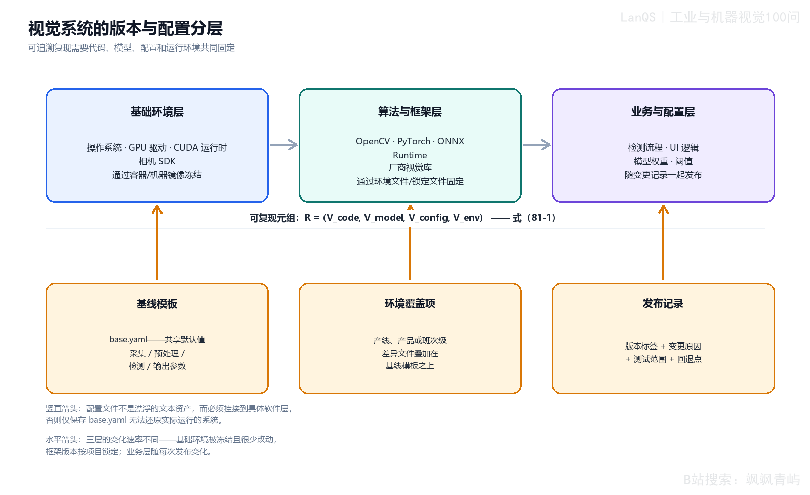</p>
<p align="center">图 81-1　视觉系统的环境、算法与框架、业务配置及发布记录分层</p>

图中上排的三个框表示软件依赖层，箭头表示它们在运行时相互依赖。基础环境层变化最慢，算法与框架层按项目锁定，业务与配置层则随版本发布和现场变更更新。下排的基线模板、环境覆盖项和发布记录说明配置的组织方式：基线保存共享默认值，覆盖文件只保存产线、产品或班次的差异，发布记录保存版本标签、变更原因、测试范围和回退点。竖向箭头提醒读者，配置不能脱离具体软件层和发布状态单独保存。只拿到 `base.yaml`，却不知道它与哪个代码、模型和环境配对，仍然无法完整重建当时运行的系统。图示表达的是管理框架，基础环境究竟用容器、虚拟环境还是整机镜像冻结，要根据现场工控机的维护方式和客户 IT 条件决定。

应用代码、环境清单和基线配置模板属于文本资产，适合放入普通 Git 仓库，因为它们便于比较差异，提交历史也能成为审计轨迹。基础环境一般不以操作系统安装过程的逐行差异保存，而是构建成带标签的容器镜像或金样机镜像，并在发布记录中保存镜像标签或摘要。

模型权重是另一类资产。检测或分类模型的权重文件可能从几十 MB 到数 GB，反复提交到普通 Git 仓库会使仓库膨胀、克隆变慢。Git LFS（Large File Storage，大文件存储）会在 Git 中保留轻量指针，把实际二进制文件放在 LFS 存储中；模型或制品仓库则专门管理权重、镜像等构建产物，并可控制谁有权限把新权重提升到生产环境。无论采用哪一种方式，发布记录都应保存精确权重文件的内容哈希或不可变版本标签，并与代码提交号、配置版本一起记录。`best.pt` 或 `final.onnx` 只是文件名，不能作为唯一身份。


参数文件需要同时满足三件事：程序能稳定解析，工程师能读懂，版本系统能清楚显示差异。YAML（YAML Ain't Markup Language）、JSON（JavaScript Object Notation）和 TOML（Tom's Obvious, Minimal Language）都可以满足这些要求。工程师经常手工维护时，YAML 的层次结构较直观；配置主要由程序生成和严格解析时，JSON 也很合适。格式本身不是决定因素，字段的组织和命名才会直接影响调试。

一份配置可按采集、预处理、检测、输出和现场联锁分组。采集组放曝光、增益、白平衡和触发方式，预处理组放滤波、归一化等图像处理参数，检测组放阈值、模板尺寸或分类阈值，输出组放图像保存和结果输出，联锁组放与产线停机或剔除有关的参数。这样组织后，工程师能先把现场现象定位到一组参数，不必在一个平面键值表中逐项猜测。

字段名应同时说明含义和单位。`exposure_us` 比 `exp` 更明确，`reject_delay_ms` 比 `delay2` 更容易在现场复核。带单位的数值必须在键名中体现单位，避免同一文件混用 ms、μs 和 s 却没有标识。布尔开关也应表达实际动作，例如 `enable_auto_gain` 表示是否启用自动增益，`save_ng_image` 表示是否保存不合格图像；`flag1` 无法告诉维护人员打开后会改变什么。

当多条产线或多种产品共用一套程序时，适合采用“模板 + 覆盖”结构。基线模板保存共享配置，差异文件只保存某条线、某种产品或某个班次的变化，加载时先读取基线，再按书面规定的顺序应用覆盖。典型目录可以写成：

```text
configs/base.yaml
configs/overrides/line_03.yaml
configs/overrides/product_A.yaml
configs/overrides/night_shift.yaml
```

合并顺序必须写进项目文档，因为同一个字段在多个覆盖文件中出现时，后应用的文件会决定最终值。共享默认值变更时只改 `base.yaml`，产线调试时只改对应覆盖文件。这样既能看到一条线的差异，也能避免把完整配置复制到十几个目录后逐渐漂移。

### 变更追踪、验证与复现

配置文件应和代码一起进入版本控制，也可以使用具有同等审计能力的独立配置仓库。每次配置变化至少要能够回答三个问题：谁改了什么，为什么改，改完在哪些样本和现场条件下验证过。记录还应注明影响范围和回退依据。没有这些信息，后来即使看到文本差异，也无法判断这个变化是否与误检或漏检发生在同一时间窗口内。

参数的数值变化可能对应离散的图像结果。比如二值化阈值从 118 改为 112，看起来只是减少了 6 个灰度级，但它可能改变缺陷区域在二值图中是否连通，进而改变后续面积判断和误剔结果。变更记录至少应保留测试样本范围、修改目的和回退版本，不能只保存“118 改成 112”这一行差异。

变更控制还要能适应调试现场。把所有改动都放进缓慢的正式审批链，调试人员可能为了赶上调试窗口而直接在工位手改文件，最后现场状态和系统记录不一致。更实际的做法是设置两条路径：对调试阶段的低风险、可逆参数，允许快速调整，但在事后补齐轻量记录；涉及放行或剔除逻辑、联锁，或者需要同步到多个工位的变化，进入正式评审和受控发布。快速路径的前提是可回退、可记录，不能成为永久绕过版本管理的入口。

#### 从版本四元组重建一次事故

假设某条线从上周二开始漏检率上升，调查窗口内出现过 3 个代码提交、2 个模型文件、5 个配置版本和 2 个基础镜像。这些数字是为说明计算方法而设置的示例数，不是任何真实部署的测量结果。若只知道四元组中的一部分坐标，仍有多个历史系统状态符合现象。把尚未确定的候选数相乘，就能得到剩余可能状态数：

| 已确定的维度 | 计算 | 仍可能的历史系统状态数 |
|---|---:|---:|
| 尚未确定任何维度 | $3\times2\times5\times2$ | 60 |
| 已确定 $V_{\mathrm{code}}$ | $2\times5\times2$ | 20 |
| 已确定 $V_{\mathrm{code}},V_{\mathrm{model}}$ | $5\times2$ | 10 |
| 已确定前三个维度 | $2$ | 2 |
| 四个维度全部确定 | $1$ | 1 |

这个算例的代码逻辑是：把每个坐标的候选数放入字典，依次假定前 $k$ 个维度已经确定，再对剩余候选数做乘法。完整确定四个坐标后，程序断言剩余状态数必须为 1。用伪代码表示如下，变量 `states[k]` 表示确定前 $k$ 个维度后仍需排查的状态数：

```python
candidates = {
    "V_code": 3,    # 一周内部署过的代码提交数
    "V_model": 2,   # 一周内实际推送过的权重文件数
    "V_config": 5,  # 阈值和曝光调参形成的配置版本数
    "V_env": 2,     # 轮换使用的基础镜像数
}

dims = ["V_code", "V_model", "V_config", "V_env"]
counts = [candidates[name] for name in dims]
states = []
for k in range(len(dims) + 1):
    total = 1
    for count in counts[k:]:
        total *= count
    states.append(total)

print(states)       # [60, 20, 10, 2, 1]
assert states[-1] == 1
```

只知道代码版本时，仍有 20 种候选状态，原因是模型、配置和环境仍分别有 2、5、2 个候选值。四个维度都锁定后，组合数才收敛到 1。图 81-2 左侧使用对数坐标显示这种收缩，右侧对应实际追溯时应当查找的记录。

<p align="center">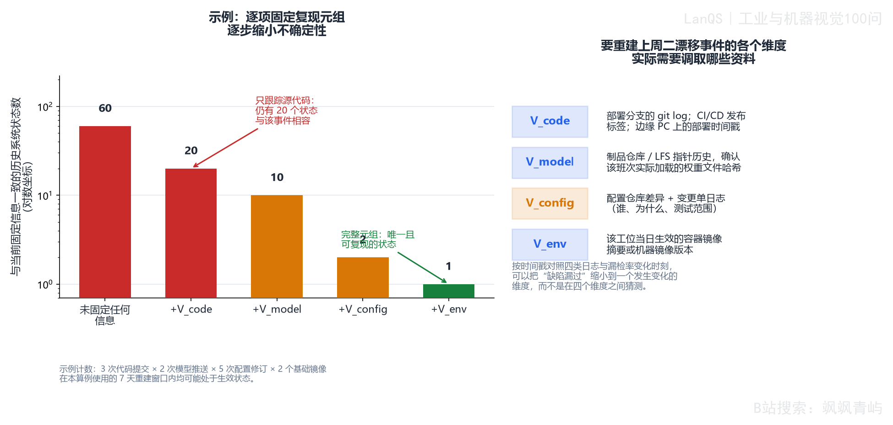</p>
<p align="center">图 81-2　从候选版本组合到唯一可复现系统状态的算例</p>

读图时，左侧柱形的高度表示在当前已知条件下还剩多少种可能状态，纵轴采用对数坐标，因此 60、20、10、2、1 的差异不会被压在同一条线附近。右侧把四个坐标与记录来源对应起来：代码查部署分支的 Git 日志、CI/CD（持续集成与持续交付）发布标签和边缘工控机部署时间；模型查制品仓库或 Git LFS 指针历史，确认当班实际加载的权重哈希；配置查配置仓库差异和变更单；环境查容器镜像摘要或机器镜像版本。四类记录必须按时间与漏检率开始变化的时刻对齐，图中的唯一状态只表示版本组合被唯一指认，不能证明漏检一定由某一个坐标造成，还需要结合样本和现场测试验证因果关系。

实际事故重建时，可以沿着四个坐标分别取证。代码侧查看部署分支的 `git log`、CI/CD 发布标签和边缘工控机上的部署时间。模型侧查看制品仓库或 Git LFS 指针历史，确认受影响班次实际加载的文件哈希，而不是只查看最近上传的文件。配置侧比较配置仓库差异，并对照变更单确认谁在什么时间、因为什么目的做过修改，以及修改覆盖了哪些样本。环境侧确认当天该工位使用的容器镜像摘要或机器镜像版本，因为中途重装某台机器也可能在代码、模型和配置均未改动时改变 $V_{\mathrm{env}}$。把四类日志与漏检率变化时间交叉核对，才能形成可检验的变化判断，而不是在四个方向之间猜测。


调参前先冻结一份当前可工作的基线，并写明本轮要解决的现象。例如目标是降低反光工件的误剔，就应使用多个批次、不同反光程度的样本，而不是挑两三张看起来有代表性的图片。每次调整都应有明确目标，例如验证曝光变化是否改善缺陷对比度，或验证阈值变化是否减少误剔，同时记录对应的代码、模型、配置和环境版本。

验证至少分为离线和在线两个阶段。离线验证使用固定图像集，让不同参数版本在相同输入上比较检测率、误接受率、误剔率和边界样本表现。离线图像适合回答“这套参数对已保存样本产生了什么变化”，但它没有包含生产中的触发抖动、工件姿态变化和真实节拍。

在线验证需要把候选版本放回真实工位，检查节拍、触发同步、光照漂移、振动、工件姿态和光源温度变化。现场参数可能在机器升温、输送速度变化或批次切换后表现不同。离线通过只能说明固定样本上的结果满足当前比较条件，不能自动推出在线运行稳定，更不能替代回退验证和异常样本验证。发布记录应把离线结果、在线条件、采用的版本四元组和回退点放在一起。

### 模型、部署与团队协作

模型发布至少要记录网络结构、权重文件、训练数据、标注规范、输入分辨率、数据增强策略和训练配置。部署时还要记录模型输入尺寸、预处理方式以及叠加在模型输出上的阈值。只保留一个叫 `best.pt` 或 `final.onnx` 的文件，无法说明它由哪批数据训练、怎样标注、采用什么输入分辨率和阈值，也无法可靠重建过去的性能。

传统视觉方法没有神经网络权重，但同样存在模型资产。模板文件、标定文件、灰度参考图和几何检测基准都会影响检测结论，应和权重文件一样纳入版本管理。模型版本应与对应的代码和配置版本绑定发布，避免程序已经更新、权重仍停留在旧版，或者模型输入分辨率与预处理配置不匹配。发布记录中的权重哈希、训练集版本、验证结果和回退包，构成模型能够被复核的依据。


当同一视觉系统部署到多条产线、多台工位或多个工厂时，配置如果只散落在本地机器，很快就会失去可比性。集中管理平台应保存共享模板、站点覆盖项、发布记录和回退点。它不要求所有站点使用完全相同的参数，而是让每个站点的差异有明确来源，并能与基线直接比较。

远程部署应先在测试工位或金丝雀工位验证，再分批推送到生产工位。金丝雀发布是先让少量试点设备运行候选版本，再扩大范围的部署方式。推送过程中要保留旧版本和回退路径，确认新配置完整加载后再使其生效，避免代码、模型和配置只更新了一部分。涉及放行、剔除、停线或联锁的关键参数，应通过受控发布变更，不能允许普通账户在本地页面永久写入。配置一旦参与质量判定和生产动作，它就属于生产质量控制的一部分。


配置文档要把依赖个人经验的内容变成团队可以查询的记录。参数字典至少应说明字段含义、单位、有效范围、默认值和修改影响。对相互耦合的参数，还要说明耦合方向和验证方法。例如提高曝光后，为什么需要重新检查增益和高光饱和；缩小 ROI 后，计算量可能下降，但边缘缺陷是否仍在区域内需要重新确认。这样的说明让工程师知道参数改变后应观察什么，而不只是知道一个推荐数值。

知识库适合记录场景化案例。镜面材料换批后误剔增加，可以记录先检查光源角度和偏振设置；夜班漏检或误检上升，可以记录检查环境光变化。案例还应注明适用条件，避免把一次现场经验当成所有工位的固定规则。参数字典和案例库共同使用时，新工程师可以分辨哪些参数能由现场例行调整，哪些变化必须重新做离线和在线验证。

### 常见误区

- 代码提交号没有变化，就认为系统没有变化。模型、配置、驱动和运行时仍可能改变四元组的其他坐标。
- 把大型模型权重反复提交到普通 Git 仓库。应使用 Git LFS 或制品/模型仓库，并在发布记录中保存文件哈希或不可变标签。
- 使用 `flag1`、`delay2` 等无法表达作用和单位的字段名。维护人员无法从字段名判断它影响采集、判定还是剔除。
- 把共享默认值复制到每条产线的完整配置中。模板加覆盖文件更容易比较差异，也更容易统一修改默认值。
- 正式审批过慢，现场工程师直接改机而不回填记录。低风险、可逆的调试变化可以走快速记录路径，影响放行逻辑或多个工位的变化仍需正式发布。
- 模型、代码和配置分别发布。三者未绑定时，即使每个对象各自有版本号，也可能组成无法复现的混合状态。

### 术语与符号表

| 术语或符号 | 含义 |
|---|---|
| $R$ | 可复现系统状态的四元组，按顺序包含代码、模型、配置和运行环境版本。 |
| $V_{\mathrm{code}}$ | 业务程序或应用代码版本。 |
| $V_{\mathrm{model}}$ | 深度学习模型、传统视觉模板或其他检测资产的版本。 |
| $V_{\mathrm{config}}$ | 参数配置文件及其覆盖关系的版本。 |
| $V_{\mathrm{env}}$ | 操作系统、驱动、GPU 运行时、相机 SDK 和设备镜像组成的环境版本。 |
| 基础环境层 | 管理操作系统、驱动、GPU 运行时和相机 SDK 的层。 |
| 模板 + 覆盖 | 基线模板保存共享默认值，覆盖文件保存产线、产品或班次差异的配置方式。 |
| Git LFS | Git 的大文件存储扩展，在 Git 中保存轻量指针，把大型二进制文件放在独立存储中。 |
| 制品/模型仓库 | 保存模型权重、容器镜像等构建产物，并提供版本和权限管理的存储系统。 |
| 金丝雀发布 | 先在少量测试或试点工位验证，再分批推广到生产设备的部署方式。 |
| ROI | Region of Interest，感兴趣区域，表示参与处理或判定的图像区域。 |
| IPC | Industrial Personal Computer，工业计算机，指部署在现场执行视觉软件的计算机。 |
| SDK | Software Development Kit，软件开发工具包，提供调用相机或其他设备功能的接口和组件。 |
| PLC | Programmable Logic Controller，可编程逻辑控制器，用于接收检测结果并协调产线动作。 |
| CI/CD | Continuous Integration and Continuous Delivery，持续集成与持续交付，用于自动构建、测试和发布软件。 |

### 延伸阅读

- Sculley, D. 等，《Hidden Technical Debt in Machine Learning Systems》，NeurIPS，2015。讨论机器学习系统的可复现性不只取决于模型代码。
- Humble, J. 与 Farley, D.，《Continuous Delivery: Reliable Software Releases through Build, Test, and Deployment Automation》，Addison-Wesley，2010。介绍发布、环境一致性和回退管理。
- Git LFS 文档。用于了解模型权重等大型二进制文件如何与源代码协同版本管理。
- Sato, D.，《Canary Release》，martinfowler.com。介绍适用于配置和模型部署的分阶段、可回退发布方式。

---

---

# 第82问　现场人员可能误操作，工业视觉系统应该如何设计权限？

> 模块：软件工程、系统架构与项目交付

工业视觉系统往往同时连接相机、PLC（Programmable Logic Controller，可编程逻辑控制器）、机器人、剔除机构和生产数据库。操作员在屏幕上切换一个配方，可能改变下一批工件的判定阈值；维护人员在错误模式下写入一组标定值，可能让机器人或剔除机构使用错误坐标。权限设计要回答的不只是“谁能看到哪个按钮”，还要回答谁能发起动作、动作在什么状态下才允许执行、写入后如何确认已经生效，以及发生问题后能否追溯到具体的人和具体的版本。

### 权限设计与误操作防护的基本原则

工业系统中的误操作很少只是“按错一次按钮”。视觉系统处在采图、判定和设备动作组成的闭环中：相机获得图像，算法给出结果，PLC 或机器人据此控制输送、剔除、停线或下一步动作。一个看起来很小的界面操作，可能同时改变设备运动节拍、视觉判定逻辑和工艺状态。比如，工位在没有确认相机触发延时的情况下直接切换自动运行，整批工件可能错过视野；维护期间把测试配方发布到生产线，在线工件会立刻按照另一套放行阈值判定；在生产模式下写入标定参数，检测坐标或执行器坐标可能立即失效。

风险的大小取决于视觉系统在设备链中的位置。相机只提供观察画面时，误操作可能只是打开了错误窗口；检测结果一旦直接驱动剔除、停线或机器人动作，错误就会沿控制链传播。因而权限管理的对象应当是会改变设备状态、质量结论或安全边界的动作，而不只是 HMI（Human-Machine Interface，人机界面）上的按钮。

还要考虑动作的生效时机。参数写入可能发生在工件已经进入视野之后，PLC 已经发出触发但检测结果还没有返回；如果系统没有规定新配置从哪一个工件或哪一个周期开始生效，操作员无法判断当前结果使用的是旧配方还是新配方。权限设计应把运行模式、在途工件、配置版本和回退状态一起纳入系统状态机。权限控制保护的是动作发生的条件，时序控制则保护动作发生的时间，两者缺一都会留下误操作路径。


权限设计可以从四个原则开始。最小权限要求账户只拥有完成当前岗位任务所需的权限。操作员可以启停设备、复位报警和选择已批准配方，并不意味着他需要改阈值、换模型或写入标定值。权限范围越大，误触和误改的影响面越大，培训和审计也越难保持清楚。

职责分离把高影响动作拆开。例如，调试人员可以编辑阈值，另一位工程师负责复核，受控发布服务负责把通过验证的版本推送到生产。若一个账户既能编辑又能发布，而且不需要第二人确认，它就成为整个流程的单点失效位置。职责分离不要求每一个低风险动作都经过两个人，而是把复核放在会改变质量结论、联锁或多工位行为的节点上。

可审计性要求每次重要动作留下可检索的记录。至少要能查到身份、时间、工位、对象、前值、后值、来源和结果。只有日志能够还原一次变更，团队才知道问题发生前改了什么，也才能区分误操作、合法调试和设备自身故障。

界面和后端必须执行同一套规则。把按钮置灰只会改变提示，不能阻止旧客户端、远程工具或直接 API（Application Programming Interface，应用程序接口）继续发起写请求。认证与授权也要区分：认证回答“登录者是谁”，授权回答“这个身份在当前工位、当前模式和当前时间窗口内能做什么”。刷卡或输入 PIN（Personal Identification Number，个人识别码）只完成身份确认，后台还要检查角色、工位、运行状态、参数范围和动作前置条件。

以配方发布为例，正常生产中的操作员可以选择已批准的配方，却不应长期拥有重写判定阈值的权限；工程师在短时间调试时可以获得受限的临时修改权，但把修改推到生产线仍应通过复核或双人确认。权限设计最后要落到两个层面：组织层面规定谁负责、谁复核，技术层面规定系统实际接受哪些请求。

### 权限分层、技术机制与审计

RBAC（Role-Based Access Control，基于角色的访问控制）先定义岗位角色和每个角色的操作范围，再把人员加入角色，而不是为每个账户逐个配置按钮。这样新操作员入岗时继承操作员角色，换班或岗位调整时修改角色成员即可。角色应对应现场真实岗位，不能拆成几十个维护人员自己也说不清的微小开关。

典型划分如下：

| 角色 | 可以执行的典型动作 | 应限制的动作 |
|---|---|---|
| 访客或只读 | 查看状态、图像、报表和日志 | 修改配方、阈值、模型和标定 |
| 操作员 | 启停、复位、确认报警、选择已批准配方 | 修改模型、标定和安全联锁 |
| 工程师 | 标定、诊断、参数调试、切换配方 | 未经复核发布全线配置 |
| 管理员 | 账户、角色、备份和系统策略管理 | 绕过审计改变质量结论 |

高风险行业或生产环境还可能需要质量工程师、安全员等角色。是否增加角色，应由实际审批链和责任边界决定，而不是为了让权限表看起来更细。操作员角色对应正常生产节奏，工程师角色对应维护和调试，管理员角色对应账户及系统治理，这种对应关系也应出现在培训资料和交接记录中。

RBAC 只缩小“谁可以发起动作”的范围，不保证有权限的人一定判断正确。一个拥有工程师权限的人仍可能把看似合理的阈值改错；一个多人共用的工程师账户则会同时破坏权限边界和审计身份关联。角色定义完成后，还要为每个高风险动作规定前置模式、参数范围、确认方式和审计字段。


现场可以从只读、操作、工程和管理员四个基本层级开始。只读层用于查看状态、图像和报表；操作层处理正常生产、复位和常规报警；工程层进入维护、标定和调试；管理员层管理账户、备份和系统策略。层级名称应与岗位名称、培训材料和日志中的角色名称一致，否则现场人员知道“工程师模式”，系统却记录成另一个不易理解的权限名，排查时会增加歧义。

层级不能替代高风险动作的独立门槛。发布生产配方、修改安全联锁或执行联锁旁路，可以再要求双人确认、实体钥匙或限时授权。只依靠层级时，拥有工程师权限的人可能在任何时间直接改值；加入模式、范围和时序约束后，系统才能限制动作发生的场景。层级过粗会暴露不必要的入口，层级过细则会增加登录和培训负担，现场最终可能共享最高权限账户。设计完成后要用轮班、维护和应急流程演练，验证它是否真的能被使用。

可以把动作按影响范围分开。操作员选择已批准配方属于正常生产动作，系统应确认产品型号和工位；工程师修改阈值属于维护动作，系统应要求进入维护模式、限制可调范围并记录验证批次；管理员修改账户属于治理动作，系统应保留更严格的审计。若三类动作都放在一个没有风险提示的“设置”页面里，使用者看不到区别，软件也无法针对不同动作执行不同保护策略。

图 82-1 将角色范围、风险动作和技术机制连接起来。读图时先从左到右观察角色权限如何扩大，再从角色向下查看二次确认、顺序联锁和审计追踪分别限制什么，最后检查登录会话、受保护 PLC 标签、实体钥匙和写入留痕是否落在实际执行路径上。

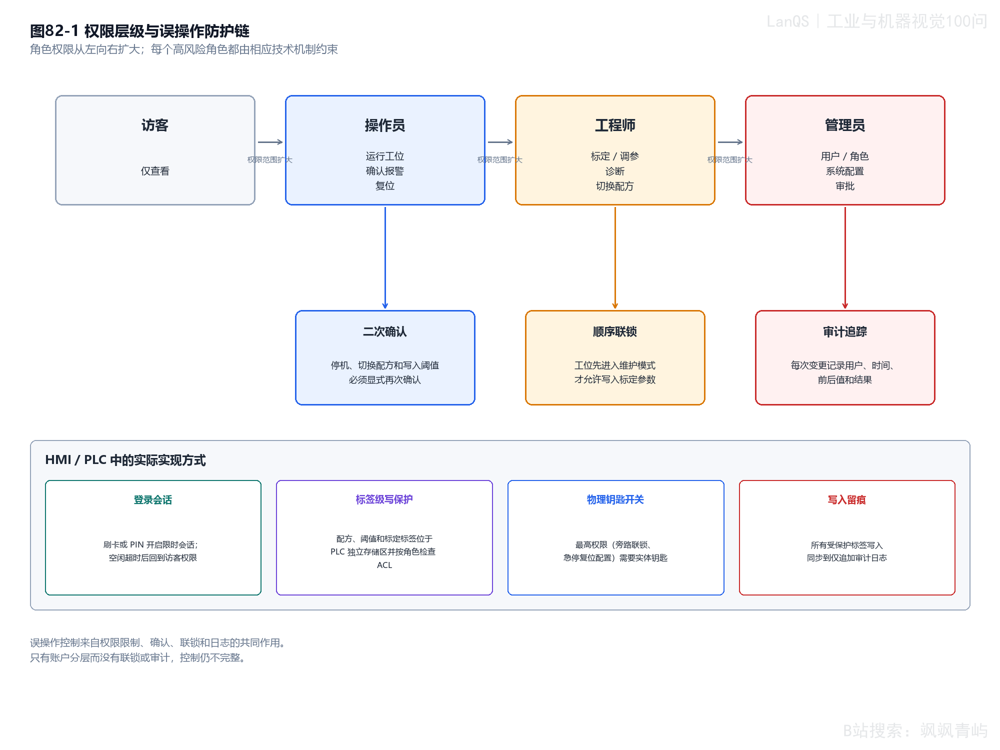

<p align="center">图 82-1　权限层级与误操作防护机制的对应关系</p>

访客只能查看，操作员承担运行和报警确认，工程师承担标定、调试和配方切换，管理员承担账户与系统策略。图中二次确认对应停机、配方和阈值写入；顺序联锁要求工位先进入维护模式，才允许写入标定参数；审计追踪保存管理员级变更和其他受保护写入。底部的登录会话、标签级保护、物理钥匙开关和写入留痕说明这些规则应在哪里实现。角色框数量增加，不代表控制自动变强；如果后端仍接受越权写入，或没有任何前置状态检查，高权限动作仍然可以误执行。


二次确认的作用是让操作者在高风险动作真正执行前重新看到对象和影响范围。提示语应写清“将产品 A 配方发布到 3 号工位”或“把阈值从 118 改为 112”，而不是只显示“是否确定”。确认框不能替代授权检查，它解决的是操作者没有意识到动作影响的问题；授权检查解决的是这个账户有没有资格执行动作。

顺序联锁把设备状态作为写入前提。工位没有进入维护模式时，后端直接拒绝标定写入；设备仍处于自动运行或有在途工件时，系统可以拒绝某些会改变判断时序的配置切换。范围限制则对曝光、增益、速度补偿和剔除延时设置允许区间，输入越过区间时不进入设备。范围限制只能挡住超出预设边界的数字，不能判断一个范围内的值是否适合当前产品，因此仍需样本验证。

更高风险的动作可以使用双人确认和限时授权。双人确认适合影响整条线质量或安全边界的发布，要求发起人和复核人使用不同身份确认；限时授权适合售后支持或短时间工程调试，授权应带有开始时间、结束时间、授权人和自动降权动作。联锁旁路或急停响应配置还可以加实体钥匙开关，使远程账户不能单独完成最高风险操作。物理钥匙不能代替日志，钥匙的领取、使用和归还仍应纳入管理记录。

这些机制必须落在实际请求链路上。刷卡或 PIN 开启带角色和有效期的会话，空闲超时后自动降为只读，避免终端跨班次保留工程师权限。配方、判定阈值和标定数据应作为受保护标签或数据类，由 PLC 或后端在每一次写请求时检查 ACL（Access Control List，访问控制列表）。检查不能只发生在 HMI，因为 HMI 隐藏了按钮，远程工具或旧客户端仍可能直接调用接口。每次受保护写入还要写入独立日志，记录用户、时间、前值、后值、来源和结果。

写入前可以进行事务性检查：先读取当前运行模式和当前配方版本，确认没有其他会话在这段时间修改目标字段，再检查新值范围和依赖关系，最后提交。提交失败时保持旧值，并向 HMI 返回明确原因；如果写入成功但尚未完成复核和发布，系统应显示“已修改、未批准”，不能让它看起来像新的生产基线。这样可以区分一次失败的尝试、一次暂存变化和一次真正生效的发布。

#### 权限分层的效果算例

权限分层对不同误操作类别的作用并不相同。下面的算例以每 1,000 个操作员班次为统计分母，比较三种方案：没有角色分层且使用共享账号的扁平方案、只使用 RBAC 的方案，以及 RBAC 加上针对该类别的二次确认、顺序联锁、审计或会话刷卡机制。所有数字都是为了说明计算关系而设置的示例数，不是现场测量结果。

| 误操作类别 | 扁平方案 | 仅 RBAC | RBAC + 针对性机制 |
|---|---:|---:|---:|
| 未培训操作员修改阈值 | 8.0 | 2.8 | 0.56 |
| 错误配方发布到产线 | 5.0 | 1.5 | 0.23 |
| 在维护模式外覆盖标定 | 4.0 | 2.2 | 0.22 |
| 角色正确但判断错误的工程师修改 | 3.0 | 2.85 | 2.28 |
| 换班后继续使用共享账号 | 6.0 | 4.2 | 0.63 |
| 合计 | 26.0 | 13.55 | 3.91 |

计算使用三个比例数组。`baseline_flat` 是扁平方案的基线事件率，`remaining_role_only` 是加入 RBAC 后仍保留的比例，`remaining_with_mechanism` 是在 RBAC 结果上再加入针对性机制后仍保留的比例。对第 $i$ 类事件：

$$
\begin{aligned}
\text{rate}_{\mathrm{RBAC},i}&=\text{baseline}_i\times r_{\mathrm{role},i}\\
\text{rate}_{\mathrm{full},i}&=\text{baseline}_i\times r_{\mathrm{role},i}\times r_{\mathrm{mechanism},i}
\end{aligned}
$$

这些比率没有物理单位，事件率的单位是“每 1,000 个操作员班次的事件数”。例如第一类事件的计算为 $8.0\times0.35=2.8$，再加入二次确认后为 $2.8\times0.20=0.56$；第二类为 $5.0\times0.30=1.5$，再加入针对性机制后为 $1.5\times0.15=0.225$，表中按两位小数写成 0.23。合计按未四舍五入的类别结果计算，三种方案分别是 $26.00$、$13.55$ 和 $3.91$。

原始代码的计算逻辑如下：

```python
import numpy as np

categories = [
    "未培训操作员修改阈值",
    "错误配方发布到产线",
    "在维护模式外覆盖标定",
    "角色正确但判断错误的工程师修改",
    "换班后继续使用共享账号",
]

# 每 1000 个操作员班次的示例事件率
baseline_flat = np.array([8.0, 5.0, 4.0, 3.0, 6.0])

# 仅加入 RBAC 后仍保留的比例
remaining_role_only = np.array([0.35, 0.30, 0.55, 0.95, 0.70])

# 加入针对性机制后，在 RBAC 结果上仍保留的比例
remaining_with_mechanism = np.array([0.20, 0.15, 0.10, 0.80, 0.15])

rate_role_only = baseline_flat * remaining_role_only
rate_full = baseline_flat * remaining_role_only * remaining_with_mechanism

total_flat = baseline_flat.sum()
total_role_only = rate_role_only.sum()
total_full = rate_full.sum()

print(f"扁平={total_flat:.2f}, 仅 RBAC={total_role_only:.2f}, 完整方案={total_full:.2f}")
```

程序得到的总事件率为：

```text
扁平=26.00, 仅 RBAC=13.55, 完整方案=3.91
```

只使用 RBAC 时，总事件率从 26.00 降到 13.55，相当于相对扁平方案减少了：

$$
\frac{26.00-13.55}{26.00}\approx47.9\%
$$

在此基础上加入针对性机制，事件率再从 13.55 降到 3.91，相对扁平方案的额外降幅为：

$$
\frac{13.55-3.91}{26.00}\approx37.1\%
$$

完整方案的事件率是基线的：

$$
\frac{3.91}{26.00}\approx15.1\%
$$

第四类尤其值得检查。工程师拥有正确角色，因此 RBAC 只把事件率从 3.00 降到 $3.00\times0.95=2.85$；加入审计后为 $2.85\times0.80=2.28$。审计主要负责发现和追溯，不能在错误判断已经通过授权检查后阻止它。这个算例说明权限分层能有效限制“谁可以做”，却不能单独判断“有权限的人这次做得对不对”。

统计比较成立的前提是三列使用同一个分母，即每 1,000 个操作员班次。实际项目如果改用每万次写入、每台设备每月或每批次统计，必须重新定义事件率，不能把不同分母的数字直接拼成趋势图。图 82-2 的数值用于说明机制作用范围，不是某条产线的风险预测。

图 82-2 中红、橙、绿三组柱分别表示扁平权限、仅 RBAC 和加入针对性机制后的示例事件率。前面三类事件随角色限制和前置机制明显下降，第四类则保留较高事件率，显示“授权正确但判断错误”的边界。图中的柱高不能单独推出真实事故概率，现场还需要使用统一分母和实际审计数据验证。

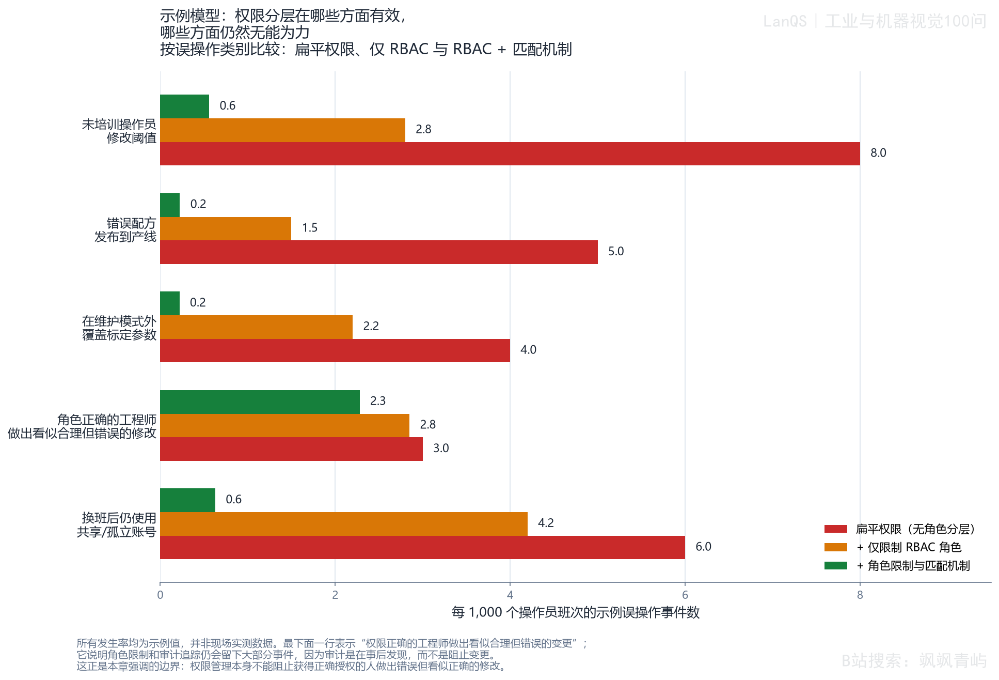

<p align="center">图 82-2　权限分层及针对性机制对不同误操作类别的示例影响</p>


权限系统会增加登录、培训、审批和维护成本。层级太多或审批链太慢时，生产现场为了完成任务，可能共享工程师或管理员账户。共享账户让任务继续进行，却破坏了“一个会话对应一个可识别的人”这一审计前提。此时系统看似增加了权限控制，事故发生后却无法知道具体是谁做了修改。

权限设计还会影响生产可用性。报警复位和常规配方选择如果每次都要管理员介入，操作员会把保护流程视为停机障碍；所有动作都开放给操作员，生产操作变快了，阈值和标定误改的风险又会增加。低影响、可逆的动作可以采用较短的确认流程，不可逆、跨工位或影响安全边界的动作则需要复核、审批和回退。

RBAC 的另一条边界是它无法判断授权人员的动作是否正确。拥有合法标定权限的工程师仍可能发布一组错误标定值，拥有阈值编辑权限的工程师也可能根据少量样本作出错误判断。要覆盖这类问题，需要同行复核、发布前验证、分阶段上线和结果监测。把所有错误都交给权限层级处理，容易得到一个复杂却无法阻止判断错误的系统。

方案必须在真实流程中演练。演练应检查临时授权能否自动失效，网络断开时系统是否保持安全状态，管理员回退是否恢复到经过验证的版本，以及轮班后旧会话是否已经降权。层级数量本身不能说明方案有效，能否在生产节奏下保持身份清楚、动作可回退和记录完整，才是验收条件。


审计日志要完整回答“谁在什么时间、对哪个对象、执行了什么动作、结果是什么”。关键字段至少包括用户身份、设备或工位编号、时间戳、对象、前值、后值、结果状态和触发来源。触发来源应区分 HMI、远程工具和自动脚本。若系统连接 MES（Manufacturing Execution System，制造执行系统）、PLC 或配方服务器，还应记录关联工单或批次，以便把异常产品追溯到具体操作。

需要审计的事件包括登录和退出、配方切换、参数修改、模型替换、标定写入、报警复位和远程连接。日志应可检索并具有防篡改能力，不能由被审计的同一个账户直接覆盖。只记录 HMI 按钮被点击，不记录底层标签的实际前后值，也不能称为完整审计，因为按钮点击可能失败、被其他会话覆盖，或根本没有到达 PLC。

发现误操作后，审计记录应支持一条连续的调查路径。先固定异常首次出现的时间和对应批次或工单窗口，再按工位和时间范围提取该窗口内所有写入记录。随后把每条写入与当时有效的登录会话匹配，检查是否存在无会话写入或跨班次共享会话。再把写入时间与配方切换、阈值变化、标定改写和模型替换对齐，判断哪一个动作与异常开始时间相符。最后区分两类原因：角色本来就不应有该权限，还是角色正确但判断错误。前者需要修正分层或增加联锁，后者需要加强复核、验证和分阶段发布。

还要记录写入是否真正生效。用户点击保存、后端接受请求、PLC 接收标签、配置落盘和检测进程重启加载，是不同状态。日志应能区分失败尝试、已暂存未批准、已发布和已回退，否则调查人员看到一条“保存成功”记录，却不知道生产设备是否真的按照该值运行。


HMI 应持续显示当前账户、角色、运行模式、当前配方版本和设备状态。这样操作员在执行动作时能知道自己是谁、工位处于自动还是维护、设备将使用哪一个配方。危险动作要与查询、翻页和图像保存等日常动作分开，并在提示中写出具体对象、影响工位和版本差异。清晰的界面提示减少误解，但它不能替代后端授权。

视觉系统常把调试功能和生产功能放在同一个页面，现场人员因而容易在正常运行中触及阈值、标定或模型入口。生产运行页、参数调整页和维护诊断页应在结构上分开，让页面边界与角色边界对应。页面分开既减少误触，也让培训和换班交接更容易：操作员知道日常页面只允许哪些动作，工程师知道进入维护页后还要满足哪些条件。

界面权限必须与后台权限一致。隐藏“发布”按钮，却让旧客户端或直接 API 继续接受同一个写请求，只是改变了可见性，没有改变设备行为。高风险动作可以让 HMI 显示影响范围，后端执行角色和范围检查，PLC 保护关键标签，实体钥匙控制最高风险模式，日志记录最终写入。四者分别承担告知、拒绝、联锁和追溯责任。

确认完成后，界面应显示“待复核”“已发布”“加载失败”或“已回退”等状态，而不能只弹出一个没有上下文的“成功”。操作员需要知道变更是否已经到达 PLC 和检测进程，也需要知道失败时当前仍然使用哪一个旧版本。状态显示本身不是审计记录，但它能把技术状态转成现场人员可判断的信息。

### 组织控制与现场闭环

双重预防不是把同一条提醒显示两遍，而是让组织规则和技术系统相互补位。组织控制规定谁负责、什么情况需要升级、哪些变化需要审批、什么异常必须由第二人复核；技术控制把这些要求落实为角色、联锁、确认、范围限制、日志和报警。这样，换班、人员离职或交接不完整时，技术边界仍能保留，不能完全依赖每个人在压力下记住制度。

两类控制应在需求和接口设计阶段一起定义。制度若规定“工程师审核后才能发布阈值”，软件就需要审核状态和发布权限；制度若规定“维护模式才能标定”，后端和 PLC 就都应检查维护状态；制度若规定临时权限到时失效，系统就要保存开始、结束时间并自动降权。只有规则在接口和设备状态中留下对应字段，后续审计才有证据可查。

换班、人员离职、网络中断和应急维修都应成为演练场景。演练要验证新人员能否得到正确角色，旧会话是否失效，临时工程权限是否自动结束，维修后的参数是否需要重新复核，以及异常操作能否从日志中还原。技术控制发现的是动作和状态，组织控制决定如何响应和改进，两者共同形成从预防到追溯的闭环。

### 常见误区

- 只把 HMI 按钮置灰，后台仍接受越权写入。按钮状态不是授权检查。
- 角色拆得过细，现场最后共享管理员账户。共享账户会破坏身份追踪和最小权限。
- 把角色授权等同于操作正确性。RBAC 只能限制谁可以做，不能证明有权限的人判断正确。
- 只记录按钮名称，不记录 PLC 标签的前后值、来源和结果。事故调查无法确认实际写入了什么。
- 没有空闲超时，工程师会话跨班次保留。下一位人员可能继承不属于自己的高权限会话。
- 只保存审批文件，不在后端、PLC 或日志中执行对应规则。制度没有技术落点时，现场仍可绕过它。
- 只验证权限分层，不演练网络中断、临时授权失效和版本回退。纸面权限不能代替真实流程验收。

### 术语与符号表

| 术语 | 含义 |
|---|---|
| RBAC | Role-Based Access Control，基于角色的访问控制，把权限绑定到岗位角色，再分配给用户。 |
| 最小权限 | 账户只持有完成当前任务所需的权限。 |
| 职责分离 | 将编辑、复核、发布和回退等高影响动作拆分给不同角色或人员。 |
| 二次确认 | 高风险动作执行前，要求操作者再次确认具体对象和影响范围。 |
| 顺序联锁 | 未满足规定的前置状态时，系统禁止执行动作。 |
| 审计日志 | 保存身份、时间、对象、前后值、来源和结果的可追溯记录。 |
| 限时授权 | 只在限定时间窗口内有效的临时权限，到期后自动降权或失效。 |
| ACL | Access Control List，访问控制列表，规定角色对资源的操作范围。 |
| HMI | Human-Machine Interface，人机界面，供人员查看状态和操作设备的软件界面。 |
| PLC | Programmable Logic Controller，可编程逻辑控制器，用于协调设备和产线动作。 |
| MES | Manufacturing Execution System，制造执行系统，记录生产批次、工单和过程信息的系统。 |

### 延伸阅读

- ISA/IEC 62443 系列：工业自动化与控制系统安全，涉及账户、访问控制和审计要求。
- NIST SP 800-162，*Guide to Attribute Based Access Control (ABAC) Definition and Considerations*：用于理解在角色之外加入班次、工位和时间窗口等上下文属性。
- ISO 9001:2015 第 7.5 条和第 8.5.1 条：涉及文件化信息、生产控制和制造过程追溯。
- Sasangohar 等关于工业控制室人因和报警管理的研究：用于理解界面清晰度、培训与误操作之间的关系。

---

---

# 第83问　客户要求增加一种缺陷检测，软件架构如何支持快速扩展？

> 模块：软件工程、系统架构与项目交付

视觉项目交付后很少永久冻结。客户可能增加 SKU（Stock Keeping Unit，库存量单位），产品表面会出现新的纹理；工艺改变后，原来被忽略的外观可能变成必检缺陷；质量要求收紧后，过去允许的差异也可能进入判定范围。若新增一种缺陷就要同时改采集、主循环、界面、PLC 通信和日志，原本已经稳定的功能会被反复触碰，回归范围和现场风险会随着缺陷种类增加。本题讨论怎样把变化局部化，让新增缺陷主要表现为一个检测器、一组配方参数和一轮验证，同时说明这种架构在成像、节拍和兼容性方面的边界。

### 模块化架构与插件接口

客户提出新缺陷时，工程师面对的通常不是“再写一个算法”这么简单。新产品可能需要新的 ROI（Region of Interest，感兴趣区域），新的缺陷定义可能要求保存证据图，新的质量规则可能需要把结果映射到既有 PLC 消息。若这些变化都直接写进主循环，新增一种缺陷就会触碰已经工作的相机采集、界面逻辑、通信接口和图像归档。每次发布都要重新证明旧缺陷仍然正常，维护成本会随项目寿命快速上升。

快速扩展的目标是建立稳定的变化边界，而不是寻找一个能够检测所有外观的单一算法。采集、预处理、通信、结果展示和归档已经稳定时，新能力应尽量限制在检测模块和相应配置中。这样，工程师可以在不改动整条主流程的前提下加入一种规则、几何或深度学习检测器，再用共享回归样本验证它是否影响既有能力。可扩展性既是代码结构问题，也是接口、配置和测试组织问题。

也要先判断新增缺陷是否真的属于软件扩展。如果新缺陷需要新的光源角度、新相机视角或新的触发方案，软件无法从现有图像中获得缺失信息，问题已经回到成像和系统设计。插件架构可以减少软件接入工作，但不能补偿采集条件不足。


模块化架构按稳定职责切分系统。采集模块负责相机触发、取图和采集元数据；预处理模块负责统一尺寸、颜色、校正和 ROI；检测模块负责把图像转换为缺陷判断；结果合并模块负责汇总多个检测器的结果；通信和归档模块负责将结果送给 PLC、MES（Manufacturing Execution System，制造执行系统）、HMI 或图像存储。新增缺陷时，理想变化集中在检测模块，其他模块继续使用原来的输入和输出约定。

边界不能只靠文件夹名称表达，必须有明确的输入输出契约。预处理应交给检测器一个统一的图像对象和元数据，元数据可以包含配方、工位和时间戳；检测器应返回统一的缺陷结果结构，而不是每种算法各自定义一套字段。规则法、几何法和深度学习法的内部过程可以不同，结果仍应包含可解释的类型、位置、尺寸、分数、建议动作和证据图等信息。否则系统表面上被分成多个文件，调用关系仍然互相牵连，每加一个检测器都要改下游代码。

图 83-1 中，采集与预处理先形成统一输入，多个检测器通过一个接口并列接入，结果合并模块再把统一结果交给通信和归档。图下方的配置、契约版本和共享回归集，是模块化能够长期工作的条件；它们不会因为代码分成模块就自动存在。

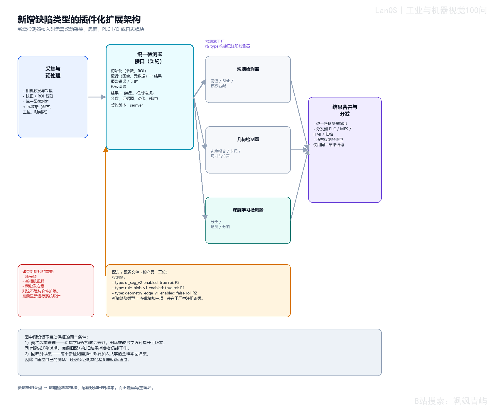

<p align="center">图 83-1　新增缺陷类型的插件化工业视觉架构</p>

读图时先看左侧传递的是否是同一种图像对象和元数据，再看中间接口有没有规定初始化、运行、错误和计时，最后看不同检测器的输出是否全部进入同一个结果合并模块。下方配方示例说明新增缺陷可以增加一个检测器类型和配置条目。左下红色区域表示架构边界：如果客户要求新的光源、新相机视角或新的触发方案，现有图像条件已经变化，不能把它包装成纯软件插件问题。

#### 插件化新增一种缺陷的工作量算例

插件架构节省的时间来自可复用的接线、有限的回归范围和较小的发布影响面，并不来自检测算法本身突然变简单。下面比较新增一个中等难度缺陷时，单体硬编码流程和插件化流程的示例工程师工时。数值是教学构造值，不是某个真实项目的测量结果；两种架构的新检测器开发都取 16 小时。

| 工作类别 | 单体流程（小时） | 插件化流程（小时） |
|---|---:|---:|
| 新检测器开发 | 16 | 16 |
| 接入主循环、界面和 PLC | 22 | 3 |
| 既有缺陷回归测试 | 30 | 10 |
| 分阶段部署与返工 | 18 | 5 |
| 合计 | 86 | 34 |

单体流程的工时为：

$$
16+22+30+18=86\ \text{小时}
$$

插件化流程的工时为：

$$
16+3+10+5=34\ \text{小时}
$$

示例节省率是：

$$
\frac{86-34}{86}\times100\%\approx60.5\%
$$

这里的单位是工程师小时，计算只反映这四类工作量。两种架构在检测器开发上都用 16 小时，说明插件并不会自动降低算法开发难度；差异主要出现在主循环、界面和 PLC 接线，既有缺陷的回归范围，以及分阶段部署和返工。86 小时、34 小时和 60.5% 不能作为所有项目的承诺值。接口没有定义清楚、回归样本不足，或者新增缺陷需要硬件变化时，实际节省可能消失。

图 83-2 左侧按工作类别显示四组工时，右侧单独比较总量。读图时应先观察“新检测器开发”两根柱是否接近，再看其余三类工作的差异，这样才能理解插件化究竟减少了什么。

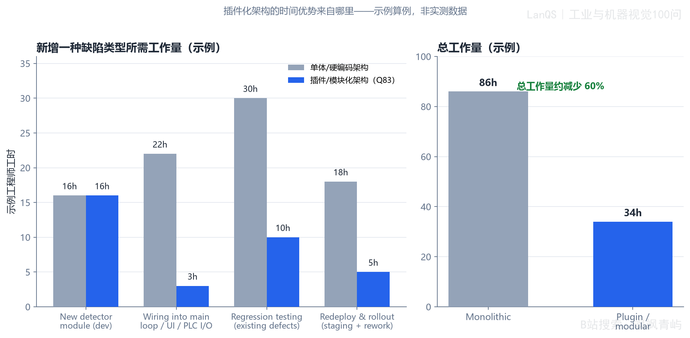

<p align="center">图 83-2　新增一种缺陷时单体与插件化架构的示例工作量</p>


“插件化”不一定意味着设备不停机时也能零停机替换代码。对多数工业项目，配置决定系统启动时加载哪些检测器、执行顺序、适用产品和 ROI，就已经提供了可替换的检测能力。主程序只依赖统一接口，不直接依赖某一种缺陷算法；具体检测器可以是动态库、脚本包或独立服务节点。新增检测器时，注册类型、提供参数并将它加入经过验证的配方，主流程不应增加一串针对该算法的特殊分支。

插件边界需要声明初始化参数、输入图像要求、失败状态、耗时统计和资源释放方式。一个只返回“合格”或“不合格”的插件不够用于生产，因为上层还需要知道它识别了哪一种缺陷、位置在哪里、是否发生超时，以及是否应该触发什么动作。初始化失败、推理失败和正常的“不合格”也必须区分，否则通信和报警模块无法判断该把结果当作缺陷，还是当作系统故障处理。

插件可替换的前提是其输入契约稳定。若某个检测器私自改变颜色空间、图像尺寸或 ROI 解释方式，主程序即使没有变化，换插件也可能得到无法比较的结果。输入要求应写在契约和配置中，检测器在初始化时检查，不满足时明确失败，而不是悄悄使用默认值。


接口契约是可扩展架构真正的工程产物。至少需要规定五件事：算法收到什么输入，返回什么结果，怎样初始化，怎样暴露参数，怎样报告错误和耗时。输入通常包括图像、相机信息、当前产品配方和 ROI；统一输出可包含缺陷类型、位置、尺寸、置信分数、建议动作和证据图。某种算法不需要填满所有字段，但字段结构、数据类型、单位和空值含义必须稳定。

一个最小接口可以写成：

```text
init(params, roi_spec)              初始化参数和 ROI
run(image, meta) -> Result          运行并返回统一结果
report_error() / timing()           报告错误和耗时
dispose()                           释放资源
```

接口还需要注册机制。检测器在注册表中以 `type` 标识，例如 `dl_seg_v2` 或 `rule_blob_v1`，配置只声明需要哪一种类型，主程序不硬编码具体类名。结果中的 `type`、位置、尺寸和分数也要约定单位及坐标系，例如坐标是原图坐标还是 ROI 局部坐标，尺寸使用像素还是物理单位。若这些含义不固定，结果合并和现场标定都会出现歧义。

接口有自己的版本，不能只给每个检测器编号。增加可选字段通常可以保持向后兼容；删除字段、改变字段含义或改变单位属于破坏性变化，应提升主版本，并附带迁移说明。接口版本变化时，旧配方、旧结果消费者和旧归档程序仍可能存在，兼容窗口需要在发布前明确。

配置层也属于接口契约。算法 A 使用 `threshold_low`，算法 B 使用 `conf_score`，算法 C 却用 `limit1` 表示近似概念，现场人员无法仅从名称判断区别。配置定义应统一参数类型、单位、默认值、有效范围和适用条件，让界面生成、启动校验和文档引用同一份定义。

### 流程接入、模型兼容与节拍

工厂模式集中处理“根据配置中的类型，创建哪一个检测器”。主流程只面对统一接口，具体对象由工厂构建并注入参数。新增阈值检测、模板匹配或 CNN（Convolutional Neural Network，卷积神经网络）检测器时，工程师注册一个类型并提供相应配置，主循环不需要加入一长串 `if/else` 条件。

可以用下面的伪代码表示调用关系：

```text
detector = DetectorFactory.create(config.type, config.params)
detector.init(config.params, config.roi)
result = detector.run(image, meta)
ResultMerger.add(result)
detector.dispose()
```

工厂降低的是对象创建和主流程的耦合，不会自动解决算法输入、结果字段、耗时预算和回归测试。如果新增算法仍然要同时修改主界面、主线程、通信消息和日志结构，说明接口边界还不稳定。新增检测器之后，主流程应该只看到一个统一 `Result`，而不是知道这个结果来自阈值法、几何法还是深度学习法。


配置驱动的含义是把“哪些检测要运行、运行顺序是什么、适用于哪一种产品、参数从哪里来”写入配方，而不是为每个产品复制一份主程序。例如一种产品只需要尺寸和表面污点检查，另一种产品还需要字符识别和缺件检查，系统可以使用同一个主流程，替换经过验证的检测器组合。

配置驱动并不等于所有行为都可以由文本自由重写。ROI、阈值和启用开关通常属于配方级参数；安全联锁、通信握手和异常恢复属于系统规则，不应由普通配方任意修改。把两类内容放在同一个可自由编辑的权限层中，普通配方变更就可能获得超出产品选择范围的影响。

配置加载时要检查检测器类型是否存在、必填参数是否齐全、参数范围和单位是否正确、ROI 是否适用于当前图像，以及执行顺序是否满足依赖关系。配置只声明“启用深度学习检测器”并不表示模型已经加载成功，启动和运行阶段还要报告初始化、推理和资源错误。检测器配置和系统规则分离后，新增缺陷可以局部变更，安全边界仍由固定代码和受保护接口维护。


深度学习检测器不应成为漂浮在系统外的黑盒。接入时要复用既有的图像预处理、ROI 约定、推理调用和结果结构，并明确模型输入尺寸、颜色空间、归一化方式、后处理、模型版本、耗时和资源需求。模型文件放入项目目录只是复制文件的动作，不能说明它满足了输入、输出和节拍契约。

模型输出还要回到统一的缺陷对象。分类模型的类别和分数、检测模型的框、分割模型的掩膜，都需要转换到系统约定的坐标系和字段中。若某个模型使用 ROI 局部坐标，而结果合并模块按原图坐标处理，缺陷位置会在合并、显示或剔除阶段发生偏移。模型接入时应通过样本检查输入尺寸、类别顺序和后处理阈值，确保界面、日志、PLC 和归档得到同一种结果解释。

资源也是接口的一部分。如果一台 IPC（Industrial Personal Computer，工业计算机）只能稳定运行一个重模型，配方就不能无条件叠加多个模型。系统要估算 GPU、内存和显存占用，决定串行或并行调度，并明确模型加载失败、推理超时和资源不足时的降级动作。降级动作是报警、暂停、使用备用检测器还是返回不可判定状态，应由系统规则决定，不能由插件自行静默处理。


新增检测器即使准确，也可能让总处理时间超过产线允许的节拍。常见方法是先用成本较低的规则或 ROI 预筛选候选区域，再把少量候选交给耗时模型；互不依赖的检测可以并行或异步执行；结果合并阶段保持固定的超时和缺省状态。缓存只有在图像、配方和版本一致时才适用，不能为了速度复用另一种产品或另一版本的结果。

性能验证需要查看平均延迟、最坏路径、抖动、复杂工件、边界样本和持续高负载。P99（99 分位延迟）表示 99% 的观测样本延迟不超过该值，它能显示尾部延迟，不能代表绝对最大延迟，也不能替代队列积压和超时测试。一个插件应有耗时预算，系统还要记录总体节拍、队列深度、GPU 和内存占用，观察连续高负载下是否逐步积压。

验证时要区分单个检测器延迟和全链路节拍。检测器单次运行很快，不代表多个检测串行后仍满足周期；平均值满足要求，也不代表最复杂工件和最长路径满足要求。发布前应把新旧版本放在同一组正常、缺陷和边界样本上比较，加入持续运行和异常超时场景，确认超时不会把旧结果误当成当前工件结果。

### 长期演进与项目落地

接口、配置和结果消息都需要版本。可以采用语义化版本：增加可选字段通常属于兼容扩展，使用次版本或补丁版本；修复不改变接口含义的问题使用补丁版本；删除字段、改变字段含义或改变单位属于破坏性变化，应提升主版本并提供迁移说明。版本号描述的是契约变化，不只是某个插件文件的编译次数。

现场工位、上游系统和下游消费者不会总是同时升级。旧配方可能仍由旧工位使用，旧结果消息可能仍被归档或 MES 读取，因此新插件发布前要明确兼容窗口、旧字段保留时间和消息转换方式。若新检测器改变了结果结构，结果合并层可以提供适配器，或在发布中同时提供新旧格式，不能让下游通过猜字段含义继续工作。

共享金样本回归集是兼容验证的依据。它应包含旧检测器的预期结果、典型边界样本和已有通信输出。每次新增插件都要跑旧检测器、结果合并、通信和归档的回归，确认“新能力通过”没有掩盖“旧能力被破坏”。接口隔离减少代码耦合，不能自动保证行为和数据兼容。


成熟平台已经稳定了相机采集、通信握手、结果上报、缺陷图像归档和日志。客户提出新缺陷时，工程师主要增加检测器逻辑、配方参数和验证样本，再把候选版本送到测试工位、试点工位和生产工位分阶段验证。部署工作从重新开发整套系统，变成局部能力接入和有限范围回归。

架构投入的回报来自反复扩展。早期建立统一接口、配置校验、结果合并和测试框架需要时间，但后续每种缺陷都可以复用这些边界。工程师应记录新检测器的输入约束、参数含义、耗时预算、版本和适用条件，避免每次扩展都重新解释同一套基础问题。

这种架构也有成本边界。单工位、需求长期不变、缺陷类型只有两三种且团队很小的项目，简单的模块边界和注册表可能已经足够；完整动态插件平台会增加接口测试、版本兼容和运维负担。是否采用更复杂的插件机制，应根据预期扩展次数、工位数量、下游接口数量和兼容周期判断。新增缺陷需要新的光源、相机角度或触发方式时，优先重新评估成像系统，而不是继续堆叠软件插件。

### 常见误区

- 为只有两三种缺陷且长期不变的项目构建过于复杂的动态插件平台。接口版本、动态加载和运维成本可能超过复用收益。
- 有插件机制，却没有共享回归集和金样本。模块隔离减少了接线范围，不等于已经证明旧检测器行为不变。
- 不同插件使用不一致的字段名、单位、坐标系和错误状态。结果合并与现场维护会重新产生耦合。
- 把 ROI、阈值等可调参数与安全联锁、通信握手和异常恢复放进同一份可自由修改的配方。
- 只在平均负载下测试新增检测器。复杂工件、持续高负载、队列积压和超时才可能暴露节拍问题。
- 把模型文件复制进项目目录就当作完成接入。输入尺寸、类别顺序、前后处理、资源占用和模型版本也必须核对。
- 修改结果结构却不更新契约版本和迁移说明。旧配方和下游消费者可能继续读取已经改变含义的字段。
- 把需要新光源、新视角或新触发的成像问题当成纯软件扩展。插件无法恢复原图像中不存在的信息。

### 术语与符号表

| 术语 | 含义 |
|---|---|
| 模块化架构 | 按职责划分采集、预处理、检测、结果合并、通信和归档边界的设计。 |
| 插件化架构 | 主程序依赖稳定接口，具体检测器可以独立加载、配置和替换的设计。 |
| 接口契约 | 对输入、输出、生命周期、错误、计时、数据类型、坐标系和单位的共同约定。 |
| 工厂模式 | 根据配置中的类型创建具体检测器对象，并把参数注入对象的机制。 |
| 配置驱动流程 | 由配方声明检测步骤、执行顺序、适用条件和参数，而不是为每种产品复制主程序。 |
| 语义化版本 | 用主版本表示破坏性变化，用次版本和补丁版本表示兼容扩展与修复的版本规则。 |
| 回归集/金样本 | 带有预期结果的固定样本，用于验证新增变化没有破坏既有检测行为。 |
| P99 | 延迟的 99 分位值，表示 99% 的观测样本延迟不超过该值，用于观察尾部性能。 |
| 节拍预算 | 每个工件或周期允许检测流程占用的时间上限，需在最坏路径下验证。 |
| ROI | Region of Interest，感兴趣区域，表示参与图像处理或检测的区域。 |
| IPC | Industrial Personal Computer，工业计算机，指部署在现场执行视觉软件的计算机。 |
| PLC | Programmable Logic Controller，可编程逻辑控制器，用于接收检测结果并协调产线动作。 |
| MES | Manufacturing Execution System，制造执行系统，用于记录生产工单、批次和过程信息。 |

### 延伸阅读

- Gamma、Helm、Johnson、Vlissides：《Design Patterns: Elements of Reusable Object-Oriented Software》，介绍工厂模式和策略模式等架构模式。
- Fowler：《Patterns of Enterprise Application Architecture》，讨论通过稳定接口隔离变化的架构方法。
- Preston-Werner：《Semantic Versioning 2.0.0》，介绍接口和配置演进中的版本规则。
- Newman：《Building Microservices》，讨论服务边界、兼容和长期演进；其中的接口思想也适用于进程内检测插件。

---

---

# 第84问　工业视觉项目交付时应该准备哪些文档？

> 模块：软件工程、系统架构与项目交付

视觉系统通过验收后，项目团队可能离开现场，操作员会换班，维护人员可能更换相机或工业计算机，产线也可能增加产品型号。交付文档要让后来的人能够理解系统、安装设备、完成日常操作、排查故障、恢复软件，并按原定条件复核验收结果。它不是项目总结的附属物，而是系统运行技术契约的一部分。本题按设计与图纸、操作与维护、测试与验收、管理与追溯四类资料说明交付内容，并用排障时间算例说明缺失文档会怎样增加恢复代价。

### 交付文档的范围与设计资料

交付文档要同时支撑理解、操作、维护和追溯。它记录设备状态、设计依据、版本变化、操作步骤、恢复路径和性能边界，使客户在原开发人员不在场时仍能运行系统；也让后来人员知道设备为什么这样选、某个参数受什么约束、验收是在什么条件下完成的。换班、人员更替、产线扩展和售后支持中的沟通，也可以据此建立在同一套记录上，而不必依赖个人记忆。

判断文档是否合格，要看目标读者能否完成真实任务。操作员能否按步骤启动设备、处理报警和切换已批准配方；维护人员能否清洁镜头、检查触发、备份文件和重新标定；电气人员能否按图纸更换部件；客户质量人员能否按测试条件复核结果。文件数量、页数和目录是否齐全，都不能单独证明文档可用。文档必须服务具体动作，步骤、前置条件、异常分支和完成判据都要能被读者找到。


一套实用的交付资料可以分为四类。设计与图纸资料解释系统怎样构成，操作与维护资料解释系统怎样使用和恢复，测试与验收资料解释它在什么条件下通过，管理与追溯资料保存需求、变更、版本和责任历史。按读者和工程任务分类，比简单区分纸质文件和电子文件更容易检查是否缺项。

| 类别 | 典型内容 | 主要读者 |
|---|---|---|
| 设计与图纸 | 设计说明、接线图、电气原理图、机械安装图、接口清单 | 实施、维修、集成和后续开发人员 |
| 操作与维护 | 操作手册、保养计划、故障处理、备份恢复、标定流程 | 操作员、工艺和维护人员 |
| 测试与验收 | 测试计划、样本组成、结果记录、边界、问题关闭、签署记录 | 客户质量人员和项目负责人 |
| 管理与追溯 | 需求确认、会议纪要、变更单、版本清单、培训签到、备份清单、联系人 | 项目管理、售后和争议处理人员 |

图 84-1 把四类资料、目标读者和项目生命周期联系起来。读图时不要只数每列有多少文件，而要追问某个任务由哪份资料支撑，以及这份资料如何在系统变化后保持最新。

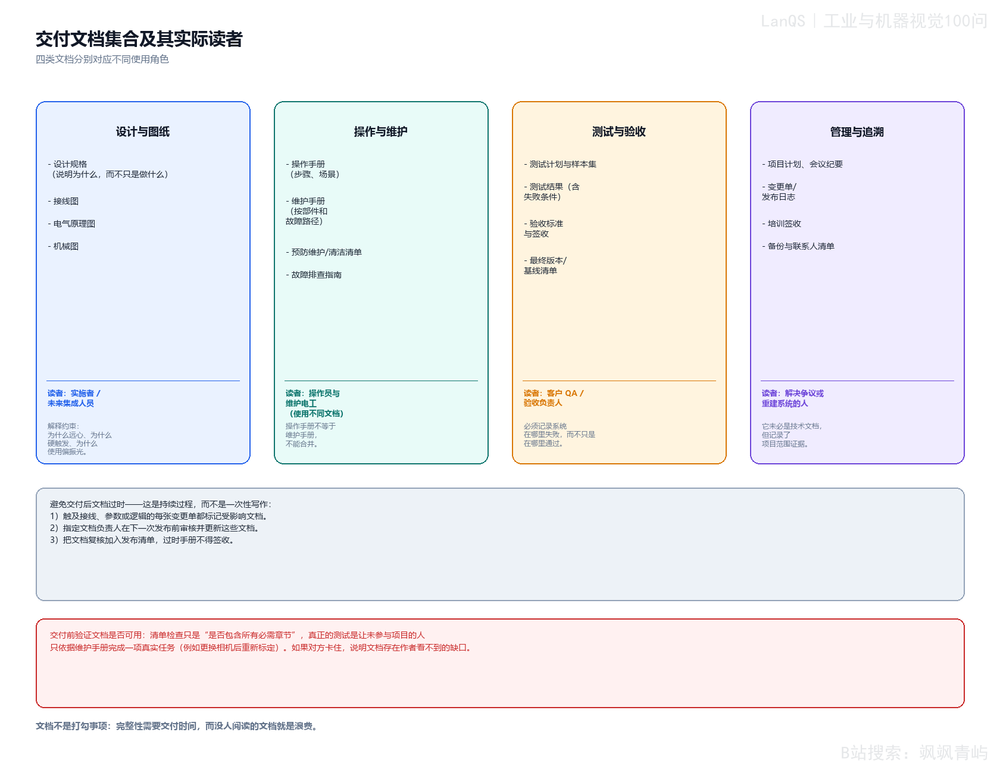

<p align="center">图 84-1　按类别、读者和生命周期组织交付文档</p>

设计与图纸资料支持实施和集成，操作手册支持生产人员，维护手册支持维修和工程人员，测试与签署记录支持客户验收，管理与追溯资料支持项目管理和售后诊断。图下方的更新和可用性检查提醒读者，资料不能在交付当天写完就永久冻结。接线、参数或软件版本发生变化时，相关图纸和手册也要更新；交付前还要让目标读者实际执行任务，确认步骤确实可用。


管理资料通常从需求确认开始，延伸到项目计划、会议纪要、变更记录、发布记录、培训签到、备份清单和联系人信息。它们不直接参与图像判定，却决定后来人员如何解释项目范围、版本状态和责任边界。

客户提出新增检测项时，需求确认记录和变更单可以说明它是否属于原始范围，以及由此增加了哪些交付内容。工业计算机损坏或磁盘需要重建时，备份清单应指出要恢复哪些程序、模型、配方、标定文件和许可证。发生性能争议时，发布记录、测试记录和签署文件可以把问题对应到实际交付版本、样本范围和当时的验收条件。

这些资料最好有版本和负责人。变更单要能链接到受影响的设计、软件或手册，培训记录要能说明哪些岗位接受了哪些内容，联系人信息要覆盖项目、维护和售后职责。管理文档不是检测算法的一部分，却是技术结果能够在交付后被解释和承担的证据。


设计说明书应同时写清系统用了什么、为什么这样用。内容通常包括检测对象、缺陷定义、节拍要求、视场、光学和成像方案、软件架构、通信接口、异常处理逻辑、性能指标和适用边界。关键计算也应保留，例如视场与分辨率、触发时序、数据带宽和照明方案的约束。后来人员只有看到这些假设，才能判断一次改动是否仍在设计范围内。

设计说明书的价值在于解释选择理由，而不是堆叠器件清单。例如，若设计采用远心镜头，应说明它与尺寸测量或透视误差的关系；若某个信号必须使用硬触发，应说明触发时刻与工件运动、曝光和结果对应关系；若某类表面使用偏振光，应说明它要抑制哪一种反光。没有这些理由，后来人员可能保留了名称相同的部件，却改变了原本的成像约束。

文档还应写明哪些结论只在特定条件下成立。检测指标是在什么光照、工件姿态、速度、温度和样本范围下得到的，哪些边界样本需要人工复核，哪些变化必须重新验收，都应在设计或测试资料中交代。这样，设计说明书才能成为后续维护和扩展的依据，而不是交付时只读一次的项目介绍。


接线图回答设备如何连接、端子号怎样对应、信号向哪个方向流动、线缆通往哪里。电气原理图表达供电、保护、输入输出映射和控制关系。机械图表达安装位置、尺寸、公差、工作距离和可调范围。三者关注对象不同，不能用一张界面截图或几段文字互相替代。

视觉系统把相机、镜头、光源、执行器、编码器和 PLC 连接成一条链路。维护人员更换光源时需要知道电源和端子，电气人员排查触发异常时需要知道信号方向，工程师复核视场时需要知道安装高度和工作距离。图纸提供了这些任务所需的精确对应关系，也帮助售后人员在没有原实施人员陪同的情况下定位故障。

图纸必须与最终设备状态一致。现场如果改过端子、线缆、光源或安装支架，应更新图纸版本，并在发布或变更记录中说明改动。继续使用旧图纸的风险不只是资料不完整，它可能主动把维修人员引向错误端子、错误供电或错误安装位置。图纸还应与设备编号、版本日期和必要的修订说明关联，避免同一项目流传多份无法区分的副本。

### 操作、维护、测试与培训

操作手册面向生产人员，围绕日常场景编写：启动、停机、配方切换、结果查看、常规报警确认和数据导出。它应让操作员在压力下知道前置条件、操作动作、正常结果和异常时的升级路径。操作员需要的是清楚的步骤和判断，不需要完整的接线图或标定推导。

维护手册面向工程和维修人员，围绕部件和故障路径组织：镜头清洁、光源检查、触发验证、文件备份、系统恢复、重新标定和故障定位。维护人员需要端子号、部件关系、故障树、恢复顺序和完成判据。后续开发人员还需要设计说明、接口契约和变更历史，这些内容又不应塞进操作员的日常步骤中。

把不同读者合并成一份手册，往往会产生两个问题：操作步骤被接线、版本和诊断细节淹没，维护信息却仍然不够深。更合适的组织方式是按读者拆分，互相引用共同的设备编号、配方名称和版本标识。手册还要说明危险操作的前置状态、备份要求和回退方式，避免读者在错误模式下执行标定或参数写入。


测试文档把“看起来能工作”转换为“在规定条件下完成了验证”。它通常包括测试计划、样本组成、测试步骤、版本信息、原始结果、异常说明、复测结论和问题关闭状态。测试计划先规定测什么、怎么测、使用什么版本，结果记录再说明实际发生了什么，二者不能只留下一个“通过”。

如果验收关注漏检率、误报率、节拍稳定性、重复性或误触发率，文档要写明样本总数、缺陷类别、工况范围、统计分母和判定阈值。样本的批次、工件姿态、光照、速度和温度范围也要记录。否则同一个百分比可能来自不同样本规模和不同现场条件，后来人员无法判断它是否支持当前工况。

已知失败条件、边界样本和需要人工复核的异常样本同样属于交付内容。它们定义了系统能力的边界，告诉客户自动结果在什么条件下可以信任，什么时候需要停机、复核或重新采集。只保存通过样本，会把最重要的限制从交付资料中删除。


培训资料回答客户怎样使用系统，应包含角色定义、常用操作、报警处理、典型错误和注意事项。安装与部署资料回答设备怎样被重建或迁移，应包含软件安装顺序、驱动和 SDK（Software Development Kit，软件开发工具包）版本、网络设置、目录结构、许可证位置，以及模型、配方和标定文件的恢复步骤。

视觉系统发生磁盘损坏、IPC（Industrial Personal Computer，工业计算机）更换或许可证失效时，恢复工作依赖部署资料。没有安装顺序和文件清单，维护人员只能重新猜测依赖和路径，停机时间也会随之增加。部署文档应和备份包一起演练，在一台测试设备或备用设备上验证恢复后能否采图、加载模型、读取配方、完成标定并通过基本样本。

文档还应明确哪些内容可以由客户现场人员完成，哪些步骤需要项目工程师或授权维护人员参与。培训签到说明谁接受了哪些内容，部署记录说明使用了哪一版软件和驱动。这样，恢复过程才能按记录执行，而不是把整个项目重新开发一次。

#### 文档完整性的影响算例

下面比较四种故障场景在资料完整和资料不完整时的示例排障时间。数字是教学假设，没有取自售后工单统计。四个场景分别对应前文的设计与接线资料、维护手册、测试与验收资料，以及安装和备份资料。

| 场景 | 有完整文档（小时） | 无完整文档（小时） | 时间倍率 |
|---|---:|---:|---:|
| 更换相机或光源 | 1.5 | 6.0 | $6.0\div1.5=4.0$ |
| 排查无效报警根因 | 2.0 | 9.0 | $9.0\div2.0=4.5$ |
| 处理缺陷定义争议 | 1.0 | 5.5 | $5.5\div1.0=5.5$ |
| 工业计算机故障后完整重建 | 4.0 | 22.0 | $22.0\div4.0=5.5$ |

时间倍率定义为：

$$
M=\frac{T_{\mathrm{without}}}{T_{\mathrm{with}}}
$$

$T_{\mathrm{without}}$ 是缺少完整文档时的排障时间，$T_{\mathrm{with}}$ 是资料完整时的排障时间，二者单位都是小时。以工业计算机故障后的完整重建为例：

$$
M=\frac{22.0\ \mathrm{h}}{4.0\ \mathrm{h}}=5.5
$$

这个结果表示在本算例条件下，缺少安装顺序、许可证位置、备份内容和恢复步骤，排障时间是资料完整时的 5.5 倍。它用于说明知识缺口的相对代价，不是所有项目的服务工时预测。相机或光源更换的倍率较小，也不能说明相关图纸和标定资料可以省略；每种场景仍需要正确的具体资料。

图 84-2 的横向柱比较每个场景的两种时间，倍率用于观察相对放大程度。读图时特别关注完整重建和缺陷定义争议，因为这些工作需要从文档恢复设计假设、版本边界或验收定义，无法仅靠现场人员记忆补齐。

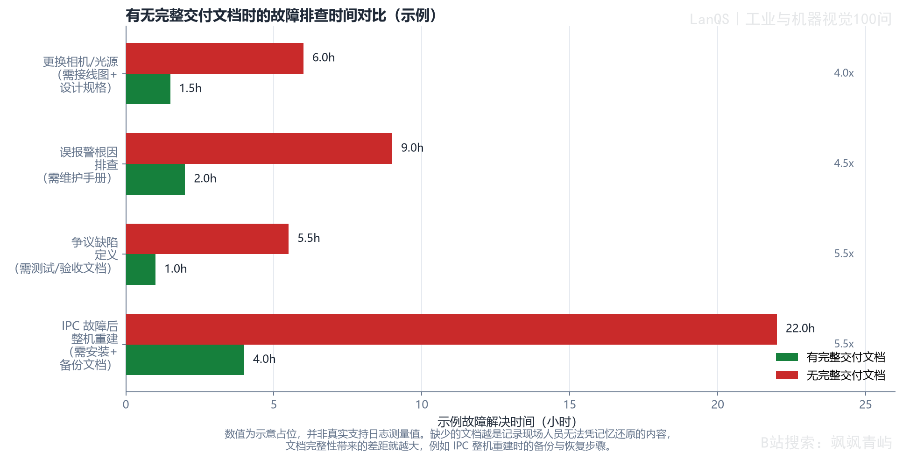

<p align="center">图 84-2　完整与不完整交付文档对不同排障场景的示例影响</p>

### 验收与项目差异化

验收资料通常包括验收标准、验收测试计划和记录、问题关闭清单、最终版本清单以及双方签署文件。若项目采用分阶段验收，还应保留中间验收记录和阶段问题状态，避免所有历史问题直到最终签署前才集中出现。

最终版本清单要同时固定软件、模型、配置、标定文件和参数基线。它还应记录测试时使用的样本范围、工况、指标口径和未覆盖边界。这样，后续性能漂移才有可能区分为原始交付问题、现场变更或运行环境变化。签署文件应明确测试范围、未覆盖条件、遗留问题、维护责任和回退依据，不能只留下一个“验收通过”。

验收文档与实际交付包要相互对应。文件中的版本号、设备编号、图纸修订号和备份清单应能在客户拿到的目录中找到；如果签署的是一套版本，交付后又替换了模型或配置，必须留下新的变更记录和复验结论。验收边界只有与实际设备状态绑定，才具有追溯价值。


软件型项目更重视版本、接口、配置、部署和操作说明；设备型项目更重视接线、机械布局、保养、备件和安全注意事项；整线工程还需要设备间协调、节拍同步、控制策略和现场验收流程。资料深度应与任务复杂度、恢复要求和参与方数量相匹配。

三类项目都必须回答四个问题：系统怎样构建，怎样运行，怎样维护，怎样追溯。小项目容易依赖一个人的记忆，人员一旦更换，风险反而很快暴露；项目规模小不等于可以省略版本、图纸、边界和恢复步骤。对于简单项目，可以减少形式和重复内容，但不能删除完成真实任务所需的事实。

文档交付后还需要有负责人。软件、图纸、操作手册、维护手册和验收基线的更新触发条件应写入变更流程。下一次参数、接线或模型变化时，变更单同时标出需要更新的资料，才能防止文档悄悄落后于设备。

### 常见误区

- 把操作手册写成维护手册，或只堆叠界面截图，导致操作员找不到报警处理路径，维护人员又找不到部件和恢复信息。
- 只记录通过样本，不记录已知失败边界、异常样本和人工复核条件。
- 只检查文件是否存在，不让目标读者实际完成启动、报警处理、备份恢复或图纸核对任务。
- 接线、参数、模型或软件变化后，图纸、手册和验收版本基线仍保持旧版。
- 用一份文件服务所有读者，结果对操作员太复杂，对维护人员又不够深入。
- 只把验收签署理解为项目结束，不保存测试条件、未覆盖边界和最终版本清单。
- 交付后没有文档负责人，资料逐渐过时并主动误导后来人员。

### 术语与符号表

| 术语或符号 | 含义 |
|---|---|
| 设计说明书 | 解释系统设计约束、选择理由、关键计算和适用边界的文件。 |
| 接线图 | 规定设备连接、端子编号、信号方向和线缆去向的图纸。 |
| 电气原理图 | 表达供电、保护、输入输出映射和控制关系的图纸。 |
| 机械图 | 表达安装位置、尺寸、公差、工作距离和可调范围的图纸。 |
| 操作手册 | 面向生产人员、按日常场景说明运行和报警处理的文件。 |
| 维护手册 | 面向工程或维修人员、按部件和故障路径说明保养、恢复和诊断的文件。 |
| 验收基线 | 由验收标准、测试记录、签署结果以及软件、模型、配置和标定版本共同确定的交付边界。 |
| 变更控制 | 对系统变化进行提出、评审、批准、发布、记录，并同步更新相关资料的过程。 |
| $M$ | 缺少完整文档时的排障时间与拥有完整文档时的排障时间之比。 |
| QA | Quality Assurance，质量保证或质量验收职能。 |
| I/O | Input/Output，输入/输出。 |
| SDK | Software Development Kit，软件开发工具包。 |
| IPC | Industrial Personal Computer，工业计算机。 |
| MES | Manufacturing Execution System，制造执行系统，用于记录工单、批次和生产过程信息。 |

### 延伸阅读

- IEEE Std 1063-2001（R2015）：软件用户文档的结构参考。
- ISO/IEC/IEEE 15289:2019：系统与软件生命周期信息项的内容分类。
- Forsgren、Humble、Kim：《Accelerate》，讨论变更控制、交付过程和文档维护。
- IEC 62061、ISO 12100：机器安全、风险评估和安全相关技术文档背景。

---

---

# 第85问　如何估算工业视觉项目的总体成本？（硬件、软件、开发与维护）

> 模块：软件工程、系统架构与项目交付

项目预算经常从相机、镜头和工控机的采购价开始，但一套可以验收并长期运行的视觉系统还要经历样本采集、算法开发、接口接入、现场联调、培训、备件和后续维护。估算时先明确检测目标、节拍、环境、接口、验收口径和计划寿命，再把费用拆成硬件、软件、开发和维护四个维度。每一项都应有输入、工作包、交付物和复盘依据。本题先建立四类成本的边界，再给出硬件、开发和生命周期公式，以及一个简单单工位项目与复杂多工位项目的完整算例。

### 成本结构与估算维度

硬件决定成像能力和物理安装范围，软件决定运行平台、接口和授权模式，开发费用承担把概念变成可运行并通过验收的工程工作，维护费用则在交付后随着产线运行继续发生。只把相机、镜头和工业计算机相加，得到的是一部分采购成本，不是系统的总体成本。一个采购价看起来可接受的项目，可能因为样本不足、现场调试和多年支持没有计入而难以持续运行。

四类费用的责任人、计价方式和发生时间不同。硬件通常由物料清单和采购报价支撑，软件可能按节点、并发数、订阅期限或升级服务计价，开发需要按角色和工作量估算，维护则与备件、响应时间、模型漂移和运行年限有关。把它们混在一行总价中，既无法解释预算依据，也无法知道超支发生在哪个环节。

分类还要处理交叉边界。光源控制器可能随相机套装采购，但物料清单仍应单独列出；现场安装可能由开发团队完成，却包含机械改造、电气接线和防护，不能全部归入软件调试。目标节拍和运行班次会改变计算和维护压力，粉尘、油雾、振动和温度变化会改变防护与备件需求，验收标准则会改变样本数量和返工风险。

图 85-1 是查漏项的框架。先看顶部四个成本桶，再看每个桶下面对应的物料或工作包，最后问这些项目由谁交付、怎样验收、交付后怎样维护。图中的比例是示意比例，不能直接当作后文两个项目的固定比例。

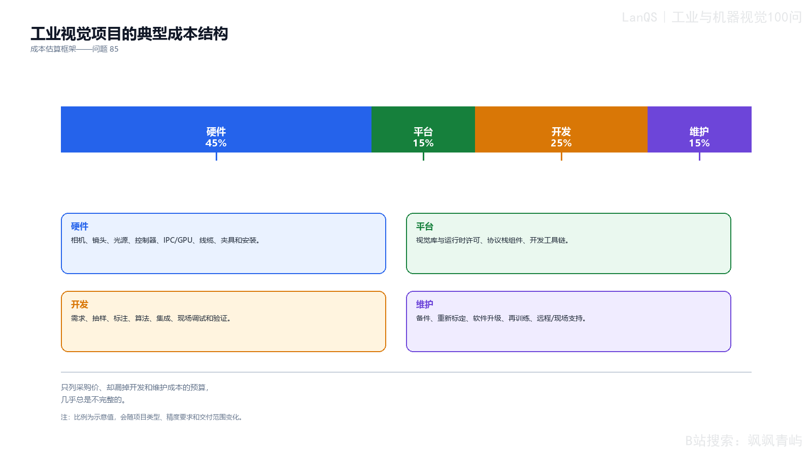

<p align="center">图 85-1　工业视觉项目的典型成本结构</p>

图中的四类比例用于提醒预算人员：硬件、平台、开发和维护都可能产生费用。精密测量项目可能增加成像和机械成本，复杂缺陷项目可能增加开发和数据成本，连续运行项目可能增加备件与支持成本。图适合检查分类是否完整，不提供具体报价，也不能替代按需求和历史数据建立的估算表。


硬件估算应从完整成像链开始，而不是只数相机数量。相机、镜头、滤光片、光源、光源控制器、触发器和同步部件共同决定能否取得合格图像。多视角或多工位系统要按完整成像单元核算。高分辨率相机会增加带宽和存储压力，短曝光可能提高光源亮度和控制器要求，远心镜头的成本则可能换来更小的透视误差和更少的测量返工。这里的因果关系要写进设计假设，不能只在物料表中列出器件名称。

计算链包括工业计算机、GPU（Graphics Processing Unit，图形处理器）、内存、系统盘、数据盘、采集卡和显示设备。分辨率、帧率、模型推理时间、并发相机数、缓存长度和数据保留周期共同决定计算规格。通信链则要列出交换机、现场总线或工业以太网接口、PLC 接口、编码器、I/O（Input/Output，输入/输出）模块、隔离器和连接器。若只按“工控机一台”估算，带宽、缓存和接口的费用容易在现场集成阶段才暴露。

安装链包括支架、防护罩、拖链、配电、接地、散热、线缆、端子、运输和现场安装。粉尘、油雾、振动、温度变化和清洗要求会增加防护和维护成本。连续生产线还要结合关键部件交期、替换时间和停机代价决定是否准备备用相机、光源、线缆或计算设备。备件不是简单按主设备数量复制，应该说明它要降低哪一种停机风险。

为了把主系统、备件和安装费用分开，可以写成：

$$
C_{\mathrm{hw,plan}}=C_{\mathrm{hw,run}}+C_{\mathrm{spare}}+C_{\mathrm{install}}
$$

$C_{\mathrm{hw,plan}}$ 是计划硬件成本，$C_{\mathrm{hw,run}}$ 是主系统运行硬件，$C_{\mathrm{spare}}$ 是备件，$C_{\mathrm{install}}$ 是安装、配电、线缆和防护费用，单位均为货币。这个分解适用于预算结构检查，不能自动给出故障概率或最佳备件数量。备件数量还要结合部件交期、现场替换能力和允许停机时间确定。

### 开发、维护与项目差异

软件费用可以分为平台层和项目层。平台层包括视觉开发平台、运行时授权、操作系统、数据库、通信驱动、设备 SDK（Software Development Kit，软件开发工具包）和部署工具；项目层包括检测流程、标定、配方、图像记录、追溯、报警、权限、报表，以及与 PLC、MES（Manufacturing Execution System，制造执行系统）或机器人交互的功能。平台提供运行基础，项目功能决定客户实际能做什么，两者不能用一个“软件费”笼统替代。

平台授权可能按节点、并发数、订阅期限和升级服务计价。多工位部署要核对每个运行节点和服务器是否需要授权，还要检查授权是否绑定硬件、是否支持离线运行、升级服务包含什么。开发许可证、调试工具、测试数据存储和模型制品仓库可能不安装在每台设备上，却是持续交付所需的组成部分。

开源库可能没有采购授权费，但版本维护、漏洞修复、兼容性测试、培训和供应链审查仍然需要成本。这些费用应计入 TCO（Total Cost of Ownership，总拥有成本）。把开源理解成零成本，会把费用从采购表转移到开发和维护，却不会让工作消失。软件估算还要区分一次性开发、每节点运行和每年续费，避免不同周期的费用直接相加后无法解释。


开发成本的主要差异来自工程工作量和不确定性，不是代码行数。需求澄清要确定缺陷定义、节拍、视场、触发、上下料、接口、环境和验收口径；可行性验证要采集正常、缺陷、边界和干扰样本；数据工作要规定标注、复核、数据版本及难例管理。算法工作还要覆盖预处理、定位、分类、测量、判定和拒检策略。

这些工作完成后，仍需开发界面、配方、日志、权限、异常恢复和通信，完成现场联调、部署、测试和培训。算法工程师、HMI 工程师、电气工程师和测试工程师的费率可能不同，因此应按工作包和角色估算，而不能给整个项目套一个统一人月单价。标注可以按图像数或类别复杂度估算，接口接入可以按接口数量和现场联调次数估算，调试可以按工位估算。

风险储备要和证据对应。成熟算法、熟悉相机、客户接口稳定的项目，常见风险项可以预留约 10% 到 15%；样本不足、材料变化大、缺陷定义不稳定或首次使用新技术时，应对受影响的新颖工作单独预留 30% 以上。这个比例是估算规则的示例，不能不加分析地涂到所有工作包。若历史项目中反光表面导致现场调试比原估算多 40%，类似项目应增加调试储备，而不是无差别提高硬件、软件和维护预算。

开发成本可以写为：

$$
C_{\mathrm{dev}}=\sum_{i=1}^{m}h_i r_i+p_{\mathrm{risk}}
$$

$h_i$ 是第 $i$ 个工作包的预计工时，单位为人时；$r_i$ 是该工作包的小时费率，单位为货币/人时；$m$ 是工作包数量；$p_{\mathrm{risk}}$ 是根据风险证据设置的储备，单位为货币。若使用人月，必须预先规定一个人月对应的有效工作小时，并把不同角色的费率分开。这个公式能约束估算结构，不能自动发现漏项、重复计价或错误的工时假设。

#### 一个可复核的成本算例

下面比较两个示例项目：一个简单单工位项目，一个复杂多工位项目。所有金额以千货币单位计，是用于说明结构的构造值，不是实际采购报价。简单项目使用规则算法，复杂项目包含 6 个工位、多缺陷类别和深度学习数据集。算例要检查两件事：先按四类成本求出上线前总额，再按年度维护计算生命周期成本。

| 成本类别 | 简单项目 | 简单项目占比 | 复杂项目 | 复杂项目占比 |
|---|---:|---:|---:|---:|
| 硬件 $C_{\mathrm{hw}}$ | 75 | 51.4% | 315 | 35.7% |
| 软件 $C_{\mathrm{sw}}$ | 10 | 6.8% | 73 | 8.3% |
| 开发 $C_{\mathrm{dev}}$ | 51 | 34.9% | 415 | 47.0% |
| 第 1 年维护准备 $C_{\mathrm{maint,0}}$ | 10 | 6.8% | 80 | 9.1% |
| 总额 $C_{\mathrm{total}}$ | 146 | 100% | 883 | 100% |

两类项目的细项如下：

| 成本链 | 简单项目明细 | 金额 | 复杂项目明细 | 金额 |
|---|---|---:|---|---:|
| 硬件 | 成像链（相机、镜头、光源、触发） | 45 | 成像链（6 工位、中档相机） | 165 |
| 硬件 | 计算链（无需 GPU 的工控机） | 18 | 计算链（共享工控机、GPU 和交换机） | 95 |
| 硬件 | 安装链（夹具、线缆、防护） | 12 | 安装链（6 套夹具、线缆和机柜） | 55 |
| 软件 | 视觉库/运行时授权 | 8 | 视觉库/运行时授权（6 节点和服务器） | 40 |
| 软件 | 工具链 | 2 | 数据库、协议栈和运维平台组件 | 25 |
| 软件 | 无 | 0 | 工具链 | 8 |
| 开发 | 需求与样本采集 | 10 | 需求与多缺陷样本采集 | 40 |
| 开发 | 规则算法开发 | 20 | 深度学习缺陷集标注（12 类以上） | 60 |
| 开发 | 集成与在线调试 | 15 | 规则与深度学习多缺陷算法开发 | 165 |
| 开发 | 验证与验收支持 | 6 | 跨工位集成与调试 | 110 |
| 开发 | 无 | 0 | 验证与验收支持 | 40 |
| 维护（第 1 年） | 备件（光源、镜头、线缆） | 4 | 备件（6 工位） | 20 |
| 维护（第 1 年） | 远程/现场支持 | 6 | 远程诊断平台与现场支持 | 38 |
| 维护（第 1 年） | 无 | 0 | 样本漂移后的模型重训 | 22 |

硬件小计分别为 $45+18+12=75$ 和 $165+95+55=315$；软件小计分别为 $8+2=10$ 和 $40+25+8=73$；开发小计分别为 $10+20+15+6=51$ 和 $40+60+165+110+40=415$；第 1 年维护准备分别为 $4+6=10$ 和 $20+38+22=80$。上线前总额按式（85-1）的四类成本口径计算：

$$
C_{\mathrm{total}}=C_{\mathrm{hw}}+C_{\mathrm{sw}}+C_{\mathrm{dev}}+C_{\mathrm{maint,0}}
\tag{85-1}
$$

简单项目代入为：

$$
C_{\mathrm{total}}=75+10+51+10=146\ \text{千货币单位}
$$

硬件占比为 $75/146\approx51.4\%$，开发占比为 $51/146\approx34.9\%$。复杂项目代入为 $315+73+415+80=883$，硬件占比约为 $315/883\approx35.7\%$，开发占比约为 $415/883\approx47.0\%$。这组数字说明从单工位规则检测转向多工位、多缺陷和深度学习后，开发工作可能成为主要成本；它不能证明所有类似项目都具有这些比例。

完整算例按字典保存每个成本类别及明细，先求类别小计，再计算总额和百分比，并检查简单项目的硬件占比高于复杂项目、复杂项目的开发占比高于简单项目。等价的核心逻辑如下：

```python
def subtotal(scenario):
    return {category: sum(items.values())
            for category, items in scenario.items()}

def summarize(profile):
    sub = subtotal(profile)
    total = sum(sub.values())
    share = {category: 100 * value / total
             for category, value in sub.items()}
    return {"subtotal": sub, "total": total, "share": share}

simple_results = summarize(simple_station)
complex_results = summarize(complex_multistation)
simple_sub = simple_results["subtotal"]
complex_sub = complex_results["subtotal"]
print(simple_results)
print(complex_results)

assert simple_results["share"]["Hardware"] > complex_results["share"]["Hardware"]
assert complex_results["share"]["Development"] > simple_results["share"]["Development"]
```

生命周期部分先取四类中的前三类作为上线前投入，再按年度维护序列累加。算例使用的维护序列是简单项目 `[10, 11, 12]`，复杂项目 `[80, 78, 92]`，相应的计算可以写成：

```python
simple_init = simple_sub["Hardware"] + simple_sub["Software"] + simple_sub["Development"]
complex_init = complex_sub["Hardware"] + complex_sub["Software"] + complex_sub["Development"]

simple_maint_by_year = [10, 11, 12]
complex_maint_by_year = [80, 78, 92]
simple_life = simple_init + sum(simple_maint_by_year)
complex_life = complex_init + sum(complex_maint_by_year)

print(simple_init, simple_life)    # 136, 169
print(complex_init, complex_life)  # 803, 1053
```

生命周期计算要避免把第 1 年维护准备重复相加。令不含年度维护的上线前投入为 $C_{\mathrm{init}}=C_{\mathrm{hw}}+C_{\mathrm{sw}}+C_{\mathrm{dev}}$，第 $y$ 年维护成本为 $C_{\mathrm{maint}}(y)$，不考虑折现时：

$$
C_{\mathrm{life}}=C_{\mathrm{init}}+\sum_{y=1}^{N}C_{\mathrm{maint}}(y)
\tag{85-2}
$$

$C_{\mathrm{life}}$ 是计划运行周期内的生命周期成本，$C_{\mathrm{init}}$ 是上线前硬件、软件和开发投入，$C_{\mathrm{maint}}(y)$ 是第 $y$ 年维护成本，$N$ 是运行年数，单位均为千货币单位。简单项目的 $C_{\mathrm{init}}=75+10+51=136$，三年维护为 10、11、12：

$$
C_{\mathrm{life}}=136+10+11+12=169\ \text{千货币单位}
$$

复杂项目的 $C_{\mathrm{init}}=315+73+415=803$，三年维护为 80、78、92：

$$
C_{\mathrm{life}}=803+80+78+92=1053\ \text{千货币单位}
$$

这里的维护序列同样是示例数。式（85-1）用于上线前总额的报价口径，式（85-2）用于按年度维护观察生命周期负担；前者包含第 1 年维护准备，后者把各年度维护单独列出，台账中不能把同一笔费用同时放进两种口径。生命周期公式也没有计入停机损失、产能机会成本和资金时间价值，投资决策需要另外说明这些假设。

图 85-2 左侧比较两个项目的初始成本结构，右侧显示从上线前投入到第 3 年的累计成本。读图时先核对 146 和 883 的四类小计，再检查 136、803 与 169、1053 的年度累加关系。图中百分比和金额是算例输入，不是固定报价。

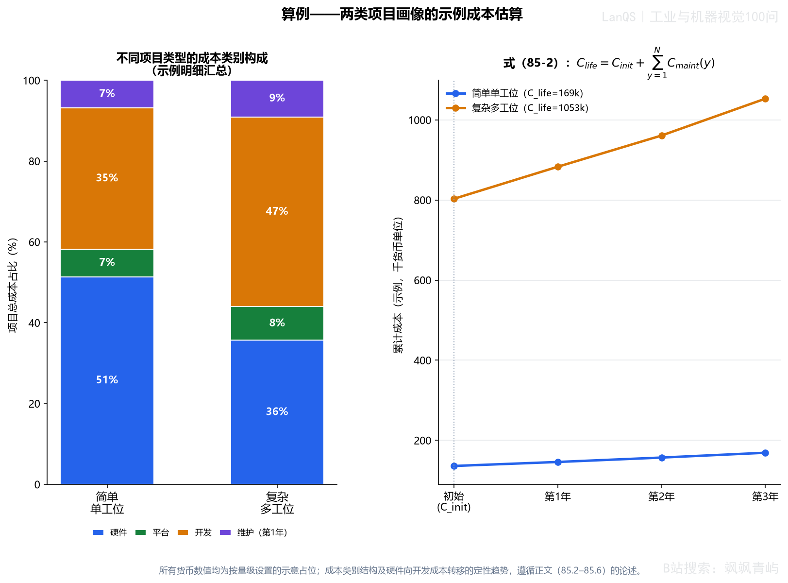

<p align="center">图 85-2　简单项目与复杂项目的初始投入和维护成本比较</p>

图中金额单位是千货币单位，左侧百分比由四类成本除以项目总额得到，右侧累计曲线使用式（85-2）逐年加上维护费用。简单项目的硬件占比更高，复杂项目的开发占比更高；这个方向与项目结构有关，不能据此预测实际故障率、服务合同金额或停机损失。


维护费用不只在设备坏掉后才发生。光源老化、镜头和保护窗清洁、触发与标定复核、软件升级、报表字段变更、样本分布变化后的模型重训、远程诊断和现场差旅，都会在运行周期内产生工作。每项单独看可能不大，累积到两三年后却可能超过一次性的部分采购价。

维护成本还受到项目设计质量影响。文档完整、参数结构清楚、日志和远程诊断能力较好的系统，问题更容易定位；每次异常都必须派工程师到现场的系统，会持续增加差旅和响应成本。维护估算应把例行维护、维修与备件、模型或规则维护、服务与培训拆开：

$$
C_{\mathrm{maint}}(y)=C_{\mathrm{routine}}(y)+C_{\mathrm{repair}}(y)+C_{\mathrm{model}}(y)+C_{\mathrm{support}}(y)
$$

式中各项分别表示第 $y$ 年的例行维护、维修与备件、模型或规则维护、服务与培训，单位为货币。这个分解便于将偏差归因到具体工作包，但四项并非完全独立。例如更换光学部件可能同时触发重新标定和模型复核，报价时需要规定哪些工作包含在部件服务中。

低估维护和支持费用可以使初始报价看起来更低，但服务响应、升级、备件和模型维护工作并不会因此消失，后续可能转化为合同争议或供应商的无准备支持。反过来，把大额且没有依据的储备均匀加到所有条目，也会掩盖真正的不确定性。储备应对应样本质量、现场光照、边界缺陷、接口协议和历史偏差等具体来源。

硬件采购通常最容易得到可靠报价，开发和现场调试却更容易超支，因为样本质量、边界缺陷、光照、机械条件和接口协议可能到调试阶段才暴露。维护响应时间、备件范围、模型更新责任和升级次数，应在交付前写入合同或服务说明，不能只在预算表中留一个无定义的维护百分比。

### 模型化估算与成本控制

高精度测量项目的硬件占比往往较高，因为远心镜头、稳定光源、精密机械和标定要求会推高成像链投入。复杂缺陷识别项目更容易把预算推向样本、标注、算法和验证。多工位联网项目则会增加通信、部署和运维平台的工作量。这里的“占比”是相对于当前项目总额的结构判断，不是可跨项目复制的费率。

更可靠的做法是先找项目瓶颈。成像难点突出时，硬件和在线调试可能是成本中心；缺陷定义复杂且变化大时，数据和开发决定工期；需要跨工厂复制并长期运行时，标准化设计、部署平台、诊断、备件和维护服务的权重会增加。采购价最低的方案未必降低总体成本，因为它可能把风险推给现场调试和后续维护。


有依据的估算不要求第一版就精确到最后一位，而要求结构完整、假设透明，并能随着信息增加更新。需求指标至少应记录精度、节拍、环境复杂度、产品种类、验收标准和交付范围；在此基础上建立部件选择矩阵、工作量矩阵和风险储备矩阵。每个条目要写明单位、数量或工时、费率、来源和交付责任。

风险储备应单列，不能悄悄平均到所有条目。样本质量、现场条件和边界缺陷定义通常是视觉项目的不确定性来源；如果完全不留储备，在线调试开始后预算很容易失真。储备也不能脱离证据随意设定，应该引用相似历史项目的偏差、当前项目的新技术和未验证接口。

项目执行期间，要沿用同一套类别结构记录实际发生值。工时按阶段和角色登记，采购单按硬件子链归类，支持工单按原因标记。项目结束时逐项比较估算、批准预算、变更金额和实际值。总额没有超支，也可能隐藏开发阶段超支 50% 而硬件降价抵消；只有按类别和工作包复盘，下一次估算才能知道真正的偏差来源。

偏差原因要具体记录，例如交期导致替代采购、现场光照或机械结构变化、样本重采集、接口协议变化、验收反复、模型重训或服务响应超出合同。需求变化应单独建立变更单，说明增加的金额、工期和验收影响，不能用新预算覆盖原始基线。这样才能区分“原估算不准”和“客户后来增加了范围”。


成本控制的依据是把投入与风险对应起来，而不是简单压低每一项价格。可行性样本通过后再冻结主要硬件规格，可以减少反复采购；为相机、镜头、光源、计算设备和接口建立替代清单，可以提前说明替代后哪些指标必须重新验证。平台通用能力应沉淀日志、配方、权限、诊断和部署机制，项目定制能力则按检测需求独立估算。

数据采集、标注、复核、难例闭环和验收测试要作为独立工作包列入计划。项目可以设置阶段门：可行性通过后扩大采购，接口联调通过后批量部署，验收数据满足统计口径后关闭项目。停机代价高的部件配置合理备件和快速更换结构，低关键度部件不必为了整齐而过度冗余。

日志、版本、配置和图像留存会增加初始开发工作，却能降低故障定位和模型维护成本。控制成本时要把采购、开发、部署和维护放在同一条生命周期链上，检查短期节省是否把风险转移到更昂贵的现场服务、返工或停机。成熟的成本控制最终表现为边界清楚、风险可见、数据可复盘的系统。

### 常见误区

- 只把相机、镜头和工控机相加，遗漏软件、安装、接口、数据、验收和维护。
- 把算法开发当成固定单价，忽略样本质量、缺陷复杂度、节拍和现场差异。
- 把风险储备均匀加到每个条目，不说明新颖元素和历史偏差依据。
- 把第 1 年维护准备同时放入项目总额和生命周期上线前投入，造成重复计算。
- 忽略触发、握手、剔除、追溯、异常恢复和验收测试等集成工作。
- 只看初始投入，不比较备件、升级、模型维护、服务响应和停机代价。
- 用变更后的预算覆盖基线，无法区分估算偏差与需求变化。
- 把开源软件当成没有开发和维护成本，或者把硬件替代当成无需重新验证。

### 术语与符号表

| 术语或符号 | 含义 |
|---|---|
| TCO | Total Cost of Ownership，总拥有成本，覆盖采购、部署、运行和维护。 |
| $C_{\mathrm{hw,plan}}$ | 计划硬件成本，包含运行硬件、备件和安装费用。 |
| $C_{\mathrm{hw}}$ | 成像、计算、通信、安装和防护等硬件成本。 |
| $C_{\mathrm{sw}}$ | 平台授权、运行环境、驱动、数据库和项目软件功能成本。 |
| $C_{\mathrm{dev}}$ | 需求、数据、算法、集成、调试、部署和验收的开发成本。 |
| $C_{\mathrm{maint,0}}$ | 项目总额中预先计入的第 1 年维护准备。 |
| $C_{\mathrm{total}}$ | 按式（85-1）计算、包含第 1 年维护准备的项目总额。 |
| $C_{\mathrm{init}}$ | 生命周期计算中不含年度维护项的上线前硬件、软件和开发投入。 |
| $C_{\mathrm{maint}}(y)$ | 第 $y$ 年维护成本。 |
| $C_{\mathrm{life}}$ | 计划运行周期内初始投入与各年度维护费用之和。 |
| $p_{\mathrm{risk}}$ | 根据已识别不确定性设置的风险储备。 |
| 人时/人月 | 工作量单位；使用人月时必须规定有效工作小时和角色费率。 |
| 冗余 | 为降低单点故障或缩短恢复时间配置的备用部件或通道。 |
| GPU | Graphics Processing Unit，图形处理器。 |
| PLC | Programmable Logic Controller，可编程逻辑控制器。 |
| MES | Manufacturing Execution System，制造执行系统。 |
| SDK | Software Development Kit，软件开发工具包。 |
| IPC | Industrial Personal Computer，工业计算机。 |

### 延伸阅读

- Boehm, B. W.，《Software Engineering Economics》，Prentice-Hall，1981。讨论软件工程成本估算和开发工作量的不确定性。
- McConnell, S.，《Software Estimation: Demystifying the Black Art》，Microsoft Press，2006。介绍历史项目比较、工作量估算和风险储备。
- Project Management Institute，《A Guide to the Project Management Body of Knowledge（PMBOK Guide）》。涉及成本管理、风险管理和项目复盘。
- ISO 21500 或 ISO 21502，《Project, programme and portfolio management》。提供项目成本计划与控制的通用背景。

---

---

# 第86问　算法处理一帧需要 100 ms，但产线要求每 80 ms 得到一个结果，怎么办？

产线给出的“每 80 ms 一个结果”看起来像一个简单的速度比较题，实际涉及两种不同的时间约束。一种约束要求同一件工件的图像在 80 ms 内完成采集、分析并驱动后续动作，另一种约束只要求系统持续提供结果，结果可以在流水线中错开到达。两种约束对应不同的优化手段。本问从阶段计时开始，依次讨论算法、硬件、流水线、异步处理和需求定义，最后给出一套可验收的系统方案。

关键判断是：100 ms 通常描述单帧从输入到输出的端到端延迟，80 ms 描述业务节拍或结果到达间隔。只有在下游动作必须等待同一帧的结果时，二者才是直接的同一指标。若产线只关心稳态吞吐，流水线可以改善结果到达间隔，却不会缩短某一帧实际经历的时间。

### 延迟拆解与优化边界

一帧图像从触发到结果输出，通常要经过曝光与采集、数据传输、预处理、特征计算或模型推理、后处理、通信输出，有时还包括原图保存。工程人员若只看到模型接口返回了一个 100 ms，就不知道这 100 ms 中有多少真正用于计算。图像上传、内存拷贝、磁盘写入或 PLC（Programmable Logic Controller，可编程逻辑控制器）握手等待，都可能占据大部分时间。

因此，先给每个阶段加上开始和结束的时间戳，再决定是否需要更换网络。对第 $i$ 个阶段，记其耗时为 $t_i$，所有时间统一用毫秒（ms）表示。在严格串行的执行方式中，单帧端到端延迟为

$$
T_{\mathrm{serial}}=\sum_{i=1}^{n}t_i
\tag{86-1}
$$

这里的 $T_{\mathrm{serial}}$ 是从该帧进入采集链到最终结果完成的时间，适合回答“这一帧什么时候能用”。它不等于连续帧的稳态吞吐周期。若采集、传输和推理存在并行，单帧延迟仍应沿这帧的实际路径计算，不能把所有线程的总时间简单相加。

测量工具也会影响结论。软件计时应使用单调时钟，例如 Python 的 time.perf_counter()，避免系统校时导致墙上时钟向前或向后跳变。每帧都应记录阶段入口、出口、帧号和工件号，至少计算平均值、P95、P99 和最大观测值。P95 表示 95% 的观测不超过该延迟，P99 表示 99% 的观测不超过该延迟；它们反映长尾，而平均值只反映总体中心位置。

GPU 计时还要处理异步提交。CPU 调用推理接口时，可能只是把任务放入 GPU 队列，函数已经返回，内核仍在执行。若直接用 CPU 计时器包住调用，就会低估计算时间。应使用 CUDA 事件在设备侧计时，或在读取结束时间前显式同步；PyTorch 的 torch.profiler、Nsight Systems 和 Intel VTune 等工具也能帮助定位阶段重叠、等待和资源争用。

采样不能只取几次手工测量。应在数千帧真实负载上记录数据，并覆盖热机、换班、不同产品批次、网络和磁盘处于正常压力的状态。性能日志还应和检测质量日志用同一帧号或工件号关联。系统没有报错、相机仍在出图，只能说明链路在线；队列积压、丢帧、曝光状态漂移或质量降级仍可能让检测结果不再符合验收条件。

阶段埋点还要区分“等待”与“工作”。例如，推理线程等待输入队列、等待 GPU 空闲、等待锁或等待 PLC 应答时，处理器可能并没有执行有效算法。把等待时间和计算时间合并成一个 stage time，会使优化方向失真。每条记录至少应包含 frame_id、stage_name、start、end、device 和 status，并能用同一帧号重建它经过的路径。若某阶段存在重试、超时或降级，还应记录原始耗时和最终动作，避免把异常样本从统计中悄悄排除。

从这些记录可以画出一帧的时间线，并检查关键路径。关键路径是决定该帧结果最早何时可用的依赖链；图片存盘可能与结果通信并行，因而不一定属于关键路径，但若它占满磁盘带宽，又会反过来阻塞采集线程。类似地，模型平均推理时间下降，如果 CPU 到 GPU 的复制队列变长，端到端结果仍不会提前。只有先画清依赖关系，式（86-1）的各项才有明确工程含义。


当瓶颈确实位于算法计算时，可以从三个方向减少耗时。第一，减少无效像素，例如根据工件位置裁剪 ROI。ROI（Region of Interest，感兴趣区域）是限定处理范围的图像子区域，缩小它既减少像素运算，也减少背景导致的误检。第二，用结构更简单的算法替代复杂模型。在规则稳定的场景中，阈值、形态学和几何约束可能足以筛掉明显正常样本。第三，在检测质量可接受的范围内更换轻量骨干、减少特征层、量化或降低输入尺寸。

每种改动都可能改变可检出的最小缺陷。假设一条缺陷在原图中宽约 $4$ px，把图像缩小到原来的四分之一后，缺陷在几何上只剩约 $1$ px。实际重采样还会受到插值、对比度和噪声影响，边缘可能不再形成稳定的像素差。这个例子只说明采样风险，不能仅凭宽度换算证明缺陷一定检出或一定漏检。验证前应记录最小缺陷尺寸、最低对比度、缺陷位置和允许漏检率，再在独立困难样本集上比较召回率、误报率、定位误差和延迟分布。

剪枝和量化也需要同样的验证。量化用较低数值精度表示权重或中间特征，通常可以减小模型和显存压力，但低对比缺陷、细边缘和小目标对数值误差更敏感。输入分辨率、模型精度、批处理数量、后处理阈值都应作为测试条件记录。只报告 FPS（frames per second，每秒帧数）会掩盖单件等待时间、P99 长尾和质量损失。

优化实验最好保持相同的样本顺序、触发频率、产品组合和温度条件，一次只改变一个主要因素。先测试 ROI 裁剪，再测试模型量化或轻量骨干，最后测试线程并行，可以较清楚地知道收益来自哪里。每次变更都保存模型或规则版本、平均延迟、P95/P99、召回率和误报率，量产回归时才有明确的回退对象。

ROI 裁剪也有一个容易被忽略的代价：定位本身要耗时，定位误差还可能把缺陷裁到边界之外。若工件位置由编码器或治具保证，可以使用固定 ROI；若位置有漂移，就要把定位误差、边界扩张量和裁剪后的背景比例一起测量。扩张太小会漏掉边缘缺陷，扩张太大又会把不需要处理的像素带回模型。ROI 的收益应按“定位加裁剪后的总耗时”计算；模型输入像素减少量本身不足以说明总收益。

灰度化和早期筛选也会改变信息通道。颜色是缺陷判据时，转灰度会抹掉通道差异；快速规则把样本判为明显正常时，规则错误会阻断后续模型。适合降级的阶段必须先用困难样本做漏检测试，并保留一条能够复查原图的路径。对每项加速措施，验收记录应同时回答三个问题：它减少了哪个阶段的耗时，改善了平均值还是尾延迟，是否改变了缺陷和正常样本的混淆边界。

如果使用批处理，吞吐和单件延迟之间还会出现新的取舍。批量越大，设备越容易保持并行，但第一件图像可能要等待同批图像凑齐；批处理还会改变内存峰值和异常传播方式。单件剔除和安全控制一般需要小批量甚至单帧路径，离线批量基准不能直接代替在线验收。


GPU（Graphics Processing Unit，图形处理器）适合卷积、矩阵运算和大量像素的并行处理。FPGA（Field-Programmable Gate Array，现场可编程门阵列）适合固定数据流、低延迟和严格确定性的管线。SIMD（Single Instruction, Multiple Data，单指令多数据）指令和多核 CPU 适合数据量中等、控制逻辑较多或希望降低软件维护复杂度的项目。选择硬件时，算法结构只是一个因素，还要考虑设备成本、功耗、散热、驱动稳定性、开发周期和团队维护能力。

芯片规格表中的峰值算力不能直接换算成视觉系统的端到端延迟。CPU 到 GPU 的数据传输、显存不足造成的换入换出、线程同步、驱动调用和后处理都可能成为新瓶颈。批量推理可以提高平均吞吐，却可能让某件工件等到同批其他图像完成后才得到结果。GPU 上的平均计算时间很短，也不表示采集、通信和保存路径满足 80 ms。

硬件比较应固定输入尺寸、精度模式、批处理方式、驱动、运行时和软件版本。验收至少包括冷机和热机状态、持续运行、温度变化、显存占用、CPU/GPU 利用率、功耗、异常恢复以及驱动升级后的回归测试。最终要比较的是整条链路的平均值、P95/P99、丢帧率和检测质量，而非单个芯片的理论 TOPS。

GPU 方案还要明确数据是否需要在 CPU 和 GPU 之间往返。采集卡把图像写入主机内存后再复制到显存，会形成额外传输；如果预处理、推理和后处理都能在同一设备上连续完成，复制次数可能减少。相反，把一部分算子留在 CPU、另一部分放到 GPU，可能因为同步和内存拷贝抵消计算收益。基准测试应记录每次拷贝、同步和等待，并把计时范围覆盖完整链路。

FPGA 的确定性来自固定数据流和预先编译的逻辑，但改动算法和验证时序通常需要更长开发周期。它适合输入格式、算子和延迟边界相对稳定的设备；若项目频繁更换模型或产品，重新综合、部署和维护的成本要纳入比较。SIMD 和多核 CPU 则可能更容易与已有采集、通信和日志组件整合，减少异构设备之间的交接。硬件选型应把“能否保持稳定的 P99”与“团队能否长期维护”放在同一张评估表中。

持续运行测试要观察热机后是否出现降频，以及其他任务是否抢占资源。单次峰值速度只回答设备在某一瞬间的能力，无法回答连续生产数小时后的服务能力。设备重启、GPU 复位、相机断连和内存不足也应设置故障注入或等效测试，确认系统能报警、丢弃受影响任务并回到可识别状态，避免错误结果被当成正常输出。

### 流水线、异步与吞吐

流水线并行的做法，是让不同帧同时处于不同阶段。假设采集、预处理、特征计算或推理、判定输出分别需要 $20$、$30$、$40$ 和 $10$ ms。严格串行时，单帧总延迟是

$$
T_{\mathrm{serial}}=20+30+40+10=100\ \mathrm{ms/frame}.
$$

当四个阶段能够在不同帧之间重叠，系统进入稳态后，新的结果到达间隔由最慢阶段近似决定：

$$
T_{\mathrm{cycle,ideal}}\approx\max_i(t_i)=40\ \mathrm{ms/result}
\tag{86-2}
$$

若用 $R_{\mathrm{ideal}}$ 表示理想吞吐率，单位为 results/s 或 frames/s，则

$$
R_{\mathrm{ideal}}\approx\frac{1}{\max_i(t_i)}
=\frac{1}{0.040\ \mathrm{s}}\approx25\ \mathrm{results/s}.
$$

式（86-2）的前提是各阶段可以并发，阶段之间有足够缓冲，锁竞争较小，数据交接不会新增长等待，而且输入速率没有超过最慢阶段的服务能力。若多个阶段必须共用一块加速器，或某个阶段存在很长的耗时尾部，实际周期就会高于 $40$ ms。更大的缓冲可以吸收短时抖动，却可能增加排队等待并掩盖过载。

流水线还经历启动填充、稳态和停止排空三个阶段。启动时，第一帧必须依次走过采集、预处理、推理和判定，第一条结果仍接近 100 ms；只有各阶段被不同帧填满后，结果间隔才接近 40 ms。停止时，已经进入系统的帧还要排空，最后一帧的完成时间也可能接近串行总延迟。若设备只运行很短的批次，不能用稳态周期替代首帧和尾帧延迟。

阶段重叠需要真正独立的资源。把四个线程写出来，并不等于四个阶段能同时执行：Python 代码可能受 GIL（Global Interpreter Lock，全局解释器锁）影响，多个阶段也可能争用同一张 GPU、同一块内存或同一个互斥锁。若采集线程阻塞在满队列上，采集时间就会被排队时间污染；若输出线程阻塞在网络应答上，推理线程也可能被间接拖慢。架构验证应检查线程、设备和缓冲的资源映射。

理想吞吐率还要求上游能按 40 ms 或更快的间隔稳定交帧。若采集本身只能每 60 ms 产生一帧，推理阶段的 40 ms 只是理论能力，系统结果仍受采集限制。若上游以 30 ms 交帧而推理平均要 40 ms，队列会持续增长，短时间内看似正常，长期则必然出现等待或丢帧。

图 86-1 上方是同一帧依次经过四个阶段的路径，下方是不同帧在四个阶段中重叠运行的示意。读图时要沿着同一帧追踪端到端等待，再横向观察某一时刻不同帧所占用的阶段。前者给出单帧延迟，后者给出稳态吞吐，两条路径描述的量不同。

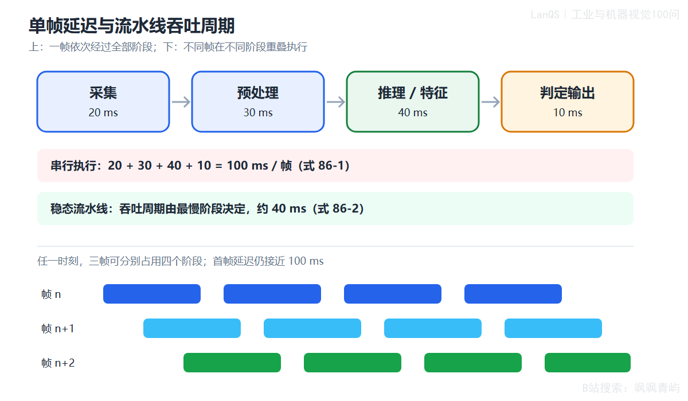

<p align="center">图86-1　单帧延迟与流水线吞吐周期的区别</p>

<div class="figure-note">上方串行路径的四个阶段合计 100 ms，下方的并行路径在稳态时由 40 ms 的推理阶段限制结果到达间隔。图中 40 ms 只能用于持续结果供给的判断。若同一帧必须立即驱动剔除、安全联锁或机器人修正，验收指标仍是该帧的端到端延迟。</div>

流水线不改变某一帧走过的阶段数量。它适合“持续跟上工件流动”的业务约束，不适合“这一帧必须在动作发生前完成”的同帧闭环。安全互锁、立即剔除或使用当前测量值修正机器人位置的场景，都要把动作时限和通信延迟包含在单帧预算中。

#### 阶段模型与队列边界算例

先把上述阶段时间代入式（86-1）和式（86-2）：

$$
T_{\mathrm{serial}}=20+30+40+10=100\ \mathrm{ms/frame},
\qquad
T_{\mathrm{cycle,ideal}}=\max(20,30,40,10)=40\ \mathrm{ms/result}.
$$

因此，串行方案超过 $80$ ms 结果周期要求，理想流水线的 $40$ ms 结果间隔低于该要求，理论上留有 $40$ ms 的节拍余量。这个计算支持“阶段可以重叠时，系统具备足够理论产能”的判断；它不能证明缓冲、锁、通信和长尾已经满足现场要求。

算例代码把推理阶段抽象成一个 FIFO（First In First Out，先进先出）单服务器。上游以固定的 $40$ ms 间隔交帧，推理服务时间以 $40$ ms 为均值，按给定标准差加入每帧抖动。代码使用 max(1.0, service_time) 把过小的服务时间截到 $1.0$ ms，避免随机样本产生非物理的负值；队列深度为 $q$，新帧到达时若等待帧数达到 $q$，就记录一次丢帧。模拟共处理 $400$ 帧，每组场景使用随机种子 $42$。结果间隔由相邻完成时间相减得到，同时报告平均值和 P95。

用于复核的伪代码如下：

~~~text
for (jitter_sd, queue_depth) in scenarios:
    server_free_at = 0
    for i in range(400):
        arrival = i * 40 ms
        waiting = number of frames already waiting
        if waiting >= queue_depth:
            dropped += 1
            continue
        start = max(arrival, server_free_at)
        service = max(1.0 ms, normal(mean=40 ms, sd=jitter_sd))
        finish = start + service
        server_free_at = finish
        record(finish)
    gaps = adjacent differences between recorded finish times
    average = mean(gaps)
    p95 = 95th percentile(gaps)
~~~

代码输出的五组场景如下。这里的“抖动标准差”是模拟参数，不是设备实测值。

| 抖动标准差 $\sigma$ | 队列深度 $q$ | 平均结果间隔 | P95 结果间隔 | 丢帧 |
|---:|---:|---:|---:|---:|
| 0 ms | 8 | 40.0 ms | 40.0 ms | 0/400 |
| 4 ms | 8 | 40.4 ms | 47.3 ms | 0/400 |
| 4 ms | 2 | 40.4 ms | 47.3 ms | 3/400 |
| 12 ms | 8 | 41.2 ms | 61.9 ms | 5/400 |
| 12 ms | 2 | 41.7 ms | 63.4 ms | 16/400 |

最差场景的平均结果间隔仍只有 $41.7$ ms，低于 $80$ ms；但 P95 已经达到 $63.4$ ms，并且 400 帧中丢失 16 帧。平均值低于产线要求，不能掩盖长尾或丢帧。这个模拟说明式（86-2）在有抖动和有限队列时只是理想上限，不能当作实际吞吐保证。抖动、队列深度和结果完整性应同时进入验收。

图 86-2 用深蓝柱表示平均结果间隔，用浅蓝柱表示 P95 结果间隔，绿色线表示理想的 $40$ ms，红色线表示 $80$ ms 产线要求。观察时先看 P95 是否接近上限，再看各组下方的丢帧数。队列变浅和抖动增大带来的主要风险，不一定首先表现为平均值超限，也可能先表现为长尾和丢帧。

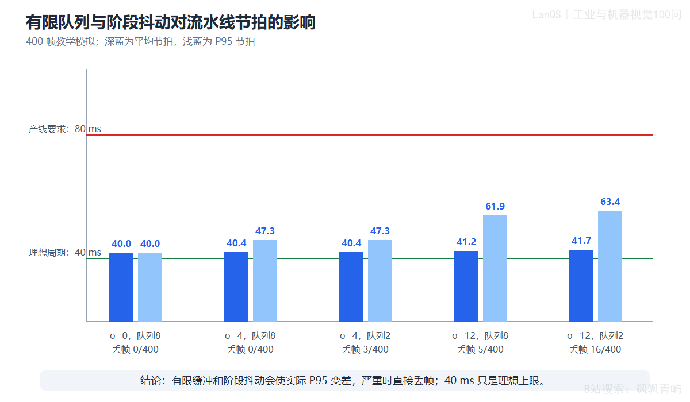

<p align="center">图86-2　有限队列和阶段抖动下的实际节拍与理想预测</p>

<div class="figure-note">深蓝柱是平均结果间隔，浅蓝柱是 P95 结果间隔，绿色参考线为理想 40 ms，红色参考线为 80 ms 上限。抖动从 0 增到 12 ms、队列从 8 减到 2 时，P95 和丢帧均可能上升。图中场景是教学模拟，用于解释理想吞吐公式的适用条件，不代表任何具体产线的性能承诺。</div>

队列设计还要明确三件事：队列满时是丢弃新帧、阻塞采集还是转入降级路径；丢帧后如何追踪产品和报警；队列长度增加后可接受的最大等待时间是多少。深队列适合吸收短时抖动，过深则会延迟暴露持续过载；浅队列响应快，却更容易在服务时间连续偏大时丢帧。

队列中的任务还存在年龄问题。一个结果即使最终算对了，如果它对应的工件已经越过剔除位置，结果也可能失去控制价值。因此，验收不能只统计“完成了多少帧”，还要统计从采集到动作的年龄、超时结果比例和结果与工件的关联正确率。对允许迟到的记录型任务，可以保留迟到结果；对控制型任务，超时应进入明确的安全状态，不能把旧结果当作当前状态。

模拟中的丢帧判断是教学化的单服务器模型，真实系统还可能有多路相机、多个消费者和不同优先级。它适合帮助读者理解抖动和队列深度怎样破坏式（86-2）的近似，不足以预测某台设备的实际丢帧率。实际测试应在目标硬件上采集真实 stage time，使用真实触发频率，并记录每一帧从采集到完成或丢弃的完整状态。


异步处理适合把不影响主闭环的工作移到后台。例如，主通道用快速规则给出初判，后台线程再对疑似样本运行高精度分析并保存图像。关键在于结果必须能回到正确的工件上。帧号、工件号、触发序号或编码器位置应随任务传递，后台结果还要有超时和迟到处理规则。

如果生产流程允许先放行再复核，异步精检可以减少主路径等待；如果剔除器必须根据当前帧在固定位置动作，迟到结果只能用于记录或人工复核，不能假定它仍能驱动同一件工件。异步线程也可能与主线程争用 CPU、内存或 GPU，因此优化后要重新测量完整链路。

缓存适合相邻帧变化小、姿态稳定、背景相同且结果可以逐件关联的场景。系统可以计算当前帧与参考帧或上一帧的相似度，在满足预先验证的条件时复用部分中间结果。相似度高只说明图像外观接近，不能证明缺陷位置、产品编号和当前帧完全相同。工件运动快、缺陷位置随机、产品换型频繁或每件都必须独立追溯时，应保留独立计算。

缓存策略应记录命中率、误用率、节省的计算时间和被复核的样本。每次换型、相机参数变化或环境明显变化后，都要重新验证相似度阈值；缓存命中不能绕过质量监控。

异步和缓存都要求结果拥有清楚的有效期。异步任务进入后台时，应保存采集时间、帧号、工件号、相机参数和队列位置；结果完成后检查该工件是否仍在允许的动作窗口内。若任务超时，系统应区分“未完成”“完成但过期”和“完成且可用”，三者的报警与追溯含义不同。高精度后台结果也不能覆盖已经执行的错误动作，除非现场流程明确允许延后修正。

缓存还可能把系统的变化隐藏起来。连续帧相似时，算法可能连续复用旧结果，导致新出现的缺陷没有经过完整计算。可将缓存命中样本按固定比例抽样回算，比较复用结果和独立结果；当两者差异超过阈值，立即降低命中率或停用缓存。换型、焦点调整、曝光或增益修改、光源维护之后，应使旧缓存失效。


“每 80 ms 得到一个结果”可能是视觉站的处理窗口，也可能只是工件以 80 ms 间隔到达的运输节奏。还需要确认每一件是否都必须完成完整分析，是否允许快速筛查后把疑似件送到复检位，是否必须在当前帧上驱动剔除器，是否必须保存全部原图。

有缓冲位、并行工位或复检工位时，视觉的内部处理周期可以与工件运动周期错开，但工件、结果和动作必须可追溯关联。若结果直接决定同一工件的即时动作，就要把采集、传输、计算、输出和异常处理分配到同一帧的时间预算中。图片存储可以只保留 NG（Not Good，不合格）或低置信度样本，但这一选择必须满足审计和问题复盘要求。

面对 100 ms 与 80 ms 的冲突，可以按以下顺序形成决策。先确认是否是同帧闭环；是，则流水线只改善吞吐，优先检查阶段计时、算法和硬件，必要时重新讨论动作窗口。若是持续吞吐要求，再确认阶段之间是否能安全重叠、缓冲是否足够、P95/P99 是否有余量。流水线难以实施时，再以最小缺陷尺寸和最低对比度为约束评估轻量模型、ROI、硬件加速或量化。若这些措施都会损害验收质量，才需要和产线一起讨论节拍定义、缓冲位置或复检流程。

需求澄清还要把“结果产生时间”和“动作执行时间”分开。即使视觉结果在 80 ms 内生成，网络发送、PLC 扫描、输出模块响应和剔除器机械动作仍需时间；若动作位置距离相机较远，系统还要根据输送速度和编码器位置计算允许的结果年龄。反过来，如果产线可以在视觉站后设置缓冲，视觉系统可以先完成判定再在工件到达动作位前输出。两种布置不能用同一个 80 ms 数字直接替代。

对于每件产品都必须追溯的项目，丢帧和迟到结果应有明确的业务状态，例如待复核、禁止放行或缺测。若业务只要求对疑似件做高精度复检，则可以把快速筛查结果和复检结果分成两级，并在数据库中保留两者。重新定义节拍不是放宽质量要求，而是把实际工艺中的缓冲、复检和动作位置写进需求，使技术团队知道到底要满足哪条时间边界。

### 验收、监控与降级

长期性能监控至少应记录采集时间、传输时间、预处理时间、推理时间、后处理时间、通信等待、队列深度、丢帧率、CPU/GPU 利用率、内存占用、温度和模型或规则版本。监控指标应按产品批次和工位分组，分别观察平均值、P95、P99 和峰值。这样才能区分算法变慢、温度降频、网络阻塞、磁盘写入和 PLC 等待。

在轻度过载时，可以执行预先验证过的降级策略，例如关闭辅助可视化、降低非关键图片保存频率、切换轻量模型，或只对疑似区域运行精检。每个策略都要写明触发条件、检测质量上限、最大持续时间、恢复条件和回退动作。降低保存频率不能影响必须保留的 NG 证据，切换轻量模型也不能绕过缺陷样本复验。

现场不能在生产压力下临时修改这些参数。降级后应继续记录召回率、误报率、结果延迟、丢帧率和追溯完整性；任何一项超出上限，都应转入人工复核或停线处理。动态调整的意义是让系统在已知边界内平稳运行，不能把质量责任隐藏在“自动优化”之后。

性能监控最好同时设置预警线和禁止自动放行的控制线。比如队列深度连续上升说明负载可能超过服务能力，P99 接近动作窗口说明偶发长尾已没有余量，丢帧率大于零则要检查是否每个受影响工件都能被定位。具体阈值必须由验收要求给出；监控本身不应因为平均值正常就忽略尾延迟。

动态调整还要防止频繁切换。若系统在轻量模型和完整模型之间来回切换，结果可能难以复盘，模型热切换也可能造成短暂阻塞。可以设置滞回区间、最小保持时间和人工确认条件，并为每次切换记录原因、起止时间、模型版本和受影响工件。降级状态在生产界面上应清楚可见，不能只藏在日志里。


一套综合方案可以在采集阶段按工件位置裁剪 ROI，在独立线程中重叠预处理和推理，在 GPU 上运行适合并行的模型，把结果通信和缺陷图保存放到不同的下游任务，再把明显正常样本留在快速通道，把 NG 或低置信度样本交给精检通道。每个阶段都应有输入、输出、超时、错误码和帧号，防止并行后出现结果错配。

验收应同时覆盖单帧延迟、稳态结果间隔、P95/P99、丢帧率、召回率、误报率、产品与结果关联正确率，以及异常恢复时间。对流水线系统，还要分别测量启动填充时间、稳态和停止排空时间；连续吞吐达标不代表第一帧或最后一帧的等待也达标。

一份可复核的验收记录应把测试条件写完整：相机分辨率和触发频率、产品速度、样本构成、模型或规则版本、CPU/GPU 型号、驱动与运行时、是否保存原图、网络和 PLC 状态、测试时长以及热机温度。结果表中同时列出合格样本、缺陷样本、低置信度样本、丢帧样本和超时样本，避免只报告平均速度。若使用模拟抖动或构造缺陷，必须与真实产线验证结果分栏。

系统上线后还要保留回退路径。轻量模型、完整模型、缓存策略和降级配置都应有可识别版本；发生漏检、丢帧或延迟异常时，可以快速切回已验证版本并保留异常图像。性能优化的验收不应止于“达到 80 ms”，还要证明在温度变化、通信异常、磁盘满、相机重连和模型切换后，系统会进入预期状态并留下可追溯记录。

性能优化最终是系统工程问题。阶段结构决定哪里能重叠，资源分配决定是否出现新瓶颈，业务约束决定应该优化单帧延迟还是结果吞吐，检测边界决定哪些加速手段可以使用。只有把这些量放在同一份测试记录中，100 ms 到 80 ms 的差距才会转化为可执行的工程决策。

### 常见误区

- 没有阶段埋点就把超时全部归咎于模型。图像上传、磁盘写入和 PLC 握手都可能是瓶颈。
- 用流水线解决同帧安全、剔除或机器人闭环。流水线提高结果供给速度，却不缩短当前帧的端到端路径。
- 降低分辨率或模型规模前没有复核最小缺陷尺寸、对比度和困难样本召回率。
- 用 $\max_i(t_i)$ 的理想值代替带队列、抖动和通信的实际验收。
- 只报告平均延迟或 FPS，不报告 P95/P99、丢帧和热机状态。
- 用相似度缓存替代逐件追溯，导致结果被错误复用。
- 现场临时启用降级策略，却没有验证检测质量和恢复条件。

### 术语与符号表

| 术语或符号 | 含义 | 单位 |
|---|---|---|
| 单帧延迟 | 一帧从采集到结果完成的端到端耗时 | ms |
| 吞吐周期 $T_{\mathrm{cycle}}$ | 稳态相邻结果到达的时间间隔 | ms/result |
| 吞吐率 $R$ | 单位时间内完成的结果数量 | results/s 或 frames/s |
| $t_i$ | 第 $i$ 个处理阶段的耗时 | ms |
| 流水线并行 | 让不同帧同时占用不同阶段的架构 | 无量纲概念 |
| FIFO | First In First Out，先进先出队列规则 | 无 |
| 抖动 | 单帧阶段耗时相对名义值的变化 | ms |
| P95/P99 | 延迟样本中 95%/99% 不超过的分位值 | ms |
| 丢帧 | 未完成处理或因队列满而被丢弃的图像帧 | frame |
| ROI | Region of Interest，感兴趣区域 | 像素区域 |
| FPS | Frames Per Second，每秒帧数 | frame/s |
| $T_{\mathrm{serial}}$ | 串行执行时单帧总延迟 | ms |
| $q$ | 队列可容纳的等待任务数量 | frame |

### 延伸阅读

- Lee, E. A.，《The Problem with Threads》，用于理解并发、缓冲和流水线的时序问题。
- NVIDIA，《CUDA C++ Programming Guide》，用于复核 CUDA 事件、流和设备侧计时。
- Little, J. D. C.，《A Proof for the Queuing Formula: L = λW》，用于理解到达率、等待时间和队列长度的关系。
- Hopp, W. J. 与 Spearman, M. L.，《Factory Physics》，用于理解产线节拍、缓冲和工位平衡。

---

---

# 第87问　相机或镜头的性能会随时间退化，系统怎样检测并提前预警？

视觉系统的成像状态会随着运行时间变化。镜头表面逐渐积灰，保护玻璃沾上油膜，光源的亮度和色温发生漂移，传感器在高温下的噪声升高，支架受到振动后产生微小位移，这些变化通常不会立刻让程序报错。相机仍然触发、图像仍然保存，检测程序也仍然输出结果，但缺陷边界、局部对比度和纹理稳定性可能已经偏离了调试时的状态。

本问讨论怎样把成像质量变成可追踪的设备状态。内容包括退化原因、镜头污染的图像证据、光源衰减的直接和间接测量、基线与参考样本、预警系统的闭环、趋势模拟、机器学习辅助诊断和维护验证。一个可用的预警系统必须同时回答“图像发生了什么变化”“变化可能由什么引起”“什么时候安排什么动作”。

### 退化证据与质量监控

图像质量由缺陷与背景的亮度差、边缘清晰度、视场均匀性、噪声水平和缺陷可分离程度决定。它包括缺陷与背景的亮度差、边缘清晰度、视场均匀性、噪声水平和缺陷可分离程度。只要这些量仍然勉强落在算法可接受范围内，设备就会继续产生表面上正常的判定；随着余量逐渐消失，误报和漏检才会在统计上明显增加。

镜头或保护玻璃上的灰尘、油膜和凝露会改变光线的透过与散射。散射光进入传感器后，局部对比度下降，亮部周围可能出现光晕，细小边缘会变软。LED 光源的工作时间、温度和驱动状态会改变发光强度和色温，导致整幅图或某些通道的亮度分布移动。传感器温度升高时，读出噪声和热像素可能增加；长期运行还可能出现越来越多的固定异常像素。安装结构松动则会改变焦点、视场姿态和照明入射角，反光形状或阴影位置随之变化。

这些原因在单张图上可能难以察觉，却会留下不同的时间和空间特征。光源衰减常表现为参考区域整体变暗，污染更容易形成固定位置的局部斑块或光晕，失焦会让整个视场的边缘响应下降，振动则可能产生与运动方向相关的拖影。把图像质量作为趋势来观察，能够在检测能力明显下降前发现余量正在被消耗。

排查时应区分三层状态：触发和传输是否正常，成像指标是否稳定，缺陷检测结果是否仍满足验收。第一层只能证明设备在线，第二层才反映成像条件，第三层还需要真实带标签样本验证。维护计划若只在程序完全无图或相机断线时触发，就会错过大量渐进退化。

退化还可能表现为检测结果分布的缓慢改变。光源变暗时，原本接近阈值的缺陷灰度会向正常背景靠近；局部散射增加时，细小边缘的梯度下降，分割区域面积可能变小；噪声上升时，正常区域的灰度波动变大，固定阈值会产生更多孤立误检。安装偏移则可能使缺陷在 ROI 中的位置改变，导致算法不再使用原来的几何关系。把图像质量指标和检测输出同时记录，可以看出质量余量消失与误报、漏检之间的时间关系。

维护人员还要检查退化是否具有累积性。灰尘、油膜和光源老化通常会在多次复拍中沿同一方向变化，短时温度或样本定位误差则可能上下波动。连续趋势、空间差分和维护历史结合后，才能区分“部件真的在变差”和“这次测量碰巧不同”。


镜头污染最直接的光学后果是散射增强、局部对比度下降和模糊增加。少量灰尘可能先表现为背景雾化和边缘锐度降低；较重的残留会在相机坐标的固定位置形成暗斑，或者在高光附近形成不均匀亮斑。若污染位于保护玻璃或镜头前组，异常位置通常随镜头固定，而不会跟着工件上的纹理移动。

工程人员可以将当前参考图与调试时的已知良好图像对齐，查看变化是否固定在相机坐标中，再计算参考区域的局部对比度、高频能量或边缘斜率。局部对比度描述目标区域与邻近背景的亮度差异，适合判断微小缺陷还能否从背景中分离；拉普拉斯方差或高频能量可以反映边缘和纹理变化，但噪声也会抬高高频响应，不能单独拿来诊断污染。

污染、失焦和振动都可能让锐度指标下降。若全视场边缘都变软，重新对焦或检查工作距离后指标恢复，失焦更可疑；若异常集中在固定位置，清洁前后图像差异明显，污染的可能性更大；若边缘出现方向一致的拖影，并且随设备运动或支架受力改变，应检查振动和安装刚度。重复采集、改变工件位置并观察异常是否随工件移动，是区分这几类原因的有效办法。

现场不要只保留一个“清晰度分数”。应同时保存参考图、当前图、差分图和参考区域位置，并记录曝光、增益、工作距离、触发时序、镜头焦点和环境温度。这样维护人员可以判断清洁、调焦、紧固支架或检查光源驱动，而不必从一个聚合分数猜原因。

比较图像前必须解决配准问题。样本没有固定治具时，工件的平移或轻微旋转会让差分图出现大面积假变化；可以使用定位标记、几何配准或固定参考区域，把位置误差与光学变化分开。对于周期性纹理，比较时还要避免把正常纹理相位差当成局部污染。参考图的空间坐标、裁剪窗口和配准参数都应版本化保存。

若污染只影响部分视场，整幅图平均亮度可能几乎不变，局部统计量更敏感。可以把视场划分为若干稳定区域，分别记录均值、百分位、边缘响应和噪声，再观察异常是否只集中在一个区域。分区监控增加了诊断能力，同时也增加了参考样本定位和阈值管理工作，区域数量应由缺陷位置和光学结构决定。


光源状态可以直接测，也可以通过最终成像结果间接推断。照度计测量工件位置的照度，光功率计测量光学输出，光源内置传感器则提供驱动或输出反馈。这些测量适合观察光源本体。它们无法覆盖镜头污染、保护玻璃散射、相机增益或工件反射率改变之后的影响，所以不能代替整条成像链的验证。

间接方法是在固定条件下对同一个黄金样本或参考卡重复成像。黄金样本是已知状态稳定、可被重复定位的物理样本；参考卡则可以提供较稳定的亮度或纹理区域。采集时应保持曝光、增益、工作距离、触发条件和照明设置不变。将当前等效亮度 $\Phi(t)$ 与初始亮度 $\Phi(0)$ 相比，可以定义光源衰减因子：

$$
\mathrm{LDF}(t)=\frac{\Phi(t)}{\Phi(0)}
\tag{87-1}
$$

这里的 $\Phi(0)$ 是调试或基线时的光通量，单位可以是流明；也可以用固定参考区域的平均灰度或其他经过验证的等效亮度替代。$\Phi(t)$ 是时间 $t$ 的当前值，单位与 $\Phi(0)$ 相同，因此 LDF（Light Decay Factor，光衰减因子）是无量纲量。LDF 越接近 $1$，当前输出越接近基线；LDF 下降表示相对初始状态变暗。

例如，若固定参考区域的基线平均灰度为 $200$，当前为 $188$，把灰度作为等效亮度，则

$$
\mathrm{LDF}(t)=\frac{188}{200}=0.94
$$

表示当前参考亮度约为基线的 $94\%$，相对下降 $6\%$。这个计算支持“当前成像亮度相对基线发生了变化”的判断，不能单独证明原因一定是光源老化。曝光设置、相机增益、参考样本反射率、镜头污染和环境光都可能使 $\Phi(t)$ 下降。

把公式落到现场，需要建立固定周期的黄金样本复拍协议。每班、每周或更短的周期应根据已知退化速度和停线代价选择；变化快的工位需要更密集采样。每次复拍都记录时间戳、操作者、设备编号、工位、样本编号和环境条件，并计算与生产图像相同的参考亮度、清晰度和局部对比度指标。黄金样本要防尘、防油和防误换，并定期与备用样本交叉核对，否则样本自身的磨损会被误当作设备退化。

基线应来自完成校准、安装稳定、处于已知良好状态的设备。基线若是在设备已经“勉强可用”时采集，后面的预警都会围绕错误的起点建立。复拍协议还要记录相机参数和定位方式，保证时间序列中的变化主要来自设备，避免每次样本摆放差异混入结果。

基线不应只有单个均值。对同一健康状态重复采集，可以估计正常波动范围，记录均值、标准差、分位数和不同温度或班次下的变化。预警边界应位于正常波动之外，同时给维护留下足够时间；如果正常噪声本身已接近允许的质量余量，应先改善夹具、遮光和采集重复性，再讨论报警阈值。

直接测量与参考样本成像最好相互校验。照度计发现光源输出下降而参考图没有变化，可能是测量位置不同或相机曝光补偿掩盖了变化；参考图下降而光源输出正常，则应检查镜头、保护玻璃、相机增益和样本表面。两种信号指向不同阶段时，系统获得的诊断信息比单独看任一量更完整。


亮度是必要指标，却不足以描述成像质量。质量指标应从缺陷的成像机制出发：缺陷靠灰度差被发现，就监控亮度和局部对比度；缺陷靠边缘或细线被发现，就监控边缘斜率、拉普拉斯响应或 MTF；缺陷容易被噪声淹没，就监控噪声和信噪比；不同区域必须均匀时，再监控视场均匀性。

MTF（Modulation Transfer Function，调制传递函数）描述不同空间频率的对比度经过光学和传感器后保留多少，适合用标准靶、稳定边缘或条纹检查清晰度。SNR（Signal-to-Noise Ratio，信噪比）表示有效信号相对于噪声波动的大小，在相同缺陷信号下，SNR 下降意味着缺陷更容易被随机噪声掩盖。颜色一致性则适合彩色检测或依赖色温的任务，单色灰度缺陷不一定需要彩色指标。

| 指标 | 观察对象 | 可能发现的变化 | 使用边界 |
|---|---|---|---|
| 参考区域亮度 | 平均灰度或百分位灰度 | 光源衰减、曝光或增益变化 | 受反射率和环境光影响 |
| 亮度均匀性 | 不同位置的亮度差异 | 光源角度、渐晕、局部污染 | 参考区域和定位必须固定 |
| 边缘斜率、拉普拉斯响应 | 边缘和高频纹理 | 失焦、污染、运动模糊 | 噪声会抬高高频指标 |
| MTF | 空间频率上的对比度传递 | 光学清晰度下降 | 需要稳定靶标或边缘 |
| 噪声和 SNR | 有效信号与随机波动 | 温升、传感器和供电异常 | 曝光、增益和区域须固定 |
| 颜色一致性 | 通道比例、色温 | 光源色温漂移、通道异常 | 只对颜色敏感任务必要 |
| 缺陷可分离度 | 缺陷与背景的统计距离 | 检测余量被压缩 | 需要真实带标签样本 |

基线要保存原始图像、参数和采集条件，而不只是保存每项指标的平均数。对同一指标应保留当前值、基线值、偏差、连续越线次数和趋势斜率。缺陷可分离度应在已知缺陷和正常样本上周期性复测，因为一张黄金样本只能说明成像参考稳定，不能证明真实缺陷仍然可检出。

### 预警闭环与预测性维护

退化监控系统可以分成六个互相衔接的模块。基线采集记录健康状态；在线监控按固定周期获取参考图；指标计算把图像变成亮度、清晰度、噪声和均匀性数据；趋势分析区分慢性下降、突然跳变和短时波动；阈值判断把状态分为正常、预警和停止或强制复验；维护反馈记录清洁、换光源、调焦、紧固或重新标定后的恢复结果。

图 87-1 展示从基线到维护反馈的闭环。读图时先沿上方流程看一项指标如何被采集、计算、分析并转成动作，再看下方趋势曲线如何依次穿过预警线和停止线。维护动作之后，系统应重新采集参考样本并验证基线是否恢复；流程若在报警处结束，就只能知道“发生了变化”，无法知道哪种维护是否有效。

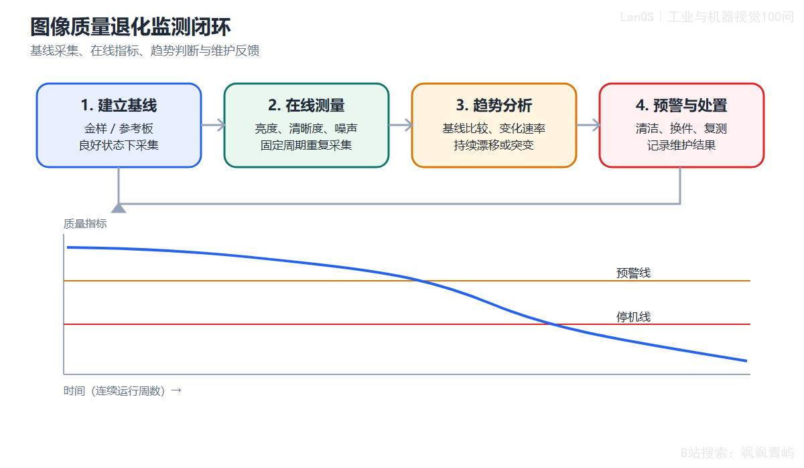

<p align="center">图87-1　从参考采集到维护反馈的图像质量退化监控闭环</p>

<div class="figure-note">图中上方流程把基线、在线指标、趋势分析和维护动作连接起来，下方曲线说明质量指标会先穿过预警阈值，再接近停止阈值。预警状态可以安排清洁或换件，停止状态需要立即处理或强制复验。图示适用于参考样本和采集条件可重复的工位；若工件反射、姿态或环境光变化很大，应先增加定位与环境记录。</div>

阈值是双向设计。阈值过紧会把复拍噪声、样本摆放差异或环境变化当成故障，频繁报警会使操作者逐渐忽略通知；阈值过松又会等到检测能力已经下降才发出警报。预警阈值应结合正常状态波动、缺陷漏检代价和维护提前期设置，停止阈值应结合缺陷验收和安全要求设置。

环境条件会伪造退化信号。机柜温度变化会影响传感器噪声，外部光线漏入会改变亮度，黄金样本位置略有偏移也会改变局部指标。每次复拍都应记录机柜温度、班次、时间、样本定位和换型信息；对单次越线先复采，要求连续多次同向变化或多个指标共同变化后再升级维护。

预警和停止的判定还应包含滞回。指标在阈值附近来回波动时，若每次采样都改变状态，现场会收到连续的报警和清除通知。可以规定连续若干次越线才进入预警，恢复到更宽松的恢复边界并持续若干次后才清除；具体次数和边界应由正常噪声与维护响应时间测试得到。这里的滞回只稳定状态机，不会修复图像质量。

#### 黄金样本趋势预警算例

下面用代码中的构造数据说明预警阈值、停止阈值和采样周期的关系。脚本设置 WEEKS=28，质量指标在第 0 周以归一化值 $1.0$ 为基线。每周退化率为

$$
0.004+0.0009\times\mathrm{week}
$$

并在真实退化值上叠加标准差 $\sigma=0.008$ 的高斯测量噪声。这里的指标是归一化清晰度代理量，数值越低表示图像状态越差。它来自模拟，不能理解为某台相机的实测寿命。预警阈值是 $0.85$，表示相对基线下降到约 $85\%$；停止阈值是 $0.70$，表示下降到约 $70\%$。

代码先按周生成真实退化值，再用 random.seed(11) 生成观测值。阈值事件取观测序列第一次越线的周次，平滑后的理论曲线只用于解释趋势。结果中，第 15 周观测值首次低于 $0.85$，第 24 周首次低于 $0.70$，因此名义提前量为

$$
L=24-15=9\ \text{周}
$$

这个 $9$ 周表示在本次退化速率、噪声和每周复拍条件下，预警到停止之间可以安排维护的时间窗口。它不能证明设备在这九周内都能安全生产，因为停止阈值没有替代带标签缺陷样本的检验，真实退化也可能突然加速。

代码还分别以每 $1$ 周、每 $2$ 周和每 $4$ 周抽取观测点。每周采样得到预警第 15 周、停止第 24 周，提前量为 $9$ 周；每两周采样时，预警被观察到第 18 周、停止第 24 周，提前量为 $6$ 周；每四周采样时，预警在第 16 周被观察到、停止在第 24 周被观察到，提前量为 $8$ 周。采样点变粗后，真实越线可能发生在两次复拍之间，预警检测会延迟或提前量估计会改变。

要读懂这段模拟，还要区分 true_value 和 observed_value。true_value 按前一周值乘以 $(1-\mathrm{decay\_rate})$ 递推，描述不含测量噪声的底层退化；observed_value 在该值上叠加标准差为 $0.008$ 的高斯噪声，代表每次复拍的曝光和定位微小差异。阈值判断使用 observed_value，所以第 15 周的越线可能与测量噪声共同有关。真实系统应使用实测重复性估计噪声，而不能直接把 $0.008$ 复制到其他工位。

采样周期的选择还要考虑操作窗口。每周采样可能需要停机或取出参考样本，每四周采样则减少人工成本，却可能把退化事件留到更晚才被看见。若系统能自动在生产间隙拍摄参考区域，采样周期可以更密；若只能在换班时人工复拍，就应把一次复拍的失败重试和漏采记录纳入提前量计算。

下面的伪代码保留了算例逻辑：

~~~text
BASELINE = 1.0
WARN_THRESHOLD = 0.85
STOP_THRESHOLD = 0.70
for week in range(28):
    decay_rate = 0.004 + 0.0009 * week
    true_value = previous_value * (1 - decay_rate)
    observed_value = true_value + gaussian_noise(std=0.008)
    record(week, true_value, observed_value)
warn_week = first sampled week with observed_value < 0.85
stop_week = first sampled week with observed_value < 0.70
lead_time = stop_week - warn_week
~~~

图 87-2 把观测曲线、底层平滑退化曲线、两个阈值和两次越线周次放在一起。阅读时先找到观测曲线第一次穿过预警线的位置，再找到第一次穿过停止线的位置，最后读取两者的横坐标差。观测噪声可能让单个点暂时越线，所以生产规则应配合连续越线、滑动统计或复采确认。

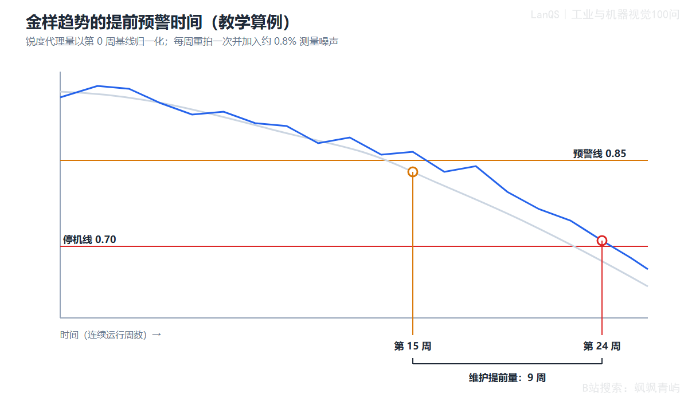

<p align="center">图87-2　质量退化趋势、预警阈值与停止阈值</p>

<div class="figure-note">灰色曲线表示模拟的底层退化，蓝色曲线表示带复拍噪声的实际观测。第 15 周和第 24 周分别是本次序列第一次越过 0.85 和 0.70 的位置，两者相差 9 周。图中提前量只属于这组模拟条件，不能直接推导相机寿命；采样周期和越线确认规则会改变检测到的周次。</div>


当亮度、清晰度、噪声和均匀性之间存在复杂关联时，机器学习可以学习正常状态的多指标分布，并给出异常分数。无监督异常检测主要用正常样本建立“正常范围”，适合缺少污染、老化和失焦标签的工位；监督学习需要已经确认的故障类别和足够历史数据，可以进一步区分镜头污染、光源衰减、传感器噪声或安装偏移。

模型输出用于筛查，不能直接给出物理原因。若输入指标与真实故障没有关系，复杂模型也只能更快地放大错误。系统应保存异常图像、输入指标、采集条件、模型版本和人工确认原因，把清洁、换件、调焦和环境干扰的结果写回维护记录。采集条件或产品换型后，正常分布可能发生变化，模型需要重新验证。

第一阶段部署时，亮度、边缘和噪声规则通常更容易解释。规则基线确认问题存在后，机器学习可用于多指标排序和故障分类；这样维护人员仍能回到原始图像和物理检查，不会只面对一个无法解释的异常分数。

无监督模型也要定义训练窗口和更新条件。把已经退化的图像自动当作正常样本继续更新，会逐渐抬高模型对坏状态的容忍度；把换型后的正常图像直接与旧产品混合，也会把产品差异记成设备异常。更新前应由人工确认样本状态，并保留旧模型、训练数据和阈值，确保异常增多时可以回退。

监督模型应区分故障类别，不能把所有状态都标成“故障”。污染、光源输出下降、传感器噪声、失焦、振动和环境光各有不同的处理动作；标签若混在一起，分类准确率即使不低，也不能指导维护。故障标签的可靠性来自清洁、换件、调焦或环境复测之后的因果证据。模型对图像的解释只能提供线索。


当前指标是否越过阈值，只回答设备此刻是否需要处理。预测性维护还要看下降速度、波动形状和维护后的恢复。相同的质量分数，如果一个工位连续三周下降，另一个工位只因一次环境变化短暂下降，维护优先级应不同。时间序列至少要保存当前值、相对基线的偏差、窗口斜率、连续越线次数和最近一次维护时间。

收到漂移报警后，可以按空间模式、噪声底、物理清洁或换件测试和环境记录逐步缩小范围。先查看参考图的异常位置：固定的暗斑、斑块或光晕更支持污染，全视场均匀变暗更支持光源输出变化。再检查平坦区域噪声；噪声升高而平均亮度基本稳定时，应检查传感器温度、供电和读出状态。若清洁镜头后指标迅速接近基线，污染得到支持；清洁无效时再测光源输出，并检查曝光和增益。最后对照环境记录，确认异常是否与温度、班次或外部光线事件同步。

诊断顺序的重点是保留每一步的排除结果。若改变黄金样本位置后异常仍固定在相机坐标，污染或传感器表面问题的可能性上升；若异常跟随样本位置移动，先检查样本和定位；若直接光学测量与参考图像都下降，光源和驱动应优先检查；若参考图下降但光源测量稳定，镜头、相机参数和样本反射更值得关注。工程记录应写明“检查了什么、观察到什么、采取了什么动作”，不能只保存最后的故障类别。

预测性维护还可以使用斜率估计，但斜率必须带上采样间隔和置信范围。两次观测之间的下降量很大，可能是一次样本放置偏差；连续多次同向下降才有更强的维护意义。对于突然跳变，应先检查触发、参数和环境；对于缓慢下降，才适合根据历史斜率估计何时接近停止阈值。估计的时间用于安排检修，不应替代停止状态的安全规则。

维护动作完成后，必须重新拍摄黄金样本，比较维护前后指标，并用带标签的真实缺陷复验。报警消失只表示某个指标回到阈值内，不能单独证明检测能力已经恢复。维护工单应保存设备编号、工位、异常图像、指标快照、时间、处理动作和复验结果，便于计算哪一种指标提前多久暴露了哪一种退化。


每个工位应定义固定的黄金样本或参考目标、定位方式、采集参数、复拍周期和允许变化范围。黄金样本要像量具一样被管理，防止表面磨损、沾污、老化或误换。对于不能长期保存的工件，应使用稳定参考区域、标准靶或经过验证的替代件，并定期与真实缺陷样本交叉确认。

指标数据应关联班次、产品型号、设备编号、环境条件和维护工单。不同产品的正常反射分布不能直接混成一条基线；换型时应明确哪些指标可跨型号比较，哪些只能在型号内比较。复拍周期要由退化速度、人工检查能力和停线风险共同决定，不能只依据软件定时器。

闭环验收可以检查三件事：重复复拍能否稳定发现同一趋势，维护后指标是否按预期恢复，恢复后的缺陷样本是否重新满足检出要求。三项证据都成立，监控指标才从图表变成了可执行的设备维护依据。

工位交接时还应让操作员能看到参考图、当前指标、阈值状态和上次维护记录。预警信息要指出需要复拍、清洁、测光还是安排复验，停止信息要阻止按原条件自动放行。监控界面可以简化显示，但后台应保留原始数值和图像，方便工程人员在误报或漏检后复盘。

部署一段时间后，应统计预警提前量、误报次数、维护后恢复比例和由质量退化导致的缺陷漏检。若预警频繁却很少发现真实退化，说明阈值、样本协议或环境补偿需要调整；若真实缺陷已经下降而监控没有提前反应，说明当前指标没有覆盖主要失效机制。这个复盘结果应回到指标选择和采样周期；单独修改报警颜色不能解决指标失效。

### 常见误区

- 相机仍能触发和保存图像，就认为成像质量没有变化。
- 只监控光源输出，不检查镜头、相机增益、焦点和安装状态。
- 用一次锐度分数直接断定镜头污染，忽略失焦、振动和噪声的相似表现。
- 用未校准或已退化的设备建立基线，导致后续阈值围绕错误起点工作。
- 只设正常和故障两个状态，没有为计划维护留下预警窗口。
- 单次越线就立即停线，或把环境变化和样本摆放误差当成硬件退化。
- 复拍周期变粗，却没有估算预警提前量会减少多少。
- 把机器学习异常分数直接当作污染、老化或失焦的物理诊断。
- 清洁后报警消失就结束验收，没有用参考图和缺陷样本复核恢复效果。

### 术语与符号表

| 术语或符号 | 含义 |
|---|---|
| 图像质量 | 与检测任务有关的亮度、对比度、清晰度、噪声和缺陷可分离程度 |
| 基线 | 设备在已知良好、参数固定状态下记录的参考图像和指标 |
| 黄金样本 | 用于重复成像和质量趋势比较的稳定参考样本 |
| LDF | Light Decay Factor，光衰减因子，表示当前光通量或等效参考亮度与初始值的比值 |
| $\Phi(0)$、$\Phi(t)$ | 基线时刻和时间 $t$ 的光通量或等效参考亮度 |
| MTF | Modulation Transfer Function，调制传递函数，描述不同空间频率的对比度传递 |
| SNR | Signal-to-Noise Ratio，信噪比，描述有效信号相对于噪声的大小 |
| 预警阈值 | 用于安排复采、检查和计划维护的质量边界 |
| 停止阈值 | 触发停机、强制复验或禁止按原条件放行的质量边界 |
| 提前量 | 预警阈值首次越线到停止阈值首次越线之间的时间 |

### 延伸阅读

可继续学习 ISO 12233 中关于分辨率和空间频率响应的测量方法，EMVA 1288 中关于图像传感器和相机噪声表征的方法，统计过程控制中的控制图与趋势分析，以及预测性维护中的时间序列和维护工单闭环。阅读这些内容时，应把指标定义与固定参考样本、采集条件、真实缺陷验证和维护后的复验联系起来。

---

---

# 第88问　什么是数据增强？除普通旋转和缩放外，工业视觉还有哪些针对性方法？

产线上的缺陷样本通常比正常样本少得多，而且相机、输送机构和光源把工件的姿态与成像条件限制在一个相对窄的范围内。训练数据不足时，模型可能只记住少数缺陷的背景、反光位置或边缘融合痕迹；换一个批次、班次或表面状态，性能就会下降。数据增强可以在原始图像上施加受控变化，让模型在训练阶段遇到一部分部署时可能出现的变化。本题讨论的范围包括少数类扩展、光照和表面变化、缺陷形态与纹理、域适应、物理仿真，以及如何验证增强确实增加了有效覆盖。

> 核心判断： 数据增强的价值在于让训练分布覆盖产线中真实存在、且标签仍然成立的变化。样本数量增加只是结果之一。增强轴、强度和组合范围都要由缺陷机制与成像链决定；无论离线指标多好，未被真实数据锚定的增强都可能在部署时制造误判。

### 增强目标与工业约束

数据增强（data augmentation）是在不改变任务标签的前提下，对原始样本施加受控变换。旋转、缩放、平移、裁剪、亮度变化、加噪和模糊都可以属于增强，但“受控”决定了它是否有工程意义。若变换使正常件看起来像缺陷，或使缺陷的轮廓、位置和类别不再成立，得到的图像就不能作为原标签样本使用。

增强主要解决两个问题。第一，真实缺陷难以大量采集，适度的缺陷区域变形和背景变化可以扩大少数类覆盖。第二，生产中的光照、表面反射、轻微姿态变化和采集噪声会在训练时被提前呈现，模型因此不容易把某一个班次或批次的偶然外观当成缺陷本身。增强改变的是训练分布，不能凭空提供完全没有采集依据的新失效模式。

几何增强还要与任务标注同步。对目标检测，边界框要随图像一起变换；对分割，掩膜轮廓必须经过同样的几何变换；对关键点任务，关键点坐标也要同步更新。若只变换图像而保留旧标注，训练样本会出现标签错位，模型学到的边缘和位置关系会被破坏。

增强还需要区分图像变化和标签变化。分类图像只要类别仍成立，标签可以保持不变；检测、分割和关键点任务的空间标注则必须与图像使用相同的变换矩阵。裁剪可能把缺陷截断，旋转可能让边界框需要重新计算，遮挡还可能把一个完整目标变成部分可见目标。若变换后缺陷已经不满足原来的质量判定，应删除样本或重新标注，不能因为生成过程自动完成就默认标签有效。

增强数据应保存来源图像、增强轴、参数和审核状态。数据来源记录有两个用途：当模型开始依赖合成边缘时，可以定位是哪条增强轴造成了问题；真实数据增加后，也可以删除已经被真实样本覆盖的变体，而不必重新猜测训练集构成。

训练分布是所有增强决策的参照。真实样本可以看作从产线分布中采到的有限观察，增强只是在这些观察周围扩展一个近邻分布。扩展后的样本仍应满足原任务的标签定义，并且变化幅度要落在现场可能出现的范围内。若增强把目标变成了新的缺陷类型，或把原本合格的边界样本推过质量界限，训练集的标签就已经失真。

训练、验证和测试的划分要防止来源相关的泄漏。对于一张真实缺陷图生成的所有变体，应先确定它属于哪一个数据分区，再在训练分区内部生成变体。按文件名随机拆分会把相同缺陷的不同变体分到两侧，模型只需记住缺陷纹理即可取得高分。按工件、批次或时间先拆分，才更接近部署时遇到新工件的情况。


自然场景中的图像可能来自任意视角和背景，工业图像通常来自固定镜头、固定输送方向和相对稳定的工装。产品若总是以同一姿态进入视场，随机旋转 $180^\circ$ 虽然增加了文件数，却没有增加真实覆盖；更严重时，它会让模型把现场不可能出现的方向当成正常变化。工业增强要先回答“现场什么会变、这种变化怎样改变图像”，再选择变换。

固定光学系统会给增强设置硬边界。相机视角、镜头畸变、工件输送方向和工装共同决定可见外观；随机旋转、任意透视或大幅缩放，只有在现场确实存在对应姿态和距离变化时才有依据。若工件由治具定位，透视变化通常应很小；若输送位置允许偏差，可以按实际定位误差做平移和裁剪。增强范围超过机械和光学容差后，模型会接触到训练中存在、产线中却不可能出现的样本。

每条增强轴都应该能够对应一个现场量。亮度变化可以由参考区域直方图或光源监控锚定，遮挡可以由夹具和工件相对位置决定，模糊可以由输送速度、曝光时间和焦点误差约束。没有现场量或真实图像支持的参数，应保留为实验假设，不能直接写入量产配置。

图 88-1 把增强的来源分成四类：工件与工装造成的几何变化，光照和表面性质造成的变化，缺陷形成机制造成的形态变化，以及传感器和采集链带来的变化。读图时可以从上方四个来源向下追问：这个增强对应哪个现场变量？它是否与当前镜头、光源和输送方向相容？最终目标是覆盖真实变化，样本数量增加只是随之产生的结果。

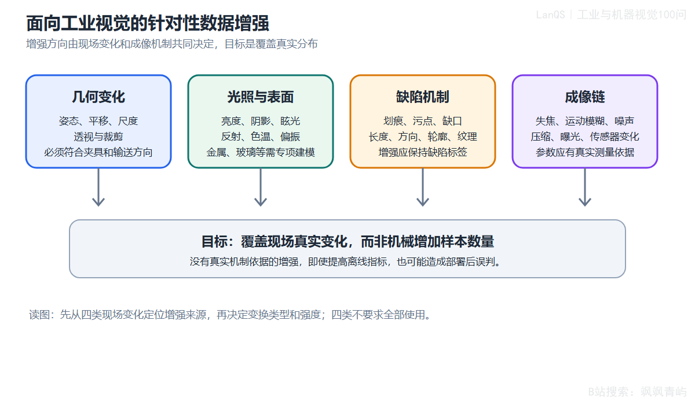

<p align="center">图88-1　工业视觉数据增强的四类针对性来源</p>

<div class="figure-note">几何变化、光照与表面、缺陷机制和成像链共同决定增强方案的边界，四类来源最终都指向产线真实分布。图中四个来源不要求在每个项目中全部使用；若某个增强与现场光学结构或缺陷机理没有对应关系，即使提高离线分数，也应先视为待验证假设。</div>

### 物理、形态与跨域增强

类别不平衡是工业检测的常态：正常图像可以在几小时内采集数千张，某类严重缺陷却可能几天都遇不到。最直接的做法是对少数类过采样，并对缺陷区域做局部裁剪、平移、尺度或形态变换。增强应覆盖缺陷实际可能出现的尺寸、位置和形状，重复复制同一个缺陷不能形成这种覆盖。

Cut-Paste 是一种常见的定向方法：先按真实轮廓提取缺陷区域，再把它融合到不同的正常背景中。背景、位置和局部表面可以变化，缺陷本身的边界和类别仍需保持合理。对划痕，可改变长度、方向或局部弯曲；对污渍，可改变面积、边缘软化和强度；对崩边或缺口，则应让缺陷轮廓与工件边界、受力方向和可见区域相容。对于“看起来像缺陷、但按质量规则仍算合格”的边界样本，可增加小幅变化，让模型同时学习判定边界和明显缺陷。

增强后必须重新检查标注、缺陷与背景的接缝，以及训练、验证、测试之间是否发生泄漏。若同一个原始缺陷的近似副本被分到训练集和验证集，验证结果会虚高，因为模型可能记住了缺陷纹理和背景，而没有学会泛化。应按工件、批次或采集时段划分数据，再在训练集内部做增强。

少数类增强的目标是覆盖真实变化范围。即使训练批次中正常与缺陷数量相同，也不代表缺陷子类型、尺寸和表面状态已经均衡；数量平衡和信息覆盖是两个不同问题。

过采样主要改变少数类在训练批次中的出现频率，Cut-Paste 和局部变形才可能增加缺陷的位置、大小或背景变化。两者的作用应分开评估。复制同一张缺陷图会让模型反复看到相同纹理，可能改善训练损失，却不会使模型认识新的缺陷形态；把真实缺陷贴到不同的正常背景上，只有在接缝自然、背景来源可靠时才有机会增加有效覆盖。

边界样本需要单独管理。接近质量上限的轻微划痕、污点或缺口，既不能随意增强成明显缺陷，也不能把仍应判为合格的样本标成不合格。应保留原始判定规则，并对增强后样本重新检查类别、缺陷位置、面积和严重程度。训练、验证、测试还要按真实工件、批次或采集时间先划分，再只在训练侧生成变体。


产线变化常来自光源老化、白班与夜班环境、批次表面粗糙度、局部反射、遮挡阴影和污染。可以针对这些因素改变亮度、对比度、色温、局部高光、阴影、噪声、曝光或轻微模糊。金属、玻璃和涂层工件还需要考虑眩光位置、条带反射和偏振条件变化；简单的全局亮度缩放无法代表这些局部结构。

增强强度的上限取决于缺陷信号。若任务依赖浅色划痕与基底纹理之间很小的灰度差，过强的模糊、亮度或对比度变化会把划痕本身抹掉；若任务依赖几何断口，适度的亮度变化可能影响较小。实际设计前应判断缺陷信息主要由几何、亮度还是纹理承载，再根据现场测量的直方图、眩光面积、噪声水平和曝光范围设置参数上限。

增强是否“像现场”，不能只凭个人观感判断。可以从实际班次、批次和清洁周期中抽取真实图像，与增强图像并排检查；再比较产线已经跟踪的量化指标，例如亮度直方图形状、镜面高光面积和噪声水平，确认两种分布确实有重叠。只凭猜测设定的模糊半径或眩光强度，应在下一次相关批次采样时回到真实数据中验证。

全局亮度变化和局部高光变化应分开建模。全局变化改变整幅图像的亮度或对比度；局部高光则需要改变反射区域的位置、面积、形状和饱和程度。对金属、玻璃和涂层表面，眩光可能遮住缺陷，也可能制造与缺陷相似的亮斑，均匀增加亮度无法复现这种空间关系。色温变化还会改变彩色通道比例，灰度模型应确认这种变化经过相机 ISP（Image Signal Processor，图像信号处理器）后是否仍然与实际图像相符。

现实性验证可以按固定顺序执行：先由熟悉工艺的人判断增强图像是否可能来自产线，再比较亮度直方图、高光面积和噪声水平等量化分布，最后在未增强的跨批次图像上验证模型。肉眼自然但分布不重叠的样本可能误导模型；分布接近但缺陷边缘被抹掉的样本同样不能使用。


缺陷具有空间结构，不能把它当作没有结构的亮点。划痕通常具有方向、长度、宽度和边缘过渡；污渍更接近具有面积和软边界的区域；崩边、缺口或气泡则受到工件轮廓、材料和受力方式约束。增强因此应作用于缺陷及其邻域，而不是只对整张图像做统一变换。

对纹理敏感的任务，可以加入局部对比度变化、频域扰动或噪声纹理叠加，模拟不同批次材料表面。但合成纹理若带有固定的融合边缘、重复背景或不自然的频谱，模型可能把这些伪特征当成缺陷证据。应把合成结果和真实缺陷按位置、边缘软硬、面积、方向及局部纹理进行比较，并用未增强的真实验证集检查模型关注区域是否仍落在缺陷上。

缺陷形态与背景之间存在物理关系。划痕的宽度、长度和方向应与材料表面和加工方向相容；污渍的边缘软化程度应与液体扩散或擦拭痕迹相容；崩边与缺口应落在工件轮廓附近。局部变形若只修改缺陷像素而不改变邻域阴影或反射，边界可能留下合成痕迹。轮廓感知融合需要检查透明度、边缘过渡、背景纹理连续性和缺陷周围的亮度关系。

频域增强改变纹理中不同空间频率的能量分布，可以模拟材料批次差异，却也容易产生相机和表面不会出现的周期纹理。对高频敏感的模型，应比较真实与增强图像的边缘宽度、局部对比度和噪声频谱，避免模型用合成频率代替缺陷本身。


域差异（domain shift）是训练环境与部署环境在设备、光照、背景、表面或工艺上的分布差异。例如实验室图像可能比产线图像干净，工厂 A 与工厂 B 的光源色温不同，白班和夜班的环境光不同。可以通过背景色、噪声模式、压缩质量、轻微失焦和曝光分布的随机化，让训练数据覆盖若干相邻域。

这种做法接近域随机化（domain randomization）：它扩大已有样本周围的条件范围，帮助模型减少对单一采集条件的依赖。它不能代替真实的跨工厂、跨批次和跨班次采样。完全没有被采集过的新表面处理、新缺陷类型或新机械故障，无法靠对旧图像做任意扰动获得可靠代表。验证集和测试集应尽量保留未经增强的真实产线图像，特别是那些与训练条件不同的批次。

域适应增强中的“邻近域”必须有实际边界。实验室与产线若只是曝光、压缩和噪声略有不同，可以在这些轴上做随机化；如果两地使用不同镜头、光源几何或材料表面，变化可能已经超过原样本的可推断范围。风格迁移有时会改变背景，却同时改变缺陷边缘和纹理，使用前仍要检查标签与缺陷可见性。

跨域验证应按域保留完整的真实数据。可以把某一批次、某一班次或某一工厂的图像作为独立验证域，禁止其原图及衍生图进入训练。这样得到的结果才能说明模型在不同真实域之间泛化，并排除模型只是记住增强器样式的可能。


当缺陷形成过程和成像结构都比较清楚时，可以把增强做得更接近物理过程。例如，改变照明入射角，移动金属表面的镜面反射区域，加入失焦模糊、运动模糊、景深不足和传感器噪声变化。相比完全随机的图像扰动，这类方法更容易保持镜头、光源、工件表面与图像结构之间的联系。

物理仿真是模型，现场测量用于约束它。仿真的反光方向、模糊尺度、噪声水平和缺陷几何都应由相机、镜头、光源、输送速度和工件材料约束。若参数没有真实量测锚点，就需要在后续相关批次中验证；通过视觉检查但在亮度直方图或高光面积分布上明显偏离真实数据的样本，仍然可能误导模型。

物理仿真应沿成像链检查。先确定缺陷几何如何改变表面法向、纹理或遮挡，再确定光源入射和镜头接收如何把变化映射到图像，最后加入曝光、运动和传感器噪声。参数改变后要检查它影响了哪项可测指标，以及是否同时破坏了其他不应变化的属性。例如增加运动模糊可以降低边缘响应，但不能让静止缺陷的位置随机漂移。

仿真的优点是控制变量，局限是物理模型不完整时会产生有规律的错误。生成样本应与真实图像混合使用，比例由独立验证结果决定；仿真无法覆盖的变化，仍需回到产线采样。

#### 有效覆盖与增强强度算例

下面的算例全部是构造性教学数据，用来说明两个容易混淆的概念。假设小型缺陷集有 $40$ 张真实图像，包含 $3$ 个缺陷子类型。对每张图像设置三条定向增强轴：模拟眩光产生 $3$ 个合理变体，模拟遮挡产生 $2$ 个变体，模拟表面变化产生 $3$ 个变体。若暂时假设三条轴完全独立，原图也作为一个有效样本，则组合倍率为

$$
M_{\mathrm{raw}}=(1+3)(1+2)(1+3)=4\times3\times4=48
\tag{88-1}
$$

但不同增强轴共享同一张原始图像的几何和缺陷信息，组合数量会重复计算信息。示例用 $0.35$ 的有效新增比例表示冗余折减，得到有效覆盖倍率：

$$
M_{\mathrm{eff}}=1+(M_{\mathrm{raw}}-1)\times0.35
=1+(48-1)\times0.35=17.45
\tag{88-2}
$$

因此，$40$ 张真实图像对应的等效覆盖量约为

$$
N_{\mathrm{eff}}=40\times17.45=698
\tag{88-3}
$$

这里的“等效覆盖量”是对非重复且具有合理变化的估计单位。它不表示数据库中有 $698$ 张互相独立的真实样本。朴素复制同一批图像时，覆盖倍率仍是 $1.0$，它只会改变损失函数中这些图像的权重，不会增加现场变化范围。$0.35$ 也不是通用常数；它需要根据变体之间的相似性、真实覆盖和验证结果重新估计。

增强强度同样存在上限。源代码用一组合成模型表示收益递减和不真实惩罚：强度从 $0$ 增大时，覆盖收益先上升；超过约 $1.6$ 的现实性阈值后，惩罚随强度增加，使低对比缺陷信号被逐步削弱。保存的模拟结果在强度 $0.0,0.3,0.6,1.0,1.4,1.8,2.2,2.6$ 下的召回率分别约为 $70.7\%,76.7\%,79.3\%,82.0\%,82.1\%,83.6\%,81.9\%,79.9\%$，峰值出现在强度 $1.8$。这些数值来自模拟，不能据此把 $1.8$ 当作通用配置；它们只展示增强可能经历“改善、平台、下降”的形状。

算例代码的两部分含义不同。第一部分把三条增强轴的原图和变体组合相乘，得到完全独立时的组合上限；第二部分用 $0.35$ 表示组合之间只有一部分带来新的有效变化。代码没有从图像内容自动估计冗余，也没有把真实样本相似度纳入统计，所以 $17.45$ 是教学估计。第二部分先计算随强度增加而递减的覆盖收益，再在强度超过 $1.6$ 后加入不真实惩罚，最后叠加随机噪声；保存结果文件供图 88-2 绘制。

右侧曲线的峰值表示这组构造函数的平衡点，并不代表训练过程的通用最优点。实际强度应通过真实验证集、边界缺陷和跨批次数据选择。

图 88-2 左侧比较真实图像、重复复制和折减后的定向增强；右侧沿增强强度读取召回率曲线。读图时先区分“样本数量”与“有效覆盖”，再观察曲线峰值之后的下降段。左侧的 $698$ 是教学算例的等效量，右侧的峰值是构造的模拟结果，两者都需要真实验证集和现场试运行来确认。

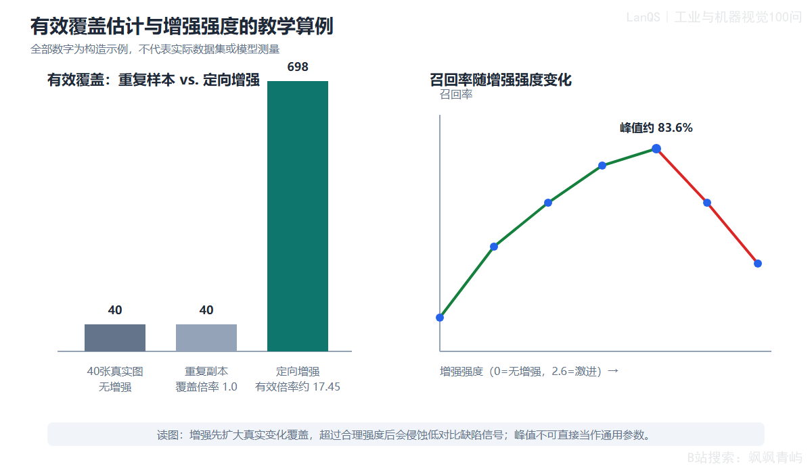

<p align="center">图88-2　有效覆盖倍率与增强强度的教学算例</p>

<div class="figure-note">左图中重复同一批 40 张图的有效覆盖倍率仍为 1.0，定向增强在扣除 65% 的组合冗余后约为 17.45，等效覆盖量约 698。右图显示召回率在强度 1.8 附近达到本次构造数据的最高点，继续增强后下降。图中趋势用于解释机制，不代表任何真实数据集的最优参数或部署性能。</div>

过度增强有两种不同后果。增强过强会侵蚀低对比缺陷、轮廓或纹理；增强范围没有覆盖某个从未采集过的失效模式，则无论生成多少旧样本变体，都无法替代真实采样。设计时应同时给增强强度和增强范围设置上限。

### 验证增强是否有效

增强效果不能由训练集准确率单独证明。应固定模型结构、训练轮数、优化器和验证集，只改变增强策略，比较独立验证集、跨批次样本和在线试运行中的召回率、误报率、漏检率、边界样本表现及处理节拍。若训练指标上升而真实验证指标波动变大，增强可能过强，也可能模拟了错误的变化。

还要检查模型关注区域。增强后如果模型开始依赖背景纹理、图像边框或与缺陷无关的高光，短期分数即使上升，也不能作为放行依据。目标是提高对真实变化的泛化，而不是让训练曲线更好看。

要判断四类增强来源中哪一类真正贡献了性能，可以先得到无增强基线和完整增强集两个端点，再做留一轴消融：每次去掉一个增强轴，重新训练并比较验证召回率、误报率和边界样本。若去掉某轴几乎不改变结果，说明它的增益可能很小；若它还显著增加训练时间或数据处理成本，就应重新评估是否保留。Cut-Paste 的轮廓感知融合通常比简单亮度变换更耗时，成本也应纳入比较。

增强价值会随真实数据增长而变化。真实产线已经覆盖某种变化后，原来有用的增强轴可能变得冗余；因此应在数据集、工艺或相机条件变化时重新进行消融，并把增强前后样本按工件、批次和时间隔离，防止相似副本进入验证集和测试集。

消融还要统计工程成本。除了召回率和误报率，还应记录每条增强轴生成的样本量、CPU/GPU 时间、磁盘占用和训练墙钟时间。轮廓感知 Cut-Paste 可能比亮度变换更耗时；如果去掉某轴后验证性能几乎不变，却能缩短数据处理和训练时间，就应重新评估它的保留理由。真实数据增加后应重做消融，因为增强价值取决于数据集中仍缺少什么。

对照实验应固定模型结构、训练轮数、优化器、验证集和评价脚本。若随机种子、初始化或训练预算同时改变，性能差异可能来自训练波动，而非增强本身。在线试运行还要记录处理节拍，确认离线收益没有换来部署侧的不可接受成本。

### 常见误区

- 在固定姿态的工位随机旋转 $180^\circ$，把现场不可能出现的方向引入训练分布。
- 对低对比缺陷施加过强亮度、对比度或模糊变化，直接削弱要学习的缺陷信号。
- 只复制同一批图像就宣称覆盖量增加。复制会改变损失权重，覆盖倍率仍为 $1.0$。
- 只凭肉眼判断增强真实。视觉上自然的图像仍可能在直方图、高光面积或噪声分布上偏离产线。
- 期待增强生成从未采集过的缺陷类型或新工艺失效模式。
- 几何变换后不更新检测框、掩膜或关键点，造成标签错位。
- 不做留一轴消融，持续增加增强类型，却不检查增益和训练成本。

### 术语与符号表

| 术语或符号 | 含义 |
| --- | --- |
| 数据增强（data augmentation） | 在标签仍有效的前提下，对原始样本施加受控变换 |
| 针对性增强 | 围绕特定缺陷机制、光学条件或现场变化设计的增强 |
| Cut-Paste | 按真实轮廓提取缺陷并融合到其他正常背景中的增强方法 |
| 域差异（domain shift） | 训练环境与部署环境在设备、光照、背景或工艺上的分布差异 |
| 域随机化（domain randomization） | 在若干相邻采集条件之间扩展训练分布的方法 |
| 消融实验 | 逐项移除一个因素并比较性能，以判断该因素的独立贡献 |
| $M_{\mathrm{raw}}$ | 假设增强轴完全独立时的原始组合倍率，本算例为 $48$ |
| $M_{\mathrm{eff}}$ | 考虑增强轴重叠后的有效覆盖倍率，本算例为 $17.45$ |
| $N_{\mathrm{eff}}$ | 以非重复真实变化计的等效覆盖量，本算例约为 $698$ |
| 召回率 | 所有真实缺陷中被正确检出的比例 |
| 增强强度 | 控制变换幅度或范围的参数；本算例为构造的无量纲坐标 |

### 延伸阅读

可以继续学习图像数据增强的系统综述、基于真实轮廓的 Cut-Paste 方法、从仿真到真实迁移的域随机化，以及通过消融或自动搜索选择增强策略的研究。阅读这些材料时，应把算法操作与现场成像条件、缺陷形成机制和未增强真实验证集放在一起考察。

---

---

# 第89问　缺陷样本极少、类别严重不平衡时，如何进行分类？

在质量检测线上，正常图像会随着生产持续累积，已确认的缺陷图却可能长期只有个位数。若把所有图像混在一起训练和评价，模型很容易学会“几乎都判为正常”，总体准确率仍然很高，真正需要拦截的缺陷却被漏掉。本题讨论类别严重不平衡（class imbalance）下的分类设计，范围包括数据采样、损失函数、推理阈值、评价指标和现场复核流程。这里的系统约束很明确：缺陷样本稀少，漏检成本通常高于一次误报复核，生产节拍又限制了人工复核量。

> 核心判断：类别不平衡首先改变了决策目标的权重，随后才表现为样本数量不足。缺陷越少，越要把真实样本的独立性、缺陷代价、复核容量和现场验证放在同一个闭环里设计。

### 数据、采样与模型路径

设正常类有 $N_0$ 张图，缺陷类只有 $N_1$ 张图，且 $N_0 \gg N_1$。如果训练损失对每张样本一视同仁，正常样本产生的梯度更新会远多于缺陷样本。模型只要把大部分图像判为正常，就能迅速降低总体损失。极端情况下，它可以一次也不报缺陷，却取得很高的准确率。这个结果说明模型适应了数据的数量结构，不说明它理解了缺陷。

类别不平衡也不等于“数据总量少”。一万张正常图像并不能替代不同缺陷机制、严重程度、材料批次和成像条件的真实样本。若漏掉一件缺陷的代价远高于增加几次人工复核，训练目标和评价指标就必须体现这种不对称。报告一个 99.5% 的准确率，同时不报告漏检数，无法回答系统是否适合放行。

处理问题前先盘点两个量：真实缺陷图数量，以及正常类与缺陷类的比例。缺陷数为零时，监督分类没有真实正类可学，应先采用只用正常图像建模的异常检测。缺陷为个位数到约 20 张时，复制和插值的主要作用可能只是重复已有实例；达到几十张且能覆盖若干机制后，基于真实缺陷区域的增强和监督微调才有较可靠的起点。低百张或更多时，类别权重、损失函数和模型结构调整才有足够真实信号可以利用。这些数量是工程起步区间，不是脱离任务的硬阈值，缺陷多样性和留出集独立性同样重要。

正常与缺陷约为 $20:1$ 时，类别权重或阈值调整可能已经能改变结果；达到 $500:1$ 或更极端时，通常需要数据、损失、判定和复核流程一起承担压力。图 89-1 先把这四层关系放在同一张图中，读者可以先看数据比例，再看各层如何补偿这种比例造成的偏置。

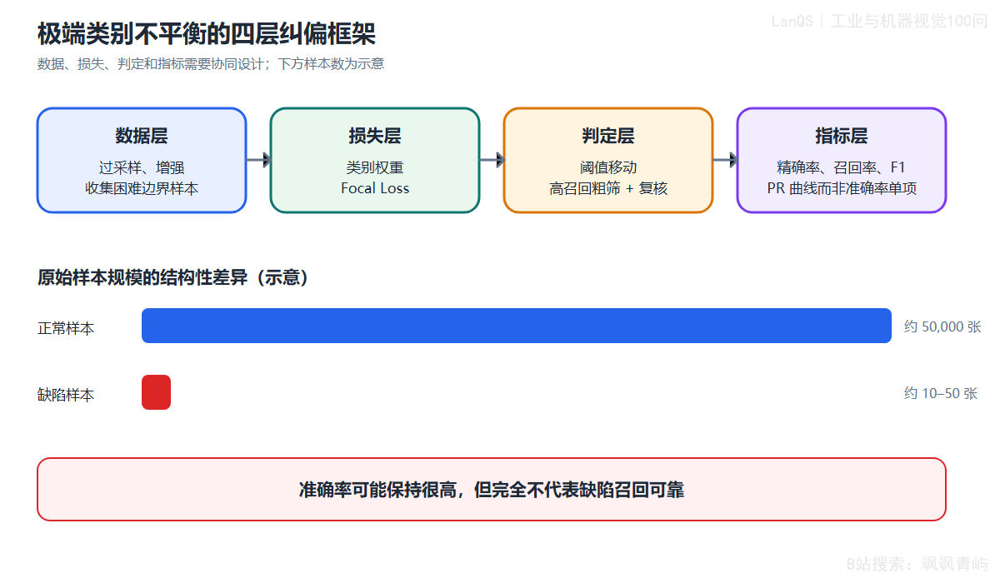

<p align="center">图89-1　极端类别不平衡的四层处理框架</p>

<div class="figure-note">上方四个模块分别对应数据层、损失层、判定层和指标层。数据层补充真实缺陷的多样性与边界样本，损失层改变训练时各类错误的相对影响，判定层用阈值和复核承接误报，指标层用精确率、召回率、F1 和 PR 曲线检查结果。下方样本条只是示意量级，用来说明正常图像和已确认缺陷图像的结构性差异，不代表某条产线的实际规模。彩色有助于区分模块；灰度打印或无障碍阅读时，应以框内文字为准。图示表达的是协同框架，不表示每个项目都必须采用完全相同的四层配置。</div>


过采样（oversampling）增加少数类在训练过程中的出现频率，可以复制缺陷图，也可以围绕真实缺陷做增强。欠采样（undersampling）则减少多数类样本。复制很多份同一缺陷图不会增加缺陷机制的多样性，还可能让模型记住具体背景和纹理；欠采样过强则会丢掉正常类中的工况变化和判定边界。两种方法改变的是训练数据的呈现比例，不能凭空产生新的真实证据。

数据层的重点应放在覆盖缺陷变化上。增强可以围绕尺寸、严重程度、位置、材料批次和光照条件设计，同时保留能够代表正常边界的正常样本。检测和分割任务还要同步更新边界框或掩膜，不能只改变图像而保留旧标注。现场主动采集的边界样本通常比同一张缺陷图的几十个副本更有价值，例如轻微缺陷、临界规格、不同批次表面和容易与正常纹理混淆的样本。

数据划分必须在增强和过采样之前完成。应先按真实工件、缺陷实例、生产批次或采集日期分出训练集、验证集和测试集，再只在训练集内部生成变体。如果同一缺陷的副本同时进入训练和验证，模型可能记住了该缺陷的背景，验证结果就不能代表遇到新工件时的泛化能力。留出集应保持真实且未经增强，生产数据到达后还要按批次和时间继续检查。

可以用下面的区间做第一次路线判断：

| 真实缺陷图数量 | 适合先验证的路线 | 主要风险 |
| ---: | --- | --- |
| 0 | 只用正常图像的无监督异常检测 | 异常分数不能自动说明物理原因 |
| 个位数至约 20 | 少样本相似性方法，配合谨慎的真实区域增强 | 复制或插值放大了同一实例 |
| 几十张至约 50 | 受约束的几何、纹理、Cut-Paste 增强和监督微调 | 增强分布可能偏离真实缺陷 |
| 低百张及以上 | 类别权重、损失函数、阈值和模型结构联合调节 | 指标提升仍可能只来自数据泄漏 |

这个区间还要结合不平衡比例理解。比例为 $20:1$ 时，保留大部分正常边界并使用类别权重可能足够；比例为 $500:1$ 时，单独欠采样或单独调阈值都很容易留下新的问题，数据采集和复核流程必须参与设计。


SMOTE（Synthetic Minority Oversampling Technique，合成少数类过采样技术）在少数类样本的特征空间中进行插值，以生成新的少数类点。它在表格数据的连续特征上较常见。直接在图像像素上插值往往会产生不自然的边缘、纹理和光照过渡，因此视觉任务通常更关注中间特征或结构化特征。Borderline-SMOTE 把样本集中在决策边界附近，ADASYN 则倾向于补充较难分类区域。

视觉缺陷具有空间和物理结构。裂纹的方向和连通性、划痕的纹理、缺口与工件边缘的关系，并不会因为两个特征向量相邻就自动成立。特征空间中的插值还可能跨过两个缺陷机制，或者把正常与缺陷的边界混成一个没有物理意义的样本。对于这类任务，基于真实缺陷轮廓的 Cut-Paste、局部物理仿真和受约束的纹理增强通常更容易追溯。

SMOTE 可以作为对照实验，但合成样本必须与真实图像分开管理。它们可以进入训练集，却不能被当作新增的真实缺陷来计算现场覆盖率，也不能让同一真实实例的衍生图像进入留出集。验证重点应是：模型面对新的工件、批次和缺陷机制时，召回率是否提高，误报复核量是否仍在可承受范围内。


类别权重在训练损失中提高少数类错误的相对代价，使模型更重视缺陷样本。阈值移动发生在推理阶段，改变异常分数被转换为“缺陷”或“正常”的分界。二阶段分类先用快速模型筛出疑似样本，再交给更精细的模型复核；集成方法则结合多个模型或多个采样视角，以减少单个模型的偏差。这些手段作用在不同环节，可以组合使用，但都不能补回训练数据从未覆盖的缺陷形态。

降低阈值通常会让更多边界正常样本进入缺陷通道，召回率可能提高，精确率可能下降。这个变化要落到现场数字上：每小时产生多少误报，每次人工复核需要多少秒，二级模型能处理多少图像，生产节拍允许多少等待。一个阈值只有在这些约束下才有意义。类别权重和阈值移动也不是同一件事，前者改变训练过程，后者改变已经训练好的模型在推理阶段的决策分界，二者得到的结果不必相同。


Focal Loss（聚焦损失）是深度学习中常见的重加权方法。普通交叉熵会让大量容易判定的正常样本持续贡献梯度，Focal Loss 则降低容易样本的影响，把训练注意力留给困难样本。其形式为

$$
\mathrm{FL}(p_t)=-\alpha_t(1-p_t)^\gamma\log(p_t)
\tag{89-1}
$$

其中，$p_t$ 是模型对真实类别的预测概率，取值范围为 $0$ 到 $1$；$\alpha_t$ 是与类别相关的平衡权重；$\gamma$ 是无量纲的聚焦参数。若 $p_t$ 接近 $1$，样本容易分类，$(1-p_t)^\gamma$ 会压低它的损失贡献。增大 $\gamma$ 会进一步抑制容易样本，但也可能使训练更集中于噪声标注或异常难例，因此参数必须通过独立真实验证集调整。公式说明的是损失如何分配训练权重，不能单独证明召回率一定提高。

缺陷数量仍然决定可走的路线。没有缺陷样本时，可以用 PatchCore、PaDiM、STFPM 或 DRAEM 等方法，只用正常样本学习正常分布。缺陷为 $1$ 至 $5$ 张时，可以先用预训练特征做相似性比较，判断新图像是否接近已知缺陷。缺陷达到 $10$ 至 $50$ 张时，可把几何变形、纹理合成和 Cut-Paste 与监督微调结合起来。所谓只用正常样本的无监督异常检测，是让模型学习正常分布并寻找偏离；它不能自动告诉工程人员偏离对应哪一种物理原因，也不能替代缺陷类型标注。

Anomalib 是 OpenVINO 生态中的工业异常检测工具库，封装了 PatchCore、PaDiM、STFPM、DRAEM 等方法，并提供统一的训练、推理与 OpenVINO 加速部署接口。OpenVINO 是用于模型推理优化和部署的工具套件，能帮助模型适配目标硬件，但不会改变样本代表性、损失目标或漏检成本。工具可以缩短起步验证时间，不能替代真实采样、阈值评估和人工复核。

### 指标、阈值与渐进式策略

精确率（precision）回答“被判为缺陷的图像中，有多少确实是缺陷”；召回率（recall）回答“所有真实缺陷中，有多少被检出”；F1 是二者的调和平均。设 TP 为正确检出的缺陷，FP 为被误报为缺陷的正常样本，FN 为漏检的真实缺陷，则

$$
P=\frac{TP}{TP+FP},\qquad
R=\frac{TP}{TP+FN},\qquad
F_1=\frac{2PR}{P+R}
\tag{89-2}
$$

精确率下降通常意味着人工复核量增加，召回率下降意味着放过的缺陷增加。F1 适合用来比较同时关注精确率和召回率的模型，但它没有直接表示停线损失、人工费用或客户风险。PR（Precision-Recall，精确率和召回率）曲线展示不同阈值下两者的变化，混淆矩阵则把 TP、FP、FN 和 TN 的数量拆开。极端不平衡任务还应按缺陷子类、产品变体和生产批次查看召回率，不能只看一个汇总数字。

准确率的定义为

$$
\mathrm{Accuracy}=\frac{TP+TN}{TP+TN+FP+FN}
$$

其中 TN 是正确判为正常的样本。正常样本占绝大多数时，TN 的数量会掩盖 TP 和 FN 的变化，所以准确率只能作为补充指标，不能单独作为放行依据。

#### 阈值选择算例

为了把这种差异算清楚，下面使用一个可复核的模拟。数据包含 $2000$ 个正常样本和 $20$ 个缺陷样本，缺陷比例约为 $1\%$。正常分数服从均值 $0.30$、标准差 $0.12$ 的高斯分布，缺陷分数服从均值 $0.62$、标准差 $0.15$ 的高斯分布，分数被限制在 $[0,1]$。随机种子为 $42$，正常样本和缺陷样本分别按 $80\%/20\%$ 分层划分，因此留出测试集包含 $400$ 个正常样本和 $4$ 个缺陷样本。

异常分数越高，表示越倾向于判为缺陷。朴素策略在训练集上扫描 $0.00$ 到 $1.00$、步长 $0.01$ 的阈值，选择总体准确率最高的阈值。成本感知策略扫描相同阈值，但设漏检成本为 $15$、误报成本为 $1$，最小化

$$
C=15FN+1FP
\tag{89-3}
$$

这相当于在推理阶段移动决策边界，与类别加权和 Focal Loss 的目标方向相同，但不等价于重新训练模型。

完整计算逻辑可以写成如下伪代码。它保留了源算例的关键条件：固定随机种子、截断分数、分层划分、阈值扫描、混淆矩阵和两种选择准则。

~~~text
固定 random.seed(42)
生成 2000 个 N(0.30, 0.12) 的正常分数
生成 20 个 N(0.62, 0.15) 的缺陷分数
将每个分数限制到 [0, 1]，分别随机打乱正常索引和缺陷索引
每一类按 80%/20% 划分训练集和测试集
对 t = 0.00, 0.01, ..., 1.00:
    预测分数 >= t 的样本为缺陷
    统计 TP、FP、FN、TN
    朴素目标 = 最大化 (TP + TN) / 总样本数
    成本目标 = 最小化 15*FN + 1*FP
在留出测试集上分别计算 P、R、F1、Accuracy
~~~

脚本得到的两个训练阶段阈值分别为 $t=0.70$ 和 $t=0.62$。测试集结果如下：

| 策略 | 阈值 | 精确率 | 召回率 | F1 | 准确率 | 测试集 TP / FN |
| --- | ---: | ---: | ---: | ---: | ---: | ---: |
| 按总体准确率选择 | 0.70 | 1.00 | 0.25 | 0.40 | 0.993 | 1 / 3 |
| 按漏检成本选择 | 0.62 | 0.60 | 0.75 | 0.67 | 0.993 | 3 / 1 |

表中数值可以从混淆计数复核。按总体准确率选择时，$P=1/(1+0)=1.00$，$R=1/(1+3)=0.25$，$F_1=2\times1.00\times0.25/(1.00+0.25)=0.40$，准确率为 $(1+400)/(1+0+3+400)=401/404\approx0.993$。按漏检成本选择时，$P=3/(3+2)=0.60$，$R=3/(3+1)=0.75$，$F_1=2\times0.60\times0.75/(0.60+0.75)\approx0.67$，准确率为 $(3+398)/404=401/404\approx0.993$。这组代入说明，正常样本数量相同且占多数时，准确率可能完全不变，而召回率已经从 $0.25$ 变为 $0.75$。

第一种策略的测试混淆计数为 TP=1、FP=0、FN=3、TN=400；第二种为 TP=3、FP=2、FN=1、TN=398。两者准确率都四舍五入为 $0.993$，因为测试集中的正常样本占绝大多数。成本感知策略多检出两个缺陷，同时增加两次误报复核。这个算例说明如何读指标，不能证明阈值 $0.62$ 适用于其他产线，也不能把模拟分数当作真实缺陷分布。

为了读懂图 89-2，先比较两条阈值线穿过正常分数和缺陷分数的区域，再对照下方的 TP、FN、FP 和 TN。阈值从 $0.70$ 降到 $0.62$ 后，更多缺陷越过判定线，正常样本中也有更多图像进入复核。两个策略的准确率都为 $0.993$，恰好说明总体准确率对少数类变化不敏感。

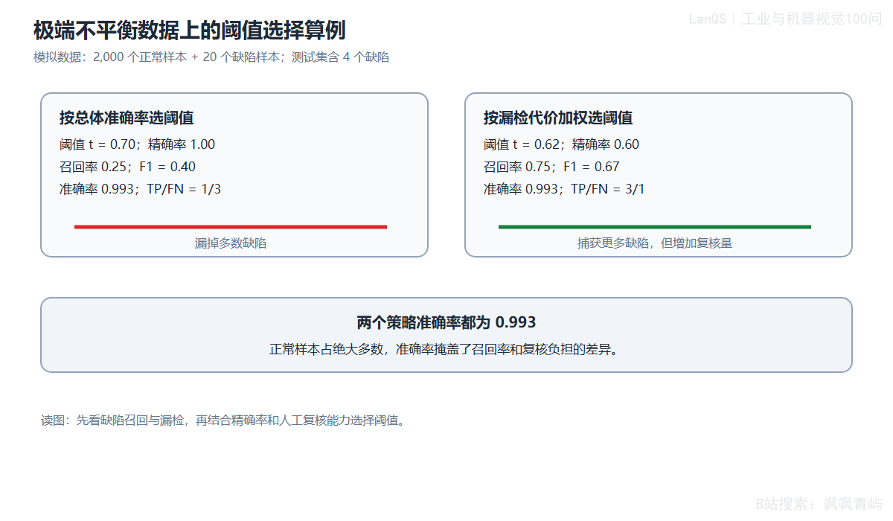

<p align="center">图89-2　极端不平衡数据上的阈值选择算例</p>

<div class="figure-note">图中的分数分布来自固定条件下的模拟，蓝色表示正常分数密度，红色表示缺陷分数密度，红色柱为了可见性按图中说明放大显示。左侧阈值 $0.70$ 追求总体准确率，测试集检出 1 个缺陷；右侧阈值 $0.62$ 按漏检成本选择，检出 3 个缺陷，但精确率从 1.00 降到 0.60。两侧准确率都为 0.993。该图用于说明阈值和指标的关系，不代表实际产线测量，实际阈值仍需在独立真实数据和复核容量约束下确定。</div>


极端不平衡很少由一个算法单独解决。较稳妥的路径是让不同层承担不同任务：早期用只需正常样本的异常检测做高召回粗筛，把疑似图像送入人工或二级模型复核；生产中积累的真实缺陷再用于训练监督分类器，逐步区分缺陷子类并减少误报。随着缺陷样本增加，可以重新训练监督模型，也可以按验证结果调整或替换早期粗筛层。

这条路径的关键是形成回流。每个新增缺陷都记录产品、批次、工位、成像条件、缺陷类型和复核结论，经过标注和独立验证后再进入训练集。数据层补充边界样本，训练层使用类别权重或 Focal Loss，推理层设置分级阈值，流程层提供人工复核或二级精度模型。高召回粗筛不等于最终放行判定，复核通道必须有明确容量。若每小时误报量超过人员或二级模型的处理能力，降低阈值就会破坏节拍。

图 89-1 的四层框架可以作为现场回流图来使用：数据层记录新增缺陷和边界正常样本，损失层和采样策略随样本结构调整，判定层按漏检成本重新设阈值，指标层持续记录少数类召回率及误报负担。四层都引用同一批次和同一版本号，才能追溯某次改动到底改变了什么。


自监督表征、对比学习、少样本学习、开放集识别和生成模型扩展，都在尝试减少人工缺陷标注的需求。它们适合研究跨产品复用、批次迁移和冷启动场景，但它们仍受采样质量、标注一致性、成像稳定性和验收标准限制。模型可以更高效地利用已有信息，却不能替代不存在的真实缺陷证据。

验证一个不平衡修复方案时，先按真实且唯一的缺陷实例划分数据，再运行过采样、SMOTE 或图像增强。留出集保持 100% 真实且未经增强，最好来自不同日期、批次或光照条件。至少分别记录内部留出批次和后续真实产线数据的召回率、精确率、F1、PR 曲线及误报负担；每批新确认缺陷到达后重新评估。只看缺陷召回会掩盖正常样本被大量误报的问题，因而还要跟踪多数类精度和人工复核量。

### 常见误区

- 用总体准确率评价极端不平衡分类，让“全部判正常”的模型看起来可靠。
- 只有几张真实缺陷图时大量复制或使用 SMOTE，把近似副本的验证结果当成泛化能力。
- 先过采样再随机拆分，使同一真实缺陷的衍生图像同时进入训练和验证。
- 使用类别权重或 Focal Loss 后不检查精确率、误报率和复核负担。
- 缺陷数为零时强行训练监督分类器，忽略只用正常样本的异常检测路径。
- 降低阈值提高召回率，却没有安排人工复核、二级模型或节拍预算。
- 把异常分数、插值特征或合成缺陷直接解释为真实物理缺陷。

### 术语与符号表

| 术语或符号 | 含义 |
| --- | --- |
| 类别不平衡 | 不同类别样本数量差异很大，通常正常类远多于缺陷类 |
| 过采样 / 欠采样 | 增加少数类训练出现次数，或减少多数类训练样本 |
| SMOTE | 在少数类特征点之间插值生成合成样本的方法 |
| Focal Loss | 降低容易分类样本损失贡献、突出困难样本的损失函数 |
| 精确率 $P$ | 被判为缺陷的样本中真正缺陷的比例 |
| 召回率 $R$ | 所有真实缺陷中被检出的比例 |
| F1 | 精确率和召回率的调和平均 |
| PR 曲线 | 随阈值变化展示精确率和召回率关系的曲线 |
| OpenVINO | 用于模型推理优化和部署的工具套件 |
| Anomalib | 封装多种工业异常检测算法和部署接口的工具库 |
| PatchCore、PaDiM、STFPM、DRAEM | 工业异常检测方法名称 |
| TP、FP、FN、TN | 真正例、假正例、假负例、真负例 |
| $p_t$ | 模型对真实类别的预测概率 |
| $\alpha_t$ | Focal Loss 中的类别平衡权重 |
| $\gamma$ | 控制容易样本抑制程度的聚焦参数 |
| $t$ | 将异常分数转换为缺陷或正常判定的阈值 |

### 延伸阅读

- Lin 等：《Focal Loss for Dense Object Detection》，ICCV 2017。
- Chawla 等：《SMOTE: Synthetic Minority Over-sampling Technique》，Journal of Artificial Intelligence Research，16，321 至 357 页，2002 年。
- Roth 等：《Towards Total Recall in Industrial Anomaly Detection》，CVPR 2022。
- OpenVINO Toolkit 的 Anomalib 公开文档和代码，用于了解工业异常检测模型的训练、推理与部署接口。

---

---

# 第90问　传统算法和深度学习都能解决问题时，如何选择技术路线？

视觉项目开始时，阈值、边缘和连通域可能已经能完成一部分判定，深度学习又可能在复杂纹理上表现更好。现场最终要承担的是漏检、误报、节拍、算力、数据采集和后续维护，路线比较应围绕这些约束展开。本题从任务定义、数据、性能边界、部署环境、调试维护和混合架构几个方面比较路线。系统约束包括目标缺陷的最小尺寸、背景和光照变化、产品姿态、误报与漏检代价、单位产品允许时间以及模型或规则的维护能力。

> 核心判断：技术路线没有脱离约束的固定排名。稳定且能够写成明确规则的场景，应先验证传统视觉；规则难以穷举、变化持续增加且真实数据充足时，深度学习更值得投入；两边分别擅长不同环节时，应把混合流程作为独立方案进行原型验证。

### 问题定义与可行性验证

“检测缺陷”这一说法还不足以作为可执行的任务定义。工程人员需要说明目标是亮斑、暗斑、裂纹、边缘破损还是纹理异常，目标与背景的差异主要来自灰度、形状还是纹理，最小缺陷尺寸是多少，产品姿态是否稳定，背景和光照怎样变化，以及产品是否频繁换型。还要记录误报和漏检的相对代价、产线节拍与推理设备位置。没有这些量，路线比较只能停留在偏好层面。

传统算法（traditional computer vision）是把阈值、边缘、连通域、模板匹配或几何约束明确写入图像处理流程。Blob 分析是其中常见的一类，它把二值图或分割图中的相邻像素区域识别为对象，再按面积、形状和位置筛选。深度学习（deep learning）则通过训练网络参数，从样本中学习图像特征和判定边界。两者都在处理图像，区别在于主要由人工写出判定知识，还是由数据训练出判定边界。

任务描述越具体，越容易找到可验证的起点。固定孔位是否存在，可以测量孔区域的面积、圆度和中心位置；织物纹理缺陷可能同时涉及方向、局部纹理和缺陷类别组合，难以用少量阈值穷举。定义时应加入最差光照、容差边界、背景干扰和工件位置误差，不能只拿一张理想图比较算法。

这些条件最好写成验收前的测量表。例如，最小缺陷尺寸要对应到像素或物理长度，姿态变化要记录平移、旋转和高度范围，光照变化要记录图像灰度或照度的范围，节拍要分配给采集、传输、预处理、推理、后处理和通信。误报和漏检也应对应具体动作：误报是否进入人工复核，漏检是否可能造成批量放行。这样，路线选择针对的是一组可复测的约束，不再依赖模糊的“场景复杂”。


传统算法依赖较强的场景先验。当目标与背景的差异稳定，并且能够用阈值、边缘、连通域、模板或几何关系表达时，少量样本也可以支撑一个可解释的方案。它的优势来自约束清楚和调试路径短，并不意味着样本越少就一定更合适。只要现场变化超出规则假设，性能可能快速下降。

深度学习更依赖数据覆盖，适合复杂纹理、模糊边界、姿态变化和多缺陷类别。样本数量、标注一致性和真实工况覆盖必须同时满足。即使图像很多，如果没有覆盖夜班光照、材料批次、边界缺陷和产品变体，模型仍可能只是在训练分布内表现良好。

在承诺大规模开发前，可以并行做两个限时检查。传统路线取 $20$ 至 $50$ 张代表性图像，加入最差光照、容差边界和背景干扰，用阈值、边缘或 Blob 流程尝试得到稳定参数。如果同一组参数在困难样本上仍接近要求，这是规则路线的低成本证据。深度学习路线则估算未来 $4$ 至 $8$ 周内能够获得多少目标类标注图像，以及每张图的标注成本。缺陷边界越模糊，保持标注一致性越难；一个需要 $5000$ 张标注图才有优势的模型，如果交付周期内只能获得 $200$ 张，就不一定是更现实的选择。

比较这两个小型验证暴露出的失败模式和真实数据获取成本，比直接搬用公开基准准确率更有依据。传统概念验证应记录规则在哪些条件下失效，深度学习评估则应记录可获得的数据是否覆盖这些失败条件。

传统概念验证不应只保存最终的合格或不合格结果，还要保存每一步的中间图和参数范围。若阈值在同一批图上可以调到合格，却对光照轻微变化非常敏感，说明规则的稳定性不足。深度学习的早期评估也要按产品变体、批次和困难样本分层，确认高分是否只是由大量容易的正常图贡献出来。两种路线使用同一批困难样本和同一套验收指标，比较才有意义。

### 性能、部署与生命周期

在背景干净、姿态固定、目标对比度稳定的场景中，传统算法可以提供低延迟、可复现和易解释的判定。工程人员能够依次查看阈值图、边缘图、连通域面积和位置条件，定位是哪一条规则触发了误判。它的边界也很明确：当光照、表面、姿态或缺陷形态超出规则假设时，性能可能突然下降；继续增加规则还可能引入相互冲突的条件。

深度学习面对复杂纹理和多种变化时通常有更高的泛化潜力，但结果依赖训练数据、标注、模型权重和推理阈值。模型对未见过的输入可能安静地给出错误结果，排查需要沿样本分布、标注规则、训练配置和推理环境逐层检查。更高的性能上限伴随着更长的调试路径和更高的数据要求。

比较时应分别查看困难样本召回率、误报率、边界样本表现和节拍。若项目最难承受的是偶发且难解释的错误，规则方法的可追踪性可能更重要；若缺陷变化不断增加，且无法逐条写成规则，深度学习的上限可能更有价值。两种方法只是承担不同的风险：传统方法可能在假设外突然失效，深度学习可能在陌生输入上给出难以追溯的错误。验收条件应明确项目更难承受哪一种失败。


传统算法通常占用较少计算资源，适合工业计算机、边缘设备或功耗受限平台。深度学习常需要 GPU 或专用推理加速器，并且更容易受到驱动、运行时版本、模型格式和内存的影响。产线节拍（takt time）是为满足产量要求，单位产品允许的最大周期时间。若图像传输、预处理、推理和后处理的总时间超过节拍，离线精度优势不能直接转化为产线收益。

部署位置也会改变方案。相机旁的边缘设备可能没有 GPU，中心服务器则要承担网络传输、缓存和断网行为。维护团队不熟悉 AI 运行时，也会使模型升级和故障回退变得更贵。反过来，如果现场具备 GPU，数据管线稳定，模型版本流程成熟，深度学习在复杂任务中的收益更容易落地。

原型阶段就应测量完整链路的平均延迟和尾部延迟、峰值内存、功耗、丢帧或超时行为以及故障恢复。只测模型在开发机上的单次推理时间，不能代替在线系统测试。

节拍预算还要考虑并发和等待。深度模型单次推理时间低于节拍，并不代表多相机同时到图时不会排队；网络部署还要把图像传输和服务重启时间纳入预算。传统流程也可能因大图、复杂模板或异常分支超时。原型验收应使用连续图像流和最差输入，记录 P95 或 P99 延迟、缓存长度和超时后的处理策略。


传统流程的中间结果通常可以按阶段可视化。阈值选错、Blob 面积范围过窄、边缘提取受噪声影响，都能沿着处理链检查。深度学习的调试重点转向数据分布、标注标准、增强策略、模型权重和推理阈值；热力图或注意力图可以提供排查线索，但不能自动证明某个物理缺陷原因。

两类方案都需要版本控制，只是需要保存的对象不同。传统路线至少要固定规则参数、相机和光学条件、软件版本与测试样本；深度学习还要记录训练数据版本、标注版本、增强配置、模型权重、推理运行时和硬件。上线后保存输入图像、模型输出、人工复核、阈值和回退版本，才能判断性能变化来自产品、成像还是软件更新。

路线选择也决定了长期维护由谁承担。如果本地团队可以快速调整规则，却没有重新训练和验证模型的能力，深度学习系统的维护风险可能被低估。如果产品变化频繁，规则参数已经失去可管理性，建立数据和模型生命周期管理又可能比继续堆叠规则更合理。

### 结构化选择与持续复评

许多项目不需要让一种方法承担整幅图像的全部任务。可以先用传统算法完成 ROI（Region of Interest，感兴趣区域）定位、几何分割、明显正常样本过滤或安全边界检查，再把剩余的疑似区域交给深度学习做复杂分类。也可以先用深度模型判断表面类别，再用几何规则检查尺寸、位置和装配逻辑。

这种流程把能够写清楚的部分交给规则，把难以穷举的部分交给模型。螺钉是否存在、装配位置是否偏移、字符区域在哪里，常可以先通过几何或模板找到。深度模型只处理定位后的困难区域，计算量、误报范围和所需训练数据都有机会减少。

混合方案仍需定义接口和错误传播。第一阶段漏掉目标时，第二阶段无法补救；第一阶段范围过宽，会增加模型负载；坐标系、置信度和异常状态也要统一。验收时应分别测量第一阶段召回率、第二阶段判定性能、级联错误传播和整体节拍。把两种算法串联起来，本身不构成可靠性证明。

一个可执行的接口至少要约定 ROI 坐标相对于哪一幅图、裁剪是否包含边缘余量、第一阶段没有找到目标时输出什么状态，以及第二阶段超时后由谁接管。测试时可以分别构造“第一阶段正确定位、第一阶段误定位、第一阶段漏定位和第二阶段超时”四类输入，检查系统是否产生可追溯的结果。若第一阶段只筛掉明显正常样本，必须测量它是否误删了低对比度缺陷；若第一阶段做几何定位，还要测量定位误差对第二阶段分类的影响。


路线选择可以围绕四个问题推进：目标是否能由稳定规则描述，样本量和变化覆盖是否支持训练，节拍与算力是否允许较重推理，维护团队是否具备相应的生命周期能力。前两个问题明显支持规则时，应先做传统算法概念验证；问题结构复杂且数据条件成熟时，优先做深度学习原型；两边都有优势时，直接比较混合原型通常比继续进行抽象争论更快。

图 90-1 用场景复杂度和数据多样性表示横向变化，用部署与维护成本表示纵向约束，展示三种路线的大致适用区域。读图时要把坐标理解为约束组合，图中的区域不构成固定分界线：左下区域通常具有稳定规则、样本少和算力紧张的条件；右上区域通常具有复杂模式、变化大和数据充分的条件；中间区域值得考察混合流程。

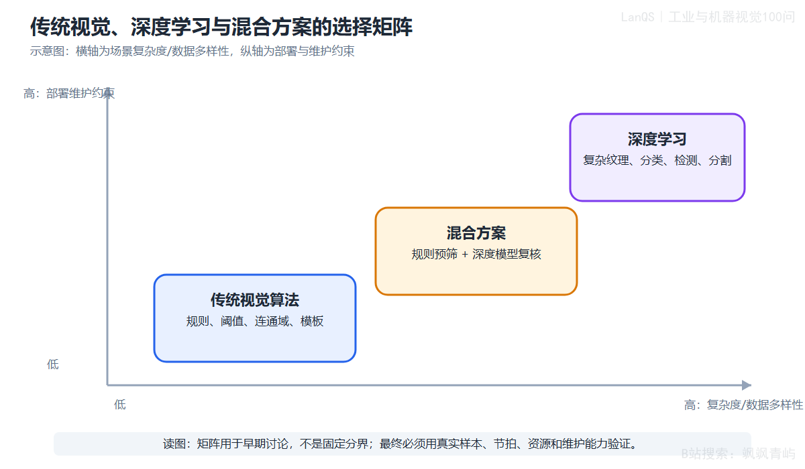

<p align="center">图90-1　传统视觉、深度学习与混合方案的选择矩阵</p>

<div class="figure-note">横轴向右表示场景复杂度和数据多样性增加，纵轴向上表示部署与维护约束增加。传统视觉、混合方案和深度学习在图中的位置用于组织早期讨论，区域之间并非不可跨越。最终仍需用真实样本、在线节拍、资源占用和维护流程验证。灰度打印时，应结合坐标文字和区域标签阅读，不能只依赖颜色。</div>

为了让团队讨论可追踪，可以在数据适配性、准确率上限、可解释性、部署成本和可扩展性等维度评分。候选方案的加权总分定义为

$$
S=\sum_{k=1}^{m}w_k s_k
\tag{90-1}
$$

其中，$w_k$ 是第 $k$ 个评价维度的重要性权重，满足 $\sum_{k=1}^{m}w_k=1$；$s_k$ 是候选方案在该维度上的子评分。若子评分统一采用 $0$ 到 $10$，且每个权重非负，则 $S$ 也在 $0$ 到 $10$ 之间。部署成本在本算例中采用反向评分，分数越高表示部署成本越低，避免把“成本高”误读为“得分高”。

公式的作用是把假设写出来，不能将工程判断变成客观裁决。若权重来自印象，子评分没有真实样本、节拍测试或成本估算支撑，$S$ 只是把原有偏好编码成数字。重新收集数据后应更新子评分，重新计算的结果才有比较意义。

评分维度可以与证据绑定：数据适配性来自真实样本覆盖表，准确率上限来自统一测试集，可解释性来自中间结果和故障定位时间，部署成本收益来自硬件、运行时和维护工时估算，可扩展性来自新增产品或缺陷类别的改造量。若某个维度无法提供证据，应标记为待验证的假设，不宜给出看似精确的高分。

#### 两个场景的加权评分算例

下面使用同一个公式比较两个场景，所有权重和子评分都是教学输入，不代表实际部署测量。五个维度依次为数据适配性、准确率上限、可解释性、部署成本收益和可扩展性。计算逻辑为：

~~~text
定义 score(weights, sub_scores) = sum(w * s)
检查所有权重之和为 1
场景 A：weights = [0.30, 0.15, 0.20, 0.20, 0.15]
        traditional = [9, 6, 9, 9, 7]
        deep_learning = [3, 7, 4, 3, 6]
场景 B：weights = [0.30, 0.25, 0.10, 0.15, 0.20]
        traditional = [3, 4, 8, 8, 5]
        deep_learning = [9, 9, 5, 5, 8]
分别计算每个方案的加权和并比较
~~~

场景 A 是固定孔位检查，样本少于 $200$ 张，几何关系稳定且规则容易描述。权重为

$$
\mathbf w_A=(0.30,0.15,0.20,0.20,0.15)
$$

传统算法子评分为 $\mathbf s_{\mathrm{trad},A}=(9,6,9,9,7)$，深度学习子评分为 $\mathbf s_{\mathrm{DL},A}=(3,7,4,3,6)$。代入公式：

$$
\begin{aligned}
S_{\mathrm{trad},A}
&=0.30\times9+0.15\times6+0.20\times9+0.20\times9+0.15\times7\\
&=2.70+0.90+1.80+1.80+1.05=8.25
\end{aligned}
$$

$$
\begin{aligned}
S_{\mathrm{DL},A}
&=0.30\times3+0.15\times7+0.20\times4+0.20\times3+0.15\times6\\
&=0.90+1.05+0.80+0.60+0.90=4.25
\end{aligned}
$$

在这组假设下，传统算法得分更高。分数较高来自数据适配、可解释性和部署成本收益，而任务本身又可以由规则描述。这个结果只对应当前输入；如果孔位姿态变得不稳定、样本规模增加，或传统概念验证暴露出复杂纹理问题，子评分就应改变。

场景 B 是织物纹理缺陷分类，标注图像超过 $2$ 万张，缺陷形态复杂。权重为

$$
\mathbf w_B=(0.30,0.25,0.10,0.15,0.20)
$$

传统算法子评分为 $\mathbf s_{\mathrm{trad},B}=(3,4,8,8,5)$，深度学习子评分为 $\mathbf s_{\mathrm{DL},B}=(9,9,5,5,8)$。代入得到

$$
\begin{aligned}
S_{\mathrm{trad},B}
&=0.30\times3+0.25\times4+0.10\times8+0.15\times8+0.20\times5\\
&=0.90+1.00+0.80+1.20+1.00=4.90
\end{aligned}
$$

$$
\begin{aligned}
S_{\mathrm{DL},B}
&=0.30\times9+0.25\times9+0.10\times5+0.15\times5+0.20\times8\\
&=2.70+2.25+0.50+0.75+1.60=7.80
\end{aligned}
$$

这里深度学习得分更高，原因是复杂纹理提高了性能上限要求，且已有较充足的数据支撑训练。两个场景使用同一个公式，但约束、权重和子评分不同。算例展示的是决策过程的透明性，不能替代真实原型和验收。

图 90-2 把两组输入和计算结果放在一起。读图时先检查每个场景的权重是否加总为 $1$，再对照五个子评分，最后查看加权总分。若子评分本身没有证据，小数位数并不意味着决策精度更高。

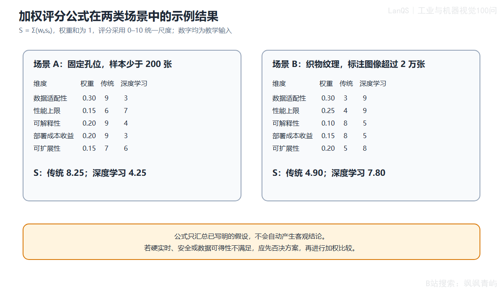

<p align="center">图90-2　加权评分公式在两类场景中的示例结果</p>

<div class="figure-note">场景 A 的加权结果为传统算法 8.25、深度学习 4.25；场景 B 的结果为传统算法 4.90、深度学习 7.80。图中数值用于展示权重与子评分如何影响推荐，不代表实测精度、成本或寿命。实际项目应把每个评分绑定到样本测试、节拍测量、资源估算和维护记录。</div>


规则清楚的亮斑检测、干净背景上的固定孔位检查和标准几何尺寸测量，通常可以从传统算法开始。稳定的光学条件下，阈值和连通域能够直接表达亮度、面积和位置约束，调试路径也较短。原型测试仍需加入光照、位置和材料变化，确认规则边界不会在现场突然失效。

多类别表面缺陷、织物纹理异常、木纹背景变化或焊缝外观分类，更适合优先做深度学习原型，因为模式组合和上下文关系难以逐条写入规则。前提是已有覆盖真实变化的标注数据，并且团队能够承担模型部署、更新和回退。

高速产线上只有少量困难样本时，混合方案常更平衡：规则先完成快速定位和明显正常区域筛选，深度模型再检查低置信度或疑似区域。要确认这条路线成立，必须测量级联后的整体召回率、误报量、节拍和接口异常，而不能只分别引用两个单模块的离线结果。


技术路线是部署时的状态，后续仍需根据缺陷、产品和资源变化重新评估。缺陷种类、产品组合、可用算力和维护团队能力都会变化。持续记录当前系统失败的样本，并按原因、产品、批次、成像条件和缺陷子类型标记。传统系统的漏检率可能暂时不变，但如果面对的缺陷子类型持续增加，规则覆盖范围也可能正在变窄。

当累计获得更多真实缺陷图像，或产品变化使原来的规则难以表达时，应重新执行原评分表，用更新后的数据适配性、准确率上限和维护成本子评分比较路线。触发条件可以在项目初期写明，例如当前规则在连续 $30$ 天窗口内的漏检率超过约定上限，或累计获得 $500$ 张以上经确认的缺陷图像。具体数值要由项目验收要求设定，不能在问题出现后临时决定。

重新评估时，在现有传统系统上增加深度学习二阶段检查，通常比整体替换更容易验证和回退。只有混合原型无法满足节拍、维护或精度要求时，才需要讨论整体替换。每次路线变化都应保存新旧版本、测试集、阈值、资源占用和回退办法。

### 常见误区

- 因为深度学习看起来更先进，就跳过当天可以完成的传统算法概念验证。
- 只比较公开基准或总体准确率，不比较困难样本、漏检、误报、节拍和数据获取成本。
- 把加权评分的结果当作客观裁决，忽略权重和子评分本身也是工程判断。
- 只计算开发期性能，不估算 GPU、驱动、运行时、升级、回退和维护成本。
- 认为混合方案天然可靠，不测试级联接口、第一阶段漏检和错误传播。
- 遇到现场问题后才临时决定何时重新评估技术路线。
- 忽略本地维护团队的模型调试、数据管理和重新训练能力。

### 术语与符号表

| 术语或符号 | 含义 |
| --- | --- |
| 传统视觉算法 | 由阈值、边缘、连通域、模板和几何约束等显式规则组成的处理流程 |
| 深度学习 | 通过训练网络参数学习图像特征和判定边界的方法 |
| Blob 分析 | 对二值或分割图像中的连通区域按面积、形状和位置进行识别与测量 |
| ROI | Region of Interest，感兴趣区域；限制处理范围以减少计算量和无关误报 |
| 概念验证（PoC） | 用小规模真实样本和限时实验检验路线能否满足要求 |
| 产线节拍（takt time） | 为满足产量要求，单位产品允许的最大周期时间 |
| 混合/分层流程 | 将传统视觉的定位或筛选与深度学习的复杂判定组合起来的架构 |
| 生命周期管理 | 对数据、规则或模型、部署环境、监控、升级和回退进行长期维护 |
| $w_k$ | 第 $k$ 个评价维度的权重，所有权重之和为 $1$ |
| $s_k$ | 候选方案在第 $k$ 个维度上的子评分 |
| $S$ | 各维度加权后的总分，本算例评分范围为 $0$ 到 $10$ |

### 延伸阅读

- Szeliski：《Computer Vision: Algorithms and Applications》。
- Steger、Ulrich 与 Wiedemann：《Machine Vision Algorithms and Applications》。
- 深度学习模型训练、工业边缘推理、生命周期管理和多指标决策相关资料。

---

# 第91问　除了 OpenCV，还应该了解哪些商业或开源视觉开发库（例如 HALCON、VisionPro、MIL 和 AForge.NET）？

在实验室里，读取一张图片、调用几个滤波函数就能得到结果；到了生产线，视觉程序还要接收相机触发，完成标定和测量，把检测结果送给控制系统，并在异常发生后留下可追溯的记录。本题讨论的视觉开发库，范围是围绕这条完整链路组织起来的软件平台和算法组件。读者需要同时考虑任务能力、设备接口、调试方式、运行稳定性、授权模式和长期维护责任，才能理解 HALCON、VisionPro、MIL、OpenCV 及其他开源项目为什么会形成不同的工程位置。

---

### 视觉库的分类与适用边界

图像处理库通常把图像视作像素数据。程序员读取像素数组，调用滤波、边缘、形态学或几何变换函数，再自行决定如何采集图像、如何标定、如何把像素结果换成物理尺寸，以及如何把检测结论送给 PLC（可编程逻辑控制器，Programmable Logic Controller）。这类库的优点是自由度高，基础算法容易组合；它的前提是使用者愿意自己承担系统拼装工作。

视觉开发库的组织方式更接近一套面向机器视觉任务的工具箱。它通常把图像采集、预处理、几何校正、特征提取、检测与识别、测量、通信输出和结果追溯放在相互关联的工作流中。标定、形状匹配、OCR（光学字符识别，Optical Character Recognition）、三维处理、缺陷检测和部署接口，往往都有成套的算子、样例和调试环境。这里的开发库不意味着所有环节都由一个软件包完成，但它至少提供了面向工程任务的抽象，使工程师可以围绕检测对象、精度和验收方法组织程序。

可以用一个现场例子区分两者。假设相机拍摄一个带有装配孔的金属件。通用库可以提供灰度化、边缘提取、轮廓拟合和模板匹配；工程师仍要处理相机驱动、曝光变化、工件旋转、孔的实际坐标、测量标定、超时、通信失败和异常样本。工业视觉库往往把其中一部分做成更高层的流程或工具，允许工程师在交互环境中检查 ROI（感兴趣区域，Region of Interest）、匹配分数、坐标变换和测量结果，再将稳定流程部署到运行节点。

库的差异还体现在设备兼容性、算法默认语义、调试器、文档、版本维护、运行时稳定性和技术支持上。一个算法在离线图片上能执行，只能说明计算步骤可以完成；生产系统还要回答相机断连时如何报警、输入尺寸变化时如何处理、结果是否带时间戳、软件升级后标定是否仍然有效等问题。选型时把这些问题纳入同一张约束表，才能避免把可调用的函数误认为完整设备交付能力。

完整链路中的每一步都有自己的输入和输出。采集阶段产生带有帧号和时间戳的图像，预处理阶段改变灰度、尺寸或坐标系，特征和检测阶段输出候选区域、分数或几何量，通信阶段把这些结果转换成设备信号。只要其中一个接口的坐标原点、数据类型或异常码没有定义，算法结果就可能在传到下游时失去意义。视觉开发库的工程价值，正是在这些环节之间提供较一致的对象、参数和调试方式；通用库则把更多决定权留给应用程序。

学生常把算法正确性和系统正确性看成同一件事。一个轮廓函数在固定图片上返回了边界，尚未说明相机的曝光是否稳定，也未说明工件移动后边界是否仍然对应同一物理特征。现场验证要把图像、坐标、判定和输出信号串起来检查，必要时保存原始帧和中间结果，才能定位是采集、标定、算法还是通信环节引入了偏差。


工业现场常见的商业平台包括 HALCON、VisionPro 和 Matrox Imaging Library（MIL）。HALCON 是 MVTec 的工业视觉软件平台，覆盖二维、三维、匹配、测量、深度学习和工业接口等多个方向。它适合复杂检测、精密测量，以及一个项目中同时包含多种视觉任务的场景。它的工程价值不只在于算法范围宽，还在于不同任务可以在相对一致的开发和调试环境中衔接起来。

VisionPro 属于 Cognex 的机器视觉软件生态，常见于条码读取、定位、装配确认和标准化工业检测。它的图形化配置和工厂部署经验，对需要快速交付的团队有吸引力。这种优势更容易在重复性高、设备型号相对固定、客户已有 Cognex 体系的项目中体现；如果项目需要大量自定义计算或跨供应商设备，仍要单独评估接口和扩展方式。

MIL 与 Matrox 的图像采集硬件联系较紧，适合高性能采集、视频流处理和需要专用采集板支持的系统。采集卡、驱动、图像缓冲、触发和处理流水线之间的配合，会直接影响吞吐和确定性。对于这类项目，单独比较某个边缘算子或模板匹配函数的速度意义有限，硬件路径、缓冲策略和驱动支持才是系统性能的一部分。

商业平台通常把开发环境、设备接口、样例工程、版本维护、部署许可和技术支持放在同一套交付体系中。对停机代价高、节拍要求严、客户验收责任清晰的项目，这种打包能力可以减少团队自行补齐基础设施的工作。付费不会自动保证算法结果合格，供应商支持也不能替代现场样本、成像条件和验收指标；它改变的是系统完整性由谁提供，以及问题出现时由谁参与解决。

商业平台之间也不应只按品牌比较。HALCON 的覆盖面适合混合任务，VisionPro 更容易融入 Cognex 设备和标准化流程，MIL 在采集硬件和视频流路径上更有针对性。项目要先判断瓶颈是算法开发、设备接入、实时传输还是售后责任，再看哪种平台能减少该环节的风险。若系统只需要一个简单的固定阈值，而团队已有稳定的采集框架，购买完整平台的额外能力可能并不能带来相应收益。


OpenCV（Open Source Computer Vision，开源计算机视觉库）仍是最常见的基础。它提供跨平台的图像处理、几何、特征、视频和部分机器学习能力，适合构建从实验脚本到定制服务的基础组件。它的开源属性降低了使用和分发门槛，也使工程师能直接检查接口和实现细节，但设备适配、异常处理、版本锁定和现场诊断通常需要项目团队自行建设。

Dlib 在检测、度量学习和部分传统视觉任务中具有代表性，也适合学习一个质量较高的 C++ 视觉库如何组织数据结构、模型和算法接口。scikit-image 面向科学图像处理和研究教学，算法表达清晰，适合验证图像处理思路。Open3D 面向点云和三维数据，适合三维重建、点云处理和几何分析。它们解决的问题不同，不能因为都能处理图像或几何数据，就把它们当作同一层次的替代品。

深度学习项目还会使用 Detectron2、MMDetection 和 Ultralytics YOLO（You Only Look Once，实时目标检测方法）等项目。它们更接近任务框架：提供数据格式、训练流程、网络配置、评估和推理接口；OpenCV、Dlib 或 scikit-image 则更像基础算法库。实际系统可以同时使用多层组件，例如用 OpenCV 接收和校正图像，用 Open3D 处理点云，用 PyTorch 训练模型，再把结果交给 C++ 服务完成通信。理解组件所处的层次，比记忆项目名称更有用。

开源生态对学习者的价值还在于可观察性。工程师可以看到数据如何进入函数、参数如何影响结果、异常如何传递，并根据项目需要组合不同模块。代价也很具体：相机驱动不兼容时没有统一责任方，某个版本升级破坏 ABI（应用二进制接口，Application Binary Interface）时需要团队定位，长期运行的内存泄漏和日志缺失也不会因为库是免费的就自行消失。开源减少的是许可门槛，不会消除工程工作量。

### 选型、分工与总拥有成本

选型应从任务和系统约束开始。先写清相机型号和接口、图像尺寸、触发方式、最小缺陷、节拍、可接受的误检漏检、目标操作系统、部署节点数量以及客户的维护责任，再把候选库放进这些条件中比较。这样可以避免把某库在公开示例中的表现直接推导成它适合当前产品。

若项目强调快速验证、预算有限、算法需要高度定制，而且团队有能力自行维护采集和部署，开源路线通常更灵活。若项目强调量产交付、客户验收、设备兼容、停机损失和售后响应，商业平台提供的工具链和支持可能更有价值。二者的差别在于系统完整性的成本由谁承担：商业库把更多能力预先封装进软件和服务，开源库把更大的组合自由度留给团队，同时也把补齐工作的责任留给团队。

候选库进入正式决策前，应使用目标产线自己的样本做概念验证（POC，Proof of Concept）。样本量可以先取 30 至 100 张，覆盖正常品、最小缺陷、最暗和最亮的光照、容易混入的背景、姿态偏差及现场已知失败样本。每条路线使用同一批输入、同一验收规则和同一台或同等级设备，记录算法结果、调参次数、单帧时间、内存、异常恢复和开发耗时。商业库通常需要申请限时评估许可；开源路线也应为试验安排真实工程日，不能把没有授权费当成试用成本为零。

评估表应把离线算法结果与系统交付结果分开记录。前者回答代表性图像是否达到检测指标，后者还要记录相机连接、标定、软件安装、升级、日志和故障恢复。一个库在算法评分上略低，但能稳定处理设备重启，可能比算法分数更高、却需要团队自行维护大量边缘情况的方案更适合量产。反过来，若任务高度定制，商业库的封装边界阻碍了必要控制，开源方案的额外工程投入也可能合理。

评审结果可以分成三张表。第一张记录成像条件、缺陷形态、精度、节拍和验收方法；第二张记录每个环节由哪个库、哪个设备接口和哪种算法负责；第三张记录授权、版本、支持、备机恢复和预计维护人力。三张表能够互相对应，方案才具备可以交接的边界。项目规模扩大后，还要重新计算许可和支持成本，因为单站点试验中的小差异可能在多站点部署时被放大。

POC 的输出不应只是一张通过或失败的截图。应保留每类样本的数量、误检和漏检、最差单帧时间、连续运行时的异常次数，以及工程师为达到结果所做的参数修改。若商业库和开源路线由不同熟练度的人员实现，还要标记学习时间和可复用代码，避免把个人经验差异误记成库的固有差异。测试结束后，团队应能指出哪些结论已经由样本支持，哪些仍需在真实设备上验证。

当项目包含多个工位时，复用率会改变选型结果。相似工位可以共享采集封装、标定流程和结果协议，开发时间不会严格按工位数线性增长；不同产品的光照、姿态和缺陷形态差异很大时，复用率会降低。许可证则可能按节点、并发数或产品数量增长。TCO 的成本项应结合预计复用率、实际站点数和备用设备数更新，不能把单站点算例机械放大。

图 91-1 把这套判断顺序画成一条从任务到交付的路径。阅读时先看左侧任务约束，再看中间候选路线，末端是两条路线共同面对的实现、部署和维护层。

<p align="center">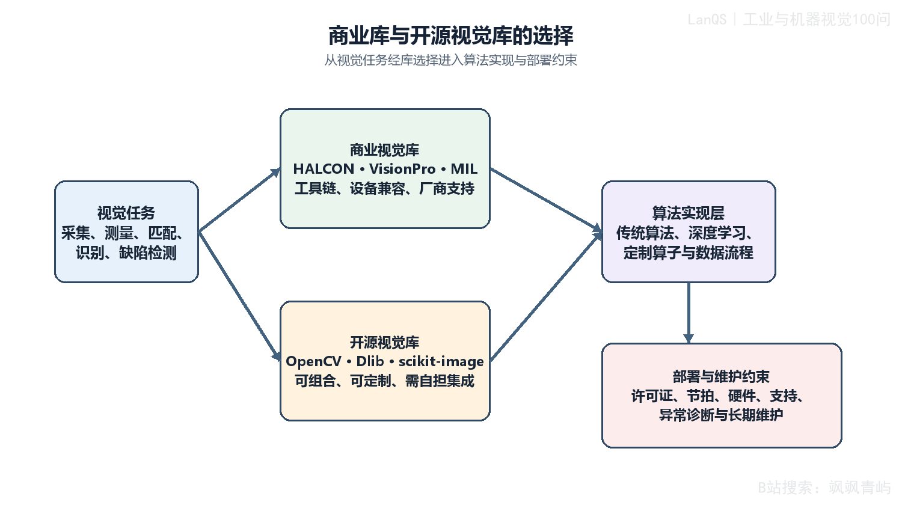</p>

<p align="center">图 91-1　商业库与开源视觉库的选择链</p>

<div class="figure-note">
图中商业库和开源库是两条候选路线，不存在固定的高低等级。两条路线都会进入算法实现层，并最终受到设备、操作系统、授权、版本、维护和售后约束。该图适合帮助读者建立选型框架，却不能代替具体型号、许可证条款和目标样本测试；这些内容必须结合客户现场单独确认。
</div>


传统视觉库擅长把图像变成可解释的几何和规则结果。阈值分割可以把前景从背景中分离，形态学可以清理小孔和毛刺，标定可以把像素坐标映射到工件坐标，匹配可以给出位置和姿态。深度学习框架擅长用数据学习外观模式，适合纹理变化大、缺陷形态难以用固定规则描述的分类、检测和分割任务。

两者经常出现在同一条流水线上。相机图像先由传统库完成采集、畸变或透视校正、ROI 裁剪和颜色处理，再送入 PyTorch 或 TensorFlow 训练的模型；模型输出的缺陷框、类别或分割区域返回后，系统仍可能使用传统几何和阈值规则完成尺寸判断、坐标换算、协议映射和结果上传。模型负责外观判断，传统工具负责确定的几何关系和设备交互，分工由任务特性决定。

深度学习的加入也不会自动解决成像问题。曝光不足、运动模糊、反光遮挡或标定漂移会降低输入质量，模型可能学到错误的背景线索；此时增加网络层数，往往不能替代光源、镜头和采集时序的改进。传统算法在测量、坐标变换、规则明确的定位和可解释验收方面仍有优势，成熟系统会按任务特性组合工具。

#### 总拥有成本比较算例

开发者很容易只看到商业库的许可费，或只看到开源库的零许可费。更完整的总拥有成本（TCO，Total Cost of Ownership）还包括开发集成、日常支持和维护。下面的模型用任意成本单位 kU（thousand cost units，千成本单位）演示比较方法；这些数值是教学假设，不能视为供应商报价或真实项目实测。

设开发人员每天的成本为 r_d，每年的支持成本按支持天数 d_s 和日成本 r_s 计算，项目周期为 Y 年。三年总成本可写成

$$
TCO=L+d_d r_d+Yd_s r_s
\tag{91-1}
$$

其中，L 是许可证和相关授权成本，d_d 是开发天数，r_d 的单位为 kU/天，d_s 是每年支持天数，r_s 的单位同样为 kU/天，Y 为年数。这个式子只把三类成本相加，适用于比较任务和成本口径相同的方案；它没有包含停机损失、培训、硬件和客户延期等更高层风险。

下面的代码把许可证、开发和支持三项分别返回。商业路线在 20 个工位时使用 0.7 的示例批量折扣，开源路线则把更多鲁棒性和现场支持工作放在团队内部。

~~~python
def tco(license_cost, dev_days, dev_rate,
        support_days_per_year, support_rate, years=3):
    dev_cost = dev_days * dev_rate
    support_cost = support_days_per_year * support_rate * years
    return license_cost, dev_cost, support_cost

commercial_small = tco(8, 15, 0.8, 3, 0.8)
commercial_multi = tco(8 * 20 * 0.7, 25, 0.8, 8, 0.8)
opensource_small = tco(0, 30, 0.8, 6, 0.8)
opensource_multi = tco(0, 55, 0.8, 25, 0.8)
~~~

单站点例子中，商业路线的许可证成本为 8 kU，开发成本为 15 × 0.8 = 12 kU，支持成本为 3 × 0.8 × 3 = 7.2 kU，合计 27.2 kU。开源路线没有许可证费，开发成本为 30 × 0.8 = 24 kU，支持成本为 6 × 0.8 × 3 = 14.4 kU，合计 38.4 kU。在这组假设下，省下的许可费不足以抵消额外的开发和支持时间。

20 个工位的例子中，商业路线的许可证成本为 8 × 20 × 0.7 = 112 kU，开发成本为 25 × 0.8 = 20 kU，支持成本为 8 × 0.8 × 3 = 19.2 kU，合计 151.2 kU。开源路线的开发成本为 55 × 0.8 = 44 kU，支持成本为 25 × 0.8 × 3 = 60 kU，合计 104 kU。随着工位数增加，商业许可费成为主要增量；开源路线的内部支持工作也随规模增长，但在这组假设下总额仍较低。

这个算例展示了成本项如何随项目规模变化，以及为什么零许可费不等于没有成本。它不能证明某种路线在所有项目中更便宜，因为日成本、重复利用率、批量折扣、支持条款和任务复杂度都会改变结果。实际评审还要把停机、迁移、客户验收延期和团队学习曲线纳入风险说明。

算例还可以作为敏感性分析的起点。例如，若团队把支持天数从每年 25 天降到 10 天，开源多工位路线的总额会下降；若商业许可没有 0.7 的批量折扣，商业多工位路线的总额会增加。这里的变化用于提醒评审者记录每个假设，并说明结论对哪个假设最敏感。只有把假设和数字分开，后续替换真实报价时才不会误解算例。

图 91-2 使用同一组假设，把四个总额画在一起。阅读时先比较单站点与多工位两组，再观察许可费、开发费和支持费的构成变化。

<p align="center">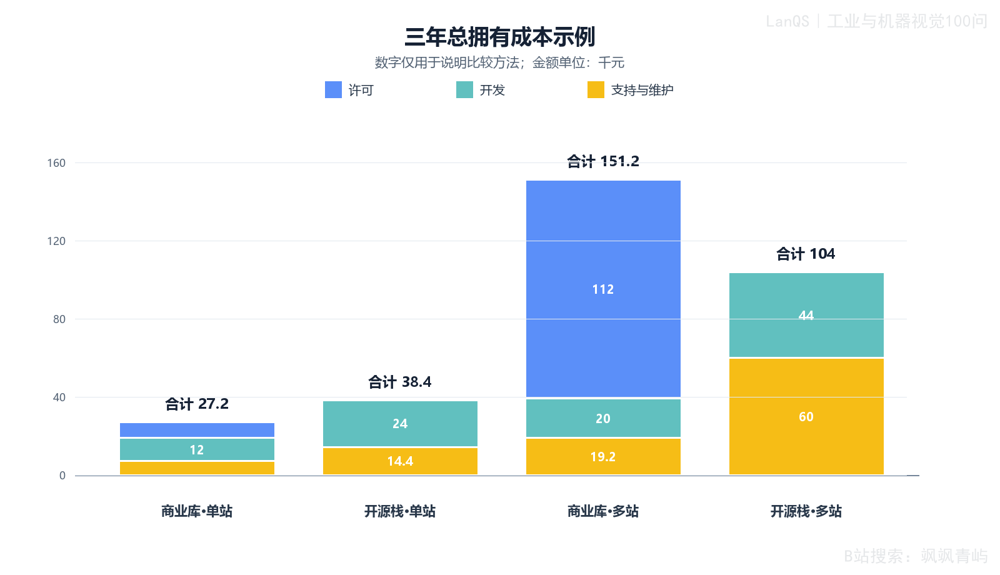</p>

<p align="center">图 91-2　三年总拥有成本的示例比较</p>

<div class="figure-note">
图中的 27.2、38.4、151.2 和 104 kU 对应上文的三年示例模型，属于示范数字，不构成供应商报价。单站点时开发和支持成本占比较大，多工位时商业路线的许可证成本显著增加。图示适合说明成本结构和规模效应，不能单独用于客户报价，也不能替代对授权条款、团队人力和停机风险的核算。
</div>

如果项目后来发现原库不合适，应比较剩余生命周期成本。迁移时要重新实现标定和检测逻辑，用旧系统的验收样本验证准确率，再培训维护人员，并重新确认客户签字流程。许多系统可以先迁移一个模块或一条低风险产线，以较小范围验证新库的设备适配和长期稳定性，再决定是否整体切换。

### 常见误区

- 把库的比较做成算子数量比赛。算法覆盖只是入口，设备适配、调试工具、授权和支持同样会决定交付难度。
- 把开源理解成零成本。开发、鲁棒性调优、驱动兼容、异常处理和长期维护仍然需要工程时间。
- 只用供应商演示图像做 POC。产品纹理、反光、缺陷形态和背景变化必须用目标现场的样本验证。
- 购买商业许可时不确认开发节点、运行节点、浮动授权、备机和升级条款。试点可用不代表多工位部署可以直接复制。
- 把深度学习框架当作传统视觉库的替代品。采集、标定、几何处理、测量和通信通常仍由传统工具承担。
- 在生产压力下临时切换库，却没有计算迁移和再验收成本。切换方案应先在低风险范围内做可回归验证。

### 术语与符号表

| 术语或符号 | 含义 |
| --- | --- |
| HALCON | MVTec 的商业机器视觉开发平台 |
| VisionPro | Cognex 的机器视觉软件平台 |
| MIL | Matrox Imaging Library，Matrox 的图像采集与视觉开发库 |
| OpenCV | Open Source Computer Vision，开源计算机视觉库 |
| OCR | Optical Character Recognition，光学字符识别 |
| ROI | Region of Interest，感兴趣区域 |
| POC | Proof of Concept，概念验证 |
| TCO | Total Cost of Ownership，总拥有成本 |
| 浮动授权 | 由许可服务器管理、可在多个节点间按并发数使用的授权方式 |
| 节点锁定 | 绑定到指定计算机或节点的授权方式 |
| L | 许可证与授权成本，单位为 kU |
| d_d、r_d | 开发天数与开发日成本 |
| d_s、r_s | 每年支持天数与支持日成本 |
| Y | 成本计算周期，本文算例取 3 年 |

### 延伸阅读

- MVTec HALCON 官方算子与部署文档，了解工业算子、设备接口和授权条款。
- Cognex VisionPro 官方文档，了解其工具链、设备生态和部署方式。
- Matrox Imaging Library 官方文档，了解采集硬件、视频流和图像处理接口。
- Steger、Ulrich、Wiedemann：《Machine Vision Algorithms and Applications》，作为厂商中立的工业视觉算法参考。
- Bradski、Kaehler：《Learning OpenCV》，学习开源视觉基础算法与工程实现。

---

---

# 第92问　HALCON 相比 OpenCV 有什么优势？许可证模式又该怎样理解？

HALCON 与 OpenCV 经常被放在同一张比较表中，但它们面对的读者和交付责任并不相同。HALCON 是面向工业应用的商业视觉平台，OpenCV 是开放、通用、可组合的计算机视觉基础库。工程师在选型时要同时回答四个问题：任务所需的算法能力是什么，设备集成要承担多少工作，开发与运行授权如何落地，以及三年生命周期的成本由谁支付。本问沿着这四个问题展开。

---

### HALCON 与 OpenCV 的能力边界

HALCON 的设计重点是工业交付。它把匹配、测量、OCR、标定、三维、缺陷检测和深度学习等能力放在同一套开发与部署环境中，并提供面向设备、调试和现场维护的工具。OpenCV 更接近通用基础设施，提供大量图像、几何和视频运算，便于跨平台使用、查看实现和与 Python 科学计算生态组合。

这一区别不等于某一个库在所有算法上都更强。学生在实验课或原型阶段，可能更看重源码可读性、零许可费用和算法定制；初级工程师进入量产项目后，则要面对触发、缓冲、标定、异常日志和批量复制。相同的算法调用在这两种环境中的工作量可能完全不同。

可以把差异拆成三个层次：算子层比较“能否完成某个运算”，工作流层比较“采集、标定、测量和调试能否自然衔接”，责任层比较“版本、设备和现场问题由谁负责”。只看第一层，很容易低估工业交付的隐性成本。


HALCON 的工业成熟度体现在算法与工程语义的连贯性。典型流程从采集开始，经过标定和坐标变换，选择 ROI（感兴趣区域，region of interest），再进入匹配、测量、OCR 或缺陷判断，最后把结果交给通信和追溯模块。高层接口往往同时规定对象类型、参数含义、评分和错误路径，样例工程也更接近现场任务。

以形状匹配为例，工程师关注的不是函数名称，而是旋转、缩放、遮挡、光照和背景变化时的行为。较高层的匹配工具可能已经包含多尺度搜索、姿态范围和评分语义；用 OpenCV 的低层函数组合相同流程时，候选生成、搜索策略、阈值标定和失败诊断往往需要自行实现。HALCON 由此节省的时间，集中在鲁棒性和工具链，而不只是少写几行代码。

这项优势有使用边界。良好的照明、稳定的相机触发和合理的容差仍然需要由工程师设计；最新研究模型、自定义算子和特殊训练策略也可能更适合 PyTorch 等开放生态。应在同一组难例上比较误检、漏检、耗时和调试路径，不能从品牌印象推断结果。


工业现场的时间经常消耗在核心算法之外：相机和采集卡驱动是否匹配，触发沿是否正确，帧是否丢失，缓冲区由谁拥有，标定文件是否对应当前镜头，重启后设备能否自动恢复。HALCON 的设备接口、示例和调试环境能够降低其中一部分组合工作；OpenCV 通常需要团队自行组合相机 SDK、线程模型、标定工具和错误处理。

设备兼容还涉及时间语义。相机触发、曝光结束、帧到达、算法开始和结果上传是不同事件。如果 SDK 只解决了“读到图像”，却没有明确时间戳和缓冲区所有权，仍可能发生错帧或重复处理。采购评估应使用实际相机连续触发，观察丢帧、重连、换机和进程重启，而不应只查看支持设备列表。

采购前应要求厂商书面确认以下内容：

- 授权是节点锁定（node-locked）还是浮动授权（floating）；
- 开发席位和运行/部署授权是否分开；
- 嵌入式产品、OEM（原始设备制造商）和客户转售的条款是什么；
- 升级与技术支持覆盖多长时间；
- 现场换机、备件机和隔离网络如何激活。


HALCON 集成了检测、分类和分割等常见深度学习流程，适合希望在相同环境中完成数据准备、模型导入、推理和结果集成的团队。对象、参数和调试路径统一时，问题可以沿着同一条链路定位，学习成本也更容易转化为可复用的工程模板。

OpenCV 可以承担前后处理和图像操作，并与 PyTorch、ONNX Runtime 或 TensorRT 配合。对于最新网络结构、自定义算子和研究代码，原生深度学习生态通常更容易跟进；代价是团队需要自行确认模型导出、输入语义、后端版本和设备组合。HALCON 适合缩短工业流程，开放框架适合保持研究自由，两种需求可以在一个系统中分层共存。

### 许可证、激活与生命周期

常见授权包括永久授权、租赁授权、试用/评估授权和学术授权。名称只说明合同形式，不能直接说明实际部署成本。评估表应把时间、使用对象、设备范围、产品形态和服务内容分别列出。

| 维度 | 需要确认的内容 |
| --- | --- |
| 时间 | 永久授权是否包含升级？租赁到期后能否继续运行已交付程序？ |
| 使用对象 | 授权只允许开发，还是包含运行时和部署？ |
| 设备范围 | 按节点、席位、并发用户、加密狗还是产品数量计费？ |
| 产品形态 | 客户现场、嵌入式设备、OEM 和备用机是否适用不同条款？ |
| 服务 | 技术支持、版本更新、补丁和故障响应是否单独收费？ |

开发人员能在工作站上调试，不代表同一授权可以放到生产线每个节点。多工位复制时，应把新增工位、备用机和验收环境都列入报价模型，并保留授权文件、版本和联系人信息。


授权可能通过加密狗、软件绑定、网络许可证服务器或其他激活方式实现。它们都会改变现场维护流程。加密狗损坏时能否快速替换，软件绑定是否受主板和硬盘变化影响，网络许可证是否要求生产线持续访问服务器，隔离网如何完成激活，客户换 PC 后重新授权需要多久，这些问题都应在上线前演练。

许可证恢复时间属于系统可用性。一次停线故障的损失可能高于开发阶段节省的费用，因此测试环境、生产环境和备件机应分别验证授权状态。网络许可证还要确认服务器的冗余、断网时的宽限时间和维护责任。


永久授权不等于永久免费升级。它可能只覆盖购买版本，后续的新操作系统、新相机驱动或新算法需要维护服务。租赁授权也不只是月度价格，还要问清到期后的运行权限、支持窗口、功能范围和数据迁移责任。

工程采购应画出至少三年的生命周期表，包含初始授权、运行节点、升级/维护、备件机、培训和迁移。表格还要标明责任边界：厂商可能负责软件缺陷和技术咨询，客户团队仍要负责照明、触发、业务判定和现场数据。开源社区可能活跃，却未必承诺特定版本的响应时间。


OpenCV 的开放许可证和跨平台生态降低了分发门槛，通常不需要为每个运行节点支付传统意义上的视觉算法许可证。团队可以检查源码、组合其他库，并针对特定任务修改流程。

开放授权把更多责任留给团队。可交付的 OpenCV 方案需要锁定编译器和依赖版本，封装相机适配器，记录每个算子的输入尺寸和坐标系，为关键流程建立离线回归图像，并将模型、配置和程序版本写入结果日志。这样可以把自由组合转化为内部平台，但不会自动获得商业库提供的设备支持。

下面的图把技术路线与商业约束放在同一个决策链中。

<p align="center">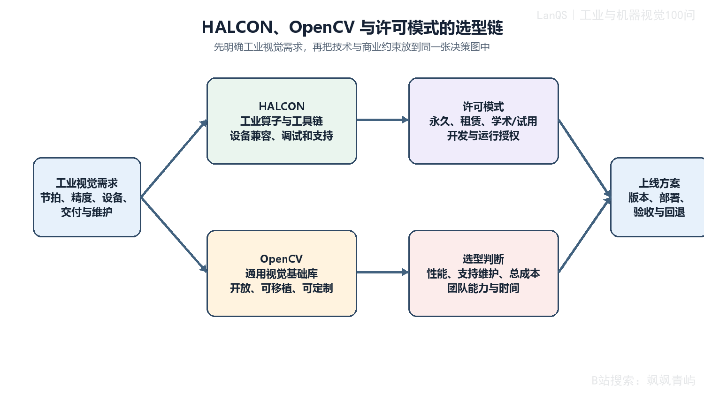</p>

<p align="center">图 92-1　HALCON、OpenCV 与许可模式的选型链</p>

左侧的工业需求同时进入 HALCON、OpenCV 和许可证评估，最后汇合到选型判断与上线方案。许可证模式不是算法路线的第三个分支，而是作用于两种路线的商业约束。读者应把性能、支持维护、总成本、团队能力和上线时间一起带入判断。

#### 开发时间比较算例

为了把“商业库能省时间”变成可以检查的假设，设定一个代表性匹配/斑点任务，并把工作拆为环境与 ROI/标定、核心匹配或斑点逻辑、光照和姿态鲁棒性调优、通信与 I/O 集成、文档与交接五个阶段。以下是一组示例工时：

~~~python
stages = ["环境与标定", "核心逻辑", "鲁棒性调优",
          "通信与 I/O", "文档与交接"]
halcon_hours = [4, 6, 6, 4, 2]
opencv_hours = [6, 10, 16, 6, 4]
assert len(stages) == len(halcon_hours) == len(opencv_hours)
print(sum(halcon_hours), sum(opencv_hours))  # 22, 42
~~~

| 阶段 | HALCON | OpenCV |
| --- | ---: | ---: |
| 环境与 ROI、标定 | 4 小时 | 6 小时 |
| 核心匹配/斑点逻辑 | 6 小时 | 10 小时 |
| 鲁棒性调优 | 6 小时 | 16 小时 |
| 通信与 I/O 集成 | 4 小时 | 6 小时 |
| 文档与交接 | 2 小时 | 4 小时 |
| 合计 | **22 小时** | **42 小时** |

OpenCV 路线比 HALCON 多 \(42-22=20\) 小时，约为 \(20/22\approx91\%\)。差异主要集中在鲁棒性调优，因为低层组件需要工程师自行搭建多尺度、姿态、光照和失败样本的处理。图 92-2 用堆叠柱显示这五段工作如何累积。

用普通百分数表达，这个差异约为 91%。该百分比只描述这组假设下的开发时间差，不表示任何团队或任何任务都必然存在相同差距。

<p align="center">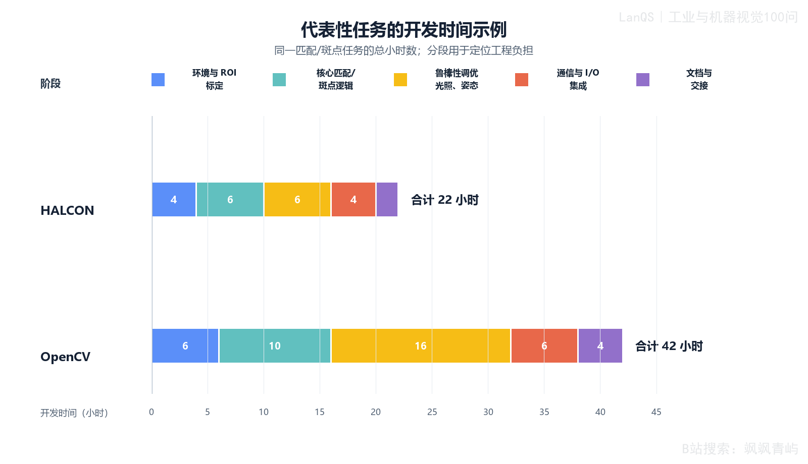</p>

<p align="center">图 92-2　代表性视觉任务的开发时间示例</p>

读图时先比较总高度，再看差异集中在哪一段。示例说明高层工具可能把鲁棒性工作封装进算子，但不能作为任何项目的报价，也不能证明 HALCON 的检测结果必然更准确。团队已有采集适配器和回归测试时，OpenCV 的工时可能下降；目标姿态更复杂时，调优差异又可能扩大。

商业库的生产力收益要和许可证增量放在一起比较。评估多站点项目时，统计所有工位节省的开发、调试和售后时间；再比较节点授权、升级和备件机的费用。团队对 HALCON、C++、Python 和采集 SDK 的熟练度也会改变结果。对于边界清晰的项目，部分迁移往往比整体换库更容易验证，例如保留稳定的采集和测量链，只替换性能瓶颈或定制模型。

选型评审可以安排一次小型现场演练。让两条路线使用同一批正常品和缺陷样本，连续触发实际相机，记录从曝光到结果上传的时间；再拔掉网络、重启进程、更换备用 PC，观察许可证、设备和日志能否恢复。演练的目的不是寻找一个抽象的冠军，而是找出交付责任最容易断开的环节。

对于初学者，可以把选型表理解为三张互相连接的表：第一张记录检测任务和成像条件，第二张记录库、设备和算法的实现方式，第三张记录授权、版本、支持和恢复流程。三张表能够对上，项目才具备可验收的边界；任何一张表缺失，后续成本都可能在现场才暴露。

把这三张表用于评审时，还要保持比较条件一致。相同的图像、相同的缺陷定义、相同的输出判定和相同的节拍要求，才能比较两条技术路线的差异；如果一条路线使用了已经调好的采集适配器，另一条路线还在处理相机连接问题，所得时间差就混入了基础设施差异。评审记录中应注明样本数量、失败样本、人工调参次数、开发者经验和测试机器，避免把一次顺利的演示误认为可复制的生产能力。

许可证也应当被当作系统边界的一部分记录。开发机能运行示例，只能说明开发授权和当前环境可用；生产机是否能在无网络条件下启动、备机能否接替、授权失效后是否有明确告警，都属于交付验收内容。对于需要长期运行的设备，最好在项目早期就做一次断网、换机和版本升级演练。这样暴露出来的往往不是算法问题，而是授权文件、安装包、驱动和运维手册之间没有形成闭环。

### 常见误区

**误区一：只比较算法数量或一次运行时间。** 采集、调试、授权和售后往往决定最终交付周期。

**误区二：把许可证报价当成完整成本。** 开发、运行、升级、备件机和支持条款可能分别计费。

**误区三：混淆节点锁定与浮动授权。** 两者对换机、并发和离线部署的影响不同。

**误区四：假定永久授权包含终身升级。** 版本、补丁和技术支持窗口必须单独确认。

**误区五：认为 OpenCV 不能用于工业项目。** 它可以成为可靠基础，但产品责任由团队承担得更多。

### 术语与符号表

| 术语 | 含义 |
| --- | --- |
| HALCON | MVTec 的商业机器视觉开发平台 |
| OpenCV | 开源、跨平台的计算机视觉基础库 |
| HDevelop | HALCON 配套的交互式开发与调试环境 |
| 形状匹配 | shape-based matching，利用几何形状特征定位目标的方法 |
| 节点锁定 | node-locked，许可证绑定到指定计算机或节点 |
| 浮动授权 | floating license，在许可服务器控制下由不同节点使用 |
| 运行时授权 | runtime/deployment license，使已开发程序在生产节点运行 |
| POC | 概念验证，用代表性样本验证方案可行性 |

### 延伸阅读

- MVTec HALCON 官方文档：算子参考、设备接口、HDevelop 与部署授权说明。
- OpenCV 官方文档及许可证说明。
- Steger、Ulrich、Wiedemann：《Machine Vision Algorithms and Applications》。
- Bradski、Kaehler：《Learning OpenCV》。

---

---

# 第93问　视觉开发应选 Python 还是 C++？两者在工业部署中的优缺点是什么？

视觉项目通常经历两个节奏不同的阶段：研究阶段需要快速读图、试验算法、分析数据和训练模型，生产阶段则要在固定硬件上持续接收图像、满足节拍、管理资源并处理异常。Python 和 C++ 的差异，正好对应这两种工作节奏。本问先说明两种语言在视觉链路中的角色，再讨论 Python 的运行时边界、C++ 的工程优势和代价，最后用一个延迟算例说明应如何根据热点测量，而不是凭语言印象决定重写。

---

### Python 与 C++ 的优势和代价

视觉程序一端连接数据和算法，另一端连接相机、采集卡、PLC（可编程逻辑控制器，programmable logic controller）和生产节拍。研发人员常常先用脚本验证图像是否包含足够信息，再把稳定算法放进长期运行的服务。若一开始就用生产级语言处理所有试验，迭代会变慢；若把实验脚本原样放进产线，资源、异常和设备控制又可能缺少边界。

语言选择应从任务约束开始：算法是否仍在变化，单帧延迟和尾部延迟是多少，是否需要直接调用硬件 SDK，系统内存是否有限，部署设备是否统一，以及维护人员是否能够长期修改和调试这套代码。语言本身只是实现手段，研发、验证和部署的责任边界才决定架构。


Python 的核心优势是试验速度和生态完整度。NumPy（Numerical Python，数值计算库）提供数组运算，OpenCV-Python 提供图像处理和采集接口，PyTorch、TensorFlow 等框架支持训练与推理，Pandas 和 Jupyter 便于整理样本、记录实验和可视化结果。这些工具可以在同一环境中串起来，工程师修改参数后很快就能看到新结果。

Python 还适合教学和离线分析。数组切片、绘图和数据表的表达方式较短，初学者更容易把注意力放在成像、特征和模型行为上。模型训练完成后，可以通过 ONNX（Open Neural Network Exchange，开放神经网络交换格式）或 TorchScript 将计算图交给其他运行时。

这里必须区分 Python 外层代码和被 Python 调用的执行后端。NumPy 和 OpenCV-Python 的大量数组运算实际在编译后的 C/C++ 实现中完成，Python 主要负责参数组织、流程控制和输入输出。如果热点已经位于这些后端，单纯把外层改成 C++，收益可能很小。


Python 的挑战来自解释器、运行时资源和设备集成。解释执行的逐像素循环通常比数组化操作慢，动态对象和垃圾回收会带来额外开销；依赖环境也需要冻结，否则 Python、NumPy、OpenCV 或深度学习框架的版本变化可能改变结果。长期运行服务还要考虑进程重启、内存增长、异常恢复和日志。

GIL（Global Interpreter Lock，全局解释器锁）是 CPython 中保护 Python 字节码执行的互斥机制。多个线程同时执行 Python 字节码时会受到它的限制；NumPy、OpenCV 等编译后端在解释器之外执行，情况不同。多线程是否有效，要看线程是否把时间花在可释放 GIL 的本地计算上，以及数据拷贝和锁竞争是否已经成为瓶颈。GIL 是运行时因素，不应单独作为语言选型结论。

工程上应先对真实管线做 profiling（性能剖析）。可以用 cProfile 观察函数级累计时间，需要逐行定位时使用 line_profiler；同时记录输入尺寸、线程数、相机格式和目标设备。若 95% 以上的总耗时已在 NumPy 或 OpenCV 的编译后端中，重写 Python 外层很难带来同等比例的收益。逐像素 Python 循环、热点循环中频繁创建对象或受 GIL 影响的字节码执行，才是更有力的重写线索。


C++ 能够提供较直接的内存、线程和资源控制，适合相机采集、缓冲区复用、设备通信和长时间运行的服务。固定类型和编译期检查有助于把一部分接口错误提前暴露；RAII（资源获取即初始化）和智能指针可以把文件、锁、设备句柄等资源的释放绑定到对象生命周期。

当产线需要稳定的低延迟和确定的尾部行为时，C++ 更容易建立有界队列、线程优先级、超时和回退路径。它也便于接入厂商提供的 C/C++ SDK、已有控制系统和高性能推理库。图像数据可以在预先分配的缓冲区中复用，减少频繁分配与复制。

这些优势依赖工程纪律。C++ 的内存越界、悬空指针、数据竞争和异常路径可能造成崩溃或隐蔽错误；编译、链接、跨平台打包和依赖管理也增加了开发成本。C++ 更适合生产约束明确的链路，不代表所有算法研究都应从一开始使用它。


C++ 的编辑—编译—运行周期通常比 Python 更长，模板、构建系统、ABI（应用二进制接口，application binary interface）和第三方依赖也提高了入门门槛。算法仍在频繁变化时，过早重写会造成两套实现不断同步，测试和验证时间可能超过优化收益。

调试方式也不同。Python 常用交互式环境快速检查数组和中间图像，C++ 则需要更明确的类型、生命周期和构建配置。若团队缺少 C++ 经验，短期性能收益可能被维护风险抵消。工程师应把重写对象限定在经过 profiling 确认的热点，保留一套容易验证的参考实现。

### 混合架构与延迟边界

较常见的结构是 Python 承担研究、训练、离线分析和部分工具链，C++ 承担逐帧推理、设备访问和实时服务。模型可以在 Python 中训练，再通过 ONNX、TorchScript 或其他中间格式交给 C++ 运行时；性能敏感的传统算法则可以写成 C++ 模块，由 Python 通过绑定调用。

混合架构的关键不在于两种语言各占多少代码，而在于边界是否稳定。边界应明确张量形状、数据类型、RGB/BGR 通道顺序、归一化、坐标系、时间戳、超时和错误码。完整帧或完整批次跨边界一次，通常比按像素或按中间步骤频繁往返更合理。若采用独立进程、共享内存或消息接口，还要定义队列满、服务重启和版本不匹配时的行为。

下面的流程图用于提出一个实际问题：哪些工作停留在研究侧，哪些工作必须受生产侧的时序和资源约束？

<p align="center">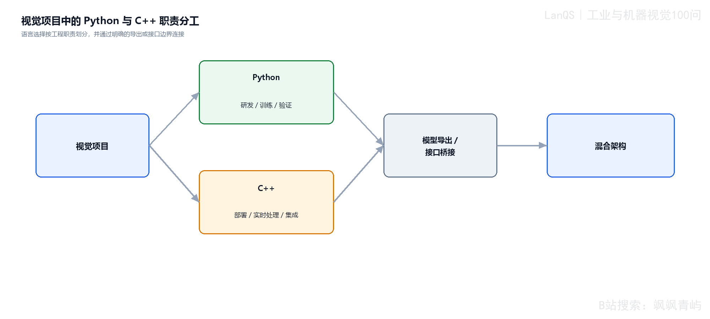</p>

<p align="center">图 93-1　Python 与 C++ 在视觉项目中的职责分工</p>

Python 路径和 C++ 路径分别代表研发迭代与生产控制，模型导出或接口桥接是两者之间的数据边界。读图时应检查边界上是否定义了输入格式、版本和失败处理；两种语言并不需要逐行对应。任务规模小、实时压力低时，单一语言也可能足够，图示结构不能替代实际节拍测试。

#### 延迟分解算例

“Python 很慢”只有在测量对象明确后才有意义。设一幅 1024×1024 的灰度图像依次执行高斯模糊、阈值分割和轮廓计数，比较三种实现方式的每帧时间。以下数值用于解释执行层次，单位为 ms/帧：

~~~python
implementations = [
    ("纯 Python（嵌套像素循环）", 1850.0),
    ("Python + 编译后端（NumPy / OpenCV-Python）", 8.4),
    ("纯 C++（OpenCV C++ API）", 6.1),
]

for name, t_ms in implementations:
    fps = 1000.0 / t_ms
    print(name, t_ms, "ms/帧", fps, "fps")

print("纯 Python相对Python+后端的减速倍数：", 1850.0 / 8.4)
print("Python+后端相对纯C++的延迟比：", 8.4 / 6.1)
~~~

帧率换算使用

$$
\mathrm{fps}=\frac{1000}{t_{\mathrm{ms}}}
\tag{93-1}
$$

其中 \(t_{\mathrm{ms}}\) 是每帧时间，单位为毫秒。纯 Python 实现为 1850.0 ms/帧，约 0.5 fps；Python 调用 NumPy/OpenCV 编译后端后为 8.4 ms/帧，约 119.0 fps；纯 C++ 为 6.1 ms/帧，约 163.9 fps。1850.0/8.4 约为 220，8.4/6.1 约为 1.38。

三组数字说明最大差距发生在逐像素解释执行与编译后端之间。若目标节拍要求 100 fps，8.4 ms 的 Python 后端路径在这个理想算例中已经超过单帧时间预算，6.1 ms 的 C++ 路径只多出有限余量；若还要叠加采集、拷贝、后处理和通信，则必须重新测端到端延迟。算例不能证明所有 Python 与 C++ 程序有固定的 220 倍差距，也不能替代真实相机和目标设备测试。

<p align="center">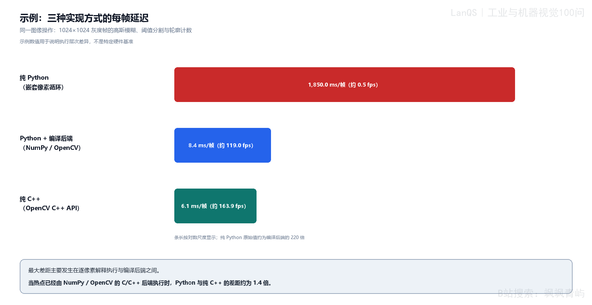</p>

<p align="center">图 93-2　纯 Python、Python 调用编译后端与纯 C++ 的示例每帧延迟</p>

三条横条采用对数尺度，使 1850 ms 与个位数毫秒能够同时显示；条长不能按线性比例读取。1850/8.4/6.1 ms 对应同一图像操作的实现层比较，适合用来定位 Python 层热点；它没有包含整条产线的采集、传输、排队和通信时间。

如果剖析显示热点在 Python 层，优先考虑向量化、批处理、减少对象创建，或只把热点函数移到 C++。如果热点在 NumPy、OpenCV 或推理引擎内部，先检查输入布局、内存复制、线程配置和后端参数，再决定是否迁移。

测量还要留意一次性开销和稳态开销。模型第一次加载可能包含文件读取、内存分配和后端编译，不能与连续运行的单帧时间混为一谈；相机采集和网络传输也可能在某些帧形成长尾。建议分别记录冷启动时间、预热时间、稳态分布、峰值内存和异常恢复时间，并把每次测试的图像尺寸、位深、线程数和设备写入日志。

对于教学和工程交接，Python 参考实现应保留一组固定输入和输出。C++ 模块每次改动都用这组数据回归，先确认结果一致，再比较延迟。这样可以把“重写后更快”拆成两个可回答的问题：结果是否仍然相同，以及节拍收益是否足以覆盖维护成本。

Profiling 的结果还应和系统时间线对应起来。函数报告中的耗时是某段代码的视角，产线关心的却是从触发、采集、拷贝、预处理、推理、后处理到结果上传的完整路径。一个函数即使只占总 CPU 时间的很小比例，也可能处在每帧必经的串行路径上；相反，一个占用较多时间的批处理步骤如果能与采集并行，未必直接决定端到端节拍。因此，优化前后应同时保留函数级报告和端到端时间戳，明确每个时间段的起止点。

跨语言接口也有自己的性能边界。若每个像素、每个候选框都在 Python 与 C++ 之间往返，调用次数、数据封送和内存所有权处理会抵消 C++ 内核的收益。更稳妥的接口通常以整幅图像、一个连续数组或一个批次作为输入，一次完成较大的工作单元，再返回结构化结果。接口设计还要约定数组布局、数据类型、生命周期和异常行为；否则同一段代码在开发机上可运行，换到长期运行的服务后仍可能出现复制、悬空引用或错误吞没。

部署语言的决定也不应在算法尚未稳定时一次性锁死。参考实现需要承担可读性和可验证性，生产实现需要承担资源上限、故障恢复和版本管理。两者可以共享测试样本、模型文件和结果协议，却不必强行共享全部内部代码。只要边界清楚，后续把单个热点替换为 C++ 扩展、独立服务或硬件推理后端，都能沿着同一套回归测试继续推进。

### 部署选择与接口设计

研究验证、教学、离线分析和内部工具通常更适合快速迭代的 Python；高速产线、资源受限的边缘设备、复杂设备控制或大规模复制项目，需要更严格地评估 C++。判断时应把单帧预算、p95/p99 尾部延迟、硬件资源、设备 SDK、团队能力和维护周期写入同一张约束表。

可采用分阶段路线：先用 Python 建立准确且可复核的参考实现，随后测量真实热点；只有当热点位于 Python 层且影响节拍或资源时，才迁移对应模块。算法仍在变化时，保留 Python 参考版本有助于和 C++ 结果做回归比较。实时链路稳定而上层逻辑仍需调整时，混合架构可以把变化隔离在边界一侧。


ONNX 适合传递模型计算图，TorchScript 和 LibTorch（PyTorch 的 C++ 前端与运行时库）适合保留 PyTorch 语义；pybind11 可为 C++ 函数创建 Python 绑定，适合把完整的性能敏感模块作为一次调用暴露；Cython 可将部分 Python 风格代码转换为可编译扩展，适合明确的小型热点。独立进程、共享内存、本地套接字和消息接口则把两个运行时隔离开，便于分别重启和部署。

桥接技术的选择取决于数据量、实时性、故障隔离和部署方式。绑定适合低延迟调用但要求处理 ABI、内存所有权和异常转换；独立进程隔离性更好，却要支付序列化、进程间通信和队列管理成本。无论选择哪一种方式，接口都应把张量形状、颜色通道、归一化、超时、版本和错误码写成契约。

### 常见误区

**误区一：按语言先进程度做选择。** 研发阶段和生产阶段的约束不同，语言应服务于可测量的需求。

**误区二：没有 profiling 就重写 C++。** 若耗时已在编译后端，外层重写的收益可能有限。

**误区三：忽略 GIL 的适用范围。** GIL 约束 Python 字节码线程，不等同于所有 NumPy、OpenCV 或推理后端都不能并行。

**误区四：让接口按像素频繁跨越。** 数据封送和锁竞争会重新引入解释器与通信开销。

**误区五：把 ONNX 或 TorchScript 当成无条件兼容的格式转换。** 自定义层、特殊控制流和不常见算子仍需验证。

### 术语与符号表

| 术语或符号 | 含义 |
| --- | --- |
| GIL | Global Interpreter Lock，全局解释器锁，限制 CPython 多线程同时执行 Python 字节码 |
| profiling | 性能剖析，测量函数、代码行或后端的时间与资源占用 |
| ONNX | Open Neural Network Exchange，开放神经网络交换格式 |
| TorchScript | PyTorch 的可序列化中间表示 |
| LibTorch | PyTorch 的 C++ 前端与运行时库 |
| pybind11 | 用于创建 Python/C++ 绑定的 C++ 库 |
| Cython | 将部分 Python 风格代码转换为可编译扩展的工具 |
| Hot path | 热点路径，程序运行时实际消耗大部分时间的部分 |
| \(t_{\mathrm{ms}}\) | 每帧处理时间，单位为 ms |
| fps | frames per second，帧/秒 |

### 延伸阅读

- Ramalho：《Fluent Python》。
- Meyers：《Effective Modern C++》。
- ONNX Runtime 官方文档，了解 Python 模型与 C++ 推理运行时的连接方式。
- pybind11 官方文档，了解 Python/C++ 绑定的内存与异常边界。

---

---

# 第94问　如何把 Python 训练的深度学习模型部署到 C++ 生产系统？

Python 训练环境适合反复试验数据、网络和超参数，C++ 生产系统则需要在固定硬件上持续接收相机图像、控制资源、满足节拍并处理异常。模型从训练环境进入产线，涉及的不只是文件格式转换，还包括输入预处理、算子兼容、动态形状、精度变化、后处理、设备 I/O、监控和版本回退。本问先比较几种部署路线，再通过一个数值一致性算例说明模型导出与生产正确性之间的距离。

---

### 从训练模型到 C++ 推理

训练程序经常需要读取数据集、分析样本、调整损失函数、查看错误案例和保存中间结果。Python 生态在这些工作上表达效率高，模型研究人员可以迅速改变网络和数据流程。产线服务却面对另一组约束：固定相机输入、确定的单帧预算、有限的 CPU/GPU/内存、PLC 通信、进程重启、日志留存和现场换机。

两个阶段的输入路径也可能不同。训练脚本读入的也许是已经归一化的 RGB 数组，而生产相机输出的是 BGR、不同位深和不同尺寸的图像。若预处理没有作为模型契约固定下来，即便权重文件相同，部署结果也可能变化。生产服务还要规定超时、重试、丢帧、报警和回退，不能只把 Python 的模型调用翻译成一行 C++ API。


第一条路线是导出为 ONNX（Open Neural Network Exchange，开放神经网络交换格式），再交给 ONNX Runtime、TensorRT 或 OpenVINO。ONNX 把训练框架和推理运行时隔开，便于跨平台和回归测试，但需要检查算子、动态形状、输入输出名称、前处理与后处理。

第二条路线是使用 PyTorch 的 TorchScript 和 LibTorch。TorchScript 是可序列化的 PyTorch 中间表示，LibTorch 是 PyTorch 的 C++ 前端与运行时库。这条路线较好地保持 PyTorch 的张量和算子语义，适合已有 PyTorch C++ 经验的团队；代价是运行时体积、依赖、编译配置和硬件中立性需要单独维护。

第三条路线是硬件定向优化。TensorRT 主要面向 NVIDIA GPU，OpenVINO 主要服务 Intel CPU、集成 GPU 及相关加速设备。它们可以做算子融合、低精度推理、内存规划和内核选择，获得更低延迟或更高吞吐；相应的构建、驱动、硬件和算子支持边界也更严格。

路线选择可以分两步。先用一个容易复核的运行时建立正确性基线，再测量目标硬件上的性能收益。这样可以保留问题定位的参照，不会在追求峰值速度时丢失可解释的输出。


ONNX 用模型图、权重和输入输出信息描述网络计算。典型流程是 Python 导出模型，检查图结构和输入输出维度，C++ 使用 ONNX Runtime 会话加载同一个文件并执行。模型文件、导出脚本、算子集版本和参考输入输出应一起保存。

ONNX 适合跨平台部署，也适合把模型转换和生产服务分开管理。它的边界包括自定义层、不常见算子、动态控制流、动态形状和不同版本的算子集。图能够被加载只说明格式可读，仍需检查每个输出的语义、坐标变换、后处理和数值容差。

### 推理运行时与转换风险

LibTorch 提供 C++ 前端和运行时，允许服务在不依赖 Python 解释器的情况下加载和执行相应的 PyTorch 表示。它对已经使用 PyTorch 的团队较自然，张量、设备和模块语义也比较连续。

部署时需要固定 LibTorch 版本、编译器、运行库和 CUDA 等依赖。运行时体积和依赖管理可能比轻量的推理后端复杂，设备迁移的便利性也不一定达到 ONNX 路线。LibTorch 保留 PyTorch 语义，却不会自动生成面向某个 GPU 的最优执行计划。


TensorRT 面向 NVIDIA GPU，可以融合网络层、选择 GPU 内核、规划显存，并使用 FP16 或 INT8 等精度模式降低计算和存储开销。固定模型、固定输入形状和固定 GPU 的系统，通常更容易从这些优化中获得稳定收益。

TensorRT 的执行计划具有硬件和版本边界。GPU 架构、驱动和 TensorRT 版本变化可能要求重新构建 engine，重建后还要重新做数值一致性和性能验证。若生产设备包含多个 GPU 型号，应该为各硬件配置保留构建记录和回归样本，并准备 ONNX Runtime 等基线或回退路径。

OpenVINO 也属于面向设备的路线，适合 Intel 工业 PC。它需要核对模型转换、算子支持、线程配置、精度模式和目标设备的 p95/p99 延迟。无论使用 TensorRT 还是 OpenVINO，性能结果都必须绑定具体设备和运行时版本。


算子不兼容会造成导出失败、子图拆分或运行时回退。处理时先列出模型算子和目标后端的支持情况，再决定替换网络、注册自定义算子或更换后端。

输入输出语义不一致更为常见。RGB/BGR 通道顺序、归一化范围、数据类型、填充、缩放插值、裁剪顺序和输出解码只要有一项不同，置信度和坐标都可能变化。NCHW 和 NHWC 也必须明确，不能依靠调用者猜测。

动态形状和批处理影响内存规划与延迟稳定性。工业系统常用固定尺寸和固定批大小来换取可预测节拍；若必须支持多种形状，应为每种形状建立回归和性能基线。FP32、FP16 和 INT8 的舍入与量化误差还可能改变阈值附近的判定，量化校准数据必须覆盖实际难例。

### 服务化部署与一致性验证

生产服务应把模型推理放入完整生命周期：初始化设备和模型，接收带时间戳的帧，执行与训练一致的预处理，完成推理和后处理，再把结果交给 PLC、机器人或上位机。缓冲区所有权、队列长度、超时、丢帧和错误码需要提前定义。

服务还应保留模型哈希、配置版本、输入尺寸、阈值、后端和设备信息。日志要能够关联到输入图像和输出结果，异常时既能报警，也能决定是否重试、切换基线后端或将当前产品标记为未知。摄像头触发到结果上传之间没有明确的超时和回退时，模型精度再高也可能阻塞产线。

下面的流程图把训练模型、导出层、运行时和生产服务放到同一条链路中。

<p align="center">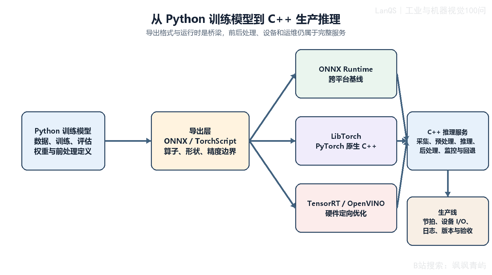</p>

<p align="center">图 94-1　从 Python 训练模型到 C++ 生产推理的流程</p>

Python 模型先经过 ONNX 或 TorchScript 导出，再进入 ONNX Runtime、LibTorch 或 TensorRT/OpenVINO，最后由 C++ 服务承接采集、预处理、推理、后处理、监控和回退。阅读时应把导出层看作数据与责任边界：模型文件、输入输出语义和前后处理必须一起版本化。三条路线的选择取决于算子、硬件和维护要求，图示不表示任何路线可以跳过一致性验证。

模型服务至少要有以下可观察指标：采集帧率和丢帧数、预处理时间、推理 p50/p95/p99、后处理时间、峰值内存、设备温度、错误码和回退次数。若服务使用异步队列，还要记录队列长度和帧等待时间，因为算法本身很快并不代表结果能够及时返回。

在 C++ 中可以把服务生命周期写成一个有限状态流程：启动时检查模型、配置和设备；运行时为每帧分配或复用带时间戳的缓冲区；超时或设备异常时进入降级状态；恢复成功后再回到正常运行。接口还要规定内存由谁拥有、推理调用是否阻塞、结果是否允许乱序返回，以及后处理失败时应返回什么错误码。初级工程师先画出这条状态链，往往比先优化某一个算子更能减少集成错误。

#### 导出结果一致性算例

用一个固定权重的简单线性模型说明检查流程。模型为 Linear(8→16) → ReLU → Linear(16→2)，其中 ReLU（修正线性单元，Rectified Linear Unit）是常见的非线性激活函数。输入批次为 N=200，输出共有 200×2=400 个元素。Python 先计算参考输出并导出 ONNX，再用 ONNX Runtime CPU 会话执行；该会话代表 C++ 中的同一运行时路径。

最大绝对差定义为：

$$
d_{\max}=\max_i\left|y_i^{(\mathrm{Python})}-y_i^{(\mathrm{runtime})}\right|
\tag{94-1}
$$

同时用下式判断每个元素是否超出容差：

$$
\left|a-b\right|\leq \mathrm{atol}+\mathrm{rtol}\left|b\right|
\tag{94-2}
$$

本例取 \(\mathrm{atol}=10^{-4}\)、\(\mathrm{rtol}=10^{-3}\)。可复核的步骤如下：

~~~python
model = Linear(8, 16, 2)       # 固定权重与偏置
X = fixed_input_batch(200, 8)
y_python = model(X)
export_onnx(model, "model.onnx")
check_onnx("model.onnx")       # 检查节点、名称和形状
y_runtime = onnxruntime_cpu("model.onnx", X)
compare(y_python, y_runtime, atol=1e-4, rtol=1e-3)
~~~

前处理一致时，最大绝对差为 0，超出容差的输出为 0/400，检查通过。这能证明给定模型、输入批次和运行时之间的数值相符，不能证明真实相机格式、动态形状、量化、GPU 后端、任务准确率和异常路径已经通过验收。

第二次实验保持模型文件不变，只把 C++ 侧输入改为 \(X'=255X\)，模拟忘记归一化。最大绝对差变为 \(1.131\times10^3\)，说明仅改变前处理就足以破坏一致性。

<p align="center">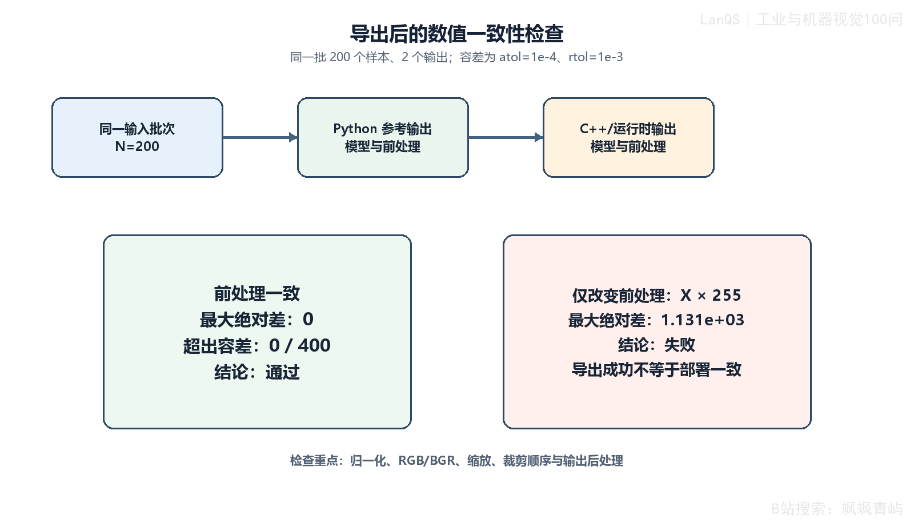</p>

<p align="center">图 94-2　导出模型的数值一致性检查</p>

左侧路径使用相同的 200 个样本和相同前处理，得到 0 差异与 0/400 超差；右侧只把输入缩放为 \(X\times255\)，最大绝对差跃升到 \(1.131\times10^3\)。读图时应先检查输入语义，再判断是否需要怀疑导出。该线性模型只是验证方法示例，不能代替目标网络在真实难例上的精度、延迟和资源测试。

实际验证应加入正常样本、最小缺陷、最暗/最亮、边界置信度和异常输入。检测任务要比较框坐标、置信度和 NMS（非极大值抑制）结果，测量任务要比较物理尺寸误差；平均绝对差很小，也不能保证阈值附近的业务判定相同。


模型版本应与导出参数、前处理配置、标签映射、阈值、运行时、驱动和硬件联合管理。发布前保存模型哈希、输入输出样例、算子检查报告和数值对照结果，发布后保留旧版本和回退开关。

后端优化要分阶段进行：先确认 ONNX Runtime 或 LibTorch 基线正确，再评估 TensorRT/OpenVINO 的 FP16、INT8、固定形状和图优化收益。每次改变后端、精度或驱动，都应重新检查难例、任务指标、p50/p95/p99、峰值内存和长时间稳定性。

服务实现中还要把模型计算和设备协作分开看。模型接口可以约定输入张量、输出张量和错误码，采集线程负责获取帧并附带时间戳，推理线程负责调用运行时，结果线程负责阈值判断、记录和通信。这样做的价值在于，模型替换不会悄悄改变相机触发或 PLC 通信的行为。队列长度、丢帧策略和超时处理也必须显式定义：当推理速度暂时低于采集速度时，系统是保留最新帧、等待全部帧，还是触发报警，三种选择对应不同的业务含义。

数值一致性检查最好分成三层。第一层比较固定输入下的逐元素输出，用来发现通道顺序、缩放和算子实现错误；第二层比较真实样本上的置信度、框、分割区域或测量值，用来发现数值微差对业务阈值的影响；第三层比较连续运行时的延迟、内存和异常恢复，用来确认服务行为。三层中任何一层失败，都不能用另一层的通过结果替代。尤其是量化和低精度推理，可能在平均误差不大的情况下改变少数边界样本的判定。

当转换工具报告警告时，应保留完整的导出日志、模型版本和运行时版本，并逐项确认警告是否涉及被执行的节点。若某个自定义算子被拆到 CPU，结果可能仍然正确，但延迟和内存路径已经改变；若某个算子被近似替换，速度提升也可能伴随任务指标下降。部署记录应把这类取舍写清楚，便于现场出现差异时回溯，而不是只保留一个最终模型文件。

### 常见误区

**误区一：导出成功就等于部署完成。** 导出只说明格式或图结构可处理，算子、输入语义、后处理和服务异常仍需验证。

**误区二：只比较平均推理时间。** 产线还关心尾部延迟、冷启动、峰值内存、温度和超时。

**误区三：忽略 RGB/BGR、归一化和缩放顺序。** 前处理差异是数值不一致的常见原因。

**误区四：把动态形状当成没有代价的灵活性。** 它可能削弱执行计划和延迟的确定性。

**误区五：把 TensorRT engine 当成通用永久文件。** 硬件、驱动和运行时变化可能要求重建。

### 术语与符号表

| 术语或符号 | 含义 |
| --- | --- |
| ONNX | Open Neural Network Exchange，开放神经网络交换格式 |
| ONNX Runtime | 执行 ONNX 模型的跨平台运行时 |
| LibTorch | PyTorch 的 C++ 前端与运行时库 |
| TorchScript | 可序列化的 PyTorch 中间表示 |
| 数值一致性 | 不同实现对同一输入的输出在规定容差内一致 |
| 算子兼容 | 模型算子及其版本、属性能否被目标后端正确执行 |
| 前处理 | 推理前的尺寸、通道、数据类型、归一化和裁剪步骤 |
| \(N\) | 输入批次大小，本例为 200 |
| \(d_{\max}\) | 输出元素的最大绝对差 |
| atol、rtol | 绝对误差和相对误差容差 |
| FP32/FP16/INT8 | 32 位浮点、16 位浮点和 8 位整数精度格式 |

### 延伸阅读

- ONNX 官方规范与 ONNX Runtime 官方文档。
- PyTorch、TorchScript 与 LibTorch 官方部署文档。
- NVIDIA TensorRT 官方开发者文档。
- Intel OpenVINO 官方文档。
- 项目内部的模型导出、输入语义、数值一致性和回滚测试记录。

---

---

# 第95问　TensorRT、OpenVINO 和 ONNX Runtime 分别是什么？在项目中各自扮演什么角色？

训练模型只是得到了一张计算图和一组权重，生产系统还要把它变成目标设备能够稳定执行的计划。TensorRT、OpenVINO 和 ONNX Runtime 都可以参与这一步，但它们服务的硬件、抽象层次和维护责任不同。理解三者的角色，有助于避免把某个后端的峰值性能误当成所有设备上的固定结论。本问先解释推理引擎的工作，再比较三类工具、评分方法、公平基准和多目标部署架构。

---

### 三类推理引擎的角色

推理引擎（inference engine）接收训练完成的模型和输入张量，执行网络计算并输出预测结果。它通常还会在加载或编译阶段进行常量折叠、算子融合、精度选择、内存复用和执行内核选择，目的是减少数据搬运、降低计算量并提高目标硬件利用率。

模型正确性和执行效率是两个层次。模型正确性要求输入语义、权重和输出解释符合训练定义；执行效率则关系到延迟、吞吐、内存、温度和功耗。推理引擎通常不负责相机触发、业务阈值、PLC 通信和日志回滚，这些仍属于完整视觉服务。

引擎输入是张量，产线输入却是带有时间戳、像素格式和设备状态的图像。颜色转换、缩放、归一化、内存拷贝和输出解码都会影响端到端时间。基准测试若只测引擎调用区间，不能直接代表从采集到结果上传的生产延迟。


TensorRT 是 NVIDIA GPU 生态中的推理优化与运行时组件。它可以融合网络层、选择 GPU 内核、规划显存，并使用 FP16 或 INT8 等精度模式降低计算和存储开销。固定模型、固定输入形状和固定 GPU 的系统，通常更容易获得低延迟或高吞吐。

TensorRT 的执行计划有明确的硬件边界。GPU 架构、驱动和 TensorRT 版本变化可能要求重新构建 engine，重建后还要重新做数值一致性和性能验证。多型号 GPU 项目应分别保存构建环境、日志和回归样本。


OpenVINO 是 Intel 的推理工具包，面向 CPU、集成 GPU 和部分 Intel 加速设备。它通过模型转换、计算图优化和目标设备执行，把通用模型映射到 Intel 工业 PC 的计算资源。

OpenVINO 适用于以 Intel CPU 为主、部署规模较大且希望使用统一工具链的场景。CPU 型号、核心数、内存带宽、线程亲和性和前处理方式都会改变实际结果，不能把一台开发机上的延迟直接复制到另一台工业 PC。模型转换、算子支持、精度模式和 p95/p99 延迟都需要实测。


ONNX Runtime 是执行 ONNX 模型的跨平台运行时。它可以使用 CPU 作为独立基线，也可以通过执行提供程序（execution provider，EP）把部分或全部计算交给 CUDA、TensorRT、OpenVINO 等后端。

ONNX Runtime 的价值有两层：一是提供相对统一、容易复核的跨平台参考路径，二是通过 EP 接入硬件加速。EP 可能只接管计算图中的一部分节点，剩余节点仍由 CPU 执行，设备间拷贝也可能抵消加速收益。因此测试时应记录图分区、未被接管的算子和数据拷贝情况。


三类工具没有固定的上下级关系。TensorRT 偏向 NVIDIA GPU 上的峰值性能，OpenVINO 偏向 Intel 设备上的实用部署，ONNX Runtime 偏向跨平台接口、基线和回退。它们都可能使用图优化、量化和内存规划，但目标硬件和维护方式不同。

| 维度 | TensorRT | OpenVINO | ONNX Runtime |
| --- | --- | --- | --- |
| 主要目标硬件 | NVIDIA GPU | Intel CPU/GPU 等 | 跨平台 CPU 及多种 EP |
| 优化方式 | 硬件定向的融合、精度和内核规划 | 面向 Intel 设备的图优化与执行 | 统一运行时接口，按 EP 调度 |
| 典型优势 | 固定 NVIDIA 设备上的峰值性能 | Intel 工业 PC 上的实用部署 | 可移植、基线和回退 |
| 主要边界 | GPU 架构、驱动和版本绑定 | 需核对 Intel 后端支持和性能 | 抽象层与分区可能带来额外开销 |

下面的关系图把模型图、后端适配、共同优化和部署收益连接起来。

<p align="center">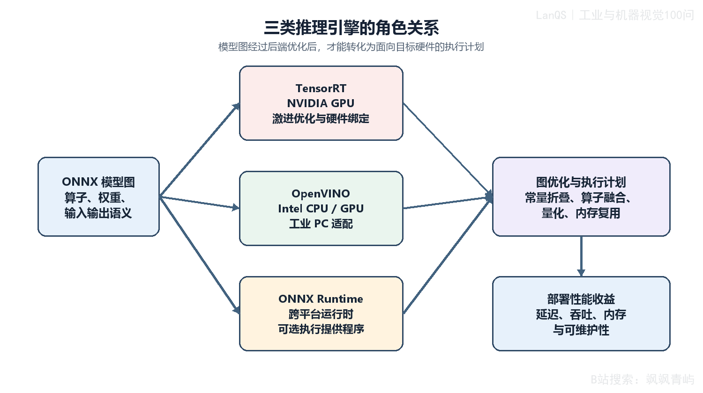</p>

<p align="center">图 95-1　三类推理引擎的角色关系</p>

三条路线都从 ONNX 模型图出发，经后端适配后进入图优化和执行计划，再体现为延迟、吞吐、内存和可维护性方面的变化。读图时应把性能收益理解为目标设备上的实测结果；量化和融合可能降低延迟，也可能带来精度漂移和构建依赖。图示说明角色关系，并不表示三者对所有模型都能互换。

### 选型、优化与公平验证

选型顺序应从硬件开始。确认 NVIDIA GPU 后，TensorRT 是性能候选；确认 Intel 工业 PC 后，OpenVINO 是性能候选；客户设备跨平台、型号会变化或需要长期回退时，ONNX Runtime 适合作为统一接口和基线。第二步才是比较维护、精度、构建和现场恢复成本。

服务层可以固定加载、推理、元数据读取和错误处理接口，再把每个引擎封装成后端。模型先导出一次 ONNX，记录输入输出语义；每个目标设备构建对应后端；每个后端都做数值一致性和性能回归；后端不可用或 engine 需要重建时，切换到 ONNX Runtime。回退时要同步固定模型版本、精度、阈值、延迟上限和告警行为。

#### 按硬件与目标加权的选型算例

为了把性能和可移植性分开评价，给每个引擎设定 1–5 分的基础评分。每个括号的前一个数是峰值性能 \(P\)，后一个数是可移植性 \(T\)：

| 场景 | TensorRT | OpenVINO | ONNX Runtime |
| --- | --- | --- | --- |
| NVIDIA GPU | (5, 1) | (1, 2) | (3, 5) |
| Intel CPU/iGPU | (1, 1) | (5, 2) | (3, 5) |
| 跨平台要求 | (4, 1) | (4, 1) | (3, 5) |

设性能权重为 \(w_p\)，可移植性权重为 \(w_t\)，且 \(w_p+w_t=1\)，总分为：

$$
S=w_pP+w_tT
\tag{95-1}
$$

性能优先采用 \((w_p,w_t)=(0.8,0.2)\)，可移植优先采用 \((0.2,0.8)\)。例如 NVIDIA 场景下，TensorRT 的性能优先分数是 \(0.8\times5+0.2\times1=4.2\)；ONNX Runtime 的可移植优先分数是 \(0.2\times3+0.8\times5=4.6\)。

完整计算结果如下：

| 硬件场景 | 权重 | TensorRT | OpenVINO | ONNX Runtime |
| --- | --- | ---: | ---: | ---: |
| NVIDIA | 性能优先 | 4.2 | 1.2 | 3.4 |
| NVIDIA | 可移植优先 | 1.8 | 1.8 | 4.6 |
| Intel | 性能优先 | 1.0 | 4.4 | 3.4 |
| Intel | 可移植优先 | 1.0 | 2.6 | 4.6 |
| 跨平台 | 性能优先 | 3.4 | 3.4 | 3.4 |
| 跨平台 | 可移植优先 | 1.4 | 1.4 | 4.6 |

这组数据可用以下步骤复核：

~~~python
def score(engine, w_perf, w_port):
    return (w_perf * engine["peak_perf"]
            + w_port * engine["portability"])

for scenario in scenarios:
    for profile in profiles:
        scores = {name: score(item, profile[0], profile[1])
                  for name, item in scenario.items()}
        print(scenario.name, profile.name, scores)
~~~

跨平台场景在性能优先权重下是三者 3.4 分并列；可移植优先时，ONNX Runtime 为 4.6 分。算例说明评分权重如何影响判断，不能替代实际模型和设备的基准测试。

<p align="center">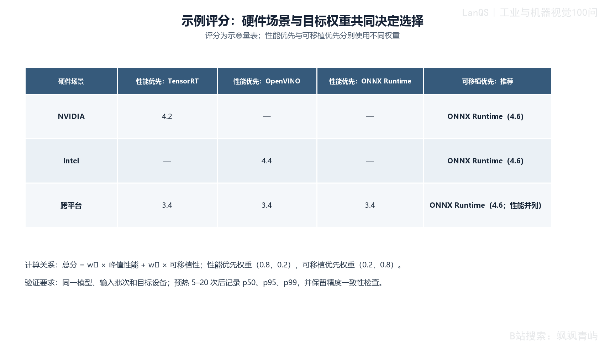</p>

<p align="center">图 95-2　硬件场景与目标权重共同决定选择</p>

图中突出显示 NVIDIA 性能候选 TensorRT、Intel 性能候选 OpenVINO，以及跨平台性能并列和可移植优先的 ONNX Runtime。评分是教学量表，读图时应关注“场景”和“权重”如何共同改变推荐结果，而不要把 4.2、4.4 等数字当成通用实测值。


常量折叠在编译阶段提前计算不变表达式；算子融合减少中间张量和内存往返；低精度量化用 FP16 或 INT8 降低计算与存储开销；内存复用让生命周期不重叠的张量共享缓冲区；执行计划优化则根据目标设备选择内核、线程和数据布局。

这些机制共同减少数据搬运、重复计算并提高硬件利用率，同时会改变数值舍入、调试可见性和构建依赖。每次优化后都要重新检查任务指标、数值误差和长时间稳定性。


基准测试应固定同一模型、输入尺寸、批大小、前后处理和目标设备。先预热 5–20 次并丢弃预热结果，再记录平均延迟、p50、p95、p99、吞吐、峰值内存、温度、错误率和冷启动时间。p95 表示 95% 的测量值不超过该延迟，p99 表示 99% 的测量值不超过该延迟，尾部延迟对工业节拍尤其重要。

每个后端还应使用同一组正常样本、难例和边界置信度样本做数值与任务指标对照。TensorRT engine 与 ONNX Runtime 的输出即使来自同一模型，也应当作两种独立实现验证。硬件、驱动或运行时升级后，必须重新构建或确认兼容性，并保留回退路径。

端到端测试还应把生产状态纳入场景：连续触发、输入队列接近满载、设备温度升高、模型加载失败、后端初始化超时和进程重启。一次成功的离线推理只能说明计算图可执行，不能说明服务在高负载和异常恢复下仍能按时给出结果。若使用异步推理，应同时记录帧等待时间，避免把排队延迟隐藏在吞吐数字之后。

多目标部署时，建议保留一条共享的 ONNX 导出路径和一个薄的运行时选择层。业务代码只调用统一接口，TensorRT 后端服务于确认的 NVIDIA 设备，OpenVINO 后端服务于确认的 Intel 设备，ONNX Runtime 提供跨平台基线和回退。每个后端都要通过同一组数值一致性测试后，才能进入生产配置。

这条路线的维护重点是把“模型接口稳定”和“后端实现可替换”同时落实。统一接口至少应规定输入尺寸或动态形状范围、通道顺序、归一化、输出语义、超时和错误码；后端层再负责会话创建、内存分配、线程配置和设备选择。这样，业务层看到的是一次推理请求，部署层才决定它由 TensorRT、OpenVINO、某个 ONNX Runtime 执行提供程序，还是基线 CPU 路径完成。接口越薄，后端升级时需要重新验证的范围越容易界定。

评分模型的用途是暴露取舍，不是替代测量。若团队把性能权重设得很高，定向引擎可能得到更高分；若项目必须覆盖多种设备，可移植性和回退价值就会改变结论。实际评审还应加入构建时间、驱动维护、授权限制、峰值内存、温度降频和故障恢复等维度。某个引擎在短测中领先，并不等于它在三年生命周期内的总风险最低。

因此，基准报告应同时保存原始测量和解释条件。记录模型哈希、引擎构建参数、设备型号、驱动版本、运行时版本、输入形状、预热次数和采样数量，才能让后续人员复现实验。遇到升级或换机时，先用 ONNX Runtime 或已有后端建立回归基线，再比较新引擎的收益与差异，回退路径也应在同一套测试中演练。

### 常见误区

**误区一：把三类引擎排成固定性能顺序。** 结果取决于模型、硬件、版本、精度和输入形状。

**误区二：把 ONNX Runtime 当成单一后端。** 执行提供程序可能把部分计算交给 CUDA、TensorRT 或 OpenVINO。

**误区三：只看平均延迟。** p95/p99、内存、温度、冷启动和错误恢复同样影响产线。

**误区四：忽略 TensorRT 的构建绑定。** GPU 架构、驱动和运行时变化可能要求重建 engine。

**误区五：把跨平台性能并列写成某一方胜出。** 本题算例中三者在性能优先权重下同为 3.4。

**误区六：没有基线和回退。** 定向优化失败或设备变化时，服务会失去可恢复路径。

### 术语与符号表

| 术语或符号 | 含义 |
| --- | --- |
| 推理引擎 | 把模型计算图映射为目标设备执行计划的软件组件 |
| 算子融合 | 合并连续计算以减少中间结果和数据搬运 |
| 量化 | 用较低位宽表示权重或激活以降低计算和存储开销 |
| 执行提供程序 | execution provider，ONNX Runtime 接入具体硬件后端的组件 |
| p50/p95/p99 | 延迟分布的 50、95、99 百分位 |
| 硬件锁定 | 优化产物依赖特定设备、驱动或运行时 |
| \(P\)、\(T\) | 峰值性能与可移植性基础评分 |
| \(w_p\)、\(w_t\) | 性能与可移植性权重 |
| \(S\) | 按权重计算的总分 |

### 延伸阅读

- NVIDIA TensorRT 官方开发者文档。
- Intel OpenVINO 官方文档。
- ONNX Runtime 官方文档及执行提供程序说明。
- ONNX 模型格式与算子集规范。
- 项目内部的目标设备基准、数值一致性、温度和长时间稳定性测试记录。

---

---

# 第96问　在 Jetson、ARM 板卡等边缘设备上部署视觉算法，有哪些特殊考虑？

> 模块：工业视觉系统部署与边缘计算

边缘部署要同时满足识别精度、处理时延、持续吞吐、功耗、温度、接口带宽和长期稳定性。桌面显卡上的一次推理成功，只能说明模型在某个软件环境中可运行，不能直接推出它能在现场设备上连续工作。本题从硬件约束、模型与推理引擎、数据通路、热管理、可靠性和验证方法六个层面说明部署决策如何落地。

### 边缘设备的资源约束

在边缘设备上部署视觉算法，至少要回答四个问题：模型是否能在目标设备上执行，单帧处理是否满足节拍，连续运行时资源是否有余量，以及设备出现异常后能否恢复。这里的“资源”不仅包括标称内存，还包括操作系统、采集驱动、显示服务、通信服务、日志、缓存和其他进程已经占用的部分。

云端部署往往可以通过集中式算力、弹性资源和统一运行环境缓解设备差异；边缘部署则必须在现场设备上承担采集、推理、控制和故障恢复。现场网络中断时，核心判定仍应按已定义策略运行或安全停机，不能把云端可用性假设带入边缘验收。

因此，部署验收应以目标设备上的实测数据为准。应记录冷启动、温度稳定、持续高负载三个阶段，并同时记录端到端时延、帧率、内存、功耗、温度、时钟频率、丢帧和异常恢复结果。只测一次空载推理时延，无法覆盖现场的主要风险。


ARM（Advanced RISC Machines）处理器通常具有较好的能效，但与桌面 x86 处理器的指令集、编译选项和库支持不同。算法中使用的算子、第三方库或自定义插件，可能在 x86 上可用，在 ARM 环境中却缺少预编译版本或只能回退到较慢的实现。

许多边缘平台还包含 CPU、GPU、DLA（Deep Learning Accelerator，深度学习加速器）或 NPU（Neural Processing Unit，神经网络处理器）。它们的并行能力、支持算子、可用精度和内存路径不同。把所有算子都放到加速器上通常并不可行：不支持的算子会回退到 CPU，CPU 与加速器之间的数据搬运也可能抵消加速收益。部署前应逐层确认算子支持、张量布局、精度和回退路径。


内存不足可能表现为启动失败、随机崩溃、分配延迟增大或采集队列不断积压。应区分以下几类占用：模型权重和中间张量、相机驱动缓冲、图像队列、预处理临时区、显示与通信缓冲、日志和操作系统占用。若使用多路相机，还要把每路的峰值缓冲叠加，而不能只按单路平均值估算。

持续 I/O 也属于性能约束。图像从相机到应用，再到 CPU、GPU 或 NPU 的每一次格式转换和复制都会消耗带宽与时间。采集分辨率、像素格式、相机帧率和保存策略必须放在同一条数据通路中评估。


边缘设备常在有限功耗下工作。持续推理会提高芯片温度，达到热限制后可能自动降低频率。此时冷机测试得到的时延会失真，系统可能在开机前几分钟满足节拍，运行一段时间后却开始积压或丢帧。

工程上应同时记录温度、功耗模式、核心频率和推理时延，并标明测试持续时间、环境温度、散热方式和外壳状态。若采用风扇或散热器，也要验证堵转、积尘或环境温度上升时的余量。

#### 资源预算与测量口径

边缘设备上的内存监控通常同时存在“总内存、已用内存、可回收缓存、可用内存和进程常驻集”等口径。不同工具的数值不能直接相加。部署记录应固定工具、采样周期和计算口径，例如把模型加载前、模型加载后、相机启动后、队列达到峰值后的数据分开记录。

一个可复核的预算表至少包括以下项目：

| 项目 | 记录方法 | 关注点 |
| --- | --- | --- |
| 模型权重与引擎 | 启动前后差值、引擎构建日志 | 构建阶段和运行阶段可能不同 |
| 中间张量 | 引擎内存报告或峰值采样 | 动态形状可能扩大峰值 |
| 采集缓冲 | SDK/采集卡配置与进程监控 | 多路相机要分别核算 |
| 图像队列 | 队列深度乘单帧占用 | 满队列时还可能产生临时副本 |
| 系统与服务 | 固定系统镜像下的可用内存 | 显示、网络、日志会随负载变化 |

因此，应把“最低可用内存”定义为验收指标，报告还要写清设备的 8 GB、16 GB 或 24 GB 标称值之外实际留下多少空间。若内存峰值接近上限，还要验证分配失败后的报警、释放和重启行为；操作系统的交换分区不能被当成稳定的实时内存。

以 Jetson 级设备为例，可把 tegrastats 与 free、vmstat、进程列表并行记录；在完整应用启动后，包含桌面或显示服务、相机驱动、日志和网络服务时，标称 8 GB 设备的进程可用内存可能只有约 5.5–6.5 GB。这个范围只是用于说明测量口径的示例，不应替代目标设备实测。GPU/DLA 利用率和时钟也要在真实预处理、推理和后处理负载下观察，合成加速器微基准无法代表共享内存总线的实际竞争。

### 模型、数据通路与实时性

部署优化前要先把“慢”定位到具体环节。一次推理耗时高，通常说明算子或输入尺寸需要检查；推理很快而端到端仍慢，常见原因反而是格式转换、逐像素处理、内存复制、通信或写盘。平均速度足够但现场仍丢帧时，要把注意力移到队列等待和尾部时延；运行一段时间才变慢，则要同时查看温度、时钟、内存曲线和碎片化。下面的表格适合用作现场测量后的归因入口，不能代替分阶段计时。

| 现象 | 主要可能原因 | 优先检查项 |
| --- | --- | --- |
| 推理本身慢 | 算子复杂度高、精度或引擎不合适 | 算子耗时、输入尺寸、FP16/INT8 支持 |
| 预处理或后处理慢 | 格式转换、CPU 逐像素循环、候选框过多 | 各阶段端到端计时、线程占用 |
| 平均速度可以但仍丢帧 | 队列、复制、通信或写盘形成峰值阻塞 | 队列深度、尾部时延、I/O 等待 |
| 运行一段时间后变慢 | 温度升高、内存泄漏或碎片化 | 温度、频率、内存曲线和长稳测试 |

FP16（16-bit floating point，半精度浮点）通常能减少计算和存储开销；INT8（8-bit integer，8 位整数）量化能进一步降低带宽和算力需求，但会引入量化误差。剪枝减少部分连接或通道，知识蒸馏用大模型指导小模型训练。每种优化都必须在代表性缺陷、边界样本和低对比度样本上复核精度，不能只看平均准确率。

一个可靠的优化顺序是：先冻结输入尺寸、前处理和后处理定义，再测量各阶段耗时；随后选择支持度最好的推理引擎；最后再尝试精度、结构或内存优化。任何优化都应保留可回退版本，并记录模型、引擎、驱动和编译配置。

现场可以按下面的顺序建立基线，关键是每次只改变一个因素，并把输入和测试窗口固定下来：

```text
固定一批代表性图像和相机输入
分别测量 capture / preprocess / infer / postprocess / output
记录平均值、最大值和高分位值，不只记录一次最小值
检查 CPU、GPU/NPU 利用率、频率、内存和队列深度
只改变一个因素，例如输入尺寸、精度或线程数
比较精度、端到端尾部时延、峰值内存和功耗
保留基线版本，并记录是否发生算子回退
```

如果推理只占总时间的一小部分，继续压缩模型可能没有明显收益；如果 GPU 利用率不高但 CPU 和内存带宽已经饱和，优先减少颜色转换、内存复制和 Python 逐像素循环；如果平均时间稳定而尾部时间很长，应先排查写盘、网络和调度抖动。每一次优化都应在相同输入和相同温度测试窗口下比较，否则数字没有可比性。


推理引擎决定了算子如何执行、是否融合、使用何种精度以及中间张量如何分配。TensorRT 常用于 NVIDIA 平台的图优化和 GPU 推理；TFLite、ONNX Runtime、OpenVINO 以及厂商 NPU SDK 则可能适合不同的 ARM 或专用加速器环境。选择依据应包括算子覆盖率、动态形状支持、量化校准方法、插件维护成本、线程模型和目标设备上的实测时延。

模型转换不能只检查“导出成功”。应逐项比较转换前后的输入预处理、输出张量形状、类别顺序、阈值、坐标格式和后处理结果。对同一批固定图像，应比较浮点基线、目标引擎输出和最终业务判定；若有差异，要进一步区分精度误差、布局错误和后处理错误。

精度转换尤其需要边界样本。FP16 的误差通常与数值范围和累积运算有关；INT8 还依赖校准数据的分布。校准集应覆盖正常样本、缺陷样本、低照度、反光、污染、最大目标和最小目标。若某一层或某个后处理算子不支持 INT8，需要明确是局部回退、混合精度还是整网回退，并把它写入部署配置。

推理引擎验收可以建立一份固定的逐层检查表：输入张量名称与布局、颜色顺序、归一化公式、动态尺寸、输出张量形状、类别索引、框坐标定义、置信度阈值、非极大值抑制参数和异常输出处理。任何一项未确认，都不能仅凭最终 OK/NG 结果放行，因为某些布局错误可能在简单样本上暂时不显现。

下面的示意图把部署链路中的关键选择放在同一条路径上。阅读时先从左侧的设备约束出发，再看模型与引擎如何落到加速单元，最后检查数据通路和现场验证是否闭环。

<p align="center">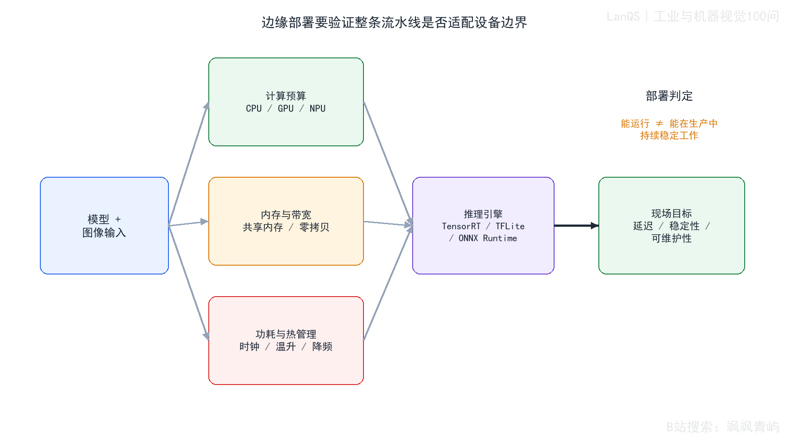</p>
<p align="center">图96-1　边缘视觉部署的决策链路</p>
<div class="figure-note">图中左侧约束决定可选的模型、精度和推理引擎；中间的 CPU、GPU、DLA 或 NPU 代表可能的执行位置；右侧的数据通路和现场验证决定方案能否持续运行。图中的路径用于组织排查顺序，不表示所有设备都具有相同的硬件单元，也不表示某一种引擎一定优于其他引擎。</div>


一帧图像通常要经过“相机采集—驱动缓冲—预处理—推理—后处理—通信或存储”。如果每个阶段都申请新内存并复制整帧，复制时间和内存带宽会随着分辨率、帧率和相机数量增加。应尽量预分配固定大小的缓冲区，明确每个缓冲区的所有权，并在队列中传递引用、索引或句柄。

零拷贝（zero-copy）表示数据在可行条件下由多个阶段共享同一块内存，避免重复复制；统一内存（unified memory）则表示 CPU 与加速器可以访问统一的地址空间。两者都不等于“没有成本”：跨设备访问仍可能受带宽、缓存一致性和访问方向影响，CPU 与 GPU 同时访问还会产生竞争。实际验证时应测量启用和停用相关机制后的端到端时延、峰值内存和稳定性。

队列必须设置容量上限，并明确满队列时的处理策略。实时检测通常需要优先保留最新画面；需要完整追溯时则可能暂停采集、扩大缓冲或降低输入速率。策略选择取决于业务允许的延迟、漏检风险和数据留存要求。


边缘部署至少要经过三个连续的观察窗口。冷启动阶段检查服务依赖、模型加载、驱动初始化和首次推理延迟；温度稳定阶段让设备持续工作到温度、频率和功耗趋于稳定，确认时延是否已经漂移；持续高负载阶段则使用接近现场的帧率、图像尺寸、通信和日志设置，观察内存、队列和丢帧是否随时间增长。三个窗口分别对应初始化风险、热状态风险和长期运行风险，缺少其中一个，测试结论就只覆盖了部分生命周期。

发生异常时，系统应能记录故障上下文、释放或重建设备句柄、清空失效队列，并按照受控顺序重启采集、推理和通信服务。恢复后还要验证结果序号连续性、模型版本一致性和输出是否重复写入。

热稳定测试应把环境条件写入报告。至少要记录开始温度、最高温度、达到稳定所需时间、稳定后的核心频率、功耗模式、端到端时延和丢帧数。若系统有主动风扇，应分别验证正常转速和风扇异常；若设备安装在密闭电柜内，还应在接近现场的进风温度下重复测试。

建议把测试拆成可定位的阶段：

| 阶段 | 目的 | 通过条件示例 |
| --- | --- | --- |
| 启动 5 分钟内 | 检查初始化和首次推理 | 无未处理异常，首帧结果可关联 |
| 温度趋稳 | 检查降频和延迟漂移 | 时延和频率进入规定范围 |
| 连续高负载 | 检查泄漏、队列增长和存储 | 内存、队列和丢帧不持续增长 |
| 注入断线或服务异常 | 检查恢复路径 | 在规定时间内报警或恢复，数据不误关联 |

表中的通过条件需要按产线要求填写具体阈值。若没有定义最大延迟、最大丢帧和恢复时间，测试结果即使“看起来稳定”也无法用于验收。

#### 资源余量比较算例

下面沿用三个占位设备档位，数值只用于说明比较方法，不代表具体厂商产品的基准性能。

| 设备档位 | 标称内存 | 单帧推理时延 |
| --- | ---: | ---: |
| Jetson 级边缘设备 | 8 GB | 3.1 ms |
| ARM 工业计算机（带 NPU） | 16 GB | 5.4 ms |
| 桌面 GPU 设备 | 24 GB | 0.9 ms |

若只按标称内存比较，三者分别是 8 GB、16 GB 和 24 GB；若只按单帧推理时延比较，Jetson 级设备相对桌面 GPU 约为

$$
\frac{3.1}{0.9}\approx 3.44
$$

倍，ARM 工业计算机约为

$$
\frac{5.4}{0.9}=6
$$

倍。若部署需要的可用内存为 6 GB，Jetson 级设备的标称内存余量只有约 2 GB；这仍未扣除操作系统、采集缓冲和其他服务，不能直接视为可用余量。

更完整的判断应记录“可用内存 = 总内存 − 系统与服务占用 − 当前应用占用”，并在实际输入尺寸、批量、前后处理和日志设置下测量端到端延迟。算例能说明三个档位在标称资源和示例推理时间上的相对差异，但不能证明任何一个档位满足具体产线节拍，也不能替代热稳定、峰值内存和故障恢复测试。

图96-2把资源判断拆成标称值、实测延迟和现场余量三层。使用它时要先确认输入尺寸和精度，再把实验室测得的延迟与现场数据通路对齐，最后检查温度稳定后的可用内存和端到端节拍。

<p align="center">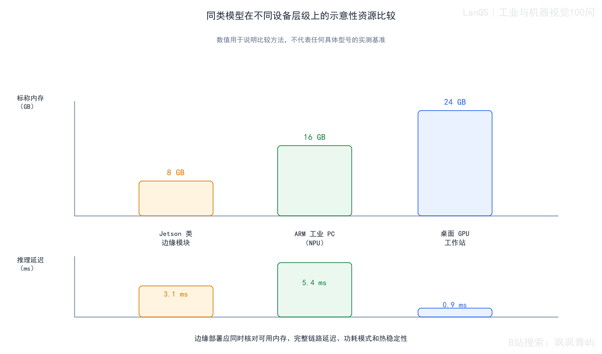</p>
<p align="center">图96-2　从标称资源到现场余量的核查关系</p>
<div class="figure-note">图中“标称内存”和“示例推理延迟”用于建立比较基线；现场判断还要加入系统占用、模型中间张量、采集与通信缓冲、功耗模式和温度稳定性。图中数值与 96.6.1 的占位算例一致，不能作为具体设备选型表或厂商性能承诺。</div>

### 可靠性验证与交付测试

部署验收要把可靠性拆成四个可观测的问题。资源可靠性关注连续运行时内存、队列和线程数是否无界增长；性能可靠性关注温度升高、输入达到峰值或通信短时阻塞时，系统是否仍有可量化余量，或者是否进入已定义的降级状态；数据可靠性要求帧序号、时间戳、模型版本和判定结果能够互相追到，并能识别丢帧、重复帧和无效帧；恢复可靠性则通过相机断开、推理服务异常、磁盘写满和网络中断来验证报警、重连与安全停机。把四类证据分开记录，后续才能区分“算法本身不稳定”和“运行环境已经越过边界”。

模型文件、引擎文件、驱动、运行时库和配置文件应绑定版本，并在启动日志中打印校验值或版本号。升级前后要用固定回归集比较输出，同时复核边界样本和实际节拍。对自动重启也要设置次数上限和人工介入条件，避免故障在现场反复重启而没有留下有效证据。

现场电气条件也属于可靠性范围。应验证瞬时电压扰动、短时断电和恢复后的启动顺序；相机、采集卡、推理服务和控制通信不一定在同一时刻恢复，系统应避免把恢复期间的残缺数据写成正常结果，并在日志中记录重启原因和恢复阶段。


测试应从固定基线开始：先锁定输入分辨率、帧率、像素格式、模型版本和判定阈值，再在目标设备上确认算子、精度和后处理都可执行，并记录任何回退算子。随后分别测量采集、预处理、推理、后处理、通信和写盘耗时，计算端到端的高分位时延，同时采集峰值内存、队列深度、功耗、温度和时钟频率。最后用现场负载完成温度稳定、长时间运行和异常恢复测试，并把设备镜像、模型与引擎版本、配置和原始记录一并固化，形成能够重现的交付包。

### 常见误区

- 把标称内存当成应用可用内存，忽略系统、驱动和缓冲区占用。
- 只比较 GPU 理论算力或单次推理时间，不测量前处理、后处理、复制和通信。
- 在冷机状态测得时延后直接承诺产线节拍，忽略热降频。
- 转换模型后只检查程序能启动，不比较输入预处理、输出布局和类别顺序。
- 看到“零拷贝”或“统一内存”就认为复制和带宽竞争已经消失。
- 用一次短测试代替峰值负载、长稳运行和断线恢复测试。

### 术语与符号表

- ARM：一种低功耗处理器指令集架构。
- CPU：中央处理器，负责通用控制和部分预处理、后处理任务。
- GPU：图形处理器，适合大规模并行计算。
- DLA：深度学习加速器，面向部分神经网络算子。
- NPU：神经网络处理器，面向神经网络推理的专用加速单元。
- FP16：16 位半精度浮点格式。
- INT8：8 位整数格式，常用于量化推理。
- ROI：Region of Interest，感兴趣区域，指参与计算或检测的图像区域。
- 零拷贝：在可行条件下让多个阶段共享同一数据缓冲，减少显式复制。
- 统一内存：CPU 与加速器可通过统一地址空间访问的内存机制，实际性能仍受带宽和访问模式限制。
- 端到端时延：从采集到业务结果输出的完整耗时。

### 延伸阅读

- NVIDIA TensorRT、Jetson 和 DLA 的官方部署文档。
- ONNX Runtime、TFLite、OpenVINO 及目标 NPU SDK 的算子支持与量化文档。
- 目标相机接口的采集驱动、缓冲管理和断线重连文档。
- 工业设备的热设计、功耗管理、长稳测试和软件版本管理规范。

---

---

# 第97问　如何设计多线程或多进程的视觉采集、处理程序？通常需要哪些线程（例如采集线程、处理线程、通信线程）？

> 模块：工业视觉系统软件架构

视觉系统通常同时面对采集、预处理、推理、结果通信和数据记录等任务。流水线的价值在于明确每个阶段的输入、输出、节拍、队列和停止条件，让相互独立的工作重叠执行。本题先区分吞吐与单帧时延，再说明线程、队列、多相机同步和并发故障的设计边界。

### 时间模型与线程架构

吞吐量表示单位时间完成的帧数，端到端时延表示一帧从采集到结果输出经历的时间，节拍则是设备允许两次有效结果之间的最大间隔。流水线可以提高吞吐量，却不必然降低单帧时延；队列过长甚至会让系统表面上不丢帧，实际结果却已经滞后。

若相机输入周期为 \(T_{\mathrm{cam}}\)，系统希望稳定处理，则长期平均吞吐量应不低于 \(1/T_{\mathrm{cam}}\)。除此之外，还要检查尾部时延和队列深度。平均值达标但第 99 或第 99.9 百分位超时，现场仍可能出现周期性积压。


单线程串行处理时，一帧的处理时间近似为

$$
T_{\mathrm{serial}}=T_{\mathrm{cap}}+T_{\mathrm{pre}}+T_{\mathrm{inf}}+T_{\mathrm{comm}}+T_{\mathrm{save}}
$$

其中各项分别表示采集等待、预处理、推理、通信和保存耗时，单位通常为毫秒。若 \(T_{\mathrm{serial}}>T_{\mathrm{cam}}\)，单线程必然无法长期跟上输入。

流水线稳定后，理想的输出周期接近各阶段中最长的一项：

$$
T_{\mathrm{cycle}}\approx\max(T_{\mathrm{cap}},T_{\mathrm{pre}},T_{\mathrm{inf}},T_{\mathrm{comm}},T_{\mathrm{save}})
$$
这个估计成立的前提是各阶段可以并行、队列容量足够、资源没有形成新的共享瓶颈，并且不同帧之间不要求严格串行。比如采集每 40 ms 来一帧，预处理和推理合计 90 ms；流水线可以在填满后大约每 40 ms 产出一帧，但第一帧的端到端时延仍可能接近 90 ms 或更高。如果控制动作必须在 40 ms 内针对同一帧完成，单纯提高流水线吞吐不能满足这个硬时限。


典型程序会把采集、预处理、推理、后处理、通信、记录和监控分开考虑。采集线程从相机取图并附加时间戳、序号，负责处理断线和超时；预处理线程完成去畸变、裁剪、缩放、颜色或灰度转换与归一化；推理线程准备模型输入并调用推理引擎；后处理线程解析输出、应用阈值、换算坐标并形成结果。通信线程把结果送往 PLC（Programmable Logic Controller，可编程逻辑控制器）、机器人或 MES（Manufacturing Execution System，制造执行系统），记录线程异步保存图像、结果、统计和报警上下文，监控线程则持续汇总队列深度、阶段耗时、丢帧、异常和线程存活状态。小系统可以合并其中几个阶段，但这些职责和数据边界仍应保留下来。

小系统可以合并阶段，但必须保留清晰的数据边界和停止顺序。把采集、推理和通信全部写在一个循环里，会使任何一个阻塞点拖住整条链路，也会让问题难以定位。

### 采集、处理与并发安全

阶段之间通常使用线程安全队列传递帧对象。队列容量必须有上限；无界队列能暂时隐藏下游变慢的问题，却会把积压转化为内存增长和越来越大的结果延迟。固定容量的队列应明确满队列策略：阻塞生产者、丢弃旧帧、丢弃新帧或触发降级。

队列元素最好包含图像引用或缓冲句柄、帧序号、硬件时间戳、采集时间、相机编号和配置版本。若数据要跨进程传递，还要明确共享内存、序列化和释放责任，避免一帧在生产者释放后仍被消费者使用。

队列容量可以先按允许的等待时间估算，再用实测峰值校正。若输入帧率为 \(f\)，允许队列等待不超过 \(T_q\)，则只从等待时间角度看，容量约为 \(\lceil fT_q\rceil\) 帧；还要为线程调度、突发 I/O 和停止过程保留余量。容量过小会频繁触发背压，容量过大则会放大结果陈旧问题。最终应同时验收队列深度和端到端时延。

队列中的图像对象还要区分“拥有数据”和“引用数据”。对象池可以减少频繁分配，但必须在消费者完成后归还；共享内存可以减少跨进程复制，但要有引用计数或租约超时。任何缓冲区被提前复用，都会产生看似随机的错图、错序号和错结果。
<!--

队列容量可以先按允许的等待时间估算，再用实测峰值校正。若输入帧率为 (f)，允许队列等待不超过 (T_q)，则只从等待时间角度看，容量约为 (lceil fT_q
ceil) 帧；还要为线程调度、突发 I/O 和停止过程保留余量。容量过小会频繁触发背压，容量过大则会放大结果陈旧问题。最终应同时验收队列深度和端到端时延。

队列中的图像对象还要区分“拥有数据”和“引用数据”。对象池可以减少频繁分配，但必须在消费者完成后归还；共享内存可以减少跨进程复制，但要有引用计数或租约超时。任何缓冲区被提前复用，都会产生看似随机的错图、错序号和错结果。

-->
下面的结构图展示典型的多阶段流水线。阅读时沿着箭头检查每个队列的容量、满队列动作和停止信号；任一阶段若没有定义超时与退出条件，整条链路就可能在异常时悬挂。

<p align="center">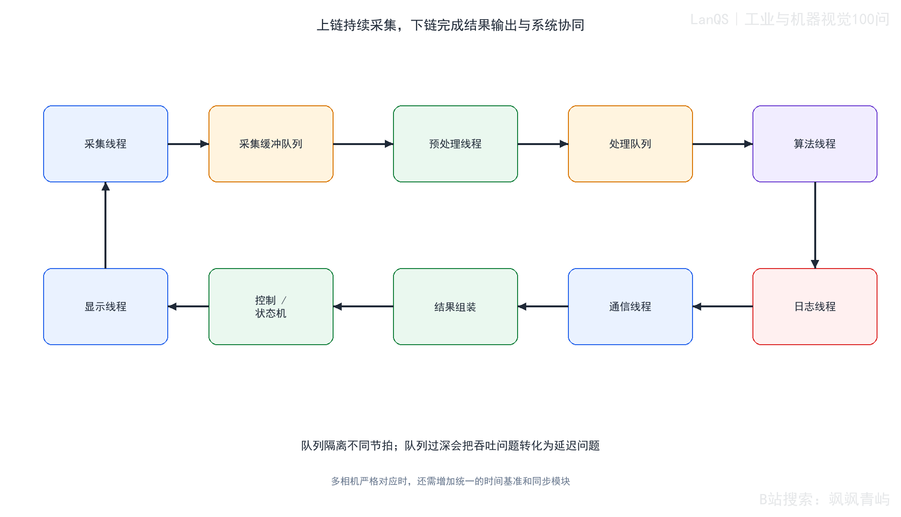</p>
<p align="center">图97-1　多线程视觉处理流水线及其监控边界</p>
<div class="figure-note">图中采集、预处理、推理、后处理和通信通过有界队列连接，监控线程读取队列深度和阶段时延。队列表示解耦与背压边界，并不保证每个阶段都能无限并行；共享 GPU、内存带宽、磁盘和网络仍可能成为全局瓶颈。</div>


采集线程应尽量只负责取图和附加元数据，把耗时处理移交给下游。每一帧至少要有单调时钟时间戳和递增序号；多相机系统还应保留硬件触发计数或曝光时间。取图操作必须设置超时，超时后记录相机状态并按策略重连，不能无限等待。

当下游处理变慢时，采集线程应依据业务策略执行背压。对追求实时画面的检测，可丢弃队列中的旧帧；对追求完整追溯的质量检测，可限制采集速率或暂时停止并报警。无论采用哪种策略，都要记录丢帧原因和丢弃的序号范围。

采集线程的异常状态可以分为超时、设备断开、帧序号跳变、时间戳回退、像素格式错误和驱动返回空缓冲。不同异常的恢复动作不应相同：短时超时可以重试，设备断开需要关闭并重新初始化句柄，序号跳变需要标记数据缺口，格式错误则应阻止错误图像进入模型。恢复期间产生的空结果必须带有明确的状态码，不能伪装成正常 NG。


线程适合共享内存、低开销传递和 I/O 重叠；进程适合隔离崩溃、利用多核 CPU 或绕开解释器级的全局锁，但会增加进程间通信和数据复制成本。Python 的 GIL（Global Interpreter Lock，全局解释器锁）会限制多个线程同时执行 Python 字节码；相机 I/O、数值库和部分推理库在原生代码中可能释放 GIL，因此不能仅凭语言名称判断并发效果，应以目标设备实测。

推理阶段还要考虑 GPU 或 NPU 的上下文、流和线程安全。若引擎实例不能安全地被多个线程同时调用，应采用单独推理线程、实例池或进程隔离。线程数过多会增加上下文切换、缓存竞争和内存占用；合理的线程数应通过阶段利用率、队列等待和端到端尾部时延来确定。

线程划分还应服从资源亲和性。采集线程可能需要较高优先级和稳定的回调响应，推理线程可能受加速器上下文限制，写盘线程则可能出现长时间阻塞。把这些任务都设置成同一优先级，或者让写盘线程与实时线程共享同一个锁，都会使理论流水线在压力下失效。调度策略、CPU 亲和性和优先级只有在目标操作系统与设备上验证后才能写入交付配置。

多进程并不自动提供更高吞吐。如果每个进程都复制一份高分辨率图像，内存带宽和 IPC（Inter-Process Communication，进程间通信）成本可能超过并行收益。选择进程隔离前，应比较共享内存句柄、序列化耗时、故障恢复收益和部署复杂度。


若多个相机拍摄同一工件，采集时间必须由硬件触发或统一时钟约束。仅按软件收到消息的先后顺序配对，无法保证图像属于同一次曝光。每路图像应携带相机编号、帧序号和时间戳，并设置配对窗口；超出窗口的图像要单独标记为缺帧、迟到或错配。

若各相机相互独立，系统可以为每路相机建立采集队列，再由汇聚阶段按工件编号或硬件触发计数配对。若结果必须严格按工件顺序输出，则应在汇聚点集中处理排序；这会增加等待，但能把顺序约束局部化。

同步验证不能只检查时间戳字段存在。应选取同一硬件触发下的多路图像，比较触发计数、曝光时间和到达时间的关系；还应测量网络或驱动抖动是否使到达顺序反转。配对窗口太窄会产生大量“缺帧”，太宽则可能把相邻工件错误配对。窗口大小应根据硬件同步精度、传输抖动和工件运动速度确定。


并发故障有几种不同的现场表现。死锁是线程互相持有对方需要的锁，处理时要统一锁顺序、缩短临界区、禁止在锁内做 I/O，并给等待设置超时；活锁表现为线程持续重试却没有有效进展，应限制重试频率并记录状态转移。竞态则让结果依赖不可控的执行顺序，适合用消息传递和明确的所有权转移减少共享可变对象。生产者停止后消费者仍永久等待，往往是结束消息或哨兵遗漏；工作线程已经退出而主程序仍显示运行，则属于异常被吞掉。监控线程必须集中收集这些异常，并根据策略报警或安全停机。

排查时应为每个阶段记录开始时间、结束时间、帧序号、队列入队和出队时间、线程状态以及异常堆栈。将这些事件按单调时钟排序，才能判断是采集慢、队列等待长、推理变慢还是通信阻塞。

建议为每帧建立一条可追踪的事件链：

```text
capture_start -> captured(seq, ts) -> pre_start -> pre_end
-> infer_start -> infer_end -> post_end -> sent/saved
```

事件链中的每个节点都使用同一单调时钟，并附带帧序号和配置版本。监控系统可以据此计算阶段耗时、队列等待、迟到帧和中断链路。若只记录线程总耗时，就无法区分线程在等待队列、等待锁还是等待设备。

并发问题还需要可重复的故障注入：人为延长推理、暂停写盘、拔插相机、让通信接口超时，再观察系统是否按预期阻塞、丢弃、报警和恢复。故障注入后要检查是否有残留线程、未释放缓冲、重复输出和错误的帧序号。

#### 流水线重叠算例

源算例采用以下阶段时间，单位均为毫秒：采集 40 ms、预处理 15 ms、推理 55 ms、通信 10 ms。

串行处理每帧耗时为

$$
T_{\mathrm{serial}}=40+15+55+10=120\ \mathrm{ms}
$$

对应吞吐量约为

$$
F_{\mathrm{serial}}=\frac{1000}{120}\approx8.3\ \mathrm{fps}
$$

其中 fps（frames per second）表示每秒帧数。若把四个阶段放入可并行的流水线，理想稳定周期由最长阶段决定：

$$
T_{\mathrm{cycle}}=\max(40,15,55,10)=55\ \mathrm{ms}
$$

理论吞吐量约为

$$
F_{\mathrm{pipeline}}=\frac{1000}{55}\approx18.2\ \mathrm{fps}
$$

这是填满流水线后的理论值。按串行公式换算为约 8.3 fps；算例一次实际串行运行约为 8.19 fps，流水线实际运行约为 16.99 fps，约为串行结果的 2.07 倍。实际值低于理论值，原因可能包括线程调度、队列操作、内存复制、模型调用和计时开销。

伪代码应保留阶段边界和停止逻辑：

```text
capture_loop:
    frame = camera.get(timeout=...)
    item = {image_ref, seq, timestamp, config_version}
    put_bounded(capture_queue, item, policy)
    on_stop: send_sentinel(capture_queue)

preprocess_loop:
    item = get_until_sentinel(capture_queue)
    item.tensor = preprocess(item.image_ref)
    put_bounded(inference_queue, item, policy)
    on_stop: send_sentinel(inference_queue)

inference_loop:
    item = get_until_sentinel(inference_queue)
    item.raw_output = engine.infer(item.tensor)
    put_bounded(result_queue, item, policy)
    on_stop: send_sentinel(result_queue)

communication_loop:
    item = get_until_sentinel(result_queue)
    send_result(item.seq, postprocess(item.raw_output))
```

算例证明流水线可以把阶段重叠起来，提高稳定吞吐；它不能证明实际系统一定达到 18.2 fps，也不能证明单帧时延降到 55 ms。若通信、写盘或共享加速器不能并行，最长阶段和实际队列等待都要重新测量。

图97-2把串行时间、理想流水线周期和一次实际运行结果放在一起。读图时应先区分“每帧总耗时”和“稳定输出间隔”，再检查实际吞吐与理论上限之间的差距。

<p align="center">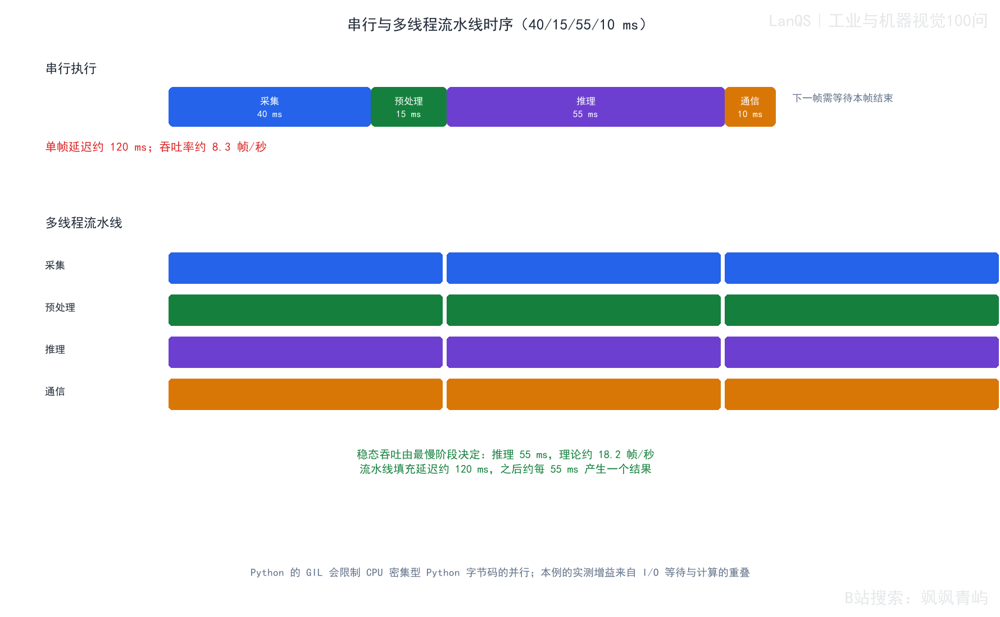</p>
<p align="center">图97-2　串行处理与流水线处理的时间关系</p>
<div class="figure-note">图中串行 120 ms 对应单帧依次完成四个阶段，理想流水线以最长的推理阶段 55 ms 作为稳定周期，一次实际运行约为 16.99 fps。理论值和实测值不可混用；图中不包含特定设备的启动延迟、写盘峰值或异常恢复时间。</div>

### 实现选择与验证

Python 适合快速验证、编排线程和调用成熟推理库；C++ 更适合严格时延、底层采集、零拷贝和长期运行；Qt、ROS 2 或其他框架可以提供事件循环、组件通信和可视化能力。框架本身不会自动解决队列、停止、异常和资源所有权问题。选型时应以目标硬件的驱动支持、团队维护能力、可观测性和交付周期为依据。

无论采用何种语言，都应把配置、数据结构和状态机写在接口契约中。例如预处理阶段明确输入像素格式和输出张量布局，推理阶段明确模型版本和线程安全要求，通信阶段明确超时、重试和幂等性。接口契约比“某个线程调用某个函数”的实现细节更稳定，也便于以后把某一阶段改成进程或独立服务。

### 常见误区

- 把吞吐量当成单帧时延，认为流水线达到 18 fps 就能满足 55 ms 的控制响应。
- 用无界队列掩盖下游变慢，直到内存增长或结果严重滞后才报警。
- 只按软件接收顺序配对多相机图像，没有硬件触发或时间窗口。
- 以为线程数越多越快，忽略共享 GPU、内存带宽和调度开销。
- 在锁内执行推理、写盘或网络发送，导致长时间阻塞其他阶段。
- 线程退出时不发送哨兵、不回收资源，造成程序无法正常停止。

### 术语与符号表

- 流水线：把处理任务拆成多个阶段，使不同帧在不同阶段同时执行。
- 吞吐量：单位时间完成的帧数，常用 fps 表示。
- 端到端时延：一帧从采集到结果输出的完整时间。
- 背压：下游变慢时向上游施加的限速、阻塞或丢弃策略。
- GIL：Global Interpreter Lock，Python 解释器中的全局锁，会限制 Python 字节码的并行执行。
- PLC：Programmable Logic Controller，可编程逻辑控制器。
- MES：Manufacturing Execution System，制造执行系统。
- \(T_{\mathrm{cap}}\)、\(T_{\mathrm{pre}}\)、\(T_{\mathrm{inf}}\)、\(T_{\mathrm{comm}}\)：采集、预处理、推理和通信阶段时间。
- \(T_{\mathrm{serial}}\)：串行处理一帧的总时间。
- \(T_{\mathrm{cycle}}\)：流水线填满后的理想稳定输出周期。

### 延伸阅读

- 相机厂商的异步采集、硬件触发和时间戳文档。
- 目标推理引擎的线程安全、上下文和流管理文档。
- Python `queue`、C++ 并发队列以及进程间共享内存的官方文档。
- 工业控制系统的实时性、超时、故障恢复和事件追踪规范。

---

---

# 第98问　如果图像采集缓冲区大小设置不当，会出现哪些问题？

> 模块：工业视觉系统的数据缓存与实时性

图像缓存用于吸收采集与处理之间的短时速度差。它只能缓冲有限时间，不能把长期处理能力不足变成可持续的实时系统。本题从缓存容量、过小和过大两类风险、内存估算、接口特性、实测方法和动态调参说明如何设计有边界的图像缓存。

### 缓冲区的作用与失效表现

设相机帧率为 \(f_{\mathrm{cam}}\)，单位为帧/秒；处理链路可能出现的停顿时间为 \(T_{\mathrm{stall}}\)，单位为秒；额外安全余量为 \(M\)，单位为帧。应用层缓存容量至少应满足

$$
N_{\mathrm{buf}}\geq\left\lceil f_{\mathrm{cam}}T_{\mathrm{stall}}\right\rceil+M
$$
其中 \(N_{\mathrm{buf}}\) 是应用层队列可容纳的图像帧数，\(\lceil\cdot\rceil\) 表示向上取整。这个公式的前提是相机仍在持续产生图像，停顿期间没有其他缓冲层替应用队列接收数据，并且停顿后的平均处理能力能够追上输入。驱动环形缓冲、DMA 缓冲和接口内部缓存应单独核算，不能把它们未经验证地算进 \(N_{\mathrm{buf}}\)。
<!--

其中 (N_{mathrm{buf}}) 是应用层队列可容纳的图像帧数，(lceilcdot
ceil) 表示向上取整。这个公式的前提是相机仍在持续产生图像，停顿期间没有其他缓冲层替应用队列接收数据，并且停顿后的平均处理能力能够追上输入。驱动环形缓冲、DMA 缓冲和接口内部缓存应单独核算，不能把它们未经验证地算进 (N_{mathrm{buf}})。

-->
如果相机为 30 帧/秒，现场测得需要覆盖的停顿为 120 ms，取 \(M=2\) 帧，则

$$
N_{\mathrm{buf}}\geq\lceil30\times0.12\rceil+2=\lceil3.6\rceil+2=6\ \text{帧}
$$

6 帧只表示按该停顿假设得到的最低应用层容量。若 120 ms 只是平均值，低于 99.9 百分位的峰值，容量仍可能不足；若一帧占用 6.4 MB，则仅图像数据就需要约 \(6\times6.4=38.4\) MB，还要加上其他缓冲和运行时开销。


缓存过小时，短时抖动会立即传递到采集端。常见结果包括驱动报错、丢帧、超时、帧序号跳变和相机重连。若系统采用阻塞策略，采集线程可能被迫等待；若采用丢弃策略，则需要知道丢的是旧帧还是新帧，否则检测结果的时间含义会发生变化。

缓存过小也会放大偶发的预处理、推理、磁盘写入和网络延迟。工程上不能只看平均处理时间，应记录处理时延的尾部，例如第 99 百分位或第 99.9 百分位，并以业务允许的停顿时长代入容量公式。

现场测量时应把“队列满”与“相机端丢帧”区分开。应用队列满可以由程序计数，驱动或采集卡丢帧则要读取 SDK 统计、帧序号和接口错误。两者都出现时，先确认丢帧发生的层级，再决定是调整应用队列、减少复制、降低输入速率，还是检查链路质量。


缓存过大首先增加内存占用。高分辨率图像、彩色格式、多路相机和多级队列叠加后，容量很快达到数百 MB 或数 GB。若采用复制方式传递图像，还要考虑每一级的副本。

更隐蔽的风险是延迟。队列越长，旧图像在队列中等待的时间越长；系统可能没有丢帧，却把已经过时的结果发送给控制设备。实时画面通常应限制队列长度并在过载时丢弃旧帧；追溯型检测则需要把延迟和存储成本明确写入系统约束。

可以把允许的最大队列等待换算成业务时间：当相机为 30 帧/秒时，队列中等待 15 帧就意味着仅排队时间约为 \(15/30=0.5\) 秒。若工件在这 0.5 秒内已经离开执行机构位置，结果即使最终正确，也可能无法用于当前控制动作。因此容量设计必须把“能否容纳停顿”和“结果是否仍然有效”同时写入验收条件。

下图用三个区域说明缓存设计的基本权衡。横向看是缓存容量增加，纵向看是系统状态；在“过小”区域会频繁丢帧，在中间区域可以吸收正常抖动，在“过大”区域则可能出现内存和延迟风险。

<p align="center">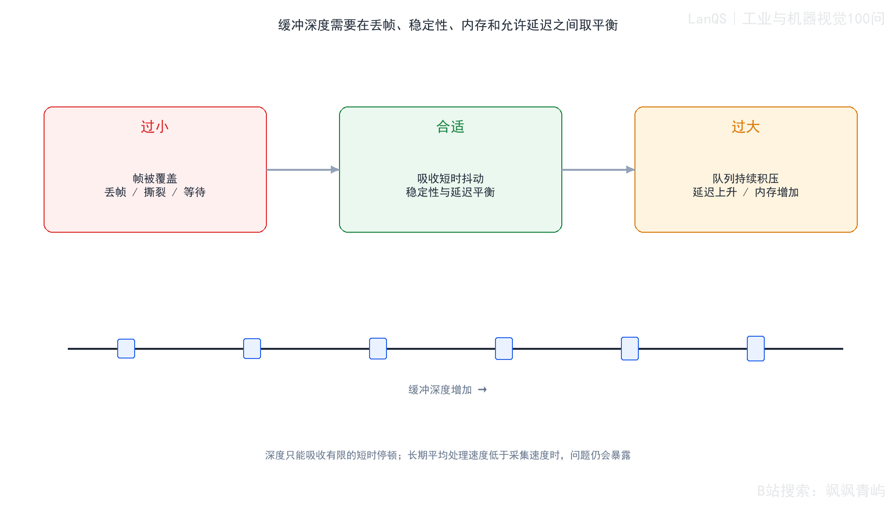</p>
<p align="center">图98-1　图像缓存容量与实时性、资源占用的权衡</p>
<div class="figure-note">读图时先根据现场停顿和帧率估算最低容量，再向右检查峰值内存和旧帧等待时间。图中的区域是工程判断框架，设备的驱动缓存、处理能力和业务对陈旧结果的容忍度都会改变边界。</div>

### 容量估算与管理策略

单帧内存可按像素数、每像素字节数和临时副本估算：

$$
B_{\mathrm{frame}}=W\times H\times B_{\mathrm{pixel}}\times C_{\mathrm{copy}}
$$

其中 \(W,H\) 是图像宽、高，\(B_{\mathrm{pixel}}\) 是像素格式的字节数，\(C_{\mathrm{copy}}\) 是同时存在的副本或缓冲层数量。缓存总内存近似为

$$
B_{\mathrm{total}}\approx N_{\mathrm{buf}}B_{\mathrm{frame}}+B_{\mathrm{driver}}+B_{\mathrm{pre}}+B_{\mathrm{infer}}+B_{\mathrm{other}}
$$

带宽和内存预算应按峰值而非平均值估算。预处理可能把 Mono8 转成浮点张量，推理引擎还会申请中间张量；如果这些数据与原始图像同时存在，实际占用会高于单帧大小乘队列深度。


- 固定环形缓存：容量和内存上限明确，适合连续采集；满时必须规定覆盖旧帧还是拒绝新帧。
- 双缓冲：一个缓冲用于采集，另一个用于处理，结构简单，但只能吸收很短的停顿。
- 三缓冲：在采集、处理和显示或通信之间提供更多重叠，代价是额外内存和管理复杂度。
- 有界队列：把最大延迟和内存上限显式化，适合需要监控和背压的系统。
- 零拷贝或句柄传递：减少大图复制，但要求明确缓冲区所有权、生命周期和跨设备访问限制。

实时检测常见策略是保留最新帧，并记录丢弃计数；全量追溯则可选择阻塞采集、临时降低帧率或将原图写入独立存储。选型前应写出业务允许的最大结果延迟和可接受的丢帧类型。

对于环形缓冲，覆盖旧帧前应先确认旧帧没有被消费者持有。一个安全实现通常把“空闲、采集中、待处理、处理中、已完成”作为缓冲状态，只有已完成或已归还的缓冲才能重新使用。若采集回调和推理线程同时修改状态，应使用原子操作或锁保护，并在异常退出时回收所有非空闲缓冲。

缓存策略还会影响诊断证据。丢弃旧帧时应保存丢弃计数、起止序号和触发时的队列深度；阻塞采集时应记录阻塞起止时间和相机端状态；降级时应记录生效的分辨率、帧率、模型或 ROI。没有这些元数据，事后无法判断一次 NG 缺失是算法问题还是缓存策略主动舍弃了输入。


USB3 Vision 可能受主机控制器和带宽共享影响；GigE Vision 需要关注网络包、交换机、网卡接收缓冲和丢包重传；Camera Link 通常具有较稳定的专用链路，但采集卡和驱动配置仍会影响缓存；CoaXPress 具有较高吞吐，采集卡内存、DMA 和多路并行配置需要单独验证。

接口的名义带宽不能直接等于应用可用带宽。应在目标分辨率、帧率、像素格式和相机数量下实测接收速率，并将驱动、采集卡、操作系统和应用层的缓冲分别记录。多相机系统还要评估同时曝光造成的瞬时带宽峰值。

### 诊断、扫描与可靠调参

现场应至少采集以下指标：相机实际帧率、处理时延分布、队列平均与最大长度、丢帧数、丢帧位置、峰值内存、温度、接口错误和重连次数。若队列在低负载时逐步增长，说明平均处理能力已低于输入；增大缓存只能延后溢出。

常见模式及含义如下：

- 队列很快达到上限且处理时延稳定：处理能力不足或策略选择不当。
- 队列随温度升高逐步变长：可能存在热降频或资源竞争。
- 队列偶尔尖峰后恢复：更像短时 I/O、调度或通信抖动，可用尾部时延估算容量。
- 队列不高但仍丢帧：问题可能在驱动、接口包、采集卡或相机端，不应只调应用队列。

测试应至少包含正常生产速率、短时阻塞、连续高负载和恢复四个窗口。短时阻塞用于估计 \(T_{\mathrm{stall}}\)；连续高负载用于判断生产速率是否长期高于消费速率；恢复窗口用于判断处理能力恢复后队列需要多久清空。若队列清空时间超过业务允许窗口，容量再大也只能延迟故障暴露。

#### 容量扫描算例

源算例用固定参数模拟不同缓存容量下的丢帧和内存趋势。模拟设定包括：相机 30 帧/秒，处理能力低于输入，单帧图像占用约 6.4 MB；扫描容量 2、4、8、16、32 帧，并分别记录丢帧率、平均队列长度、最大队列长度和内存占用。

可复核的计算逻辑如下：

```text
for each buffer_size in [2, 4, 8, 16, 32]:
    reset queue and counters
    for each simulated time step:
        if a camera frame arrives:
            if queue is full: count a dropped frame
            else enqueue one frame
        if processor is ready: dequeue one frame
    record drop_rate, average_depth, max_depth
    memory = buffer_size * 6.4 MB

处理时间的采样也应保留在复核记录中：固定随机种子 7；每次消费先从对数正态分布采样基础处理时间，约 2% 的样本再增加 45–75 ms 停顿；用 consumer_busy_until 表示消费者何时空闲；每个采集时刻先清理已经完成的队列元素，再在容量达到上限时计数丢帧，否则将当前时刻入队。这样得到的结果与随机生成一组丢帧率不同，能够复核容量、突发停顿和内存之间的关系。

源模拟固定随机种子 7，模拟 20,000 帧，采集周期为 \(1000/30\) ms；处理时间以中位数约 13 ms 的对数正态分布为主体，并以 2% 概率叠加 45–75 ms 的长停顿，用来代表写盘、垃圾回收或操作系统调度抖动。容量扫描为 1、2、3、4、6、8、12、16、24、32 帧。一次可复核运行的输出为：

| 缓存容量 | 丢帧率 | 平均队列长度 | 最大队列长度 | 图像缓存内存 |
| ---: | ---: | ---: | ---: | ---: |
| 1 帧 | 4.355% | 0.04 帧 | 1 帧 | 6.4 MB |
| 2 帧 | 2.780% | 0.10 帧 | 2 帧 | 12.8 MB |
| 3 帧 | 0.940% | 0.18 帧 | 3 帧 | 19.2 MB |
| 4 帧 | 0.570% | 0.24 帧 | 4 帧 | 25.6 MB |
| 6 帧 | 0.100% | 0.25 帧 | 6 帧 | 38.4 MB |
| 8 帧 | 0.005% | 0.28 帧 | 8 帧 | 51.2 MB |
| 12 帧 | 0.000% | 0.27 帧 | 12 帧 | 76.8 MB |
| 16 帧 | 0.000% | 0.29 帧 | 16 帧 | 102.4 MB |
| 24 帧 | 0.000% | 0.28 帧 | 24 帧 | 153.6 MB |
| 32 帧 | 0.000% | 0.29 帧 | 32 帧 | 204.8 MB |

从 1 帧到 4 帧，丢帧率快速下降，说明这一段主要受处理时间瞬时波动影响；从 6 帧开始，在该负载下丢帧率已经接近或等于零，继续增加容量只增加线性内存成本。6–8 帧是这个模拟负载的收益递减区间；32 帧并不自动更安全，它的图像缓存内存约为 6 帧的 5.33 倍。

这里的丢帧率是固定随机模型的输出，不能当作目标设备的实测指标；模拟没有包含驱动内部缓存、网络抖动、温度变化和真实接口时延。结果可用于说明容量增大通常会降低突发溢出概率，但收益会逐渐变小；它不足以单独确定现场应选 6 帧、8 帧或 32 帧。

图98-2把容量、内存和丢帧趋势放在一起。读图时先确认丢帧指标的定义和测试负载，再判断从更大容量获得的收益是否值得内存和延迟成本。

<p align="center">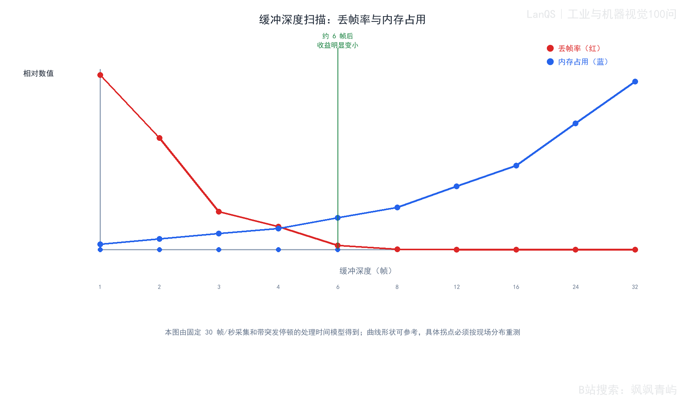</p>
<p align="center">图98-2　缓存容量扫描中的丢帧与内存趋势</p>
<div class="figure-note">图中左轴表示模拟丢帧率的相对变化，右轴表示图像缓存内存，容量越大内存近似线性增加；约 6 帧以后，示例模型中的丢帧收益明显变小。该图用于解释趋势，具体容量仍需用现场的尾部停顿、驱动缓存和端到端延迟重新测定。</div>


缓存容量可以通过配置项调整，但不应在运行中无条件扩容。动态调参前要检查可用内存、当前队列深度和结果延迟；扩容仍无法追上长期速率差时，应转入降级、限速或报警。验收至少应规定：最大允许队列深度、最大结果延迟、丢帧率上限、峰值内存、接口错误和恢复时间。

建议把容量作为配置版本的一部分写入每帧或每次运行记录。更换图像格式、开启调试图、增加相机路数或升级驱动后，应重新测量单帧占用和停顿分布；不能沿用旧容量而只修改一个整数。配置变更还应触发固定样本回归、短时阻塞测试和长稳测试，确认容量增加没有把延迟推过控制边界。

### 常见误区

- 只按平均帧率和平均处理时间估算缓存，忽略尾部停顿。
- 把驱动内部缓冲、采集卡缓冲和应用队列混成一个数字。
- 认为缓存越大越安全，忽略旧帧延迟和系统内存上限。
- 发现丢帧就不断增加应用队列，却不检查接口、驱动和长期处理能力。
- 以模拟图表的丢帧率直接承诺现场性能。
- 使用零拷贝后不再管理缓冲区所有权，导致数据被提前复用或释放。

### 术语与符号表

- 应用层缓存：由视觉程序管理、用于暂存待处理图像的队列或环形缓冲。
- 驱动缓冲：采集驱动或采集卡为接收图像保留的缓冲区。
- \(f_{\mathrm{cam}}\)：相机帧率，单位为帧/秒。
- \(T_{\mathrm{stall}}\)：需要吸收的处理停顿时间，单位为秒。
- \(M\)：额外安全余量，单位为帧。
- \(N_{\mathrm{buf}}\)：应用层缓存容量，单位为帧。
- \(B_{\mathrm{frame}}\)：单帧及其副本的估算内存。
- DMA：Direct Memory Access，直接内存访问。
- USB3 Vision、GigE Vision、Camera Link、CoaXPress：工业相机常用接口或通信标准。
- 尾部时延：时延分布高分位处的延迟，用于描述偶发但重要的长停顿。

### 延伸阅读

- USB3 Vision、GigE Vision、Camera Link 和 CoaXPress 的接口与采集卡文档。
- 目标相机 SDK 关于环形缓冲、超时、丢帧和重连的说明。
- 操作系统网络接收缓冲、DMA 和大页内存配置文档。
- 实时系统中的尾部时延、背压和内存预算方法。

---

---

# 第99问　如何实现生产者—消费者模式来处理图像队列？

> 模块：工业视觉系统并发控制与数据流策略

队列策略决定系统过载时保留哪些数据、阻塞哪些阶段，以及结果延迟如何变化。策略选择必须从业务目标出发：有的系统要求尽量处理每一帧，有的系统要求结果紧跟当前工件，还有的系统需要在过载时明确降级。本题先定义生产者、消费者和队列边界，再比较有界阻塞、丢弃和降级策略，并用统一模拟解释各自代价。

### 队列模型与基本实现

生产者负责生成数据，常见为相机采集、文件读取或上游算法；消费者负责取出数据并处理，常见为预处理、推理、通信和存储。队列在二者之间提供时间解耦，但解耦能力是有限的。

若生产速率为 \(\lambda_p\)，消费速率为 \(\lambda_c\)，当 \(\lambda_p>\lambda_c\) 持续存在时，队列深度会不断增加。无界队列最终消耗内存；有界队列则必须在满队列时阻塞或丢弃。短时的速率差可以由队列吸收，长期的速率差必须通过优化、限速、扩容或业务降级解决。

这里还要区分瞬时速率和长期平均速率。相机触发可能在很短时间内集中产生多帧，消费者虽然平均速度足够，仍需要队列吸收触发抖动；相反，如果消费者长期少处理每秒一帧，队列必然会在某个时刻溢出。验收时应分别施加突发负载和持续过载，不能用一段平稳流量覆盖两种情况。

队列深度本身也是一种业务状态：低深度表示处理链路通常跟得上，持续升高表示等待时间正在累积，频繁触顶表示已经进入过载。应为这些状态设置阈值、告警和恢复条件，并把策略变化写入结果记录。


以 2448×2048 的 Mono8 图像为例，单帧原始数据约为

$$
B_{\mathrm{raw}}=2448\times2048\times1=5,013,504\ \mathrm{bytes}\approx5.0\ \mathrm{MB}
$$

若预处理还保留浮点张量、推理输入和结果副本，队列中每个元素的实际成本可能远高于 5.0 MB。队列容量应由峰值内存、允许的等待时间和过载策略共同决定，而不能只按“内存足够”设置一个很大的数字。


队列元素至少应携带图像引用、帧序号、硬件或单调时钟时间戳、相机编号、工件编号、模型版本和配置版本。若消费者只拿到裸指针而生产者已复用缓冲区，可能出现图像内容与序号不匹配的隐蔽错误。

应明确三类责任：谁创建或取得缓冲区，谁在处理期间拥有它，谁负责归还或释放它。跨线程可以通过引用计数、对象池或所有权转移实现；跨进程则要额外说明共享内存句柄和序列化边界。队列关闭时，仍在处理的元素、未消费元素和异常元素都应有明确的回收路径。

为了避免把一帧错误地关联到另一件产品，元数据应随图像一起移动，不能在消费者侧用“当前时间”或“最近一帧”补写。结果合并时，若发现序号缺口、版本变化或时间戳超出窗口，应生成状态明确的未判定记录，并让控制层决定是否停机或复检。


有界队列需要同时处理正常入队、队列已满、消费者超时、停止信号和工作线程异常。伪代码如下：

```text
put(item):
    if stop_event is set: release(item); return STOPPED
    if policy == BLOCK:
        wait until space or timeout or stop_event
        if timeout: record producer_blocked; apply_timeout_policy
    if policy == DROP_OLDEST and queue is full:
        old = pop_oldest(); release(old); count_drop_oldest += 1
    if policy == DROP_NEWEST and queue is full:
        release(item); count_drop_newest += 1; return DROPPED
    enqueue(item)

get():
    wait until item or sentinel or timeout
    if sentinel: release_sentinel_if_needed; return STOPPED
    return item

shutdown():
    stop_event.set()
    stop producers first
    enqueue one sentinel per consumer, or close queue with an explicit state
    join workers and release every remaining item
```

实现中还要保证 `Full`、`Empty`、超时和消费者异常不会被静默忽略。若使用任务计数，应让每个成功取出的元素最终对应一次完成通知；停止路径也要单独定义，避免主线程永远等待未完成任务。

### 满载策略与实时性取舍


队列满时阻塞生产者，尽可能保留每一帧。它适合完整记录、每帧都必须判定的质量流程，但会把下游变慢传回采集端。若相机驱动不能阻塞，最终仍可能在更低层丢帧；因此必须监控生产者阻塞时间和实际采集丢帧。


队列满时删除等待时间最长的旧帧，再放入最新帧。它适合当前画面价值高于历史画面的实时监控和控制。代价是部分工件没有被处理，必须记录丢弃序号、时间戳和计数。


队列满时拒绝新到的帧，保留已进入队列的处理顺序。它适合已入队数据更重要、且希望避免改变既有处理序列的场景，但会让系统持续处理旧画面，实时性可能恶化。


降级可以包括降低采集帧率、只保留 ROI（Region of Interest，感兴趣区域）、降低图像分辨率、跳过非关键模型或只保存异常图像。降级必须是显式的状态机：触发条件、告警、恢复条件和对检测能力的影响都要记录，不能在后台静默改变判定逻辑。

策略选择可以用四个问题落地：是否每帧都必须判定，结果允许等待多久，丢失哪一类帧更危险，以及过载时控制设备应做什么。质量追溯通常优先保证样本完整性；在线控制通常优先保证结果新鲜度；人工复核流程则可能优先保留低置信度和边界帧。答案不同，队列策略也应不同。

下图显示采集、处理和结果合并之间的队列边界。图中的四种策略是概念选项；后面的统一算例只比较三种可复核策略：无界队列、有界阻塞和有界丢弃最旧帧。

<p align="center">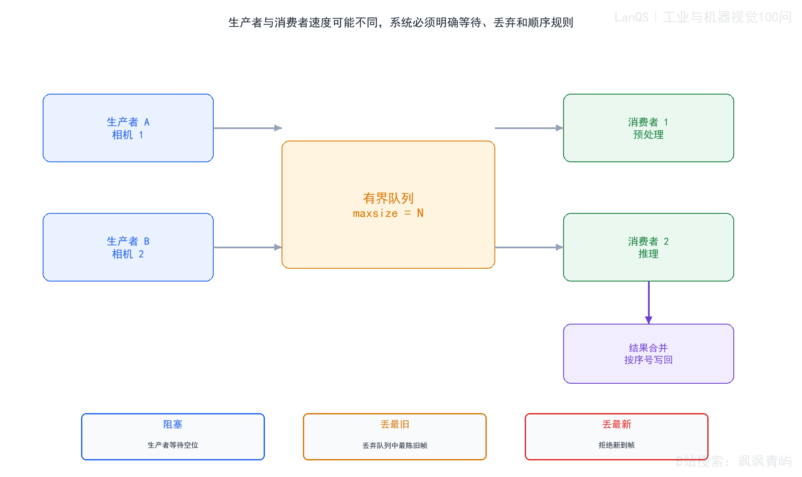</p>
<p align="center">图99-1　生产者—消费者队列及过载策略</p>
<div class="figure-note">读图时从左向右检查生产速率、队列容量和消费速率，再查看满队列时的数据去向。结果合并节点负责关联帧序号和处理结果；它不应默认所有帧都存在，必须能处理丢帧、迟到和异常结果。</div>


多阶段系统可能同时存在采集队列、预处理队列、推理队列和写盘队列。每级队列都设得很大，会把内存和延迟相乘；每级都立即丢弃，又可能让数据在不易观察的位置消失。应为每级队列设置容量、丢弃计数、最大等待时间和上下游关联标识，并建立全局过载状态。

若推理队列达到阈值，可以先降低日志级别或暂停非关键保存；若通信连续超时，应阻止新的非关键任务进入，避免队列继续扩大。背压动作必须与安全策略相容，不能为了维持画面而跳过必须发送给控制器的关键结果。


丢弃旧帧会改变输出帧序列；多线程处理完成顺序也可能与采集顺序不同。若业务需要严格顺序，应在结果合并点按帧序号重排，并为缺失帧设置超时；若业务只关心当前工件，应优先使用工件编号和时间戳，不要假设“第 N 个结果对应第 N 个采集消息”。

实时系统要同时报告队列等待时间和处理时间。仅报告消费者的推理时延，会掩盖图像在队列中等待数百毫秒的事实。

#### 三种队列策略的统一算例

源算例设置生产速率 60 帧/秒、消费速率 35 帧/秒、运行 6 秒、有界容量 8 帧。三种策略分别为：无界队列、有界阻塞、有界丢弃最旧帧。一次运行的结果如下：

| 策略 | 产生帧数 | 消费帧数 | 最终队列 | 峰值队列 | 丢弃帧数 | 生产者阻塞时间 |
| --- | ---: | ---: | ---: | ---: | ---: | ---: |
| 无界队列 | 361 | 175 | 186 | 194 | 0 | 未统计 |
| 有界阻塞 | 176 | 176 | 0 | 8 | 0 | 5.733 s |
| 有界丢弃最旧帧 | 361 | 175 | 0 | 8 | 186 | 未统计 |

模拟逻辑可以概括为：生产者按约 16.7 ms 产生一帧，消费者按约 28.6 ms 消费一帧；每次入队依据策略处理满队列，每次消费更新计数和队列深度，最后等待消费者完成并统计结果。结果表明，无界队列保留了数据但积累了 186 帧；有界阻塞把生产速率压回消费能力，并付出了 5.733 s 的生产者等待；丢弃最旧帧维持了最新数据，但丢弃了 186 帧。

表中“产生帧数”不等于相机实际永远能产生的帧数：阻塞策略会限制生产者继续生成。模拟没有直接计算每一帧的端到端延迟，因此不能从队列深度表直接推出完整的时延分布。现场还应记录每帧入队、出队和输出时间。

这个算例还展示了策略之间的守恒关系：在丢弃最旧帧策略中，产生帧数与消费帧数之差正好对应丢弃帧数；在有界阻塞策略中，产生帧数下降，差值由生产者等待时间体现。检查这些计数关系，可以及早发现统计代码把“拒绝入队”“消费失败”和“相机没有产生”混在一起的问题。

下图按统一算例汇总三种策略的核心结果。柱形数值以表格为准，曲线用于帮助理解队列是否保持有界；它不替代现场逐帧时间戳记录。

<p align="center">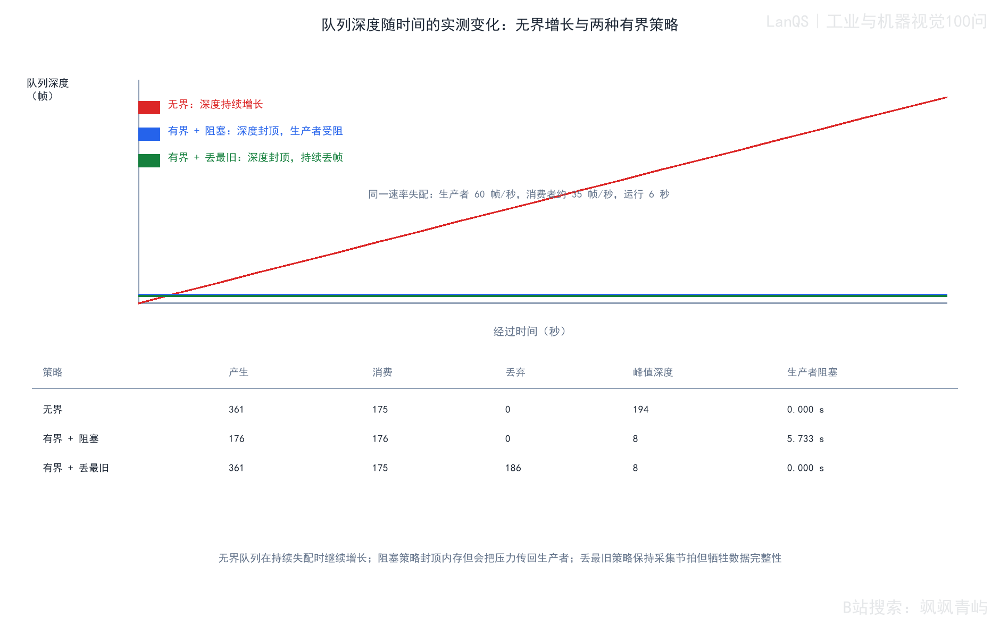</p>
<p align="center">图99-2　三种队列策略的统一模拟结果</p>
<div class="figure-note">无界策略的最终深度和峰值深度都很高，说明长期速率差会转化为内存与延迟；有界阻塞的产生量下降，说明背压传回生产者；有界丢弃最旧帧的产生量维持较高但丢弃帧数增加，说明它优先保留较新的数据。图中趋势是算例概览，精确数字应以表99-1所列计数为准。</div>

### 验证、安全边界与验收

无界队列牺牲内存和延迟换取暂时不丢帧；阻塞策略牺牲采集连续性或生产者吞吐换取完整处理；丢弃策略牺牲部分数据换取有界延迟；降级策略牺牲部分算法能力换取系统继续工作。没有一种策略在所有视觉任务中都占优。

策略确定后，应在结果、报警、日志和班次统计中体现其影响。例如丢弃最旧帧时，产品质量统计应区分“检测为 OK”和“没有被检测”；阻塞导致相机停采时，系统应记录生产者阻塞和采集暂停，而不能把它们归为正常无缺陷。


队列本身线程安全，不代表队列元素内部的图像对象线程安全。共享模型、相机句柄、显示对象和日志对象仍要遵守各自的线程限制。锁的顺序应全局统一，回调中不应再次同步等待持锁线程；异常应沿任务边界传递到监控线程。

关闭系统时，推荐先停止生产者，再让消费者处理或丢弃剩余数据，发送明确哨兵，等待工作线程退出，最后释放相机、模型和缓存资源。若业务要求快速停机，应定义哪些数据可以丢弃以及如何记录。


验收应在正常、峰值和异常三类负载下进行：

1. 正常负载：确认队列深度稳定、结果顺序和资源占用。
2. 峰值负载：人为增加推理或写盘时延，验证满队列策略和告警。
3. 异常负载：断开相机、暂停消费者、制造通信超时，验证停止、恢复和数据回收。

必须记录产生、消费、丢弃、阻塞、最终队列、峰值队列、等待时间和恢复时间。只有把这些指标与业务允许的漏检、延迟和追溯要求对应起来，队列策略才算完成设计。

放行前还应验证重启和升级场景：运行中停止生产者，检查剩余元素是否按规则处理；重启后检查帧序号、配置版本和统计计数是否重新初始化或正确续接；升级策略后用同一负载复现实验，确保丢弃和阻塞的含义没有悄悄改变。

### 常见误区

- 把“零丢帧”当成唯一目标，忽略无界队列造成的内存增长和结果陈旧。
- 采用丢弃最旧帧，却不记录丢弃序号，导致质量统计失真。
- 只给单个队列设容量，没有评估多级队列的总内存和总延迟。
- 让降级逻辑静默修改分辨率、阈值或模型，造成结果不可追溯。
- 关闭线程时直接销毁相机或模型，遗留正在使用的缓冲区。
- 用最终队列深度代替逐帧端到端延迟。

### 术语与符号表

- 生产者：向队列写入图像或任务的线程、进程或设备。
- 消费者：从队列取出并处理图像或任务的线程、进程或服务。
- 背压：下游处理能力不足时限制上游生产的机制。
- 有界队列：容量有明确上限的队列。
- 无界队列：逻辑上不设固定上限的队列，实际受内存限制。
- BLOCK：满队列时阻塞生产者。
- DROP_OLDEST：满队列时丢弃最旧元素。
- DROP_NEWEST：满队列时拒绝新元素。
- ROI：Region of Interest，感兴趣区域。
- \(\lambda_p\)、\(\lambda_c\)：生产速率和消费速率，单位为帧/秒。

### 延伸阅读

- Python `queue`、C++ 并发队列和生产者—消费者模型文档。
- 目标相机 SDK 的采集阻塞、丢帧和缓冲回收说明。
- 工业控制系统对漏检、延迟、追溯和安全停机的业务规范。
- 多线程程序的锁顺序、超时、异常传递和生命周期管理规范。

---

---

# 第100问　程序应该如何记录事件？工业现场实际需要哪些日志（错误、警告、逐帧结果、生产统计）？

> 模块：工业视觉系统的可观测性、追溯与运维

日志系统要同时服务于实时运行、故障定位、质量追溯和长期统计。每帧都保存完整原图与调试信息，通常会迅速耗尽存储；只保留最终 OK/NG，又无法解释边界判定和现场异常。本题建立分层日志架构，定义每帧结果字段，估算不同留存策略的容量，并说明日志如何支持 OEE、报警审计和故障重建。

### 日志分层与事件记录

一套可用的工业视觉日志至少应回答：某一帧何时采集、来自哪台相机和哪件产品；使用了哪个模型、阈值和配置；各阶段耗时如何；最终判定是什么；为什么触发报警；当时的图像、结果和设备状态是否仍可追溯。

这些问题对应不同数据粒度。实时控制需要短小、低延迟的事件；故障分析需要带上下文的警告和错误；质量追溯需要按帧关联图像和结构化结果；班次与设备管理需要聚合统计。把所有信息写成同一种字符串，会降低查询能力并扩大存储量。

日志设计还要先区分事实、推断和人工处置。采集时间、帧序号和推理耗时属于系统事实；低置信度是依据阈值计算出的状态；误检确认则可能来自人工复核。三者应使用不同字段保存，避免把事后结论覆盖原始判定。时间同步和时钟漂移也要纳入设备状态，跨设备关联时应保留原始时间戳与统一时间戳。

日志写入失败不能改变视觉判定的含义。对必须发送给控制器的结果，应把发送成功、超时、重试和最终确认分开记录；对可延后写入的调试数据，可以采用采样和降级。任何因日志压力导致的丢弃，都要有计数和时间窗口。


推荐把事件采集、等级判断、异步写入、留存和统计分开：

1. 事件采集层：接收采集、预处理、推理、后处理、通信、温度和设备状态事件。
2. 等级层：按 DEBUG、INFO、WARNING、ERROR 分级，决定字段和保存策略。
3. 异步写入层：用有界队列、批量写入和后台线程减少对实时处理的阻塞。
4. 关联层：按帧、工件、班次和报警编号关联图像、结果与统计。
5. 留存层：本地轮转、数据库或文件服务器、仪表板和备份分别承担不同查询与保存周期。

下图给出这些组件之间的关系。阅读时先从“事件捕获”沿箭头检查一条事件如何进入等级判断，再检查它是否会阻塞实时链路，最后确认每种数据的留存位置和生命周期。

<p align="center">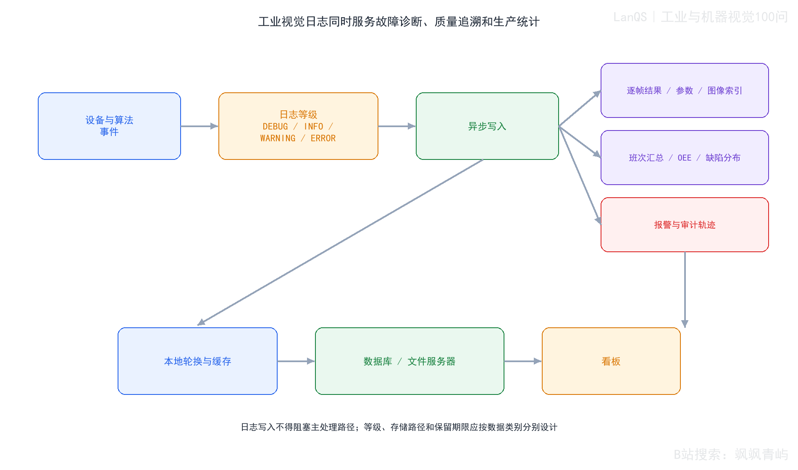</p>
<p align="center">图100-1　工业视觉日志、统计与留存架构</p>
<div class="figure-note">实时事件进入等级判断后，可分别写入本地轮转文件、数据库或文件服务器，并汇总到班次统计和报警审计。图中的异步写入用于隔离 I/O 抖动，但队列仍应有容量上限和满队列策略；关键 ERROR 事件不能因普通 DEBUG 流量过大而丢失。</div>


#### ERROR 日志的最低字段

错误日志至少应包含时间戳、设备与工位、相机或服务标识、错误码、可读消息、触发操作、相关帧或工件编号、关键参数、异常堆栈或驱动返回值、系统采取的恢复动作以及最终状态。相机断线、模型加载失败、推理异常、通信超时和磁盘写满应使用不同错误码，不能都写成一条“程序异常”。错误记录还应带关联 ID，使它能追到对应的帧结果、报警审计和重启记录。

错误日志的目标是说明发生了什么、影响了哪些对象、系统做了什么以及是否恢复。只记录错误字符串，无法判断是一次可重试超时，还是已经导致整批产品未检测。参数上下文要避免写入敏感信息，但应保留足以复现问题的版本、输入尺寸、队列深度和状态码。


| 等级 | 典型内容 | 建议留存 |
| --- | --- | --- |
| DEBUG | 中间张量摘要、详细计时、调试图和算子诊断 | 仅调试窗口或短期留存 |
| INFO | 启停、配置加载、正常统计、关键状态变化 | 按班次或周期留存 |
| WARNING | 低置信度、边界样本、队列接近上限、温度偏高、重连 | 与相关帧或时间窗关联 |
| ERROR | 推理失败、相机断线、通信失败、磁盘写满、服务崩溃 | 强制保存并审计 |

等级不应只由程序员临时决定。应为每个等级定义字段、采样率、图像保存规则、轮转周期和报警动作。低置信度或边界样本常适合保留缩略图和结构化结果；ERROR 通常需要保留原图、完整配置上下文和异常堆栈。

等级之间还要有升级关系。例如队列接近上限可以先产生 WARNING；若持续超过时间阈值或发生丢帧，则升级为 ERROR；恢复后应记录恢复事件和恢复时间。等级升级应包含去抖和重复抑制，避免同一故障每帧写出一条相同错误，同时保留发生次数和首次、最后一次时间。

### 逐帧记录、统计与容量

每帧记录建议包含以下字段：

- 时间：采集时间、处理开始和结束时间，统一时区或使用明确的 UTC 偏移。
- 身份：设备编号、相机编号、生产线、工位、工件编号和帧序号。
- 版本：软件版本、模型版本、配置版本、标定版本和引擎版本。
- 输入：图像尺寸、像素格式、曝光、增益、触发计数或 ROI。
- 结果：类别、置信度、缺陷位置、测量值、阈值和最终 OK/NG 判定。
- 性能：采集、预处理、推理、后处理、通信和写盘耗时。
- 状态：温度、内存、队列深度、功耗模式、接口错误和重连次数。
- 关联：原图或缩略图路径、报警编号、班次编号和审计事件编号。

字段名称和单位必须固定。时间戳不能一部分使用本地时间、一部分使用设备启动后的相对秒数；坐标必须写明像素坐标、标定后的物理坐标或 ROI 局部坐标。

字段还应规定精度和枚举的演进方式。置信度应记录原始浮点值以及阈值版本，测量值应带单位和标定版本，缺失值应使用统一的 null 或状态码，不能把 0 当成“没有测量”。当模型输出类别发生变化时，旧记录仍应能按模型版本解释，禁止用新类别表覆盖历史含义。

对于图像路径，应记录保存介质、相对路径、校验值和可用期限。路径存在不等于图像可恢复；归档迁移后仍要能由结构化记录解析到新位置，或者保留明确的迁移映射。

如果一帧没有检测框，也应把 detections 记录为空数组，并保留阈值、模型版本和判定状态；如果推理失败，则应使用明确的 processing_status 和错误编号，不能把失败结果写成低置信度 OK。这样才能在统计中区分“检测到正常产品”“检测到缺陷”和“没有完成检测”。

推荐使用 JSON、数据库表或其他可查询的结构化格式，并把大图作为外部对象，通过稳定路径或对象键关联。一个每帧结果可以包含：

```json
{
  "timestamp": "2026-06-13T14:38:20.123+08:00",
  "frame_id": "F20260613-143820-000231",
  "product_id": "P-240613-0185",
  "station_id": "ST-02",
  "camera_id": "CAM-RIGHT",
  "recipe_id": "RECIPE-A3",
  "image": {
    "width": 2448,
    "height": 2048,
    "format": "Mono8",
    "exposure_us": 9000,
    "gain_db": 3.0
  },
  "result": {
    "decision": "NG",
    "confidence": 0.91,
    "defect_type": "SCRATCH",
    "bbox": [812, 564, 96, 18]
  },
  "timing": {
    "capture_ms": 4.8,
    "preprocess_ms": 2.1,
    "inference_ms": 23.7,
    "postprocess_ms": 1.9,
    "total_ms": 32.5
  },
  "artifacts": {
    "raw_image": "images/Q100/ng/20260613/F20260613-143820-000231.png",
    "overlay_image": "images/Q100/overlay/20260613/F20260613-143820-000231.png"
  }
}
```

示例中的 frame_id、product_id、station_id、recipe_id 和图像路径用于跨表、跨文件和跨系统关联；bbox 明确表示像素坐标；曝光、增益和各阶段耗时的单位在字段名或结构中写明。实际项目还应规定字段是否必填、缺失值如何表示、枚举值如何演进以及版本升级时如何兼容旧记录。

#### 日志与图像存储容量算例

下面按源算例的假设估算容量：相机 30 帧/秒，每天运行 16 小时，因此每天帧数为

$$
N_{\mathrm{day}}=30\times16\times3600=1,728,000\ \text{帧}
$$

假设 NG 帧占 3%，低置信度或边界帧另占 2%，两者不重叠，因此需要详细留存的帧占 5%。分层文本日志按普通帧约 220 bytes、详细帧约 1,800 bytes 估算；详细帧图像按约 2,200 KB/帧估算，普通帧不保存原图。再加上错误、告警和统计记录，源算例得到：

容量计算还采用以下固定输入：每天 40 条 ERROR、每条 400 bytes；每天 220 条 WARNING、每条 300 bytes；每分钟一条生产统计、每条 500 bytes；DEBUG 每帧覆盖采集、预处理、推理和后处理 4 个阶段，每条追踪记录 350 bytes。DEBUG 全量方案为每帧写 1,800 bytes 的详细结果和 4 条阶段追踪，并保存每帧图像；分层方案只对 5% 的详细帧保存这些内容，其余帧写 220 bytes 的摘要。

| 项目 | 分层留存 | DEBUG 全量留存 |
| --- | ---: | ---: |
| 文本日志 | 约 493.3 MB/天 | 约 5,274.0 MB/天 |
| 图像 | 约 181.756 GB/天 | 约 1,552.575 GB/天 |
| 30 天合计 | 约 5,452.68 GB | 约 46,577.25 GB |

分层方案的文本量可按“详细帧数 × 1,800 bytes + 普通帧数 × 220 bytes”复核；DEBUG 方案还为每帧保留约四类额外调试记录，每类约 350 bytes。图像部分按详细帧数乘 2,200 KB 估算，DEBUG 方案则按 NG 图像 2,200 KB、普通图像 900 KB 的混合大小估算。这里的图像大小属于容量规划假设，应在目标格式、质量参数和实际缺陷分布下复测。

图100-2用对数纵轴展示两种方案的日容量和 30 天容量。对数轴适合同时显示 MB 与数十 TB 量级；读图时必须先看单位和留存周期，不能把日容量直接当作月容量。

<p align="center">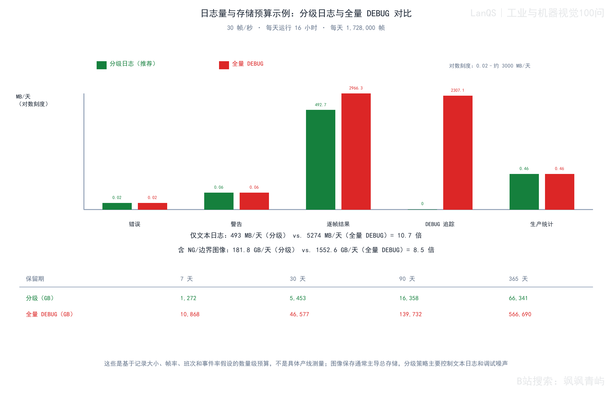</p>
<p align="center">图100-2　分层留存与 DEBUG 全量留存的容量预算</p>
<div class="figure-note">分层留存通过降低普通帧文本量并只保留详细帧图像，把 30 天容量控制在约 5.45 TB；DEBUG 全量留存约为 46.58 TB。图中数值基于 30 帧/秒、每天 16 小时和指定图像大小假设，适合做容量预算，不代表所有产线的实际压缩结果。</div>


统计窗口必须定义边界：班次交接时采用哪个时间、跨午夜如何归属、设备停机是否从计划时间扣除、未处理帧是否进入总数量。统计程序应保存原始计数和派生比例，避免日后更换公式后无法重算。对人工复核结果，还要保留复核时间、人员和复核依据。

数据仪表板可以展示趋势，但不应成为唯一数据源。图表应能回溯到原始事件或聚合批次，且显示当前模型、配置和时间范围。

班次统计不应只保存最终合格率，还应包括总帧数、OK/NG 数、低置信度数、未处理或丢帧数、平均与尾部处理时延、相机重连、通信失败、停机时间和人工复核结果。统计记录应关联设备、工位、班次、模型版本和配置版本，避免换班或换模后无法解释指标变化。

报警审计至少应记录报警开始时间、结束时间、触发条件、相关帧、设备状态、操作员确认、恢复动作和最终原因。若报警由队列溢出触发，应同时记录队列深度和丢弃策略；若由低置信度触发，应保留阈值和模型版本。


OEE（Overall Equipment Effectiveness，设备综合效率）通常写为

$$
\mathrm{OEE}=A\times P\times Q
$$

其中可用率、性能和质量分别为

$$
A=\frac{T_{\mathrm{run}}}{T_{\mathrm{plan}}},\qquad
P=\frac{N_{\mathrm{out}}T_{\mathrm{ideal}}}{T_{\mathrm{run}}},\qquad
Q=\frac{N_{\mathrm{good}}}{N_{\mathrm{total}}}
$$

\(T_{\mathrm{plan}}\) 是计划生产时间，\(T_{\mathrm{run}}\) 是实际运行时间，\(N_{\mathrm{out}}\) 是产出数量，\(T_{\mathrm{ideal}}\) 是理想单件周期，\(N_{\mathrm{good}}\) 是合格数量，\(N_{\mathrm{total}}\) 是总数量。视觉系统应把停机、节拍下降、NG、未检测和人工复核分别记录，避免把缺陷、漏检和设备停机混在一个比例里。

OEE 是运营指标，不能替代视觉模型准确率。它能帮助定位时间损失、速度损失和质量损失，但不能单独证明模型没有漏检；模型评估仍需要独立的标注数据和混淆矩阵。

### 存储、备份与长期价值

本地磁盘应设置按时间、文件大小或事件数量轮转的规则，并预留最低可用空间。磁盘写满时，系统要优先保护 ERROR 和报警数据，明确哪些 DEBUG 或普通图像可以删除。文件命名和目录结构应包含日期、设备、工位或批次，跨文件和跨系统的关联仍依赖结构化索引。

长期归档可以使用数据库、文件服务器或对象存储。归档记录应带校验值、写入时间、来源版本和恢复测试结果。备份策略要规定保留周期、跨设备副本、访问权限和删除审计；仅“复制过文件”不等于已经验证可恢复。


断电保护是异步日志的边界条件。关键事件可以采用同步落盘、独立电源或带事务的存储；普通事件可以接受最近一个批次丢失，但必须在启动后记录上次非正常关闭。写入线程恢复时应校验半写文件、重复批次和损坏索引，避免把不完整记录提供给追溯查询。

日志写入、图像压缩和网络上传可能产生不可预测的 I/O 延迟，建议通过独立线程或服务异步处理，并使用有界队列。队列满时应按日志等级降级：普通 DEBUG 可采样或丢弃，关键 ERROR 应同步落盘或进入独立高优先级通道。任何降级都要计数并报警，否则日志缺失本身会变成不可见故障。

批量写入可减少系统调用，压缩可降低带宽和存储，但会增加 CPU、延迟和故障时的未落盘数据量。批量大小、刷新周期和断电保护应通过现场测试确定。


最终验收可以用一次完整演练确认闭环：制造一帧正常样本、一帧 NG、一帧低置信度样本和一次相机断线，检查它们是否能在日志、图像、报警审计和班次统计中互相关联；随后升级一个配置版本并重放样本，确认历史记录仍按旧版本解释。只有当查询、恢复和重放都成功，日志设计才具备现场运维价值。

发生异常后，可以按以下顺序重建现场：

1. 用设备、工位、时间窗口和报警编号定位事件。
2. 按帧序号或工件编号关联原图、缩略图、结构化结果和模型版本。
3. 对齐采集、预处理、推理、通信和写盘时间，区分处理慢与等待慢。
4. 检查温度、内存、队列、接口错误和重连记录，判断是否存在资源或硬件诱因。
5. 用同版本模型、同配置和同输入重放，记录重放环境和差异。
6. 将根因、处置动作、人工确认和最终结论写回报警审计。

日志系统的最终价值在于让一帧结果、一次报警、一班统计和一次软件升级能够互相解释。字段稳定、版本可追溯、容量可控和恢复可验证，是长期运行的基本条件。

### 常见误区

- 每帧永久保存原图和全部 DEBUG 信息，未做容量预算和轮转。
- 只记录 OK/NG，不记录阈值、模型版本、置信度和边界状态。
- 使用不可查询的自由文本，导致帧、工件、报警和班次无法关联。
- 让日志写盘和图像压缩直接阻塞实时推理线程。
- 磁盘写满后静默丢弃关键 ERROR，或没有记录日志降级次数。
- 用 OEE 代替模型准确率评估，混淆设备效率与检测质量。
- 备份后从未做恢复演练，无法确认归档数据真实可用。

### 术语与符号表

- DEBUG：调试级日志，信息最详细，通常短期留存。
- INFO：正常运行和状态变化日志。
- WARNING：需要关注但系统仍可运行的异常或边界状态。
- ERROR：导致功能失败、需要报警或人工介入的错误。
- OEE：Overall Equipment Effectiveness，设备综合效率。
- (A)：可用率。
- (P)：性能指数。
- (Q)：质量指数。
- \(T_{\mathrm{plan}}\)：计划生产时间。
- \(T_{\mathrm{run}}\)：实际运行时间。
- \(N_{\mathrm{out}}\)：产出数量。
- \(T_{\mathrm{ideal}}\)：理想单件周期。
- \(N_{\mathrm{good}}\)：合格数量。
- \(N_{\mathrm{total}}\)：总数量。
- 结构化日志：字段、类型和单位固定，可被程序查询和统计的日志。
- 轮转：按时间、大小或数量关闭旧日志并创建新日志的机制。

### 延伸阅读

- 结构化日志、JSON Schema、时间戳和版本兼容规范。
- 目标数据库、文件服务器或对象存储的轮转、校验与备份文档。
- 工业设备 OEE、停机分类和报警审计规范。
- 视觉模型验证、数据集追溯和软件配置管理规范。
