# 第一部分：相机、镜头与成像硬件（第1—31问）

> **网络署名：LanQS** · 作者及著作权人：兰青松 · [版权说明](copyright.md)

## 1. 工业相机选型的三个最核心参数是什么？它们的计算公式或选择逻辑是怎样的？

### 1.1 什么是工业相机选型，为什么需要关注核心参数？
工业相机选型，是根据检测任务的需求——检测什么、要求多准、产线跑多快、在什么环境下工作——从众多相机型号中选出最匹配的那一款的过程。

之所以需要特别关注核心参数，是因为**分辨率、帧率和像元尺寸**直接决定了三件事：系统能否分辨出目标的最小特征（分辨率），能否跟上生产节拍不漏拍（帧率），以及图像质量是否够干净、够稳定（像元尺寸）。这三项参数构成最基础的约束关系：分辨率决定空间采样能力，帧率决定单位时间内可采集的图像数量，像元尺寸影响收光能力、动态范围和噪声水平。在此基础上，检测精度、生产节拍、成像质量、接口带宽、镜头匹配和项目成本需要统筹权衡。三者若单独追求其一，压力就会转移到镜头、照明、数据传输或算法端，最终影响检测稳定性和量产可维护性。

### 1.2 第一个核心参数：分辨率（Resolution）的选择逻辑是什么？
分辨率决定图像的空间采样密度，需结合视场大小、最小特征尺寸、镜头解析力和算法对边缘或缺陷的像素覆盖要求来判断，而非仅以总像素数衡量。

**选择逻辑：**
1.  **视场（FOV）与精度要求**：确定检测区域的物方尺寸，再根据检测精度要求计算所需的最小像素数。
2.  **像素覆盖系数**：对于缺陷检测或尺寸测量，最小特征通常需要覆盖多个像素才能稳定识别。该系数表示每个最小特征需要多少像素覆盖，并非相机天然具备的亚像素精度；常用取值为2~3，高精度或低对比场景按表2-1取2.5~4.0。
3.  **相机传感器尺寸**：分辨率与传感器尺寸共同决定了像素尺寸，进而影响成像质量和景深。

**计算公式：**
$$
\text{所需分辨率} = \frac{\text{视场尺寸}}{\text{目标特征尺寸或允许误差}} \times \text{像素覆盖系数}
\tag{1-1}
$$

例如，如果要在100mm宽的视场内稳定识别0.1mm量级的特征，并希望该特征至少覆盖3个像素，则所需横向分辨率为：
$$
\text{分辨率} = \frac{100\text{mm}}{0.1\text{mm}} \times 3 = 1000 \times 3 = 3000\text{像素}
\tag{1-2}
$$
横向分辨率至少应达到3000像素。若实际场景存在低对比缺陷、镜头边缘解析力下降、光照不均或定位算法对边缘质量敏感等情况，还需在此基础上增加余量，将理论值作为选型起点而非最终结论。

### 1.3 第二个核心参数：帧率（Frame Rate）的计算公式是什么？
帧率决定相机每秒采集的图像数量，直接关系到生产线节拍、漏拍风险和图像处理系统的吞吐能力。相机标称帧率只是上限，实际运行帧率还会受到分辨率、位深、接口协议和主机处理能力的限制。

**选择逻辑：**
1.  **生产线速度**：根据生产线的移动速度确定最小帧率要求。
2.  **曝光时间约束**：高速运动物体需要短曝光时间，这会限制有效帧率。
3.  **处理能力匹配**：相机帧率应与图像处理系统、传输链路和存储能力相匹配。

**计算公式：**
$$
\text{所需帧率} = \frac{\text{生产线速度}}{\text{检测区域长度}} \times \text{安全系数}
\tag{1-3}
$$

更精确的计算需同时考虑运动模糊。若允许图像上的运动模糊为 $b$ 个像素，物方像素当量为 $p_{obj}$（mm/px），物体速度为 $v$（mm/s），则曝光时间上限为：
$$
t_{exp,max} = \frac{b \times p_{obj}}{v}
\tag{1-4}
$$

例如，生产线速度为1m/s，检测区域长度为50mm，需要至少2倍重叠采样，则：
$$
\text{帧率} = \frac{1000\text{mm/s}}{50\text{mm}} \times 2 = 20 \times 2 = 40\text{fps}
\tag{1-5}
$$
40fps 对应的帧周期为 25ms。若进一步要求运动模糊不超过1个像素、物方像素当量约 0.05mm/px，由式(1-4)得 $t_{exp,max}=1\times 0.05/1000=0.05\text{ms}=50\mu\text{s}$。可见曝光时间上限远低于帧周期——高速运动场景中，曝光约束往往比帧率约束更严格。若同一工位还需多次曝光、频闪控制或复杂算法处理，应继续核算相机缓存、接口带宽和处理延迟，避免量产中出现帧丢失或触发排队。

### 1.4 第三个核心参数：像元尺寸（Pixel Size）如何影响成像质量？
像元尺寸是每个感光单元的物理尺寸，通过收光面积、满阱容量和读出结构影响灵敏度、动态范围和信噪比。在固定传感器尺寸内，像元越大则收光能力越好，但可布置的像素数越少，空间采样能力下降。

**选择要点（同代工艺、相近传感器结构下的近似趋势）：**
1.  **灵敏度**：像元面积越大，单个像元收集的光子越多，低光照条件越有利。
2.  **动态范围**：像元尺寸越大，满阱容量通常越大，动态范围越宽。
3.  **空间采样能力**：在相同传感器尺寸下，像元越小，可布置的像素数越多，需在灵敏度与分辨率之间取得平衡。

### 1.5 这三个参数之间如何相互制约和平衡？
分辨率、帧率和像元尺寸之间存在明显的系统级制约。分辨率提高后，单帧数据量随之增加，接口带宽、存储和算法处理时间都会受到影响；帧率提高后，曝光时间和传输时间被压缩，对照明强度、相机缓存和主机处理能力提出更高要求；像元尺寸变小后，虽然可以在同一传感器面积上获得更多像素，但低光照下的信噪比、动态范围和镜头匹配难度也会发生变化。

  

<strong>图1-1 工业相机三核心参数的制约关系</strong>

图1-1 展示分辨率、帧率、像元尺寸三项核心参数之间的系统级制约关系。左侧为传感器尺寸与像素数的权衡，中间反映分辨率与帧率共同决定数据吞吐，右侧指向成像质量、检测速度和成本的平衡。

**平衡策略：**
分辨率与帧率的平衡，本质上是单帧信息量与单位时间吞吐量之间的取舍；像元尺寸与分辨率的平衡，则是在收光能力和空间采样能力之间分配传感器面积。工程上可通过选择合适的接口（如GigE、USB3、CoaXPress）、优化照明和镜头系统、拆分检测工位或缩小视场来降低单个参数的压力。

### 1.6 实际选型中还需要考虑哪些辅助参数？
除了上述三项参数，还需要同时检查传感器类型、快门方式、接口协议、光谱响应、环境适应性和软件兼容性。传感器是CMOS还是CCD、采用全局快门还是卷帘快门，会影响高速运动场景下的几何稳定性；GigE Vision、USB3 Vision、Camera Link、CoaXPress等接口决定了传输距离、带宽和系统布线方式；黑白、彩色、近红外或紫外响应则要与被测材料、光源波段和缺陷对比度匹配。对于量产设备，还应把工作温度、防护等级、抗振动能力、SDK稳定性和视觉软件兼容性纳入评估，否则样机阶段能运行的配置，未必能在现场长期稳定运行。

### 1.7 如何通过实际案例理解这些参数的选择？
以汽车零部件尺寸检测为例：
- **视场**：200mm × 150mm
- **检测精度**：±0.05mm
- **生产线速度**：2m/s
- **工作环境**：车间正常照明

**计算过程：**
1. **分辨率计算（测量/像素当量口径，k=1）**：令单个像素的物方尺寸等于 ±0.05mm，则横向需 $\frac{200\text{mm}}{0.05\text{mm}} = 4000\text{像素}$，纵向需 $\frac{150\text{mm}}{0.05\text{mm}} = 3000\text{像素}$，对应约1200万像素（4000×3000）。本章案例为尺寸测量任务，按 §1.1 的分类规则适用测量口径（k=1），理论上1200万像素即可满足物方采样要求。

   > **变体讨论**：若在尺寸检测的基础上还要求零件表面的微小缺陷（如划痕、压痕）被稳定检出，则需切换为特征覆盖口径。以 k=3 估算，分辨率需求变为 $12000\times 9000\approx 1.08$ 亿像素——两条路径相差近一个数量级。实际项目中应先明确当前工位的主任务类型（测量/定位 or 缺陷识别），再决定是否引入覆盖系数，避免口径混淆导致相机规格大幅偏差。

2. **帧率计算**：$\frac{2000\text{mm/s}}{200\text{mm}} \times 2 = 10 \times 2 = 20\text{fps}$
   考虑处理余量，选择30fps相机

3. **像元尺寸选择**：车间照明条件良好，选择中等像元尺寸（如3.45μm）平衡灵敏度和分辨率

本例以尺寸测量为主路径，与 §1.1 的分类规则自洽；在变体中展示了引入特征覆盖要求后的量级变化。实际项目中，不同工位应各自明确任务类型，再选取对应口径计算像素需求，综合决定是提高分辨率、缩小视场、增加工位，还是重新定义检测策略。

### 1.8 现代工业相机技术发展趋势对参数选择有何影响？
随着传感器、接口和边缘计算能力的发展，工业相机正在向更高分辨率、更高帧率和更强片上处理能力演进。高分辨率相机已经从传统的500万像素扩展到2000万、4500万甚至更高规格，但高像素必须同步核对镜头像场、解像力、接口带宽和处理时间；高速检测、运动分析和分选场景对高帧率需求增加，不过1000fps以上通常属于高速专用场景，并非普通工业检测的常态。智能相机、多光谱/高光谱成像以及结构光、TOF、双目视觉等3D方案也在改变相机参数的权重。这些方案下，参数选择的关注点会从单纯追求二维分辨率转向光谱差异、深度精度、同步机制和端侧算法能力。

> **📖 本章阅读提示：两类分辨率估算口径**
>
> 本章及下一章涉及两种不同的像素需求计算方式，读者在阅读时需注意区分：
> - **测量/像素当量口径**（k=1）：仅要求单个像素的物方尺寸等于或小于允许误差，直接由视场除以允许误差得出最小像素数。适用于读数式测量、边缘定位等以亚像素插值为前提的任务。
> - **特征覆盖/缺陷识别口径**（k≥2）：要求最小特征覆盖多个像素以保证稳定检出，公式需乘以像素覆盖系数 k（常用2~3，高精度场景按表2-1取2.5~4.0）。适用于缺陷识别、纹理判断、字符读取等依赖明确灰度对比的任务。
>
> 本书第1–2问的主体计算示例均使用**特征覆盖口径**；§1.7 以尺寸测量案例为主展示**测量口径**，并将特征覆盖作为变体对比。建议读者先读完第2问后再回看本提示，届时两种口径的区别会更加清晰。

---

## 2. 如何根据最小检测缺陷尺寸和视野范围，计算所需相机的最低分辨率？（请给出公式和例子）

### 2.1 什么是机器视觉中的最小检测缺陷尺寸？
在机器视觉检测系统中，最小检测缺陷尺寸指在给定成像与算法条件下，系统能以可接受的检出率和误检率稳定判定出来的最小缺陷尺寸。这个尺寸由产品质量标准、缺陷对比度、光学放大倍率、镜头解析力、照明方式、噪声水平和算法判定方式共同决定。例如电子元件检测中可能关注0.1mm级别的引脚缺陷，PCB焊点检测中可能关注0.05mm级别的锡珠、桥连或虚焊特征；当缺陷本身对比度较低或边界不清晰时，即使几何尺寸相同，也需要更高的像素覆盖和更稳定的成像条件。

### 2.2 视野范围（FOV）在分辨率计算中起什么作用？
视野范围（Field of View, FOV）是相机一次成像覆盖的物方区域，通常以X方向宽度和Y方向高度表示。FOV越大，同样数量的像素就要分摊到更大的物理区域上，单个像素对应的实际尺寸随之增大；若要保持相同的缺陷识别能力，需提高分辨率、缩小视场，或通过多个相机/多个工位分担检测区域。实际设计中，FOV需计入产品尺寸、定位误差、夹具重复性和边缘预留量，不能仅以理论产品外形尺寸作为FOV边界。

### 2.3 为什么需要精度因子（安全系数）？
精度因子也可称为像素覆盖系数，常见取值为2~3，高要求或低对比场景按表2-1取更高值。它的作用是让最小缺陷或最小测量特征在图像中覆盖多个像素，避免特征只落在一两个像素上而受采样相位、噪声和插值算法影响过大。该系数不能替代完整的测量不确定度分析；最终检测能力仍取决于镜头MTF、照明稳定性、传感器噪声、标定精度、算法鲁棒性和现场机械重复性。

### 2.4 相机分辨率计算的核心公式是什么？
相机最低分辨率的常用估算公式为：

**水平方向分辨率公式：**
$$
N_x = \frac{FOV_x}{d_{min}} \times k
\tag{2-1}
$$

**垂直方向分辨率公式：**
$$
N_y = \frac{FOV_y}{d_{min}} \times k
\tag{2-2}
$$

**总像素数公式：**
$$
N_{total} = N_x \times N_y
\tag{2-3}
$$

其中：
- $N_x$：水平方向所需像素数
- $N_y$：垂直方向所需像素数
- $FOV_x$：水平视野范围（mm）
- $FOV_y$：垂直视野范围（mm）
- $d_{min}$：最小检测缺陷尺寸（mm）
- $k$：像素覆盖系数/精度因子（常用2~3，高精度或低对比场景按表2-1取2.5~4.0）

### 2.5 像素精度与分辨率有什么关系？
像素精度是指每个像素对应的实际物理尺寸，计算公式为：
$$
Pixel\ Accuracy = \frac{FOV}{Resolution}
\tag{2-4}
$$

工程中常用"像素当量"描述单个像素在物方对应的实际尺寸。例如视野为50mm、相机水平分辨率为5000像素时，像素当量为0.01mm/像素。用于初步估算时，通常希望像素当量不大于最小检测缺陷尺寸除以像素覆盖系数；像素当量是采样尺度，不能直接等同于测量精度。实际的测量精度还会受到镜头畸变、标定模型、边缘提取算法、光照均匀性和机械稳定性的影响，最终必须通过实拍样件和重复性实验确认。

### 2.6 如何通过一个实际案例来理解这个计算过程？
以PCB板焊点缺陷检测为例，要求如下：
- 最小检测缺陷尺寸：$d_{min} = 0.1mm$
- 视野范围：$FOV_x = 50mm$（宽度），$FOV_y = 40mm$（高度）
- 精度因子：$k = 3.0$（对应表2-1 PCB焊点检测推荐值）

**计算过程：**
水平方向所需像素数：$N_x = \frac{50}{0.1} \times 3.0 = 500 \times 3.0 = 1500$像素
垂直方向所需像素数：$N_y = \frac{40}{0.1} \times 3.0 = 400 \times 3.0 = 1200$像素
总像素数：$N_{total} = 1500 \times 1200 = 1,800,000$像素（约180万像素）

**像素精度验证：**
水平像素精度：$50mm / 1500 = 0.033mm/像素$
垂直像素精度：$40mm / 1200 = 0.033mm/像素$
实际最小可检测尺寸：$0.033mm \times 3.0 = 0.1mm$（满足要求）

从这个计算可以看到，1500×1200像素只是由采样关系得到的最低估算值，它说明0.1mm缺陷在图像中约占3个像素，具备被稳定采样的基本条件。若焊点表面反光强、缺陷灰度对比弱，或算法需要判断缺陷边界形态而不仅是有无检测，实际项目中通常会选择更高分辨率或缩小FOV，并通过偏振、同轴光、环形光等照明方式提高缺陷对比。

### 2.7 如何选择最接近的标准分辨率相机？
在实际选型中，相机分辨率通常是标准化的，不会完全等于计算结果。对于上述案例中1250×1000像素的最低需求，1280×1024像素（约131万像素）的相机在数值上略高于计算值，可作为入门选型；如果产品定位误差较大、视场边缘需要留出夹具和公差余量，或后续算法需要进行旋转校正、透视校正和缺陷分类，则应继续增加分辨率余量。标准分辨率匹配的原则是：在成本、带宽、镜头和算法时间允许的范围内，为现场波动留出可验证的余量，而非追求恰好等于最低计算值。

### 2.8 考虑实际因素时还需要注意什么？
在实际应用中，分辨率计算只是起点，还需要把镜头畸变、运动模糊、光照条件和算法要求纳入同一个验证过程。镜头边缘区域可能存在畸变和解析力下降，导致理论像素当量在边缘并不能转化为同等检测能力；目标运动时，曝光时间过长会把小缺陷拉成模糊斑，使提高分辨率也无法恢复清晰边界；光照不均匀会改变缺陷对比度，使算法在不同位置表现不一致；某些图像处理算法还需要更高采样密度才能稳定提取边缘、纹理或形态特征。对量产设备而言，最好用真实样件、最差光照和最大节拍条件做验证，而不是只依据理论分辨率完成选型。

### 2.9 有没有更简化的快速估算方法？
对于快速估算，可以使用以下简化公式：
$$
Resolution \geq \frac{FOV}{d_{min}} \times 2
\tag{2-5}
$$

该公式默认精度因子为2，适用于一般外观检查的初步估算。对于高精度要求，建议使用精度因子3或通过实验确定更合适的像素覆盖系数。

  

<strong>图2-1 FOV、最小缺陷与最低分辨率计算</strong>

图2-1 将最低分辨率计算拆为三层：左侧视野范围表示一次成像覆盖的物方区域，中间的最小缺陷尺寸和像素覆盖系数决定单个缺陷应占多少像素，右侧为可选的标准相机分辨率。读图时需先将FOV、缺陷尺寸、覆盖系数三者换算为采样下限，再核对标准规格是否留有合理余量。

<strong>表2-1 不同检测任务的分辨率估算参考</strong>

| 应用类型 | 典型最小缺陷尺寸 | 建议精度因子 | 备注 |
|---------|----------------|-------------|------|
| 一般外观检查 | 0.5-1.0mm | 2.0 | 对精度要求不高 |
| 电子元件检测 | 0.1-0.3mm | 2.5 | 中等精度要求 |
| PCB焊点检测 | 0.05-0.1mm | 3.0 | 高精度要求 |
| 精密零件测量 | 0.01-0.05mm | 3.5-4.0 | 极高精度要求 |

---

## 3. 全局快门和卷帘快门的根本区别是什么？为什么动态工业检测通常优先用全局快门？卷帘快门在什么情况下可以使用？

### 3.1 全局快门和卷帘快门在物理实现上的根本区别是什么？

全局快门和卷帘快门的根本区别在于像素曝光窗口的时间同步性。这一差异直接影响运动场景下的几何保真：全局快门保持整帧空间关系一致，卷帘快门在高速运动下会引入系统性的行间时间差。全局快门传感器让整帧像素在同一时间窗口内开始和结束积分，随后再通过片上存储节点或读出电路读取信号；"全局"指曝光同步，而非所有像素在同一瞬间完成读出。卷帘快门传感器则按行顺序开始和结束曝光，图像从顶部到底部，或按传感器定义的方向逐行滚动完成采集，同一帧图像中的不同行对应不同时间点。

  

<strong>图3-1 全局快门与卷帘快门的运动成像差异</strong>

图3-1 左侧为全局快门的整帧同步曝光，右侧为卷帘快门的逐行曝光过程。当目标运动或相机振动时，卷帘快门的行间时间差会导致边缘倾斜、形状拉伸等几何形变，而全局快门在曝光窗口内所有像素行采样同一时刻。

  

<strong>图3-2 全局快门与卷帘快门曝光时序对比</strong>

图3-2 从时间轴对比两类快门的曝光/读出时序。上半部分为全局快门：所有行共享同一曝光窗口，结束后统一读出；下半部分为卷帘快门：各行依次曝光和读出，同一帧中不同行对应不同采样时刻。

### 3.2 这种物理差异会带来什么样的图像采集效果差异？

由于卷帘快门具有逐行扫描特性，当拍摄**运动物体**或**相机本身移动**时，同一帧图像中不同位置会记录目标在不同时间的状态，这就是常说的“卷帘快门效应”。它在图像中可能表现为垂直边缘变成斜线、圆形零件被拉成椭圆、快速旋转的叶片呈现扭曲形态，或者移动目标出现类似“果冻效应”（jello effect）的局部摆动。对普通影像而言，这类变形有时只是视觉瑕疵；但对工业检测而言，它会直接改变被测对象的几何关系。

全局快门由于所有像素处于同一曝光时间窗口，可以消除同帧行间的时间错位导致的几何畸变。但运动模糊取决于曝光时间内的目标位移——若曝光过长，运动物体仍会发生位移，边缘会变宽、细小缺陷会被抹平。高速检测仍需短曝光和足够强的频闪光源配合。全局快门解决的是行间错位，运动模糊来源于曝光窗口内的运动，二者成因不同。

### 3.3 为什么动态工业检测通常优先使用全局快门？

动态工业检测场景通常涉及传送带、机械臂、旋转机构上的高速运动物体。卷帘快门在这些场景中会产生几何畸变，破坏尺寸、位置、角度和缺陷区域的测量前提。同时，许多检测设备需要与PLC、编码器和频闪光源精确同步。全局快门让整帧像素共享同一曝光窗口，更容易对齐触发时刻和光源脉冲。工业现场存在机械振动时，卷帘快门还可能放大振动造成的形变。关于卷帘快门可接受的条件，详见 §3.4。

### 3.4 卷帘快门在什么情况下可以接受使用？

卷帘快门适合被测物和相机相对静止、运动速度很低，或任务不依赖精确几何测量的场景——例如静态拍照、低速读码、粗定位和外观有无判断。判断卷帘快门能否接受的**核心判据**是：估算目标在完整读出期间的物方位移量，与尺寸、角度或缺陷定位的容差进行比较。设行读出时间为 $t_{row}$，总行数为 $R$，则帧读出时间为 $T_{read}=t_{row}\times R$，目标在读出期间的位移为 $v\times T_{read}$（$v$ 为物方运动速度）。若该位移量接近或超过检测容差，卷帘快门产生的几何错位就会进入检测结果，此时不宜仅为节省成本而使用卷帘快门；反之，在静态或低速场景中，卷帘快门凭借成本、功耗和图像质量优势可能是合理选择。

### 3.5 全局快门和卷帘快门在技术实现上的具体差异有哪些？

从技术实现层面看，全局快门传感器通常需要像素内存储节点或等效存储结构，用于保存曝光期间积累的电荷或信号。这会增加像素结构复杂度，早期或部分型号可能牺牲填充因子、噪声水平或满阱容量；不过随着BSI、堆叠式结构和改进像素设计的发展，这一差距已经明显缩小，具体性能应以传感器规格和实测数据为准。

全局快门还可能面临存储节点漏电、全局快门效率（Global Shutter Efficiency）、寄生光响应和固定模式噪声等问题；相关指标需查看具体传感器规格，不宜仅凭快门类型做出推断。

### 3.6 现代工业检测中全局快门技术的发展趋势是什么？

随着智能制造和高速检测需求增加，全局快门CMOS正在向更高分辨率、更高帧率、更低噪声和更强近红外响应方向发展。主流厂商不断推出高分辨率全局快门传感器，用于尺寸测量、定位、分选和高速外观检测；近红外增强型全局快门传感器也在特殊照明、透明材料检测和隐蔽标记识别中得到应用。

卷帘畸变的软件校正也是一个研究方向，部分方法通过几何模型或深度学习估计运动轨迹并校正图像形变，但这类方案依赖运动模型、纹理信息、标定条件和算法假设。对于高精度工业测量，硬件全局快门仍是更稳妥的工程选择；软件校正更适合作为成本受限或已有设备改造中的补救手段，严肃测量场景仍需以成像同步设计为优先。

---

## 4. 什么是相机的信噪比？它对低光照下的成像有什么影响？

### 4.1 相机的信噪比（SNR）是什么？它的数学定义是怎样的？

相机的信噪比（Signal-to-Noise Ratio，SNR）用于描述有效信号相对于随机波动的可分辨程度。按照 EMVA 1288 的表述，在给定照明条件下，输出信号均值记为 $\mu_y$，输出噪声的标准差记为 $\sigma_y$，则线性形式的信噪比定义为

$$
\mathrm{SNR}=\frac{\mu_y}{\sigma_y}
\tag{4-1}
$$

这里的 $\mu_y$ 可以理解为相机输出灰度值的平均水平，$\sigma_y$ 则表示该输出围绕均值的随机起伏幅度。对成像系统而言，均值越高、波动越小，图像中的边缘、纹理和弱对比特征就越容易稳定分离出来。

如果把讨论对象放到传感器内部的电子数，常写成 $\mu_e$ 和 $\sigma_e$。其中 $\mu_e$ 是像素在一次曝光后积累的平均电子数，来源于入射光子经量子效率转换后的光电子以及暗信号分量；$\sigma_e$ 是这些电子数的随机波动，既包含光子的散粒噪声，也包含读出链路和暗信号带来的噪声。对于理想探测器，如果只考虑光子的泊松统计极限，电子数噪声满足 $\sigma_e=\sqrt{\mu_e}$，这时可达到的最大信噪比为

$$
\mathrm{SNR}_{\max}=\frac{\mu_e}{\sigma_e}=\sqrt{\mu_e}
\tag{4-2}
$$

这个式子代表的是光子散粒噪声决定的理论上限。它说明在理想条件下，信号电子数增加 4 倍，信噪比只提高 2 倍，后续所有提高照度、延长曝光和优化量子效率的工程手段，本质上都在争取更多有效电子数。

来源：EMVA 1288 Standard 3.0，Section 2.2，[https://www.emva.org/wp-content/uploads/EMVA1288-3.0.pdf](https://www.emva.org/wp-content/uploads/EMVA1288-3.0.pdf)

### 4.2 图像传感器中有哪些主要噪声源？它们在低光照条件下如何表现？

低光照下成像质量下降的核心原因是有效信号电子数太少。当入射光子数有限时，读出噪声和暗信号波动会成为主导项，导致底噪抬升、暗部颗粒变重和阈值不稳定。低照度成像的关键在于低读出噪声传感器、合理曝光和充足入射光，后端增益只能补充亮度而无法替代前端信号质量。

理解这一问题，需要先梳理传感器的噪声构成。按照 EMVA 1288 的划分，图像传感器中的噪声可以分为时域噪声和空间噪声两类。时域噪声描述同一个像素在重复采样时随时间变化的随机波动，空间噪声描述不同像素在同一时刻响应不一致造成的固定图样差异。两类噪声的成因、测试方法和补偿手段各有不同。

时域噪声中，最基础的一项是散粒噪声，它来自光子到达和电子生成的泊松统计，信号越强，绝对噪声越大，但其相对占比按平方根规律下降。另一项是读出噪声，通常记为 $\sigma_d$，主要由像素复位、电荷转移、放大器、模数转换等读出链路带来，在很多相机中可近似看成与入射光无关。量化噪声则来自 A/D 转换把连续电压离散成数字灰度时引入的误差，位深不足或增益设置不合适时会更明显。对于长曝光场景，还要把暗电流及其波动考虑进去，因为热激发会在无光条件下继续产生电子。

空间噪声里，暗信号非均匀性 DSNU（Dark Signal Non-Uniformity）表示暗场下各像素基线输出不同，常表现为固定模式噪声；光响应非均匀性 PRNU（Photo Response Non-Uniformity）表示均匀照明下各像素增益不同，常用百分比表示。这类噪声在多次平均后依然保留，所以平场校正、精密测量和低对比缺陷检测必须单独处理。当 $\mu_e$ 很小时，散粒噪声虽然也同步降低，但它降低的前提是信号本身已经减弱，因此读出噪声占据的比例反而会上升，图像出现底噪抬升和阈值不稳定的现象也随之加重。

来源：EMVA 1288 Standard 3.0，Section 2.2、Section 2.3、Appendix B，[https://www.emva.org/wp-content/uploads/EMVA1288-3.0.pdf](https://www.emva.org/wp-content/uploads/EMVA1288-3.0.pdf)

### 4.3 信噪比与光照强度之间有什么数学关系？

信噪比与光照强度之间不是线性关系。在理想情况下，若入射到单个像素的平均光子数为 $\mu_p$，量子效率为 $\eta$，则平均光电子数约为 $\mu_e=\eta\mu_p$。当系统主要受光子散粒噪声限制时，噪声标准差满足 $\sigma_e=\sqrt{\mu_e}$，于是有

$$
\mathrm{SNR}\approx\frac{\mu_e}{\sqrt{\mu_e}}=\sqrt{\mu_e}=\sqrt{\eta\mu_p}
\tag{4-3}
$$

这个关系式说明，光照增强后，SNR 的改善遵循平方根规律，而不是成正比增长。若信号光子数增加到原来的 2 倍，平均电子数也近似增加到 2 倍，但信噪比只提升为原来的 $\sqrt{2}$ 倍；如果想把 SNR 提高 2 倍，理论上需要约 4 倍的有效光子数。

在真实相机中，还要把读出噪声、暗电流和量化误差叠加进去，所以低照度区往往偏离上式的理想状态。EMVA 1288 给出的噪声模型表明，输出总噪声可看作暗噪声项与信号相关项共同作用的结果。当照明很弱时，固定的读出噪声占比会变大，SNR 低于 $\sqrt{\eta\mu_p}$ 所给出的理想上限；当照明逐步升高，系统才会逐渐接近散粒噪声主导区。

对工程选型和调试来说，这个平方根关系有直接含义。曝光时间翻倍、照度翻倍或量子效率更高，本质上都是在争取更多有效光子，但收益不会按线性叠加。若现场节拍允许，适度延长曝光通常比盲目提高数字增益更有价值；若目标在运动，曝光时间又受运动模糊限制，就要转向更高照度的光源、更大通光量的镜头或读出噪声更低的相机。

来源：EMVA 1288 Standard 3.0，Section 2.2、Section 2.3，[https://www.emva.org/wp-content/uploads/EMVA1288-3.0.pdf](https://www.emva.org/wp-content/uploads/EMVA1288-3.0.pdf)

  

<strong>图4-1 低光照下信噪比下降的机理</strong>

图4-1 低光照成像的三个层面：图像区域展示暗部细节被噪声淹没的视觉结果，曲线区域展示信号增强时SNR从读出噪声主导区过渡到散粒噪声主导区的变化，底部标注不同噪声源在各照度下的主导关系。

  

<strong>图4-2 不同噪声源随光照变化的主导关系</strong>

图4-2 读出噪声、散粒噪声和暗电流噪声的相对贡献随光照变化。左侧低光照区以读出噪声为限制瓶颈，随光照增强散粒噪声逐渐成为主导。

### 4.4 为什么低光照条件下信噪比会急剧下降？

低光照条件下信噪比急剧下降，根本原因在于**光子数减少后，信号下降速度快于部分噪声下限的下降速度**。"急剧"主要指相对噪声占比快速升高，此时各噪声分量并不会全部保持不变，但读
出噪声等固定下限项会随着信号衰减而占据更大比例。对机器视觉而言，SNR下降会让边缘定位抖动、灰度阈值不稳定，小缺陷也更容易被噪声覆盖。

**信号衰减的非线性效应**：当光照强度降低到原来的1/100时，信号强度 $S$ 也降低到原来的1/100。在散粒噪声主导区域，信噪比从 $\sqrt{S}$ 变为 $\sqrt{S/100} = \sqrt{S}/10$，即信噪比下降了10倍（20dB）。

**噪声的相对重要性变化**：在正常光照下，散粒噪声通常是主要噪声源。但在低光照下，读出噪声和暗电流噪声的相对贡献变得显著。例如，如果正常光照下 $S=10000$ 电子，$\sigma_{\text{read}}=10$ 电子，则散粒噪声 $\sqrt{10000}=100$ 电子占主导。但在低光照下 $S=100$ 电子时，散粒噪声 $\sqrt{100}=10$ 电子与读出噪声相当，总噪声 $\sqrt{10^2+10^2}=14.1$ 电子，信噪比从100下降到7.1。

**光子统计的量子极限**：根据量子力学原理，光子到达的随机性存在一个根本极限。即使使用理想的无噪声传感器，由于光子散粒噪声的存在，信噪比也不可能超过 $\sqrt{S}$。在低光照下，这个量子极限本身就限制了可达到的最佳信噪比。

### 4.5 低信噪比对图像质量的具体影响有哪些？

低信噪比对图像质量的影响不仅体现在视觉观感上，也会传导到测量、识别和缺陷判定环节。

**细节丢失与空间分辨率下降**：噪声会淹没微弱的图像细节，使得边缘变得模糊，纹理信息丢失。在极端情况下，整个图像可能看起来像是被一层"雪花"覆盖。

**色彩失真与饱和度降低**：噪声会污染颜色通道，导致色彩偏移和不自然的色斑。特别是在阴影区域，本应平滑的渐变可能被噪声破坏成斑驳的图案。

**动态范围压缩**：噪声限制了可检测的最小信号水平，从而压缩了图像的有效动态范围。暗部细节被噪声淹没，亮部可能因增益调整而过曝。

**测量精度下降**：对于科学成像和机器视觉应用，噪声会引入测量误差，降低定量分析的准确性。例如，在荧光显微镜中，低信噪比会使细胞结构的定量测量变得不可靠。

**误检和漏检增加**：在机器视觉任务中，噪声会使边缘、纹理、灰度阈值和小缺陷不稳定，从而增加误检和漏检风险。

### 4.6 如何改善低光照条件下的信噪比？

改善低光照条件下的信噪比，应优先从“增加有效光子数”和“降低读出及暗电流噪声”两条路径入手，算法降噪可以作为补充，但不应替代成像端的光学和硬件设计。

**硬件优化策略**：
- **增大像素尺寸**：更大的像素可以收集更多光子，提高信号强度。现代传感器通过背照式（BSI）和堆叠式设计在保持小像素尺寸的同时提高光子收集效率。
- **降低读出噪声**：采用相关双采样（CDS）、四晶体管像素设计等技术减少读出电路的噪声贡献。
- **优化量子效率**：通过微透镜阵列、彩色滤光片优化和抗反射涂层提高光子到电子的转换效率。
- **冷却传感器**：降低温度可以显著减少暗电流噪声，每降低7-10°C，暗电流减少约一半。

**曝光控制策略**：
- **延长曝光时间**：增加积分时间可以累积更多光子，但可能引入运动模糊。
- **提高模拟/数字增益**：增益可以把弱信号拉到ADC更合适的工作范围，但不能凭空提高入射光子数；若读出噪声已不是主要限制，单纯提高增益可能只是同时放大信号和噪声。
- **多帧平均**：拍摄多张图像并求平均，可以将随机噪声降低 $\sqrt{N}$ 倍（N为帧数）。

**算法处理技术**：
- **时域降噪**：利用视频序列的时间相关性分离信号与噪声。
- **空域滤波**：使用自适应滤波器在保持边缘的同时平滑均匀区域。
- **深度学习降噪**：基于神经网络的降噪算法可改善视觉观感或特定任务稳定性，但可能引入伪细节；用于测量或缺陷检测时必须验证不会改变真实缺陷特征。
- **计算摄影技术**：如HDR合成、括号曝光等融合不同曝光参数下的多张图像。

### 4.7 现代图像传感器技术如何应对低光照挑战？

现代图像传感器主要通过提高量子效率、降低读出噪声、优化像素结构和增加片上处理能力来改善低光照成像。不同技术解决的问题并不相同，选型时应结合波段、帧率、快门方式和目标缺陷特征判断。

**背照式（BSI）技术**：将光电二极管置于更有利于入射光收集的位置，减少金属布线遮挡，通常能提高量子效率；具体提升幅度取决于像元尺寸、波段和工艺。

**堆叠式传感器**：将像素层与处理电路层分离并垂直堆叠，为每个像素保留更多电路空间，支持更复杂的噪声抑制技术。

**全局快门与卷帘快门优化**：全局快门减少卷帘几何畸变，但其噪声、满阱和快门效率取决于具体结构；现代传感器通过BSI、堆叠式和更优像素设计持续改善相关指标。

**像素合并技术**：将相邻像素的信号合并，等效于增大像素尺寸，提高低光照下的信噪比。

**片上HDR技术**：在同一帧内使用不同曝光时间或增益设置，扩展动态范围同时保持低噪声。

**深度学习ISP**：将神经网络集成到图像信号处理器中，实现实时的智能降噪和增强。

### 4.8 信噪比在相机性能评估中的实际意义是什么？

信噪比不仅是理论指标，也可用于实际相机性能评估。对于工业视觉，SNR越高，通常意味着缺陷对比、边缘稳定性和灰度测量重复性越好；但SNR不能替代MTF、动态范围、均匀性、坏点、色彩还原和算法检测率等指标，需要放在完整成像链路中理解。

**图像质量量化**：信噪比提供了客观、可重复的图像质量度量之一。

**系统设计指导**：帮助工程师在像素尺寸、读取速度、功耗和成本之间做出权衡决策。

**应用场景匹配**：不同应用对信噪比的要求不同。例如，天文摄影可能需要SNR>30dB，而监控摄像头在SNR>20dB时即可接受。

**标准化测试**：业界标准如EMVA 1288和ISO 15739定义了信噪比的测量方法，确保不同厂商产品之间的可比性。

**算法开发基准**：降噪和增强算法的效果可用信噪比改善程度进行客观评估。

**产品分级依据**：高端专业相机通常具有更好的低光照信噪比性能，这反映在价格和市场定位上。

---

## 5. 什么是相机的动态范围？在什么场景下需要高动态范围（HDR）相机？

### 5.1 什么是相机的动态范围？

相机的动态范围（Dynamic Range，DR）表示同一次成像中，系统能够同时容纳的最强非饱和信号与最弱可分辨信号之间的跨度。对传感器而言，上限由像素在饱和前可容纳的最大电子数决定，下限则由暗场噪声决定。按照 EMVA 1288 的定义，若饱和容量记为 $\mu_{e.\mathrm{sat}}$，时域暗噪声记为 $\sigma_d$，则动态范围可写成

$$
DR=\frac{\mu_{e.\mathrm{sat}}}{\sigma_d}
\tag{5-1}
$$

有些资料会把分母笼统写成“暗噪声”或“暗场均方根噪声”，工程理解并没有问题，但在引用标准口径时，最好明确这里对应的是电子数单位下的时域暗噪声。动态范围越大，说明相机越有能力同时保住亮部不饱和、暗部不落入噪声底。

动态范围常用 dB 或曝光档数表示。若把上式换成分贝形式，可写为

$$
DR_{\mathrm{dB}}=20\log_{10}(DR)
\tag{5-2}
$$

若换成曝光档数（stop 或 EV），则为

$$
DR_{\mathrm{stop}}=\log_2(DR)
\tag{5-3}
$$

例如某相机的动态范围为 4096:1，则约等于 72 dB，也约等于 12 档。对常见工业相机来说，动态范围大多落在 60 dB 到 80 dB 区间；面向科研或高端成像的相机可以超过 90 dB，但是否真能在现场发挥出来，还要结合曝光方式、照明设计和噪声控制一起判断。

来源：EMVA 1288 Standard 3.0，Section 2.4，[https://www.emva.org/wp-content/uploads/EMVA1288-3.0.pdf](https://www.emva.org/wp-content/uploads/EMVA1288-3.0.pdf)

  

<strong>图5-1 动态范围不足与HDR成像</strong>

图5-1 动态范围不足（左）、HDR成像（中）与工业大光比检测场景（右）的对比。左侧亮部饱和/暗部落噪导致信息丢失，中右通过更宽的记录范围或针对性照明保留亮暗两端细节。

  

<strong>图5-2 欠曝、正常曝光与过曝对可用信息的影响</strong>

图5-2 动态范围不足时调节曝光的三种典型取舍。欠曝保护高光但暗部落噪，正常曝光兼顾中间调但牺牲两端，过曝抬高暗部但高光饱和。已饱和或已淹没于噪声的信息，后续算法难以恢复。

### 5.2 为什么动态范围对相机很重要？

动态范围之所以重要，是因为真实场景里的亮度差往往远大于单一曝光条件下相机能够舒适覆盖的范围。只要场景中同时存在高反光区域、阴影区、孔洞内部、边缘反射或局部发亮材料，相机就会面临“亮部保不住”或“暗部拉不起来”的矛盾。一旦超出动态范围上限，亮部会直接饱和，像素值被压到顶部，纹理、划痕、字符边界和微小缺陷都可能消失；一旦低于噪声下限，暗部信号又会被底噪掩盖，细节无法稳定重复地呈现出来。

在外观检测里，这个问题往往比人眼直观看到的还严重。比如镜面金属表面的亮斑一旦过曝，原本位于亮斑边缘的压痕、细纹和毛刺就会被整片高灰度区域吞掉；而黑色橡胶、深孔内壁或遮挡阴影中的缺陷，如果落在噪声底附近，即使局部存在真实异常，算法也很难把它和随机波动可靠区分开来。动态范围不足时，工程师常被迫在“保亮部”与“救暗部”之间选一边，这会直接改变检测阈值、误检率和漏检率。

因此，动态范围是一项有实际工程意义的指标。它决定了单帧图像中可用于判断的灰度区间有多宽，也决定了现场是否需要补光、遮光、偏振、分区照明或 HDR 方案配合使用。对于亮暗反差较大的检测任务，动态范围越充足，后续算法就越有余地；但若目标在高速运动或灰度一致性要求很高，仍需结合实拍验证，规格表中的 DR 数值需要结合实际场景做最终确认。

来源：EMVA 1288 Standard 3.0，Section 2.4，[https://www.emva.org/wp-content/uploads/EMVA1288-3.0.pdf](https://www.emva.org/wp-content/uploads/EMVA1288-3.0.pdf)

### 5.3 什么是高动态范围（HDR）相机？

高动态范围（High Dynamic Range，HDR）相机通常指通过传感器结构、双/多增益读出、多曝光、对数响应或片上合成等方式扩展可记录亮度范围的成像系统。HDR解决的是亮暗跨度过大导致的信息丢失问题，其工程价值取决于场景是否的确需要同时覆盖宽亮度范围——动态目标、频闪光源、测量一致性和算法可解释性仍需单独评估。

**技术实现方式**：
1. **多曝光融合**：在同一场景下拍摄多张不同曝光时间的照片，然后融合为一张HDR图像。这是常见的HDR实现方式。
2. **传感器技术改进**：如双增益传感器、对数响应传感器等，通过硬件设计提高单次曝光的动态范围。
3. **事件相机**：基于亮度变化事件输出的神经形态相机具有很高的动态范围和时间分辨率，但输出不是传统帧图像，通常需要专门算法才能用于检测或重建。
4. **计算摄影技术**：通过算法处理扩展动态范围，如多帧融合、局部色调映射和学习型HDR重建等。

HDR相机的共同特征，是在大光比条件下保留更多亮部和暗部细节，但具体可用动态范围取决于传感器结构、曝光策略、位深、读出噪声和后端处理方式。在工业检测中，更宽的亮度记录能力需满足不破坏节拍、不引入运动伪影、不过度改变灰度一致性等条件才有工程价值；目标静止或运动很慢时多曝光融合较易实施，高速产线更适合考虑单帧HDR、双增益读出或重新设计照明。

  

<strong>图5-3 多曝光HDR融合过程</strong>

图5-3 多曝光HDR融合：短曝光保留高光、长曝光保留暗部、中曝光覆盖中间调，三者融合得到亮暗兼顾的图像。该方案依赖帧间场景基本静止或具备可靠同步；高速运动下可能引入重影和灰度不一致。

  

<strong>图5-4 HDR色调映射与显示压缩</strong>

图5-4 HDR色调映射：左侧曲线表示不同压缩策略重新分配亮度关系，右侧说明显示设备需将HDR范围压缩到可显示区间。显示图像可做色调映射，但依赖固定灰度阈值或精确测量的检测算法应使用原始线性数据。

### 5.4 在什么场景下需要高动态范围（HDR）相机？

HDR相机常用于亮暗跨度超过普通相机单次曝光能力的场景。是否需要HDR，取决于目标信息是否同时落在饱和上限与噪声下限之外；若通过调整光源、曝光或夹具就能将目标灰度压缩到可检测范围内，未必需要引入HDR。

**5.4.1 逆光拍摄场景**
逆光是典型的HDR应用场景。当主体背对强光源（如太阳、窗户）时，相机可能需要在背景过曝和主体欠曝之间取舍。HDR相机或HDR曝光策略可以缓解这一问题，例如：
- 日出日落时拍摄风景，同时保留天空云彩细节和地面景物
- 室内靠窗拍摄，同时保留窗外风景和室内人物细节
- 背光人像摄影，避免人物面部变黑

**5.4.2 大光比风景摄影**
当场景中存在明亮天空和昏暗地面的强烈对比时，传统相机难以同时记录两者细节：
- 山川湖海景观，天空与水面/地面光线差异显著
- 城市建筑摄影，天空与建筑物形成强烈对比
- 户外街景，阳光直射区域与阴影区域亮度差异大

**5.4.3 室内明暗交错环境**
室内环境中经常存在局部强光和大量阴影：
- 咖啡馆、餐厅等有窗户的环境
- 博物馆、美术馆等有重点照明的场所
- 教室、会议室等有投影或黑板的环境

**5.4.4 夜景与弱光摄影**
夜景拍摄面临复杂的光照条件：
- 城市夜景中的霓虹灯、路灯与黑暗背景
- 星空摄影中的星星与黑暗天空
- 室内弱光环境中的局部光源

**5.4.5 专业与工业应用**
专业和工业场景对动态范围通常有更高要求，尤其是在目标表面反光强、局部透光或亮暗区域同时参与判定时：
- **天文观测**：同时捕捉明亮星体和微弱星云
- **自动驾驶**：在强烈阳光下和隧道阴影中都能清晰识别道路和障碍物
- **医学成像**：在X光、内窥镜等应用中需要捕捉广泛的亮度范围
- **工业检测**：检测高反光表面的缺陷，如金属、玻璃等
- **安防监控**：在昼夜交替、逆光等复杂光照条件下保持清晰监控

**5.4.6 动态场景HDR成像**
动态场景中，传统多曝光HDR融合面临对齐困难和重影问题；事件相机辅助或单帧HDR传感器可缓解多曝光对齐困难与重影问题，但工程可用性取决于算法、硬件同步和任务需求：
- 处理运动物体引起的重影问题
- 在较大曝光差异下改善图像质量
- 应用于体育摄影、野生动物摄影等动态场景

### 5.5 HDR技术的发展趋势与挑战

**技术发展趋势**：
1. **实时HDR处理**：随着传感器读出速度和计算能力提升，实时HDR处理逐步进入工程应用。
2. **深度学习增强**：基于神经网络的HDR重建技术，如HDR-NeRF、HDR-GS等，正在扩展复杂光照场景下的重建能力。
3. **硬件传感器创新**：对数响应传感器、双增益传感器、事件相机等新型传感器，为大光比成像提供了不同路径。
4. **多模态融合**：结合RGB、深度、事件等多种传感器数据，可在动态场景中补充传统帧图像的不足。

**技术挑战**：
1. **计算复杂度**：HDR处理通常需要更多读出、缓存和计算资源，可能影响实时性。
2. **运动伪影**：动态场景中的多曝光对齐和重影问题，会影响缺陷位置和测量一致性。
3. **色调映射**：HDR图像压缩到普通显示或算法输入范围时，可能改变局部对比关系。
4. **标准化**：HDR格式、显示标准和工业检测中的灰度一致性评价仍需要结合具体应用定义。

**应用边界**：
随着HDR技术成熟，它正在从专业领域向消费级产品和工业相机中扩展。智能手机、消费级相机和部分工业相机都已集成HDR功能，但工业检测中的HDR选择应更加克制：如果检测对象高速运动，多曝光HDR可能引入重影；如果光源存在频闪或同步不稳定，不同曝光帧之间的亮度关系可能失真；如果算法依赖固定灰度阈值或精确测量，色调映射还可能改变原始灰度关系。因此，在工业检测中是否启用HDR，应根据运动速度、光源稳定性、节拍、测量一致性和算法鲁棒性共同决定。

---

## 6. 相机接口（GigE Vision, USB3 Vision, Camera Link, CoaXPress）各有什么优缺点？如何根据传输距离、带宽和成本选择？

工业相机接口的选择，很少是单一参数比较后的直接结论。带宽、距离、主机架构、布线环境、采集卡依赖和系统成本往往同时起作用。接口名义速率只是起点，持续吞吐能力、现场可维护性以及多相机并发后的稳定余量往往是更关键的工程判据。

### 6.1 什么是GigE Vision接口？它的主要技术特点是什么？
GigE Vision 是基于以太网物理层和标准化工业视觉协议构建的相机接口体系，常见于 1GigE、2.5GigE、5GigE 和 10GigE 机型。它的核心价值是标准网络基础设施可直接复用：网线、交换机、网卡和布线经验都较成熟，系统扩展和远距离部署比较自然。以 1GigE 为例，理论速率为 1 Gbps，折算后常见有效图像吞吐通常在 100~115 MB/s；若采用更高版本网卡和相机，带宽还能进一步提升。

对工程项目而言，GigE Vision 的价值主要体现在传输距离和系统拓扑。常规铜缆下单段可到 100 m，适合设备分散、工位距离长或多机位汇聚的场景。它同时兼容 GenICam 控制框架，软件生态成熟，做样机验证和后续维护都比较方便。

### 6.2 GigE Vision接口的主要优点和缺点是什么？
GigE Vision 的优点集中在长距离、低线缆成本和组网灵活性。对于多相机系统，只要交换网络、带宽规划和触发同步设计得当，扩展性通常优于点对点接口。现场如果已经有成熟的工业以太网布线条件，整机集成成本往往更可控。

它的限制也很明确。低速版本的带宽上限较早触顶，高分辨率和高帧率叠加后容易进入瓶颈；数据包重发、主机网络栈开销、网卡缓存和 CPU 负载也会影响稳定吞吐。若现场存在强电磁干扰、交换网络复杂或多台设备争用同一链路，系统调试工作量会明显增加。对于严苛实时性应用，还要额外核对抖动和端到端延迟，而不能仅以“能够出图”。

### 6.3 USB3 Vision接口的技术规格和特点是什么？
USB3 Vision 建立在 USB 3.x 高速总线之上，常见工程实现以 5 Gbps 等级为主。它采用统一的工业相机协议和设备识别机制，兼顾了通用计算机接口的普及度与工业视觉设备的标准化控制方式。对单机、单相机或近距离高速采集任务而言，USB3 Vision 往往具有较好的性价比。

这类接口的一大特点是主机侧资源获取门槛低。多数工控机和笔记本天然具备 USB 接口，实验室验证和算法开发部署很快；在不需要长距离布线的情况下，可以用较低的外围成本获得数百 MB/s 级别的有效吞吐。

### 6.4 USB3 Vision接口的优势和局限性分别是什么？
USB3 Vision 的典型优势是带宽高于 1GigE、接线直接、调试启动快。对于台式工位、实验平台、教学样机和近距离检测设备，这类接口往往能以较低成本完成中高速采集任务。热插拔和设备普及度也是其常被优先采用的原因。

它的短板主要在传输距离和工业稳健性。常规线缆长度通常在 3 m 到 5 m 范围内更稳妥，超过后往往要依赖有源线、中继或光纤扩展，而一旦这样做，原本的成本优势就会被削弱。多设备共享主机总线时，还可能出现实际吞吐下降、供电不稳或链路枚举不稳定的问题。USB3 Vision 更适合“近距离高速”，不适合作为长距离传输链路使用。

### 6.5 Camera Link接口的设计理念和技术特性是什么？
Camera Link 是为高速工业成像设计的专用接口体系，长期用于高速检测、线扫系统和高一致性采集链路。它依赖专用采集卡，通过较封闭的点对点链路完成图像传输，协议成熟，链路可控性强。根据配置模式不同，带宽可从 Base、Medium、Full、Deca 等配置（带宽依次提升）。

这类接口的设计思路，与通用总线接口明显不同。它追求的是专用硬件链路下的稳定高速传输和低延迟，而不是网络扩展性或布线通用性。因此它常见于设备结构已经确定、节拍明确、采集链条较固定的工业装备。

### 6.6 Camera Link接口的优点和缺点有哪些？
Camera Link 的优点在于低延迟、链路确定性强、系统成熟度高，适合对持续吞吐和触发同步稳定性要求较高的场景。若项目已经围绕采集卡架构设计，后续风险通常比较可控。

它的代价也不小。专用采集卡、专用线缆和相对有限的传输距离，都会抬高系统成本和维护门槛。现场若需要频繁更换主机、调整工位或扩展多机位，Camera Link 的灵活性往往不如 GigE Vision。很多项目并不是“不能用 Camera Link”，而是没有必要为并不极端的带宽和时序要求承担这套硬件复杂度。

### 6.7 CoaXPress接口的技术创新点是什么？
CoaXPress 将高速串行传输能力与同轴电缆的工程便利性结合起来，是高带宽、长距离工业成像里非常有代表性的接口。以 CXP-12 为例，单通道理论速率可达 12.5 Gbps，多通道还能进一步提升总带宽。它同时支持通过同轴链路进行供电与控制，系统结构相对紧凑。

在很多高速视觉装备中，CoaXPress 的优势不只是“更快”，还在于较长距离下仍能维持高吞吐与较强抗干扰能力。当项目既要高速，又不能把主机放在相机旁边时，它通常比 USB3 Vision 或传统 Camera Link 更容易满足系统边界。

### 6.8 CoaXPress接口的主要优势和不足是什么？
CoaXPress 的核心优势是高带宽、长距离、抗干扰能力较强，适合高速线扫、大面阵高速采集和复杂工业现场。对那些既追求节拍、又受安装空间和线缆环境约束的项目，它往往是最稳妥的方案之一。

不足之处也很现实：采集卡、相机、线缆和连接器的整体成本都偏高，系统设计与调试门槛也更高。如果检测任务本身并不需要这种级别的性能，贸然采用 CoaXPress 往往会造成不必要的硬件投入并抬高后期维护成本。

### 6.9 如何根据传输距离需求选择相机接口？
距离是第一层筛选条件。若相机与主机的距离控制在几米以内，USB3 Vision 往往最经济；若设备分散、单段链路接近或达到百米，GigE Vision 更具现实意义；当距离进一步拉长，同时又要求较高带宽，CoaXPress 或光纤扩展方案才更值得进入候选名单。Camera Link 的选型主要由带宽、低延迟和时序确定性驱动，其传输距离反而是约束（通常 ≤10 m），不宜按距离远近将其排列进距离递增阶梯。

不过，距离判断不能脱离线缆环境。实验室里能稳定工作的长度，在电柜、拖链、焊机附近或强变频环境中未必还能复现。工程上更可靠的做法，是把线缆路径、弯折半径、接地方式和干扰源一并纳入评估。

### 6.10 如何根据带宽需求选择合适的接口？
带宽估算至少应包含分辨率、帧率、像素位深、协议开销和余量。一个常见估算式可写为：

$$
B_{\text{req}} \approx \frac{W \times H \times \text{fps} \times \text{bit}}{8} \times \eta
\tag{6-1}
$$

其中，$W$ 和 $H$ 为图像宽高像素数，$\text{bit}$ 为单像素位深，$\eta$ 为大于 1 的余量放大系数，用于覆盖协议开销与工程裕量，经验取值常在 1.2~2.0。若系统包含多台相机并发、突发触发或缓存回写，还要在链路预算中加入更保守的余量。

带宽初步分档可参考：百 MB/s 级任务优先考虑 GigE Vision；数百 MB/s 级任务 USB3 Vision 和更高规格以太网较常见；更高带宽需求则进入 Camera Link、CoaXPress 的适用区间。各接口的典型有效带宽和适用场景详见表 6-1，正文分级应与表中数据对齐。

  

<strong>图6-1 工业相机接口在距离与带宽维度上的适用区间</strong>

以距离（横轴）和带宽（纵轴）定位四类主流接口的工程适用区间。彩色区域为相对稳妥的参考范围而非严格边界；超出该区域不意味绝对不可用，但通常需要中继、链路聚合或光纤扩展，风险和成本随之增加。此图为初筛工具，选定候选接口后仍需核对多相机并发、采集卡依赖和现场干扰。

### 6.11 成本因素在接口选择中如何权衡？
成本不应只理解为相机接口本身的采购价。线缆、采集卡、交换设备、工控机配置、安装工时、停机维护代价和后续扩展空间，都会进入总拥有成本。GigE Vision 常见于总体成本受控的项目，因为其线缆和网络基础设施最通用；USB3 Vision 在单机近距方案里也很有竞争力；Camera Link 与 CoaXPress 则往往把更多预算花在专用链路能力上。

如果项目目标只是完成中等分辨率、中等速度检测，那么为了“性能看起来更强”而直接选择高端接口，通常并不划算。相反，如果系统节拍和安装环境已经系统对接口的性能裕量要求已经很高，过于保守地选择低成本方案，后续返工成本反而会更高。接口选型真正需要平衡的，是一次性硬件投入与长期运行风险。

### 6.12 不同应用场景下如何综合选择相机接口？
对成本敏感、距离短、系统结构简单的单工位检测，USB3 Vision 往往是起步效率最高的方案。对多相机分布式设备、产线改造或机柜分散布置的项目，GigE Vision 更容易和现场架构相匹配。高速面阵、线扫、高稳定时序链路等应用，Camera Link 和 CoaXPress 仍有明确价值，尤其是在节拍接近极限、软件栈和链路确定性必须受控的时候。

项目初期如果需求还在波动，通常可以先用通用接口完成样机验证，再根据带宽、节拍和布线结果决定是否升级到专用高速接口。这种路径的前提是系统架构预留了升级空间，例如主机插槽、机柜空间、供电和散热能力都已提前规划。

### 6.13 未来相机接口技术的发展趋势是什么？
工业视觉接口的发展方向仍然围绕更高带宽、更长距离和更好系统集成展开。以太网阵营正在持续向 10GigE、25GigE 甚至更高规格演进；USB 体系也在提升通道能力；专用高速链路则在继续强化长距离高速传输和更强的系统协同。

从工程视角看，未来趋势并不意味着老接口立刻失去价值。很多成熟设备更看重稳定、可维护和生态完整，而不是追逐最新规格。选型时仍应以项目边界为准，而不是以接口代际的新旧来判断优劣。

<strong>表6-1 主流工业相机接口的工程对比</strong>

| 接口类型 | 常见有效带宽级别 | 典型距离 | 是否常需专用采集卡 | 工程特点 | 更适合的场景 |
|---------|----------------|---------|------------------|---------|------------|
| GigE Vision | 100~115 MB/s，随网口规格提升 | 可达 100 m 级 | 通常不需要 | 组网灵活，布线成本低 | 分布式、多相机、长距离 |
| USB3 Vision | 数百 MB/s | 3-5 m 更稳妥 | 不需要 | 单机部署快，成本较低 | 近距离中高速检测 |
| Camera Link | 高速到超高速 | 常见 10 m 内 | 需要 | 链路成熟，低延迟 | 高速专机、稳定节拍 |
| CoaXPress | 高速到超高速 | 数十米到百米级 | 需要 | 高带宽、长距离、抗干扰较强 | 高速高带宽复杂现场 |

---

---

## 7. 镜头的焦距、光圈（F值）、工作距离、视野之间有什么关系？如何根据工作距离和视野计算所需焦距？

镜头参数之间构成一组相互牵连的成像约束。焦距决定放大关系，工作距离限定安装边界，传感器尺寸决定像方承载范围，光圈则在进光量、景深和分辨率之间重新分配余量。 工程上讨论镜头选型，如果只报一个焦距数字，往往是不够的。

### 7.1 什么是镜头的基本光学参数及其物理意义？

镜头选型涉及五个基本光学参数：**焦距**、**工作距离**、**视野**、**光圈**和**传感器尺寸**。

- **焦距**：镜头光学中心到像面的距离，决定视角和放大倍率。焦距越长，视野越窄，目标在传感器上铺得越大。
- **工作距离**：镜头前端到目标表面的安装距离。工作距离越远，同焦距同传感器下视野越大。
- **视野**：当前参数组合下相机能覆盖的物方范围（宽度 × 高度）。
- **光圈（F 值）**：焦距与有效孔径之比，决定进光量和景深。F 值越小，通光越多但景深越浅；F 值越大，景深越深但曝光需求越高，小像元系统中过度收小光圈还会加重衍射损失。
- **传感器尺寸**：虽常被归为相机参数，但它与焦距共同决定最终视野，镜头选型中必须一并考虑。

这五个参数之间构成相互牵连的约束：改变其一，其余至少一个会联动变化。工程上讨论镜头选型，如果只给出一个焦距数字而不配套工作距离和传感器尺寸，往往无法判断方案是否成立。

### 7.2 焦距与视野之间有什么直接关系？
在工作距离和传感器尺寸固定时，焦距与视野近似成反比。短焦镜头覆盖范围更大，适合大视野观察；长焦镜头视野更窄，但能让单位目标尺寸占据更多像素。工业检测里，这一关系通常直接体现在像素精度与安装空间的博弈上：想看得更细，就要么拉长焦距，要么减小视野，要么增大传感器尺寸。

焦距的变化还会连带影响景深和畸变风险。短焦距镜头虽然容易获得大视野，但边缘畸变和照明均匀性通常更值得警惕；长焦距镜头则对安装抖动、对焦精度和机械稳定性更敏感。

### 7.3 工作距离如何影响视野范围？
在焦距和传感器尺寸不变时，工作距离增大，视野也会随之增大。这是相似三角形关系的直接结果。对于现场安装空间受限的项目，这一点尤其关键，因为很多“理论上合适”的焦距，落到设备里后可能根本没有足够工作距离来实现目标视野。

工程上常见的误区，是先按经验挑一个镜头，再试图靠前后挪动相机去凑视野。若设备空间已经固定，正确顺序应当是先锁定工作距离边界，再反推焦距，而不是把工作距离当成最后再调的自由变量。

### 7.4 光圈（F值）如何与其他参数相互作用？
光圈不直接改变视野，却会改变系统是否“能把这个视野拍清楚”。F 值越小，通光量越大，弱光条件下更容易获得短曝光；但景深会变浅，焦外模糊加重。F 值越大，景深增加，目标厚度变化的容忍度变好，不过曝光时间常常需要加长，且在小像元、高分辨率系统中，过度收小光圈会触发更明显的衍射损失。

因此，光圈参数在镜头选型中更像是一个系统平衡旋钮。它和照明、曝光、传感器像元尺寸、运动速度一起决定最终图像质量，而不是孤立存在。

### 7.5 如何用公式表达这些参数之间的关系？
在常见机器视觉场景中，若工作距离远大于焦距，且镜头并未工作在强近摄或显微区间，焦距、工作距离、传感器尺寸与视野之间可用近似式表示为：

$$
f = \frac{WD \times S}{FOV}
\tag{7-1}
$$

其中，$f$ 为镜头焦距，$WD$ 为工作距离，$S$ 为传感器在对应方向上的有效尺寸，$FOV$ 为同一方向上的物方视野。若做横向视野计算，就应使用传感器横向尺寸；若做纵向视野计算，则应使用纵向尺寸，不能把传感器对角线尺寸直接代入。

### 7.6 如何根据已知的工作距离和视野计算所需焦距？
计算步骤并不复杂，但每一步的定义必须对齐。先确定目标在图像中需要覆盖的物方宽度或高度，也就是 $FOV$；再确认设备允许的工作距离 $WD$；随后查到相机传感器在对应方向上的实际尺寸 $S$。三者代入式（7-1），即可得到理论焦距。

例如，若目标横向视野要求为 200 mm，工作距离为 500 mm，传感器横向尺寸为 8 mm，则理论焦距为：

$$
f = \frac{500 \times 8}{200} = 20\ \text{mm}
\tag{7-2}
$$

得到理论值后，还要落到标准镜头规格上。若市场上更常见的是 16 mm、20 mm、25 mm，则通常会优先考虑 20 mm，并结合实际畸变、安装余量和视野边界做验证，而不是把计算值当作无需修正的最终答案。

  

<strong>图7-1 焦距、工作距离、传感器尺寸与视野的几何关系</strong>

将焦距、工作距离、传感器尺寸和视野置于同一相似三角形框架中。该公式隐含前提为工作距离明显大于焦距且镜头工作在常规区间；进入近摄、显微或远心系统后仅作方向参考，最终选型仍需回到标定数据与实拍验证。

### 7.7 在实际应用中需要考虑哪些修正因素？
理论焦距只是第一轮筛选结果。广角镜头的桶形畸变、长焦镜头的视野压缩、传感器保护玻璃引入的边缘表现变化，都可能让实际可用视野与理论值出现偏差。若任务对边缘测量精度敏感，通常会在计算视野之外额外留出安全边界。

另一个常被低估的因素是分辨率目标。视野满足了，不代表像素精度一定满足；焦距算对了，也不代表景深足够。镜头选型通常至少要与像素精度、景深、畸变和照明四个约束一起联审。

### 7.8 如何选择合适的镜头参数组合？
更稳妥的流程是：先根据检测精度反推所需像素精度，再确定视野范围；在设备空间内锁定工作距离；按照式（7-1）得到初始焦距；随后检查该焦距下的景深、畸变、照明布置和机械安装空间，必要时联动调整传感器尺寸或照明方案。

对于多数工业项目，中等光圈区间通常更容易兼顾成像质量和景深，例如 f/4 到 f/8 常见，但各系统应根据自身像元和分辨率确认最适合的光圈。像元尺寸更小、分辨率更高的系统，对衍射更敏感，光圈需要谨慎选择，过小的光圈可能让图像细节被衍射软化。

### 7.9 有哪些常见的应用场景和对应的参数选择策略？
大视野外观检测通常采用较短焦距与适中的工作距离，先保证覆盖范围，再通过高分辨率传感器补足像素密度。精密尺寸检测则更倾向于较稳定的放大关系和更严格的畸变控制，必要时还会转向远心镜头。对于近距显微观察，简单套用式（7-1）就不再可靠，往往需要参考镜头厂商给出的工作距离曲线、放大倍率和 MTF 数据。

参数选择策略没有统一模板，但有一条经验几乎总是成立：先把任务量化，再谈镜头型号。只说“想看清楚一点”或“想拍大一些”，不会导向稳定选型。

<strong>表7-1 镜头主要参数变化对系统表现的影响</strong>

| 参数变化 | 对视野的影响 | 对景深的影响 | 对进光量/曝光的影响 | 工程含义 |
|---------|-------------|-------------|-------------------|---------|
| 焦距增大 | 视野减小 | 通常变浅 | 无直接增加 | 放大目标细节，但安装和对焦更敏感 |
| 工作距离增大 | 视野增大 | 通常变深 | 无直接增加 | 有利于景深，但设备空间要求更大 |
| F 值增大 | 不直接改变视野 | 变深 | 进光量下降 | 有利于厚度容忍度，但可能拉长曝光 |
| 传感器尺寸增大 | 同焦距下视野增大 | 无必然单独结论 | 无直接增加 | 可扩大覆盖范围，但镜头像场需匹配 |

---

---

## 8. 什么是镜头的景深？哪些因素影响景深？在检测厚度不一致的物体时，如何保证成像清晰？

景深讨论的是“在什么距离范围内，失焦还没有坏到影响任务结果”。它不是一个绝对锐利与绝对模糊之间的硬边界，而是围绕容许弥散圆、检测精度和判定算法共同定义出来的工程清晰范围。对消费摄影而言，景深更多关乎画面风格；对机器视觉而言，它直接关系到边缘定位、缺陷对比和尺寸测量的稳定性。

### 8.1 什么是镜头的景深？
当镜头准确对焦于某一距离平面时，该平面前后仍有一段距离范围能够保持"可接受清晰"，这段范围就是景深。所谓"可接受"，是指失焦斑尺寸没有超过系统允许的容许弥散圆，或者说还没有明显破坏当前任务所需的空间分辨能力——这是由容许弥散圆和检测精度共同定义的工程清晰范围。

景深通常分为前景深和后景深，两者并不对称。在大多数常见成像条件下，后景深会比前景深更长，因此对焦平面并不位于总景深的中点位置。

  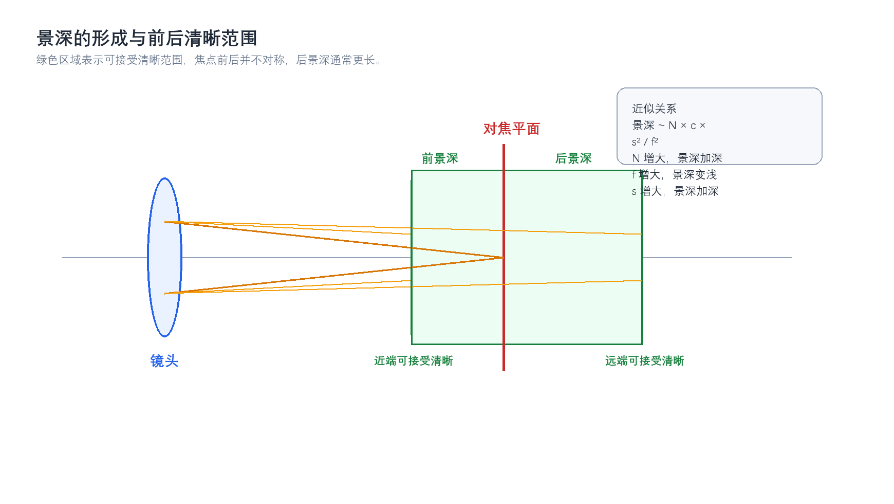

<strong>图8-1 景深的形成与前后清晰范围</strong>

蓝色区域为镜头，红色竖线为对焦平面，绿色透明区域为容许弥散圆约束下的可接受清晰范围。前/后景深分别标出，后景深通常大于前景深。对厚度不均的目标，焦平面应围绕最关键检测特征所在的表面布置，而非几何厚度中点。

### 8.2 哪些因素影响景深？
景深主要受光圈、焦距、工作距离和容许弥散圆影响。近似条件下，总景深常写为：

$$
\Delta L \approx \frac{2 N c s^2}{f^2}
\tag{8-1}
$$

其中，$N$ 为 F 值，$c$ 为容许弥散圆直径，$s$ 为对焦距离，$f$ 为焦距。这个式子揭示出几条最常见的工程规律：光圈收小，景深增加；焦距变长，景深减小；对焦距离拉远，景深通常增加。

> 式(8-1) 为总景深的对称近似式，仅在对焦距离远小于超焦距 $H=f^2/(Nc)$ 时成立；前后景深的不对称需用更完整的前/后景深分式表达。接近超焦距时该近似不再适用。

不过，式（8-1）只适合常规近似讨论。若工作距离不再远大于焦距，或镜头工作在高倍率、显微、远心等特殊区间，就应回到更完整的光学模型。容许弥散圆也不是一个凭经验随意填写的数，它与像元尺寸、测量精度和判定算法密切相关。若系统做的是粗略有无判断，允许的失焦范围会比微小缺陷检测宽得多。

### 8.3 在检测厚度不一致的物体时，如何保证成像清晰？
检测厚度不一致物体时，第一步是先判断厚度变化的几何性质——是整体倾斜平面还是真正的三维起伏。这一步决定后续方向：若目标只是一个整体倾斜的平面，沙姆定律往往比盲目缩小光圈更有效；若目标是真正的三维起伏，缩小光圈、增加工作距离、降低放大倍率或使用多焦点合成才是更常见路径。

最直接的方法仍是适度收小光圈。它通常最容易实施，也不需要改变系统结构，但代价是曝光时间可能增加，运动模糊和照明压力随之上升，过小光圈还会引入衍射软化。对于静态目标，可以采用焦点堆叠，在不同焦点位置采集多张图像并合成全清晰结果；对于倾斜平面，可通过沙姆定律使镜头平面、像平面与目标平面交于一线，从而扩大该平面上的有效清晰范围。

  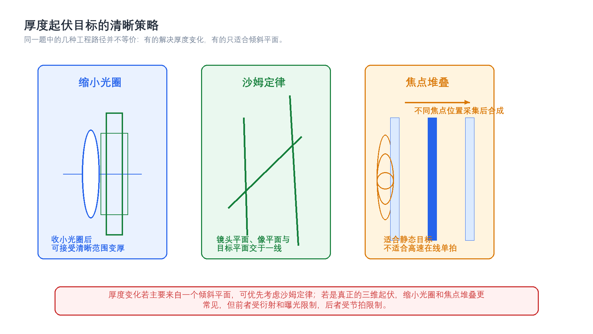

<strong>图8-2 厚度起伏目标的清晰策略</strong>

三种应对厚度变化的策略并列：缩小光圈（增厚清晰范围，代价是照明和衍射压力）、沙姆定律（针对倾斜平面重组焦平面关系）、焦点堆叠（多帧合成，适用静态目标）。选策前应先判断厚度变化来源是单一斜面还是复杂三维结构，再匹配在线/离线条件。

### 8.4 实际应用中的综合考虑
工业检测里保证“清晰”从来不是只靠镜头完成的。照明强度和照明方向、曝光时间、目标速度、平台振动、相机像元尺寸以及算法对模糊的容忍度，都会改变最终的有效景深。对动态目标来说，景深够了却曝光过长，仍会因为运动模糊而失去边缘精度；对高分辨率系统而言，理论景深够了却衍射过强，也会让细节变软。

因此，针对厚度不一致目标的更可靠做法，是把问题拆成三个层面：目标的真实高度分布有多大，关键检测特征位于哪一层，系统允许牺牲多少节拍和多少光通量。只有把这三点说清楚，景深方案才有可能真正落地。

---

---

## 9. 什么是远心镜头？它和普通镜头相比有什么优势？在什么场景下必须使用？

远心镜头在工业视觉中被广泛关注，核心原因是普通镜头在尺寸测量和轮廓判定中会产生透视误差，当精度要求达到一定水平时，这些误差已超出可接受范围。当测量结果依赖边缘位置、放大倍率稳定性和遮挡关系时，远心镜头解决的是几何成像中的透视偏差，关注的焦点是尺寸和位置的精确性，而非一般意义上的清晰度。

### 9.1 什么是远心镜头，它的光学原理是什么？
远心镜头是一类通过特殊光学设计，使主光线在物方、像方或两侧近似平行于光轴的镜头。最常见的是物方远心镜头，它让来自不同物距位置的主光线在进入镜头时保持近似平行，从而在一定工作范围内抑制透视缩放效应。普通镜头中常见的“近大远小”现象，在远心镜头的有效工作区内会显著减弱。

从几何成像角度看，远心镜头的价值在于放大倍率稳定。当目标在小范围内前后移动时，图像中的尺寸变化远小于普通镜头，这对尺寸测量和轮廓提取尤为关键。

从光学设计上看，远心镜头将孔径光阑精确放置在前组焦面，使入射光瞳位于无穷远处——"telecentric"一词源于希腊语 tele（远）和 centre（光瞳中心）。这一设计的物理代价是前组镜片直径必须不小于被测物体视场的对角线尺寸。

### 9.2 远心镜头与普通镜头的主要区别是什么？
普通镜头依赖透视投影成像，物体离镜头更近时，投影尺寸会变大；远心镜头则尽量把这种物距变化引起的放大率波动压低。两者的差异并不只体现在“图像看起来是否自然”，而是体现在边缘位置是否随高度漂移、孔径边界是否被侧壁遮挡改变、尺寸测量是否因姿态变化而波动。

在普通镜头下，立体工件的上表面和下表面往往会对应不同的放大率；对深孔、台阶、外轮廓和薄片边缘而言，这种差异很容易把本来稳定的阈值和测量流程变成漂移源。远心镜头的工作目标，就是降低这种几何不一致。

  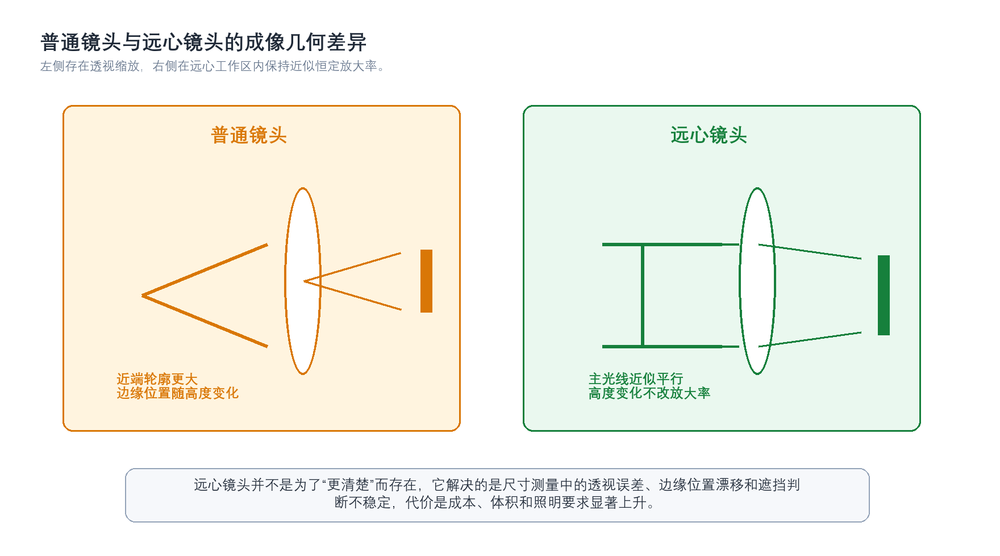

<strong>图9-1 普通镜头与远心镜头的成像几何差异</strong>

左侧普通镜头呈发散投影，目标边缘位置随高度变化（透视误差）；右侧远心镜头主光线近似平行，像方放大率更稳定。当目标存在厚度或高度变化时，普通镜头测到的尺寸会叠加透视误差，远心镜头在一定工作区间内可抑制这一漂移。远心镜头同样有工作距离、景深和像场的边界。

以一个典型数值场景做定量对比：标准镜头（f=12mm，1/3英寸传感器，检测20mm高物体，工作距离s=200mm）在物体沿光轴移动1mm时，像高变化量约为 dH=(ds/s)×H=1/200×20=0.1mm。而远心度约0.1°(0.0017rad)的优质远心镜头在同等位移下仅产生 dH=ds×θ=1×0.0017=0.0017mm的误差，约为标准镜头的1/60。

### 9.3 远心镜头的核心优势有哪些？
远心镜头最突出的优势，是在有效工作区内提供更稳定的放大倍率和更低的透视误差。对尺寸测量来说，这意味着工件轻微高低变化、夹持高度波动或平台平面度误差，不会立刻转化成明显的尺寸漂移。对于背光测量，它还能改善轮廓边界的一致性，使边缘定位算法更容易保持稳定。

另一个常见优势是畸变控制通常更严格。很多远心镜头在设计上会重点压低几何畸变，因此在高精度测量场景里更容易建立稳定标定关系。与此同时，远心镜头对照明方式也更"挑剔"，它常与平行背光、同轴光或更严格控制的照明结构搭配使用，系统整体一致性会比普通镜头方案更高。

从规格上看，高质量远心镜头畸变通常控制在0.1%以内（普通机器视觉镜头可达1%~10%）。需要注意，即使0.1%的畸变，在高分辨率相机下仍可能接近1个像素的误差，高精度测量中仍需软件标定做残余校正。此外，远心镜头的放大倍率在景深范围内保持恒定；平行主光线消除了透视误差（深孔和圆柱腔体的上下边缘会完美重叠而非呈现同心圆）；配合平行背光时边缘定位更清晰；主光线平行还带来均匀的探测器照度。

### 9.4 远心镜头在哪些具体场景下是必须使用的？
只要测量结果直接依赖几何尺度，而目标又存在高度差、姿态波动或厚度起伏，远心镜头就应当被严肃考虑。典型场景包括精密外径测量、引脚宽度与间距检测、玻璃边缘和薄片轮廓测量、冲压件外形尺寸检测、深孔口径与位置判断，以及芯片、基板和精密零件的轮廓分析。

"必须使用"并不意味着所有高精度检测都自动需要远心镜头，而是指普通镜头引入的透视误差已经足以破坏判定稳定性。若工件高度变化极小、允许误差较宽、视野较大且主要做外观识别，普通镜头仍可能足够。判断标准是透视误差是否已经进入误差预算的主导项，而非镜头名称。

一个更直接的工程判据：当物体厚度超过视场对角线尺寸的1/10，或需要在物体的不同平面上完成多种测量时，就应当考虑远心方案。

### 9.5 远心镜头有哪些类型和分类？
按远心特性所在位置，远心镜头可分为物方远心、像方远心和双远心。机器视觉中最常见的是物方远心，因为它直接服务于被测物体侧的几何稳定成像。双远心镜头则在物方和像方都控制主光线角度，性能更强，但代价也更高，体积通常更大。

按应用目的划分，还可分为偏测量型、偏检测型和显微型远心镜头。不同型号在放大倍率、像场、工作距离、远心度和 NA 上差异很大，因此不能把“远心镜头”当成一个单一能力标签。

### 9.6 使用远心镜头时需要注意哪些技术要点？
远心镜头的几个关键参数包括工作距离、视野、放大倍率、远心度、景深、分辨率和适配照明方式。很多选型失误的原因在于忽略了一项边界，例如视野够了但工作距离不够，或者放大倍率合适但照明无法形成稳定背光轮廓。

在实际调试中，照明往往与镜头同等重要。远心镜头配合平行背光时，优势最容易体现；若照明方向杂乱、轮廓阴影复杂，远心镜头的几何优势会被严重削弱。系统还应核对相机像元尺寸与镜头分辨率是否匹配，否则即使透视误差降低，边缘仍可能因采样不足而不稳定。

### 9.7 远心镜头的局限性是什么？
远心镜头的局限并不隐蔽。它通常更贵、更大、更重，照明要求更高，视野扩展成本也更高。对大视野系统而言，远心镜头的尺寸和价格往往增长很快，这也是为什么很多项目宁可在算法或工装上补偿，也不一定直接选用远心方案。

此外，远心镜头不能替代所有系统误差控制。若平台振动、背光不稳、边缘毛刺大或相机采样不足，再好的远心镜头也不能凭空消除这些问题。把所有测量不稳定都归咎于"未采用远心方案"，同样是不严谨的。

从光学原理上看，这一局限无法绕开：前组直径必须不小于被测物体视场对角线，视野越大，镜头体积和成本增长越快，这是物理约束而非制造工艺问题。工作距离也是固定的——偏离标称工作距离后畸变和放大率都会变化。

### 9.8 如何选择适合的远心镜头？
选择远心镜头时，通常应先确定测量精度和最小特征尺寸，再确定视野、工作距离和放大倍率，随后核对像场是否覆盖传感器、分辨率是否覆盖像元尺寸、照明结构是否能够实现稳定轮廓。若工件高度波动较大，还应关注远心工作范围和景深是否足够。

一个更成熟的做法，是把远心镜头纳入整套测量链路验证，而不是只做静态样片试看。真正需要核对的是：工件高度变化后，测量结果是否仍稳定；更换批次后，轮廓阈值是否仍稳定；现场照明变化后，边缘位置是否仍稳定。这些问题只有系统测试才能回答。

选型应遵循固定的优先级：最大物体尺寸→最小前组直径→远心度(<0.1°为优质)→畸变(<0.1%为优质)→景深是否覆盖高度公差→最后再匹配放大倍率和传感器。

> **引用出处**：本章远心镜头的光学原理、定量对比数据、远心度与畸变规格，均参考 Opto Engineering 官方教程 *Telecentric Lenses Tutorial*（www.opto-e.com/en/resources/tutorials/telecentric-lenses-tutorial）。

---

---

## 10. C接口和CS接口镜头的区别是什么？接错了会怎样？

C 接口与 CS 接口的讨论看起来像机械兼容问题，实质上是成像基准距离问题。它们的螺纹规格相同，因此"能拧上"单独看并不可靠——决定是否能正常聚焦的，是法兰距是否与镜头设计值一致。

### 10.1 C接口和CS接口的基本定义和起源是什么？
C 接口和 CS 接口都是小型镜头系统中常见的螺纹安装标准，广泛用于工业相机、监控相机和部分专用成像设备。两者机械螺纹规格相同，都是 1 英寸 32 牙，因此从外观上看很容易被误判为可直接互换。

它们区别的核心在于镜头安装面到传感器成像面的基准距离不同。这个距离一旦不匹配，镜头的后续对焦调节范围就可能完全失效。

### 10.2 法兰距（Flange Focal Distance）的具体数值差异是多少？
C 接口的法兰距为 17.526 mm，工程上常简写为 17.5 mm；CS 接口的法兰距为 12.526 mm，工程上常简写为 12.5 mm。两者的关键差值是 5 mm，这正是常见 C/CS 转接环厚度的来源。

这个 5 mm 差值并不大，但在成像系统里已经足以让焦平面明显偏离传感器位置。对无限远或常规工作距离成像而言，这个误差远远超出可容忍范围。

### 10.3 为什么法兰距的差异如此重要？
镜头设计时默认了一个从安装面到像面的固定基准。若相机实际提供的法兰距比镜头要求更短或更长，镜头形成的清晰像面就不会落在传感器上。此时出现的不是“稍微有点虚”，而是经常根本无法通过对焦环把画面拉回到清晰状态。

对 C 和 CS 系统来说，差异虽然只有 5 mm，但对于小型镜头而言已经是非常大的安装误差。工程上判断接口是否兼容，第一反应不应是“螺纹能不能装”，而应是“法兰距是不是对上了”。

  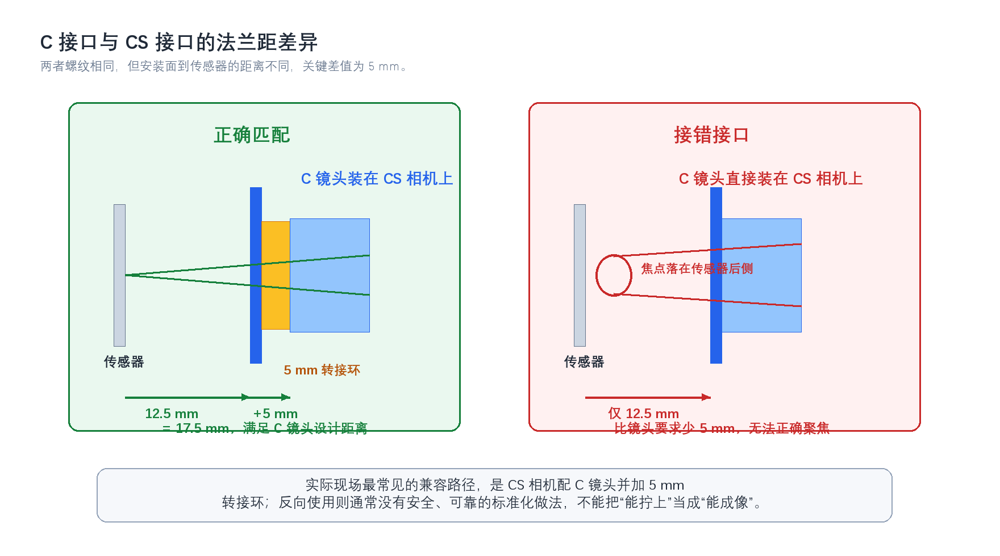

<strong>图10-1 C接口与CS接口的法兰距差异及常见装配结果</strong>

左侧为正确的单向兼容方式：CS 相机前加 5 mm 转接环补偿至 C 镜头的法兰距（17.5 mm）。右侧为误装，传感器位置比镜头设计像面短 5 mm，无法正确聚焦。此类兼容关系为单向，反向将 CS 镜头装在 C 相机上没有同样简单的标准补偿方式。

### 10.4 C接口和CS接口的物理兼容性如何？
从螺纹规格看，两者具有机械兼容性；从光学基准看，两者并不天然兼容。最常见的适配路径，是在 CS 相机上通过 5 mm 转接环使用 C 镜头。这样做的本质，是把相机提供的法兰距从 12.5 mm 补到 17.5 mm。

反向适配则复杂得多。若把 CS 镜头装到 C 相机上，相机本身提供的法兰距已经比 CS 镜头需求更长，通常不能靠简单加件来“补救”。这也是为什么现场常见的标准化建议几乎都是“CS 机身配 C 镜头加环”，而不是两边都能随意互转。

### 10.5 如果将C接口镜头直接安装到CS接口相机会发生什么？
最直接的结果是无法正确聚焦。因为相机提供的像面基准比 C 镜头设计值短了 5 mm，镜头形成的清晰像面落不到传感器位置上。实际画面通常会持续发虚，即便调焦环转到极限，也可能得不到可用清晰度。

某些结构紧凑的系统中，还可能出现机械干涉风险，例如镜头尾部与机身内部结构距离过近。是否会发生干涉，取决于具体相机和镜头结构，不能一概而论，但这类风险在现场并不值得拿设备去试。

### 10.6 如果将CS接口镜头安装到C接口相机会发生什么？
将 CS 镜头装到 C 相机上时，相机给出的法兰距（17.5 mm）比 CS 镜头设计值（12.5 mm）长约 5 mm，导致镜头的像面落在传感器之前约 5 mm 处。结果同样是无法在设计范围内正确聚焦——无限远和常规远距离成像完全无法合焦，仅极近距离可能勉强成像。

这类误装有时会让用户误以为"画面能出来，只是有点糊"，实际上问题在于安装基准本身错误。若继续围绕曝光、增益或软件锐化去排查，只会浪费调试时间。

### 10.7 如何正确判断和选择接口类型？
最可靠的方法仍然是查看相机和镜头的规格书，确认接口类型和法兰距要求。现场若没有文档，也可检查机身或镜头外壳标识。对于已经混装过配件的设备，还应注意前端是否存在遗留转接环，因为同一台相机在不同阶段可能被不同人员改装过。

若系统成像异常，且对焦环无论如何都无法进入清晰状态，排查顺序中应尽早加入接口和转接环检查。这个问题在工程现场比很多人想象得更常见。

### 10.8 转接环的工作原理是什么？
转接环本质上是一个精确厚度的机械垫片，其任务是把镜头安装面整体前移或后移到正确位置。对 C 镜头和 CS 相机的组合而言，5 mm 转接环把原本约 12.5 mm 的机身法兰距补到约 17.5 mm，使镜头按设计工作。

因此，转接环有明确的使用边界。它只能在几何关系允许的前提下补足基准距离，无法解决所有接口混配问题，也无法替代镜头本身的像场、后焦和机械结构匹配。

### 10.9 在实际应用中，哪些领域主要使用哪种接口？
C 接口在工业视觉、显微成像、科学实验和部分医疗设备中很常见，因为工业镜头生态成熟，可选焦距和成像等级丰富。CS 接口更多见于监控、安防和体积较紧凑的摄像系统，它的机身结构通常更短，更有利于小型化。

不过，这种应用分布是常见经验而非绝对规则。具体设备是否采用 C 或 CS，仍要看厂家设计路径和目标市场。工程上更关键的是识别当前设备实际使用的标准，按行业印象推断可能出错。

### 10.10 现代发展趋势如何？
尽管出现了更多新型镜头接口，C 接口在工业视觉领域仍然保持很强生命力，原因并不复杂：标准成熟、兼容广、镜头资源丰富。CS 接口在紧凑型系统里也仍有稳定应用。对于很多项目而言，是否继续使用 C/CS，并不取决于“新不新”，而取决于现有镜头资源、空间结构和成像需求是否匹配。

实际选型时，如果系统需要更大像场、更高稳定性或更特殊的机械结构，也可能转向 F 接口、M42 或其他接口体系。但这属于更高层级的系统设计问题，与 C/CS 的法兰距兼容关系是两件不同的事。

---

## 11. 什么是镜头畸变？它对测量精度有什么影响？如何校正？

### 11.1 什么是镜头畸变？它的物理本质是什么？

镜头畸变的本质可以概括为一句话：**畸变 = 像素位置与真实物理位置的映射关系被改写了**。它不同于散焦和模糊——散焦是边界发虚，噪声是灰度起伏，而畸变是物方原本应保持直线或比例关系的结构在图像中出现弯曲、拉伸或压缩。图像可能仍然清晰，但原本相距 10 mm 的两点，落到图像里后不再按理想比例映射到应有位置。这种偏移来自镜头对离轴光线的成像不完全满足理想投影模型，尤其在视场边缘更容易累积。

对普通观察任务而言，轻微畸变可能只是画面观感上的变化；对尺寸测量、边缘定位、圆度判断和拼接定位而言，畸变会直接进入误差预算。只要测量结果依赖像素坐标的物理意义，畸变就需要单独建模和验证，而不能仅当作光学细节处理。很多初学者容易把它理解成"图像稍微变形了一点"，但工程上的含义要具体得多。系统依据像素坐标判断尺寸、角度、孔距或装配偏差时，每一个像素背后默认对应着某个物理位置。畸变一旦存在，这种对应关系在全视场内不再保持一致，测量结果也就不再稳定。

  

<strong>图11-1 径向畸变的典型形态对比</strong>

图11-1将无畸变、桶形畸变和枕形畸变放在同一连续网格参考下比较，读者应重点观察边缘直线的弯曲方向，而不是只看图案是否“变形”。桶形畸变表现为边界向外鼓出，枕形畸变则表现为边界向内收拢，这种方向差异比名称本身更适合作为初学者的识别入口。它同时提醒读者，径向畸变是整幅视场坐标映射的系统偏移，不是零散局部的随机形变；真实镜头还可能叠加切向畸变、传感器倾斜和装调误差，因此最终判断仍需结合标定结果和实拍验证。

### 11.2 镜头畸变有哪些主要类型？各自的表现特征是什么？

工程上最常见的是**径向畸变**和**切向畸变**。径向畸变沿视场中心向外的半径方向起作用，桶形畸变和枕形畸变都属于这一类，它们的区别不在于名字本身，而在于离图像中心越远时，图像点究竟是被继续向外推开，还是被拉回中心方向。对读者来说，最实用的辨认方法不是去背公式，而是看那些原本应当保持笔直的边界线在画面边缘的弯曲方向。

**桶形畸变**的典型表现是边缘直线向外鼓出，整幅画面像被从中心向四周撑开，因此越靠近边缘，原本平直的网格越容易呈现外凸形态，广角镜头中较常见。**枕形畸变**则相反，边缘直线会向内收拢，画面仿佛被从四角往中心拉回，长焦或部分复杂变焦结构中更容易出现。鱼眼镜头所呈现的强烈弯曲，本质上也可视为大视场下的极端径向畸变，只是通常需要单独的投影模型描述，不能直接沿用普通小畸变镜头的简化判断。

切向畸变与镜头装调误差关系更紧。若透镜组中心轴线不完全重合，或镜头与传感器相对姿态存在偏斜，图像点会沿切向发生偏移，局部结构会表现为不对称扭曲。它不像典型桶形或枕形那样具有很强的整体对称性，往往不会表现成规整的“向外鼓”或“向内收”，而更像某个方向上的局部拉斜、偏移或剪切，因此在高精度系统中更依赖实际标定结果，而不能凭经验估计。

### 11.3 镜头畸变对测量精度会产生怎样的具体影响？

畸变最直接的后果，是**同一物理尺寸在图像不同位置对应不同的像素尺度**。如果系统仍按统一像素当量换算，中心和边缘的测量结果就会分离。对孔径、外轮廓、直线度和圆度等几何特征来说，误差往往不是一个固定偏置，而是随位置变化的非线性误差场。换一种更便于理解的说法，未校正畸变会让系统默认使用一把“刻度不均匀的尺子”：在视场中心，这把尺子可能还比较准；到了边缘，同样的像素间距代表的物理长度却已经悄悄变化。

第二类影响来自形状判断。圆可能被测成椭圆，平行边界可能出现弯曲，直线拟合残差会在边缘区域突然放大。更麻烦的是，畸变还会破坏测量一致性：即便工件本身不变，只要它在画面中的落点改变，结果也可能改变。对自动化检测而言，这会让算法阈值和补偿参数失去稳定基础。工程上最棘手的往往不是某一次测得不准，而是同一件工件在不同工位、不同批次或不同落点下出现漂移，这种漂移很容易被误判为机械不稳、治具偏移或算法波动，实际上根源可能只是几何畸变没有被充分处理。

  

<strong>图11-2 畸变导致的位置相关测量误差</strong>

图11-2用同一尺寸物体位于视场中心和边缘的对比，说明测量误差为何具有明显的位置依赖性。中心区域通常更接近镜头标称成像条件，边缘区域则叠加了更强的径向偏移，因此相同像素计数不再对应相同物理长度。对整幅画面统一测量的系统而言，校正的目的并不只是拉直图像，而是重建全视场的一致坐标关系；若工件始终停留在很小的中心区域，影响可能被压缩，但只要目标位置漂移、视场扩大或需要多工位复用，未校正畸变很快就会成为主导误差源。

### 11.4 如何通过数学模型描述镜头畸变？

工业视觉中最常用的是 Brown-Conrady 模型。设 $(x,y)$ 为归一化理想像点坐标，$r^2=x^2+y^2$，则径向畸变可写为：

$$
x_r = x\left(1+k_1r^2+k_2r^4+k_3r^6\right),\quad
y_r = y\left(1+k_1r^2+k_2r^4+k_3r^6\right)
\tag{11-1}
$$

其中 $k_1,k_2,k_3$ 为径向畸变系数。切向畸变常写为：

$$
x_t = x + 2p_1xy + p_2(r^2+2x^2),\quad
y_t = y + p_1(r^2+2y^2) + 2p_2xy
\tag{11-2}
$$

其中 $p_1,p_2$ 为切向畸变系数。对初学者而言，式（11-1）和式（11-2）不必急于背诵，更重要的是理解它们分别在描述什么：径向项刻画的是点越远离光轴，偏移通常越明显；切向项刻画的则是装调不理想时，图像点会沿非对称方向发生附加偏移。实际校正时，软件依据上述模型做逐像素反向映射，再通过插值重建无畸变图像，这不是简单的线性拉伸。也正因如此，校正后的图像边缘分辨率、插值平滑程度和有效视场范围都可能发生变化，"几何被拉正"不应被误认为是"图像质量在所有方面都同步提高了"。系数的物理意义和符号方向要以具体软件库为准，尤其在 OpenCV、MATLAB 或厂商 SDK 之间比较参数时，必须确认坐标归一化和映射约定是否一致。

> **引用出处**：Brown-Conrady 畸变模型的标准定义与 5 系数向量 $(k_1,k_2,p_1,p_2,k_3)$ 参见 OpenCV 4.x 官方文档——Camera Calibration and 3D Reconstruction 模块，畸变公式与参数说明（[docs.opencv.org/4.x/d9/d0c/group__calib3d.html](https://docs.opencv.org/4.x/d9/d0c/group__calib3d.html)）。

OpenCV 把这个模型表示为一行5列的畸变系数向量：distCoeffs=(k1,k2,p1,p2,k3)，k3主要用于鱼眼或超大视场镜头。在调用 cv2.calibrateCamera() 时，返回的 dist 数组就是这个5系数的向量。工业相机通常只需 k1,k2,p1,p2 四个参数即可满足校准需求。

### 11.5 张正友标定法是如何工作的？它有哪些优势和局限？

张正友标定法（Zhang, 2000, *A Flexible New Technique for Camera Calibration*）以平面标定板（通常为棋盘格）为基准，拍摄多张不同位置和角度的图像，从中同时求解相机内参、畸变系数和每幅图的外参。OpenCV 中对应的核心函数是 `cv::calibrateCamera()`，其典型流程如下：

1. **准备标定板**——打印或固定高精度棋盘格（如 7×6 内角点），标定板应尽量平整。
2. **多角度拍摄**——保持相机不动，将标定板放在不同位置、不同倾斜角度下分别拍摄。图像数量至少 10 张才能稳定收敛。
3. **构建 3D 物点**——将标定板定义在 Z=0 平面上，按实际方格尺寸给出每个角点的世界坐标 $(X,Y,0)$。
4. **提取 2D 角点**——用 `cv::findChessboardCorners()` 检测棋盘格内角点，再用 `cv::cornerSubPix()` 精化至亚像素精度。
5. **执行标定**——调用 `cv::calibrateCamera()` 输入全部物点和像点，返回相机内参矩阵 `mtx`（含 $f_x,f_y,c_x,c_y$）、畸变系数 `dist`（5 个系数 $k_1,k_2,p_1,p_2,k_3$）、旋转向量 `rvecs` 和平移向量 `tvecs`。
6. **评估精度**——用 `cv::projectPoints()` 将物点按标定参数投影回图像，计算投影点与实测角点之间的 L2 范数，再对所有图和点取算术平均，得到平均重投影误差（RMS）。该值越接近零，标定结果越可靠。

张正友标定法之所以被广泛采用，一方面是因为它不依赖昂贵的三维标定设备，仅凭平面标定板即可获得较完整的内参和畸变参数；另一方面是因为 OpenCV、MATLAB 等工具已提供成熟、易操作的封装，降低了入门门槛。局限也同样明确：角点检测质量直接决定结果上限，标定板平整度、光照均匀性、边缘覆盖范围和姿态多样性都会影响拟合稳定性。重投影误差虽能反映参数对当前数据的一致性，却不一定代表真实世界的测量精度，因此高要求的项目还需结合已知尺寸的标准件或精密平移台做二次验证。若镜头是鱼眼、大视场或特殊投影结构，普通 pinhole + Brown 模型往往不够，需切换到 `cv::fisheye` 等更合适的广角模型。

> **引用出处**：OpenCV 4.x 官方文档，Camera Calibration and 3D Reconstruction 模块——`cv::calibrateCamera()`、`cv::projectPoints()`、畸变模型（Brown-Conrady）的定义与使用说明（[docs.opencv.org/4.x/d9/d0c/group__calib3d.html](https://docs.opencv.org/4.x/d9/d0c/group__calib3d.html)）。

在 OpenCV 中，完整流程对应：用 cv2.findChessboardCorners() 检测棋盘格内角点，cv2.cornerSubPix() 精化至亚像素，cv2.calibrateCamera() 一次性求解内参矩阵 mtx（含 fx,fy,cx,cy）、畸变系数 dist（k1,k2,p1,p2,k3）、旋转向量 rvecs 和平移向量 tvecs。该函数返回的 ret 即为 RMS 重投影误差。图像数量至少 10 张才能稳定收敛。

### 11.6 除了张正友标定法，还有哪些镜头畸变校正方法？

除了基于棋盘格的通用标定，工程上还会使用直线约束法、圆点阵列标定、鱼眼专用投影模型和在线自适应校正。直线约束法适合现场没有标准棋盘格但存在大量直边结构的场景；圆点阵列在某些高精度测量中更利于中心定位；鱼眼镜头通常要采用等距投影、等立体角投影（equisolid angle）等专用模型。

还有一种思路是从源头降低畸变，而不是完全依赖软件补偿。例如选择低畸变工业镜头、增大工作距离、缩小有效视场，或者在测量场景中直接采用远心镜头。软件校正可以显著改善几何关系，但无法补回原本不存在的光学分辨率。

### 11.7 在实际应用中如何选择和执行畸变校正？

若任务只是粗略定位或识别，且目标始终位于画面中央的小区域，简单标定往往已足够；若任务涉及整幅画面的尺寸测量、拼接定位或位置一致性比较，就应把畸变校正作为标准流程，而不是可选项。执行时最好覆盖整个视场，尤其不能只拍中心区域，因为模型的约束主要来自边缘。

实际操作中应同时检查三件事：标定板是否足够平整，图像是否有反光和阴影，工作时的焦距、光圈和工作距离是否与标定状态一致。若镜头重新调焦、机台温升明显、镜头或相机被拆装，原先的畸变参数都可能失效，需要重新标定或至少复核。

OpenCV 提供了两条常用路径。cv2.undistort() 一步完成去畸变和插值，适合单张图像或调试验证。cv2.initUndistortRectifyMap() 预计算映射表，再用 cv2.remap() 逐帧应用，批量处理时效率远高于每次调用 undistort。调用 cv2.getOptimalNewCameraMatrix() 时，参数 alpha=0 裁剪全部黑边（保留有效像素），alpha=1 保留全部像素（边缘出现黑边）。

### 11.8 镜头畸变校正后的效果如何验证？

第一层验证是重投影误差，但它不能代替全部工程判断。重投影误差足够小，只能说明模型对标定样本拟合得不错，并不自动保证实际工件测量也达标。第二层验证应当转到应用层：拍摄标准直线、标准圆和标准尺寸件，比较中心与边缘位置的结果是否一致。

更稳妥的做法，是在真实产线状态下做位置扫描测试。让同一标准件在视场不同区域重复采集，统计尺寸漂移、圆心漂移或边缘残差变化。只有当这些指标在工艺容差内稳定收敛，畸变校正才算真正完成，而不是仅停留在标定流程已完成的层面。

重投影误差的定量计算：cv2.projectPoints() 将标定板 3D 角点投影回像平面，与实际检测角点逐点求 L2 范数，取所有图片所有点的算术平均得到 RMS。工程阈值：一般工业检测 <0.5 pixel 可接受，精密测量宜 <0.3 pixel。误差过大的常见原因：标定板不平整（纸板翘曲）、部分角点漏检、拍摄姿态单一（缺少边缘和倾斜角度）。

> **引用出处**：Brown-Conrady 畸变模型、cv2.calibrateCamera()/cv2.undistort()/cv2.initUndistortRectifyMap() 的用法与参数、重投影误差计算公式，参见 OpenCV 4.x 官方教程——Camera Calibration（docs.opencv.org/4.x/dc/dbb/tutorial_py_calibration.html）。

---

---

## 12. 什么是像素当量（或像元精度）？如何计算？

### 12.1 像素当量的基本定义是什么？

像素当量描述的是**一个像素在物方对应多少实际尺寸**，常用单位为 mm/pixel 或 μm/pixel。它把数字图像坐标和真实物理尺寸连接起来，是尺寸换算、位移测量和缺陷定量分析的基础参数。只要系统需要把像素数量换算成物理尺寸，就一定绕不开像素当量。

  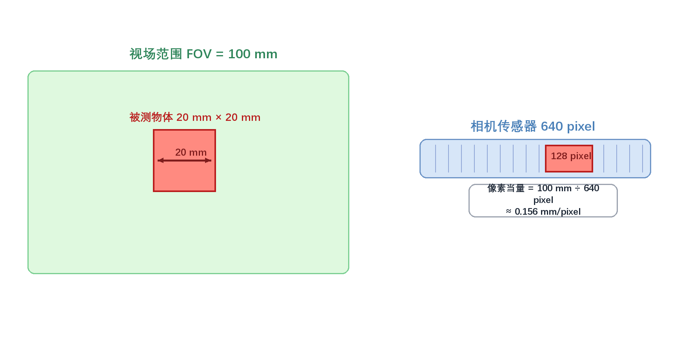

<strong>图12-1 像素当量的物理含义</strong>

图12-1把物方视场、被测物体和传感器像素覆盖关系放在同一框架中，用来说明一个像素对应多少实际尺寸。左侧给出实际视场和目标尺寸，右侧给出目标在像面上占据的像素宽度，二者相除后即可得到像素当量。它提醒读者，像素当量不是由相机单独决定的静态参数，而是视场、镜头放大关系和分辨率共同作用的结果；工作距离、焦距或裁切范围一旦变化，换算关系便应重新计算，必要时还需重新标定。

### 12.2 为什么像素当量在机器视觉中如此重要？

没有像素当量，视觉系统只能告诉你“边缘相距 126 个像素”，却无法回答这到底是 3 mm、30 mm 还是 300 μm。尺寸测量、孔距判断、位置偏差评估和速度换算，本质上都依赖像素到物理空间的比例关系。它还是系统分辨能力判断的起点：当目标最小缺陷尺寸已知时，是否有足够采样密度，首先要落到像素当量上。很多学生在刚接触机器视觉时，会把“分辨率高”直接等同于“测得更准”，而像素当量正是用来纠正这种直觉的核心概念。相机像素再多，如果要看很大的视场，分到每个像素上的物理区域仍然可能很大；反过来，像素数不算极高，但若视场较小、放大倍率合适，也可能得到很细的物方采样。

### 12.3 像素当量的基本计算公式是什么？

最直接的定义式是：

$$
e = \frac{L}{N}
\tag{12-1}
$$

其中 $e$ 为像素当量，$L$ 为已知物理长度，$N$ 为该长度在图像中覆盖的像素数。若已知 10 mm 的标准长度在图像中占据 100 pixel，则像素当量为 0.1 mm/pixel。这个定义式看似简单，却要求测量方向、标定位置和边缘提取方式都与实际任务一致，否则换算值会产生系统偏差。

### 12.4 如何通过视野范围和相机分辨率计算像素当量？

在很多选型阶段，还没有实拍图像，但已经知道系统视场和分辨率，此时可用近似式：

$$
e = \frac{FOV}{R}
\tag{12-2}
$$

其中 $FOV$ 为对应方向上的视场尺寸，$R$ 为同一方向的像素分辨率。若水平方向视场为 50 mm，相机水平分辨率为 1280 pixel，则水平方向像素当量约为 0.039 mm/pixel。这里必须强调“对应方向”四个字：横向视场要除以横向像素数，纵向视场要除以纵向像素数，不能用对角线规格直接混算。

### 12.5 什么是亚像素精度？它如何提高测量精度？

亚像素精度指的是边缘、角点或特征中心的位置估计可以细分到一个像素以内。它依赖灰度分布拟合、边缘响应模型或相关性优化等算法，因此得到的是更精细的位置估计，而不是增加传感器的实际像素数量。在图像质量足够稳定时，亚像素方法常能把位置估计精度提升到像素当量的数分之一甚至十分之一量级。可以把它理解为：相机本身的网格间距没有改变，但算法根据灰度过渡的形状，推断出边缘更可能落在像素内部的哪个位置。也正因如此，亚像素方法对边缘斜率、对比度、噪声和照明稳定性都很敏感，条件一旦恶化，理论上的高精度就很难在现场重复出现。

不过，亚像素建立在基础采样之上，并不能突破采样下限。若目标特征在原图中只占 1 到 2 个像素，边缘又受噪声、模糊和畸变影响，再强的亚像素算法也难以稳定恢复高精度结果。它提升的是定位精度，前提是基础采样已经为算法提供了足够的灰度分布信息。

### 12.6 像素当量计算中的关键注意事项有哪些？

像素当量最常见的误区有四类。其一，横纵方向混用，尤其在非正方像元、裁切传感器或缩放链路中更容易出错；其二，忽略镜头畸变，把边缘区域也按统一比例换算；其三，在非实际工作距离下标定，导致上线后比例关系整体漂移；其四，把理论视场计算值当成最终标定值，不再用标准件复核。

若系统涉及远心镜头、倾斜成像或三维重建，还要区分“局部像素当量”和“全局平均像素当量”。前者更贴近真实测量，后者只适合选型估算。

### 12.7 在实际应用中如何确定合适的像素当量？

合理顺序通常是从任务目标反推：先确定最小缺陷尺寸或允许测量误差，再决定希望该特征至少覆盖多少像素，然后结合视场反推所需分辨率。若以测量为主，像素当量往往要小于目标误差上限；若以识别为主，还要再乘上覆盖系数，保证特征拥有足够形状信息。

例如，若视场为 50 mm，希望对应方向上的**像素当量达到 0.01 mm/pixel**，则至少需要 5000 pixel 的采样。若目标是可靠分辨 0.01 mm 级特征，而不是仅做长度换算，通常还需按采样定理进一步提高覆盖像素数，工程上常按至少 2 个像素覆盖该特征作为下限，再结合对比度、噪声和边缘清晰度留出余量。

### 12.8 像素当量与图像分辨率、像元尺寸有何区别？

像素当量是物方单位，表示一个像素代表多少实际尺寸；图像分辨率是数字图像的像素总数；像元尺寸则是传感器上单个感光单元的物理尺寸。三者虽然相关，却不等价。高分辨率相机若搭配大视场镜头，像素当量仍可能很大；小像元传感器若镜头放大不足，也未必能换来更小的物方采样尺寸。实际教学中，最常见的混淆是把这三个量混成一个“清晰度”概念。更准确的区分方式是：分辨率决定你有多少采样点，像元尺寸影响传感器感光能力、满阱电荷和噪声表现，像素当量则决定每个采样点在物方到底覆盖多大区域。三者共同影响系统性能，但分别回答的是三个不同问题。

### 12.9 现代机器视觉中像素当量的高级应用有哪些？

在二维测量之外，像素当量还会进入速度、加速度和三维深度计算。例如，高速成像中可用“位移像素数 × 像素当量 ÷ 时间”得到实际速度；立体视觉和结构光系统中，像素尺度会进入三角测量模型；显微成像里，像素当量又与放大倍率和数值孔径共同决定最小可分辨结构。

这类高级应用的共同点在于：像素当量不再是孤立系数，而是坐标系统、标定模型和时间同步的一部分。越是高精度系统，越不能把它当作一次计算后永久不变的常数。

---

---

## 13. 线阵相机和面阵相机分别适用于什么场景？为什么纺织品检测常用线阵相机？

### 13.1 什么是线阵相机和面阵相机，它们在成像原理上有何根本区别？

面阵相机通过二维像素阵列一次曝光得到整幅图像，两个空间维度都在同一时刻采样。线阵相机只拥有一行或几行像素，必须依赖目标与相机之间的相对运动，把连续采集到的线数据拼接成二维图像。这个区别理解清楚后，选型判断会顺畅很多。面阵更像一次把整页纸拍下来，线阵更像用一条精细的扫描线逐行扫完内容。因此线阵能把资源集中在横向高分辨率上，但也把运动控制和时间同步带进了成像链路。

这种差别决定了两者的系统边界。面阵适合静态或间歇运动场景，部署和触发更直接；线阵适合连续运动、大幅宽和超高分辨率任务，但前提是运动同步、行频和照明都要受控。

  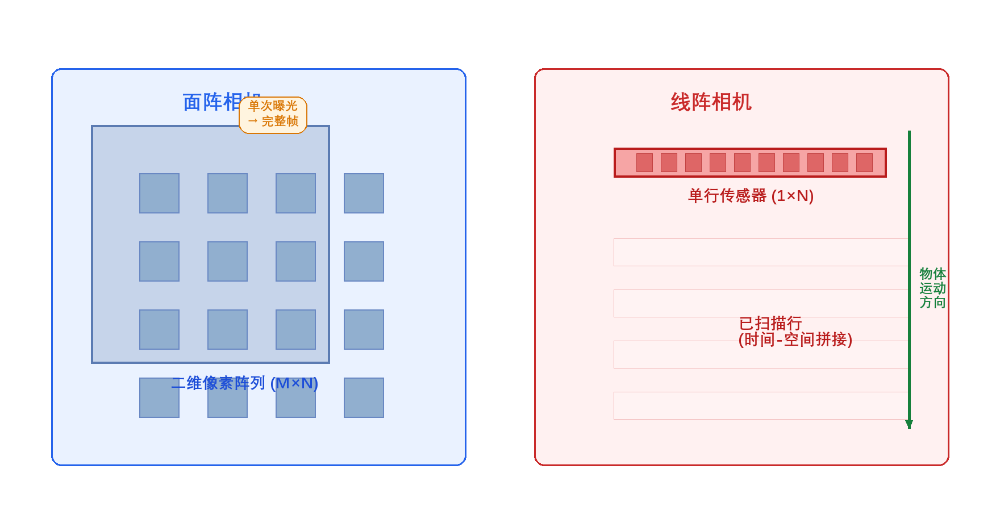

<strong>图13-1 面阵相机与线阵相机的成像方式对比</strong>

图13-1把面阵的一次曝光成像与线阵的逐行扫描成像并置展示，目的是帮助读者区分两类系统在时间和空间上的取样方式。面阵直接得到完整画面，线阵则依赖目标运动和行频逐步拼成二维图像，所以两者的差别不只是传感器形态，更涉及运动组织、同步方式和照明配合。对连续运动且幅宽很大的目标，线阵在横向分辨率配置上更有优势；对静态工位件或瞬时抓拍任务，面阵通常更直接，也更容易部署。

### 13.2 线阵相机通常适用于哪些特定场景？其优势是什么？

线阵相机适合连续运动物体的在线检测，例如纸张、薄膜、钢带、纺织品、印刷品和狭长型材表面检测。它的突出优势是：当目标宽度很大而分辨率要求又很高时，可以把横向像素集中到一条线上，通过扫描获得极高的幅宽分辨能力。对于初学者来说，线阵的价值不妨这样理解：同样预算下，如果任务只关心一条宽幅材料的表面，而不需要一次拍到完整二维静态画面，那么把像素资源都压到关键的横向扫描线上，往往比使用超高像素面阵更实际。

它的价值并不只是像素多。线阵系统通常便于与编码器、线光源和节拍控制协同，在连续生产线上可以把采样间距锁定到较稳定的物理步长。只要运动均匀且同步可靠，纵向比例关系也更容易保持一致。换言之，线阵并不是单靠传感器自身取胜，而是更容易和整套连续运动工艺形成匹配；一旦这种匹配建立起来，宽幅、高速、全检这三个通常彼此矛盾的要求，就有可能被放到同一个方案里实现。

### 13.3 面阵相机通常适用于哪些场景？其优势是什么？

面阵相机更适合静态工位检测、间歇运动目标、抓拍分析和机器人引导等任务。它部署简单，不要求目标持续匀速通过同一条扫描线，很多常规装配检测、条码识别和外观检查都更适合面阵方案。

它的优势在于系统结构直观、算法开发门槛较低、产品选择丰富。对于中小视场、无需极端横向分辨率的任务，面阵通常是性价比更高的默认起点。

### 13.4 从成像质量角度，线阵和面阵相机在检测连续运动的纺织品时有何不同表现？

在连续运动布匹检测中，线阵相机每一行都在相近的照明和几何条件下采样，更容易获得整幅宽度上一致的亮度和纹理表现。若编码器同步稳定，图像的纵向比例也较容易保持均匀。面阵相机若要覆盖大幅宽布面，则往往既要大视场，又要短曝光，还要控制镜头边缘成像、暗角和运动模糊，系统难度会明显上升。

线阵系统中畸变问题同样需要关注。在线阵系统中，光学系统只需覆盖一条横向扫描线，因此更容易把横向像场、照明和分辨率做得稳定。但镜头本身仍可能存在畸变和像场不均，尤其在大幅宽、低放大率系统中，同样需要标定和验证。

### 13.5 为什么纺织品检测对分辨率和检测宽度有极高要求？

纺织品缺陷往往尺寸很小，例如断经、断纬、结节、污点和破洞可能只有亚毫米甚至更小；与此同时，布幅又往往达到 1 m 到 3 m 以上。系统既要覆盖整幅布面，又要对微小缺陷保持足够采样密度，这天然形成了大宽度与高分辨率并存的双重约束。这里的难点并不只在“看得清”，而在于要在整幅材料上都维持近似一致的检测能力。若系统只在局部区域分辨率足够高，而边缘区域明显变差，在线全检的工程意义就会大打折扣。

更进一步，纺织检测通常要求在线全检，不能只抽样看局部。这意味着相机系统不仅要能够检出缺陷，还要在产线节拍下持续、稳定地覆盖整幅布面。

### 13.6 线阵相机如何满足纺织品检测的高分辨率、大宽幅需求？

线阵系统把横向宽度一次性映射到单行像素上，再由布匹运动补出纵向维度。若使用 8192 pixel 线阵相机检测 2000 mm 幅宽布面，则横向像素当量约为 2000 / 8192 ≈ 0.244 mm/pixel；这个数值表示幅宽与像素数之间的换算关系，系统还需结合纵向采样密度和算法验证才能确认是否具备稳定检出亚毫米缺陷的能力。若目标缺陷尺寸继续减小，通常还需要更高横向像素数，或采用多相机拼接方案。

这正是线阵方案适合纺织的原因：面对几米宽的目标，若想维持较小像素当量，单台面阵相机很快会遇到像素数、镜头像场和照明均匀性的综合压力，而线阵更容易把资源集中在真正关键的横向分辨率上。

### 13.7 除了分辨率，线阵相机在纺织品检测中还有哪些技术优势？

线阵检测通常与线光源天然匹配，照明能量集中在当前扫描区域，因此在亮度均匀性、对比度稳定性和功率利用率上都有优势。它还便于逐行处理，系统无需等待整帧图像完全形成后再开始分析，这对高速在线检测有现实价值。

另一项优势是同步控制能力。通过编码器触发，图像纵向采样间距可以直接对应实际位移，这让缺陷定位、长度估算和报警回查更容易与产线坐标系统一。

### 13.8 有没有纺织品检测场景下面阵相机可能更适用？

有。若检测对象是小尺寸静态布样、成衣局部工位、终检工位中的印花和辅料完整性，面阵相机往往更灵活。若任务需要三维结构信息，例如毛球高度、褶皱起伏或表面轮廓，则结构光和三角测量类面阵系统也可能更合适。

这说明纺织检测常用线阵，是因为目标在连续运动、大幅宽和高采样密度方面的需求，而非纺织领域只能用线阵。真正起决定作用的仍是目标是否连续运动、幅宽是否很大、采样密度要求是否极高，以及系统是否具备稳定同步条件。

---

---

## 14. 线阵相机的"行频"是什么？如何根据产线速度和检测精度计算所需的最小行频？

### 14.1 什么是线阵相机的"行频"？

行频是线阵相机每秒能够采集多少行图像的能力指标，单位通常为 Hz 或 kHz。面阵系统用帧率描述整幅图像采集速度，线阵系统则用行频描述纵向采样节拍。它决定了目标在运动方向上的空间采样密度，因此直接关系到纵向像素当量和运动模糊控制。很多学生第一次接触线阵时，会把行频简单理解为“相机刷新的速度”，这个理解不算错，但还不够。更准确地说，行频决定的是目标每移动一小段距离，系统有没有机会再采一行数据；如果这个机会不够密，图像纵向就会变粗，细小缺陷也可能在运动方向上被漏掉。

  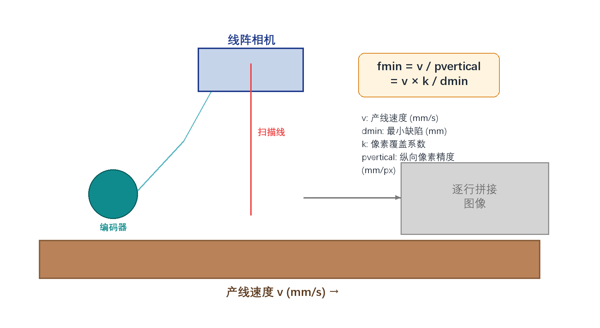

<strong>图14-1 线阵相机行频与产线速度、纵向精度的关系</strong>

图14-1把产线速度、编码器触发、相机行频和纵向采样间距放在同一关系链中，便于把行频理解为系统级参数，而不是相机手册上的孤立指标。它告诉读者，目标运动速度决定了物方位移节拍，编码器把位移转换为采样基准，相机再以相应行频逐行成像，最终形成纵向采样间距确定的图像。只看标称最大行频并不足以判断方案是否可用，曝光时间、接口带宽和同步方式若跟不上，理论行频便无法转化为稳定图像。

### 14.2 行频与产线速度、检测精度之间的关系是什么？

设目标在运动方向上的速度为 $v$（mm/s），纵向像素当量为 $p_v$（mm/pixel），则二者满足：

$$
p_v = \frac{v}{f}
\tag{14-1}
$$

其中 $f$ 为行频。若希望在运动方向上达到更细的采样，即更小的 $p_v$，就必须提高行频；若产线速度上升而行频不变，则纵向采样会变粗，图像可能出现拉伸、压缩或漏采样。式（14-1）的工程含义很直观：单位时间内目标走得越快，而你采到的行数又不增加，那么每一行之间跨过的实际距离就越大；反过来，想让每一行之间的实际间隔变小，就只能让系统采得更快。把式（14-1）改写后，可得到任务所需的最小行频：

$$
f_{\min} = \frac{v}{p_v} = \frac{v \times k}{d_{\min}}
\tag{14-2}
$$

其中 $d_{\min}$ 为最小目标特征尺寸，$k$ 为希望该特征在纵向覆盖的像素系数。这个结果给出的，是检测任务至少要求系统达到的采样速度。若把它翻译成更实用的判断，就是先问自己：想看的最小缺陷有多大，希望它在纵向至少占几个像素；再问产线跑多快；这两个问题一旦确定，所需行频就大致被锁定了。

### 14.3 行频还受哪些物理约束？

式（14-2）给出的是任务侧对行频的下限要求，但系统能否真正工作在该频率，还受曝光时间和读出时间限制。若把单行周期记为 $1/f$，则通常还要满足：

$$
f \le \frac{1}{t_{\mathrm{exp}} + t_{\mathrm{read}}}
\tag{14-3}
$$

这里 $t_{\mathrm{exp}}$ 为曝光时间，$t_{\mathrm{read}}$ 为单行读出及相关死区时间。换言之，行频一端受工艺速度驱动，另一端受相机、接口和照明条件共同限制。如果计算得到的需求值高于系统可提供的稳定行频，说明整套方案已经逼近或超过物理边界，需要重新审视工艺速度、行频余量和照明配置。

### 14.4 完整的线阵相机选型计算流程是怎样的？

更稳妥的流程通常分为五步：先确定幅宽和最小缺陷尺寸，再根据横向分辨率需求选线阵像素数；随后确定纵向允许像素当量，代入式（14-2）得到最小行频；然后检查相机接口带宽、曝光时间、编码器同步方式和处理链路是否支持；最后再留出工程余量，而不是把理论极限当工作点。这个流程的价值在于避免只凭某一个参数做决定，例如只盯着“8K 线阵”“80 kHz 行频”这样的宣传指标。真正可落地的方案，必须让横向分辨率、纵向采样、照明能量、同步精度和数据吞吐同时闭合。

如果系统既要求高速度又要求小纵向像素当量，照明常常会成为真正瓶颈，因为短曝光需要更高瞬时照度。很多线阵方案真正受限的因素往往是光源和同步条件无法在目标速度下长期稳定运行。

### 14.5 实际应用案例：如何计算具体数值？

以产线速度 $v=2000$ mm/s、视场宽度 $W=500$ mm、最小缺陷尺寸 $d_{\min}=0.5$ mm、覆盖系数 $k=2$ 为例。横向所需像素数约为：

$$
N_h = \frac{W}{d_{\min}/k} = \frac{500}{0.25} = 2000
\tag{14-4}
$$

纵向像素当量取：

$$
p_v = \frac{d_{\min}}{k} = 0.25\ \text{mm/pixel}
\tag{14-5}
$$

则最小行频为：

$$
f_{\min} = \frac{2000}{0.25} = 8000\ \text{Hz} = 8\ \text{kHz}
\tag{14-6}
$$

这意味着相机在纵向至少要稳定工作在 8 kHz，工程上通常还会再预留 10% 到 20% 余量，并同步核对曝光、带宽和触发链路。

### 14.6 行频计算中的常见误区和注意事项

第一个常见误区，是只看相机手册上的最大行频，不看实际可用行频。若接口带宽、采集卡缓存、主机处理能力或光源同步能力不足，标称值就无法转化为持续稳定运行。第二个误区，是把纵向采样和运动模糊混为一谈。纵向像素当量取决于位移与行频，而运动模糊取决于曝光期间目标移动了多远，两者相关但并不等价。前者回答的是“采样够不够密”，后者回答的是“边缘会不会在一次曝光里被拖宽”，两者都影响缺陷检出，但需要分别计算、分别控制。

若目标速度为 $v$，曝光时间为 $t_{\mathrm{exp}}$，运动模糊长度可写为：

$$
L_{\mathrm{blur}} = v \times t_{\mathrm{exp}}
\tag{14-7}
$$

通常至少要让 $L_{\mathrm{blur}} < p_v$，否则即使行频满足采样要求，边缘仍会因曝光过长而变宽。

### 14.7 行频与系统其他参数的协同设计

行频要与光源、镜头、同步和数据链路一起设计。高行频意味着更短的单行周期，照明必须在更短时间内提供足够能量；镜头要保证该分辨率下仍有足够对比度；编码器和触发控制要保证等位移采样；接口与主机还要能够承受“行频 × 横向像素数 × 位深”对应的数据量。

因此，线阵系统调不顺时，不应把问题都归咎于相机。很多时候真正需要调整的是光源功率、触发方式、缓存策略或目标运动稳定性。

---

---

## 15. 什么是频闪光源？为什么要用它？它和连续光源在控制上有什么区别？

### 15.1 什么是频闪光源？

频闪光源通过短脉冲而非持续常亮方式发光。它在极短时间内输出较高瞬时光功率，在脉冲间隔期间关闭或维持极低输出，因此常用于高速成像、运动冻结和同步检测场景。当前工业视觉中最常见的是 LED 频闪方案，因为它易于做高速开关控制，且寿命和热管理相对友好。对初学者来说，可以先把频闪理解成“把本来分散在较长时间里的光能量，集中压缩到极短的一瞬间释放出来”，这样就更容易理解它为什么能在不明显拉长曝光的前提下提高成像亮度。

  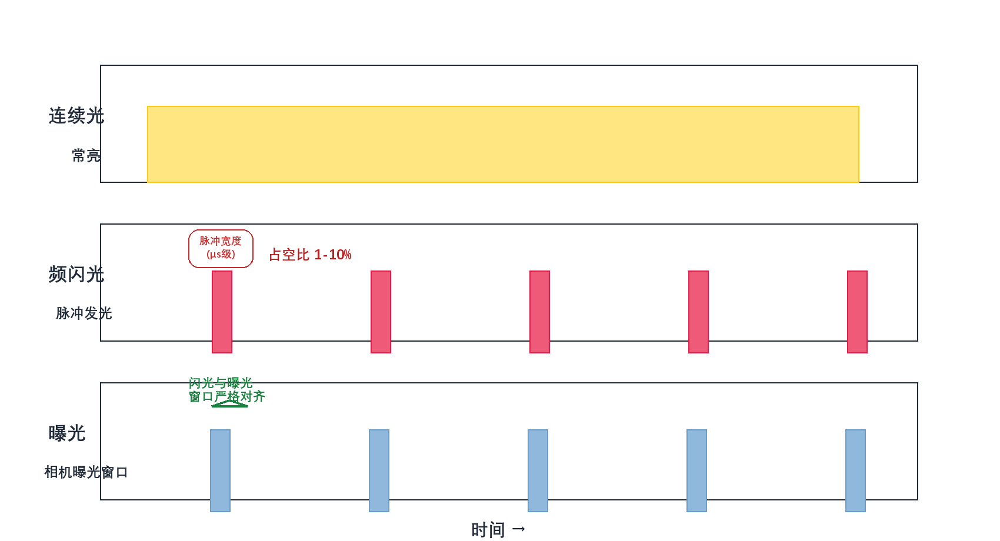

<strong>图15-1 频闪光源与连续光源的时序关系</strong>

图15-1把连续光、频闪脉冲和相机曝光窗口放在同一时间轴上，目的是说明频闪的价值不在于笼统地更亮，而在于把有限能量集中到真正采样的短时间内，并与曝光窗口精确对齐。对高速检测而言，这种对齐直接关系到能否冻结运动、抑制环境光影响并保持每次成像亮度一致。图中仅示意典型占空比和同步关系，具体脉冲宽度、峰值电流和触发延迟仍需结合相机曝光、目标速度和光源过驱能力确定。

### 15.2 为什么要使用频闪光源？

在高速运动场景中，连续光若想获得足够亮度，往往要延长曝光，而曝光一长，运动模糊就会马上出现。频闪光源的价值在于把能量压缩进极短脉冲，使相机可以在更短有效曝光内获得更高瞬时照度。这样既能冻结运动，又能在一定程度上压制环境光干扰。与连续光源相比，频闪的关键不在于总亮度，而在于瞬时发光与曝光窗口的同步配合。连续光的增强受热、功耗和安全边界限制，而且只要曝光时间本身不够短，运动拖影仍然存在。频闪解决的是"在需要采样的那个瞬间，把光打足"。

它的第二个价值是热管理。频闪系统平均功耗未必特别高，但可以在低占空比下获得很高峰值亮度，对一些高速飞拍、线阵同步和重复定位系统尤其有用。当目标静止、节拍宽松、曝光可长时，连续光往往更简单也更稳定，频闪的优势主要体现在高速运动和同步需求突出的场景中。

### 15.3 频闪光源和连续光源在发光特性上有何根本区别？

连续光源在时间维度上近似恒定输出，频闪光源则以脉冲序列方式输出。前者的平均功率和瞬时功率接近，后者则把较高瞬时光功率集中在极短时间内。对相机而言，这意味着连续光更适合稳定观察，频闪更适合在特定时刻完成一次受控曝光。

这个差别也决定了两类光源的设计口径不同。连续光更多关注长期稳定性、照度均匀性和温升；频闪则必须额外关注脉冲宽度、峰值电流、占空比、响应上升时间和触发抖动。也就是说，连续光更像稳态照明设备，频闪更像需要与时间基准精密配合的执行部件，评价它们好坏的尺度并不完全相同。

### 15.4 在控制电路设计上，两者有什么主要差异？

连续光源通常采用恒流驱动，控制目标是稳定输出和温漂控制。频闪光源则需要脉冲驱动、储能和精确时序控制，很多系统还要支持外部触发、延时可调、脉宽可调和过驱保护。两类电路在设计思想上的差异很明显：连续光强调的是长时间稳定供能，频闪强调的则是在很短时间内把能量准确、可重复地送到负载上。

频闪系统还必须特别关注平均电流和峰值电流的界限。很多 LED 能在低占空比下短时过驱，但这种能力始终受结温、脉冲宽度和重复频率约束，不能把短时冲高理解为长期无限加大。

### 15.5 同步控制方面有哪些关键区别？

连续光一般不需要与相机严格对齐，只要照明稳定即可；频闪光则必须把光脉冲和曝光窗口锁在同一时间基准上，否则会出现黑帧、亮度波动或冻结失败。对高速检测而言，同步质量本身就是成像质量的一部分。

  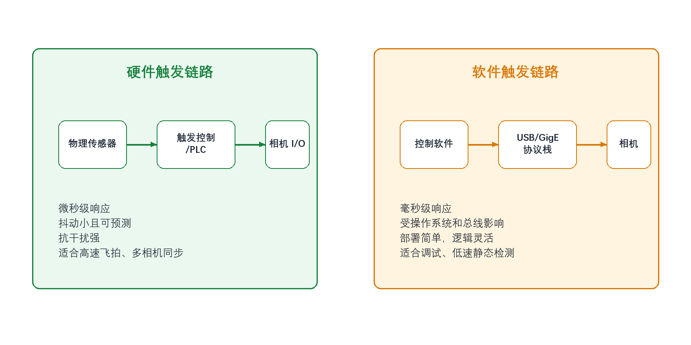

<strong>图15-2 硬件触发与软件触发的控制链路对比</strong>

图15-2对比了两条常见同步链路：硬件触发经由传感器、PLC 或 I/O 直接把时序送到相机和光源控制器，延迟短、抖动小、确定性强；软件触发则经过操作系统、驱动和通信总线，部署更灵活，但时延和抖动通常更大。它帮助读者形成一个实用判断：只要曝光时刻会影响尺寸精度、缺陷定位或多机同步，高速系统就应优先采用硬件触发；软件触发更适合调试、低速静态采集和流程验证。

工程上若需要冻结高速运动、保持多设备时序一致，或把曝光时刻纳入尺寸测量误差预算，通常应优先采用硬件触发，并把传感器、PLC、相机和光源控制器放在同一时间基准下设计。软件触发更适合作为调试、参数验证和低速静态采集手段，在正式高速检测系统中不宜承担关键同步职责。

### 15.6 频闪光源的主要技术参数有哪些？

频闪系统最关键的参数包括脉冲宽度、峰值光强、峰值电流、占空比、触发延迟、上升下降时间和允许频率范围。这些参数相互关联，共同决定了光源能否在目标节拍下稳定工作。其中占空比定义为：

$$
D = \frac{t_{\mathrm{on}}}{T}
\tag{15-1}
$$

这里 $t_{\mathrm{on}}$ 为脉冲点亮时间，$T$ 为周期。占空比越低，系统越有机会在平均热负荷可控的前提下使用更高瞬时峰值，但前提是器件和驱动明确允许这种过驱方式。对初学者而言，一个实用的理解方式是：频闪并不是单纯追求“越亮越好”，而是在峰值亮度、重复频率、热约束和同步精度之间寻找平衡。选型时不能只看峰值亮度，还要确认在目标频率和脉冲宽度下，是否还能稳定、重复地达到该亮度。

---

## 16. 请说出至少五种常见的光源类型（如环形光、同轴光、背光、条形光、穹顶光）及其最适用的检测场景。

### 16.1 环形光（Ring Light）及其最适用的检测场景是什么？

环形光由环状分布的 LED 阵列构成，照明方向围绕镜头轴线对称展开，适合在较短工作距离内提供均匀、稳定、阴影较轻的正向照明。它的优势不在于“什么都能看”，而在于能够把普通零件表面的灰度分布做得比较平顺，便于定位、字符识别和一般外观检测。对高度起伏不大的工件，如电子元件外观、标签字符、平面印刷、孔位定位、小型塑料件装配检查等，环形光通常是上手最快、调试成本较低的一类方案。

但环形光对表面缺陷检测并不总能取得最佳效果。对于镜面金属、深沟槽结构或需要依靠阴影强化微小起伏的场景，环形光往往会把局部差异“照平”，使划痕、毛刺和压痕不够突出。工程上若发现均匀但缺乏对比的画面说明环形光的照明未能有效分离目标特征。

### 16.2 同轴光（Coaxial Light）在哪些检测场景中表现最佳？

同轴光（本质上属于明场照明的一种实现）通过分光镜把光沿镜头光轴方向投向工件，使照明与成像几乎共线。它最适合的对象是平整、高反射、局部细节需要靠反射方向差异来区分的表面，例如抛光金属片、晶圆、玻璃面板、平面电极、金属铭牌、平整标签以及精细蚀刻或刻印区域。对于这类表面，完整平面会把光较稳定地反回镜头，因此背景常表现为较亮区域；刻蚀、凹坑、划痕或局部倾斜面会把反射打散或偏离镜头，于是转为较暗特征。

同轴光的优点是对平面区域的一致性好，容易得到背景均匀、缺陷偏暗的图像，特别适合字符、细线、蚀刻边界和微小表面破坏的观察。从检测机理看，它最擅长建立“均匀亮背景上的暗缺陷”这一类成像结果。对于平坦镜面上的印刷缺陷、蚀刻边界、浅表划痕和局部污染，平整区域会把镜面反射近似原路送回镜头，而缺陷处因法向被破坏、表面转为散射或反射角发生偏移，进入镜头的能量减少，于是缺陷表现为较暗区域。也正因为如此，它特别适合平面性较好、反射方向较稳定的工件，而不适合本身粗糙、漫散射很强的表面；表面一旦太粗糙，背景本身就难以形成均匀回光，图像会失去同轴照明最有价值的那种整洁明亮底面。

工程上常把同轴光与远心镜头一起使用，尤其在高精度测量、平面玻璃或金属面板检测中，这种组合更容易把视场内背景一致性做稳。不过“适合配远心”不等于“必须配远心”。若任务只是中小视场内的平面字符、丝印、浅表划痕或平面缺陷观察，普通工业镜头同样可能得到足够好的结果；只有当透视误差、视场边缘一致性和倍率稳定性开始影响任务结果时，远心镜头的价值才会真正体现出来。它并不擅长处理大曲率或复杂三维曲面，因为一旦表面法向变化较大，反射就不再按整齐的“回光”路径进入镜头，均匀背景很难建立。若目标本身不是近似平面，同轴光往往会出现局部过亮、局部发黑并存的情况，此时更适合考虑穹顶光、漫射方案或多方向组合照明。

来源：[Edmund Optics, Comparing Machine Vision Lighting Techniques](https://www.edmundoptics.com/knowledge-center/application-notes/illumination/comparing-machine-vision-lighting-techniques/)

### 16.3 背光（Back Light）光源最适合什么样的检测任务？

背光把光源放在工件背后，让相机从另一侧观察轮廓投影，因此最擅长的任务不是表面纹理，而是轮廓、边缘、孔径和几何外形。只要目标在可见光下不完全透过，图像中就会形成高对比剪影，边界清晰、阈值分割稳定，十分适合做外径、宽度、间隙、孔位、缺口、毛边以及装配轮廓判定。

透明件和半透明件也经常配合背光使用，例如瓶口轮廓、玻璃边缘、薄膜切边、注塑透明件外形等。需要说明的是，背光看的是“遮挡关系”，而不是正面表面状态。也就是说，它能把轮廓和孔洞看得很清楚，却无法替代正面照明去识别丝印质量、表面划痕或颜色差异。若检测目标既包含尺寸轮廓，又包含表面缺陷，工程上通常会把背光工位和正面照明工位分开处理，而不是试图用一幅图完成所有任务。

### 16.4 条形光（Bar Light）在工业检测中有哪些独特应用？

条形光本质上是一种定向照明。它可以从单侧、对侧或多侧以较大倾角照射工件表面，因此特别适合强化划痕、凹凸、压痕、纹理、折痕和边缘起伏等几何微特征。对金属拉丝面、塑料表皮、玻璃细纹、面板局部压伤、薄膜褶皱等问题，条形光常常比环形光更容易“打出特征”。

它的代价也很明显：条形光具有方向敏感性。与光线近似平行的划痕可能被照得很弱，而与光线有一定夹角的缺陷则会非常明显，因此单条条形光往往存在方向盲区。实际项目中常见的做法是使用两条对射、四条交叉，或者按顺序触发多方向光源分别采图，再从多帧图像中提取最强缺陷响应。换句话说，条形光不是“照得亮”，而是“照得有方向性”，这正是它在表面形貌检测中的价值所在。

  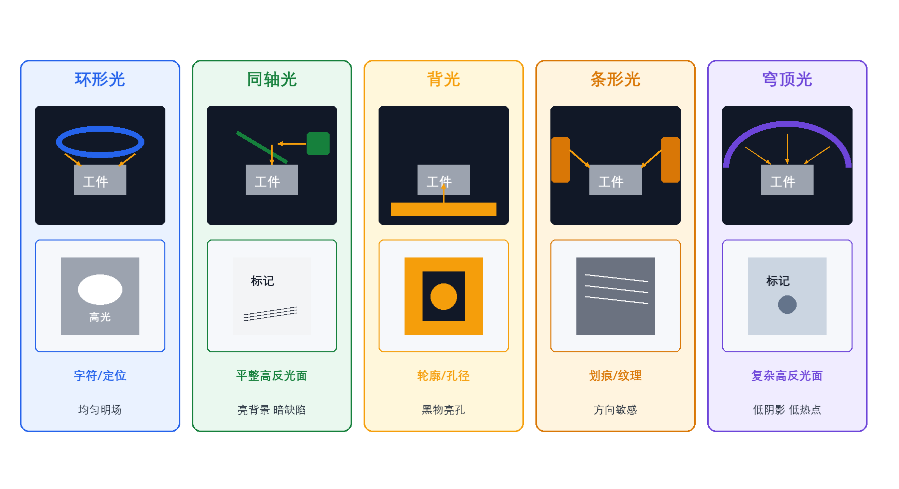

<strong>图 16-1 常见工业视觉光源类型及典型适用场景对比</strong>

图 16-2 把条形光最容易被忽略的“方向盲区”直接摊开来比较。左侧表示左右方向补光时，垂直于光流的划痕更容易形成亮暗响应，而近似沿光流延伸的水平划痕会变弱；中间把照明方向旋转 90° 后，明暗关系随之对调；右侧给出工程上更稳妥的处理方式，即用穹顶光先压低方向敏感性，或采用正交补光、多方向顺序采图。读者从这张图应得到的判断是：定向光并不会“自动看见所有划痕”，缺陷方向未知时，单方向方案的漏检风险必须提前评估。

### 16.5 穹顶光（Dome Light）为什么适合处理复杂表面的检测？

穹顶光（漫射照明的一种典型实现）在半球或穹顶结构内部形成多方向漫射照明，目的不是制造阴影，而是尽量压低局部高光、削弱镜面眩光、降低几何朝向差异带来的亮度波动。对于电镀件、抛光曲面、按键帽、复杂弧面塑料件、金属壳体、带膜层或局部反光明显的外观件，穹顶光能让画面更均匀，减少“某个角度看得见、另一个角度全白”的问题。

不过穹顶光并不适合所有缺陷。它特别适合先把“反光问题”压住，再观察印刷、字符、整体色差和较明显的缺陷；但对于极浅的划痕、极细微的压痕或依赖微小阴影才能建立对比的特征，穹顶光反而可能过于柔和，导致缺陷不够突出。因此它更像一种抑制反光、稳定成像的基础照明，而不是所有细小表面缺陷的首选强化手段。

### 16.6 这些光源类型在实际应用中如何选择？

光源选择应从目标特征出发，而不是先从光源名称出发。若任务依赖外轮廓、孔径、边界或尺寸，优先考虑背光；若任务依赖平整高反光面的字符、刻印或浅表损伤，同轴光更有优势；若任务依赖细小起伏、划痕、毛刺和纹理，条形光或低角度暗场通常更容易建立对比；若工件曲面复杂且高光严重，穹顶光或大面积漫射照明更稳；而环形光则适合作为通用型正面照明，用于定位、识别和普通外观检查。

在工程落地时，还要同时考虑工作距离、安装空间、节拍、景深、镜头视场以及工件姿态波动。有些方案在实验台上效果很好，但一旦进入产线，工件倾斜、振动或位置漂移就会让图像不稳定。可靠的选型建立在场景匹配之上，而非追求"哪种光最好"这种泛化结论。真正可靠的选型体现为：哪种光在允许的安装条件下，对目标特征最稳定、对环境最不敏感。

  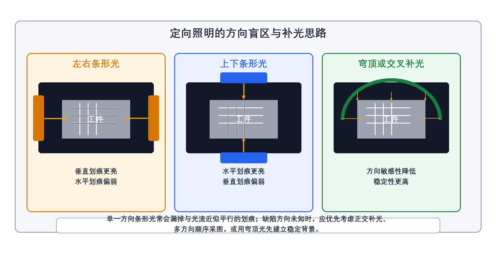

<strong>图 16-2 定向照明的方向盲区与补光思路</strong>

图 16-1 将五类常用光源并列放在同一判断框架中。每一列上半部分是简化的布光结构，箭头表示主要入射方向；中间的小示意块表示图像上更常出现的成像特征，例如背光对应“黑物亮孔”的剪影效果，同轴光对应“亮背景、暗缺陷”的平面反射结果，条形光则更依赖斜入射形成的纹理和划痕对比。读者在使用这张图时，不应只看名称，而应先对照自己面对的是轮廓问题、平面高反光问题，还是微小起伏问题，再反推更合适的照明类别。它适合作为初步选型入口，但不能替代实物打光验证，因为同一类光源的安装高度、入射角、工作距离和扩散方式都会改变实际图像表现。

用于哪种原理 | 注意 |
> |---------|-------------|------|
> | 同轴光 | 明场（平面镜面） | 同轴光是明场的一种实现，并非独立于明/暗场的第三类 |
> | 环形光（正向） | 多为明场 | 环形光低角度安装时也可做暗场 |
> | 低角度环形/条形 | 多为暗场 | "低角度"不等于"暗场"，仍取决于 NA 与入射角的关系 |
> | 穹顶/漫射 | 弱化明暗场对比 | 与暗场作用相反，目的是降低方向敏感性 |
> | 背光 | 透射/轮廓 | 不直接归类于明场或暗场，依赖遮挡而非反射建立对比 |
>
>理解这层关系后，就不会把"暗场"等同于"某种灯"，也不会在同轴光和明场之间画蛇添足地寻找区别。

---

## 17. 什么是明场照明和暗场照明？为什么暗场更适合检测透明物体表面的划痕？

### 17.1 什么是明场照明？它的工作原理和特点是什么？

明场照明的本质，是让来自平整背景的主要反射光能够进入镜头。对反射式视觉系统而言，如果照明方向落在镜头的有效接收范围内，那么平整区域会比较亮，目标与背景之间的差异主要来自反射率差异、吸收差异或颜色差异。这类照明在印刷检查、字符识别、一般外观定位、颜色分选等任务中最常见，因为它容易得到整体亮、噪声低、细节完整的图像。

在工程表达中，经常用照明角与镜头接收锥的关系来描述明场条件。若照明角位于镜头数值孔径所对应的接收范围内，平整表面的镜面反射就可能被镜头收集，背景因而变亮。对粗糙物体或漫反射材料，这个判断不会像理想镜面那样严格，但“背景主信号能否进入镜头”仍然是区分明场与暗场的实用依据。

### 17.2 什么是暗场照明？它与明场照明的根本区别在哪里？

暗场照明与明场照明的根本差别，不在于“灯装得高还是低”，而在于平整背景的主反射光是否被镜头主动排除。明场照明的特征，是让来自平整背景的主要反射直接进入镜头，因此背景明亮，表面上那些改变反射方向的凸起、刻痕或缺陷常会变暗，或者主要依靠反射率差来成像。暗场照明则相反，它让光线以较低角度、也就是更接近掠射的方式入射，平整表面的镜面反射被有意安排到镜头接收范围之外，于是背景保持较暗；只有划痕、毛刺、边缘、颗粒和其他几何突变处产生的散射或衍射光进入镜头，所以这些特征反而变亮。

这一定义说明了一个常被忽略的问题：明场和暗场由照明角与镜头接收能力共同决定，属于相对关系，不应脱离镜头参数单独按绝对角度归类。同一照明角度，换一支数值孔径更大的镜头，原本属于暗场的光线可能重新进入镜头，结果就不再是暗场成像。因此在讨论照明方式时，必须把光源角度、工作距离和镜头参数放在一起看。

若用数值孔径作简化描述，可将两种条件写为：

$$
\theta_{\mathrm{illum}} < \arcsin(\mathrm{NA})
\tag{17-1}
$$

$$
\theta_{\mathrm{illum}} > \arcsin(\mathrm{NA})
\tag{17-2}
$$

式中，$\theta_{\mathrm{illum}}$ 为照明光线与表面法线之间的夹角，$\mathrm{NA}$ 为镜头数值孔径。数值孔径 $\mathrm{NA}=n\sin\theta$，$\theta$ 为镜头能接收的最大半锥角，$n$ 为介质折射率（空气中约为 1）；NA 越大，镜头能收集的光锥越宽，对偏离光轴的光线接收能力越强。式（17-1）更接近明场条件，式（17-2）更接近暗场条件。实际系统中由于工件并非理想光学面，上式更适合作为设计与调试的判断基线，而不是脱离场景机械套用的绝对阈值。

对玻璃划痕、金属毛刺、浅表凸起和边缘崩口这一类形貌突变缺陷来说，暗场通常比明场更容易建立高对比度，因为它压低了平整背景的能量，只保留异常结构改变光线路径后的那一部分响应。也正因为背景本来就是暗的，细小缺陷的亮响应更容易从图像中被分离出来；若换成明场，平整背景本身已经很亮，这些微弱差异往往会被淹没。

来源：[Edmund Optics, Comparing Machine Vision Lighting Techniques](https://www.edmundoptics.com/knowledge-center/application-notes/illumination/comparing-machine-vision-lighting-techniques/)

### 17.3 暗场照明的光学实现方式有哪些？

工业现场常见的暗场实现方式包括低角度环形光、低角度条形光、侧向掠射光以及显微系统中的专用暗场聚光结构。它们虽然结构不同，但目标一致，都是让平整面的主反射离开镜头，同时保留缺陷产生的散射或衍射分量。对大视场工业相机而言，低角度环形光和多方向条形光最常见；对玻璃、晶圆、抛光金属等平整样品，掠射暗场通常能得到很高的缺陷对比。

选择具体方案时，不能只看“是否暗场”，还要看照明是否均匀、缺陷是否存在方向性，以及工件表面本身是不是足够平整。若背景表面粗糙或曲率变化太大，背景会自己散射发亮，暗场的优势就会明显下降。

  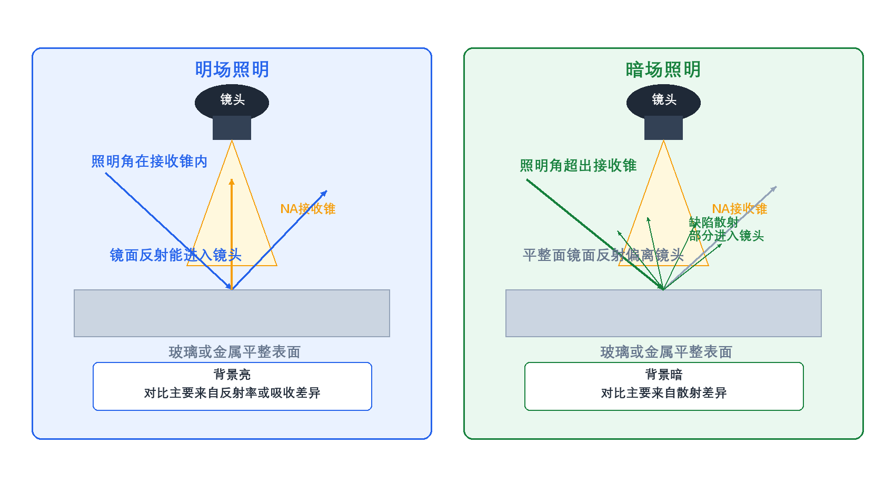

<strong>图 17-1 明场照明与暗场照明的成像路径对比</strong>

图 17-2 左侧用临界角随 NA 变化的关系，把“同一照明角并不总对应同一种成像模式”这件事画成了可直接判断的图。图中的 20° 水平线说明，20° 对小 NA 镜头已经可能落入暗场条件，而对大 NA 镜头仍可能属于明场范围。右侧再给出两组典型工况，把明场预设与暗场预设的背景和划痕表现并列出来。它帮助读者把第 17 题真正读明白：明场、暗场不是固定灯型标签，而是照明角与镜头接收锥共同作用后的结果。

### 17.5 暗场照明检测玻璃划痕的具体物理原理是什么？

当低角度光线照射到完整玻璃表面时，平整区域的主反射方向大多偏离镜头，背景保持较暗。若表面存在划痕，划痕两侧的细小坡面、沟槽边缘和微裂纹会改变局部法向，使部分光线向多个方向散射，其中一部分正好落入镜头接收锥，于是划痕在图像上表现为亮特征。背景暗、缺陷亮，是暗场检测玻璃划痕最核心的成像逻辑。

若从尺度上看，划痕尺寸远大于波长时可按几何散射理解，由微小斜面、沟槽和粗糙边缘改变光线方向；当划痕尺度接近或小于波长时，则进入衍射主导区，散射行为不再能用几何近似描述。无论哪种情况，短波长光对细微结构通常有更好的响应，因此蓝光或更短波长光常能提升浅表缺陷的可见性，但这种提升并非无条件成立，仍需结合玻璃厚度、镀膜状态和镜头接收条件做实拍验证。不过这种提升并非无条件成立，仍需结合玻璃厚度、镀膜状态、污染情况和镜头接收条件做实拍验证。

### 17.6 为什么暗场照明比明场照明更适合检测玻璃划痕？

因为玻璃划痕的可检测性主要来自散射差异，而不是反射率差异。明场照明会让完整玻璃背景本身很亮，划痕造成的局部微弱变化容易被高亮背景淹没；暗场照明则主动压低完整背景，只让缺陷相关的散射进入镜头，于是信噪比明显改善。对浅划痕、细裂纹、边缘崩口和细小擦伤而言，这种差异常常足以把“几乎看不见”的问题变成“非常容易分割”的问题。

暗场有其适用范围。若玻璃表面本身存在较大波纹、脏污、镀膜不均、贴膜褶皱或整体曲率变化，背景也会产生显著散射，导致整幅图像发灰，缺陷反而不突出。遇到这类情况，常需要把暗场与偏振、背光、同轴或多角度顺序采图结合使用。

### 17.7 暗场照明在工业检测中的实际应用场景有哪些？

暗场照明适合观察那些“平时不明显，但会改变光线路径”的微小表面特征。典型场景包括手机盖板玻璃划痕、显示面板细纹、光学镜片擦伤、抛光金属压伤、晶圆表面颗粒、刀具刃口毛刺、薄膜折痕以及涂层针孔等。这些对象的共同点不是材料相同，而是都依赖微小几何变化来建立对比。

在量产线上，暗场经常与自动阈值分割、边缘增强或缺陷长度统计结合使用，因为它提供的是较干净的“黑底亮缺陷”图像。只要照明稳定，后续算法往往可以保持相对简洁。

### 17.8 暗场照明技术的局限性是什么？

暗场对表面状态和照明几何都比较敏感。被测物若过于粗糙、曲面过强、姿态波动过大或光源均匀性不足，背景就会被意外点亮，原本清晰的缺陷响应会迅速下降。另一个实际限制是方向性：某些划痕在某个方向上很亮，换一个方向后可能明显减弱，因此对于未知方向缺陷，单一方向暗场往往不够稳妥。

此外，暗场更擅长“发现有异常”，却不一定擅长“精确测量异常的真实深度或体积”。当任务不仅要求检出，还要求对缺陷形貌进行定量评估时，往往需要结合共焦、白光干涉、结构光或多角度光度立体等手段。

  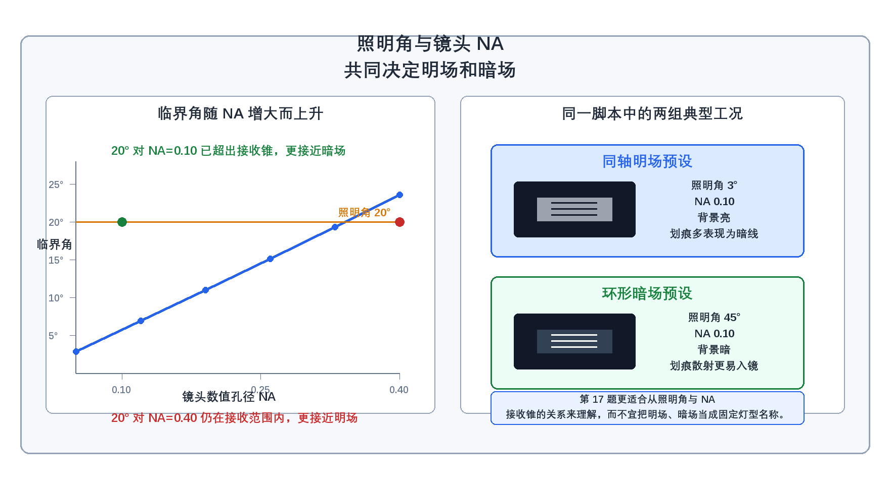

<strong>图 17-2 照明角与镜头 NA 共同决定明场和暗场</strong>

图 17-1 左侧表示明场条件，照明方向位于镜头接收锥范围内，平整表面的主反射能够进入镜头，因此背景偏亮，缺陷主要依靠反射率或吸收差异体现。右侧表示暗场条件，照明角超出接收锥，平整面的镜面反射被排除在镜头之外，只有缺陷造成的散射分量部分进入镜头，图像于是表现为暗背景上的亮特征。这张图帮助读者建立一个比“灯装在哪儿”更准确的判断标准：明场与暗场并不是固定角度名称，而是由照明几何和镜头接收能力共同决定的成像关系。它适用于平整表面或近似镜面对象的理解，对粗糙漫反射物体则只能作为近似示意。

---

---

## 18. 在检测高反光金属表面时，通常采用什么照明方式来消除反光？

### 18.1 为什么高反光金属表面检测具有挑战性？

高反光金属表面更棘手的问题不是单纯太亮，而是镜面反射把无关光也忠实送进了镜头。当光源、环境反射或设备内部结构形成强烈高光时，图像中局部区域会过曝。此时，真实的划痕、压痕、蚀刻、打码和污渍信息被遮盖。更关键的是，灰度分布也会随工件姿态轻微变化而大幅波动，这会直接影响后续阈值和边缘提取的重复性。对自动检测来说，这种不稳定性往往比单纯亮度高更棘手。

此外，金属表面并不都是同一种反光。抛光不锈钢、拉丝铝、阳极氧化件、电镀件、喷涂金属件和覆膜金属件的反射行为差异很大。工程上如果只用金属反光所以加某种灯这种简单判断，常常会在量产阶段遇到稳定性问题。

### 18.2 什么是同轴照明技术，它如何配合远心镜头消除反光？

同轴光沿镜头方向入射，完整区域会较稳定地把光回送到镜头，因此背景均匀明亮；刻蚀、凹坑、划痕、印字和局部倾斜面则把反射偏离镜头，形成暗特征。此时我们并没有让反光消失，而是把反光变成了可利用的成像基础。

远心镜头在这类任务中常有帮助，尤其是在高精度测量、视场边缘一致性要求高或工件高度变化较小时，它能减轻透视误差并提高成像一致性。但必须说明，同轴光并不总是必须配远心镜头。若任务只是观察较小视场内的平面刻印、字符或局部表面缺陷，普通镜头同样可能得到可用结果。是否需要远心，取决于视场大小、尺寸精度要求、工件平整度和背景一致性目标，这些因素远比"高反光金属"这一材质标签更具决定意义。

### 18.3 偏振光技术如何与偏振片配合消除反光？

偏振技术适合处理那些反射中带有较强偏振保持特性的场景。常见做法是在光源端加入起偏器，在镜头端加入检偏器，并将两者调成近似正交，从而压制一部分镜面眩光。对于塑料保护膜、喷涂表面、玻璃盖板、复合材料、阳极氧化层或带透明介质覆盖的金属表面，这种方法通常能明显降低刺眼高光，让下面的纹理、印刷或缺陷更容易显现。

但对裸露、抛光的金属镜面，交叉偏振并不是无条件有效。金属反射对偏振态的影响比普通介质更复杂，很多情况下并不能像处理塑料和玻璃那样干净地把眩光压掉。因此偏振片是很有价值的工具，但它的作用边界是明确的：偏振片通过筛选反射分量来抑制特定眩光，对裸金属镜面的效果则需单独验证。

### 18.4 低角度照明（暗场的常见实现）如何突出表面特征？

低角度暗场通过掠射入射把平整背景压暗，让划痕、毛刺、压伤、滚压纹、冲压边和微小凸起因散射而发亮。对很多抛光金属件来说，真正需要看的并不是整面背景，而是那些破坏表面连续性的局部几何异常。这类异常在低角度照明下通常比在同轴或普通正面照明下更醒目。

它的局限同样来自方向性。沿光线方向延伸的缺陷可能不明显，垂直于光线方向的缺陷却会很强，因此常要通过双侧、四侧或旋转方向补光来降低漏检风险。若检测对象缺陷方向未知，只用单一条形暗场往往不够稳妥。

### 18.5 漫反射照明如何减少镜面反射？

大面积漫射照明、穹顶光或积分式照明的作用，是把原本集中在某个方向上的高光“摊平”。从照明机理看，穹顶光和大面积漫射板会把光从四面八方较均匀地送向被测物，每一个方向上的入射能量都不再特别尖锐，因此即使对象是镜面材质，也不容易只在某一个方向形成刺眼的单一高光。这样做不能让物体失去反射特性，但能显著降低局部饱和亮斑，使复杂曲面的亮度变化更平缓。对外观检查、喷涂均匀性、字符识别和整体观感判定等任务，漫反射照明往往比硬质定向光更稳定，尤其适合多曲率表面和多角度高光同时存在的对象。

不过漫反射照明的代价也很明确。因为方向性被大幅削弱，表面微小起伏带来的阴影与散射差异也会随之减弱，所以它对浅划痕、轻微压痕和细小毛刺的增强能力通常弱于同轴光或暗场照明。若检测目标正是这类细微形貌缺陷，仅靠穹顶光往往不够，还需要与暗场、同轴或多方向补光结合使用。

来源：[Edmund Optics, Comparing Machine Vision Lighting Techniques](https://www.edmundoptics.com/knowledge-center/application-notes/illumination/comparing-machine-vision-lighting-techniques/)

### 18.6 多光源组合照明策略有哪些优势？

组合照明的核心价值在于：不同缺陷依赖不同的对比机制，任何单一照明都难以同时兼顾。因此，可靠的选型思路是按缺陷机理匹配光源——同轴光适合看平面刻印和蚀刻边界，低角度暗场适合看划痕和毛刺，穹顶光适合压制复杂曲面的热斑和环境反光，偏振方案适合处理覆膜、涂层或透明介质引起的眩光。顺序触发多光源、分别采图，再进行规则融合或算法融合，通常能获得更可靠的产线结果。

这也是很多成熟项目最终选择的路径：不是执着于找到“一种终极照明”，而是建立一套与缺陷机理相匹配的多通道成像方案。

### 18.7 在实际应用中如何选择最合适的照明方案？

对高反光金属表面，选型时应先问清楚四件事：被测面是平面还是曲面；要看的是文字、刻印、轮廓，还是划痕、压痕、毛刺；表面是裸金属、电镀、拉丝、喷涂，还是覆膜；检测目标是“发现缺陷”还是“测量尺寸”。若是平整镜面上的平面图文或浅表结构，可先试同轴光；若是划痕、毛刺等微小几何异常，可优先试低角度暗场；若是复杂曲面外观件，常从穹顶或大漫射光开始；若表面覆盖透明介质或膜层，偏振方案值得优先验证。

真正决定方案能否落地的，仍是样件验证。因为相同材质名称下，粗糙度、镀层、油膜、保护膜、加工纹理和环境反射都会改变结果。工程上最稳妥的做法，是围绕目标缺陷制作一组代表性样件，在固定镜头、工作距离和节拍条件下，逐项比较图像对比度与稳定性，而不是只凭经验标签做判断。

### 18.8 先进的照明技术发展趋势是什么？

近年的趋势并不只是“灯更亮”，而是照明更可控、信息更可分离。多通道顺序照明、偏振成像、线偏振与圆偏振切换、分区独立调光、光谱分段照明以及与算法联动的主动视觉，都在帮助系统把“反光”拆解成更有意义的成像分量。对于要求更高的场景，照明已经不再只是辅助部件，而是检测能力本身的一部分。

  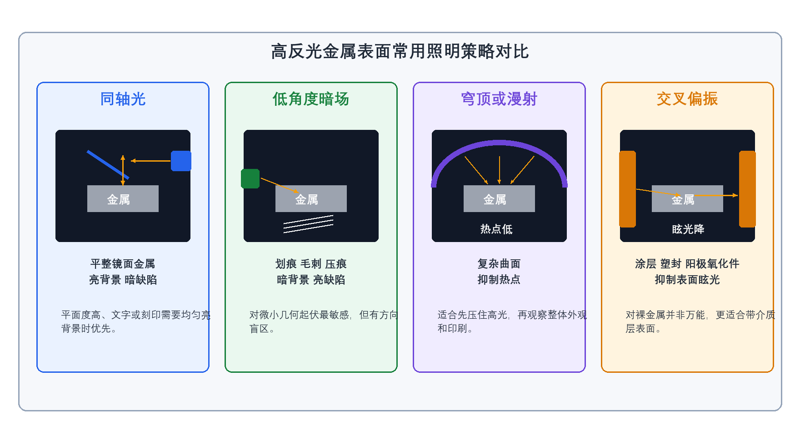

<strong>图 18-1 高反光金属表面常用照明策略对比</strong>

图 18-1 把高反光金属表面常见的四类处理思路放在同一页中比较。左起第一列的同轴光适合平整镜面背景，优势是背景均匀、字符或缺陷容易转为暗特征；第二列的低角度暗场依赖掠射散射，适合划痕、毛刺和压痕，但存在方向盲区；第三列的穹顶或漫射照明用于压低复杂曲面的热斑，让整体外观更稳定；第四列的交叉偏振更适合带膜层、涂层或介质覆盖的表面，对裸金属并非万能。读者应从图中得到的判断不是“哪种最好”，而是“哪一种在当前缺陷机理下最容易建立稳定对比”。这张图适合做方案初筛，最终仍须结合样件、姿态波动和产线节拍验证。

---

---

## 19. 偏振片在视觉系统中的作用是什么？如何使用？

### 19.1 什么是偏振片，它的基本工作原理是什么？

偏振片是一种只允许特定振动方向光波通过的光学元件。自然光的电场振动方向通常是随机分布的，而线偏振片会选出其中一个方向的分量，让通过后的光具有明确的偏振方向。若再放置第二片偏振片，并旋转其透振方向，就可以控制第一片出来的光能否继续通过。

在理想情况下，两片偏振片透振方向夹角为 $\phi$ 时，透过强度可近似写为

$$
I = I_0 \cos^2 \phi
\tag{19-1}
$$

式中，$I_0$ 为进入第二片偏振片之前的光强，$I$ 为透过后的光强。式（19-1）给出了偏振系统最基本的调节规律，也是机器视觉中用偏振片压制眩光的理论基础。

### 19.2 偏振片在计算机视觉和机器视觉系统中有哪些主要作用？

偏振片最常见的作用是抑制眩光，提高表面纹理、印刷、涂层不均、应力痕迹和局部缺陷的可见性。对于玻璃、塑料、薄膜、液晶相关元件、喷涂件以及带透明覆盖层的工件，它往往能显著改善图像质量。除此之外，偏振信息还可用于更高

在一般工业系统中，偏振片首先是一种“把无用高光减下去”的工程工具，其次才是研究型偏振信息传感器的一部分。把这两个层次区分开，能避免在普通项目中过度设计。

### 19.3 在机器视觉系统中，如何使用偏振片完全消除反光？具体操作步骤是怎样的？

更准确的说法应是“尽可能压制特定类型的镜面眩光”，而不是在任何材料上都“完全消除反光”。标准做法是在光源端安装起偏器，在镜头端安装检偏器，然后旋转检偏器，使其透振方向与起偏器近似正交，也就是常说的交叉偏振。这样一来，若某些反射分量在传播后仍大致保持原有偏振方向，它们通过检偏器时会被明显抑制；而由表面粗糙、体散射或退偏振产生的分量，仍可能有一部分进入镜头，于是与真实纹理、印刷或缺陷相关的信息得以保留。

实际调试通常按如下顺序进行。先单独安装光源端偏振片，使照明方向稳定；再在镜头前安装检偏器，观察图像中高光区域的变化；随后缓慢旋转检偏器，寻找高光最弱、目标特征仍清晰的角度；最后在代表性样件上检查是否因为抑制过度而损失了有效信号。若工件存在多种表面状态，仅以一块样件得到的最佳角度往往不够，需要扩大验证范围。

### 19.4 使用偏振片时需要注意哪些关键问题和技术挑战？

第一，偏振片会带来光通量损失，系统曝光时间、光源功率和相机增益都可能需要重新匹配。第二，交叉偏振对不同材料的效果差异很大，对玻璃、塑料、涂层和膜层通常较有效，对裸露镜面金属则不一定理想。第三，若镜头前还有保护玻璃、滤光片或倾斜窗口，这些元件本身也可能引入偏振态变化，导致最优角度偏离理论值。

还要注意一个常见误区：偏振片抑制的是一部分与偏振态相关的眩光，不是所有“亮”的东西都应被压掉。有些检测任务本来就依赖镜面反射建立对比，例如某些平整金属刻印或镀层缺陷，此时过度追求压光，反而会让有效信号变弱。偏振是否值得上，最终还是要看它对目标缺陷的可见性究竟是增强还是削弱。

  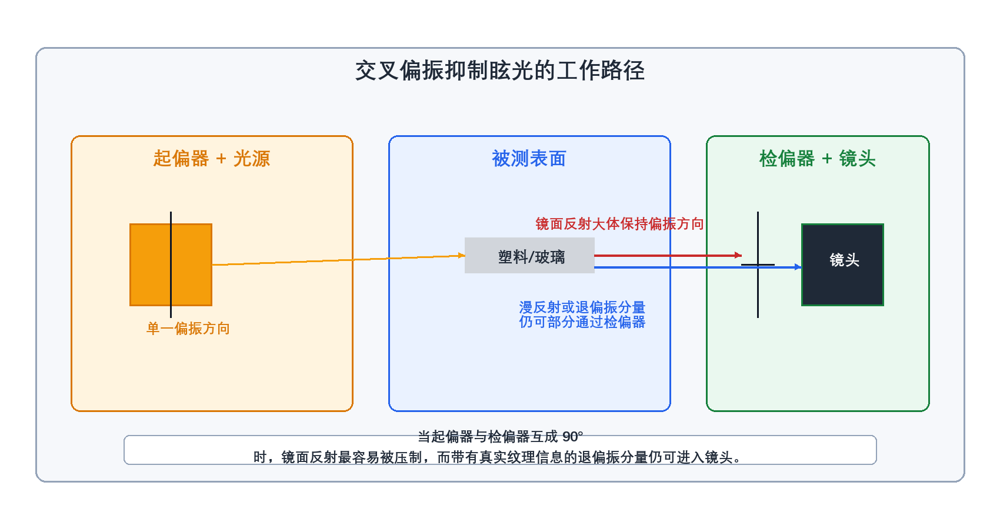

<strong>图 19-1 交叉偏振抑制眩光的工作路径</strong>

图 19-1 从左到右依次画出了起偏器与光源、被测表面、检偏器与镜头之间的关系。左侧的起偏器把原本方向杂乱的照明约束为单一偏振方向；中间的表面会把这束光分成两类成分，一类是仍保持较强偏振特征的镜面反射，另一类是因粗糙、体散射或退偏振而偏振状态被打乱的分量；右侧的检偏器与前一级近似成 90° 时，前一类分量更容易被压制，后一类则仍可能部分通过。读者应由此理解交叉偏振真正做的是“筛选反射分量”，不是对任何表面一概清除高光。它适用于带介质层或眩光明显的场景，对纯裸金属镜面效果则需要单独验证。

---

---

## 20. 如何为视觉系统选择合适的光源颜色（如红、蓝、绿、白、红外）？蓝色光源为什么常用于检测金属表面？

### 20.1 视觉系统中光源颜色的基本原理是什么？

所谓光源颜色，本质上是照明波长分布的差别。不同波长与材料相互作用时，在反射、吸收、透射、散射、荧光激发和传感器响应上的表现并不相同，因此最终影响图像对比。为视觉系统选颜色，应先明确需要哪一部分变亮、哪一部分变暗，以及这种差异来自哪一种物理机制，而非仅问工件是什么颜色。

如果系统使用黑白相机，最终只采集灰度，颜色名称本身并不直接进入结果，真正有意义的是不同波长下的反射差异与相机量子效率差异。若系统使用彩色相机，颜色信息才会更直接地参与分割、识别和显示。

### 20.2 如何根据被测物体颜色选择光源颜色？

对彩色物体，常见经验是利用被测区域与背景在某个波段的反射差异来增强对比。例如绿色背景上的白字或浅色丝印，使用红光时常能得到较深的背景与较亮的字符；某些红色标记在绿光或蓝绿波段下会变暗，从而提高分割稳定性。这类经验在彩色或窄带照明任务中很有用，但必须强调，它并不是放之四海而皆准的互补色公式。

在黑白成像中，更可靠的思路是查看材料在不同波段的反射特性，并结合传感器对该波段的响应，再做实际样件对比。颜色选择最终仍应落回目标与背景在该波段下的灰度差是否足够稳定。

### 20.3 白色光源在什么情况下使用？

白光适用于希

在很多项目中，白光是启动阶段最方便的观察光源，但不一定是最终量产最优方案。它常被用来建立整体观察基础，再根据问题点转向更窄波段的红光、蓝光或近红外方案。

### 20.4 红色光源有哪些特点和适用场景？

红光波长较长，散射相对较弱，许多系统中成像稳定、噪声低，且硅基相机对可见红光通常仍有较好响应。它常用于文字印刷、标签识别、某些半透明材料观察以及绿色基底上的图文分离。对绿色 PCB 配白字、部分纸张印刷、深色塑料表面字符和某些会在短波下出现过强表面散射的对象，红光往往比较实用。

同时，红光也常被用来降低某些浅表粗糙引起的强散射，使图像更平稳。不过如果任务需要强调极细微的划痕、微米级纹理或边缘锐度，红光通常不如蓝光敏感。

### 20.5 绿色光源的特殊应用场景是什么？

绿光位于可见光中间波段，很多工业相机在这一波段响应较高，因此在亮度效率和分辨细节之间常能取得较平衡的结果。对某些红色、棕色或金色元素，绿光可能比红光和蓝光更容易建立稳定对比。它也常用于兼顾亮度、分辨率和人眼可视性的调试场景。

不过绿光并没有某种“天然专属用途”，是否采用仍取决于目标与背景在该波段下的反射差异。若项目中没有明确的光谱优势，仅因为“中间波段比较均衡”而默认使用绿光，并不一定得到最佳结果。

### 20.6 红外光源有哪些独特优势和应用？

近红外光在很多材料中具有不同于可见光的透射与反射行为，适合用于观察表面以下或半透明材料内部的异常，例如塑料内部异物、封装内容物、某些油墨遮盖下的结构差异以及可见光下过于花哨的彩色纹理抑制。红外还常用于降低荧光干扰或绕开彩色图案对算法的影响，让系统更多关注结构与透射差异。

需要注意的是，普通硅基传感器在近红外仍有响应，但随着波长增加响应会逐渐下降，镜头镀膜、滤光片和保护窗也可能影响透过率。因此使用红外时，不能只换灯不看整套光路。

### 20.7 蓝色光源为什么特别适合检测金属表面（如划痕、打码）？

蓝光常用于钢、铝和部分抛光金属表面的划痕、打码、浅压痕和细小纹理检测，主要有两方面原因。其一，蓝光波长较短，在相同数值孔径条件下理论分辨极限更高，更有利于分离微小结构。其二，短波对微细表面形貌变化引起的散射通常更敏感，浅划痕和微小边缘在蓝光下更容易形成可见灰度差。

但这条经验有明确边界。对于铜、金、黄铜等对短波吸收更明显、反射谱不同的材料，蓝光不一定优于红光或绿光。也就是说，“蓝光适合金属”这句话只能在特定材料和特定缺陷类型上成立，不能把所有金属件一概归入蓝光方案。

若仅从衍射极限做近似分析，最小可分辨尺寸与波长、数值孔径之间可写为

$$
\delta \approx \frac{\lambda}{2\,\mathrm{NA}}
\tag{20-1}
$$

式中，$\delta$ 为近似分辨极限，$\lambda$ 为照明主波长，$\mathrm{NA}$ 为成像系统数值孔径。式（20-1）说明短波长有利于提升理论分辨能力，但工程图像质量还会同时受到表面反射、传感器噪声、镜头像差和照明均匀性的影响，不能仅由公式单独决定最终用光。

> 这是*光学*分辨极限，与第二部分讨论的*像素采样*分辨率是两回事。系统真实分辨能力由两者中较差的一方决定：光学糊了，再多像素也补不回来；光学够锐但采样不足，同样测不准。波长选择只能在光学层面优化，最终成像质量还要看镜头、传感器和采样是否与之匹配。

### 20.8 金属表面检测中蓝色光源的具体应用效果如何？

对拉丝铝、不锈钢、抛丸后又精加工的钢件、激光打码区域以及局部细微压痕，蓝光常能让边缘更利、细纹更清楚，尤其是在配合低角度暗场或定向条形光时，微小起伏会更容易被转化为亮暗变化。对于需要检测打码清晰度、浅表划伤和表面加工纹理一致性的工位，蓝光通常是非常值得优先测试的一档波段。

但若表面存在氧化膜、油膜、彩色镀层或本体材料对短波反射并不友好，蓝光可能带来额外噪声、局部过强散射或整体亮度不足。这时红光、绿光甚至白光反而可能更稳。蓝光之所以常用，是因为在大量金属细节检测场景中，它经常首先给出足够好的对比，而非对任何金属都最优。

  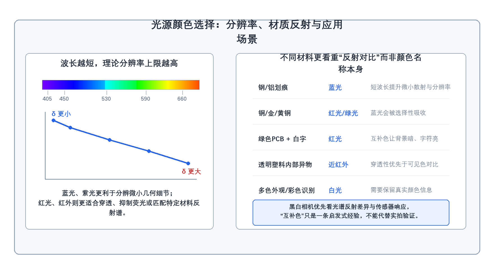

<strong>图 20-1 光源颜色选择与分辨率、材质反射和应用场景的关系</strong>

图 20-2 在相同划痕宽度、深度和镜头 NA 的条件下，并列比较蓝光与红光的模拟相机图像和灰度剖面。左侧蓝光剖面的边缘更陡、谷底更深，说明同一微小形貌在短波条件下更容易转化为可分辨的灰度差；右侧红光的响应较缓，对细小划痕的对比不如蓝光强，但并不意味着红光没有价值，因为某些铜、金、黄铜或带彩色膜层的表面会更匹配长波段。读者应从这张图得到的是比较方法，而不是把蓝光视为对所有金属一律成立的固定结论。

### 20.9 光源颜色选择还需要考虑哪些其他因素？

除了材料颜色和表面外观，还应考虑传感器在目标波段的响应、镜头和滤光片透过率、工作距离、光源功率、环境光污染、荧光效应、快门时间以及是否使用黑白或彩色相机。某些方案在理论上对比很好，但实际功率不足，导致曝光时间过长，不适合高速产线；另一些方案虽然对比一般，却在稳定性和节拍上更有优势。

还要考虑算法目标。若算法依赖边缘、纹理或缺陷连通域，优先追求的是灰度分离度；若任务涉及颜色分类或人工复判，白光和彩色成像的重要性就会上升。照明不是孤立变量，它必须与镜头、相机和算法共同设计。

### 20.10 实际应用中如何系统化选择光源颜色？

较稳妥的流程，是先明确目标特征属于颜色差、透射差、反射差还是散射差，再挑选两到三种可能有效的波段做并行试验。对黑白系统，不要把互补色当成规则本身，而应把它视为启发式起点；对彩色系统，也不能只看人眼觉得对比明显，还要看相机通道输出是否稳定。最后，应在代表性样件上比较缺陷可见性、背景稳定性、曝光裕量和产线一致性，再确定最终颜色。

颜色选择的本质是对比机制选择：只有把波长与材料反射、结构尺度和系统响应联系起来，选型才会真正稳定。

  

<strong>图 20-1 光源颜色选择与分辨率、材质反射和应用场景的关系</strong>

图 20-1 左侧用可见波段与简化分辨趋势说明“波长越短，理论分辨极限越高”的基本方向，帮助读者理解蓝光为何常在微小细节检测中占优；右侧则把不同材料和任务对应到更常见的推荐波段，例如钢铝划痕偏向蓝光，铜、金和黄铜更应优先比较红光或绿光，透明塑料内部异物可转向近红外。图中底部特别强调，黑白相机下更应关注光谱反射差异与传感器响应，“互补色”只能作为经验起点。读者使用这张图时，应把它当作试验顺序表，而不是最终答案表，因为具体结果仍受材料表面状态、膜层、照明结构和相机响应共同影响。

  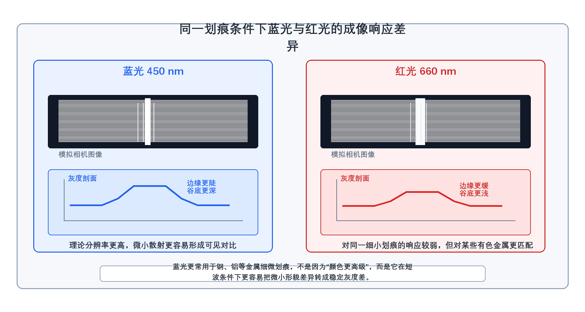

<strong>图 20-2 同一划痕条件下蓝光与红光的成像响应差异</strong>

相同划痕条件下蓝光与红光的成像响应对比：蓝光边缘更陡、谷底更深（短波对微细形貌更敏感），红光响应偏缓。但不意味蓝光对所有金属都更优——铜、金、带彩色膜层的表面可能更匹配长波段。

---

## 21. 光源的亮度不稳定会对算法产生什么影响？如何避免？

### 21.1 为什么光源亮度不稳定会成为计算机视觉算法的重要问题？
亮度不稳，算法就不稳——这是机器视觉最根本的输入约束之一。系统处理的并不是"物体本身"，而是物体在特定照明条件下形成的灰度或颜色分布。只要照明强度、色温或时间相位发生变化，算法默认的成像条件假设就被破坏，边缘、纹理、阈值和统计分布会全面漂移，原本成立的分割规则和深度学习特征分布也随之失效。

在工业场景中，这类问题比日常拍照更突出，因为视觉系统常常承担判定、计量和追溯任务，而不是仅仅“看清楚”。当照明不稳定时，算法看到的变化未必来自工件差异，也可能只是光源波动、环境杂光、温升衰减或供电纹波造成的输入扰动。对人工观察来说，这种变化有时只是“画面明暗略有不同”；对阈值判定、亚像素定位和缺陷分类来说，却可能已经跨过了判定边界。

### 21.2 光源亮度不稳定对图像特征提取的具体影响是什么？
它最直接的影响是把本来应该稳定的特征变成了随时间漂移的量。边缘检测依赖灰度梯度，亮度整体升高或局部起伏会改变梯度幅值，导致同一条边缘在不同帧中的响应强弱不同；纹理描述子依赖局部灰度关系，当照明分布改变时，纹理统计并不只是在整体上变亮，而是会改变局部对比；颜色特征则同时受光强和光谱变化影响，在色差检测、标签识别或涂层判别中尤其敏感。

问题并不只出在“特征变弱”，还出在判定边界失去一致性。例如同一个划痕在高亮帧中可能接近背景而被压平，在低亮帧中反而显得突出；同一个孔边缘在某一帧阈值分割后轮廓完整，在另一帧则边界发虚、孔径收缩。对下游算法来说，这意味着特征提取模块输出的不是同一种数据分布，后面的测量、匹配和分类也就难以稳定。

  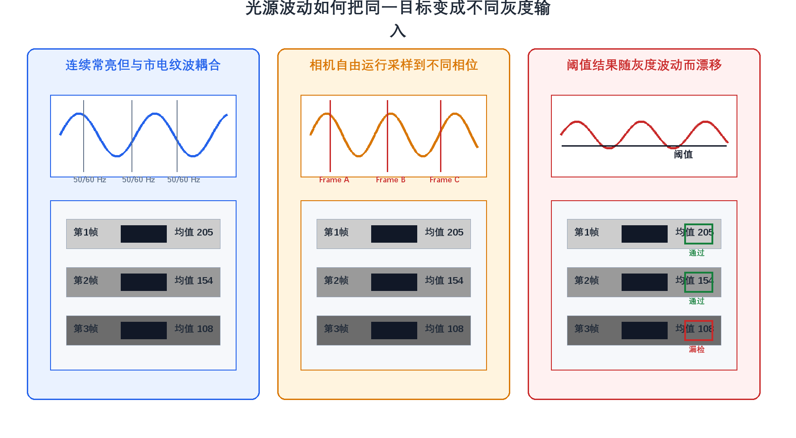

<strong>图21-1 光源波动对多帧输入一致性的破坏</strong>

图21-1把同一目标在三层关系中并排展开。左侧波形表示光源输出并非理想直流，而是带有时间起伏；中间示意相机在不同时间相位采样，即使目标静止，进入相机的平均灰度也会不同；右侧则把这种差异映射到阈值结果，说明有些帧能够稳定通过，有些帧却可能落到漏检区。图中的波形、采样线和灰度块分别代表照明能量、曝光时刻和算法真实看到的输入值。读者应从这张图得到一个判断：如果问题表现为“同一工件偶发失效、复现困难、白天夜间结果不一致”，优先怀疑输入一致性，而不是先怀疑分类器本身。它适用于理解帧间亮度波动，但不能替代对具体电源纹波、频闪频率和环境光源的实测分析。

### 21.3 亮度不稳定如何影响深度学习和神经网络模型？
深度学习模型并不会天然“免疫光照变化”。它在训练阶段学到的是训练数据所覆盖的光照分布，当上线环境的灰度范围、反差结构或颜色响应明显偏离训练分布时，模型就会出现典型的域偏移。表现形式通常不是完全失效，而是置信度下降、误检上升、边界回归不稳或对少量异常样本异常敏感。

对分类模型而言，过曝和欠曝会让原本可分的细节被压缩到较窄的动态范围内；对检测和分割模型而言，局部亮斑、阴影漂移或背景缓慢起伏会改变卷积层感知到的纹理和边缘结构。即使模型做过常规亮度增强，也只能提高一定范围内的鲁棒性，无法替代稳定采图条件。工程上更稳妥的理解是：深度学习可以容忍有限的光照扰动，但不应该被用来吞掉本可通过成像设计消除的输入不确定性。

### 21.4 在工业视觉检测中，光源不稳定性会带来哪些具体问题？
它带来的不是单一错误，而是一组连锁问题。缺陷检测中，亮度起伏可能让正常纹理被误判为缺陷，也可能把真正的浅缺陷压进背景；测量任务中，边缘过渡区会随照明变化而扩张或收缩，导致边界提取位置发生系统性偏移；颜色判别任务则更敏感，因为光谱变化和白平衡漂移会直接改变颜色空间中的分布。

更麻烦的是，这类问题往往呈现为低频、偶发、跨班次波动。系统在调试当天可能完全正常，运行数小时后随着 LED 温升、驱动电流漂移、外部日光变化或车间照明状态切换，结果才开始飘动。读者在现场看到“偶尔误判”“白天正常晚上异常”“连续运行后阈值需要重调”时，通常都不应先从算法阈值入手，而应先确认照明稳定性与采样同步关系。

### 21.5 有哪些硬件层面的解决方案来避免光源不稳定？
真正有效的办法通常发生在采图链路前端，而不是在图像进入算法之后。第一类是稳定驱动，即使用机器视觉专用恒流控制器，把电流纹波、上升沿和重复一致性控制在可接受范围内；第二类是热管理，包括散热片、风冷、水冷和温度补偿，因为 LED 输出会随结温变化而衰减；第三类是环境隔离，通过遮光罩、窄带滤光片和机械包围减少外界光源叠加。

在高速场景中，更关键的是硬触发同步的频闪方案。它的目的不只是提高瞬时亮度，更重要的是把每一帧的曝光窗口压到一个可控、重复的发光时间段内，使系统不再随机采样连续波动的光源。若现场必须常亮运行，也应确认控制器、相机曝光和环境光频率之间不存在拍频关系，否则图像仍可能表现为缓慢漂移或周期性忽亮忽暗。

### 21.6 有哪些图像预处理算法可以补偿亮度变化？
预处理可以缓解一部分问题，但它的作用边界必须说清。像平场校正、背景扣除、局部对比度增强、Retinex、同态滤波、自适应 Gamma 和白平衡校正，适合处理的是空间上的缓慢不均匀、镜头渐晕、局部反差不足或颜色基线偏移。对于同一帧内部的明暗不均，它们往往有效；对于帧与帧之间由频闪、纹波、曝光错位带来的时域不稳定，它们通常只能做有限补偿，不能从根源上恢复丢失的采样一致性。

换句话说，若问题是“整幅图时亮时暗”“同一工件每拍一次灰度都不一样”，就不应期待单帧预处理完全解决；若问题是“画面中心亮、边缘暗”“同一帧背景有缓慢阴影”，则预处理更有价值。很多现场误区恰恰在于把这两类问题混为一谈。

### 21.7 深度学习模型如何增强对光照变化的鲁棒性？
可以做，而且应该做，但应作为第二道防线。常见方法包括在训练集中加入过曝、欠曝、亮度缩放、颜色偏移和局部阴影等增强样本，使模型尽量学到不依赖单一亮度条件的表示；对量产场景，还可以按班次、季节、灯源老化阶段补充真实样本，而不是只依赖仿真增强。

如果项目复杂度允许，还可以引入域自适应、归一化重构、光照不变特征学习或多模态输入。但这些方法的前提仍然是基础采图质量处在可学习范围内。对于已经出现大面积过曝、明显频闪或输入动态范围严重不足的系统，再强的模型也只能在残缺输入上工作。

### 21.8 在实际系统中如何建立完整的亮度稳定性保障体系？
长期可靠的系统应采用分层控制：第一层为设计层，确定合适的光源类型、驱动方式、滤光和遮光结构；第二层为时序层，把触发、曝光、频闪脉宽和工件到位时间对齐；第三层为监控层，记录灰度基准、温度、亮度衰减和误判率；第四层为算法层，用归一化、鲁棒训练和报警阈值处理残余波动。

较稳妥的做法，是在量产前预先定义一套基准样件 + 灰度窗口 + 维护周期。当基准区域灰度超出允许范围时，系统应能提醒重新标定、检查光源老化、清洁光学窗口或复查控制器输出，而不是让算法默默承受输入漂移。

  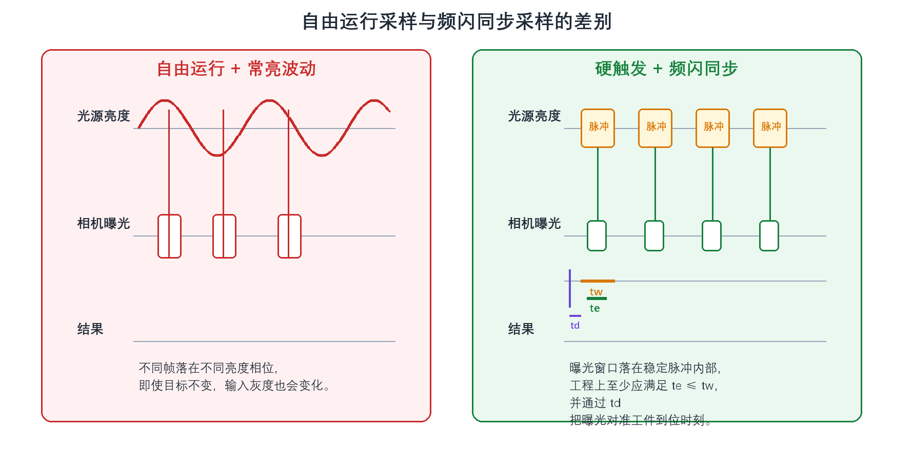

<strong>图21-2 自由运行采样与频闪同步采样的时序差异</strong>

图21-2左侧展示自由运行相机在连续波动光源上随机取样，不同曝光窗口落在不同亮度相位，输入自然难以一致。右侧把硬触发、频闪脉冲和曝光窗口放在同一时间轴上，图中的 `td` 表示触发延迟，`tw` 表示光源脉宽，`te` 表示曝光时间。只要曝光窗口稳定落在脉冲平顶或可控区间内，同一工件进入系统时看到的就是近似一致的照明能量。读者可把这张图当作时序排查入口：凡是高速飞拍、传送带定位、转台检测或外部编码器触发场景，都应先核查触发与曝光是否对齐。它用于说明同步思路，但具体参数仍需结合控制器响应、上升沿时间和工件运动速度实测确定。

---

---

## 22. 如何评价一个照明方案的好坏？现场调试照明时，主要调整哪些参数？

### 22.1 机器视觉照明的本质目标是什么？与民用照明有何根本区别？
评价照明方案好坏的终极标准，是目标特征是否被稳定地从背景中分离出来。民用照明关注照度、舒适感、显色性和环境氛围；机器视觉照明关心的核心问题是：相机和算法最终拿到什么输入，目标特征能否在灰度、颜色、反射、散射或轮廓上被稳定凸显出来。换句话说，评价标准应聚焦于"算法是否更容易稳定工作"，而非"现场觉得亮不亮"。

因此，一个好方案不一定看上去最好看。某些暗场、窄带、偏振或背光方案在肉眼看来甚至显得偏激，但如果它能把划痕、边缘、孔位或字符从背景中干净地分离出来，对视觉系统来说就是更好的方案。出版或培训中最容易出现的误解，是把照明好坏等同于平均亮度高低；在工业视觉里，特征分离才是照明评价的最终目的。

### 22.2 评价指标一：对比度与信噪比（最核心指标）
照明方案的首要指标是对比度，但工程上最好把它和信噪比一起看。只有目标与背景拉开差距而且差距高于噪声、散斑、固定图样和传感器起伏，算法才有稳定余量。单看“目标比背景亮多少”还不够，还要看这部分差异是否在不同工件、不同区域和不同时间都能保留下来。

对很多检测任务来说，灰度剖面比抽象术语更有用。把剖面线拉过目标区，若峰谷变化陡、过渡带窄、背景底噪平稳，说明方案更有利；若目标峰值虽然高，但背景同时起伏明显，或者同一目标在不同位置峰值变化很大，方案仍然谈不上可靠。对缺陷检测而言，真正需要的是可判定的对比，而不是偶尔漂亮的样张。

### 22.3 评价指标二：空间均匀性（FOV 内的灰度一致性）
照明均匀性决定了算法能否在整个视场中使用近似一致的规则。若视场中心明显比边缘亮，或左上角与右下角存在稳定偏置，即使目标本身完全相同，落在不同位置时也会获得不同的灰度基线。这样一来，全局阈值难以保持稳定，边缘定位和缺陷面积统计也容易随位置漂移。

均匀性不能只看“视觉上是否平顺”，最好通过空场或标准漫反射板实拍评估中心/边缘、中心/角点的灰度比。很多量产方案并不要求绝对均匀，而是要求不均匀性足够小，不至于压垮算法余量。若方案本身依赖定向光强调局部缺陷，那么可接受的不均匀范围还要结合任务重心判断，不能脱离目标特征单独给出结论。

  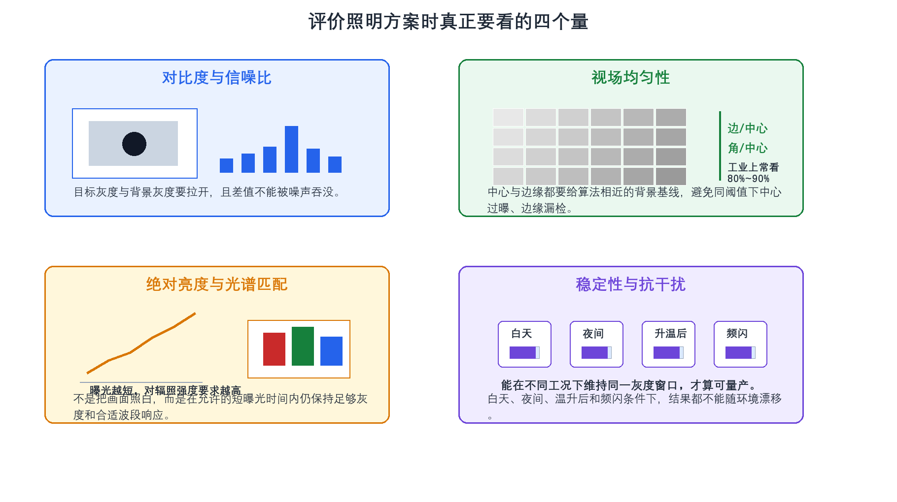

<strong>图22-1 照明方案评价的四个核心维度</strong>

图22-1把照明评估拆成四个彼此关联的维度。左上角对应目标与背景的分离能力，右上角对应整幅视场的一致性，左下角强调短曝光条件下是否仍有足够能量，右下角则对应长时间运行和环境变化下的稳定性。图中的灰度块、剖面柱、波段色块和多工况卡片分别代表剖面差值、均匀性评价、光谱匹配和时间稳定性。读者应从这张图得到一条实用判断：现场看到“图像很亮”并不意味着方案成熟，四个维度缺一不可。它适合作为方案评审清单，但具体阈值仍要按任务精度、节拍和表面光学性质设定。

### 22.4 评价指标三：绝对亮度与光谱响应
在高速飞拍、短曝光和小光圈场景里，照明方案若只有“对比好”而没有足够能量，最终也无法落地。此时更应关注的是在既定曝光时间下传感器是否能获得足够灰度余量，而不只是看人眼感知到的亮暗。对黑白系统来说，光谱匹配尤其重要，因为最终输出只有灰度，真正影响结果的是被测材料在该波段下的反射或透射表现，以及传感器在该波段的响应效率。

因此，亮度和波长应一起考虑。某些蓝光方案理论分辨率高，但若被测材料在蓝光下反射差、散射太强或能量不够，结果未必比红光更稳；同理，白光看起来“最自然”，但在窄带滤光或抑制环境光方面往往不如窄波段方案。照明选型不能把“亮度”和“颜色”分开理解。

### 22.5 评价指标四：稳定性与抗环境光干扰能力
一个方案若只能在样机台面上好看，而不能在白天、夜间、开门、关门、设备升温和连续运行后保持一致，就不算好方案。稳定性既包括光源自身的重复一致性，也包括面对外部环境变化时的抗扰能力。常见干扰来源有日光、车间照明、电焊弧光、反射面二次眩光，以及光源自身因温升和老化带来的慢漂移。

评估时应尽量让方案在更接近量产的工况下暴露问题，例如长时间连续运行、不同班次、不同背景板和不同工件姿态。很多方案在短时间试拍时差别不大，但一旦引入节拍、环境光和热漂移，优劣就会迅速拉开。

### 22.6 现场调试照明时，核心的空间几何参数有哪些？
现场调试首先是在调光路几何。最常见的参数包括工作距离 WD、入射角、光源与镜头的相对位置以及是否满足同轴或对称条件。工作距离改变后，照明覆盖范围、均匀性和局部照度都会变化；入射角变化则直接影响是更偏明场还是更偏暗场，以及某类缺陷会不会被散射出来。

对条形光、低角度暗场和同轴光来说，几何位置往往比电流旋钮更敏感。很多调试失误来自于过早去调曝光和阈值，却没有先把灯位和角度放到正确区间。只要几何关系没有找对，后续电子参数再细调，也只是把一个先天不合适的布光方案勉强调到“看起来能用”。

### 22.7 现场调试照明时，核心的电控与相机配合参数有哪些？
几何关系确定之后，才进入电控与相机配合。最常见的参数有光源驱动电流、频闪脉宽、触发延迟、相机曝光时间和增益。它们之间是耦合关系，而不是各自独立。一般应优先用照明能量和曝光时间解决灰度不足，在满足运动模糊约束的前提下，尽量把相机增益压低，因为增益虽然能提亮图像，却往往会同步放大噪声。

对带触发的系统而言，触发延迟和频闪脉宽尤其关键。它们决定曝光是否正好落在工件到位且光源稳定输出的时间段内。若时序没对齐，表面上看是“亮度不稳”或“偶发模糊”，本质却可能是曝光窗口每次都落在不同的运动位置或发光边沿。

  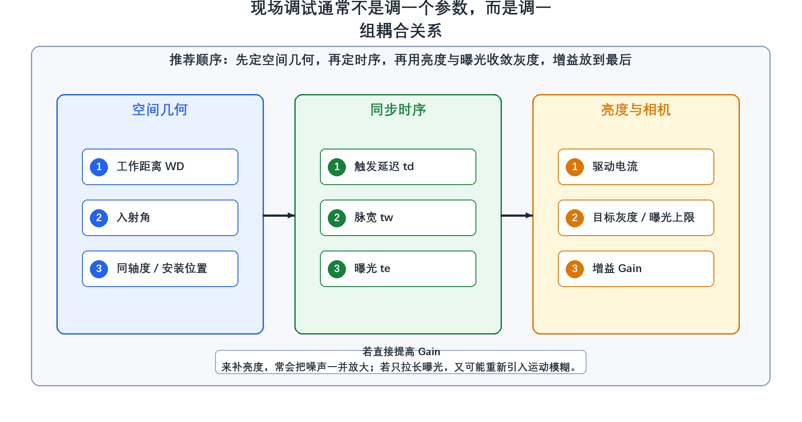

<strong>图22-2 现场调试中空间、时序与亮度参数的耦合关系</strong>

图22-2按实际调试顺序把参数分成三组：左列是工作距离、入射角和安装位置，中列是触发延迟、脉宽和曝光时间，右列是驱动电流、曝光和增益。箭头表示这些参数不是串行独立的，而是会互相牵动。图中底部特别强调增益不宜作为首选补亮手段，因为它往往会把底噪和散斑一起放大。读者应把这张图理解为现场收敛路径：先把布光方向调对，再把时序对齐，最后才细调灰度窗口。它适合用于工位调试，但并不替代针对特定相机、控制器和节拍的定量计算。

---

---

## 23. 3D视觉常用哪些技术方案？（如双目立体视觉、结构光、激光三角测量、TOF）

### 23.1 什么是 3D 视觉，为什么它需要不同的技术方案？
二维视觉主要处理位置、形状、灰度和颜色，很多时候足以完成定位、计数和表面外观判断；但当任务依赖高度、深度、体积、平面度、段差、间隙、轮廓或空间姿态时，仅凭二维灰度就不够了，这时就需要 3D 视觉。它的目标是从成像数据中恢复与几何相关的深度信息，而非仅仅把画面呈现为立体效果。

之所以存在多种 3D 方案，是因为不同场景对精度、测距范围、速度、表面材质、环境光和成本的要求差别很大。近距离高精度检测、户外远距离感知、在线轮廓扫描和高速动态测距，分别更适合不同原理。没有一种 3D 技术能在所有工况下同时做到最便宜、最快、最稳又最精。

### 23.2 双目立体视觉的基本原理是什么，它有什么优缺点？
双目立体视觉通过两台相机从不同视角拍摄同一目标，利用对应点在左右图中的位置差计算视差，再由视差恢复深度。其简化关系可写为

$$
Z = \frac{fB}{d}
\tag{23-1}
$$

其中，$Z$ 为目标深度，$f$ 为焦距，$B$ 为双目基线，$d$ 为视差。由式（23-1）继续推导，可得到深度误差与视差测量误差的关系：

$$
\sigma_Z = \frac{fB}{d^2}\sigma_d = \frac{Z^2}{fB}\sigma_d
\tag{23-2}
$$

式（23-2）说明一个非常实际的工程事实：距离越远，双目深度精度下降越快。这并不意味着双目不能用于远距离，而是意味着若要维持精度，往往需要更长基线、更高分辨率或更强匹配约束，而这些措施又会带来安装空间、公共视场和标定难度的代价。

它的优点在于系统相对简单、成本可控、无需主动投光，且能同时保留纹理信息；局限则在于它高度依赖表面纹理与匹配质量。对于纯色面、重复纹理、透明件、镜面件或严重遮挡区域，双目并不天然占优。工业选型时不能把"反光件适合双目"作为普遍结论，是否可行仍取决于表面是否提供了足够、稳定且可匹配的纹理线索。

在工程实现上，OpenCV 提供了完整的双目视觉工具链：先用 `cv::stereoCalibrate()` 标定双目的内外参，再用 `cv::stereoRectify()` 将左右图校正到行对齐，然后以 `cv::StereoSGBM::create()` 或 `cv::StereoBM::create()` 计算视差图，最后通过 `cv::reprojectImageTo3D()` 将视差转为三维点云。其中 SGBM（Semi-Global Block Matching）是较常用的半全局匹配算法，关键参数包括：`numDisparities`（视差搜索范围，须为 16 的倍数）、`blockSize`（匹配块大小，通常 3~11 的奇数）、`P1` 和 `P2`（平滑惩罚系数，P2>P1 时视差图更平滑）、`uniquenessRatio`（唯一性比率，通常 5~15）以及 `disp12MaxDiff`（左右一致性检查阈值）。这些参数需要在具体场景下调试，没有一组默认值能通用于所有工业工况。

> **引用出处**：双目立体视觉的标定与匹配流程参见 OpenCV 4.x 官方文档——`cv::stereoCalibrate()`、`cv::stereoRectify()`、`cv::StereoSGBM` 参数说明（[docs.opencv.org/4.x/d9/d0c/group__calib3d.html](https://docs.opencv.org/4.x/d9/d0c/group__calib3d.html) 及 [docs.opencv.org/4.x/d2/d85/classcv_1_1StereoSGBM.html](https://docs.opencv.org/4.x/d2/d85/classcv_1_1StereoSGBM.html)）。

### 23.3 结构光技术如何工作，它在哪些场景中表现优异？
结构光属于主动 3D 方法，它通过投射已知图案到目标表面，再由相机观察图案的变形，从而恢复深度。这里的“图案”可以是条纹、散斑、格雷码、正弦相移等，其共同点是：投射器给出了一个已知空间参考，相机看到的是这个参考被目标几何改写后的结果。只要能正确解码每个像素对应的投射信息，再结合标定好的几何关系，就能反推出三维坐标。

它特别适合近距离高精度、稠密重建和纯色表面场景，因为系统不依赖工件天然纹理，而是自己提供纹理。消费电子装配、精密轮廓测量、面形分析和近距机器人抓取中，结构光往往很有优势。它的边界也很明确：强环境光、明显运动、透明材质和高反光内腔都会增加解码难度，尤其多帧相移方案对振动和位移更敏感。

  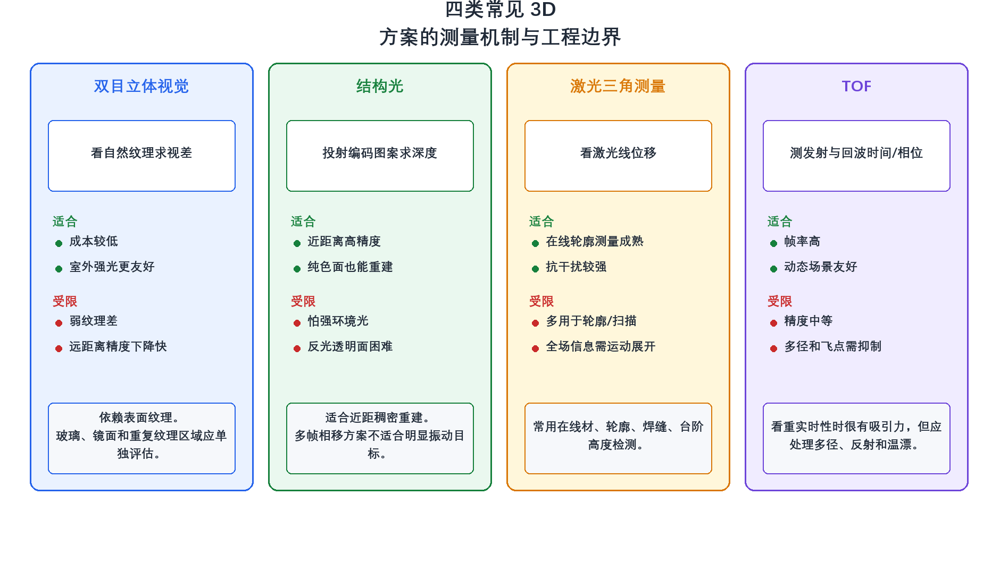

<strong>图23-1 常见 3D 视觉方案的原理与适用边界对比</strong>

图23-1把双目、结构光、激光三角测量和 TOF 放在同一评价框架中比较。每一列上半部分概括测量机制，中间部分列出更常见的适用工况与受限场景，底部则给出工程上最容易忽略的边界，例如双目依赖纹理、结构光怕强环境光、激光三角更擅长轮廓扫描而非一次性全场、TOF 需要处理多径和飞点。图中彩色卡片分别代表不同技术路线，帮助读者先按物理机制分类，再按工况筛选。它适合作为选型入口，但真正落地时还要把精度、测距范围、节拍和表面光学性质纳入同一张表里比较。

### 23.4 激光三角测量技术的核心机制是什么，它为何在工业检测中广泛应用？
激光三角测量通常由线激光 + 成像相机 + 相对运动构成。线激光在工件表面形成一条光带，相机从侧向观察这条光带的位置变化；当表面高度改变时，光带在相机图像中的位置也会偏移，通过三角关系即可恢复高度。若工件沿传送方向移动，或传感器自身做扫描运动，单条轮廓可以逐步展开为完整的 3D 表面。

它在工业检测中应用广泛，原因在于方案成熟、对轮廓类任务极其实用，且在线测量能力强。焊缝轮廓、钢板厚度、轨迹跟踪、型材截面、台阶高度和胶路截面等任务，本质上都更关心沿某一截面的高度变化，这正是激光三角测量最擅长的工作方式。需要说明的是，它常常不是一次得到整个面，而是依靠线扫或运动把面展开。

### 23.5 TOF（飞行时间）技术的物理原理是什么，它如何实现实时深度测量？
TOF 的基本思想是测量光从发射到返回所经历的时间，或者等价地测量调制光的相位变化。其理想化关系可写为

$$
d = \frac{ct}{2}
\tag{23-3}
$$

其中，$d$ 为目标距离，$c$ 为光速，$t$ 为往返飞行时间。实际系统中既有直接 TOF，也有以相位测量为主的间接 TOF；无论具体实现如何，它们共同的优势都是每个像素直接输出深度估计，因此帧率较高，适合动态场景和实时避障。

TOF 的难点在于精度通常不如近距高精度结构光，也更容易受到多径反射、强环境光、表面反射率差异和飞点（flying pixels，在深度边缘或多径干扰处产生的错误深度点）影响。它擅长的是中近距快速感知，而不是在所有表面上做精密计量。

### 23.6 除了上述四种，还有哪些重要的 3D 视觉技术？
常见补充路线还包括多目视觉、单目深度估计、光场方法、轮廓投影测量等。多目系统可以利用更多视角减少遮挡并提高匹配约束；单目深度估计在成本和集成上有吸引力，但其深度通常更偏“感知意义”而不是精密计量；某些工业场景还会把结构光与双目结合，形成主动双目方案，以兼顾纹理补充和几何测量。

对初学者而言，理解这些方法最有效的方式，不是记名称，而是先问自己：深度信息来自哪里，是自然纹理、主动投光、时间测距，还是物体与传感器之间的已知运动？ 这条线索有助于快速把各种 3D 系统归类。

### 23.7 这些技术方案在实际应用中如何选择？
选型时建议先按五个问题筛选。第一，看精度和距离：近距离高精度面形测量，结构光和激光三角更常见；中近距实时感知，TOF 更有优势；大场景、成本敏感且有足够纹理时，双目值得优先考虑。第二，看表面性质：透明、镜面、黑亮和深腔表面往往会把主动投光和被动匹配同时变难，需要样件验证。第三，看速度：明显运动的目标不适合直接套用多帧相移结构光。第四，看数据形式：需要整面稠密高度图，和只需要轮廓线高度，方案并不相同。第五，看工程成本：标定、维护、遮光、安装空间和上位机算力都应计入总成本。

真正成熟的选型很少只靠一项参数决定。例如“精度最高就选结构光”“动态场景就一定选 TOF”都过于粗糙。工程判断通常建立在样件验证上，尤其要覆盖最难样件、最差表面状态和最不利姿态。

### 23.8 当前 3D 视觉技术的发展趋势是什么？
总体趋势有三条。其一是传感器和投射器硬件持续提升，让系统在更大视场和更高帧率下保持更可用的深度质量；其二是算法融合增强，用学习方法修补匹配、相位展开、点云去噪和多径抑制中的薄弱环节；其三是多模态融合，将二维纹理、偏振、热成像或力觉等信息与深度联合使用，以弥补单一 3D 传感路线的边界。

  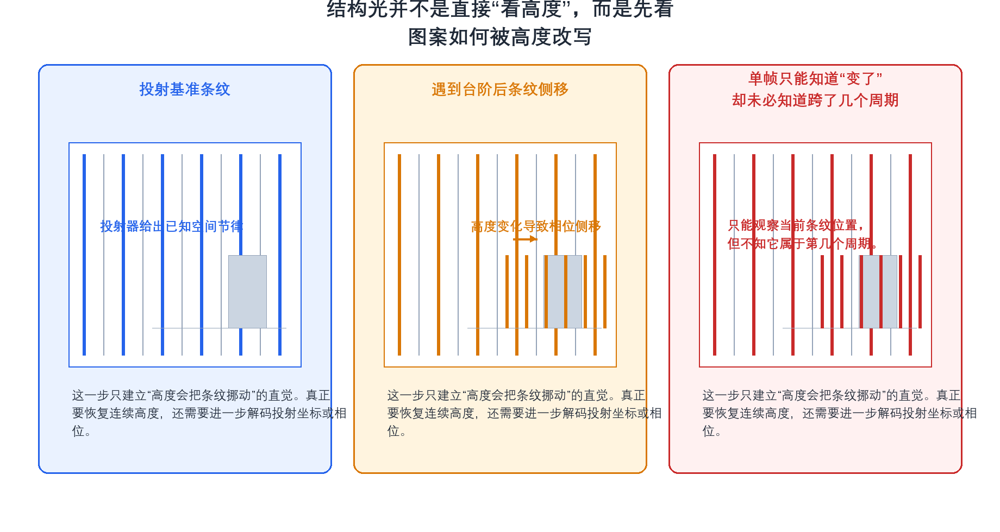

<strong>图23-2 结构光中条纹位移与单帧歧义的直观关系</strong>

图23-2先画出投射器给出的基准条纹，再在中间引入台阶高度，显示条纹如何随表面起伏发生侧移，最后在右侧指出单帧图像只能观察“当前位置”，却未必知道该条纹跨了几个周期。图中的竖条表示投射节律，灰色台阶表示高度变化，箭头表示相位或投射坐标发生了偏移。这里的左右方向只是示意，真实系统中条纹向左还是向右移动，取决于相机与投射器的相对几何位置。它帮助读者把结构光和普通亮暗成像区分开来：系统真正利用的是已知图案与被测表面之间的几何关系。该图适合建立直觉，但实际重建还需要编码设计、相位展开和高精度标定，不能把“看到位移”直接等同于“已经得到高度”。

---

---

## 24. 结构光 3D 相机的工作原理是什么？适用于检测物体的哪些特性？

### 24.1 什么是结构光技术的基本概念？
结构光是主动式三维测量方法。系统主动向目标投射一个已知空间结构，例如条纹、点阵、格雷码或散斑，然后由相机观察这些结构在目标表面上的变形。若把投射器看成“给场景写入一把标尺”，结构光做的就是根据这把标尺被表面起伏改写后的样子，反推空间坐标。

它与单纯的二维打光不同，后者更关注亮暗对比；结构光关注的是图案位置、相位和编码关系。因此，同样是看一条条纹，二维视觉可能只关心它亮不亮，结构光系统关心的是它出现在何处、为何出现在那里，以及它与投射端原始编号之间如何对应。

### 24.2 结构光 3D 相机的基本硬件组成有哪些？
典型结构光系统由投射器、相机、标定几何和处理单元构成。投射器负责输出具有已知结构的光图案，相机负责采集图案经目标表面调制后的图像，处理单元负责完成解码、相位计算、展开和三角重建。很多工业系统还会附带窄带滤光、同步控制、机械支架和温度管理模块，因为它们直接关系到长期稳定性。

若从几何意义理解，投射器和相机并不只是两个“会发光、会拍照的部件”，而是共同构成了一个已知基线与夹角的测量系统。标定的质量决定了后续从图像坐标恢复三维坐标的精度上限。

### 24.3 结构光 3D 相机工作的核心原理是什么？
核心过程可以概括为三步：投射已知编码，采集变形结果，结合标定几何求三维坐标。在相移条纹系统中，算法往往先根据多幅条纹图求出每个像素的相位，再通过相位或投射器坐标与相机像素之间的对应关系进行三角计算；在格雷码系统中，算法则更偏向先解码离散编号，再换算成投射坐标。

因此，结构光并不是简单“分析每个点挪了多少”那么粗略，更准确的表述应当是：系统先恢复每个像素对应的投射信息，再利用相机—投射器几何关系把该信息转换为空间坐标。这一区别很重要，因为它决定了编码设计、相位展开和标定在系统中的地位。

  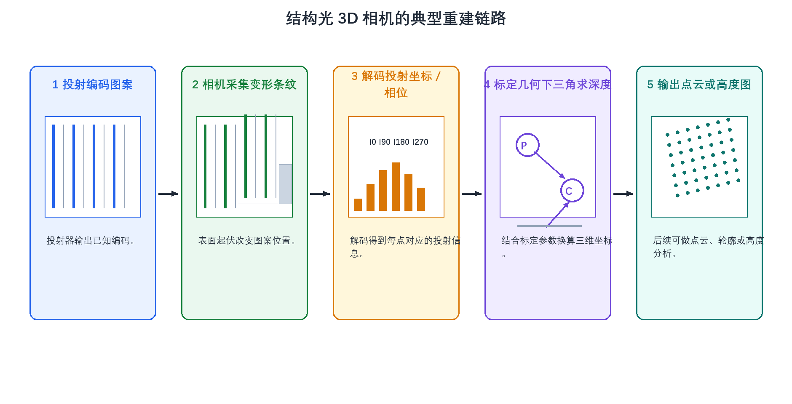

<strong>图24-1 结构光 3D 相机的典型重建流程</strong>

图24-1把结构光重建拆成五步：投射编码图案、相机采集变形条纹、解码投射坐标或相位、在标定几何下做三角换算，最后输出点云或高度图。每个面板对应一段真实处理链路，而不是简单的概念罗列。图中的条纹、柱状值、几何点位和点云点阵，分别代表原始编码、解码后的相位信息、相机与投射器的几何关系以及最终的三维结果。读者应由此理解结构光系统中“编码”和“标定”同样重要，不能只盯着投射器亮不亮。它适合用于理解整体流程，但不同厂商在编码形式和后处理细节上会有差别。

### 24.4 结构光图案编码和解码过程是怎样的？
如果只投一幅周期条纹，相机往往只能知道条纹在当前位置亮暗如何变化，却不一定知道它属于哪一个周期，这就是结构光里常说的单帧歧义。需要说明的是，$\arctan$ 求出的相位只在一个周期内（被卷绕），恢复它跨了几个周期的过程就叫相位展开（phase unwrapping）。为解决这个问题，工业系统会使用时间编码、空间编码或二者结合的策略。格雷码侧重给每个区域分配唯一编号，相移法侧重用多幅相位不同的正弦条纹恢复连续相位，一些系统还会把两者叠加，先粗定位周期，再精定位相位。

解码的目标并不是“把图案看清楚”，而是把每个相机像素映射到投射器坐标或相位值。只有建立这层对应关系，三维求解才有基础。对多帧方案而言，工件静止性和同步精度直接决定解码质量；对单帧方案而言，动态能力更强，但编码容量、抗噪和精度常常需要重新权衡。

### 24.5 结构光 3D 相机的主要技术类型有哪些？
从图案和采集方式看，常见路线包括格雷码结构光、相移结构光、散斑结构光、单帧编码结构光等。若把“线结构光”也纳入广义范围，它与面结构光共享三角测量基础，但在工业应用中通常更独立地归为激光三角测量或轮廓传感，因为其数据组织方式、应用重心和节拍特点都不同。

对初学者来说，一个有效的区分方式是：一次覆盖整个视场、得到稠密面信息的，更接近面结构光；沿一条线逐步展开 3D 的，更接近轮廓扫描型方案。两者都重要，但不应在概念上混成一个模糊大类。

> **引用出处**：OpenCV 4.x 提供了 `cv::structured_light` 模块（含格雷码和正弦条纹等编码方法）作为教学与原型参考，但工业级结构光系统通常以厂商专有 SDK 与标定流程为主（[docs.opencv.org/4.x/d1/d90/group__structured__light.html](https://docs.opencv.org/4.x/d1/d90/group__structured__light.html)）。

### 24.6 结构光 3D 相机适用于检测物体的哪些几何特性？
它最适合处理那些必须依赖高度信息才能准确判断的几何量，例如高度、段差、间隙、平面度、翘曲、轮廓起伏、体积、表面形貌和自由曲面偏差。如果任务只关心平面上的轮廓位置，二维视觉通常更经济；若任务关心“高出多少、陷下多少、面是否鼓起、边缘是否齐平”，结构光的价值才真正体现出来。

在很多制造场景中，读者会看到“外观没问题，但装配后仍失效”的案例，根源往往是二维相机看不到的段差、翘曲或装配高度漂移。结构光提供的是这类信息的直接观测通道。

### 24.7 结构光 3D 相机在表面缺陷检测中有何优势？
它的优势在于把几何起伏本身作为检测对象。二维视觉常常依赖亮暗、反射和颜色差异来间接推断缺陷，而结构光可以更直接地输出某处是否凹下去、鼓起来、边界是否连续、局部高度是否异常。这对划伤、凹坑、焊道高度、毛刺、压伤、胶路截面和密封面起伏等问题尤其有价值。

当然，这并不意味着 3D 一定优于 2D。若缺陷主要体现为颜色污染、轻微印刷问题或没有可分辨高度差的表面异色，结构光未必更合适。工程上常见的可靠做法，是让二维和三维各自承担最擅长的判定部分，而不是试图用一种传感方式包打天下。

### 24.8 结构光 3D 相机在哪些具体应用场景中表现突出？
典型场景包括电子装配中的器件高度、焊点轮廓、PCB 翘曲，汽车与机械制造中的段差、间隙、焊缝面形、冲压件轮廓，以及包装、消费电子和医疗器械中的平面度、灌装高度、自由曲面偏差和外形重建。凡是需要在较大视场内一次拿到较稠密高度图，又不希望完全依赖工件天然纹理的场景，结构光都值得优先评估。

选择时仍要警惕表面反射特性。许多高反光金属件、透明件和深槽内壁，在“看上去很适合做 3D”的直觉下，恰恰是结构光最难稳定处理的对象。

### 24.9 结构光 3D 相机相比其他 3D 技术有何优缺点？面临的最大痛点是什么？
它的主要优势是近距离精度高、点云稠密、对天然纹理要求低。对于纯色塑料件、复杂曲面和要求整面高度分布的检测任务，它通常比被动双目更稳定，也比单线轮廓扫描更容易直接得到全场信息。

真正的痛点则集中在环境光、运动和多径反射。环境光会降低投射图案对比，多帧采集会放大振动影响，而深槽、镜面、高反光内腔和复杂金属件中常出现的多径干扰，会让相机接收到混合了多次反射的条纹信号，造成相位扭曲、飞点、破洞或局部深度错误。这个问题往往不是简单“调亮一点”就能解决，而需要在投射频率、偏振、光路角度、表面处理和算法抑制之间综合平衡。

### 24.10 结构光 3D 相机的精度受哪些因素影响？
精度上限来自多个环节共同作用。几何基线与焦距决定了测量灵敏度，投射分辨率与相机分辨率决定了可恢复的空间细节，相位解算或编码解码精度决定了像素级对应关系是否稳定，标定质量决定了图像坐标到空间坐标的换算误差，表面反射特性、环境光、振动和温漂则决定了这些理论能力能否在现场真正兑现。

工程上应避免把精度理解为一个脱离条件的固定数字。某台设备在漫反射标定板上能达到的精度，未必能直接移植到高反光金属件、斜面玻璃或高速运动工件上。读者看到厂商给出的指标时，最好同步确认其对应的工作距离、视场、采样方式、表面类型和误差定义。

  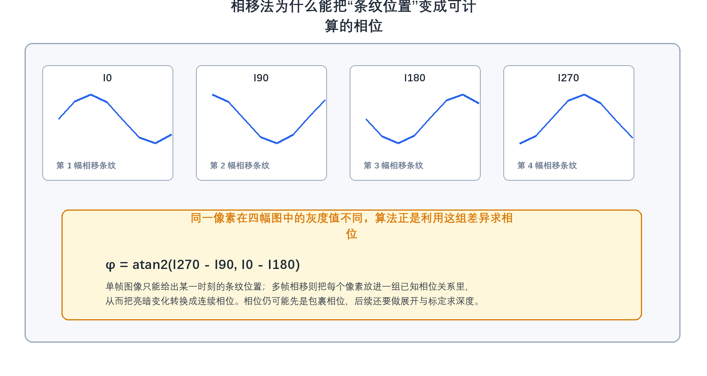

<strong>图24-2 相移法中多帧条纹与相位求解的关系</strong>

图24-2把四步相移法中常见的四幅条纹并排展开，并在下方给出典型的相位计算形式。上排四个小框表示同一空间位置在四个投射相位下的灰度响应，下方公式说明算法并不是凭一张条纹“猜高度”，而是利用一组已知相位关系把灰度变化转换成连续相位。读者应从这张图读出两个判断：一是多帧相移能提高精度，但前提是目标在采集期间足够稳定；二是求得相位并不等于深度已经完成，后续仍需相位展开和几何标定。它适合用于理解相移法原理，但实际系统在抗饱和、去阴影和展开策略上还会有进一步细节。

---

---

## 25. 红外相机和紫外相机分别用于检测什么类型的缺陷？

### 25.1 红外相机和紫外相机分别基于什么物理原理工作？
红外相机主要利用红外波段中的辐射、透射或反射信息成像。在热像应用中，它观察的是目标表面的温度场及其随时间的变化；在短波红外应用中，它也可能利用材料在该波段的透射或反射差异，而不只是“看热”。因此，说红外相机时最好先区分是热成像还是近红外/短波红外成像，二者虽同属红外，但工作机理和应用重点并不完全相同。

紫外相机则不是简单因为“波长更短所以一定更清晰”。它真正有价值的地方在于，许多材料在紫外波段下的反射、吸收和荧光响应与可见光不同，从而能把普通照明下不明显的表面污染、涂层异常、渗透探伤指示或微弱图案差异凸显出来。在某些高 NA 光学系统中，短波长也确实有利于提高理论分辨能力，但这只是紫外检测价值的一部分，不应把它概括成唯一原理。

### 25.2 红外相机主要检测哪些类型的缺陷？
红外相机更适合检测会引起温度场异常或热传导路径异常的缺陷。例如电子元件过热、接触电阻异常、短路热点、封装空洞、复合材料分层、建筑空鼓、保温缺陷、光伏隐裂和某些流体泄漏，往往都会在热像上表现为局部温差、扩散速度异常或热响应不连续。对于这类问题，缺陷未必能在可见光图像中直接看到，但会通过热过程暴露出来。

需要强调的是，热像上的亮暗并不自动等同于“好坏”。很多场景必须结合激励方式、时间窗、发射率和背景反射来解释。例如同一位置变亮，可能代表发热异常，也可能只是表面发射率更高或反射了外界热源。

### 25.3 紫外相机主要检测哪些类型的缺陷？
紫外相机更常见的价值有两类。第一类是表面光学响应差异，即某些污染、薄膜、氧化、残胶、印刷涂层或图案在紫外下会表现出与可见光不同的反射或吸收特性；第二类是紫外激发荧光，这在荧光渗透探伤、胶水检测、涂覆均匀性检查和生物荧光观察中尤为常见。

因此，若读者把紫外相机理解成“专门看极小缺陷的高分辨相机”，就会失之过窄。它确实可用于微细图案观察，但更常见的工程价值在于把原本缺乏可见光反差的表面问题转换成可见的紫外反差或荧光指示。是否有效，取决于材料和缺陷在紫外波段下是否真的产生了有用差异。

### 25.4 为什么红外相机适合检测热相关缺陷，而紫外相机适合检测微观表面缺陷？
两者擅长的并不是同一个物理层面。红外更擅长看热过程和热属性差异，也就是温升、散热、热阻、热扩散和内部缺陷对温度场的影响；紫外更擅长看表面光学响应差异，或者借助紫外激发把某些材料、渗透剂和污染残留转成更鲜明的可见信号。前者偏向功能和能量过程，后者偏向表面状态与波段特异性。

如果缺陷并不造成可分辨温差，红外未必帮得上忙；如果缺陷在紫外下既不改变反射，也不产生荧光，紫外同样没有优势。

### 25.5 在半导体制造中，两种相机分别扮演什么角色？
在半导体制造中，红外和紫外往往服务于不同层级的问题。红外或短波红外更适合热分布、热热点、内部结构透视、键合异常和局部热失配分析，尤其在芯片工作状态评估、封装热管理和某些透视检测中很有价值。紫外则更常用于表面污染、图案对比、某些微细结构观察、光刻相关检测或特定荧光标记观察。

但这里同样不能写成绝对规则。半导体工艺极多，最终是否选红外或紫外，还要看待测层、工艺步骤、材料透明性、镜头波段能力和允许的照明方式。出版表达更稳妥的说法是：红外更偏向热与内部，紫外更偏向表面与波段选择性。

### 25.6 两种相机在检测能力上有哪些互补性？
它们的互补性主要体现在检测机理、观察深度和异常类型三个方面。红外可以帮助发现热异常、内部空洞、扩散异常和功能失配，适合先做快速筛查；紫外则更适合确认表面污染、渗透探伤指示、局部涂层问题或某些微细图案异常。前者偏“看功能状态”，后者偏“看表面响应”。

在复杂项目中，两者并不冲突，反而常适合作为两道不同的观察窗口。一个缺陷若既表现为局部发热，又伴随表面残留和涂层变化，用单一相机往往难以给出完整解释，多波段联合反而更可靠。

### 25.7 现代工业检测中，两种相机技术有哪些发展趋势？
红外方向的一条明显趋势，是探测器灵敏度、非制冷能力、分辨率和时序分析能力持续提高，使得热响应检测不仅能看静态温差，还能看动态热过程。紫外方向则更多体现在传感器量子效率提升、弱信号噪声控制、光学材料适配和与荧光探伤工艺的联动优化上。两者共同的趋势，是与自动化分析、缺陷分类和多模态融合结合得更紧。

未来更值得期待的，未必是哪一种相机“替代”另一种，而是系统能否根据缺陷机理选择合适波段，并把热像、紫外、可见光甚至 3D 数据放到同一判定框架里使用。对工程应用来说，这比单纯追求更高像素更有价值。

  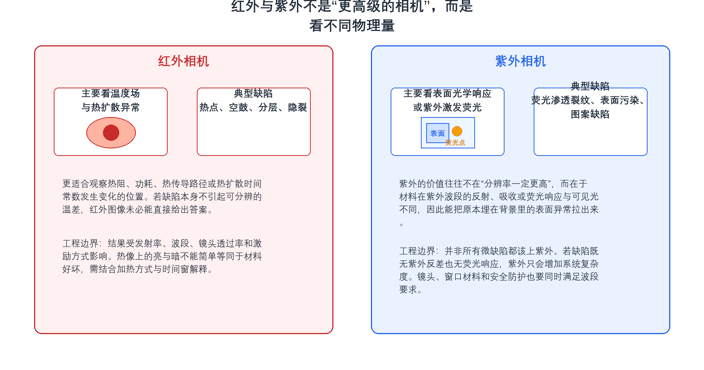

<strong>图25-1 红外相机与紫外相机的检测机理与适用缺陷对比</strong>

图25-1把红外和紫外放在同一框架下比较。左侧从温度场、热扩散和热点出发，说明红外适合处理热异常、分层、空洞和功耗相关问题；右侧从表面光学响应和紫外激发荧光出发，说明紫外更适合残留、污染、荧光渗透裂纹和某些图案异常。图中的热点、表面响应区域和荧光亮斑分别代表两类系统真正观测的物理量，而不是简单的“颜色不同”。读者应把这张图当作缺陷机理与波段选择的对应表，而不是把红外理解成看内部、紫外理解成看微小的固定模板。它有助于做初步筛选，但样件验证仍然必不可少。

---

## 26. 什么是智能相机？它与相机+工控机方案相比，优劣势是什么？

### 26.1 智能相机的基本定义是什么？
智能相机是一台把相机、处理器、运行环境和基础视觉功能封装在同一外壳中的嵌入式视觉设备。它通常包含图像传感器、图像预处理模块、CPU 或 FPGA、存储资源、通信接口以及本地执行的视觉工具链，能够在设备本体内完成采图、运算和结果输出，而不是把原始图像全部送到外部工控机后再处理。

这个定义里更值得把握的是系统边界发生了变化。在智能相机架构中，单台设备往往就对应一个完整检测节点；在相机加工控机架构中，相机更接近数据源，真正的算力、软件环境和业务逻辑集中在上位机。理解这一点，后面的实时性、成本和维护差异才不会被误解成代际高低之分。

### 26.2 智能相机的技术架构包含哪些关键组件？
一台典型智能相机通常包括图像传感器、图像信号处理（ISP）或基础预处理链路、嵌入式 CPU / FPGA / NPU、运行时系统、内存和非易失存储、以太网或串口等通信接口，以及数字 IO。很多设备还会提供图形化配置环境、脚本接口或内置视觉工具库，使用户能够在相机端直接完成读码、定位、OCR、模板匹配或简单测量。

需要补充的是，不同厂商的智能相机能力跨度很大。有些产品更接近带工具包的嵌入式读码器，适合固定任务；有些则已经具备一定的脚本化与 AI 推理能力，但即便如此，它们与可自由扩展 CPU、GPU、内存和磁盘的工控机平台仍不属于同一量级的计算环境。

  

<strong>图26-1 智能相机与相机+工控机系统边界对比</strong>

图26-1左侧把智能相机拆成传感器、预处理、嵌入式运算、算法和通信输出等几个内部层级，强调它在单机内闭合完成采图和判定。右侧则把相机加工控机拆成采集端、上位机运算端和外部控制系统，突出图像传输和集中处理链路。读者应从图中看出，两种方案差别不在于是否都能做视觉，而在于计算资源、软件环境和系统边界分别落在哪里。这张图适合做架构入门，但不能直接代替选型结论，因为真正的优劣还要继续看任务复杂度、工位数量和维护方式。

### 26.3 相机+工控机方案是如何工作的？
在这种传统机器视觉架构中，相机负责采集图像，再通过 GigE、USB3、Camera Link 或 CoaXPress 等接口把数据传到工控机。真正的图像处理、算法执行、结果存档、数据库交互和界面显示，主要都发生在工控机端。工控机可以安装标准视觉库、定制业务软件、GPU 推理环境和多线程调度系统，因此更适合承载复杂任务、多个工位协同和较重的数据处理流程。

它的代价也很明确。系统体积更大，布线更多，软硬件依赖关系更复杂，集成时还要处理操作系统、驱动、采集卡、许可和网络配置。它并非所谓的低级方案，而是开放度更高、系统负担也更重的方案。

### 26.4 智能相机在系统集成方面有哪些优势？
它的集成优势主要体现在三点。第一，系统短，安装时通常只需要电源、通信和 IO，不需要额外配置独立 IPC、采集卡和完整视觉主机。第二，物理体积小，适合安装空间紧张、布线困难或设备分散的工位。第三，任务边界清晰，一台设备往往对应一个检测点，问题定位和替换也相对直接。

这类优势在单点或双点、任务固定、节拍明确的场景里特别明显。例如简单有无检测、读码、固定模板比对、单一工位字符检查，智能相机常常能以较少的集成工作量快速落地。它减少的并不只是硬件数量，更是系统联调和维护接口的复杂度。

### 26.5 智能相机在实时性方面相比传统方案有何特点？
对简单、固定、局部闭环的任务，智能相机常有不错的端到端响应，因为图像不必先完整传到外部主机再参与调度和处理。本地处理减少了传输、缓存和操作系统调度带来的额外路径，对读码、有无判断和局部定位这类任务尤其有效。

智能相机的实时性优势有其适用范围。若任务包含大分辨率图像、复杂多步流程、深度学习推理、点云处理或多相机协同，嵌入式算力本身可能成为更大的延迟来源。此时工控机端虽然多了一段传输，但总时延反而可能更低。因此，实时性必须放在算法复杂度是否与嵌入式算力匹配的前提下讨论。

### 26.6 智能相机在部署和维护方面有哪些便利性？
它更接近标准化工业设备，而不是一台缩小版 PC。部署时，用户常常通过图形化界面完成参数配置、训练模板、设置 IO 和结果输出；维护时，也更偏向固件升级、作业备份和参数迁移，而不是完整的软件环境重装。对没有专职视觉软件工程师的现场团队来说，这种维护方式更友好。

不过便利性有其边界。若项目需要频繁改流程、增加复杂逻辑、做数据库联动或和多套上位系统耦合，智能相机的维护优势就会逐渐减弱，因为系统变化开始超出它擅长的封闭任务边界。

### 26.7 智能相机在成本方面有哪些考虑？
成本判断最容易出错，因为很多人只看单台采购价，而忽略总拥有成本。对单点工位，智能相机往往能省掉 IPC、采集卡、系统安装、软件许可和电控箱空间，看起来单价高一些，整体项目却可能更便宜；但当工位数量增加后，情况常会反转。一台工控机可以集中带多台普通工业相机，算力、软件许可和运维成本被多工位分摊，PC 架构的总成本曲线通常会更平。

因此，智能相机的成本优势常出现在工位少、任务相对简单、工程投入希望尽量收敛的项目里；工控机架构的成本优势则更常出现在多相机协同、多工位集中处理、复杂任务或需要统一管理的系统中。讨论成本时，至少要同时看硬件采购、软件许可、开发投入、维护方式和扩展代价。

  

<strong>图26-2 两种架构的成本优势随工位数量变化而反转</strong>

图26-2把工位数量作为横轴，把总成本作为纵轴，分别画出智能相机集群与工控机集中处理两条典型趋势线。蓝线表示随着工位增加，需要重复购买内置算力和算法能力的智能相机，总成本上升更快；绿线表示工控机端的算力、许可和集成代价可以被多个工位分摊，因此曲线更平。两条曲线在中后段出现交叉，表达的正是单工位与多工位场景下成本优势可能发生反转。图中的拐点不是固定数字，而是提醒读者：成本优势不是静态的，它会随着工位数、算法复杂度和许可模式变化。这张图适合作为 TCO 讨论入口，但不能替代具体报价和算力核算。

### 26.8 智能相机在灵活性方面存在哪些局限性？
局限主要来自可扩展性。它的处理器、内存和软件环境通常是固定的，能做的任务范围取决于厂商开放程度和本体算力。一旦项目从简单读码发展为复杂缺陷检测、深度学习分级、跨工位协同或数据库驱动流程，用户会明显感到它不像 PC 那样容易扩展。

还有一个容易被忽略的限制是开发自由度。许多智能相机非常适合用现成工具快速完成标准任务，但若项目需要更深的自定义逻辑、特殊预处理、复杂结果管理或第三方库整合，封闭平台就会成为约束。

### 26.9 相机+工控机方案在处理复杂任务时有哪些优势？
优势集中在算力、软件自由度和系统整合能力。高性能 CPU、GPU、大内存和成熟操作系统使它更适合多线程处理、深度学习推理、3D 数据处理、大图像缓存、复杂界面以及与 MES、ERP、PLC、数据库的深度集成。很多真正难做的项目，难点不在采图，而在后续的业务联动和异常处理流程，这正是工控机平台更有空间的地方。

它的开放性也意味着更高的工程责任。系统设计者必须自己处理驱动、资源调度、版本兼容、异常恢复和长期维护，这些都是智能相机方案里被平台封装掉的一部分工作。

### 26.10 两种方案在系统可靠性和稳定性方面有何差异？
智能相机的可靠性优势，通常来自结构短、连接少、软件环境封闭，因而外部变量较少；工控机方案的可靠性，则更多取决于系统设计是否成熟，包括电源、散热、网络、操作系统维护、磁盘策略和异常恢复机制。前者天然更适合标准化节点，后者则更依赖工程能力。

真正的结论不应落成简单的二选一口号。更准确的说法是：单节点、固定任务、追求快速落地时，智能相机常更省心；多工位、复杂逻辑、需要持续扩展时，工控机架构通常更有长期优势。

---

---

## 27. 如何阅读一份相机或镜头的官方数据手册？你会最关注哪些参数？

### 27.1 为什么机器视觉工程师必须精通阅读数据手册？
阅读数据手册的唯一目的，是确认硬件的物理边界是否满足任务要求。机器视觉项目能否落地，很多情况下不是败在算法，而是败在前端物理条件选错——快门类型不对、靶面不匹配、接口带宽不够、镜头像场不足、温度范围被忽略，这些问题在现场几乎无法靠软件弥补。

因此，读数据手册应依次回答三个层面的问题：这台相机能否在给定节拍下稳定出图；这支镜头能否把目标视场与细节真实投射到传感器上；这套接口和环境指标能否支撑产线长期运行。

### 27.2 阅读工业相机数据手册时，最核心的基础硬件参数有哪些？
最先看的是快门类型、分辨率、帧率、像元尺寸、靶面尺寸和接口类型。快门类型决定能否拍运动目标；分辨率与像元尺寸共同影响空间采样能力；帧率决定产线节拍和缓存压力；靶面尺寸决定镜头像场匹配；接口类型决定带宽、线缆长度和主机侧配置需求。

如果要继续判断这台相机在弱光、测量一致性和极限灰度表现上的真实能力，就不能只停留在这一级，还要把 EMVA 1288 体系里的基础光电参数一起读懂。其中最值得优先关注的是量子效率 $\eta$（Quantum Efficiency，QE）。它表示入射光子最终转化为有效电子的比例，数值越高，在相同照度和曝光时间下能得到的电子数越多，低照度下更容易获得较高的信噪比。满阱容量 $\mu_{e.\mathrm{sat}}$（Full Well Capacity）表示单个像素在饱和前最多能容纳多少电子，它直接关系到高亮区域会不会过早饱和，也决定动态范围上限。读出噪声 $\sigma_d$ 通常以电子数 e- 表示，反映读出链路本身引入的随机波动；在短曝光、弱光和高速采集场景中，这个数值往往比标称位深更能说明图像底噪水平。

暗电流通常用 e-/pixel/s 表示，说明像素在无光时每秒仍会因为热激发积累多少电子。长曝光、高温环境或需要看暗部细节时，暗电流及其波动不能忽略。DSNU（Dark Signal Non-Uniformity）表示暗场下不同像素的基线输出不一致，PRNU（Photo Response Non-Uniformity）表示均匀照明下不同像素对光的响应不一致，后者常以百分比给出。这两项参数看起来不如分辨率直观，却直接关系到平场均匀性、阈值稳定性和高精度测量重复性，尤其在面阵拼接、低对比缺陷检测和定量成像任务中影响很大。

这一层参数的价值，在于先排除明显不可能的方案，再进一步判断它的物理边界是否真的适合当前任务。低照度检测更关心高 QE 和低读出噪声，大光比场景更关心满阱容量与动态范围，长曝光应用要警惕暗电流，做均匀性要求很高的定量分析则必须把 DSNU 和 PRNU 单独拿出来审查。这样读数据手册，看到的就不再只是“参数表”，而是相机在实际场景中的可用范围。

来源：EMVA 1288 Standard 3.0，Section 10、Appendix B，[https://www.emva.org/wp-content/uploads/EMVA1288-3.0.pdf](https://www.emva.org/wp-content/uploads/EMVA1288-3.0.pdf)

### 27.3 评估相机极限成像质量时，需要看懂哪些光电性能图表？
真正影响成像上限的，不能只靠几个摘要参数来判断，还要看数据手册后面的光电性能图表。按照 EMVA 1288 的组织方式，最值得优先看的是四类图。第一类是光子转换曲线，常被称为 PTC（Photon Transfer Curve）。这类曲线把信号与噪声的关系放到同一个框架里，能帮助我们判断相机在不同曝光区间到底受什么噪声限制。读 PTC 时，低信号端的截距或起始平台常对应读出噪声水平，曲线接近弯折或饱和的位置则对应满阱容量或有效饱和上限，因此它是判断“底噪有多低、亮部还能容纳多少电子”的关键图。

第二类是 SNR 曲线。它通常会用对数坐标展示不同信号水平下的信噪比变化，比单独给一个“最大 SNR”数值更有判断力。通过这张图，可以看出相机在弱光区、中灰区和接近饱和区各自处于什么状态，也能判断某个应用真正工作的灰度区间是否落在相机较有优势的位置。第三类是线性度曲线，用来检查输出灰度是否随入射光子数保持近似线性变化。做测量、灰度定量分析、反射率比较或多相机标定时，线性度不好会直接影响后续模型与阈值的可迁移性。

第四类是暗电流随温度变化的图表，或与其等价的暗信号温漂图。EMVA 1288 明确指出暗电流对温度非常敏感，硅传感器中常见的经验规律是温度每升高约 6 到 8 摄氏度，暗电流会接近翻倍。对长曝光、弱光成像和封闭机箱内运行的系统来说，这类图能帮助我们判断相机在实验室条件下和在产线机柜中是否会表现出明显差异。

对初学者来说，最值得建立的习惯，是不要把“像素多”“图像亮”“动态范围大”看成孤立优点，而要学会把 PTC、SNR、线性度和温漂相关图表连起来看。这样读图时，看到的就不只是宣传参数，而是一台相机在现场条件下真正能做到什么、哪些地方会开始失真、饱和或失去重复性。

来源：EMVA 1288 Standard 3.0，Section 10、Section 2.5、Appendix B，[https://www.emva.org/wp-content/uploads/EMVA1288-3.0.pdf](https://www.emva.org/wp-content/uploads/EMVA1288-3.0.pdf)

### 27.4 工业镜头数据手册中，绝对不能选错的物理匹配参数是什么？
最不能出错的是兼容靶面、接口类型、法兰距和焦距。兼容靶面不足会直接带来严重暗角，属于物理层面的失配；接口和法兰距不对，会导致无法正确安装或无法合焦；焦距则与工作距离、视场范围和分辨率余量直接相关。

镜头选型里最常见的误区，是只根据能否机械安装来判断是否可用。机器视觉镜头首先必须满足物理匹配，其次才谈成像质量。连像场都覆盖不了的镜头，不存在靠算法补足的空间。

### 27.5 如何通过光学图表（如 MTF）评估工业镜头的真实解像力？
MTF 的意义在于告诉你，镜头是否还能在某个空间频率下保住足够的对比。相机像元越小，采样上限越高，但如果镜头在对应空间频率附近的 MTF 已经掉得很低，传感器虽然采得更密，真正有用的细节却未必增加。

在工程上，常先根据像元尺寸估算奈奎斯特频率：

$$
f_N = \frac{1000}{2p}
\tag{27-1}
$$

其中，$f_N$ 为奈奎斯特频率，单位为 `lp/mm`，$p$ 为像元尺寸，单位为 μm。式（27-1）给出的不是镜头应当达到的唯一标准，而是传感器的理论采样边界。实际评估镜头时，常把 `0.7f_N` 左右作为重点核查频率点，观察镜头在这一带是否仍有足够 MTF 余量。

  

<strong>图27-1 相机与镜头数据手册的阅读顺序框架</strong>

图27-1把数据手册阅读拆成三组：相机基础参数、镜头物理与光学参数，以及系统接口和环境边界。这样安排不是为了形式整齐，重点是避免一上来就陷在局部图表里。真正有效的阅读顺序通常是先确认快门、靶面、接口等硬性条件，再进入 MTF、QE、动态范围等性能上限，最后回到触发、温度和振动等长期运行条件。它能帮助读者建立排查路径，但不意味着每个项目都要平均关注三组参数，测量项目与读码项目的重点会明显不同。

### 27.6 在电气控制与环境适应性方面，还需要关注哪些隐藏参数？
很多项目不是死在成像指标，而是死在 IO 与环境条件上。应重点看触发输入形式、输入输出延迟、抖动、供电规格、功耗、工作温度范围、机身散热要求、抗振和防护等级。这些参数决定相机能否与传感器、频闪光源、PLC 和现场环境稳定配合。

尤其在高速飞拍、强振动或高温场景中，触发抖动、线缆长度限制和机身热设计都不属于次要问题。对现场系统来说，数据手册后半段那些“看起来不像画质参数”的条目，往往恰恰决定方案能否长期稳定运行。

  

<strong>图27-2 像元采样上限与镜头 MTF 余量的关系</strong>

图27-2左侧给出由像元尺寸估算奈奎斯特频率的关系，右侧则用简化 MTF 曲线说明镜头在高空间频率下的对比保持能力。图中的竖线不是固定行业标准，而是一个工程上常用的重点核查位置，用来观察镜头在接近传感器采样上限之前是否已经明显掉队。读者应从这张图得到一个很实用的判断：高像素相机的有效分辨率受限于镜头的高频 MTF 表现，若镜头端解像力不足，像素再多也无法提升系统真实分辨能力。它适合帮助初学者理解“相机分辨率”和“镜头解像力”必须配套，但具体阈值仍需结合彩色/黑白、噪声和边缘对比要求判断。

---

---

## 28. 相机需要散热吗？在高温车间如何保证相机稳定运行？

### 28.1 相机为什么需要散热？高温对相机有哪些具体危害？
工业相机当然需要散热。传感器、FPGA、ISP、电源模块和通信芯片在工作时都会持续发热，温度升高后，不仅元件寿命会缩短，图像质量本身也会受到影响。最直接的表现是噪声升高、暗电流增加、稳定性变差，严重时还会触发降频、掉帧或保护停机。

对视觉系统来说，高温的风险不只是“机器会不会坏”，还包括图像还能不能稳定复现。相机温漂、光源热漂、机械结构热膨胀和接口稳定性都会受温度影响，因此高温问题和成像质量、测量重复性其实是连在一起的。

### 28.2 相机内部热量是如何产生的？主要热源有哪些？
热量主要来自传感器读出、图像处理芯片、接口链路和电源转换。分辨率越高、帧率越高、位深越高、片上处理越重，发热通常越明显。智能相机或带 FPGA、NPU 的设备，内部热负荷往往比普通采集相机更集中，因为计算资源也被封装进了同一个机身。

理解热源分布的意义，在于判断热该往哪里走。不是所有热都来自同一芯片，也不是所有散热措施都对每个热源同样有效。工程上要做的是给主要热源建立一条稳定、可重复的导热路径。

### 28.3 相机散热的基本原理是什么？有哪些主要散热方式？
工业相机最常见的散热方式不是内部风扇，而是机身传导 + 外部结构散热。热量从内部芯片经导热垫、金属壳体传到安装支架，再通过支架、铝型材或机架扩散到更大的金属体积中，最后再与环境进行对流换热。之所以普遍不用机内风扇，是因为很多工业现场粉尘、油污、振动和空间条件并不适合把风扇作为主要散热手段。

热设计里常用的一个简化量是热阻：

$$
R_{th} = \frac{\Delta T}{P}
\tag{28-1}
$$

其中，$R_{th}$ 为热阻，$\Delta T$ 为温升，$P$ 为需要散掉的热功率。式（28-1）虽然简单，却足够说明一个直觉：在发热功率一定时，导热路径越差、热阻越大，温升就越高。

  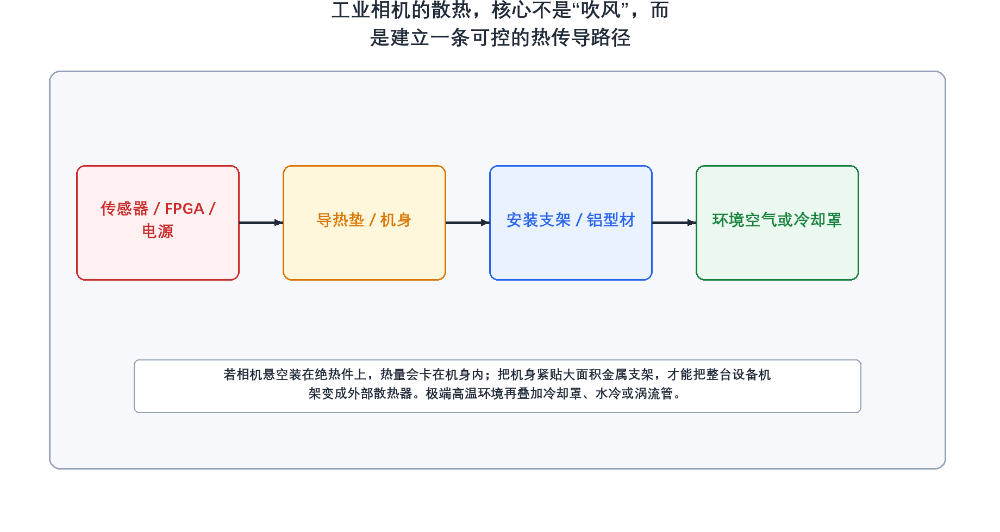

<strong>图28-1 工业相机散热依赖连续的热传导路径</strong>

图28-1把热量路径拆成内部热源、导热介面、机身壳体、安装支架和外部环境几级。读者应注意这张图强调的是路径连续，而不是单一零件的导热系数。只要中间某一段导热被切断，例如机身悬空、安装在绝热件上，前面芯片和壳体即使设计得再好，热也会堵在机内。它回答的是为什么很多工业相机必须紧贴大面积金属支架安装，但它并不意味着所有场景都只靠自然散热，高温炉旁和压铸车间仍需额外冷却外设。

### 28.4 工业相机在高温车间面临哪些特殊挑战？
高温车间的问题不只是环境温度高，而是环境温度高、粉尘油污多、热辐射强、长期运行时间长这些因素叠加。普通实验室里能稳定工作的设备，到了玻璃、钢铁、压铸、热处理或烘烤设备周边，可能很快就会出现温升过快、外壳过热、接口老化和图像噪声上升的问题。

此外，高温往往和密闭防护、强振动、局部热源靠近同时出现。相机不是孤立发热体，而是处在一个本就不利于散热的系统中，这也是为什么高温项目不能只看相机标称工作温度。

### 28.5 高温车间中保证相机稳定运行的技术方案有哪些？
常见方案包括选择更宽温度规格的工业相机、强化机身与金属支架之间的导热、使用隔热防护罩、把相机远离强辐射区、在防护箱内引入冷却空气流，以及在极端场景中使用专用冷却罩或水冷防护结构。真正可靠的方案往往不是单一措施，而是隔热、导热和冷却三件事同时做。

现场设计时要特别警惕一个误区：把相机封进密闭盒里并不自动等于保护。若防护罩没有把热带出去，密闭空间可能反而成为蓄热腔。保护和散热必须一起设计。

### 28.6 热电制冷器（TEC）在相机散热中如何工作？有什么优势？
TEC 基于帕尔帖效应工作，通电后其一侧吸热、另一侧放热，因此常被用来稳定传感器温度。它的优势是温控精确、无机械运动部件，适合需要极低噪声、长曝光和稳定暗电流的科学成像场景，如荧光显微、天文或光谱相机。

但对大多数产线视觉项目而言，TEC 不是主流解。原因并不神秘：它成本高、需要额外散热、冷面结露风险大，而且制冷量和系统复杂度之间存在现实约束。对微秒到毫秒级曝光的工业检测任务来说，暗电流往往不是第一矛盾，过度强调 TEC 反而会把系统引向不必要的复杂化。

### 28.7 相机散热设计中有哪些关键参数和性能指标？
应重点关注相机功耗、工作温度范围、机身允许温度、热阻、温升、长期稳定性和环境防护等级。若能拿到内部芯片或壳体温度监控信息，还应关注不同负载下的温升曲线，而不是只看静态标称值。对高温项目来说，设备在峰值帧率和最大处理负载下能否连续运行，比实验室低负载条件下的数据更有参考价值。

设计时还要看安装方式。很多相机的数据手册默认设备通过金属机架正常散热，若现场采用了悬空、绝热或封闭安装方式，实际热表现可能与标称条件差异很大。

### 28.8 未来相机散热技术有哪些发展趋势？
趋势大致有三类。第一类是更好的热界面与结构设计，让热量更快、更均匀地传到机身和支架；第二类是更主动的热管理，例如负载感知、温度监控和动态降频保护；第三类是系统级协同设计，把光源、相机、防护罩和机架的热问题一起考虑，而不是等设备装好后再补救。

从工程角度看，未来最有价值的不是某一种“新材料”名称，而是散热设计越来越前置，越来越与安装结构和长期可靠性绑定。

---

---

## 29. 振动环境对相机安装有什么要求？

### 29.1 为什么振动环境对相机安装特别重要？
因为视觉系统不仅需要拍到，还需要在多个时刻、多个工件和多个班次里重复获得同样的几何关系。一旦振动导致相机、镜头或接口发生微小相对位移，图像模糊、边缘漂移、标定失准和焦点偏移都会跟着出现。对读码系统来说，这可能表现为偶发失败；对测量或引导系统来说，问题会更严重，因为像素与物理坐标之间的映射本身可能被破坏。

振动问题并不只出现在肉眼可见的大幅晃动上。高频小振幅振动、周期性共振和线缆应力反复拉扯，往往更隐蔽，也更容易在长期运行中积累成故障。

### 29.2 振动对相机成像质量会产生哪些具体影响？
最直接的是曝光期间的相对位移导致图像模糊，其次是连续帧之间位置不稳、重影和边缘提取重复性下降。若振动足够强，还可能让镜头锁紧结构、接口和支架逐渐松动，最终从画质波动演变为系统几何关系改变。这也是为什么振动问题不能只靠后端算法补偿。

对高速和高精度系统来说，振动带来的损失往往不体现在平均值，而体现在重复性和极限误差上。系统平时似乎还能工作，但一到边界工况就开始失控。

### 29.3 相机安装需要满足哪些基本的防震要求？
工业视觉更强调刚性锁死，而非简单在相机底下放软垫。支架应尽量短、厚、靠近主承重结构，减少悬臂和细长连接；镜头对焦环、光圈环和各类可调部件应在调试后锁紧；关键紧固件应使用适当等级的防松措施；线缆则要在接口附近做应力释放，不让振动直接作用在插头与焊点上。

这里的核心判断不是“减震件越多越安全”，而是系统能否在振动环境中保持几何关系长期稳定。对精密测量场景来说，软性隔振若引入低频摆动，往往比高频振动本身更麻烦。

  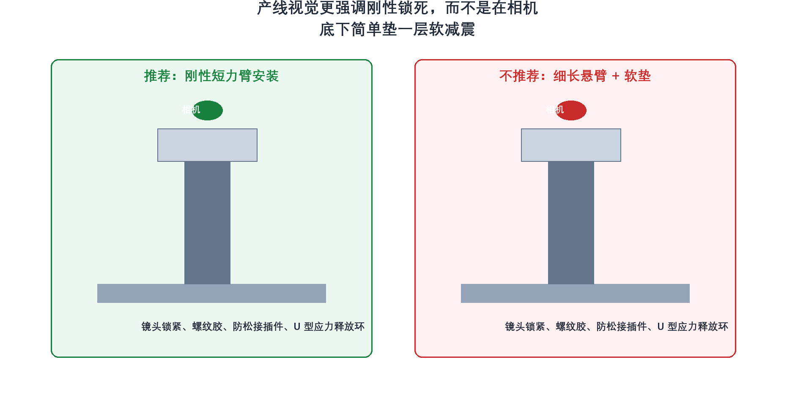

<strong>图29-1 产线视觉更推荐刚性短力臂安装，而非细长悬臂配软垫</strong>

图29-1左侧示意刚性短力臂安装，属于推荐做法；右侧示意细长悬臂加软垫的常见错误做法。图中的底座、立柱和安装板分别代表机架、支撑件与相机安装面，绿色和红色标记只用于区分推荐与不推荐布置。读者应从这张图看出，产线视觉要避免的并不是所有振动，而是让支架本身成为会摆动、会共振的弹性结构。它适合用来做安装原则判断，但若振动源极强、来自整机主结构，本质解法通常是把视觉系统与振源物理解耦，而不是只在相机下方加垫片。

### 29.4 什么是防震支架，它在振动环境中起什么作用？
防震支架这个词在不同场景里意思并不完全相同。在精密光学实验室，它可能指带阻尼或隔振能力的平台；在工业现场，它更常指更稳的安装结构、更好的防松设计和更合理的力路径。如果不先区分场景，很容易把实验室里的隔振思路照搬到产线测量里，结果反而引入低频摆动。

因此，讨论防震支架时，首先要问清楚任务目标。如果目标是让相机在测量与标定意义上尽量保持刚体式稳定，那么结构刚性和力路径通常比软隔振更重要。

### 29.5 工业相机在振动环境中的安装有哪些特殊考虑？
除了支架刚性，真正高频出问题的往往是镜头锁紧、接口防松和线缆寿命。带锁扣的工业接口、合适的线缆固定点、运动轴场景下的高柔拖链线，以及靠近接口处预留的应力释放环，常常比单独谈“减震材料”更有实际价值。很多现场故障并不是相机坏了，而是线缆内部断裂、插头接触不稳或镜头在长期振动下慢慢退焦。

所以，振动设计必须把“相机本体、镜头、支架、接口和线缆”当成一个整体，而不是只盯着相机壳体本身。

### 29.6 如何评估和测试相机安装的防震效果？
可从两条线做验证。第一条是机械侧，测振动频率、振幅、共振点和长期紧固状态；第二条是成像侧，实拍标准边缘、棋盘格或目标工件，观察清晰度、位置重复性、边缘抖动和跨时间漂移。若系统用于测量或引导，还应把重复定位误差纳入评估，而不是只看“看上去清不清楚”。

真正有效的测试，应覆盖设备启停、满速运行、不同工件负载和长时间运行后的状态。很多振动问题只有在热、振和线缆疲劳叠加后才会暴露。

### 29.7 在极端振动环境下（如航空航天、车辆等），相机安装有哪些特殊要求？
这类场景下，要同时考虑抗冲击、重量约束、接口可靠性、温漂和密封性。设计思路往往不只是“更厚的支架”，还涉及抗冲击标准、结构模态分析、线束寿命、锁固策略和环境试验要求。对于真正依赖标定稳定性的系统，是否允许引入弹性减振件，也必须按任务精度单独评估。

换句话说，极端振动场景不是普通产线支架简单加厚就能解决，而是一个系统级机械与环境适配问题。

### 29.8 相机安装中常见的防震材料和结构有哪些？
常见结构包括厚壁铝型材、钢板底座、短悬臂安装板、螺纹锁固胶、镜头锁紧结构、防松接插件和线缆应力释放夹具。若任务允许、且主要目标是保护设备免受冲击而非追求微米级几何稳定，也可能使用橡胶减振件、阻尼层或更复杂的隔振结构，但这类方案并不能被默认套用到精密机器视觉测量上。

工程上更稳妥的习惯，是先从“刚性足够、锁紧足够、接口与线缆可靠”做起，再看是否真的需要额外隔振。

  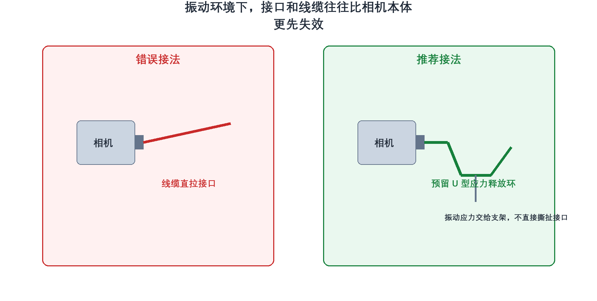

<strong>图29-2 振动环境下线缆应力释放比“把线接上”更重要</strong>

图29-2左侧示意线缆从接口处被直接拉紧，右侧示意在支架附近预留 U 型应力释放环并固定。这里真正要表达的不是走线美观，而是振动应力该由谁承受。若线缆把拉力和摆动直接传到相机接口，长期运行后更容易出现接触不良、插头松动和内部导线疲劳。读者应把这张图当作接口可靠性检查项，而不是单纯的布线习惯提示。它适合指导现场安装，但如果相机安装在持续大行程运动轴上，还需要进一步核查拖链弯曲半径、线缆寿命等级和夹持位置。

---

---

## 30. 什么是光学防抖？工业相机需要这个功能吗？

### 30.1 什么是光学防抖（OIS）的基本物理原理？
光学防抖通过检测抖动，再移动镜片组或传感器来抵消部分画面位移，使图像投影尽量稳定在传感器上。与之相近的电子防抖，则多通过裁剪、重采样和时序补偿来实现更平稳的视频观感。无论采用哪一种，本质上都是为了改善观看体验或宏观识别效果，而不是为了维持严格固定的相机内参模型。

这项技术在消费摄影、安防视频、巡检视频和手持拍摄里非常有价值，因为这些场景首先追求的是画面可看、目标不晃、视频稳定。

### 30.2 核心问题：工业机器视觉相机需要光学防抖功能吗？
对精密机器视觉，答案通常是否定的。工业视觉很多任务依赖相机标定关系保持稳定，尤其是尺寸测量、定位引导、视觉对位和亚像素边缘提取。只要内部光学中心、焦距等效值或裁剪窗口在工作中不断变化，这种稳定映射就会被破坏。

工业视觉和消费摄影面对的优化目标并不相同：前者需维持标定几何严格稳定，后者追求画面观感平稳。将"防抖让画面更稳"直接等同于"工业视觉更需要防抖"，混淆了两类系统的核心诉求。

### 30.3 为什么工业视觉排斥光学防抖与电子防抖？
原因在于它们可能改变成像几何。OIS 通过物理位移补偿抖动，EIS 通过裁剪和重投影稳定画面，这些操作对人眼观看往往是好事，但对依赖标定和几何一致性的视觉系统来说，会让主点、等效焦距、畸变中心或成像区域不再稳定。这样一来，即使画面看起来更顺，尺寸换算和定位精度却可能变差。

还要注意，工业视觉常常需要亚像素级的边缘与位置稳定性。只要内部补偿让成像几何不断变化，后续算法面对的就不再是一台参数稳定的相机。

### 30.4 如果不用防抖，工业视觉如何解决车间振动与运动模糊？
工业视觉的标准解法不在于补偿抖动，而在于冻结运动。常见组合包括全局快门、极短曝光和高亮频闪。全局快门避免卷帘畸变，极短曝光减少运动在曝光期间造成的位移，高亮频闪则补足短曝光下的光子数量。对高速场景来说，这套组合比防抖更符合几何稳定性的要求。

如果把运动模糊简化成线位移问题，可用

$$
\Delta x = v t_e
\tag{30-1}
$$

近似理解，其中，$\Delta x$ 为曝光期间的运动位移，$v$ 为目标相对速度，$t_e$ 为曝光时间。式（30-1）说明得很直接：要压低模糊，最有效的物理手段之一就是缩短曝光时间。

### 30.5 工业视觉在机械安装上如何进行硬防抖？
所谓硬防抖，本质是把系统做成稳定刚体。相机和光源应固定在足够刚的支架上，镜头环与可调机构要锁紧，紧固件要防松，线缆要做应力释放，必要时还要把视觉系统与主要振源物理解耦。这不是消费电子里的一个功能开关，而是一整套机械、电气和成像配合策略。

从系统角度看，这一套方法和 29 题讨论的安装原则是连在一起的：冻结运动、稳定几何、避免内部补偿改变成像模型。

### 30.6 仍有少数工业场景适合使用防抖技术

仍有少数工业场景使用防抖技术，但必须区分任务类型：常规传输带尺寸测量、定位和抓取任务中的防抖多是机械层面的硬化解，而非电子或光学防抖。若任务属于宏观巡检、远距离观察、安防视频、无人机巡查或移动机器人环境感知，系统更关注画面稳定和目标可见性，而不依赖微米级几何标定，这时 OIS、EIS 或云台稳像都可能是合理选择。它们仍然属于工业应用的一部分，只是目标函数已经从精密测量换成了宏观可见和识别可用。

所以，判断标准应聚焦于当前任务是否要求标定几何严格稳定：若要求严格稳定，就应非常谨慎；若主要做宏观观察，则可以根据需要采用。

  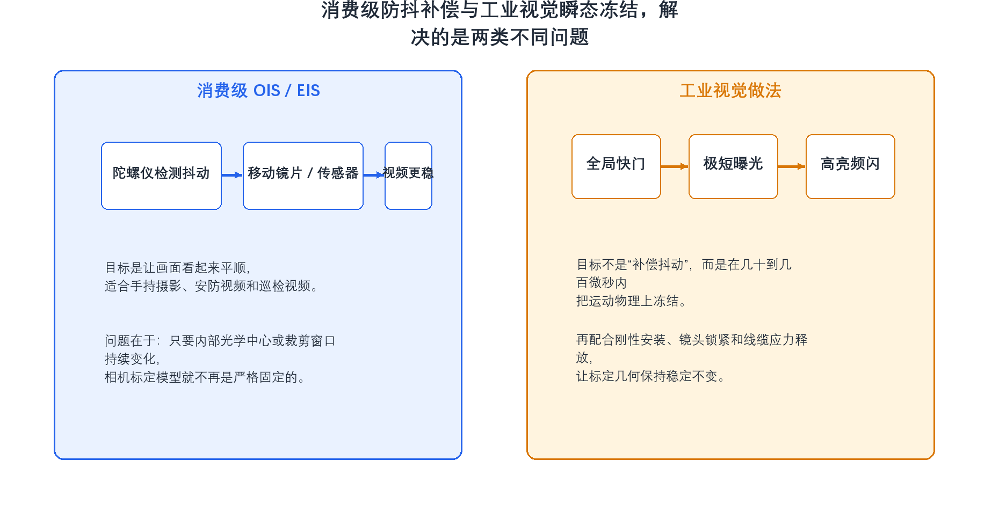

<strong>图30-1 消费级防抖补偿与工业视觉瞬态冻结的目标差异</strong>

图30-1左侧用“检测抖动—移动镜片或传感器—视频更稳”的链路概括 OIS/EIS 的典型目标，右侧则用“全局快门—极短曝光—高亮频闪”的链路概括工业视觉的常见做法。两边的差别不在于谁更先进，而在于优化目标不同：一边追求观感稳定，另一边追求标定几何和瞬时成像稳定。读者应从这张图中明确，工业视觉抗模糊更偏向物理冻结而非内部补偿。它适合用来澄清概念边界，但在不依赖精密几何的巡检或安防场景中，防抖技术依然可能是合理方案。

---

## 31. 拿到一个新的检测项目，你的硬件选型（相机、镜头、光源）的具体步骤是什么？

### 31.1 在开始硬件选型之前，我需要了解哪些核心的项目需求？

硬件选型应从检测任务的成像约束出发，而不是从器件目录出发。至少要弄清六件事：第一，被测对象的尺寸范围、材质、表面反射特性和姿态变化；第二，需要看见什么，是划痕、毛刺、字符、孔位、边缘、焊点，还是装配关系；第三，最小特征尺寸和允许误差，二者不能混为一谈，因为检出 0.05 mm 缺陷与把尺寸测到 ±0.01 mm 对系统的要求并不相同；第四，产线节拍、运动状态和触发方式，静止拍照与飞拍对快门和照明的约束完全不同；第五，安装空间、工作距离、环境光、振动、粉尘、油污和温度波动；第六，与PLC、机器人、上位机和现场维护方式的集成要求。

如果这些前提没有定清楚，后面的选型很容易出现方向性错误。例如，有人把最小缺陷尺寸直接当作测量精度去算像素，结果相机分辨率选得很高，镜头和光照却支撑不住。也有人只关心视野和分辨率，没有提前确认现场是连续运动抓拍，最后不得不在已定的卷帘快门相机上反复补救。真正有效的做法，是先把任务需求整理成表格，再进入相机、镜头与光源的联合选型。

### 31.2 如何根据检测精度要求确定相机分辨率？

相机分辨率通常从视野与最小可分辨特征的关系推导。若沿某一方向的视野大小为 \(FOV\)，希望该方向上最小特征尺寸为 \(d_{\min}\)，并且要求这个特征至少占据 \(n\) 个像素，则理论像素数可写为

$$
N=\frac{FOV}{d_{\min}}\cdot n
\tag{31-1}
$$

式中，\(n\) 不是固定常数，它取决于任务性质。若只是做存在性检测，2 到 3 个像素覆盖最小特征有时已经可以工作；若要稳定地区分缺陷形状、方向或边缘位置，通常会希望最小特征至少占 3 到 5 个像素；尺寸测量则不能只靠特征占几个像素来判断，还要结合镜头成像质量、边缘对比度、重复性和算法模型综合评估。把所有任务都简单乘一个 2 到 3 的安全系数，虽然常见，却并不严谨。

更稳妥的流程是先按式（31-1）算出理论下限，再检查是否存在以下放大因素：视野是否还要预留边界、目标姿态是否会变化、是否需要后续裁切、是否存在多工位共用一台相机、以及缺陷是否位于视野边缘。理论像素数只是起点，最后选定的相机分辨率还应与镜头分辨能力、帧率需求和接口带宽一起核算，否则高像素并不会自动换来高可检性。

### 31.3 相机传感器类型（CMOS vs CCD）和接口（GigE、USB3、Camera Link）如何选择？

在当前工业视觉项目中，CMOS 已是主流选择。它在帧率、功耗、成本、功能集成度和产品可获得性方面都更有优势，绝大多数新项目优先考虑 CMOS。CCD 并非完全消失，但更多出现在历史系统延续、特定科研应用或少数对成像风格有既有依赖的场景中。若不是在做旧系统替换或有明确的特殊理由，把高质量图像优先选 CCD 当作通用原则，已经不太符合现在的工业相机现实。

接口选择则要从三件事判断：带宽、布线距离和系统架构。GigE 适合布线距离较长、现场网络化程度较高的场合，维护方便，扩展性也较好，但要留意实际可达带宽、网卡性能和多相机并发占用；USB3 接口配置简单、成本低，适合工控机近距离接入，不过线缆长度和抗干扰能力通常不如工业以太网方案；Camera Link 或 CoaXPress 更适合高速、高分辨率、低延迟的严苛场合，但系统成本、采集卡和调试复杂度也更高。接口从来不是孤立选项，它要与分辨率、帧率、位深、相机数量和主机处理能力一起算账。

快门类型同样必须在这一环节定清楚。只要项目涉及连续运动拍照、振动、旋转件或高速传送，通常就应优先选择全局快门相机。卷帘快门在静止物体、固定治具和慢速场景下可以工作，一旦进入飞拍，图像倾斜、拉伸和局部时序畸变会直接影响测量和缺陷判断，后续很难靠算法完全修正。

### 31.4 镜头选型的核心计算方法和参数有哪些？

镜头选型首先要解决焦距与工作距离的匹配问题。若传感器在对应方向上的有效尺寸为 \(w\)，工作距离为 \(WD\)，该方向的视野尺寸为 \(FOV\)，则薄透镜近似下常用的焦距估算式为

$$
f \approx \frac{w \cdot WD}{FOV}
\tag{31-2}
$$

这只是初步估算。实际选型时还要同时检查镜头支持的最大靶面是否覆盖相机传感器，否则会出现物理渐晕或边缘成像恶化；再看镜头在当前像元尺寸下的分辨能力是否足够，避免出现相机像素很高但镜头像不清的情况。对高精度测量项目，还要重点关注畸变、远心性、景深和工作距离稳定性。普通工业镜头在检测、识别、定位场景中已经能覆盖大量任务，但一旦目标是降低放大率变化、抑制透视误差或保证边缘尺寸一致性，远心镜头往往更合适。

光圈也不能只按越大越亮来理解。较小的 F 值能提高进光量，却会缩小景深，并放大机械装配与对焦偏差的影响；较大的 F 值有利于景深，却会推高曝光时间或光源功率需求。镜头计算的结果，最终要回到现场：这台镜头在给定工作距离、目标高度起伏和照明条件下，能否在整个检测区域内稳定形成足够锐利的图像。

### 31.5 不同检测场景下如何选择合适的光源类型和照明方式？

光源选型的目标，是让被关注的特征与背景在图像上拉开稳定差异。看外轮廓、外径、孔径或透明件边界，背光通常最直接；看平整表面的刻印、焊盘、标签或一般性缺陷，环形光常作为起点；看划痕、凹坑、压痕和微小起伏，低角度条形光或暗场照明更容易把表面微结构显出来；面对强反光的金属或玻璃表面，同轴光、穹顶光或积分式照明往往比简单正打光更可控。

光谱选择也应服务于目标特征。黑白相机配单色 LED 是最常见的组合，红光稳定、寿命长、成本合适，因此使用广泛；蓝光波长更短，对某些微小表面缺陷和细节边缘更敏感，但对杂散反射和表面状态也更挑剔；若目标与背景是颜色差异而非灰度差异，就应把彩色成像或分光方案一并纳入考虑。需要强调的是，光源颜色不是凭经验固定下来的，很多项目要靠样件实拍比较红、蓝、白、近红外等不同波段的实际效果。若现场环境光复杂，在镜头前增加与照明波段匹配的窄带滤光片，往往能显著提高稳定性。

### 31.6 硬件组件之间如何匹配和集成？

相机、镜头和光源构成的是一套相互牵制的成像链。相机像元越小，对镜头分辨能力和照明质量的要求通常越高；镜头焦距越长、光圈收得越小，光源亮度和安装空间压力往往越大；光源角度一改，镜头看到的反射路径和对比度分布也会跟着变。真正的硬件选型，必须把它们放在一起看。

集成阶段至少应核对以下内容：相机接口与主机或采集卡是否匹配，镜头接口和法兰距是否正确，镜头像场是否覆盖传感器，光源照明区域是否完全覆盖视野，触发信号、电源容量和布线是否满足现场要求，机械安装是否足够刚性，是否预留了调焦、调角度和换型维护空间。对于有粉尘、油污、振动或强环境光干扰的现场，还要同时考虑防护罩、散热、减振和遮光结构，因为许多所谓“相机问题”最后其实是安装和环境问题。

### 31.7 在实际选型中，有哪些常见的错误和注意事项需要避免？

最常见的错误，是过早把注意力集中到单一参数上。有人一上来只看像素，结果忽略了镜头和光照是否真的能支撑这些像素；有人只盯着镜头焦距算视野，没有检查景深和畸变；也有人拿实验室里拍得不错的方案直接上产线，却没有把环境光、振动和节拍变化考虑进去。这样做出来的系统，往往在样机演示时没问题，一到真实生产就开始不稳定。

另一个高频错误，是把能拍到图当作可以交付。图像中确实看到了缺陷，不代表对比度足够稳定；当前样件能对上焦，不代表产品高度波动后仍能工作；在单件测试中能跑通，不代表在连续节拍和温升条件下仍能维持一致性。选型时应主动评估：最可能成为现场短板的参数、系统对该参数留出的余量是否充足、且余量务必来自真实验证而非主观判断。

### 31.8 如何通过实际测试验证硬件选型的合理性？

验证阶段要做的是用样件把整套假设逐项证实。至少应准备覆盖正常件、边界件、缺陷件和姿态波动件的测试样本，在目标工作距离、目标速度、目标光照和目标安装姿态下连续实拍。验证内容包括图像清晰度、视野覆盖、照明均匀性、缺陷对比度、边缘稳定性、重复拍摄一致性、帧率与丢帧情况，以及长时间运行后的温升和漂移。

如果条件允许，最好在真实产线或与其等效的模拟工位上验证，而不是只在桌面环境里拍静态样件。因为许多问题只会在真实工况下出现，例如传送带振动带来的轻微虚焦、现场杂光引起的反射漂移、多班次温度变化导致的焦点漂移，以及连续运行时的通信和缓存压力。测试结果应形成记录，包括当时的工作距离、相机参数、光源参数、样件编号和效果评价。没有记录的测试，后续几乎无法复现，也难以作为定型依据。

  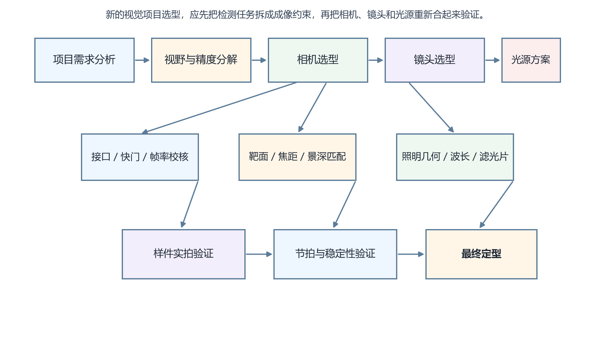

<strong>图 31-1 新的视觉项目硬件选型流程</strong>

图31-1 从项目需求分析出发，先拆出视野与精度，再进入相机、镜头和光源三个主选型环节，随后补做接口、快门、景深、照明波长等交叉校核，最后通过样件实拍和节拍稳定性验证完成定型。图中上下两层的结构有明确含义：上层回答“各硬件大类怎么选”，下层回答“这些单项选择能否在一套系统里同时成立”。读者应从这张图得到一个工程判断，硬件选型是一个多轮回路，前面的单项选择会不断受到后续验证结果的修正。该图适合作为新项目立项后的工作框架，但具体阈值、留量和验证重点仍需结合任务类型、预算和现场环境确定。

---

## **模块二：算法基础（9问）**
