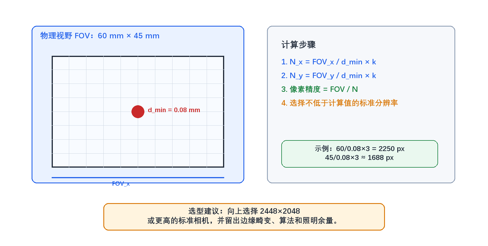
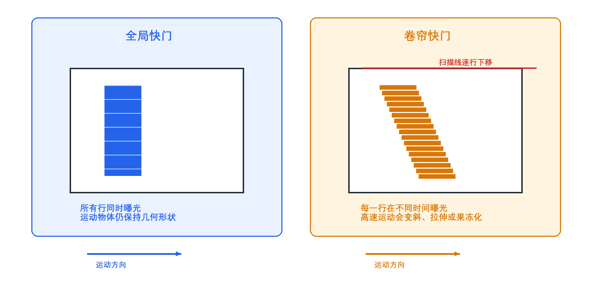
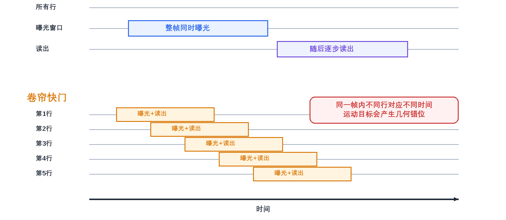
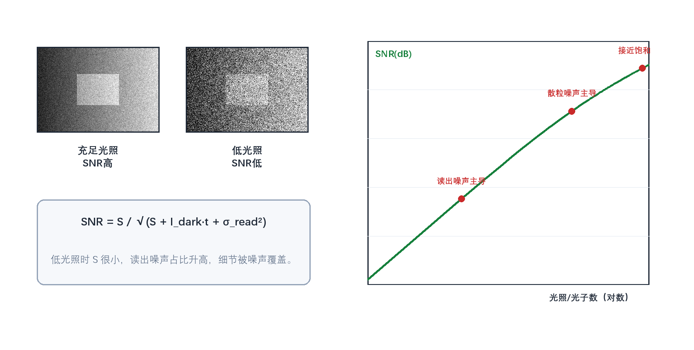
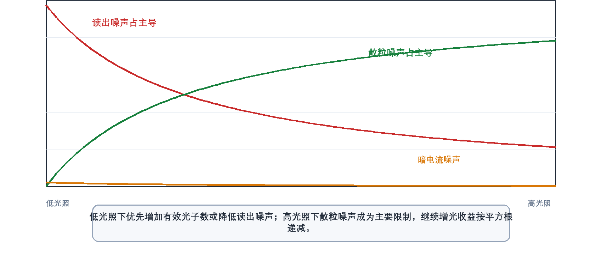
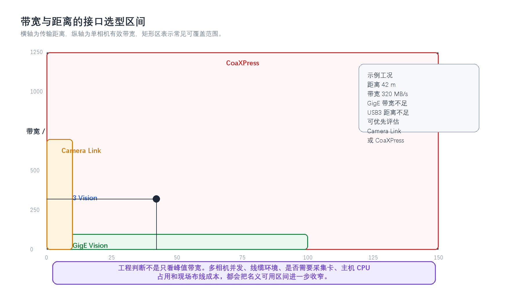

# 1. 工业相机选型（第1—6问）

> **网络署名：LanQS** · 作者及著作权人：兰青松 · [版权说明](copyright.md)

本节从检测目标、视野、最小缺陷和生产节拍出发，建立工业相机分辨率、帧率、像元尺寸、快门、动态范围与接口选择的基本约束。

## 1. 工业相机选型的三个最核心参数是什么？它们的计算公式或选择逻辑是怎样的？ { #q1 }

### 1.1 什么是工业相机选型，为什么需要关注核心参数？
工业相机选型，是根据检测任务的需求——检测什么、要求多准、产线跑多快、在什么环境下工作——从众多相机型号中选出最匹配的那一款的过程。

之所以需要特别关注核心参数，是因为**分辨率、帧率和像元尺寸**直接决定了三件事：系统能否分辨出目标的最小特征（分辨率），能否跟上生产节拍不漏拍（帧率），以及图像质量是否够干净、够稳定（像元尺寸）。这三项参数构成最基础的约束关系：分辨率决定空间采样能力，帧率决定单位时间内可采集的图像数量，像元尺寸影响收光能力、动态范围和噪声水平。在此基础上，检测精度、生产节拍、成像质量、接口带宽、镜头匹配和项目成本需要统筹权衡。三者若单独追求其一，压力就会转移到镜头、照明、数据传输或算法端，最终影响检测稳定性和量产可维护性。

### 1.2 第一个核心参数：分辨率（Resolution）的选择逻辑是什么？
分辨率决定图像的空间采样密度，需结合视场大小、最小特征尺寸、镜头解析力和算法对边缘或缺陷的像素覆盖要求来判断，而非仅以总像素数衡量。

**选择逻辑：**
1.  **视场（FOV）与精度要求**：确定检测区域的物方尺寸，再根据检测精度要求计算所需的最小像素数。
2.  **像素覆盖系数**：对于缺陷检测或尺寸测量，最小特征通常需要覆盖多个像素才能稳定识别。该系数表示每个最小特征需要多少像素覆盖，并非相机天然具备的亚像素精度；常用取值为2~3，高精度或低对比场景按表2-1取2.5~4.0。
3.  **相机传感器尺寸**：分辨率与传感器尺寸共同决定了像素尺寸，进而影响成像质量和景深。

**计算公式：**
$$
\text{所需分辨率} = \frac{\text{视场尺寸}}{\text{目标特征尺寸或允许误差}} \times \text{像素覆盖系数}
\tag{1-1}
$$

例如，如果要在100mm宽的视场内稳定识别0.1mm量级的特征，并希望该特征至少覆盖3个像素，则所需横向分辨率为：
$$
\text{分辨率} = \frac{100\text{mm}}{0.1\text{mm}} \times 3 = 1000 \times 3 = 3000\text{像素}
\tag{1-2}
$$
横向分辨率至少应达到3000像素。若实际场景存在低对比缺陷、镜头边缘解析力下降、光照不均或定位算法对边缘质量敏感等情况，还需在此基础上增加余量，将理论值作为选型起点而非最终结论。

### 1.3 第二个核心参数：帧率（Frame Rate）的计算公式是什么？
帧率决定相机每秒采集的图像数量，直接关系到生产线节拍、漏拍风险和图像处理系统的吞吐能力。相机标称帧率只是上限，实际运行帧率还会受到分辨率、位深、接口协议和主机处理能力的限制。

**选择逻辑：**
1.  **生产线速度**：根据生产线的移动速度确定最小帧率要求。
2.  **曝光时间约束**：高速运动物体需要短曝光时间，这会限制有效帧率。
3.  **处理能力匹配**：相机帧率应与图像处理系统、传输链路和存储能力相匹配。

**计算公式：**
$$
\text{所需帧率} = \frac{\text{生产线速度}}{\text{检测区域长度}} \times \text{安全系数}
\tag{1-3}
$$

更精确的计算需同时考虑运动模糊。若允许图像上的运动模糊为 $b$ 个像素，物方像素当量为 $p_{obj}$（mm/px），物体速度为 $v$（mm/s），则曝光时间上限为：
$$
t_{exp,max} = \frac{b \times p_{obj}}{v}
\tag{1-4}
$$

例如，生产线速度为1m/s，检测区域长度为50mm，需要至少2倍重叠采样，则：
$$
\text{帧率} = \frac{1000\text{mm/s}}{50\text{mm}} \times 2 = 20 \times 2 = 40\text{fps}
\tag{1-5}
$$
40fps 对应的帧周期为 25ms。若进一步要求运动模糊不超过1个像素、物方像素当量约 0.05mm/px，由式(1-4)得 $t_{exp,max}=1\times 0.05/1000=0.05\text{ms}=50\mu\text{s}$。可见曝光时间上限远低于帧周期——高速运动场景中，曝光约束往往比帧率约束更严格。若同一工位还需多次曝光、频闪控制或复杂算法处理，应继续核算相机缓存、接口带宽和处理延迟，避免量产中出现帧丢失或触发排队。

### 1.4 第三个核心参数：像元尺寸（Pixel Size）如何影响成像质量？
像元尺寸是每个感光单元的物理尺寸，通过收光面积、满阱容量和读出结构影响灵敏度、动态范围和信噪比。在固定传感器尺寸内，像元越大则收光能力越好，但可布置的像素数越少，空间采样能力下降。

**选择要点（同代工艺、相近传感器结构下的近似趋势）：**
1.  **灵敏度**：像元面积越大，单个像元收集的光子越多，低光照条件越有利。
2.  **动态范围**：像元尺寸越大，满阱容量通常越大，动态范围越宽。
3.  **空间采样能力**：在相同传感器尺寸下，像元越小，可布置的像素数越多，需在灵敏度与分辨率之间取得平衡。

### 1.5 这三个参数之间如何相互制约和平衡？
分辨率、帧率和像元尺寸之间存在明显的系统级制约。分辨率提高后，单帧数据量随之增加，接口带宽、存储和算法处理时间都会受到影响；帧率提高后，曝光时间和传输时间被压缩，对照明强度、相机缓存和主机处理能力提出更高要求；像元尺寸变小后，虽然可以在同一传感器面积上获得更多像素，但低光照下的信噪比、动态范围和镜头匹配难度也会发生变化。

  

<strong>图1-1 工业相机三核心参数的制约关系</strong>

图1-1 展示分辨率、帧率、像元尺寸三项核心参数之间的系统级制约关系。左侧为传感器尺寸与像素数的权衡，中间反映分辨率与帧率共同决定数据吞吐，右侧指向成像质量、检测速度和成本的平衡。

**平衡策略：**
分辨率与帧率的平衡，本质上是单帧信息量与单位时间吞吐量之间的取舍；像元尺寸与分辨率的平衡，则是在收光能力和空间采样能力之间分配传感器面积。工程上可通过选择合适的接口（如GigE、USB3、CoaXPress）、优化照明和镜头系统、拆分检测工位或缩小视场来降低单个参数的压力。

### 1.6 实际选型中还需要考虑哪些辅助参数？
除了上述三项参数，还需要同时检查传感器类型、快门方式、接口协议、光谱响应、环境适应性和软件兼容性。传感器是CMOS还是CCD、采用全局快门还是卷帘快门，会影响高速运动场景下的几何稳定性；GigE Vision、USB3 Vision、Camera Link、CoaXPress等接口决定了传输距离、带宽和系统布线方式；黑白、彩色、近红外或紫外响应则要与被测材料、光源波段和缺陷对比度匹配。对于量产设备，还应把工作温度、防护等级、抗振动能力、SDK稳定性和视觉软件兼容性纳入评估，否则样机阶段能运行的配置，未必能在现场长期稳定运行。

### 1.7 如何通过实际案例理解这些参数的选择？
以汽车零部件尺寸检测为例：
- **视场**：200mm × 150mm
- **检测精度**：±0.05mm
- **生产线速度**：2m/s
- **工作环境**：车间正常照明

**计算过程：**
1. **分辨率计算（测量/像素当量口径，k=1）**：令单个像素的物方尺寸等于 ±0.05mm，则横向需 $\frac{200\text{mm}}{0.05\text{mm}} = 4000\text{像素}$，纵向需 $\frac{150\text{mm}}{0.05\text{mm}} = 3000\text{像素}$，对应约1200万像素（4000×3000）。本章案例为尺寸测量任务，按 §1.1 的分类规则适用测量口径（k=1），理论上1200万像素即可满足物方采样要求。

   > **变体讨论**：若在尺寸检测的基础上还要求零件表面的微小缺陷（如划痕、压痕）被稳定检出，则需切换为特征覆盖口径。以 k=3 估算，分辨率需求变为 $12000\times 9000\approx 1.08$ 亿像素——两条路径相差近一个数量级。实际项目中应先明确当前工位的主任务类型（测量/定位 or 缺陷识别），再决定是否引入覆盖系数，避免口径混淆导致相机规格大幅偏差。

2. **帧率计算**：$\frac{2000\text{mm/s}}{200\text{mm}} \times 2 = 10 \times 2 = 20\text{fps}$
   考虑处理余量，选择30fps相机

3. **像元尺寸选择**：车间照明条件良好，选择中等像元尺寸（如3.45μm）平衡灵敏度和分辨率

本例以尺寸测量为主路径，与 §1.1 的分类规则自洽；在变体中展示了引入特征覆盖要求后的量级变化。实际项目中，不同工位应各自明确任务类型，再选取对应口径计算像素需求，综合决定是提高分辨率、缩小视场、增加工位，还是重新定义检测策略。

### 1.8 现代工业相机技术发展趋势对参数选择有何影响？
随着传感器、接口和边缘计算能力的发展，工业相机正在向更高分辨率、更高帧率和更强片上处理能力演进。高分辨率相机已经从传统的500万像素扩展到2000万、4500万甚至更高规格，但高像素必须同步核对镜头像场、解像力、接口带宽和处理时间；高速检测、运动分析和分选场景对高帧率需求增加，不过1000fps以上通常属于高速专用场景，并非普通工业检测的常态。智能相机、多光谱/高光谱成像以及结构光、TOF、双目视觉等3D方案也在改变相机参数的权重。这些方案下，参数选择的关注点会从单纯追求二维分辨率转向光谱差异、深度精度、同步机制和端侧算法能力。

> **📖 本章阅读提示：两类分辨率估算口径**
>
> 本章及下一章涉及两种不同的像素需求计算方式，读者在阅读时需注意区分：
> - **测量/像素当量口径**（k=1）：仅要求单个像素的物方尺寸等于或小于允许误差，直接由视场除以允许误差得出最小像素数。适用于读数式测量、边缘定位等以亚像素插值为前提的任务。
> - **特征覆盖/缺陷识别口径**（k≥2）：要求最小特征覆盖多个像素以保证稳定检出，公式需乘以像素覆盖系数 k（常用2~3，高精度场景按表2-1取2.5~4.0）。适用于缺陷识别、纹理判断、字符读取等依赖明确灰度对比的任务。
>
> 本书第1–2问的主体计算示例均使用**特征覆盖口径**；§1.7 以尺寸测量案例为主展示**测量口径**，并将特征覆盖作为变体对比。建议读者先读完第2问后再回看本提示，届时两种口径的区别会更加清晰。

---

## 2. 如何根据最小检测缺陷尺寸和视野范围，计算所需相机的最低分辨率？（请给出公式和例子） { #q2 }

### 2.1 什么是机器视觉中的最小检测缺陷尺寸？
在机器视觉检测系统中，最小检测缺陷尺寸指在给定成像与算法条件下，系统能以可接受的检出率和误检率稳定判定出来的最小缺陷尺寸。这个尺寸由产品质量标准、缺陷对比度、光学放大倍率、镜头解析力、照明方式、噪声水平和算法判定方式共同决定。例如电子元件检测中可能关注0.1mm级别的引脚缺陷，PCB焊点检测中可能关注0.05mm级别的锡珠、桥连或虚焊特征；当缺陷本身对比度较低或边界不清晰时，即使几何尺寸相同，也需要更高的像素覆盖和更稳定的成像条件。

### 2.2 视野范围（FOV）在分辨率计算中起什么作用？
视野范围（Field of View, FOV）是相机一次成像覆盖的物方区域，通常以X方向宽度和Y方向高度表示。FOV越大，同样数量的像素就要分摊到更大的物理区域上，单个像素对应的实际尺寸随之增大；若要保持相同的缺陷识别能力，需提高分辨率、缩小视场，或通过多个相机/多个工位分担检测区域。实际设计中，FOV需计入产品尺寸、定位误差、夹具重复性和边缘预留量，不能仅以理论产品外形尺寸作为FOV边界。

### 2.3 为什么需要精度因子（安全系数）？
精度因子也可称为像素覆盖系数，常见取值为2~3，高要求或低对比场景按表2-1取更高值。它的作用是让最小缺陷或最小测量特征在图像中覆盖多个像素，避免特征只落在一两个像素上而受采样相位、噪声和插值算法影响过大。该系数不能替代完整的测量不确定度分析；最终检测能力仍取决于镜头MTF、照明稳定性、传感器噪声、标定精度、算法鲁棒性和现场机械重复性。

### 2.4 相机分辨率计算的核心公式是什么？
相机最低分辨率的常用估算公式为：

**水平方向分辨率公式：**
$$
N_x = \frac{FOV_x}{d_{min}} \times k
\tag{2-1}
$$

**垂直方向分辨率公式：**
$$
N_y = \frac{FOV_y}{d_{min}} \times k
\tag{2-2}
$$

**总像素数公式：**
$$
N_{total} = N_x \times N_y
\tag{2-3}
$$

其中：
- $N_x$：水平方向所需像素数
- $N_y$：垂直方向所需像素数
- $FOV_x$：水平视野范围（mm）
- $FOV_y$：垂直视野范围（mm）
- $d_{min}$：最小检测缺陷尺寸（mm）
- $k$：像素覆盖系数/精度因子（常用2~3，高精度或低对比场景按表2-1取2.5~4.0）

### 2.5 像素精度与分辨率有什么关系？
像素精度是指每个像素对应的实际物理尺寸，计算公式为：
$$
Pixel\ Accuracy = \frac{FOV}{Resolution}
\tag{2-4}
$$

工程中常用"像素当量"描述单个像素在物方对应的实际尺寸。例如视野为50mm、相机水平分辨率为5000像素时，像素当量为0.01mm/像素。用于初步估算时，通常希望像素当量不大于最小检测缺陷尺寸除以像素覆盖系数；像素当量是采样尺度，不能直接等同于测量精度。实际的测量精度还会受到镜头畸变、标定模型、边缘提取算法、光照均匀性和机械稳定性的影响，最终必须通过实拍样件和重复性实验确认。

### 2.6 如何通过一个实际案例来理解这个计算过程？
以PCB板焊点缺陷检测为例，要求如下：
- 最小检测缺陷尺寸：$d_{min} = 0.1mm$
- 视野范围：$FOV_x = 50mm$（宽度），$FOV_y = 40mm$（高度）
- 精度因子：$k = 3.0$（对应表2-1 PCB焊点检测推荐值）

**计算过程：**
水平方向所需像素数：$N_x = \frac{50}{0.1} \times 3.0 = 500 \times 3.0 = 1500$像素
垂直方向所需像素数：$N_y = \frac{40}{0.1} \times 3.0 = 400 \times 3.0 = 1200$像素
总像素数：$N_{total} = 1500 \times 1200 = 1,800,000$像素（约180万像素）

**像素精度验证：**
水平像素精度：$50mm / 1500 = 0.033mm/像素$
垂直像素精度：$40mm / 1200 = 0.033mm/像素$
实际最小可检测尺寸：$0.033mm \times 3.0 = 0.1mm$（满足要求）

从这个计算可以看到，1500×1200像素只是由采样关系得到的最低估算值，它说明0.1mm缺陷在图像中约占3个像素，具备被稳定采样的基本条件。若焊点表面反光强、缺陷灰度对比弱，或算法需要判断缺陷边界形态而不仅是有无检测，实际项目中通常会选择更高分辨率或缩小FOV，并通过偏振、同轴光、环形光等照明方式提高缺陷对比。

### 2.7 如何选择最接近的标准分辨率相机？
在实际选型中，相机分辨率通常是标准化的，不会完全等于计算结果。对于上述案例中1250×1000像素的最低需求，1280×1024像素（约131万像素）的相机在数值上略高于计算值，可作为入门选型；如果产品定位误差较大、视场边缘需要留出夹具和公差余量，或后续算法需要进行旋转校正、透视校正和缺陷分类，则应继续增加分辨率余量。标准分辨率匹配的原则是：在成本、带宽、镜头和算法时间允许的范围内，为现场波动留出可验证的余量，而非追求恰好等于最低计算值。

### 2.8 考虑实际因素时还需要注意什么？
在实际应用中，分辨率计算只是起点，还需要把镜头畸变、运动模糊、光照条件和算法要求纳入同一个验证过程。镜头边缘区域可能存在畸变和解析力下降，导致理论像素当量在边缘并不能转化为同等检测能力；目标运动时，曝光时间过长会把小缺陷拉成模糊斑，使提高分辨率也无法恢复清晰边界；光照不均匀会改变缺陷对比度，使算法在不同位置表现不一致；某些图像处理算法还需要更高采样密度才能稳定提取边缘、纹理或形态特征。对量产设备而言，最好用真实样件、最差光照和最大节拍条件做验证，而不是只依据理论分辨率完成选型。

### 2.9 有没有更简化的快速估算方法？
对于快速估算，可以使用以下简化公式：
$$
Resolution \geq \frac{FOV}{d_{min}} \times 2
\tag{2-5}
$$

该公式默认精度因子为2，适用于一般外观检查的初步估算。对于高精度要求，建议使用精度因子3或通过实验确定更合适的像素覆盖系数。

  

<strong>图2-1 FOV、最小缺陷与最低分辨率计算</strong>

图2-1 将最低分辨率计算拆为三层：左侧视野范围表示一次成像覆盖的物方区域，中间的最小缺陷尺寸和像素覆盖系数决定单个缺陷应占多少像素，右侧为可选的标准相机分辨率。读图时需先将FOV、缺陷尺寸、覆盖系数三者换算为采样下限，再核对标准规格是否留有合理余量。

<strong>表2-1 不同检测任务的分辨率估算参考</strong>

| 应用类型 | 典型最小缺陷尺寸 | 建议精度因子 | 备注 |
|---------|----------------|-------------|------|
| 一般外观检查 | 0.5-1.0mm | 2.0 | 对精度要求不高 |
| 电子元件检测 | 0.1-0.3mm | 2.5 | 中等精度要求 |
| PCB焊点检测 | 0.05-0.1mm | 3.0 | 高精度要求 |
| 精密零件测量 | 0.01-0.05mm | 3.5-4.0 | 极高精度要求 |

---

## 3. 全局快门和卷帘快门的根本区别是什么？为什么动态工业检测通常优先用全局快门？卷帘快门在什么情况下可以使用？ { #q3 }

### 3.1 全局快门和卷帘快门在物理实现上的根本区别是什么？

全局快门和卷帘快门的根本区别在于像素曝光窗口的时间同步性。这一差异直接影响运动场景下的几何保真：全局快门保持整帧空间关系一致，卷帘快门在高速运动下会引入系统性的行间时间差。全局快门传感器让整帧像素在同一时间窗口内开始和结束积分，随后再通过片上存储节点或读出电路读取信号；"全局"指曝光同步，而非所有像素在同一瞬间完成读出。卷帘快门传感器则按行顺序开始和结束曝光，图像从顶部到底部，或按传感器定义的方向逐行滚动完成采集，同一帧图像中的不同行对应不同时间点。

  

<strong>图3-1 全局快门与卷帘快门的运动成像差异</strong>

图3-1 左侧为全局快门的整帧同步曝光，右侧为卷帘快门的逐行曝光过程。当目标运动或相机振动时，卷帘快门的行间时间差会导致边缘倾斜、形状拉伸等几何形变，而全局快门在曝光窗口内所有像素行采样同一时刻。

  

<strong>图3-2 全局快门与卷帘快门曝光时序对比</strong>

图3-2 从时间轴对比两类快门的曝光/读出时序。上半部分为全局快门：所有行共享同一曝光窗口，结束后统一读出；下半部分为卷帘快门：各行依次曝光和读出，同一帧中不同行对应不同采样时刻。

### 3.2 这种物理差异会带来什么样的图像采集效果差异？

由于卷帘快门具有逐行扫描特性，当拍摄**运动物体**或**相机本身移动**时，同一帧图像中不同位置会记录目标在不同时间的状态，这就是常说的“卷帘快门效应”。它在图像中可能表现为垂直边缘变成斜线、圆形零件被拉成椭圆、快速旋转的叶片呈现扭曲形态，或者移动目标出现类似“果冻效应”（jello effect）的局部摆动。对普通影像而言，这类变形有时只是视觉瑕疵；但对工业检测而言，它会直接改变被测对象的几何关系。

全局快门由于所有像素处于同一曝光时间窗口，可以消除同帧行间的时间错位导致的几何畸变。但运动模糊取决于曝光时间内的目标位移——若曝光过长，运动物体仍会发生位移，边缘会变宽、细小缺陷会被抹平。高速检测仍需短曝光和足够强的频闪光源配合。全局快门解决的是行间错位，运动模糊来源于曝光窗口内的运动，二者成因不同。

### 3.3 为什么动态工业检测通常优先使用全局快门？

动态工业检测场景通常涉及传送带、机械臂、旋转机构上的高速运动物体。卷帘快门在这些场景中会产生几何畸变，破坏尺寸、位置、角度和缺陷区域的测量前提。同时，许多检测设备需要与PLC、编码器和频闪光源精确同步。全局快门让整帧像素共享同一曝光窗口，更容易对齐触发时刻和光源脉冲。工业现场存在机械振动时，卷帘快门还可能放大振动造成的形变。关于卷帘快门可接受的条件，详见 §3.4。

### 3.4 卷帘快门在什么情况下可以接受使用？

卷帘快门适合被测物和相机相对静止、运动速度很低，或任务不依赖精确几何测量的场景——例如静态拍照、低速读码、粗定位和外观有无判断。判断卷帘快门能否接受的**核心判据**是：估算目标在完整读出期间的物方位移量，与尺寸、角度或缺陷定位的容差进行比较。设行读出时间为 $t_{row}$，总行数为 $R$，则帧读出时间为 $T_{read}=t_{row}\times R$，目标在读出期间的位移为 $v\times T_{read}$（$v$ 为物方运动速度）。若该位移量接近或超过检测容差，卷帘快门产生的几何错位就会进入检测结果，此时不宜仅为节省成本而使用卷帘快门；反之，在静态或低速场景中，卷帘快门凭借成本、功耗和图像质量优势可能是合理选择。

### 3.5 全局快门和卷帘快门在技术实现上的具体差异有哪些？

从技术实现层面看，全局快门传感器通常需要像素内存储节点或等效存储结构，用于保存曝光期间积累的电荷或信号。这会增加像素结构复杂度，早期或部分型号可能牺牲填充因子、噪声水平或满阱容量；不过随着BSI、堆叠式结构和改进像素设计的发展，这一差距已经明显缩小，具体性能应以传感器规格和实测数据为准。

全局快门还可能面临存储节点漏电、全局快门效率（Global Shutter Efficiency）、寄生光响应和固定模式噪声等问题；相关指标需查看具体传感器规格，不宜仅凭快门类型做出推断。

### 3.6 现代工业检测中全局快门技术的发展趋势是什么？

随着智能制造和高速检测需求增加，全局快门CMOS正在向更高分辨率、更高帧率、更低噪声和更强近红外响应方向发展。主流厂商不断推出高分辨率全局快门传感器，用于尺寸测量、定位、分选和高速外观检测；近红外增强型全局快门传感器也在特殊照明、透明材料检测和隐蔽标记识别中得到应用。

卷帘畸变的软件校正也是一个研究方向，部分方法通过几何模型或深度学习估计运动轨迹并校正图像形变，但这类方案依赖运动模型、纹理信息、标定条件和算法假设。对于高精度工业测量，硬件全局快门仍是更稳妥的工程选择；软件校正更适合作为成本受限或已有设备改造中的补救手段，严肃测量场景仍需以成像同步设计为优先。

---

## 4. 什么是相机的信噪比？它对低光照下的成像有什么影响？ { #q4 }

### 4.1 相机的信噪比（SNR）是什么？它的数学定义是怎样的？

相机的信噪比（Signal-to-Noise Ratio，SNR）用于描述有效信号相对于随机波动的可分辨程度。按照 EMVA 1288 的表述，在给定照明条件下，输出信号均值记为 $\mu_y$，输出噪声的标准差记为 $\sigma_y$，则线性形式的信噪比定义为

$$
\mathrm{SNR}=\frac{\mu_y}{\sigma_y}
\tag{4-1}
$$

这里的 $\mu_y$ 可以理解为相机输出灰度值的平均水平，$\sigma_y$ 则表示该输出围绕均值的随机起伏幅度。对成像系统而言，均值越高、波动越小，图像中的边缘、纹理和弱对比特征就越容易稳定分离出来。

如果把讨论对象放到传感器内部的电子数，常写成 $\mu_e$ 和 $\sigma_e$。其中 $\mu_e$ 是像素在一次曝光后积累的平均电子数，来源于入射光子经量子效率转换后的光电子以及暗信号分量；$\sigma_e$ 是这些电子数的随机波动，既包含光子的散粒噪声，也包含读出链路和暗信号带来的噪声。对于理想探测器，如果只考虑光子的泊松统计极限，电子数噪声满足 $\sigma_e=\sqrt{\mu_e}$，这时可达到的最大信噪比为

$$
\mathrm{SNR}_{\max}=\frac{\mu_e}{\sigma_e}=\sqrt{\mu_e}
\tag{4-2}
$$

这个式子代表的是光子散粒噪声决定的理论上限。它说明在理想条件下，信号电子数增加 4 倍，信噪比只提高 2 倍，后续所有提高照度、延长曝光和优化量子效率的工程手段，本质上都在争取更多有效电子数。

来源：EMVA 1288 Standard 3.0，Section 2.2，[https://www.emva.org/wp-content/uploads/EMVA1288-3.0.pdf](https://www.emva.org/wp-content/uploads/EMVA1288-3.0.pdf)

### 4.2 图像传感器中有哪些主要噪声源？它们在低光照条件下如何表现？

低光照下成像质量下降的核心原因是有效信号电子数太少。当入射光子数有限时，读出噪声和暗信号波动会成为主导项，导致底噪抬升、暗部颗粒变重和阈值不稳定。低照度成像的关键在于低读出噪声传感器、合理曝光和充足入射光，后端增益只能补充亮度而无法替代前端信号质量。

理解这一问题，需要先梳理传感器的噪声构成。按照 EMVA 1288 的划分，图像传感器中的噪声可以分为时域噪声和空间噪声两类。时域噪声描述同一个像素在重复采样时随时间变化的随机波动，空间噪声描述不同像素在同一时刻响应不一致造成的固定图样差异。两类噪声的成因、测试方法和补偿手段各有不同。

时域噪声中，最基础的一项是散粒噪声，它来自光子到达和电子生成的泊松统计，信号越强，绝对噪声越大，但其相对占比按平方根规律下降。另一项是读出噪声，通常记为 $\sigma_d$，主要由像素复位、电荷转移、放大器、模数转换等读出链路带来，在很多相机中可近似看成与入射光无关。量化噪声则来自 A/D 转换把连续电压离散成数字灰度时引入的误差，位深不足或增益设置不合适时会更明显。对于长曝光场景，还要把暗电流及其波动考虑进去，因为热激发会在无光条件下继续产生电子。

空间噪声里，暗信号非均匀性 DSNU（Dark Signal Non-Uniformity）表示暗场下各像素基线输出不同，常表现为固定模式噪声；光响应非均匀性 PRNU（Photo Response Non-Uniformity）表示均匀照明下各像素增益不同，常用百分比表示。这类噪声在多次平均后依然保留，所以平场校正、精密测量和低对比缺陷检测必须单独处理。当 $\mu_e$ 很小时，散粒噪声虽然也同步降低，但它降低的前提是信号本身已经减弱，因此读出噪声占据的比例反而会上升，图像出现底噪抬升和阈值不稳定的现象也随之加重。

来源：EMVA 1288 Standard 3.0，Section 2.2、Section 2.3、Appendix B，[https://www.emva.org/wp-content/uploads/EMVA1288-3.0.pdf](https://www.emva.org/wp-content/uploads/EMVA1288-3.0.pdf)

### 4.3 信噪比与光照强度之间有什么数学关系？

信噪比与光照强度之间不是线性关系。在理想情况下，若入射到单个像素的平均光子数为 $\mu_p$，量子效率为 $\eta$，则平均光电子数约为 $\mu_e=\eta\mu_p$。当系统主要受光子散粒噪声限制时，噪声标准差满足 $\sigma_e=\sqrt{\mu_e}$，于是有

$$
\mathrm{SNR}\approx\frac{\mu_e}{\sqrt{\mu_e}}=\sqrt{\mu_e}=\sqrt{\eta\mu_p}
\tag{4-3}
$$

这个关系式说明，光照增强后，SNR 的改善遵循平方根规律，而不是成正比增长。若信号光子数增加到原来的 2 倍，平均电子数也近似增加到 2 倍，但信噪比只提升为原来的 $\sqrt{2}$ 倍；如果想把 SNR 提高 2 倍，理论上需要约 4 倍的有效光子数。

在真实相机中，还要把读出噪声、暗电流和量化误差叠加进去，所以低照度区往往偏离上式的理想状态。EMVA 1288 给出的噪声模型表明，输出总噪声可看作暗噪声项与信号相关项共同作用的结果。当照明很弱时，固定的读出噪声占比会变大，SNR 低于 $\sqrt{\eta\mu_p}$ 所给出的理想上限；当照明逐步升高，系统才会逐渐接近散粒噪声主导区。

对工程选型和调试来说，这个平方根关系有直接含义。曝光时间翻倍、照度翻倍或量子效率更高，本质上都是在争取更多有效光子，但收益不会按线性叠加。若现场节拍允许，适度延长曝光通常比盲目提高数字增益更有价值；若目标在运动，曝光时间又受运动模糊限制，就要转向更高照度的光源、更大通光量的镜头或读出噪声更低的相机。

来源：EMVA 1288 Standard 3.0，Section 2.2、Section 2.3，[https://www.emva.org/wp-content/uploads/EMVA1288-3.0.pdf](https://www.emva.org/wp-content/uploads/EMVA1288-3.0.pdf)

  

<strong>图4-1 低光照下信噪比下降的机理</strong>

图4-1 低光照成像的三个层面：图像区域展示暗部细节被噪声淹没的视觉结果，曲线区域展示信号增强时SNR从读出噪声主导区过渡到散粒噪声主导区的变化，底部标注不同噪声源在各照度下的主导关系。

  

<strong>图4-2 不同噪声源随光照变化的主导关系</strong>

图4-2 读出噪声、散粒噪声和暗电流噪声的相对贡献随光照变化。左侧低光照区以读出噪声为限制瓶颈，随光照增强散粒噪声逐渐成为主导。

### 4.4 为什么低光照条件下信噪比会急剧下降？

低光照条件下信噪比急剧下降，根本原因在于**光子数减少后，信号下降速度快于部分噪声下限的下降速度**。"急剧"主要指相对噪声占比快速升高，此时各噪声分量并不会全部保持不变，但读
出噪声等固定下限项会随着信号衰减而占据更大比例。对机器视觉而言，SNR下降会让边缘定位抖动、灰度阈值不稳定，小缺陷也更容易被噪声覆盖。

**信号衰减的非线性效应**：当光照强度降低到原来的1/100时，信号强度 $S$ 也降低到原来的1/100。在散粒噪声主导区域，信噪比从 $\sqrt{S}$ 变为 $\sqrt{S/100} = \sqrt{S}/10$，即信噪比下降了10倍（20dB）。

**噪声的相对重要性变化**：在正常光照下，散粒噪声通常是主要噪声源。但在低光照下，读出噪声和暗电流噪声的相对贡献变得显著。例如，如果正常光照下 $S=10000$ 电子，$\sigma_{\text{read}}=10$ 电子，则散粒噪声 $\sqrt{10000}=100$ 电子占主导。但在低光照下 $S=100$ 电子时，散粒噪声 $\sqrt{100}=10$ 电子与读出噪声相当，总噪声 $\sqrt{10^2+10^2}=14.1$ 电子，信噪比从100下降到7.1。

**光子统计的量子极限**：根据量子力学原理，光子到达的随机性存在一个根本极限。即使使用理想的无噪声传感器，由于光子散粒噪声的存在，信噪比也不可能超过 $\sqrt{S}$。在低光照下，这个量子极限本身就限制了可达到的最佳信噪比。

### 4.5 低信噪比对图像质量的具体影响有哪些？

低信噪比对图像质量的影响不仅体现在视觉观感上，也会传导到测量、识别和缺陷判定环节。

**细节丢失与空间分辨率下降**：噪声会淹没微弱的图像细节，使得边缘变得模糊，纹理信息丢失。在极端情况下，整个图像可能看起来像是被一层"雪花"覆盖。

**色彩失真与饱和度降低**：噪声会污染颜色通道，导致色彩偏移和不自然的色斑。特别是在阴影区域，本应平滑的渐变可能被噪声破坏成斑驳的图案。

**动态范围压缩**：噪声限制了可检测的最小信号水平，从而压缩了图像的有效动态范围。暗部细节被噪声淹没，亮部可能因增益调整而过曝。

**测量精度下降**：对于科学成像和机器视觉应用，噪声会引入测量误差，降低定量分析的准确性。例如，在荧光显微镜中，低信噪比会使细胞结构的定量测量变得不可靠。

**误检和漏检增加**：在机器视觉任务中，噪声会使边缘、纹理、灰度阈值和小缺陷不稳定，从而增加误检和漏检风险。

### 4.6 如何改善低光照条件下的信噪比？

改善低光照条件下的信噪比，应优先从“增加有效光子数”和“降低读出及暗电流噪声”两条路径入手，算法降噪可以作为补充，但不应替代成像端的光学和硬件设计。

**硬件优化策略**：
- **增大像素尺寸**：更大的像素可以收集更多光子，提高信号强度。现代传感器通过背照式（BSI）和堆叠式设计在保持小像素尺寸的同时提高光子收集效率。
- **降低读出噪声**：采用相关双采样（CDS）、四晶体管像素设计等技术减少读出电路的噪声贡献。
- **优化量子效率**：通过微透镜阵列、彩色滤光片优化和抗反射涂层提高光子到电子的转换效率。
- **冷却传感器**：降低温度可以显著减少暗电流噪声，每降低7-10°C，暗电流减少约一半。

**曝光控制策略**：
- **延长曝光时间**：增加积分时间可以累积更多光子，但可能引入运动模糊。
- **提高模拟/数字增益**：增益可以把弱信号拉到ADC更合适的工作范围，但不能凭空提高入射光子数；若读出噪声已不是主要限制，单纯提高增益可能只是同时放大信号和噪声。
- **多帧平均**：拍摄多张图像并求平均，可以将随机噪声降低 $\sqrt{N}$ 倍（N为帧数）。

**算法处理技术**：
- **时域降噪**：利用视频序列的时间相关性分离信号与噪声。
- **空域滤波**：使用自适应滤波器在保持边缘的同时平滑均匀区域。
- **深度学习降噪**：基于神经网络的降噪算法可改善视觉观感或特定任务稳定性，但可能引入伪细节；用于测量或缺陷检测时必须验证不会改变真实缺陷特征。
- **计算摄影技术**：如HDR合成、括号曝光等融合不同曝光参数下的多张图像。

### 4.7 现代图像传感器技术如何应对低光照挑战？

现代图像传感器主要通过提高量子效率、降低读出噪声、优化像素结构和增加片上处理能力来改善低光照成像。不同技术解决的问题并不相同，选型时应结合波段、帧率、快门方式和目标缺陷特征判断。

**背照式（BSI）技术**：将光电二极管置于更有利于入射光收集的位置，减少金属布线遮挡，通常能提高量子效率；具体提升幅度取决于像元尺寸、波段和工艺。

**堆叠式传感器**：将像素层与处理电路层分离并垂直堆叠，为每个像素保留更多电路空间，支持更复杂的噪声抑制技术。

**全局快门与卷帘快门优化**：全局快门减少卷帘几何畸变，但其噪声、满阱和快门效率取决于具体结构；现代传感器通过BSI、堆叠式和更优像素设计持续改善相关指标。

**像素合并技术**：将相邻像素的信号合并，等效于增大像素尺寸，提高低光照下的信噪比。

**片上HDR技术**：在同一帧内使用不同曝光时间或增益设置，扩展动态范围同时保持低噪声。

**深度学习ISP**：将神经网络集成到图像信号处理器中，实现实时的智能降噪和增强。

### 4.8 信噪比在相机性能评估中的实际意义是什么？

信噪比不仅是理论指标，也可用于实际相机性能评估。对于工业视觉，SNR越高，通常意味着缺陷对比、边缘稳定性和灰度测量重复性越好；但SNR不能替代MTF、动态范围、均匀性、坏点、色彩还原和算法检测率等指标，需要放在完整成像链路中理解。

**图像质量量化**：信噪比提供了客观、可重复的图像质量度量之一。

**系统设计指导**：帮助工程师在像素尺寸、读取速度、功耗和成本之间做出权衡决策。

**应用场景匹配**：不同应用对信噪比的要求不同。例如，天文摄影可能需要SNR>30dB，而监控摄像头在SNR>20dB时即可接受。

**标准化测试**：业界标准如EMVA 1288和ISO 15739定义了信噪比的测量方法，确保不同厂商产品之间的可比性。

**算法开发基准**：降噪和增强算法的效果可用信噪比改善程度进行客观评估。

**产品分级依据**：高端专业相机通常具有更好的低光照信噪比性能，这反映在价格和市场定位上。

---

## 5. 什么是相机的动态范围？在什么场景下需要高动态范围（HDR）相机？ { #q5 }

### 5.1 什么是相机的动态范围？

相机的动态范围（Dynamic Range，DR）表示同一次成像中，系统能够同时容纳的最强非饱和信号与最弱可分辨信号之间的跨度。对传感器而言，上限由像素在饱和前可容纳的最大电子数决定，下限则由暗场噪声决定。按照 EMVA 1288 的定义，若饱和容量记为 $\mu_{e.\mathrm{sat}}$，时域暗噪声记为 $\sigma_d$，则动态范围可写成

$$
DR=\frac{\mu_{e.\mathrm{sat}}}{\sigma_d}
\tag{5-1}
$$

有些资料会把分母笼统写成“暗噪声”或“暗场均方根噪声”，工程理解并没有问题，但在引用标准口径时，最好明确这里对应的是电子数单位下的时域暗噪声。动态范围越大，说明相机越有能力同时保住亮部不饱和、暗部不落入噪声底。

动态范围常用 dB 或曝光档数表示。若把上式换成分贝形式，可写为

$$
DR_{\mathrm{dB}}=20\log_{10}(DR)
\tag{5-2}
$$

若换成曝光档数（stop 或 EV），则为

$$
DR_{\mathrm{stop}}=\log_2(DR)
\tag{5-3}
$$

例如某相机的动态范围为 4096:1，则约等于 72 dB，也约等于 12 档。对常见工业相机来说，动态范围大多落在 60 dB 到 80 dB 区间；面向科研或高端成像的相机可以超过 90 dB，但是否真能在现场发挥出来，还要结合曝光方式、照明设计和噪声控制一起判断。

来源：EMVA 1288 Standard 3.0，Section 2.4，[https://www.emva.org/wp-content/uploads/EMVA1288-3.0.pdf](https://www.emva.org/wp-content/uploads/EMVA1288-3.0.pdf)

  

<strong>图5-1 动态范围不足与HDR成像</strong>

图5-1 动态范围不足（左）、HDR成像（中）与工业大光比检测场景（右）的对比。左侧亮部饱和/暗部落噪导致信息丢失，中右通过更宽的记录范围或针对性照明保留亮暗两端细节。

  

<strong>图5-2 欠曝、正常曝光与过曝对可用信息的影响</strong>

图5-2 动态范围不足时调节曝光的三种典型取舍。欠曝保护高光但暗部落噪，正常曝光兼顾中间调但牺牲两端，过曝抬高暗部但高光饱和。已饱和或已淹没于噪声的信息，后续算法难以恢复。

### 5.2 为什么动态范围对相机很重要？

动态范围之所以重要，是因为真实场景里的亮度差往往远大于单一曝光条件下相机能够舒适覆盖的范围。只要场景中同时存在高反光区域、阴影区、孔洞内部、边缘反射或局部发亮材料，相机就会面临“亮部保不住”或“暗部拉不起来”的矛盾。一旦超出动态范围上限，亮部会直接饱和，像素值被压到顶部，纹理、划痕、字符边界和微小缺陷都可能消失；一旦低于噪声下限，暗部信号又会被底噪掩盖，细节无法稳定重复地呈现出来。

在外观检测里，这个问题往往比人眼直观看到的还严重。比如镜面金属表面的亮斑一旦过曝，原本位于亮斑边缘的压痕、细纹和毛刺就会被整片高灰度区域吞掉；而黑色橡胶、深孔内壁或遮挡阴影中的缺陷，如果落在噪声底附近，即使局部存在真实异常，算法也很难把它和随机波动可靠区分开来。动态范围不足时，工程师常被迫在“保亮部”与“救暗部”之间选一边，这会直接改变检测阈值、误检率和漏检率。

因此，动态范围是一项有实际工程意义的指标。它决定了单帧图像中可用于判断的灰度区间有多宽，也决定了现场是否需要补光、遮光、偏振、分区照明或 HDR 方案配合使用。对于亮暗反差较大的检测任务，动态范围越充足，后续算法就越有余地；但若目标在高速运动或灰度一致性要求很高，仍需结合实拍验证，规格表中的 DR 数值需要结合实际场景做最终确认。

来源：EMVA 1288 Standard 3.0，Section 2.4，[https://www.emva.org/wp-content/uploads/EMVA1288-3.0.pdf](https://www.emva.org/wp-content/uploads/EMVA1288-3.0.pdf)

### 5.3 什么是高动态范围（HDR）相机？

高动态范围（High Dynamic Range，HDR）相机通常指通过传感器结构、双/多增益读出、多曝光、对数响应或片上合成等方式扩展可记录亮度范围的成像系统。HDR解决的是亮暗跨度过大导致的信息丢失问题，其工程价值取决于场景是否的确需要同时覆盖宽亮度范围——动态目标、频闪光源、测量一致性和算法可解释性仍需单独评估。

**技术实现方式**：
1. **多曝光融合**：在同一场景下拍摄多张不同曝光时间的照片，然后融合为一张HDR图像。这是常见的HDR实现方式。
2. **传感器技术改进**：如双增益传感器、对数响应传感器等，通过硬件设计提高单次曝光的动态范围。
3. **事件相机**：基于亮度变化事件输出的神经形态相机具有很高的动态范围和时间分辨率，但输出不是传统帧图像，通常需要专门算法才能用于检测或重建。
4. **计算摄影技术**：通过算法处理扩展动态范围，如多帧融合、局部色调映射和学习型HDR重建等。

HDR相机的共同特征，是在大光比条件下保留更多亮部和暗部细节，但具体可用动态范围取决于传感器结构、曝光策略、位深、读出噪声和后端处理方式。在工业检测中，更宽的亮度记录能力需满足不破坏节拍、不引入运动伪影、不过度改变灰度一致性等条件才有工程价值；目标静止或运动很慢时多曝光融合较易实施，高速产线更适合考虑单帧HDR、双增益读出或重新设计照明。

  

<strong>图5-3 多曝光HDR融合过程</strong>

图5-3 多曝光HDR融合：短曝光保留高光、长曝光保留暗部、中曝光覆盖中间调，三者融合得到亮暗兼顾的图像。该方案依赖帧间场景基本静止或具备可靠同步；高速运动下可能引入重影和灰度不一致。

  

<strong>图5-4 HDR色调映射与显示压缩</strong>

图5-4 HDR色调映射：左侧曲线表示不同压缩策略重新分配亮度关系，右侧说明显示设备需将HDR范围压缩到可显示区间。显示图像可做色调映射，但依赖固定灰度阈值或精确测量的检测算法应使用原始线性数据。

### 5.4 在什么场景下需要高动态范围（HDR）相机？

HDR相机常用于亮暗跨度超过普通相机单次曝光能力的场景。是否需要HDR，取决于目标信息是否同时落在饱和上限与噪声下限之外；若通过调整光源、曝光或夹具就能将目标灰度压缩到可检测范围内，未必需要引入HDR。

**5.4.1 逆光拍摄场景**
逆光是典型的HDR应用场景。当主体背对强光源（如太阳、窗户）时，相机可能需要在背景过曝和主体欠曝之间取舍。HDR相机或HDR曝光策略可以缓解这一问题，例如：
- 日出日落时拍摄风景，同时保留天空云彩细节和地面景物
- 室内靠窗拍摄，同时保留窗外风景和室内人物细节
- 背光人像摄影，避免人物面部变黑

**5.4.2 大光比风景摄影**
当场景中存在明亮天空和昏暗地面的强烈对比时，传统相机难以同时记录两者细节：
- 山川湖海景观，天空与水面/地面光线差异显著
- 城市建筑摄影，天空与建筑物形成强烈对比
- 户外街景，阳光直射区域与阴影区域亮度差异大

**5.4.3 室内明暗交错环境**
室内环境中经常存在局部强光和大量阴影：
- 咖啡馆、餐厅等有窗户的环境
- 博物馆、美术馆等有重点照明的场所
- 教室、会议室等有投影或黑板的环境

**5.4.4 夜景与弱光摄影**
夜景拍摄面临复杂的光照条件：
- 城市夜景中的霓虹灯、路灯与黑暗背景
- 星空摄影中的星星与黑暗天空
- 室内弱光环境中的局部光源

**5.4.5 专业与工业应用**
专业和工业场景对动态范围通常有更高要求，尤其是在目标表面反光强、局部透光或亮暗区域同时参与判定时：
- **天文观测**：同时捕捉明亮星体和微弱星云
- **自动驾驶**：在强烈阳光下和隧道阴影中都能清晰识别道路和障碍物
- **医学成像**：在X光、内窥镜等应用中需要捕捉广泛的亮度范围
- **工业检测**：检测高反光表面的缺陷，如金属、玻璃等
- **安防监控**：在昼夜交替、逆光等复杂光照条件下保持清晰监控

**5.4.6 动态场景HDR成像**
动态场景中，传统多曝光HDR融合面临对齐困难和重影问题；事件相机辅助或单帧HDR传感器可缓解多曝光对齐困难与重影问题，但工程可用性取决于算法、硬件同步和任务需求：
- 处理运动物体引起的重影问题
- 在较大曝光差异下改善图像质量
- 应用于体育摄影、野生动物摄影等动态场景

### 5.5 HDR技术的发展趋势与挑战

**技术发展趋势**：
1. **实时HDR处理**：随着传感器读出速度和计算能力提升，实时HDR处理逐步进入工程应用。
2. **深度学习增强**：基于神经网络的HDR重建技术，如HDR-NeRF、HDR-GS等，正在扩展复杂光照场景下的重建能力。
3. **硬件传感器创新**：对数响应传感器、双增益传感器、事件相机等新型传感器，为大光比成像提供了不同路径。
4. **多模态融合**：结合RGB、深度、事件等多种传感器数据，可在动态场景中补充传统帧图像的不足。

**技术挑战**：
1. **计算复杂度**：HDR处理通常需要更多读出、缓存和计算资源，可能影响实时性。
2. **运动伪影**：动态场景中的多曝光对齐和重影问题，会影响缺陷位置和测量一致性。
3. **色调映射**：HDR图像压缩到普通显示或算法输入范围时，可能改变局部对比关系。
4. **标准化**：HDR格式、显示标准和工业检测中的灰度一致性评价仍需要结合具体应用定义。

**应用边界**：
随着HDR技术成熟，它正在从专业领域向消费级产品和工业相机中扩展。智能手机、消费级相机和部分工业相机都已集成HDR功能，但工业检测中的HDR选择应更加克制：如果检测对象高速运动，多曝光HDR可能引入重影；如果光源存在频闪或同步不稳定，不同曝光帧之间的亮度关系可能失真；如果算法依赖固定灰度阈值或精确测量，色调映射还可能改变原始灰度关系。因此，在工业检测中是否启用HDR，应根据运动速度、光源稳定性、节拍、测量一致性和算法鲁棒性共同决定。

---

## 6. 相机接口（GigE Vision, USB3 Vision, Camera Link, CoaXPress）各有什么优缺点？如何根据传输距离、带宽和成本选择？ { #q6 }

工业相机接口的选择，很少是单一参数比较后的直接结论。带宽、距离、主机架构、布线环境、采集卡依赖和系统成本往往同时起作用。接口名义速率只是起点，持续吞吐能力、现场可维护性以及多相机并发后的稳定余量往往是更关键的工程判据。

### 6.1 什么是GigE Vision接口？它的主要技术特点是什么？
GigE Vision 是基于以太网物理层和标准化工业视觉协议构建的相机接口体系，常见于 1GigE、2.5GigE、5GigE 和 10GigE 机型。它的核心价值是标准网络基础设施可直接复用：网线、交换机、网卡和布线经验都较成熟，系统扩展和远距离部署比较自然。以 1GigE 为例，理论速率为 1 Gbps，折算后常见有效图像吞吐通常在 100~115 MB/s；若采用更高版本网卡和相机，带宽还能进一步提升。

对工程项目而言，GigE Vision 的价值主要体现在传输距离和系统拓扑。常规铜缆下单段可到 100 m，适合设备分散、工位距离长或多机位汇聚的场景。它同时兼容 GenICam 控制框架，软件生态成熟，做样机验证和后续维护都比较方便。

### 6.2 GigE Vision接口的主要优点和缺点是什么？
GigE Vision 的优点集中在长距离、低线缆成本和组网灵活性。对于多相机系统，只要交换网络、带宽规划和触发同步设计得当，扩展性通常优于点对点接口。现场如果已经有成熟的工业以太网布线条件，整机集成成本往往更可控。

它的限制也很明确。低速版本的带宽上限较早触顶，高分辨率和高帧率叠加后容易进入瓶颈；数据包重发、主机网络栈开销、网卡缓存和 CPU 负载也会影响稳定吞吐。若现场存在强电磁干扰、交换网络复杂或多台设备争用同一链路，系统调试工作量会明显增加。对于严苛实时性应用，还要额外核对抖动和端到端延迟，而不能仅以“能够出图”。

### 6.3 USB3 Vision接口的技术规格和特点是什么？
USB3 Vision 建立在 USB 3.x 高速总线之上，常见工程实现以 5 Gbps 等级为主。它采用统一的工业相机协议和设备识别机制，兼顾了通用计算机接口的普及度与工业视觉设备的标准化控制方式。对单机、单相机或近距离高速采集任务而言，USB3 Vision 往往具有较好的性价比。

这类接口的一大特点是主机侧资源获取门槛低。多数工控机和笔记本天然具备 USB 接口，实验室验证和算法开发部署很快；在不需要长距离布线的情况下，可以用较低的外围成本获得数百 MB/s 级别的有效吞吐。

### 6.4 USB3 Vision接口的优势和局限性分别是什么？
USB3 Vision 的典型优势是带宽高于 1GigE、接线直接、调试启动快。对于台式工位、实验平台、教学样机和近距离检测设备，这类接口往往能以较低成本完成中高速采集任务。热插拔和设备普及度也是其常被优先采用的原因。

它的短板主要在传输距离和工业稳健性。常规线缆长度通常在 3 m 到 5 m 范围内更稳妥，超过后往往要依赖有源线、中继或光纤扩展，而一旦这样做，原本的成本优势就会被削弱。多设备共享主机总线时，还可能出现实际吞吐下降、供电不稳或链路枚举不稳定的问题。USB3 Vision 更适合“近距离高速”，不适合作为长距离传输链路使用。

### 6.5 Camera Link接口的设计理念和技术特性是什么？
Camera Link 是为高速工业成像设计的专用接口体系，长期用于高速检测、线扫系统和高一致性采集链路。它依赖专用采集卡，通过较封闭的点对点链路完成图像传输，协议成熟，链路可控性强。根据配置模式不同，带宽可从 Base、Medium、Full、Deca 等配置（带宽依次提升）。

这类接口的设计思路，与通用总线接口明显不同。它追求的是专用硬件链路下的稳定高速传输和低延迟，而不是网络扩展性或布线通用性。因此它常见于设备结构已经确定、节拍明确、采集链条较固定的工业装备。

### 6.6 Camera Link接口的优点和缺点有哪些？
Camera Link 的优点在于低延迟、链路确定性强、系统成熟度高，适合对持续吞吐和触发同步稳定性要求较高的场景。若项目已经围绕采集卡架构设计，后续风险通常比较可控。

它的代价也不小。专用采集卡、专用线缆和相对有限的传输距离，都会抬高系统成本和维护门槛。现场若需要频繁更换主机、调整工位或扩展多机位，Camera Link 的灵活性往往不如 GigE Vision。很多项目并不是“不能用 Camera Link”，而是没有必要为并不极端的带宽和时序要求承担这套硬件复杂度。

### 6.7 CoaXPress接口的技术创新点是什么？
CoaXPress 将高速串行传输能力与同轴电缆的工程便利性结合起来，是高带宽、长距离工业成像里非常有代表性的接口。以 CXP-12 为例，单通道理论速率可达 12.5 Gbps，多通道还能进一步提升总带宽。它同时支持通过同轴链路进行供电与控制，系统结构相对紧凑。

在很多高速视觉装备中，CoaXPress 的优势不只是“更快”，还在于较长距离下仍能维持高吞吐与较强抗干扰能力。当项目既要高速，又不能把主机放在相机旁边时，它通常比 USB3 Vision 或传统 Camera Link 更容易满足系统边界。

### 6.8 CoaXPress接口的主要优势和不足是什么？
CoaXPress 的核心优势是高带宽、长距离、抗干扰能力较强，适合高速线扫、大面阵高速采集和复杂工业现场。对那些既追求节拍、又受安装空间和线缆环境约束的项目，它往往是最稳妥的方案之一。

不足之处也很现实：采集卡、相机、线缆和连接器的整体成本都偏高，系统设计与调试门槛也更高。如果检测任务本身并不需要这种级别的性能，贸然采用 CoaXPress 往往会造成不必要的硬件投入并抬高后期维护成本。

### 6.9 如何根据传输距离需求选择相机接口？
距离是第一层筛选条件。若相机与主机的距离控制在几米以内，USB3 Vision 往往最经济；若设备分散、单段链路接近或达到百米，GigE Vision 更具现实意义；当距离进一步拉长，同时又要求较高带宽，CoaXPress 或光纤扩展方案才更值得进入候选名单。Camera Link 的选型主要由带宽、低延迟和时序确定性驱动，其传输距离反而是约束（通常 ≤10 m），不宜按距离远近将其排列进距离递增阶梯。

不过，距离判断不能脱离线缆环境。实验室里能稳定工作的长度，在电柜、拖链、焊机附近或强变频环境中未必还能复现。工程上更可靠的做法，是把线缆路径、弯折半径、接地方式和干扰源一并纳入评估。

### 6.10 如何根据带宽需求选择合适的接口？
带宽估算至少应包含分辨率、帧率、像素位深、协议开销和余量。一个常见估算式可写为：

$$
B_{\text{req}} \approx \frac{W \times H \times \text{fps} \times \text{bit}}{8} \times \eta
\tag{6-1}
$$

其中，$W$ 和 $H$ 为图像宽高像素数，$\text{bit}$ 为单像素位深，$\eta$ 为大于 1 的余量放大系数，用于覆盖协议开销与工程裕量，经验取值常在 1.2~2.0。若系统包含多台相机并发、突发触发或缓存回写，还要在链路预算中加入更保守的余量。

带宽初步分档可参考：百 MB/s 级任务优先考虑 GigE Vision；数百 MB/s 级任务 USB3 Vision 和更高规格以太网较常见；更高带宽需求则进入 Camera Link、CoaXPress 的适用区间。各接口的典型有效带宽和适用场景详见表 6-1，正文分级应与表中数据对齐。

  

<strong>图6-1 工业相机接口在距离与带宽维度上的适用区间</strong>

以距离（横轴）和带宽（纵轴）定位四类主流接口的工程适用区间。彩色区域为相对稳妥的参考范围而非严格边界；超出该区域不意味绝对不可用，但通常需要中继、链路聚合或光纤扩展，风险和成本随之增加。此图为初筛工具，选定候选接口后仍需核对多相机并发、采集卡依赖和现场干扰。

### 6.11 成本因素在接口选择中如何权衡？
成本不应只理解为相机接口本身的采购价。线缆、采集卡、交换设备、工控机配置、安装工时、停机维护代价和后续扩展空间，都会进入总拥有成本。GigE Vision 常见于总体成本受控的项目，因为其线缆和网络基础设施最通用；USB3 Vision 在单机近距方案里也很有竞争力；Camera Link 与 CoaXPress 则往往把更多预算花在专用链路能力上。

如果项目目标只是完成中等分辨率、中等速度检测，那么为了“性能看起来更强”而直接选择高端接口，通常并不划算。相反，如果系统节拍和安装环境已经系统对接口的性能裕量要求已经很高，过于保守地选择低成本方案，后续返工成本反而会更高。接口选型真正需要平衡的，是一次性硬件投入与长期运行风险。

### 6.12 不同应用场景下如何综合选择相机接口？
对成本敏感、距离短、系统结构简单的单工位检测，USB3 Vision 往往是起步效率最高的方案。对多相机分布式设备、产线改造或机柜分散布置的项目，GigE Vision 更容易和现场架构相匹配。高速面阵、线扫、高稳定时序链路等应用，Camera Link 和 CoaXPress 仍有明确价值，尤其是在节拍接近极限、软件栈和链路确定性必须受控的时候。

项目初期如果需求还在波动，通常可以先用通用接口完成样机验证，再根据带宽、节拍和布线结果决定是否升级到专用高速接口。这种路径的前提是系统架构预留了升级空间，例如主机插槽、机柜空间、供电和散热能力都已提前规划。

### 6.13 未来相机接口技术的发展趋势是什么？
工业视觉接口的发展方向仍然围绕更高带宽、更长距离和更好系统集成展开。以太网阵营正在持续向 10GigE、25GigE 甚至更高规格演进；USB 体系也在提升通道能力；专用高速链路则在继续强化长距离高速传输和更强的系统协同。

从工程视角看，未来趋势并不意味着老接口立刻失去价值。很多成熟设备更看重稳定、可维护和生态完整，而不是追逐最新规格。选型时仍应以项目边界为准，而不是以接口代际的新旧来判断优劣。

<strong>表6-1 主流工业相机接口的工程对比</strong>

| 接口类型 | 常见有效带宽级别 | 典型距离 | 是否常需专用采集卡 | 工程特点 | 更适合的场景 |
|---------|----------------|---------|------------------|---------|------------|
| GigE Vision | 100~115 MB/s，随网口规格提升 | 可达 100 m 级 | 通常不需要 | 组网灵活，布线成本低 | 分布式、多相机、长距离 |
| USB3 Vision | 数百 MB/s | 3-5 m 更稳妥 | 不需要 | 单机部署快，成本较低 | 近距离中高速检测 |
| Camera Link | 高速到超高速 | 常见 10 m 内 | 需要 | 链路成熟，低延迟 | 高速专机、稳定节拍 |
| CoaXPress | 高速到超高速 | 数十米到百米级 | 需要 | 高带宽、长距离、抗干扰较强 | 高速高带宽复杂现场 |

---
