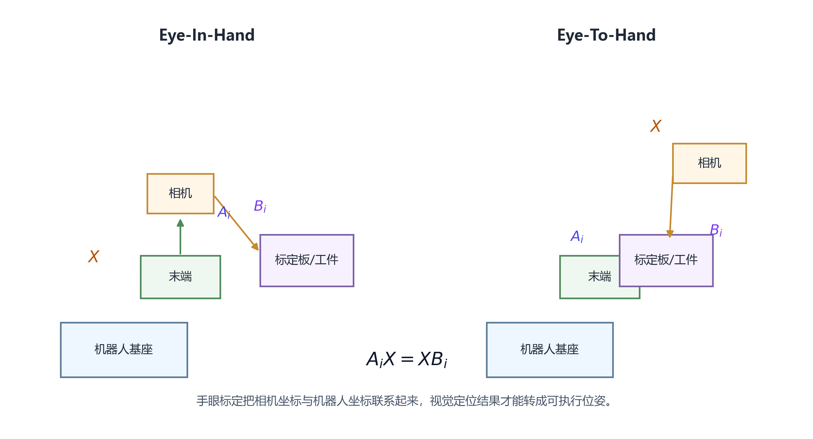
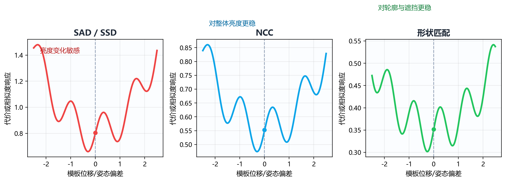
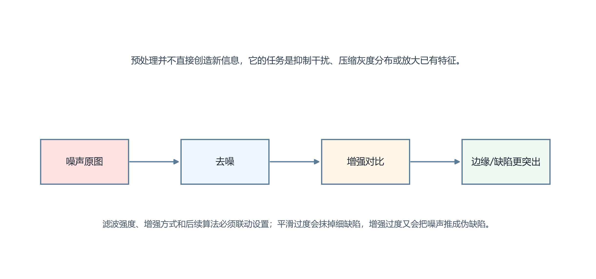
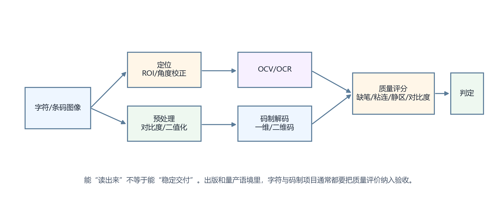
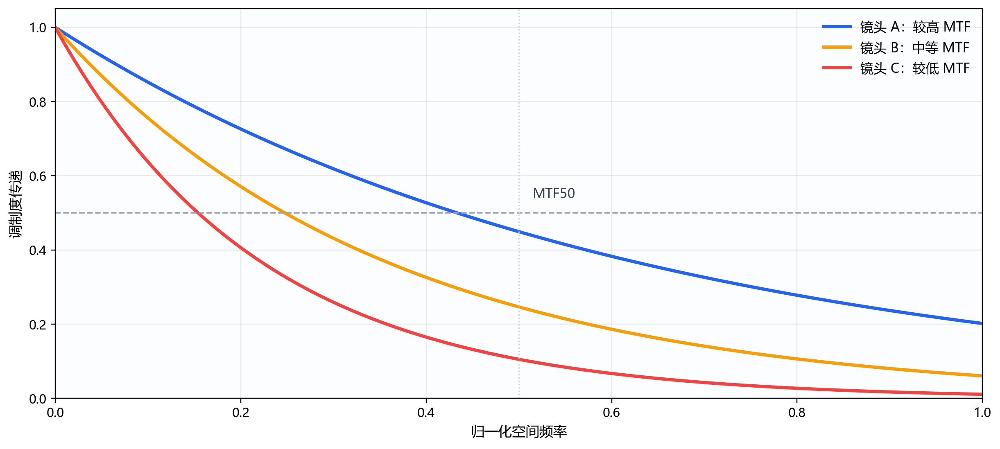
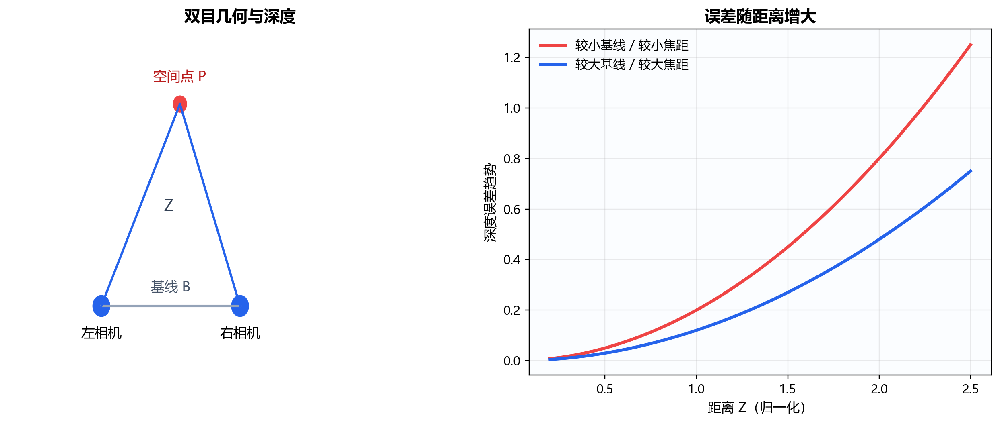

# 第二部分：算法基础（第32—40问）

> **网络署名：LanQS** · 作者及著作权人：兰青松 · [版权说明](copyright.md)

## 32. 什么是手眼标定（Hand-Eye Calibration）？Eye-In-Hand 和 Eye-To-Hand 的区别是什么？

### 32.1 手眼标定要解决的根本问题是什么？为什么相机坐标系和机器人坐标系需要额外标定？

手眼标定要解决的问题，是把视觉测得的位置和姿态转换成机器人真正能执行的空间坐标。相机看到的是相机坐标系中的点，机器人执行的是基座坐标系、工具坐标系或工件坐标系中的点，两者虽然都描述同一个物理世界，却没有天然的数值对应关系。若不先建立坐标变换，视觉系统即使定位很准，机器人也无法把抓取点、装配点或检测点正确落到空间中。

这件事之所以不能靠机械安装尺寸直接替代，是因为真实系统里总会存在安装误差、法兰面偏差、支架形变、相机姿态微小倾斜以及机器人零点和工具坐标误差。工程上更可靠的做法，是通过一组已知位姿关系，让视觉系统与机器人共同观察或接触同一标定对象，再反求两套坐标系之间的刚体变换。

### 32.2 相机内参（fx/fy/cx/cy）和外参（R/t）分别是什么？物理意义是什么？

相机内参描述的是三维点如何投影到相机成像平面，通常写成焦距参数 \(f_x,f_y\) 和主点坐标 \(c_x,c_y\)。其中 \(f_x,f_y\) 反映了像素单位下的成像比例，\(c_x,c_y\) 表示光轴与图像平面的交点在像素坐标中的位置。若镜头存在畸变，还要一并估计径向和切向畸变参数。内参告诉我们，相机自身怎样“看世界”。

外参则描述某个三维点坐标系相对于相机坐标系的姿态与位置，通常由旋转矩阵 \(R\) 和平移向量 \(t\) 组成。把世界坐标系中的一点写成 \(\mathbf{P}_w\)，其在相机坐标系中的表示可写为

$$
\mathbf{P}_c = R\mathbf{P}_w+t
\tag{32-1}
$$

内参与外参常被同时提到，但二者作用完全不同。内参处理的是投影模型，外参处理的是坐标系之间的空间关系。手眼标定建立的，是机器人相关坐标系与相机坐标系之间的外部刚体变换，不应与相机内参标定混淆。

相机内参以 3×3 矩阵形式表示：[fx 0 cx; 0 fy cy; 0 0 1]。fx 和 fy 以像素为单位表示焦距，两者不等时说明像素不是正方形；cx 和 cy 是主点坐标，理想情况接近图像中心但实际常有几到几十像素的偏移。畸变系数向量为 (k1,k2,p1,p2,k3)，k3 主要用于鱼眼镜头。

### 32.3 Eye-In-Hand（相机装在末端）适合什么场景？Eye-To-Hand（相机固定在外部）适合什么场景？

Eye-In-Hand 指相机安装在机器人末端执行器或其附近，随机器人一起运动。它适合目标位置分散、工件姿态变化较大、机器人需要靠近局部细节完成抓取或装配的场景，例如无序上料抓取、复杂腔体内部检测、近距离引导插装和局部高精度寻位。它的优点是视角灵活、局部放大容易实现，缺点则是视野随机器人变化，布线、重量、振动和碰撞风险都更敏感。

Eye-To-Hand 指相机固定在工作站外部，机器人在相机视野下完成作业。它适合工件分布范围较稳定、视野可一次覆盖整个作业区、节拍较快且现场维护希望尽量简单的场景，例如传送带抓取、固定工位定位、装配检测与分拣。其优点是相机安装稳定、照明和成像条件容易控制，但若目标被遮挡、空间很深或局部细节很小，固定外部视角的适应性会受限。

### 32.4 AX=XB 方程是怎么来的？至少需要多少个不共面位姿才能求解？

在 Eye-In-Hand 场景中，机器人末端相对于基座的运动与标定板相对于相机的运动，是同一物理事件在两套坐标链中的不同表达。若把机器人末端两次姿态之间的相对运动记为 \(A_i\)，把相机观测到的标定板两次姿态之间的相对运动记为 \(B_i\)，未知的手眼变换记为 \(X\)，则有

$$
A_iX = XB_i
\tag{32-2}
$$

这个方程表示：先经过机器人相对运动再经过手眼变换，和先经过手眼变换再经过相机侧对应相对运动，得到的是同一空间关系。它来自刚体链式变换的自然推导。

从理论上说，单个相对运动方程不足以唯一约束全部自由度，必须采集多组方向不同、角度和位移都足够变化的姿态。若位姿变化过于单一，例如都只沿一个方向平移，或都围绕近似同一轴小角度旋转，方程会退化。从数学上说，至少需要 3 组不共面位姿（用于解耦旋转和平移的自由度）；但仅满足最低样本数容易导致解退化，工程上通常会采集十组以上覆盖充分的姿态，用于稳健求解和剔除异常值，而不是只满足数学上的最低样本数。

### 32.5 实际手眼标定流程是怎样的？（位姿采集→关联图像和机器人位姿→求解→验证）

实际流程一般分四步。第一步，完成相机内参标定，并准备平面棋盘格、圆点板或高精度靶标；第二步，控制机器人在多个姿态下采集图像，同时记录每次拍照时机器人末端或法兰在机器人坐标系中的位姿；第三步，在图像中提取标定板角点或特征，计算标定板相对于相机的外参，并与对应时刻的机器人位姿建立一一关联；第四步，利用多组相对运动解算手眼变换，再通过额外验证样本检查结果是否可用。

真正影响结果的首先是采集阶段是否规范，求解器只占最后一步。每次拍照必须确保机器人已经稳定停下，时间戳关联正确，标定板在视野中清晰可见，且姿态分布覆盖了足够丰富的旋转和平移变化。

OpenCV 中对应 cv2.calibrateHandEye() 函数，输入为多组 (T_robot, T_cam) 位姿对，至少需要 8~10 个不共面、方向变化充分的采样位姿。函数内部基于 Tsai 或 Park 等方法分步求解旋转和平移。

### 32.6 重投影误差和末端定位误差如何评价标定质量？多少算合格？

重投影误差衡量的是标定板特征点按当前模型重新投影回图像后，与实际检测到的像点之间的偏差，单位通常是像素。它能反映成像模型与图像提取的一致程度，对内参标定和外参估计都很重要。但重投影误差小仅说明视觉链拟合良好，机器人抓取精度还需末端定位另行验证。

末端定位误差更接近最终业务指标。常见做法是让机器人根据视觉定位去触碰校验点、抓取已知位置工件，或到达标准孔位，再统计其在空间中的位置偏差和姿态偏差。至于多少算合格，没有统一绝对值，必须与任务要求一致。若做粗分拣，亚毫米级到几毫米可能已经够用；若做精密装配和插装，则可能要求位置误差进入 0.1 mm 量级甚至更严格。工程判断应以末端任务误差为主，重投影误差为辅。

定量上，重投影误差（cv2.calibrateCamera()返回值 ret）通常应 <0.5 pixel，精密场合宜 <0.3 pixel。末端定位误差则按任务分级：粗分拣亚毫米至数毫米可接受，精密插装需进入 0.1mm 量级。

### 32.7 手眼标定的误差来源有哪些？（机器人重复精度、靶标平面度、角点质量）

误差来源大致可分为四类。第一类来自机器人本体，包括重复精度不足、关节回差、停止时振动未消失、工具坐标定义不准；第二类来自视觉链，包括相机内参不准、镜头畸变补偿不足、焦点不稳、标定板角点提取噪声；第三类来自标定对象，包括棋盘格印刷误差、平面度不足、安装不牢或受温度影响形变；第四类来自流程管理，包括机器人位姿与图像未严格同步、采样姿态分布不合理、异常帧未剔除。

其中一个很常见的误区，是把所有误差都归咎于算法。实际上，手眼标定多数时候是系统误差问题：支架刚性差、靶标吸附不平、机器人末端带负载下姿态重复性下降，这些都会直接反映到最终结果上。求解方法当然重要，但它只是最后一步。

### 32.8 视觉引导抓取中，像素坐标→机器人末端坐标的完整变换链是怎样的？

若图像中检测到目标像素点 \((u,v)\)，并且已知其对应深度 \(Z\) 或其所在平面方程，则先利用相机内参把像素坐标还原到相机坐标系，得到三维点 \(\mathbf{P}_c\)。再通过手眼标定得到的刚体变换，把 \(\mathbf{P}_c\) 变换到机器人基座坐标系或工作坐标系，最后再根据工具中心点偏置、夹爪姿态约束和抓取方向规划出机器人末端目标位姿。

若把相机到机器人基座的变换记为 \(T_{bc}\)，相机坐标中的点记为 \(\mathbf{P}_c\)，则基座坐标中的点可写为

$$
\mathbf{P}_b = T_{bc}\mathbf{P}_c
\tag{32-3}
$$

真正的抓取点通常还要继续叠加工具坐标变换、法向约束和安全接近路径。像素坐标到机器人动作之间，实际对应的是一整条由成像、空间变换和运动规划构成的链路。

  

<strong>图32-1 Eye-In-Hand 与 Eye-To-Hand 两种手眼标定构型示意</strong>

图32-1 左半部为 Eye-In-Hand（相机随机器人动），右半部为 Eye-To-Hand（相机固定观察），底部以 <i>AiX = XBi</i> 连接两条运动链。核心判断习惯：先分清相机是"随机器人动"还是"看机器人动"，再讨论求解公式。

> **引用出处**：cv2.calibrateCamera()/calibrateHandEye() 参数，OpenCV Camera Calibration 文档（docs.opencv.org/4.x/d9/d0c/group__calib3d.html）

---

---

## 33. 什么是模板匹配？NCC、SAD、形状匹配的原理和适用场景有何不同？

### 33.1 模板匹配要解决的核心问题是什么？

模板匹配解决的是在待测图像中寻找与参考目标最相似的位置，有时还要同时估计旋转角度、尺度和匹配分数。它在工业视觉里极常见，因为许多工件只需稳定定位轮廓、孔位或字符块即可。

它的前提也很明确：目标在局部外观上应具有可重复性，背景干扰和姿态变化不能无限大。若目标本身外形变化过强，或者场景中存在大量相似干扰，模板匹配就会变得不稳，甚至失去意义。

### 33.2 SAD（绝对差之和）和 SSD（差的平方和）的原理和局限是什么？

SAD 通过把模板像素与待匹配窗口像素逐点做绝对差并求和，差值越小表示越相似；SSD 则把差值平方后再求和，对大偏差更敏感。两者计算都直观、实现简单，在灰度稳定、光照变化小、目标纹理清晰的场景中可以工作。

它们的局限也同样明显。只要整体亮度、对比度或局部阴影发生变化，SAD 和 SSD 的匹配分数就会明显波动；若模板边界稍有遮挡，分数也会快速恶化。因此它们更适合作为基础方法或受控场景下的局部比对，而不适合作为复杂工业现场的唯一定位手段。

OpenCV 中 SAD 对应 cv2.TM_SQDIFF，SSD 对应 cv2.TM_SQDIFF_NORMED（归一化版本）。SAD 公式为 Σ|T(x,y)-I(x+u,y+v)|，SSD 为 Σ[T(x,y)-I(x+u,y+v)]²。

### 33.3 NCC（归一化互相关）如何解决光照变化问题？其计算代价如何？

NCC 在比较模板与图像窗口时，会先对局部灰度做均值和方差归一化，再计算二者的相关性，因此对整体亮度偏移和一定程度的对比度变化更不敏感。其匹配分数通常落在有限区间内，越接近高值表示结构越相似。

代价在于计算量明显高于 SAD 或 SSD，因为每个候选位置都要做均值、标准差和归一化相关运算。若搜索范围大、图像分辨率高或模板很多，实时性压力会迅速上升。因此实际系统往往会结合积分图、金字塔、ROI 裁剪或粗到细搜索，以降低计算负担。

OpenCV 中对应 cv2.TM_CCOEFF_NORMED，得分范围 [-1,1]，越接近 1 越匹配，通常用 cv2.minMaxLoc() 取最大值位置。计算量约为 SAD 的 3~4 倍。

### 33.4 什么是基于梯度/边缘的形状匹配（如 Halcon ShapeModel）？为什么它对光照和遮挡更鲁棒？

基于梯度或边缘的形状匹配，不直接依赖原始灰度值，而是提取目标轮廓附近的梯度方向、边缘点分布或局部形状特征，再在待测图像中寻找几何一致的结构。由于它更关注轮廓几何，对均匀亮度变化、局部阴影和部分遮挡通常更稳。

这类方法适合轮廓明确、边缘稳定的零件定位，例如金属件抓取、注塑件姿态识别、装配基准孔位匹配等。若目标边缘本身就不清晰，或者成像中轮廓严重破碎、反光很强、纹理很弱，形状匹配同样会遇到困难。鲁棒性提升后，成像质量仍是基础保障。

### 33.5 金字塔加速策略如何让模板匹配满足工业实时性要求？

金字塔策略的思路是先在低分辨率图像上做粗搜索，快速排除大量不可能区域，再把少量候选位置传递到更高分辨率层级做精细匹配。由于低层图像像素更少、搜索步长更大，整体运算量可以大幅下降。

这种方法适合目标尺寸较大、位置变化范围广、又有实时性要求的场景。需要注意的是，金字塔层数过多会损失细节，模板过小也可能在低层直接消失，因此层级设计要与模板尺寸、搜索范围和允许误差共同确定。

定量上，3~4 层金字塔每层降采样 2×，总计算量约为不用金字塔的 1/5 至 1/10。粗层搜索步长不能大于下一层缩放比的一半，否则会漏检。

### 33.6 旋转、缩放不变的模板匹配如何实现？（角度范围、缩放范围参数的工程含义）

常见做法是在模板构建或搜索阶段显式加入旋转角度和尺度采样，即对不同角度、不同缩放比例生成候选模板，或在匹配时同时搜索这些自由度。这样可以扩展模板匹配对姿态变化的适应范围。

工程上，角度范围和缩放范围不能随意放大。范围越大、采样越密，计算量越高，误匹配风险也越高。较好的做法是先根据机械先验缩小搜索空间，例如零件最多旋转 ±15°、尺度变化不超过 5%，再设置合理步进，避免把全部自由度都交给算法盲搜。

### 33.7 什么场景下模板匹配优于深度学习定位？什么场景下不够用？

当目标外形稳定、样本量有限、上线周期短、定位逻辑清晰且要求可解释时，模板匹配往往比深度学习更合适。它部署轻量、调试直接、对少样本友好，很多工业定位任务可以绕开训练、标注和模型维护。

当目标外观变化很大、背景复杂、遮挡严重、类别多、相似干扰多或需要更强的语义区分能力时，模板匹配就会显得吃力。这时深度学习定位或检测模型更有优势，因为它能从更高层次学习外观变化模式，而不必完全依赖固定模板。

### 33.8 模板匹配失败时如何系统排查？（模板质量、搜索范围、评分阈值、光照一致性）

排查时应先看模板本身是否合理：模板是否包含足够稳定的特征，边界是否截断，是否把背景噪声也一并裁进去了。其次检查成像条件：当前光照、焦点、对比度和姿态与建模时是否一致。再看搜索范围和角度尺度参数是否过窄，导致目标根本没被搜索到，或因过宽而引入过多干扰。

最后再检查评分阈值与候选排序逻辑。阈值过高会漏掉真实目标，阈值过低则会引入伪匹配。系统排查的顺序最好是模板、成像、搜索空间、阈值四步，而不是一上来反复调一个分数参数。

  

<strong>图33-1 SAD、NCC 与形状匹配在扰动条件下的响应差异</strong>

图33-1 将三类常见模板匹配思路放在同一判断框架下比较。横轴表示模板位置或姿态偏离理想匹配点的程度，纵轴表示代价函数或相似度响应的变化趋势。左侧的 SAD/SSD 曲线起伏更明显，说明它对亮度和局部灰度扰动更敏感；中间的 NCC 经过归一化处理后，整体亮度变化带来的影响减轻；右侧的形状匹配更关注轮廓几何，因此在部分遮挡、阴影或纹理变化下往往更稳。读者不必把这张图理解为“谁一定更先进”，而应把它当作选型入口：若问题主要来自亮度波动，优先考虑 NCC；若问题来自轮廓定位和局部遮挡，形状匹配更有优势；若场景受控且算力紧张，SAD/SSD 仍有工程价值。图中曲线是方法行为的概括示意，并不对应统一量纲下的绝对分数。

> **引用出处**：cv2.matchTemplate() 六种方法（TM_SQDIFF/TM_CCOEFF_NORMED 等），OpenCV Template Matching 教程（docs.opencv.org/4.x/d4/dc6/tutorial_py_template_matching.html）

---

---

## 34. 什么是 Blob 分析？如何用它完成连通域计算、面积筛选和工业缺陷定位？

### 34.1 什么是 Blob（二值连通域）？Blob 分析在工业检测中解决什么问题？

Blob 通常指二值图像中的一个连通区域，也就是一组彼此相连、与背景分开的前景像素集合。Blob 分析关注的是这些前景区域的数量、面积、位置、形状和空间关系。

它在工业里非常有用，因为很多任务本质上都是“找到一类区域并判断它是否合格”，例如缺件、孔洞、异物、印刷缺失、颗粒污染、焊点数量和连通性判断。只要前景与背景能够稳定二值分离，Blob 分析往往足够高效。

### 34.2 连通域标记算法（两遍扫描法、Union-Find）的基本原理是什么？

两遍扫描法在第一遍遍历图像时，根据邻域关系给前景像素临时赋标签，并记录标签之间的等价关系；第二遍再把所有等价标签归并成统一编号。Union-Find 则常作为标签等价管理的数据结构，用来高效完成集合合并与查找。

从工程角度看，用户未必需要手写这套算法，但理解其原理有助于判断为何某些细小连接、边界触碰或噪声点会改变最终连通域数量。很多误判在连通域定义阶段就已经发生，后续特征筛选只是把这个结果继续放大。

### 34.3 4连通和8连通的区别在哪里？工业检测中通常选哪种？

4 连通只把上下左右相邻像素视作连通，8 连通还把对角邻接也算作连通。二者的区别会直接影响细线、斜边、角点接触区域是否被视为一个整体。

工业检测里没有绝对统一答案，但对自然形状和一般缺陷区域，8 连通更常见，因为它对斜向结构更连贯；若任务特别强调避免对角线误连接，例如某些字符笔画分离或规则网格分析，4 连通可能更合适。关键是要让连通定义与业务目标一致。

### 34.4 Blob 的常用特征有哪些？（面积、周长、圆形度、长宽比、重心、外接矩形、凸包）

常用特征包括面积、周长、重心坐标、最小外接矩形、长宽比、圆形度、方向角、凸包面积、孔洞数量和灰度统计等。它们分别对应不同的业务判断：面积可以排除微小噪声，长宽比可以区分细长缺陷与圆点干扰，圆形度可筛选孔洞或圆斑，重心与外接框可用于定位和抓取。

真正有效的特征选择，应围绕"合格目标与干扰最明显的差别"展开，特征过多反而可能引入不稳定边界。

### 34.5 如何通过面积范围和形状特征筛选目标 Blob，排除干扰连通域？

最常见的方法是先用面积阈值剔除明显太小或太大的连通域，再根据长宽比、圆形度、位置范围、灰度均值或与模板区域的相对关系做二次筛选。这样可以快速把大部分噪声点、阴影碎片或背景误分离区域排除掉。

筛选规则最好按层次建立。先用稳定且物理意义明确的特征做粗筛，例如面积和位置；再用更敏感的形状特征做精筛。若一开始就依赖很复杂的组合规则，调试和维护都会变得困难。

### 34.6 Blob 分析对二值化质量的依赖有多大？大津法（Otsu）在这里扮演什么角色？

Blob 分析对二值化质量高度敏感。只要前景断裂、背景粘连、局部阈值漂移或阴影未处理好，后续连通域数量、面积和形状都会跟着变化。换句话说，Blob 分析的瓶颈通常不在算法本身，而在二值输入的稳定性。

大津法通过最大化类间方差来自动选择全局阈值，在直方图双峰分离较好的场景下很实用。它在双峰分离较好的场景下很实用；若存在亮度渐变、局部反光或背景纹理，局部阈值或自适应预处理比单独依赖 Otsu 更有效。

### 34.7 Blob 分析在孔洞检测、印刷缺失、异物检测等场景中如何应用？

在孔洞检测中，常把孔洞区域二值化后统计其面积、数量、圆度和位置是否落在容差范围内；在印刷缺失检测中，常把字符或标记区域与标准区域做差，再分析缺失连通域的面积和分布；在异物检测中，常把不应出现的亮点或暗点分离出来，再按面积和形状判定是否为真实异物。

这些应用虽然表面不同，底层逻辑却相似：先把目标变成可分离的连通域，再用区域特征建立业务判定。理解这条主线，读者就能理解 Blob 分析在孔洞、印刷和异物等多类任务中的通用性。。

### 34.8 Blob 分析的主要局限是什么？（纹理背景、灰度渐变、重叠目标）

Blob 分析最怕的是前景和背景本身就难以稳定分开。面对复杂纹理背景、慢变灰度、强反光渐变、阴影拖尾或目标重叠，二值化往往会先失败，导致 Blob 特征失去意义。另一个局限是，它擅长分析区域，却不擅长理解语义。两个面积相近的区域，Blob 特征可能很像，但业务含义完全不同。

因此，Blob 分析适合做结构清楚、区域可分的任务；若目标依赖复杂纹理、上下文关系或类别语义，则需要与模板、规则或学习方法结合。

  

<strong>图34-1 Blob 分析从灰度分割到特征筛选的典型流程</strong>

图34-1 依次画出了原始灰度图、阈值分割、连通域提取、几何特征过滤和目标输出五个阶段。真正决定结果稳定性的，并不只是最后那一步面积或圆度阈值，而是前面每一步对“哪些像素属于同一个目标”的定义是否一致。若分割把背景误并入目标，后面的面积、孔洞数、长宽比都会被连带污染；若连通性定义与噪声形态不匹配，又可能把一个真实目标拆成多个碎块。读者应从这张图得到的工程判断是：Blob 分析不是单个算子的名称，而是一整套以分割质量为前提的流程。它非常适合轮廓、孔洞、缺口、颗粒计数等任务，但在灰度对比弱、粘连严重或纹理本身复杂的场景中，往往需要先补充更可靠的照明和预处理，再谈连通域判定。

---

---

## 35. 图像预处理的标准工具链是什么？滤波、形态学操作各解决什么问题？

### 35.1 为什么绝大多数工业检测算法在核心分析前都要做预处理？不预处理会带来什么问题？

预处理的作用，是把图像从“能看”变成“适合算法稳定处理”。真实工业图像往往包含噪声、亮度不均、对比度不足、反光、阴影、边界毛刺和背景纹理。若直接把这些图像送入阈值、模板、边缘或测量算法，结果会表现出明显波动。

不预处理最常见的后果，是同一套算法在实验室样图上能跑通，一到量产现场就开始漂。算法面对的是包含各种扰动的真实图像。

### 35.2 灰度化的几种方法（加权平均、MAX/MIN通道）在不同场景下如何选择？

最常见的灰度化方法是对 RGB 做加权平均，它更接近人眼亮度感受，也适用于一般场景。若目标与背景的对比主要集中在某个颜色通道上，则直接取该通道、取通道最大值或最小值，有时反而更有效。

工程上不应把灰度化当作固定步骤。若彩色信息正是识别依据，过早灰度化会丢掉有效差异；若任务本身只依赖单一波段反射差，直接选择最佳通道通常比机械做三通道加权更合适。

### 35.3 均值滤波、高斯滤波、中值滤波三者的原理和适用场景有什么区别？

均值滤波通过局部平均抑制随机噪声，实现简单，但会明显模糊边缘；高斯滤波按中心权重更高的方式平滑图像，噪声抑制与边缘保持之间更平衡，因此在工业预处理中最常见；中值滤波则用局部中值替代当前像素，对椒盐噪声和孤立亮暗点更有效，同时比线性滤波更能保留边缘。

选择时应看噪声类型和后续任务。若后面要做精细边缘测量，过强平滑会直接伤害精度；若主要干扰是孤立坏点，中值滤波通常更合适；若是轻度随机噪声，高斯滤波常作为默认起点。

OpenCV 中均值滤波为 cv2.blur()，高斯滤波为 cv2.GaussianBlur()，中值滤波为 cv2.medianBlur()。椒盐噪声场景优选中值滤波，高斯随机噪声场景高斯滤波最稳妥。

### 35.4 形态学腐蚀（Erosion）和膨胀（Dilation）各有什么效果？开运算和闭运算分别解决什么问题？

腐蚀会收缩前景区域，去掉细小突出和窄连接；膨胀会扩张前景区域，填补局部小缺口和细小裂缝。二者都依赖结构元素形状和尺寸，因此其效果还与结构元素的选择紧密相关。

开运算是先腐蚀后膨胀，常用于去掉小噪声点、细毛刺和独立亮斑；闭运算是先膨胀后腐蚀，常用于填平小孔洞、连接邻近断裂区域和修补边界缺口。它们更适合按形状规则重塑特定区域。

OpenCV 中腐蚀为 cv2.erode()，膨胀为 cv2.dilate()，开运算为 cv2.morphologyEx(img, cv2.MORPH_OPEN, kernel)，闭运算为 MORPH_CLOSE。结构元素形状通过 cv2.getStructuringElement() 选择（矩形/椭圆/十字/菱形）。

### 35.5 顶帽变换（Top-hat）和黑帽变换（Black-hat）在缺陷提取中有什么用？

顶帽变换常用于提取比周围背景更亮、尺度又小于结构元素的细小目标，例如亮点、细亮缺陷、印刷细节和局部反光异常；黑帽变换则更适合提取局部偏暗的小结构，例如黑点、细暗缺陷、浅凹坑或局部阴影异常。

它们的价值在于把慢变背景去掉，让小尺度异常突出出来。若目标缺陷本来就很弱，而背景又存在大范围亮度不均，顶帽和黑帽往往比直接阈值化更有效。

OpenCV 中顶帽为 cv2.morphologyEx(img, cv2.MORPH_TOPHAT, kernel)（原图-开运算），黑帽为 MORPH_BLACKHAT（闭运算-原图）。

### 35.6 图像锐化（USM、Laplacian 增强）在工业检测中适合什么场景？什么时候会帮倒忙？

锐化适合目标边缘略软、对焦基本正确、但局部对比还不够强的场景，例如字符边界增强、细线条强调或轻度模糊图像的局部改善。USM 利用高频增强提升边缘感，Laplacian 则通过二阶导数突出灰度变化剧烈区域。

它帮倒忙的时候也很多。若图像本身噪声重、反光强、压缩伪影明显或焦点已经严重错误，锐化只会把噪声和伪边缘一起放大。工业检测里，锐化更适合做少量补强，不适合替代正确成像。

### 35.7 直方图均衡化（CLAHE）在什么情况下有效？在什么情况下会产生副作用？

CLAHE 适合局部对比不足、照明较平但细节发灰的图像，例如某些低对比表面纹理、暗部细节和局部印刷区域。它通过局部直方图均衡改善对比，比全局均衡更不容易把整幅图过度拉伸。

副作用主要体现在噪声放大和区域对比失真上。若原图噪声已经明显，CLAHE 常会把背景颗粒也一并增强；若参数过强，还可能让平滑区域出现人为纹理。因此应确认实际收益后再纳入流水线，不宜作为固定步骤。

### 35.8 工业检测的预处理链如何确定顺序？决策依据是什么？

预处理顺序应围绕“先解决哪一种干扰最影响后续算法”来定。常见链路是先做颜色或灰度通道选择，再做去噪和平场或背景校正，随后根据任务加入形态学、局部增强或边缘强化，最后再进入二值化、模板或测量步骤。

顺序没有绝对标准，但有一个实用原则：每一步都要服务于下一步输入质量，而不是为了把图像变得更好看。若某一步不能稳定提升后续判定，宁可删掉，也不要让预处理链无节制膨胀。

  

<strong>图35-1 预处理工具链对噪声、对比度和特征可见性的影响</strong>

图35-1 依次展示原始噪声图→去噪→对比度增强→特征突出四个阶段。同一幅图在不同算法前需要不同预处理策略，参数应服务于下游任务而非追求"看起来更清楚"。

> **引用出处**：cv2.erode()/dilate()/morphologyEx()/getStructuringElement()/blur()/GaussianBlur()/medianBlur()，OpenCV Morphological Transformations 教程（docs.opencv.org/4.x/d9/d61/tutorial_py_morphological_ops.html）

---

---

## 36. 什么是 OCR 和 OCV？如何检测字符、条码、二维码的可读性和正确性？

### 36.1 OCR（光学字符识别）和 OCV（光学字符验证）的根本区别是什么？

OCR 关注的是把图像中的字符读出来，输出“是什么”；OCV 关注的是把当前字符与期望内容或标准模板进行核对，输出“对不对”。两者都处理字符图像，但任务目标不同。

工业现场中，很多项目真正要做的是 OCV。因为产线上往往已知应该出现的字符类型、位数和内容规则，系统重点是验证喷码、打码或丝印是否正确、完整、清晰，聚焦于字符验证而非开放识别。

### 36.2 工业 OCV 的典型应用场景有哪些？（喷码、打刻、标签、PCB 丝印）

典型场景包括药盒与食品包装喷码校验、金属件激光打刻字符核对、标签批号和日期验证、PCB 丝印字符确认、连接器标识检查等。这些场景的共同点，是字符内容与位置具有先验规则，系统要同时判断字符是否存在、是否清楚、是否与期望一致。

因此工业 OCV 往往不仅输出识别结果，还要输出字符位置、清晰度、缺失情况和匹配得分。它既是识别问题，也是质量验证问题。

### 36.3 传统 OCV 算法（模板比对）和深度学习 OCR 各有什么优劣？

传统 OCV 多建立在模板比对、字符切分和局部规则上，对固定字体、固定位置、固定照明的场景很高效，也容易解释和维护。其优势是部署轻量、样本需求低、上线快。

深度学习 OCR 对字体变化、局部缺损、背景干扰和复杂排版更有适应性，适合字符风格多变或场景复杂的任务。代价则是需要样本、训练与持续维护。若项目本身字符格式高度固定，用传统 OCV 往往更经济；若变化复杂，深度学习更有价值。

### 36.4 条形码（1D）和二维码（QR/DM）的成像与解码有什么不同的照明要求？

一维码主要依赖条纹边界和宽度序列，因此更关心线方向上的清晰度、条空对比和景深稳定性。二维码则是二维模块阵列，既关心整体对比，也关心局部网格模块是否完整、角点是否清楚、透视是否受控。

照明上，一维码常要求沿条纹方向避免过强反光，使黑白条纹边界稳定；二维码尤其是金属直刻码，则更依赖能突出模块凹凸或明暗差异的定向照明。看到码和容易解码是两件事，解码器对局部模块质量高度敏感。

### 36.5 影响条码/二维码读取率的关键因素有哪些？（打印质量、焦距、景深、对比度）

关键因素包括印刷或刻码质量、模块或条宽尺寸、相机分辨率、镜头焦距、景深、对比度、运动模糊、畸变、反光和解码区域完整性。若码本身打印缺损、边界糊、模块粘连，再好的算法也难以补救。

工程上应优先保证码的物理成像质量，再谈算法优化。大多数读码问题的根源在前端成像质量，而非解码器本身。

### 36.6 “读到但读错”和“完全读不到”在排查时思路有何不同？

完全读不到时，通常先检查成像是否足够：码是否在视野中、清晰度是否够、对比是否稳定、是否有反光遮挡、分辨率是否满足模块采样要求。排查重点应放在前端图像质量上。

读到但读错则更需要看编码规则、字符分割、局部缺损、解码参数和内容校验逻辑。它说明系统已经读出了某些结构，但结果不可靠，问题往往落在边界模块误判、字符相似混淆或业务校验链路上。

### 36.7 工业级字符质量等级（如 ISO/IEC 15415 印刷质量等级 A-F）是如何定义的？

这类标准从对比度、调制、固定图形损伤、轴向不均匀性、未使用纠错量等多个维度评分后，按综合得分划分为 A（≥3.5，优秀）→ B（≥2.5，良好）→ C（≥1.5，可接受）→ D（≥0.5，较差）→ F（<0.5，不合格）五个等级。某个码今天可以被读出，不代表它质量足够高，也不代表在更快节拍、更远距离或更差照明下仍然稳定可读。

对工业项目来说，质量等级的意义在于把“读码结果”转换成更可追溯的工艺指标。这样系统不仅知道能不能读，还知道码质量正在变好还是变坏。

### 36.8 读码失败时应该按什么顺序调整系统参数？

较实用的顺序是：先调照明和角度，解决反光与对比问题；再调焦距、工作距离和光圈，保证模块清晰；随后检查曝光、增益和触发，避免模糊与噪声；再看 ROI、解码参数和内容规则；最后才考虑更换码制方案或引入更复杂算法。

这个顺序的原因很简单：成像问题总是优先级最高。图像没采好，后面的软件参数几乎都只是补救。

  

<strong>图36-1 OCV、OCR 与条码质量评估的典型处理链</strong>

图36-1 把字符和条码项目中容易混淆的几个环节拆开了：左端是输入图像，中间上支路先做定位与角度校正，再进入 OCV/OCR；下支路经过对比度调整和二值化后，进入一维码或二维码解码；两条支路最终都汇入质量评分模块，用于检查缺笔、粘连、静区不足、对比度偏低等问题。读者应从图中明白，工业现场并不满足于“读得出来”，还需要知道“为什么这次能读、下次是否还能稳读”。因此 OCV、OCR、解码和等级评估应被看成不同层面的任务。该图适合用于梳理项目流程，但具体评分项目和等级阈值仍需按码制标准、喷印方式和客户验收口径另行细化。

---

---

## 37. 什么是 MTF（调制传递函数）？如何用它评价镜头和相机系统的真实解像力？

### 37.1 MTF 的物理意义是什么？它和“分辨率”有什么关系？

MTF 描述的是成像系统把不同空间频率对比度传递到图像中的能力。空间频率越高，意味着目标结构越细；若系统对该频率的调制度传递越低，细节就越容易变糊、对比减弱。

分辨率常给人一个单点极限的印象，而 MTF 给出的是整条频率响应曲线。它比多少像素或多少线对更接近真实成像能力，因为系统对细节的传递能力会随频率逐渐衰减。

### 37.2 空间频率（lp/mm）和奈奎斯特频率是什么？它们如何决定系统极限分辨力？

空间频率以 lp/mm 表示，描述单位长度内有多少线对。奈奎斯特频率则由像元采样决定，若像素间距为 \(p\)，则

$$
f_N=\frac{1}{2p}
\tag{37-1}
$$

它表示离散采样在理想情况下可无混叠表示的最高空间频率。若光学细节已经高于这个频率，传感器会出现采样不足和混叠问题。

因此系统极限分辨能力既受镜头光学影响，也受像元采样限制。镜头再锐利，若传感器采样不够，最终仍然分不清细节。

### 37.3 MTF 曲线该如何读？50% MTF、20% MTF 各代表什么工程含义？

MTF 曲线横轴是空间频率，纵轴是调制度传递比。曲线越高，说明系统在对应频率下保留的对比度越好。50% MTF 常被视为“成像仍然较清晰”的参考位置，20% MTF 常被用来观察更接近极限的细节保留能力。

它们是工程参考点，不是绝对合格线。对于定位和一般识别，50% MTF 往往更有代表性；对极限分辨和镜头能力评估，20% MTF 常被一并关注。最终要用哪一个，还要看任务本身依赖的是高对比边缘，还是接近极限的小细节。

### 37.4 镜头 MTF 和传感器 MTF 是两件事，系统 MTF 如何由两者共同决定？

镜头 MTF 描述镜头自身的光学传递能力，传感器 MTF 则描述像元采样、填充因子和电荷扩散等引起的频率响应。系统 MTF 可以近似看作多级传递链的乘积，因此某一级一旦衰减明显，整体就会被拖低。

这也是为什么只看镜头像素适配或只看传感器分辨率都不够。系统真实解像力取决于整条链路中最弱的那一环。

### 37.5 如何用斜边法（Slanted Edge Method）实测一套相机+镜头的系统 MTF？

斜边法通常使用一块边缘清晰、相对图像像素略带倾斜的高对比靶标。先采集边缘图像，再从边缘扩散函数求出线扩散函数，最后通过傅里叶变换得到 MTF。边缘之所以要倾斜，是为了实现亚像素过采样，提高测量稳定性。

工程上要注意照明均匀、曝光不过饱和、边缘质量足够高，并在视野中心和边缘分别测量。因为很多镜头中心 MTF 看起来很好，边缘却明显下降。

### 37.6 光圈（F值）变化如何影响 MTF？最佳光圈在哪里？为什么过大过小都会下降？

光圈开得太大时，像差影响更明显，边缘清晰度和整体 MTF 往往下降；光圈收得太小时，衍射开始主导，高频细节同样会被削弱。因此镜头常存在一个中间区域，使像差和衍射取得较好平衡，这就是工程上常说的较优工作光圈。

镜头常存在一个中间区域（通常在 F4–F8 附近，具体取决于镜头设计），使像差和衍射取得较好平衡，这就是工程上常说的较优工作光圈。最佳光圈的准确位置需查看厂商 MTF 曲线中不同 F 值下的对比度表现，并非固定数字——小像元系统对衍射更敏感，最佳值往往更靠近大光圈一侧。

### 37.7 在选镜头时，如何用厂商提供的 MTF 曲线判断是否匹配传感器像元尺寸？

实用做法是先根据像元尺寸算出传感器奈奎斯特频率，再去看厂商 MTF 曲线在该频率附近还能保留多少调制度。若曲线在接近奈奎斯特频率前就已经衰减得很低，说明这支镜头难以充分发挥该传感器的采样潜力。

此外，还要看曲线是在中心还是边缘、是哪个光圈下测得，以及是否对应实际工作距离。厂商 MTF 可以作为重要参考，但不能脱离测试条件直接读结论。

### 37.8 MTF 测量结果与现场实际成像质量不符时，最常见的原因是什么？

最常见的原因包括对焦不准、装调偏心、视场边缘使用情况与测试条件不同、照明方向改变了有效边缘对比、现场振动与热漂移、保护玻璃或窗口件引入附加像差，以及测试靶的频率成分可能与真实目标差异较大。

MTF 是很有价值的评价工具，但仍需放回具体工况中理解。若实验室测得很高，现场图像仍然差，优先检查装调和工况条件。

  

<strong>图37-1 不同成像质量条件下的 MTF 曲线对比</strong>

图37-1 横轴表示归一化空间频率，纵轴表示该频率下仍能保留多少亮暗调制度。蓝、橙、红三条曲线分别代表较高、中等和较低的成像质量水平；曲线下降越慢，说明系统在较高频率处仍能保留更多细节。图中虚线给出 MTF50 的常见观察位置，它不是唯一标准，却很适合作为镜头、系统对焦状态和装调质量的横向比较指标。读者在阅读本节时，应把这张图与“边缘看起来清不清楚”区分开来，因为 MTF 讨论的是不同空间频率上的整体传递能力，而不是单一边缘的主观锐利感。该图适合做趋势理解和方案比较，但若要进行正式验收，仍需结合斜边法采样条件、像元尺寸、光圈和对焦状态统一测试。

---

---

## 38. 什么是无监督异常检测（Anomaly Detection）？在没有缺陷样本的情况下如何训练工业检测模型？

### 38.1 无监督异常检测要解决的核心问题是什么？它和有监督缺陷检测有什么本质区别？

无监督异常检测的核心，是在几乎没有或完全没有真实缺陷样本的情况下，只利用正常样本建立正常分布模型，再把偏离正常模式的区域判为异常。它回答的问题是这里是否偏离正常件，而不是这是什么缺陷类别。

有监督缺陷检测则依赖带标注的缺陷样本，学习明确的类别边界。两者的本质区别在于训练信息来源不同：前者主要学习正常性，后者直接学习缺陷语义。

这种设计直接回应了工业缺陷检测的样本困境：正常样本源源不断，缺陷样本稀少且形态不可预演。无监督方法只用正常样本训练；半监督方法介于两者之间，使用少量标注样本辅助。

### 38.2 基于重建误差的方法（AutoEncoder/VAE）原理是什么？主要局限是什么？

这类方法先用正常样本训练自编码器或变分自编码器，让模型学会重建正常图像。推理时，若输入包含异常区域，模型往往无法准确重建这些局部，从而在原图与重建图的差异中暴露异常。

主要局限在于，模型有时也会把异常一并重建出来，尤其是异常结构较大或训练能力较强时，重建误差反而变小。此外，重建结果容易受纹理复杂度和背景变化影响，异常图的可分性会随纹理复杂度和背景变化波动。

### 38.3 PatchCore 的核心思路是什么？为什么它不需要异常样本训练？

PatchCore 的思路是把正常样本在特征空间中的局部分布存成一个代表性特征库。推理时，待测图像的每个局部特征都去和正常库做最近邻比较，距离越远，越可能是异常。它不需要异常样本，因为模型学习的是正常局部通常出现在哪些特征区域。

这种方法在工业表面异常检测中表现很好，原因是很多缺陷只需与正常纹理区分即可。它的部署难点主要在特征库大小、检索效率和域外漂移控制。

具体实现上，PatchCore 使用预训练骨干网络（如 ResNet、WideResNet）提取正常图像 patch 特征，经核心集采样（coreset sampling）压缩后构建 Memory Bank。测试时对每个 patch 计算与 Memory Bank 中最近邻的距离，距离越大则异常程度越高。MVTec AD 数据集上其图像级 AUROC 通常 >99%，PRO >90%。

### 38.4 DRAEM 的创新点是什么？它如何通过合成异常避开对真实缺陷样本的依赖？

DRAEM 的核心做法，是在正常图像上合成伪异常区域，让网络一边做异常重建或恢复，一边做异常分割。这样模型在训练中见过大量“人为制造的不正常情况”，从而学会把局部异常从正常背景中分离出来。

它避开真实缺陷样本依赖的办法，是用可控方式构造训练异常。问题在于，合成异常与真实工业缺陷之间仍可能存在分布差距，因此其泛化效果要靠具体任务验证。

### 38.5 FastFlow 和基于归一化流的方法如何建模“正常样本的概率分布”？

归一化流方法通过可逆变换把复杂特征分布映射到一个简单已知分布，例如高斯分布。训练完成后，若某个区域特征在该正常分布下的概率很低，就可判为异常。FastFlow 属于这一思路的代表，它试图直接学习正常样本在特征空间中的概率结构。

这类方法的优点是理论上更贴近概率建模，异常分数解释性较强；难点则在于训练稳定性、模型复杂度和对场景变化的敏感性。

### 38.6 如何评估无监督异常检测算法？AUROC 和 PRO 指标的含义和区别是什么？

AUROC 常用于衡量正常与异常样本整体可分性，它关注不同阈值下真阳性率与假阳性率的综合表现。若任务只关心整图判定是否异常，AUROC 很常见。

PRO 更关注区域级异常定位质量，尤其强调异常区域覆盖率与误报区域之间的关系。对工业表面缺陷来说，整图AUROC高不保证异常区域定位准确，很多场景需要同时看AUROC与PRO。

AUROC 值域 0.5~1.0，0.5 等同于随机猜测，1.0 为完美区分。PRO（Per-Region Overlap）计算每个连通异常区域被正确覆盖的比例取平均，对大区域和小区域错误惩罚相同。

### 38.7 MVTec AD 数据集是什么？用它做基准测试时需要注意什么？

MVTec AD 是工业异常检测研究中最常用的公开基准数据集之一，包含多种物体与纹理类别，并提供正常样本和异常测试样本。它之所以重要，是因为很多无监督异常检测方法都以它作为比较基准。

使用它时要注意两点。第一，公开数据集的照明、采样方式和现场扰动通常比真实产线更受控，成绩高不代表现场一定同样好；第二，不同类别的异常难度差别很大，平均指标不能替代逐类分析。真正部署前，还是要用自家样本做验证。

具体来说，MVTec AD 包含 15 个类别（10 类物体如螺钉、药片、金属螺母，5 类纹理如皮革、地毯、木材），共 5354 张无缺陷训练图和 1725 张测试图，覆盖 70 余种真实工业缺陷类型，所有异常均有像素级精确标注，采用 CC BY-NC-SA 4.0 许可。使用时注意：MVTec 图像采集条件受控（照明均匀、背景干净），与产线实况有显著差距——高 MVTec 分数不直接等于现场可用。

### 38.8 在实际工业部署中，无监督异常检测通常如何与传统阈值方法结合使用？

较常见的做法是让异常检测模型先给出异常热图或整图异常分数，再用传统阈值、Blob 分析、面积过滤和业务规则做后处理。这样可以把模型输出转换成更可控的工程判定，例如异常面积是否超过阈值、异常是否落在关键区域、是否与既知噪声模式重合。

这种组合方式的优势在于，两类方法各司其职：模型负责发现“不像正常的地方”，传统规则负责把结果变成稳定、可解释、可维护的产线判定。

  

<strong>图38-1 重建类、特征库类与分布建模类异常检测方法对比</strong>

图38-1 从左到右给出无监督异常检测的三条主流路线：重建类、特征库类与分布建模类，输入均只有正常样本。读者可据此建立选型直觉——三类方法的本质都是先定义"正常分布"，再衡量偏离程度。

> **引用出处**：MVTec AD 数据集（mvtec.com/company/research/datasets/mvtec-ad）；anomalib 开源库 PatchCore/PaDiM/DRAEM/STFPM 算法（github.com/openvinotoolkit/anomalib）。

---

---

## 39. 什么是双目立体视觉的视差（Disparity）？如何从视差图计算深度？误差来源有哪些？

### 39.1 双目立体视觉核心公式 Z=fB/d 中，每个量的物理意义是什么？

在双目立体视觉中，左右相机从不同视点观察同一空间点，该点在左右图像中的横向位置差称为视差 \(d\)。若完成立体校正，深度常用公式写成

$$
Z=\frac{fB}{d}
\tag{39-1}
$$

其中 \(Z\) 是目标到相机的深度，\(f\) 是焦距，\(B\) 是左右相机光心之间的基线长度，\(d\) 是视差。这个式子表达了一个直观关系：同一目标越近，左右图像偏移越大；越远，视差越小。

### 39.2 什么是极线约束（Epipolar Constraint）？它如何将二维匹配问题降为一维搜索？

极线约束表示，空间中一点在左图确定后，它在右图中的对应点不会出现在任意位置，而应落在对应的极线上。经过立体校正后，这条极线通常被变成水平线，因此匹配搜索可以从二维区域缩减为同一行上的一维搜索。

这一步对效率和稳定性都很重要。没有极线约束，稠密匹配的搜索空间会非常大，误匹配也会显著增加。

从几何上，两相机光心和空间点三点确定极平面，该平面与图像平面的交线即为极线。立体矫正后极线全部水平对齐，匹配搜索从二维区域压缩到同一条线上的一维扫描。

### 39.3 立体矫正（Stereo Rectification）的目的是什么？如何做？

立体矫正的目的是把左右相机原本复杂的投影关系变换成便于匹配的标准几何，使同一空间点在左右图像中尽量落在同一行。这样后续视差搜索只需沿水平方向展开。

实现上通常先完成双目标定，得到两相机的内参与相对外参，再计算矫正变换，把原始图像重映射到矫正后的图像平面。矫正做得不好，后面的视差搜索再复杂也很难稳定。

OpenCV 中先用 cv2.stereoRectify() 计算矫正变换矩阵，再用 cv2.remap() 对左右图分别重采样。矫正后 Z=fB/d 中的 f 为统一焦距，d 为行方向视差值。

### 39.4 稀疏匹配（特征点法）和稠密匹配（SGM/SGBM）各适合什么场景？

稀疏匹配只在角点、特征点或高置信区域建立对应关系，适合结构较清楚、只需要少量三维点的场景，例如姿态估计、粗定位和运动恢复。它计算量相对较低，但无法直接给出完整深度图。

稠密匹配试图为大部分像素估计视差，适合三维表面恢复、体积估计、障碍检测和完整深度成像。SGM/SGBM 是常见工程方案，在精度、速度和复杂度之间取得了较好平衡。

### 39.5 视差图在哪些区域容易出错？（无纹理区域、遮挡边界、镜面反射区域）

无纹理区域因为左右图像局部都很像，匹配代价缺乏区分度，容易出现随机漂移；遮挡边界处左图能看到、右图未必能看到同样区域，因此天然存在不一致；镜面反射和透明区域则会破坏亮度一致性假设，使匹配模型失效。

视差图错误集中在无纹理、遮挡和镜面区域——这些位置恰好最缺少匹配依据。理解这一点，对后续滤波、置信度评估和业务解释都很重要。

### 39.6 深度精度 \(\sigma_Z\) 和距离 Z 是什么关系？为什么双目精度随距离平方变差？

由 \(Z=fB/d\) 对视差做误差传播，可得

$$
\sigma_Z \approx \frac{Z^2}{fB}\sigma_d
\tag{39-2}
$$

其中 \(\sigma_d\) 是视差估计误差。这个式子说明，在视差误差近似固定时，深度误差会随距离平方增长。目标越远，视差越小，同样的亚像素误差会被放大成更大的深度误差。

这就是为什么双目在近距离测量较有效，距离一拉远精度会明显恶化。这由几何关系决定，与算法无关。

σ_d 通常为亚像素量级（0.1~1 pixel）。距离翻倍时深度误差变为四倍——这是 Z=fB/d 反比关系的必然结果。远距测量需加大基线 B 或焦距 f 来补偿。

### 39.7 基线 B 变大对精度和最小检测距离各有什么影响？

基线加大后，同一深度产生的视差也会变大，因此远距离精度通常会改善。对需要测较远物体的双目系统，这是一个直接有效的手段。

但代价是近距离时左右视角差异更大，遮挡更重，最近可测距离可能变远，安装空间和标定难度也会上升。基线设计需与目标距离范围匹配。

### 39.8 在工业检测中，双目方案和结构光/激光三角方案如何选择？

双目更适合被动成像、视场较大、环境允许保留自然纹理或辅助纹理、成本和布置希望相对通用的场景。结构光和激光三角则更适合追求更高深度精度、表面三维形貌更稳定恢复，或被测对象缺少自然纹理的任务。

若目标是高速高精度轮廓测量、微米到亚毫米级高度差分析，结构光和激光三角常更占优势；若目标是一般三维感知、抓取辅助和较大体积场景，双目更灵活。最终还是要把精度、距离、节拍和环境约束放在一起判断。

  

<strong>图39-1 双目几何关系与深度误差随距离变化的趋势</strong>

图39-1 左侧用简化双目几何画出了左相机、右相机、基线 <i>B</i> 和空间点 <i>P</i> 的关系，纵向的 <i>Z</i> 表示目标深度；右侧曲线则给出深度误差随距离增大的趋势，并比较了不同基线与焦距组合的影响。图想表达的工程事实很明确：双目深度并不是“线性变差”，而是在视差误差近似恒定时，距离越远，深度误差放大越快；增大基线或焦距可以改善远距离精度，但会带来遮挡增加、近距离盲区增大和结构尺寸上升等代价。读者在选型时不应只看一个公式，而应据此同时权衡测距范围、允许误差、安装空间和现场遮挡情况。图中右侧曲线是归一化趋势示意，不能直接替代具体系统的误差标定数据。

> **引用出处**：Z=fB/d 深度公式、cv2.stereoRectify()/stereoCalibrate()，OpenCV Depth Map 教程（docs.opencv.org/4.x/dd/d53/tutorial_py_depthmap.html）

---

---

## 40. 视觉系统项目验收时，客户通常提出哪些标准？如何设计完整的量产前验收测试方案？

### 40.1 视觉系统验收和实验室测试有什么本质区别？

实验室测试更侧重验证方案是否成立，验收测试则要证明系统在客户现场、实际节拍、真实样件和操作条件下可以长期稳定交付。前者强调技术可行性，后者强调工程可交付性。

因此验收关注的不只是算法准确率，还包括节拍、误检漏检、稳定性、换型、异常恢复、操作便利性和追溯记录。能在实验室跑通，不等于可以验收通过。

### 40.2 客户通常要求哪些关键性能指标？（节拍、漏检率、误检率、重复性）

最常见的指标包括单件处理节拍、整线同步节拍、漏检率、误检率、重复定位精度、重复测量精度、连续运行稳定性和异常报警响应。对分拣系统，客户常更关心漏检率和节拍；对测量系统，重复性和 GR&R 可能更重要。

这些指标必须在项目早期就写进验收条件。若等到验收当天才临时讨论“多少算合格”，争议几乎不可避免。

### 40.3 什么是 GR&R（量具重复性与再现性）分析？如何用它验证视觉系统的测量稳定性？

GR&R 用于分析测量系统总变差中，有多少来自设备自身重复性，有多少来自不同操作者、不同批次或不同操作条件带来的再现性差异。对视觉测量系统来说，它能帮助判断系统是“本身就不稳”，还是“对外部使用条件太敏感”。

实际操作中，通常选取若干代表性样件，由不同操作者在不同轮次重复测量，再统计方差分解结果。若视觉系统作为量具参与工艺控制，这一步往往比单次精度展示更有说服力。

### 40.4 验收测试的样件应如何选取？（正常件、临界件、各类缺陷件的数量和比例）

样件除了标准好样件和明显坏样件，更重要的是覆盖临界样件。更重要的是覆盖临界样件，也就是最容易引发争议的边界件，例如接近公差上限、缺陷刚好接近阈值、反光最重、姿态最不稳的一类样本。

较合理的做法是按正常件、典型缺陷件、边界件和特殊工况件分层准备，并在验收前冻结样件清单和判定标准。否则一旦现场临时换样，结论就很难统一。

### 40.5 如何设计连续运行稳定性测试？（长时间连跑、速度拉满、换班人员操作）

连续运行测试应覆盖满节拍甚至超节拍运行、长时间连跑、换班交接、反复启停和故障恢复等工况。测试目的在于观察系统在热平衡、缓存积累、网络负载变化和人工操作切换下，结果是否仍一致。

很多系统的问题只在长时间运行后才出现，例如焦点轻微漂移、通信偶发超时、光源发热衰减和日志写入堆积。若验收只看短时间演示，这些问题很容易漏掉。

### 40.6 环境适应性测试应该覆盖哪些边界条件？（光照变化、温度、振动、换型）

环境适应性测试应覆盖外界杂光变化、温度波动、机械振动、不同操作员上手、产品换型、物料批次差异和安装位置微小扰动等边界条件。客户真正担心的，通常是系统在边界条件下是否开始不稳定。

边界条件不一定每个都做极端测试，但至少要覆盖最可能影响项目成败的那几项。对高反光检测，杂光与姿态波动通常重要；对测量项目，温度、振动和夹具重复定位可能更关键。

### 40.7 验收过程中出现争议（客户认为漏检，供应商认为是产品问题）时如何处理？

争议处理的前提，是事先定义好金标准和责任边界。什么叫合格件，什么叫缺陷件，边界件由谁判定，系统依据哪一个标准作出结论，这些都应在验收前写清楚。否则一旦出现争议，双方会把技术问题迅速变成口径问题。

具体处理时，应优先保留原始图像、时间戳、参数版本、样件编号和现场状态记录，再按事先约定的金标准复判。没有证据链的争论，往往谁也说服不了谁。

### 40.8 量产后如何设计定期复验机制，保证系统长期稳定运行？

量产后的复验机制通常包括周期性精度复核、标准样件回测、日志与报警分析、关键图像留存抽检、配方版本审计和硬件状态检查。这样可以在问题尚未影响大量产出前，尽早发现性能漂移。

复验最好制度化，不要等到客户投诉后才开始追查。视觉系统和其他工业设备一样，长期稳定依赖持续监控和周期性确认维持。

  

<strong>图40-1 视觉系统验收测试流程与样件分层组织方式</strong>

图40-1 将验收拆为五个连续环节：冻结指标→分层准备样件→节拍与连续运行测试→边界工况验证→争议复判与记录归档。验收的核心是事先约定口径，而非现场临时抽检。

---

## 模块三：PLC通信、实时控制与系统集成（30问）
