# 模块三：PLC通信、实时控制与系统集成（连载至第60问）

> **网络署名：LanQS** · 作者及著作权人：兰青松 · [版权说明](copyright.md)

## 41. PLC在视觉系统中最核心的作用是什么？请描述一个完整的“触发-拍照-处理-输出”协同流程。

### 41.1 什么是PLC？它在工业自动化中扮演什么角色？
PLC（可编程逻辑控制器）是为工业现场长期连续运行而设计的控制器。它通过可编程存储器执行逻辑运算、顺序控制、定时、计数和算术运算，再借助数字量或模拟量输入输出去驱动传感器、执行器、电机、阀岛、变频器以及上位设备。

放到机器视觉系统里，PLC最核心的价值在于把视觉单元纳入整条产线的时序与执行闭环，而非替代视觉算法。相机何时拍、结果何时收、剔除何时动作、故障何时停机，这些都需要由PLC或与PLC同级的运动控制单元来协调。视觉负责看清对象并给出判定，PLC负责把这个判定变成可执行、可追踪、可联锁的工业动作。

### 41.2 视觉系统在工业自动化中主要完成哪些任务？
工业视觉系统承担的是非接触式感知与判定任务，常见工作包括有无检测、缺陷识别、尺寸测量、字符识别、条码读取、定位引导和分拣判定。它通过工业相机采集图像，再由视觉处理器或智能相机内部算法完成分析，最终输出OK/NG、位置坐标、尺寸数据或缺陷类别。

视觉系统在工程上通常嵌入自动化节拍中的某个判定节点。只有当它和PLC、触发传感器、编码器、剔除机构之间的时间关系建立起来之后，检测结论才真正具备生产意义。

### 41.3 工业相机核心参数选型指南
在传感器类型和接口协议大致确定之后，工业相机选型通常首先看快门类型、分辨率、帧率、像元尺寸、靶面尺寸和接口能力。其中，快门类型对场景适配性的影响最大，后期替换代价也最高；靶面尺寸、接口兼容性和像元尺寸一旦选错，往往不是调参数可以补回来的问题。

##### （1）快门类型（Shutter Type）
全局快门（Global Shutter）在同一曝光窗口内同步记录整帧，适合传送带飞拍、机器人运动取像和所有对几何形状稳定性有要求的场景。卷帘快门（Rolling Shutter）逐行曝光，成本较低，同尺寸下常能提供更高分辨率，适合停机检测、低速检测或对几何畸变不敏感的应用。

卷帘快门并不意味着一定不能用于工业现场，但必须把目标速度、行曝光周期、允许畸变程度和最终判定指标放在一起评估。如果检测依赖尺寸、角度、轮廓位置或缺陷边界，通常应优先采用真全局快门。部分高端CMOS采用全局复位卷帘结构，可以减轻部分运动失真，但在严格的高速运动检测里，它仍不等同于全局快门。

##### （2）飞拍（On-the-fly imaging）特殊要求
飞拍是指目标在运动过程中完成曝光采集。除了采用全局快门，还需要将相机曝光与高亮频闪光源同步，并把曝光时间压到足够短，使曝光期间的位移不致超过允许模糊量。若把运动模糊简化为线位移，可写成

$$
\Delta x = v t_{exp}
\tag{31-1}
$$

其中，$\Delta x$ 为曝光期间的位移，$v$ 为目标相对速度，$t_{exp}$ 为曝光时间。式（41-1）给出的不是完整成像模型，却足以说明飞拍设计的第一层约束：速度越高，允许的曝光时间越短；如果光通量又不足，就必须从频闪功率、镜头通光量和安装几何一起补偿，而不能只把曝光一味拉长。

### 41.4 工业镜头核心选型原则
镜头选型除了焦距、工作距离和光圈之外，最容易把系统直接做错的有两件事：像场是否覆盖传感器靶面，以及镜头在目标空间频率上的成像能力是否配得上相机像元。

  

<strong>图 41-1 镜头像场与相机靶面的覆盖关系</strong>

这张图真正帮助读者判断的是像场能否覆盖传感器的有效成像区域。若镜头像场小于靶面对角线，边缘会先出现亮度下滑，再进一步演变为暗角甚至无成像区。对测量、缺陷检测和OCR来说，这类问题属于光学覆盖边界失配，后端算法无法可靠补回。图中最值得注意的是外圈与靶面边界的相对关系；只要覆盖不足，后续再讨论快门、分辨率或算法，都已经建立在失配前提上。

##### （1）像场匹配原则（Image Circle Matching）
镜头规格书中的最大支持靶面必须大于或等于相机传感器的实际靶面尺寸。这里的“1英寸”“2/3英寸”等标称是历史延续下来的工业习惯，并不等于真实几何尺寸，工程上应以规格书中的传感器宽、高、对角线数值为准，而不是按字面英寸换算。

如果用最大只支持$1/2"$的镜头去覆盖$1"$靶面，系统往往先在四角出现渐晕和分辨率下降，严重时边缘根本没有可用成像。对初学者来说，最值得记住的一点是：镜头像场覆盖不足属于前端光学失配，软件增强无法从根本上补回缺失的成像区域。

##### （2）光学分辨率匹配原则
镜头不只要看得到，还要在相机采样极限附近保留足够对比度。相机的奈奎斯特频率可近似写成

$$
f_N = \frac{1000}{2p}
\tag{31-2}
$$

其中，$f_N$ 的单位为 lp/mm，$p$ 为像元尺寸，单位为 μm。式（41-2）描述的是传感器的理论采样边界，而不是镜头天然就能达到的光学能力。工程上常把 0.7f_N 左右作为重点核查频率点，并查看镜头在该频率附近的MTF是否仍有足够余量。对一般检测任务，MTF约 0.2 可视作基础可用门槛；若是高精度测量或边缘定位，通常希望更高。

例如，像元尺寸为 2.4 μm 的相机，其奈奎斯特频率约为 208 lp/mm。如果镜头在这一频率附近的MTF已经明显衰减，那么即使相机像素数很高，系统的有效细节恢复能力仍然受镜头限制。

### 41.5 典型“触发-拍照-处理-输出”协同工作流程
PLC与视觉系统的协同，最容易在概念上被讲乱的地方，是把拍照触发与结果回传当成同一条链路。实际工程里，这通常是两条时间尺度不同、实现方式也不同的链路：前者负责在正确的物理时刻曝光，后者负责把检测结论送回控制器并驱动后续动作。

  

<strong>图 41-2 PLC与视觉系统的“触发-拍照-处理-输出”闭环</strong>

图中上方主链路对应的是一次检测任务从到位感知到结果判定的顺序关系，下方则补出了很多初学者容易忽略的位置队列环节。拍照时刻由硬件触发脉冲锁定，视觉判定结果可以稍后异步返回，但这个返回值只有和产品位置队列重新绑定，PLC才能在正确工位对正确对象执行剔除。读者应从这张图里建立一个基本判断：曝光需要时间确定性，结果通信更看重可靠回传，而剔除动作真正依赖的是“结果”和“位置”两件事同时对上号。

### 41.6 触发阶段：PLC如何精确控制拍照时机？
触发阶段的任务是把“产品到位”转换成“相机在正确时刻曝光”。常见实现路径是由光电传感器检测产品前沿，再由PLC结合编码器脉冲、传送带速度或运动轴位置，计算目标进入最佳拍照区的延时或位置偏置，随后由高速输出或专用比较输出发出触发脉冲。

这里要避免一种常见误解。普通PLC数字量输出未必能稳定承担高速拍照触发任务。它会受到扫描周期、输出模块响应和程序结构影响，很多场景只能给出毫秒级的确定性；若产线节拍高、视场小或目标速度快，通常需要高速计数模块、运动控制器比较输出、编码器分频触发，或支持分布式时钟的同步方案。微秒级甚至更低的触发抖动，往往依赖于整条链路都按高精度同步设计，单纯更换更高档的PLC并不能自动解决问题。

### 41.7 拍照阶段：相机如何响应PLC的触发信号？
相机收到外部触发后，会按预设模式启动一次曝光。曝光结束后，很多工业相机会通过Strobe输出或曝光完成信号给出硬件时序反馈，用于指示真实曝光窗口，同时图像数据开始进入传输链路。这里要分清两个层面：触发输入决定何时开始曝光，数据接口决定图像如何传出，这两者属于不同的链路。

对工程调试来说，Strobe信号尤其有价值。它能帮助现场人员确认PLC认为的触发时刻，是否真的对应到相机实际曝光时刻；在高亮频闪场景中，它还常被用来同步光源驱动，避免光脉冲和曝光窗口错位。

### 41.8 处理阶段：视觉系统如何分析图像并将结果反馈给PLC？
视觉处理器收到图像后，会执行边缘检测、模板匹配、OCR、缺陷检测或深度学习推理等算法，并把结论组织成PLC可直接使用的字段，例如OK/NG、尺寸值、缺陷类别、位置坐标和故障代码。结果回传通常通过工业以太网、现场总线或设备内部I/O完成。

不同协议名本身并不自动代表固定延迟。PROFINET、EtherNet/IP、EtherCAT、Modbus TCP 的真实周期与抖动，取决于控制器性能、协议模式、网络拓扑、从站能力和现场负载。写书时最稳妥的说法，是把协议理解为实现路径，再把实时性判断交回到系统实测。对多数产线项目而言，几十毫秒级的传统算法处理很常见；若涉及较重的AI推理，延迟可能跨越从十几毫秒到数秒的范围，必须与节拍预算一起设计。

### 41.9 输出阶段：PLC如何根据视觉结果控制后续动作？
PLC收到视觉结果后，会先校验结果是否有效，再判断这份结果应当绑定到哪一个产品对象上，而非立刻无条件动作。对合格品，系统通常继续放行并做计数、统计或追溯；对不合格品，PLC会结合编码器位置或移位寄存器状态，在产品真正移动到剔除工位时驱动气缸、推杆、分拣门或机械臂完成剔除。

这一步的本质，是把图像空间中的判断重新落到物理流水线中的具体对象。若系统只做了检测判定，却没有建立稳定的对象追踪，最终就会出现“判错对象”或“剔错对象”的问题。很多现场故障看起来像视觉误判，根源其实出在结果与位置绑定失效。

### 41.10 实际工程应用中的主要技术挑战
第一类挑战是时序精度。目标速度一高，允许的曝光误差就会迅速缩小，触发延时、输出抖动、频闪光源响应和相机内部时序都会开始影响结果。第二类挑战是通信确定性。视觉结果回传若不稳定，PLC就无法准确判断何时执行剔除或联锁。第三类挑战是多设备同步，多相机、多光源、机器人和编码器一旦混在同一个系统里，时间基准必须统一。

除此之外，工业环境中的电磁干扰、温升、振动、粉尘油污，以及超时、断线、误触发等异常工况，也会让理论上看似清晰的流程在现场变得脆弱。因此，真正成熟的视觉闭环系统不止要完成算法部署，还包括触发、通信、抗干扰、异常恢复与数据追溯的系统性设计。

### 41.11 工业4.0环境下的集成发展趋势
从系统形态看，视觉与PLC的协同正在向更集成但并不更模糊的方向发展。智能相机内置规则逻辑和有限I/O，适合小型单工位检测；工业PC与边缘设备可在本地承载AI模型，降低上传原始图像的带宽压力；OPC统一架构（OPC UA，Open Platform Communications Unified Architecture）更适合承担控制层之上的语义化数据交换；数字孪生和离线仿真则把原来必须在现场反复试错的部分，前移到虚拟调试阶段。

但无论系统形态如何变化，有一条工程主线并没有改变：只要拍照时刻仍然直接影响位置精度、几何稳定性或节拍一致性，触发链路就仍然需要被当作独立的硬实时问题处理。这一判断会在第42节的硬触发与软触发比较中进一步展开。

---

---

## 42. 什么是硬触发？什么是软触发？为什么工业现场主流使用硬触发？

### 42.1 什么是硬触发（Hard Trigger）？
硬触发是通过外部硬件信号直接控制相机开始曝光的方式。触发源通常来自光电传感器、接近开关、编码器分频器、PLC高速输出或运动控制器比较输出，触发信息以电脉冲的形式送入相机硬件I/O，再由相机在设定模式下执行曝光。

硬触发的价值，在于触发时刻和物理事件之间的关系稳定、可测、可重复，远不只是响应速度快。只要链路设计得当，相机每次曝光都可以和产品到位、轴位置、编码器计数或统一时钟建立明确对应关系。

### 42.2 什么是软触发（Soft Trigger）？
软触发是通过软件命令、软件开发工具包（SDK，Software Development Kit）调用或通信协议栈下发拍照指令的方式。控制软件向相机发送“执行一次采图”的请求，相机收到命令后再开始曝光。它的优势在于系统搭建和逻辑修改更方便，研发、实验室调试和低速检测场景中尤其常见。

软触发的弱点也恰恰来自这条命令链路本身。触发命令需要经过操作系统调度、驱动、协议栈、总线或网络传输，再由相机侧解析执行，因此它更容易受软件负载、网络拥塞和系统状态波动影响。

### 42.3 硬触发和软触发的核心区别是什么？
最根本的区别在于触发时刻是否由硬件时序直接锁定。硬触发靠物理信号到达相机I/O决定曝光起点，软触发靠软件命令被系统调度并最终送达相机决定曝光起点。前者更容易获得确定性，后者更容易获得灵活性。

从工程语言看，硬触发关注的是延时和抖动是否足够小、是否可重复；软触发关注的是系统集成是否方便、逻辑是否易改、研发和调试是否高效。两者服务于不同的时间约束，没有谁绝对先进。

  

<strong>图 42-1 硬触发与软触发架构对比</strong>

图中左侧的硬触发链路更短，控制量在传感器、PLC或运动控制器与相机I/O之间闭合，因此曝光时刻更容易被测量和校准；右侧的软触发链路多经过一层控制软件和协议栈，这正是它灵活但不够稳定的来源。读者读这张图时，不应只停留在“左边快、右边慢”的印象上，更应看到两种方式的误差来源不同：硬触发主要受硬件链路和同步设计约束，软触发则额外受操作系统、驱动和通信负载影响。只要拍照时刻直接影响位置精度或高速节拍，图中的左侧链路通常才是主流工程选择。

### 42.4 工业现场为什么主流使用硬触发？
工业产线需要在长时间运行中持续在正确位置拍对，而不仅仅是偶尔拍对。只要检测对象在运动、相机视场较小、缺陷尺寸较细或多设备需要同步，拍照时刻就会直接影响判定可靠性。硬触发更适合这类任务，因为它更容易把曝光时刻稳定在较小的误差带内。

此外，硬触发绕开了操作系统调度和网络负载的不确定性，更利于实现多相机同步、飞拍冻结和节拍锁定。工业现场更关心行为的确定性。软触发哪怕平均延时不大，只要抖动不可控，就可能在边界工况下造成明显误差。

### 42.5 硬触发在工业视觉中的典型应用场景有哪些？
典型场景包括高速传送带检测、机器人运动取像、多相机同步拍摄、编码器锁相飞拍以及恶劣环境中的稳定到位检测。只要系统需要把某个物理事件精确映射成一次曝光动作，硬触发通常都更合适。

例如，在高速包装线上，产品前沿经过传感器的瞬间只是一个“到位起点”，PLC或运动控制器还要进一步换算成目标进入最佳拍照区的延时，再用硬件脉冲发给相机。如果改用软触发，命令路径中的随机波动往往会直接转化成成像位置误差。

### 42.6 软触发在什么情况下更适合使用？
软触发并不是无用，它在研发调试、低速静态检测、人工触发采图、离线实验和对时序精度要求不高的场景中仍然很方便。若目标基本静止、视场较大、拍照时刻只需大致正确，软触发可以显著简化系统搭建。

在一些混合系统中，硬触发与软触发也会并存。高速自动检测工位用硬触发保证节拍和位置精度，人工复检、抽检或维护模式则保留软触发，便于工程师单步采图和排障。对这类系统而言，更重要的是把不同模式的使用边界写清楚。

### 42.7 现代工业视觉系统中硬触发和软触发的融合趋势是什么？
近年的融合趋势主要体现在三方面。其一，相机和视觉控制器越来越多地同时支持硬触发与软触发，便于在自动运行与维护调试之间切换。其二，事件驱动架构更常见，硬件触发负责锁定曝光，软件流程负责处理、记录和上报结果。其三，时间敏感网络（TSN，Time-Sensitive Networking）、分布式时钟和本地边缘计算改善了控制网络的时间一致性，但它们并不自动替代相机硬件I/O在曝光级时序控制中的作用。

因此，融合趋势并不意味着硬触发会退出工业现场。更常见的结果，是系统把硬触发用于关键物理时刻，把软触发用于管理、调试或非关键时序任务。时间要求越严苛，这种分工就越有必要。

---

---

## 43. 硬触发通常使用什么电平信号？（如NPN/PNP，24V）

> 术语归属说明：NPN/PNP描述的是传感器输出晶体管的导通方式；源型/漏型、共阳/共阴则常用于描述PLC或相机输入模块。不同厂家中文手册的叫法并不完全统一，因此工程接线不能只凭名词猜测，必须回到端子图、允许输入电压和公共端定义。对学生来说，更稳妥的判断方法是先看公共端和有效电平：与 PNP 输出配套的输入端通常以 0V 为公共参考，与 NPN 输出配套的输入端通常把公共端接到 +24V 一侧。

### 43.1 什么是硬触发，它在工业应用中起什么作用？
硬触发的本质，是用一个明确的电平变化或边沿变化去命令相机执行一次曝光。在工业应用里，这个电平信号通常来自光电传感器、接近开关、编码器分频器或PLC高速输出，它把“产品到位”“轴到位”或“达到某一计数位置”这样的物理事件，转换成相机可识别的电气触发条件。

因此，硬触发信号本身虽然只是一个电脉冲，但它承担的是时间基准的角色。只要电平类型、输入极性或电压等级判断错误，系统轻则不触发，重则直接损坏输入端。

### 43.2 硬触发信号的电平类型有哪些主要分类？
从相机或输入模块角度看，最常见的触发条件是高电平有效、低电平有效、上升沿触发和下降沿触发。高低电平决定的是稳态有效区间，边沿触发决定的是在电压跳变瞬间启动动作。多数工业相机都允许在参数里选择触发边沿，而具体应该选哪一种，要与传感器输出形式、PLC程序逻辑和抗干扰策略一起确定。

工程上真正值得优先确认的是两件事：一是相机输入能接受多高的电压，二是这路输入要求公共端如何连接。仅仅说“24V触发”远远不够，因为很多相机GPIO并不直接耐受24V宽压输入。

### 43.3 PNP和NPN传感器在硬触发中如何对应不同的电平信号？
PNP输出在触发时通常由OUT端向外提供正电压，常见表现是输出接近 +24V；NPN输出在触发时通常把OUT端拉向 0V。也可以把它们理解成：PNP更像“把高电平送出去”，NPN更像“把信号线拉低”。

但这一判断只描述了传感器的行为，还不足以决定接线方式。PLC或相机输入端的公共端若定义相反，NPN/PNP与输入模块就无法正确配对。工程上必须把“传感器输出行为”和“输入端公共端要求”同时看清，才能真正得到可用接线。

  

<strong>图 43-1 PNP与NPN硬触发接线逻辑</strong>

这张图最值得读者核对的是公共端到底接在哪里。左侧PNP链路在触发时把OUT推到高电平，因此输入端通常以0V为参考；右侧NPN链路在触发时把OUT拉向低电平，因此输入端通常需要把公共端接到+24V一侧。图底部额外强调了相机通用输入输出口（GPIO，General Purpose Input/Output）耐压问题，因为很多现场故障并非逻辑判断出错，而是把24V直接送进只允许5V或12V的触发输入。读者在实际接线时，应先确认设备手册中的输入耐压、输入电流和端子极性，再决定是否需要光耦隔离或电平转换。

### 43.4 工业应用中常见的硬触发电压标准是什么？
在工业自动化现场，24V DC 是最常见的控制电压标准。它兼顾了布线距离、抗干扰能力和现场供电体系的一致性，因此传感器、PLC输入输出、电磁阀和大量控制附件都围绕24V展开。

但不能把“现场主流是24V”误读成“相机输入一定能直接接24V”。很多工业相机的触发输入内部是光耦或TTL级输入，可能只允许 5V、12V，或要求外接限流电阻。相机是否支持 5-24V 宽压输入，必须由厂家手册确认。

### 43.5 硬触发信号的触发方式有哪些变化模式？
常见模式包括上升沿触发、下降沿触发、高电平保持有效和低电平保持有效。对相机采图而言，最常用的仍是边沿触发，因为它更适合把一次明确的物理到位事件映射成一次曝光动作。保持电平方式则更适用于触发窗口、门控曝光或某些持续有效的控制条件。

边沿怎么选，不能只凭经验沿用上升沿。若系统中电缆较长、噪声较大、回路上存在继电器或机械触点，就要同时考虑毛刺方向、去抖参数和输入滤波时间。否则相机可能表现为边界工况下的偶发多触发或误触发。

### 43.6 硬触发信号在工业相机中的具体应用是怎样的？
在工业相机上，外部触发通常通过多芯I/O接口或专用Hirose接口接入。传感器或PLC输出一个满足电平和边沿条件的脉冲，相机在检测到该脉冲后启动一次曝光。若系统还使用频闪光源，相机的Strobe输出又会进一步驱动光源控制器，使光脉冲与曝光窗口重合。

这说明相机端至少存在两种不同的硬件信号角色：一路是Trigger In，用来命令相机何时拍；另一路是Strobe Out，用来告诉外部设备相机何时真正处于曝光状态。把这两路信号混为一谈，是现场时序调试中很常见的误区。

### 43.7 硬触发接线时需要注意哪些关键电气参数与“烧机”风险？
最致命的风险来自输入耐压和输入电流不匹配。若相机触发输入只支持 5V 或 12V，却把24V传感器或PLC输出直接接上，轻则输入光耦损坏，重则整路GPIO报废。接线前必须逐项核对允许输入电压、输入电流、公共端定义、是否内置限流以及是否需要隔离。

第二类风险来自极性和公共端错误。PNP/NPN只说明传感器输出行为，真正能否被PLC或相机识别，还要看输入模块是共阳还是共阴。第三类风险来自毛刺、机械弹跳和浪涌。机械触点闭合会出现抖动，需设置合适的去抖时间；电磁阀线圈断电则会产生反向感应电压，必须配续流二极管、TVS或RC吸收网络，避免把浪涌打回PLC输出模块。

### 43.8 硬触发与软触发相比有哪些优势和局限性？
硬触发的优势在于触发时刻更容易稳定，系统抗干扰更强，也更适合与编码器、运动轴或统一硬件时钟配合。局限则在于布线、隔离、电平匹配和现场调试要求更高，改动触发逻辑时不如软触发灵活。

因此，硬触发的工程定位应当落在“拍照时刻本身是否构成精度来源”这一判断上。只要答案是肯定的，就必须优先保证这条链路的确定性；若只是偶发采图、人工操作或研发验证，软触发的便利性仍然很有价值。

---

---

## 44. 请画图或描述PLC、光电传感器、视觉系统、剔除装置之间的接线和控制逻辑。

### 44.1 PLC、光电传感器、视觉系统、剔除装置在工业自动化中各自扮演什么角色？
在这类典型的检测剔除系统里，光电传感器负责感知对象是否进入检测区，PLC负责建立时序、位置与动作逻辑，视觉系统负责给出判定结果，剔除装置负责把判定结果落实成物理动作。四者并排摆在图纸上看起来只是几类设备，真正协同时却构成了完整的质量控制闭环。

若把职责说得更细一些，光电传感器是“到位事件的入口”，视觉系统是“内容判断的入口”，PLC是“时间和对象绑定的中枢”，剔除装置是“最终执行端”。只要其中任何一环没有和对象位置对上号，系统就可能出现误剔、漏剔或错剔。

### 44.2 光电传感器如何与PLC连接？有哪些常见的接线方式？
三线式传感器通常以棕线接 +24V、蓝线接 0V、黑线作为OUT信号输出。PNP输出传感器在动作时输出接近 +24V，PLC输入公共端通常接 0V；NPN输出传感器在动作时把OUT拉到 0V，PLC输入公共端通常接 +24V。但这只是最常见的做法，真正接线仍必须以PLC输入模块端子图为准。

写书时最好顺手提醒读者一个常见坑：不同品牌会分别用“源型/漏型”“共阳/共阴”“sourcing/sinking”描述模块，翻译上也并非始终一致。工程接线若只记住名词而不看端子图，很容易把逻辑理解对了、线却接反了。

### 44.3 视觉系统如何与PLC通信？有哪些常见的通信协议？
视觉系统与PLC之间的结果交换，多通过工业以太网或现场总线完成。PROFINET适合西门子体系下的周期性I/O交互，EtherNet/IP常见于罗克韦尔体系，EtherCAT在高速同步控制里更常见，Modbus TCP实现简单但实时性和诊断能力通常较弱。若系统需要把检测结果进一步交给MES、SCADA或上位数据库，则往往会在控制层之上再引入OPC UA或其他信息化接口。

协议名本身不能直接代替实时性结论。是否足够快、足够稳，要结合PLC扫描周期、视觉控制器支持的通信模式、网络拓扑、交换机配置和产线节拍一起评估。

### 44.4 剔除装置如何与PLC连接？不同类型的剔除装置有什么接线差异？
最常见的剔除机构是气缸加电磁阀。PLC输出点控制电磁阀线圈得失电，电磁阀再控制压缩空气进入气缸，实现推杆吹除、挡门分流或顶升剔除。若采用伺服电机或电动推杆，PLC则可能通过脉冲、总线命令或模拟量去控制驱动器，再由驱动器执行具体位置动作。

这里最值得读者建立的工程意识是：剔除装置并不是一个给出Q点输出就能抽象代替的简单负载。输出模块类型、线圈浪涌抑制、动作响应时间、气动延迟、机构回位时间和机械寿命都会反过来影响剔除窗口的可用宽度。

### 44.5 这四者之间的完整控制逻辑流程是怎样的？
完整流程通常遵循“硬件到位感知—硬件触发拍照—视觉异步判定—PLC位置队列绑定—剔除执行”的闭环。光电传感器先向PLC报告产品进入检测区，PLC根据编码器或内部定时计算拍照时刻，并通过高速输出向相机发送触发脉冲；视觉系统完成处理后，再把OK/NG或坐标数据回传PLC；PLC把这份结果写入与产品位置对应的队列，在产品运行到剔除工位时输出控制信号。

这段流程最不能省略的就是“位置队列”四个字。若没有对象追踪，视觉结果虽然正确，也可能落到错误产品上。

### 44.6 在实际应用中，如何确保剔除动作的精准性？
剔除精准性的核心在于位置反馈、机构响应和结果绑定三者都稳定。编码器常被用于给流水线位置提供连续参考，高速计数模块负责把位置变化可靠读入控制器；同时，剔除机构自身的动作延时、气缸行程、推杆速度和回位时间也要被提前标定进去。

对高速产线来说，剔除窗口本质上是一个时间窗口与空间窗口的叠加问题。若视觉处理晚了、编码器丢脉冲了，或气缸动作慢于预期，最后表现出来的并不一定是“相机没拍对”，而可能是判定对象已经走过剔除点。

### 44.7 整个系统的接线示意图是怎样的？

  

<strong>图 44-1 PLC、光电传感器、视觉系统与剔除装置的接线和控制逻辑</strong>

这张图把现场系统拆成三条链路：传感器到PLC的输入链路、PLC到相机的硬触发链路，以及视觉结果返回PLC并驱动剔除机构的结果链路。这样的拆分很有必要，因为很多初学者会把“拍照触发”和“结果通信”混成一条总线逻辑，进而误判系统时序。图中编码器模块的作用也值得特别留意，它不是可有可无的附件，而是高速对象追踪时把检测结果重新绑定到物理位置的关键输入。读者可借这张图快速判断现场图纸是否清楚地区分了24V I/O、工业以太网结果交换和执行器输出回路。

从接线角度看，24V电源通常为PLC I/O、现场传感器和电磁阀供电，光电传感器黑线接PLC输入点，视觉控制器通过工业以太网与PLC交换结果数据，相机Trigger In由PLC或运动控制器的硬件输出驱动，电磁阀线圈则由PLC输出模块控制。若输出模块直接带感性负载，浪涌吸收器件不可省略。

### 44.8 在PLC程序中，典型的控制逻辑代码结构是什么？
较成熟的程序结构通常采用状态机、顺序功能图或分段式任务组织。初始化段完成I/O映射、通信建立和参数装载；输入处理段完成传感器边沿检测、编码器计数和触发窗口判断；结果处理段接收视觉数据并写入对象队列；执行段根据位置与判定结果驱动剔除机构；异常处理段负责超时、断线、无图、重复触发和剔除失败等故障情形。

对书稿而言，最值得让读者记住的一点是：PLC程序不能简化成“等OK/NG再输出”的单步逻辑。真正可用的控制逻辑一定把触发、位置、结果、执行和异常恢复分层处理，否则系统一旦进入连续高速运行，问题就会集中暴露在边界工况上。

---

---

## 45. 光电传感器、接近开关、光纤传感器在触发中各有什么特点？

### 45.1 光电传感器的触发特点是什么？
光电传感器通过发射光束并检测光强变化来判断目标是否到位。它可以工作在对射、回归反射或漫反射模式下，优点是检测距离覆盖范围大、响应速度快，适合常规流水线上的到位检测、计数和节拍触发。

但光电传感器并不是对所有对象都同样稳定。透明件、镜面件、黑色吸光件以及强环境光场景，都会明显影响检测可靠性。对射型通常对颜色不太敏感，但对透明物体未必稳；漫反射型对反射率变化更敏感，黑色工件和白色工件的有效检测距离可能相差很大。

### 45.2 接近开关的触发特点是什么？
接近开关最常见的是电感式，其核心优势是对金属目标的到位检测稳定，不依赖光照，也不容易因为油污、粉尘或颜色变化而失效。它的检测距离通常较短，多在毫米到几十毫米范围内，但定位重复性好，适合机床、治具、夹具和金属工件到位确认。

接近开关的边界也要讲清。电感式主要针对金属目标，非金属目标通常不适用；电容式虽然能检测更多材质，却会受到湿度、背景介质和周围环境变化影响。它在恶劣环境中常比光电类更稳，但不意味着“任何环境都不用调”。

### 45.3 光纤传感器的触发特点是什么？
工业现场常说的光纤传感器，本质上是“放大器与探头分离”的光电传感器。放大器里包含发光源、接收器和信号处理电路，光导纤维把光束送到狭小检测点，因此它非常适合安装空间受限、目标很小或需要微小光斑定位的场景。

光纤方案的优势在于探头细、安装灵活、对电磁干扰不敏感，也便于把电子部分远离高干扰区和高温区。它的局限同样明显：光纤易折、端面需维护、重复精度会受光斑尺寸、安装刚性、目标反射率和阈值设定影响。光纤形式提供的是更精细的布置能力，本身并不自动保证绝对高精度。

### 45.4 三种传感器在检测原理上有何根本区别？
光电传感器和光纤传感器都依赖光强变化，只是前者把发光和接收结构集成在同一壳体，后者把光学探头与电子放大器分离；接近开关则不依赖光，而是利用电磁场或电容场的变化感知目标。这个原理层面的区别，决定了它们对材质、环境光、安装空间和污染物的敏感方向完全不同。

对学生来说，这里最容易混淆的是“光纤传感器是否属于另一类原理”。更准确的说法是，它在探测机制上仍然属于光电类，只是在机械结构和安装方式上形成了独特优势。

### 45.5 在检测距离方面，三种传感器有何差异？
光电传感器的距离范围通常最大，从几厘米到几十米都可能出现；接近开关最短，常用于几毫米到几十毫米的近距离检测；光纤传感器的工作距离介于两者之间，很多型号适合毫米到小范围厘米级精细检测，也有部分方案可通过结构配置获得更长距离。

距离差异并不只影响“能不能装上”，还会影响系统容差。距离越长，安装误差往往越容易被消化；距离越短，机械公差、目标姿态和支架刚性就越容易变成触发稳定性的主要来源。

### 45.6 三种传感器在响应速度方面有何不同？
光电传感器和光纤传感器常见于微秒到百微秒级响应，适合高速到位检测和边缘触发。接近开关多在 0.1-1 ms 范围内，高速型号也可以更快，足以满足多数自动化场景。

不过，响应速度不能只按“传感器类别”一刀切判断。滤波、去抖、输出形式、放大器模式、PLC输入滤波和现场抗干扰设计，都会把规格书上的速度换算成不同的系统表现。

### 45.7 在环境适应性方面，三种传感器各有什么优缺点？
光电传感器怕光路被污染，也更容易受强背景光、透明件和高反光表面影响；接近开关通常更耐油污、粉尘和环境光变化；光纤传感器的探头端对电磁干扰较不敏感，适合狭小和复杂安装区，但光纤本体需要防折、防磨和按最小弯曲半径布线。

这里尤其要补一句工程边界：易燃易爆场景不能因为“光纤传光”就默认本质安全，是否可用仍取决于整套传感器、放大器、电源与接线方案是否具备对应认证。

### 45.8 三种传感器在精度和灵敏度方面有何特点？
若只看到位存在性判断，三类传感器都可以做触发，但它们的适合对象不同。光电传感器更适合大致到位和计数判断；接近开关适合金属目标的稳定位置确认；光纤传感器更适合微小边缘、狭小空间和较细致的触发窗口控制。

“光纤传感器精度最高”这句话只能在特定条件下成立。若安装刚性不足、探头端面污染或目标反射率变化大，光纤方案同样会失去稳定性。真正的精度来自原理匹配、安装质量和阈值设定的共同结果。

### 45.9 在应用场景选择上，如何根据触发需求选择合适的传感器？
若目标较大、距离较远、速度较高，且环境较为常规，通常优先考虑光电传感器；若对象是金属件，环境有油污粉尘，且检测距离本来就短，接近开关往往更稳；若安装空间极小、需要检测微小边缘，或者探头必须进入狭窄机构内部，光纤传感器更有优势。

透明、半透明或强反光工件不能简单归到“光电就行”这一类。此时应进一步区分对射型、偏振回归反射型、透明体专用光电方案，必要时还要评估是否改用超声、视觉或专用治具结构。

### 45.10 三种传感器在安装和维护方面有何注意事项？
光电传感器安装时要保证对准关系和遮光条件，维护重点是保持镜面与光路清洁；接近开关要注意检测面与目标间距、周围金属结构和安装背景，避免把额外金属件带进感应区域；光纤传感器则必须控制光纤弯曲半径、探头固定方式和端面清洁状态。

所有传感器都不应只在装机当天调一次阈值就长期放任不管。温度、污染、机械松动、目标换型和支架形变都会慢慢改变触发边界。更可靠的维护方式是定期复核触发窗口、误触发率和支架状态，而不是等到故障出现后再被动更换。

  

<strong>图 45-1 三类触发传感器选型矩阵</strong>

这张矩阵图把三类传感器放在同一比较框架下，最大的价值在于迫使读者按“原理、优势、短板、对象、首选场景”五个维度同时看问题。若只拿响应速度做唯一标准，光纤与光电看起来往往都比接近开关更有优势，但一旦环境变成油污、金属背景复杂、目标又恰好是金属治具，到底哪一种更稳，结论就会立即变化。图中每一列都对应一种典型选型路径，读者可据此先缩小备选范围，再回到实际距离、材质、安装空间和维护条件做最终判断。

---

---

## 46. 视觉系统通过什么方式将检测结果（OK/NG）告诉PLC？通常使用什么类型的输出模块？

### 46.1 视觉结果为什么必须返回PLC？
在自动化产线中，视觉系统的职责是把图像判断转化为后续设备能够执行的控制依据，而不是停留在一份独立的检测报告上。相机、智能相机或视觉控制器完成拍照与分析后，结论只有进入PLC的控制逻辑，才会进一步对应到放行、剔除、停机、报警、计数或追溯等动作。因此，视觉结果回传PLC，本质上是把“看到什么”转换成“设备接下来做什么”。

对初学者来说，最容易混淆的地方有两点。其一，视觉回PLC的往往不是原始图像，而是已经整理好的结果字段，例如 OK/NG、坐标、角度、尺寸值、缺陷代码和任务完成状态。其二，PLC接收视觉结果使用的多半是输入资源或通信资源，并不是PLC自己去输出这些结果。题目里提到“输出模块”，若从视觉一侧看，指的是视觉设备对外输出信号的能力；若从PLC一侧看，更准确的说法应是 PLC通过数字量输入模块或通信模块接收视觉结果。

### 46.2 最常见的结果回传方式有哪些？
工程现场最常见的路径有两类。第一类是数字量I/O回传，视觉系统用一个或多个离散信号表示“合格”“不合格”“忙”“故障”“检测完成”等状态，PLC通过数字量输入模块（DI，Digital Input）读取这些电平变化。第二类是工业网络回传，视觉系统通过 Modbus TCP、PROFINET、EtherNet/IP、Socket TCP/UDP 等方式把结果写入寄存器、I/O区或协议数据块，PLC再按照约定格式解析。

数字量I/O的优点在于直接、延迟小，接线和程序也相对简单，特别适合只需要一位或几位状态量的场合；网络通信则更适合承载结构化结果，因为它不必为每个字段都单独占用一根线，也更方便把检测值、缺陷类别、时间戳或任务编号一起带回控制系统。真正做选型时，需要一起评估这条结果链路传递的信息量、节拍要求、维护能力和后续扩展性，而不是抽象地比较哪一种“更先进”。

  

<strong>图 46-1 视觉结果回传PLC的两种常见路径</strong>

图 46-1把现场最常见的两条结果回传链路并列展开。左侧是数字量I/O方式，视觉系统输出24 V等级的离散信号，PLC通过DI点读取“OK/NG”“完成”之类的状态；右侧是工业网络方式，视觉结果先被组织成协议数据，再由PLC按寄存器、I/O区或报文结构解析。读这张图时，读者应把注意力放在“信息量”和“工程代价”的对应关系上：离散I/O适合少量状态，优势是简单可靠；一旦结果包含坐标、尺寸、缺陷类别、工件编号等多字段信息，网络通信通常更合理。它的使用边界也很明确，PLC侧网络通信并不意味着要接收原始图像，绝大多数PLC并不承担图像流处理任务。

### 46.3 数字量I/O方式通常怎样定义OK/NG？
I/O方式下，视觉系统常把某一路输出定义为OK，另一路定义为NG，也有些系统只输出“检测完成”和“NG”，默认没有NG即为OK。为了减少接线数量，还会把多个状态编码到若干位输出上，例如两位表示四种状态，三位表示八种状态。这样的编码方式并非不能用，但必须保证PLC程序、现场接线图和视觉端配置保持一致，否则维护阶段很容易出现状态误读。

从PLC角度看，这类信号进入的是数字量输入模块。PLC在扫描周期内读取输入状态，再根据程序逻辑决定是否触发剔除、是否允许下一工位动作、是否记录异常。若产线节拍高、脉冲较窄，PLC输入滤波时间和模块响应时间也要一起核对；否则视觉端虽然正确输出了结果，PLC侧却可能因为脉冲太短而漏读。

### 46.4 网络通信方式通常返回哪些内容？
网络通信的价值，在于结果不再局限于一位判定。实际项目中，视觉系统常返回一位总判定、一个或多个测量值、定位坐标、旋转角、工件序号、任务完成标志、报警码、工具运行状态，以及便于追溯的时间信息。对于定位、测量、字符识别和多缺陷分类任务，这些内容往往比单纯的OK/NG更有价值，因为PLC后续动作可能依赖具体数值，而不是只有通过与否。

不过，采用网络通信并不等于系统自然就更实时。协议名称只是实现路径，最终的响应速度与抖动还取决于PLC扫描周期、通信任务周期、交换机与网络负载、设备协议栈实现方式，以及视觉算法本身的处理时间。更稳妥的表述是：网络通信更擅长传递结构化结果，但实时性仍要靠系统实测和整体架构保证，不能只由协议名推断。

### 46.5 题目里说的“输出模块”，在工程上应怎样理解？
如果从视觉系统一侧描述，确实可以说视觉设备通过数字量输出接口或网络通信接口把结果输出给PLC。很多智能相机自带若干路数字量输出（DO，Digital Output），也可能扩展I/O模块、串口模块或网口功能。从这一侧看，“输出模块”这个说法是成立的。

若从PLC一侧表述，术语就应当更严谨一些。PLC用于接收I/O结果的是数字量输入模块，用于接收网络结果的是通信模块、总线接口模块或CPU自带的工业以太网接口；PLC真正的输出模块，则多用于驱动电磁阀、继电器、蜂鸣器、指示灯或剔除执行器。教材里把这两个方向分清楚，读者在后面学习接线、时序和故障诊断时就不会混淆“谁在发、谁在收”。

### 46.6 实际选型时应怎样判断用I/O还是网络？
如果任务只是把“通过”“不通过”“完成”“故障”这些少量状态交给PLC，而且节拍高、逻辑简单、维护团队更熟悉硬接线，那么I/O仍然是很有竞争力的方案。若系统需要把多个测量值、字符识别结果、位置坐标或多类别缺陷信息同时回传，或者还要考虑数据追溯、远程诊断和后续扩展，网络通信通常更适合。

很多项目最终会采用混合结构：用I/O传递触发、完成、故障等时序状态，用网络传递详细结果。这样的分工在工程上很常见，因为它同时兼顾了硬件时序的直接性和数据表达的丰富性。

---

---

## 47. 什么是光耦隔离？I/O模块为什么需要它？

### 47.1 光耦隔离的基本原理是什么？
光耦隔离的核心，是让信号跨越两侧电路时通过“光”而不是通过直接导电路径。典型光耦内部包含发光器件和受光器件，输入侧电流驱动发光，输出侧再把光信号恢复成电信号。输入和输出封装在同一器件中，但电气上彼此隔离，因此能够在传递逻辑信息的同时切断地电位差、浪涌和共模干扰的直接传播路径。

从系统角度看，光耦隔离同时承担两项任务：一是把有用信号传给后级，二是把危险的电气扰动尽量挡在前级与后级之间。这也是工业I/O模块广泛使用隔离器件的根本原因。控制系统处理的是逻辑与数据，但它所连接的外部世界充满了继电器线圈、电磁阀、长线缆、变频器、电机和复杂接地环境，这些都可能把不希望进入控制电路的能量带进来。

### 47.2 为什么I/O模块比很多板载电路更需要隔离？
I/O模块处在控制柜内部逻辑世界与现场设备世界之间，是最容易同时接触“弱信号”和“强干扰”的位置。它的外部线路往往很长，布线环境复杂，既可能经过动力线附近，也可能与电机、变频器、焊机等设备处在同一电磁环境中。长线缆本身就容易感应噪声，而现场设备在启停瞬间又会产生浪涌、电压尖峰和地电位波动，这些扰动若直接进入PLC、工控机或视觉控制器内部，很容易造成误触发、通信异常，甚至损坏输入输出级。

对于模拟量I/O，这个问题更敏感。因为测量信号本身可能只有几伏、几毫安，噪声比例一旦上升，误差就会被直接带入控制或检测结果；对于数字量I/O，虽然逻辑电平判定相对粗一些，但当现场存在接地环路、毛刺或浪涌时，误动作照样会发生。隔离的作用不是把所有问题都神奇消除，而是先在系统结构上建立一道边界，减少故障和干扰直接穿透到控制侧。

  

<strong>图 47-1 光耦隔离在I/O模块中的作用</strong>

图 47-1把现场侧与控制侧明确分开，中间的光耦器件不是简单的“信号中转站”，而是一道电气屏障。左侧代表传感器、继电器、长线缆和感性负载所在的现场环境，这一侧更容易出现浪涌、共模干扰和地电位波动；右侧代表PLC或I/O模块内部逻辑电路，对过压、毛刺和杂散电流更敏感。读者从这张图中应建立一个基本判断：I/O模块之所以强调隔离，并不是因为逻辑功能复杂，而是因为它恰好站在最容易受外界冲击的位置。该图适用于理解数字量输入输出的隔离思路，但在高速总线接口或高精度模拟量模块中，实际实现可能采用数字隔离器、隔离放大器等器件，而不局限于传统光耦。

### 47.3 没有隔离时，系统容易出现哪些问题？
最直接的问题是误动作。输入侧若把毛刺、电磁干扰或地电位波动误判成有效边沿，PLC就可能错误置位、错误启动、错误停机；输出侧若受反灌或浪涌影响，则可能出现继电器误吸合、驱动级损坏或模块寿命下降。更麻烦的是，这类问题经常表现为“偶发故障”，在静态台架上看似正常，一到现场连续运行就暴露出来，排查成本很高。

另一个常见问题是接地环路。不同设备即便都接地，也不意味着地电位完全相同；一旦形成环路，附加电流就可能沿信号参考路径流动，把原本干净的输入信号拖偏。对于视觉系统而言，触发输入、频闪同步和串口、网口外围I/O同样会受到这类问题影响，所以“隔离”并不是PLC专有话题，而是整个工业控制接口设计的共性要求。

### 47.4 光耦隔离能解决到什么程度？它有没有边界？
隔离非常重要，但它不是万能屏障。它能有效阻断直接导电耦合路径，降低共模干扰与地电位差影响，也能让高低压侧建立更安全的电气边界；但对于强电磁辐射、屏蔽接地不当、供电质量差、线缆布局错误等问题，仅靠增加光耦并不能彻底补救。若长线与动力线平行敷设、浪涌抑制不到位，或者现场接地结构本身混乱，系统仍然可能出现不稳定。

从工程角度看，隔离应与合理接地、屏蔽线与屏蔽层正确处理、感性负载吸收回路、输入滤波、浪涌保护以及恰当的公共端规划配合使用。读者需要明白，隔离是系统抗干扰设计的一部分，并不能替代布线和接地上的基本功。

### 47.5 数字量I/O和模拟量I/O的隔离方式有什么差别？
数字量I/O更关注开关状态是否可靠传递，因此隔离实现通常围绕逻辑电平、边沿响应、浪涌承受与通道独立性展开。模拟量I/O则要额外考虑线性度、温漂、带宽和噪声引入，因为它传递的不是单纯的0和1，而是连续量。正因为如此，模拟量隔离往往不会简单使用普通光耦直通，而更常见隔离放大器、调制解调式隔离器，或者ADC、DAC配合数字隔离的结构。

这一差异提醒读者，不能因为都叫隔离就认为工程要求相同。一个数字量输入模块只要可靠识别边沿就可能足够，而高精度模拟采集通道还必须关心隔离之后的精度漂移、非线性和噪声底。把这两类问题放在同一技术框架里看，有助于理解为什么有些模块价格差别很大，差别并不在功能写法，而在隔离和测量品质要求。

### 47.6 现在的I/O模块还都是传统光耦吗？
并不完全如此。传统光耦仍然大量存在，尤其是在通用数字量接口中，因为它成熟、成本可控、隔离含义明确；但在更高速、更低功耗、更高集成度的场合，很多产品已经采用电容隔离、磁隔离或专用数字隔离器。对读者而言，这里的工程结论更适合写成一句直接的话：隔离的目标没有变，器件实现手段在演进。只要面对的是控制侧与现场侧之间的边界问题，隔离依然是绕不过去的设计主题。

---

---

## 48. 除了简单的I/O信号，视觉系统与PLC还有哪些通信方式？（如RS232/485、以太网TCP/IP、Modbus TCP/RTU、PROFINET）

### 48.1 为什么简单I/O并不能覆盖所有视觉通信需求？
离散I/O非常适合状态量，但它表达信息的能力有限。只要视觉系统不仅要给出OK/NG，还要返回测量值、坐标、角度、字符识别结果、缺陷代码、配方号或工具状态，单纯依靠几路开关量就会迅速变得笨重，而且维护时不容易追踪字段含义。视觉系统与PLC之间之所以出现多种通信方式，本质上是因为工业现场既需要“能到位的硬件信号”，也需要“能携带内容的结构化数据”。

通信方式的差别，不只体现在传输介质上，也体现在系统分工上。有些方式更像设备间的简单数据通道，有些方式则把周期I/O、参数访问、设备诊断、上位集成一起考虑进去。因此，学习这些协议时，与其把它们背成一串名称，不如先建立一个判断框架：传输距离、数据量、实时性、网络结构和生态兼容性，决定了视觉系统与PLC更适合通过哪一类接口协同。

  

<strong>图 48-1 视觉系统与PLC通信方式的层次划分</strong>

图 48-1没有把各种协议简单排成“高低等级”，而是按工程用途分成几类：串行通信负责低复杂度、较长历史包袱的设备连接，开放型工业以太网更适合通用数据交换，实时工业以太网强调周期控制与确定性，上层信息接口则更多面向系统集成与信息互通。读者从这张图中应看出的，不是哪一种“最好”，而是每一类协议解决的问题不同。它对选型的帮助在于提醒我们先判断数据和时序需求，再看现场设备生态；它的边界在于图中只给出分类视角，具体项目仍需回到设备型号、协议栈支持情况和实测周期能力。

### 48.2 RS232和RS485各适合什么场景？
RS232是较早普及的串行通信标准，典型特点是点对点、连接简单、历史兼容设备多，但传输距离和抗干扰能力都比较有限，更多出现在老设备对接、参数配置口、调试口或小规模单设备通信场景。若视觉设备只需和单台控制器交换少量命令或结果，且现场距离不长，RS232仍然可能是可行方案。

RS485则采用差分传输，抗干扰能力更强，布线距离更长，也支持多节点挂接，因此在工业现场更常见。Modbus RTU大量运行在RS485之上，就是因为这条链路在低到中等带宽、较长距离和较复杂电磁环境下具备较好的实用性。需要提醒读者的是，RS485描述的是物理层，不等于通信协议本身；真正决定寄存器含义、主从角色和报文格式的，还是上层协议。

从规格上看，RS232 采用单端信号传输，最长约 15m，典型速率 9.6~115.2kbps，点对点通信。RS485 采用差分信号传输，最长 1200m，速率最高约 10Mbps，最多挂接 32 个节点，是 Modbus RTU 的物理层基础。两者均只定义物理层，帧格式和主从角色由上层协议决定。

### 48.3 TCP/IP和原始Socket通信的工程位置是什么？
当视觉系统和PLC都具备以太网接口时，可以通过TCP/IP建立更灵活的数据通道。有些系统直接使用厂商封装好的工业协议，有些则采用Socket TCP、UDP实现自定义报文交互。这类方式的优点是开放性好、携带数据方便、便于融入已有网络基础设施，也更容易把视觉结果继续送往数据库、制造执行系统（MES，Manufacturing Execution System）或上位监控系统。

不过，自定义Socket虽然灵活，却把协议定义、字段解释、异常处理、重连策略和版本兼容责任更多留给了集成方。若项目后续维护人员不足，或者跨厂商协同频繁，这种自由度很高的方式未必最省心。教材里写这部分时，既要让读者看到它的扩展性，也要让他们意识到，能够发出数据并不等于后期就容易维护。

### 48.4 Modbus RTU和Modbus TCP的差别在哪里？
Modbus RTU运行在串行链路上，最典型的是RS485；Modbus TCP则把相近的数据模型封装到以太网之上。两者在工程上的共通点，是都采用寄存器、线圈映射这种比较直观的数据组织方式，学习门槛不高，跨厂商支持也比较广。对于视觉系统而言，它可以把OK/NG、坐标、测量值和状态字映射到固定地址，PLC再按地址读取。

两者的主要差异在于承载介质与网络组织形式。RTU更适合总线式串行环境，硬件简单、历史设备多；TCP更适合现代以太网环境，布网、扩展和上位集成都更方便。教材里应避免把Modbus TCP直接说成实时网络协议。它能很好地完成结果交换，但如果项目对控制周期抖动和确定性要求很高，仍需结合控制器能力和网络实测来判断是否足够。

帧结构上，Modbus RTU 由地址域（1 字节）+ 功能码（1 字节）+ 数据域（N 字节）+ CRC 校验（2 字节）组成，采用主从轮询。Modbus TCP 将相同应用层数据封装到以太网帧中，端口 502，帧中以 6 字节 MBAP 头（含事务标识符支持并发）替代 RTU 地址域，CRC 由 TCP 层保证完整性而移除。两者功能码与数据格式完全相同。

### 48.5 PROFINET、EtherNet/IP这类工业以太网的价值在哪里？
这类协议不只是把普通以太网直接搬到工厂里使用。它们更强调设备建模、周期I/O交换、诊断信息和与主流PLC生态的深度集成。以PROFINET为例，视觉设备可以作为IO Device接入PLC控制系统，通过通用站点描述标记语言（GSDML，General Station Description Markup Language）描述设备数据区，PLC周期性读写结果；EtherNet/IP则在罗克韦尔体系中应用广泛，便于把视觉结果纳入统一的控制与诊断框架。

对于视觉项目来说，这类协议最大的价值通常不在理论带宽，而在于与控制系统协同更顺。配方切换、状态诊断、标准化组态、设备更换后的恢复和后期维护，往往都能从成熟工业网络生态中受益。它的边界同样需要说清：工业以太网更适合承载结果和状态，不代表PLC会直接吞吐大规模图像数据；图像采集链路和控制链路在很多系统中依然是分开的。

### 48.6 还应当怎样建立对通信方式的整体认识？
比较稳妥的理解方式，是把它们分成四个层面。其一是物理接口，例如RS232、RS485、以太网口；其二是数据交换协议，例如Modbus RTU、Modbus TCP、Socket报文；其三是工业控制生态协议，例如PROFINET、EtherNet/IP；其四是信息化接口，例如 OPC统一架构（OPC UA，Open Platform Communications Unified Architecture）、消息队列遥测传输（MQTT，Message Queuing Telemetry Transport）或面向上层系统的应用程序接口（API，Application Programming Interface）。不同项目关心的重点并不相同，有的只要把结果可靠送到PLC，有的还要继续上送到MES、数据库或云端平台。

因此，真正的选型过程，往往是先界定本项目的数据路径、控制路径和信息路径，再判断每一段链路适合使用什么技术，而不是在一串协议名里直接寻找"最强"的那个。

> **引用出处**：RS232/RS485 物理层规范与 Modbus RTU/TCP 帧结构参见 Modbus 协议标准（Modbus Organization）及相关工业通信技术资料。

---

---

## 49. 什么是Modbus通信中的寄存器、线圈、保持寄存器和输入寄存器？视觉系统如何映射检测结果？

### 49.1 Modbus里最容易混淆的几个名词分别指什么？
Modbus把数据对象分成几类，其中最常见的就是线圈、离散输入、保持寄存器和输入寄存器。线圈（Coils）通常表示可读可写的单比特量，适合表达启动、使能、复位等命令状态；离散输入（Discrete Inputs）通常表示只读的单比特量，适合表达完成、报警、传感器状态等反馈。保持寄存器（Holding Registers）是可读可写的16位数据单元，常用于配方参数、阈值设定、控制命令或需要PLC写入的结果缓冲区；输入寄存器（Input Registers）则是只读的16位数据单元，常用于采样值、测量结果和状态数据。

这四类对象之所以重要，不在于名称本身，而在于它们实际上规定了“谁可以写、谁可以读、数据有多宽”。如果视觉系统与PLC在这一步理解不一致，后续再谈地址号、数据格式和解析方式都没有意义。

  

<strong>图 49-1 Modbus数据对象与视觉结果映射关系</strong>

图 49-1左侧把Modbus中四类常用数据对象按“位数据”和“字数据”分开，右侧则补出视觉项目中最常见的映射场景。线圈更适合承载启动、复位、使能等控制命令，离散输入常用于完成、故障或OK/NG这类单比特反馈；保持寄存器与输入寄存器则更适合承载坐标、尺寸、角度、分数值和状态字。读者看这张图时，最需要建立的是“对象类型决定使用习惯”的意识，而不是死记编号。它对工程诊断也很有帮助，因为一旦发现某个量既要被PLC写入又要被视觉读取，就应优先考虑保持寄存器而不是输入寄存器。

### 49.2 视觉系统通常怎样把结果映射到Modbus对象？
若检测任务只需要回传少量状态，视觉系统可以把“检测完成”“OK/NG”“故障”“忙”映射到线圈或离散输入；若任务包含坐标、尺寸、灰度统计值、缺陷面积、字符识别结果编号等数值字段，则更常映射到保持寄存器或输入寄存器。实际使用哪一种，取决于视觉设备是把自己设计成“由PLC读取的被动从站”，还是允许PLC向其写入命令和参数。

在多数PLC主导的系统里，视觉设备常扮演从站角色，PLC发起读写请求。这样做的好处是控制权集中，节拍与异常处理更容易统一；但也存在例外，例如某些上位机主导系统或多设备协同系统中，视觉侧也可能主动作为主站去访问其他模块。更准确的说法是，在常见产线架构中，PLC更常作为主站，但角色仍取决于系统设计。

### 49.3 地址号为什么经常让初学者出错？
一个常见误区，是把资料中的“40001、30001、00001”这类表示法，当成设备内部真实地址。很多手册里的前缀编号只是为了帮助区分对象类型，真正通信帧里使用的往往是从零开始或按厂商定义偏移的地址。也就是说，手册写“40001”并不必然意味着程序里就要直接写40001。

因此，做Modbus对接时必须同时确认三件事：设备文档给出的地址表示方式、PLC或组态软件要求填写的地址格式，以及对象类型本身。很多所谓“通信不通”，最后并不是线路或波特率问题，而是地址偏移理解错了，或者把保持寄存器地址当成输入寄存器去读。

### 49.4 32位整数和浮点数为什么经常读错？
Modbus的基本寄存器宽度是16位，而视觉系统中的坐标、距离、面积、分数值常常是32位整数或IEEE 754浮点数。这样一来，一个数值就需要拆成两个连续寄存器保存。问题在于，不同设备对高字、低字、字节顺序的安排并不完全一致，于是就出现了常说的 Word Swap、Byte Swap 等兼容问题。

工程上最可靠的做法，是用一个已知数值做联调验证，而不是凭经验猜顺序。例如把一个容易识别的浮点数写入视觉侧，再在PLC端查看两寄存器原始值；确认字序后，再批量解释其他字段。若教材只告诉读者“浮点数要占两个寄存器”却不补这一层，他们到现场时往往会在这里卡住很久。

### 49.5 下面这个映射表应当怎样理解？

<strong>表39-1 视觉结果的典型Modbus映射示例</strong>

| 数据对象 | 访问属性 | 典型字段 | 工程含义 |
| --- | --- | --- | --- |
| 线圈 | 读/写 | 启动检测、结果复位、配方切换允许 | PLC下发控制命令 |
| 离散输入 | 只读 | 检测完成、OK/NG、故障、忙状态 | 视觉侧反馈单比特状态 |
| 保持寄存器 | 读/写 | 阈值、配方号、任务编号、结果缓存 | 既可写参数，也可读结果 |
| 输入寄存器 | 只读 | X/Y坐标、角度、尺寸值、评分值 | 视觉侧输出测量数据 |

这张表的阅读重点，不是把每一列当成固定标准答案，而是理解它体现出的分工习惯。某个项目究竟把测量值放在保持寄存器还是输入寄存器，仍取决于设备设计；但若一个字段明确不应被PLC改写，那么把它放入只读对象通常更清晰，也更安全。

### 49.6 写Modbus映射时有哪些实用原则？
第一，结果字段应尽量连续编排，便于PLC批量读取，减少离散访存带来的程序复杂度。第二，状态位和数值位最好分区，避免维护时混在一起难以定位。第三，文档必须同时写清地址、数据类型、单位、缩放关系和字节顺序，否则项目一旦交接，很快就会变成“能通信但没人敢改”。第四，对浮点数、带符号整数和枚举型缺陷代码，最好给出样例值，便于现场快速验证。

从教学角度看，Modbus最值得让读者建立的能力，不在于背诵功能码，而在于把结果映射写成一份可对接、可验证、可维护的接口说明。只有做到这一点，视觉系统输出的检测结果才能真正顺畅地进入PLC逻辑与后续设备动作。

---

---

## 50. 在什么情况下会选择通过工业以太网而不是简单I/O与PLC交互？

### 50.1 为什么简单I/O并不总是够用？
简单I/O最大的优势是直接，但它能表达的内容终究有限。只要视觉系统输出的不只是OK/NG，而是包含多个测量值、定位坐标、缺陷类型、OCR结果、配方状态、任务编号或设备诊断信息，I/O数量就会迅速膨胀，接线和程序映射都会变得笨重。对于需要追溯和维护的系统来说，这种方式很快会暴露出信息组织能力不足的问题。

另一个限制来自系统扩展。今天项目也许只传一个合格信号，明天可能要加多工位、多配方、多类别结果，后天又要把数据送给上位系统。若一开始就把交互建立在大量离散线之上，后续改造成本往往偏高。工业以太网的吸引力就在于，它允许控制系统在不显著增加布线复杂度的情况下承载更多结果字段，也更容易纳入标准化组态与集中维护。

### 50.2 哪些场景更适合优先选择工业以太网？
当视觉系统需要向PLC持续返回结构化结果时，工业以太网通常比I/O更合适。例如尺寸测量需要返回多组数值，定位引导需要返回坐标和角度，字符识别要返回文本或编号，多缺陷分类还要返回类别代码与状态字。在这些情况下，若仍坚持只用I/O，最终往往要么线数过多，要么编码规则过于绕，既不利于调试，也不利于交接。

对于多设备网络，工业以太网同样更有优势。多台相机、多个智能传感器、若干远程I/O站和一台PLC若需要统一纳管，网络化接口更容易组织成可扩展架构。它还方便做远程诊断、设备替换和状态监控，这些在成熟产线中通常不是附加功能，而是降低停机时间的重要手段。

### 50.3 选择工业以太网，是不是意味着要把图像直接交给PLC？
通常不是。这里必须把图像采集链路和控制结果链路分开。工业相机产生的图像数据往往进入视觉控制器、工控机或智能相机内部处理单元，由这些设备完成算法计算后，再把结果通过工业网络交给PLC。PLC更擅长处理状态、参数和控制逻辑，而不是承载原始图像流、图像缓存和视觉算法运算。

如果把这层分工讲清楚，读者后面在做系统架构时就不容易误把“以太网通信”理解成“PLC接图像”。在绝大多数机器视觉项目中，PLC侧网络接口承载的是控制相关的数据结果，图像与大文件更常留在视觉侧或上传到上位IT系统。

  

<strong>图 50-1 机器视觉项目中的三类网络分工</strong>

图 50-1把机器视觉系统里经常被混谈的三类网络拆开了：图像采集网络负责把大带宽图像送到视觉处理单元，控制网络负责把结果与状态交给PLC，IT或存储网络负责追溯、报表与长期保存。读者应从这张图中形成一个清晰判断：工业以太网用于PLC交互时，关注重点通常是结果字段、周期交换和设备诊断，而不是原始图像本身。它对系统选型的价值在于避免把所有流量都塞进同一条网络；它的使用边界也很明确，若项目规模小、字段极少、节拍简单，强行三网分离反而会增加复杂度，仍需按项目规模和维护能力取舍。

### 50.4 除了信息量，工业以太网还带来哪些工程收益？
工业以太网带来的不只是多传几个字段。在成熟设备生态中，它通常伴随标准化诊断、设备识别、参数下载、远程维护、配方切换和故障定位能力。对维护团队而言，这些能力往往比单纯的通信速度更有价值，因为它们决定了系统出问题时能否快速恢复。

此外，网络接口更适合与上层系统衔接。视觉结果若需要进入监控与数据采集系统（SCADA，Supervisory Control and Data Acquisition）、制造执行系统、数据库或质量追溯平台，工业以太网和上层信息接口之间的衔接通常比离散I/O自然得多。也正因为如此，在中大型项目里，控制系统往往不再把视觉单元视为一台只会亮灯输出OK/NG的外设，而是把它视为网络中的一个数据节点。

### 50.5 那么，什么时候仍然应该优先选择简单I/O？
当检测逻辑简单、只需合格、不合格两类状态、节拍极快且维护人员对硬接线最熟悉时，I/O仍然是非常合理的选择。尤其是在单工位、小系统、低成本设备或环境较单纯的场合，简单I/O往往具有更直接的可调试性。系统越简单，越没有必要为了“看起来更先进”而引入额外协议栈和组态复杂度。

工程上最怕的不是接口简单，而是接口与任务不匹配。若信息需求本来就很少，却为了追求形式上的网络化引入复杂通信，后期维护未必更轻松；反过来，若结果字段早已明显超出I/O适用边界，却仍强行用硬接线编码，最终也会把系统拖入难维护状态。判断标准始终应当回到任务本身，而不是停留在接口名称上。

### 50.6 如何建立更稳妥的选择原则？
比较实用的原则是从三方面同时判断。第一，看结果字段是否已经超出离散状态层面；第二，看系统是否需要诊断、追溯、远程维护和后期扩展；第三，看现场团队是否具备相应的网络调试与维护能力。只满足第一条而维护能力不足时，可以考虑“关键状态走I/O、详细结果走网络”的混合架构；三条都满足时，工业以太网通常更值得优先规划。

换一种更贴近现场的话来说，I/O更像一条短而直接的结果线，工业以太网则更像一套可扩展的数据通道。项目越复杂、字段越多、生命周期越长，网络化交互的价值就越明显；项目越单纯、节拍越直接、任务越窄，I/O的朴素优势就越难被替代。把这个边界看清楚，读者在后续做视觉系统集成时，就不容易陷入“凡是上网络就一定更好”的误判。

---

---

## 51. 什么是PROFINET或EtherCAT？视觉系统能接入这种总线吗？

### 51.1 PROFINET和EtherCAT分别是什么，它们的基本特性是什么？

PROFINET和EtherCAT都属于工业以太网通信体系，常用于PLC（可编程逻辑控制器）、伺服驱动器、远程I/O、机器人控制器和视觉控制器之间的数据交换。它们都建立在以太网物理层基础上，但实时机制、设备组织方式和典型应用场景并不相同。

PROFINET更强调与标准工业以太网架构的兼容。它既可以承载普通TCP/IP通信，也可以承载实时控制通信；当系统对同步精度要求较高时，还可以使用IRT（Isochronous Real Time，等时实时）机制，把通信抖动控制在较低水平。因此，PROFINET在大型产线、分层控制和多厂家设备集成中比较常见。

EtherCAT则更强调控制周期和同步效率。它把控制数据直接嵌入以太网帧中，数据帧沿链路依次经过各从站时，每个从站只处理与自己相关的那一部分数据，因此协议开销小、周期短，适合多轴同步和高速分布式控制。EtherCAT常与DC（Distributed Clocks，分布式时钟）机制配合使用，以建立全网统一的时间基准。

对初学者来说，最需要先分清的是两类接口的职责：PROFINET和EtherCAT负责控制结果、状态量、同步信息与设备协同；GigE Vision、USB3 Vision、Camera Link和CoaXPress负责图像传输。这两类接口可以同时存在于同一套视觉系统中。

从性能数据上看，PROFINET RT（基于软件调度）典型循环时间约 1~10ms，适合 PLC 类应用；IRT 依赖专用硬件将循环时间压到 1ms 以下，同步抖动 <1μs，适合运动控制。EtherCAT 将控制数据嵌入标准以太网帧（EtherType 0x88A4），帧在沿链路经过各从站时在硬件层即时读写（on-the-fly），无需完整接收再转发，循环时间可低至 100μs 以下。EtherCAT 内建的分布式时钟（DC）通过每个节点收发时间戳自动补偿路径延迟，同步精度可达约 1ns，等效于 IEEE 1588 PTP 且无需额外硬件。

### 51.2 这两种工业总线在技术架构上有何不同？

两者最核心的差别，在于它们组织实时通信的方式不同。

PROFINET更容易融入常规工业以太网网络结构。系统中可以同时存在标准交换机、工程站、上位机和实时控制设备，因此它的系统边界较宽，兼容性和工程生态往往更强。

EtherCAT则更像一条围绕控制效率设计的高速现场总线。数据帧在网络中连续流过多个从站，各从站在帧经过时即时读写自身数据，不需要像传统分组转发那样完整收发再处理。这种机制特别适合伺服轴数量多、同步要求高、控制周期短的设备。

教材里还应把“网络拓扑”和“协议机理”分开理解。星形、树形、线形、环形描述的是布线和网络连接方式；IRT、DC、周期调度和帧内处理描述的是实时通信机理。不能把某一种拓扑直接等同于某一种协议性能。

  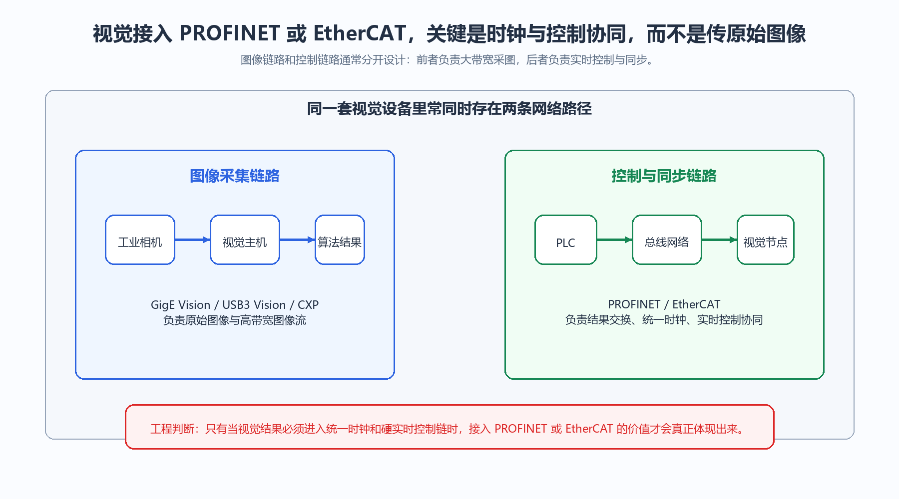

<strong>图 51-1 视觉系统中的图像链路与控制链路分工</strong>

图 51-1把视觉系统中经常被混谈的两条链路拆开了。左侧的图像采集链路负责把原始图像送到视觉主机或智能相机内部处理单元，右侧的控制与同步链路则把结构化结果、设备状态和统一时钟送入PLC与运动控制系统。读这张图时，读者应把注意力放在“图像流”和“控制流”承担的任务差别上。它帮助回答的是，为什么很多项目中既要有图像接口，又要有工业实时总线；它的适用边界也很明确，若视觉系统只需独立完成检测并返回少量结果，并不一定需要把自己纳入硬实时控制网络。

### 51.3 高端视觉系统为什么必须接入PROFINET或EtherCAT这样的硬实时总线？

如果视觉系统只需把OK/NG结果、少量尺寸值或目标坐标回传给PLC，普通TCP/IP、Modbus TCP甚至离散I/O往往已经足够。高端视觉系统之所以会接入PROFINET或EtherCAT，关键不在“把图像传得更快”，而在于让视觉测量结果进入统一时基下的控制链条。

这在多相机3D视觉、高速飞拍分拣、连续卷材检测、半导体对位和锂电设备中非常常见。视觉系统不再只是独立的检测单元，而是与伺服轴、机器人、光源控制器和触发模块共同参与一套严格受控的时序系统。此时，系统需要保证“什么时候拍”“在哪个位置拍”“拍完以后控制器按什么时刻解释结果”这几件事具有统一的时间基准。

以EtherCAT为例，若视觉节点、伺服驱动器和控制器共享DC时钟，PLC就可以按绝对时间或绝对机械位置下发动作命令。例如，在主轴运行到指定位置时，让多台相机同时曝光。这样做减少了传统硬触发布线的复杂度，也降低了电平传播、线路长度和外部接口链路带来的附加误差。

因此，接入硬实时总线的真正价值，是把视觉系统从"结果上报设备"提升为"统一运动控制节拍中的测量节点"。

从工程需求看，高端视觉接入硬实时总线集中在两类场景：第一，伺服轴同步——相机触发时刻须与机器人/电机位置纳秒级对齐，普通 TCP/IP 毫秒级不确定性无法保证重复精度；第二，确定性响应——检测结果须在固定时间窗口内到达 PLC，不能因网络抖动导致节拍偏差，硬实时总线将通信锁定在硬件调度层。

### 51.4 视觉系统如何接入PROFINET或EtherCAT总线？

常见方式大体有三种。

第一种是原生接入。部分高端视觉控制器、智能相机或一体化机器人视觉单元本身就带有PROFINET或EtherCAT从站接口，可以直接挂到PLC或运动控制网络中。这种方式结构清晰，同步能力强，适合新建产线或节拍要求很高的设备。

第二种是通过协议网关接入。视觉系统按原来的图像链路工作，再由协议网关把结果转换成PROFINET或EtherCAT可识别的数据区或对象。它的优点是改造成本较低，不必更换现有视觉软件和相机链路；缺点是总时延、诊断链路和同步能力通常不如原生接入明确。

第三种是基于PC的软件协议栈方案。此时PC既负责图像处理，也负责与工业总线交换结果数据。它的灵活性较高，但实时性受操作系统调度、驱动实现和硬件平台影响较大，必须做实际时延和抖动测试，不能只根据“支持某协议”就推断系统一定能稳定闭环。

工程上做方案选择时，至少要先回答两个问题：视觉节点是只交换结果数据，还是还要参与同步触发与统一时钟；它是普通数据从站，还是整条控制链上的时间关键节点。这两个问题决定了系统复杂度，也决定了设备成本和调试深度。

### 51.5 视觉系统接入工业总线面临哪些技术挑战？

第一类挑战是实时性。视觉系统内部包含曝光、图像传输、图像处理和结果下发几个阶段。即使总线本身周期很短，只要图像处理时间波动较大，整条链路仍然可能无法形成稳定的时间闭环。

第二类挑战是同步精度。多相机系统常要求“同一时刻曝光”或“在同一机械位置采样”。这时不仅要同步PLC和伺服轴，还要确认相机、触发板卡、光源控制器和视觉控制器是否真的共享统一时间基准。

第三类挑战是数据路径分离。控制网络通常并不适合直接承载高带宽原始图像流，因此很多项目会把图像采集网络和控制结果网络分开设计。初学者容易把“都叫以太网”误解为“所有数据都走同一张网”，这是系统架构里很常见的误区。

第四类挑战是诊断和维护。视觉问题往往横跨相机、镜头、光源、算法、网络和控制器，一旦接入工业总线，虽然集成能力增强了，但问题定位不一定更简单，反而要求更完整的时间戳、状态字、日志和诊断信息。

### 51.6 在实际应用中，视觉系统接入工业总线有哪些典型场景？

汽车装配线中，视觉系统常与机器人和夹具伺服轴联动，用于定位补偿、装配确认和在线质量检测。此时视觉结果进入控制系统后，会直接影响机器人动作与工艺节拍。

锂电、半导体和精密装配设备中，视觉系统更常参与高精度对位、边缘检测和闭环修正。与这类任务相比，普通结果上报已经不是重点，真正关键的是多轴运动、曝光时刻和视觉测量结果的统一解释。

包装和物流分拣系统中，视觉系统识别条码、外形和姿态后，把结果交给PLC或机器人控制器，由后者执行实时分拣。这类场景对控制节拍和结果通信的稳定性要求较高，但图像本身通常仍留在视觉侧处理。

卷材检测、线扫描成像和高速印刷系统中，视觉系统常与编码器、运动轴和触发模块共享统一时基，用于飞拍、位置锁定采样和多帧拼接。

### 51.7 未来视觉系统与工业总线集成的发展趋势是什么？

一个明显方向，是标准工业网络、统一时间同步和软件化控制继续融合。TSN（Time-Sensitive Networking，时间敏感网络）之所以受到关注，正是因为它试图把标准以太网基础设施与确定性控制需求更好地统一起来。

另一个方向，是边缘计算增强。越来越多视觉节点不只输出OK/NG，还输出位姿、置信度、缺陷类别、质量指标和模型状态。这意味着视觉系统在控制系统中的角色越来越接近“可诊断、可建模的测量节点”，而不再只是一个黑盒结果源。

从工程判断看，是否接入PROFINET或EtherCAT，不应只看设备清单里"支不支持"，而应看项目是否真的需要把视觉结果纳入统一时钟和硬实时控制链中。只有在这个条件成立时，工业实时总线的价值才会充分体现。

> **引用出处**：PROFINET RT/IRT 性能数据与 EtherCAT on-the-fly 机制，参见 EPC Industrial Ethernet White Paper WP-2019（www.encoder.com/wp2019）及 Dewesoft *What Is EtherCAT Protocol*（dewesoft.com/blog/what-is-ethercat-protocol）。

---

---

## 52. 产线的运动控制（如伺服电机）是由PLC做还是由视觉系统做？视觉引导定位（如机器人抓取）时，数据流是怎样的？

### 52.1 产线运动控制中PLC和视觉系统的分工是怎样的？

在工业自动化产线中，PLC和视觉系统通常承担不同层级的任务。PLC更接近执行层控制，视觉系统更接近测量与感知层。

PLC负责的内容通常包括逻辑顺序控制、伺服轴启停、回零、定位、联动、安全互锁和故障处理。它的强项在于周期可预测、环境适应性强、与伺服驱动器和工业总线的结合成熟。

视觉系统则主要负责图像采集、识别、测量、定位、缺陷判断和坐标解算。它给控制系统提供的是“目标在哪里”“姿态如何”“结果是否可信”，而不是直接去承担伺服底层闭环。

因此，视觉系统一般不直接替代PLC控制伺服电机。更准确的理解是：视觉系统给出测量结果和修正量，PLC或机器人控制器根据这些结果决定执行动作。

### 52.2 为什么PLC更适合做伺服电机的直接控制？

伺服控制的核心问题不是“算得快不快”，而是“能不能在确定周期内稳定执行”。位置环、速度环和电流环都要求控制周期固定、时序稳定、异常处理明确，这正是工业控制器擅长的部分。

PLC或专用运动控制器更适合直接控制伺服轴，主要有三个原因。第一，它们与伺服驱动器之间有成熟的实时总线和运动控制功能，便于实现多轴同步、电子齿轮、电子凸轮和轨迹协调。第二，它们的扫描周期、任务优先级和故障响应更加可预测。第三，它们天然与安全链、限位、抱闸、回零和互锁逻辑耦合紧密，适合长期稳定运行。

相较之下，视觉PC即使算力很强，也未必适合承担底层闭环。PC更适合做图像处理、路径生成、上层决策或离线优化；驱动器和PLC仍然更适合承担周期控制任务。

这里还需要区分两个概念：运动规划与伺服闭环。视觉系统可以参与运动规划，例如给出抓取位姿；而伺服闭环通常仍由驱动器和控制器完成。

### 52.3 视觉系统在运动控制中扮演什么角色？

视觉系统在运动控制中最典型的角色，是“测量并提供修正量”。

以机器人抓取随机摆放工件为例，视觉系统先检测工件中心位置与姿态，再把位姿结果发送给机器人控制器。控制器据此完成坐标变换、轨迹规划和末端执行。此时视觉系统提供的不是某个电机轴的扭矩指令，而是抓取目标的空间信息。

常见输出形式包括平面偏移量 $(\Delta x,\Delta y,\Delta \theta)$、三维位姿 $(x,y,z,R_x,R_y,R_z)$、工件类别、抓取点、置信度、尺寸值和缺陷类别。对质量检测系统而言，视觉系统还可能输出报警码、测量统计值或工艺补偿量。

在一些闭环应用中，视觉系统还会承担二次确认。例如抓取后复拍、贴合后对位复核、装配后尺寸验证等。这样形成的就是“视觉测量 - 控制执行 - 视觉验证”的协同结构。

### 52.4 视觉引导定位的完整数据流是怎样的？

一套可落地的视觉引导定位系统，通常至少包括触发、采图、识别、坐标转换、控制执行和反馈校验几个阶段。

第一阶段是触发与采图。工件到达预定位置后，光电开关、编码器或PLC发出触发信号，相机完成曝光。若节拍较高，还会同步控制光源脉冲。

第二阶段是视觉处理。视觉软件完成目标检测、边缘提取、模板匹配、三维重建或深度学习推理，并输出像素坐标、目标姿态或测量结果。

第三阶段是坐标转换。视觉结果最初属于相机坐标系或图像坐标系，必须通过标定关系转换到机器人坐标系、工装坐标系或世界坐标系。这一步决定了视觉结果能否真正落到执行机构上，是系统集成中的关键桥接环节。

第四阶段是控制执行。PLC或机器人控制器接收视觉结果后，结合当前轴状态、工艺约束和安全条件，生成可执行的运动轨迹，并通过实时总线下发到伺服驱动器。

第五阶段是反馈与校验。伺服轴通过编码器反馈实际位置；必要时视觉系统再次确认执行结果是否达到预期。

  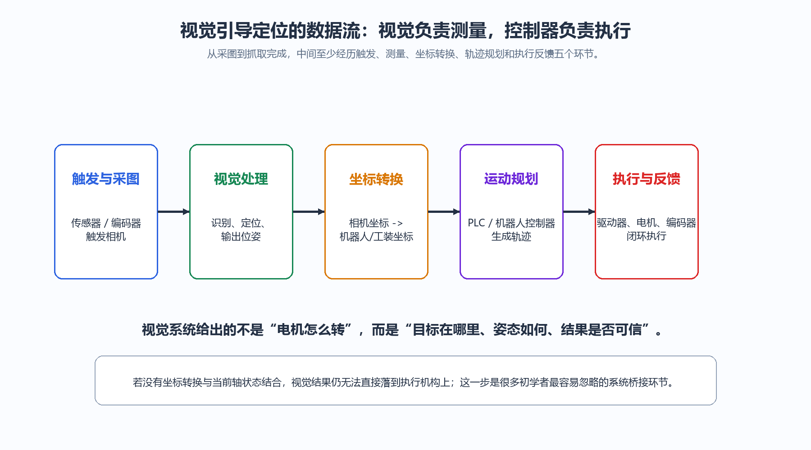

<strong>图 52-1 视觉引导定位中的测量与执行数据流</strong>

图 52-1把视觉引导定位常见的五个关键环节顺序展开。读者应特别注意中间的“坐标转换”步骤，因为很多系统在实验台上能识别目标，却在上机联调时无法稳定抓取，问题往往就出在这里。视觉系统输出的是相机测得的位置与姿态，控制器需要的是执行机构可以理解的坐标与约束条件；只有这两者之间的映射明确，视觉结果才真正具有控制意义。该图适用于大多数抓取、对位和装配场景；若系统采用视觉控制器与机器人控制器一体化平台，部分模块会在软件架构上合并，但其逻辑分工并不会改变。

### 52.5 现代工业自动化中PLC和视觉系统的集成趋势是什么？

当前的一个明显趋势，是平台更紧密，但职责边界仍然存在。现在常见的一体化控制平台，可以把PLC、运动控制和视觉部署在同一工程环境，甚至同一硬件平台上，但这并不意味着视觉与伺服闭环不再区分。

另一个趋势，是数据交换更丰富。过去视觉系统往往只回传OK/NG或坐标；现在还会传递置信度、检测区域编号、缺陷类别、时间戳和模型状态，这让控制系统可以做更细致的工艺判断。

第三个趋势，是仿真和数字化调试增强。视觉标定、机器人坐标转换和轨迹验证越来越多地在离线环境中先完成，再上机联调，从而降低现场反复调试的成本。

对学生而言，这一题最重要的结论是：PLC与视觉系统不是“谁替代谁”的关系，而是“执行”和“测量”的协同关系。理解了这一点，后续学习触发、标定、定位补偿和运动控制时，系统角色就不会混淆。

---

---

## 53. 如何处理因传输延迟或处理时间导致的“定位偏差”？什么是“飞拍”或“跟踪触发”？

### 53.1 什么是“定位偏差”，它在计算机视觉系统中如何产生？

定位偏差是指系统输出的位置，与目标在执行时刻的真实位置之间的误差。只要目标在运动，而系统又存在采集、传输、处理和执行准备时间，这个偏差就会出现。

设目标沿单一方向运动，速度为 $v$，系统总延迟为 $\Delta t$，则最基本的一阶近似关系为

$$
\Delta x \approx v\Delta t
$$

这里的 $\Delta x$ 是位置偏差，$\Delta t$ 是从拍摄到控制系统真正使用该结果之间的总时间。这个式子成立的前提是：在这段时间内目标速度变化不大。如果目标存在明显加速度，还需要进一步考虑加速度项或采用更高阶的运动模型。

初学者最容易混淆的是两类不同误差：一类是图像中的测量误差，另一类是时间滞后引起的位置误差。前者对应“看错了多少”，后者对应“看对了，但看到的是过去的位置”。它们的来源不同，处理方法也不同。

### 53.2 传输延迟和处理时间如何具体影响定位精度？

设相机曝光结束到图像到达处理器的延迟为 $\Delta t_1$，算法处理时间为 $\Delta t_2$，结果发送与执行准备时间为 $\Delta t_3$，则系统总延迟可写为

$$
\Delta t=\Delta t_1+\Delta t_2+\Delta t_3
$$

若此时目标速度近似恒定，则执行时刻相对拍摄时刻的额外位移近似为

$$
\Delta x \approx v(\Delta t_1+\Delta t_2+\Delta t_3)
$$

这也是为什么高速应用里，几十毫秒延迟就可能带来很明显的机械位置偏差。以传送带速度 $1\,\mathrm{m/s}$、总延迟 $40\,\mathrm{ms}$ 为例，目标在系统完成处理并下发结果之前，已经额外前进了

$$
\Delta x \approx 1\times 0.04 = 0.04\,\mathrm{m}=40\,\mathrm{mm}
$$

对抓取、贴合和精密定位来说，这样的偏差通常已经不可接受。

### 53.3 有哪些主要技术可以补偿或减少因延迟导致的定位偏差？

处理这类偏差，通常有四条思路。

第一，减少延迟本身。例如提高帧率、缩短曝光时间、采用更快的图像接口、减少无效算法路径，或把部分处理前移到FPGA、智能相机或边缘处理器上。

第二，统一时间基准。只要相机、编码器、PLC和执行器共享明确的时间戳，就能知道“这组视觉结果对应的是哪一个时刻的目标位置”，从而为补偿奠定基础。

第三，做短时运动预测。若目标在短时间内近似匀加速，可用

$$
\hat{x}(t+\Delta t)=x(t)+v(t)\Delta t+\frac{1}{2}a(t)\Delta t^2
$$

其中 $\hat{x}(t+\Delta t)$ 为预测位置，$x(t)$ 为拍摄时刻测得的位置，$v(t)$ 和 $a(t)$ 分别为当时估计的速度和加速度。这个式子的适用前提，是预测区间内运动变化不能过于剧烈；若目标轨迹复杂，还需使用滤波器或更完整的运动模型。

第四，改变采样策略。与其“每隔固定时间拍一次”，不如“在该拍的时候拍”。飞拍和跟踪触发，就是围绕这一思路建立起来的。

### 53.4 什么是“飞拍”技术，它如何解决高速运动物体的定位问题？

飞拍是指目标连续运动时不停车，系统在运动过程中完成曝光和采图。它的关键在于让曝光时刻与目标位置的关系可控，而不只是提高拍摄频率。

典型飞拍系统通常包含以下条件：使用全局快门相机，避免卷帘快门造成几何形变；触发信号与编码器位置或精确时钟绑定；曝光时间足够短，以减小运动模糊；光源能够在短曝光内提供足够照度。

因此，飞拍解决的是“运动中如何在正确位置获得可用图像”的问题。若只提高帧率，却没有同步触发、短曝光和足够光照，图像仍可能模糊，位置仍可能不准。

### 53.5 “跟踪触发”技术的工作原理是什么，它与传统触发有何不同？

传统触发往往是固定条件触发，例如“光电开关到位就拍”或“每隔固定时间拍一次”。这种方式简单，但默认目标速度变化不大，或者默认拍摄窗口足够宽。

跟踪触发则先持续估计目标运动状态，再预测它何时进入最佳拍摄区域，并在该预测时刻触发相机。它更像“先追踪，再决定何时拍”。

典型流程包括：先用低分辨率视觉或辅助传感器持续跟踪目标；实时估计位置、速度，必要时估计加速度；预测目标进入最佳成像窗口的时刻；在该时刻触发高分辨率采图。这样的策略更适合目标速度波动较大、目标间距不均匀或拍摄窗口较窄的场景。

### 53.6 硬件同步在减少定位偏差中扮演什么角色？

硬件同步的核心作用，是把“时间不确定”变成“时间可知且可重复”。

例如，相机曝光时刻、光源闪光时刻和编码器位置采样时刻若由同一硬件时基控制，系统就能明确知道某一帧图像对应的是哪一个机械位置。此时即使图像处理稍后才完成，也仍可以基于拍摄时刻的位置进行补偿。

还要指出，硬件同步并不等于没有延迟。它解决的是时序抖动和时间对应关系的问题，图像处理时间本身仍然存在。对工程人员来说，知道“延迟是多少”与“延迟是否稳定”，同样重要。

### 53.7 如何设计一个完整的延迟补偿系统？

一个可落地的延迟补偿系统，通常至少要做五件事。第一，实测端到端总延迟，不要凭经验估计。第二，为图像、编码器、PLC数据和执行动作建立统一时间戳。第三，根据产线最大速度，先计算不补偿时的位置偏差上限。第四，判断系统是只需减小延迟，还是必须引入运动预测。第五，在联调阶段验证补偿后的残余误差，不能只验证静态标定误差。

工程上有两个常见误区。一个是只优化算法时间，却不测通信与执行延迟；另一个是只给平均延迟，不给抖动范围。对于实时控制来说，平均值重要，抖动同样重要，因为补偿模型往往更怕“有时慢20毫秒，有时慢35毫秒”，而不是“稳定慢20毫秒”。

  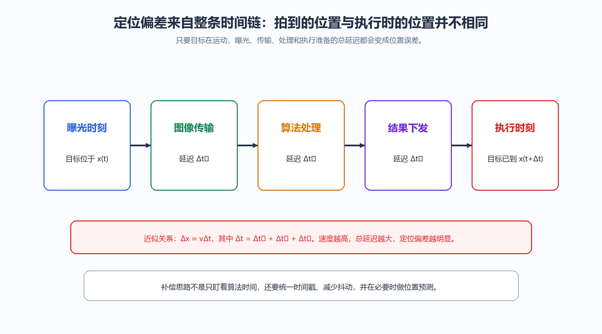

<strong>图 53-1 定位偏差形成的时间链条</strong>

图 53-1把定位偏差拆成一条完整的时间链：曝光、图像传输、算法处理、结果下发和执行准备，每一个环节都会把目标继续“往前带走”一段距离。读者从这张图中最应该建立的判断是，位置偏差并不是单一环节造成的，而是整条链路的合成结果。它对工程排查的价值在于提醒我们不要只盯着算法快慢，而要把触发、通信、控制器接收和执行准备都纳入测时延与建模范围。该图使用的是一阶速度近似，若目标存在明显加速度或停启切换，还需要在模型中加入更完整的运动项。

---

---

## 54. 什么是编码器？如何利用编码器信号实现更精准的触发或图像拼接？

### 54.1 编码器在机器视觉中的基本定义是什么？

编码器是一类把机械位置或位移转换为电信号的传感器。它既可以测转角，也可以测直线位移。

在机器视觉系统中，编码器最重要的作用，不只是告诉系统“电机转了多少圈”，而是提供一个可累计、可同步、可与触发绑定的位置基准。只要视觉任务与运动有关，编码器往往就是时间和位置之间的桥梁。

按测量对象区分，常见有旋转编码器和直线编码器；按输出方式区分，常见有增量式和绝对式。教材里应把这两个分类维度分开理解，不要把“旋转式”和“增量式”当成同义词。

### 54.2 编码器的工作原理是什么？有哪些主要类型？

编码器的实现原理可以是光电式、磁式或容栅式等。不同原理对应不同的环境适应性、分辨率和成本。

按输出意义分，增量式编码器输出脉冲，系统通过计数得到相对位移；若掉电后不保存计数，通常不能直接知道当前位置。绝对式编码器则直接给出当前位置编码，重新上电后仍可读出位置。

按测量对象分，旋转编码器测角位移，直线编码器测线位移。对视觉系统而言，增量式编码器常用于传送带触发、线扫同步和平台位移计数；绝对式编码器更常见于高端定位平台、多轴设备和不希望重复回零的系统。

### 54.3 编码器信号在机器视觉触发控制中如何发挥作用？

当视觉任务要求“每隔固定距离拍一次”，最自然的基准就不是时间，而是位移。编码器恰好提供了这个位移基准。

例如，传送带速度可能会波动，但只要编码器与传送带实际位移保持良好对应，系统就能做到“每移动固定距离采一帧”，或者“工件走到固定空间位置时触发曝光”。这比固定时间间隔触发更稳定，因为时间触发默认速度恒定，而编码器触发直接绑定机械位移。

这里还应区分两层作用：编码器信号既可以用于“到位触发”，也可以用于“速度估计和延迟补偿”。前者决定何时拍，后者帮助系统计算拍完之后目标又走了多远。

### 54.4 编码器信号如何用于实现高精度的图像拼接？

图像拼接常见于大视野检测、平台扫描和线扫描成像。它的本质是：多张局部图像之间必须知道彼此的相对位移。

编码器在这里提供的是先验位移信息。在做图像特征配准之前，系统已经知道相机或工件大约移动了多少。

典型流程是：平台或工件移动，编码器连续输出位移信息；每移动固定距离触发一次采图，或持续线扫并按位移同步采样；为每张图像记录对应的编码器位置值；根据相邻图像的位置差计算理论重叠范围；再用图像特征做微调，以补偿机械误差、打滑和镜头畸变。

因此，编码器的作用是为图像配准提供可靠初值。对纹理少、重复纹理多或特征不稳定的表面，这个初值尤其重要。

### 54.5 在机器视觉系统中，编码器与其他传感器如何协同工作？

编码器通常不会单独工作，而是与其他传感器共同构成完整的运动测量链。

与光电开关配合时，光电开关负责判断“工件到了没有”，编码器负责判断“工件走到哪了”。这两者不是重复关系，而是存在检测与位置测量的分工。

与伺服系统配合时，编码器既可作为电机反馈元件，也可作为外部位置参考，用于比较“平台实际位移”和“控制器指令位移”是否一致。

在线扫描系统中，编码器更是关键同步量。若线扫相机行频与物体实际运动速度不同步，图像就会被拉伸或压缩。此时编码器不是辅助元件，而是决定纵向几何比例是否正确的核心元件。

### 54.6 编码器信号的精度和分辨率对视觉系统性能有何影响？

编码器性能至少涉及三个不同概念：分辨率、精度和重复性。分辨率是最小可分辨的位移或角度增量；精度是测得位置与真实位置的接近程度；重复性是多次到同一位置时结果的一致程度。

这三者不能混为一谈。分辨率高，不等于系统绝对精度一定高。若机械传动间隙明显、滚轮打滑、联轴器松动或安装偏心存在，再高的编码器分辨率也无法直接保证视觉系统最终定位精度。

工程上常把编码器脉冲数换算成线位移分辨率。若旋转编码器每转输出 $N$ 个计数，滚轮周长为 $L$，则每个计数对应的理论线位移为

$$
\Delta s=\frac{L}{N}
$$

这个式子给出的是理想分辨率。若机械耦合方式有误差，实际位移与理论位移就不再完全一致，因此还要结合安装结构一起判断。

### 54.7 现代编码器技术有哪些发展趋势？

一个趋势，是更高分辨率与更强环境适应性并行发展。高端定位平台要求亚微米甚至更高等级的位移控制，而普通工业现场又要求抗油污、抗粉尘和抗振动。

另一个趋势，是总线化和诊断能力增强。越来越多编码器不只输出位置，还输出状态、告警、温度和诊断信息，便于纳入整机健康管理。

第三个趋势，是与高速控制网络更紧密耦合。编码器越来越像实时控制链中的标准节点，而不只是一个孤立的测量器件。

### 54.8 编码器在特定视觉应用中的实际案例有哪些？

高速印刷检测中，编码器常装在印刷滚筒或传送辊上，用于保证每个版面都在相同机械位置被采图，便于比较套印偏差和重复缺陷。

晶圆、玻璃面板或大幅面PCB检测中，编码器与高精度平台配合，用于记录扫描位置并触发拼接采图。此时编码器决定的是“每一帧在整张大图中的几何位置”。

在线扫成像中，编码器脉冲可以直接决定每一行图像对应的物理位移，因此它同时影响纵向比例尺和图像是否发生拉伸变形。

  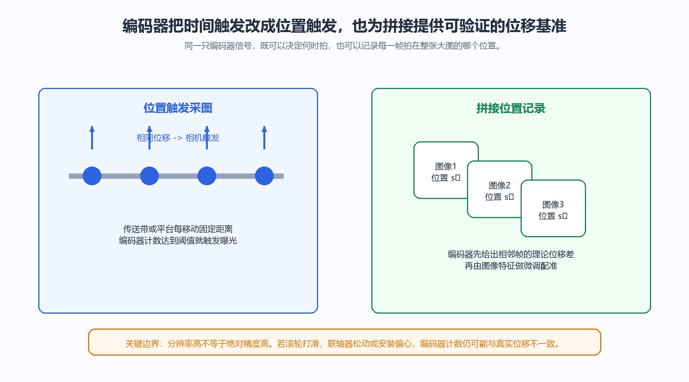

<strong>图 54-1 编码器在位置触发与图像拼接中的双重作用</strong>

图 54-1把编码器在视觉系统中的两种典型用途并列展示。左侧说明编码器如何把“按时间触发”改成“按位移触发”；右侧说明它如何为多帧拼接提供先验位置基准。读这张图时，读者应看到同一类位置反馈信号在两个问题中的共同作用：它都在把模糊的运动过程转成可计量、可同步的位移过程。该图同样提醒一个重要边界，编码器计数再细，也不能自动消除滚轮打滑、传动间隙或安装误差，因此系统精度不能只看PPR（每转脉冲数）指标。

---

---

## 55. 当产线速度变化时，如何保证视觉系统的触发频率同步变化？

### 55.1 为什么产线速度变化会影响视觉系统的检测质量？

产线速度变化会直接改变工件通过检测区域的时间间隔。若视觉系统仍按固定时间频率触发，采图位置就会漂移，进而带来三类典型问题：一是工件间距变化后可能漏检或重复检测；二是图像中工件位置发生偏移，影响定位与测量精度；三是高速运行时更容易出现运动模糊，低速运行时又可能产生过度采样和无效数据。

这说明速度变化真正影响的是采图位置是否准确。一旦采图位置与运动位置脱节，后续的尺寸判断、缺陷定位和执行控制都会受到影响。

### 55.2 什么是编码器触发机制，它如何实现速度同步？

编码器触发是工业视觉中最常用的速度同步方案。编码器安装在驱动轴、从动辊或高精度运动平台上，把机械位移转换成脉冲信号。由于脉冲频率随速度变化，视觉系统只要把这些脉冲作为外部触发源，就能实现“运动多少距离拍一张”，从而避免固定时间触发带来的位置漂移。

这套机制的价值在于：速度升高时，脉冲自动变密，触发频率自动升高；速度降低时，脉冲自动变疏，触发频率也随之下降。只要编码器与实际位移耦合关系可靠，采样间距就能保持稳定。

### 55.3 脉冲当量在同步系统中起什么关键作用？

脉冲当量描述的是“一个编码器计数对应多少物理位移”。它是把数字脉冲转换为真实机械位置的关键参数。

若滚轮周长为 $L$，编码器有效计数为 $N$，则每个计数对应的理论位移可写为

$$
\Delta s=\frac{L}{N}
$$

若编码器每转原始脉冲数为 $P$，经过倍频后有效计数为 $N=P\times M$，其中 $M$ 为倍频系数，则同样可以写成

$$
\Delta s=\frac{L}{P\times M}
$$

例如，辊轮周长为 $300\,\mathrm{mm}$，编码器原始分辨率为 $1000$ 脉冲/转，4倍频后有效计数为 $4000$，则脉冲当量为

$$
\Delta s=\frac{300}{4000}=0.075\,\mathrm{mm/count}
$$

这意味着产线每移动 $0.075\,\mathrm{mm}$，系统就会累计一个计数。后续无论是位置触发、速度估计还是图像拼接，这个量都决定了机械位移与数字采样之间的换算关系。

### 55.4 如何通过分频或倍频技术调整触发频率？

在实际项目中，编码器原始脉冲频率并不一定正好等于理想触发频率，因此往往还需要做倍频或分频。

倍频的作用，是把原始脉冲进一步细分，提高位置分辨率；分频的作用，是在高速度场景下适当降低触发频率，避免相机或处理链路过载。若编码器原始脉冲频率为 $f_\mathrm{enc}$，倍频系数为 $M$，分频系数为 $D$，则触发频率可写为

$$
f_\mathrm{trig}=\frac{f_\mathrm{enc}\times M}{D}
$$

但要注意，这个式子给出的只是电子触发频率，不代表系统一定具备足够的曝光能力、传输带宽和处理能力。分频与倍频的作用，是把触发信号调到合适区间；整机节拍仍然需要单独校核。

### 55.5 线阵相机和面阵相机在速度同步上有何不同？

线阵相机通常按“行”触发。它真正关心的，是相邻两行图像对应的物理位移是否恒定。若线频与物体运动速度不同步，图像就会在运动方向上被拉伸或压缩。因此，线阵系统对编码器同步的依赖通常更强。

面阵相机则按“帧”触发，常用于在指定位置拍下一幅完整图像。它更关注的是：在目标进入最佳视野位置时准确曝光，以及曝光时间是否足够短以控制运动模糊。对高速移动物体而言，面阵相机即使帧率足够高，若触发时机不准，仍然会拍到位置偏移的图像。

从工程角度看，线阵系统更像“持续按位移采样”，面阵系统更像“在关键位置采样整帧”。二者都需要速度同步，但同步目标并不完全相同。

### 55.6 除了硬件触发，还有哪些软件同步策略？

硬件触发是基础，但在速度持续变化、目标间距不均匀或系统链路较长时，往往还需要软件层补充。

常见策略包括：根据编码器脉冲时间间隔实时估计瞬时速度；根据速度变化趋势调整触发阈值或曝光参数；为每一帧图像附加精确时间戳，在后续处理阶段做时间对齐；在必要时做短时位置预测，用于补偿采图到执行之间的滞后。

对这类策略，应强调它们只是硬件同步的补充。没有可靠的位移基准和时间基准，单靠软件很难长期稳定地修正高速运动带来的位置漂移。

### 55.7 如何应对产线加减速过程中的同步挑战？

加减速阶段最麻烦的地方，在于速度不是常数，很多简单模型会失效。此时系统不能再假定“上一时刻的触发节奏等于下一时刻的节奏”，而需要根据实时位移信息持续更新判断。

工程上常见的做法包括：使用足够快的编码器输入接口，保证在高转速下不丢脉冲；按相邻脉冲时间间隔实时估算瞬时速度；对明显的速度跳变建立触发保护或缓冲机制；把执行器的响应时间一并纳入系统模型，不要只校核相机一侧。

若速度变化幅度较大，还需要实测系统在加速段、稳速段和减速段的残余偏差，而不是只在稳速条件下标定一个“看起来没问题”的参数。

### 55.8 现代工业视觉系统采用哪些先进同步架构？

当前更先进的同步架构，往往不再把编码器、相机和控制器视为彼此独立的零散部件，而是纳入统一时基下的整体系统。

例如，EtherCAT可用于把编码器、伺服轴、视觉节点和控制器放入同一实时网络；IEEE 1588精密时间协议可用于多相机系统之间的时间同步；FPGA触发板卡可把外部脉冲、曝光控制和时间戳记录做到更小抖动。对大型系统来说，这些技术的目标是一致的：让“位移变化”“触发发生”“结果被解释”“动作被执行”都具有可追踪的时间对应关系。

  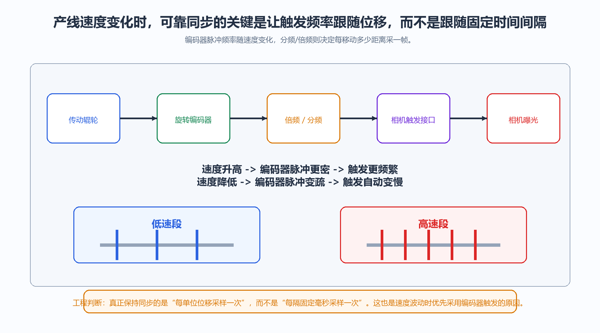

<strong>图 55-1 速度变化下的编码器同步触发链路</strong>

图 55-1把速度同步问题压缩成一条清晰的因果链：机械位移带动编码器产生脉冲，脉冲再经过倍频或分频处理，最终成为相机的触发源。图中下半部分把低速段与高速段并列展示，目的是让读者直观看到同一段位移在不同速度下对应着不同的脉冲密度。由此应得出的工程判断是：系统应尽量保持“每单位位移采一帧”的采样方式。该图适用于大多数传送带与平台扫描场景；若系统存在明显打滑、弹性传动或中间机构间隙，仅靠编码器触发仍不足以完全保证采样位置正确，还需要结合机械误差补偿与实际校准。

---

---

## 56. 多工位视觉检测系统中，如何协调多台相机与PLC的触发时序？

### 56.1 什么是多工位视觉检测系统的基本架构？

多工位视觉检测系统通常由传送机构、到位传感器、编码器、PLC、若干相机与光源组成。产品沿传送带或转盘依次经过多个检测视野，每个工位承担不同的任务，例如正面字符读取、侧面轮廓测量、端面缺陷检测或装配状态确认。PLC不仅负责执行机构联动，更承担整条检测链路的时序组织：何时取产品进入队列，何时触发哪一台相机，何时等待采集完成，何时把结果交给剔除、分拣或后续工位。

多工位系统真正困难的地方不是有几台相机，而是同一件产品在运动中的身份能否被持续追踪。如果某一工位的图像来自前一件产品，而后续逻辑却把它当作当前产品，就会出现结果错位、剔除误判和追溯失真。时序设计的目标，是让产品位置、触发信号、图像编号和检测结果始终保持一一对应。

### 56.2 为什么硬件触发比软件触发更适合多工位系统？

软件触发依赖操作系统调度、网卡缓存、协议栈处理和应用程序响应，延迟不仅更大，而且存在抖动。对单机、低速、非严格定位场景，这种方式未必不可用；一旦进入高速连续生产，多工位检测要求相机在特定物理位置上曝光，触发时刻的可重复性往往比平均延迟更重要。硬件触发由PLC数字输出或专用触发模块直接向相机发送电平脉冲，路径短、响应确定，便于用示波器实测，因此更适合作为工程实现的主方案。

硬件触发只是把不确定因素压缩到更易测量、更易补偿的范围内，并不代表系统天然精确。若PLC扫描周期过长、输出模块响应慢、接线质量差或相机输入逻辑配置错误，即使采用硬件触发，仍会出现触发偏差。换句话说，硬件触发提供的是一个可校准的基础，而不是不经验证就能直接交付的答案。

### 56.3 PLC如何生成精确的触发信号序列？

在多工位系统中，PLC不宜只按时间延迟去猜测产品位置，更稳妥的办法是依据编码器脉冲追踪产品在传送坐标中的实际位移。常见做法是在前端安装光电或接近传感器，当产品进入参考点时，PLC高速计数器立即记录当下编码器绝对脉冲值 \(P_0\)，并把该值压入队列。后续每个检测工位与参考点之间的物理距离，先换算成脉冲数 \(N_i\)，PLC在运行中实时比较当前编码器计数与 \(P_0 + N_i\) 的关系，到位即输出对应相机的触发脉冲。

这种方法的意义在于把“时间”问题转成“位置”问题。传送带轻微加减速、短暂停顿后再启动，都会破坏单纯的时间推算，却不会改变产品相对参考点已经走过多少编码器脉冲。只要编码器与传送机构之间没有严重打滑，且机械安装足够稳定，按脉冲追踪的方案就能把多工位触发统一到同一套空间坐标里。

  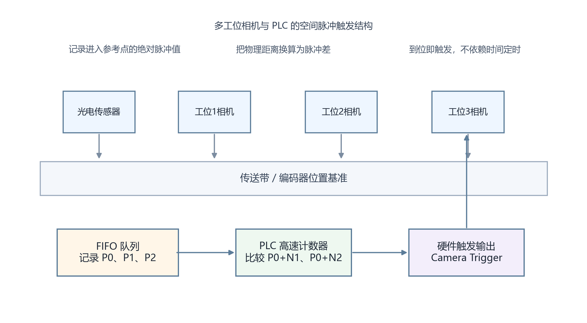

<strong>图 56-1 多工位相机与 PLC 的空间脉冲触发结构</strong>

图 56-1 上方从左到右依次给出参考传感器和三个相机工位，它们共同挂接在同一条传送带位置基准上。下方的 FIFO 队列表示产品经过参考点时被记录下来的绝对脉冲值，PLC 高速计数器负责把这些起始脉冲与各工位对应的目标脉冲差进行比较，最右侧的硬件触发输出则把“到位”这一空间事件转换为相机的曝光脉冲。读者应从图中建立一个明确判断：多工位触发的本质不是给每台相机单独设定一个时间延时，而是以统一位置基准持续追踪产品。该图适合说明传送式、多产品排队场景下的触发组织方式；若系统没有编码器，或传送机构存在明显打滑与弹性滑移，则还需增加位置复核手段，不能仅靠该结构推断最终精度。

### 56.4 如何计算和补偿各个工位的触发延迟？

46.3 的核心思想是把触发问题从"时间域"转到"位置域"，直接按编码器脉冲阈值触发。本节的时间公式则用于另一种场景：速度较稳定，或因前期方案估算需要先做的时间概算。两种方法不互斥——若系统已有编码器，应以脉冲阈值为主，时间公式可作为理解时序组成和检验量级的辅助工具。

如果把产品速度近似看作稳定值，传感器检测到产品后，相机理论触发时刻可写成

$$
t_{\mathrm{trig},i}=t_0+\frac{d_i}{v}-t_{\mathrm{cam},i}-t_{\mathrm{out},i}
$$

式中，\(t_0\) 为参考传感器动作时刻，\(d_i\) 为参考点到第 \(i\) 个相机视野中心的距离，\(v\) 为产品在该区段的线速度，\(t_{\mathrm{cam},i}\) 为相机从接收触发到实际开始曝光的响应延迟，\(t_{\mathrm{out},i}\) 为PLC输出链路延迟。式（56-1）中 \(t_{\mathrm{cam},i}\) 和 \(t_{\mathrm{out},i}\) 前用的是减号，含义是PLC必须比产品到达视野中心提早这么多时间发出触发脉冲，否则等到产品到位再发，相机实际曝光时产品已经走过头了。若系统已采用编码器追踪，通常会把距离项直接换算为脉冲阈值，并把这部分提前量折算到脉冲空间中处理（见式47-3）。

式（56-1）只在速度变化较小或补偿区间较短时才足够准确。若传送带频繁变速，更可靠的做法是实时读取编码器增量，以当前位置而非平均速度进行判断。相机响应时间最好用示波器测量触发输入与曝光输出之间的时间差，PLC输出延迟也应在对应程序负载下实测，而不是完全照抄规格书标称值。

### 56.5 什么是“主从触发”和“并行触发”模式？

主从触发适合多角度同步拍摄，通常由一台主相机或专用同步模块给出基准脉冲，其余相机接收同一时刻或固定偏移量的触发。此类场景更关注“同一瞬间从不同方向观察同一位置”，例如立体测量、同步多视角外观检测或高速飞拍。

并行触发更常见于传送式多工位结构。各相机拥有独立触发线，但都由PLC在统一坐标系中分别调度，产品经过不同工位时按顺序曝光。它并不要求几台相机同时拍摄，而要求同一件产品在正确位置被各工位依次采集。两种模式的差别，落在“同步对象”不同：前者同步的是相机间的曝光瞬间，后者同步的是产品位置与工位任务。

### 56.6 如何处理高速运动下的图像模糊问题？

产品在曝光时间内发生位移，就会带来运动模糊。若产品线速度为 \(v\)，曝光时间为 \(t_{\mathrm{exp}}\)，则曝光期间的位移量为

$$
\Delta x=v\cdot t_{\mathrm{exp}}
$$

工程上并不是简单追求“曝光越短越好”，而是要把 \(\Delta x\) 控制在当前测量任务可接受的范围内。对尺寸测量、边缘定位、缺陷轮廓提取这类任务，常用做法是把模糊长度压到单像素对应物理尺寸的一半甚至更小；若只是较粗的存在性判断，容许范围可以适当放宽。缩短曝光通常要同步提高光照强度，必要时采用频闪光源和全局快门相机，否则图像会在减模糊的同时变得过暗或引入卷帘畸变。

### 56.7 如何实现多相机图像的时间戳同步？

触发同步解决的是“什么时候曝光”，时间戳同步解决的是“事后如何确认它们确实属于同一时刻或同一产品”。如果系统后续要进行多相机结果融合、轨迹还原或跨设备追溯，就需要统一时基。常见方案包括启用支持精确时间协议（PTP，Precision Time Protocol，IEEE 1588）的工业相机，在同一网络中做时钟同步；使用外部同步脉冲校正各相机内部时钟；在软件侧以PLC触发事件号或产品序号作为统一关联键。

严格来说，时间戳一致并不等价于图像内容一定对应同一几何状态。若不同相机曝光时间不同、视野位置不同或通信缓存策略不同，即便时间戳相同，也仍可能出现业务层面的错配。因此，时间戳同步应与产品编号、编码器位置或PLC事件序号结合使用，不能把它单独当作唯一依据。

### 56.8 系统调试和验证时需要注意哪些关键指标？

调试阶段至少应检查三类指标：一是触发延迟本身是否稳定，二是多工位之间是否会发生产品身份错位，三是高速运行下图像质量是否满足算法要求。前者可通过示波器同时采集PLC输出和相机曝光反馈来测量抖动范围；第二类问题则适合用带明确编号的样件或刻度测试板做连续验证；第三类问题往往需要在不同速度、不同曝光和不同光照组合下实拍确认，而不是只看静态样图。

很多系统在低速调试时表现正常，提速后才暴露问题，原因常常不是算法突然失效，而是触发位置漂移、补偿量不再适用、光照亮度不足或通信缓存堆积。因此，多工位系统的验收不应停留在“每台相机都能出图”，而应验证在目标节拍下，整条链路能否长时间稳定保持图像、结果和产品的一致对应。

### 56.9 什么是“看门狗”机制和故障恢复策略？

看门狗机制用于判断某个工位是否在规定窗口内完成了应答。例如PLC发出触发后，在设定时间内必须收到相机采集完成、处理完成或结果返回信号；超时则判定该工位异常。对于偶发故障，可允许有限次数重试；对于持续超时或通信中断，更合理的策略是上报故障并决定是否旁路该工位，而不是无限等待，从而拖垮整线节拍。

故障恢复时还要考虑队列一致性。某一工位丢帧后，系统究竟是把当前产品整件判为未知、只屏蔽该项检测，还是停止设备等待人工确认，这应在方案阶段就定义清楚。若恢复策略只考虑“相机能不能重新连上”，却没考虑产品序号和结果队列如何补齐，恢复后的数据仍可能不可信。

### 56.10 现代系统中还有哪些高级时序协调技术？

对节拍极高或同步精度要求极严的场景，PLC之外常会引入专用同步控制器、FPGA触发卡或基于实时以太网的分布式时钟架构。它们能够把时基下沉到更底层的硬件，同步能力比通用PLC更强，也更便于扩展多设备联动。EtherCAT、PROFINET IRT（Isochronous Real-Time，同步实时）和支持PTP的相机网络，在现代高速视觉线体中都很常见。

不过，是否采用这些高级技术取决于任务边界。若系统只是中低速检测，现场维护团队又以标准PLC为主，盲目堆叠高端同步方案反而会抬高维护门槛。工程选型看重的是误差预算（各项误差如触发抖动、编码器精度、机械间隙各自允许占用的最大份额）、节拍目标、人员能力和可维护性之间的平衡，而不是技术名词本身。

---

---

## 57. 视觉系统判断NG后，剔除装置（如气缸、推杆、摆臂）的动作通常由谁控制？延迟如何计算？

### 57.1 视觉系统判断NG后，剔除装置的控制权通常属于哪个系统组件？

在工业现场，视觉系统负责给出判定，剔除动作通常由PLC或运动控制器执行。这样做的原因并不复杂：视觉软件擅长图像处理和判定逻辑，PLC更适合处理实时I/O、联锁保护、气缸电磁阀控制和节拍协调。若让视觉软件直接驱动执行机构，会把操作系统调度、软件异常和网络不确定性直接带入执行层，不利于稳定运行。

因此，常见流程是视觉系统把产品编号、OK/NG结果、必要的测量值和异常码发送给PLC，由PLC结合当前编码器位置和工艺逻辑决定是否剔除、何时剔除以及采用哪一种执行机构。对于气吹、推杆、翻板或摆臂结构，这种分层控制都是成熟做法。

### 57.2 PLC如何具体控制气缸、推杆、摆臂等剔除装置？

PLC一般通过数字输出模块驱动电磁阀线圈，由电磁阀切换气路，再推动气缸活塞、推杆或摆臂动作。若是伺服分拣机构，则PLC或运动控制器还会进一步下发位置和速度指令，但其上层逻辑仍然类似：视觉给结果，控制器按时序驱动执行机构，在指定空间位置完成剔除。

机械链条中的每一环都会引入延迟和波动，例如电磁阀通电到换向需要时间，气缸充气和排气速度受管径、压力和负载影响，摆臂还会叠加惯量和回程时间。对精度要求高的场景，不宜把剔除机构抽象成一个瞬时开关，而应把它当作有明确响应特性的机械系统。

### 57.3 从视觉判断到剔除动作完成，整个过程的延迟由哪些时间分量组成？

从视觉判定到剔除机构真正碰到产品，常用的延迟模型可写为

$$
T_{\mathrm{total}}=T_{\mathrm{vision}}+T_{\mathrm{comm}}+T_{\mathrm{plc}}+T_{\mathrm{valve}}+T_{\mathrm{mech}}
$$

其中，\(T_{\mathrm{vision}}\) 是图像采集与算法处理时间，\(T_{\mathrm{comm}}\) 是视觉系统把结果送到PLC的通信延迟，\(T_{\mathrm{plc}}\) 是PLC采样与程序响应时间，\(T_{\mathrm{valve}}\) 是电磁阀动作时间，\(T_{\mathrm{mech}}\) 是气缸或推杆从开始动作到有效到位的机械时间。实际工程里，这些时间分量既有固定部分，也有随负载、速度和供气状态变化的部分，若只记录一次平均值，往往不足以覆盖边界工况。

更实用的办法，是在目标节拍下对上述链条做多次实测，得到平均值和波动范围。对高节拍剔除系统而言，决定成败的常常不是平均响应够不够快，而是最慢那一批动作是否仍能赶上产品到位。

### 57.4 如何精确计算和补偿剔除动作的延迟？

若剔除机构从通电到有效到位的机械时间记为 \(T_m\)，传送带当前线速度为 \(v\)，则这段时间内产品前进距离为

$$
\Delta s=v\cdot T_m
$$

若采用编码器跟踪，设检测点到剔除口的理论脉冲位置为 \(N_{\mathrm{rej}}\)，当前速度折算成脉冲速度 \(V_p\)，则提前量为

$$
N_{\mathrm{lead}}=V_p\cdot T_m,\qquad
N_{\mathrm{fire}}=N_{\mathrm{rej}}-N_{\mathrm{lead}}
$$

这就是现场常说的“提前打阀”或“前瞻触发”。它的本质不是经验微调，而是把固定机械动作时间换算成当前速度下的空间补偿量。若产线速度变化明显，\(V_p\) 就不能写死，而应由PLC根据编码器实时计算；若气缸动作时间 \(T_m\) 会随压力、温度或负载变化，还需要在调试中留出裕量，甚至根据工况分段设置不同参数。

  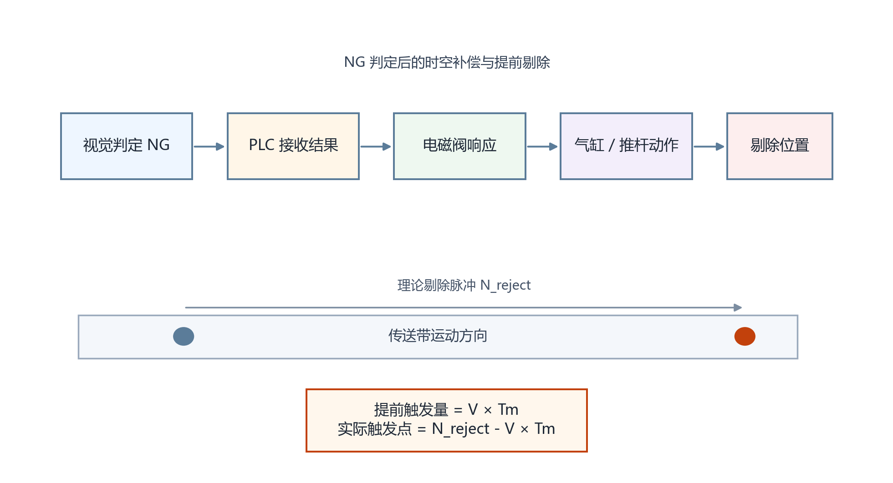

<strong>图 57-1 NG 判定后的时空补偿与提前剔除</strong>

图 57-1 上方依次表示视觉判定、PLC接收结果、电磁阀响应、气缸或推杆动作以及剔除位置，构成了从“判定完成”到“产品被真正碰到”的完整执行链。下方的传送带箭头和理论剔除脉冲位置说明，产品在剔除机构尚未到位之前仍在继续前进，因此触发时刻必须前移；图中给出的提前量 \(V \times T_m\) 正是把机械动作时间转换为空间补偿距离。读者应据此得到一个工程判断：只凭检测点到剔除口的固定距离并不能直接完成剔除控制，还必须叠加执行机构响应时间。该图适用于连续输送、在线剔除场景；若产品在剔除前会被阻挡、定位或夹紧，则补偿方式应按照新的运动状态重新计算。

### 57.5 影响剔除延迟的关键因素有哪些？如何优化？

影响剔除延迟的因素可以分成三类。第一类是信息链路，包括视觉算法复杂度、通信周期和PLC程序扫描时间；第二类是执行链路，包括电磁阀、气源压力、管路长度、气缸规格、负载重量和机械摩擦；第三类是运动链路，也就是产品本身的速度稳定性、传送机构打滑情况和检测点到剔除点之间的距离。

优化思路也应对应展开。如果视觉处理时间过长，可以简化算法、下沉到边缘推理设备，或调整拍照策略减少无效帧；如果电磁阀和气缸动作慢，应优先检查气路设计、阀体响应和负载匹配，而不是只在软件里不断调提前量；如果速度波动大，则应强化编码器闭环跟踪，避免继续用静态时间补偿去硬套变速工况。

### 57.6 在高速生产线上，如何确保剔除精度和可靠性？

高速生产线里的剔除精度，首先依赖产品追踪是否稳定。只要视觉结果和产品身份发生错位，再快的执行机构也只会把错误动作做得更准。因此，视觉判定、产品编号、编码器位置和剔除指令最好在同一套队列逻辑中流转，并对异常样件、重复触发和漏触发设定清晰规则。

可靠性则更多体现在冗余与监测上。例如可以用到位传感器确认气缸是否真正伸出，用回位传感器确认下一次动作前机构已复位，用压力开关监测气源异常，用节拍监视逻辑判断执行机构是否开始滞后。很多剔除不准的问题表面看像“视觉误判”，实则来自机械端动作迟缓、回位不彻底或气路波动，只有把两端信号一起纳入记录，排障才会高效。

### 57.7 现代工业4.0环境下，剔除控制系统有哪些新的发展趋势？

近年的趋势主要体现在三个方向。一是数据化，系统会持续记录剔除动作时间、失败次数、气压状态和节拍变化，用于提前发现电磁阀老化、气缸磨损或剔除精度下降；二是柔性化，剔除机构与产品配方联动，不同型号调用不同提前量、动作宽度或剔除方式；三是集成化，视觉、PLC、机器人和MES之间共享结果与追溯信息，使“哪一件产品因什么原因在何时被剔除”可以回溯到具体批次。

这些趋势的前提依然是基础动作链条已经足够清楚。若现场连延迟分解和补偿逻辑都没有做实，直接叠加所谓智能诊断或数字孪生，只会让系统看上去更复杂，却不一定更可靠。

---

---

## 58. 什么是HMI？视觉系统需要与HMI交互哪些信息？

### 58.1 HMI的基本定义和核心概念是什么？

HMI是人与设备之间交换信息和发出操作指令的界面。在机器视觉系统里，它不只是一个“显示屏”，而是操作员、工程师和维护人员接触视觉系统的主要入口。读者在理解这一概念时，可以把HMI看成两个方向的信息通道：一边把视觉系统的状态、图像、结果和报警呈现给人，另一边把人的操作意图、配方选择和参数修改传回系统。

工业HMI与消费电子界面的差别，在于它首先服务于生产秩序和故障处理，而不是追求炫目的交互效果。一个视觉HMI是否合格，关键要看操作者能否迅速确认当前设备状态、读懂检测结果、处理异常并在权限允许的范围内完成必要操作。

### 58.2 HMI在工业自动化、智能汽车等不同领域的应用特点有何差异？

放到更广的技术背景中看，HMI可以出现在汽车座舱、医疗设备、消费终端等许多领域，但机器视觉教材里更值得关注的是工业自动化语境。工业HMI强调连续运行、角色权限、误操作防护和异常信息的可追溯呈现，界面通常较为克制，布局稳定，颜色与图标的含义也要求长期一致。

这与偏消费场景的HMI不同。后者可以更强调沉浸体验与交互丰富度，而工业视觉HMI首先要回答“产线现在是否能继续跑”“当前报警意味着什么”“这次调参是否会影响生产”。如果把面向普通用户的软件风格直接搬到工业现场，往往会牺牲可读性与可维护性。

### 58.3 视觉系统在HMI交互中扮演什么角色？

视觉系统在HMI中同时承担信息源和业务对象两个角色。所谓信息源，是指它向界面提供图像、定位结果、测量值、OK/NG判定、报警码、统计数据和运行状态；所谓业务对象，是指操作者在HMI上执行的许多操作，最终都指向视觉系统本身，例如切换产品配方、修改阈值、抓拍当前样件、复位报警或保存参数版本。

这意味着HMI设计不能只关心显示效果，还要清楚视觉系统内部哪些数据值得暴露、哪些数据只能读不能改、哪些操作必须记录、哪些结果需要与PLC或制造执行系统（MES，Manufacturing Execution System）保持一致。界面如果脱离这些业务约束，仅仅把数据堆在屏幕上，往往很快就会失去使用价值。

### 58.4 视觉系统需要向HMI提供哪些核心信息？

从工程实践看，视觉系统向HMI提供的信息大体可以分成四层。第一层是运行层，包括当前模式、连接状态、在线工位、节拍、最近一次检测时间和系统健康状态；第二层是结果层，包括OK/NG判定、测量值、定位分数、缺陷类别和合格率统计；第三层是异常层，包括报警码、异常描述、发生时间、处理建议和恢复条件；第四层是追溯层，包括图像存档、批次信息、参数版本和操作日志。

其中最容易被忽略的是“层级”。不是所有信息都应该同等显眼。运行状态和当前报警应处于操作者视线中心，详细日志与历史图像可以放在二级页面，工程参数则应在更高权限下打开。信息分层做得好，界面会显得安静而清楚；做得差，屏幕上虽然内容很多，真正有用的内容反而不容易被找到。

  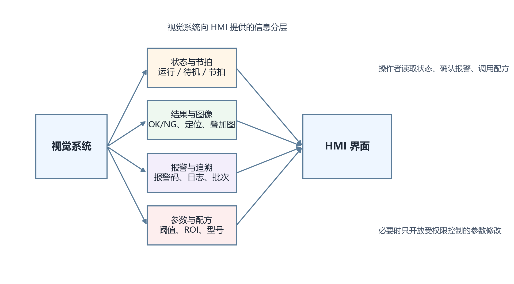

<strong>图 58-1 视觉系统向 HMI 提供的信息分层</strong>

图 58-1 左侧是视觉系统，右侧是HMI界面，中间分成状态与节拍、结果与图像、报警与追溯、参数与配方四类信息通道。这样的分层不是排版动作，而是对现场信息优先级的工程定义：状态层回答设备能否继续运行，结果层服务当前判定，报警层支撑故障处理，参数层则面向受控修改。读者应通过这张图形成一个使用判断，即HMI上的内容不宜按“系统里有什么数据就显示什么数据”来组织，而应按角色和场景来组织。该图适合一般工业视觉系统的人机界面设计；若系统同时承担高阶分析或远程运维任务，还需继续向下细分统计、审计和维护页面。

### 58.5 视觉系统如何从HMI接收用户的交互意图？

在工业现场，最常见的交互方式仍然是触摸屏、实体按钮、旋钮和扫码设备。操作员通过这些输入选择产品型号、确认报警、开始检测或切换页面，工程师则可能进一步进入调参界面修改ROI、阈值和曝光参数。视觉系统接收到的并不是“人的动作”本身，而是被界面翻译后的结构化指令，例如某个配方号、某个布尔开关或某个参数值。

这件事看似简单，实际很依赖输入约束设计。对可导致误判的参数，不应开放成任意自由文本；对必须成组变化的参数，最好作为同一配方整体下发；对生产中不可修改的高级参数，则应通过权限和状态机加以限制。HMI真正接收的不是“所有可能的用户意图”，而是被工程规则筛过一遍、系统能够安全执行的意图。

### 58.6 现代HMI设计中有哪些提升视觉交互效率的关键原则？

机器视觉HMI最值得坚持的原则有三条。其一是信息层级清楚，当前状态、当前结果和当前报警必须在第一眼能看见的位置；其二是操作反馈及时，任何按钮、保存动作、配方切换或报警复位都应立即给出明确反馈，避免操作者重复点击；其三是语义一致，相同颜色、图标和术语在不同页面上不应改变含义。

除此之外，还要注意把现场节拍纳入界面设计。某些页面看上去很完整，但需要多次跳转才能完成一次复位或换型，在产线紧张时并不实用。所谓交互效率，不只是点击次数少，而是让最常见、最关键的现场操作能沿着最短路径完成。

### 58.7 未来HMI与视觉系统交互的发展趋势是什么？

未来的变化主要会发生在数据联动和上下文辅助上，而不是简单把界面做得更花哨。视觉系统将越来越多地把实时图像、结果统计、报警追溯和配方版本与MES、设备运维平台或远程支持系统打通，使HMI既能服务现场操作，也能服务管理和维护。某些高端系统会加入AR辅助维护、远程协助或角色自适应布局，但这类能力只有在基础信息结构清晰的前提下才真正有价值。

对于教材读者，更值得记住的是：HMI的演进方向并不是脱离现场，而是更贴近现场决策链。界面设计越成熟，越能把“状态识别、异常判断、恢复动作、结果追溯”压缩到更短的时间里。

---

---

## 59. 如何在HMI上设计一个便于操作工使用的视觉参数调整界面？（如ROI框、阈值滑块）

### 59.1 什么是HMI界面设计中的“操作工友好”核心原则？

所谓“操作工友好”，并不是把界面做得像消费软件那样热闹，而是让不熟悉底层算法的人也能较稳定地完成必要操作。对视觉调参界面来说，操作者首先要知道自己看到的图像是什么、改动的参数作用在哪一块区域、改完之后系统发生了什么变化，以及如何恢复到之前可用的状态。

这一定义决定了界面设计的重点：把“参数名”翻译成“任务语义”，把“算法变化”翻译成“图像反馈”，把“单次修改”纳入“可回退的配方管理”。如果界面只堆参数而不解释作用区域，操作员通常会靠试错去摸索，既慢，也容易把生产中的稳定参数改坏。

### 59.2 视觉参数调整界面应该采用什么样的整体布局结构？

适合现场使用的布局，通常是“图像为主、参数为辅、结果与日志并列可见”。大面积区域用于显示原图和处理结果，保证操作者调参时始终能看到修改前后差异；侧边或下方放参数控件，把阈值、ROI、曝光或匹配阈值按类别排列；结果区则显示当前分数、轮廓、测量值和OK/NG状态；日志区负责记录保存、加载和报警信息。

这样的布局有一个直接好处：操作者的视线不必在多个页面之间来回跳转。调ROI时可以同时看原图和结果图，调阈值时可以同时看遮罩变化和最终判定，保存配方时也能立刻确认版本和时间。工业界面不怕“朴素”，怕的是关键信息被拆散。

  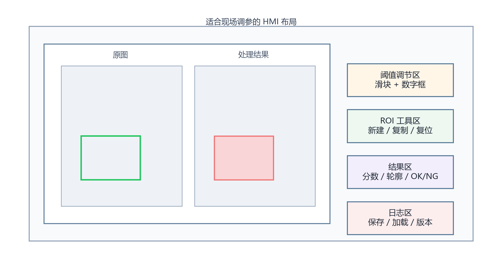

<strong>图 59-1 适合现场调参的 HMI 布局</strong>

图 59-1 左侧主区域分成原图和处理结果两个视图，原图中的绿色框表示当前选中的ROI，结果图中的红色区域表示经过算法处理后被高亮的目标或缺陷。右侧依次布置阈值调节区、ROI工具区、结果区和日志区，体现的是“观察、修改、判断、记录”这一现场调参顺序。读者可据此形成一个明确判断：参数界面不应把图像、结果和保存操作拆散到不同页面，因为那会显著增加调参的认知负担。该图适合说明工控机或高性能视觉终端上的调参界面；若使用低端HMI而无法承载实时图像，则需要把图像显示转移到IPC或智能相机网页端，不能生硬照搬这套布局。

### 59.3 如何在现场让操作工直观地调整ROI和视觉参数？

真正直观的做法，是让ROI与参数变化立刻反映到图像上。操作者拖动ROI边框时，应能看到框的位置、尺寸与覆盖目标是否合理；调节阈值时，应能看到缺陷区域、边缘区域或前景区域是否被正确分离。只显示一个数字变化而没有图像反馈，往往会让人不知道当前修改到底影响了什么。

从架构上看，现场实现通常有三种形态。若视觉程序运行在工控机上，最适合直接在本机界面完成画框与调参；若系统是智能相机，常见做法是HMI嵌入Web或VNC（Virtual Network Computing，虚拟网络计算）页面，远程调用相机内部配置界面；若只能使用较低端HMI，则应把它限制为配方号、阈值值和少量离散开关的修改入口，把实时图像与复杂ROI编辑留给上位机。不是所有屏都适合做图像交互，这一点在方案阶段就应区分清楚。

### 59.4 阈值滑块控件的设计有哪些关键考虑因素？

阈值调节同时追求两件事：拖动时足够快，落点时足够准。仅靠一根滑块很容易完成粗调，却不利于精确落到某个数值；仅靠数字输入框又缺少趋势感。因此，较稳妥的设计是把滑块和数字输入框绑定起来，滑块负责快速扫描区间，输入框负责精调步进，二者始终保持数值同步。

如果参数本身具有上下限关系，例如二值分割中的最小灰度和最大灰度，最好把这两个值独立显示，并在超出有效关系时给出限制或提示。界面层不要把非法区间悄悄吞掉，而应让操作者明确知道当前输入无效。对现场人员来说，清楚地看到边界条件，往往比“系统帮你自动改了个差不多的值”更可靠。

  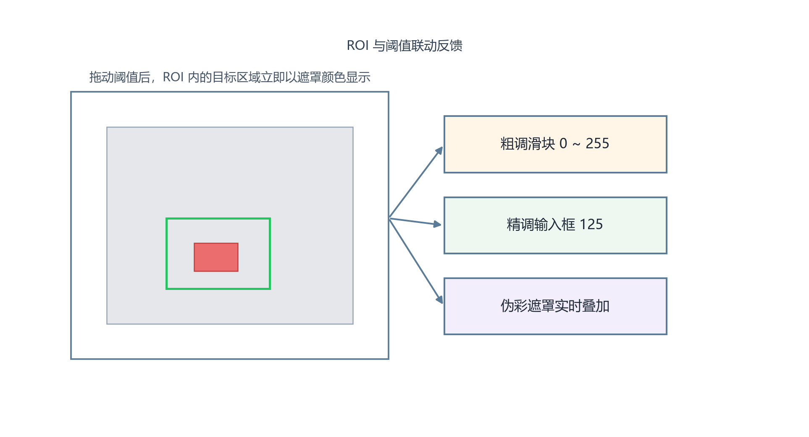

<strong>图 59-2 ROI 与阈值联动反馈</strong>

图 59-2 左侧是当前图像与选中的ROI，中央红色遮罩表示阈值筛选后被识别出的区域；右侧依次放置粗调滑块、精调输入框和实时遮罩反馈说明。图中的重点不是控件本身，而是三者之间的联动关系：滑块负责快速改变阈值，数字框负责精确收敛，而遮罩反馈让操作者立即看到当前阈值究竟把哪些像素纳入了目标。读者应从图中得到一个操作判断，即阈值控件如果没有与结果图联动，只让数值变化而不让图像变化可见，那么调参效率和正确率都会明显下降。该图适用于二值分割、缺陷提取和灰度范围筛选等任务；若算法输出不是区域遮罩，而是模板分数或特征响应，则反馈形式也应改成相应的可视化结果。

### 59.5 如何通过视觉反馈降低操作工的学习成本？

视觉反馈最有价值的地方，在于把抽象参数翻译成可见后果。参数调整后，界面应立刻显示处理结果变化，例如边缘是否闭合、缺陷是否被正确高亮、测量线是否仍压在正确位置上。相比长段文字说明，这种反馈更接近现场人员的工作方式，因为他们最终要判断的是“当前设置能不能把样件看对”。

同时，反馈最好分层。即时图像变化用于帮助理解参数作用，状态指示用于说明当前检测是否通过，提示信息则用于解释为什么当前设置不合理。三者各司其职，界面就会更容易学；若只剩一种红绿灯式反馈，操作者知道“错了”，却未必知道“错在哪里”。

### 59.6 工业环境下需要考虑哪些特殊的界面设计因素？

工业环境与办公室环境差别很大，界面控件尺寸、颜色对比、抗误触设计和权限控制都不能按普通桌面软件处理。触摸操作时，按钮和输入区域要考虑戴手套、手指较粗、屏幕有油污或震动的情况；对影响生产稳定性的参数修改，应增加确认步骤，并限制在停车或维护模式下进行；对普通操作员，不应开放算法拓扑、标定矩阵和底层通信参数这类高风险内容。

此外，界面颜色最好服务于业务含义，而不是仅仅追求美观。绿色、黄色、红色分别用于正常、警告、异常是较容易达成共识的方案，但若系统已在企业内部使用既定规范，就应优先遵守现场规则，避免跨设备时语义混乱。

### 59.7 如何设计参数保存和恢复功能？

视觉调参界面如果没有完善的保存与恢复机制，现场一旦调出问题，往往很难回到此前可用状态。较成熟的做法是以配方为单位保存参数，记录版本号、修改时间、操作者身份和适用型号，并区分“临时调试值”和“正式生产值”。这样即使有人在试产阶段做了调整，也不会直接覆盖已经验证过的生产参数。

恢复功能不能只提供一个“默认值”按钮，而应支持载入上一稳定版本、指定产品配方或最近一次备份。对于关键参数，最好在保存前提示变更内容摘要，让操作者知道本次到底改了哪些项。把修改记录留清楚，后续排障时会轻松很多。

### 59.8 如何评估和优化视觉参数调整界面的用户体验？

评价这类界面，不必借助过多抽象术语，直接观察几个问题即可：新人是否能在较短时间内完成一次标准调参；误改高风险参数的概率是否下降；从报警到恢复生产所需步骤是否足够短；同一配方在不同人手里是否容易保持一致。若这几项表现不好，说明界面虽然能用，但还不够适合现场。

优化时，应优先修正高频任务路径，而不是先去美化低频页面。例如把最常用的抓图、加载配方、恢复版本和进入调参模式放到更明确的位置，往往比增加额外说明文字更有效。对工业视觉界面来说，体验提升的标准不是“像不像现代软件”，而是“现场是否更少出错、恢复是否更快、交接是否更顺”。

---

---

## 60. 生产换型时，视觉系统如何快速切换程序和参数？PLC如何配合？

### 60.1 为什么生产换型对视觉系统提出了特殊的技术要求？

换型意味着同一条设备要在较短时间内从一种产品切到另一种产品，变化的不只是外形尺寸，还可能包括拍照位置、光源亮度、判定阈值、模板类别、测量公差、夹具姿态和机器人动作。若视觉系统仍靠工程师逐项手改参数，换型时间会很长，且容易把某些关键项漏掉，导致首件误判、节拍下降甚至机械干涉。

因此，换型能力本质上是在考验系统是否真正“参数化”。如果程序结构里把型号差异写死在代码和界面里，产品种类一多，维护很快会失控；如果程序与参数边界清楚，换型就能收敛为一次受控的配方切换与设备联动。

### 60.2 视觉系统快速切换的核心技术架构是什么？

较成熟的架构是“稳定程序框架 + 可版本化配方数据”。程序负责完成通用流程，例如取图、定位、测量、判定和结果上报；配方负责描述当前产品的具体参数，包括ROI、模板、阈值、公差、曝光、增益、光源强度和判定策略。这样换型时无需改程序本体，只需调用不同配方。

当产品差异较大时，还可以把程序拆成模块化流程，例如统一定位模块后挂接不同测量模块或缺陷模块。即便如此，也应尽量维持相同的配方结构，便于PLC、HMI和MES在上层按同样方式管理。换型效率高低，往往取决于这套数据结构是否从一开始就设计得规整。

### 60.3 视觉系统有哪些具体的快速切换技术手段？

常用手段包括配方数据库、模板库、参数分组和产品族管理。配方数据库负责保存每个型号的完整参数；模板库用于存放不同产品对应的参考图像、特征模板或分类模型；参数分组有助于把相机、光源、定位和判定参数分层管理，避免界面上出现庞杂无序的参数列表；产品族管理则适合在多个相近型号之间共享大部分参数，只覆盖少量差异项。

此外，若设备具备统一的机械坐标基准，视觉系统还应尽量把型号差异收敛到偏移量和公差层面，而不是为每个型号复制一整套完全独立的流程。前者更便于维护，也更容易做批量校验。

### 60.4 PLC在视觉系统快速切换中扮演什么角色？

PLC在换型中承担协调者的角色。它一边接收HMI或MES发来的型号切换指令，一边控制夹具、传送带、挡停机构、机器人或转盘等硬件状态进入对应配置，同时向视觉系统下发配方号、等待加载完成信号，并在自检通过后才允许重新启动生产。

这说明PLC的任务不只是“通知视觉切参数”，而是保证整条设备在同一时刻进入同一型号状态。若视觉已经切到新配方，而机器人还在旧夹具姿态，或者光源尚未切换到对应亮度，就会出现首件误判甚至碰撞风险。换型质量往往取决于这种跨设备状态一致性。

### 60.5 PLC与视觉系统之间如何进行通讯和数据交换？

在常见实现里，PLC与视觉系统通过TCP/IP、Modbus TCP、OPC UA、PROFINET、EtherCAT 或数字I/O 完成数据交换。具体采用哪一种方式，要看实时性要求、现场既有架构和维护能力。对换型任务本身而言，最关键的不是协议名字，而是交互内容是否定义清楚。

至少应明确这些字段：PLC下发的型号编码、配方编号、批次号和启动命令；视觉返回的配方加载完成、参数校验通过、检测就绪和当前版本号；必要时还要返回首件结果、异常码和失败原因。只传一个“开始”位和一个“完成”位的粗糙接口，在换型场景中通常不够用，因为它无法解释为什么切换失败、失败停在哪一步。

### 60.6 什么是“一键换型”技术？如何实现？

所谓一键换型，不是按一个按钮之后系统神奇地自动正确，而是把换型流程预先拆成一组可验证的自动步骤，并由HMI、PLC、视觉和执行机构按固定顺序完成。操作者在界面选择目标型号后，PLC下发对应配方号，视觉系统加载参数，机器人与夹具进入相应状态，随后系统执行参数版本校验、设备原点检查和首件确认，全部通过后才进入正式生产。

这里的难点不是“自动调用配方”本身，而是自动步骤之间必须有清晰的完成判据。例如视觉的“加载完成”要能证明关键参数已到位，机器人“切换完成”要能证明姿态已进入安全区，首件确认也应留有明确记录。没有这些判据，一键换型只是把人工操作藏到了自动流程后面，风险并没有真正减少。

  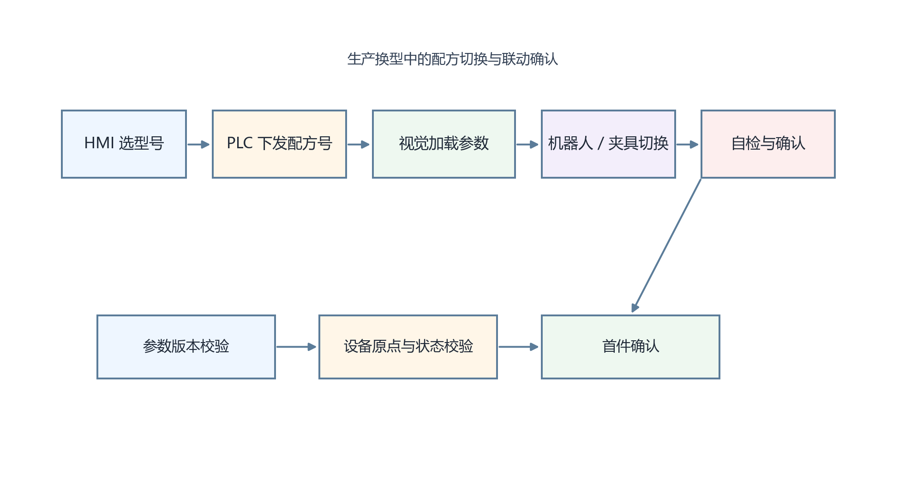

<strong>图 60-1 生产换型中的配方切换与联动确认</strong>

图 60-1 上方给出换型的主流程：HMI选择型号后，PLC下发配方号，视觉系统加载参数，机器人或夹具切换到对应状态，最后进入自检与确认。下方补充的是三个常被忽视的验证环节，即参数版本校验、设备原点与状态校验以及首件确认，它们共同决定自动换型能否真正落地。读者应从图中得出一个工程判断：换型的本质不是“把参数切过去”，而是让软件配置与物理设备状态同时切换并被验证。该图适用于多设备联动的产线换型；若系统结构简单，只有单机视觉加手动夹具，也仍建议保留版本校验和首件确认，只是流程可以更简化。

### 60.7 如何通过MES系统实现更高层次的智能换型？

当MES参与进来后，换型不再只是现场设备之间的协同，还会与生产计划、批次管理和质量追溯相连。MES可以把当前工单对应的型号、批次和工艺版本下发给PLC与视觉系统，并记录实际启用的配方版本、切换时间、操作员身份和首件确认结果。这样，后续若出现质量波动，就能追溯到具体换型事件，而不是只知道“那天换过一次产品”。

不过，MES的价值建立在现场编码规则一致、版本管理清楚的基础上。若车间里同一型号在PLC、视觉和MES三边的编号并不一致，MES接入后不仅不会提升自动化，反而会放大映射错误。因此，智能换型先是数据治理问题，后才是系统集成问题。

### 60.8 在实际应用中，快速换型系统面临哪些技术挑战？

最常见的挑战有四类。第一类是参数兼容性，某些型号差异看似很小，实际上已超出同一算法参数族的适用边界；第二类是状态同步，视觉已切到新配方，但机械、光源或上料姿态未同步切换；第三类是版本失控，现场有人复制旧配方临时修改，却没有留下清楚记录；第四类是首件验证不足，系统形式上完成了换型，真正上料后才发现定位不稳或判定阈值不合适。

这几类问题没有哪一项能靠单一功能彻底解决。工程上更有效的做法，是把换型流程拆解成可观测、可回退、可审计的步骤，让每一步都能被确认、记录和必要时撤销。换型速度当然重要，但如果为了速度牺牲状态一致性和版本可追溯性，后续返工成本通常更高。

---
