# 6. PLC、I/O与通信（第41—50问）

> **网络署名：LanQS** · 作者及著作权人：兰青松 · [版权说明](copyright.md)

本节从完整的触发—拍照—处理—输出流程出发，讨论硬触发、电气接口、结果回传、Modbus与工业以太网等通信方式。

## 41. PLC在视觉系统中最核心的作用是什么？请描述一个完整的“触发-拍照-处理-输出”协同流程。 { #q41 }

### 41.1 什么是PLC？它在工业自动化中扮演什么角色？
PLC（可编程逻辑控制器）是为工业现场长期连续运行而设计的控制器。它通过可编程存储器执行逻辑运算、顺序控制、定时、计数和算术运算，再借助数字量或模拟量输入输出去驱动传感器、执行器、电机、阀岛、变频器以及上位设备。

放到机器视觉系统里，PLC最核心的价值在于把视觉单元纳入整条产线的时序与执行闭环，而非替代视觉算法。相机何时拍、结果何时收、剔除何时动作、故障何时停机，这些都需要由PLC或与PLC同级的运动控制单元来协调。视觉负责看清对象并给出判定，PLC负责把这个判定变成可执行、可追踪、可联锁的工业动作。

### 41.2 视觉系统在工业自动化中主要完成哪些任务？
工业视觉系统承担的是非接触式感知与判定任务，常见工作包括有无检测、缺陷识别、尺寸测量、字符识别、条码读取、定位引导和分拣判定。它通过工业相机采集图像，再由视觉处理器或智能相机内部算法完成分析，最终输出OK/NG、位置坐标、尺寸数据或缺陷类别。

视觉系统在工程上通常嵌入自动化节拍中的某个判定节点。只有当它和PLC、触发传感器、编码器、剔除机构之间的时间关系建立起来之后，检测结论才真正具备生产意义。

### 41.3 工业相机核心参数选型指南
在传感器类型和接口协议大致确定之后，工业相机选型通常首先看快门类型、分辨率、帧率、像元尺寸、靶面尺寸和接口能力。其中，快门类型对场景适配性的影响最大，后期替换代价也最高；靶面尺寸、接口兼容性和像元尺寸一旦选错，往往不是调参数可以补回来的问题。

##### （1）快门类型（Shutter Type）
全局快门（Global Shutter）在同一曝光窗口内同步记录整帧，适合传送带飞拍、机器人运动取像和所有对几何形状稳定性有要求的场景。卷帘快门（Rolling Shutter）逐行曝光，成本较低，同尺寸下常能提供更高分辨率，适合停机检测、低速检测或对几何畸变不敏感的应用。

卷帘快门并不意味着一定不能用于工业现场，但必须把目标速度、行曝光周期、允许畸变程度和最终判定指标放在一起评估。如果检测依赖尺寸、角度、轮廓位置或缺陷边界，通常应优先采用真全局快门。部分高端CMOS采用全局复位卷帘结构，可以减轻部分运动失真，但在严格的高速运动检测里，它仍不等同于全局快门。

##### （2）飞拍（On-the-fly imaging）特殊要求
飞拍是指目标在运动过程中完成曝光采集。除了采用全局快门，还需要将相机曝光与高亮频闪光源同步，并把曝光时间压到足够短，使曝光期间的位移不致超过允许模糊量。若把运动模糊简化为线位移，可写成

$$
\Delta x = v t_{exp}
\tag{31-1}
$$

其中，$\Delta x$ 为曝光期间的位移，$v$ 为目标相对速度，$t_{exp}$ 为曝光时间。式（41-1）给出的不是完整成像模型，却足以说明飞拍设计的第一层约束：速度越高，允许的曝光时间越短；如果光通量又不足，就必须从频闪功率、镜头通光量和安装几何一起补偿，而不能只把曝光一味拉长。

### 41.4 工业镜头核心选型原则
镜头选型除了焦距、工作距离和光圈之外，最容易把系统直接做错的有两件事：像场是否覆盖传感器靶面，以及镜头在目标空间频率上的成像能力是否配得上相机像元。

  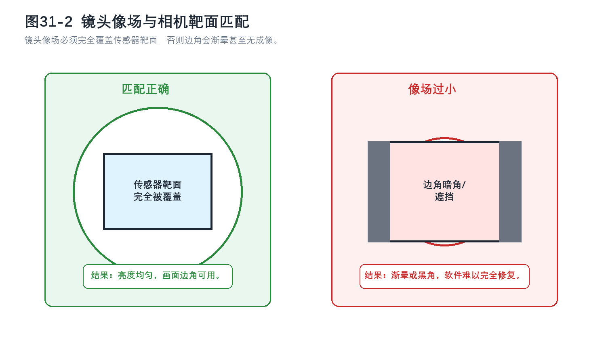

<strong>图 41-1 镜头像场与相机靶面的覆盖关系</strong>

这张图真正帮助读者判断的是像场能否覆盖传感器的有效成像区域。若镜头像场小于靶面对角线，边缘会先出现亮度下滑，再进一步演变为暗角甚至无成像区。对测量、缺陷检测和OCR来说，这类问题属于光学覆盖边界失配，后端算法无法可靠补回。图中最值得注意的是外圈与靶面边界的相对关系；只要覆盖不足，后续再讨论快门、分辨率或算法，都已经建立在失配前提上。

##### （1）像场匹配原则（Image Circle Matching）
镜头规格书中的最大支持靶面必须大于或等于相机传感器的实际靶面尺寸。这里的“1英寸”“2/3英寸”等标称是历史延续下来的工业习惯，并不等于真实几何尺寸，工程上应以规格书中的传感器宽、高、对角线数值为准，而不是按字面英寸换算。

如果用最大只支持$1/2"$的镜头去覆盖$1"$靶面，系统往往先在四角出现渐晕和分辨率下降，严重时边缘根本没有可用成像。对初学者来说，最值得记住的一点是：镜头像场覆盖不足属于前端光学失配，软件增强无法从根本上补回缺失的成像区域。

##### （2）光学分辨率匹配原则
镜头不只要看得到，还要在相机采样极限附近保留足够对比度。相机的奈奎斯特频率可近似写成

$$
f_N = \frac{1000}{2p}
\tag{31-2}
$$

其中，$f_N$ 的单位为 lp/mm，$p$ 为像元尺寸，单位为 μm。式（41-2）描述的是传感器的理论采样边界，而不是镜头天然就能达到的光学能力。工程上常把 0.7f_N 左右作为重点核查频率点，并查看镜头在该频率附近的MTF是否仍有足够余量。对一般检测任务，MTF约 0.2 可视作基础可用门槛；若是高精度测量或边缘定位，通常希望更高。

例如，像元尺寸为 2.4 μm 的相机，其奈奎斯特频率约为 208 lp/mm。如果镜头在这一频率附近的MTF已经明显衰减，那么即使相机像素数很高，系统的有效细节恢复能力仍然受镜头限制。

### 41.5 典型“触发-拍照-处理-输出”协同工作流程
PLC与视觉系统的协同，最容易在概念上被讲乱的地方，是把拍照触发与结果回传当成同一条链路。实际工程里，这通常是两条时间尺度不同、实现方式也不同的链路：前者负责在正确的物理时刻曝光，后者负责把检测结论送回控制器并驱动后续动作。

  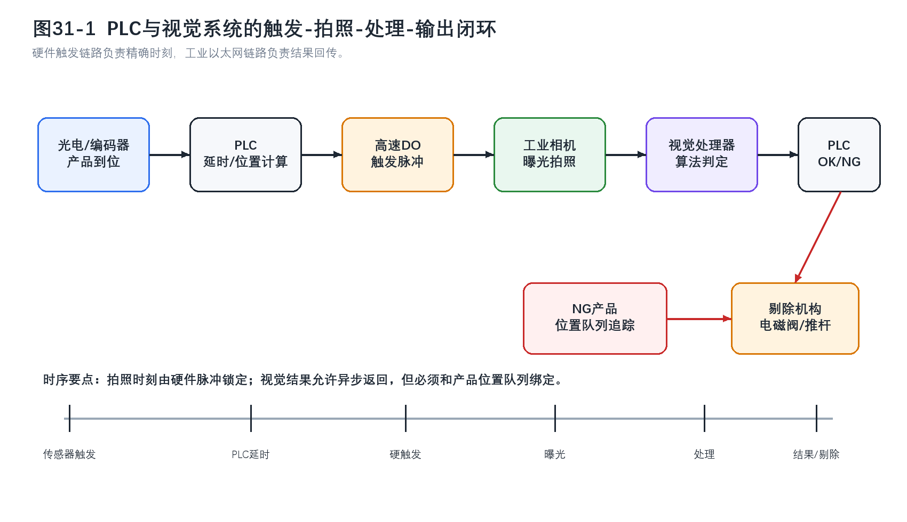

<strong>图 41-2 PLC与视觉系统的“触发-拍照-处理-输出”闭环</strong>

图中上方主链路对应的是一次检测任务从到位感知到结果判定的顺序关系，下方则补出了很多初学者容易忽略的位置队列环节。拍照时刻由硬件触发脉冲锁定，视觉判定结果可以稍后异步返回，但这个返回值只有和产品位置队列重新绑定，PLC才能在正确工位对正确对象执行剔除。读者应从这张图里建立一个基本判断：曝光需要时间确定性，结果通信更看重可靠回传，而剔除动作真正依赖的是“结果”和“位置”两件事同时对上号。

### 41.6 触发阶段：PLC如何精确控制拍照时机？
触发阶段的任务是把“产品到位”转换成“相机在正确时刻曝光”。常见实现路径是由光电传感器检测产品前沿，再由PLC结合编码器脉冲、传送带速度或运动轴位置，计算目标进入最佳拍照区的延时或位置偏置，随后由高速输出或专用比较输出发出触发脉冲。

这里要避免一种常见误解。普通PLC数字量输出未必能稳定承担高速拍照触发任务。它会受到扫描周期、输出模块响应和程序结构影响，很多场景只能给出毫秒级的确定性；若产线节拍高、视场小或目标速度快，通常需要高速计数模块、运动控制器比较输出、编码器分频触发，或支持分布式时钟的同步方案。微秒级甚至更低的触发抖动，往往依赖于整条链路都按高精度同步设计，单纯更换更高档的PLC并不能自动解决问题。

### 41.7 拍照阶段：相机如何响应PLC的触发信号？
相机收到外部触发后，会按预设模式启动一次曝光。曝光结束后，很多工业相机会通过Strobe输出或曝光完成信号给出硬件时序反馈，用于指示真实曝光窗口，同时图像数据开始进入传输链路。这里要分清两个层面：触发输入决定何时开始曝光，数据接口决定图像如何传出，这两者属于不同的链路。

对工程调试来说，Strobe信号尤其有价值。它能帮助现场人员确认PLC认为的触发时刻，是否真的对应到相机实际曝光时刻；在高亮频闪场景中，它还常被用来同步光源驱动，避免光脉冲和曝光窗口错位。

### 41.8 处理阶段：视觉系统如何分析图像并将结果反馈给PLC？
视觉处理器收到图像后，会执行边缘检测、模板匹配、OCR、缺陷检测或深度学习推理等算法，并把结论组织成PLC可直接使用的字段，例如OK/NG、尺寸值、缺陷类别、位置坐标和故障代码。结果回传通常通过工业以太网、现场总线或设备内部I/O完成。

不同协议名本身并不自动代表固定延迟。PROFINET、EtherNet/IP、EtherCAT、Modbus TCP 的真实周期与抖动，取决于控制器性能、协议模式、网络拓扑、从站能力和现场负载。写书时最稳妥的说法，是把协议理解为实现路径，再把实时性判断交回到系统实测。对多数产线项目而言，几十毫秒级的传统算法处理很常见；若涉及较重的AI推理，延迟可能跨越从十几毫秒到数秒的范围，必须与节拍预算一起设计。

### 41.9 输出阶段：PLC如何根据视觉结果控制后续动作？
PLC收到视觉结果后，会先校验结果是否有效，再判断这份结果应当绑定到哪一个产品对象上，而非立刻无条件动作。对合格品，系统通常继续放行并做计数、统计或追溯；对不合格品，PLC会结合编码器位置或移位寄存器状态，在产品真正移动到剔除工位时驱动气缸、推杆、分拣门或机械臂完成剔除。

这一步的本质，是把图像空间中的判断重新落到物理流水线中的具体对象。若系统只做了检测判定，却没有建立稳定的对象追踪，最终就会出现“判错对象”或“剔错对象”的问题。很多现场故障看起来像视觉误判，根源其实出在结果与位置绑定失效。

### 41.10 实际工程应用中的主要技术挑战
第一类挑战是时序精度。目标速度一高，允许的曝光误差就会迅速缩小，触发延时、输出抖动、频闪光源响应和相机内部时序都会开始影响结果。第二类挑战是通信确定性。视觉结果回传若不稳定，PLC就无法准确判断何时执行剔除或联锁。第三类挑战是多设备同步，多相机、多光源、机器人和编码器一旦混在同一个系统里，时间基准必须统一。

除此之外，工业环境中的电磁干扰、温升、振动、粉尘油污，以及超时、断线、误触发等异常工况，也会让理论上看似清晰的流程在现场变得脆弱。因此，真正成熟的视觉闭环系统不止要完成算法部署，还包括触发、通信、抗干扰、异常恢复与数据追溯的系统性设计。

### 41.11 工业4.0环境下的集成发展趋势
从系统形态看，视觉与PLC的协同正在向更集成但并不更模糊的方向发展。智能相机内置规则逻辑和有限I/O，适合小型单工位检测；工业PC与边缘设备可在本地承载AI模型，降低上传原始图像的带宽压力；OPC统一架构（OPC UA，Open Platform Communications Unified Architecture）更适合承担控制层之上的语义化数据交换；数字孪生和离线仿真则把原来必须在现场反复试错的部分，前移到虚拟调试阶段。

但无论系统形态如何变化，有一条工程主线并没有改变：只要拍照时刻仍然直接影响位置精度、几何稳定性或节拍一致性，触发链路就仍然需要被当作独立的硬实时问题处理。这一判断会在第42节的硬触发与软触发比较中进一步展开。

---

---

## 42. 什么是硬触发？什么是软触发？为什么工业现场主流使用硬触发？ { #q42 }

### 42.1 什么是硬触发（Hard Trigger）？
硬触发是通过外部硬件信号直接控制相机开始曝光的方式。触发源通常来自光电传感器、接近开关、编码器分频器、PLC高速输出或运动控制器比较输出，触发信息以电脉冲的形式送入相机硬件I/O，再由相机在设定模式下执行曝光。

硬触发的价值，在于触发时刻和物理事件之间的关系稳定、可测、可重复，远不只是响应速度快。只要链路设计得当，相机每次曝光都可以和产品到位、轴位置、编码器计数或统一时钟建立明确对应关系。

### 42.2 什么是软触发（Soft Trigger）？
软触发是通过软件命令、软件开发工具包（SDK，Software Development Kit）调用或通信协议栈下发拍照指令的方式。控制软件向相机发送“执行一次采图”的请求，相机收到命令后再开始曝光。它的优势在于系统搭建和逻辑修改更方便，研发、实验室调试和低速检测场景中尤其常见。

软触发的弱点也恰恰来自这条命令链路本身。触发命令需要经过操作系统调度、驱动、协议栈、总线或网络传输，再由相机侧解析执行，因此它更容易受软件负载、网络拥塞和系统状态波动影响。

### 42.3 硬触发和软触发的核心区别是什么？
最根本的区别在于触发时刻是否由硬件时序直接锁定。硬触发靠物理信号到达相机I/O决定曝光起点，软触发靠软件命令被系统调度并最终送达相机决定曝光起点。前者更容易获得确定性，后者更容易获得灵活性。

从工程语言看，硬触发关注的是延时和抖动是否足够小、是否可重复；软触发关注的是系统集成是否方便、逻辑是否易改、研发和调试是否高效。两者服务于不同的时间约束，没有谁绝对先进。

  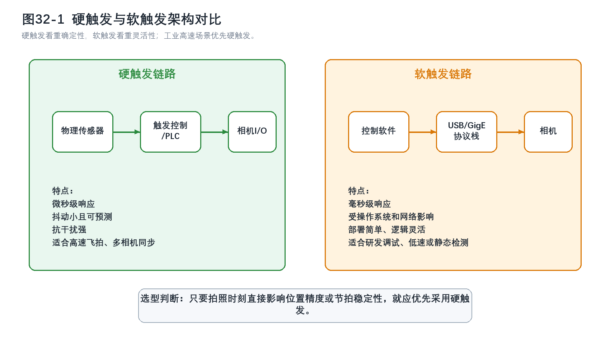

<strong>图 42-1 硬触发与软触发架构对比</strong>

图中左侧的硬触发链路更短，控制量在传感器、PLC或运动控制器与相机I/O之间闭合，因此曝光时刻更容易被测量和校准；右侧的软触发链路多经过一层控制软件和协议栈，这正是它灵活但不够稳定的来源。读者读这张图时，不应只停留在“左边快、右边慢”的印象上，更应看到两种方式的误差来源不同：硬触发主要受硬件链路和同步设计约束，软触发则额外受操作系统、驱动和通信负载影响。只要拍照时刻直接影响位置精度或高速节拍，图中的左侧链路通常才是主流工程选择。

### 42.4 工业现场为什么主流使用硬触发？
工业产线需要在长时间运行中持续在正确位置拍对，而不仅仅是偶尔拍对。只要检测对象在运动、相机视场较小、缺陷尺寸较细或多设备需要同步，拍照时刻就会直接影响判定可靠性。硬触发更适合这类任务，因为它更容易把曝光时刻稳定在较小的误差带内。

此外，硬触发绕开了操作系统调度和网络负载的不确定性，更利于实现多相机同步、飞拍冻结和节拍锁定。工业现场更关心行为的确定性。软触发哪怕平均延时不大，只要抖动不可控，就可能在边界工况下造成明显误差。

### 42.5 硬触发在工业视觉中的典型应用场景有哪些？
典型场景包括高速传送带检测、机器人运动取像、多相机同步拍摄、编码器锁相飞拍以及恶劣环境中的稳定到位检测。只要系统需要把某个物理事件精确映射成一次曝光动作，硬触发通常都更合适。

例如，在高速包装线上，产品前沿经过传感器的瞬间只是一个“到位起点”，PLC或运动控制器还要进一步换算成目标进入最佳拍照区的延时，再用硬件脉冲发给相机。如果改用软触发，命令路径中的随机波动往往会直接转化成成像位置误差。

### 42.6 软触发在什么情况下更适合使用？
软触发并不是无用，它在研发调试、低速静态检测、人工触发采图、离线实验和对时序精度要求不高的场景中仍然很方便。若目标基本静止、视场较大、拍照时刻只需大致正确，软触发可以显著简化系统搭建。

在一些混合系统中，硬触发与软触发也会并存。高速自动检测工位用硬触发保证节拍和位置精度，人工复检、抽检或维护模式则保留软触发，便于工程师单步采图和排障。对这类系统而言，更重要的是把不同模式的使用边界写清楚。

### 42.7 现代工业视觉系统中硬触发和软触发的融合趋势是什么？
近年的融合趋势主要体现在三方面。其一，相机和视觉控制器越来越多地同时支持硬触发与软触发，便于在自动运行与维护调试之间切换。其二，事件驱动架构更常见，硬件触发负责锁定曝光，软件流程负责处理、记录和上报结果。其三，时间敏感网络（TSN，Time-Sensitive Networking）、分布式时钟和本地边缘计算改善了控制网络的时间一致性，但它们并不自动替代相机硬件I/O在曝光级时序控制中的作用。

因此，融合趋势并不意味着硬触发会退出工业现场。更常见的结果，是系统把硬触发用于关键物理时刻，把软触发用于管理、调试或非关键时序任务。时间要求越严苛，这种分工就越有必要。

---

---

## 43. 硬触发通常使用什么电平信号？（如NPN/PNP，24V） { #q43 }

> 术语归属说明：NPN/PNP描述的是传感器输出晶体管的导通方式；源型/漏型、共阳/共阴则常用于描述PLC或相机输入模块。不同厂家中文手册的叫法并不完全统一，因此工程接线不能只凭名词猜测，必须回到端子图、允许输入电压和公共端定义。对学生来说，更稳妥的判断方法是先看公共端和有效电平：与 PNP 输出配套的输入端通常以 0V 为公共参考，与 NPN 输出配套的输入端通常把公共端接到 +24V 一侧。

### 43.1 什么是硬触发，它在工业应用中起什么作用？
硬触发的本质，是用一个明确的电平变化或边沿变化去命令相机执行一次曝光。在工业应用里，这个电平信号通常来自光电传感器、接近开关、编码器分频器或PLC高速输出，它把“产品到位”“轴到位”或“达到某一计数位置”这样的物理事件，转换成相机可识别的电气触发条件。

因此，硬触发信号本身虽然只是一个电脉冲，但它承担的是时间基准的角色。只要电平类型、输入极性或电压等级判断错误，系统轻则不触发，重则直接损坏输入端。

### 43.2 硬触发信号的电平类型有哪些主要分类？
从相机或输入模块角度看，最常见的触发条件是高电平有效、低电平有效、上升沿触发和下降沿触发。高低电平决定的是稳态有效区间，边沿触发决定的是在电压跳变瞬间启动动作。多数工业相机都允许在参数里选择触发边沿，而具体应该选哪一种，要与传感器输出形式、PLC程序逻辑和抗干扰策略一起确定。

工程上真正值得优先确认的是两件事：一是相机输入能接受多高的电压，二是这路输入要求公共端如何连接。仅仅说“24V触发”远远不够，因为很多相机GPIO并不直接耐受24V宽压输入。

### 43.3 PNP和NPN传感器在硬触发中如何对应不同的电平信号？
PNP输出在触发时通常由OUT端向外提供正电压，常见表现是输出接近 +24V；NPN输出在触发时通常把OUT端拉向 0V。也可以把它们理解成：PNP更像“把高电平送出去”，NPN更像“把信号线拉低”。

但这一判断只描述了传感器的行为，还不足以决定接线方式。PLC或相机输入端的公共端若定义相反，NPN/PNP与输入模块就无法正确配对。工程上必须把“传感器输出行为”和“输入端公共端要求”同时看清，才能真正得到可用接线。

  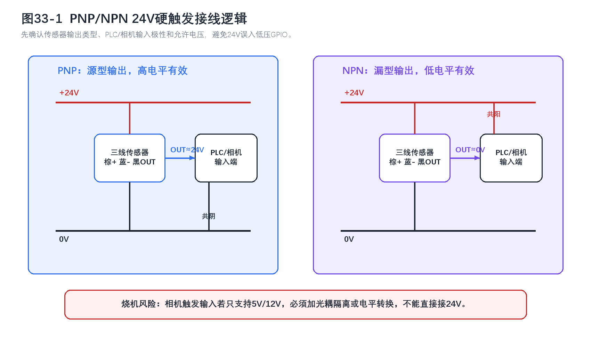

<strong>图 43-1 PNP与NPN硬触发接线逻辑</strong>

这张图最值得读者核对的是公共端到底接在哪里。左侧PNP链路在触发时把OUT推到高电平，因此输入端通常以0V为参考；右侧NPN链路在触发时把OUT拉向低电平，因此输入端通常需要把公共端接到+24V一侧。图底部额外强调了相机通用输入输出口（GPIO，General Purpose Input/Output）耐压问题，因为很多现场故障并非逻辑判断出错，而是把24V直接送进只允许5V或12V的触发输入。读者在实际接线时，应先确认设备手册中的输入耐压、输入电流和端子极性，再决定是否需要光耦隔离或电平转换。

### 43.4 工业应用中常见的硬触发电压标准是什么？
在工业自动化现场，24V DC 是最常见的控制电压标准。它兼顾了布线距离、抗干扰能力和现场供电体系的一致性，因此传感器、PLC输入输出、电磁阀和大量控制附件都围绕24V展开。

但不能把“现场主流是24V”误读成“相机输入一定能直接接24V”。很多工业相机的触发输入内部是光耦或TTL级输入，可能只允许 5V、12V，或要求外接限流电阻。相机是否支持 5-24V 宽压输入，必须由厂家手册确认。

### 43.5 硬触发信号的触发方式有哪些变化模式？
常见模式包括上升沿触发、下降沿触发、高电平保持有效和低电平保持有效。对相机采图而言，最常用的仍是边沿触发，因为它更适合把一次明确的物理到位事件映射成一次曝光动作。保持电平方式则更适用于触发窗口、门控曝光或某些持续有效的控制条件。

边沿怎么选，不能只凭经验沿用上升沿。若系统中电缆较长、噪声较大、回路上存在继电器或机械触点，就要同时考虑毛刺方向、去抖参数和输入滤波时间。否则相机可能表现为边界工况下的偶发多触发或误触发。

### 43.6 硬触发信号在工业相机中的具体应用是怎样的？
在工业相机上，外部触发通常通过多芯I/O接口或专用Hirose接口接入。传感器或PLC输出一个满足电平和边沿条件的脉冲，相机在检测到该脉冲后启动一次曝光。若系统还使用频闪光源，相机的Strobe输出又会进一步驱动光源控制器，使光脉冲与曝光窗口重合。

这说明相机端至少存在两种不同的硬件信号角色：一路是Trigger In，用来命令相机何时拍；另一路是Strobe Out，用来告诉外部设备相机何时真正处于曝光状态。把这两路信号混为一谈，是现场时序调试中很常见的误区。

### 43.7 硬触发接线时需要注意哪些关键电气参数与“烧机”风险？
最致命的风险来自输入耐压和输入电流不匹配。若相机触发输入只支持 5V 或 12V，却把24V传感器或PLC输出直接接上，轻则输入光耦损坏，重则整路GPIO报废。接线前必须逐项核对允许输入电压、输入电流、公共端定义、是否内置限流以及是否需要隔离。

第二类风险来自极性和公共端错误。PNP/NPN只说明传感器输出行为，真正能否被PLC或相机识别，还要看输入模块是共阳还是共阴。第三类风险来自毛刺、机械弹跳和浪涌。机械触点闭合会出现抖动，需设置合适的去抖时间；电磁阀线圈断电则会产生反向感应电压，必须配续流二极管、TVS或RC吸收网络，避免把浪涌打回PLC输出模块。

### 43.8 硬触发与软触发相比有哪些优势和局限性？
硬触发的优势在于触发时刻更容易稳定，系统抗干扰更强，也更适合与编码器、运动轴或统一硬件时钟配合。局限则在于布线、隔离、电平匹配和现场调试要求更高，改动触发逻辑时不如软触发灵活。

因此，硬触发的工程定位应当落在“拍照时刻本身是否构成精度来源”这一判断上。只要答案是肯定的，就必须优先保证这条链路的确定性；若只是偶发采图、人工操作或研发验证，软触发的便利性仍然很有价值。

---

---

## 44. 请画图或描述PLC、光电传感器、视觉系统、剔除装置之间的接线和控制逻辑。 { #q44 }

### 44.1 PLC、光电传感器、视觉系统、剔除装置在工业自动化中各自扮演什么角色？
在这类典型的检测剔除系统里，光电传感器负责感知对象是否进入检测区，PLC负责建立时序、位置与动作逻辑，视觉系统负责给出判定结果，剔除装置负责把判定结果落实成物理动作。四者并排摆在图纸上看起来只是几类设备，真正协同时却构成了完整的质量控制闭环。

若把职责说得更细一些，光电传感器是“到位事件的入口”，视觉系统是“内容判断的入口”，PLC是“时间和对象绑定的中枢”，剔除装置是“最终执行端”。只要其中任何一环没有和对象位置对上号，系统就可能出现误剔、漏剔或错剔。

### 44.2 光电传感器如何与PLC连接？有哪些常见的接线方式？
三线式传感器通常以棕线接 +24V、蓝线接 0V、黑线作为OUT信号输出。PNP输出传感器在动作时输出接近 +24V，PLC输入公共端通常接 0V；NPN输出传感器在动作时把OUT拉到 0V，PLC输入公共端通常接 +24V。但这只是最常见的做法，真正接线仍必须以PLC输入模块端子图为准。

写书时最好顺手提醒读者一个常见坑：不同品牌会分别用“源型/漏型”“共阳/共阴”“sourcing/sinking”描述模块，翻译上也并非始终一致。工程接线若只记住名词而不看端子图，很容易把逻辑理解对了、线却接反了。

### 44.3 视觉系统如何与PLC通信？有哪些常见的通信协议？
视觉系统与PLC之间的结果交换，多通过工业以太网或现场总线完成。PROFINET适合西门子体系下的周期性I/O交互，EtherNet/IP常见于罗克韦尔体系，EtherCAT在高速同步控制里更常见，Modbus TCP实现简单但实时性和诊断能力通常较弱。若系统需要把检测结果进一步交给MES、SCADA或上位数据库，则往往会在控制层之上再引入OPC UA或其他信息化接口。

协议名本身不能直接代替实时性结论。是否足够快、足够稳，要结合PLC扫描周期、视觉控制器支持的通信模式、网络拓扑、交换机配置和产线节拍一起评估。

### 44.4 剔除装置如何与PLC连接？不同类型的剔除装置有什么接线差异？
最常见的剔除机构是气缸加电磁阀。PLC输出点控制电磁阀线圈得失电，电磁阀再控制压缩空气进入气缸，实现推杆吹除、挡门分流或顶升剔除。若采用伺服电机或电动推杆，PLC则可能通过脉冲、总线命令或模拟量去控制驱动器，再由驱动器执行具体位置动作。

这里最值得读者建立的工程意识是：剔除装置并不是一个给出Q点输出就能抽象代替的简单负载。输出模块类型、线圈浪涌抑制、动作响应时间、气动延迟、机构回位时间和机械寿命都会反过来影响剔除窗口的可用宽度。

### 44.5 这四者之间的完整控制逻辑流程是怎样的？
完整流程通常遵循“硬件到位感知—硬件触发拍照—视觉异步判定—PLC位置队列绑定—剔除执行”的闭环。光电传感器先向PLC报告产品进入检测区，PLC根据编码器或内部定时计算拍照时刻，并通过高速输出向相机发送触发脉冲；视觉系统完成处理后，再把OK/NG或坐标数据回传PLC；PLC把这份结果写入与产品位置对应的队列，在产品运行到剔除工位时输出控制信号。

这段流程最不能省略的就是“位置队列”四个字。若没有对象追踪，视觉结果虽然正确，也可能落到错误产品上。

### 44.6 在实际应用中，如何确保剔除动作的精准性？
剔除精准性的核心在于位置反馈、机构响应和结果绑定三者都稳定。编码器常被用于给流水线位置提供连续参考，高速计数模块负责把位置变化可靠读入控制器；同时，剔除机构自身的动作延时、气缸行程、推杆速度和回位时间也要被提前标定进去。

对高速产线来说，剔除窗口本质上是一个时间窗口与空间窗口的叠加问题。若视觉处理晚了、编码器丢脉冲了，或气缸动作慢于预期，最后表现出来的并不一定是“相机没拍对”，而可能是判定对象已经走过剔除点。

### 44.7 整个系统的接线示意图是怎样的？

  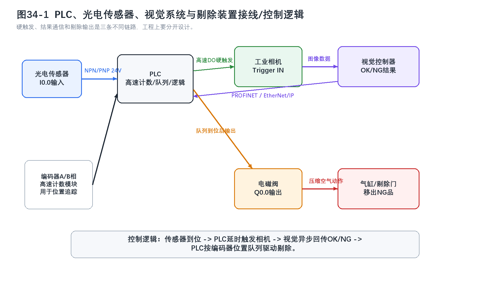

<strong>图 44-1 PLC、光电传感器、视觉系统与剔除装置的接线和控制逻辑</strong>

这张图把现场系统拆成三条链路：传感器到PLC的输入链路、PLC到相机的硬触发链路，以及视觉结果返回PLC并驱动剔除机构的结果链路。这样的拆分很有必要，因为很多初学者会把“拍照触发”和“结果通信”混成一条总线逻辑，进而误判系统时序。图中编码器模块的作用也值得特别留意，它不是可有可无的附件，而是高速对象追踪时把检测结果重新绑定到物理位置的关键输入。读者可借这张图快速判断现场图纸是否清楚地区分了24V I/O、工业以太网结果交换和执行器输出回路。

从接线角度看，24V电源通常为PLC I/O、现场传感器和电磁阀供电，光电传感器黑线接PLC输入点，视觉控制器通过工业以太网与PLC交换结果数据，相机Trigger In由PLC或运动控制器的硬件输出驱动，电磁阀线圈则由PLC输出模块控制。若输出模块直接带感性负载，浪涌吸收器件不可省略。

### 44.8 在PLC程序中，典型的控制逻辑代码结构是什么？
较成熟的程序结构通常采用状态机、顺序功能图或分段式任务组织。初始化段完成I/O映射、通信建立和参数装载；输入处理段完成传感器边沿检测、编码器计数和触发窗口判断；结果处理段接收视觉数据并写入对象队列；执行段根据位置与判定结果驱动剔除机构；异常处理段负责超时、断线、无图、重复触发和剔除失败等故障情形。

对书稿而言，最值得让读者记住的一点是：PLC程序不能简化成“等OK/NG再输出”的单步逻辑。真正可用的控制逻辑一定把触发、位置、结果、执行和异常恢复分层处理，否则系统一旦进入连续高速运行，问题就会集中暴露在边界工况上。

---

---

## 45. 光电传感器、接近开关、光纤传感器在触发中各有什么特点？ { #q45 }

### 45.1 光电传感器的触发特点是什么？
光电传感器通过发射光束并检测光强变化来判断目标是否到位。它可以工作在对射、回归反射或漫反射模式下，优点是检测距离覆盖范围大、响应速度快，适合常规流水线上的到位检测、计数和节拍触发。

但光电传感器并不是对所有对象都同样稳定。透明件、镜面件、黑色吸光件以及强环境光场景，都会明显影响检测可靠性。对射型通常对颜色不太敏感，但对透明物体未必稳；漫反射型对反射率变化更敏感，黑色工件和白色工件的有效检测距离可能相差很大。

### 45.2 接近开关的触发特点是什么？
接近开关最常见的是电感式，其核心优势是对金属目标的到位检测稳定，不依赖光照，也不容易因为油污、粉尘或颜色变化而失效。它的检测距离通常较短，多在毫米到几十毫米范围内，但定位重复性好，适合机床、治具、夹具和金属工件到位确认。

接近开关的边界也要讲清。电感式主要针对金属目标，非金属目标通常不适用；电容式虽然能检测更多材质，却会受到湿度、背景介质和周围环境变化影响。它在恶劣环境中常比光电类更稳，但不意味着“任何环境都不用调”。

### 45.3 光纤传感器的触发特点是什么？
工业现场常说的光纤传感器，本质上是“放大器与探头分离”的光电传感器。放大器里包含发光源、接收器和信号处理电路，光导纤维把光束送到狭小检测点，因此它非常适合安装空间受限、目标很小或需要微小光斑定位的场景。

光纤方案的优势在于探头细、安装灵活、对电磁干扰不敏感，也便于把电子部分远离高干扰区和高温区。它的局限同样明显：光纤易折、端面需维护、重复精度会受光斑尺寸、安装刚性、目标反射率和阈值设定影响。光纤形式提供的是更精细的布置能力，本身并不自动保证绝对高精度。

### 45.4 三种传感器在检测原理上有何根本区别？
光电传感器和光纤传感器都依赖光强变化，只是前者把发光和接收结构集成在同一壳体，后者把光学探头与电子放大器分离；接近开关则不依赖光，而是利用电磁场或电容场的变化感知目标。这个原理层面的区别，决定了它们对材质、环境光、安装空间和污染物的敏感方向完全不同。

对学生来说，这里最容易混淆的是“光纤传感器是否属于另一类原理”。更准确的说法是，它在探测机制上仍然属于光电类，只是在机械结构和安装方式上形成了独特优势。

### 45.5 在检测距离方面，三种传感器有何差异？
光电传感器的距离范围通常最大，从几厘米到几十米都可能出现；接近开关最短，常用于几毫米到几十毫米的近距离检测；光纤传感器的工作距离介于两者之间，很多型号适合毫米到小范围厘米级精细检测，也有部分方案可通过结构配置获得更长距离。

距离差异并不只影响“能不能装上”，还会影响系统容差。距离越长，安装误差往往越容易被消化；距离越短，机械公差、目标姿态和支架刚性就越容易变成触发稳定性的主要来源。

### 45.6 三种传感器在响应速度方面有何不同？
光电传感器和光纤传感器常见于微秒到百微秒级响应，适合高速到位检测和边缘触发。接近开关多在 0.1-1 ms 范围内，高速型号也可以更快，足以满足多数自动化场景。

不过，响应速度不能只按“传感器类别”一刀切判断。滤波、去抖、输出形式、放大器模式、PLC输入滤波和现场抗干扰设计，都会把规格书上的速度换算成不同的系统表现。

### 45.7 在环境适应性方面，三种传感器各有什么优缺点？
光电传感器怕光路被污染，也更容易受强背景光、透明件和高反光表面影响；接近开关通常更耐油污、粉尘和环境光变化；光纤传感器的探头端对电磁干扰较不敏感，适合狭小和复杂安装区，但光纤本体需要防折、防磨和按最小弯曲半径布线。

这里尤其要补一句工程边界：易燃易爆场景不能因为“光纤传光”就默认本质安全，是否可用仍取决于整套传感器、放大器、电源与接线方案是否具备对应认证。

### 45.8 三种传感器在精度和灵敏度方面有何特点？
若只看到位存在性判断，三类传感器都可以做触发，但它们的适合对象不同。光电传感器更适合大致到位和计数判断；接近开关适合金属目标的稳定位置确认；光纤传感器更适合微小边缘、狭小空间和较细致的触发窗口控制。

“光纤传感器精度最高”这句话只能在特定条件下成立。若安装刚性不足、探头端面污染或目标反射率变化大，光纤方案同样会失去稳定性。真正的精度来自原理匹配、安装质量和阈值设定的共同结果。

### 45.9 在应用场景选择上，如何根据触发需求选择合适的传感器？
若目标较大、距离较远、速度较高，且环境较为常规，通常优先考虑光电传感器；若对象是金属件，环境有油污粉尘，且检测距离本来就短，接近开关往往更稳；若安装空间极小、需要检测微小边缘，或者探头必须进入狭窄机构内部，光纤传感器更有优势。

透明、半透明或强反光工件不能简单归到“光电就行”这一类。此时应进一步区分对射型、偏振回归反射型、透明体专用光电方案，必要时还要评估是否改用超声、视觉或专用治具结构。

### 45.10 三种传感器在安装和维护方面有何注意事项？
光电传感器安装时要保证对准关系和遮光条件，维护重点是保持镜面与光路清洁；接近开关要注意检测面与目标间距、周围金属结构和安装背景，避免把额外金属件带进感应区域；光纤传感器则必须控制光纤弯曲半径、探头固定方式和端面清洁状态。

所有传感器都不应只在装机当天调一次阈值就长期放任不管。温度、污染、机械松动、目标换型和支架形变都会慢慢改变触发边界。更可靠的维护方式是定期复核触发窗口、误触发率和支架状态，而不是等到故障出现后再被动更换。

  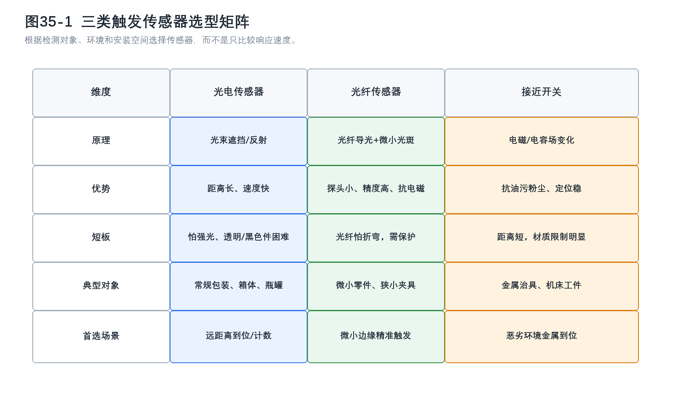

<strong>图 45-1 三类触发传感器选型矩阵</strong>

这张矩阵图把三类传感器放在同一比较框架下，最大的价值在于迫使读者按“原理、优势、短板、对象、首选场景”五个维度同时看问题。若只拿响应速度做唯一标准，光纤与光电看起来往往都比接近开关更有优势，但一旦环境变成油污、金属背景复杂、目标又恰好是金属治具，到底哪一种更稳，结论就会立即变化。图中每一列都对应一种典型选型路径，读者可据此先缩小备选范围，再回到实际距离、材质、安装空间和维护条件做最终判断。

---

---

## 46. 视觉系统通过什么方式将检测结果（OK/NG）告诉PLC？通常使用什么类型的输出模块？ { #q46 }

### 46.1 视觉结果为什么必须返回PLC？
在自动化产线中，视觉系统的职责是把图像判断转化为后续设备能够执行的控制依据，而不是停留在一份独立的检测报告上。相机、智能相机或视觉控制器完成拍照与分析后，结论只有进入PLC的控制逻辑，才会进一步对应到放行、剔除、停机、报警、计数或追溯等动作。因此，视觉结果回传PLC，本质上是把“看到什么”转换成“设备接下来做什么”。

对初学者来说，最容易混淆的地方有两点。其一，视觉回PLC的往往不是原始图像，而是已经整理好的结果字段，例如 OK/NG、坐标、角度、尺寸值、缺陷代码和任务完成状态。其二，PLC接收视觉结果使用的多半是输入资源或通信资源，并不是PLC自己去输出这些结果。题目里提到“输出模块”，若从视觉一侧看，指的是视觉设备对外输出信号的能力；若从PLC一侧看，更准确的说法应是 PLC通过数字量输入模块或通信模块接收视觉结果。

### 46.2 最常见的结果回传方式有哪些？
工程现场最常见的路径有两类。第一类是数字量I/O回传，视觉系统用一个或多个离散信号表示“合格”“不合格”“忙”“故障”“检测完成”等状态，PLC通过数字量输入模块（DI，Digital Input）读取这些电平变化。第二类是工业网络回传，视觉系统通过 Modbus TCP、PROFINET、EtherNet/IP、Socket TCP/UDP 等方式把结果写入寄存器、I/O区或协议数据块，PLC再按照约定格式解析。

数字量I/O的优点在于直接、延迟小，接线和程序也相对简单，特别适合只需要一位或几位状态量的场合；网络通信则更适合承载结构化结果，因为它不必为每个字段都单独占用一根线，也更方便把检测值、缺陷类别、时间戳或任务编号一起带回控制系统。真正做选型时，需要一起评估这条结果链路传递的信息量、节拍要求、维护能力和后续扩展性，而不是抽象地比较哪一种“更先进”。

  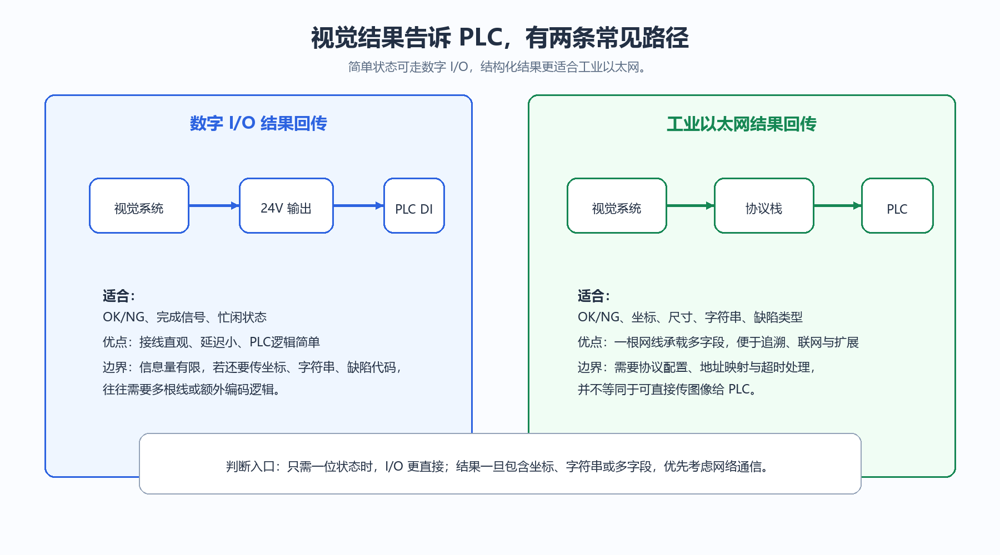

<strong>图 46-1 视觉结果回传PLC的两种常见路径</strong>

图 46-1把现场最常见的两条结果回传链路并列展开。左侧是数字量I/O方式，视觉系统输出24 V等级的离散信号，PLC通过DI点读取“OK/NG”“完成”之类的状态；右侧是工业网络方式，视觉结果先被组织成协议数据，再由PLC按寄存器、I/O区或报文结构解析。读这张图时，读者应把注意力放在“信息量”和“工程代价”的对应关系上：离散I/O适合少量状态，优势是简单可靠；一旦结果包含坐标、尺寸、缺陷类别、工件编号等多字段信息，网络通信通常更合理。它的使用边界也很明确，PLC侧网络通信并不意味着要接收原始图像，绝大多数PLC并不承担图像流处理任务。

### 46.3 数字量I/O方式通常怎样定义OK/NG？
I/O方式下，视觉系统常把某一路输出定义为OK，另一路定义为NG，也有些系统只输出“检测完成”和“NG”，默认没有NG即为OK。为了减少接线数量，还会把多个状态编码到若干位输出上，例如两位表示四种状态，三位表示八种状态。这样的编码方式并非不能用，但必须保证PLC程序、现场接线图和视觉端配置保持一致，否则维护阶段很容易出现状态误读。

从PLC角度看，这类信号进入的是数字量输入模块。PLC在扫描周期内读取输入状态，再根据程序逻辑决定是否触发剔除、是否允许下一工位动作、是否记录异常。若产线节拍高、脉冲较窄，PLC输入滤波时间和模块响应时间也要一起核对；否则视觉端虽然正确输出了结果，PLC侧却可能因为脉冲太短而漏读。

### 46.4 网络通信方式通常返回哪些内容？
网络通信的价值，在于结果不再局限于一位判定。实际项目中，视觉系统常返回一位总判定、一个或多个测量值、定位坐标、旋转角、工件序号、任务完成标志、报警码、工具运行状态，以及便于追溯的时间信息。对于定位、测量、字符识别和多缺陷分类任务，这些内容往往比单纯的OK/NG更有价值，因为PLC后续动作可能依赖具体数值，而不是只有通过与否。

不过，采用网络通信并不等于系统自然就更实时。协议名称只是实现路径，最终的响应速度与抖动还取决于PLC扫描周期、通信任务周期、交换机与网络负载、设备协议栈实现方式，以及视觉算法本身的处理时间。更稳妥的表述是：网络通信更擅长传递结构化结果，但实时性仍要靠系统实测和整体架构保证，不能只由协议名推断。

### 46.5 题目里说的“输出模块”，在工程上应怎样理解？
如果从视觉系统一侧描述，确实可以说视觉设备通过数字量输出接口或网络通信接口把结果输出给PLC。很多智能相机自带若干路数字量输出（DO，Digital Output），也可能扩展I/O模块、串口模块或网口功能。从这一侧看，“输出模块”这个说法是成立的。

若从PLC一侧表述，术语就应当更严谨一些。PLC用于接收I/O结果的是数字量输入模块，用于接收网络结果的是通信模块、总线接口模块或CPU自带的工业以太网接口；PLC真正的输出模块，则多用于驱动电磁阀、继电器、蜂鸣器、指示灯或剔除执行器。教材里把这两个方向分清楚，读者在后面学习接线、时序和故障诊断时就不会混淆“谁在发、谁在收”。

### 46.6 实际选型时应怎样判断用I/O还是网络？
如果任务只是把“通过”“不通过”“完成”“故障”这些少量状态交给PLC，而且节拍高、逻辑简单、维护团队更熟悉硬接线，那么I/O仍然是很有竞争力的方案。若系统需要把多个测量值、字符识别结果、位置坐标或多类别缺陷信息同时回传，或者还要考虑数据追溯、远程诊断和后续扩展，网络通信通常更适合。

很多项目最终会采用混合结构：用I/O传递触发、完成、故障等时序状态，用网络传递详细结果。这样的分工在工程上很常见，因为它同时兼顾了硬件时序的直接性和数据表达的丰富性。

---

---

## 47. 什么是光耦隔离？I/O模块为什么需要它？ { #q47 }

### 47.1 光耦隔离的基本原理是什么？
光耦隔离的核心，是让信号跨越两侧电路时通过“光”而不是通过直接导电路径。典型光耦内部包含发光器件和受光器件，输入侧电流驱动发光，输出侧再把光信号恢复成电信号。输入和输出封装在同一器件中，但电气上彼此隔离，因此能够在传递逻辑信息的同时切断地电位差、浪涌和共模干扰的直接传播路径。

从系统角度看，光耦隔离同时承担两项任务：一是把有用信号传给后级，二是把危险的电气扰动尽量挡在前级与后级之间。这也是工业I/O模块广泛使用隔离器件的根本原因。控制系统处理的是逻辑与数据，但它所连接的外部世界充满了继电器线圈、电磁阀、长线缆、变频器、电机和复杂接地环境，这些都可能把不希望进入控制电路的能量带进来。

### 47.2 为什么I/O模块比很多板载电路更需要隔离？
I/O模块处在控制柜内部逻辑世界与现场设备世界之间，是最容易同时接触“弱信号”和“强干扰”的位置。它的外部线路往往很长，布线环境复杂，既可能经过动力线附近，也可能与电机、变频器、焊机等设备处在同一电磁环境中。长线缆本身就容易感应噪声，而现场设备在启停瞬间又会产生浪涌、电压尖峰和地电位波动，这些扰动若直接进入PLC、工控机或视觉控制器内部，很容易造成误触发、通信异常，甚至损坏输入输出级。

对于模拟量I/O，这个问题更敏感。因为测量信号本身可能只有几伏、几毫安，噪声比例一旦上升，误差就会被直接带入控制或检测结果；对于数字量I/O，虽然逻辑电平判定相对粗一些，但当现场存在接地环路、毛刺或浪涌时，误动作照样会发生。隔离的作用不是把所有问题都神奇消除，而是先在系统结构上建立一道边界，减少故障和干扰直接穿透到控制侧。

  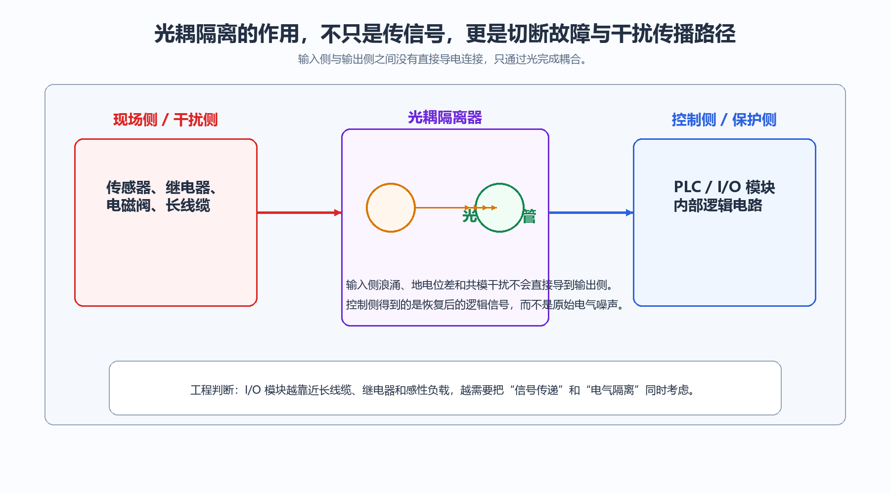

<strong>图 47-1 光耦隔离在I/O模块中的作用</strong>

图 47-1把现场侧与控制侧明确分开，中间的光耦器件不是简单的“信号中转站”，而是一道电气屏障。左侧代表传感器、继电器、长线缆和感性负载所在的现场环境，这一侧更容易出现浪涌、共模干扰和地电位波动；右侧代表PLC或I/O模块内部逻辑电路，对过压、毛刺和杂散电流更敏感。读者从这张图中应建立一个基本判断：I/O模块之所以强调隔离，并不是因为逻辑功能复杂，而是因为它恰好站在最容易受外界冲击的位置。该图适用于理解数字量输入输出的隔离思路，但在高速总线接口或高精度模拟量模块中，实际实现可能采用数字隔离器、隔离放大器等器件，而不局限于传统光耦。

### 47.3 没有隔离时，系统容易出现哪些问题？
最直接的问题是误动作。输入侧若把毛刺、电磁干扰或地电位波动误判成有效边沿，PLC就可能错误置位、错误启动、错误停机；输出侧若受反灌或浪涌影响，则可能出现继电器误吸合、驱动级损坏或模块寿命下降。更麻烦的是，这类问题经常表现为“偶发故障”，在静态台架上看似正常，一到现场连续运行就暴露出来，排查成本很高。

另一个常见问题是接地环路。不同设备即便都接地，也不意味着地电位完全相同；一旦形成环路，附加电流就可能沿信号参考路径流动，把原本干净的输入信号拖偏。对于视觉系统而言，触发输入、频闪同步和串口、网口外围I/O同样会受到这类问题影响，所以“隔离”并不是PLC专有话题，而是整个工业控制接口设计的共性要求。

### 47.4 光耦隔离能解决到什么程度？它有没有边界？
隔离非常重要，但它不是万能屏障。它能有效阻断直接导电耦合路径，降低共模干扰与地电位差影响，也能让高低压侧建立更安全的电气边界；但对于强电磁辐射、屏蔽接地不当、供电质量差、线缆布局错误等问题，仅靠增加光耦并不能彻底补救。若长线与动力线平行敷设、浪涌抑制不到位，或者现场接地结构本身混乱，系统仍然可能出现不稳定。

从工程角度看，隔离应与合理接地、屏蔽线与屏蔽层正确处理、感性负载吸收回路、输入滤波、浪涌保护以及恰当的公共端规划配合使用。读者需要明白，隔离是系统抗干扰设计的一部分，并不能替代布线和接地上的基本功。

### 47.5 数字量I/O和模拟量I/O的隔离方式有什么差别？
数字量I/O更关注开关状态是否可靠传递，因此隔离实现通常围绕逻辑电平、边沿响应、浪涌承受与通道独立性展开。模拟量I/O则要额外考虑线性度、温漂、带宽和噪声引入，因为它传递的不是单纯的0和1，而是连续量。正因为如此，模拟量隔离往往不会简单使用普通光耦直通，而更常见隔离放大器、调制解调式隔离器，或者ADC、DAC配合数字隔离的结构。

这一差异提醒读者，不能因为都叫隔离就认为工程要求相同。一个数字量输入模块只要可靠识别边沿就可能足够，而高精度模拟采集通道还必须关心隔离之后的精度漂移、非线性和噪声底。把这两类问题放在同一技术框架里看，有助于理解为什么有些模块价格差别很大，差别并不在功能写法，而在隔离和测量品质要求。

### 47.6 现在的I/O模块还都是传统光耦吗？
并不完全如此。传统光耦仍然大量存在，尤其是在通用数字量接口中，因为它成熟、成本可控、隔离含义明确；但在更高速、更低功耗、更高集成度的场合，很多产品已经采用电容隔离、磁隔离或专用数字隔离器。对读者而言，这里的工程结论更适合写成一句直接的话：隔离的目标没有变，器件实现手段在演进。只要面对的是控制侧与现场侧之间的边界问题，隔离依然是绕不过去的设计主题。

---

---

## 48. 除了简单的I/O信号，视觉系统与PLC还有哪些通信方式？（如RS232/485、以太网TCP/IP、Modbus TCP/RTU、PROFINET） { #q48 }

### 48.1 为什么简单I/O并不能覆盖所有视觉通信需求？
离散I/O非常适合状态量，但它表达信息的能力有限。只要视觉系统不仅要给出OK/NG，还要返回测量值、坐标、角度、字符识别结果、缺陷代码、配方号或工具状态，单纯依靠几路开关量就会迅速变得笨重，而且维护时不容易追踪字段含义。视觉系统与PLC之间之所以出现多种通信方式，本质上是因为工业现场既需要“能到位的硬件信号”，也需要“能携带内容的结构化数据”。

通信方式的差别，不只体现在传输介质上，也体现在系统分工上。有些方式更像设备间的简单数据通道，有些方式则把周期I/O、参数访问、设备诊断、上位集成一起考虑进去。因此，学习这些协议时，与其把它们背成一串名称，不如先建立一个判断框架：传输距离、数据量、实时性、网络结构和生态兼容性，决定了视觉系统与PLC更适合通过哪一类接口协同。

  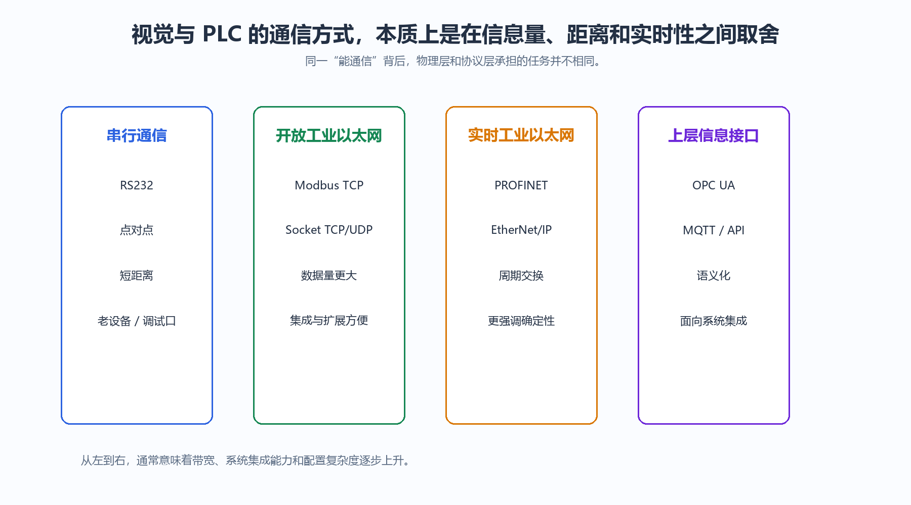

<strong>图 48-1 视觉系统与PLC通信方式的层次划分</strong>

图 48-1没有把各种协议简单排成“高低等级”，而是按工程用途分成几类：串行通信负责低复杂度、较长历史包袱的设备连接，开放型工业以太网更适合通用数据交换，实时工业以太网强调周期控制与确定性，上层信息接口则更多面向系统集成与信息互通。读者从这张图中应看出的，不是哪一种“最好”，而是每一类协议解决的问题不同。它对选型的帮助在于提醒我们先判断数据和时序需求，再看现场设备生态；它的边界在于图中只给出分类视角，具体项目仍需回到设备型号、协议栈支持情况和实测周期能力。

### 48.2 RS232和RS485各适合什么场景？
RS232是较早普及的串行通信标准，典型特点是点对点、连接简单、历史兼容设备多，但传输距离和抗干扰能力都比较有限，更多出现在老设备对接、参数配置口、调试口或小规模单设备通信场景。若视觉设备只需和单台控制器交换少量命令或结果，且现场距离不长，RS232仍然可能是可行方案。

RS485则采用差分传输，抗干扰能力更强，布线距离更长，也支持多节点挂接，因此在工业现场更常见。Modbus RTU大量运行在RS485之上，就是因为这条链路在低到中等带宽、较长距离和较复杂电磁环境下具备较好的实用性。需要提醒读者的是，RS485描述的是物理层，不等于通信协议本身；真正决定寄存器含义、主从角色和报文格式的，还是上层协议。

从规格上看，RS232 采用单端信号传输，最长约 15m，典型速率 9.6~115.2kbps，点对点通信。RS485 采用差分信号传输，最长 1200m，速率最高约 10Mbps，最多挂接 32 个节点，是 Modbus RTU 的物理层基础。两者均只定义物理层，帧格式和主从角色由上层协议决定。

### 48.3 TCP/IP和原始Socket通信的工程位置是什么？
当视觉系统和PLC都具备以太网接口时，可以通过TCP/IP建立更灵活的数据通道。有些系统直接使用厂商封装好的工业协议，有些则采用Socket TCP、UDP实现自定义报文交互。这类方式的优点是开放性好、携带数据方便、便于融入已有网络基础设施，也更容易把视觉结果继续送往数据库、制造执行系统（MES，Manufacturing Execution System）或上位监控系统。

不过，自定义Socket虽然灵活，却把协议定义、字段解释、异常处理、重连策略和版本兼容责任更多留给了集成方。若项目后续维护人员不足，或者跨厂商协同频繁，这种自由度很高的方式未必最省心。教材里写这部分时，既要让读者看到它的扩展性，也要让他们意识到，能够发出数据并不等于后期就容易维护。

### 48.4 Modbus RTU和Modbus TCP的差别在哪里？
Modbus RTU运行在串行链路上，最典型的是RS485；Modbus TCP则把相近的数据模型封装到以太网之上。两者在工程上的共通点，是都采用寄存器、线圈映射这种比较直观的数据组织方式，学习门槛不高，跨厂商支持也比较广。对于视觉系统而言，它可以把OK/NG、坐标、测量值和状态字映射到固定地址，PLC再按地址读取。

两者的主要差异在于承载介质与网络组织形式。RTU更适合总线式串行环境，硬件简单、历史设备多；TCP更适合现代以太网环境，布网、扩展和上位集成都更方便。教材里应避免把Modbus TCP直接说成实时网络协议。它能很好地完成结果交换，但如果项目对控制周期抖动和确定性要求很高，仍需结合控制器能力和网络实测来判断是否足够。

帧结构上，Modbus RTU 由地址域（1 字节）+ 功能码（1 字节）+ 数据域（N 字节）+ CRC 校验（2 字节）组成，采用主从轮询。Modbus TCP 将相同应用层数据封装到以太网帧中，端口 502，帧中以 6 字节 MBAP 头（含事务标识符支持并发）替代 RTU 地址域，CRC 由 TCP 层保证完整性而移除。两者功能码与数据格式完全相同。

### 48.5 PROFINET、EtherNet/IP这类工业以太网的价值在哪里？
这类协议不只是把普通以太网直接搬到工厂里使用。它们更强调设备建模、周期I/O交换、诊断信息和与主流PLC生态的深度集成。以PROFINET为例，视觉设备可以作为IO Device接入PLC控制系统，通过通用站点描述标记语言（GSDML，General Station Description Markup Language）描述设备数据区，PLC周期性读写结果；EtherNet/IP则在罗克韦尔体系中应用广泛，便于把视觉结果纳入统一的控制与诊断框架。

对于视觉项目来说，这类协议最大的价值通常不在理论带宽，而在于与控制系统协同更顺。配方切换、状态诊断、标准化组态、设备更换后的恢复和后期维护，往往都能从成熟工业网络生态中受益。它的边界同样需要说清：工业以太网更适合承载结果和状态，不代表PLC会直接吞吐大规模图像数据；图像采集链路和控制链路在很多系统中依然是分开的。

### 48.6 还应当怎样建立对通信方式的整体认识？
比较稳妥的理解方式，是把它们分成四个层面。其一是物理接口，例如RS232、RS485、以太网口；其二是数据交换协议，例如Modbus RTU、Modbus TCP、Socket报文；其三是工业控制生态协议，例如PROFINET、EtherNet/IP；其四是信息化接口，例如 OPC统一架构（OPC UA，Open Platform Communications Unified Architecture）、消息队列遥测传输（MQTT，Message Queuing Telemetry Transport）或面向上层系统的应用程序接口（API，Application Programming Interface）。不同项目关心的重点并不相同，有的只要把结果可靠送到PLC，有的还要继续上送到MES、数据库或云端平台。

因此，真正的选型过程，往往是先界定本项目的数据路径、控制路径和信息路径，再判断每一段链路适合使用什么技术，而不是在一串协议名里直接寻找"最强"的那个。

> **引用出处**：RS232/RS485 物理层规范与 Modbus RTU/TCP 帧结构参见 Modbus 协议标准（Modbus Organization）及相关工业通信技术资料。

---

---

## 49. 什么是Modbus通信中的寄存器、线圈、保持寄存器和输入寄存器？视觉系统如何映射检测结果？ { #q49 }

### 49.1 Modbus里最容易混淆的几个名词分别指什么？
Modbus把数据对象分成几类，其中最常见的就是线圈、离散输入、保持寄存器和输入寄存器。线圈（Coils）通常表示可读可写的单比特量，适合表达启动、使能、复位等命令状态；离散输入（Discrete Inputs）通常表示只读的单比特量，适合表达完成、报警、传感器状态等反馈。保持寄存器（Holding Registers）是可读可写的16位数据单元，常用于配方参数、阈值设定、控制命令或需要PLC写入的结果缓冲区；输入寄存器（Input Registers）则是只读的16位数据单元，常用于采样值、测量结果和状态数据。

这四类对象之所以重要，不在于名称本身，而在于它们实际上规定了“谁可以写、谁可以读、数据有多宽”。如果视觉系统与PLC在这一步理解不一致，后续再谈地址号、数据格式和解析方式都没有意义。

  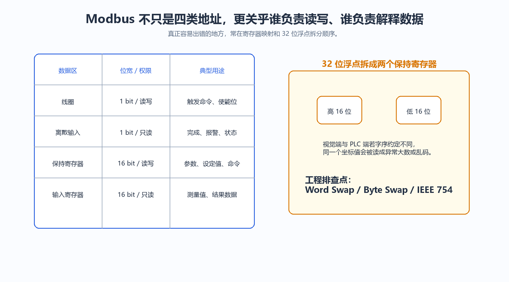

<strong>图 49-1 Modbus数据对象与视觉结果映射关系</strong>

图 49-1左侧把Modbus中四类常用数据对象按“位数据”和“字数据”分开，右侧则补出视觉项目中最常见的映射场景。线圈更适合承载启动、复位、使能等控制命令，离散输入常用于完成、故障或OK/NG这类单比特反馈；保持寄存器与输入寄存器则更适合承载坐标、尺寸、角度、分数值和状态字。读者看这张图时，最需要建立的是“对象类型决定使用习惯”的意识，而不是死记编号。它对工程诊断也很有帮助，因为一旦发现某个量既要被PLC写入又要被视觉读取，就应优先考虑保持寄存器而不是输入寄存器。

### 49.2 视觉系统通常怎样把结果映射到Modbus对象？
若检测任务只需要回传少量状态，视觉系统可以把“检测完成”“OK/NG”“故障”“忙”映射到线圈或离散输入；若任务包含坐标、尺寸、灰度统计值、缺陷面积、字符识别结果编号等数值字段，则更常映射到保持寄存器或输入寄存器。实际使用哪一种，取决于视觉设备是把自己设计成“由PLC读取的被动从站”，还是允许PLC向其写入命令和参数。

在多数PLC主导的系统里，视觉设备常扮演从站角色，PLC发起读写请求。这样做的好处是控制权集中，节拍与异常处理更容易统一；但也存在例外，例如某些上位机主导系统或多设备协同系统中，视觉侧也可能主动作为主站去访问其他模块。更准确的说法是，在常见产线架构中，PLC更常作为主站，但角色仍取决于系统设计。

### 49.3 地址号为什么经常让初学者出错？
一个常见误区，是把资料中的“40001、30001、00001”这类表示法，当成设备内部真实地址。很多手册里的前缀编号只是为了帮助区分对象类型，真正通信帧里使用的往往是从零开始或按厂商定义偏移的地址。也就是说，手册写“40001”并不必然意味着程序里就要直接写40001。

因此，做Modbus对接时必须同时确认三件事：设备文档给出的地址表示方式、PLC或组态软件要求填写的地址格式，以及对象类型本身。很多所谓“通信不通”，最后并不是线路或波特率问题，而是地址偏移理解错了，或者把保持寄存器地址当成输入寄存器去读。

### 49.4 32位整数和浮点数为什么经常读错？
Modbus的基本寄存器宽度是16位，而视觉系统中的坐标、距离、面积、分数值常常是32位整数或IEEE 754浮点数。这样一来，一个数值就需要拆成两个连续寄存器保存。问题在于，不同设备对高字、低字、字节顺序的安排并不完全一致，于是就出现了常说的 Word Swap、Byte Swap 等兼容问题。

工程上最可靠的做法，是用一个已知数值做联调验证，而不是凭经验猜顺序。例如把一个容易识别的浮点数写入视觉侧，再在PLC端查看两寄存器原始值；确认字序后，再批量解释其他字段。若教材只告诉读者“浮点数要占两个寄存器”却不补这一层，他们到现场时往往会在这里卡住很久。

### 49.5 下面这个映射表应当怎样理解？

<strong>表39-1 视觉结果的典型Modbus映射示例</strong>

| 数据对象 | 访问属性 | 典型字段 | 工程含义 |
| --- | --- | --- | --- |
| 线圈 | 读/写 | 启动检测、结果复位、配方切换允许 | PLC下发控制命令 |
| 离散输入 | 只读 | 检测完成、OK/NG、故障、忙状态 | 视觉侧反馈单比特状态 |
| 保持寄存器 | 读/写 | 阈值、配方号、任务编号、结果缓存 | 既可写参数，也可读结果 |
| 输入寄存器 | 只读 | X/Y坐标、角度、尺寸值、评分值 | 视觉侧输出测量数据 |

这张表的阅读重点，不是把每一列当成固定标准答案，而是理解它体现出的分工习惯。某个项目究竟把测量值放在保持寄存器还是输入寄存器，仍取决于设备设计；但若一个字段明确不应被PLC改写，那么把它放入只读对象通常更清晰，也更安全。

### 49.6 写Modbus映射时有哪些实用原则？
第一，结果字段应尽量连续编排，便于PLC批量读取，减少离散访存带来的程序复杂度。第二，状态位和数值位最好分区，避免维护时混在一起难以定位。第三，文档必须同时写清地址、数据类型、单位、缩放关系和字节顺序，否则项目一旦交接，很快就会变成“能通信但没人敢改”。第四，对浮点数、带符号整数和枚举型缺陷代码，最好给出样例值，便于现场快速验证。

从教学角度看，Modbus最值得让读者建立的能力，不在于背诵功能码，而在于把结果映射写成一份可对接、可验证、可维护的接口说明。只有做到这一点，视觉系统输出的检测结果才能真正顺畅地进入PLC逻辑与后续设备动作。

---

---

## 50. 在什么情况下会选择通过工业以太网而不是简单I/O与PLC交互？ { #q50 }

### 50.1 为什么简单I/O并不总是够用？
简单I/O最大的优势是直接，但它能表达的内容终究有限。只要视觉系统输出的不只是OK/NG，而是包含多个测量值、定位坐标、缺陷类型、OCR结果、配方状态、任务编号或设备诊断信息，I/O数量就会迅速膨胀，接线和程序映射都会变得笨重。对于需要追溯和维护的系统来说，这种方式很快会暴露出信息组织能力不足的问题。

另一个限制来自系统扩展。今天项目也许只传一个合格信号，明天可能要加多工位、多配方、多类别结果，后天又要把数据送给上位系统。若一开始就把交互建立在大量离散线之上，后续改造成本往往偏高。工业以太网的吸引力就在于，它允许控制系统在不显著增加布线复杂度的情况下承载更多结果字段，也更容易纳入标准化组态与集中维护。

### 50.2 哪些场景更适合优先选择工业以太网？
当视觉系统需要向PLC持续返回结构化结果时，工业以太网通常比I/O更合适。例如尺寸测量需要返回多组数值，定位引导需要返回坐标和角度，字符识别要返回文本或编号，多缺陷分类还要返回类别代码与状态字。在这些情况下，若仍坚持只用I/O，最终往往要么线数过多，要么编码规则过于绕，既不利于调试，也不利于交接。

对于多设备网络，工业以太网同样更有优势。多台相机、多个智能传感器、若干远程I/O站和一台PLC若需要统一纳管，网络化接口更容易组织成可扩展架构。它还方便做远程诊断、设备替换和状态监控，这些在成熟产线中通常不是附加功能，而是降低停机时间的重要手段。

### 50.3 选择工业以太网，是不是意味着要把图像直接交给PLC？
通常不是。这里必须把图像采集链路和控制结果链路分开。工业相机产生的图像数据往往进入视觉控制器、工控机或智能相机内部处理单元，由这些设备完成算法计算后，再把结果通过工业网络交给PLC。PLC更擅长处理状态、参数和控制逻辑，而不是承载原始图像流、图像缓存和视觉算法运算。

如果把这层分工讲清楚，读者后面在做系统架构时就不容易误把“以太网通信”理解成“PLC接图像”。在绝大多数机器视觉项目中，PLC侧网络接口承载的是控制相关的数据结果，图像与大文件更常留在视觉侧或上传到上位IT系统。

  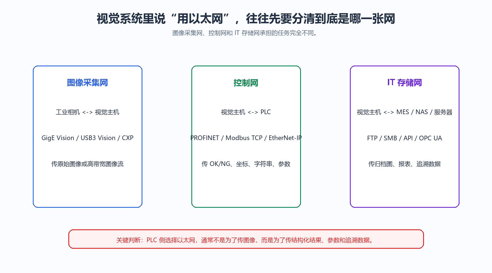

<strong>图 50-1 机器视觉项目中的三类网络分工</strong>

图 50-1把机器视觉系统里经常被混谈的三类网络拆开了：图像采集网络负责把大带宽图像送到视觉处理单元，控制网络负责把结果与状态交给PLC，IT或存储网络负责追溯、报表与长期保存。读者应从这张图中形成一个清晰判断：工业以太网用于PLC交互时，关注重点通常是结果字段、周期交换和设备诊断，而不是原始图像本身。它对系统选型的价值在于避免把所有流量都塞进同一条网络；它的使用边界也很明确，若项目规模小、字段极少、节拍简单，强行三网分离反而会增加复杂度，仍需按项目规模和维护能力取舍。

### 50.4 除了信息量，工业以太网还带来哪些工程收益？
工业以太网带来的不只是多传几个字段。在成熟设备生态中，它通常伴随标准化诊断、设备识别、参数下载、远程维护、配方切换和故障定位能力。对维护团队而言，这些能力往往比单纯的通信速度更有价值，因为它们决定了系统出问题时能否快速恢复。

此外，网络接口更适合与上层系统衔接。视觉结果若需要进入监控与数据采集系统（SCADA，Supervisory Control and Data Acquisition）、制造执行系统、数据库或质量追溯平台，工业以太网和上层信息接口之间的衔接通常比离散I/O自然得多。也正因为如此，在中大型项目里，控制系统往往不再把视觉单元视为一台只会亮灯输出OK/NG的外设，而是把它视为网络中的一个数据节点。

### 50.5 那么，什么时候仍然应该优先选择简单I/O？
当检测逻辑简单、只需合格、不合格两类状态、节拍极快且维护人员对硬接线最熟悉时，I/O仍然是非常合理的选择。尤其是在单工位、小系统、低成本设备或环境较单纯的场合，简单I/O往往具有更直接的可调试性。系统越简单，越没有必要为了“看起来更先进”而引入额外协议栈和组态复杂度。

工程上最怕的不是接口简单，而是接口与任务不匹配。若信息需求本来就很少，却为了追求形式上的网络化引入复杂通信，后期维护未必更轻松；反过来，若结果字段早已明显超出I/O适用边界，却仍强行用硬接线编码，最终也会把系统拖入难维护状态。判断标准始终应当回到任务本身，而不是停留在接口名称上。

### 50.6 如何建立更稳妥的选择原则？
比较实用的原则是从三方面同时判断。第一，看结果字段是否已经超出离散状态层面；第二，看系统是否需要诊断、追溯、远程维护和后期扩展；第三，看现场团队是否具备相应的网络调试与维护能力。只满足第一条而维护能力不足时，可以考虑“关键状态走I/O、详细结果走网络”的混合架构；三条都满足时，工业以太网通常更值得优先规划。

换一种更贴近现场的话来说，I/O更像一条短而直接的结果线，工业以太网则更像一套可扩展的数据通道。项目越复杂、字段越多、生命周期越长，网络化交互的价值就越明显；项目越单纯、节拍越直接、任务越窄，I/O的朴素优势就越难被替代。把这个边界看清楚，读者在后续做视觉系统集成时，就不容易陷入“凡是上网络就一定更好”的误判。

---
