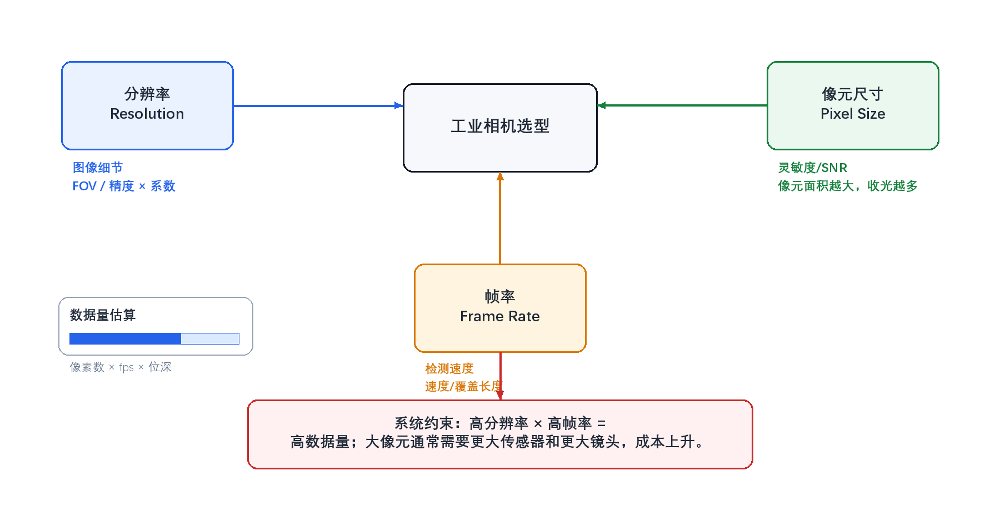

# 1. 工业相机选型的三个最核心参数是什么？它们的计算公式或选择逻辑是怎样的？

> **网络署名：LanQS** · 作者及著作权人：兰青松 · [版权说明](../copyright.md)

#### 1.1 什么是工业相机选型，为什么需要关注核心参数？
工业相机选型，是根据检测任务的需求——检测什么、要求多准、产线跑多快、在什么环境下工作——从众多相机型号中选出最匹配的那一款的过程。

之所以需要特别关注核心参数，是因为**分辨率、帧率和像元尺寸**直接决定了三件事：系统能否分辨出目标的最小特征（分辨率），能否跟上生产节拍不漏拍（帧率），以及图像质量是否够干净、够稳定（像元尺寸）。这三项参数构成最基础的约束关系：分辨率决定空间采样能力，帧率决定单位时间内可采集的图像数量，像元尺寸影响收光能力、动态范围和噪声水平。在此基础上，检测精度、生产节拍、成像质量、接口带宽、镜头匹配和项目成本需要统筹权衡。三者若单独追求其一，压力就会转移到镜头、照明、数据传输或算法端，最终影响检测稳定性和量产可维护性。

#### 1.2 第一个核心参数：分辨率（Resolution）的选择逻辑是什么？
分辨率决定图像的空间采样密度，需结合视场大小、最小特征尺寸、镜头解析力和算法对边缘或缺陷的像素覆盖要求来判断，而非仅以总像素数衡量。

**选择逻辑：**
1.  **视场（FOV）与精度要求**：确定检测区域的物方尺寸，再根据检测精度要求计算所需的最小像素数。
2.  **像素覆盖系数**：对于缺陷检测或尺寸测量，最小特征通常需要覆盖多个像素才能稳定识别。该系数表示每个最小特征需要多少像素覆盖，并非相机天然具备的亚像素精度；常用取值为2~3，高精度或低对比场景按表2-1取2.5~4.0。
3.  **相机传感器尺寸**：分辨率与传感器尺寸共同决定了像素尺寸，进而影响成像质量和景深。

**计算公式：**
$$
\text{所需分辨率} = \frac{\text{视场尺寸}}{\text{目标特征尺寸或允许误差}} \times \text{像素覆盖系数}
\tag{1-1}
$$

例如，如果要在100mm宽的视场内稳定识别0.1mm量级的特征，并希望该特征至少覆盖3个像素，则所需横向分辨率为：
$$
\text{分辨率} = \frac{100\text{mm}}{0.1\text{mm}} \times 3 = 1000 \times 3 = 3000\text{像素}
\tag{1-2}
$$
横向分辨率至少应达到3000像素。若实际场景存在低对比缺陷、镜头边缘解析力下降、光照不均或定位算法对边缘质量敏感等情况，还需在此基础上增加余量，将理论值作为选型起点而非最终结论。

#### 1.3 第二个核心参数：帧率（Frame Rate）的计算公式是什么？
帧率决定相机每秒采集的图像数量，直接关系到生产线节拍、漏拍风险和图像处理系统的吞吐能力。相机标称帧率只是上限，实际运行帧率还会受到分辨率、位深、接口协议和主机处理能力的限制。

**选择逻辑：**
1.  **生产线速度**：根据生产线的移动速度确定最小帧率要求。
2.  **曝光时间约束**：高速运动物体需要短曝光时间，这会限制有效帧率。
3.  **处理能力匹配**：相机帧率应与图像处理系统、传输链路和存储能力相匹配。

**计算公式：**
$$
\text{所需帧率} = \frac{\text{生产线速度}}{\text{检测区域长度}} \times \text{安全系数}
\tag{1-3}
$$

更精确的计算需同时考虑运动模糊。若允许图像上的运动模糊为 $b$ 个像素，物方像素当量为 $p_{obj}$（mm/px），物体速度为 $v$（mm/s），则曝光时间上限为：
$$
t_{exp,max} = \frac{b \times p_{obj}}{v}
\tag{1-4}
$$

例如，生产线速度为1m/s，检测区域长度为50mm，需要至少2倍重叠采样，则：
$$
\text{帧率} = \frac{1000\text{mm/s}}{50\text{mm}} \times 2 = 20 \times 2 = 40\text{fps}
\tag{1-5}
$$
40fps 对应的帧周期为 25ms。若进一步要求运动模糊不超过1个像素、物方像素当量约 0.05mm/px，由式(1-4)得 $t_{exp,max}=1\times 0.05/1000=0.05\text{ms}=50\mu\text{s}$。可见曝光时间上限远低于帧周期——高速运动场景中，曝光约束往往比帧率约束更严格。若同一工位还需多次曝光、频闪控制或复杂算法处理，应继续核算相机缓存、接口带宽和处理延迟，避免量产中出现帧丢失或触发排队。

#### 1.4 第三个核心参数：像元尺寸（Pixel Size）如何影响成像质量？
像元尺寸是每个感光单元的物理尺寸，通过收光面积、满阱容量和读出结构影响灵敏度、动态范围和信噪比。在固定传感器尺寸内，像元越大则收光能力越好，但可布置的像素数越少，空间采样能力下降。

**选择要点（同代工艺、相近传感器结构下的近似趋势）：**
1.  **灵敏度**：像元面积越大，单个像元收集的光子越多，低光照条件越有利。
2.  **动态范围**：像元尺寸越大，满阱容量通常越大，动态范围越宽。
3.  **空间采样能力**：在相同传感器尺寸下，像元越小，可布置的像素数越多，需在灵敏度与分辨率之间取得平衡。

#### 1.5 这三个参数之间如何相互制约和平衡？
分辨率、帧率和像元尺寸之间存在明显的系统级制约。分辨率提高后，单帧数据量随之增加，接口带宽、存储和算法处理时间都会受到影响；帧率提高后，曝光时间和传输时间被压缩，对照明强度、相机缓存和主机处理能力提出更高要求；像元尺寸变小后，虽然可以在同一传感器面积上获得更多像素，但低光照下的信噪比、动态范围和镜头匹配难度也会发生变化。

  

<strong>图1-1 工业相机三核心参数的制约关系</strong>

图1-1 展示分辨率、帧率、像元尺寸三项核心参数之间的系统级制约关系。左侧为传感器尺寸与像素数的权衡，中间反映分辨率与帧率共同决定数据吞吐，右侧指向成像质量、检测速度和成本的平衡。

**平衡策略：**
分辨率与帧率的平衡，本质上是单帧信息量与单位时间吞吐量之间的取舍；像元尺寸与分辨率的平衡，则是在收光能力和空间采样能力之间分配传感器面积。工程上可通过选择合适的接口（如GigE、USB3、CoaXPress）、优化照明和镜头系统、拆分检测工位或缩小视场来降低单个参数的压力。

#### 1.6 实际选型中还需要考虑哪些辅助参数？
除了上述三项参数，还需要同时检查传感器类型、快门方式、接口协议、光谱响应、环境适应性和软件兼容性。传感器是CMOS还是CCD、采用全局快门还是卷帘快门，会影响高速运动场景下的几何稳定性；GigE Vision、USB3 Vision、Camera Link、CoaXPress等接口决定了传输距离、带宽和系统布线方式；黑白、彩色、近红外或紫外响应则要与被测材料、光源波段和缺陷对比度匹配。对于量产设备，还应把工作温度、防护等级、抗振动能力、SDK稳定性和视觉软件兼容性纳入评估，否则样机阶段能运行的配置，未必能在现场长期稳定运行。

#### 1.7 如何通过实际案例理解这些参数的选择？
以汽车零部件尺寸检测为例：
- **视场**：200mm × 150mm
- **检测精度**：±0.05mm
- **生产线速度**：2m/s
- **工作环境**：车间正常照明

**计算过程：**
1. **分辨率计算（测量/像素当量口径，k=1）**：令单个像素的物方尺寸等于 ±0.05mm，则横向需 $\frac{200\text{mm}}{0.05\text{mm}} = 4000\text{像素}$，纵向需 $\frac{150\text{mm}}{0.05\text{mm}} = 3000\text{像素}$，对应约1200万像素（4000×3000）。本章案例为尺寸测量任务，按 §1.1 的分类规则适用测量口径（k=1），理论上1200万像素即可满足物方采样要求。

   > **变体讨论**：若在尺寸检测的基础上还要求零件表面的微小缺陷（如划痕、压痕）被稳定检出，则需切换为特征覆盖口径。以 k=3 估算，分辨率需求变为 $12000\times 9000\approx 1.08$ 亿像素——两条路径相差近一个数量级。实际项目中应先明确当前工位的主任务类型（测量/定位 or 缺陷识别），再决定是否引入覆盖系数，避免口径混淆导致相机规格大幅偏差。

2. **帧率计算**：$\frac{2000\text{mm/s}}{200\text{mm}} \times 2 = 10 \times 2 = 20\text{fps}$
   考虑处理余量，选择30fps相机

3. **像元尺寸选择**：车间照明条件良好，选择中等像元尺寸（如3.45μm）平衡灵敏度和分辨率

本例以尺寸测量为主路径，与 §1.1 的分类规则自洽；在变体中展示了引入特征覆盖要求后的量级变化。实际项目中，不同工位应各自明确任务类型，再选取对应口径计算像素需求，综合决定是提高分辨率、缩小视场、增加工位，还是重新定义检测策略。

#### 1.8 现代工业相机技术发展趋势对参数选择有何影响？
随着传感器、接口和边缘计算能力的发展，工业相机正在向更高分辨率、更高帧率和更强片上处理能力演进。高分辨率相机已经从传统的500万像素扩展到2000万、4500万甚至更高规格，但高像素必须同步核对镜头像场、解像力、接口带宽和处理时间；高速检测、运动分析和分选场景对高帧率需求增加，不过1000fps以上通常属于高速专用场景，并非普通工业检测的常态。智能相机、多光谱/高光谱成像以及结构光、TOF、双目视觉等3D方案也在改变相机参数的权重。这些方案下，参数选择的关注点会从单纯追求二维分辨率转向光谱差异、深度精度、同步机制和端侧算法能力。

> **📖 本章阅读提示：两类分辨率估算口径**
>
> 本章及下一章涉及两种不同的像素需求计算方式，读者在阅读时需注意区分：
> - **测量/像素当量口径**（k=1）：仅要求单个像素的物方尺寸等于或小于允许误差，直接由视场除以允许误差得出最小像素数。适用于读数式测量、边缘定位等以亚像素插值为前提的任务。
> - **特征覆盖/缺陷识别口径**（k≥2）：要求最小特征覆盖多个像素以保证稳定检出，公式需乘以像素覆盖系数 k（常用2~3，高精度场景按表2-1取2.5~4.0）。适用于缺陷识别、纹理判断、字符读取等依赖明确灰度对比的任务。
>
> 本书第1–2问的主体计算示例均使用**特征覆盖口径**；§1.7 以尺寸测量案例为主展示**测量口径**，并将特征覆盖作为变体对比。建议读者先读完第2问后再回看本提示，届时两种口径的区别会更加清晰。
