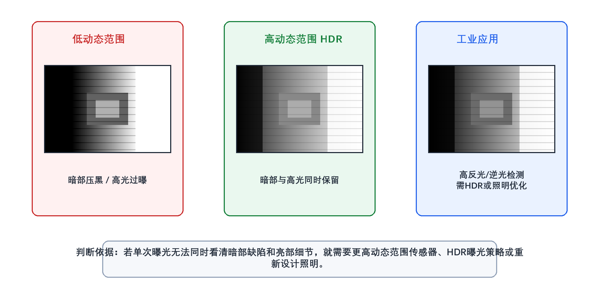
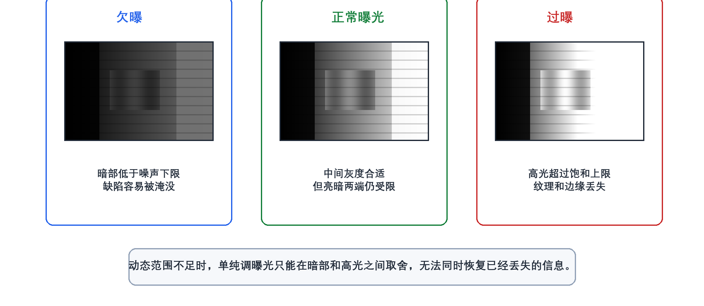
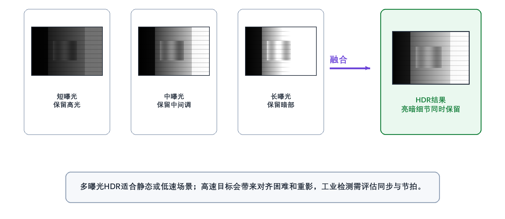
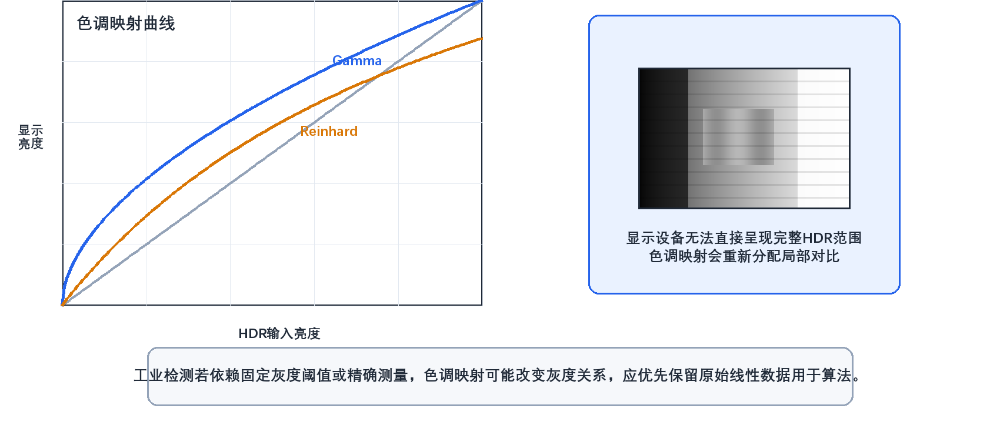

# 5. 什么是相机的动态范围？在什么场景下需要高动态范围（HDR）相机？

> **网络署名：LanQS** · 作者及著作权人：兰青松 · [版权说明](../copyright.md)

#### 5.1 什么是相机的动态范围？

相机的动态范围（Dynamic Range，DR）表示同一次成像中，系统能够同时容纳的最强非饱和信号与最弱可分辨信号之间的跨度。对传感器而言，上限由像素在饱和前可容纳的最大电子数决定，下限则由暗场噪声决定。按照 EMVA 1288 的定义，若饱和容量记为 $\mu_{e.\mathrm{sat}}$，时域暗噪声记为 $\sigma_d$，则动态范围可写成

$$
DR=\frac{\mu_{e.\mathrm{sat}}}{\sigma_d}
\tag{5-1}
$$

有些资料会把分母笼统写成“暗噪声”或“暗场均方根噪声”，工程理解并没有问题，但在引用标准口径时，最好明确这里对应的是电子数单位下的时域暗噪声。动态范围越大，说明相机越有能力同时保住亮部不饱和、暗部不落入噪声底。

动态范围常用 dB 或曝光档数表示。若把上式换成分贝形式，可写为

$$
DR_{\mathrm{dB}}=20\log_{10}(DR)
\tag{5-2}
$$

若换成曝光档数（stop 或 EV），则为

$$
DR_{\mathrm{stop}}=\log_2(DR)
\tag{5-3}
$$

例如某相机的动态范围为 4096:1，则约等于 72 dB，也约等于 12 档。对常见工业相机来说，动态范围大多落在 60 dB 到 80 dB 区间；面向科研或高端成像的相机可以超过 90 dB，但是否真能在现场发挥出来，还要结合曝光方式、照明设计和噪声控制一起判断。

来源：EMVA 1288 Standard 3.0，Section 2.4，[https://www.emva.org/wp-content/uploads/EMVA1288-3.0.pdf](https://www.emva.org/wp-content/uploads/EMVA1288-3.0.pdf)

  

<strong>图5-1 动态范围不足与HDR成像</strong>

图5-1 动态范围不足（左）、HDR成像（中）与工业大光比检测场景（右）的对比。左侧亮部饱和/暗部落噪导致信息丢失，中右通过更宽的记录范围或针对性照明保留亮暗两端细节。

  

<strong>图5-2 欠曝、正常曝光与过曝对可用信息的影响</strong>

图5-2 动态范围不足时调节曝光的三种典型取舍。欠曝保护高光但暗部落噪，正常曝光兼顾中间调但牺牲两端，过曝抬高暗部但高光饱和。已饱和或已淹没于噪声的信息，后续算法难以恢复。

#### 5.2 为什么动态范围对相机很重要？

动态范围之所以重要，是因为真实场景里的亮度差往往远大于单一曝光条件下相机能够舒适覆盖的范围。只要场景中同时存在高反光区域、阴影区、孔洞内部、边缘反射或局部发亮材料，相机就会面临“亮部保不住”或“暗部拉不起来”的矛盾。一旦超出动态范围上限，亮部会直接饱和，像素值被压到顶部，纹理、划痕、字符边界和微小缺陷都可能消失；一旦低于噪声下限，暗部信号又会被底噪掩盖，细节无法稳定重复地呈现出来。

在外观检测里，这个问题往往比人眼直观看到的还严重。比如镜面金属表面的亮斑一旦过曝，原本位于亮斑边缘的压痕、细纹和毛刺就会被整片高灰度区域吞掉；而黑色橡胶、深孔内壁或遮挡阴影中的缺陷，如果落在噪声底附近，即使局部存在真实异常，算法也很难把它和随机波动可靠区分开来。动态范围不足时，工程师常被迫在“保亮部”与“救暗部”之间选一边，这会直接改变检测阈值、误检率和漏检率。

因此，动态范围是一项有实际工程意义的指标。它决定了单帧图像中可用于判断的灰度区间有多宽，也决定了现场是否需要补光、遮光、偏振、分区照明或 HDR 方案配合使用。对于亮暗反差较大的检测任务，动态范围越充足，后续算法就越有余地；但若目标在高速运动或灰度一致性要求很高，仍需结合实拍验证，规格表中的 DR 数值需要结合实际场景做最终确认。

来源：EMVA 1288 Standard 3.0，Section 2.4，[https://www.emva.org/wp-content/uploads/EMVA1288-3.0.pdf](https://www.emva.org/wp-content/uploads/EMVA1288-3.0.pdf)

#### 5.3 什么是高动态范围（HDR）相机？

高动态范围（High Dynamic Range，HDR）相机通常指通过传感器结构、双/多增益读出、多曝光、对数响应或片上合成等方式扩展可记录亮度范围的成像系统。HDR解决的是亮暗跨度过大导致的信息丢失问题，其工程价值取决于场景是否的确需要同时覆盖宽亮度范围——动态目标、频闪光源、测量一致性和算法可解释性仍需单独评估。

**技术实现方式**：
1. **多曝光融合**：在同一场景下拍摄多张不同曝光时间的照片，然后融合为一张HDR图像。这是常见的HDR实现方式。
2. **传感器技术改进**：如双增益传感器、对数响应传感器等，通过硬件设计提高单次曝光的动态范围。
3. **事件相机**：基于亮度变化事件输出的神经形态相机具有很高的动态范围和时间分辨率，但输出不是传统帧图像，通常需要专门算法才能用于检测或重建。
4. **计算摄影技术**：通过算法处理扩展动态范围，如多帧融合、局部色调映射和学习型HDR重建等。

HDR相机的共同特征，是在大光比条件下保留更多亮部和暗部细节，但具体可用动态范围取决于传感器结构、曝光策略、位深、读出噪声和后端处理方式。在工业检测中，更宽的亮度记录能力需满足不破坏节拍、不引入运动伪影、不过度改变灰度一致性等条件才有工程价值；目标静止或运动很慢时多曝光融合较易实施，高速产线更适合考虑单帧HDR、双增益读出或重新设计照明。

  

<strong>图5-3 多曝光HDR融合过程</strong>

图5-3 多曝光HDR融合：短曝光保留高光、长曝光保留暗部、中曝光覆盖中间调，三者融合得到亮暗兼顾的图像。该方案依赖帧间场景基本静止或具备可靠同步；高速运动下可能引入重影和灰度不一致。

  

<strong>图5-4 HDR色调映射与显示压缩</strong>

图5-4 HDR色调映射：左侧曲线表示不同压缩策略重新分配亮度关系，右侧说明显示设备需将HDR范围压缩到可显示区间。显示图像可做色调映射，但依赖固定灰度阈值或精确测量的检测算法应使用原始线性数据。

#### 5.4 在什么场景下需要高动态范围（HDR）相机？

HDR相机常用于亮暗跨度超过普通相机单次曝光能力的场景。是否需要HDR，取决于目标信息是否同时落在饱和上限与噪声下限之外；若通过调整光源、曝光或夹具就能将目标灰度压缩到可检测范围内，未必需要引入HDR。

**5.4.1 逆光拍摄场景**
逆光是典型的HDR应用场景。当主体背对强光源（如太阳、窗户）时，相机可能需要在背景过曝和主体欠曝之间取舍。HDR相机或HDR曝光策略可以缓解这一问题，例如：
- 日出日落时拍摄风景，同时保留天空云彩细节和地面景物
- 室内靠窗拍摄，同时保留窗外风景和室内人物细节
- 背光人像摄影，避免人物面部变黑

**5.4.2 大光比风景摄影**
当场景中存在明亮天空和昏暗地面的强烈对比时，传统相机难以同时记录两者细节：
- 山川湖海景观，天空与水面/地面光线差异显著
- 城市建筑摄影，天空与建筑物形成强烈对比
- 户外街景，阳光直射区域与阴影区域亮度差异大

**5.4.3 室内明暗交错环境**
室内环境中经常存在局部强光和大量阴影：
- 咖啡馆、餐厅等有窗户的环境
- 博物馆、美术馆等有重点照明的场所
- 教室、会议室等有投影或黑板的环境

**5.4.4 夜景与弱光摄影**
夜景拍摄面临复杂的光照条件：
- 城市夜景中的霓虹灯、路灯与黑暗背景
- 星空摄影中的星星与黑暗天空
- 室内弱光环境中的局部光源

**5.4.5 专业与工业应用**
专业和工业场景对动态范围通常有更高要求，尤其是在目标表面反光强、局部透光或亮暗区域同时参与判定时：
- **天文观测**：同时捕捉明亮星体和微弱星云
- **自动驾驶**：在强烈阳光下和隧道阴影中都能清晰识别道路和障碍物
- **医学成像**：在X光、内窥镜等应用中需要捕捉广泛的亮度范围
- **工业检测**：检测高反光表面的缺陷，如金属、玻璃等
- **安防监控**：在昼夜交替、逆光等复杂光照条件下保持清晰监控

**5.4.6 动态场景HDR成像**
动态场景中，传统多曝光HDR融合面临对齐困难和重影问题；事件相机辅助或单帧HDR传感器可缓解多曝光对齐困难与重影问题，但工程可用性取决于算法、硬件同步和任务需求：
- 处理运动物体引起的重影问题
- 在较大曝光差异下改善图像质量
- 应用于体育摄影、野生动物摄影等动态场景

#### 5.5 HDR技术的发展趋势与挑战

**技术发展趋势**：
1. **实时HDR处理**：随着传感器读出速度和计算能力提升，实时HDR处理逐步进入工程应用。
2. **深度学习增强**：基于神经网络的HDR重建技术，如HDR-NeRF、HDR-GS等，正在扩展复杂光照场景下的重建能力。
3. **硬件传感器创新**：对数响应传感器、双增益传感器、事件相机等新型传感器，为大光比成像提供了不同路径。
4. **多模态融合**：结合RGB、深度、事件等多种传感器数据，可在动态场景中补充传统帧图像的不足。

**技术挑战**：
1. **计算复杂度**：HDR处理通常需要更多读出、缓存和计算资源，可能影响实时性。
2. **运动伪影**：动态场景中的多曝光对齐和重影问题，会影响缺陷位置和测量一致性。
3. **色调映射**：HDR图像压缩到普通显示或算法输入范围时，可能改变局部对比关系。
4. **标准化**：HDR格式、显示标准和工业检测中的灰度一致性评价仍需要结合具体应用定义。

**应用边界**：
随着HDR技术成熟，它正在从专业领域向消费级产品和工业相机中扩展。智能手机、消费级相机和部分工业相机都已集成HDR功能，但工业检测中的HDR选择应更加克制：如果检测对象高速运动，多曝光HDR可能引入重影；如果光源存在频闪或同步不稳定，不同曝光帧之间的亮度关系可能失真；如果算法依赖固定灰度阈值或精确测量，色调映射还可能改变原始灰度关系。因此，在工业检测中是否启用HDR，应根据运动速度、光源稳定性、节拍、测量一致性和算法鲁棒性共同决定。
