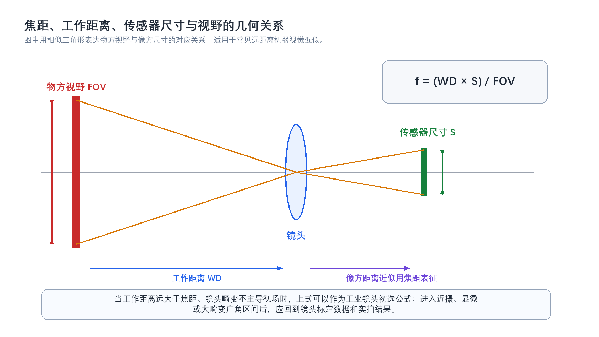

# 7. 镜头的焦距、光圈（F值）、工作距离、视野之间有什么关系？如何根据工作距离和视野计算所需焦距？

> **网络署名：LanQS** · 作者及著作权人：兰青松 · [版权说明](../copyright.md)

镜头参数之间构成一组相互牵连的成像约束。焦距决定放大关系，工作距离限定安装边界，传感器尺寸决定像方承载范围，光圈则在进光量、景深和分辨率之间重新分配余量。 工程上讨论镜头选型，如果只报一个焦距数字，往往是不够的。

#### 7.1 什么是镜头的基本光学参数及其物理意义？

镜头选型涉及五个基本光学参数：**焦距**、**工作距离**、**视野**、**光圈**和**传感器尺寸**。

- **焦距**：镜头光学中心到像面的距离，决定视角和放大倍率。焦距越长，视野越窄，目标在传感器上铺得越大。
- **工作距离**：镜头前端到目标表面的安装距离。工作距离越远，同焦距同传感器下视野越大。
- **视野**：当前参数组合下相机能覆盖的物方范围（宽度 × 高度）。
- **光圈（F 值）**：焦距与有效孔径之比，决定进光量和景深。F 值越小，通光越多但景深越浅；F 值越大，景深越深但曝光需求越高，小像元系统中过度收小光圈还会加重衍射损失。
- **传感器尺寸**：虽常被归为相机参数，但它与焦距共同决定最终视野，镜头选型中必须一并考虑。

这五个参数之间构成相互牵连的约束：改变其一，其余至少一个会联动变化。工程上讨论镜头选型，如果只给出一个焦距数字而不配套工作距离和传感器尺寸，往往无法判断方案是否成立。

#### 7.2 焦距与视野之间有什么直接关系？
在工作距离和传感器尺寸固定时，焦距与视野近似成反比。短焦镜头覆盖范围更大，适合大视野观察；长焦镜头视野更窄，但能让单位目标尺寸占据更多像素。工业检测里，这一关系通常直接体现在像素精度与安装空间的博弈上：想看得更细，就要么拉长焦距，要么减小视野，要么增大传感器尺寸。

焦距的变化还会连带影响景深和畸变风险。短焦距镜头虽然容易获得大视野，但边缘畸变和照明均匀性通常更值得警惕；长焦距镜头则对安装抖动、对焦精度和机械稳定性更敏感。

#### 7.3 工作距离如何影响视野范围？
在焦距和传感器尺寸不变时，工作距离增大，视野也会随之增大。这是相似三角形关系的直接结果。对于现场安装空间受限的项目，这一点尤其关键，因为很多“理论上合适”的焦距，落到设备里后可能根本没有足够工作距离来实现目标视野。

工程上常见的误区，是先按经验挑一个镜头，再试图靠前后挪动相机去凑视野。若设备空间已经固定，正确顺序应当是先锁定工作距离边界，再反推焦距，而不是把工作距离当成最后再调的自由变量。

#### 7.4 光圈（F值）如何与其他参数相互作用？
光圈不直接改变视野，却会改变系统是否“能把这个视野拍清楚”。F 值越小，通光量越大，弱光条件下更容易获得短曝光；但景深会变浅，焦外模糊加重。F 值越大，景深增加，目标厚度变化的容忍度变好，不过曝光时间常常需要加长，且在小像元、高分辨率系统中，过度收小光圈会触发更明显的衍射损失。

因此，光圈参数在镜头选型中更像是一个系统平衡旋钮。它和照明、曝光、传感器像元尺寸、运动速度一起决定最终图像质量，而不是孤立存在。

#### 7.5 如何用公式表达这些参数之间的关系？
在常见机器视觉场景中，若工作距离远大于焦距，且镜头并未工作在强近摄或显微区间，焦距、工作距离、传感器尺寸与视野之间可用近似式表示为：

$$
f = \frac{WD \times S}{FOV}
\tag{7-1}
$$

其中，$f$ 为镜头焦距，$WD$ 为工作距离，$S$ 为传感器在对应方向上的有效尺寸，$FOV$ 为同一方向上的物方视野。若做横向视野计算，就应使用传感器横向尺寸；若做纵向视野计算，则应使用纵向尺寸，不能把传感器对角线尺寸直接代入。

#### 7.6 如何根据已知的工作距离和视野计算所需焦距？
计算步骤并不复杂，但每一步的定义必须对齐。先确定目标在图像中需要覆盖的物方宽度或高度，也就是 $FOV$；再确认设备允许的工作距离 $WD$；随后查到相机传感器在对应方向上的实际尺寸 $S$。三者代入式（7-1），即可得到理论焦距。

例如，若目标横向视野要求为 200 mm，工作距离为 500 mm，传感器横向尺寸为 8 mm，则理论焦距为：

$$
f = \frac{500 \times 8}{200} = 20\ \text{mm}
\tag{7-2}
$$

得到理论值后，还要落到标准镜头规格上。若市场上更常见的是 16 mm、20 mm、25 mm，则通常会优先考虑 20 mm，并结合实际畸变、安装余量和视野边界做验证，而不是把计算值当作无需修正的最终答案。

  

<strong>图7-1 焦距、工作距离、传感器尺寸与视野的几何关系</strong>

将焦距、工作距离、传感器尺寸和视野置于同一相似三角形框架中。该公式隐含前提为工作距离明显大于焦距且镜头工作在常规区间；进入近摄、显微或远心系统后仅作方向参考，最终选型仍需回到标定数据与实拍验证。

#### 7.7 在实际应用中需要考虑哪些修正因素？
理论焦距只是第一轮筛选结果。广角镜头的桶形畸变、长焦镜头的视野压缩、传感器保护玻璃引入的边缘表现变化，都可能让实际可用视野与理论值出现偏差。若任务对边缘测量精度敏感，通常会在计算视野之外额外留出安全边界。

另一个常被低估的因素是分辨率目标。视野满足了，不代表像素精度一定满足；焦距算对了，也不代表景深足够。镜头选型通常至少要与像素精度、景深、畸变和照明四个约束一起联审。

#### 7.8 如何选择合适的镜头参数组合？
更稳妥的流程是：先根据检测精度反推所需像素精度，再确定视野范围；在设备空间内锁定工作距离；按照式（7-1）得到初始焦距；随后检查该焦距下的景深、畸变、照明布置和机械安装空间，必要时联动调整传感器尺寸或照明方案。

对于多数工业项目，中等光圈区间通常更容易兼顾成像质量和景深，例如 f/4 到 f/8 常见，但各系统应根据自身像元和分辨率确认最适合的光圈。像元尺寸更小、分辨率更高的系统，对衍射更敏感，光圈需要谨慎选择，过小的光圈可能让图像细节被衍射软化。

#### 7.9 有哪些常见的应用场景和对应的参数选择策略？
大视野外观检测通常采用较短焦距与适中的工作距离，先保证覆盖范围，再通过高分辨率传感器补足像素密度。精密尺寸检测则更倾向于较稳定的放大关系和更严格的畸变控制，必要时还会转向远心镜头。对于近距显微观察，简单套用式（7-1）就不再可靠，往往需要参考镜头厂商给出的工作距离曲线、放大倍率和 MTF 数据。

参数选择策略没有统一模板，但有一条经验几乎总是成立：先把任务量化，再谈镜头型号。只说“想看清楚一点”或“想拍大一些”，不会导向稳定选型。

<strong>表7-1 镜头主要参数变化对系统表现的影响</strong>

| 参数变化 | 对视野的影响 | 对景深的影响 | 对进光量/曝光的影响 | 工程含义 |
|---------|-------------|-------------|-------------------|---------|
| 焦距增大 | 视野减小 | 通常变浅 | 无直接增加 | 放大目标细节，但安装和对焦更敏感 |
| 工作距离增大 | 视野增大 | 通常变深 | 无直接增加 | 有利于景深，但设备空间要求更大 |
| F 值增大 | 不直接改变视野 | 变深 | 进光量下降 | 有利于厚度容忍度，但可能拉长曝光 |
| 传感器尺寸增大 | 同焦距下视野增大 | 无必然单独结论 | 无直接增加 | 可扩大覆盖范围，但镜头像场需匹配 |

---
