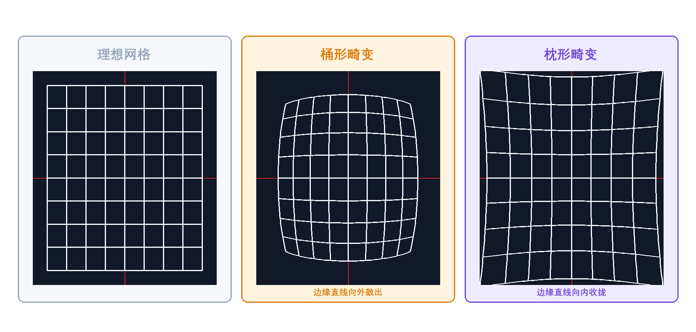
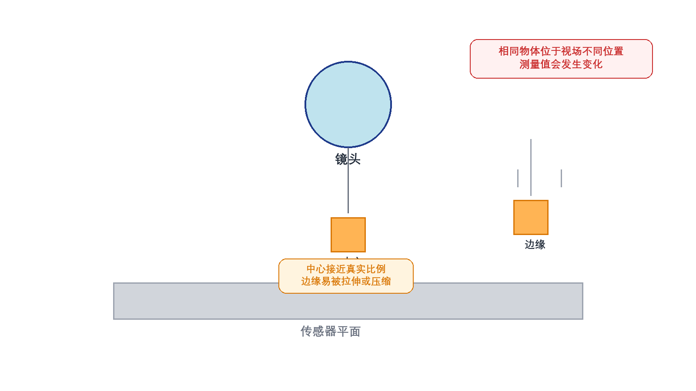

# 11. 什么是镜头畸变？它对测量精度有什么影响？如何校正？

> **网络署名：LanQS** · 作者及著作权人：兰青松 · [版权说明](../copyright.md)

#### 11.1 什么是镜头畸变？它的物理本质是什么？

镜头畸变的本质可以概括为一句话：**畸变 = 像素位置与真实物理位置的映射关系被改写了**。它不同于散焦和模糊——散焦是边界发虚，噪声是灰度起伏，而畸变是物方原本应保持直线或比例关系的结构在图像中出现弯曲、拉伸或压缩。图像可能仍然清晰，但原本相距 10 mm 的两点，落到图像里后不再按理想比例映射到应有位置。这种偏移来自镜头对离轴光线的成像不完全满足理想投影模型，尤其在视场边缘更容易累积。

对普通观察任务而言，轻微畸变可能只是画面观感上的变化；对尺寸测量、边缘定位、圆度判断和拼接定位而言，畸变会直接进入误差预算。只要测量结果依赖像素坐标的物理意义，畸变就需要单独建模和验证，而不能仅当作光学细节处理。很多初学者容易把它理解成"图像稍微变形了一点"，但工程上的含义要具体得多。系统依据像素坐标判断尺寸、角度、孔距或装配偏差时，每一个像素背后默认对应着某个物理位置。畸变一旦存在，这种对应关系在全视场内不再保持一致，测量结果也就不再稳定。

  

<strong>图11-1 径向畸变的典型形态对比</strong>

图11-1将无畸变、桶形畸变和枕形畸变放在同一连续网格参考下比较，读者应重点观察边缘直线的弯曲方向，而不是只看图案是否“变形”。桶形畸变表现为边界向外鼓出，枕形畸变则表现为边界向内收拢，这种方向差异比名称本身更适合作为初学者的识别入口。它同时提醒读者，径向畸变是整幅视场坐标映射的系统偏移，不是零散局部的随机形变；真实镜头还可能叠加切向畸变、传感器倾斜和装调误差，因此最终判断仍需结合标定结果和实拍验证。

#### 11.2 镜头畸变有哪些主要类型？各自的表现特征是什么？

工程上最常见的是**径向畸变**和**切向畸变**。径向畸变沿视场中心向外的半径方向起作用，桶形畸变和枕形畸变都属于这一类，它们的区别不在于名字本身，而在于离图像中心越远时，图像点究竟是被继续向外推开，还是被拉回中心方向。对读者来说，最实用的辨认方法不是去背公式，而是看那些原本应当保持笔直的边界线在画面边缘的弯曲方向。

**桶形畸变**的典型表现是边缘直线向外鼓出，整幅画面像被从中心向四周撑开，因此越靠近边缘，原本平直的网格越容易呈现外凸形态，广角镜头中较常见。**枕形畸变**则相反，边缘直线会向内收拢，画面仿佛被从四角往中心拉回，长焦或部分复杂变焦结构中更容易出现。鱼眼镜头所呈现的强烈弯曲，本质上也可视为大视场下的极端径向畸变，只是通常需要单独的投影模型描述，不能直接沿用普通小畸变镜头的简化判断。

切向畸变与镜头装调误差关系更紧。若透镜组中心轴线不完全重合，或镜头与传感器相对姿态存在偏斜，图像点会沿切向发生偏移，局部结构会表现为不对称扭曲。它不像典型桶形或枕形那样具有很强的整体对称性，往往不会表现成规整的“向外鼓”或“向内收”，而更像某个方向上的局部拉斜、偏移或剪切，因此在高精度系统中更依赖实际标定结果，而不能凭经验估计。

#### 11.3 镜头畸变对测量精度会产生怎样的具体影响？

畸变最直接的后果，是**同一物理尺寸在图像不同位置对应不同的像素尺度**。如果系统仍按统一像素当量换算，中心和边缘的测量结果就会分离。对孔径、外轮廓、直线度和圆度等几何特征来说，误差往往不是一个固定偏置，而是随位置变化的非线性误差场。换一种更便于理解的说法，未校正畸变会让系统默认使用一把“刻度不均匀的尺子”：在视场中心，这把尺子可能还比较准；到了边缘，同样的像素间距代表的物理长度却已经悄悄变化。

第二类影响来自形状判断。圆可能被测成椭圆，平行边界可能出现弯曲，直线拟合残差会在边缘区域突然放大。更麻烦的是，畸变还会破坏测量一致性：即便工件本身不变，只要它在画面中的落点改变，结果也可能改变。对自动化检测而言，这会让算法阈值和补偿参数失去稳定基础。工程上最棘手的往往不是某一次测得不准，而是同一件工件在不同工位、不同批次或不同落点下出现漂移，这种漂移很容易被误判为机械不稳、治具偏移或算法波动，实际上根源可能只是几何畸变没有被充分处理。

  

<strong>图11-2 畸变导致的位置相关测量误差</strong>

图11-2用同一尺寸物体位于视场中心和边缘的对比，说明测量误差为何具有明显的位置依赖性。中心区域通常更接近镜头标称成像条件，边缘区域则叠加了更强的径向偏移，因此相同像素计数不再对应相同物理长度。对整幅画面统一测量的系统而言，校正的目的并不只是拉直图像，而是重建全视场的一致坐标关系；若工件始终停留在很小的中心区域，影响可能被压缩，但只要目标位置漂移、视场扩大或需要多工位复用，未校正畸变很快就会成为主导误差源。

#### 11.4 如何通过数学模型描述镜头畸变？

工业视觉中最常用的是 Brown-Conrady 模型。设 $(x,y)$ 为归一化理想像点坐标，$r^2=x^2+y^2$，则径向畸变可写为：

$$
x_r = x\left(1+k_1r^2+k_2r^4+k_3r^6\right),\quad
y_r = y\left(1+k_1r^2+k_2r^4+k_3r^6\right)
\tag{11-1}
$$

其中 $k_1,k_2,k_3$ 为径向畸变系数。切向畸变常写为：

$$
x_t = x + 2p_1xy + p_2(r^2+2x^2),\quad
y_t = y + p_1(r^2+2y^2) + 2p_2xy
\tag{11-2}
$$

其中 $p_1,p_2$ 为切向畸变系数。对初学者而言，式（11-1）和式（11-2）不必急于背诵，更重要的是理解它们分别在描述什么：径向项刻画的是点越远离光轴，偏移通常越明显；切向项刻画的则是装调不理想时，图像点会沿非对称方向发生附加偏移。实际校正时，软件依据上述模型做逐像素反向映射，再通过插值重建无畸变图像，这不是简单的线性拉伸。也正因如此，校正后的图像边缘分辨率、插值平滑程度和有效视场范围都可能发生变化，"几何被拉正"不应被误认为是"图像质量在所有方面都同步提高了"。系数的物理意义和符号方向要以具体软件库为准，尤其在 OpenCV、MATLAB 或厂商 SDK 之间比较参数时，必须确认坐标归一化和映射约定是否一致。

> **引用出处**：Brown-Conrady 畸变模型的标准定义与 5 系数向量 $(k_1,k_2,p_1,p_2,k_3)$ 参见 OpenCV 4.x 官方文档——Camera Calibration and 3D Reconstruction 模块，畸变公式与参数说明（[docs.opencv.org/4.x/d9/d0c/group__calib3d.html](https://docs.opencv.org/4.x/d9/d0c/group__calib3d.html)）。

OpenCV 把这个模型表示为一行5列的畸变系数向量：distCoeffs=(k1,k2,p1,p2,k3)，k3主要用于鱼眼或超大视场镜头。在调用 cv2.calibrateCamera() 时，返回的 dist 数组就是这个5系数的向量。工业相机通常只需 k1,k2,p1,p2 四个参数即可满足校准需求。

#### 11.5 张正友标定法是如何工作的？它有哪些优势和局限？

张正友标定法（Zhang, 2000, *A Flexible New Technique for Camera Calibration*）以平面标定板（通常为棋盘格）为基准，拍摄多张不同位置和角度的图像，从中同时求解相机内参、畸变系数和每幅图的外参。OpenCV 中对应的核心函数是 `cv::calibrateCamera()`，其典型流程如下：

1. **准备标定板**——打印或固定高精度棋盘格（如 7×6 内角点），标定板应尽量平整。
2. **多角度拍摄**——保持相机不动，将标定板放在不同位置、不同倾斜角度下分别拍摄。图像数量至少 10 张才能稳定收敛。
3. **构建 3D 物点**——将标定板定义在 Z=0 平面上，按实际方格尺寸给出每个角点的世界坐标 $(X,Y,0)$。
4. **提取 2D 角点**——用 `cv::findChessboardCorners()` 检测棋盘格内角点，再用 `cv::cornerSubPix()` 精化至亚像素精度。
5. **执行标定**——调用 `cv::calibrateCamera()` 输入全部物点和像点，返回相机内参矩阵 `mtx`（含 $f_x,f_y,c_x,c_y$）、畸变系数 `dist`（5 个系数 $k_1,k_2,p_1,p_2,k_3$）、旋转向量 `rvecs` 和平移向量 `tvecs`。
6. **评估精度**——用 `cv::projectPoints()` 将物点按标定参数投影回图像，计算投影点与实测角点之间的 L2 范数，再对所有图和点取算术平均，得到平均重投影误差（RMS）。该值越接近零，标定结果越可靠。

张正友标定法之所以被广泛采用，一方面是因为它不依赖昂贵的三维标定设备，仅凭平面标定板即可获得较完整的内参和畸变参数；另一方面是因为 OpenCV、MATLAB 等工具已提供成熟、易操作的封装，降低了入门门槛。局限也同样明确：角点检测质量直接决定结果上限，标定板平整度、光照均匀性、边缘覆盖范围和姿态多样性都会影响拟合稳定性。重投影误差虽能反映参数对当前数据的一致性，却不一定代表真实世界的测量精度，因此高要求的项目还需结合已知尺寸的标准件或精密平移台做二次验证。若镜头是鱼眼、大视场或特殊投影结构，普通 pinhole + Brown 模型往往不够，需切换到 `cv::fisheye` 等更合适的广角模型。

> **引用出处**：OpenCV 4.x 官方文档，Camera Calibration and 3D Reconstruction 模块——`cv::calibrateCamera()`、`cv::projectPoints()`、畸变模型（Brown-Conrady）的定义与使用说明（[docs.opencv.org/4.x/d9/d0c/group__calib3d.html](https://docs.opencv.org/4.x/d9/d0c/group__calib3d.html)）。

在 OpenCV 中，完整流程对应：用 cv2.findChessboardCorners() 检测棋盘格内角点，cv2.cornerSubPix() 精化至亚像素，cv2.calibrateCamera() 一次性求解内参矩阵 mtx（含 fx,fy,cx,cy）、畸变系数 dist（k1,k2,p1,p2,k3）、旋转向量 rvecs 和平移向量 tvecs。该函数返回的 ret 即为 RMS 重投影误差。图像数量至少 10 张才能稳定收敛。

#### 11.6 除了张正友标定法，还有哪些镜头畸变校正方法？

除了基于棋盘格的通用标定，工程上还会使用直线约束法、圆点阵列标定、鱼眼专用投影模型和在线自适应校正。直线约束法适合现场没有标准棋盘格但存在大量直边结构的场景；圆点阵列在某些高精度测量中更利于中心定位；鱼眼镜头通常要采用等距投影、等立体角投影（equisolid angle）等专用模型。

还有一种思路是从源头降低畸变，而不是完全依赖软件补偿。例如选择低畸变工业镜头、增大工作距离、缩小有效视场，或者在测量场景中直接采用远心镜头。软件校正可以显著改善几何关系，但无法补回原本不存在的光学分辨率。

#### 11.7 在实际应用中如何选择和执行畸变校正？

若任务只是粗略定位或识别，且目标始终位于画面中央的小区域，简单标定往往已足够；若任务涉及整幅画面的尺寸测量、拼接定位或位置一致性比较，就应把畸变校正作为标准流程，而不是可选项。执行时最好覆盖整个视场，尤其不能只拍中心区域，因为模型的约束主要来自边缘。

实际操作中应同时检查三件事：标定板是否足够平整，图像是否有反光和阴影，工作时的焦距、光圈和工作距离是否与标定状态一致。若镜头重新调焦、机台温升明显、镜头或相机被拆装，原先的畸变参数都可能失效，需要重新标定或至少复核。

OpenCV 提供了两条常用路径。cv2.undistort() 一步完成去畸变和插值，适合单张图像或调试验证。cv2.initUndistortRectifyMap() 预计算映射表，再用 cv2.remap() 逐帧应用，批量处理时效率远高于每次调用 undistort。调用 cv2.getOptimalNewCameraMatrix() 时，参数 alpha=0 裁剪全部黑边（保留有效像素），alpha=1 保留全部像素（边缘出现黑边）。

#### 11.8 镜头畸变校正后的效果如何验证？

第一层验证是重投影误差，但它不能代替全部工程判断。重投影误差足够小，只能说明模型对标定样本拟合得不错，并不自动保证实际工件测量也达标。第二层验证应当转到应用层：拍摄标准直线、标准圆和标准尺寸件，比较中心与边缘位置的结果是否一致。

更稳妥的做法，是在真实产线状态下做位置扫描测试。让同一标准件在视场不同区域重复采集，统计尺寸漂移、圆心漂移或边缘残差变化。只有当这些指标在工艺容差内稳定收敛，畸变校正才算真正完成，而不是仅停留在标定流程已完成的层面。

重投影误差的定量计算：cv2.projectPoints() 将标定板 3D 角点投影回像平面，与实际检测角点逐点求 L2 范数，取所有图片所有点的算术平均得到 RMS。工程阈值：一般工业检测 <0.5 pixel 可接受，精密测量宜 <0.3 pixel。误差过大的常见原因：标定板不平整（纸板翘曲）、部分角点漏检、拍摄姿态单一（缺少边缘和倾斜角度）。

> **引用出处**：Brown-Conrady 畸变模型、cv2.calibrateCamera()/cv2.undistort()/cv2.initUndistortRectifyMap() 的用法与参数、重投影误差计算公式，参见 OpenCV 4.x 官方教程——Camera Calibration（docs.opencv.org/4.x/dc/dbb/tutorial_py_calibration.html）。

---
