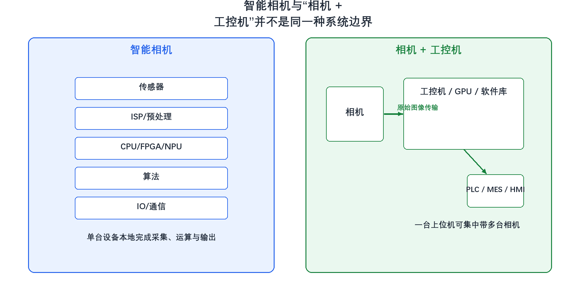
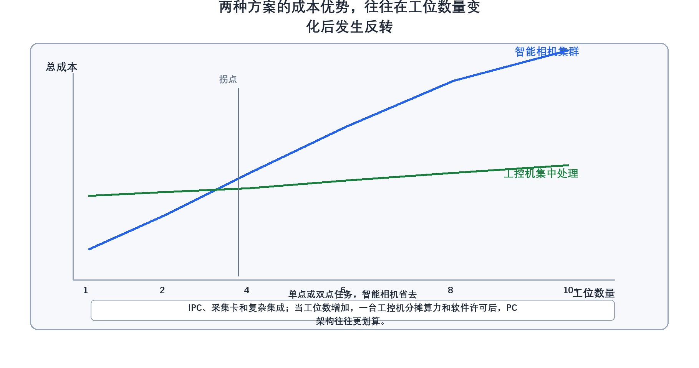

# 26. 什么是智能相机？它与相机+工控机方案相比，优劣势是什么？

> **网络署名：LanQS** · 作者及著作权人：兰青松 · [版权说明](../copyright.md)

#### 26.1 智能相机的基本定义是什么？
智能相机是一台把相机、处理器、运行环境和基础视觉功能封装在同一外壳中的嵌入式视觉设备。它通常包含图像传感器、图像预处理模块、CPU 或 FPGA、存储资源、通信接口以及本地执行的视觉工具链，能够在设备本体内完成采图、运算和结果输出，而不是把原始图像全部送到外部工控机后再处理。

这个定义里更值得把握的是系统边界发生了变化。在智能相机架构中，单台设备往往就对应一个完整检测节点；在相机加工控机架构中，相机更接近数据源，真正的算力、软件环境和业务逻辑集中在上位机。理解这一点，后面的实时性、成本和维护差异才不会被误解成代际高低之分。

#### 26.2 智能相机的技术架构包含哪些关键组件？
一台典型智能相机通常包括图像传感器、图像信号处理（ISP）或基础预处理链路、嵌入式 CPU / FPGA / NPU、运行时系统、内存和非易失存储、以太网或串口等通信接口，以及数字 IO。很多设备还会提供图形化配置环境、脚本接口或内置视觉工具库，使用户能够在相机端直接完成读码、定位、OCR、模板匹配或简单测量。

需要补充的是，不同厂商的智能相机能力跨度很大。有些产品更接近带工具包的嵌入式读码器，适合固定任务；有些则已经具备一定的脚本化与 AI 推理能力，但即便如此，它们与可自由扩展 CPU、GPU、内存和磁盘的工控机平台仍不属于同一量级的计算环境。

  

<strong>图26-1 智能相机与相机+工控机系统边界对比</strong>

图26-1左侧把智能相机拆成传感器、预处理、嵌入式运算、算法和通信输出等几个内部层级，强调它在单机内闭合完成采图和判定。右侧则把相机加工控机拆成采集端、上位机运算端和外部控制系统，突出图像传输和集中处理链路。读者应从图中看出，两种方案差别不在于是否都能做视觉，而在于计算资源、软件环境和系统边界分别落在哪里。这张图适合做架构入门，但不能直接代替选型结论，因为真正的优劣还要继续看任务复杂度、工位数量和维护方式。

#### 26.3 相机+工控机方案是如何工作的？
在这种传统机器视觉架构中，相机负责采集图像，再通过 GigE、USB3、Camera Link 或 CoaXPress 等接口把数据传到工控机。真正的图像处理、算法执行、结果存档、数据库交互和界面显示，主要都发生在工控机端。工控机可以安装标准视觉库、定制业务软件、GPU 推理环境和多线程调度系统，因此更适合承载复杂任务、多个工位协同和较重的数据处理流程。

它的代价也很明确。系统体积更大，布线更多，软硬件依赖关系更复杂，集成时还要处理操作系统、驱动、采集卡、许可和网络配置。它并非所谓的低级方案，而是开放度更高、系统负担也更重的方案。

#### 26.4 智能相机在系统集成方面有哪些优势？
它的集成优势主要体现在三点。第一，系统短，安装时通常只需要电源、通信和 IO，不需要额外配置独立 IPC、采集卡和完整视觉主机。第二，物理体积小，适合安装空间紧张、布线困难或设备分散的工位。第三，任务边界清晰，一台设备往往对应一个检测点，问题定位和替换也相对直接。

这类优势在单点或双点、任务固定、节拍明确的场景里特别明显。例如简单有无检测、读码、固定模板比对、单一工位字符检查，智能相机常常能以较少的集成工作量快速落地。它减少的并不只是硬件数量，更是系统联调和维护接口的复杂度。

#### 26.5 智能相机在实时性方面相比传统方案有何特点？
对简单、固定、局部闭环的任务，智能相机常有不错的端到端响应，因为图像不必先完整传到外部主机再参与调度和处理。本地处理减少了传输、缓存和操作系统调度带来的额外路径，对读码、有无判断和局部定位这类任务尤其有效。

智能相机的实时性优势有其适用范围。若任务包含大分辨率图像、复杂多步流程、深度学习推理、点云处理或多相机协同，嵌入式算力本身可能成为更大的延迟来源。此时工控机端虽然多了一段传输，但总时延反而可能更低。因此，实时性必须放在算法复杂度是否与嵌入式算力匹配的前提下讨论。

#### 26.6 智能相机在部署和维护方面有哪些便利性？
它更接近标准化工业设备，而不是一台缩小版 PC。部署时，用户常常通过图形化界面完成参数配置、训练模板、设置 IO 和结果输出；维护时，也更偏向固件升级、作业备份和参数迁移，而不是完整的软件环境重装。对没有专职视觉软件工程师的现场团队来说，这种维护方式更友好。

不过便利性有其边界。若项目需要频繁改流程、增加复杂逻辑、做数据库联动或和多套上位系统耦合，智能相机的维护优势就会逐渐减弱，因为系统变化开始超出它擅长的封闭任务边界。

#### 26.7 智能相机在成本方面有哪些考虑？
成本判断最容易出错，因为很多人只看单台采购价，而忽略总拥有成本。对单点工位，智能相机往往能省掉 IPC、采集卡、系统安装、软件许可和电控箱空间，看起来单价高一些，整体项目却可能更便宜；但当工位数量增加后，情况常会反转。一台工控机可以集中带多台普通工业相机，算力、软件许可和运维成本被多工位分摊，PC 架构的总成本曲线通常会更平。

因此，智能相机的成本优势常出现在工位少、任务相对简单、工程投入希望尽量收敛的项目里；工控机架构的成本优势则更常出现在多相机协同、多工位集中处理、复杂任务或需要统一管理的系统中。讨论成本时，至少要同时看硬件采购、软件许可、开发投入、维护方式和扩展代价。

  

<strong>图26-2 两种架构的成本优势随工位数量变化而反转</strong>

图26-2把工位数量作为横轴，把总成本作为纵轴，分别画出智能相机集群与工控机集中处理两条典型趋势线。蓝线表示随着工位增加，需要重复购买内置算力和算法能力的智能相机，总成本上升更快；绿线表示工控机端的算力、许可和集成代价可以被多个工位分摊，因此曲线更平。两条曲线在中后段出现交叉，表达的正是单工位与多工位场景下成本优势可能发生反转。图中的拐点不是固定数字，而是提醒读者：成本优势不是静态的，它会随着工位数、算法复杂度和许可模式变化。这张图适合作为 TCO 讨论入口，但不能替代具体报价和算力核算。

#### 26.8 智能相机在灵活性方面存在哪些局限性？
局限主要来自可扩展性。它的处理器、内存和软件环境通常是固定的，能做的任务范围取决于厂商开放程度和本体算力。一旦项目从简单读码发展为复杂缺陷检测、深度学习分级、跨工位协同或数据库驱动流程，用户会明显感到它不像 PC 那样容易扩展。

还有一个容易被忽略的限制是开发自由度。许多智能相机非常适合用现成工具快速完成标准任务，但若项目需要更深的自定义逻辑、特殊预处理、复杂结果管理或第三方库整合，封闭平台就会成为约束。

#### 26.9 相机+工控机方案在处理复杂任务时有哪些优势？
优势集中在算力、软件自由度和系统整合能力。高性能 CPU、GPU、大内存和成熟操作系统使它更适合多线程处理、深度学习推理、3D 数据处理、大图像缓存、复杂界面以及与 MES、ERP、PLC、数据库的深度集成。很多真正难做的项目，难点不在采图，而在后续的业务联动和异常处理流程，这正是工控机平台更有空间的地方。

它的开放性也意味着更高的工程责任。系统设计者必须自己处理驱动、资源调度、版本兼容、异常恢复和长期维护，这些都是智能相机方案里被平台封装掉的一部分工作。

#### 26.10 两种方案在系统可靠性和稳定性方面有何差异？
智能相机的可靠性优势，通常来自结构短、连接少、软件环境封闭，因而外部变量较少；工控机方案的可靠性，则更多取决于系统设计是否成熟，包括电源、散热、网络、操作系统维护、磁盘策略和异常恢复机制。前者天然更适合标准化节点，后者则更依赖工程能力。

真正的结论不应落成简单的二选一口号。更准确的说法是：单节点、固定任务、追求快速落地时，智能相机常更省心；多工位、复杂逻辑、需要持续扩展时，工控机架构通常更有长期优势。

---
