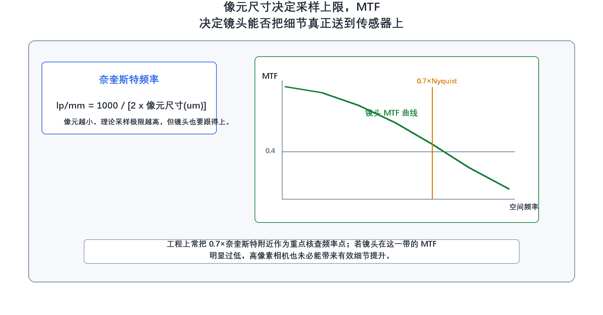

# 27. 如何阅读一份相机或镜头的官方数据手册？你会最关注哪些参数？

> **网络署名：LanQS** · 作者及著作权人：兰青松 · [版权说明](../copyright.md)

#### 27.1 为什么机器视觉工程师必须精通阅读数据手册？
阅读数据手册的唯一目的，是确认硬件的物理边界是否满足任务要求。机器视觉项目能否落地，很多情况下不是败在算法，而是败在前端物理条件选错——快门类型不对、靶面不匹配、接口带宽不够、镜头像场不足、温度范围被忽略，这些问题在现场几乎无法靠软件弥补。

因此，读数据手册应依次回答三个层面的问题：这台相机能否在给定节拍下稳定出图；这支镜头能否把目标视场与细节真实投射到传感器上；这套接口和环境指标能否支撑产线长期运行。

#### 27.2 阅读工业相机数据手册时，最核心的基础硬件参数有哪些？
最先看的是快门类型、分辨率、帧率、像元尺寸、靶面尺寸和接口类型。快门类型决定能否拍运动目标；分辨率与像元尺寸共同影响空间采样能力；帧率决定产线节拍和缓存压力；靶面尺寸决定镜头像场匹配；接口类型决定带宽、线缆长度和主机侧配置需求。

如果要继续判断这台相机在弱光、测量一致性和极限灰度表现上的真实能力，就不能只停留在这一级，还要把 EMVA 1288 体系里的基础光电参数一起读懂。其中最值得优先关注的是量子效率 $\eta$（Quantum Efficiency，QE）。它表示入射光子最终转化为有效电子的比例，数值越高，在相同照度和曝光时间下能得到的电子数越多，低照度下更容易获得较高的信噪比。满阱容量 $\mu_{e.\mathrm{sat}}$（Full Well Capacity）表示单个像素在饱和前最多能容纳多少电子，它直接关系到高亮区域会不会过早饱和，也决定动态范围上限。读出噪声 $\sigma_d$ 通常以电子数 e- 表示，反映读出链路本身引入的随机波动；在短曝光、弱光和高速采集场景中，这个数值往往比标称位深更能说明图像底噪水平。

暗电流通常用 e-/pixel/s 表示，说明像素在无光时每秒仍会因为热激发积累多少电子。长曝光、高温环境或需要看暗部细节时，暗电流及其波动不能忽略。DSNU（Dark Signal Non-Uniformity）表示暗场下不同像素的基线输出不一致，PRNU（Photo Response Non-Uniformity）表示均匀照明下不同像素对光的响应不一致，后者常以百分比给出。这两项参数看起来不如分辨率直观，却直接关系到平场均匀性、阈值稳定性和高精度测量重复性，尤其在面阵拼接、低对比缺陷检测和定量成像任务中影响很大。

这一层参数的价值，在于先排除明显不可能的方案，再进一步判断它的物理边界是否真的适合当前任务。低照度检测更关心高 QE 和低读出噪声，大光比场景更关心满阱容量与动态范围，长曝光应用要警惕暗电流，做均匀性要求很高的定量分析则必须把 DSNU 和 PRNU 单独拿出来审查。这样读数据手册，看到的就不再只是“参数表”，而是相机在实际场景中的可用范围。

来源：EMVA 1288 Standard 3.0，Section 10、Appendix B，[https://www.emva.org/wp-content/uploads/EMVA1288-3.0.pdf](https://www.emva.org/wp-content/uploads/EMVA1288-3.0.pdf)

#### 27.3 评估相机极限成像质量时，需要看懂哪些光电性能图表？
真正影响成像上限的，不能只靠几个摘要参数来判断，还要看数据手册后面的光电性能图表。按照 EMVA 1288 的组织方式，最值得优先看的是四类图。第一类是光子转换曲线，常被称为 PTC（Photon Transfer Curve）。这类曲线把信号与噪声的关系放到同一个框架里，能帮助我们判断相机在不同曝光区间到底受什么噪声限制。读 PTC 时，低信号端的截距或起始平台常对应读出噪声水平，曲线接近弯折或饱和的位置则对应满阱容量或有效饱和上限，因此它是判断“底噪有多低、亮部还能容纳多少电子”的关键图。

第二类是 SNR 曲线。它通常会用对数坐标展示不同信号水平下的信噪比变化，比单独给一个“最大 SNR”数值更有判断力。通过这张图，可以看出相机在弱光区、中灰区和接近饱和区各自处于什么状态，也能判断某个应用真正工作的灰度区间是否落在相机较有优势的位置。第三类是线性度曲线，用来检查输出灰度是否随入射光子数保持近似线性变化。做测量、灰度定量分析、反射率比较或多相机标定时，线性度不好会直接影响后续模型与阈值的可迁移性。

第四类是暗电流随温度变化的图表，或与其等价的暗信号温漂图。EMVA 1288 明确指出暗电流对温度非常敏感，硅传感器中常见的经验规律是温度每升高约 6 到 8 摄氏度，暗电流会接近翻倍。对长曝光、弱光成像和封闭机箱内运行的系统来说，这类图能帮助我们判断相机在实验室条件下和在产线机柜中是否会表现出明显差异。

对初学者来说，最值得建立的习惯，是不要把“像素多”“图像亮”“动态范围大”看成孤立优点，而要学会把 PTC、SNR、线性度和温漂相关图表连起来看。这样读图时，看到的就不只是宣传参数，而是一台相机在现场条件下真正能做到什么、哪些地方会开始失真、饱和或失去重复性。

来源：EMVA 1288 Standard 3.0，Section 10、Section 2.5、Appendix B，[https://www.emva.org/wp-content/uploads/EMVA1288-3.0.pdf](https://www.emva.org/wp-content/uploads/EMVA1288-3.0.pdf)

#### 27.4 工业镜头数据手册中，绝对不能选错的物理匹配参数是什么？
最不能出错的是兼容靶面、接口类型、法兰距和焦距。兼容靶面不足会直接带来严重暗角，属于物理层面的失配；接口和法兰距不对，会导致无法正确安装或无法合焦；焦距则与工作距离、视场范围和分辨率余量直接相关。

镜头选型里最常见的误区，是只根据能否机械安装来判断是否可用。机器视觉镜头首先必须满足物理匹配，其次才谈成像质量。连像场都覆盖不了的镜头，不存在靠算法补足的空间。

#### 27.5 如何通过光学图表（如 MTF）评估工业镜头的真实解像力？
MTF 的意义在于告诉你，镜头是否还能在某个空间频率下保住足够的对比。相机像元越小，采样上限越高，但如果镜头在对应空间频率附近的 MTF 已经掉得很低，传感器虽然采得更密，真正有用的细节却未必增加。

在工程上，常先根据像元尺寸估算奈奎斯特频率：

$$
f_N = \frac{1000}{2p}
\tag{27-1}
$$

其中，$f_N$ 为奈奎斯特频率，单位为 `lp/mm`，$p$ 为像元尺寸，单位为 μm。式（27-1）给出的不是镜头应当达到的唯一标准，而是传感器的理论采样边界。实际评估镜头时，常把 `0.7f_N` 左右作为重点核查频率点，观察镜头在这一带是否仍有足够 MTF 余量。

  

<strong>图27-1 相机与镜头数据手册的阅读顺序框架</strong>

图27-1把数据手册阅读拆成三组：相机基础参数、镜头物理与光学参数，以及系统接口和环境边界。这样安排不是为了形式整齐，重点是避免一上来就陷在局部图表里。真正有效的阅读顺序通常是先确认快门、靶面、接口等硬性条件，再进入 MTF、QE、动态范围等性能上限，最后回到触发、温度和振动等长期运行条件。它能帮助读者建立排查路径，但不意味着每个项目都要平均关注三组参数，测量项目与读码项目的重点会明显不同。

#### 27.6 在电气控制与环境适应性方面，还需要关注哪些隐藏参数？
很多项目不是死在成像指标，而是死在 IO 与环境条件上。应重点看触发输入形式、输入输出延迟、抖动、供电规格、功耗、工作温度范围、机身散热要求、抗振和防护等级。这些参数决定相机能否与传感器、频闪光源、PLC 和现场环境稳定配合。

尤其在高速飞拍、强振动或高温场景中，触发抖动、线缆长度限制和机身热设计都不属于次要问题。对现场系统来说，数据手册后半段那些“看起来不像画质参数”的条目，往往恰恰决定方案能否长期稳定运行。

  

<strong>图27-2 像元采样上限与镜头 MTF 余量的关系</strong>

图27-2左侧给出由像元尺寸估算奈奎斯特频率的关系，右侧则用简化 MTF 曲线说明镜头在高空间频率下的对比保持能力。图中的竖线不是固定行业标准，而是一个工程上常用的重点核查位置，用来观察镜头在接近传感器采样上限之前是否已经明显掉队。读者应从这张图得到一个很实用的判断：高像素相机的有效分辨率受限于镜头的高频 MTF 表现，若镜头端解像力不足，像素再多也无法提升系统真实分辨能力。它适合帮助初学者理解“相机分辨率”和“镜头解像力”必须配套，但具体阈值仍需结合彩色/黑白、噪声和边缘对比要求判断。

---
