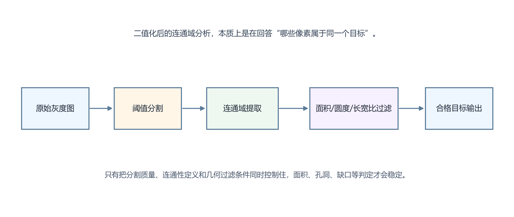

# 34. 什么是 Blob 分析？如何用它完成连通域计算、面积筛选和工业缺陷定位？

> **网络署名：LanQS** · 作者及著作权人：兰青松 · [版权说明](../copyright.md)

#### 34.1 什么是 Blob（二值连通域）？Blob 分析在工业检测中解决什么问题？

Blob 通常指二值图像中的一个连通区域，也就是一组彼此相连、与背景分开的前景像素集合。Blob 分析关注的是这些前景区域的数量、面积、位置、形状和空间关系。

它在工业里非常有用，因为很多任务本质上都是“找到一类区域并判断它是否合格”，例如缺件、孔洞、异物、印刷缺失、颗粒污染、焊点数量和连通性判断。只要前景与背景能够稳定二值分离，Blob 分析往往足够高效。

#### 34.2 连通域标记算法（两遍扫描法、Union-Find）的基本原理是什么？

两遍扫描法在第一遍遍历图像时，根据邻域关系给前景像素临时赋标签，并记录标签之间的等价关系；第二遍再把所有等价标签归并成统一编号。Union-Find 则常作为标签等价管理的数据结构，用来高效完成集合合并与查找。

从工程角度看，用户未必需要手写这套算法，但理解其原理有助于判断为何某些细小连接、边界触碰或噪声点会改变最终连通域数量。很多误判在连通域定义阶段就已经发生，后续特征筛选只是把这个结果继续放大。

#### 34.3 4连通和8连通的区别在哪里？工业检测中通常选哪种？

4 连通只把上下左右相邻像素视作连通，8 连通还把对角邻接也算作连通。二者的区别会直接影响细线、斜边、角点接触区域是否被视为一个整体。

工业检测里没有绝对统一答案，但对自然形状和一般缺陷区域，8 连通更常见，因为它对斜向结构更连贯；若任务特别强调避免对角线误连接，例如某些字符笔画分离或规则网格分析，4 连通可能更合适。关键是要让连通定义与业务目标一致。

#### 34.4 Blob 的常用特征有哪些？（面积、周长、圆形度、长宽比、重心、外接矩形、凸包）

常用特征包括面积、周长、重心坐标、最小外接矩形、长宽比、圆形度、方向角、凸包面积、孔洞数量和灰度统计等。它们分别对应不同的业务判断：面积可以排除微小噪声，长宽比可以区分细长缺陷与圆点干扰，圆形度可筛选孔洞或圆斑，重心与外接框可用于定位和抓取。

真正有效的特征选择，应围绕"合格目标与干扰最明显的差别"展开，特征过多反而可能引入不稳定边界。

#### 34.5 如何通过面积范围和形状特征筛选目标 Blob，排除干扰连通域？

最常见的方法是先用面积阈值剔除明显太小或太大的连通域，再根据长宽比、圆形度、位置范围、灰度均值或与模板区域的相对关系做二次筛选。这样可以快速把大部分噪声点、阴影碎片或背景误分离区域排除掉。

筛选规则最好按层次建立。先用稳定且物理意义明确的特征做粗筛，例如面积和位置；再用更敏感的形状特征做精筛。若一开始就依赖很复杂的组合规则，调试和维护都会变得困难。

#### 34.6 Blob 分析对二值化质量的依赖有多大？大津法（Otsu）在这里扮演什么角色？

Blob 分析对二值化质量高度敏感。只要前景断裂、背景粘连、局部阈值漂移或阴影未处理好，后续连通域数量、面积和形状都会跟着变化。换句话说，Blob 分析的瓶颈通常不在算法本身，而在二值输入的稳定性。

大津法通过最大化类间方差来自动选择全局阈值，在直方图双峰分离较好的场景下很实用。它在双峰分离较好的场景下很实用；若存在亮度渐变、局部反光或背景纹理，局部阈值或自适应预处理比单独依赖 Otsu 更有效。

#### 34.7 Blob 分析在孔洞检测、印刷缺失、异物检测等场景中如何应用？

在孔洞检测中，常把孔洞区域二值化后统计其面积、数量、圆度和位置是否落在容差范围内；在印刷缺失检测中，常把字符或标记区域与标准区域做差，再分析缺失连通域的面积和分布；在异物检测中，常把不应出现的亮点或暗点分离出来，再按面积和形状判定是否为真实异物。

这些应用虽然表面不同，底层逻辑却相似：先把目标变成可分离的连通域，再用区域特征建立业务判定。理解这条主线，读者就能理解 Blob 分析在孔洞、印刷和异物等多类任务中的通用性。。

#### 34.8 Blob 分析的主要局限是什么？（纹理背景、灰度渐变、重叠目标）

Blob 分析最怕的是前景和背景本身就难以稳定分开。面对复杂纹理背景、慢变灰度、强反光渐变、阴影拖尾或目标重叠，二值化往往会先失败，导致 Blob 特征失去意义。另一个局限是，它擅长分析区域，却不擅长理解语义。两个面积相近的区域，Blob 特征可能很像，但业务含义完全不同。

因此，Blob 分析适合做结构清楚、区域可分的任务；若目标依赖复杂纹理、上下文关系或类别语义，则需要与模板、规则或学习方法结合。

  

<strong>图34-1 Blob 分析从灰度分割到特征筛选的典型流程</strong>

图34-1 依次画出了原始灰度图、阈值分割、连通域提取、几何特征过滤和目标输出五个阶段。真正决定结果稳定性的，并不只是最后那一步面积或圆度阈值，而是前面每一步对“哪些像素属于同一个目标”的定义是否一致。若分割把背景误并入目标，后面的面积、孔洞数、长宽比都会被连带污染；若连通性定义与噪声形态不匹配，又可能把一个真实目标拆成多个碎块。读者应从这张图得到的工程判断是：Blob 分析不是单个算子的名称，而是一整套以分割质量为前提的流程。它非常适合轮廓、孔洞、缺口、颗粒计数等任务，但在灰度对比弱、粘连严重或纹理本身复杂的场景中，往往需要先补充更可靠的照明和预处理，再谈连通域判定。

---
