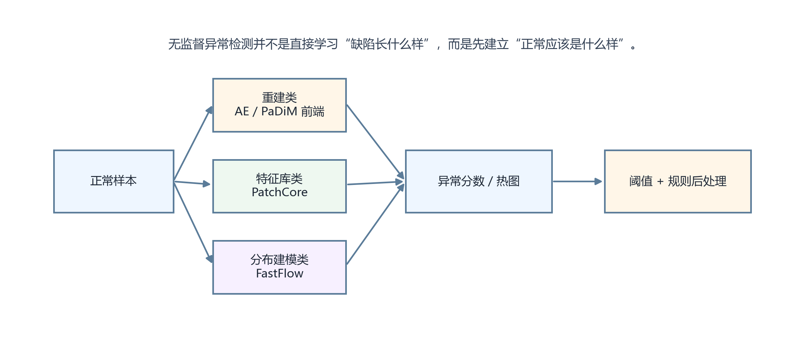

# 38. 什么是无监督异常检测（Anomaly Detection）？在没有缺陷样本的情况下如何训练工业检测模型？

> **网络署名：LanQS** · 作者及著作权人：兰青松 · [版权说明](../copyright.md)

#### 38.1 无监督异常检测要解决的核心问题是什么？它和有监督缺陷检测有什么本质区别？

无监督异常检测的核心，是在几乎没有或完全没有真实缺陷样本的情况下，只利用正常样本建立正常分布模型，再把偏离正常模式的区域判为异常。它回答的问题是这里是否偏离正常件，而不是这是什么缺陷类别。

有监督缺陷检测则依赖带标注的缺陷样本，学习明确的类别边界。两者的本质区别在于训练信息来源不同：前者主要学习正常性，后者直接学习缺陷语义。

这种设计直接回应了工业缺陷检测的样本困境：正常样本源源不断，缺陷样本稀少且形态不可预演。无监督方法只用正常样本训练；半监督方法介于两者之间，使用少量标注样本辅助。

#### 38.2 基于重建误差的方法（AutoEncoder/VAE）原理是什么？主要局限是什么？

这类方法先用正常样本训练自编码器或变分自编码器，让模型学会重建正常图像。推理时，若输入包含异常区域，模型往往无法准确重建这些局部，从而在原图与重建图的差异中暴露异常。

主要局限在于，模型有时也会把异常一并重建出来，尤其是异常结构较大或训练能力较强时，重建误差反而变小。此外，重建结果容易受纹理复杂度和背景变化影响，异常图的可分性会随纹理复杂度和背景变化波动。

#### 38.3 PatchCore 的核心思路是什么？为什么它不需要异常样本训练？

PatchCore 的思路是把正常样本在特征空间中的局部分布存成一个代表性特征库。推理时，待测图像的每个局部特征都去和正常库做最近邻比较，距离越远，越可能是异常。它不需要异常样本，因为模型学习的是正常局部通常出现在哪些特征区域。

这种方法在工业表面异常检测中表现很好，原因是很多缺陷只需与正常纹理区分即可。它的部署难点主要在特征库大小、检索效率和域外漂移控制。

具体实现上，PatchCore 使用预训练骨干网络（如 ResNet、WideResNet）提取正常图像 patch 特征，经核心集采样（coreset sampling）压缩后构建 Memory Bank。测试时对每个 patch 计算与 Memory Bank 中最近邻的距离，距离越大则异常程度越高。MVTec AD 数据集上其图像级 AUROC 通常 >99%，PRO >90%。

#### 38.4 DRAEM 的创新点是什么？它如何通过合成异常避开对真实缺陷样本的依赖？

DRAEM 的核心做法，是在正常图像上合成伪异常区域，让网络一边做异常重建或恢复，一边做异常分割。这样模型在训练中见过大量“人为制造的不正常情况”，从而学会把局部异常从正常背景中分离出来。

它避开真实缺陷样本依赖的办法，是用可控方式构造训练异常。问题在于，合成异常与真实工业缺陷之间仍可能存在分布差距，因此其泛化效果要靠具体任务验证。

#### 38.5 FastFlow 和基于归一化流的方法如何建模“正常样本的概率分布”？

归一化流方法通过可逆变换把复杂特征分布映射到一个简单已知分布，例如高斯分布。训练完成后，若某个区域特征在该正常分布下的概率很低，就可判为异常。FastFlow 属于这一思路的代表，它试图直接学习正常样本在特征空间中的概率结构。

这类方法的优点是理论上更贴近概率建模，异常分数解释性较强；难点则在于训练稳定性、模型复杂度和对场景变化的敏感性。

#### 38.6 如何评估无监督异常检测算法？AUROC 和 PRO 指标的含义和区别是什么？

AUROC 常用于衡量正常与异常样本整体可分性，它关注不同阈值下真阳性率与假阳性率的综合表现。若任务只关心整图判定是否异常，AUROC 很常见。

PRO 更关注区域级异常定位质量，尤其强调异常区域覆盖率与误报区域之间的关系。对工业表面缺陷来说，整图AUROC高不保证异常区域定位准确，很多场景需要同时看AUROC与PRO。

AUROC 值域 0.5~1.0，0.5 等同于随机猜测，1.0 为完美区分。PRO（Per-Region Overlap）计算每个连通异常区域被正确覆盖的比例取平均，对大区域和小区域错误惩罚相同。

#### 38.7 MVTec AD 数据集是什么？用它做基准测试时需要注意什么？

MVTec AD 是工业异常检测研究中最常用的公开基准数据集之一，包含多种物体与纹理类别，并提供正常样本和异常测试样本。它之所以重要，是因为很多无监督异常检测方法都以它作为比较基准。

使用它时要注意两点。第一，公开数据集的照明、采样方式和现场扰动通常比真实产线更受控，成绩高不代表现场一定同样好；第二，不同类别的异常难度差别很大，平均指标不能替代逐类分析。真正部署前，还是要用自家样本做验证。

具体来说，MVTec AD 包含 15 个类别（10 类物体如螺钉、药片、金属螺母，5 类纹理如皮革、地毯、木材），共 5354 张无缺陷训练图和 1725 张测试图，覆盖 70 余种真实工业缺陷类型，所有异常均有像素级精确标注，采用 CC BY-NC-SA 4.0 许可。使用时注意：MVTec 图像采集条件受控（照明均匀、背景干净），与产线实况有显著差距——高 MVTec 分数不直接等于现场可用。

#### 38.8 在实际工业部署中，无监督异常检测通常如何与传统阈值方法结合使用？

较常见的做法是让异常检测模型先给出异常热图或整图异常分数，再用传统阈值、Blob 分析、面积过滤和业务规则做后处理。这样可以把模型输出转换成更可控的工程判定，例如异常面积是否超过阈值、异常是否落在关键区域、是否与既知噪声模式重合。

这种组合方式的优势在于，两类方法各司其职：模型负责发现“不像正常的地方”，传统规则负责把结果变成稳定、可解释、可维护的产线判定。

  

<strong>图38-1 重建类、特征库类与分布建模类异常检测方法对比</strong>

图38-1 从左到右给出无监督异常检测的三条主流路线：重建类、特征库类与分布建模类，输入均只有正常样本。读者可据此建立选型直觉——三类方法的本质都是先定义"正常分布"，再衡量偏离程度。

> **引用出处**：MVTec AD 数据集（mvtec.com/company/research/datasets/mvtec-ad）；anomalib 开源库 PatchCore/PaDiM/DRAEM/STFPM 算法（github.com/openvinotoolkit/anomalib）。

---
