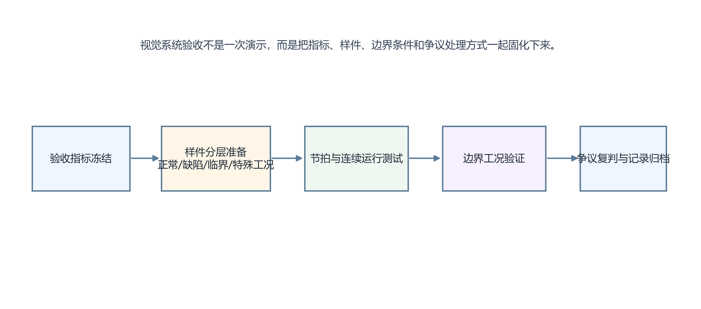

# 40. 视觉系统项目验收时，客户通常提出哪些标准？如何设计完整的量产前验收测试方案？

> **网络署名：LanQS** · 作者及著作权人：兰青松 · [版权说明](../copyright.md)

#### 40.1 视觉系统验收和实验室测试有什么本质区别？

实验室测试更侧重验证方案是否成立，验收测试则要证明系统在客户现场、实际节拍、真实样件和操作条件下可以长期稳定交付。前者强调技术可行性，后者强调工程可交付性。

因此验收关注的不只是算法准确率，还包括节拍、误检漏检、稳定性、换型、异常恢复、操作便利性和追溯记录。能在实验室跑通，不等于可以验收通过。

#### 40.2 客户通常要求哪些关键性能指标？（节拍、漏检率、误检率、重复性）

最常见的指标包括单件处理节拍、整线同步节拍、漏检率、误检率、重复定位精度、重复测量精度、连续运行稳定性和异常报警响应。对分拣系统，客户常更关心漏检率和节拍；对测量系统，重复性和 GR&R 可能更重要。

这些指标必须在项目早期就写进验收条件。若等到验收当天才临时讨论“多少算合格”，争议几乎不可避免。

#### 40.3 什么是 GR&R（量具重复性与再现性）分析？如何用它验证视觉系统的测量稳定性？

GR&R 用于分析测量系统总变差中，有多少来自设备自身重复性，有多少来自不同操作者、不同批次或不同操作条件带来的再现性差异。对视觉测量系统来说，它能帮助判断系统是“本身就不稳”，还是“对外部使用条件太敏感”。

实际操作中，通常选取若干代表性样件，由不同操作者在不同轮次重复测量，再统计方差分解结果。若视觉系统作为量具参与工艺控制，这一步往往比单次精度展示更有说服力。

#### 40.4 验收测试的样件应如何选取？（正常件、临界件、各类缺陷件的数量和比例）

样件除了标准好样件和明显坏样件，更重要的是覆盖临界样件。更重要的是覆盖临界样件，也就是最容易引发争议的边界件，例如接近公差上限、缺陷刚好接近阈值、反光最重、姿态最不稳的一类样本。

较合理的做法是按正常件、典型缺陷件、边界件和特殊工况件分层准备，并在验收前冻结样件清单和判定标准。否则一旦现场临时换样，结论就很难统一。

#### 40.5 如何设计连续运行稳定性测试？（长时间连跑、速度拉满、换班人员操作）

连续运行测试应覆盖满节拍甚至超节拍运行、长时间连跑、换班交接、反复启停和故障恢复等工况。测试目的在于观察系统在热平衡、缓存积累、网络负载变化和人工操作切换下，结果是否仍一致。

很多系统的问题只在长时间运行后才出现，例如焦点轻微漂移、通信偶发超时、光源发热衰减和日志写入堆积。若验收只看短时间演示，这些问题很容易漏掉。

#### 40.6 环境适应性测试应该覆盖哪些边界条件？（光照变化、温度、振动、换型）

环境适应性测试应覆盖外界杂光变化、温度波动、机械振动、不同操作员上手、产品换型、物料批次差异和安装位置微小扰动等边界条件。客户真正担心的，通常是系统在边界条件下是否开始不稳定。

边界条件不一定每个都做极端测试，但至少要覆盖最可能影响项目成败的那几项。对高反光检测，杂光与姿态波动通常重要；对测量项目，温度、振动和夹具重复定位可能更关键。

#### 40.7 验收过程中出现争议（客户认为漏检，供应商认为是产品问题）时如何处理？

争议处理的前提，是事先定义好金标准和责任边界。什么叫合格件，什么叫缺陷件，边界件由谁判定，系统依据哪一个标准作出结论，这些都应在验收前写清楚。否则一旦出现争议，双方会把技术问题迅速变成口径问题。

具体处理时，应优先保留原始图像、时间戳、参数版本、样件编号和现场状态记录，再按事先约定的金标准复判。没有证据链的争论，往往谁也说服不了谁。

#### 40.8 量产后如何设计定期复验机制，保证系统长期稳定运行？

量产后的复验机制通常包括周期性精度复核、标准样件回测、日志与报警分析、关键图像留存抽检、配方版本审计和硬件状态检查。这样可以在问题尚未影响大量产出前，尽早发现性能漂移。

复验最好制度化，不要等到客户投诉后才开始追查。视觉系统和其他工业设备一样，长期稳定依赖持续监控和周期性确认维持。

  

<strong>图40-1 视觉系统验收测试流程与样件分层组织方式</strong>

图40-1 将验收拆为五个连续环节：冻结指标→分层准备样件→节拍与连续运行测试→边界工况验证→争议复判与记录归档。验收的核心是事先约定口径，而非现场临时抽检。

---

## 模块三：PLC通信、实时控制与系统集成（30问）
